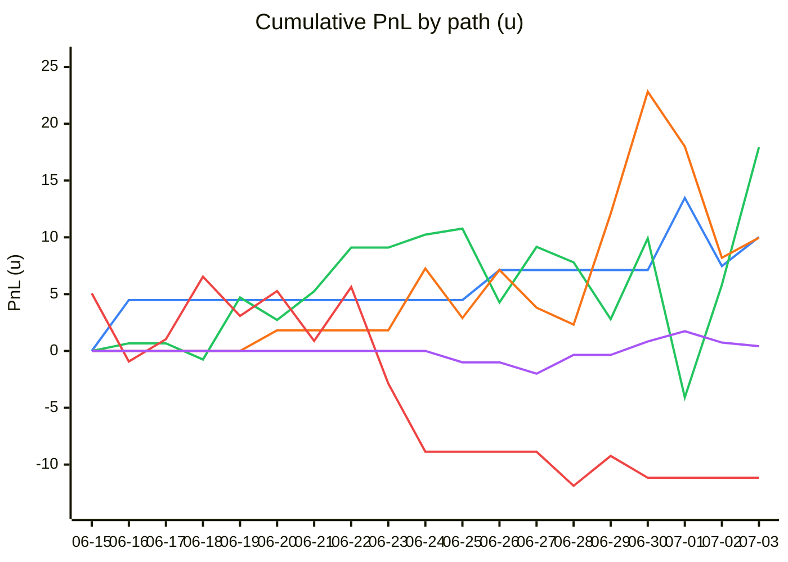
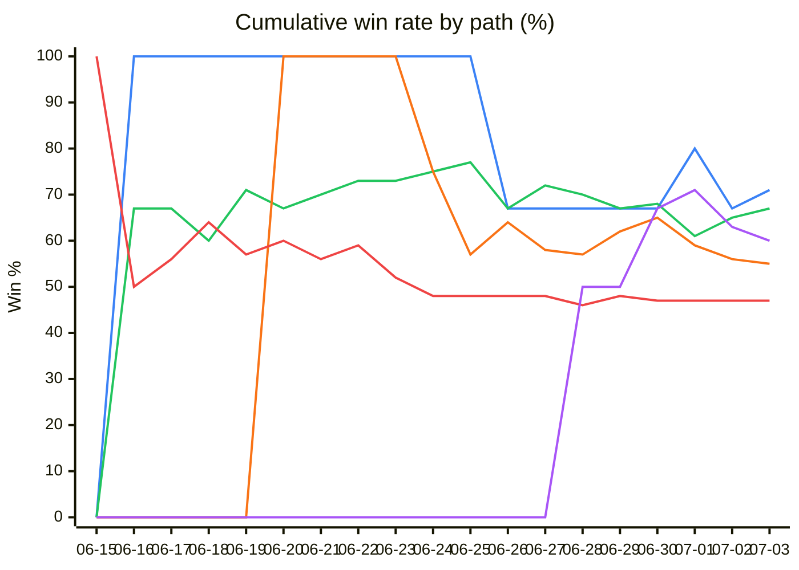
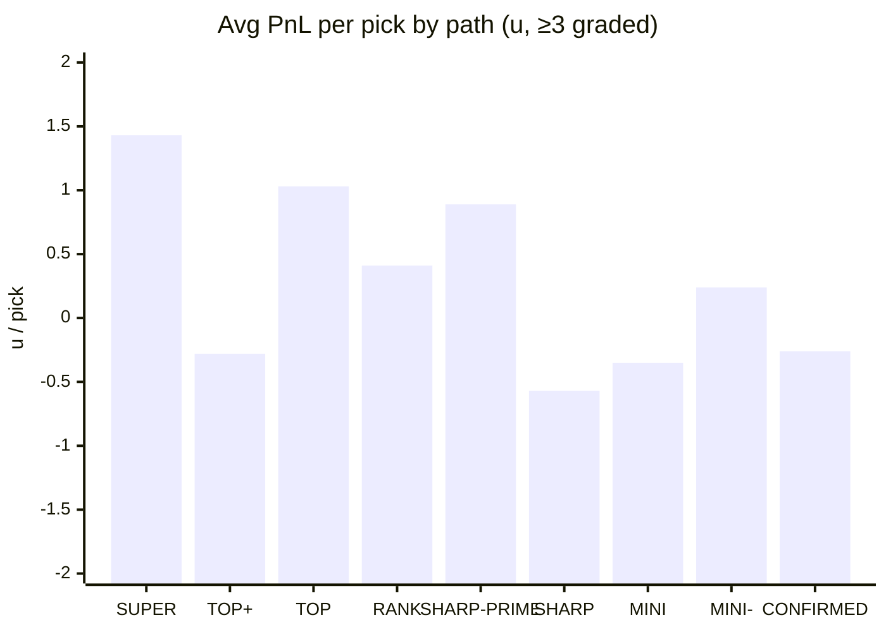
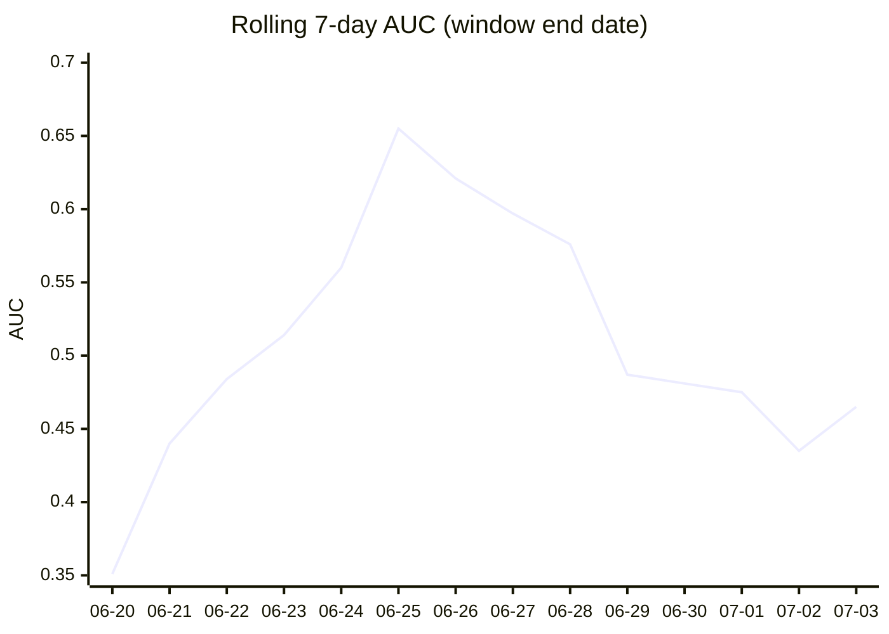
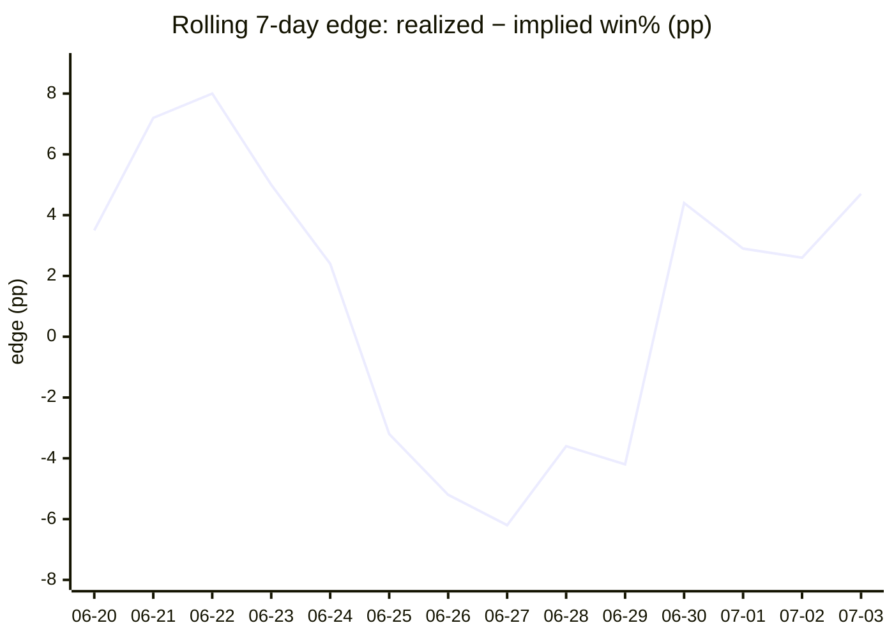

# AGS-Unified — V12 Performance Monitor

**Generated:** Saturday, July 4, 2026 at 10:10 AM ET

**Active model:** `ags-unified-v12` · **V12 went live:** 2026-06-01 · **Days live:** 34

> This report is a **CEO-grade monitor of V12 in production**. The only non-V12 section is § 2 (model version comparison), kept so you can see V12's results in the context of every prior model bump. Everything else — daily trajectory, tier scoreboard, stake calibration, mute-rule audit, wallet-quality inputs, operational health — is **strictly V12-scoped** (pick date ≥ 2026-06-01) so cron back-fill of V12 stamps onto older picks can't contaminate the production numbers.

## § 1 — Executive Summary

> 🟢 **V12 is currently WINNING.** Since going live on **2026-06-01** (34 days ago), V12 has evaluated **1044** picks, shipped **354** for real money (33.9% ship rate), and muted the other **690**. On the shipped picks V12 has gone **197-157** (55.6% win), staked **922.75u**, and returned **+47.43u** at **+5.1% ROI**.

### Snapshot

| Metric                              | Value                          |
|-------------------------------------|--------------------------------|
| Days V12 has been authoritative     |                             34 |
| Picks V12 has evaluated             |                           1044 |
| Picks SHIPPED (units > 0)           |                            354 |
| Picks MUTED (score ≤ 0, FADE)       |                            690 |
| Ship rate                           |                          33.9% |
| Live W-L                            |                        197-157 |
| Live Win %                          |                          55.6% |
| Live PnL (units)                    |                         +47.43 |
| Live ROI                            |                          +5.1% |
| Avg PnL / day                       |                         +1.39u |
| Most recent action (2026-07-06)  |            0 live, 0-0, +0.00u |

### What's working

- V12 is profitable at **5.1% ROI** across 354 live picks (+47.43u real PnL).
- Mute rule is **saving money** — the 434 muted picks would have lost -56.21u at flat 1u (-13.0% counterfactual ROI). V12 correctly rejected losers.
- V12 is generating **+1.39u/day** on average since launch.
- **NHL** is V12's strongest sport: 6 live, 5-1, 38.2% ROI, +6.30u.
- **NBA** is V12's strongest sport: 10 live, 3-7, 29.1% ROI, +2.33u.

## § 2 — Model Version Comparison (V9 → V10 → V11 → V12)

How does the latest model (**ags-unified-v12**) compare against prior versions? Picks are tagged **strictly by pick date** against the calibration-history cutover schedule below — that's the only signal that's robust to the cron back-filling v11/v12 stamps on historical picks during a transition.

### Headline performance by version

| Version | Era                  | Days | Live N | Trk | W-L    | Win %  | ROI       | PnL (u)    | per-pick | AUC   | Brier (model) | Status   |
|---------|----------------------|------|--------|-----|--------|--------|-----------|------------|----------|-------|---------------|----------|
| v9      | 05-15 → 05-22        |    7 |     60 |  12 | 32-28  |  53.3% |     -9.0% |     -10.38 |    -0.17 | 0.549 |        0.3400 | ⚪ retired |
| v10     | 05-22 → 05-25        |    3 |     62 |  14 | 30-32  |  48.4% |    -18.8% |     -19.42 |    -0.31 | 0.394 |        0.2804 | ⚪ retired |
| v11     | 05-25 → 06-01        |    7 |    111 |  22 | 61-50  |  55.0% |      2.8% |      +6.76 |    +0.06 | 0.444 |        0.2642 | ⚪ retired |
| v12     | 06-01 → present      |   34 |    354 | 434 | 197-157 |  55.6% |      5.1% |     +47.43 |    +0.13 | 0.512 |        0.2499 | 🟢 LIVE  |

### v12 vs prior versions

| Comparison         | ΔN     | ΔWin %    | ΔROI       | Δ per-pick (u)  | ΔAUC     | ΔBrier     | Verdict |
|--------------------|--------|-----------|------------|-----------------|----------|------------|---------|
| v12 − v9           | +  294 |    +2.3pp |    +14.1pp |          +0.307 |   -0.037 |    +0.0900 | 🟡 mixed |
| v12 − v10          | +  292 |    +7.3pp |    +23.9pp |          +0.447 |   +0.118 |    +0.0304 | 🟢 better |
| v12 − v11          | +  243 |    +0.7pp |     +2.3pp |          +0.073 |   +0.068 |    +0.0143 | 🟢 better |

> **ΔBrier > 0** means the newer model's Brier is LOWER (better probability calibration). All other Δ columns: positive = newer model is better. Verdict requires the newer model to dominate on 3 of 4 metrics (ROI / Win% / AUC / Brier).

> **On v12's Brier.** The v12 score is a bounded `[-1, +1]` wallet-quality differential, not a probability. To make Brier comparable to the older logit models, the score is mapped to a win probability via an **in-sample 1-D logistic calibration** (`p = sigmoid(a + b·score)`). Because it's fit on the same picks it scores, treat it as a mildly optimistic floor on true calibration error — the per-staking-book breakdown in § 9 is the more actionable read.

### Per-sport win rate × version

| Version | MLB            | NBA            | NHL            | SOC            | All           |
|---------|----------------|----------------|----------------|----------------|---------------|
| v9      | 40n 55.0% -3%  | 14n 50.0% -7%  | 6n 50.0% -46%  | —              | 60n 53.3% -9% |
| v10     | 50n 52.0% -4%  | 7n 14.3% -91%  | 5n 60.0% -9%   | —              | 62n 48.4% -19% |
| v11     | 96n 56.3% +4%  | 7n 71.4% +33%  | 8n 25.0% -59%  | —              | 111n 55.0% +3% |
| v12     | 313n 54.6% +2% | 10n 30.0% +29% | 6n 83.3% +38%  | 25n 72.0% +24% | 354n 55.6% +5% |

### Per-tier ROI × version (monotonicity check across model history)

| Version | ELITE         | PREMIUM       | LOCK          | LEAN          | WEAK          | Monotonic?    |
|---------|---------------|---------------|---------------|---------------|---------------|---------------|
| v9      | 10n -25%      | 6n +10%       | 13n -32%      | 16n +24%      | 14n -6%       | 🟡 partial (0) |
| v10     | 8n -13%       | 5n -69%       | 13n -25%      | 27n +4%       | 8n -1%        | 🟡 partial (0) |
| v11     | 22n +3%       | 26n -6%       | 24n +9%       | 25n +10%      | 13n +22%      | 🟡 partial (2) |
| v12     | 79n -4%       | 104n +7%      | 72n +22%      | 46n +10%      | 48n +1%       | 🟡 partial (0) |

> Monotonicity score on tier-ROI vector (ELITE → WEAK). Fully sorted (each tier earns LESS than the one above) = -3 for 4-tier samples / -4 for full ladder. Fully inverted = +3/+4. A NEW model that flips the ladder from inverted → monotonic is the strongest evidence the redesign worked.

## § 3 — What V12 Actually Is (Plain English)

Every prior AGS-Unified model (v9 → v11) was a **logistic regression** on a handful of hand-crafted features (count of sharp wallets FOR vs AGAINST, sum of sharp-wallet sizing ratios, leaderboard rank deltas, etc.). The score was a log-odds; ladder tiers were calibrated quintiles of that score; sizing was the v11 base × tier multiplier (2× / 1.5× / 1.1× / 0.5× / 0.2× / 0×).

**V12 is fundamentally different.** It's a **single feature** that summarises the *quality difference* between the sharp money on the FOR side and the sharp money on the AGAINST side, then maps that difference to an absolute stake.

Per pick:

1. **Score every wallet on each side** with a quality formula `Q = tierWeight × cappedROI × boundedSizeRatio × nReliab`. Sharper wallets (better historical ROI, higher leaderboard tier, larger reliable sample) get bigger Qs.
2. **Take the mean Q on each side.** `forMean` = average wallet quality FOR the pick; `againstMean` = average AGAINST.
3. **The V12 score is the bounded ratio of the difference:** `score = (forMean − againstMean) / max(|forMean|, |againstMean|, ε)`. Bounded to [-1, +1]. Positive = sharp money is meaningfully better-quality on the FOR side. Negative or zero = it isn't.

Three hard rules built on that score:

- **Mute rule:** if score ≤ 0, the pick is FADE — **zero stake, no exception**. This replaces v11's calibrated-quintile q20 floor.
- **Absolute ladder (no multiplier):** score band → fixed units. **ELITE 5.00u · PREMIUM 3.00u · LOCK 1.00u · LEAN 0.50u · WEAK 0.25u · FADE 0.00u.** The stake is the answer, not a multiplier on a per-market base.
- **Odds cap:** long underdogs at +100 / +151 / +200 thresholds are capped down to 2.5 / 1.5 / 1.0u respectively, regardless of tier. Prevents one bad +200 ELITE from blowing up the bankroll.

**Why this matters for monitoring.** V12 has no multi-feature attribution to audit — there's just **one** number, and either the wallet-quality formula is identifying sharper sides than the market is or it isn't. The sections below tell you exactly that, broken down by tier, sport, market, score band, and time.

## § 4 — V12 Daily Production Scoreboard

Day-by-day production since V12 went live. **Evaluated** = picks V12 scored that day. **Live** = picks shipped at units > 0 (real money). **Muted** = picks V12 rejected (score ≤ 0, FADE tier). **Cumulative PnL** is the running total of live unit profit/loss since launch.

| Date       | Evaluated | Live | Muted | W-L (live) | Win %  | Stake (u) | PnL (u)    | ROI       | Cum PnL    |
|------------|-----------|------|-------|------------|--------|-----------|------------|-----------|------------|
| 2026-06-01 |        16 |    8 |     4 | 4-4        |  50.0% |     16.25 |      +2.14 |     13.2% |      +2.14 |
| 2026-06-02 |        24 |   10 |    10 | 4-6        |  40.0% |     19.75 |      +1.95 |      9.9% |      +4.09 |
| 2026-06-03 |        31 |   19 |     5 | 11-8       |  57.9% |     36.25 |      +0.82 |      2.3% |      +4.91 |
| 2026-06-04 |        19 |   13 |     5 | 7-6        |  53.8% |     26.00 |      -2.91 |    -11.2% |      +2.00 |
| 2026-06-05 |        23 |   18 |     1 | 12-6       |  66.7% |     31.25 |     +11.21 |     35.9% |     +13.21 |
| 2026-06-06 |        25 |   14 |     9 | 7-7        |  50.0% |     37.75 |      -1.75 |     -4.6% |     +11.46 |
| 2026-06-07 |        38 |   25 |     6 | 15-10      |  60.0% |     45.50 |      +3.55 |      7.8% |     +15.01 |
| 2026-06-08 |        19 |   12 |     5 | 7-5        |  58.3% |     28.75 |     +10.02 |     34.9% |     +25.03 |
| 2026-06-09 |        25 |   21 |     4 | 10-11      |  47.6% |     45.00 |     +14.08 |     31.3% |     +39.11 |
| 2026-06-10 |        31 |   23 |     5 | 11-12      |  47.8% |     55.75 |     -10.06 |    -18.0% |     +29.05 |
| 2026-06-11 |        17 |    7 |     4 | 4-3        |  57.1% |     13.25 |      -1.17 |     -8.8% |     +27.88 |
| 2026-06-12 |        26 |   16 |     7 | 9-7        |  56.3% |     26.50 |      +6.06 |     22.9% |     +33.94 |
| 2026-06-13 |        30 |   19 |     7 | 11-8       |  57.9% |     43.50 |      +1.81 |      4.2% |     +35.75 |
| 2026-06-14 |        32 |   13 |    15 | 6-7        |  46.2% |     30.25 |     -16.07 |    -53.1% |     +19.68 |
| 2026-06-15 |        29 |    2 |    17 | 2-0        | 100.0% |      6.00 |      +5.07 |     84.5% |     +24.75 |
| 2026-06-16 |        36 |    6 |    22 | 3-3        |  50.0% |     24.00 |      -0.85 |     -3.5% |     +23.90 |
| 2026-06-17 |        37 |    5 |    24 | 3-2        |  60.0% |     14.50 |      +1.96 |     13.5% |     +25.86 |
| 2026-06-18 |        21 |    4 |    11 | 3-1        |  75.0% |     12.50 |      +4.09 |     32.7% |     +29.95 |
| 2026-06-19 |        36 |    5 |    23 | 3-2        |  60.0% |     17.00 |      +2.00 |     11.8% |     +31.95 |
| 2026-06-20 |        20 |    4 |    15 | 3-1        |  75.0% |     13.00 |      +2.03 |     15.6% |     +33.98 |
| 2026-06-21 |        38 |    5 |    23 | 3-2        |  60.0% |     12.50 |      -1.30 |    -10.4% |     +32.68 |
| 2026-06-22 |        32 |    5 |    21 | 4-1        |  80.0% |     16.00 |      +8.60 |     53.8% |     +41.28 |
| 2026-06-23 |        36 |    3 |    29 | 0-3        |   0.0% |      8.50 |      -8.50 |   -100.0% |     +32.78 |
| 2026-06-24 |        46 |    6 |    26 | 3-3        |  50.0% |     22.00 |      +0.58 |      2.6% |     +33.36 |
| 2026-06-25 |        37 |    5 |    15 | 2-3        |  40.0% |     17.00 |      -4.83 |    -28.4% |     +28.53 |
| 2026-06-26 |        36 |    8 |    18 | 4-4        |  50.0% |     27.50 |      +0.37 |      1.3% |     +28.90 |
| 2026-06-27 |        35 |   12 |    16 | 7-5        |  58.3% |     45.00 |      +0.57 |      1.3% |     +29.47 |
| 2026-06-28 |        41 |    9 |    18 | 5-4        |  55.6% |     30.00 |      -4.20 |    -14.0% |     +25.27 |
| 2026-06-29 |        36 |    5 |    16 | 4-1        |  80.0% |     20.00 |      +7.40 |     37.0% |     +32.67 |
| 2026-06-30 |        48 |   17 |    14 | 12-5       |  70.6% |     56.00 |     +17.10 |     30.5% |     +49.77 |
| 2026-07-01 |        41 |   12 |    15 | 5-7        |  41.7% |     40.50 |     -11.56 |    -28.5% |     +38.21 |
| 2026-07-02 |        40 |   11 |    13 | 5-6        |  45.5% |     38.50 |      -6.89 |    -17.9% |     +31.32 |
| 2026-07-03 |        31 |   12 |    11 | 8-4        |  66.7% |     46.50 |     +16.11 |     34.6% |     +47.43 |
| 2026-07-04 |         7 |    0 |     0 | 0-0        |      — |      0.00 |      +0.00 |         — |     +47.43 |
| 2026-07-05 |         3 |    0 |     0 | 0-0        |      — |      0.00 |      +0.00 |         — |     +47.43 |
| 2026-07-06 |         2 |    0 |     0 | 0-0        |      — |      0.00 |      +0.00 |         — |     +47.43 |

> **Bottom line.** 34 days live, 354 live picks shipped, **+47.43u total PnL** at **+5.1% ROI**, averaging **+1.39u per day**.

## § 5 — V12 By Tier (Where The Money Comes From)

V12 buckets every shipped pick into a tier (ELITE → WEAK) based on the score band, then stakes an absolute number of units per the ladder. **If the model is working, ELITE picks should out-earn PREMIUM, which should out-earn LOCK, and so on** — the ladder is V12's bet that higher scores deserve more capital.

**Expected** is the ladder target before any odds-cap. **Avg stake actual** is what was actually staked (lower on positive odds because `oddsCap` clamps long underdogs). **Drift** = actual − expected. If Drift is materially negative on negative-odds picks, that's a sizing pipeline bug.

| Tier     | Ladder | N   | W-L    | Win %  | Avg V12 score | Expected | Avg stake actual | Drift  | Total Stake | PnL (u)    | ROI       |
|----------|--------|-----|--------|--------|---------------|----------|------------------|--------|-------------|------------|-----------|
| ELITE    |  5.00u | 116 | 44-35  |  55.7% |        +0.989 |    5.00u |            4.03u | -0.97u |      318.50 |     -12.65 |     -4.0% |
| PREMIUM  |  3.00u | 174 | 60-44  |  57.7% |        +0.971 |    3.00u |            3.19u | +0.19u |      332.00 |     +22.70 |      6.8% |
| LOCK     |  1.00u | 117 | 37-35  |  51.4% |        +0.939 |    1.00u |            1.71u | +0.71u |      123.00 |     +26.61 |     21.6% |
| LEAN     |  0.50u |  88 | 29-17  |  63.0% |        +0.842 |    0.50u |            1.55u | +1.05u |       71.50 |      +7.37 |     10.3% |
| WEAK     |  0.25u | 103 | 24-24  |  50.0% |        +0.432 |    0.25u |            1.48u | +1.23u |       71.00 |      +0.58 |      0.8% |
| FADE     |  0.00u | 184 | 0-0    |      — |        -0.180 |    0.00u |                — |      — |        0.00 |      +0.00 |         — |

> **Ladder monotonicity** (positive tiers ELITE → WEAK only). ROI score `0` 🟡 partial · Win-rate score `0` 🟡 partial. **Partial — the ladder is in the right direction overall but has rough spots. Watch a few more days before reacting.**

### v12abc — By Stake Tier (HC margin + 2-for-0 rescue + proven-$ overlay)

Post-cutover picks size off the **HC margin** — SUPER (margin 2 · 6u), TOP (margin 1 · 4u), MINI (mini-HC 1.0–1.5× · 3u), CONFIRMED (margin 3+ · 1u) — **plus** the **RANK (2-for-0)** wallet-rescue path at **4u**. From **2026-06-26** the **v12abc proven-$ overlay** (internal stats: backer `positions.dollarRoi` + featured `picks.wr`) adds: **SHARP / SHARP-PRIME** ($-rescue of HC-muted picks at 3u / 4u when ≥2 sharps back it incl. a proven-money winner and mean win-rate ≥ 50 / 55), **TOP+** (HC-1 boosted 4u → 5u when a proven-$ backer is present), and **MINI-** (MINI cut 3u → 1u when no proven-$ backer is on it). Together these paths ARE the v12abc staked book. **MONITORING** (non-HC or WEAK-tier HC, no proven-$ rescue) is tracked at **0u** and excluded from the staked record/ROI below.

| Tier (paths)              | Units | N   | W-L    | Win %  | Total Stake | PnL (u)    | ROI       |
|---------------------------|-------|-----|--------|--------|-------------|------------|-----------|
| MAX PLAY (SUPER)          |    6u |   7 | 5-2    |  71.4% |       34.00 |     +10.02 |     29.5% |
| TOP PICK (TOP+/TOP)       |  4-5u |  39 | 26-13  |  66.7% |      162.00 |     +17.93 |     11.1% |
| SHARP PLAY (RANK/SHARP-PRIME/SHARP) |  3-4u |  47 | 26-21  |  55.3% |      167.00 |      +9.97 |      6.0% |
| STRONG (MINI)             |    3u |  32 | 15-17  |  46.9% |       93.00 |     -11.16 |    -12.0% |
| LEAN (CONFIRMED/MINI-)    |    1u |  10 | 6-4    |  60.0% |       10.00 |      +0.42 |      4.2% |
| **STAKED TOTAL** |     — | 135 | 78-57  |  57.8% |      466.00 |     +27.18 |     +5.8% |

#### Granular — by individual staking path

| Path                  | Key         | Units | N   | W-L    | Win %  | Total Stake | PnL (u)    | ROI       |
|-----------------------|-------------|-------|-----|--------|--------|-------------|------------|-----------|
| HC-2 (model max)      | SUPER       |    6u |   7 | 5-2    |  71.4% |       34.00 |     +10.02 |     29.5% |
| HC-1 + $-boost        | TOP+        |    5u |  17 | 9-8    |  52.9% |       80.00 |      -4.71 |     -5.9% |
| HC-1 (model)          | TOP         |    4u |  22 | 17-5   |  77.3% |       82.00 |     +22.64 |     27.6% |
| 2-for-0 rescue        | RANK        |    4u |  30 | 18-12  |  60.0% |      118.00 |     +12.32 |     10.4% |
| proven-$ prime        | SHARP-PRIME |    4u |   5 | 3-2    |  60.0% |       17.50 |      +4.47 |     25.5% |
| proven-$ consensus    | SHARP       |    3u |  12 | 5-7    |  41.7% |       31.50 |      -6.82 |    -21.7% |
| mini-HC (gate-pass)   | MINI        |    3u |  32 | 15-17  |  46.9% |       93.00 |     -11.16 |    -12.0% |
| mini gate-cut         | MINI-       |    1u |   6 | 4-2    |  66.7% |        6.00 |      +1.44 |     24.0% |
| margin 3+             | CONFIRMED   |    1u |   4 | 2-2    |  50.0% |        4.00 |      -1.02 |    -25.5% |

> **MONITORING volume:** 249 picks tracked at 0u (would-be 112-137, 45.0% win). Shown to users for context; **not** part of the staked record, units, or ROI.

### § 5b — Path Trajectory & Stake-Size Monitor (win% & PnL over time)

**This is the over-time stake-size monitor.** Two charts, one line per staking tier: **cumulative PnL (units)** and **cumulative win rate (%)** across the live timeline. Read the PnL chart for "is this path making money at its current size, and is the slope still up?" — a line sloping *down* is over-staked for what it's returning. Read the win-rate chart for "is its hit-rate holding or decaying?" Pair this with the point-in-time over/under verdicts in § 7. Only tiers with graded action on ≥2 distinct days are charted.

**Lines:** 🔵 MAX PLAY (5-2, +10.02u)  ·  🟢 TOP PICK (26-13, +17.93u)  ·  🟠 SHARP PLAY (26-21, +9.97u)  ·  🔴 STRONG (15-17, -11.16u)  ·  🟣 LEAN (6-4, +0.42u)

### Sizing pipeline integrity

🟡 **359 shipped picks differ from the legacy score-ladder target by > ±0.05u.** Expected once the HC-margin/v12abc ladder diverges from the old score-band ladder — this is informational, not a bug. Watch for a sudden spike (would indicate a real `unitsFromAgsV12` regression in `syncPickStateAuthoritative.js`).

## § 5a — RANK-RESCUE Slice (2-for-0 wallet path · v12ab book)

> **What this is.** `v12ab` = the v12a book (HC-margin sizing) **plus** the RANK-RESCUE staking path that went live **2026-06-21**. The rule: a v12-shipped pick (score > 0) that the HC sizer mutes to 0u is staked at **4u** when its FOR side is **2-for-0** — ≥2 eligible whitelist wallets backing (CONFIRMED/FLAT/WR50 with ≥8 settled in-sport picks) and 0 against. It **only rescues muted picks**; it never up-sizes a pick the HC ladder already staked.

### (B) Reconstruction over the V12 era (2026-06-01 → today)

> Re-derived from frozen `walletDetails` + **current** wallet profiles. Eligibility uses today's settled-pick counts, so this is a **mildly optimistic projection** (a wallet at ≥8 picks now may have had fewer at pick time). Live-stamped numbers in (A) are the ground truth.

| Bucket | Picks | W-L | Win % | Stake | PnL | ROI | Per day |
|--------|------:|:---:|:-----:|------:|----:|----:|--------:|
| RANK-RESCUE (HC-muted → 4u) | 56 | 34-22 | 60.7% | 224u | +32.12u | +14.3% | 1.65 |

**2-for-0 picks the HC ladder ALREADY staked (NOT rescued — no hammer): 47** (32-15). These are left at their HC size — the slice adds no edge inside the HC book.

#### RANK-RESCUE by sport (reconstructed)

| Sport | Picks | W-L | Win % | PnL @4u | ROI |
|-------|------:|:---:|:-----:|------:|----:|
| MLB | 52 | 33-19 | 63.5% | +35.52u | +17.1% |
| NBA | 1 | 0-1 | 0.0% | -4.00u | -100.0% |
| NHL | 2 | 1-1 | 50.0% | +4.60u | +57.5% |
| SOC | 1 | 0-1 | 0.0% | -4.00u | -100.0% |

### (A) Live stamped RANK picks (ground truth — populates going forward)

| Picks | W-L | Win % | Stake | PnL | ROI |
|------:|:---:|:-----:|------:|----:|----:|
| 30 | 18-12 | 60.0% | 118u | +12.32u | +10.4% |

| Date | Sport | Matchup | Side | Odds | Result | PnL |
|------|-------|---------|------|-----:|:------:|----:|
| 2026-07-03 | MLB | Tampa Bay Rays@Houston Astros | Under 9 | -109 | WIN | +3.67u |
| 2026-07-03 | MLB | Milwaukee Brewers@Arizona Diamondbacks | Over 9.5 | -111 | WIN | +3.60u |
| 2026-07-02 | MLB | Pittsburgh Pirates@Philadelphia Phillies | Over 9.5 | -110 | LOSS | -4.00u |
| 2026-07-02 | MLB | Cincinnati Reds@Milwaukee Brewers | Under 6.5 | -103 | LOSS | -4.00u |
| 2026-07-02 | MLB | Miami Marlins@Colorado Rockies | Miami Marlins | -135 | LOSS | -4.00u |
| 2026-07-01 | MLB | Washington Nationals@Boston Red Sox | Under 9.5 | -103 | LOSS | -4.00u |
| 2026-07-01 | MLB | Minnesota Twins@Houston Astros | Minnesota Twins | 122 | WIN | +4.88u |
| 2026-06-30 | MLB | St. Louis Cardinals@Atlanta Braves | St. Louis Cardinals | -163 | WIN | +2.45u |
| 2026-06-30 | SOC | Norway@Côte d'Ivoire | Norway | 115 | WIN | +4.60u |
| 2026-06-30 | MLB | Texas Rangers@Cleveland Guardians | Cleveland Guardians | 110 | LOSS | -4.00u |
| 2026-06-30 | MLB | Chicago White Sox@Baltimore Orioles | Chicago White Sox | 125 | WIN | +5.00u |
| 2026-06-29 | MLB | San Francisco Giants@Arizona Diamondbacks | Arizona Diamondbacks | -131 | WIN | +3.05u |
| 2026-06-28 | MLB | New York Yankees@Boston Red Sox | Under 8 | -108 | LOSS | -4.00u |
| 2026-06-28 | MLB | Cincinnati Reds@Pittsburgh Pirates | Under 9.5 | 100 | LOSS | -4.00u |
| 2026-06-28 | MLB | Miami Marlins@St. Louis Cardinals | Miami Marlins | -190 | WIN | +2.11u |
| 2026-06-28 | MLB | Texas Rangers@Toronto Blue Jays | Texas Rangers | 110 | WIN | +4.40u |
| 2026-06-27 | MLB | Houston Astros@Detroit Tigers | Under 8.5 | -107 | LOSS | -4.00u |
| 2026-06-27 | MLB | Miami Marlins@St. Louis Cardinals | Miami Marlins | -175 | WIN | +2.29u |
| 2026-06-27 | MLB | Texas Rangers@Toronto Blue Jays | Toronto Blue Jays | -184 | LOSS | -4.00u |
| 2026-06-27 | MLB | Cincinnati Reds@Pittsburgh Pirates | Cincinnati Reds | -110 | WIN | +3.64u |
| 2026-06-26 | SOC | France@Norway | France | -250 | WIN | +1.60u |
| 2026-06-26 | SOC | Belgium@New Zealand | Belgium | -500 | WIN | +0.80u |
| 2026-06-26 | MLB | Atlanta Braves@San Francisco Giants | Atlanta Braves | -120 | WIN | +3.33u |
| 2026-06-25 | MLB | Houston Astros@Detroit Tigers | Under 9.5 | -110 | WIN | +3.64u |
| 2026-06-25 | MLB | New York Yankees@Boston Red Sox | New York Yankees | 114 | LOSS | -4.00u |
| 2026-06-25 | SOC | United States@Türkiye | United States | 105 | LOSS | -4.00u |
| 2026-06-24 | MLB | Seattle Mariners@Pittsburgh Pirates | Under 7.5 | -109 | LOSS | -4.00u |
| 2026-06-24 | MLB | Boston Red Sox@Colorado Rockies | Over 10.5 | -110 | WIN | +3.64u |
| 2026-06-24 | MLB | Boston Red Sox@Colorado Rockies | Colorado Rockies | 145 | WIN | +5.80u |
| 2026-06-20 | MLB | Milwaukee Brewers@Atlanta Braves | Under 7.5 | -110 | WIN | +1.82u |

### Incremental impact

> RANK-RESCUE sits **on top of the v12a HC book** — it stakes 4u on picks the HC ladder would mute (0u), so every rescue is net-new volume, never an up-size. Reconstruction: **+1.65 picks/day** (56 over 34 days) at **+14.3% ROI** / **+32.12u**, pulled from the muted pool — so no existing HC pick's size or grade changes. (The § 1 / § 4–5 headline book still reflects historical score-ladder sizing for picks shipped before v12a; only NEW picks size under v12a + RANK.)

## § 6 — V12 By Sport & Market (Where The Edge Is)

V12 finds different amounts of edge in different sports and bet types. This grid shows live performance per sport × market cell. Each cell: `N · Win% · ROI` over LIVE shipped picks (units > 0).

| Sport | ML                     | SPREAD                 | TOTAL                  | All                    |
|-------|------------------------|------------------------|------------------------|------------------------|
| MLB   | 171n · 55.0% · +7.1%   | 29n · 55.2% · -9.1%    | 113n · 54.0% · -0.4%   | 313n · 54.6% · +2.4%   |
| NBA   | 5n · 0.0% · -100.0%    | 3n · 66.7% · +78.9%    | 2n · 50.0% · -60.8%    | 10n · 30.0% · +29.1%   |
| NHL   | 2n · 100.0% · +76.0%   | 1n · 100.0% · +215.0%  | 3n · 66.7% · +25.1%    | 6n · 83.3% · +38.2%    |
| SOC   | 25n · 72.0% · +24.0%   | —                      | —                      | 25n · 72.0% · +24.0%   |
| **All** | **203n · 56.2% · +9.7%** | **33n · 57.6% · -0.6%** | **118n · 54.2% · +0.4%** | **354n · 55.6% · +5.1%** |

> **V12's strongest sub-market:** NBA SPREAD — 3 live, 2-1, +78.9% ROI, +4.34u PnL.

## § 7 — Stake Calibration (are any paths over- or under-sized?)

Each path ships at a **fixed unit size**. This section asks the sizing question directly: **for the units we're risking on each path, is the realized PnL justifying that size?** A path staked at 6u that loses money is far more dangerous than a 1u path with the same win-rate, because every loss costs 6× as much. The read is simple:

- **Avg PnL / pick** is the single most important column — it's the average units won or lost *every time that path fires*, already accounting for both win-rate and stake size. Negative = that path is bleeding at its current size.
- **Recent vs all-time ROI** (last 7 days) is the over-time monitor: a path whose recent ROI is collapsing below its all-time ROI is degrading *now*, before the cumulative line in § 5b bends.
- **Verdict** flags paths to cut (over-sized + losing) or paths with room to grow (small size + strongly earning).

| Path                  | Units | N   | W-L    | Win %  | ROI       | PnL (u)    | Avg PnL/pick | Recent ROI (7d) | Verdict                 |
|-----------------------|-------|-----|--------|--------|-----------|------------|--------------|-----------------|-------------------------|
| HC-2 (model max)      |    6u |   7 | 5-2    |  71.4% |    +29.5% |     +10.02 |       +1.43u |          +19.8% | 🟢 earning — size OK    |
| HC-1 + $-boost        |    5u |  17 | 9-8    |  52.9% |     -5.9% |      -4.71 |       -0.28u |           -5.9% | 🟡 ~break-even          |
| HC-1 (model)          |    4u |  22 | 17-5   |  77.3% |    +27.6% |     +22.64 |       +1.03u |          +36.0% | 🟢 earning — size OK    |
| 2-for-0 rescue        |    4u |  30 | 18-12  |  60.0% |    +10.4% |     +12.32 |       +0.41u |          +10.2% | 🟢 earning — size OK    |
| proven-$ prime        |    4u |   5 | 3-2    |  60.0% |    +25.5% |      +4.47 |       +0.89u |          +25.5% | ⚪ thin — hold           |
| proven-$ consensus    |    3u |  12 | 5-7    |  41.7% |    -21.7% |      -6.82 |       -0.57u |          -21.7% | 🔴 over-sized — cut     |
| mini-HC (gate-pass)   |    3u |  32 | 15-17  |  46.9% |    -12.0% |     -11.16 |       -0.35u |          -17.6% | 🟠 bleeding — watch     |
| mini gate-cut         |    1u |   6 | 4-2    |  66.7% |    +24.0% |      +1.44 |       +0.24u |          +24.0% | 🟢 under-sized — room   |
| margin 3+             |    1u |   4 | 2-2    |  50.0% |    -25.5% |      -1.02 |       -0.26u |           -0.7% | ⚪ thin — hold           |

Avg PnL per pick by path — bars below 0 are paths losing money at their current stake:

> **Over-time view:** § 5b charts each tier's cumulative PnL and win% across the full timeline — use it to confirm whether a "bleeding" verdict here is a genuine downtrend or just a rough patch. A path that's over-sized **and** trending down in § 5b is the one to resize first.

## § 8 — V12 Mute Rule: Saving Money or Throwing Away Edge?

V12 muted **434** graded picks (any pick with score ≤ 0). This sub-section asks the most important question about V12: **were those rejections correct?**

The audit is a counterfactual — if every muted pick had been shipped at a flat 1-unit stake (same risk per pick), what would the bottom line look like? If muting saved money, V12's rule is justified. If muting cost money, V12 is throwing away edge and the wallet-quality threshold should be loosened.

| Metric                              | Value                |
|-------------------------------------|----------------------|
| Muted picks (graded)                |                  434 |
| Muted W-L                           |              201-233 |
| Muted Win %                         |                46.3% |
| Counterfactual PnL at flat 1u       |               -56.21 |
| Counterfactual ROI at flat 1u       |               -13.0% |

### Verdict

🟢 **THE MUTE RULE IS SAVING MONEY.** The picks V12 rejected would have lost **-56.21u** at a flat 1u stake — a counterfactual ROI of **-13.0%**. V12 is correctly identifying losers and refusing to ship them. **Keep the mute rule as-is.**

## § 9 — v12abc AUC / Brier (by staking book)

The score that drives every pick is the same V12 number; the **a / ab / abc** books differ only in *which picks they choose to stake*. This panel asks, for the picks each book actually ships: does the V12 score still **discriminate** winners from losers (AUC), and is it **calibrated** (Brier)? If a newer overlay (ab adds RANK; abc adds the proven-$ rescues) drags AUC/Brier down, it's buying volume at the cost of signal quality.

- **AUC** — P(score of a winner > score of a loser). 0.50 = coin flip · 0.55 = real edge · 0.60+ = strong.
- **Brier (cal)** — mean squared error of a win probability obtained by an **in-sample** logistic calibration of the score. Lower = better; 0.25 = the coin-flip prior.
- **Brier (market)** — same metric on the closing-odds implied probability, as a benchmark. **Δ = market − model**; positive means V12 is better-calibrated than the market.

| Book                         | Graded N | W-L    | Win %  | AUC    | Brier (cal) | Brier (market) | Δ vs market |
|------------------------------|----------|--------|--------|--------|-------------|----------------|-------------|
| v12a (HC margin core)        |       88 | 52-36  |  59.1% |  0.487 |      0.2416 |         0.2360 |     -0.0056 |
| v12ab (+ RANK 2-for-0)       |      118 | 70-48  |  59.3% |  0.450 |      0.2411 |         0.2366 |     -0.0045 |
| v12abc (+ proven-$ rescue)   |      135 | 78-57  |  57.8% |  0.486 |      0.2437 |         0.2395 |     -0.0043 |

> 🟢 **The overlays are signal-neutral** — AUC 0.487 (v12a) → 0.486 (v12abc), Δ = -0.002. They add volume without degrading how well the score separates winners from losers.

> ⚠ **In-sample caveat.** Brier (cal) uses a logistic fit on the same picks it scores, so it's a mildly optimistic floor on true calibration error. AUC is rank-based and needs no fit. Track both week-over-week — a rising Brier or an AUC drifting toward 0.50 is the early warning that the score is decaying before ROI follows.

## § 10 — V12 Wallet-Quality Inputs (What V12 Is "Seeing")

V12's score is the bounded difference of two averages: the mean wallet quality FOR the pick minus the mean wallet quality AGAINST it. Surfacing those raw inputs lets you see whether V12 is "looking at" the right things: does V12 ship picks because the FOR-side wallets are genuinely sharper, or because the AGAINST-side has no wallets at all (which can artificially inflate the score)?

### Average per-side wallet quality (across 764 V12-era picks)

| Side    | Avg Q (mean)       | Avg # contributing wallets |
|---------|--------------------|----------------------------|
| FOR     |            +20.923 |                        2.2 |
| AGAINST |             +3.517 |                        1.2 |

### One-sided wallet support (high-variance picks)

- **51** picks had ≥ 3 FOR-side wallets but **zero** AGAINST-side wallets. V12 score is high here because the AGAINST mean defaults to 0, not because of genuine quality contrast.
- **2** picks had ≥ 3 AGAINST-side wallets but **zero** FOR-side wallets. Mirror case.

> One-sided FOR picks have gone **21-17** (55.3% win) at **-9.5% ROI**. If this materially underperforms the all-picks average, the one-sided trigger should be tightened (e.g. require ≥ N AGAINST wallets before scoring).

### Wallet count distribution per pick

| Side    | min | p25 | p50 | p75 | max |
|---------|-----|-----|-----|-----|-----|
| FOR     |   0 |   1 |   2 |   3 |  11 |
| AGAINST |   0 |   0 |   1 |   2 |   7 |

## § 11 — Recent V12 Live Picks (Audit Trail)

The last 30 picks V12 actually shipped (units > 0). This is the audit trail — every row is a real bet that risked real money, with the V12 score that drove the decision and the realised outcome.

| Date       | Sport | Mkt    | Pick                    | Odds  | V12   | Path     | Score    | Stake | Outcome | PnL (u)    |
|------------|-------|--------|-------------------------|-------|-------|----------|----------|-------|---------|------------|
| 2026-07-03 | MLB   | ML     | Milwaukee Brewers       |  -146 | +0.991 | MINI-    | ELITE    | 1.00u | WIN     |      +0.68 |
| 2026-07-03 | MLB   | ML     | Washington Nationals    |  -148 | +0.963 | HC-1+$   | PREMIUM  | 5.00u | WIN     |      +3.38 |
| 2026-07-03 | MLB   | ML     | Tampa Bay Rays          |  -108 | +0.973 | HC-1+$   | PREMIUM  | 5.00u | WIN     |      +4.63 |
| 2026-07-03 | SOC   | ML     | Argentina               |  -650 | +0.992 | CONF     | ELITE    | 1.00u | LOSS    |      -1.00 |
| 2026-07-03 | SOC   | ML     | Egypt                   |  +140 | +0.510 | SHARP    | WEAK     | 2.50u | LOSS    |      -2.50 |
| 2026-07-03 | SOC   | ML     | Colombia                |  -235 | +0.989 | HC-2     | ELITE    | 6.00u | WIN     |      +2.55 |
| 2026-07-03 | MLB   | SPREAD | Minnesota Twins         |  -106 | +0.554 | SHARP    | WEAK     | 3.00u | LOSS    |      -3.00 |
| 2026-07-03 | MLB   | TOTAL  | Under 9.5               |  -110 | +0.958 | HC-1+$   | LOCK     | 5.00u | WIN     |      +4.55 |
| 2026-07-03 | MLB   | TOTAL  | Under 8.5               |  -110 | +0.963 | HC-1+$   | PREMIUM  | 5.00u | WIN     |      +4.55 |
| 2026-07-03 | MLB   | TOTAL  | Over 9.5                |  -111 | +0.901 | 2-for-0  | LEAN     | 4.00u | WIN     |      +3.60 |
| 2026-07-03 | MLB   | TOTAL  | Under 11.5              |  -110 | +0.972 | HC-1+$   | PREMIUM  | 5.00u | LOSS    |      -5.00 |
| 2026-07-03 | MLB   | TOTAL  | Under 9                 |  -109 | +0.962 | 2-for-0  | PREMIUM  | 4.00u | WIN     |      +3.67 |
| 2026-07-02 | MLB   | ML     | Milwaukee Brewers       |  -190 | +0.507 | SHARP    | WEAK     | 3.00u | LOSS    |      -3.00 |
| 2026-07-02 | MLB   | ML     | Detroit Tigers          |  -108 | +0.821 | MINI-    | LEAN     | 1.00u | LOSS    |      -1.00 |
| 2026-07-02 | MLB   | ML     | Miami Marlins           |  -135 | +0.991 | 2-for-0  | ELITE    | 4.00u | LOSS    |      -4.00 |
| 2026-07-02 | MLB   | ML     | Pittsburgh Pirates      |  +115 | +0.988 | HC-1     | ELITE    | 2.50u | WIN     |      +2.88 |
| 2026-07-02 | MLB   | ML     | Tampa Bay Rays          |  -120 | +0.960 | HC-1+$   | LOCK     | 5.00u | WIN     |      +4.17 |
| 2026-07-02 | SOC   | ML     | Switzerland             |  +100 | +0.023 | SHARP    | WEAK     | 2.50u | WIN     |      +2.50 |
| 2026-07-02 | MLB   | SPREAD | Cincinnati Reds         |  -140 | +0.950 | HC-1     | LOCK     | 4.00u | WIN     |      +2.86 |
| 2026-07-02 | MLB   | TOTAL  | Under 6.5               |  -103 | +0.977 | 2-for-0  | PREMIUM  | 4.00u | LOSS    |      -4.00 |
| 2026-07-02 | MLB   | TOTAL  | Under 7.5               |  -116 | +0.987 | HC-2     | ELITE    | 6.00u | LOSS    |      -6.00 |
| 2026-07-02 | MLB   | TOTAL  | Under 7.5               |  +108 | +0.386 | SHARP    | WEAK     | 2.50u | WIN     |      +2.70 |
| 2026-07-02 | MLB   | TOTAL  | Over 9.5                |  -110 | +0.987 | 2-for-0  | ELITE    | 4.00u | LOSS    |      -4.00 |
| 2026-07-01 | MLB   | ML     | Milwaukee Brewers       |  -162 | +0.975 | HC-2     | PREMIUM  | 6.00u | WIN     |      +3.70 |
| 2026-07-01 | MLB   | ML     | New York Yankees        |  -134 | +0.985 | HC-1+$   | ELITE    | 5.00u | LOSS    |      -5.00 |
| 2026-07-01 | MLB   | ML     | Minnesota Twins         |  +122 | +0.945 | 2-for-0  | LOCK     | 4.00u | WIN     |      +4.88 |
| 2026-07-01 | MLB   | ML     | Pittsburgh Pirates      |  +124 | +0.517 | SHARP    | WEAK     | 2.50u | LOSS    |      -2.50 |
| 2026-07-01 | MLB   | ML     | Texas Rangers           |  +106 | +0.226 | SHARP    | WEAK     | 2.50u | LOSS    |      -2.50 |
| 2026-07-01 | SOC   | ML     | Draw                    |  +230 | +0.764 | SHARP    | LEAN     | 1.00u | WIN     |      +2.30 |
| 2026-07-01 | MLB   | SPREAD | Los Angeles Dodgers     |  -107 | +0.203 | SHARP    | WEAK     | 3.00u | LOSS    |      -3.00 |

## § 12 — Trust the Process: Predictive Edge Over Time

> **What this whole section is for.** Win-rate and ROI (everything above) tell you whether V12 *made money*. This section tells you whether it made money because the score is **real signal** or because we got **lucky**. That distinction is the entire game: real signal repeats, luck doesn't. Everything below answers three questions, in order.

1. **Does the score separate winners from losers?** (12A–12C, plus 12E per sport) — If we line up every pick by its V12 score, do the higher-scored picks actually win more? We measure this several independent ways so no single metric can fool us. 12D is a population sanity check (is the score spread normal, or are a few outliers doing all the work?).
2. **Is that edge stable, or is it decaying?** (12F) — A score can be predictive overall but quietly losing its edge. We track the same separation on a moving window so we see decay *as it happens*.
3. **Is the edge real or just small-sample luck?** (12G) — We resample the picks thousands of times to get an honest confidence band. If the band straddles "break-even," we don't have proof yet — we have a hopeful trend.

> **The one number to watch:** **AUC**. Read it as "*pick a random winner and a random loser — what's the chance V12 scored the winner higher?*" 0.50 = coin-flip (no signal). 0.55 = a real, usable edge. 0.60+ = strong. If rolling AUC (12F) drifts under 0.50, the score has stopped working and the ROI line is about to follow it down.

### 12A — Discrimination: does V12 actually separate winners from losers?

Five lenses on **one** question: *do higher scores go with wins?* They're independent on purpose — AUC and KS look at the **ranking** (do winners sit higher than losers regardless of scale), while the correlations (Spearman / point-biserial) look at the **strength and consistency** of that relationship. When they all agree, the signal is trustworthy; when they disagree, the edge is fragile. All computed over **live shipped picks** (units > 0) with a graded outcome.

| Metric                                | Value    | Plain-English read                                                                 |
|---------------------------------------|----------|------------------------------------------------------------------------------------|
| AUC (ROC)                             |    0.510 | 0.50 = coin flip · 0.55 = real edge · 0.60+ = strong · _interpret as P(score(win) > score(loss))_ |
| KS statistic                          |    0.068 | Max gap between win-score CDF and loss-score CDF. 0.15+ ⇒ meaningful separation     |
| Spearman ρ(score, won)                |   -0.018 | Rank-correlation of score and binary outcome. Above 0.10 = useful signal           |
| Spearman ρ(score, unit-return)        |   +0.003 | Higher score should mean higher per-unit return. Above 0.10 = useful signal        |
| Point-biserial r(score, won)          |   +0.049 | Parametric cousin of Spearman ρ. Above 0.10 = useful signal                        |

> **AUC verdict:** 🟠 **Random** — score is not predicting outcomes; PnL is variance, not edge

### 12B — Predictive R² (regression of outcome on V12 score)

How much of the variance in actual outcomes does the V12 score actually explain? R² is the canonical "% of variance explained" — but with binary/sparse outcomes, R² is structurally small. The slope and direction matter at least as much as the magnitude.

| Target              | N    | slope (β)  | intercept  | R²     | r       | RMSE    | reads as                                                |
|---------------------|------|------------|------------|--------|---------|---------|---------------------------------------------------------|
| per-pick unit-return |  349 |    +0.1879 |    -0.1241 | 0.0017 |  +0.041 |   0.951 | positive (higher score ⇒ better outcome)                 |
| won (binary)        |  349 |    +0.1171 |    +0.4532 | 0.0024 |  +0.049 |   0.496 | positive (higher score ⇒ better outcome)                 |
| per-pick PnL (u)    |  349 |    +0.0809 |    +0.0569 | 0.0000 |  +0.006 |   2.814 | positive (higher score ⇒ better outcome)                 |

> Even a "small" R² of 0.02–0.05 is meaningful for sports picks — outcomes are 50%+ noise floor. The signs of the slopes and the direction of r are the primary check: if **slope < 0** on per-pick PnL, V12 is **anti-predictive** for sizing decisions and the ladder needs revisiting.

### 12C — Per-feature correlation (V12's actual inputs vs outcome)

The score above is a *blend* of inputs. Here we crack it open and test each ingredient **on its own**: FOR-side wallet quality, AGAINST-side wallet quality, how many wallets are on each side, and how many are `proven` (HC_BASE). For each one we ask "does this ingredient, by itself, line up with winning?" Two columns answer it: **r** (Pearson — strength of a straight-line relationship) and **ρ** (Spearman — same idea but rank-based, so one weird pick can't distort it). Numbers near **0** mean that ingredient is contributing noise, not signal; we'd want to down-weight it. A sign that's *backwards* (e.g. AGAINST-side quality showing a positive correlation with our wins) means the input is wired against us. The most important sanity check: `agsV12ForMean` should be **positive**, `agsV12AgMean` should be **negative**.

| Feature           | N   | r(feature, won) | ρ(feature, won) | r(feature, unit-return) | ρ(feature, unit-return) | reads as                                                       |
|-------------------|-----|-----------------|------------------|--------------------------|--------------------------|----------------------------------------------------------------|
| agsV12ForMean     | 349 |          -0.005 |           -0.036 |                   -0.020 |                   -0.033 | mean Q of FOR-side wallets — higher should help                |
| agsV12AgMean      | 349 |          -0.062 |           +0.331 |                   -0.055 |                   +0.087 | mean Q of AGAINST-side wallets — higher should HURT (negative correlation expected) |
| agsV12ForCount    | 349 |          +0.026 |           +0.296 |                   -0.011 |                   +0.057 | count of contributing FOR-side wallets                         |
| agsV12AgCount     | 349 |          -0.011 |           +0.148 |                   +0.016 |                   +0.084 | count of contributing AGAINST-side wallets                     |
| provenFor         | 349 |          +0.030 |           +0.300 |                   -0.002 |                   +0.069 | count of proven (HC_BASE) FOR wallets                          |
| provenAg          | 349 |          -0.019 |           +0.152 |                   -0.007 |                   +0.062 | count of proven (HC_BASE) AGAINST wallets                      |

#### Tercile breakdown — forMean vs realised ROI

If `agsV12ForMean` is doing real work, the high-tercile bucket should out-perform the low-tercile bucket on ROI. If they're flat or inverted, the FOR-side mean is not the driver of edge.

| Bucket            | range                  | N   | W-L     | Win %   | ROI       |
|-------------------|------------------------|-----|---------|---------|-----------|
| LOW (≤ p33)       | 8.379 … 12.550         | 117 | 69-48   |   59.0% |     +6.7% |
| MID (p33–p67)     | 19.950 … 17.214        | 116 | 65-51   |   56.0% |     +2.2% |
| HIGH (> p67)      | 48.906 … 45.904        | 116 | 60-56   |   51.7% |     -1.8% |

### 12D — Score distribution shape

Distribution-level diagnostics on the V12 score itself. Big shifts in mean/sd day-over-day mean V12 is shipping a meaningfully different population of picks. Heavy skew or fat tails (high kurtosis) are warnings that a small number of extreme scores are doing all the work.

| Stat              | Value     | reads as                                                       |
|-------------------|-----------|----------------------------------------------------------------|
| N (live picks)    |       349 | live shipped & graded V12 picks                                 |
| Mean              |   +0.8775 | average score across live picks                                 |
| SD                |    0.2066 | dispersion — higher SD ⇒ V12 ships a wider spread of conviction |
| Skewness          |    -2.427 | + = right tail (rare super-strong picks) · − = left tail        |
| Excess kurtosis   |    +5.108 | 0 = normal · > 3 = fat tails (small N driving the ROI signal)    |
| p10 / p50 / p90   | +0.551 / +0.964 / +0.990 | bottom-decile / median / top-decile V12 score                   |
| min / max         | +0.018 / +0.997 | extreme scores observed on live picks                            |

### 12E — Discrimination by sport

AUC computed separately per sport — V12 may be sharp in one market and noise in another. Small-N sports are flagged with `(N<20)` so you don't over-react to early outcomes.

| Sport | N    | W-L    | Win %   | ROI       | AUC    | ρ(score, won) | reads as                                  |
|-------|------|--------|---------|-----------|--------|---------------|-------------------------------------------|
| MLB   |  309 | 169-140 |   54.7% |     +2.2% |  0.484 |        -0.061 | noise                                     |
| NBA   |   10 | 3-7    |   30.0% |    +29.1% |  0.857 |        +0.515 | strong (N<20)                             |
| NHL   |    6 | 5-1    |   83.3% |    +38.2% |  0.000 |        -0.371 | anti-signal (N<20)                        |
| SOC   |   24 | 17-7   |   70.8% |    +23.5% |  0.555 |        -0.101 | real                                      |

### 12F — Stability: predictive edge over time (rolling 7-day window)

This is the **decay alarm**. We recompute the same two signals on a moving 7-day window and chart them so you can *see* the trend rather than read it off a wall of numbers:

- **Rolling AUC** — is the score still separating winners from losers *recently*? A line drifting toward 0.50 = the edge is fading.
- **Rolling edge (pp)** — realized win% minus the market-implied win% baked into the closing odds. This is the part that actually pays: a positive line means V12 is still beating the price the market set, *right now*.

**Rolling AUC** (0.50 = coin-flip line; above is signal, below is anti-signal):

**Rolling edge vs market** (pp; 0 = exactly market price, above 0 = beating the close):

Underlying windows (each anchored on its END date):

| Window end | Days | N    | W-L    | Win %   | ROI       | AUC    | Edge vs mkt |
|------------|------|------|--------|---------|-----------|--------|-------------|
| 2026-06-20 |    7 |   39 | 23-16  |   59.0% |     -1.5% |  0.351 |      +3.5pp |
| 2026-06-21 |    7 |   30 | 19-11  |   63.3% |    +12.6% |  0.440 |      +7.2pp |
| 2026-06-22 |    7 |   33 | 21-12  |   63.6% |    +14.7% |  0.484 |      +8.0pp |
| 2026-06-23 |    7 |   30 | 18-12  |   60.0% |     +8.9% |  0.514 |      +5.0pp |
| 2026-06-24 |    7 |   31 | 18-13  |   58.1% |     +6.9% |  0.560 |      +2.4pp |
| 2026-06-25 |    7 |   32 | 17-15  |   53.1% |     -1.9% |  0.655 |      -3.2pp |
| 2026-06-26 |    7 |   35 | 18-17  |   51.4% |     -3.1% |  0.621 |      -5.2pp |
| 2026-06-27 |    7 |   43 | 22-21  |   51.2% |     -3.4% |  0.597 |      -6.2pp |
| 2026-06-28 |    7 |   48 | 25-23  |   52.1% |     -4.5% |  0.576 |      -3.6pp |
| 2026-06-29 |    7 |   48 | 25-23  |   52.1% |     -5.1% |  0.487 |      -4.2pp |
| 2026-06-30 |    7 |   62 | 37-25  |   59.7% |     +7.8% |  0.481 |      +4.4pp |
| 2026-07-01 |    7 |   68 | 39-29  |   57.4% |     +2.1% |  0.475 |      +2.9pp |
| 2026-07-02 |    7 |   74 | 42-32  |   56.8% |     +1.1% |  0.435 |      +2.6pp |
| 2026-07-03 |    7 |   78 | 46-32  |   59.0% |     +6.7% |  0.465 |      +4.7pp |

> 🟡 **AUC is roughly flat** — no meaningful drift, V12 holding steady (0.505 avg in first half → 0.510 avg in second half · Δ = +0.006)

### 12G — Bootstrap 95% confidence intervals (1000 resamples)

Resample the live V12 picks (with replacement, 1000 iterations) and recompute key stats on each resample. The 2.5th–97.5th percentiles give a 95% confidence band — anything narrower means we can be confident the metric isn't just luck; anything wider means current N is too low to claim a trend.

| Metric                       | Point estimate | 95% CI               | Reads as                                                  |
|------------------------------|----------------|----------------------|-----------------------------------------------------------|
| ROI (%)                      |          +5.1% | [-5.8%, +16.7%]  | If CI crosses 0%, ROI is statistically indistinguishable from break-even |
| Win %                        |          55.6% | [50.4%, 60.7%]  | Range you'd expect the long-run win rate to fall in            |
| AUC                          |          0.510 | [0.450, 0.573]    | If CI lo ≤ 0.50, edge is not statistically established yet      |
| Wins − Losses                |             40 | [3, 75]      | Flat-bet hit count range                                       |

> 🟡 **ROI CI crosses zero** — current sample size cannot distinguish edge from break-even. Keep shipping picks and re-check

## § 13 — V12 Wallet Influence & Performance

> **Why this section matters.** V12 is built entirely on what the qualifying wallets do — the score is literally a difference of their mean qualities on each side of the pick. If 80% of our shipped picks are driven by the same 5 wallets, V12 is concentrated risk on those wallets' continued performance. This section names who they are and how they're doing.

### 13A — Influence overview

| Metric                                       | Value                                                     |
|----------------------------------------------|-----------------------------------------------------------|
| Live V12 picks analysed                      |                                                       354 |
| Unique wallets ever on a FOR side            |                                                       122 |
| Avg FOR-side wallets per pick                |                                                      2.84 |
| Top-5 wallets' share of all FOR appearances  |                                                     36.7% |
| Top-10 wallets' share of all FOR appearances |                                                     53.2% |
| Top-20 wallets' share of all FOR appearances |                                                     68.7% |

> 🟢 **Influence is well-distributed** — no single wallet (or small cluster) dominates V12's picks.

### 13B — Top 20 most-influential wallets (by # FOR-side appearances on V12 live picks)

These are the wallets V12 is "listening to" the most. Each row also shows how the picks they were FOR have actually performed since V12 went live, plus their current whitelist tier / prior ROI from the wallet-profile snapshot.

| Rank | Wallet  | Sports     | FOR# | AG#  | W-L    | Win %   | ROI       | PnL (u)   | Avg sizeR | Tier        | Prior ROI | Prior N | Last seen  |
|------|---------|------------|------|------|--------|---------|-----------|-----------|-----------|-------------|-----------|---------|------------|
|    1 | 1e8f33  | MLB,SOC    |   88 |    8 | 48-40  |   54.5% |     -6.6% |    -15.65 |     1.04× | CONFIRMED   |     +8.5% |     187 | 2026-07-03 |
|    2 | 4c64aa  | MLB        |   84 |    8 | 46-38  |   54.8% |     +3.3% |     +5.21 |     0.87× | WR50        |     -1.2% |     290 | 2026-07-03 |
|    3 | 5b1e50  | MLB,NBA,NHL,SOC |   74 |   54 | 49-25  |   66.2% |    +17.5% |    +43.76 |     1.49× | CONFIRMED   |     +7.3% |     273 | 2026-07-03 |
|    4 | 70135d  | MLB,NBA    |   62 |   67 | 34-28  |   54.8% |     +5.1% |     +6.77 |     1.34× | CONFIRMED   |     -2.6% |     451 | 2026-07-03 |
|    5 | 2f2a9e  | MLB,SOC    |   60 |   24 | 32-28  |   53.3% |     -9.6% |    -16.13 |     2.23× | CONFIRMED   | +Infinity% |     202 | 2026-07-03 |
|    6 | cd2f63  | MLB,NBA,SOC |   42 |   21 | 21-21  |   50.0% |     +9.2% |    +10.86 |     1.54× | CONFIRMED   |    +15.0% |     316 | 2026-07-03 |
|    7 | eeabaf  | MLB,NBA,SOC |   41 |    5 | 22-19  |   53.7% |     +3.3% |     +3.91 |     1.13× | CONFIRMED   |    +20.5% |     137 | 2026-07-03 |
|    8 | 913987  | MLB        |   30 |    5 | 20-10  |   66.7% |    +12.8% |    +10.20 |     0.97× | CONFIRMED   |    +32.2% |      44 | 2026-06-11 |
|    9 | 7923c4  | MLB,NBA    |   28 |   11 | 17-11  |   60.7% |    +43.6% |    +22.78 |     0.77× | CONFIRMED   |     +8.2% |     146 | 2026-07-02 |
|   10 | 491f30  | MLB,SOC    |   25 |    4 | 17-8   |   68.0% |    +43.8% |    +35.89 |     0.95× | CONFIRMED   |     -7.1% |      57 | 2026-07-01 |
|   11 | 9a69c2  | MLB,SOC    |   23 |   40 | 12-11  |   52.2% |     +7.4% |     +3.66 |     2.41× | FLAT        |    -19.1% |     167 | 2026-07-03 |
|   12 | 0f9d74  | MLB,NBA,SOC |   21 |   12 | 12-9   |   57.1% |    +14.1% |     +8.21 |     0.58× | CONFIRMED   |    +30.3% |     126 | 2026-07-03 |
|   13 | bc44b0  | MLB,NBA,NHL,SOC |   19 |   12 | 10-9   |   52.6% |     -3.9% |     -2.16 |     1.41× | FLAT        |    +15.3% |      88 | 2026-07-03 |
|   14 | 4b912c  | MLB,SOC    |   19 |    7 | 12-7   |   63.2% |    +17.4% |    +11.59 |     1.62× | —           |     -9.6% |      55 | 2026-07-03 |
|   15 | 10c684  | MLB,NBA    |   14 |    4 | 4-10   |   28.6% |    -46.0% |     -8.74 |     1.66× | FLAT        |    -15.3% |      36 | 2026-06-28 |
|   16 | ac9705  | MLB        |   13 |    1 | 6-7    |   46.2% |     -7.1% |     -3.67 |     2.28× | CONFIRMED   |    +11.8% |      22 | 2026-07-03 |
|   17 | bc35e3  | MLB,SOC    |   12 |    7 | 8-4    |   66.7% |    +26.7% |    +11.07 |     1.59× | CONFIRMED   |    +12.1% |      68 | 2026-07-02 |
|   18 | ad88a3  | MLB        |   12 |    3 | 6-6    |   50.0% |    -11.7% |     -5.22 |     0.27× | CONFIRMED   |    +11.2% |      36 | 2026-07-03 |
|   19 | c668b3  | MLB,NBA,SOC |   12 |    1 | 9-3    |   75.0% |    +43.1% |    +13.47 |     0.40× | CONFIRMED   |    +43.4% |      50 | 2026-06-30 |
|   20 | bc3532  | MLB,NBA,NHL |   11 |   14 | 6-5    |   54.5% |    +30.7% |     +4.07 |     2.17× | CONFIRMED   |     +3.0% |     151 | 2026-06-18 |

### 13C — Best-performing wallets (ROI when on the FOR side; min 10 appearances)

Among wallets with at least **10 FOR-side appearances** on live V12 picks, ranked by realised ROI. These are the wallets whose presence on a pick should give the most confidence going forward.

| Rank | Wallet  | Sports     | FOR# | W-L    | Win %   | ROI        | PnL (u)   | Avg sizeR | Last seen  |
|------|---------|------------|------|--------|---------|------------|-----------|-----------|------------|
|    1 | a10ff5  | MLB,SOC    |   10 | 9-1    |   90.0% |     +75.7% |    +25.75 |     1.31× | 2026-07-03 |
|    2 | 491f30  | MLB,SOC    |   25 | 17-8   |   68.0% |     +43.8% |    +35.89 |     0.95× | 2026-07-01 |
|    3 | 7923c4  | MLB,NBA    |   28 | 17-11  |   60.7% |     +43.6% |    +22.78 |     0.77× | 2026-07-02 |
|    4 | c668b3  | MLB,NBA,SOC |   12 | 9-3    |   75.0% |     +43.1% |    +13.47 |     0.40× | 2026-06-30 |
|    5 | b839b3  | MLB,NBA,SOC |   10 | 7-3    |   70.0% |     +31.2% |    +10.69 |     1.62× | 2026-07-03 |
|    6 | bc3532  | MLB,NBA,NHL |   11 | 6-5    |   54.5% |     +30.7% |     +4.07 |     2.17× | 2026-06-18 |
|    7 | bc35e3  | MLB,SOC    |   12 | 8-4    |   66.7% |     +26.7% |    +11.07 |     1.59× | 2026-07-02 |
|    8 | 5b1e50  | MLB,NBA,NHL,SOC |   74 | 49-25  |   66.2% |     +17.5% |    +43.76 |     1.49× | 2026-07-03 |
|    9 | 4b912c  | MLB,SOC    |   19 | 12-7   |   63.2% |     +17.4% |    +11.59 |     1.62× | 2026-07-03 |
|   10 | 0f9d74  | MLB,NBA,SOC |   21 | 12-9   |   57.1% |     +14.1% |     +8.21 |     0.58× | 2026-07-03 |
|   11 | c911a4  | MLB,NBA,SOC |   11 | 5-6    |   45.5% |     +13.5% |     +3.92 |     3.46× | 2026-07-03 |
|   12 | 913987  | MLB        |   30 | 20-10  |   66.7% |     +12.8% |    +10.20 |     0.97× | 2026-06-11 |
|   13 | cd2f63  | MLB,NBA,SOC |   42 | 21-21  |   50.0% |      +9.2% |    +10.86 |     1.54× | 2026-07-03 |
|   14 | 9a69c2  | MLB,SOC    |   23 | 12-11  |   52.2% |      +7.4% |     +3.66 |     2.41× | 2026-07-03 |
|   15 | 70135d  | MLB,NBA    |   62 | 34-28  |   54.8% |      +5.1% |     +6.77 |     1.34× | 2026-07-03 |

### 13D — Worst-performing wallets (potential anti-signals; min 10 appearances)

Same filter, sorted ROI ascending. Wallets that consistently lose when they're on V12's FOR side. If any of these are appearing in §13B's top influencers, V12 is being dragged down by chronic losers — those wallets may need to be downgraded from the qualifying pool (see `exportWalletProfiles.js`).

| Rank | Wallet  | Sports     | FOR# | W-L    | Win %   | ROI        | PnL (u)   | Avg sizeR | Last seen  |
|------|---------|------------|------|--------|---------|------------|-----------|-----------|------------|
|    1 | 10c684  | MLB,NBA    |   14 | 4-10   |   28.6% |     -46.0% |     -8.74 |     1.66× | 2026-06-28 |
|    2 | ad88a3  | MLB        |   12 | 6-6    |   50.0% |     -11.7% |     -5.22 |     0.27× | 2026-07-03 |
|    3 | 2f2a9e  | MLB,SOC    |   60 | 32-28  |   53.3% |      -9.6% |    -16.13 |     2.23× | 2026-07-03 |
|    4 | ac9705  | MLB        |   13 | 6-7    |   46.2% |      -7.1% |     -3.67 |     2.28× | 2026-07-03 |
|    5 | 1e8f33  | MLB,SOC    |   88 | 48-40  |   54.5% |      -6.6% |    -15.65 |     1.04× | 2026-07-03 |
|    6 | bc44b0  | MLB,NBA,NHL,SOC |   19 | 10-9   |   52.6% |      -3.9% |     -2.16 |     1.41× | 2026-07-03 |
|    7 | eeabaf  | MLB,NBA,SOC |   41 | 22-19  |   53.7% |      +3.3% |     +3.91 |     1.13× | 2026-07-03 |
|    8 | 4c64aa  | MLB        |   84 | 46-38  |   54.8% |      +3.3% |     +5.21 |     0.87× | 2026-07-03 |
|    9 | 70135d  | MLB,NBA    |   62 | 34-28  |   54.8% |      +5.1% |     +6.77 |     1.34× | 2026-07-03 |
|   10 | 9a69c2  | MLB,SOC    |   23 | 12-11  |   52.2% |      +7.4% |     +3.66 |     2.41× | 2026-07-03 |
|   11 | cd2f63  | MLB,NBA,SOC |   42 | 21-21  |   50.0% |      +9.2% |    +10.86 |     1.54× | 2026-07-03 |
|   12 | 913987  | MLB        |   30 | 20-10  |   66.7% |     +12.8% |    +10.20 |     0.97× | 2026-06-11 |
|   13 | c911a4  | MLB,NBA,SOC |   11 | 5-6    |   45.5% |     +13.5% |     +3.92 |     3.46× | 2026-07-03 |
|   14 | 0f9d74  | MLB,NBA,SOC |   21 | 12-9   |   57.1% |     +14.1% |     +8.21 |     0.58× | 2026-07-03 |
|   15 | 4b912c  | MLB,SOC    |   19 | 12-7   |   63.2% |     +17.4% |    +11.59 |     1.62× | 2026-07-03 |

> 🔴 **5 wallet(s) appear in BOTH the top-20 most-influential list AND the worst-performers list with ROI < −5%.** They are actively dragging V12's results down while having heavy say in pick generation. Candidates: `10c684` (FOR# 14, ROI -46.0%), `ad88a3` (FOR# 12, ROI -11.7%), `2f2a9e` (FOR# 60, ROI -9.6%), `ac9705` (FOR# 13, ROI -7.1%), `1e8f33` (FOR# 88, ROI -6.6%).

## § 14 — Operational Health (V12 pipeline sanity)

| Check                                                          | Count | Verdict                                            |
|----------------------------------------------------------------|-------|----------------------------------------------------|
| Graded picks with `tracked=true` AND `finalUnits > 0`         |     1 | 🚨 grader regression — see betTracking.js |
| Graded picks with `tracked=true` AND `finalUnits == 0`        |   685 | 🟡 informational only — true tracked plays |
| LOCK+ tier picks with `finalUnits == 0` (sizing regression)   |   104 | 🚨 sizing regression — agsSizeMultiplier returning 0 for strong AGS-U |
| Live picks (not graded yet) with `finalUnits > 0`             |     4 | 🟢 picks queued for grading |
| AGS-U promoted picks missing `v8_ags` value                   |    28 | 🟡 some picks missing AGS-U — cron lag or stale doc |
| AGS-U promoted picks missing `agsTier`                        |    11 | 🟡 some picks missing tier classification |
| Single-wallet shipped picks (`provenWalletCount == 1`)       |   145 | 🟡 informational — AGS-U calibration controls sample adequacy |

**Tracked-shipped detail (these are the picks the grader wrongly marked 0u):**

| Doc ID                              | Sport | Tier    | Units  | Outcome | Stamped Profit |
|-------------------------------------|-------|---------|--------|---------|----------------|
| 2026-05-16_MLB_tex_hou              | MLB   | LEAN    |  1.25u | WIN     |          +0.00u |

**Sizing-regression detail (LOCK+ tier shipped at 0u — money left on the table):**

| Doc ID                              | Sport | Tier    | AGS-U  | Outcome | "Lost" PnL (1u) |
|-------------------------------------|-------|---------|--------|---------|-----------------|
| 2026-05-18_MLB_bal_tbr              | MLB   | LOCK    |  +1.13 | LOSS    |           -1.00u |
| 2026-05-20_MLB_lad_sdp              | MLB   | LEAN    |  +0.42 | WIN     |           +0.51u |
| 2026-05-24_MLB_nym_mia_total        | MLB   | LOCK    |  +0.33 | WIN     |           +0.99u |
| 2026-05-26_MLB_col_lad_spread       | MLB   | LOCK    |  +0.28 | LOSS    |           -1.00u |
| 2026-05-26_NBA_sas_okc_spread       | NBA   | PREMIUM |  +0.32 | WIN     |           +0.98u |
| 2026-05-27_NHL_car_mtl_spread       | NHL   | ELITE   |  +0.59 | LOSS    |           -1.00u |
| 2026-05-27_MLB_chc_pit_total        | MLB   | LOCK    |  +0.15 | LOSS    |           -1.00u |
| 2026-05-27_MLB_mia_tor_total        | MLB   | PREMIUM |  +0.46 | WIN     |           +0.89u |
| 2026-05-28_NBA_okc_sas_spread       | NBA   | PREMIUM |  +0.51 | LOSS    |           -1.00u |
| 2026-05-28_MLB_laa_det_total        | MLB   | LOCK    |  +0.22 | WIN     |           +0.93u |
| 2026-05-30_NBA_sas_okc              | NBA   | PREMIUM |  +0.45 | LOSS    |           -1.00u |
| 2026-05-31_MLB_laa_tbr_spread       | MLB   | LOCK    |  +0.26 | LOSS    |           -1.00u |
| 2026-06-15_MLB_laa_ari              | MLB   | LEAN    |  +0.47 | LOSS    |           -1.00u |
| 2026-06-15_MLB_mia_phi              | MLB   | LEAN    |  +0.30 | LOSS    |           -1.00u |
| 2026-06-15_MLB_sdp_stl              | MLB   | LEAN    |  +0.10 | WIN     |           +0.66u |
| 2026-06-15_MLB_kcr_wsh_spread       | MLB   | LOCK    |  +0.10 | WIN     |           +1.53u |
| 2026-06-15_MLB_mia_phi_total        | MLB   | PREMIUM |  +0.30 | LOSS    |           -1.00u |
| 2026-06-15_MLB_pit_oak_total        | MLB   | LOCK    |  +0.12 | LOSS    |           -1.00u |
| 2026-06-16_SOC_nor_irq              | SOC   | LOCK    |  +0.30 | LOSS    |           -1.00u |
| 2026-06-16_MLB_cle_mil_spread       | MLB   | PREMIUM |  +0.11 | WIN     |           +0.62u |
| 2026-06-16_MLB_sdp_stl_spread       | MLB   | LOCK    |  +0.19 | WIN     |           +1.68u |
| 2026-06-16_MLB_cle_mil_total        | MLB   | ELITE   |  +0.13 | WIN     |           +0.99u |
| 2026-06-16_MLB_kcr_wsh_total        | MLB   | PREMIUM |  +0.13 | WIN     |           +0.91u |
| 2026-06-16_MLB_tbr_lad_total        | MLB   | LOCK    |  +0.62 | LOSS    |           -1.00u |
| 2026-06-17_MLB_cws_nyy              | MLB   | ELITE   |  +0.30 | WIN     |           +0.58u |
| 2026-06-17_SOC_cod_por              | SOC   | ELITE   |  +0.30 | LOSS    |           -1.00u |
| 2026-06-17_SOC_pan_gha              | SOC   | LOCK    |  +0.30 | WIN     |           +1.42u |
| 2026-06-18_MLB_bal_sea              | MLB   | LOCK    |  +0.30 | WIN     |           +0.72u |
| 2026-06-18_MLB_laa_oak              | MLB   | PREMIUM |  +0.28 | WIN     |           +0.57u |
| 2026-06-18_SOC_kor_mex              | SOC   | ELITE   |  +0.34 | WIN     |           +1.13u |

## § 15 — Live Calibration Snapshot (V12 thresholds in use)

The live `agsCalibration/current` document — what the cron and UI both read at runtime to score & size every pick. **This is the actual thresholds V12 is using right now.**

- **Computed at:** 2026-07-03T14:57:46.154Z
- **Schema version:** `ags-unified-v12` 🟢 (V12 active)
- **Source:** cron
- **Sample size:** 1683
- **Date range:** 2026-04-18 → 2026-07-02

### V12 wallet-quality score thresholds (live)

These are the cuts on the V12 score (in [-1, +1]) that decide which tier each pick lands in, and therefore how many units it ships at.

| Boundary | V12 score cut | Tier band start | Stake (absolute units) |
|----------|---------------|-----------------|------------------------|
| q80      |        +0.984 | ELITE           | 5.00u                  |
| q60      |        +0.960 | PREMIUM         | 3.00u                  |
| q40      |        +0.912 | LOCK            | 1.00u                  |
| q20      |        +0.630 | LEAN            | 0.50u                  |
| —        |        +0.000 | WEAK            | 0.25u  (any score in (0, q20]) |
| mute     |             — | FADE            | 0.00u  (any score ≤ 0) |

> **Odds cap.** Regardless of tier, stake is clamped by american odds: ≤2.5u at +100, ≤1.5u at +151, ≤1.0u at +200. Keeps a long-underdog ELITE from blowing up the bankroll.

## § 16 — Wallet Pool Health (V12 input supply)

The size of the qualifying-wallet pool per sport is the upstream cap on AGS-U signal. Each sharp wallet is one data point per side; smaller pool ⇒ less signal. This section is the standing report on that pool.

| sport | wallet records | CONFIRMED | FLAT | WR50 | NULL | qualifying (C+F+WR50) |
|-------|----------------|-----------|------|------|------|------------------------|
| MLB   |            150 |        33 |   22 |    7 |   88 |                     62 |
| NBA   |            211 |        58 |   25 |   23 |  105 |                    106 |
| NHL   |            105 |        23 |    6 |   16 |   60 |                     45 |
| SOC   |            179 |        47 |   29 |    7 |   96 |                     83 |

## § 17 — AGS-U Full-History Feature Lab

> **Why this section matters.** V12 makes a deliberate bet that **wallet-quality mean ratio** is the single best predictor of pick outcomes. This section tests that assumption against ~1070 graded AGS-U picks since cutover. For every plausible feature we have stamped on a pick, we measure how strongly it correlates with **winning** and with **per-unit PnL** — first individually, then in concert via multivariate regression. The closing sub-section (§17F) cross-references the data-driven top features against the ones V12 actually uses, so any signal V12 is leaving on the table is named explicitly.

### 17A — Candidate feature panel & coverage

We test 26 candidate features across 588 live graded picks. "Coverage %" = share of picks where the feature is non-null (some features are only stamped on V12-era picks, some on lock time, etc.). Features below ~40% coverage are still tested univariately but **excluded from the multivariate regression** in §17E because OLS requires complete rows.

| Feature              | Coverage          | Meaning                                                              |
|----------------------|-------------------|----------------------------------------------------------------------|
| agsV12 🟢            | 349 / 588 (59%)   | V12 score itself — bounded wallet-quality differential               |
| V12 forMean 🟢       | 349 / 588 (59%)   | Mean wallet quality (Q) of FOR-side proven wallets                   |
| V12 agMean 🟢        | 349 / 588 (59%)   | Mean wallet quality (Q) of AGAINST-side proven wallets               |
| qMargin 🟢           | 349 / 588 (59%)   | forMean − agMean (raw difference, pre-bounding)                      |
| V12 forCount 🟢      | 349 / 588 (59%)   | Count of proven FOR-side wallets contributing to V12                 |
| V12 agCount 🟢       | 349 / 588 (59%)   | Count of proven AGAINST-side wallets                                 |
| countMargin          | 349 / 588 (59%)   | forCount − agCount (signed wallet-count advantage)                   |
| ags (v11)            | 588 / 588 (100%)  | V11 logistic composite score — predecessor of V12                    |
| provenFor            | 588 / 588 (100%)  | Count of HC_BASE (CONFIRMED/FLAT) wallets FOR the pick               |
| provenAg             | 588 / 588 (100%)  | Count of HC_BASE wallets AGAINST the pick                            |
| provenTotal          | 588 / 588 (100%)  | Total HC_BASE wallets touching the game                              |
| provenMargin         | 588 / 588 (100%)  | provenFor − provenAg                                                 |
| hcMargin             | 588 / 588 (100%)  | High-conviction margin from v11 — signed conviction differential     |
| lockPinnProb         | 583 / 588 (99%)   | Pinnacle implied probability at lock time (the line itself)          |
| clv                  | 581 / 588 (99%)   | Closing line value — how far line moved in our favour                |
| peakStars            | 588 / 588 (100%)  | Star rating at peak (heuristic conviction grade)                     |
| wd forCount          | 588 / 588 (100%)  | Wallet-detail-derived FOR side count (any wallet, not just HC_BASE)  |
| wd agCount           | 354 / 588 (60%)   | Wallet-detail-derived AGAINST side count                             |
| wd forAvgSize        | 588 / 588 (100%)  | Avg sizeRatio of FOR-side wallets (size vs their own avg)            |
| wd agAvgSize         | 354 / 588 (60%)   | Avg sizeRatio of AGAINST-side wallets                                |
| wd sizeMargin        | 354 / 588 (60%)   | forAvgSize − agAvgSize (signed sizing advantage)                     |
| wd contribFor        | 588 / 588 (100%)  | Σ contribution (walletBase × convictionMult) on FOR side             |
| wd contribAg         | 588 / 588 (100%)  | Σ contribution on AGAINST side                                       |
| wd contribMargin     | 588 / 588 (100%)  | forContrib − agContrib (total weighted-money advantage)              |
| wd maxForContrib     | 588 / 588 (100%)  | Max single-wallet contribution on FOR side                           |
| wd maxShare          | 588 / 588 (100%)  | Largest single contribution / total (concentration risk)             |

> 🟢 = feature is currently consumed by V12. All others are observed but unused.

### 17B — Univariate impact (each feature on its own)

Each row tests one feature in isolation. Sorted by **|r(feature, unit-return)|** descending — i.e. the strongest correlations with per-unit profit are at the top. Use the **AUC** column for a clean "does this one feature beat a coin flip at separating winners from losers" read.

| Rank | Feature              | N   | V12? | r(won)    | ρ(won)    | r(unit-ret) | ρ(unit-ret) | AUC    |
|------|----------------------|-----|------|-----------|-----------|-------------|-------------|--------|
|    1 | wd forAvgSize        | 588 |      |    -0.054 |    -0.004 |      -0.074 |      -0.053 |  0.502 |
|    2 | wd sizeMargin        | 354 |      |    -0.042 |    -0.049 |      -0.071 |      -0.084 |  0.479 |
|    3 | hcMargin             | 588 |      |    -0.037 |    +0.179 |      -0.064 |      +0.023 |  0.501 |
|    4 | wd contribMargin     | 588 |      |    -0.032 |    -0.120 |      -0.060 |      -0.106 |  0.465 |
|    5 | V12 agMean           | 349 |  🟢  |    -0.062 |    +0.331 |      -0.055 |      +0.087 |  0.469 |
|    6 | wd contribFor        | 588 |      |    -0.039 |    -0.033 |      -0.051 |      -0.072 |  0.477 |
|    7 | provenTotal          | 588 |      |    -0.035 |    +0.086 |      -0.043 |      -0.025 |  0.488 |
|    8 | provenFor            | 588 |      |    -0.025 |    +0.088 |      -0.043 |      -0.046 |  0.489 |
|    9 | agsV12               | 349 |  🟢  |    +0.049 |    -0.018 |      +0.041 |      +0.003 |  0.510 |
|   10 | wd maxForContrib     | 588 |      |    -0.034 |    -0.051 |      -0.038 |      -0.040 |  0.498 |
|   11 | peakStars            | 588 |      |    -0.017 |    +0.077 |      -0.032 |      -0.016 |  0.481 |
|   12 | wd forCount          | 588 |      |    -0.013 |    +0.122 |      -0.031 |      -0.020 |  0.481 |
|   13 | provenAg             | 588 |      |    -0.040 |    +0.199 |      -0.030 |      +0.077 |  0.490 |
|   14 | wd agCount           | 354 |      |    +0.003 |    +0.295 |      +0.029 |      +0.113 |  0.497 |
|   15 | provenMargin         | 588 |      |    +0.001 |    +0.073 |      -0.027 |      -0.035 |  0.499 |
|   16 | ags (v11)            | 588 |      |    -0.001 |    -0.024 |      -0.027 |      -0.095 |  0.508 |
|   17 | wd maxShare          | 588 |      |    +0.016 |    -0.073 |      +0.021 |      +0.015 |  0.518 |
|   18 | countMargin          | 349 |      |    +0.032 |    +0.243 |      -0.021 |      +0.022 |  0.512 |
|   19 | V12 forMean          | 349 |  🟢  |    -0.005 |    -0.036 |      -0.020 |      -0.033 |  0.475 |
|   20 | V12 agCount          | 349 |  🟢  |    -0.011 |    +0.148 |      +0.016 |      +0.084 |  0.513 |
|   21 | V12 forCount         | 349 |  🟢  |    +0.026 |    +0.296 |      -0.011 |      +0.057 |  0.532 |
|   22 | qMargin              | 349 |  🟢  |    +0.009 |    -0.022 |      -0.007 |      -0.020 |  0.487 |
|   23 | clv                  | 581 |      |    +0.016 |    -0.014 |      +0.006 |      +0.023 |  0.528 |
|   24 | wd agAvgSize         | 354 |      |    -0.027 |    -0.024 |      -0.006 |      -0.024 |  0.493 |
|   25 | wd contribAg         | 588 |      |    -0.018 |    +0.157 |      +0.001 |      +0.059 |  0.501 |
|   26 | lockPinnProb         | 583 |      |    +0.127 |    +0.166 |      +0.001 |      -0.131 |  0.571 |

> **Top 3 univariate features by PnL correlation:** `wd forAvgSize` (r = -0.074), `wd sizeMargin` (r = -0.071), `hcMargin` (r = -0.064).

> 🟡 **Highest-ranked feature NOT used by V12:** `wd forAvgSize` — r(unit-ret) = -0.074, AUC = 0.502. If this stays at the top of the table after another month of picks, V12 should be revised to incorporate it.

### 17C — Tercile-bucket ROI for the top 5 features

Splits each feature into thirds (low / mid / high) and shows realised ROI in each bucket. If the feature is genuinely impactful, you should see a **monotonic ROI gradient** (high bucket > mid > low, or vice-versa). Flat or inverted bucket ROIs mean the correlation is noise.

#### `wd forAvgSize` · r(unit-ret) = -0.074 · AUC = 0.502

| Bucket            | range                    | N   | W-L     | Win %   | ROI       |
|-------------------|--------------------------|-----|---------|---------|-----------|
| LOW (≤ p33)       | 0.675 … 0.505            | 198 | 103-95  |   52.0% |     -0.7% |
| MID (p33–p67)     | 0.777 … 1.292            | 194 | 111-83  |   57.2% |     +3.3% |
| HIGH (> p67)      | 3.837 … 1.510            | 196 | 107-89  |   54.6% |     -0.8% |

> 🟡 non-monotonic across buckets — correlation may be partially noise

#### `wd sizeMargin` · r(unit-ret) = -0.071 · AUC = 0.479

| Bucket            | range                    | N   | W-L     | Win %   | ROI       |
|-------------------|--------------------------|-----|---------|---------|-----------|
| LOW (≤ p33)       | -5.631 … -0.435          | 118 | 68-50   |   57.6% |     +4.9% |
| MID (p33–p67)     | 0.078 … 0.275            | 118 | 62-56   |   52.5% |     -0.3% |
| HIGH (> p67)      | 3.728 … 1.487            | 118 | 63-55   |   53.4% |     -2.2% |

> 🔴 strictly monotone DOWN (higher feature ⇒ lower ROI — feature is INVERSE)

#### `hcMargin` · r(unit-ret) = -0.064 · AUC = 0.501

| Bucket            | range                    | N   | W-L     | Win %   | ROI       |
|-------------------|--------------------------|-----|---------|---------|-----------|
| LOW (≤ p33)       | 0.000 … 0.000            | 380 | 204-176 |   53.7% |     +0.8% |
| MID (p33–p67)     | 1.000 … 1.000            | 151 | 89-62   |   58.9% |     +2.6% |
| HIGH (> p67)      | 2.000 … 2.000            |  57 | 28-29   |   49.1% |     -4.1% |

> 🟡 non-monotonic across buckets — correlation may be partially noise

#### `wd contribMargin` · r(unit-ret) = -0.060 · AUC = 0.465

| Bucket            | range                    | N   | W-L     | Win %   | ROI       |
|-------------------|--------------------------|-----|---------|---------|-----------|
| LOW (≤ p33)       | -19.300 … 18.900         | 197 | 114-83  |   57.9% |     +4.1% |
| MID (p33–p67)     | 57.800 … 56.900          | 195 | 107-88  |   54.9% |     +0.3% |
| HIGH (> p67)      | 174.100 … 207.200        | 196 | 100-96  |   51.0% |     -1.8% |

> 🔴 strictly monotone DOWN (higher feature ⇒ lower ROI — feature is INVERSE)

#### `V12 agMean` · r(unit-ret) = -0.055 · AUC = 0.469

| Bucket            | range                    | N   | W-L     | Win %   | ROI       |
|-------------------|--------------------------|-----|---------|---------|-----------|
| LOW (≤ p33)       | 0.000 … 0.000            | 281 | 160-121 |   56.9% |     +2.2% |
| MID (p33–p67)     | —                        |   0 | 0-0     |       — |         — |
| HIGH (> p67)      | 2.350 … 4.666            |  68 | 34-34   |   50.0% |     -2.7% |

### 17D — Multicollinearity check (pairwise correlation among top 8 features)

Before running multivariate OLS, check whether the top features are measuring redundant things. **|r| > 0.85** is a red flag — the regression will inflate standard errors and β estimates become unstable. In that case, drop one of the pair before interpreting §17E.

| feat \ feat | wd forAvgSize  | wd sizeMargin  | hcMargin       | wd contribMargin | V12 agMean     | wd contribFor  | provenTotal    | provenFor      |
|-------------|----------------|----------------|----------------|----------------|----------------|----------------|----------------|----------------|
| wd forAvgSize |  1.000         |         +0.680 |         +0.475 |         +0.269 |         +0.378 |         +0.412 |         +0.401 |         +0.394 |
| wd sizeMargin |         +0.680 |  1.000         |         +0.417 |         +0.305 |         +0.197 |         +0.275 |         +0.252 |         +0.288 |
| hcMargin    |         +0.475 |         +0.417 |  1.000         |         +0.601 |         +0.333 |         +0.662 |         +0.610 |         +0.697 |
| wd contribMargin |         +0.269 |         +0.305 |         +0.601 |  1.000         |         +0.137 |         +0.780 |         +0.551 |         +0.726 |
| V12 agMean  |         +0.378 |         +0.197 |         +0.333 |         +0.137 |  1.000         |         +0.427 |         +0.578 |         +0.450 |
| wd contribFor |         +0.412 |         +0.275 |         +0.662 |         +0.780 |         +0.427 |  1.000         |         +0.862 |         +0.907 |
| provenTotal |         +0.401 |         +0.252 |         +0.610 |         +0.551 |         +0.578 |         +0.862 |  1.000         |         +0.937 |
| provenFor   |         +0.394 |         +0.288 |         +0.697 |         +0.726 |         +0.450 |         +0.907 |         +0.937 |  1.000         |

> 🔴 **Strong collinearity detected:** `provenTotal` and `provenFor` have r = +0.937. They're measuring nearly the same thing. The multivariate β estimates below will split credit between them unreliably; treat the looser of the two as a noise channel.

### 17E — Multivariate OLS: standardized β for top 8 features

Regress **per-pick unit-return** on the z-scored top features simultaneously. The standardized **β** tells you "how much does a 1-σ change in this feature shift per-unit PnL, holding the others constant." Compare |β| across features to rank impact when controlling for the others — this is the multivariate sibling of the univariate r column above.

**Model fit:** N = 237 picks · features = 8 (+ intercept) · multiple R² = **0.0259** · adjusted R² = **-0.0128** · residual sd = 0.957

| Rank | Feature              | V12? | β (std)    | SE       | t-stat   | |β| rank |
|------|----------------------|------|------------|----------|----------|----------|
|    1 | provenFor            |     |    +0.2706 |   0.2743 | +0.99        |        1 |
|    2 | wd contribMargin     |     |    -0.1453 |   0.1334 | -1.09        |        2 |
|    3 | provenTotal          |     |    -0.0818 |   0.2530 | -0.32        |        3 |
|    4 | V12 agMean           |  🟢 |    -0.0776 |   0.0833 | -0.93        |        4 |
|    5 | hcMargin             |     |    -0.0763 |   0.0951 | -0.80        |        5 |
|    6 | wd forAvgSize        |     |    -0.0397 |   0.0953 | -0.42        |        6 |
|    7 | wd sizeMargin        |     |    -0.0228 |   0.0893 | -0.25        |        7 |
|    8 | wd contribFor        |     |    -0.0119 |   0.1831 | -0.06        |        8 |
| —    | (intercept)          |     |    +0.0579 |   0.0622 |    +0.93 | —        |

> **|t-stat| ≥ 2** ≈ p < 0.05 (roughly significant). `(~sig)` flags |t| ≥ 1.5 — suggestive but not conclusive at our sample size. A feature with a large univariate r but small multivariate β is being **explained away** by other features in the panel.

### 17F — V12 vs the data-driven best

Cross-reference: of the top 8 features by multivariate |β|, which does V12 actually use, and which does it ignore?

- **1 / 8** top multivariate features are inputs to V12 (13%).
- V12 consumes: `V12 agMean` (β = -0.078)
- V12 IGNORES: `provenFor` (β = +0.271, t = +0.99), `wd contribMargin` (β = -0.145, t = -1.09), `provenTotal` (β = -0.082, t = -0.32), `hcMargin` (β = -0.076, t = -0.80), `wd forAvgSize` (β = -0.040, t = -0.42), `wd sizeMargin` (β = -0.023, t = -0.25), `wd contribFor` (β = -0.012, t = -0.06)

| Model                              | AUC    | reads as                                                         |
|------------------------------------|--------|------------------------------------------------------------------|
| V12 score alone                    |  0.522 | how well V12's single number sorts winners from losers           |
| Multivariate OLS on top 8 features |  0.549 | best AUC achievable by linearly combining the top features         |

> ⚠ **Honesty caveat.** The multivariate AUC is **in-sample** — the model was fit on the same picks it's being scored against. Expect the true out-of-sample AUC to be lower by ~0.03–0.08, depending on how much of the gap is overfit. The point of this row is not to declare V12 "worse" but to flag the **maximum upside** still on the table; if even a haircutted out-of-sample version of the multivariate beats V12 by a clear margin, the feature set should be reconsidered.

> 🟢 **AUC gap = +0.027.** Modest but real — extra features marginally improve discrimination. Worth tracking; revisit when sample doubles.

### 17G — Actionable recommendations

- Adjusted R² of -0.0128 confirms that **sports picks are dominated by variance** — no realistic linear combination of stamped features will explain more than a few percent of outcome variance. The value of V12 (or any future model) lies in capturing the small, persistent signal at the top of the score distribution, not in high R² explanation.

---

*Report generated by `scripts/dailyAgsUReport.js` — single source of truth for V12 monitoring. Imports the active model surface from `src/lib/ags.js` at runtime so it auto-tracks model bumps. Triggered daily by `.github/workflows/daily-agsu-report.yml` at 8:30am ET; can also be run manually via the Actions tab "Run workflow" button.*