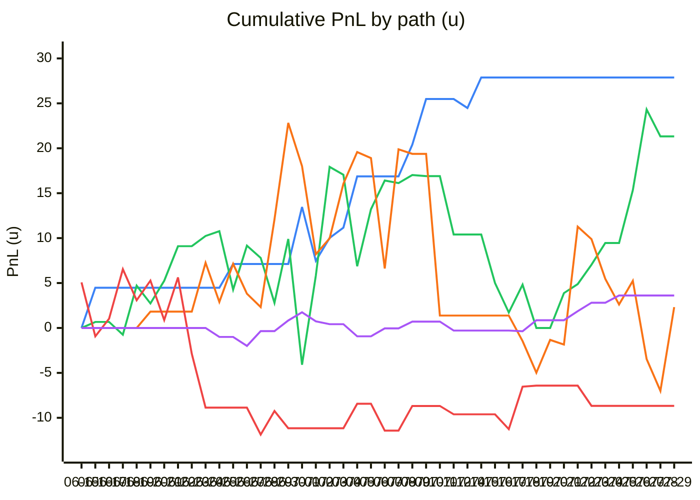
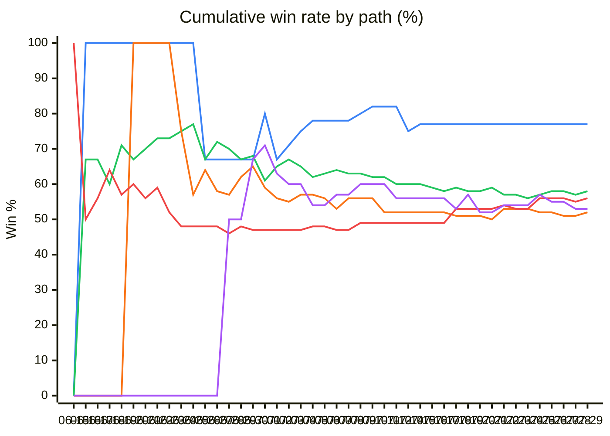
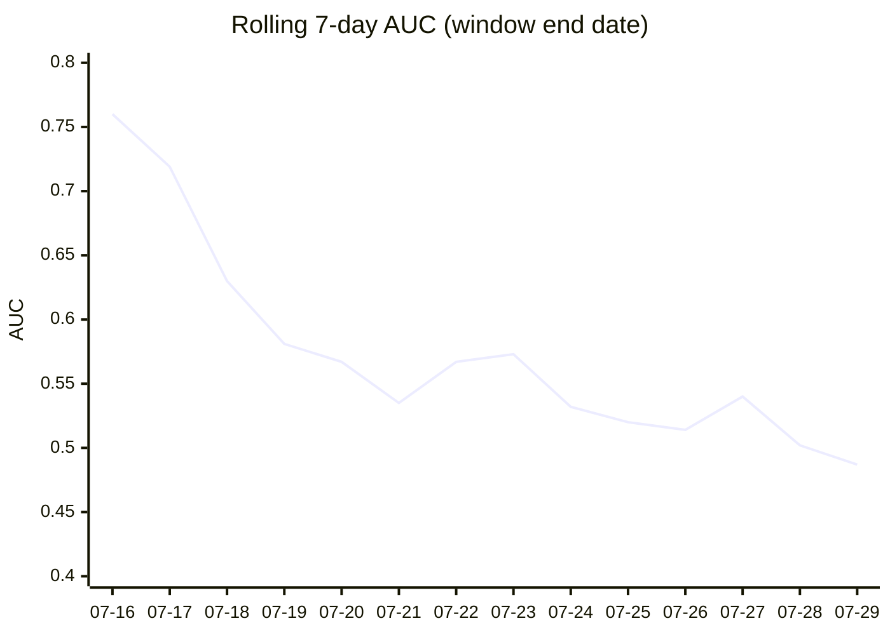

# AGS-Unified — V12 Daily Monitor

**Generated:** Thursday, July 30, 2026 at 10:43 AM ET

**Model:** `ags-unified-v12` · **Live since:** 2026-06-01 (60 days) · **Tape / side-profile era:** 2026-07-15+

Production book = **Paths A–D** (HC / RANK / SHARP / DISSENT) → fadeTop mute → **TAPE** mute/boost. Numbers below are V12-scoped (pick date ≥ 2026-06-01) unless marked Appendix.

## Contents

1. Executive Summary · 2. Live Stack · 3. Daily Scoreboard · **4. Path & Modifier Board** · 5. Tape Era (2026-07-15+) · 6. Sport/Market · 7. Mute · 8. Recent Picks · 9. Predictive Health · 10. Wallets · 11. Ops

Appendix A — Model Versions · Appendix B — Feature Lab

## § 1 — Executive Summary

> 🟢 **V12 is currently WINNING.** Since going live on **2026-06-01** (60 days ago), V12 has evaluated **1664** picks, shipped **544** for real money (32.7% ship rate), and muted the other **1120**. On the shipped picks V12 has gone **303-241** (55.7% win), staked **1533.30u**, and returned **+66.71u** at **+4.4% ROI**.

### Snapshot

| Metric                              | Value                          |
|-------------------------------------|--------------------------------|
| Days V12 has been authoritative     |                             60 |
| Picks V12 has evaluated             |                           1664 |
| Picks SHIPPED (units > 0)           |                            544 |
| Picks MUTED (score ≤ 0, FADE)       |                           1120 |
| Ship rate                           |                          32.7% |
| Live W-L                            |                        303-241 |
| Live Win %                          |                          55.7% |
| Live PnL (units)                    |                         +66.71 |
| Live ROI                            |                          +4.4% |
| Avg PnL / day                       |                         +1.11u |
| Most recent action (2026-07-30)  |            0 live, 0-0, +0.00u |

### What's working

- V12 is profitable at **4.4% ROI** across 544 live picks (+66.71u real PnL).
- Mute rule is **saving money** — the 721 muted picks would have lost -55.84u at flat 1u (-7.7% counterfactual ROI). V12 correctly rejected losers.
- V12 is generating **+1.11u/day** on average since launch.
- Best sport: **WNBA** — 8 live, 7-1, 39.5% ROI, +12.26u.
- Tape era (2026-07-15+): **67-48** · +5.6% ROI · +20.10u on 115 graded — see § 5.

## § 2 — Live Stack (how picks size today)

V12 still **scores** a side as a wallet-quality differential (`forMean` vs `agMean` → score in [-1, +1]). Score ≤ 0 → FADE (0u). What changed is **how positive-score sides get sized**:

| Step | What runs | Units |
|------|-----------|-------|
| A | HC-margin path | SUPER 6u · TOP 4u · MINI 3u · CONFIRMED 1u |
| B | RANK rescue (muted + 2-for-0 whitelist) | 4u |
| C | SHARP / SHARP-LEAN EDGE/net rescue (+ MINI- cut) | 1.5–3u |
| D | DISSENT mute rescue (MLB contribMargin≤0) | 1u |
| E | fadeTop≥60 mute only (EDGE size/rescue **frozen**) | — |
| TAPE | From **2026-07-15**: mute tape&lt;0 · hold mid · boost ≥2.89 ×1.35 | path units |

**Stamps we keep for analysis (every shipped side):** depth (`#F/#A`, proven, V12 counts) + quality (ForWR, ForCLV, EDGE, Tape). Unopposed sides still get FOR numbers (EDGE uses AG prior 50). Compare WIN vs LOSS in § 5.

Odds cap clamps long dogs only (+121 / +151 / +200 → max 2.5 / 1.5 / 1.0u). **+120 or shorter is uncapped by odds** (still ≤6u global). Legacy ELITE→WEAK score-ladder units are **not** the live sizer — ignore them if you see them in old notes.

## § 3 — Daily Scoreboard

**Full book:** 60d · 544 live · 303-241 · **+66.71u** · +4.4% ROI · +1.11u/day.

_Prior to table (2026-06-01 → 2026-07-08): 403 live · 225-178 · +61.64u · cum through prior = +61.64u._

Last **21** calendar days with activity. **Live** = units > 0 · **Muted** = graded FADE / 0u · **Cum PnL** = running total since V12 launch.

| Date       | Evaluated | Live | Muted | W-L (live) | Win %  | Stake (u) | PnL (u)    | ROI       | Cum PnL    |
|------------|-----------|------|-------|------------|--------|-----------|------------|-----------|------------|
| 2026-07-09 |        25 |    7 |    11 | 5-2        |  71.4% |     25.00 |      +7.44 |     29.8% |     +69.08 |
| 2026-07-10 |        37 |    8 |    16 | 5-3        |  62.5% |     34.00 |      +4.96 |     14.6% |     +74.04 |
| 2026-07-11 |        23 |    5 |    10 | 0-5        |   0.0% |     18.00 |     -18.00 |   -100.0% |     +56.04 |
| 2026-07-12 |        29 |    5 |    16 | 1-4        |  20.0% |     13.50 |      -8.43 |    -62.4% |     +47.61 |
| 2026-07-14 |         3 |    1 |     0 | 0-1        |   0.0% |      1.00 |      -1.00 |   -100.0% |     +46.61 |
| 2026-07-15 |         5 |    1 |     1 | 1-0        | 100.0% |      2.50 |      +3.40 |    136.0% |     +50.01 |
| 2026-07-16 |         8 |    1 |     4 | 0-1        |   0.0% |      5.40 |      -5.40 |   -100.0% |     +44.61 |
| 2026-07-17 |        26 |   10 |    13 | 5-5        |  50.0% |     35.90 |      -4.93 |    -13.7% |     +39.68 |
| 2026-07-18 |        41 |   14 |    21 | 8-6        |  57.1% |     46.70 |      +4.91 |     10.5% |     +44.59 |
| 2026-07-19 |        24 |   13 |     7 | 7-6        |  53.8% |     34.10 |      -7.00 |    -20.5% |     +37.59 |
| 2026-07-20 |        22 |    7 |    12 | 4-3        |  57.1% |     16.35 |      +3.65 |     22.3% |     +41.24 |
| 2026-07-21 |        21 |   10 |     9 | 6-4        |  60.0% |     25.62 |      +3.36 |     13.1% |     +44.60 |
| 2026-07-22 |        34 |   12 |    19 | 9-3        |  75.0% |     30.58 |     +15.14 |     49.5% |     +59.74 |
| 2026-07-23 |        16 |    5 |     7 | 3-2        |  60.0% |     14.75 |      -0.55 |     -3.7% |     +59.19 |
| 2026-07-24 |        29 |    6 |    18 | 3-3        |  50.0% |     25.00 |      -1.99 |     -8.0% |     +57.20 |
| 2026-07-25 |        31 |    6 |    21 | 3-3        |  50.0% |     19.56 |      -2.05 |    -10.5% |     +55.15 |
| 2026-07-26 |        26 |    4 |    13 | 3-1        |  75.0% |     21.06 |      +8.50 |     40.4% |     +63.65 |
| 2026-07-27 |        17 |    8 |     8 | 4-4        |  50.0% |     27.63 |      +0.28 |      1.0% |     +63.93 |
| 2026-07-28 |        26 |   11 |    11 | 5-6        |  45.5% |     34.82 |      -6.54 |    -18.8% |     +57.39 |
| 2026-07-29 |        18 |    7 |    10 | 6-1        |  85.7% |     17.08 |      +9.32 |     54.6% |     +66.71 |
| 2026-07-30 |         8 |    0 |     0 | 0-0        |      — |      0.00 |      +0.00 |         — |     +66.71 |

> **Trajectory.** Last 3 days (5.4% ROI) ≈ prior book (4.3%).

## § 4 — Path & Modifier Board

> **Daily read.** Every lever that can put units on a ticket or change size after stacking. Paths A–D stamp the base; fadeTop / TAPE mute·hold·boost after. Ranked best → worst. Thin N stays listed so nothing hides.

### At a glance — BEST / WORST

_As of last graded day **2026-07-29**. Paths ≥5 graded · modifiers ≥3. Staked ROI: higher better. Mute CF: **more negative = better** (avoided losers)._

#### Paths

| | Path | Layer | N | W-L | ROI | PnL | u/pick | 7d ROI |
|-:|------|-------|--:|:---:|----:|----:|-------:|-------:|
| 🟢 1 | HC-2 SUPER | A | 13 | 10-3 | +45.3% | +27.88u | +2.14u | — |
| 🟢 2 | DISSENT rescue | D | 9 | 6-3 | +31.0% | +2.90u | +0.32u | +55.0% |
| 🟢 3 | MINI- (gate-cut) | C | 11 | 8-3 | +24.8% | +2.73u | +0.25u | — |
| 🔴 1 | CONFIRMED margin3+ | A | 5 | 2-3 | -40.4% | -2.02u | -0.40u | — |
| 🔴 2 | SHARP EDGE/net BOTH | C | 43 | 18-25 | -17.5% | -21.52u | -0.50u | +7.1% |
| 🔴 3 | SHARP-PRIME rescue (legacy) | C | 14 | 6-8 | -13.5% | -6.61u | -0.47u | — |

#### Modifiers — staked (HOLD / BOOST / FAIL_OPEN)

| | Modifier | N | W-L | ROI | PnL | Note |
|-:|----------|--:|:---:|----:|----:|------|
| 🟢 best | Tape BOOST (≥2.89 ×1.35) | 28 | 18-10 | +21.5% | +26.95u | sized UP after path |
| 2 | Tape HOLD (mid) | 75 | 41-34 | -3.0% | -5.86u | kept path units |
| 🔴 worst | Tape FAIL_OPEN (missing) | 11 | 7-4 | -13.5% | -4.39u | no tape score → path size |

#### Modifiers — mutes (CF: did we dodge losers?)

| | Modifier | N | W-L | CF ROI | CF PnL | Read |
|-:|----------|--:|:---:|-------:|-------:|------|
| 1 | Score FADE (≤0 → 0u) | 476 | 229-247 | -5.3% | -25.14u | 🟢 saving $ |
| 2 | Tape MUTE (tape<0 → 0u) | 13 | 7-6 | +2.0% | +0.26u | 🟡 flat |

### (A) Every staking path

| Path | Key | Layer | u | N | W-L | Win% | Stake | PnL | ROI | u/pick | 7d N | 7d ROI | Last day PnL | Verdict |
|------|-----|-------|--:|--:|:---:|-----:|------:|----:|----:|-------:|-----:|-------:|-------------:|---------|
| HC-2 SUPER | `SUPER` | A | 6u | 13 | 10-3 | 76.9% | 61.5u | +27.88u | +45.3% | +2.14u | 0 | — | — | 🟢 OK |
| HC-1 TOP+ ($ boost) | `TOP+` | A/C | 5u | 29 | 15-14 | 51.7% | 132.5u | -11.94u | -9.0% | -0.41u | 0 | — | — | 🟠 watch |
| HC-1 TOP | `TOP` | A | 4u | 65 | 42-23 | 64.6% | 246.1u | +33.26u | +13.5% | +0.51u | 7 | +54.5% | — | 🟢 OK |
| RANK 2-for-0 rescue | `RANK` | B | 4u | 53 | 33-20 | 62.3% | 207.9u | +36.28u | +17.5% | +0.68u | 9 | +41.4% | — | 🟢 OK |
| SHARP-PRIME rescue (legacy) | `SHARP-PRIME` | C | 4u | 14 | 6-8 | 42.9% | 49.0u | -6.61u | -13.5% | -0.47u | 0 | — | — | 🟠 watch |
| SHARP EDGE/net BOTH | `SHARP` | C | 3u | 43 | 18-25 | 41.9% | 123.3u | -21.52u | -17.5% | -0.50u | 8 | +7.1% | +4.22u | 🔴 cut |
| SHARP-LEAN EDGE/net ONE | `SHARP-LEAN` | C | 1.5u | 38 | 21-17 | 55.3% | 101.2u | -5.83u | -5.8% | -0.15u | 29 | -13.1% | +5.10u | 🟡 flat |
| MINI (gate-pass) | `MINI` | A | 3u | 45 | 23-22 | 51.1% | 129.8u | -8.67u | -6.7% | -0.19u | 1 | -100.0% | — | 🟡 flat |
| MINI- (gate-cut) | `MINI-` | C | 1u | 11 | 8-3 | 72.7% | 11.0u | +2.73u | +24.8% | +0.25u | 0 | — | — | 🟢 room |
| CONFIRMED margin3+ | `CONFIRMED` | A | 1u | 5 | 2-3 | 40.0% | 5.0u | -2.02u | -40.4% | -0.40u | 0 | — | — | 🟠 watch |
| DISSENT rescue | `DISSENT` | D | 1u | 9 | 6-3 | 66.7% | 9.3u | +2.90u | +31.0% | +0.32u | 5 | +55.0% | — | 🟢 room |
| WINNER (legacy EDGE) | `WINNER` | E | 3-6u | 0 | — | — | 0.0u | +0.00u | — | — | 0 | — | — | pending |

### (B) Every post-stack modifier

Mutes use **flat 1u CF** (what if we had shipped). Tape HOLD/BOOST/FAIL_OPEN use **real staked PnL**.

| Modifier | Layer | Mode | N | W-L | Win% | Stake/CF | PnL | ROI | 7d N | 7d ROI | Last day |
|----------|-------|------|--:|:---:|-----:|---------:|----:|----:|-----:|-------:|---------:|
| Tape BOOST (≥2.89 ×1.35) | TAPE | staked | 28 | 18-10 | 64.3% | 125.5u | +26.95u | +21.5% | 16 | +26.8% | +6.03u |
| Tape HOLD (mid) | TAPE | staked | 75 | 41-34 | 54.7% | 196.6u | -5.86u | -3.0% | 42 | +0.2% | +3.29u |
| Tape FAIL_OPEN (missing) | TAPE | staked | 11 | 7-4 | 63.6% | 32.5u | -4.39u | -13.5% | 1 | +94.0% | — |
| Tape MUTE (tape<0 → 0u) | TAPE | CF 1u | 13 | 7-6 | 53.8% | 13.0u | +0.26u | +2.0% | 4 | -48.3% | — |
| fadeTop≥60 MUTE | E | CF 1u | 1 | 0-1 | 0.0% | 1.0u | -1.00u | -100.0% | 0 | — | — |
| Score FADE (≤0 → 0u) | score | CF 1u | 476 | 229-247 | 48.1% | 476.0u | -25.14u | -5.3% | 37 | -12.7% | -1.00u |

### (C) Path × Tape (staked · 2026-07-15+)

| Path | HOLD n/ROI | BOOST n/ROI | FAIL_OPEN n/ROI |
|------|------------|-------------|-----------------|
| TOP | 15 / +6% | 7 / +31% | 4 / -16% |
| RANK | 12 / +11% | 3 / +88% | — |
| SHARP | 8 / -35% | 9 / -10% | 1 / -100% |
| SHARP-LEAN | 30 / -15% | 8 / +12% | — |
| MINI | 4 / +7% | — | 4 / +1% |
| MINI- | — | — | 1 / +0% |
| DISSENT | 6 / +29% | 1 / +91% | 1 / +94% |

### (D) Last graded day movers (2026-07-29)

| Path | N | W-L | PnL | ROI |
|------|--:|:---:|----:|----:|
| SHARP-LEAN EDGE/net ONE | 6 | 5-1 | +5.10u | +42.4% |
| SHARP EDGE/net BOTH | 1 | 1-0 | +4.22u | +83.4% |

_Rollups + trajectory charts below. Tape deep-dive: § 5._

### Path rollups & trajectory

Display tiers (UI buckets) — detail lives in **§ 4 Path & Modifier Board** above.

| Tier (paths)              | Units | N   | W-L    | Win %  | Total Stake | PnL (u)    | ROI       |
|---------------------------|-------|-----|--------|--------|-------------|------------|-----------|
| MAX PLAY (SUPER)          |    6u |  13 | 10-3   |  76.9% |       61.50 |     +27.88 |     45.3% |
| TOP PICK (TOP+/TOP)       |  4-5u | 113 | 57-37  |  60.6% |      378.60 |     +21.32 |      5.6% |
| SHARP PLAY (RANK/SHARP-PRIME/SHARP/SHARP-LEAN/WINNER) | 1.5-6u | 192 | 78-70  |  52.7% |      481.35 |      +2.32 |      0.5% |
| STRONG (MINI)             |    3u |  52 | 23-22  |  51.1% |      129.75 |      -8.67 |     -6.7% |
| LEAN (CONFIRMED/MINI-/DISSENT) |    1u |  32 | 16-9   |  64.0% |       25.35 |      +3.61 |     14.2% |
| **STAKED TOTAL** |     — | 325 | 184-141 |  56.6% |     1076.55 |     +46.46 |     +4.3% |

#### Granular — by individual staking path

| Path                  | Key         | Units | N   | W-L    | Win %  | Total Stake | PnL (u)    | ROI       |
|-----------------------|-------------|-------|-----|--------|--------|-------------|------------|-----------|
| A · HC-2 (model max)  | SUPER       |    6u |  13 | 10-3   |  76.9% |       61.50 |     +27.88 |     45.3% |
| A/C · HC-1 + $-boost  | TOP+        |    5u |  29 | 15-14  |  51.7% |      132.50 |     -11.94 |     -9.0% |
| A · HC-1 (model)      | TOP         |    4u |  84 | 42-23  |  64.6% |      246.10 |     +33.26 |     13.5% |
| B · 2-for-0 rescue    | RANK        |    4u |  60 | 33-20  |  62.3% |      207.90 |     +36.28 |     17.5% |
| C · proven-$ prime (legacy) | SHARP-PRIME |    4u |  14 | 6-8    |  42.9% |       49.00 |      -6.61 |    -13.5% |
| C · EDGE/net ONE      | SHARP-LEAN  |  1.5u |  69 | 21-17  |  55.3% |      101.18 |      -5.83 |     -5.8% |
| C · proven-$ consensus | SHARP       |    3u |  49 | 18-25  |  41.9% |      123.27 |     -21.52 |    -17.5% |
| A · mini-HC (gate-pass) | MINI        |    3u |  52 | 23-22  |  51.1% |      129.75 |      -8.67 |     -6.7% |
| C · mini gate-cut     | MINI-       |    1u |  13 | 8-3    |  72.7% |       11.00 |      +2.73 |     24.8% |
| A · margin 3+         | CONFIRMED   |    1u |   6 | 2-3    |  40.0% |        5.00 |      -2.02 |    -40.4% |
| D · CM≤0 dissent      | DISSENT     |    1u |  13 | 6-3    |  66.7% |        9.35 |      +2.90 |     31.0% |
| E · winner-align EDGE | WINNER      |  3-6u |   0 | pending |      — |        0.00 |      +0.00 |         — |

> **MONITORING volume:** 394 picks tracked at 0u (would-be 189-205, 48.0% win). Shown to users for context; **not** part of the staked record, units, or ROI.

### Path trajectory (cum PnL & win%)

One line per display tier. Down-sloping PnL = path over-staked for what it returns. Pair with § 4 board.

**Lines:** 🔵 MAX PLAY (10-3, +27.88u)  ·  🟢 TOP PICK (66-47, +21.32u)  ·  🟠 SHARP PLAY (100-92, +2.32u)  ·  🔴 STRONG (29-23, -8.67u)  ·  🟣 LEAN (17-15, +3.61u)

```mermaid
%%{init: {"themeVariables": {"xyChart": {"plotColorPalette": "#3b82f6,#22c55e,#f97316,#ef4444,#a855f7"}}}}%%
xychart-beta
    title "Cumulative PnL by path (u)"
    x-axis ["06-15", "06-16", "06-17", "06-18", "06-19", "06-20", "06-21", "06-22", "06-23", "06-24", "06-25", "06-26", "06-27", "06-28", "06-29", "06-30", "07-01", "07-02", "07-03", "07-04", "07-05", "07-06", "07-07", "07-08", "07-09", "07-10", "07-11", "07-12", "07-14", "07-15", "07-16", "07-17", "07-18", "07-19", "07-20", "07-21", "07-22", "07-23", "07-24", "07-25", "07-26", "07-27", "07-28", "07-29"]
    y-axis "PnL (u)" -14 --> 31
    line [0, 4.48, 4.48, 4.48, 4.48, 4.48, 4.48, 4.48, 4.48, 4.48, 4.48, 7.12, 7.12, 7.12, 7.12, 7.12, 13.47, 7.47, 10.02, 11.16, 16.87, 16.87, 16.87, 16.87, 20.4, 25.48, 25.48, 25.48, 24.48, 27.88, 27.88, 27.88, 27.88, 27.88, 27.88, 27.88, 27.88, 27.88, 27.88, 27.88, 27.88, 27.88, 27.88, 27.88]
    line [0, 0.67, 0.67, -0.75, 4.71, 2.73, 5.25, 9.1, 9.1, 10.24, 10.77, 4.27, 9.16, 7.8, 2.8, 9.91, -4.09, 5.82, 17.93, 17.05, 6.87, 13.21, 16.41, 16.12, 17.02, 16.9, 16.9, 10.4, 10.4, 10.4, 5, 1.72, 4.82, 0, 0, 3.88, 4.88, 7.04, 9.46, 9.46, 15.34, 24.32, 21.32, 21.32]
    line [0, 0, 0, 0, 0, 1.82, 1.82, 1.82, 1.82, 7.26, 2.9, 7.13, 3.81, 2.32, 12.09, 22.82, 18, 8.2, 9.97, 16.05, 19.58, 18.91, 6.62, 19.88, 19.38, 19.38, 1.38, 1.38, 1.38, 1.38, 1.38, 1.38, -1.46, -4.98, -1.33, -1.85, 11.28, 9.88, 5.47, 2.62, 5.24, -3.46, -7, 2.32]
    line [5.07, -0.93, 1.03, 6.54, 3.08, 5.27, 0.88, 5.63, -2.87, -8.87, -8.87, -8.87, -8.87, -11.87, -9.24, -11.16, -11.16, -11.16, -11.16, -11.16, -8.43, -8.43, -11.43, -11.43, -8.68, -8.68, -8.68, -9.61, -9.61, -9.61, -9.61, -11.26, -6.53, -6.42, -6.42, -6.42, -6.42, -8.67, -8.67, -8.67, -8.67, -8.67, -8.67, -8.67]
    line [0, 0, 0, 0, 0, 0, 0, 0, 0, 0, -1, -1, -2, -0.35, -0.35, 0.83, 1.74, 0.74, 0.42, 0.42, -0.93, -0.93, -0.05, -0.05, 0.71, 0.71, 0.71, -0.29, -0.29, -0.29, -0.29, -0.29, -0.37, 0.86, 0.86, 0.86, 1.87, 2.81, 2.81, 3.61, 3.61, 3.61, 3.61, 3.61]
```

```mermaid
%%{init: {"themeVariables": {"xyChart": {"plotColorPalette": "#3b82f6,#22c55e,#f97316,#ef4444,#a855f7"}}}}%%
xychart-beta
    title "Cumulative win rate by path (%)"
    x-axis ["06-15", "06-16", "06-17", "06-18", "06-19", "06-20", "06-21", "06-22", "06-23", "06-24", "06-25", "06-26", "06-27", "06-28", "06-29", "06-30", "07-01", "07-02", "07-03", "07-04", "07-05", "07-06", "07-07", "07-08", "07-09", "07-10", "07-11", "07-12", "07-14", "07-15", "07-16", "07-17", "07-18", "07-19", "07-20", "07-21", "07-22", "07-23", "07-24", "07-25", "07-26", "07-27", "07-28", "07-29"]
    y-axis "Win %" 0 --> 100
    line [0, 100, 100, 100, 100, 100, 100, 100, 100, 100, 100, 67, 67, 67, 67, 67, 80, 67, 71, 75, 78, 78, 78, 78, 80, 82, 82, 82, 75, 77, 77, 77, 77, 77, 77, 77, 77, 77, 77, 77, 77, 77, 77, 77]
    line [0, 67, 67, 60, 71, 67, 70, 73, 73, 75, 77, 67, 72, 70, 67, 68, 61, 65, 67, 65, 62, 63, 64, 63, 63, 62, 62, 60, 60, 60, 59, 58, 59, 58, 58, 59, 57, 57, 56, 57, 58, 58, 57, 58]
    line [0, 0, 0, 0, 0, 100, 100, 100, 100, 75, 57, 64, 58, 57, 62, 65, 59, 56, 55, 57, 57, 56, 53, 56, 56, 56, 52, 52, 52, 52, 52, 52, 51, 51, 51, 50, 53, 53, 53, 52, 52, 51, 51, 52]
    line [100, 50, 56, 64, 57, 60, 56, 59, 52, 48, 48, 48, 48, 46, 48, 47, 47, 47, 47, 47, 48, 48, 47, 47, 49, 49, 49, 49, 49, 49, 49, 49, 53, 53, 53, 53, 54, 53, 53, 56, 56, 56, 55, 56]
    line [0, 0, 0, 0, 0, 0, 0, 0, 0, 0, 0, 0, 0, 50, 50, 67, 71, 63, 60, 60, 54, 54, 57, 57, 60, 60, 60, 56, 56, 56, 56, 56, 53, 57, 52, 52, 54, 54, 54, 57, 55, 55, 53, 53]
```

## § 5 — Tape Era (sizing + side profile · 2026-07-15+)

### 5a — TAPE sizing impact

From **2026-07-15**, path units are resized by **TAPE** = `2·(EDGE/10) + 1.5·(netCLV/10)`: mute if tape &lt; 0 · hold mid · boost if ≥ 2.89 (×1.35, 6u cap). Missing tape = fail-open. See `docs/TAPE_SIZING.md`.

### Coverage

| Window | Sides | With tape stamp | Graded w/ stamp |
|--------|------:|----------------:|----------------:|
| ≥ 2026-07-15 | 352 | 347 | 335 |

### (A) By tape action (stamped + graded)

| Action | N | W-L | Win % | Stake | PnL (u) | ROI |
|--------|--:|:---:|------:|------:|--------:|----:|
| MUTE      | 13 | 7-6 | 53.8% | 0.00u | +0.00u | — |
| HOLD      | 79 | 43-36 | 54.4% | 199.56u | -8.86u | -4.4% |
| BOOST     | 30 | 19-11 | 63.3% | 128.99u | +29.03u | +22.5% |
| FAIL_OPEN | 11 | 7-4 | 63.6% | 32.50u | -4.39u | -13.5% |
| PASS      | 202 | 103-99 | 51.0% | 0.00u | +0.00u | — |

### (B) Tape score ladder (graded, score present)

| Tape bucket | Rule | N | W-L | Win % | Staked PnL |
|-------------|------|--:|:---:|------:|-----------:|
| mute (<0) | → 0u | 86 | 43-43 | 50.0% | -9.06u |
| hold (0–2.89) | path u | 158 | 83-75 | 52.5% | +1.70u |
| boost (≥2.89) | ×1.35 | 44 | 25-19 | 56.8% | +23.38u |

_Score coverage: **288/335** graded stamped rows have `v8_tapeScore`._

### (C) Counterfactual impact vs path units

> **Mute CF:** path units that tape zeroed — if those had shipped, what PnL? Positive Δ = tape saved money (avoided losses). **Boost CF:** actual PnL − PnL at path size (pre-boost). Positive Δ = boost added value.

| Mute CF | N | PnL if path had shipped | Δ vs actual (0u) | Avoided losses | Missed wins |
|---------|--:|------------------------:|-----------------:|---------------:|------------:|
| tape-weak → 0u | 13 | +7.54u | -7.54u | +5.25u | +12.79u |

| Boost CF | N | PnL @ path u | PnL @ boosted | Δ (boost value) |
|----------|--:|-------------:|--------------:|----------------:|
| tape ≥ 2.89 ×1.35 | 30 | +21.58u | +29.03u | +7.45u |

> Path units for CF prefer stamped `v8_unitsPreTape`; else ladder default for `v8_hcStakeTier`. Early tape-era picks may lack `unitsPreTape` until the next cron cycle backfills.

### (D) Recent mute / boost events

| Date | Sport | Pick | Path | Tape | Act | Pre-u | Final | Outcome |
|------|-------|------|------|-----:|-----|------:|------:|---------|
| 2026-07-30 | WNBA | Las Vegas Aces | MINI- | 5.66 | BOOST | 1.25u | 5.00u | — |
| 2026-07-29 | MLB | Arizona Diamondbacks | SHARP | 4.78 | BOOST | 1.88u | 2.50u | WIN |
| 2026-07-29 | WNBA | Atlanta Dream | SHARP | 5.30 | BOOST | 3.75u | 5.06u | WIN |
| 2026-07-29 | MLB | Detroit Tigers | SHARP~ | 2.90 | BOOST | 1.88u | 2.50u | LOSS |
| 2026-07-29 | MLB | Over 7.5 | SHARP~ | 3.05 | BOOST | 1.88u | 5.00u | WIN |
| 2026-07-28 | MLB | Philadelphia Phillies | PATH-D | -2.21 | MUTE | 1.00u | 0.00u | LOSS |
| 2026-07-28 | MLB | Los Angeles Dodgers | SHARP | 5.39 | BOOST | 3.75u | 5.06u | LOSS |
| 2026-07-28 | WNBA | Seattle Storm | SHARP~ | 2.92 | BOOST | 1.00u | 1.00u | LOSS |
| 2026-07-28 | MLB | Los Angeles Dodgers | SHARP~ | 4.39 | BOOST | 1.88u | 5.00u | LOSS |
| 2026-07-26 | MLB | Milwaukee Brewers | SHARP | 6.63 | BOOST | 3.75u | 5.06u | WIN |
| 2026-07-26 | MLB | Los Angeles Angels | 2-for-0 | 4.85 | BOOST | 5.00u | 6.00u | WIN |
| 2026-07-26 | MLB | Milwaukee Brewers | HC-1 | 3.34 | BOOST | 5.00u | 6.00u | WIN |
| 2026-07-26 | MLB | New York Yankees | PATH-D | -5.47 | MUTE | 1.00u | 0.00u | LOSS |
| 2026-07-25 | MLB | Houston Astros | PATH-D | -1.44 | MUTE | 1.00u | 0.00u | WIN |
| 2026-07-25 | MLB | Under 8.5 | SHARP | 4.30 | BOOST | 3.75u | 5.06u | LOSS |

### 5b — Skill bands (EDGE · NetCLV · Tape)

Staked graded (`finalUnits > 0`, WIN/LOSS). Metric = **stamp if present, else as-of** (featured sport WR n≥8 / causal CLV ledger / `computeTapeScore`). Windows: **Jun 15+** · **Jul 15+** · **yesterday**.

- **EDGE** bands: `<5` / `5–10` / `≥10` · mean FOR WR − (mean AG ?? 50)
- **NetCLV** bands: same · mean FOR %+CLV − (mean AG ?? 62)
- **Tape** bands: policy `<0` / mid / `≥2.89` · `2·(EDGE/10) + 1.5·(netCLV/10)`

> **Watch:** EDGE ≥10 is the separator (Jun15+ 68–36 · 65.4% · +22.0%); **5–10 is the hole** (41–33 · 55.4% · -3.0%). Net ≥10 can flip cold in the Jul15+ window — read across metrics.

#### EDGE

_mean FOR sport WR − (mean AG ?? 50)_

##### Jun 15+ · 326 tickets · cov 315/326 (stamp 115 / as-of 200)

| Band | n | Record | WR | ROI |
|------|--:|:------:|---:|----:|
| <5 | 137 | 69–68 | 50.4% | -7.4% |
| 5–10 | 74 | 41–33 | 55.4% | -3.0% |
| ≥10 | 104 | 68–36 | 65.4% | +22.0% |
| All | 326 | 185–141 | 56.7% | +4.4% |

| Path | E<5 WR | 5–10 WR | ≥10 WR |
|------|---:|---:|---:|
| A | 50.7% (71) | 56.4% (39) | 73.1% (52) |
| B | 55.3% (38) | 80% (5) | 80% (10) |
| C | 37.5% (24) | 50% (28) | 51.3% (39) |

##### Jul 15+ · 115 tickets · cov 110/115 (stamp 110 / as-of 0)

| Band | n | Record | WR | ROI |
|------|--:|:------:|---:|----:|
| <5 | 31 | 16–15 | 51.6% | -7.5% |
| 5–10 | 35 | 18–17 | 51.4% | -14.8% |
| ≥10 | 44 | 29–15 | 65.9% | +19.4% |
| All | 115 | 67–48 | 58.3% | +5.6% |

| Path | E<5 WR | 5–10 WR | ≥10 WR |
|------|---:|---:|---:|
| A | 41.7% (12) | 50% (10) | 90.9% (11) |
| B | 58.3% (12) | — | 100% (3) |
| C | 33.3% (3) | 52.2% (23) | 51.7% (29) |

##### Yesterday (Jul 29) · 7 tickets · cov 7/7 (stamp 7 / as-of 0)

| Band | n | Record | WR | ROI |
|------|--:|:------:|---:|----:|
| 5–10 | 4 | 4–0 | 100.0% | +72.8% |
| ≥10 | 3 | 2–1 | 66.7% | +48.0% |
| All | 7 | 6–1 | 85.7% | +54.6% |

| Path | E<5 WR | 5–10 WR | ≥10 WR |
|------|---:|---:|---:|
| C | — | 100% (4) | 66.7% (3) |

#### NetCLV

_mean FOR causal %+CLV − (mean AG ?? 62) · bands mirror EDGE_

##### Jun 15+ · 326 tickets · cov 325/326 (stamp 114 / as-of 211)

| Band | n | Record | WR | ROI |
|------|--:|:------:|---:|----:|
| <5 | 222 | 121–101 | 54.5% | -1.2% |
| 5–10 | 51 | 30–21 | 58.8% | +16.2% |
| ≥10 | 52 | 34–18 | 65.4% | +17.0% |
| All | 326 | 185–141 | 56.7% | +4.4% |

| Path | N<5 WR | 5–10 WR | ≥10 WR |
|------|---:|---:|---:|
| A | 57.1% (112) | 53.6% (28) | 77.8% (27) |
| B | 59.5% (37) | 75% (8) | 62.5% (8) |
| C | 46.2% (65) | 57.1% (14) | 43.8% (16) |

##### Jul 15+ · 115 tickets · cov 115/115 (stamp 114 / as-of 1)

| Band | n | Record | WR | ROI |
|------|--:|:------:|---:|----:|
| <5 | 72 | 43–29 | 59.7% | +5.3% |
| 5–10 | 28 | 17–11 | 60.7% | +23.1% |
| ≥10 | 15 | 7–8 | 46.7% | -20.3% |
| All | 115 | 67–48 | 58.3% | +5.6% |

| Path | N<5 WR | 5–10 WR | ≥10 WR |
|------|---:|---:|---:|
| A | 77.8% (18) | 50% (12) | 50% (6) |
| B | 44.4% (9) | 100% (4) | 100% (2) |
| C | 52.6% (38) | 54.5% (11) | 28.6% (7) |

##### Yesterday (Jul 29) · 7 tickets · cov 7/7 (stamp 7 / as-of 0)

| Band | n | Record | WR | ROI |
|------|--:|:------:|---:|----:|
| <5 | 6 | 5–1 | 83.3% | +42.4% |
| 5–10 | 1 | 1–0 | 100.0% | +83.4% |
| All | 7 | 6–1 | 85.7% | +54.6% |

| Path | N<5 WR | 5–10 WR | ≥10 WR |
|------|---:|---:|---:|
| C | 83.3% (6) | 100% (1) | — |

#### Tape

_2·(EDGE/10) + 1.5·(netCLV/10) · mute <0 · boost ≥2.89_

##### Jun 15+ · 326 tickets · cov 315/326 (stamp 109 / as-of 206)

| Band | n | Record | WR | ROI |
|------|--:|:------:|---:|----:|
| <0 | 73 | 29–44 | 39.7% | -28.8% |
| 0–2.89 | 165 | 96–69 | 58.2% | +9.8% |
| ≥2.89 | 77 | 53–24 | 68.8% | +25.4% |
| All | 326 | 185–141 | 56.7% | +4.4% |

| Path | <0 WR | 0–2.89 WR | ≥2.89 WR |
|------|---:|---:|---:|
| A | 37.2% (43) | 64.1% (78) | 73.2% (41) |
| B | 57.9% (19) | 58.3% (24) | 80% (10) |
| C | 18.2% (11) | 49.1% (57) | 56.5% (23) |

##### Jul 15+ · 115 tickets · cov 110/115 (stamp 109 / as-of 1)

| Band | n | Record | WR | ROI |
|------|--:|:------:|---:|----:|
| <0 | 4 | 1–3 | 25.0% | -60.4% |
| 0–2.89 | 74 | 42–32 | 56.8% | +2.4% |
| ≥2.89 | 32 | 20–12 | 62.5% | +18.0% |
| All | 115 | 67–48 | 58.3% | +5.6% |

| Path | <0 WR | 0–2.89 WR | ≥2.89 WR |
|------|---:|---:|---:|
| A | 0% (1) | 61.9% (21) | 63.6% (11) |
| B | 33.3% (3) | 66.7% (9) | 100% (3) |
| C | — | 50% (38) | 52.9% (17) |

##### Yesterday (Jul 29) · 7 tickets · cov 7/7 (stamp 7 / as-of 0)

| Band | n | Record | WR | ROI |
|------|--:|:------:|---:|----:|
| 0–2.89 | 4 | 4–0 | 100.0% | +72.8% |
| ≥2.89 | 3 | 2–1 | 66.7% | +48.0% |
| All | 7 | 6–1 | 85.7% | +54.6% |

| Path | <0 WR | 0–2.89 WR | ≥2.89 WR |
|------|---:|---:|---:|
| C | — | 100% (4) | 66.7% (3) |

### 5c — Side profile (WIN vs LOSS)

From **2026-07-15** we stamp depth + quality on every shipped side. Compare means on **WIN vs LOSS**. Separators are gate/sizing candidates; flat metrics are noise. N is still early — treat ranks as hypotheses.

### Coverage

| Window | Graded live | W-L | Win % | Stake | PnL |
|--------|------------:|:---:|------:|------:|----:|
| ≥ 2026-07-15 | 115 | 67-48 | 58.3% | 357.05u | +20.10u |

### (A) Metric means — WIN side vs LOSS side

Δ = mean(WIN) − mean(LOSS). Positive Δ on a “higher helps” metric = winners look stronger on that axis.

| Family | Metric | Cov | mean WIN | mean LOSS | Δ (W−L) | med WIN | med LOSS |
|--------|--------|----:|---------:|----------:|--------:|--------:|---------:|
| depth   | #F sharps        | 115/115 | 1.69 | 1.98 | -0.29 | 1.00 | 1.00 |
| depth   | #A sharps        | 115/115 | 1.13 | 1.19 | -0.05 | 1.00 | 1.00 |
| depth   | #F − #A          | 115/115 | 0.55 | 0.79 | -0.24 | 1.00 | 1.00 |
| depth   | proven F         | 115/115 | 1.24 | 1.31 | -0.07 | 1.00 | 1.00 |
| depth   | proven A         | 115/115 | 0.40 | 0.38 | +0.03 | 0.00 | 0.00 |
| depth   | proven F−A       | 115/115 | 0.84 | 0.94 | -0.10 | 1.00 | 1.00 |
| depth   | v12 F count      | 115/115 | 1.60 | 1.96 | -0.36 | 1.00 | 1.00 |
| depth   | v12 A count      | 115/115 | 1.24 | 1.08 | +0.16 | 1.00 | 1.00 |
| depth   | WA ForN          | 115/115 | 1.37 | 1.75 | -0.38 | 1.00 | 1.00 |
| depth   | WA AgN           | 115/115 | 1.01 | 0.98 | +0.04 | 1.00 | 0.00 |
| depth   | CLV ForN         | 114/115 | 1.65 | 1.98 | -0.33 | 1.00 | 1.00 |
| depth   | CLV AgN          | 114/115 | 1.23 | 1.13 | +0.10 | 1.00 | 1.00 |
| depth   | unopposed (A=0)  | 115/115 | 0.40 | 0.44 | -0.03 | 0.00 | 0.00 |
| quality | ForWR            | 110/115 | 55.94 | 54.42 | +1.52 | 54.85 | 54.80 |
| quality | AgWR             | 58/115 | 42.47 | 43.59 | -1.12 | 43.80 | 43.80 |
| quality | TopFor WR        | 110/115 | 57.14 | 56.94 | +0.20 | 55.90 | 55.80 |
| quality | TopAg WR         | 58/115 | 45.61 | 47.43 | -1.81 | 47.40 | 50.00 |
| quality | EDGE             | 110/115 | 10.11 | 7.56 | +2.55 | 9.71 | 8.20 |
| quality | ForCLV           | 114/115 | 65.23 | 66.38 | -1.15 | 65.85 | 66.34 |
| quality | AgCLV            | 65/115 | 62.97 | 62.21 | +0.76 | 64.73 | 65.71 |
| quality | netCLV           | 114/115 | 2.66 | 4.27 | -1.61 | 3.29 | 3.71 |
| quality | Tape             | 109/115 | 2.45 | 2.19 | +0.25 | 2.22 | 2.16 |
| quality | V12 score        | 115/115 | 0.88 | 0.88 | -0.00 | 0.97 | 0.97 |
| quality | V12 forMean      | 115/115 | 24.73 | 20.17 | +4.56 | 17.82 | 15.80 |
| quality | V12 agMean       | 115/115 | 1.50 | 0.84 | +0.66 | 0.00 | 0.00 |

### (B) Separation rank — which metrics tell W from L

AUC: chance a random WIN scores higher than a random LOSS on that metric (0.50 = coin flip). Sorted by |AUC−0.5|. ρ / r_pb = Spearman / point-biserial vs won.

| Rank | Metric | Family | Cov | AUC | ρ | r_pb | Δ (W−L) | Read |
|-----:|--------|--------|----:|----:|--:|-----:|--------:|------|
|    1 | EDGE             | quality | 110/115 | 0.609 | +0.320 | +0.195 | +2.55 | 🟢 sep OK |
|    2 | V12 forMean      | quality | 115/115 | 0.566 | +0.229 | +0.111 | +4.56 | 🟡 mild OK |
|    3 | ForWR            | quality | 110/115 | 0.556 | +0.263 | +0.153 | +1.52 | 🟡 mild OK |
|    4 | WA ForN          | depth   | 115/115 | 0.449 | +0.145 | -0.181 | -0.38 | 🟡 mild inv |
|    5 | TopAg WR         | quality | 58/115 | 0.450 | -0.025 | -0.112 | -1.81 | 🟡 mild OK |
|    6 | ForCLV           | quality | 114/115 | 0.453 | -0.184 | -0.095 | -1.15 | 🟡 mild inv |
|    7 | #F − #A          | depth   | 115/115 | 0.455 | -0.087 | -0.065 | -0.24 | 🟡 mild inv |
|    8 | Tape             | quality | 109/115 | 0.543 | +0.077 | +0.072 | +0.25 | 🟡 mild OK |
|    9 | proven F         | depth   | 115/115 | 0.459 | +0.250 | -0.075 | -0.07 | 🟡 mild inv |
|   10 | proven F−A       | depth   | 115/115 | 0.465 | +0.116 | -0.060 | -0.10 | flat |
|   11 | netCLV           | quality | 114/115 | 0.467 | -0.182 | -0.076 | -1.61 | flat |
|   12 | CLV ForN         | depth   | 114/115 | 0.469 | +0.066 | -0.146 | -0.33 | flat |
|   13 | unopposed (A=0)  | depth   | 115/115 | 0.469 | +0.236 | -0.034 | -0.03 | flat |
|   14 | V12 score        | quality | 115/115 | 0.528 | +0.089 | -0.011 | -0.00 | flat |
|   15 | AgWR             | quality | 58/115 | 0.472 | +0.027 | -0.093 | -1.12 | flat |
|   16 | v12 F count      | depth   | 115/115 | 0.475 | +0.093 | -0.167 | -0.36 | flat |
|   17 | v12 A count      | depth   | 115/115 | 0.523 | +0.225 | +0.052 | +0.16 | flat |
|   18 | #F sharps        | depth   | 115/115 | 0.477 | +0.071 | -0.123 | -0.29 | flat |
|   19 | CLV AgN          | depth   | 114/115 | 0.522 | +0.226 | +0.033 | +0.10 | flat |
|   20 | WA AgN           | depth   | 115/115 | 0.515 | +0.288 | +0.013 | +0.04 | flat |
|   21 | proven A         | depth   | 115/115 | 0.512 | +0.365 | +0.019 | +0.03 | flat |
|   22 | #A sharps        | depth   | 115/115 | 0.511 | +0.189 | -0.018 | -0.05 | flat |
|   23 | V12 agMean       | quality | 115/115 | 0.509 | +0.421 | +0.076 | +0.66 | flat |
|   24 | AgCLV            | quality | 65/115 | 0.492 | +0.098 | +0.036 | +0.76 | flat |
|   25 | TopFor WR        | quality | 110/115 | 0.504 | +0.209 | +0.023 | +0.20 | flat |

### (C) Working read

_N=115 is still early — treat ranks as hypotheses, not gates._

- **EDGE** — AUC 0.609 · Δ +2.55 · higher on WINs (cov 110/115)
- **V12 forMean** — AUC 0.566 · Δ +4.56 · higher on WINs (cov 115/115)
- **ForWR** — AUC 0.556 · Δ +1.52 · higher on WINs (cov 110/115)
- **TopAg WR** — AUC 0.450 · Δ -1.81 · higher on LOSSes (cov 58/115)
- **Tape** — AUC 0.543 · Δ +0.25 · higher on WINs (cov 109/115)

_Stamped / derived only — no wallet profile replay. Unopposed sides keep FOR quality (EDGE uses AG prior 50). Audit trail rows: § 11._

## § 6 — Sport & Market

V12 finds different amounts of edge in different sports and bet types. This grid shows live performance per sport × market cell. Each cell: `N · Win% · ROI` over LIVE shipped picks (units > 0).

| Sport | ML                     | SPREAD                 | TOTAL                  | All                    |
|-------|------------------------|------------------------|------------------------|------------------------|
| MLB   | 256n · 54.7% · +2.8%   | 62n · 56.5% · +0.8%    | 164n · 53.0% · +0.4%   | 482n · 54.4% · +1.6%   |
| NBA   | 5n · 0.0% · -100.0%    | 3n · 66.7% · +78.9%    | 2n · 50.0% · -60.8%    | 10n · 30.0% · +29.1%   |
| NHL   | 2n · 100.0% · +76.0%   | 1n · 100.0% · +215.0%  | 3n · 66.7% · +25.1%    | 6n · 83.3% · +38.2%    |
| SOC   | 35n · 68.6% · +22.9%   | —                      | —                      | 35n · 68.6% · +22.9%   |
| UFC   | 3n · 66.7% · -13.1%    | —                      | —                      | 3n · 66.7% · -13.1%    |
| WNBA  | 5n · 100.0% · +50.8%   | 3n · 66.7% · +17.2%    | —                      | 8n · 87.5% · +39.5%    |
| **All** | **306n · 56.5% · +6.5%** | **69n · 58.0% · +5.2%** | **169n · 53.3% · +0.9%** | **544n · 55.7% · +4.4%** |

> **V12's strongest sub-market:** NBA SPREAD — 3 live, 2-1, +78.9% ROI, +4.34u PnL.

## § 7 — Mute Audit

V12 muted **721** graded picks (any pick with score ≤ 0). This sub-section asks the most important question about V12: **were those rejections correct?**

The audit is a counterfactual — if every muted pick had been shipped at a flat 1-unit stake (same risk per pick), what would the bottom line look like? If muting saved money, V12's rule is justified. If muting cost money, V12 is throwing away edge and the wallet-quality threshold should be loosened.

| Metric                              | Value                |
|-------------------------------------|----------------------|
| Muted picks (graded)                |                  721 |
| Muted W-L                           |              352-369 |
| Muted Win %                         |                48.8% |
| Counterfactual PnL at flat 1u       |               -55.84 |
| Counterfactual ROI at flat 1u       |                -7.7% |

### Verdict

🟢 **THE MUTE RULE IS SAVING MONEY.** The picks V12 rejected would have lost **-55.84u** at a flat 1u stake — a counterfactual ROI of **-7.7%**. V12 is correctly identifying losers and refusing to ship them. **Keep the mute rule as-is.**

## § 8 — Recent Live Picks (Audit Trail)

The last 30 picks V12 actually shipped (units > 0). Audit trail keeps **quality + depth** on every row (unopposed included) so WIN vs LOSS sides can be profiled.

> **Depth:** `#F/#A` = unique sharps FOR/AGAINST from frozen `walletDetails` · `pF/pA` = proven (HC_BASE) counts. **Quality:** ForWR / ForCLV / EDGE / Tape (AG blanks use priors; live `TapeAct` stays what the sizer did).

| Date       | Sport | Mkt    | Pick                    | Odds  | V12   | Path     | #F/#A | pF/pA | ForWR | ForCLV | EDGE   | Tape  | TapeAct  | Stake | Outcome | PnL (u)    |
|------------|-------|--------|-------------------------|-------|-------|----------|------:|------:|------:|-------:|--------|------:|----------|------:|---------|------------|
| 2026-07-29 | MLB   | ML     | Cleveland Guardians     |  -136 | +0.689 | SHARP~   |   1/4 |   1/2 |  55.9 |   62.5 |   +9.7 |  2.10 | HOLD     | 1.13u | WIN     |      +0.83 |
| 2026-07-29 | MLB   | ML     | San Diego Padres        |  -175 | +0.936 | SHARP~   |   2/2 |   1/1 |  48.7 |   64.2 |   +7.7 |  2.12 | HOLD     | 1.13u | WIN     |      +0.65 |
| 2026-07-29 | MLB   | ML     | Los Angeles Dodgers     |  -178 | +0.949 | SHARP~   |   2/1 |   1/0 |  57.5 |   64.8 |   +7.0 |  0.82 | HOLD     | 1.13u | WIN     |      +0.63 |
| 2026-07-29 | WNBA  | ML     | Atlanta Dream           |  -120 | +0.992 | SHARP    |   1/0 |   1/0 |  71.4 |   68.8 |  +21.4 |  5.30 | BOOST    | 5.06u | WIN     |      +4.22 |
| 2026-07-29 | MLB   | SPREAD | Detroit Tigers          |  +125 | +0.940 | SHARP~   |   1/1 |   1/0 |  55.2 |   66.9 |  +13.7 |  2.90 | BOOST    | 2.50u | LOSS    |      -2.50 |
| 2026-07-29 | MLB   | TOTAL  | Under 10.5              |  +104 | +0.946 | SHARP~   |   1/1 |   1/1 |  55.2 |   66.9 |   +9.6 |  0.52 | HOLD     | 1.13u | WIN     |      +1.18 |
| 2026-07-29 | MLB   | TOTAL  | Over 7.5                |  -116 | +0.986 | SHARP~   |   1/2 |   1/0 |  55.9 |   62.5 |  +13.1 |  3.05 | BOOST    | 5.00u | WIN     |      +4.31 |
| 2026-07-28 | MLB   | ML     | Pittsburgh Pirates      |  -107 | +0.931 | SHARP~   |   2/1 |   1/0 |  50.8 |   63.0 |   +8.9 |  1.37 | HOLD     | 1.13u | LOSS    |      -1.13 |
| 2026-07-28 | MLB   | ML     | Detroit Tigers          |  -142 | +0.909 | 2-for-0  |   1/0 |   1/0 |  54.0 |   61.4 |   +4.0 |  0.70 | HOLD     | 3.00u | WIN     |      +2.11 |
| 2026-07-28 | MLB   | ML     | San Diego Padres        |  -217 | +0.974 | SHARP    |   1/0 |   1/0 |  58.9 |   67.3 |   +8.9 |  2.57 | HOLD     | 2.25u | WIN     |      +1.04 |
| 2026-07-28 | MLB   | ML     | Houston Astros          |  -105 | +0.974 | SHARP    |   1/0 |   1/0 |  58.9 |   67.3 |   +8.9 |  2.57 | HOLD     | 2.25u | WIN     |      +2.14 |
| 2026-07-28 | MLB   | ML     | Los Angeles Dodgers     |  -235 | +0.543 | SHARP    |   3/3 |   2/1 |  50.8 |   71.2 |  +11.4 |  5.39 | BOOST    | 5.06u | LOSS    |      -5.06 |
| 2026-07-28 | MLB   | SPREAD | Pittsburgh Pirates      |  +176 | +0.974 | SHARP    |   1/0 |   1/0 |  58.9 |   67.3 |   +8.9 |  2.57 | HOLD     | 1.13u | LOSS    |      -1.13 |
| 2026-07-28 | MLB   | SPREAD | Boston Red Sox          |  +106 | +0.991 | HC-1     |   1/0 |   1/0 |  58.9 |   67.3 |   +8.9 |  2.57 | HOLD     | 3.00u | LOSS    |      -3.00 |
| 2026-07-28 | MLB   | SPREAD | Los Angeles Dodgers     |  -111 | +0.981 | SHARP~   |   1/1 |   1/0 |  58.9 |   67.3 |  +23.9 |  4.39 | BOOST    | 5.00u | LOSS    |      -5.00 |
| 2026-07-28 | MLB   | TOTAL  | Over 10.5               |  -110 | +0.974 | SHARP~   |   1/1 |   1/1 |  58.9 |   67.3 |  +11.0 |  0.71 | HOLD     | 4.00u | LOSS    |      -4.00 |
| 2026-07-28 | MLB   | TOTAL  | Over 8.5                |  -104 | +0.167 | SHARP~   |   2/2 |   2/2 |  54.9 |   66.7 |  +10.5 |  2.11 | HOLD     | 4.00u | WIN     |      +3.85 |
| 2026-07-28 | MLB   | TOTAL  | Under 9.5               |  -110 | +0.307 | SHARP~   |   1/2 |   1/1 |  58.9 |   67.3 |  +11.4 |  2.82 | HOLD     | 4.00u | WIN     |      +3.64 |
| 2026-07-27 | MLB   | ML     | Chicago Cubs            |  -120 | +0.994 | HC-1     |   1/2 |   1/0 |  60.2 |   65.7 |  +14.0 |  2.53 | HOLD     | 5.00u | WIN     |      +4.17 |
| 2026-07-27 | MLB   | ML     | Cleveland Guardians     |  +138 | +0.966 | SHARP~   |   1/2 |   1/1 |  52.5 |   63.8 |   +9.8 |  0.62 | HOLD     | 1.13u | WIN     |      +1.56 |
| 2026-07-27 | MLB   | ML     | Philadelphia Phillies   |  -200 | +0.768 | SHARP~   |   2/2 |   2/1 |  60.8 |   66.2 |  +10.4 |  2.25 | HOLD     | 4.00u | LOSS    |      -4.00 |
| 2026-07-27 | MLB   | ML     | Toronto Blue Jays       |  +108 | +0.967 | 2-for-0  |   2/0 |   1/0 |  53.3 |   70.8 |   +3.3 |  1.98 | HOLD     | 3.00u | WIN     |      +3.24 |
| 2026-07-27 | MLB   | SPREAD | Atlanta Braves          |  +157 | +0.979 | SHARP~   |   1/0 |   1/0 |  60.2 |   65.7 |  +10.2 |  2.60 | HOLD     | 1.50u | LOSS    |      -1.50 |
| 2026-07-27 | MLB   | SPREAD | Los Angeles Angels      |  -176 | +0.993 | SHARP~   |   1/0 |   1/0 |  60.2 |   65.7 |  +10.2 |  2.60 | HOLD     | 4.00u | LOSS    |      -4.00 |
| 2026-07-27 | MLB   | SPREAD | Miami Marlins           |  -104 | +0.996 | HC-1     |   1/0 |   1/0 |  60.2 |   65.7 |  +10.2 |  2.60 | HOLD     | 5.00u | WIN     |      +4.81 |
| 2026-07-27 | MLB   | TOTAL  | Over 9.5                |  -103 | +0.875 | SHARP~   |   1/1 |   1/0 |  52.1 |   55.1 |  +10.4 |  0.48 | HOLD     | 4.00u | LOSS    |      -4.00 |
| 2026-07-26 | MLB   | ML     | Milwaukee Brewers       |  -350 | +0.322 | SHARP    |   2/2 |   1/2 |  43.7 |   75.0 |  +10.4 |  6.63 | BOOST    | 5.06u | WIN     |      +1.45 |
| 2026-07-26 | MLB   | ML     | Los Angeles Angels      |  -116 | +0.063 | 2-for-0  |   2/2 |   2/1 |  54.0 |   60.4 |  +11.0 |  4.85 | BOOST    | 6.00u | WIN     |      +5.17 |
| 2026-07-26 | MLB   | ML     | Texas Rangers           |  -106 | +0.983 | SHARP~   |   1/2 |   1/1 |  54.3 |   64.5 |  +12.5 |  1.79 | HOLD     | 4.00u | LOSS    |      -4.00 |
| 2026-07-26 | MLB   | SPREAD | Milwaukee Brewers       |  -102 | +0.990 | HC-1     |   2/1 |   2/1 |  56.3 |   61.0 |  +23.0 |  3.34 | BOOST    | 6.00u | WIN     |      +5.88 |

> Full WIN vs LOSS means + separation ranks: **§ 5b**.

## § 9 — Predictive Health

Does the V12 score separate winners from losers (not just make money by luck)? Watch **AUC**: 0.50 = coin flip · 0.55 = usable · 0.60+ = strong. Rolling AUC below 0.50 = score is dying before ROI does.

### 12A — Discrimination: does V12 actually separate winners from losers?

Five lenses on **one** question: *do higher scores go with wins?* They're independent on purpose — AUC and KS look at the **ranking** (do winners sit higher than losers regardless of scale), while the correlations (Spearman / point-biserial) look at the **strength and consistency** of that relationship. When they all agree, the signal is trustworthy; when they disagree, the edge is fragile. All computed over **live shipped picks** (units > 0) with a graded outcome.

| Metric                                | Value    | Plain-English read                                                                 |
|---------------------------------------|----------|------------------------------------------------------------------------------------|
| AUC (ROC)                             |    0.523 | 0.50 = coin flip · 0.55 = real edge · 0.60+ = strong · _interpret as P(score(win) > score(loss))_ |
| KS statistic                          |    0.075 | Max gap between win-score CDF and loss-score CDF. 0.15+ ⇒ meaningful separation     |
| Spearman ρ(score, won)                |   +0.012 | Rank-correlation of score and binary outcome. Above 0.10 = useful signal           |
| Spearman ρ(score, unit-return)        |   +0.013 | Higher score should mean higher per-unit return. Above 0.10 = useful signal        |
| Point-biserial r(score, won)          |   +0.014 | Parametric cousin of Spearman ρ. Above 0.10 = useful signal                        |

> **AUC verdict:** 🟡 **Weak** — barely separating; close to a coin flip

### 12B — Predictive R² (regression of outcome on V12 score)

How much of the variance in actual outcomes does the V12 score actually explain? R² is the canonical "% of variance explained" — but with binary/sparse outcomes, R² is structurally small. The slope and direction matter at least as much as the magnitude.

| Target              | N    | slope (β)  | intercept  | R²     | r       | RMSE    | reads as                                                |
|---------------------|------|------------|------------|--------|---------|---------|---------------------------------------------------------|
| per-pick unit-return |  539 |    +0.0128 |    +0.0267 | 0.0000 |  +0.003 |   0.950 | positive (higher score ⇒ better outcome)                 |
| won (binary)        |  539 |    +0.0334 |    +0.5275 | 0.0002 |  +0.014 |   0.497 | positive (higher score ⇒ better outcome)                 |
| per-pick PnL (u)    |  539 |    -0.3349 |    +0.4098 | 0.0006 |  -0.024 |   2.945 | negative (higher score ⇒ WORSE outcome)                  |

> Even a "small" R² of 0.02–0.05 is meaningful for sports picks — outcomes are 50%+ noise floor. The signs of the slopes and the direction of r are the primary check: if **slope < 0** on per-pick PnL, V12 is **anti-predictive** for sizing decisions and the ladder needs revisiting.

### 12C — Per-feature correlation (V12's actual inputs vs outcome)

The score above is a *blend* of inputs. Here we crack it open and test each ingredient **on its own**: FOR-side wallet quality, AGAINST-side wallet quality, how many wallets are on each side, and how many are `proven` (HC_BASE). For each one we ask "does this ingredient, by itself, line up with winning?" Two columns answer it: **r** (Pearson — strength of a straight-line relationship) and **ρ** (Spearman — same idea but rank-based, so one weird pick can't distort it). Numbers near **0** mean that ingredient is contributing noise, not signal; we'd want to down-weight it. A sign that's *backwards* (e.g. AGAINST-side quality showing a positive correlation with our wins) means the input is wired against us. The most important sanity check: `agsV12ForMean` should be **positive**, `agsV12AgMean` should be **negative**.

| Feature           | N   | r(feature, won) | ρ(feature, won) | r(feature, unit-return) | ρ(feature, unit-return) | reads as                                                       |
|-------------------|-----|-----------------|------------------|--------------------------|--------------------------|----------------------------------------------------------------|
| agsV12ForMean     | 539 |          +0.063 |           +0.021 |                   +0.050 |                   -0.001 | mean Q of FOR-side wallets — higher should help                |
| agsV12AgMean      | 539 |          -0.007 |           +0.327 |                   +0.007 |                   +0.104 | mean Q of AGAINST-side wallets — higher should HURT (negative correlation expected) |
| agsV12ForCount    | 539 |          -0.005 |           +0.149 |                   -0.027 |                   +0.010 | count of contributing FOR-side wallets                         |
| agsV12AgCount     | 539 |          -0.010 |           +0.142 |                   +0.014 |                   +0.075 | count of contributing AGAINST-side wallets                     |
| provenFor         | 539 |          +0.010 |           +0.163 |                   -0.005 |                   +0.049 | count of proven (HC_BASE) FOR wallets                          |
| provenAg          | 539 |          -0.002 |           +0.105 |                   +0.012 |                   +0.042 | count of proven (HC_BASE) AGAINST wallets                      |

#### Tercile breakdown — forMean vs realised ROI

If `agsV12ForMean` is doing real work, the high-tercile bucket should out-perform the low-tercile bucket on ROI. If they're flat or inverted, the FOR-side mean is not the driver of edge.

| Bucket            | range                  | N   | W-L     | Win %   | ROI       |
|-------------------|------------------------|-----|---------|---------|-----------|
| LOW (≤ p33)       | 8.379 … 8.736          | 180 | 99-81   |   55.0% |     +1.9% |
| MID (p33–p67)     | 19.950 … 21.717        | 179 | 98-81   |   54.7% |     +0.9% |
| HIGH (> p67)      | 48.906 … 34.968        | 180 | 103-77  |   57.2% |     +1.3% |

### 12D — Score distribution shape

Distribution-level diagnostics on the V12 score itself. Big shifts in mean/sd day-over-day mean V12 is shipping a meaningfully different population of picks. Heavy skew or fat tails (high kurtosis) are warnings that a small number of extreme scores are doing all the work.

| Stat              | Value     | reads as                                                       |
|-------------------|-----------|----------------------------------------------------------------|
| N (live picks)    |       539 | live shipped & graded V12 picks                                 |
| Mean              |   +0.8696 | average score across live picks                                 |
| SD                |    0.2132 | dispersion — higher SD ⇒ V12 ships a wider spread of conviction |
| Skewness          |    -2.322 | + = right tail (rare super-strong picks) · − = left tail        |
| Excess kurtosis   |    +4.590 | 0 = normal · > 3 = fat tails (small N driving the ROI signal)    |
| p10 / p50 / p90   | +0.536 / +0.963 / +0.990 | bottom-decile / median / top-decile V12 score                   |
| min / max         | +0.018 / +0.998 | extreme scores observed on live picks                            |

### 12E — Discrimination by sport

AUC computed separately per sport — V12 may be sharp in one market and noise in another. Small-N sports are flagged with `(N<20)` so you don't over-react to early outcomes.

| Sport | N    | W-L    | Win %   | ROI       | AUC    | ρ(score, won) | reads as                                  |
|-------|------|--------|---------|-----------|--------|---------------|-------------------------------------------|
| MLB   |  478 | 260-218 |   54.4% |     +1.5% |  0.506 |        -0.027 | noise                                     |
| NBA   |   10 | 3-7    |   30.0% |    +29.1% |  0.857 |        +0.515 | strong (N<20)                             |
| NHL   |    6 | 5-1    |   83.3% |    +38.2% |  0.000 |        -0.371 | anti-signal (N<20)                        |
| SOC   |   34 | 23-11  |   67.6% |    +22.6% |  0.522 |        -0.183 | noise                                     |
| UFC   |    3 | 2-1    |   66.7% |    -13.1% |  1.000 |        +1.000 | strong (N<20)                             |
| WNBA  |    8 | 7-1    |   87.5% |    +39.5% |  0.571 |        +0.714 | real (N<20)                               |

### 12F — Stability: predictive edge over time (rolling 7-day window)

This is the **decay alarm**. We recompute the same two signals on a moving 7-day window and chart them so you can *see* the trend rather than read it off a wall of numbers:

- **Rolling AUC** — is the score still separating winners from losers *recently*? A line drifting toward 0.50 = the edge is fading.
- **Rolling edge (pp)** — realized win% minus the market-implied win% baked into the closing odds. This is the part that actually pays: a positive line means V12 is still beating the price the market set, *right now*.

**Rolling AUC** (0.50 = coin-flip line; above is signal, below is anti-signal):

```mermaid
xychart-beta
    title "Rolling 7-day AUC (window end date)"
    x-axis ["07-16", "07-17", "07-18", "07-19", "07-20", "07-21", "07-22", "07-23", "07-24", "07-25", "07-26", "07-27", "07-28", "07-29"]
    y-axis "AUC" 0.4 --> 0.8
    line [0.76, 0.719, 0.63, 0.581, 0.567, 0.535, 0.567, 0.573, 0.532, 0.52, 0.514, 0.54, 0.502, 0.487]
```

**Rolling edge vs market** (pp; 0 = exactly market price, above 0 = beating the close):

```mermaid
xychart-beta
    title "Rolling 7-day edge: realized − implied win% (pp)"
    x-axis ["07-16", "07-17", "07-18", "07-19", "07-20", "07-21", "07-22", "07-23", "07-24", "07-25", "07-26", "07-27", "07-28", "07-29"]
    y-axis "edge (pp)" -15 --> 9
    line [-8.9, -13.8, -13.3, -4.4, -0.9, 1.5, 4.1, 5, 5.1, 5.7, 7.2, 6.8, 3.2, 3.2]
```

Underlying windows (each anchored on its END date):

| Window end | Days | N    | W-L    | Win %   | ROI       | AUC    | Edge vs mkt |
|------------|------|------|--------|---------|-----------|--------|-------------|
| 2026-07-16 |    7 |   28 | 12-16  |   42.9% |    -17.1% |  0.760 |      -8.9pp |
| 2026-07-17 |    7 |   31 | 12-19  |   38.7% |    -26.7% |  0.719 |     -13.8pp |
| 2026-07-18 |    7 |   37 | 15-22  |   40.5% |    -23.9% |  0.630 |     -13.3pp |
| 2026-07-19 |    7 |   45 | 22-23  |   48.9% |    -13.3% |  0.581 |      -4.4pp |
| 2026-07-20 |    7 |   47 | 25-22  |   53.2% |     -4.5% |  0.567 |      -0.9pp |
| 2026-07-21 |    7 |   56 | 31-25  |   55.4% |     -1.2% |  0.535 |      +1.5pp |
| 2026-07-22 |    7 |   67 | 39-28  |   58.2% |     +5.0% |  0.567 |      +4.1pp |
| 2026-07-23 |    7 |   71 | 42-29  |   59.2% |     +7.1% |  0.573 |      +5.0pp |
| 2026-07-24 |    7 |   67 | 40-27  |   59.7% |     +9.1% |  0.532 |      +5.1pp |
| 2026-07-25 |    7 |   59 | 35-24  |   59.3% |     +6.4% |  0.520 |      +5.7pp |
| 2026-07-26 |    7 |   50 | 31-19  |   62.0% |    +17.0% |  0.514 |      +7.2pp |
| 2026-07-27 |    7 |   51 | 31-20  |   60.8% |    +13.8% |  0.540 |      +6.8pp |
| 2026-07-28 |    7 |   52 | 30-22  |   57.7% |     +7.4% |  0.502 |      +3.2pp |
| 2026-07-29 |    7 |   47 | 27-20  |   57.4% |     +4.4% |  0.487 |      +3.2pp |

> 🟢 **AUC is trending UP** — V12 is sharpening (0.509 avg in first half → 0.546 avg in second half · Δ = +0.037)

### 12G — Bootstrap 95% confidence intervals (1000 resamples)

Resample the live V12 picks (with replacement, 1000 iterations) and recompute key stats on each resample. The 2.5th–97.5th percentiles give a 95% confidence band — anything narrower means we can be confident the metric isn't just luck; anything wider means current N is too low to claim a trend.

| Metric                       | Point estimate | 95% CI               | Reads as                                                  |
|------------------------------|----------------|----------------------|-----------------------------------------------------------|
| ROI (%)                      |          +4.4% | [-4.5%, +12.8%]  | If CI crosses 0%, ROI is statistically indistinguishable from break-even |
| Win %                        |          55.7% | [51.6%, 59.7%]  | Range you'd expect the long-run win rate to fall in            |
| AUC                          |          0.523 | [0.476, 0.572]    | If CI lo ≤ 0.50, edge is not statistically established yet      |
| Wins − Losses                |             62 | [17, 105]      | Flat-bet hit count range                                       |

> 🟡 **ROI CI crosses zero** — current sample size cannot distinguish edge from break-even. Keep shipping picks and re-check

## § 10 — Wallet Influence

> **Why this section matters.** V12 is built entirely on what the qualifying wallets do — the score is literally a difference of their mean qualities on each side of the pick. If 80% of our shipped picks are driven by the same 5 wallets, V12 is concentrated risk on those wallets' continued performance. This section names who they are and how they're doing.

### 13A — Influence overview

| Metric                                       | Value                                                     |
|----------------------------------------------|-----------------------------------------------------------|
| Live V12 picks analysed                      |                                                       544 |
| Unique wallets ever on a FOR side            |                                                       152 |
| Avg FOR-side wallets per pick                |                                                      2.80 |
| Top-5 wallets' share of all FOR appearances  |                                                     28.7% |
| Top-10 wallets' share of all FOR appearances |                                                     47.1% |
| Top-20 wallets' share of all FOR appearances |                                                     65.1% |

> 🟢 **Influence is well-distributed** — no single wallet (or small cluster) dominates V12's picks.

### 13B — Top 20 most-influential wallets (by # FOR-side appearances on V12 live picks)

These are the wallets V12 is "listening to" the most. Each row also shows how the picks they were FOR have actually performed since V12 went live, plus their current whitelist tier / prior ROI from the wallet-profile snapshot.

| Rank | Wallet  | Sports     | FOR# | AG#  | W-L    | Win %   | ROI       | PnL (u)   | Avg sizeR | Tier        | Prior ROI | Prior N | Last seen  |
|------|---------|------------|------|------|--------|---------|-----------|-----------|-----------|-------------|-----------|---------|------------|
|    1 | 5b1e50  | MLB,NBA,NHL,SOC,WNBA |  101 |   62 | 64-37  |   63.4% |    +15.8% |    +53.36 |     1.54× | CONFIRMED   |     +6.9% |     338 | 2026-07-19 |
|    2 | 1e8f33  | MLB,SOC    |   94 |    9 | 50-44  |   53.2% |    -10.7% |    -28.21 |     1.05× | CONFIRMED   |     +5.5% |     201 | 2026-07-05 |
|    3 | 4c64aa  | MLB        |   91 |   11 | 49-42  |   53.8% |     -0.4% |     -0.74 |     0.83× | WR50        |     -2.0% |     328 | 2026-07-25 |
|    4 | 70135d  | MLB,NBA    |   77 |   68 | 42-35  |   54.5% |     +4.7% |     +8.93 |     1.30× | CONFIRMED   |     -4.3% |     502 | 2026-07-10 |
|    5 | 0cd77e  | MLB,SOC,UFC |   74 |    7 | 44-30  |   59.5% |    +11.7% |    +29.01 |     1.36× | CONFIRMED   |     +6.3% |     157 | 2026-07-29 |
|    6 | 2f2a9e  | MLB,SOC,WNBA |   69 |   28 | 36-33  |   52.2% |     -8.3% |    -16.20 |     2.09× | CONFIRMED   |     -8.5% |     241 | 2026-07-23 |
|    7 | cd2f63  | MLB,NBA,SOC,WNBA |   66 |   35 | 35-31  |   53.0% |    +14.5% |    +27.97 |     1.40× | CONFIRMED   |    +10.4% |     428 | 2026-07-26 |
|    8 | eeabaf  | MLB,NBA,SOC |   53 |    8 | 30-23  |   56.6% |     +9.3% |    +14.38 |     1.34× | CONFIRMED   |    +17.0% |     194 | 2026-07-26 |
|    9 | 0f9d74  | MLB,NBA,SOC,UFC |   50 |   30 | 24-26  |   48.0% |     +0.2% |     +0.25 |     0.52× | CONFIRMED   |    +20.3% |     231 | 2026-07-29 |
|   10 | 7923c4  | MLB,NBA,UFC |   42 |   13 | 27-15  |   64.3% |    +41.0% |    +38.48 |     0.77× | CONFIRMED   |    +10.1% |     189 | 2026-07-28 |
|   11 | 4b912c  | MLB,SOC    |   36 |   15 | 19-17  |   52.8% |     +1.4% |     +1.75 |     1.31× | CONFIRMED   |     -8.8% |     124 | 2026-07-23 |
|   12 | bc44b0  | MLB,NBA,NHL,SOC,WNBA |   33 |   21 | 18-15  |   54.5% |     -1.4% |     -1.42 |     1.37× | CONFIRMED   |    +13.0% |     141 | 2026-07-29 |
|   13 | 913987  | MLB        |   30 |    5 | 20-10  |   66.7% |    +12.8% |    +10.20 |     0.97× | CONFIRMED   |    +32.2% |      44 | 2026-06-11 |
|   14 | 7da3d5  | MLB,SOC,UFC,WNBA |   29 |   38 | 11-18  |   37.9% |    -32.8% |    -28.70 |     4.63× | CONFIRMED   |    -11.5% |     164 | 2026-07-29 |
|   15 | 9a69c2  | MLB,SOC    |   26 |   45 | 14-12  |   53.8% |    +14.8% |     +9.18 |     2.30× | FLAT        |    -17.8% |     184 | 2026-07-10 |
|   16 | 491f30  | MLB,SOC    |   25 |    4 | 17-8   |   68.0% |    +43.8% |    +35.89 |     0.95× | CONFIRMED   |     -8.8% |      64 | 2026-07-01 |
|   17 | bc35e3  | MLB,SOC,WNBA |   25 |   15 | 14-11  |   56.0% |     +6.1% |     +4.81 |     1.26× | CONFIRMED   |     +3.4% |     120 | 2026-07-29 |
|   18 | a82a75  | MLB,SOC,UFC |   25 |   16 | 13-12  |   52.0% |     +0.2% |     +0.15 |     0.85× | CONFIRMED   |    -14.6% |      95 | 2026-07-29 |
|   19 | f2f960  | MLB        |   25 |   14 | 11-14  |   44.0% |    -18.4% |    -15.64 |     2.68× | —           |     -8.8% |      82 | 2026-07-29 |
|   20 | c911a4  | MLB,NBA,SOC |   21 |   12 | 11-10  |   52.4% |    +17.0% |    +10.19 |     4.63× | CONFIRMED   |    +52.3% |      78 | 2026-07-14 |

### 13C — Best-performing wallets (ROI when on the FOR side; min 10 appearances)

Among wallets with at least **10 FOR-side appearances** on live V12 picks, ranked by realised ROI. These are the wallets whose presence on a pick should give the most confidence going forward.

| Rank | Wallet  | Sports     | FOR# | W-L    | Win %   | ROI        | PnL (u)   | Avg sizeR | Last seen  |
|------|---------|------------|------|--------|---------|------------|-----------|-----------|------------|
|    1 | a10ff5  | MLB,SOC    |   15 | 12-3   |   80.0% |     +59.7% |    +30.13 |     1.13× | 2026-07-21 |
|    2 | 491f30  | MLB,SOC    |   25 | 17-8   |   68.0% |     +43.8% |    +35.89 |     0.95× | 2026-07-01 |
|    3 | 7923c4  | MLB,NBA,UFC |   42 | 27-15  |   64.3% |     +41.0% |    +38.48 |     0.77× | 2026-07-28 |
|    4 | bc3532  | MLB,NBA,NHL |   11 | 6-5    |   54.5% |     +30.7% |     +4.07 |     2.17× | 2026-06-18 |
|    5 | 7a4cdf  | SOC        |   10 | 7-3    |   70.0% |     +28.0% |     +8.53 |     1.08× | 2026-07-14 |
|    6 | f2d227  | MLB,NBA    |   10 | 7-3    |   70.0% |     +27.3% |     +6.45 |     0.56× | 2026-07-20 |
|    7 | c668b3  | MLB,NBA,SOC |   13 | 9-4    |   69.2% |     +26.9% |     +9.47 |     0.52× | 2026-07-07 |
|    8 | c911a4  | MLB,NBA,SOC |   21 | 11-10  |   52.4% |     +17.0% |    +10.19 |     4.63× | 2026-07-14 |
|    9 | 5b1e50  | MLB,NBA,NHL,SOC,WNBA |  101 | 64-37  |   63.4% |     +15.8% |    +53.36 |     1.54× | 2026-07-19 |
|   10 | b839b3  | MLB,NBA,SOC,UFC |   17 | 11-6   |   64.7% |     +15.8% |     +8.92 |     1.57× | 2026-07-29 |
|   11 | 9a69c2  | MLB,SOC    |   26 | 14-12  |   53.8% |     +14.8% |     +9.18 |     2.30× | 2026-07-10 |
|   12 | cd2f63  | MLB,NBA,SOC,WNBA |   66 | 35-31  |   53.0% |     +14.5% |    +27.97 |     1.40× | 2026-07-26 |
|   13 | 913987  | MLB        |   30 | 20-10  |   66.7% |     +12.8% |    +10.20 |     0.97× | 2026-06-11 |
|   14 | 0cd77e  | MLB,SOC,UFC |   74 | 44-30  |   59.5% |     +11.7% |    +29.01 |     1.36× | 2026-07-29 |
|   15 | eeabaf  | MLB,NBA,SOC |   53 | 30-23  |   56.6% |      +9.3% |    +14.38 |     1.34× | 2026-07-26 |

### 13D — Worst-performing wallets (potential anti-signals; min 10 appearances)

Same filter, sorted ROI ascending. Wallets that consistently lose when they're on V12's FOR side. If any of these are appearing in §13B's top influencers, V12 is being dragged down by chronic losers — those wallets may need to be downgraded from the qualifying pool (see `exportWalletProfiles.js`).

| Rank | Wallet  | Sports     | FOR# | W-L    | Win %   | ROI        | PnL (u)   | Avg sizeR | Last seen  |
|------|---------|------------|------|--------|---------|------------|-----------|-----------|------------|
|    1 | 10c684  | MLB,NBA    |   14 | 4-10   |   28.6% |     -46.0% |     -8.74 |     1.66× | 2026-06-28 |
|    2 | 7da3d5  | MLB,SOC,UFC,WNBA |   29 | 11-18  |   37.9% |     -32.8% |    -28.70 |     4.63× | 2026-07-29 |
|    3 | 8ec926  | MLB,WNBA   |   12 | 5-7    |   41.7% |     -30.1% |    -11.75 |     6.21× | 2026-07-25 |
|    4 | c9bba3  | MLB,SOC    |   11 | 6-5    |   54.5% |     -22.9% |     -6.36 |     0.80× | 2026-07-27 |
|    5 | f2f960  | MLB        |   25 | 11-14  |   44.0% |     -18.4% |    -15.64 |     2.68× | 2026-07-29 |
|    6 | ac9705  | MLB        |   18 | 8-10   |   44.4% |     -11.5% |     -8.36 |     2.24× | 2026-07-10 |
|    7 | 1e8f33  | MLB,SOC    |   94 | 50-44  |   53.2% |     -10.7% |    -28.21 |     1.05× | 2026-07-05 |
|    8 | 2f2a9e  | MLB,SOC,WNBA |   69 | 36-33  |   52.2% |      -8.3% |    -16.20 |     2.09× | 2026-07-23 |
|    9 | 705ba1  | MLB        |   17 | 9-8    |   52.9% |      -4.0% |     -2.25 |     1.32× | 2026-07-29 |
|   10 | bc44b0  | MLB,NBA,NHL,SOC,WNBA |   33 | 18-15  |   54.5% |      -1.4% |     -1.42 |     1.37× | 2026-07-29 |
|   11 | ad88a3  | MLB,SOC    |   17 | 9-8    |   52.9% |      -1.2% |     -0.73 |     0.27× | 2026-07-07 |
|   12 | 4c64aa  | MLB        |   91 | 49-42  |   53.8% |      -0.4% |     -0.74 |     0.83× | 2026-07-25 |
|   13 | a82a75  | MLB,SOC,UFC |   25 | 13-12  |   52.0% |      +0.2% |     +0.15 |     0.85× | 2026-07-29 |
|   14 | 0f9d74  | MLB,NBA,SOC,UFC |   50 | 24-26  |   48.0% |      +0.2% |     +0.25 |     0.52× | 2026-07-29 |
|   15 | 4b912c  | MLB,SOC    |   36 | 19-17  |   52.8% |      +1.4% |     +1.75 |     1.31× | 2026-07-23 |

> 🔴 **4 wallet(s) appear in BOTH the top-20 most-influential list AND the worst-performers list with ROI < −5%.** They are actively dragging V12's results down while having heavy say in pick generation. Candidates: `7da3d5` (FOR# 29, ROI -32.8%), `f2f960` (FOR# 25, ROI -18.4%), `1e8f33` (FOR# 94, ROI -10.7%), `2f2a9e` (FOR# 69, ROI -8.3%).

## § 11 — Ops & Calibration

### Pipeline sanity

| Check                                                          | Count | Verdict                                            |
|----------------------------------------------------------------|-------|----------------------------------------------------|
| Graded picks with `tracked=true` AND `finalUnits > 0`         |     1 | 🚨 grader regression — see betTracking.js |
| Graded picks with `tracked=true` AND `finalUnits == 0`        |  1104 | 🟡 informational only — true tracked plays |
| LOCK+ tier picks with `finalUnits == 0` (sizing regression)   |   191 | 🚨 sizing regression — agsSizeMultiplier returning 0 for strong AGS-U |
| Live picks (not graded yet) with `finalUnits > 0`             |     3 | 🟢 picks queued for grading |
| AGS-U promoted picks missing `v8_ags` value                   |    46 | 🟡 some picks missing AGS-U — cron lag or stale doc |
| AGS-U promoted picks missing `agsTier`                        |     7 | 🟡 some picks missing tier classification |
| Single-wallet shipped picks (`provenWalletCount == 1`)       |   240 | 🟡 informational — AGS-U calibration controls sample adequacy |

**Tracked-shipped detail (these are the picks the grader wrongly marked 0u):**

| Doc ID                              | Sport | Tier    | Units  | Outcome | Stamped Profit |
|-------------------------------------|-------|---------|--------|---------|----------------|
| 2026-05-16_MLB_tex_hou              | MLB   | LEAN    |  1.25u | WIN     |          +0.00u |

**Sizing-regression detail (LOCK+ tier shipped at 0u — money left on the table):**

| Doc ID                              | Sport | Tier    | AGS-U  | Outcome | "Lost" PnL (1u) |
|-------------------------------------|-------|---------|--------|---------|-----------------|
| 2026-05-18_MLB_bal_tbr              | MLB   | LOCK    |  +1.13 | LOSS    |           -1.00u |
| 2026-05-20_MLB_lad_sdp              | MLB   | LEAN    |  +0.42 | WIN     |           +0.51u |
| 2026-05-24_MLB_nym_mia_total        | MLB   | LOCK    |  +0.33 | WIN     |           +0.99u |
| 2026-05-26_MLB_col_lad_spread       | MLB   | LOCK    |  +0.28 | LOSS    |           -1.00u |
| 2026-05-26_NBA_sas_okc_spread       | NBA   | PREMIUM |  +0.32 | WIN     |           +0.98u |
| 2026-05-27_NHL_car_mtl_spread       | NHL   | ELITE   |  +0.59 | LOSS    |           -1.00u |
| 2026-05-27_MLB_chc_pit_total        | MLB   | LOCK    |  +0.15 | LOSS    |           -1.00u |
| 2026-05-27_MLB_mia_tor_total        | MLB   | PREMIUM |  +0.46 | WIN     |           +0.89u |
| 2026-05-28_NBA_okc_sas_spread       | NBA   | PREMIUM |  +0.51 | LOSS    |           -1.00u |
| 2026-05-28_MLB_laa_det_total        | MLB   | LOCK    |  +0.22 | WIN     |           +0.93u |
| 2026-05-30_NBA_sas_okc              | NBA   | PREMIUM |  +0.45 | LOSS    |           -1.00u |
| 2026-05-31_MLB_laa_tbr_spread       | MLB   | LOCK    |  +0.26 | LOSS    |           -1.00u |
| 2026-06-15_MLB_laa_ari              | MLB   | LEAN    |  +0.47 | LOSS    |           -1.00u |
| 2026-06-15_MLB_mia_phi              | MLB   | LEAN    |  +0.30 | LOSS    |           -1.00u |
| 2026-06-15_MLB_sdp_stl              | MLB   | LEAN    |  +0.10 | WIN     |           +0.66u |
| 2026-06-15_MLB_kcr_wsh_spread       | MLB   | LOCK    |  +0.10 | WIN     |           +1.53u |
| 2026-06-15_MLB_mia_phi_total        | MLB   | PREMIUM |  +0.30 | LOSS    |           -1.00u |
| 2026-06-15_MLB_pit_oak_total        | MLB   | LOCK    |  +0.12 | LOSS    |           -1.00u |
| 2026-06-16_SOC_nor_irq              | SOC   | LOCK    |  +0.30 | LOSS    |           -1.00u |
| 2026-06-16_MLB_cle_mil_spread       | MLB   | PREMIUM |  +0.11 | WIN     |           +0.62u |
| 2026-06-16_MLB_sdp_stl_spread       | MLB   | LOCK    |  +0.19 | WIN     |           +1.68u |
| 2026-06-16_MLB_cle_mil_total        | MLB   | ELITE   |  +0.13 | WIN     |           +0.99u |
| 2026-06-16_MLB_kcr_wsh_total        | MLB   | PREMIUM |  +0.13 | WIN     |           +0.91u |
| 2026-06-16_MLB_tbr_lad_total        | MLB   | LOCK    |  +0.62 | LOSS    |           -1.00u |
| 2026-06-17_MLB_cws_nyy              | MLB   | ELITE   |  +0.30 | WIN     |           +0.58u |
| 2026-06-17_SOC_cod_por              | SOC   | ELITE   |  +0.30 | LOSS    |           -1.00u |
| 2026-06-17_SOC_pan_gha              | SOC   | LOCK    |  +0.30 | WIN     |           +1.42u |
| 2026-06-18_MLB_bal_sea              | MLB   | LOCK    |  +0.30 | WIN     |           +0.72u |
| 2026-06-18_MLB_laa_oak              | MLB   | PREMIUM |  +0.28 | WIN     |           +0.57u |
| 2026-06-18_SOC_kor_mex              | SOC   | ELITE   |  +0.34 | WIN     |           +1.13u |

### Live calibration thresholds

The live `agsCalibration/current` document — what the cron and UI both read at runtime to score & size every pick. **This is the actual thresholds V12 is using right now.**

- **Computed at:** 2026-07-06T16:05:24.346Z
- **Schema version:** `ags-unified-v12` 🟢 (V12 active)
- **Source:** cron
- **Sample size:** 1775
- **Date range:** 2026-04-18 → 2026-07-05

### V12 score bands (diagnostic — not the live unit sizer)

Score ≤ 0 still mutes (FADE). Positive bands below are **labels only** — live units come from Paths A–D + TAPE (§ 2 / § 4), not this ladder.

| Boundary | V12 score cut | Band label |
|----------|---------------|------------|
| q80      |        +0.984 | ELITE |
| q60      |        +0.962 | PREMIUM |
| q40      |        +0.871 | LOCK |
| q20      |        +0.643 | LEAN |
| —        |        +0.000 | WEAK (score > 0) |
| mute     |             — | FADE (score ≤ 0 → 0u) |

> **Odds cap** (still live): uncapped at ≤+120 · ≤2.5u at +121 · ≤1.5u at +151 · ≤1.0u at +200.

### Wallet pool

The size of the qualifying-wallet pool per sport is the upstream cap on AGS-U signal. Each sharp wallet is one data point per side; smaller pool ⇒ less signal. This section is the standing report on that pool.

| sport | wallet records | CONFIRMED | FLAT | WR50 | NULL | qualifying (C+F+WR50) |
|-------|----------------|-----------|------|------|------|------------------------|
| MLB   |            181 |        37 |   20 |   12 |  112 |                     69 |
| NBA   |            211 |        58 |   25 |   23 |  105 |                    106 |
| NHL   |            105 |        23 |    6 |   16 |   60 |                     45 |
| SOC   |            220 |        53 |   37 |    7 |  123 |                     97 |

---

## Appendix A — Model Versions

How does the latest model (**ags-unified-v12**) compare against prior versions? Picks are tagged **strictly by pick date** against the calibration-history cutover schedule below — that's the only signal that's robust to the cron back-filling v11/v12 stamps on historical picks during a transition.

### Headline performance by version

| Version | Era                  | Days | Live N | Trk | W-L    | Win %  | ROI       | PnL (u)    | per-pick | AUC   | Brier (model) | Status   |
|---------|----------------------|------|--------|-----|--------|--------|-----------|------------|----------|-------|---------------|----------|
| v9      | 05-15 → 05-22        |    7 |     60 |  12 | 32-28  |  53.3% |     -9.0% |     -10.38 |    -0.17 | 0.549 |        0.3400 | ⚪ retired |
| v10     | 05-22 → 05-25        |    3 |     62 |  14 | 30-32  |  48.4% |    -18.8% |     -19.42 |    -0.31 | 0.394 |        0.2804 | ⚪ retired |
| v11     | 05-25 → 06-01        |    7 |    111 |  22 | 61-50  |  55.0% |      2.8% |      +6.76 |    +0.06 | 0.444 |        0.2642 | ⚪ retired |
| v12     | 06-01 → present      |   60 |    544 | 721 | 303-241 |  55.7% |      4.4% |     +66.71 |    +0.12 | 0.505 |        0.2496 | 🟢 LIVE  |

### v12 vs prior versions

| Comparison         | ΔN     | ΔWin %    | ΔROI       | Δ per-pick (u)  | ΔAUC     | ΔBrier     | Verdict |
|--------------------|--------|-----------|------------|-----------------|----------|------------|---------|
| v12 − v9           | +  484 |    +2.4pp |    +13.3pp |          +0.296 |   -0.044 |    +0.0904 | 🟡 mixed |
| v12 − v10          | +  482 |    +7.3pp |    +23.1pp |          +0.436 |   +0.111 |    +0.0308 | 🟢 better |
| v12 − v11          | +  433 |    +0.7pp |     +1.5pp |          +0.062 |   +0.061 |    +0.0146 | 🟢 better |

> **ΔBrier > 0** means the newer model's Brier is LOWER (better probability calibration). All other Δ columns: positive = newer model is better. Verdict requires the newer model to dominate on 3 of 4 metrics (ROI / Win% / AUC / Brier).

> **On v12's Brier.** The v12 score is a bounded `[-1, +1]` wallet-quality differential, not a probability. To make Brier comparable to the older logit models, the score is mapped to a win probability via an **in-sample 1-D logistic calibration** (`p = sigmoid(a + b·score)`). Because it's fit on the same picks it scores, treat it as a mildly optimistic floor on true calibration error — the per-staking-book breakdown in § 9 is the more actionable read.

### Per-sport win rate × version

| Version | MLB            | NBA            | NHL            | SOC            | UFC            | WNBA           | All           |
|---------|----------------|----------------|----------------|----------------|----------------|----------------|---------------|
| v9      | 40n 55.0% -3%  | 14n 50.0% -7%  | 6n 50.0% -46%  | —              | —              | —              | 60n 53.3% -9% |
| v10     | 50n 52.0% -4%  | 7n 14.3% -91%  | 5n 60.0% -9%   | —              | —              | —              | 62n 48.4% -19% |
| v11     | 96n 56.3% +4%  | 7n 71.4% +33%  | 8n 25.0% -59%  | —              | —              | —              | 111n 55.0% +3% |
| v12     | 482n 54.4% +2% | 10n 30.0% +29% | 6n 83.3% +38%  | 35n 68.6% +23% | 3n 66.7% -13%  | 8n 87.5% +39%  | 544n 55.7% +4% |

### Per-tier ROI × version (monotonicity check across model history)

| Version | ELITE         | PREMIUM       | LOCK          | LEAN          | WEAK          | Monotonic?    |
|---------|---------------|---------------|---------------|---------------|---------------|---------------|
| v9      | 10n -25%      | 6n +10%       | 13n -32%      | 16n +24%      | 14n -6%       | 🟡 partial (0) |
| v10     | 8n -13%       | 5n -69%       | 13n -25%      | 27n +4%       | 8n -1%        | 🟡 partial (0) |
| v11     | 22n +3%       | 26n -6%       | 24n +9%       | 25n +10%      | 13n +22%      | 🟡 partial (2) |
| v12     | 114n +4%      | 163n +2%      | 116n +10%     | 74n -6%       | 72n +13%      | 🟡 partial (0) |

> Monotonicity score on tier-ROI vector (ELITE → WEAK). Fully sorted (each tier earns LESS than the one above) = -3 for 4-tier samples / -4 for full ladder. Fully inverted = +3/+4. A NEW model that flips the ladder from inverted → monotonic is the strongest evidence the redesign worked.

## Appendix B — AGS-U Full-History Feature Lab

> **Why this section matters.** V12 makes a deliberate bet that **wallet-quality mean ratio** is the single best predictor of pick outcomes. This section tests that assumption against ~1547 graded AGS-U picks since cutover. For every plausible feature we have stamped on a pick, we measure how strongly it correlates with **winning** and with **per-unit PnL** — first individually, then in concert via multivariate regression. The closing sub-section (§17F) cross-references the data-driven top features against the ones V12 actually uses, so any signal V12 is leaving on the table is named explicitly.

### 17A — Candidate feature panel & coverage

We test 26 candidate features across 778 live graded picks. "Coverage %" = share of picks where the feature is non-null (some features are only stamped on V12-era picks, some on lock time, etc.). Features below ~40% coverage are still tested univariately but **excluded from the multivariate regression** in §17E because OLS requires complete rows.

| Feature              | Coverage          | Meaning                                                              |
|----------------------|-------------------|----------------------------------------------------------------------|
| agsV12 🟢            | 539 / 778 (69%)   | V12 score itself — bounded wallet-quality differential               |
| V12 forMean 🟢       | 539 / 778 (69%)   | Mean wallet quality (Q) of FOR-side proven wallets                   |
| V12 agMean 🟢        | 539 / 778 (69%)   | Mean wallet quality (Q) of AGAINST-side proven wallets               |
| qMargin 🟢           | 539 / 778 (69%)   | forMean − agMean (raw difference, pre-bounding)                      |
| V12 forCount 🟢      | 539 / 778 (69%)   | Count of proven FOR-side wallets contributing to V12                 |
| V12 agCount 🟢       | 539 / 778 (69%)   | Count of proven AGAINST-side wallets                                 |
| countMargin          | 539 / 778 (69%)   | forCount − agCount (signed wallet-count advantage)                   |
| ags (v11)            | 778 / 778 (100%)  | V11 logistic composite score — predecessor of V12                    |
| provenFor            | 778 / 778 (100%)  | Count of HC_BASE (CONFIRMED/FLAT) wallets FOR the pick               |
| provenAg             | 778 / 778 (100%)  | Count of HC_BASE wallets AGAINST the pick                            |
| provenTotal          | 778 / 778 (100%)  | Total HC_BASE wallets touching the game                              |
| provenMargin         | 778 / 778 (100%)  | provenFor − provenAg                                                 |
| hcMargin             | 778 / 778 (100%)  | High-conviction margin from v11 — signed conviction differential     |
| lockPinnProb         | 771 / 778 (99%)   | Pinnacle implied probability at lock time (the line itself)          |
| clv                  | 769 / 778 (99%)   | Closing line value — how far line moved in our favour                |
| peakStars            | 778 / 778 (100%)  | Star rating at peak (heuristic conviction grade)                     |
| wd forCount          | 777 / 778 (100%)  | Wallet-detail-derived FOR side count (any wallet, not just HC_BASE)  |
| wd agCount           | 466 / 778 (60%)   | Wallet-detail-derived AGAINST side count                             |
| wd forAvgSize        | 777 / 778 (100%)  | Avg sizeRatio of FOR-side wallets (size vs their own avg)            |
| wd agAvgSize         | 466 / 778 (60%)   | Avg sizeRatio of AGAINST-side wallets                                |
| wd sizeMargin        | 465 / 778 (60%)   | forAvgSize − agAvgSize (signed sizing advantage)                     |
| wd contribFor        | 778 / 778 (100%)  | Σ contribution (walletBase × convictionMult) on FOR side             |
| wd contribAg         | 778 / 778 (100%)  | Σ contribution on AGAINST side                                       |
| wd contribMargin     | 778 / 778 (100%)  | forContrib − agContrib (total weighted-money advantage)              |
| wd maxForContrib     | 777 / 778 (100%)  | Max single-wallet contribution on FOR side                           |
| wd maxShare          | 778 / 778 (100%)  | Largest single contribution / total (concentration risk)             |

> 🟢 = feature is currently consumed by V12. All others are observed but unused.

### 17B — Univariate impact (each feature on its own)

Each row tests one feature in isolation. Sorted by **|r(feature, unit-return)|** descending — i.e. the strongest correlations with per-unit profit are at the top. Use the **AUC** column for a clean "does this one feature beat a coin flip at separating winners from losers" read.

| Rank | Feature              | N   | V12? | r(won)    | ρ(won)    | r(unit-ret) | ρ(unit-ret) | AUC    |
|------|----------------------|-----|------|-----------|-----------|-------------|-------------|--------|
|    1 | wd contribMargin     | 778 |      |    -0.049 |    -0.155 |      -0.076 |      -0.121 |  0.457 |
|    2 | wd maxForContrib     | 777 |      |    -0.073 |    -0.082 |      -0.075 |      -0.058 |  0.479 |
|    3 | wd contribFor        | 778 |      |    -0.045 |    -0.095 |      -0.055 |      -0.093 |  0.467 |
|    4 | wd forAvgSize        | 777 |      |    -0.033 |    +0.019 |      -0.054 |      -0.029 |  0.503 |
|    5 | qMargin              | 539 |  🟢  |    +0.068 |    +0.011 |      +0.050 |      -0.007 |  0.519 |
|    6 | V12 forMean          | 539 |  🟢  |    +0.063 |    +0.021 |      +0.050 |      -0.001 |  0.522 |
|    7 | wd agCount           | 466 |      |    +0.016 |    +0.276 |      +0.046 |      +0.112 |  0.500 |
|    8 | wd forCount          | 777 |      |    -0.029 |    +0.061 |      -0.041 |      -0.040 |  0.466 |
|    9 | hcMargin             | 778 |      |    -0.019 |    +0.201 |      -0.039 |      +0.048 |  0.503 |
|   10 | countMargin          | 539 |      |    +0.001 |    +0.080 |      -0.038 |      -0.028 |  0.482 |
|   11 | wd sizeMargin        | 465 |      |    -0.002 |    -0.021 |      -0.035 |      -0.067 |  0.498 |
|   12 | provenFor            | 778 |      |    -0.024 |    +0.030 |      -0.034 |      -0.044 |  0.485 |
|   13 | provenMargin         | 778 |      |    -0.012 |    +0.048 |      -0.032 |      -0.029 |  0.490 |
|   14 | V12 forCount         | 539 |  🟢  |    -0.005 |    +0.149 |      -0.027 |      +0.010 |  0.499 |
|   15 | provenTotal          | 778 |      |    -0.026 |    +0.002 |      -0.027 |      -0.038 |  0.491 |
|   16 | ags (v11)            | 778 |      |    -0.002 |    -0.028 |      -0.026 |      -0.072 |  0.504 |
|   17 | peakStars            | 778 |      |    -0.003 |    +0.089 |      -0.020 |      -0.002 |  0.493 |
|   18 | wd contribAg         | 778 |      |    -0.004 |    +0.154 |      +0.017 |      +0.057 |  0.500 |
|   19 | V12 agCount          | 539 |  🟢  |    -0.010 |    +0.142 |      +0.014 |      +0.075 |  0.511 |
|   20 | wd maxShare          | 778 |      |    +0.010 |    -0.043 |      +0.014 |      +0.015 |  0.510 |
|   21 | provenAg             | 778 |      |    -0.022 |    +0.157 |      -0.010 |      +0.059 |  0.495 |
|   22 | lockPinnProb         | 771 |      |    +0.148 |    +0.148 |      +0.010 |      -0.141 |  0.578 |
|   23 | wd agAvgSize         | 466 |      |    -0.034 |    +0.021 |      -0.009 |      +0.018 |  0.497 |
|   24 | V12 agMean           | 539 |  🟢  |    -0.007 |    +0.327 |      +0.007 |      +0.104 |  0.491 |
|   25 | clv                  | 769 |      |    +0.010 |    -0.005 |      -0.004 |      -0.004 |  0.514 |
|   26 | agsV12               | 539 |  🟢  |    +0.014 |    +0.012 |      +0.003 |      +0.013 |  0.523 |

> **Top 3 univariate features by PnL correlation:** `wd contribMargin` (r = -0.076), `wd maxForContrib` (r = -0.075), `wd contribFor` (r = -0.055).

> 🟡 **Highest-ranked feature NOT used by V12:** `wd contribMargin` — r(unit-ret) = -0.076, AUC = 0.457. If this stays at the top of the table after another month of picks, V12 should be revised to incorporate it.

### 17C — Tercile-bucket ROI for the top 5 features

Splits each feature into thirds (low / mid / high) and shows realised ROI in each bucket. If the feature is genuinely impactful, you should see a **monotonic ROI gradient** (high bucket > mid > low, or vice-versa). Flat or inverted bucket ROIs mean the correlation is noise.

#### `wd contribMargin` · r(unit-ret) = -0.076 · AUC = 0.457

| Bucket            | range                    | N   | W-L     | Win %   | ROI       |
|-------------------|--------------------------|-----|---------|---------|-----------|
| LOW (≤ p33)       | -19.300 … 4.200          | 260 | 153-107 |   58.8% |     +4.5% |
| MID (p33–p67)     | 57.800 … 33.400          | 259 | 147-112 |   56.8% |     +1.7% |
| HIGH (> p67)      | 174.100 … 86.000         | 259 | 127-132 |   49.0% |     -3.4% |

> 🔴 strictly monotone DOWN (higher feature ⇒ lower ROI — feature is INVERSE)

#### `wd maxForContrib` · r(unit-ret) = -0.075 · AUC = 0.479

| Bucket            | range                    | N   | W-L     | Win %   | ROI       |
|-------------------|--------------------------|-----|---------|---------|-----------|
| LOW (≤ p33)       | 33.700 … 35.300          | 262 | 145-117 |   55.3% |     +1.5% |
| MID (p33–p67)     | 52.400 … 49.400          | 257 | 147-110 |   57.2% |     +2.5% |
| HIGH (> p67)      | 100.000 … 75.800         | 258 | 135-123 |   52.3% |     -1.2% |

> 🟡 non-monotonic across buckets — correlation may be partially noise

#### `wd contribFor` · r(unit-ret) = -0.055 · AUC = 0.467

| Bucket            | range                    | N   | W-L     | Win %   | ROI       |
|-------------------|--------------------------|-----|---------|---------|-----------|
| LOW (≤ p33)       | 49.800 … 49.400          | 260 | 141-119 |   54.2% |     +1.1% |
| MID (p33–p67)     | 89.000 … 87.800          | 259 | 169-90  |   65.3% |     +7.7% |
| HIGH (> p67)      | 212.200 … 118.400        | 259 | 117-142 |   45.2% |     -6.2% |

> 🟡 non-monotonic across buckets — correlation may be partially noise

#### `wd forAvgSize` · r(unit-ret) = -0.054 · AUC = 0.503

| Bucket            | range                    | N   | W-L     | Win %   | ROI       |
|-------------------|--------------------------|-----|---------|---------|-----------|
| LOW (≤ p33)       | 0.675 … 0.560            | 259 | 138-121 |   53.3% |     +0.4% |
| MID (p33–p67)     | 0.777 … 1.240            | 259 | 148-111 |   57.1% |     +2.8% |
| HIGH (> p67)      | 3.837 … 1.920            | 259 | 141-118 |   54.4% |     -0.5% |

> 🟡 non-monotonic across buckets — correlation may be partially noise

#### `qMargin` · r(unit-ret) = +0.050 · AUC = 0.519

| Bucket            | range                    | N   | W-L     | Win %   | ROI       |
|-------------------|--------------------------|-----|---------|---------|-----------|
| LOW (≤ p33)       | 8.379 … 8.736            | 180 | 103-77  |   57.2% |     +4.0% |
| MID (p33–p67)     | 19.950 … 19.050          | 179 | 93-86   |   52.0% |     -0.9% |
| HIGH (> p67)      | 46.556 … 34.968          | 180 | 104-76  |   57.8% |     +1.6% |

> 🟡 non-monotonic across buckets — correlation may be partially noise

### 17D — Multicollinearity check (pairwise correlation among top 8 features)

Before running multivariate OLS, check whether the top features are measuring redundant things. **|r| > 0.85** is a red flag — the regression will inflate standard errors and β estimates become unstable. In that case, drop one of the pair before interpreting §17E.

| feat \ feat | wd contribMargin | wd maxForContrib | wd contribFor  | wd forAvgSize  | qMargin        | V12 forMean    | wd agCount     | wd forCount    |
|-------------|----------------|----------------|----------------|----------------|----------------|----------------|----------------|----------------|
| wd contribMargin |  1.000         |         +0.531 |         +0.785 |         +0.278 |         +0.063 |         +0.089 |         -0.092 |         +0.746 |
| wd maxForContrib |         +0.531 |  1.000         |         +0.672 |         +0.479 |         +0.220 |         +0.296 |         +0.344 |         +0.586 |
| wd contribFor |         +0.785 |         +0.672 |  1.000         |         +0.413 |         +0.094 |         +0.202 |         +0.510 |         +0.964 |
| wd forAvgSize |         +0.278 |         +0.479 |         +0.413 |  1.000         |         +0.257 |         +0.332 |         +0.244 |         +0.377 |
| qMargin     |         +0.063 |         +0.220 |         +0.094 |         +0.257 |  1.000         |         +0.963 |         +0.078 |         +0.046 |
| V12 forMean |         +0.089 |         +0.296 |         +0.202 |         +0.332 |         +0.963 |  1.000         |         +0.201 |         +0.150 |
| wd agCount  |         -0.092 |         +0.344 |         +0.510 |         +0.244 |         +0.078 |         +0.201 |  1.000         |         +0.504 |
| wd forCount |         +0.746 |         +0.586 |         +0.964 |         +0.377 |         +0.046 |         +0.150 |         +0.504 |  1.000         |

> 🔴 **Strong collinearity detected:** `wd contribFor` and `wd forCount` have r = +0.964. They're measuring nearly the same thing. The multivariate β estimates below will split credit between them unreliably; treat the looser of the two as a noise channel.

### 17E — Multivariate OLS: standardized β for top 8 features

Regress **per-pick unit-return** on the z-scored top features simultaneously. The standardized **β** tells you "how much does a 1-σ change in this feature shift per-unit PnL, holding the others constant." Compare |β| across features to rank impact when controlling for the others — this is the multivariate sibling of the univariate r column above.

**Model fit:** N = 348 picks · features = 8 (+ intercept) · multiple R² = **0.0240** · adjusted R² = **-0.0020** · residual sd = 0.947

| Rank | Feature              | V12? | β (std)    | SE       | t-stat   | |β| rank |
|------|----------------------|------|------------|----------|----------|----------|
|    1 | wd contribFor        |     |    -0.4949 |   0.3411 | -1.45        |        1 |
|    2 | wd agCount           |     |    +0.2080 |   0.1545 | +1.35        |        2 |
|    3 | wd forCount          |     |    +0.2076 |   0.2041 | +1.02        |        3 |
|    4 | wd contribMargin     |     |    +0.1645 |   0.2201 | +0.75        |        4 |
|    5 | V12 forMean          |  🟢 |    +0.1143 |   0.2290 | +0.50        |        5 |
|    6 | qMargin              |  🟢 |    -0.0340 |   0.2219 | -0.15        |        6 |
|    7 | wd forAvgSize        |     |    -0.0236 |   0.0609 | -0.39        |        7 |
|    8 | wd maxForContrib     |     |    -0.0086 |   0.0761 | -0.11        |        8 |
| —    | (intercept)          |     |    +0.0473 |   0.0508 |    +0.93 | —        |

> **|t-stat| ≥ 2** ≈ p < 0.05 (roughly significant). `(~sig)` flags |t| ≥ 1.5 — suggestive but not conclusive at our sample size. A feature with a large univariate r but small multivariate β is being **explained away** by other features in the panel.

### 17F — V12 vs the data-driven best

Cross-reference: of the top 8 features by multivariate |β|, which does V12 actually use, and which does it ignore?

- **2 / 8** top multivariate features are inputs to V12 (25%).
- V12 consumes: `V12 forMean` (β = +0.114), `qMargin` (β = -0.034)
- V12 IGNORES: `wd contribFor` (β = -0.495, t = -1.45), `wd agCount` (β = +0.208, t = +1.35), `wd forCount` (β = +0.208, t = +1.02), `wd contribMargin` (β = +0.164, t = +0.75), `wd forAvgSize` (β = -0.024, t = -0.39), `wd maxForContrib` (β = -0.009, t = -0.11)

| Model                              | AUC    | reads as                                                         |
|------------------------------------|--------|------------------------------------------------------------------|
| V12 score alone                    |  0.529 | how well V12's single number sorts winners from losers           |
| Multivariate OLS on top 8 features |  0.575 | best AUC achievable by linearly combining the top features         |

> ⚠ **Honesty caveat.** The multivariate AUC is **in-sample** — the model was fit on the same picks it's being scored against. Expect the true out-of-sample AUC to be lower by ~0.03–0.08, depending on how much of the gap is overfit. The point of this row is not to declare V12 "worse" but to flag the **maximum upside** still on the table; if even a haircutted out-of-sample version of the multivariate beats V12 by a clear margin, the feature set should be reconsidered.

> 🟡 **AUC gap = +0.046.** The multivariate combination of currently-stamped features achieves materially better discrimination than V12's single score. Adding the top non-V12 features into the model could lift AUC by ~4.6pp.

### 17G — Actionable recommendations

- Adjusted R² of -0.0020 confirms that **sports picks are dominated by variance** — no realistic linear combination of stamped features will explain more than a few percent of outcome variance. The value of V12 (or any future model) lies in capturing the small, persistent signal at the top of the score distribution, not in high R² explanation.

---

*Generated by `scripts/dailyAgsUReport.js` · workflow `daily-agsu-report.yml` · V12-scoped unless Appendix.*