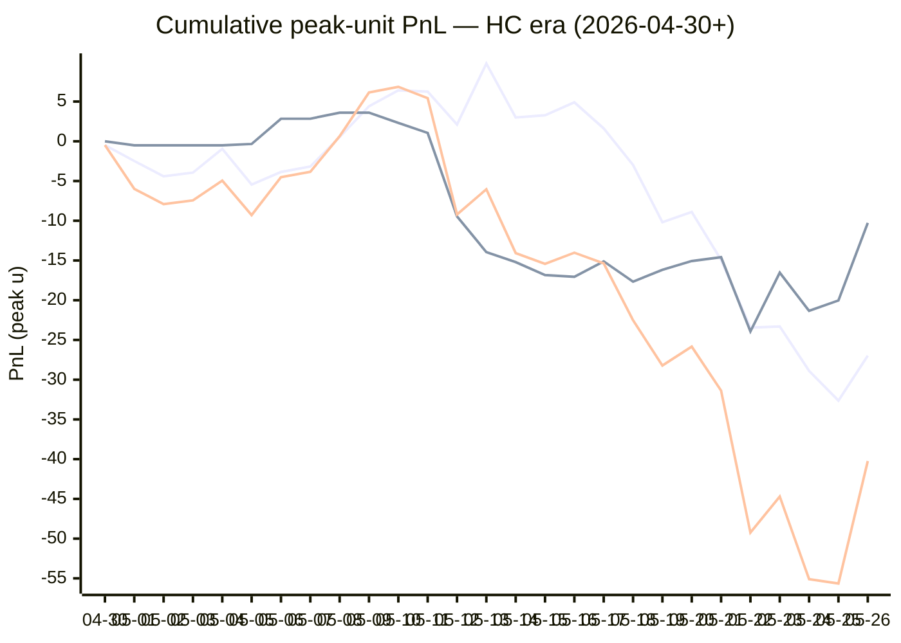

# Sharp Intel v6 — Daily Master Report

_Auto-generated **5/27/2026, 12:28:22 PM ET** by `scripts/dailyV6Report.js`. Do not edit by hand._

**Source of truth: this report mirrors the live Pick Performance dashboard.** Inclusion = `lockStage ≠ SHADOW ∧ ¬superseded ∧ health ∉ {MUTED, CANCELLED} ∧ peak.stars ≥ 2.5`. PnL is in **peak units** (the size shipped to users). HC margin / Δw / Δq are the **frozen** stamps written at last sync before the T-15 freeze. HC margin only existed from the v7.1 launch (**2026-04-30**); pre-launch picks have no HC value (no retro-fitting). Nothing is recomputed against today's whitelist.

v6 cutover: **2026-04-18** · whitelist source: live `sharpWalletProfiles` (220 profiles — drives §5 roster snapshot only) · quality cut: contribution ≥ 30 · HC = CONFIRMED tier ∧ sizeRatio ≥ 1.5.

---
## §1. Yesterday's picks

Slate: **2026-05-26** · 15 shipped sides.

| N | W-L-P | WR% | PnL (peak u) | PnL (flat 1u) |
|---|---|---|---|---|
| 15 | 11-4-0 | 73.3% | +15.41u | +5.14u |

| Sport | Market | Matchup | Pick | Stars · Units | HC | Δw | Δq | Σ | Odds | Result | PnL (peak u) |
|---|---|---|---|---|---|---|---|---|---|---|---|
| MLB | ML | Colorado Rockies @ Los Angeles Dodgers | Colorado Rockies | 5.0★ · 1.50u | +0 | +2 | +2 | +4 | +200 | L | -1.50u |
| MLB | ML | Los Angeles Angels @ Detroit Tigers | Los Angeles Angels | 2.5★ · 1.25u | +0 | +0 | +1 | +1 | +113 | **W** | +1.45u |
| MLB | ML | Miami Marlins @ Toronto Blue Jays | Toronto Blue Jays | 2.5★ · 1.25u | +0 | +1 | -1 | +0 | -130 | **W** | +1.02u |
| MLB | ML | New York Yankees @ Kansas City Royals | New York Yankees | 5.0★ · 5.00u | +0 | +1 | +0 | +1 | -200 | **W** | +1.88u |
| MLB | ML | Philadelphia Phillies @ San Diego Padres | Philadelphia Phillies | 5.0★ · 5.00u | +1 | +3 | +1 | +4 | -102 | **W** | +4.90u |
| MLB | ML | Seattle Mariners @ Athletics | Athletics | 5.0★ · 3.75u | +1 | +3 | +1 | +4 | -108 | L | -3.75u |
| MLB | ML | Tampa Bay Rays @ Baltimore Orioles | Baltimore Orioles | 5.0★ · 5.00u | +1 | +2 | +1 | +3 | -105 | **W** | +3.57u |
| MLB | ML | Washington Nationals @ Cleveland Guardians | Washington Nationals | 5.0★ · 2.50u | +0 | +1 | +0 | +1 | +116 | **W** | +2.90u |
| MLB | SPREAD | Colorado Rockies @ Los Angeles Dodgers | Colorado Rockies | 5.0★ · 1.00u | +1 | +2 | +1 | +3 | -101 | L | -1.00u |
| MLB | SPREAD | New York Yankees @ Kansas City Royals | Kansas City Royals | 4.0★ · 1.00u | +0 | +1 | +0 | +1 | +105 | L | -1.00u |
| MLB | TOTAL | Arizona Diamondbacks @ San Francisco Giants | Over 8 | 5.0★ · 1.65u | +0 | +2 | +1 | +3 | -110 | **W** | +1.50u |
| NBA | ML | Spurs @ Thunder | Thunder | 5.0★ · 5.00u | +4 | +2 | -1 | +1 | -198 | **W** | +1.93u |
| NBA | SPREAD | Spurs @ Thunder | Thunder | 5.0★ · 1.00u | +2 | +2 | +3 | +5 | -110 | **W** | +0.00u |
| NBA | TOTAL | Spurs @ Thunder | Over 216 | 5.0★ · 3.00u | +0 | +0 | +2 | +2 | -108 | **W** | +2.61u |
| NHL | SPREAD | Avalanche @ Golden Knights | Golden Knights | 5.0★ · 2.25u | +0 | +2 | +1 | +3 | -250 | **W** | +0.90u |

---
## §2. 3-day / 7-day / all-time cohort rollups

Shipped picks only. PnL in **peak units** (size we actually bet) and flat 1u (cohort EV lens). All margins are the engine's frozen stamps (`v8_hcMargin`, `v8_walletConsensusDelta`, `v8_walletConsensusQualityMargin`).

**HC margin sub-tables** are scoped to picks dated ≥ 2026-04-30 (the v7.1 launch — when HC margin became a real engine signal). Pre-launch picks are excluded from HC analysis since the feature didn't exist for them. Δw / Δq sub-tables span the full v6-era sample (≥ 2026-04-18). Empty buckets are dropped.

### §2a. 3-day

Total: **54** shipped · 30-24-0 · WR 55.6% · PnL +4.46u (peak) / +0.33u (flat).

**By HC margin** _(picks dated ≥ 2026-04-30, N = 54)_

| Bucket | N | W-L-P | WR% | PnL (peak u) | PnL (flat 1u) |
|---|---|---|---|---|---|
| HC ≥ +3 | 2 | 1-1-0 | 50.0% | -0.57u | -0.49u |
| HC = +2 | 3 | 2-1-0 | 66.7% | -1.14u | +1.39u |
| HC = +1 | 14 | 6-8-0 | 42.9% | -1.97u | -2.75u |
| HC = 0 | 33 | 20-13-0 | 60.6% | +6.26u | +2.34u |
| HC ≤ −1 | 2 | 1-1-0 | 50.0% | +1.88u | -0.16u |

**By Δw (winner margin)**

| Bucket | N | W-L-P | WR% | PnL (peak u) | PnL (flat 1u) |
|---|---|---|---|---|---|
| ≥ +3 | 8 | 2-6-0 | 25.0% | -6.79u | -4.11u |
| +2 | 17 | 11-6-0 | 64.7% | +2.39u | +3.02u |
| +1 | 21 | 11-10-0 | 52.4% | +2.17u | -1.77u |
| 0 | 6 | 5-1-0 | 83.3% | +5.67u | +3.70u |
| −1 | 2 | 1-1-0 | 50.0% | +1.02u | -0.52u |

**By Δq (quality margin)**

| Bucket | N | W-L-P | WR% | PnL (peak u) | PnL (flat 1u) |
|---|---|---|---|---|---|
| ≥ +3 | 6 | 4-2-0 | 66.7% | +2.41u | +0.87u |
| +2 | 7 | 2-5-0 | 28.6% | -2.98u | -3.54u |
| +1 | 19 | 9-10-0 | 47.4% | -2.94u | -2.79u |
| 0 | 15 | 10-5-0 | 66.7% | +8.34u | +4.13u |
| −1 | 6 | 5-1-0 | 83.3% | +4.63u | +2.66u |
| ≤ −2 | 1 | 0-1-0 | 0.0% | -5.00u | -1.00u |

**By AGS tier** _(picks dated ≥ 2026-05-05, N = 54)_

| Bucket | N | W-L-P | WR% | PnL (peak u) | PnL (flat 1u) |
|---|---|---|---|---|---|
| NEUT   (0 .. +3) | 51 | 29-22-0 | 56.9% | +5.91u | +1.37u |
| WEAK   (−1 .. 0) | 3 | 1-2-0 | 33.3% | -1.45u | -1.04u |

### §2b. 7-day

Total: **116** shipped · 62-53-1 · WR 53.9% · PnL -12.02u (peak) / -0.78u (flat).

**By HC margin** _(picks dated ≥ 2026-04-30, N = 116)_

| Bucket | N | W-L-P | WR% | PnL (peak u) | PnL (flat 1u) |
|---|---|---|---|---|---|
| HC ≥ +3 | 4 | 2-2-0 | 50.0% | -2.22u | -1.05u |
| HC = +2 | 6 | 2-4-0 | 33.3% | -14.14u | -1.61u |
| HC = +1 | 37 | 20-17-0 | 54.1% | -0.44u | +1.94u |
| HC = 0 | 66 | 37-28-1 | 56.9% | +5.90u | +1.10u |
| HC ≤ −1 | 3 | 1-2-0 | 33.3% | -1.12u | -1.16u |

**By Δw (winner margin)**

| Bucket | N | W-L-P | WR% | PnL (peak u) | PnL (flat 1u) |
|---|---|---|---|---|---|
| ≥ +3 | 22 | 8-14-0 | 36.4% | -14.29u | -7.52u |
| +2 | 29 | 17-12-0 | 58.6% | -2.64u | +3.29u |
| +1 | 44 | 25-19-0 | 56.8% | +3.22u | +1.11u |
| 0 | 18 | 11-6-1 | 64.7% | +1.92u | +3.87u |
| −1 | 3 | 1-2-0 | 33.3% | -0.23u | -1.52u |

**By Δq (quality margin)**

| Bucket | N | W-L-P | WR% | PnL (peak u) | PnL (flat 1u) |
|---|---|---|---|---|---|
| ≥ +3 | 17 | 10-7-0 | 58.8% | +0.66u | +0.56u |
| +2 | 18 | 5-13-0 | 27.8% | -14.07u | -8.34u |
| +1 | 40 | 21-18-1 | 53.8% | +1.49u | +0.08u |
| 0 | 26 | 18-8-0 | 69.2% | +11.09u | +7.42u |
| −1 | 13 | 8-5-0 | 61.5% | -1.19u | +1.49u |
| ≤ −2 | 2 | 0-2-0 | 0.0% | -10.00u | -2.00u |

**By AGS tier** _(picks dated ≥ 2026-05-05, N = 116)_

| Bucket | N | W-L-P | WR% | PnL (peak u) | PnL (flat 1u) |
|---|---|---|---|---|---|
| ELITE  (≥ +7) | 2 | 2-0-0 | 100.0% | +4.83u | +1.39u |
| STRONG (+3 .. +5) | 3 | 0-3-0 | 0.0% | -8.00u | -3.00u |
| NEUT   (0 .. +3) | 96 | 53-43-0 | 55.2% | -6.14u | +1.09u |
| WEAK   (−1 .. 0) | 13 | 5-7-1 | 41.7% | -3.54u | -2.28u |
| FADE   (< −1) | 2 | 2-0-0 | 100.0% | +0.83u | +2.02u |

### §2c. All-time

Total: **336** shipped · 167-166-3 · WR 50.2% · PnL -52.47u (peak) / -10.79u (flat).

**By HC margin** _(picks dated ≥ 2026-04-30, N = 225)_

| Bucket | N | W-L-P | WR% | PnL (peak u) | PnL (flat 1u) |
|---|---|---|---|---|---|
| HC ≥ +3 | 8 | 3-5-0 | 37.5% | -7.58u | -3.67u |
| HC = +2 | 18 | 7-11-0 | 38.9% | -22.71u | -3.64u |
| HC = +1 | 98 | 55-43-0 | 56.1% | +3.31u | +10.61u |
| HC = 0 | 95 | 50-43-2 | 53.8% | -10.27u | -2.15u |
| HC ≤ −1 | 5 | 1-4-0 | 20.0% | -4.62u | -3.16u |

**By Δw (winner margin)**

| Bucket | N | W-L-P | WR% | PnL (peak u) | PnL (flat 1u) |
|---|---|---|---|---|---|
| ≥ +3 | 68 | 35-33-0 | 51.5% | -17.90u | +4.62u |
| +2 | 84 | 39-45-0 | 46.4% | -29.29u | -7.74u |
| +1 | 114 | 64-49-1 | 56.6% | +9.71u | +6.65u |
| 0 | 53 | 23-28-2 | 45.1% | -12.65u | -7.71u |
| −1 | 10 | 2-8-0 | 20.0% | -5.83u | -6.46u |
| ≤ −2 | 1 | 0-1-0 | 0.0% | -0.50u | -1.00u |
| missing | 6 | 4-2-0 | 66.7% | +3.99u | +0.85u |

**By Δq (quality margin)**

| Bucket | N | W-L-P | WR% | PnL (peak u) | PnL (flat 1u) |
|---|---|---|---|---|---|
| ≥ +3 | 93 | 47-44-2 | 51.6% | -17.44u | +1.75u |
| +2 | 72 | 30-42-0 | 41.7% | -35.62u | -11.57u |
| +1 | 96 | 48-47-1 | 50.5% | -4.61u | -4.92u |
| 0 | 45 | 25-20-0 | 55.6% | +10.26u | +3.18u |
| −1 | 18 | 12-6-0 | 66.7% | +5.27u | +4.04u |
| ≤ −2 | 6 | 1-5-0 | 16.7% | -13.57u | -4.04u |
| missing | 6 | 4-2-0 | 66.7% | +3.24u | +0.77u |

**By AGS tier** _(picks dated ≥ 2026-05-05, N = 200)_

| Bucket | N | W-L-P | WR% | PnL (peak u) | PnL (flat 1u) |
|---|---|---|---|---|---|
| ELITE  (≥ +7) | 3 | 3-0-0 | 100.0% | +8.01u | +2.34u |
| LOCK   (+5 .. +7) | 9 | 5-4-0 | 55.6% | -2.93u | -0.47u |
| STRONG (+3 .. +5) | 22 | 13-9-0 | 59.1% | -6.66u | +2.77u |
| NEUT   (0 .. +3) | 136 | 69-67-0 | 50.7% | -30.34u | -7.29u |
| WEAK   (−1 .. 0) | 19 | 8-10-1 | 44.4% | -6.72u | -1.27u |
| FADE   (< −1) | 10 | 6-4-0 | 60.0% | +1.72u | +2.16u |
| missing | 1 | 1-0-0 | 100.0% | +1.63u | +0.96u |

---
## §3. Edge over time — is HC margin creating winners?

Daily cumulative peak-unit PnL since the HC margin launch (**2026-04-30**). The `HC ≥ +1` line is the golden-standard cohort. The `HC = 0` line is the no-HC-signal control. The `All shipped (HC era)` line is every shipped pick from the same date range — the apples-to-apples baseline. Watch the spread.

Daily cumulative table (peak units, HC era only):

| Date | HC ≥ +1 (cum) | HC = 0 (cum) | All shipped (cum) |
|---|---|---|---|
| 2026-04-30 | -0.48u | +0.00u | -0.48u |
| 2026-05-01 | -2.48u | -0.50u | -5.98u |
| 2026-05-02 | -4.41u | -0.50u | -7.91u |
| 2026-05-03 | -3.94u | -0.50u | -7.44u |
| 2026-05-04 | -0.95u | -0.50u | -4.95u |
| 2026-05-05 | -5.45u | -0.34u | -9.29u |
| 2026-05-06 | -3.86u | +2.84u | -4.52u |
| 2026-05-07 | -3.18u | +2.84u | -3.84u |
| 2026-05-08 | +0.54u | +3.60u | +0.64u |
| 2026-05-09 | +4.41u | +3.60u | +6.14u |
| 2026-05-10 | +6.41u | +2.32u | +6.86u |
| 2026-05-11 | +6.25u | +1.05u | +5.43u |
| 2026-05-12 | +2.11u | -9.45u | -9.21u |
| 2026-05-13 | +9.78u | -13.95u | -6.04u |
| 2026-05-14 | +3.00u | -15.20u | -14.07u |
| 2026-05-15 | +3.27u | -16.83u | -15.43u |
| 2026-05-16 | +4.90u | -17.05u | -14.02u |
| 2026-05-17 | +1.62u | -15.11u | -15.36u |
| 2026-05-18 | -2.98u | -17.67u | -22.52u |
| 2026-05-19 | -10.18u | -16.17u | -28.22u |
| 2026-05-20 | -8.90u | -15.07u | -25.84u |
| 2026-05-21 | -14.92u | -14.58u | -31.37u |
| 2026-05-22 | -23.44u | -23.93u | -49.24u |
| 2026-05-23 | -23.30u | -16.53u | -44.70u |
| 2026-05-24 | -28.89u | -21.34u | -55.10u |
| 2026-05-25 | -32.63u | -20.03u | -55.65u |
| 2026-05-26 | -26.98u | -10.27u | -40.24u |

---
## §4. Wallet roster growth & profitability

"Tracked in sport X" = a wallet has placed **≥ 2 bets** in X within the v6-era sample. "Profitable" = cumulative flat PnL > 0. Source: `v8Scoring.walletDetails` on every graded v6-era game (every side, not just the shipped set).

### §4a. Per-sport wallet snapshot

| Sport | Total wallets seen | Tracked (≥2) | Profitable | % prof | WR ≥ 50% | WR ≥ 60% | WR ≥ 70% |
|---|---|---|---|---|---|---|---|
| MLB | 58 | 39 | 14 | 36% | 16 | 8 | 5 |
| NBA | 131 | 97 | 42 | 43% | 55 | 27 | 11 |
| NHL | 57 | 38 | 16 | 42% | 26 | 11 | 7 |
| **ALL (any sport)** | **157** | **122** | **55** | **45%** | **68** | **33** | **14** |

### §4b. Daily roster growth (cumulative through each date)

Format: `tracked (profitable)`. For each date D, recompute the roster using every bet up to and including D.

| Date | ALL | MLB | NBA | NHL |
|---|---|---|---|---|
| 2026-04-18 | 5 (2) | 2 (2) | 3 (0) | 0 (0) |
| 2026-04-19 | 19 (8) | 5 (3) | 9 (3) | 3 (1) |
| 2026-04-20 | 29 (12) | 7 (6) | 23 (8) | 5 (2) |
| 2026-04-21 | 44 (21) | 10 (6) | 31 (10) | 7 (5) |
| 2026-04-22 | 52 (28) | 12 (6) | 39 (15) | 11 (10) |
| 2026-04-23 | 56 (29) | 13 (6) | 46 (21) | 13 (10) |
| 2026-04-24 | 61 (30) | 14 (6) | 51 (23) | 14 (9) |
| 2026-04-25 | 65 (29) | 16 (8) | 54 (22) | 16 (9) |
| 2026-04-26 | 67 (31) | 18 (5) | 56 (25) | 17 (9) |
| 2026-04-27 | 72 (32) | 20 (7) | 60 (24) | 17 (9) |
| 2026-04-28 | 76 (33) | 21 (7) | 63 (26) | 23 (10) |
| 2026-04-29 | 77 (33) | 21 (7) | 64 (25) | 23 (10) |
| 2026-04-30 | 81 (34) | 21 (7) | 70 (27) | 23 (10) |
| 2026-05-01 | 85 (38) | 22 (5) | 74 (30) | 26 (13) |
| 2026-05-02 | 86 (37) | 23 (7) | 75 (32) | 26 (12) |
| 2026-05-03 | 86 (38) | 24 (8) | 75 (33) | 26 (12) |
| 2026-05-04 | 90 (38) | 24 (9) | 76 (32) | 26 (12) |
| 2026-05-05 | 91 (40) | 24 (9) | 79 (33) | 26 (12) |
| 2026-05-06 | 92 (40) | 24 (9) | 80 (33) | 26 (12) |
| 2026-05-07 | 92 (41) | 24 (9) | 80 (33) | 26 (12) |
| 2026-05-08 | 92 (40) | 24 (8) | 80 (32) | 26 (11) |
| 2026-05-09 | 94 (42) | 24 (8) | 82 (35) | 26 (11) |
| 2026-05-10 | 94 (42) | 24 (8) | 82 (35) | 26 (11) |
| 2026-05-11 | 96 (42) | 24 (8) | 84 (36) | 26 (11) |
| 2026-05-12 | 100 (41) | 27 (9) | 86 (37) | 26 (11) |
| 2026-05-13 | 102 (45) | 29 (11) | 88 (37) | 26 (11) |
| 2026-05-14 | 102 (41) | 29 (11) | 88 (37) | 28 (12) |
| 2026-05-15 | 103 (41) | 30 (10) | 88 (39) | 28 (12) |
| 2026-05-16 | 105 (43) | 31 (12) | 88 (39) | 30 (14) |
| 2026-05-17 | 105 (46) | 32 (11) | 88 (40) | 30 (14) |
| 2026-05-18 | 105 (46) | 32 (10) | 88 (38) | 31 (15) |
| 2026-05-19 | 105 (46) | 32 (12) | 88 (38) | 31 (15) |
| 2026-05-20 | 106 (48) | 33 (12) | 88 (38) | 31 (16) |
| 2026-05-21 | 106 (45) | 34 (12) | 88 (37) | 31 (14) |
| 2026-05-22 | 106 (44) | 34 (10) | 88 (39) | 33 (16) |
| 2026-05-23 | 111 (49) | 36 (10) | 90 (40) | 36 (19) |
| 2026-05-24 | 117 (52) | 37 (12) | 94 (39) | 37 (16) |
| 2026-05-25 | 120 (53) | 38 (13) | 95 (40) | 38 (16) |
| 2026-05-26 | 122 (55) | 39 (14) | 97 (42) | 38 (16) |

### §4c. Top 10 profitable wallets by sport

#### MLB

| # | Wallet | N | W | L | WR% | Flat PnL (u) | Flat ROI | $ PnL |
|---|---|---|---|---|---|---|---|---|
| 1 | b31fc6 | 2 | 2 | 0 | 100.0% | +2.56 | +128.0% | $4.2K |
| 2 | c289a0 | 3 | 3 | 0 | 100.0% | +2.87 | +95.6% | $1.5K |
| 3 | 880232 | 2 | 2 | 0 | 100.0% | +1.82 | +90.9% | $130.1K |
| 4 | c9bba3 | 2 | 2 | 0 | 100.0% | +1.68 | +83.8% | $50.1K |
| 5 | eeabaf | 15 | 10 | 5 | 66.7% | +10.89 | +72.6% | $815.0K |
| 6 | c668b3 | 10 | 7 | 3 | 70.0% | +3.49 | +34.9% | $398 |
| 7 | a10ff5 | 23 | 14 | 9 | 60.9% | +5.52 | +24.0% | $28.5K |
| 8 | 981187 | 8 | 5 | 3 | 62.5% | +1.65 | +20.7% | $13.5K |
| 9 | a0cff6 | 2 | 1 | 1 | 50.0% | +0.34 | +17.0% | -$1.7K |
| 10 | 7923c4 | 25 | 14 | 11 | 56.0% | +1.96 | +7.9% | $2.2K |

#### NBA

| # | Wallet | N | W | L | WR% | Flat PnL (u) | Flat ROI | $ PnL |
|---|---|---|---|---|---|---|---|---|
| 1 | 799fad | 2 | 2 | 0 | 100.0% | +5.66 | +283.0% | $241.7K |
| 2 | 4a9953 | 2 | 2 | 0 | 100.0% | +2.16 | +108.2% | $3.7K |
| 3 | f9e3d0 | 2 | 2 | 0 | 100.0% | +1.91 | +95.7% | $50.6K |
| 4 | 12ad50 | 3 | 3 | 0 | 100.0% | +2.74 | +91.3% | $45.5K |
| 5 | b51a56 | 6 | 5 | 1 | 83.3% | +5.44 | +90.7% | $74.4K |
| 6 | 11b032 | 7 | 6 | 1 | 85.7% | +5.40 | +77.1% | $249.9K |
| 7 | 769c38 | 13 | 12 | 1 | 92.3% | +9.01 | +69.3% | $100.0K |
| 8 | 8ec926 | 7 | 6 | 1 | 85.7% | +4.53 | +64.7% | $7.9K |
| 9 | 2e8da5 | 11 | 8 | 3 | 72.7% | +7.06 | +64.2% | $84.1K |
| 10 | 7f00bc | 17 | 11 | 6 | 64.7% | +8.63 | +50.7% | $11.7K |

#### NHL

| # | Wallet | N | W | L | WR% | Flat PnL (u) | Flat ROI | $ PnL |
|---|---|---|---|---|---|---|---|---|
| 1 | 8366f5 | 2 | 2 | 0 | 100.0% | +2.30 | +114.9% | $107.6K |
| 2 | 799fad | 2 | 2 | 0 | 100.0% | +1.88 | +94.1% | $46.9K |
| 3 | fec67e | 4 | 3 | 1 | 75.0% | +2.82 | +70.5% | $12.5K |
| 4 | 30935c | 4 | 3 | 1 | 75.0% | +2.11 | +52.7% | $953 |
| 5 | 981187 | 8 | 6 | 2 | 75.0% | +3.52 | +44.0% | -$25.2K |
| 6 | bc35e3 | 5 | 4 | 1 | 80.0% | +1.62 | +32.3% | $9.3K |
| 7 | fcc12b | 10 | 7 | 3 | 70.0% | +3.15 | +31.5% | -$67.5K |
| 8 | e70853 | 9 | 6 | 3 | 66.7% | +2.66 | +29.5% | -$11.1K |
| 9 | c5cea1 | 3 | 2 | 1 | 66.7% | +0.62 | +20.7% | $22.1K |
| 10 | dfa240 | 24 | 15 | 9 | 62.5% | +4.32 | +18.0% | $14.2K |

---
## §5. Proven-wallet roster growth & HC tracking

"Proven wallet" = whitelist tier `CONFIRMED` or `FLAT` in the same sense the live engine uses (`exportWalletProfiles.js` → `sharpWalletProfiles.bySport`). Sports inherit independent rosters: a wallet can be CONFIRMED in NBA and absent from NHL. `walletBets` come from `v8Scoring.walletDetails` on every graded v6-era pick (Source A); `positionRows` come from `sharp_action_positions` (Source B).

### §5a. Current proven-winner roster (snapshot)

Roster as of **2026-05-26** — wallets with ≥2 bets in the sport.

| Sport | Wallets seen | Eligible (≥2) | CONFIRMED | FLAT | Proven (C+F) | WR50 only | Conv % |
|---|---|---|---|---|---|---|---|
| MLB | 104 | 39 | 8 | 6 | **14** | 2 | 13.5% |
| NBA | 190 | 97 | 28 | 14 | **42** | 19 | 22.1% |
| NHL | 93 | 38 | 10 | 6 | **16** | 10 | 17.2% |
| **ALL** | **—** | **—** | **—** | **—** | **72** | **—** | **—** |

### §5b. Live whitelist drift check

Live `sharpWalletProfiles` is what the engine reads at lock time. Drift between script reconstruction (above) and live should be ≤ 1 day of position data — otherwise `exportWalletProfiles.js` is stale.

| Sport | CONFIRMED (live · script) | FLAT (live · script) | WR50 (live · script) | Drift |
|---|---|---|---|---|
| MLB | 24 · 8 | 7 · 6 | 4 · 2 | +17 live |
| NBA | 50 · 28 | 24 · 14 | 23 · 19 | +32 live |
| NHL | 19 · 10 | 7 · 6 | 11 · 10 | +10 live |

### §5c. Roster growth — 3d / 7d / 30d / all-time deltas

Each cell is **net growth** in proven (CONFIRMED + FLAT) wallets in that window, with the absolute count at the start (`+Δ from N`). Negative = wallets demoted. Window endpoint = 2026-05-26.

| Sport | 3-day | 7-day | 30-day | All-time (since cutover) |
|---|---|---|---|---|
| MLB | +4 from 10 | +2 from 12 | +9 from 5 | +14 from 0 |
| NBA | +2 from 40 | +4 from 38 | +17 from 25 | +42 from 0 |
| NHL | -3 from 19 | +1 from 15 | +7 from 9 | +16 from 0 |

A flat 7-day delta on a sport with healthy slate density = either the bubble pipeline has stalled (no wallets approaching the bar) or our cohort has saturated. Check §13d for the funnel diagnostic.

### §5d. Pipeline funnel — where each sport leaks

Wallets surviving each gate, in order. The biggest %-drop tells you the bottleneck. Gates:

1. **Seen** — placed ≥ 1 bet in the sport (any source)
2. **Eligible** — ≥ 2 graded picks in Source A (required for FLAT/CONFIRMED)
3. **Flat-OK** — eligible AND flat ROI > 0 (becomes FLAT or better)
4. **$-OK** — Flat-OK AND ≥2 positions with dollar ROI > 0 (CONFIRMED)
5. **Promoted** — final whitelisted = CONFIRMED + FLAT

| Sport | 1·Seen | 2·Eligible (% of Seen) | 3·Flat-OK (% of Elig) | 4·$-OK (% of Flat) | 5·Promoted | Bottleneck |
|---|---|---|---|---|---|---|
| MLB | 104 | 39 (38%) | 14 (36%) | 8 (57%) | **14** | edge (Eligible→Flat-OK) 64% |
| NBA | 190 | 97 (51%) | 42 (43%) | 28 (67%) | **42** | edge (Eligible→Flat-OK) 57% |
| NHL | 93 | 38 (41%) | 16 (42%) | 10 (63%) | **16** | sample (Seen→Eligible) 59% |

### §5e. HC backing density (the fuel for v7.3 HC margin)

Every v7.x promotion is gated on `HC_m ≥ +1`, which requires at least one CONFIRMED wallet sized at `≥ 1.5×` average on the for-side. This table shows the share of shipped picks that *had any HC backing*, by sport, in each window. If HC density falls toward zero in a sport, the v7.3 floor cohorts (Σ=1, Σ=2 locks; HC rescues) will simply stop firing there.

| Sport | Window | Picks (with HC stamp) | Any HC for-side | HC_m ≥ +1 | HC_m ≥ +2 |
|---|---|---|---|---|---|
| MLB | 3-day | 43 | 13 (30.2%) | 13 (30.2%) | 1 (2.3%) |
| MLB | 7-day | 89 | 31 (34.8%) | 30 (33.7%) | 3 (3.4%) |
| MLB | All-time | 180 | 78 (43.3%) | 76 (42.2%) | 8 (4.4%) |
| NBA | 3-day | 7 | 6 (85.7%) | 4 (57.1%) | 3 (42.9%) |
| NBA | 7-day | 16 | 14 (87.5%) | 10 (62.5%) | 5 (31.3%) |
| NBA | All-time | 113 | 72 (63.7%) | 61 (54.0%) | 27 (23.9%) |
| NHL | 3-day | 4 | 2 (50.0%) | 2 (50.0%) | 1 (25.0%) |
| NHL | 7-day | 11 | 7 (63.6%) | 7 (63.6%) | 2 (18.2%) |
| NHL | All-time | 37 | 18 (48.6%) | 17 (45.9%) | 4 (10.8%) |

Pooled across sports:

| Window | Picks (with HC stamp) | Any HC for-side | HC_m ≥ +1 | HC_m ≥ +2 |
|---|---|---|---|---|
| 3-day | 54 | 21 (38.9%) | 19 (35.2%) | 5 (9.3%) |
| 7-day | 116 | 52 (44.8%) | 47 (40.5%) | 10 (8.6%) |
| All-time | 330 | 168 (50.9%) | 154 (46.7%) | 39 (11.8%) |

### §5f. Bubble wallets — next-up graduations

Wallets currently NOT promoted but close. Two flavors:

- **One-bet-away** — won the only bet, needs one more positive bet to clear ≥2.
- **Just-under** — has ≥2 bets but flat ROI is between −10% and 0% (one win flips them).

#### MLB

**One-bet-away** (5)

| wallet | picksN | flat PnL | pos N | pos $ROI |
|---|---|---|---|---|
| `...be17` | 1 | +6.95 | 6 | -46% |
| `...be00` | 1 | +0.87 | 13 | 1% |
| `...a240` | 1 | +0.87 | 7 | 83% |
| `...9373` | 1 | +0.87 | 0 | — |
| `...8d26` | 1 | +0.72 | 5 | -22% |

**Just-under** (6)

| wallet | picksN | WR | flat ROI | pos N | pos $ROI |
|---|---|---|---|---|---|
| `...2768` | 20 | 45% | -3.2% | 37 | 9% |
| `...9a27` | 133 | 47% | -5.4% | 352 | 2% |
| `...9d74` | 29 | 48% | -5.9% | 85 | -15% |
| `...c12b` | 40 | 48% | -6.5% | 67 | -19% |
| `...35e3` | 22 | 50% | -6.7% | 74 | -16% |
| `...2f63` | 80 | 48% | -6.9% | 572 | -4% |

#### NBA

**One-bet-away** (6)

| wallet | picksN | flat PnL | pos N | pos $ROI |
|---|---|---|---|---|
| `...bf5d` | 1 | +3.15 | 3 | 42% |
| `...ed41` | 1 | +3.15 | 3 | 3% |
| `...6b87` | 1 | +2.05 | 8 | -27% |
| `...c991` | 1 | +1.14 | 8 | 77% |
| `...d6d2` | 1 | +0.98 | 32 | 1% |
| `...9d74` | 1 | +0.93 | 27 | -35% |

**Just-under** (6)

| wallet | picksN | WR | flat ROI | pos N | pos $ROI |
|---|---|---|---|---|---|
| `...d814` | 8 | 50% | -0.5% | 48 | 8% |
| `...d96a` | 19 | 37% | -1.5% | 72 | -27% |
| `...65dd` | 6 | 50% | -2.4% | 17 | 27% |
| `...853d` | 40 | 53% | -2.7% | 90 | -2% |
| `...f5b0` | 20 | 50% | -3.7% | 57 | -28% |
| `...0c2e` | 2 | 50% | -3.7% | 14 | -3% |

#### NHL

**One-bet-away** (6)

| wallet | picksN | flat PnL | pos N | pos $ROI |
|---|---|---|---|---|
| `...2e78` | 1 | +1.46 | 0 | — |
| `...017f` | 1 | +1.45 | 5 | 125% |
| `...32f2` | 1 | +1.40 | 0 | — |
| `...e0fd` | 1 | +1.20 | 3 | 124% |
| `...266e` | 1 | +1.05 | 0 | — |
| `...2194` | 1 | +1.05 | 0 | — |

**Just-under** (5)

| wallet | picksN | WR | flat ROI | pos N | pos $ROI |
|---|---|---|---|---|---|
| `...33ee` | 4 | 50% | -0.3% | 8 | -23% |
| `...afd2` | 6 | 50% | -1.9% | 14 | -10% |
| `...618e` | 2 | 50% | -6.1% | 28 | 24% |
| `...d227` | 2 | 50% | -9.0% | 19 | 21% |
| `...853d` | 10 | 50% | -9.8% | 24 | -3% |

### §5g. v2 wallet-promotion pipeline (Source-A / Source-B mix)

Live snapshot of the v2 promotion gate (shipped 2026-05-10, re-eval **2026-05-24**). Each FLAT-or-better wallet × sport pair is attributed to one of three paths via `sharpWalletProfiles[wallet].bySport[sport].whitelistSource`:

- **A** — flat-positive on featured picks (Source A) only — the v1 gate
- **A+B** — flat-positive in both sources (most reliable signal)
- **B** — flat-positive on-chain only (NEW in v2 — the trial lift)

Re-classified every 2h via `grade-sharp-actions` cron. Roll-back: set `B_ONLY_MIN_BETS = Infinity` in `scripts/exportWalletProfiles.js`.

#### Source mix per sport (live Firestore)

| Sport | A | A+B | B (new) | FLAT-or-better total | % from B-only |
|---|---|---|---|---|---|
| MLB | 3 | 11 | **17** | 31 | 54.8% |
| NBA | 13 | 29 | **32** | 74 | 43.2% |
| NHL | 6 | 10 | **10** | 26 | 38.5% |
| **ALL** | **22** | **50** | **59** | **131** | **45.0%** |

#### Pipeline freshness

- `sharp_action_positions` GRADED rows: **9195**
- `sharp_action_positions` PENDING rows: **91** (queued for next Grade Sharp Actions run)
- Latest `sharpWalletProfiles` rebuild: 5/27/2026, 8:17:58 AM ET — **250 min · STALE** — check grade-sharp-actions workflow

**Alarms**: pending > 200 OR rebuild lag > 4h → cron is lagging or failing — check `gh run list --workflow="Grade Sharp Actions"`.

#### B-only roster — wallets currently promoted via Source B path only

Wallets here would have been EXCLUDED under v1 (Source-A-only). Top by Source-B bet count per sport. The 2-week re-eval (2026-05-24) will compare these wallets' realized lift against A-only and A+B cohorts.

**MLB** — 17 wallets promoted via B

| wallet | tier | B_n | B_flat ROI | B_$ ROI |
|---|---|---|---|---|
| `...9a27` | CONFIRMED | 352 | +13.7% | +2.3% |
| `...135d` | CONFIRMED | 326 | +1.9% | +6.9% |
| `...d96a` | CONFIRMED | 116 | +0.3% | +13.3% |
| `...2768` | CONFIRMED | 37 | +4.3% | +9% |
| `...69c2` | CONFIRMED | 34 | +32.5% | +1.6% |
| `...d6d2` | FLAT | 30 | +4.3% | -36.6% |
| `...f804` | CONFIRMED | 11 | +37.5% | +40.6% |
| `...aeeb` | CONFIRMED | 9 | +21.6% | +32% |
| `...a9cc` | CONFIRMED | 8 | +6.3% | +0.3% |
| `...ec43` | CONFIRMED | 8 | +9.1% | +17.7% |
| … | 7 more | | | |

**NBA** — 32 wallets promoted via B

| wallet | tier | B_n | B_flat ROI | B_$ ROI |
|---|---|---|---|---|
| `...135d` | FLAT | 102 | +5.1% | -11.9% |
| `...3782` | CONFIRMED | 64 | +2% | +1.1% |
| `...935c` | FLAT | 50 | +17.3% | -21.4% |
| `...b6ef` | CONFIRMED | 41 | +8.9% | +7.2% |
| `...d6d2` | CONFIRMED | 37 | +4.8% | +26.6% |
| `...d227` | CONFIRMED | 36 | +3.1% | +25.7% |
| `...be00` | FLAT | 33 | +0.9% | -1.8% |
| `...9791` | CONFIRMED | 19 | +3.7% | +14.6% |
| `...0ff5` | CONFIRMED | 17 | +33.9% | +59.4% |
| `...0f9a` | CONFIRMED | 17 | +71.6% | +57.9% |
| … | 22 more | | | |

**NHL** — 10 wallets promoted via B

| wallet | tier | B_n | B_flat ROI | B_$ ROI |
|---|---|---|---|---|
| `...2125` | CONFIRMED | 33 | +53.2% | +50.3% |
| `...618e` | CONFIRMED | 28 | +6.2% | +23.8% |
| `...b33b` | CONFIRMED | 20 | +17% | +20.5% |
| `...d227` | CONFIRMED | 19 | +5.8% | +20.9% |
| `...b989` | CONFIRMED | 12 | +13.1% | +30.4% |
| `...0c2e` | CONFIRMED | 10 | +72.1% | +49.3% |
| `...a9cc` | CONFIRMED | 7 | +49.5% | +46.9% |
| `...44b0` | FLAT | 7 | +37.1% | -33.1% |
| `...be00` | CONFIRMED | 6 | +87% | +81.4% |
| `...017f` | CONFIRMED | 5 | +130% | +124.5% |

### §5 — How to read

- **Roster growth flat in 7-day** + **funnel bottleneck = `data`** → re-run `exportWalletProfiles.js`. The flat-positive wallets are stuck at FLAT because Source-B coverage hasn't caught up. CONFIRMED gate is data-bound, not skill-bound.
- **Roster growth flat in 7-day** + **funnel bottleneck = `sample`** → wallets aren't reaching `≥2` reps fast enough. This is a slate-density problem; consider a soft `MIN_BETS = 1` shadow lane to surface bubble wallets earlier.
- **Roster shrank** (negative delta) → a previously CONFIRMED wallet just dropped flat-positive (lost a recent bet). Variance, not failure — but worth noting if a sport loses ≥3 in a week.
- **HC density on a sport drops below ~30%** → v7.3 promotions there will starve. Either the proven roster needs more CONFIRMED-tier wallets sizing aggressively, or the HC_RATIO (1.5) needs a sport-specific tune.
- **§5g B-only count drops sharply** → wallets are demoting off the B path (losing on-chain). Cross-check `WALLET_PROFILES_SUMMARY.md` churn section for the specific demotions.
- **§5g pipeline freshness lag > 4h** → grade-sharp-actions cron is failing. Check `gh run list --workflow="Grade Sharp Actions"` and re-trigger if needed.

---
## §6. Daily proven-wallet performance

Who on the proven roster is actually printing — yesterday's bets, the rolling leaderboard (`$ PnL`-ranked), current streaks, and per-sport volume. **Proven** = `CONFIRMED` ∪ `FLAT` per sport (the same gate that drives Δ_winner). A wallet only counts in a sport where it's on that sport's proven list.

### §6a. Yesterday's proven-wallet bets

Slate: **2026-05-26** · 32 bets · 17 distinct proven wallets · WR 72% · $ vol $422.8K · $ PnL $265.3K.

| Wallet | Sport | Market | Game | $ size | Result | $ PnL |
|---|---|---|---|---|---|---|
| `...9a27` (CONFIRMED) | NBA | SPREAD | Spurs @ Thunder | $56.0K | **W** | $54.9K |
| `...aeeb` (CONFIRMED) | NBA | ML | Spurs @ Thunder | $87.0K | **W** | $44.8K |
| `...abaf` (CONFIRMED) | MLB | ML | St. Louis Cardinals @ Milwaukee Brewers | $23.1K | **W** | $41.6K |
| `...64aa` (CONFIRMED) | MLB | ML | Arizona Diamondbacks @ San Francisco Giants | $33.0K | **W** | $31.4K |
| `...64aa` (CONFIRMED) | MLB | ML | Miami Marlins @ Toronto Blue Jays | $25.2K | **W** | $20.7K |
| `...aeeb` (CONFIRMED) | NBA | SPREAD | Spurs @ Thunder | $20.8K | **W** | $20.4K |
| `...abaf` (FLAT) | NBA | SPREAD | Spurs @ Thunder | $16.0K | **W** | $15.7K |
| `...64aa` (CONFIRMED) | MLB | ML | Los Angeles Angels @ Detroit Tigers | $13.5K | **W** | $15.7K |
| `...0ff5` (FLAT) | MLB | ML | St. Louis Cardinals @ Milwaukee Brewers | $7.5K | **W** | $13.6K |
| `...9ef0` (CONFIRMED) | NBA | SPREAD | Spurs @ Thunder | $12.9K | **W** | $12.7K |
| `...64aa` (CONFIRMED) | MLB | ML | New York Yankees @ Kansas City Royals | $19.5K | **W** | $9.8K |
| `...64aa` (CONFIRMED) | MLB | ML | Washington Nationals @ Cleveland Guardians | $7.1K | **W** | $8.2K |
| `...abaf` (CONFIRMED) | MLB | TOTAL | Philadelphia Phillies @ San Diego Padres | $6.4K | **W** | $5.6K |
| `...0ff5` (FLAT) | MLB | ML | Philadelphia Phillies @ San Diego Padres | $5.3K | **W** | $5.2K |
| `...e3d0` (FLAT) | NBA | SPREAD | Spurs @ Thunder | $4.9K | **W** | $4.8K |
| `...abaf` (CONFIRMED) | MLB | ML | Cincinnati Reds @ New York Mets | $5.8K | **W** | $4.8K |
| `...1eae` (CONFIRMED) | MLB | ML | Philadelphia Phillies @ San Diego Padres | $4.8K | **W** | $4.7K |
| `...2f63` (FLAT) | NBA | TOTAL | Spurs @ Thunder | $3.9K | **W** | $3.4K |
| `...44b0` (CONFIRMED) | NBA | TOTAL | Spurs @ Thunder | $2.5K | **W** | $2.2K |
| `...64aa` (CONFIRMED) | MLB | ML | Tampa Bay Rays @ Baltimore Orioles | $2.2K | **W** | $2.1K |
| `...23c4` (FLAT) | MLB | TOTAL | St. Louis Cardinals @ Milwaukee Brewers | $1.7K | **W** | $1.6K |
| `...35e3` (CONFIRMED) | NHL | SPREAD | Avalanche @ Golden Knights | $3.7K | **W** | $1.5K |
| `...df91` (FLAT) | NBA | ML | Spurs @ Thunder | $174 | **W** | $90 |
| `...cff6` (CONFIRMED) | MLB | ML | St. Louis Cardinals @ Milwaukee Brewers | $1.9K | L | -$1.9K |
| `...2f63` (FLAT) | NBA | SPREAD | Spurs @ Thunder | $2.0K | L | -$2.0K |
| `...00bc` (CONFIRMED) | NBA | SPREAD | Spurs @ Thunder | $2.6K | L | -$2.6K |
| `...03d4` (FLAT) | NBA | SPREAD | Spurs @ Thunder | $2.6K | L | -$2.6K |
| `...1eae` (CONFIRMED) | MLB | ML | Arizona Diamondbacks @ San Francisco Giants | $3.0K | L | -$3.0K |
| `...1eae` (CONFIRMED) | MLB | ML | Seattle Mariners @ Athletics | $3.0K | L | -$3.0K |
| `...abaf` (CONFIRMED) | MLB | SPREAD | New York Yankees @ Kansas City Royals | $4.9K | L | -$4.9K |
| `...0ff5` (FLAT) | MLB | ML | Seattle Mariners @ Athletics | $5.0K | L | -$5.0K |
| `...1187` (FLAT) | NHL | ML | Avalanche @ Golden Knights | $35.0K | L | -$35.0K |

### §6b. Proven-wallet leaderboard

Top 15 proven `(wallet × sport)` pairs per sport per horizon, ranked by **$ PnL** (the dollar-ROI lens). The 3-day board is the "who's on form right now" lens; the 7-day filters single-day variance; all-time is the proven-roster reference.

#### §6b-1. 3-day

**MLB** — 8 active proven wallets

| # | Wallet | Tier | Bets | WR% | Bets/day | Flat PnL (u) | Flat ROI | $ vol | $ PnL | $ ROI | Streak |
|---|---|---|---|---|---|---|---|---|---|---|---|
| 1 | `...abaf` | CONFIRMED | 9 | 67% | 3.0 | +9.21 | +102% | $284.7K | $855.7K | +301% | 2W |
| 2 | `...64aa` | CONFIRMED | 15 | 73% | 5.0 | +5.05 | +34% | $360.3K | $120.2K | +33% | 6W |
| 3 | `...bba3` | CONFIRMED | 2 | 100% | 1.0 | +1.68 | +84% | $61.0K | $50.1K | +82% | 2W |
| 4 | `...1eae` | CONFIRMED | 11 | 55% | 3.7 | +1.44 | +13% | $40.0K | $16.2K | +41% | 1L |
| 5 | `...0ff5` | FLAT | 6 | 50% | 2.0 | +0.78 | +13% | $28.7K | $8.3K | +29% | 1W |
| 6 | `...cff6` | CONFIRMED | 2 | 50% | 0.7 | +0.34 | +17% | $2.0K | -$1.7K | -88% | 1L |
| 7 | `...68b3` | FLAT | 6 | 83% | 3.0 | +3.33 | +56% | $7.9K | -$2.5K | -31% | 1W |
| 8 | `...23c4` | FLAT | 14 | 57% | 4.7 | +1.19 | +9% | $188.0K | -$74.2K | -39% | 3W |

**NBA** — 20 active proven wallets

| # | Wallet | Tier | Bets | WR% | Bets/day | Flat PnL (u) | Flat ROI | $ vol | $ PnL | $ ROI | Streak |
|---|---|---|---|---|---|---|---|---|---|---|---|
| 1 | `...2ca8` | CONFIRMED | 2 | 100% | 1.0 | +1.48 | +74% | $724.7K | $529.6K | +73% | 2W |
| 2 | `...aeeb` | CONFIRMED | 3 | 100% | 1.5 | +2.29 | +76% | $108.0K | $65.4K | +61% | 3W |
| 3 | `...2f63` | FLAT | 8 | 63% | 2.7 | +1.47 | +18% | $107.6K | $63.5K | +59% | 1W |
| 4 | `...e3d0` | FLAT | 2 | 100% | 0.7 | +1.91 | +96% | $53.9K | $50.6K | +94% | 2W |
| 5 | `...abaf` | FLAT | 1 | 100% | 1.0 | +0.98 | +98% | $16.0K | $15.7K | +98% | 1W |
| 6 | `...9ef0` | CONFIRMED | 3 | 33% | 1.5 | -1.02 | -34% | $17.9K | $7.7K | +43% | 1W |
| 7 | `...9c38` | CONFIRMED | 1 | 100% | 1.0 | +0.79 | +79% | $8.7K | $6.9K | +79% | 1W |
| 8 | `...b33b` | CONFIRMED | 2 | 50% | 1.0 | -0.07 | -4% | $4.4K | $4.0K | +91% | 1W |
| 9 | `...11a4` | CONFIRMED | 1 | 100% | 1.0 | +0.79 | +79% | $4.1K | $3.2K | +79% | 1W |
| 10 | `...44b0` | CONFIRMED | 1 | 100% | 1.0 | +0.87 | +87% | $2.5K | $2.2K | +87% | 1W |
| 11 | `...03d4` | FLAT | 3 | 67% | 1.0 | +0.61 | +20% | $6.1K | $3 | +0% | 1L |
| 12 | `...df91` | FLAT | 2 | 50% | 0.7 | -0.48 | -24% | $348 | -$84 | -24% | 1W |
| 13 | `...00bc` | CONFIRMED | 1 | 0% | 1.0 | -1.00 | -100% | $2.6K | -$2.6K | -100% | 1L |
| 14 | `...e8f1` | FLAT | 1 | 0% | 1.0 | -1.00 | -100% | $4.1K | -$4.1K | -100% | 1L |
| 15 | `...5348` | CONFIRMED | 1 | 0% | 1.0 | -1.00 | -100% | $4.4K | -$4.4K | -100% | 1L |

**NHL** — 3 active proven wallets

| # | Wallet | Tier | Bets | WR% | Bets/day | Flat PnL (u) | Flat ROI | $ vol | $ PnL | $ ROI | Streak |
|---|---|---|---|---|---|---|---|---|---|---|---|
| 1 | `...35e3` | CONFIRMED | 2 | 100% | 1.0 | +0.89 | +44% | $11.3K | $5.2K | +46% | 2W |
| 2 | `...5ad0` | FLAT | 1 | 0% | 1.0 | -1.00 | -100% | $5.6K | -$5.6K | -100% | 1L |
| 3 | `...1187` | FLAT | 2 | 0% | 0.7 | -2.00 | -100% | $75.0K | -$75.0K | -100% | 2L |

#### §6b-2. 7-day

**MLB** — 10 active proven wallets

| # | Wallet | Tier | Bets | WR% | Bets/day | Flat PnL (u) | Flat ROI | $ vol | $ PnL | $ ROI | Streak |
|---|---|---|---|---|---|---|---|---|---|---|---|
| 1 | `...abaf` | CONFIRMED | 12 | 67% | 1.7 | +9.97 | +83% | $383.9K | $800.9K | +209% | 2W |
| 2 | `...0232` | CONFIRMED | 1 | 100% | 1.0 | +0.91 | +91% | $70.3K | $63.9K | +91% | 1W |
| 3 | `...bba3` | CONFIRMED | 2 | 100% | 1.0 | +1.68 | +84% | $61.0K | $50.1K | +82% | 2W |
| 4 | `...1eae` | CONFIRMED | 18 | 67% | 3.0 | +6.88 | +38% | $58.7K | $31.4K | +54% | 1L |
| 5 | `...0ff5` | FLAT | 11 | 64% | 1.6 | +3.95 | +36% | $52.2K | $26.7K | +51% | 1W |
| 6 | `...64aa` | CONFIRMED | 33 | 58% | 4.7 | +1.19 | +4% | $713.0K | $6.0K | +1% | 6W |
| 7 | `...1fc6` | CONFIRMED | 1 | 100% | 1.0 | +1.26 | +126% | $1.6K | $2.0K | +126% | 1W |
| 8 | `...cff6` | CONFIRMED | 2 | 50% | 0.7 | +0.34 | +17% | $2.0K | -$1.7K | -88% | 1L |
| 9 | `...68b3` | FLAT | 7 | 71% | 1.8 | +2.33 | +33% | $9.1K | -$3.6K | -40% | 1W |
| 10 | `...23c4` | FLAT | 19 | 58% | 3.2 | +2.11 | +11% | $337.3K | -$47.9K | -14% | 3W |

**NBA** — 27 active proven wallets

| # | Wallet | Tier | Bets | WR% | Bets/day | Flat PnL (u) | Flat ROI | $ vol | $ PnL | $ ROI | Streak |
|---|---|---|---|---|---|---|---|---|---|---|---|
| 1 | `...2ca8` | CONFIRMED | 5 | 60% | 1.0 | +0.62 | +12% | $1.51M | $519.6K | +34% | 3W |
| 2 | `...1697` | CONFIRMED | 1 | 100% | 1.0 | +1.10 | +110% | $180.0K | $198.0K | +110% | 1W |
| 3 | `...aeeb` | CONFIRMED | 7 | 86% | 1.0 | +3.12 | +45% | $219.8K | $106.1K | +48% | 3W |
| 4 | `...9a27` | CONFIRMED | 14 | 50% | 2.0 | -0.71 | -5% | $548.2K | $102.7K | +19% | 1W |
| 5 | `...3532` | FLAT | 6 | 50% | 1.5 | -0.45 | -7% | $144.1K | $94.6K | +66% | 2L |
| 6 | `...e3d0` | FLAT | 2 | 100% | 0.7 | +1.91 | +96% | $53.9K | $50.6K | +94% | 2W |
| 7 | `...abaf` | FLAT | 3 | 100% | 0.6 | +3.03 | +101% | $43.3K | $42.3K | +98% | 3W |
| 8 | `...9c38` | CONFIRMED | 3 | 100% | 0.6 | +2.43 | +81% | $42.3K | $33.0K | +78% | 3W |
| 9 | `...b33b` | CONFIRMED | 3 | 67% | 0.8 | +1.03 | +34% | $20.7K | $22.0K | +106% | 1W |
| 10 | `...11a4` | CONFIRMED | 4 | 75% | 0.7 | +1.86 | +47% | $21.1K | $14.7K | +69% | 3W |
| 11 | `...d49f` | CONFIRMED | 1 | 100% | 1.0 | +0.91 | +91% | $14.7K | $13.4K | +91% | 1W |
| 12 | `...03d4` | FLAT | 9 | 67% | 1.3 | +2.67 | +30% | $28.9K | $11.9K | +41% | 1L |
| 13 | `...9ef0` | CONFIRMED | 5 | 40% | 0.8 | -0.92 | -18% | $24.4K | $7.1K | +29% | 1W |
| 14 | `...1eae` | CONFIRMED | 1 | 100% | 1.0 | +1.10 | +110% | $4.3K | $4.7K | +110% | 1W |
| 15 | `...df91` | FLAT | 4 | 75% | 0.6 | +1.04 | +26% | $5.4K | $2.2K | +39% | 1W |

**NHL** — 10 active proven wallets

| # | Wallet | Tier | Bets | WR% | Bets/day | Flat PnL (u) | Flat ROI | $ vol | $ PnL | $ ROI | Streak |
|---|---|---|---|---|---|---|---|---|---|---|---|
| 1 | `...c12b` | CONFIRMED | 1 | 100% | 1.0 | +1.24 | +124% | $22.8K | $28.3K | +124% | 1W |
| 2 | `...9ef0` | CONFIRMED | 1 | 100% | 1.0 | +1.00 | +100% | $12.9K | $12.9K | +100% | 1W |
| 3 | `...35e3` | CONFIRMED | 5 | 80% | 1.0 | +1.62 | +32% | $28.1K | $9.3K | +33% | 4W |
| 4 | `...a240` | CONFIRMED | 3 | 67% | 1.5 | +0.44 | +15% | $8.5K | $1.8K | +21% | 1W |
| 5 | `...5ad0` | FLAT | 3 | 33% | 1.0 | -1.02 | -34% | $13.9K | -$101 | -1% | 1L |
| 6 | `...c67e` | CONFIRMED | 2 | 50% | 1.0 | -0.02 | -1% | $11.5K | -$608 | -5% | 1W |
| 7 | `...9d74` | CONFIRMED | 2 | 50% | 1.0 | -0.51 | -26% | $5.7K | -$1.3K | -22% | 1W |
| 8 | `...3532` | FLAT | 3 | 67% | 0.8 | +0.87 | +29% | $35.5K | -$2.8K | -8% | 2W |
| 9 | `...0853` | CONFIRMED | 2 | 50% | 0.5 | -0.51 | -26% | $117.4K | -$13.2K | -11% | 1W |
| 10 | `...1187` | FLAT | 3 | 33% | 0.8 | -1.51 | -50% | $115.0K | -$55.5K | -48% | 2L |

#### §6b-3. All-time

**MLB** — 14 active proven wallets

| # | Wallet | Tier | Bets | WR% | Bets/day | Flat PnL (u) | Flat ROI | $ vol | $ PnL | $ ROI | Streak |
|---|---|---|---|---|---|---|---|---|---|---|---|
| 1 | `...abaf` | CONFIRMED | 15 | 67% | 1.4 | +10.89 | +73% | $446.7K | $815.0K | +182% | 2W |
| 2 | `...0232` | CONFIRMED | 2 | 100% | 0.2 | +1.82 | +91% | $143.1K | $130.1K | +91% | 2W |
| 3 | `...fc82` | FLAT | 15 | 53% | 0.5 | +0.91 | +6% | $312.9K | $104.4K | +33% | 1W |
| 4 | `...bba3` | CONFIRMED | 2 | 100% | 1.0 | +1.68 | +84% | $61.0K | $50.1K | +82% | 2W |
| 5 | `...0ff5` | FLAT | 23 | 61% | 1.5 | +5.52 | +24% | $144.9K | $28.5K | +20% | 1W |
| 6 | `...64aa` | CONFIRMED | 103 | 56% | 2.7 | +4.23 | +4% | $1.93M | $26.5K | +1% | 6W |
| 7 | `...5143` | CONFIRMED | 10 | 50% | 0.4 | +0.27 | +3% | $317.6K | $26.2K | +8% | 1W |
| 8 | `...1eae` | CONFIRMED | 43 | 51% | 1.1 | +1.07 | +2% | $120.6K | $21.1K | +18% | 1L |
| 9 | `...1187` | FLAT | 8 | 63% | 2.7 | +1.65 | +21% | $30.5K | $13.5K | +44% | 1W |
| 10 | `...1fc6` | CONFIRMED | 2 | 100% | 0.5 | +2.56 | +128% | $3.3K | $4.2K | +128% | 2W |
| 11 | `...23c4` | FLAT | 25 | 56% | 0.8 | +1.96 | +8% | $482.2K | $2.2K | +0% | 3W |
| 12 | `...89a0` | FLAT | 3 | 100% | 0.4 | +2.87 | +96% | $1.6K | $1.5K | +95% | 3W |
| 13 | `...68b3` | FLAT | 10 | 70% | 0.4 | +3.49 | +35% | $13.0K | $398 | +3% | 1W |
| 14 | `...cff6` | CONFIRMED | 2 | 50% | 0.7 | +0.34 | +17% | $2.0K | -$1.7K | -88% | 1L |

**NBA** — 42 active proven wallets

| # | Wallet | Tier | Bets | WR% | Bets/day | Flat PnL (u) | Flat ROI | $ vol | $ PnL | $ ROI | Streak |
|---|---|---|---|---|---|---|---|---|---|---|---|
| 1 | `...2ca8` | CONFIRMED | 22 | 64% | 0.6 | +7.14 | +32% | $2.24M | $921.0K | +41% | 3W |
| 2 | `...9a27` | CONFIRMED | 85 | 60% | 2.6 | +8.08 | +10% | $2.58M | $527.8K | +20% | 1W |
| 3 | `...aeeb` | CONFIRMED | 55 | 62% | 1.4 | +10.41 | +19% | $1.09M | $277.5K | +25% | 3W |
| 4 | `...b032` | CONFIRMED | 7 | 86% | 0.7 | +5.40 | +77% | $244.0K | $249.9K | +102% | 3W |
| 5 | `...9fad` | CONFIRMED | 2 | 100% | 1.0 | +5.66 | +283% | $141.8K | $241.7K | +170% | 2W |
| 6 | `...be3d` | CONFIRMED | 5 | 60% | 0.4 | +0.03 | +1% | $821.5K | $180.0K | +22% | 1L |
| 7 | `...32f2` | CONFIRMED | 9 | 44% | 0.3 | +0.91 | +10% | $143.6K | $124.9K | +87% | 1L |
| 8 | `...e8f1` | FLAT | 17 | 41% | 0.5 | +1.53 | +9% | $569.0K | $124.5K | +22% | 1L |
| 9 | `...abaf` | FLAT | 12 | 58% | 0.8 | +2.09 | +17% | $247.3K | $113.9K | +46% | 3W |
| 10 | `...02c3` | CONFIRMED | 6 | 33% | 0.9 | +0.75 | +13% | $681.1K | $104.0K | +15% | 3L |
| 11 | `...1697` | CONFIRMED | 9 | 56% | 0.3 | +0.22 | +2% | $1.05M | $100.5K | +10% | 1W |
| 12 | `...9c38` | CONFIRMED | 13 | 92% | 0.4 | +9.01 | +69% | $170.3K | $100.0K | +59% | 4W |
| 13 | `...8da5` | CONFIRMED | 11 | 73% | 0.3 | +7.06 | +64% | $242.0K | $84.1K | +35% | 2L |
| 14 | `...b814` | CONFIRMED | 3 | 100% | 0.4 | +0.56 | +19% | $431.9K | $81.3K | +19% | 3W |
| 15 | `...1a56` | CONFIRMED | 6 | 83% | 0.2 | +5.44 | +91% | $53.7K | $74.4K | +139% | 1L |

**NHL** — 16 active proven wallets

| # | Wallet | Tier | Bets | WR% | Bets/day | Flat PnL (u) | Flat ROI | $ vol | $ PnL | $ ROI | Streak |
|---|---|---|---|---|---|---|---|---|---|---|---|
| 1 | `...192c` | FLAT | 6 | 50% | 0.5 | +0.80 | +13% | $166.9K | $136.2K | +82% | 2L |
| 2 | `...66f5` | FLAT | 2 | 100% | 0.7 | +2.30 | +115% | $78.8K | $107.6K | +137% | 2W |
| 3 | `...9fad` | CONFIRMED | 2 | 100% | 1.0 | +1.88 | +94% | $88.2K | $46.9K | +53% | 2W |
| 4 | `...cea1` | CONFIRMED | 3 | 67% | 0.4 | +0.62 | +21% | $27.7K | $22.1K | +80% | 1W |
| 5 | `...a240` | CONFIRMED | 24 | 63% | 0.7 | +4.32 | +18% | $80.3K | $14.2K | +18% | 1W |
| 6 | `...c67e` | CONFIRMED | 4 | 75% | 0.2 | +2.82 | +71% | $20.7K | $12.5K | +60% | 1W |
| 7 | `...5ad0` | FLAT | 4 | 50% | 0.4 | +0.40 | +10% | $21.0K | $10.0K | +47% | 1L |
| 8 | `...35e3` | CONFIRMED | 5 | 80% | 1.0 | +1.62 | +32% | $28.1K | $9.3K | +33% | 4W |
| 9 | `...9ef0` | CONFIRMED | 6 | 50% | 0.2 | +0.40 | +7% | $49.7K | $4.0K | +8% | 2W |
| 10 | `...9d74` | CONFIRMED | 3 | 67% | 0.1 | +0.54 | +18% | $8.7K | $1.9K | +22% | 1W |
| 11 | `...935c` | CONFIRMED | 4 | 75% | 1.0 | +2.11 | +53% | $1.3K | $953 | +74% | 3W |
| 12 | `...df91` | FLAT | 9 | 56% | 0.4 | +0.55 | +6% | $16.0K | -$4.8K | -30% | 1L |
| 13 | `...0853` | CONFIRMED | 9 | 67% | 0.3 | +2.66 | +30% | $250.0K | -$11.1K | -4% | 1W |
| 14 | `...1187` | FLAT | 8 | 75% | 0.2 | +3.52 | +44% | $153.0K | -$25.2K | -16% | 2L |
| 15 | `...3532` | FLAT | 15 | 53% | 0.5 | +2.55 | +17% | $208.4K | -$38.9K | -19% | 2W |

### §6c. Active streaks (≥3 in a row, last bet within 3 days)

Proven `(wallet × sport)` pairs currently riding a 3-or-more-bet run with their most recent bet inside the last 3 calendar days. Hot-hand monitor — and the same surface for cold streaks worth fading.

| Wallet | Sport | Tier | Streak | Last bet | All-time bets | WR% | $ PnL | $ ROI |
|---|---|---|---|---|---|---|---|---|
| `...64aa` | MLB | CONFIRMED | **6W** | 2026-05-26 | 103 | 56% | $26.5K | +1% |
| `...9c38` | NBA | CONFIRMED | **4W** | 2026-05-25 | 13 | 92% | $100.0K | +59% |
| `...35e3` | NHL | CONFIRMED | **4W** | 2026-05-26 | 5 | 80% | $9.3K | +33% |
| `...2ca8` | NBA | CONFIRMED | **3W** | 2026-05-25 | 22 | 64% | $921.0K | +41% |
| `...aeeb` | NBA | CONFIRMED | **3W** | 2026-05-26 | 55 | 62% | $277.5K | +25% |
| `...abaf` | NBA | FLAT | **3W** | 2026-05-26 | 12 | 58% | $113.9K | +46% |
| `...11a4` | NBA | CONFIRMED | **3W** | 2026-05-25 | 14 | 43% | $5.1K | +12% |
| `...23c4` | MLB | FLAT | **3W** | 2026-05-26 | 25 | 56% | $2.2K | +0% |

### §6d. Daily proven-wallet volume (trailing 14 graded days)

Per-day bet count, $ volume, and $ PnL from proven wallets only. Helps spot slate-density swings — a spike in one sport's volume = the proven cohort sees something on that night's board.

| Date | TOTAL N · $vol · $PnL | MLB N · $vol · $PnL | NBA N · $vol · $PnL | NHL N · $vol · $PnL |
|---|---|---|---|---|
| 2026-05-13 | 22 · $418.5K · -$36.7K | 7 · $85.0K · -$21.4K | 15 · $333.4K · -$15.3K | — |
| 2026-05-14 | 13 · $96.3K · -$23.3K | 8 · $60.8K · -$14.5K | — | 5 · $35.5K · -$8.9K |
| 2026-05-15 | 40 · $834.6K · $236.3K | 4 · $155.0K · $115.9K | 36 · $679.6K · $120.5K | — |
| 2026-05-16 | 17 · $245.0K · $17.5K | 9 · $78.0K · -$33.8K | — | 8 · $167.1K · $51.4K |
| 2026-05-17 | 36 · $523.8K · $241.3K | 17 · $191.9K · $69.1K | 19 · $331.9K · $172.2K | — |
| 2026-05-18 | 29 · $613.3K · -$107.3K | 7 · $119.1K · $25.9K | 19 · $396.3K · -$41.9K | 3 · $98.0K · -$91.2K |
| 2026-05-19 | 27 · $524.9K · -$45.6K | 8 · $151.1K · $86.3K | 19 · $373.8K · -$131.9K | — |
| 2026-05-20 | 26 · $566.3K · $200.3K | 11 · $180.3K · $51.6K | 12 · $316.9K · $213.0K | 3 · $69.0K · -$64.3K |
| 2026-05-21 | 27 · $820.8K · -$342.5K | 8 · $56.6K · -$15.3K | 16 · $750.2K · -$332.6K | 3 · $14.0K · $5.4K |
| 2026-05-22 | 32 · $1.03M · -$78.0K | 7 · $135.4K · -$83.1K | 21 · $865.1K · $7.4K | 4 · $28.2K · -$2.3K |
| 2026-05-23 | 37 · $981.3K · $479.6K | 15 · $344.2K · $2.6K | 12 · $468.8K · $361.8K | 10 · $168.3K · $115.3K |
| 2026-05-24 | 40 · $1.12M · $1.09M | 25 · $455.5K · $856.9K | 14 · $624.3K · $272.8K | 1 · $40.0K · -$40.0K |
| 2026-05-25 | 41 · $882.0K · $121.2K | 22 · $344.2K · -$31.9K | 17 · $524.6K · $155.1K | 2 · $13.2K · -$1.9K |
| 2026-05-26 | 32 · $422.8K · $265.3K | 18 · $172.8K · $147.0K | 12 · $211.3K · $151.8K | 2 · $38.6K · -$33.5K |

---

_Driven by `scripts/dailyV6Report.js` · regenerates daily via `.github/workflows/daily-v6-report.yml` · QUALITY_CONTRIB_CUT = 30 · HC = CONFIRMED ∧ sizeRatio ≥ 1.5 · inclusion mirrors live Pick Performance dashboard · §1–§3 use shipped picks · §4–§5 wallet/tracking growth mirror `exportWalletProfiles.js` · §6 daily proven-wallet board uses today's roster (CONFIRMED ∪ FLAT) as-of 2026-05-26_
