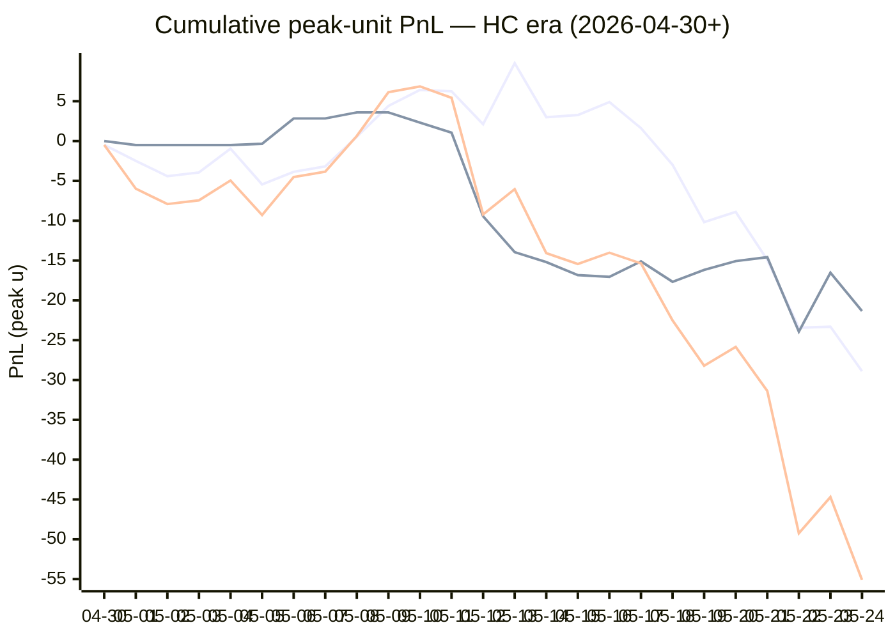

# Sharp Intel v6 — Daily Master Report

_Auto-generated **5/25/2026, 11:41:40 AM ET** by `scripts/dailyV6Report.js`. Do not edit by hand._

**Source of truth: this report mirrors the live Pick Performance dashboard.** Inclusion = `lockStage ≠ SHADOW ∧ ¬superseded ∧ health ∉ {MUTED, CANCELLED} ∧ peak.stars ≥ 2.5`. PnL is in **peak units** (the size shipped to users). HC margin / Δw / Δq are the **frozen** stamps written at last sync before the T-15 freeze. HC margin only existed from the v7.1 launch (**2026-04-30**); pre-launch picks have no HC value (no retro-fitting). Nothing is recomputed against today's whitelist.

v6 cutover: **2026-04-18** · whitelist source: live `sharpWalletProfiles` (215 profiles — drives §5 roster snapshot only) · quality cut: contribution ≥ 30 · HC = CONFIRMED tier ∧ sizeRatio ≥ 1.5.

---
## §1. Yesterday's picks

Slate: **2026-05-24** · 20 shipped sides.

| N | W-L-P | WR% | PnL (peak u) | PnL (flat 1u) |
|---|---|---|---|---|
| 20 | 8-12-0 | 40.0% | -10.40u | -4.42u |

| Sport | Market | Matchup | Pick | Stars · Units | HC | Δw | Δq | Σ | Odds | Result | PnL (peak u) |
|---|---|---|---|---|---|---|---|---|---|---|---|
| MLB | ML | Cleveland Guardians @ Philadelphia Phillies | Philadelphia Phillies | 4.5★ · 3.75u | +1 | +2 | +1 | +3 | -101 | L | -3.75u |
| MLB | ML | Colorado Rockies @ Arizona Diamondbacks | Arizona Diamondbacks | 3.0★ · 1.25u | +0 | +1 | +2 | +3 | -189 | **W** | +0.66u |
| MLB | ML | Detroit Tigers @ Baltimore Orioles | Baltimore Orioles | 5.0★ · 5.00u | +1 | +1 | +0 | +1 | -115 | **W** | +4.35u |
| MLB | ML | Los Angeles Dodgers @ Milwaukee Brewers | Milwaukee Brewers | 2.5★ · 0.50u | +1 | +1 | +2 | +3 | +144 | L | -0.50u |
| MLB | ML | New York Mets @ Miami Marlins | Miami Marlins | 3.0★ · 1.25u | +0 | +1 | -1 | +0 | -107 | **W** | +1.17u |
| MLB | ML | Pittsburgh Pirates @ Toronto Blue Jays | Pittsburgh Pirates | 4.0★ · 1.25u | +2 | +2 | +0 | +2 | +148 | **W** | +1.86u |
| MLB | ML | Seattle Mariners @ Kansas City Royals | Seattle Mariners | 3.0★ · 1.25u | +1 | -1 | +1 | +0 | -122 | L | -1.25u |
| MLB | SPREAD | Los Angeles Dodgers @ Milwaukee Brewers | Milwaukee Brewers | 4.0★ · 1.65u | +1 | +2 | +1 | +3 | -110 | L | -1.65u |
| MLB | SPREAD | Washington Nationals @ Atlanta Braves | Atlanta Braves | 3.0★ · 0.75u | +0 | +1 | +2 | +3 | +134 | L | -0.75u |
| MLB | TOTAL | Colorado Rockies @ Arizona Diamondbacks | Under 6.5 | 4.0★ · 0.75u | +0 | +1 | +1 | +2 | -110 | L | -0.75u |
| MLB | TOTAL | Chicago White Sox @ San Francisco Giants | Under 5.5 | 4.0★ · 1.65u | +1 | +1 | +0 | +1 | -110 | L | -1.65u |
| MLB | TOTAL | Detroit Tigers @ Baltimore Orioles | Under 8.5 | 3.0★ · 0.75u | +0 | +2 | +0 | +2 | -110 | **W** | +0.68u |
| MLB | TOTAL | Houston Astros @ Chicago Cubs | Under 8.5 | 4.0★ · 1.65u | +0 | +1 | +0 | +1 | -110 | L | -1.65u |
| MLB | TOTAL | New York Mets @ Miami Marlins | Under 7.5 | 2.5★ · 1.00u | +1 | +1 | +1 | +2 | -101 | **W** | +0.00u |
| MLB | TOTAL | Athletics @ San Diego Padres | Under 8 | 2.5★ · 0.30u | +0 | +0 | +0 | +0 | -104 | **W** | +0.30u |
| MLB | TOTAL | St. Louis Cardinals @ Cincinnati Reds | Over 10.5 | 3.0★ · 0.75u | +0 | +1 | +2 | +3 | -110 | L | -0.75u |
| MLB | TOTAL | Washington Nationals @ Atlanta Braves | Under 8.5 | 3.0★ · 0.75u | +0 | +1 | +0 | +1 | -110 | **W** | +0.68u |
| NBA | SPREAD | Thunder @ Spurs | Thunder | 5.0★ · 1.65u | +0 | +3 | +1 | +4 | -103 | L | -1.65u |
| NBA | TOTAL | Thunder @ Spurs | Over 219 | 4.5★ · 3.00u | +1 | +2 | +0 | +2 | -107 | L | -3.00u |
| NHL | ML | Avalanche @ Golden Knights | Avalanche | 4.0★ · 2.75u | +0 | +3 | +2 | +5 | -136 | L | -2.75u |

---
## §2. 3-day / 7-day / all-time cohort rollups

Shipped picks only. PnL in **peak units** (size we actually bet) and flat 1u (cohort EV lens). All margins are the engine's frozen stamps (`v8_hcMargin`, `v8_walletConsensusDelta`, `v8_walletConsensusQualityMargin`).

**HC margin sub-tables** are scoped to picks dated ≥ 2026-04-30 (the v7.1 launch — when HC margin became a real engine signal). Pre-launch picks are excluded from HC analysis since the feature didn't exist for them. Δw / Δq sub-tables span the full v6-era sample (≥ 2026-04-18). Empty buckets are dropped.

### §2a. 3-day

Total: **61** shipped · 29-31-1 · WR 48.3% · PnL -23.73u (peak) / -5.01u (flat).

**By HC margin** _(picks dated ≥ 2026-04-30, N = 61)_

| Bucket | N | W-L-P | WR% | PnL (peak u) | PnL (flat 1u) |
|---|---|---|---|---|---|
| HC ≥ +3 | 1 | 0-1-0 | 0.0% | -3.75u | -1.00u |
| HC = +2 | 3 | 1-2-0 | 33.3% | -8.14u | -0.52u |
| HC = +1 | 19 | 10-9-0 | 52.6% | -2.08u | +1.40u |
| HC = 0 | 37 | 18-18-1 | 50.0% | -6.76u | -3.88u |
| HC ≤ −1 | 1 | 0-1-0 | 0.0% | -3.00u | -1.00u |

**By Δw (winner margin)**

| Bucket | N | W-L-P | WR% | PnL (peak u) | PnL (flat 1u) |
|---|---|---|---|---|---|
| ≥ +3 | 10 | 3-7-0 | 30.0% | -11.23u | -4.69u |
| +2 | 12 | 6-6-0 | 50.0% | -10.74u | +1.09u |
| +1 | 28 | 15-13-0 | 53.6% | +3.02u | -0.52u |
| 0 | 9 | 5-3-1 | 62.5% | -2.28u | +1.11u |
| −1 | 2 | 0-2-0 | 0.0% | -2.50u | -2.00u |

**By Δq (quality margin)**

| Bucket | N | W-L-P | WR% | PnL (peak u) | PnL (flat 1u) |
|---|---|---|---|---|---|
| ≥ +3 | 6 | 3-3-0 | 50.0% | -3.83u | -0.59u |
| +2 | 13 | 3-10-0 | 23.1% | -15.68u | -7.17u |
| +1 | 21 | 9-11-1 | 45.0% | -5.67u | -2.69u |
| 0 | 15 | 11-4-0 | 73.3% | +6.12u | +5.60u |
| −1 | 5 | 3-2-0 | 60.0% | +0.33u | +0.86u |
| ≤ −2 | 1 | 0-1-0 | 0.0% | -5.00u | -1.00u |

**By AGS tier** _(picks dated ≥ 2026-05-05, N = 61)_

| Bucket | N | W-L-P | WR% | PnL (peak u) | PnL (flat 1u) |
|---|---|---|---|---|---|
| NEUT   (0 .. +3) | 49 | 24-25-0 | 49.0% | -21.44u | -3.73u |
| WEAK   (−1 .. 0) | 12 | 5-6-1 | 45.5% | -2.29u | -1.28u |

### §2b. 7-day

Total: **98** shipped · 47-50-1 · WR 48.5% · PnL -39.74u (peak) / -8.29u (flat).

**By HC margin** _(picks dated ≥ 2026-04-30, N = 98)_

| Bucket | N | W-L-P | WR% | PnL (peak u) | PnL (flat 1u) |
|---|---|---|---|---|---|
| HC ≥ +3 | 4 | 2-2-0 | 50.0% | -2.76u | -1.17u |
| HC = +2 | 7 | 1-6-0 | 14.3% | -23.39u | -4.52u |
| HC = +1 | 37 | 19-18-0 | 51.4% | -4.36u | +0.33u |
| HC = 0 | 49 | 25-23-1 | 52.1% | -6.23u | -1.93u |
| HC ≤ −1 | 1 | 0-1-0 | 0.0% | -3.00u | -1.00u |

**By Δw (winner margin)**

| Bucket | N | W-L-P | WR% | PnL (peak u) | PnL (flat 1u) |
|---|---|---|---|---|---|
| ≥ +3 | 19 | 7-12-0 | 36.8% | -17.14u | -6.50u |
| +2 | 25 | 12-13-0 | 48.0% | -15.56u | -0.37u |
| +1 | 38 | 20-18-0 | 52.6% | -2.98u | -0.93u |
| 0 | 14 | 8-5-1 | 61.5% | -1.56u | +1.51u |
| −1 | 2 | 0-2-0 | 0.0% | -2.50u | -2.00u |

**By Δq (quality margin)**

| Bucket | N | W-L-P | WR% | PnL (peak u) | PnL (flat 1u) |
|---|---|---|---|---|---|
| ≥ +3 | 13 | 7-6-0 | 53.8% | -4.86u | -0.93u |
| +2 | 21 | 7-14-0 | 33.3% | -17.88u | -7.07u |
| +1 | 34 | 15-18-1 | 45.5% | -13.56u | -4.38u |
| 0 | 20 | 14-6-0 | 70.0% | +8.71u | +6.32u |
| −1 | 9 | 4-5-0 | 44.4% | -7.15u | -1.24u |
| ≤ −2 | 1 | 0-1-0 | 0.0% | -5.00u | -1.00u |

**By AGS tier** _(picks dated ≥ 2026-05-05, N = 98)_

| Bucket | N | W-L-P | WR% | PnL (peak u) | PnL (flat 1u) |
|---|---|---|---|---|---|
| ELITE  (≥ +7) | 2 | 2-0-0 | 100.0% | +4.83u | +1.39u |
| LOCK   (+5 .. +7) | 2 | 1-1-0 | 50.0% | -1.11u | -0.62u |
| STRONG (+3 .. +5) | 6 | 1-5-0 | 16.7% | -13.49u | -4.09u |
| NEUT   (0 .. +3) | 72 | 36-36-0 | 50.0% | -25.01u | -3.71u |
| WEAK   (−1 .. 0) | 13 | 5-7-1 | 41.7% | -4.79u | -2.28u |
| FADE   (< −1) | 3 | 2-1-0 | 66.7% | -0.17u | +1.02u |

### §2c. All-time

Total: **302** shipped · 145-154-3 · WR 48.5% · PnL -67.33u (peak) / -15.54u (flat).

**By HC margin** _(picks dated ≥ 2026-04-30, N = 191)_

| Bucket | N | W-L-P | WR% | PnL (peak u) | PnL (flat 1u) |
|---|---|---|---|---|---|
| HC ≥ +3 | 6 | 2-4-0 | 33.3% | -7.01u | -3.17u |
| HC = +2 | 16 | 6-10-0 | 37.5% | -19.71u | -3.55u |
| HC = +1 | 92 | 51-41-0 | 55.4% | -2.17u | +9.22u |
| HC = 0 | 73 | 35-36-2 | 49.3% | -21.34u | -6.25u |
| HC ≤ −1 | 3 | 0-3-0 | 0.0% | -6.50u | -3.00u |

**By Δw (winner margin)**

| Bucket | N | W-L-P | WR% | PnL (peak u) | PnL (flat 1u) |
|---|---|---|---|---|---|
| ≥ +3 | 62 | 33-29-0 | 53.2% | -15.51u | +6.73u |
| +2 | 72 | 30-42-0 | 41.7% | -37.54u | -11.38u |
| +1 | 104 | 58-45-1 | 56.3% | +8.35u | +6.65u |
| 0 | 48 | 19-27-2 | 41.3% | -18.02u | -10.45u |
| −1 | 9 | 1-8-0 | 11.1% | -8.10u | -6.94u |
| ≤ −2 | 1 | 0-1-0 | 0.0% | -0.50u | -1.00u |
| missing | 6 | 4-2-0 | 66.7% | +3.99u | +0.85u |

**By Δq (quality margin)**

| Bucket | N | W-L-P | WR% | PnL (peak u) | PnL (flat 1u) |
|---|---|---|---|---|---|
| ≥ +3 | 87 | 43-42-2 | 50.6% | -19.85u | +0.88u |
| +2 | 70 | 29-41-0 | 41.4% | -36.73u | -11.49u |
| +1 | 83 | 40-42-1 | 48.8% | -10.72u | -6.14u |
| 0 | 38 | 20-18-0 | 52.6% | +3.49u | +1.18u |
| −1 | 13 | 8-5-0 | 61.5% | +1.81u | +2.31u |
| ≤ −2 | 5 | 1-4-0 | 20.0% | -8.57u | -3.04u |
| missing | 6 | 4-2-0 | 66.7% | +3.24u | +0.77u |

**By AGS tier** _(picks dated ≥ 2026-05-05, N = 166)_

| Bucket | N | W-L-P | WR% | PnL (peak u) | PnL (flat 1u) |
|---|---|---|---|---|---|
| ELITE  (≥ +7) | 3 | 3-0-0 | 100.0% | +8.01u | +2.34u |
| LOCK   (+5 .. +7) | 9 | 5-4-0 | 55.6% | -2.93u | -0.47u |
| STRONG (+3 .. +5) | 22 | 13-9-0 | 59.1% | -6.66u | +2.77u |
| NEUT   (0 .. +3) | 103 | 47-56-0 | 45.6% | -46.45u | -13.03u |
| WEAK   (−1 .. 0) | 18 | 8-9-1 | 47.1% | -5.47u | -0.27u |
| FADE   (< −1) | 10 | 6-4-0 | 60.0% | +1.72u | +2.16u |
| missing | 1 | 1-0-0 | 100.0% | +1.63u | +0.96u |

---
## §3. Edge over time — is HC margin creating winners?

Daily cumulative peak-unit PnL since the HC margin launch (**2026-04-30**). The `HC ≥ +1` line is the golden-standard cohort. The `HC = 0` line is the no-HC-signal control. The `All shipped (HC era)` line is every shipped pick from the same date range — the apples-to-apples baseline. Watch the spread.

Daily cumulative table (peak units, HC era only):

| Date | HC ≥ +1 (cum) | HC = 0 (cum) | All shipped (cum) |
|---|---|---|---|
| 2026-04-30 | -0.48u | +0.00u | -0.48u |
| 2026-05-01 | -2.48u | -0.50u | -5.98u |
| 2026-05-02 | -4.41u | -0.50u | -7.91u |
| 2026-05-03 | -3.94u | -0.50u | -7.44u |
| 2026-05-04 | -0.95u | -0.50u | -4.95u |
| 2026-05-05 | -5.45u | -0.34u | -9.29u |
| 2026-05-06 | -3.86u | +2.84u | -4.52u |
| 2026-05-07 | -3.18u | +2.84u | -3.84u |
| 2026-05-08 | +0.54u | +3.60u | +0.64u |
| 2026-05-09 | +4.41u | +3.60u | +6.14u |
| 2026-05-10 | +6.41u | +2.32u | +6.86u |
| 2026-05-11 | +6.25u | +1.05u | +5.43u |
| 2026-05-12 | +2.11u | -9.45u | -9.21u |
| 2026-05-13 | +9.78u | -13.95u | -6.04u |
| 2026-05-14 | +3.00u | -15.20u | -14.07u |
| 2026-05-15 | +3.27u | -16.83u | -15.43u |
| 2026-05-16 | +4.90u | -17.05u | -14.02u |
| 2026-05-17 | +1.62u | -15.11u | -15.36u |
| 2026-05-18 | -2.98u | -17.67u | -22.52u |
| 2026-05-19 | -10.18u | -16.17u | -28.22u |
| 2026-05-20 | -8.90u | -15.07u | -25.84u |
| 2026-05-21 | -14.92u | -14.58u | -31.37u |
| 2026-05-22 | -23.44u | -23.93u | -49.24u |
| 2026-05-23 | -23.30u | -16.53u | -44.70u |
| 2026-05-24 | -28.89u | -21.34u | -55.10u |

---
## §4. Wallet roster growth & profitability

"Tracked in sport X" = a wallet has placed **≥ 2 bets** in X within the v6-era sample. "Profitable" = cumulative flat PnL > 0. Source: `v8Scoring.walletDetails` on every graded v6-era game (every side, not just the shipped set).

### §4a. Per-sport wallet snapshot

| Sport | Total wallets seen | Tracked (≥2) | Profitable | % prof | WR ≥ 50% | WR ≥ 60% | WR ≥ 70% |
|---|---|---|---|---|---|---|---|
| MLB | 58 | 37 | 12 | 32% | 14 | 7 | 4 |
| NBA | 127 | 94 | 39 | 41% | 52 | 24 | 10 |
| NHL | 56 | 37 | 16 | 43% | 24 | 12 | 6 |
| **ALL (any sport)** | **155** | **117** | **52** | **44%** | **64** | **31** | **12** |

### §4b. Daily roster growth (cumulative through each date)

Format: `tracked (profitable)`. For each date D, recompute the roster using every bet up to and including D.

| Date | ALL | MLB | NBA | NHL |
|---|---|---|---|---|
| 2026-04-18 | 5 (2) | 2 (2) | 3 (0) | 0 (0) |
| 2026-04-19 | 19 (8) | 5 (3) | 9 (3) | 3 (1) |
| 2026-04-20 | 29 (12) | 7 (6) | 23 (8) | 5 (2) |
| 2026-04-21 | 44 (21) | 10 (6) | 31 (10) | 7 (5) |
| 2026-04-22 | 52 (28) | 12 (6) | 39 (15) | 11 (10) |
| 2026-04-23 | 56 (29) | 13 (6) | 46 (21) | 13 (10) |
| 2026-04-24 | 61 (30) | 14 (6) | 51 (23) | 14 (9) |
| 2026-04-25 | 65 (29) | 16 (8) | 54 (22) | 16 (9) |
| 2026-04-26 | 67 (31) | 18 (5) | 56 (25) | 17 (9) |
| 2026-04-27 | 72 (32) | 20 (7) | 60 (24) | 17 (9) |
| 2026-04-28 | 76 (33) | 21 (7) | 63 (26) | 23 (10) |
| 2026-04-29 | 77 (33) | 21 (7) | 64 (25) | 23 (10) |
| 2026-04-30 | 81 (34) | 21 (7) | 70 (27) | 23 (10) |
| 2026-05-01 | 85 (38) | 22 (5) | 74 (30) | 26 (13) |
| 2026-05-02 | 86 (37) | 23 (7) | 75 (32) | 26 (12) |
| 2026-05-03 | 86 (38) | 24 (8) | 75 (33) | 26 (12) |
| 2026-05-04 | 90 (38) | 24 (9) | 76 (32) | 26 (12) |
| 2026-05-05 | 91 (40) | 24 (9) | 79 (33) | 26 (12) |
| 2026-05-06 | 92 (40) | 24 (9) | 80 (33) | 26 (12) |
| 2026-05-07 | 92 (41) | 24 (9) | 80 (33) | 26 (12) |
| 2026-05-08 | 92 (40) | 24 (8) | 80 (32) | 26 (11) |
| 2026-05-09 | 94 (42) | 24 (8) | 82 (35) | 26 (11) |
| 2026-05-10 | 94 (42) | 24 (8) | 82 (35) | 26 (11) |
| 2026-05-11 | 96 (42) | 24 (8) | 84 (36) | 26 (11) |
| 2026-05-12 | 100 (41) | 27 (9) | 86 (37) | 26 (11) |
| 2026-05-13 | 102 (45) | 29 (11) | 88 (37) | 26 (11) |
| 2026-05-14 | 102 (41) | 29 (11) | 88 (37) | 28 (12) |
| 2026-05-15 | 103 (41) | 30 (10) | 88 (39) | 28 (12) |
| 2026-05-16 | 105 (43) | 31 (12) | 88 (39) | 30 (14) |
| 2026-05-17 | 105 (46) | 32 (11) | 88 (40) | 30 (14) |
| 2026-05-18 | 105 (46) | 32 (10) | 88 (38) | 31 (15) |
| 2026-05-19 | 105 (46) | 32 (12) | 88 (38) | 31 (15) |
| 2026-05-20 | 106 (48) | 33 (12) | 88 (38) | 31 (16) |
| 2026-05-21 | 106 (45) | 34 (12) | 88 (37) | 31 (14) |
| 2026-05-22 | 106 (44) | 34 (10) | 88 (39) | 33 (16) |
| 2026-05-23 | 111 (49) | 36 (10) | 90 (40) | 36 (19) |
| 2026-05-24 | 117 (52) | 37 (12) | 94 (39) | 37 (16) |

### §4c. Top 10 profitable wallets by sport

#### MLB

| # | Wallet | N | W | L | WR% | Flat PnL (u) | Flat ROI | $ PnL |
|---|---|---|---|---|---|---|---|---|
| 1 | b31fc6 | 2 | 2 | 0 | 100.0% | +2.56 | +128.0% | $4.2K |
| 2 | c289a0 | 3 | 3 | 0 | 100.0% | +2.87 | +95.6% | $1.5K |
| 3 | eeabaf | 9 | 6 | 3 | 66.7% | +8.43 | +93.7% | $782.4K |
| 4 | 880232 | 2 | 2 | 0 | 100.0% | +1.82 | +90.9% | $130.1K |
| 5 | c668b3 | 7 | 5 | 2 | 71.4% | +2.84 | +40.5% | $4.8K |
| 6 | a10ff5 | 19 | 12 | 7 | 63.2% | +4.74 | +24.9% | $16.4K |
| 7 | 981187 | 8 | 5 | 3 | 62.5% | +1.65 | +20.7% | $13.5K |
| 8 | c2aeea | 7 | 4 | 3 | 57.1% | +0.58 | +8.2% | $6.6K |
| 9 | 7923c4 | 18 | 10 | 8 | 55.6% | +1.47 | +8.2% | $78.9K |
| 10 | 972768 | 18 | 9 | 9 | 50.0% | +1.36 | +7.6% | $14.3K |

#### NBA

| # | Wallet | N | W | L | WR% | Flat PnL (u) | Flat ROI | $ PnL |
|---|---|---|---|---|---|---|---|---|
| 1 | 799fad | 2 | 2 | 0 | 100.0% | +5.66 | +283.0% | $241.7K |
| 2 | 4a9953 | 2 | 2 | 0 | 100.0% | +2.16 | +108.2% | $3.7K |
| 3 | 12ad50 | 3 | 3 | 0 | 100.0% | +2.74 | +91.3% | $45.5K |
| 4 | b51a56 | 6 | 5 | 1 | 83.3% | +5.44 | +90.7% | $74.4K |
| 5 | 2e8da5 | 10 | 8 | 2 | 80.0% | +8.06 | +80.6% | $120.4K |
| 6 | 11b032 | 7 | 6 | 1 | 85.7% | +5.40 | +77.1% | $249.9K |
| 7 | 769c38 | 12 | 11 | 1 | 91.7% | +8.22 | +68.5% | $93.1K |
| 8 | 8ec926 | 7 | 6 | 1 | 85.7% | +4.53 | +64.7% | $7.9K |
| 9 | 7f00bc | 16 | 11 | 5 | 68.8% | +9.63 | +60.2% | $14.2K |
| 10 | 4edc5b | 4 | 2 | 2 | 50.0% | +1.79 | +44.7% | $55.6K |

#### NHL

| # | Wallet | N | W | L | WR% | Flat PnL (u) | Flat ROI | $ PnL |
|---|---|---|---|---|---|---|---|---|
| 1 | 8366f5 | 2 | 2 | 0 | 100.0% | +2.30 | +114.9% | $107.6K |
| 2 | 799fad | 2 | 2 | 0 | 100.0% | +1.88 | +94.1% | $46.9K |
| 3 | fec67e | 4 | 3 | 1 | 75.0% | +2.82 | +70.5% | $12.5K |
| 4 | 981187 | 7 | 6 | 1 | 85.7% | +4.52 | +64.6% | $9.8K |
| 5 | 30935c | 4 | 3 | 1 | 75.0% | +2.11 | +52.7% | $953 |
| 6 | 065ad0 | 3 | 2 | 1 | 66.7% | +1.40 | +46.7% | $15.6K |
| 7 | fcc12b | 10 | 7 | 3 | 70.0% | +3.15 | +31.5% | -$67.5K |
| 8 | e70853 | 9 | 6 | 3 | 66.7% | +2.66 | +29.5% | -$11.1K |
| 9 | bc35e3 | 3 | 2 | 1 | 66.7% | +0.73 | +24.3% | $4.1K |
| 10 | c5cea1 | 3 | 2 | 1 | 66.7% | +0.62 | +20.7% | $22.1K |

---
## §5. Proven-wallet roster growth & HC tracking

"Proven wallet" = whitelist tier `CONFIRMED` or `FLAT` in the same sense the live engine uses (`exportWalletProfiles.js` → `sharpWalletProfiles.bySport`). Sports inherit independent rosters: a wallet can be CONFIRMED in NBA and absent from NHL. `walletBets` come from `v8Scoring.walletDetails` on every graded v6-era pick (Source A); `positionRows` come from `sharp_action_positions` (Source B).

### §5a. Current proven-winner roster (snapshot)

Roster as of **2026-05-24** — wallets with ≥2 bets in the sport.

| Sport | Wallets seen | Eligible (≥2) | CONFIRMED | FLAT | Proven (C+F) | WR50 only | Conv % |
|---|---|---|---|---|---|---|---|
| MLB | 98 | 37 | 5 | 7 | **12** | 2 | 12.2% |
| NBA | 183 | 94 | 25 | 14 | **39** | 18 | 21.3% |
| NHL | 92 | 37 | 12 | 4 | **16** | 8 | 17.4% |
| **ALL** | **—** | **—** | **—** | **—** | **67** | **—** | **—** |

### §5b. Live whitelist drift check

Live `sharpWalletProfiles` is what the engine reads at lock time. Drift between script reconstruction (above) and live should be ≤ 1 day of position data — otherwise `exportWalletProfiles.js` is stale.

| Sport | CONFIRMED (live · script) | FLAT (live · script) | WR50 (live · script) | Drift |
|---|---|---|---|---|
| MLB | 18 · 5 | 10 · 7 | 3 · 2 | +16 live |
| NBA | 54 · 25 | 21 · 14 | 21 · 18 | +36 live |
| NHL | 20 · 12 | 5 · 4 | 10 · 8 | +9 live |

### §5c. Roster growth — 3d / 7d / 30d / all-time deltas

Each cell is **net growth** in proven (CONFIRMED + FLAT) wallets in that window, with the absolute count at the start (`+Δ from N`). Negative = wallets demoted. Window endpoint = 2026-05-24.

| Sport | 3-day | 7-day | 30-day | All-time (since cutover) |
|---|---|---|---|---|
| MLB | +0 from 12 | +1 from 11 | +6 from 6 | +12 from 0 |
| NBA | +2 from 37 | -1 from 40 | +16 from 23 | +39 from 0 |
| NHL | +2 from 14 | +2 from 14 | +7 from 9 | +16 from 0 |

A flat 7-day delta on a sport with healthy slate density = either the bubble pipeline has stalled (no wallets approaching the bar) or our cohort has saturated. Check §13d for the funnel diagnostic.

### §5d. Pipeline funnel — where each sport leaks

Wallets surviving each gate, in order. The biggest %-drop tells you the bottleneck. Gates:

1. **Seen** — placed ≥ 1 bet in the sport (any source)
2. **Eligible** — ≥ 2 graded picks in Source A (required for FLAT/CONFIRMED)
3. **Flat-OK** — eligible AND flat ROI > 0 (becomes FLAT or better)
4. **$-OK** — Flat-OK AND ≥2 positions with dollar ROI > 0 (CONFIRMED)
5. **Promoted** — final whitelisted = CONFIRMED + FLAT

| Sport | 1·Seen | 2·Eligible (% of Seen) | 3·Flat-OK (% of Elig) | 4·$-OK (% of Flat) | 5·Promoted | Bottleneck |
|---|---|---|---|---|---|---|
| MLB | 98 | 37 (38%) | 12 (32%) | 5 (42%) | **12** | edge (Eligible→Flat-OK) 68% |
| NBA | 183 | 94 (51%) | 39 (41%) | 25 (64%) | **39** | edge (Eligible→Flat-OK) 59% |
| NHL | 92 | 37 (40%) | 16 (43%) | 12 (75%) | **16** | sample (Seen→Eligible) 60% |

### §5e. HC backing density (the fuel for v7.3 HC margin)

Every v7.x promotion is gated on `HC_m ≥ +1`, which requires at least one CONFIRMED wallet sized at `≥ 1.5×` average on the for-side. This table shows the share of shipped picks that *had any HC backing*, by sport, in each window. If HC density falls toward zero in a sport, the v7.3 floor cohorts (Σ=1, Σ=2 locks; HC rescues) will simply stop firing there.

| Sport | Window | Picks (with HC stamp) | Any HC for-side | HC_m ≥ +1 | HC_m ≥ +2 |
|---|---|---|---|---|---|
| MLB | 3-day | 49 | 18 (36.7%) | 17 (34.7%) | 3 (6.1%) |
| MLB | 7-day | 72 | 30 (41.7%) | 29 (40.3%) | 3 (4.2%) |
| MLB | All-time | 154 | 73 (47.4%) | 71 (46.1%) | 8 (5.2%) |
| NBA | 3-day | 7 | 6 (85.7%) | 3 (42.9%) | 0 (0.0%) |
| NBA | 7-day | 16 | 15 (93.8%) | 12 (75.0%) | 6 (37.5%) |
| NBA | All-time | 108 | 68 (63.0%) | 58 (53.7%) | 24 (22.2%) |
| NHL | 3-day | 5 | 3 (60.0%) | 3 (60.0%) | 1 (20.0%) |
| NHL | 7-day | 10 | 7 (70.0%) | 7 (70.0%) | 2 (20.0%) |
| NHL | All-time | 34 | 16 (47.1%) | 15 (44.1%) | 3 (8.8%) |

Pooled across sports:

| Window | Picks (with HC stamp) | Any HC for-side | HC_m ≥ +1 | HC_m ≥ +2 |
|---|---|---|---|---|
| 3-day | 61 | 27 (44.3%) | 23 (37.7%) | 4 (6.6%) |
| 7-day | 98 | 52 (53.1%) | 48 (49.0%) | 11 (11.2%) |
| All-time | 296 | 157 (53.0%) | 144 (48.6%) | 35 (11.8%) |

### §5f. Bubble wallets — next-up graduations

Wallets currently NOT promoted but close. Two flavors:

- **One-bet-away** — won the only bet, needs one more positive bet to clear ≥2.
- **Just-under** — has ≥2 bets but flat ROI is between −10% and 0% (one win flips them).

#### MLB

**One-bet-away** (6)

| wallet | picksN | flat PnL | pos N | pos $ROI |
|---|---|---|---|---|
| `...be17` | 1 | +6.95 | 6 | -46% |
| `...cff6` | 1 | +1.34 | 4 | 83% |
| `...be00` | 1 | +0.87 | 11 | -8% |
| `...a240` | 1 | +0.87 | 7 | 83% |
| `...9373` | 1 | +0.87 | 0 | — |
| `...bba3` | 1 | +0.81 | 11 | 32% |

**Just-under** (6)

| wallet | picksN | WR | flat ROI | pos N | pos $ROI |
|---|---|---|---|---|---|
| `...64aa` | 92 | 53% | -0.9% | 179 | -1% |
| `...9a27` | 118 | 47% | -2.6% | 320 | -1% |
| `...2f63` | 78 | 49% | -4.5% | 515 | -5% |
| `...9d74` | 29 | 48% | -5.9% | 72 | -11% |
| `...c12b` | 40 | 48% | -6.5% | 67 | -19% |
| `...35e3` | 22 | 50% | -6.7% | 62 | -19% |

#### NBA

**One-bet-away** (6)

| wallet | picksN | flat PnL | pos N | pos $ROI |
|---|---|---|---|---|
| `...bf5d` | 1 | +3.15 | 3 | 42% |
| `...ed41` | 1 | +3.15 | 3 | 3% |
| `...6b87` | 1 | +2.05 | 8 | -27% |
| `...c991` | 1 | +1.14 | 6 | 82% |
| `...e3d0` | 1 | +0.93 | 18 | -34% |
| `...9d74` | 1 | +0.93 | 23 | -50% |

**Just-under** (6)

| wallet | picksN | WR | flat ROI | pos N | pos $ROI |
|---|---|---|---|---|---|
| `...d814` | 8 | 50% | -0.5% | 47 | -9% |
| `...d96a` | 19 | 37% | -1.5% | 68 | -13% |
| `...65dd` | 6 | 50% | -2.4% | 17 | 27% |
| `...853d` | 40 | 53% | -2.7% | 86 | 1% |
| `...be00` | 2 | 50% | -3.3% | 28 | 3% |
| `...11a4` | 13 | 38% | -3.3% | 49 | 27% |

#### NHL

**One-bet-away** (6)

| wallet | picksN | flat PnL | pos N | pos $ROI |
|---|---|---|---|---|
| `...2e78` | 1 | +1.46 | 0 | — |
| `...017f` | 1 | +1.45 | 5 | 125% |
| `...32f2` | 1 | +1.40 | 0 | — |
| `...e0fd` | 1 | +1.20 | 3 | 124% |
| `...266e` | 1 | +1.05 | 0 | — |
| `...2194` | 1 | +1.05 | 0 | — |

**Just-under** (5)

| wallet | picksN | WR | flat ROI | pos N | pos $ROI |
|---|---|---|---|---|---|
| `...33ee` | 4 | 50% | -0.3% | 8 | -23% |
| `...afd2` | 6 | 50% | -1.9% | 13 | 0% |
| `...618e` | 2 | 50% | -6.1% | 28 | 24% |
| `...d227` | 2 | 50% | -9.0% | 18 | 20% |
| `...853d` | 10 | 50% | -9.8% | 21 | -4% |

### §5g. v2 wallet-promotion pipeline (Source-A / Source-B mix)

Live snapshot of the v2 promotion gate (shipped 2026-05-10, re-eval **2026-05-24**). Each FLAT-or-better wallet × sport pair is attributed to one of three paths via `sharpWalletProfiles[wallet].bySport[sport].whitelistSource`:

- **A** — flat-positive on featured picks (Source A) only — the v1 gate
- **A+B** — flat-positive in both sources (most reliable signal)
- **B** — flat-positive on-chain only (NEW in v2 — the trial lift)

Re-classified every 2h via `grade-sharp-actions` cron. Roll-back: set `B_ONLY_MIN_BETS = Infinity` in `scripts/exportWalletProfiles.js`.

#### Source mix per sport (live Firestore)

| Sport | A | A+B | B (new) | FLAT-or-better total | % from B-only |
|---|---|---|---|---|---|
| MLB | 4 | 8 | **16** | 28 | 57.1% |
| NBA | 10 | 29 | **36** | 75 | 48.0% |
| NHL | 5 | 11 | **9** | 25 | 36.0% |
| **ALL** | **19** | **48** | **61** | **128** | **47.7%** |

#### Pipeline freshness

- `sharp_action_positions` GRADED rows: **8446**
- `sharp_action_positions` PENDING rows: **146** (queued for next Grade Sharp Actions run)
- Latest `sharpWalletProfiles` rebuild: 5/25/2026, 8:26:16 AM ET — 195 min · within 2 cron cycles

**Alarms**: pending > 200 OR rebuild lag > 4h → cron is lagging or failing — check `gh run list --workflow="Grade Sharp Actions"`.

#### B-only roster — wallets currently promoted via Source B path only

Wallets here would have been EXCLUDED under v1 (Source-A-only). Top by Source-B bet count per sport. The 2-week re-eval (2026-05-24) will compare these wallets' realized lift against A-only and A+B cohorts.

**MLB** — 16 wallets promoted via B

| wallet | tier | B_n | B_flat ROI | B_$ ROI |
|---|---|---|---|---|
| `...135d` | CONFIRMED | 326 | +1.9% | +6.9% |
| `...9a27` | FLAT | 320 | +16.9% | -0.9% |
| `...64aa` | FLAT | 179 | +1.5% | -1.2% |
| `...d96a` | CONFIRMED | 108 | +3.4% | +28.3% |
| `...1eae` | CONFIRMED | 83 | +10.7% | +7.8% |
| `...69c2` | FLAT | 32 | +29.1% | -1.1% |
| `...bba3` | CONFIRMED | 11 | +39.6% | +31.8% |
| `...aeeb` | CONFIRMED | 9 | +21.6% | +32% |
| `...a9cc` | CONFIRMED | 8 | +6.3% | +0.3% |
| `...f804` | CONFIRMED | 8 | +26.5% | +34.9% |
| … | 6 more | | | |

**NBA** — 36 wallets promoted via B

| wallet | tier | B_n | B_flat ROI | B_$ ROI |
|---|---|---|---|---|
| `...135d` | FLAT | 102 | +5.1% | -11.9% |
| `...3782` | CONFIRMED | 61 | +7.1% | +8.9% |
| `...935c` | FLAT | 50 | +17.3% | -21.4% |
| `...11a4` | CONFIRMED | 49 | +34.1% | +26.8% |
| `...b6ef` | CONFIRMED | 41 | +8.9% | +7.2% |
| `...68b3` | CONFIRMED | 29 | +9.8% | +17.5% |
| `...be00` | CONFIRMED | 28 | +12.7% | +2.7% |
| `...9e7a` | CONFIRMED | 22 | +1.6% | +11.5% |
| `...0563` | CONFIRMED | 21 | +0.5% | +24.1% |
| `...d227` | CONFIRMED | 20 | +15.8% | +17.7% |
| … | 26 more | | | |

**NHL** — 9 wallets promoted via B

| wallet | tier | B_n | B_flat ROI | B_$ ROI |
|---|---|---|---|---|
| `...2125` | CONFIRMED | 29 | +49.7% | +50.1% |
| `...618e` | CONFIRMED | 28 | +6.2% | +23.8% |
| `...b33b` | CONFIRMED | 18 | +30% | +26.3% |
| `...d227` | CONFIRMED | 18 | +2.8% | +20.4% |
| `...b989` | CONFIRMED | 12 | +13.1% | +30.4% |
| `...0c2e` | CONFIRMED | 7 | +125.1% | +144.8% |
| `...a9cc` | CONFIRMED | 7 | +49.5% | +46.9% |
| `...44b0` | FLAT | 6 | +36.1% | -37.9% |
| `...017f` | CONFIRMED | 5 | +130% | +124.5% |

### §5 — How to read

- **Roster growth flat in 7-day** + **funnel bottleneck = `data`** → re-run `exportWalletProfiles.js`. The flat-positive wallets are stuck at FLAT because Source-B coverage hasn't caught up. CONFIRMED gate is data-bound, not skill-bound.
- **Roster growth flat in 7-day** + **funnel bottleneck = `sample`** → wallets aren't reaching `≥2` reps fast enough. This is a slate-density problem; consider a soft `MIN_BETS = 1` shadow lane to surface bubble wallets earlier.
- **Roster shrank** (negative delta) → a previously CONFIRMED wallet just dropped flat-positive (lost a recent bet). Variance, not failure — but worth noting if a sport loses ≥3 in a week.
- **HC density on a sport drops below ~30%** → v7.3 promotions there will starve. Either the proven roster needs more CONFIRMED-tier wallets sizing aggressively, or the HC_RATIO (1.5) needs a sport-specific tune.
- **§5g B-only count drops sharply** → wallets are demoting off the B path (losing on-chain). Cross-check `WALLET_PROFILES_SUMMARY.md` churn section for the specific demotions.
- **§5g pipeline freshness lag > 4h** → grade-sharp-actions cron is failing. Check `gh run list --workflow="Grade Sharp Actions"` and re-trigger if needed.

---
## §6. Daily proven-wallet performance

Who on the proven roster is actually printing — yesterday's bets, the rolling leaderboard (`$ PnL`-ranked), current streaks, and per-sport volume. **Proven** = `CONFIRMED` ∪ `FLAT` per sport (the same gate that drives Δ_winner). A wallet only counts in a sport where it's on that sport's proven list.

### §6a. Yesterday's proven-wallet bets

Slate: **2026-05-24** · 31 bets · 16 distinct proven wallets · WR 52% · $ vol $896.9K · $ PnL $1.03M.

| Wallet | Sport | Market | Game | $ size | Result | $ PnL |
|---|---|---|---|---|---|---|
| `...abaf` (FLAT) | MLB | ML | Athletics @ San Diego Padres | $125.4K | **W** | $871.5K |
| `...2ca8` (CONFIRMED) | NBA | ML | Thunder @ Spurs | $418.7K | **W** | $286.8K |
| `...2f63` (FLAT) | NBA | SPREAD | Thunder @ Spurs | $36.0K | **W** | $35.3K |
| `...23c4` (FLAT) | MLB | TOTAL | Los Angeles Dodgers @ Milwaukee Brewers | $21.2K | **W** | $19.8K |
| `...2768` (CONFIRMED) | MLB | ML | Houston Astros @ Chicago Cubs | $8.3K | **W** | $12.5K |
| `...23c4` (FLAT) | MLB | ML | Seattle Mariners @ Kansas City Royals | $14.0K | **W** | $11.7K |
| `...9a27` (CONFIRMED) | NBA | TOTAL | Thunder @ Spurs | $10.9K | **W** | $10.2K |
| `...23c4` (FLAT) | MLB | ML | New York Mets @ Miami Marlins | $7.3K | **W** | $6.8K |
| `...0ff5` (FLAT) | MLB | TOTAL | Athletics @ San Diego Padres | $2.8K | **W** | $2.8K |
| `...23c4` (FLAT) | MLB | TOTAL | Athletics @ San Diego Padres | $2.5K | **W** | $2.5K |
| `...aeea` (FLAT) | MLB | ML | Los Angeles Dodgers @ Milwaukee Brewers | $1.6K | **W** | $2.3K |
| `...03d4` (FLAT) | NBA | ML | Thunder @ Spurs | $2.5K | **W** | $1.7K |
| `...abaf` (FLAT) | MLB | ML | Texas Rangers @ Los Angeles Angels | $1.7K | **W** | $1.3K |
| `...68b3` (CONFIRMED) | MLB | ML | Seattle Mariners @ Kansas City Royals | $1.2K | **W** | $967 |
| `...68b3` (CONFIRMED) | MLB | TOTAL | Los Angeles Dodgers @ Milwaukee Brewers | $556 | **W** | $520 |
| `...68b3` (CONFIRMED) | MLB | TOTAL | Detroit Tigers @ Baltimore Orioles | $458 | **W** | $416 |
| `...b33b` (CONFIRMED) | NBA | ML | Thunder @ Spurs | $33 | L | -$33 |
| `...23c4` (FLAT) | MLB | TOTAL | Colorado Rockies @ Arizona Diamondbacks | $55 | L | -$55 |
| `...df91` (FLAT) | NBA | ML | Thunder @ Spurs | $174 | L | -$174 |
| `...2f63` (FLAT) | NBA | TOTAL | Thunder @ Spurs | $1.2K | L | -$1.2K |
| `...5348` (CONFIRMED) | NBA | ML | Thunder @ Spurs | $4.4K | L | -$4.4K |
| `...0ff5` (FLAT) | MLB | TOTAL | Colorado Rockies @ Arizona Diamondbacks | $6.5K | L | -$6.5K |
| `...3532` (FLAT) | NBA | ML | Thunder @ Spurs | $6.9K | L | -$6.9K |
| `...23c4` (FLAT) | MLB | TOTAL | Pittsburgh Pirates @ Toronto Blue Jays | $7.8K | L | -$7.8K |
| `...9a27` (CONFIRMED) | NBA | ML | Thunder @ Spurs | $11.5K | L | -$11.5K |
| `...32f2` (CONFIRMED) | NBA | ML | Thunder @ Spurs | $12.9K | L | -$12.9K |
| `...2f63` (FLAT) | NBA | ML | Thunder @ Spurs | $13.1K | L | -$13.1K |
| `...23c4` (FLAT) | MLB | ML | Minnesota Twins @ Boston Red Sox | $30.5K | L | -$30.5K |
| `...1187` (FLAT) | NHL | ML | Avalanche @ Golden Knights | $40.0K | L | -$40.0K |
| `...abaf` (FLAT) | MLB | TOTAL | Houston Astros @ Chicago Cubs | $49.8K | L | -$49.8K |
| `...9a27` (CONFIRMED) | NBA | SPREAD | Thunder @ Spurs | $56.9K | L | -$56.9K |

### §6b. Proven-wallet leaderboard

Top 15 proven `(wallet × sport)` pairs per sport per horizon, ranked by **$ PnL** (the dollar-ROI lens). The 3-day board is the "who's on form right now" lens; the 7-day filters single-day variance; all-time is the proven-roster reference.

#### §6b-1. 3-day

**MLB** — 7 active proven wallets

| # | Wallet | Tier | Bets | WR% | Bets/day | Flat PnL (u) | Flat ROI | $ vol | $ PnL | $ ROI | Streak |
|---|---|---|---|---|---|---|---|---|---|---|---|
| 1 | `...abaf` | FLAT | 5 | 60% | 2.5 | +6.63 | +133% | $253.4K | $748.3K | +295% | 2W |
| 2 | `...0232` | CONFIRMED | 1 | 100% | 1.0 | +0.91 | +91% | $70.3K | $63.9K | +91% | 1W |
| 3 | `...2768` | CONFIRMED | 4 | 75% | 1.3 | +2.85 | +71% | $35.5K | $24.0K | +67% | 2W |
| 4 | `...23c4` | FLAT | 11 | 55% | 5.5 | +0.71 | +6% | $226.5K | $23.1K | +10% | 1W |
| 5 | `...aeea` | FLAT | 2 | 100% | 0.7 | +2.17 | +108% | $6.9K | $6.1K | +89% | 2W |
| 6 | `...0ff5` | FLAT | 4 | 75% | 2.0 | +2.05 | +51% | $16.8K | $4.0K | +24% | 1W |
| 7 | `...68b3` | CONFIRMED | 4 | 75% | 1.3 | +1.68 | +42% | $3.3K | $750 | +23% | 3W |

**NBA** — 16 active proven wallets

| # | Wallet | Tier | Bets | WR% | Bets/day | Flat PnL (u) | Flat ROI | $ vol | $ PnL | $ ROI | Streak |
|---|---|---|---|---|---|---|---|---|---|---|---|
| 1 | `...2ca8` | CONFIRMED | 3 | 67% | 1.0 | +0.82 | +27% | $1.08M | $403.3K | +37% | 2W |
| 2 | `...1697` | CONFIRMED | 1 | 100% | 1.0 | +1.10 | +110% | $180.0K | $198.0K | +110% | 1W |
| 3 | `...3532` | FLAT | 4 | 50% | 1.3 | +0.05 | +1% | $103.7K | $82.2K | +79% | 2L |
| 4 | `...2f63` | FLAT | 8 | 63% | 2.7 | +2.14 | +27% | $68.0K | $37.0K | +54% | 1L |
| 5 | `...abaf` | FLAT | 2 | 100% | 2.0 | +2.05 | +103% | $27.3K | $26.6K | +97% | 2W |
| 6 | `...b33b` | CONFIRMED | 2 | 50% | 0.7 | +0.10 | +5% | $16.3K | $17.9K | +110% | 1L |
| 7 | `...9c38` | CONFIRMED | 1 | 100% | 1.0 | +1.14 | +114% | $14.4K | $16.5K | +114% | 1W |
| 8 | `...1eae` | CONFIRMED | 1 | 100% | 1.0 | +1.10 | +110% | $4.3K | $4.7K | +110% | 1W |
| 9 | `...9ef0` | CONFIRMED | 1 | 100% | 1.0 | +1.10 | +110% | $2.8K | $3.1K | +110% | 1W |
| 10 | `...5348` | CONFIRMED | 2 | 50% | 1.0 | +0.14 | +7% | $8.9K | $730 | +8% | 1L |
| 11 | `...03d4` | FLAT | 5 | 60% | 1.7 | +0.92 | +18% | $11.1K | $682 | +6% | 1W |
| 12 | `...df91` | FLAT | 2 | 50% | 0.7 | +0.10 | +5% | $311 | -$23 | -7% | 1L |
| 13 | `...32f2` | CONFIRMED | 1 | 0% | 1.0 | -1.00 | -100% | $12.9K | -$12.9K | -100% | 1L |
| 14 | `...9a27` | CONFIRMED | 7 | 43% | 2.3 | -1.01 | -14% | $190.8K | -$22.4K | -12% | 1W |
| 15 | `...5143` | FLAT | 1 | 0% | 1.0 | -1.00 | -100% | $43.8K | -$43.8K | -100% | 1L |

**NHL** — 9 active proven wallets

| # | Wallet | Tier | Bets | WR% | Bets/day | Flat PnL (u) | Flat ROI | $ vol | $ PnL | $ ROI | Streak |
|---|---|---|---|---|---|---|---|---|---|---|---|
| 1 | `...0853` | CONFIRMED | 1 | 100% | 1.0 | +0.49 | +49% | $70.0K | $34.1K | +49% | 1W |
| 2 | `...c12b` | CONFIRMED | 1 | 100% | 1.0 | +1.24 | +124% | $22.8K | $28.3K | +124% | 1W |
| 3 | `...9ef0` | FLAT | 1 | 100% | 1.0 | +1.00 | +100% | $12.9K | $12.9K | +100% | 1W |
| 4 | `...3532` | FLAT | 1 | 100% | 1.0 | +1.24 | +124% | $8.4K | $10.4K | +124% | 1W |
| 5 | `...5ad0` | CONFIRMED | 2 | 50% | 2.0 | -0.02 | -1% | $8.3K | $5.5K | +66% | 1W |
| 6 | `...35e3` | CONFIRMED | 3 | 67% | 1.5 | +0.73 | +24% | $16.8K | $4.1K | +24% | 2W |
| 7 | `...c67e` | CONFIRMED | 2 | 50% | 1.0 | -0.02 | -1% | $11.5K | -$608 | -5% | 1W |
| 8 | `...9d74` | CONFIRMED | 2 | 50% | 1.0 | -0.51 | -26% | $5.7K | -$1.3K | -22% | 1W |
| 9 | `...1187` | FLAT | 2 | 50% | 1.0 | -0.51 | -26% | $80.0K | -$20.5K | -26% | 1L |

#### §6b-2. 7-day

**MLB** — 9 active proven wallets

| # | Wallet | Tier | Bets | WR% | Bets/day | Flat PnL (u) | Flat ROI | $ vol | $ PnL | $ ROI | Streak |
|---|---|---|---|---|---|---|---|---|---|---|---|
| 1 | `...abaf` | FLAT | 6 | 67% | 1.2 | +7.51 | +125% | $276.0K | $768.4K | +278% | 2W |
| 2 | `...fc82` | FLAT | 1 | 100% | 1.0 | +1.15 | +115% | $76.6K | $88.1K | +115% | 1W |
| 3 | `...0232` | CONFIRMED | 1 | 100% | 1.0 | +0.91 | +91% | $70.3K | $63.9K | +91% | 1W |
| 4 | `...23c4` | FLAT | 12 | 58% | 3.0 | +1.62 | +14% | $232.8K | $28.9K | +12% | 1W |
| 5 | `...0ff5` | FLAT | 8 | 75% | 1.3 | +4.07 | +51% | $43.0K | $23.9K | +56% | 1W |
| 6 | `...aeea` | FLAT | 2 | 100% | 0.7 | +2.17 | +108% | $6.9K | $6.1K | +89% | 2W |
| 7 | `...1fc6` | CONFIRMED | 2 | 100% | 0.5 | +2.56 | +128% | $3.3K | $4.2K | +128% | 2W |
| 8 | `...2768` | CONFIRMED | 9 | 44% | 1.3 | +0.15 | +2% | $73.5K | $1.9K | +3% | 2W |
| 9 | `...68b3` | CONFIRMED | 4 | 75% | 1.3 | +1.68 | +42% | $3.3K | $750 | +23% | 3W |

**NBA** — 24 active proven wallets

| # | Wallet | Tier | Bets | WR% | Bets/day | Flat PnL (u) | Flat ROI | $ vol | $ PnL | $ ROI | Streak |
|---|---|---|---|---|---|---|---|---|---|---|---|
| 1 | `...2ca8` | CONFIRMED | 4 | 50% | 1.0 | -0.18 | -4% | $1.21M | $276.8K | +23% | 2W |
| 2 | `...1697` | CONFIRMED | 1 | 100% | 1.0 | +1.10 | +110% | $180.0K | $198.0K | +110% | 1W |
| 3 | `...be3d` | CONFIRMED | 3 | 67% | 0.8 | +0.43 | +14% | $349.2K | $51.0K | +15% | 1L |
| 4 | `...aeeb` | CONFIRMED | 5 | 60% | 1.3 | -0.17 | -3% | $118.3K | $34.2K | +29% | 1L |
| 5 | `...9c38` | CONFIRMED | 3 | 100% | 0.6 | +2.02 | +67% | $54.3K | $33.9K | +62% | 3W |
| 6 | `...2f63` | FLAT | 19 | 74% | 2.7 | +9.00 | +47% | $443.3K | $29.2K | +7% | 1L |
| 7 | `...d49f` | FLAT | 2 | 100% | 1.0 | +1.80 | +90% | $16.1K | $14.6K | +91% | 2W |
| 8 | `...1eae` | CONFIRMED | 2 | 100% | 0.4 | +2.08 | +104% | $6.3K | $6.7K | +106% | 2W |
| 9 | `...9a27` | CONFIRMED | 16 | 38% | 2.3 | -4.69 | -29% | $534.1K | $5.9K | +1% | 1W |
| 10 | `...00bc` | CONFIRMED | 1 | 100% | 1.0 | +0.95 | +95% | $3.2K | $3.1K | +95% | 1W |
| 11 | `...03d4` | FLAT | 10 | 50% | 1.4 | -0.26 | -3% | $36.3K | $2.6K | +7% | 1W |
| 12 | `...df91` | FLAT | 3 | 67% | 0.6 | +0.52 | +17% | $5.3K | $2.1K | +39% | 1L |
| 13 | `...5348` | CONFIRMED | 2 | 50% | 1.0 | +0.14 | +7% | $8.9K | $730 | +8% | 1L |
| 14 | `...1a56` | CONFIRMED | 1 | 0% | 1.0 | -1.00 | -100% | $342 | -$342 | -100% | 1L |
| 15 | `...c926` | FLAT | 2 | 50% | 0.7 | -0.07 | -4% | $9.5K | -$641 | -7% | 1L |

**NHL** — 11 active proven wallets

| # | Wallet | Tier | Bets | WR% | Bets/day | Flat PnL (u) | Flat ROI | $ vol | $ PnL | $ ROI | Streak |
|---|---|---|---|---|---|---|---|---|---|---|---|
| 1 | `...9ef0` | FLAT | 1 | 100% | 1.0 | +1.00 | +100% | $12.9K | $12.9K | +100% | 1W |
| 2 | `...5ad0` | CONFIRMED | 2 | 50% | 2.0 | -0.02 | -1% | $8.3K | $5.5K | +66% | 1W |
| 3 | `...a240` | CONFIRMED | 4 | 75% | 1.0 | +1.33 | +33% | $12.1K | $5.0K | +41% | 1W |
| 4 | `...35e3` | CONFIRMED | 3 | 67% | 1.5 | +0.73 | +24% | $16.8K | $4.1K | +24% | 2W |
| 5 | `...c67e` | CONFIRMED | 2 | 50% | 1.0 | -0.02 | -1% | $11.5K | -$608 | -5% | 1W |
| 6 | `...9d74` | CONFIRMED | 2 | 50% | 1.0 | -0.51 | -26% | $5.7K | -$1.3K | -22% | 1W |
| 7 | `...3532` | FLAT | 3 | 67% | 0.8 | +0.87 | +29% | $35.5K | -$2.8K | -8% | 2W |
| 8 | `...df91` | FLAT | 1 | 0% | 1.0 | -1.00 | -100% | $3.3K | -$3.3K | -100% | 1L |
| 9 | `...0853` | CONFIRMED | 2 | 50% | 0.5 | -0.51 | -26% | $117.4K | -$13.2K | -11% | 1W |
| 10 | `...1187` | FLAT | 2 | 50% | 1.0 | -0.51 | -26% | $80.0K | -$20.5K | -26% | 1L |
| 11 | `...c12b` | CONFIRMED | 2 | 50% | 0.3 | +0.24 | +12% | $113.9K | -$62.9K | -55% | 1W |

#### §6b-3. All-time

**MLB** — 12 active proven wallets

| # | Wallet | Tier | Bets | WR% | Bets/day | Flat PnL (u) | Flat ROI | $ vol | $ PnL | $ ROI | Streak |
|---|---|---|---|---|---|---|---|---|---|---|---|
| 1 | `...abaf` | FLAT | 9 | 67% | 1.0 | +8.43 | +94% | $338.8K | $782.4K | +231% | 2W |
| 2 | `...0232` | CONFIRMED | 2 | 100% | 0.2 | +1.82 | +91% | $143.1K | $130.1K | +91% | 2W |
| 3 | `...fc82` | FLAT | 15 | 53% | 0.5 | +0.91 | +6% | $312.9K | $104.4K | +33% | 1W |
| 4 | `...23c4` | FLAT | 18 | 56% | 0.6 | +1.47 | +8% | $377.6K | $78.9K | +21% | 1W |
| 5 | `...5143` | CONFIRMED | 10 | 50% | 0.4 | +0.27 | +3% | $317.6K | $26.2K | +8% | 1W |
| 6 | `...0ff5` | FLAT | 19 | 63% | 1.5 | +4.74 | +25% | $125.4K | $16.4K | +13% | 1W |
| 7 | `...2768` | CONFIRMED | 18 | 50% | 1.3 | +1.36 | +8% | $160.6K | $14.3K | +9% | 2W |
| 8 | `...1187` | FLAT | 8 | 63% | 2.7 | +1.65 | +21% | $30.5K | $13.5K | +44% | 1W |
| 9 | `...aeea` | FLAT | 7 | 57% | 0.3 | +0.58 | +8% | $12.3K | $6.6K | +54% | 2W |
| 10 | `...68b3` | CONFIRMED | 7 | 71% | 0.3 | +2.84 | +41% | $7.2K | $4.8K | +66% | 3W |
| 11 | `...1fc6` | CONFIRMED | 2 | 100% | 0.5 | +2.56 | +128% | $3.3K | $4.2K | +128% | 2W |
| 12 | `...89a0` | FLAT | 3 | 100% | 0.4 | +2.87 | +96% | $1.6K | $1.5K | +95% | 3W |

**NBA** — 39 active proven wallets

| # | Wallet | Tier | Bets | WR% | Bets/day | Flat PnL (u) | Flat ROI | $ vol | $ PnL | $ ROI | Streak |
|---|---|---|---|---|---|---|---|---|---|---|---|
| 1 | `...2ca8` | CONFIRMED | 21 | 62% | 0.6 | +6.35 | +30% | $1.93M | $678.2K | +35% | 2W |
| 2 | `...9a27` | CONFIRMED | 82 | 61% | 2.6 | +9.10 | +11% | $2.45M | $542.2K | +22% | 1W |
| 3 | `...b032` | CONFIRMED | 7 | 86% | 0.7 | +5.40 | +77% | $244.0K | $249.9K | +102% | 3W |
| 4 | `...9fad` | CONFIRMED | 2 | 100% | 1.0 | +5.66 | +283% | $141.8K | $241.7K | +170% | 2W |
| 5 | `...aeeb` | CONFIRMED | 52 | 60% | 1.6 | +8.12 | +16% | $980.8K | $212.1K | +22% | 1L |
| 6 | `...be3d` | CONFIRMED | 5 | 60% | 0.4 | +0.03 | +1% | $821.5K | $180.0K | +22% | 1L |
| 7 | `...e8f1` | FLAT | 16 | 44% | 0.6 | +2.53 | +16% | $564.8K | $128.7K | +23% | 2W |
| 8 | `...32f2` | CONFIRMED | 9 | 44% | 0.3 | +0.91 | +10% | $143.6K | $124.9K | +87% | 1L |
| 9 | `...8da5` | CONFIRMED | 10 | 80% | 0.4 | +8.06 | +81% | $205.7K | $120.4K | +59% | 1L |
| 10 | `...02c3` | CONFIRMED | 6 | 33% | 0.9 | +0.75 | +13% | $681.1K | $104.0K | +15% | 3L |
| 11 | `...1697` | CONFIRMED | 9 | 56% | 0.3 | +0.22 | +2% | $1.05M | $100.5K | +10% | 1W |
| 12 | `...abaf` | FLAT | 11 | 55% | 0.9 | +1.10 | +10% | $231.3K | $98.2K | +42% | 2W |
| 13 | `...9c38` | CONFIRMED | 12 | 92% | 0.3 | +8.22 | +68% | $161.5K | $93.1K | +58% | 3W |
| 14 | `...b814` | CONFIRMED | 3 | 100% | 0.4 | +0.56 | +19% | $431.9K | $81.3K | +19% | 3W |
| 15 | `...1a56` | CONFIRMED | 6 | 83% | 0.2 | +5.44 | +91% | $53.7K | $74.4K | +139% | 1L |

**NHL** — 16 active proven wallets

| # | Wallet | Tier | Bets | WR% | Bets/day | Flat PnL (u) | Flat ROI | $ vol | $ PnL | $ ROI | Streak |
|---|---|---|---|---|---|---|---|---|---|---|---|
| 1 | `...192c` | CONFIRMED | 6 | 50% | 0.5 | +0.80 | +13% | $166.9K | $136.2K | +82% | 2L |
| 2 | `...66f5` | FLAT | 2 | 100% | 0.7 | +2.30 | +115% | $78.8K | $107.6K | +137% | 2W |
| 3 | `...9fad` | CONFIRMED | 2 | 100% | 1.0 | +1.88 | +94% | $88.2K | $46.9K | +53% | 2W |
| 4 | `...cea1` | CONFIRMED | 3 | 67% | 0.4 | +0.62 | +21% | $27.7K | $22.1K | +80% | 1W |
| 5 | `...5ad0` | CONFIRMED | 3 | 67% | 0.4 | +1.40 | +47% | $15.4K | $15.6K | +101% | 1W |
| 6 | `...a240` | CONFIRMED | 24 | 63% | 0.7 | +4.32 | +18% | $80.3K | $14.2K | +18% | 1W |
| 7 | `...c67e` | CONFIRMED | 4 | 75% | 0.2 | +2.82 | +71% | $20.7K | $12.5K | +60% | 1W |
| 8 | `...1187` | FLAT | 7 | 86% | 0.2 | +4.52 | +65% | $118.0K | $9.8K | +8% | 1L |
| 9 | `...35e3` | CONFIRMED | 3 | 67% | 1.5 | +0.73 | +24% | $16.8K | $4.1K | +24% | 2W |
| 10 | `...9ef0` | FLAT | 6 | 50% | 0.2 | +0.40 | +7% | $49.7K | $4.0K | +8% | 2W |
| 11 | `...9d74` | CONFIRMED | 3 | 67% | 0.1 | +0.54 | +18% | $8.7K | $1.9K | +22% | 1W |
| 12 | `...935c` | CONFIRMED | 4 | 75% | 1.0 | +2.11 | +53% | $1.3K | $953 | +74% | 3W |
| 13 | `...df91` | FLAT | 9 | 56% | 0.4 | +0.55 | +6% | $16.0K | -$4.8K | -30% | 1L |
| 14 | `...0853` | CONFIRMED | 9 | 67% | 0.3 | +2.66 | +30% | $250.0K | -$11.1K | -4% | 1W |
| 15 | `...3532` | FLAT | 15 | 53% | 0.5 | +2.55 | +17% | $208.4K | -$38.9K | -19% | 2W |

### §6c. Active streaks (≥3 in a row, last bet within 3 days)

Proven `(wallet × sport)` pairs currently riding a 3-or-more-bet run with their most recent bet inside the last 3 calendar days. Hot-hand monitor — and the same surface for cold streaks worth fading.

| Wallet | Sport | Tier | Streak | Last bet | All-time bets | WR% | $ PnL | $ ROI |
|---|---|---|---|---|---|---|---|---|
| `...23c4` | NBA | CONFIRMED | **4L** | 2026-05-21 | 17 | 59% | $53.9K | +8% |
| `...9c38` | NBA | CONFIRMED | **3W** | 2026-05-23 | 12 | 92% | $93.1K | +58% |
| `...68b3` | MLB | CONFIRMED | **3W** | 2026-05-24 | 7 | 71% | $4.8K | +66% |
| `...1eae` | NBA | CONFIRMED | **3W** | 2026-05-22 | 18 | 56% | $552 | +1% |

### §6d. Daily proven-wallet volume (trailing 14 graded days)

Per-day bet count, $ volume, and $ PnL from proven wallets only. Helps spot slate-density swings — a spike in one sport's volume = the proven cohort sees something on that night's board.

| Date | TOTAL N · $vol · $PnL | MLB N · $vol · $PnL | NBA N · $vol · $PnL | NHL N · $vol · $PnL |
|---|---|---|---|---|
| 2026-05-11 | 23 · $795.4K · $171.2K | 1 · $10.0K · $9.9K | 20 · $770.6K · $176.2K | 2 · $14.8K · -$14.8K |
| 2026-05-12 | 27 · $350.1K · $24.0K | 5 · $83.7K · $59.0K | 19 · $157.7K · -$73.0K | 3 · $108.7K · $38.0K |
| 2026-05-13 | 17 · $371.2K · -$24.2K | 3 · $42.5K · -$13.6K | 14 · $328.8K · -$10.6K | — |
| 2026-05-14 | 8 · $50.9K · -$24.3K | 3 · $15.4K · -$15.4K | — | 5 · $35.5K · -$8.9K |
| 2026-05-15 | 39 · $772.4K · $166.6K | 3 · $92.8K · $46.2K | 36 · $679.6K · $120.5K | — |
| 2026-05-16 | 15 · $238.1K · $78.6K | 7 · $71.1K · $27.2K | — | 8 · $167.1K · $51.4K |
| 2026-05-17 | 25 · $405.0K · $194.3K | 7 · $74.4K · $24.3K | 18 · $330.6K · $170.1K | — |
| 2026-05-18 | 23 · $501.3K · -$124.9K | 2 · $8.6K · $11.2K | 18 · $394.8K · -$44.9K | 3 · $98.0K · -$91.2K |
| 2026-05-19 | 23 · $475.6K · -$49.4K | 4 · $101.8K · $82.5K | 19 · $373.8K · -$131.9K | — |
| 2026-05-20 | 18 · $419.6K · $163.9K | 4 · $36.3K · $12.5K | 11 · $314.3K · $215.7K | 3 · $69.0K · -$64.3K |
| 2026-05-21 | 23 · $790.4K · -$317.4K | 4 · $26.2K · $9.8K | 16 · $750.2K · -$332.6K | 3 · $14.0K · $5.4K |
| 2026-05-22 | 27 · $903.6K · -$7.6K | 4 · $24.8K · $1.4K | 19 · $850.6K · -$6.7K | 4 · $28.2K · -$2.3K |
| 2026-05-23 | 30 · $914.4K · $534.9K | 10 · $306.4K · $30.4K | 10 · $439.8K · $389.3K | 10 · $168.3K · $115.3K |
| 2026-05-24 | 31 · $896.9K · $1.03M | 17 · $281.6K · $838.4K | 13 · $575.3K · $227.0K | 1 · $40.0K · -$40.0K |

---

_Driven by `scripts/dailyV6Report.js` · regenerates daily via `.github/workflows/daily-v6-report.yml` · QUALITY_CONTRIB_CUT = 30 · HC = CONFIRMED ∧ sizeRatio ≥ 1.5 · inclusion mirrors live Pick Performance dashboard · §1–§3 use shipped picks · §4–§5 wallet/tracking growth mirror `exportWalletProfiles.js` · §6 daily proven-wallet board uses today's roster (CONFIRMED ∪ FLAT) as-of 2026-05-24_
