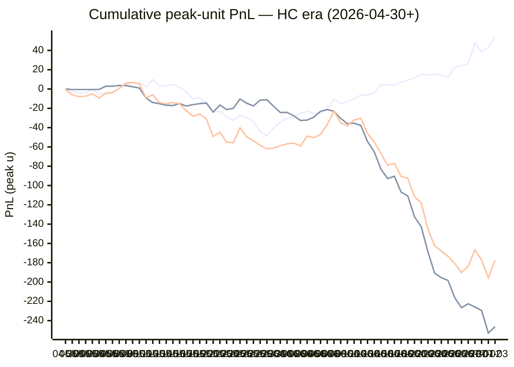

# Sharp Intel v6 — Daily Master Report

_Auto-generated **7/4/2026, 10:15:17 AM ET** by `scripts/dailyV6Report.js`. Do not edit by hand._

**Source of truth: this report mirrors the live Pick Performance dashboard.** Inclusion = `lockStage ≠ SHADOW ∧ ¬superseded ∧ health ∉ {MUTED, CANCELLED} ∧ peak.stars ≥ 2.5`. PnL is in **peak units** (the size shipped to users). HC margin / Δw / Δq are the **frozen** stamps written at last sync before the T-15 freeze. HC margin only existed from the v7.1 launch (**2026-04-30**); pre-launch picks have no HC value (no retro-fitting). Nothing is recomputed against today's whitelist.

v6 cutover: **2026-04-18** · whitelist source: live `sharpWalletProfiles` (336 profiles — drives §5 roster snapshot only) · quality cut: contribution ≥ 30 · HC = CONFIRMED tier ∧ sizeRatio ≥ 1.5.

---
## §1. Yesterday's picks

Slate: **2026-07-03** · 18 shipped sides.

| N | W-L-P | WR% | PnL (peak u) | PnL (flat 1u) |
|---|---|---|---|---|
| 18 | 13-5-0 | 72.2% | +18.11u | +5.74u |

| Sport | Market | Matchup | Pick | Stars · Units | HC | Δw | Δq | Σ | Odds | Result | PnL (peak u) |
|---|---|---|---|---|---|---|---|---|---|---|---|
| MLB | ML | Milwaukee Brewers @ Arizona Diamondbacks | Milwaukee Brewers | 5.0★ · 5.00u | +0 | +2 | +0 | +2 | -146 | **W** | +0.68u |
| MLB | ML | Minnesota Twins @ New York Yankees | New York Yankees | 3.0★ · 0.50u | +0 | +1 | +0 | +1 | -216 | **W** | +0.00u |
| MLB | ML | Pittsburgh Pirates @ Washington Nationals | Washington Nationals | 4.5★ · 3.00u | +1 | +1 | +1 | +2 | -141 | **W** | +3.38u |
| MLB | ML | Tampa Bay Rays @ Houston Astros | Tampa Bay Rays | 4.5★ · 3.00u | +1 | +6 | +5 | +11 | -103 | **W** | +4.63u |
| MLB | ML | Toronto Blue Jays @ Seattle Mariners | Seattle Mariners | 4.0★ · 1.00u | +0 | +2 | -1 | +1 | +117 | L | -1.00u |
| MLB | SPREAD | Milwaukee Brewers @ Arizona Diamondbacks | Milwaukee Brewers | 5.0★ · 2.50u | +0 | +0 | +2 | +2 | +112 | **W** | +0.00u |
| MLB | SPREAD | Minnesota Twins @ New York Yankees | Minnesota Twins | 2.5★ · 0.25u | +0 | +0 | +1 | +1 | -126 | L | -0.25u |
| MLB | SPREAD | St. Louis Cardinals @ Chicago Cubs | St. Louis Cardinals | 3.0★ · 0.50u | +1 | +1 | +2 | +3 | -110 | **W** | +0.00u |
| MLB | TOTAL | Baltimore Orioles @ Cincinnati Reds | Under 9.5 | 4.0★ · 1.00u | +1 | +1 | +0 | +1 | -110 | **W** | +4.55u |
| MLB | TOTAL | Boston Red Sox @ Los Angeles Angels | Under 8.5 | 4.5★ · 3.00u | +0 | +1 | +1 | +2 | -110 | **W** | +0.00u |
| MLB | TOTAL | Chicago White Sox @ Cleveland Guardians | Under 8.5 | 4.5★ · 3.00u | +1 | +2 | +2 | +4 | -110 | **W** | +4.55u |
| MLB | TOTAL | Milwaukee Brewers @ Arizona Diamondbacks | Over 9.5 | 3.0★ · 0.50u | +0 | +0 | +0 | +0 | -110 | **W** | +3.60u |
| MLB | TOTAL | Pittsburgh Pirates @ Washington Nationals | Over 9.5 | 2.5★ · 0.25u | +0 | +0 | +0 | +0 | -110 | **W** | +0.00u |
| MLB | TOTAL | San Francisco Giants @ Colorado Rockies | Under 11.5 | 4.5★ · 3.00u | +1 | +1 | +1 | +2 | -110 | L | -3.00u |
| MLB | TOTAL | Tampa Bay Rays @ Houston Astros | Under 9 | 4.5★ · 3.00u | +0 | +1 | +1 | +2 | -118 | **W** | +3.67u |
| SOC | ML | Cabo Verde @ Argentina | Argentina | 5.0★ · 5.00u | +4 | +6 | +8 | +14 | -525 | L | -5.00u |
| SOC | ML | Egypt @ Australia | Egypt | 2.5★ · 0.25u | +2 | -2 | +0 | -2 | +150 | L | -0.25u |
| SOC | ML | Ghana @ Colombia | Colombia | 5.0★ · 5.00u | +2 | +7 | +8 | +15 | -205 | **W** | +2.55u |

---
## §2. 3-day / 7-day / all-time cohort rollups

Shipped picks only. PnL in **peak units** (size we actually bet) and flat 1u (cohort EV lens). All margins are the engine's frozen stamps (`v8_hcMargin`, `v8_walletConsensusDelta`, `v8_walletConsensusQualityMargin`).

**HC margin sub-tables** are scoped to picks dated ≥ 2026-04-30 (the v7.1 launch — when HC margin became a real engine signal). Pre-launch picks are excluded from HC analysis since the feature didn't exist for them. Δw / Δq sub-tables span the full v6-era sample (≥ 2026-04-18). Empty buckets are dropped.

### §2a. 3-day

Total: **60** shipped · 30-30-0 · WR 50.0% · PnL -11.09u (peak) / -1.94u (flat).

**By HC margin** _(picks dated ≥ 2026-04-30, N = 60)_

| Bucket | N | W-L-P | WR% | PnL (peak u) | PnL (flat 1u) |
|---|---|---|---|---|---|
| HC ≥ +3 | 3 | 1-2-0 | 33.3% | -1.55u | -1.38u |
| HC = +2 | 5 | 2-3-0 | 40.0% | -0.30u | -1.60u |
| HC = +1 | 13 | 8-5-0 | 61.5% | +8.77u | +2.10u |
| HC = 0 | 37 | 17-20-0 | 45.9% | -20.31u | -4.31u |
| HC ≤ −1 | 2 | 2-0-0 | 100.0% | +2.30u | +3.25u |

**By Δw (winner margin)**

| Bucket | N | W-L-P | WR% | PnL (peak u) | PnL (flat 1u) |
|---|---|---|---|---|---|
| ≥ +3 | 12 | 6-6-0 | 50.0% | -4.84u | -0.76u |
| +2 | 11 | 6-5-0 | 54.5% | +1.26u | +0.23u |
| +1 | 18 | 11-7-0 | 61.1% | +1.09u | +2.71u |
| 0 | 12 | 5-7-0 | 41.7% | -5.90u | -2.38u |
| −1 | 3 | 1-2-0 | 33.3% | -3.50u | -1.05u |
| ≤ −2 | 4 | 1-3-0 | 25.0% | +0.80u | -0.70u |

**By Δq (quality margin)**

| Bucket | N | W-L-P | WR% | PnL (peak u) | PnL (flat 1u) |
|---|---|---|---|---|---|
| ≥ +3 | 9 | 3-6-0 | 33.3% | -12.37u | -3.92u |
| +2 | 12 | 9-3-0 | 75.0% | +15.95u | +5.83u |
| +1 | 12 | 3-9-0 | 25.0% | -11.95u | -6.53u |
| 0 | 19 | 12-7-0 | 63.2% | -0.18u | +3.70u |
| −1 | 6 | 2-4-0 | 33.3% | -4.59u | -2.32u |
| ≤ −2 | 2 | 1-1-0 | 50.0% | +2.05u | +1.30u |

**By AGS tier** _(picks dated ≥ 2026-05-05, N = 60)_

| Bucket | N | W-L-P | WR% | PnL (peak u) | PnL (flat 1u) |
|---|---|---|---|---|---|
| NEUT   (0 .. +3) | 47 | 23-24-0 | 48.9% | -17.14u | -4.14u |
| WEAK   (−1 .. 0) | 13 | 7-6-0 | 53.8% | +6.05u | +2.20u |

### §2b. 7-day

Total: **160** shipped · 77-81-2 · WR 48.7% · PnL -4.22u (peak) / -12.74u (flat).

**By HC margin** _(picks dated ≥ 2026-04-30, N = 160)_

| Bucket | N | W-L-P | WR% | PnL (peak u) | PnL (flat 1u) |
|---|---|---|---|---|---|
| HC ≥ +3 | 8 | 5-3-0 | 62.5% | +6.03u | +0.48u |
| HC = +2 | 10 | 5-5-0 | 50.0% | +5.34u | -0.75u |
| HC = +1 | 28 | 20-8-0 | 71.4% | +31.17u | +7.87u |
| HC = 0 | 109 | 45-62-2 | 42.1% | -47.81u | -20.61u |
| HC ≤ −1 | 5 | 2-3-0 | 40.0% | +1.05u | +0.25u |

**By Δw (winner margin)**

| Bucket | N | W-L-P | WR% | PnL (peak u) | PnL (flat 1u) |
|---|---|---|---|---|---|
| ≥ +3 | 30 | 17-13-0 | 56.7% | +7.32u | +0.87u |
| +2 | 24 | 15-8-1 | 65.2% | +9.83u | +3.71u |
| +1 | 61 | 29-32-0 | 47.5% | -8.59u | -5.32u |
| 0 | 33 | 13-20-0 | 39.4% | -8.83u | -8.34u |
| −1 | 8 | 2-5-1 | 28.6% | -4.75u | -2.96u |
| ≤ −2 | 4 | 1-3-0 | 25.0% | +0.80u | -0.70u |

**By Δq (quality margin)**

| Bucket | N | W-L-P | WR% | PnL (peak u) | PnL (flat 1u) |
|---|---|---|---|---|---|
| ≥ +3 | 21 | 13-8-0 | 61.9% | -0.99u | +1.34u |
| +2 | 16 | 11-5-0 | 68.8% | +17.84u | +5.81u |
| +1 | 51 | 20-30-1 | 40.0% | -15.19u | -13.51u |
| 0 | 53 | 24-28-1 | 46.2% | -12.32u | -6.46u |
| −1 | 17 | 8-9-0 | 47.1% | +4.39u | -1.22u |
| ≤ −2 | 2 | 1-1-0 | 50.0% | +2.05u | +1.30u |

**By AGS tier** _(picks dated ≥ 2026-05-05, N = 160)_

| Bucket | N | W-L-P | WR% | PnL (peak u) | PnL (flat 1u) |
|---|---|---|---|---|---|
| NEUT   (0 .. +3) | 133 | 67-65-1 | 50.8% | -2.77u | -7.44u |
| WEAK   (−1 .. 0) | 27 | 10-16-1 | 38.5% | -1.45u | -5.30u |

### §2c. All-time

Total: **1034** shipped · 516-508-10 · WR 50.4% · PnL -189.84u (peak) / -46.21u (flat).

**By HC margin** _(picks dated ≥ 2026-04-30, N = 923)_

| Bucket | N | W-L-P | WR% | PnL (peak u) | PnL (flat 1u) |
|---|---|---|---|---|---|
| HC ≥ +3 | 23 | 9-14-0 | 39.1% | -2.17u | -8.57u |
| HC = +2 | 47 | 24-23-0 | 51.1% | +9.20u | -1.99u |
| HC = +1 | 207 | 124-83-0 | 59.9% | +47.62u | +25.67u |
| HC = 0 | 609 | 288-312-9 | 48.0% | -246.16u | -58.09u |
| HC ≤ −1 | 36 | 20-16-0 | 55.6% | +12.27u | +5.55u |

**By Δw (winner margin)**

| Bucket | N | W-L-P | WR% | PnL (peak u) | PnL (flat 1u) |
|---|---|---|---|---|---|
| ≥ +3 | 154 | 80-74-0 | 51.9% | -2.75u | -0.90u |
| +2 | 180 | 92-86-2 | 51.7% | -19.91u | -3.09u |
| +1 | 411 | 214-194-3 | 52.5% | -90.77u | -2.82u |
| 0 | 222 | 105-114-3 | 47.9% | -55.44u | -22.64u |
| −1 | 47 | 17-28-2 | 37.8% | -18.97u | -12.66u |
| ≤ −2 | 14 | 4-10-0 | 28.6% | -5.99u | -4.95u |
| missing | 6 | 4-2-0 | 66.7% | +3.99u | +0.85u |

**By Δq (quality margin)**

| Bucket | N | W-L-P | WR% | PnL (peak u) | PnL (flat 1u) |
|---|---|---|---|---|---|
| ≥ +3 | 166 | 86-77-3 | 52.8% | -27.26u | -0.86u |
| +2 | 154 | 75-79-0 | 48.7% | -22.45u | -10.00u |
| +1 | 331 | 172-155-4 | 52.6% | -29.52u | -6.72u |
| 0 | 263 | 127-134-2 | 48.7% | -95.24u | -17.80u |
| −1 | 83 | 43-39-1 | 52.4% | +3.59u | +0.92u |
| ≤ −2 | 31 | 9-22-0 | 29.0% | -22.20u | -12.53u |
| missing | 6 | 4-2-0 | 66.7% | +3.24u | +0.77u |

**By AGS tier** _(picks dated ≥ 2026-05-05, N = 898)_

| Bucket | N | W-L-P | WR% | PnL (peak u) | PnL (flat 1u) |
|---|---|---|---|---|---|
| ELITE  (≥ +7) | 3 | 3-0-0 | 100.0% | +8.01u | +2.34u |
| LOCK   (+5 .. +7) | 9 | 5-4-0 | 55.6% | -2.93u | -0.47u |
| STRONG (+3 .. +5) | 23 | 13-10-0 | 56.5% | -6.91u | +1.77u |
| NEUT   (0 .. +3) | 596 | 309-284-3 | 52.1% | -93.34u | -17.39u |
| WEAK   (−1 .. 0) | 252 | 114-133-5 | 46.2% | -83.80u | -28.48u |
| FADE   (< −1) | 14 | 9-5-0 | 64.3% | +4.68u | +5.05u |
| missing | 1 | 1-0-0 | 100.0% | +1.63u | +0.96u |

---
## §3. Edge over time — is HC margin creating winners?

Daily cumulative peak-unit PnL since the HC margin launch (**2026-04-30**). The `HC ≥ +1` line is the golden-standard cohort. The `HC = 0` line is the no-HC-signal control. The `All shipped (HC era)` line is every shipped pick from the same date range — the apples-to-apples baseline. Watch the spread.

Daily cumulative table (peak units, HC era only):

| Date | HC ≥ +1 (cum) | HC = 0 (cum) | All shipped (cum) |
|---|---|---|---|
| 2026-04-30 | -0.48u | +0.00u | -0.48u |
| 2026-05-01 | -2.48u | -0.50u | -5.98u |
| 2026-05-02 | -4.41u | -0.50u | -7.91u |
| 2026-05-03 | -3.94u | -0.50u | -7.44u |
| 2026-05-04 | -0.95u | -0.50u | -4.95u |
| 2026-05-05 | -5.45u | -0.34u | -9.29u |
| 2026-05-06 | -3.86u | +2.84u | -4.52u |
| 2026-05-07 | -3.18u | +2.84u | -3.84u |
| 2026-05-08 | +0.54u | +3.60u | +0.64u |
| 2026-05-09 | +4.41u | +3.60u | +6.14u |
| 2026-05-10 | +6.41u | +2.32u | +6.86u |
| 2026-05-11 | +6.25u | +1.05u | +5.43u |
| 2026-05-12 | +2.11u | -9.45u | -9.21u |
| 2026-05-13 | +9.78u | -13.95u | -6.04u |
| 2026-05-14 | +3.00u | -15.20u | -14.07u |
| 2026-05-15 | +3.27u | -16.83u | -15.43u |
| 2026-05-16 | +4.90u | -17.05u | -14.02u |
| 2026-05-17 | +1.62u | -15.11u | -15.36u |
| 2026-05-18 | -2.98u | -17.67u | -22.52u |
| 2026-05-19 | -10.18u | -16.17u | -28.22u |
| 2026-05-20 | -8.90u | -15.07u | -25.84u |
| 2026-05-21 | -14.92u | -14.58u | -31.37u |
| 2026-05-22 | -23.44u | -23.93u | -49.24u |
| 2026-05-23 | -23.30u | -16.53u | -44.70u |
| 2026-05-24 | -28.89u | -21.34u | -55.10u |
| 2026-05-25 | -32.63u | -20.03u | -55.65u |
| 2026-05-26 | -26.98u | -10.27u | -40.24u |
| 2026-05-27 | -29.77u | -14.68u | -49.69u |
| 2026-05-28 | -33.27u | -17.58u | -53.57u |
| 2026-05-29 | -44.12u | -11.51u | -58.35u |
| 2026-05-30 | -48.21u | -11.10u | -62.03u |
| 2026-05-31 | -40.65u | -17.79u | -61.16u |
| 2026-06-01 | -34.49u | -24.29u | -58.77u |
| 2026-06-02 | -30.14u | -24.19u | -56.82u |
| 2026-06-03 | -28.48u | -27.68u | -56.00u |
| 2026-06-04 | -25.53u | -32.54u | -58.91u |
| 2026-06-05 | -22.94u | -32.20u | -48.76u |
| 2026-06-06 | -25.33u | -29.06u | -50.51u |
| 2026-06-07 | -24.75u | -23.09u | -46.96u |
| 2026-06-08 | -21.34u | -21.30u | -36.94u |
| 2026-06-09 | -10.19u | -23.13u | -22.86u |
| 2026-06-10 | -14.95u | -30.43u | -34.92u |
| 2026-06-11 | -13.13u | -35.94u | -38.09u |
| 2026-06-12 | -10.30u | -35.44u | -32.03u |
| 2026-06-13 | -6.20u | -37.73u | -30.22u |
| 2026-06-14 | -6.21u | -54.41u | -46.29u |
| 2026-06-15 | -4.25u | -65.05u | -54.97u |
| 2026-06-16 | +4.40u | -83.05u | -66.82u |
| 2026-06-17 | +4.40u | -92.84u | -79.11u |
| 2026-06-18 | +3.98u | -90.33u | -77.02u |
| 2026-06-19 | +7.06u | -106.79u | -90.52u |
| 2026-06-20 | +9.08u | -110.78u | -92.49u |
| 2026-06-21 | +11.60u | -132.42u | -111.61u |
| 2026-06-22 | +15.45u | -142.67u | -118.01u |
| 2026-06-23 | +14.45u | -168.67u | -145.01u |
| 2026-06-24 | +15.59u | -190.87u | -162.43u |
| 2026-06-25 | +14.62u | -195.48u | -168.01u |
| 2026-06-26 | +12.11u | -198.35u | -173.39u |
| 2026-06-27 | +22.64u | -216.31u | -180.82u |
| 2026-06-28 | +23.97u | -226.59u | -190.27u |
| 2026-06-29 | +26.55u | -222.52u | -183.62u |
| 2026-06-30 | +47.73u | -225.85u | -166.52u |
| 2026-07-01 | +38.33u | -229.56u | -177.33u |
| 2026-07-02 | +43.24u | -252.86u | -195.72u |
| 2026-07-03 | +54.65u | -246.16u | -177.61u |

---
## §4. Wallet roster growth & profitability

"Tracked in sport X" = a wallet has placed **≥ 2 bets** in X within the v6-era sample. "Profitable" = cumulative flat PnL > 0. Source: `v8Scoring.walletDetails` on every graded v6-era game (every side, not just the shipped set).

### §4a. Per-sport wallet snapshot

| Sport | Total wallets seen | Tracked (≥2) | Profitable | % prof | WR ≥ 50% | WR ≥ 60% | WR ≥ 70% |
|---|---|---|---|---|---|---|---|
| MLB | 96 | 75 | 26 | 35% | 36 | 10 | 4 |
| NBA | 138 | 108 | 44 | 41% | 60 | 29 | 11 |
| NHL | 60 | 43 | 12 | 28% | 24 | 12 | 6 |
| SOC | 134 | 93 | 64 | 69% | 67 | 55 | 41 |
| **ALL (any sport)** | **250** | **191** | **98** | **51%** | **109** | **53** | **33** |

### §4b. Daily roster growth (cumulative through each date)

Format: `tracked (profitable)`. For each date D, recompute the roster using every bet up to and including D.

| Date | ALL | MLB | NBA | NHL | SOC |
|---|---|---|---|---|---|
| 2026-04-18 | 5 (2) | 2 (2) | 3 (0) | 0 (0) | 0 (0) |
| 2026-04-19 | 19 (8) | 5 (3) | 9 (3) | 3 (1) | 0 (0) |
| 2026-04-20 | 29 (12) | 7 (6) | 23 (8) | 5 (2) | 0 (0) |
| 2026-04-21 | 44 (21) | 10 (6) | 31 (10) | 7 (5) | 0 (0) |
| 2026-04-22 | 52 (28) | 12 (6) | 39 (15) | 11 (10) | 0 (0) |
| 2026-04-23 | 56 (29) | 13 (6) | 46 (21) | 13 (10) | 0 (0) |
| 2026-04-24 | 61 (30) | 14 (6) | 51 (23) | 14 (9) | 0 (0) |
| 2026-04-25 | 65 (29) | 16 (8) | 54 (22) | 16 (9) | 0 (0) |
| 2026-04-26 | 67 (31) | 18 (5) | 56 (25) | 17 (9) | 0 (0) |
| 2026-04-27 | 72 (32) | 20 (7) | 60 (24) | 17 (9) | 0 (0) |
| 2026-04-28 | 76 (33) | 21 (7) | 63 (26) | 23 (10) | 0 (0) |
| 2026-04-29 | 77 (33) | 21 (7) | 64 (25) | 23 (10) | 0 (0) |
| 2026-04-30 | 81 (34) | 21 (7) | 70 (27) | 23 (10) | 0 (0) |
| 2026-05-01 | 85 (38) | 22 (5) | 74 (30) | 26 (13) | 0 (0) |
| 2026-05-02 | 86 (37) | 23 (7) | 75 (32) | 26 (12) | 0 (0) |
| 2026-05-03 | 86 (38) | 24 (8) | 75 (33) | 26 (12) | 0 (0) |
| 2026-05-04 | 90 (38) | 24 (9) | 76 (32) | 26 (12) | 0 (0) |
| 2026-05-05 | 91 (40) | 24 (9) | 79 (33) | 26 (12) | 0 (0) |
| 2026-05-06 | 92 (40) | 24 (9) | 80 (33) | 26 (12) | 0 (0) |
| 2026-05-07 | 92 (41) | 24 (9) | 80 (33) | 26 (12) | 0 (0) |
| 2026-05-08 | 92 (40) | 24 (8) | 80 (32) | 26 (11) | 0 (0) |
| 2026-05-09 | 94 (42) | 24 (8) | 82 (35) | 26 (11) | 0 (0) |
| 2026-05-10 | 94 (42) | 24 (8) | 82 (35) | 26 (11) | 0 (0) |
| 2026-05-11 | 96 (42) | 24 (8) | 84 (36) | 26 (11) | 0 (0) |
| 2026-05-12 | 100 (41) | 27 (9) | 86 (37) | 26 (11) | 0 (0) |
| 2026-05-13 | 102 (45) | 29 (11) | 88 (37) | 26 (11) | 0 (0) |
| 2026-05-14 | 102 (41) | 29 (11) | 88 (37) | 28 (12) | 0 (0) |
| 2026-05-15 | 103 (41) | 30 (10) | 88 (39) | 28 (12) | 0 (0) |
| 2026-05-16 | 105 (43) | 31 (12) | 88 (39) | 30 (14) | 0 (0) |
| 2026-05-17 | 105 (46) | 32 (11) | 88 (40) | 30 (14) | 0 (0) |
| 2026-05-18 | 105 (46) | 32 (10) | 88 (38) | 31 (15) | 0 (0) |
| 2026-05-19 | 105 (46) | 32 (12) | 88 (38) | 31 (15) | 0 (0) |
| 2026-05-20 | 106 (48) | 33 (12) | 88 (38) | 31 (16) | 0 (0) |
| 2026-05-21 | 106 (45) | 34 (12) | 88 (37) | 31 (14) | 0 (0) |
| 2026-05-22 | 106 (44) | 34 (10) | 88 (39) | 33 (16) | 0 (0) |
| 2026-05-23 | 111 (49) | 36 (10) | 90 (40) | 36 (19) | 0 (0) |
| 2026-05-24 | 117 (52) | 37 (12) | 94 (39) | 37 (16) | 0 (0) |
| 2026-05-25 | 120 (53) | 38 (13) | 95 (40) | 38 (16) | 0 (0) |
| 2026-05-26 | 122 (55) | 39 (14) | 97 (42) | 38 (16) | 0 (0) |
| 2026-05-27 | 123 (51) | 40 (12) | 97 (42) | 40 (14) | 0 (0) |
| 2026-05-28 | 124 (51) | 40 (12) | 99 (42) | 40 (14) | 0 (0) |
| 2026-05-29 | 125 (50) | 41 (12) | 99 (42) | 41 (12) | 0 (0) |
| 2026-05-30 | 126 (49) | 41 (12) | 101 (43) | 41 (12) | 0 (0) |
| 2026-05-31 | 126 (48) | 41 (11) | 101 (43) | 41 (12) | 0 (0) |
| 2026-06-01 | 129 (52) | 44 (14) | 101 (43) | 41 (12) | 0 (0) |
| 2026-06-02 | 130 (56) | 45 (16) | 101 (43) | 41 (13) | 0 (0) |
| 2026-06-03 | 132 (56) | 45 (14) | 102 (43) | 41 (13) | 0 (0) |
| 2026-06-04 | 132 (57) | 46 (14) | 102 (43) | 41 (14) | 0 (0) |
| 2026-06-05 | 132 (57) | 48 (15) | 102 (43) | 41 (14) | 0 (0) |
| 2026-06-06 | 132 (57) | 49 (15) | 102 (43) | 41 (14) | 0 (0) |
| 2026-06-07 | 133 (56) | 52 (16) | 102 (43) | 41 (14) | 0 (0) |
| 2026-06-08 | 135 (55) | 53 (16) | 103 (44) | 41 (14) | 0 (0) |
| 2026-06-09 | 135 (55) | 53 (15) | 103 (44) | 41 (14) | 0 (0) |
| 2026-06-10 | 135 (56) | 53 (15) | 105 (45) | 41 (14) | 0 (0) |
| 2026-06-11 | 135 (54) | 54 (16) | 105 (45) | 42 (13) | 0 (0) |
| 2026-06-12 | 135 (56) | 55 (17) | 105 (45) | 42 (13) | 0 (0) |
| 2026-06-13 | 136 (56) | 57 (17) | 108 (44) | 42 (13) | 0 (0) |
| 2026-06-14 | 136 (55) | 57 (18) | 108 (44) | 43 (12) | 2 (0) |
| 2026-06-15 | 136 (56) | 57 (19) | 108 (44) | 43 (12) | 2 (0) |
| 2026-06-16 | 141 (60) | 58 (20) | 108 (44) | 43 (12) | 13 (5) |
| 2026-06-17 | 143 (64) | 58 (19) | 108 (44) | 43 (12) | 18 (10) |
| 2026-06-18 | 145 (66) | 58 (20) | 108 (44) | 43 (12) | 24 (14) |
| 2026-06-19 | 145 (66) | 58 (20) | 108 (44) | 43 (12) | 29 (21) |
| 2026-06-20 | 147 (75) | 60 (19) | 108 (44) | 43 (12) | 33 (27) |
| 2026-06-21 | 147 (74) | 60 (19) | 108 (44) | 43 (12) | 35 (29) |
| 2026-06-22 | 153 (77) | 61 (20) | 108 (44) | 43 (12) | 42 (34) |
| 2026-06-23 | 156 (80) | 64 (20) | 108 (44) | 43 (12) | 44 (34) |
| 2026-06-24 | 160 (84) | 65 (22) | 108 (44) | 43 (12) | 52 (40) |
| 2026-06-25 | 160 (82) | 67 (24) | 108 (44) | 43 (12) | 55 (44) |
| 2026-06-26 | 166 (85) | 67 (22) | 108 (44) | 43 (12) | 63 (51) |
| 2026-06-27 | 172 (86) | 68 (20) | 108 (44) | 43 (12) | 72 (54) |
| 2026-06-28 | 175 (91) | 69 (21) | 108 (44) | 43 (12) | 75 (57) |
| 2026-06-29 | 182 (95) | 72 (24) | 108 (44) | 43 (12) | 80 (62) |
| 2026-06-30 | 184 (96) | 73 (26) | 108 (44) | 43 (12) | 81 (62) |
| 2026-07-01 | 187 (96) | 74 (26) | 108 (44) | 43 (12) | 85 (64) |
| 2026-07-02 | 191 (99) | 75 (27) | 108 (44) | 43 (12) | 91 (65) |
| 2026-07-03 | 191 (98) | 75 (26) | 108 (44) | 43 (12) | 93 (64) |

### §4c. Top 10 profitable wallets by sport

#### MLB

| # | Wallet | N | W | L | WR% | Flat PnL (u) | Flat ROI | $ PnL |
|---|---|---|---|---|---|---|---|---|
| 1 | 57be17 | 2 | 1 | 1 | 50.0% | +5.95 | +297.5% | $52.6K |
| 2 | f2f960 | 2 | 2 | 0 | 100.0% | +1.93 | +96.5% | $61.1K |
| 3 | b70f9a | 3 | 3 | 0 | 100.0% | +2.01 | +67.1% | $4.5K |
| 4 | e05213 | 15 | 11 | 4 | 73.3% | +6.08 | +40.5% | $278.1K |
| 5 | a82a75 | 15 | 11 | 4 | 73.3% | +5.82 | +38.8% | -$825 |
| 6 | 913987 | 44 | 30 | 14 | 68.2% | +14.19 | +32.2% | $666.8K |
| 7 | dfa240 | 3 | 2 | 1 | 66.7% | +0.85 | +28.3% | $2.5K |
| 8 | f9e3d0 | 14 | 9 | 5 | 64.3% | +3.64 | +26.0% | $95.1K |
| 9 | f2d227 | 40 | 27 | 13 | 67.5% | +10.01 | +25.0% | $109.5K |
| 10 | 981187 | 8 | 5 | 3 | 62.5% | +1.65 | +20.7% | $13.5K |

#### NBA

| # | Wallet | N | W | L | WR% | Flat PnL (u) | Flat ROI | $ PnL |
|---|---|---|---|---|---|---|---|---|
| 1 | 799fad | 2 | 2 | 0 | 100.0% | +5.66 | +283.0% | $241.7K |
| 2 | a0d6d2 | 4 | 4 | 0 | 100.0% | +4.51 | +112.7% | $6.4K |
| 3 | 12ad50 | 3 | 3 | 0 | 100.0% | +2.74 | +91.3% | $45.5K |
| 4 | b51a56 | 6 | 5 | 1 | 83.3% | +5.44 | +90.7% | $74.4K |
| 5 | 11b032 | 7 | 6 | 1 | 85.7% | +5.40 | +77.1% | $249.9K |
| 6 | 12c933 | 2 | 2 | 0 | 100.0% | +1.28 | +63.9% | $11.5K |
| 7 | a1684d | 10 | 9 | 1 | 90.0% | +5.24 | +52.4% | $11.2K |
| 8 | 7f00bc | 21 | 14 | 7 | 66.7% | +9.80 | +46.7% | $14.7K |
| 9 | 92df91 | 23 | 16 | 7 | 69.6% | +10.26 | +44.6% | -$214 |
| 10 | 8ec926 | 8 | 6 | 2 | 75.0% | +3.53 | +44.1% | -$681 |

#### NHL

| # | Wallet | N | W | L | WR% | Flat PnL (u) | Flat ROI | $ PnL |
|---|---|---|---|---|---|---|---|---|
| 1 | 8366f5 | 2 | 2 | 0 | 100.0% | +2.30 | +114.9% | $107.6K |
| 2 | 799fad | 2 | 2 | 0 | 100.0% | +1.88 | +94.1% | $46.9K |
| 3 | fec67e | 4 | 3 | 1 | 75.0% | +2.82 | +70.5% | $12.5K |
| 4 | 30935c | 4 | 3 | 1 | 75.0% | +2.11 | +52.7% | $953 |
| 5 | 981187 | 8 | 6 | 2 | 75.0% | +3.52 | +44.0% | -$25.2K |
| 6 | fcc12b | 11 | 8 | 3 | 72.7% | +4.45 | +40.5% | -$27.5K |
| 7 | bc3532 | 22 | 14 | 8 | 63.6% | +7.85 | +35.7% | $70.3K |
| 8 | e70853 | 9 | 6 | 3 | 66.7% | +2.66 | +29.5% | -$11.1K |
| 9 | 4d2125 | 17 | 11 | 6 | 64.7% | +4.26 | +25.1% | $80.3K |
| 10 | dfa240 | 28 | 18 | 10 | 64.3% | +6.46 | +23.1% | $19.0K |

#### SOC

| # | Wallet | N | W | L | WR% | Flat PnL (u) | Flat ROI | $ PnL |
|---|---|---|---|---|---|---|---|---|
| 1 | 59266e | 2 | 2 | 0 | 100.0% | +18.11 | +905.3% | $2.98M |
| 2 | daf4de | 3 | 2 | 1 | 66.7% | +24.11 | +803.5% | $1.77M |
| 3 | 7b4652 | 8 | 8 | 0 | 100.0% | +34.07 | +425.9% | $21.0K |
| 4 | 12c933 | 8 | 6 | 2 | 75.0% | +31.63 | +395.4% | $133.9K |
| 5 | c9bba3 | 13 | 9 | 4 | 69.2% | +36.62 | +281.7% | $2.46M |
| 6 | cf627b | 4 | 3 | 1 | 75.0% | +10.94 | +273.5% | $585.4K |
| 7 | a7a9cc | 2 | 2 | 0 | 100.0% | +5.14 | +257.0% | $353.6K |
| 8 | 8da2ca | 8 | 6 | 2 | 75.0% | +19.00 | +237.6% | $502.0K |
| 9 | 2d2ca8 | 13 | 9 | 4 | 69.2% | +30.47 | +234.4% | $8.68M |
| 10 | 946418 | 14 | 12 | 2 | 85.7% | +31.89 | +227.8% | $76.3K |

---
## §5. Proven-wallet roster growth & HC tracking

"Proven wallet" = whitelist tier `CONFIRMED` or `FLAT` in the same sense the live engine uses (`exportWalletProfiles.js` → `sharpWalletProfiles.bySport`). Sports inherit independent rosters: a wallet can be CONFIRMED in NBA and absent from NHL. `walletBets` come from `v8Scoring.walletDetails` on every graded v6-era pick (Source A); `positionRows` come from `sharp_action_positions` (Source B).

### §5a. Current proven-winner roster (snapshot)

Roster as of **2026-07-03** — wallets with ≥2 bets in the sport.

| Sport | Wallets seen | Eligible (≥2) | CONFIRMED | FLAT | Proven (C+F) | WR50 only | Conv % |
|---|---|---|---|---|---|---|---|
| MLB | 147 | 75 | 14 | 12 | **26** | 10 | 17.7% |
| NBA | 210 | 108 | 29 | 15 | **44** | 21 | 21.0% |
| NHL | 105 | 43 | 9 | 3 | **12** | 12 | 11.4% |
| SOC | 179 | 93 | 37 | 27 | **64** | 7 | 35.8% |
| **ALL** | **—** | **—** | **—** | **—** | **146** | **—** | **—** |

### §5b. Live whitelist drift check

Live `sharpWalletProfiles` is what the engine reads at lock time. Drift between script reconstruction (above) and live should be ≤ 1 day of position data — otherwise `exportWalletProfiles.js` is stale.

| Sport | CONFIRMED (live · script) | FLAT (live · script) | WR50 (live · script) | Drift |
|---|---|---|---|---|
| MLB | 33 · 14 | 22 · 12 | 7 · 10 | +29 live |
| NBA | 58 · 29 | 25 · 15 | 23 · 21 | +39 live |
| NHL | 23 · 9 | 6 · 3 | 16 · 12 | +17 live |
| SOC | 47 · 37 | 29 · 27 | 7 · 7 | +12 live |

### §5c. Roster growth — 3d / 7d / 30d / all-time deltas

Each cell is **net growth** in proven (CONFIRMED + FLAT) wallets in that window, with the absolute count at the start (`+Δ from N`). Negative = wallets demoted. Window endpoint = 2026-07-03.

| Sport | 3-day | 7-day | 30-day | All-time (since cutover) |
|---|---|---|---|---|
| MLB | +0 from 26 | +4 from 22 | +12 from 14 | +26 from 0 |
| NBA | +0 from 44 | +0 from 44 | +1 from 43 | +44 from 0 |
| NHL | +0 from 12 | +0 from 12 | -1 from 13 | +12 from 0 |
| SOC | +2 from 62 | +13 from 51 | +64 from 0 | +64 from 0 |

A flat 7-day delta on a sport with healthy slate density = either the bubble pipeline has stalled (no wallets approaching the bar) or our cohort has saturated. Check §13d for the funnel diagnostic.

### §5d. Pipeline funnel — where each sport leaks

Wallets surviving each gate, in order. The biggest %-drop tells you the bottleneck. Gates:

1. **Seen** — placed ≥ 1 bet in the sport (any source)
2. **Eligible** — ≥ 2 graded picks in Source A (required for FLAT/CONFIRMED)
3. **Flat-OK** — eligible AND flat ROI > 0 (becomes FLAT or better)
4. **$-OK** — Flat-OK AND ≥2 positions with dollar ROI > 0 (CONFIRMED)
5. **Promoted** — final whitelisted = CONFIRMED + FLAT

| Sport | 1·Seen | 2·Eligible (% of Seen) | 3·Flat-OK (% of Elig) | 4·$-OK (% of Flat) | 5·Promoted | Bottleneck |
|---|---|---|---|---|---|---|
| MLB | 147 | 75 (51%) | 26 (35%) | 14 (54%) | **26** | edge (Eligible→Flat-OK) 65% |
| NBA | 210 | 108 (51%) | 44 (41%) | 29 (66%) | **44** | edge (Eligible→Flat-OK) 59% |
| NHL | 105 | 43 (41%) | 12 (28%) | 9 (75%) | **12** | edge (Eligible→Flat-OK) 72% |
| SOC | 179 | 93 (52%) | 64 (69%) | 37 (58%) | **64** | sample (Seen→Eligible) 48% |

### §5e. HC backing density (the fuel for v7.3 HC margin)

Every v7.x promotion is gated on `HC_m ≥ +1`, which requires at least one CONFIRMED wallet sized at `≥ 1.5×` average on the for-side. This table shows the share of shipped picks that *had any HC backing*, by sport, in each window. If HC density falls toward zero in a sport, the v7.3 floor cohorts (Σ=1, Σ=2 locks; HC rescues) will simply stop firing there.

| Sport | Window | Picks (with HC stamp) | Any HC for-side | HC_m ≥ +1 | HC_m ≥ +2 |
|---|---|---|---|---|---|
| MLB | 3-day | 55 | 19 (34.5%) | 18 (32.7%) | 5 (9.1%) |
| MLB | 7-day | 144 | 34 (23.6%) | 33 (22.9%) | 8 (5.6%) |
| MLB | All-time | 804 | 210 (26.1%) | 194 (24.1%) | 27 (3.4%) |
| NBA | 3-day | 0 | 0 (—) | 0 (—) | 0 (—) |
| NBA | 7-day | 0 | 0 (—) | 0 (—) | 0 (—) |
| NBA | All-time | 126 | 83 (65.9%) | 69 (54.8%) | 34 (27.0%) |
| NHL | 3-day | 0 | 0 (—) | 0 (—) | 0 (—) |
| NHL | 7-day | 0 | 0 (—) | 0 (—) | 0 (—) |
| NHL | All-time | 49 | 21 (42.9%) | 20 (40.8%) | 5 (10.2%) |
| SOC | 3-day | 5 | 3 (60.0%) | 3 (60.0%) | 3 (60.0%) |
| SOC | 7-day | 16 | 13 (81.3%) | 13 (81.3%) | 10 (62.5%) |
| SOC | All-time | 49 | 25 (51.0%) | 24 (49.0%) | 17 (34.7%) |

Pooled across sports:

| Window | Picks (with HC stamp) | Any HC for-side | HC_m ≥ +1 | HC_m ≥ +2 |
|---|---|---|---|---|
| 3-day | 60 | 22 (36.7%) | 21 (35.0%) | 8 (13.3%) |
| 7-day | 160 | 47 (29.4%) | 46 (28.7%) | 18 (11.3%) |
| All-time | 1028 | 339 (33.0%) | 307 (29.9%) | 83 (8.1%) |

### §5f. Bubble wallets — next-up graduations

Wallets currently NOT promoted but close. Two flavors:

- **One-bet-away** — won the only bet, needs one more positive bet to clear ≥2.
- **Just-under** — has ≥2 bets but flat ROI is between −10% and 0% (one win flips them).

#### MLB

**One-bet-away** (4)

| wallet | picksN | flat PnL | pos N | pos $ROI |
|---|---|---|---|---|
| `...020b` | 1 | +1.25 | 13 | -42% |
| `...9373` | 1 | +0.87 | 0 | — |
| `...9b3c` | 1 | +0.77 | 9 | 60% |
| `...8d26` | 1 | +0.72 | 5 | -22% |

**Just-under** (6)

| wallet | picksN | WR | flat ROI | pos N | pos $ROI |
|---|---|---|---|---|---|
| `...135d` | 398 | 52% | -0.2% | 375 | 7% |
| `...afd2` | 41 | 51% | -0.5% | 177 | -20% |
| `...64aa` | 290 | 54% | -1.2% | 472 | 0% |
| `...0ff5` | 66 | 48% | -1.6% | 99 | -19% |
| `...c684` | 28 | 50% | -2.0% | 85 | -2% |
| `...2768` | 60 | 48% | -3.0% | 91 | 18% |

#### NBA

**One-bet-away** (6)

| wallet | picksN | flat PnL | pos N | pos $ROI |
|---|---|---|---|---|
| `...bf5d` | 1 | +3.15 | 3 | 42% |
| `...ed41` | 1 | +3.15 | 3 | 3% |
| `...6b87` | 1 | +2.05 | 8 | -27% |
| `...c556` | 1 | +0.93 | 3 | 42% |
| `...5c69` | 1 | +0.91 | 2 | 28% |
| `...b989` | 1 | +0.88 | 21 | -90% |

**Just-under** (6)

| wallet | picksN | WR | flat ROI | pos N | pos $ROI |
|---|---|---|---|---|---|
| `...d814` | 8 | 50% | -0.5% | 53 | 1% |
| `...1e50` | 4 | 50% | -1.2% | 29 | 46% |
| `...65dd` | 6 | 50% | -2.4% | 17 | 27% |
| `...853d` | 40 | 53% | -2.7% | 90 | -2% |
| `...1697` | 17 | 53% | -3.5% | 34 | 9% |
| `...11a4` | 20 | 45% | -3.6% | 72 | 54% |

#### NHL

**One-bet-away** (6)

| wallet | picksN | flat PnL | pos N | pos $ROI |
|---|---|---|---|---|
| `...2e78` | 1 | +1.46 | 0 | — |
| `...017f` | 1 | +1.45 | 6 | 108% |
| `...32f2` | 1 | +1.40 | 0 | — |
| `...e0fd` | 1 | +1.20 | 3 | 124% |
| `...266e` | 1 | +1.05 | 0 | — |
| `...2194` | 1 | +1.05 | 0 | — |

**Just-under** (6)

| wallet | picksN | WR | flat ROI | pos N | pos $ROI |
|---|---|---|---|---|---|
| `...33ee` | 4 | 50% | -0.3% | 8 | -23% |
| `...df91` | 14 | 50% | -1.6% | 49 | -36% |
| `...afd2` | 6 | 50% | -1.9% | 26 | -17% |
| `...192c` | 7 | 43% | -2.9% | 21 | -15% |
| `...35e3` | 7 | 57% | -5.5% | 26 | 31% |
| `...618e` | 2 | 50% | -6.1% | 28 | 24% |

#### SOC

**One-bet-away** (6)

| wallet | picksN | flat PnL | pos N | pos $ROI |
|---|---|---|---|---|
| `...821d` | 1 | +4.30 | 7 | -31% |
| `...16ea` | 1 | +2.70 | 1 | -100% |
| `...aeeb` | 1 | +1.39 | 2 | 144% |
| `...2036` | 1 | +1.39 | 2 | 138% |
| `...1057` | 1 | +1.13 | 7 | 73% |
| `...06da` | 1 | +1.13 | 4 | 106% |

**Just-under** (5)

| wallet | picksN | WR | flat ROI | pos N | pos $ROI |
|---|---|---|---|---|---|
| `...69c2` | 2 | 50% | +0.0% | 22 | -5% |
| `...0319` | 3 | 67% | -1.5% | 14 | -2% |
| `...6aa1` | 6 | 50% | -1.5% | 12 | 29% |
| `...3f67` | 5 | 40% | -7.2% | 19 | 9% |
| `...c991` | 2 | 50% | -8.3% | 7 | -100% |

### §5g. v2 wallet-promotion pipeline (Source-A / Source-B mix)

Live snapshot of the v2 promotion gate (shipped 2026-05-10, re-eval **2026-05-24**). Each FLAT-or-better wallet × sport pair is attributed to one of three paths via `sharpWalletProfiles[wallet].bySport[sport].whitelistSource`:

- **A** — flat-positive on featured picks (Source A) only — the v1 gate
- **A+B** — flat-positive in both sources (most reliable signal)
- **B** — flat-positive on-chain only (NEW in v2 — the trial lift)

Re-classified every 2h via `grade-sharp-actions` cron. Roll-back: set `B_ONLY_MIN_BETS = Infinity` in `scripts/exportWalletProfiles.js`.

#### Source mix per sport (live Firestore)

| Sport | A | A+B | B (new) | FLAT-or-better total | % from B-only |
|---|---|---|---|---|---|
| MLB | 12 | 18 | **25** | 55 | 45.5% |
| NBA | 10 | 34 | **39** | 83 | 47.0% |
| NHL | 4 | 8 | **17** | 29 | 58.6% |
| SOC | 35 | 29 | **12** | 76 | 15.8% |
| **ALL** | **61** | **89** | **93** | **243** | **38.3%** |

#### Pipeline freshness

- `sharp_action_positions` GRADED rows: **19556**
- `sharp_action_positions` PENDING rows: **177** (queued for next Grade Sharp Actions run)
- Latest `sharpWalletProfiles` rebuild: 7/4/2026, 5:21:28 AM ET — **294 min · STALE** — check grade-sharp-actions workflow

**Alarms**: pending > 200 OR rebuild lag > 4h → cron is lagging or failing — check `gh run list --workflow="Grade Sharp Actions"`.

#### B-only roster — wallets currently promoted via Source B path only

Wallets here would have been EXCLUDED under v1 (Source-A-only). Top by Source-B bet count per sport. The 2-week re-eval (2026-05-24) will compare these wallets' realized lift against A-only and A+B cohorts.

**MLB** — 25 wallets promoted via B

| wallet | tier | B_n | B_flat ROI | B_$ ROI |
|---|---|---|---|---|
| `...9a27` | CONFIRMED | 467 | +12.3% | +4.4% |
| `...135d` | CONFIRMED | 375 | +2.1% | +6.8% |
| `...3532` | CONFIRMED | 324 | +1.6% | +6% |
| `...1eae` | FLAT | 147 | +3.1% | -1.4% |
| `...c684` | FLAT | 85 | +6.6% | -2.2% |
| `...69c2` | FLAT | 80 | +9.4% | -9.8% |
| `...ad50` | CONFIRMED | 74 | +16% | +8.5% |
| `...d6d2` | FLAT | 38 | +6.8% | -25.5% |
| `...cff6` | CONFIRMED | 26 | +6.6% | +22% |
| `...89a0` | FLAT | 20 | +13.5% | -37.2% |
| … | 15 more | | | |

**NBA** — 39 wallets promoted via B

| wallet | tier | B_n | B_flat ROI | B_$ ROI |
|---|---|---|---|---|
| `...cff6` | CONFIRMED | 112 | +3.2% | +31.8% |
| `...135d` | FLAT | 104 | +5% | -10.6% |
| `...11a4` | CONFIRMED | 72 | +23.3% | +54.4% |
| `...3782` | CONFIRMED | 70 | +2.3% | +0.4% |
| `...9d74` | FLAT | 50 | +2.3% | -14.4% |
| `...935c` | FLAT | 50 | +17.3% | -21.4% |
| `...68b3` | CONFIRMED | 44 | +33.9% | +13.9% |
| `...b6ef` | CONFIRMED | 42 | +6.3% | +3.3% |
| `...e2ce` | CONFIRMED | 40 | +15.2% | +22.9% |
| `...0563` | CONFIRMED | 37 | +4.9% | +41.7% |
| … | 29 more | | | |

**NHL** — 17 wallets promoted via B

| wallet | tier | B_n | B_flat ROI | B_$ ROI |
|---|---|---|---|---|
| `...1697` | CONFIRMED | 52 | +8.5% | +7.1% |
| `...618e` | CONFIRMED | 28 | +6.2% | +23.8% |
| `...35e3` | CONFIRMED | 26 | +10.6% | +31.5% |
| `...5eee` | CONFIRMED | 23 | +30.5% | +19.3% |
| `...192c` | FLAT | 21 | +14% | -15.2% |
| `...0c2e` | FLAT | 17 | +24.3% | -7% |
| `...2ca8` | CONFIRMED | 10 | +26.9% | +14% |
| `...600d` | CONFIRMED | 9 | +69% | +75.8% |
| `...a9cc` | CONFIRMED | 7 | +49.5% | +46.9% |
| `...aeea` | CONFIRMED | 7 | +90.8% | +87.7% |
| … | 7 more | | | |

**SOC** — 12 wallets promoted via B

| wallet | tier | B_n | B_flat ROI | B_$ ROI |
|---|---|---|---|---|
| `...8d4c` | CONFIRMED | 58 | +2.4% | +37.5% |
| `...e8f1` | CONFIRMED | 31 | +5.1% | +1.5% |
| `...69c2` | FLAT | 22 | +4.9% | -5.2% |
| `...3f67` | CONFIRMED | 19 | +13.7% | +8.7% |
| `...d2f7` | FLAT | 16 | +74.9% | -4.5% |
| `...4d8b` | CONFIRMED | 16 | +22.1% | +72% |
| `...6aa1` | CONFIRMED | 12 | +17% | +28.9% |
| `...f6e1` | CONFIRMED | 10 | +22.7% | +26.6% |
| `...1057` | CONFIRMED | 7 | +59.4% | +73.3% |
| `...90ea` | CONFIRMED | 6 | +32.6% | +126.5% |
| … | 2 more | | | |

### §5 — How to read

- **Roster growth flat in 7-day** + **funnel bottleneck = `data`** → re-run `exportWalletProfiles.js`. The flat-positive wallets are stuck at FLAT because Source-B coverage hasn't caught up. CONFIRMED gate is data-bound, not skill-bound.
- **Roster growth flat in 7-day** + **funnel bottleneck = `sample`** → wallets aren't reaching `≥2` reps fast enough. This is a slate-density problem; consider a soft `MIN_BETS = 1` shadow lane to surface bubble wallets earlier.
- **Roster shrank** (negative delta) → a previously CONFIRMED wallet just dropped flat-positive (lost a recent bet). Variance, not failure — but worth noting if a sport loses ≥3 in a week.
- **HC density on a sport drops below ~30%** → v7.3 promotions there will starve. Either the proven roster needs more CONFIRMED-tier wallets sizing aggressively, or the HC_RATIO (1.5) needs a sport-specific tune.
- **§5g B-only count drops sharply** → wallets are demoting off the B path (losing on-chain). Cross-check `WALLET_PROFILES_SUMMARY.md` churn section for the specific demotions.
- **§5g pipeline freshness lag > 4h** → grade-sharp-actions cron is failing. Check `gh run list --workflow="Grade Sharp Actions"` and re-trigger if needed.

---
## §6. Daily proven-wallet performance

Who on the proven roster is actually printing — yesterday's bets, the rolling leaderboard (`$ PnL`-ranked), current streaks, and per-sport volume. **Proven** = `CONFIRMED` ∪ `FLAT` per sport (the same gate that drives Δ_winner). A wallet only counts in a sport where it's on that sport's proven list.

### §6a. Yesterday's proven-wallet bets

Slate: **2026-07-03** · 68 bets · 27 distinct proven wallets · WR 57% · $ vol $1.12M · $ PnL -$317.1K.

| Wallet | Sport | Market | Game | $ size | Result | $ PnL |
|---|---|---|---|---|---|---|
| `...abaf` (CONFIRMED) | MLB | ML | St. Louis Cardinals @ Chicago Cubs | $99.1K | **W** | $112.9K |
| `...8a06` (CONFIRMED) | SOC | ML | Ghana @ Colombia | $123.8K | **W** | $52.7K |
| `...8973` (FLAT) | SOC | ML | Egypt @ Australia | $17.3K | **W** | $24.2K |
| `...e3d0` (CONFIRMED) | MLB | TOTAL | Chicago White Sox @ Cleveland Guardians | $24.8K | **W** | $22.5K |
| `...abaf` (CONFIRMED) | MLB | TOTAL | Toronto Blue Jays @ Seattle Mariners | $16.4K | **W** | $16.9K |
| `...8f33` (CONFIRMED) | MLB | TOTAL | St. Louis Cardinals @ Chicago Cubs | $10.4K | **W** | $10.7K |
| `...a3d5` (CONFIRMED) | SOC | ML | Ghana @ Colombia | $23.9K | **W** | $10.2K |
| `...8f33` (CONFIRMED) | MLB | TOTAL | Chicago White Sox @ Cleveland Guardians | $10.8K | **W** | $9.8K |
| `...8f33` (CONFIRMED) | MLB | ML | Tampa Bay Rays @ Houston Astros | $10.0K | **W** | $9.3K |
| `...5ba1` (FLAT) | MLB | TOTAL | Pittsburgh Pirates @ Washington Nationals | $9.2K | **W** | $8.8K |
| `...bab3` (CONFIRMED) | SOC | ML | Egypt @ Australia | $5.0K | **W** | $7.0K |
| `...d227` (CONFIRMED) | MLB | SPREAD | St. Louis Cardinals @ Chicago Cubs | $11.2K | **W** | $6.5K |
| `...bba3` (CONFIRMED) | MLB | ML | Minnesota Twins @ New York Yankees | $13.4K | **W** | $6.1K |
| `...2f63` (FLAT) | MLB | SPREAD | Milwaukee Brewers @ Arizona Diamondbacks | $4.7K | **W** | $5.8K |
| `...2f63` (FLAT) | MLB | TOTAL | St. Louis Cardinals @ Chicago Cubs | $4.6K | **W** | $4.7K |
| `...bc8a` (CONFIRMED) | SOC | ML | Ghana @ Colombia | $10.0K | **W** | $4.3K |
| `...1e50` (CONFIRMED) | MLB | ML | New York Mets @ Atlanta Braves | $4.0K | **W** | $3.9K |
| `...11a4` (CONFIRMED) | SOC | ML | Ghana @ Colombia | $9.0K | **W** | $3.8K |
| `...a6f5` (CONFIRMED) | SOC | ML | Ghana @ Colombia | $8.3K | **W** | $3.5K |
| `...dc5b` (CONFIRMED) | SOC | ML | Ghana @ Colombia | $6.9K | **W** | $2.9K |
| `...9705` (CONFIRMED) | MLB | ML | Tampa Bay Rays @ Houston Astros | $3.0K | **W** | $2.8K |
| `...9705` (CONFIRMED) | MLB | TOTAL | Baltimore Orioles @ Cincinnati Reds | $2.7K | **W** | $2.4K |
| `...1e50` (CONFIRMED) | MLB | TOTAL | St. Louis Cardinals @ Chicago Cubs | $2.2K | **W** | $2.2K |
| `...2f63` (FLAT) | MLB | SPREAD | New York Mets @ Atlanta Braves | $3.7K | **W** | $2.0K |
| `...1e50` (CONFIRMED) | MLB | ML | Boston Red Sox @ Los Angeles Angels | $1.7K | **W** | $1.7K |
| `...1e50` (CONFIRMED) | MLB | ML | Miami Marlins @ Athletics | $1.4K | **W** | $1.7K |
| `...88a3` (CONFIRMED) | MLB | TOTAL | Boston Red Sox @ Los Angeles Angels | $1.4K | **W** | $1.3K |
| `...1e50` (CONFIRMED) | MLB | ML | Tampa Bay Rays @ Houston Astros | $1.3K | **W** | $1.2K |
| `...1e50` (CONFIRMED) | MLB | ML | Milwaukee Brewers @ Arizona Diamondbacks | $1.5K | **W** | $1.0K |
| `...88a3` (CONFIRMED) | MLB | ML | Pittsburgh Pirates @ Washington Nationals | $1.4K | **W** | $980 |
| `...6418` (CONFIRMED) | SOC | ML | Egypt @ Australia | $540 | **W** | $756 |
| `...1e50` (CONFIRMED) | MLB | SPREAD | Minnesota Twins @ New York Yankees | $751 | **W** | $708 |
| `...6418` (CONFIRMED) | SOC | ML | Ghana @ Colombia | $1.4K | **W** | $579 |
| `...2a75` (FLAT) | MLB | TOTAL | Tampa Bay Rays @ Houston Astros | $586 | **W** | $538 |
| `...1e50` (CONFIRMED) | SOC | ML | Egypt @ Australia | $352 | **W** | $493 |
| `...1e50` (CONFIRMED) | MLB | TOTAL | Milwaukee Brewers @ Arizona Diamondbacks | $451 | **W** | $406 |
| `...1e50` (CONFIRMED) | SOC | ML | Ghana @ Colombia | $834 | **W** | $355 |
| `...11a4` (CONFIRMED) | SOC | ML | Cabo Verde @ Argentina | $2.0K | **W** | $313 |
| `...2f63` (FLAT) | MLB | TOTAL | Toronto Blue Jays @ Seattle Mariners | $61 | **W** | $63 |
| `...68b3` (FLAT) | MLB | ML | St. Louis Cardinals @ Chicago Cubs | $431 | L | -$431 |
| `...1e50` (CONFIRMED) | MLB | TOTAL | Pittsburgh Pirates @ Washington Nationals | $438 | L | -$438 |
| `...1e50` (CONFIRMED) | MLB | SPREAD | St. Louis Cardinals @ Chicago Cubs | $482 | L | -$482 |
| `...2f63` (FLAT) | MLB | TOTAL | Milwaukee Brewers @ Arizona Diamondbacks | $628 | L | -$628 |
| `...88a3` (CONFIRMED) | MLB | ML | New York Mets @ Atlanta Braves | $980 | L | -$980 |
| `...1e50` (CONFIRMED) | MLB | ML | Toronto Blue Jays @ Seattle Mariners | $1.1K | L | -$1.1K |
| `...88a3` (CONFIRMED) | MLB | ML | Miami Marlins @ Athletics | $1.3K | L | -$1.3K |
| `...1e50` (CONFIRMED) | MLB | SPREAD | Milwaukee Brewers @ Arizona Diamondbacks | $1.4K | L | -$1.4K |
| `...9d74` (CONFIRMED) | SOC | ML | Cabo Verde @ Argentina | $2.0K | L | -$2.0K |
| `...1e50` (CONFIRMED) | MLB | ML | Pittsburgh Pirates @ Washington Nationals | $2.6K | L | -$2.6K |
| `...1e50` (CONFIRMED) | SOC | ML | Cabo Verde @ Argentina | $2.8K | L | -$2.8K |
| `...1e50` (CONFIRMED) | MLB | ML | St. Louis Cardinals @ Chicago Cubs | $4.2K | L | -$4.2K |
| `...11a4` (CONFIRMED) | SOC | ML | Egypt @ Australia | $4.2K | L | -$4.2K |
| `...2f63` (FLAT) | MLB | TOTAL | Tampa Bay Rays @ Houston Astros | $4.8K | L | -$4.8K |
| `...627b` (CONFIRMED) | SOC | ML | Egypt @ Australia | $10.0K | L | -$10.0K |
| `...8f33` (CONFIRMED) | MLB | SPREAD | Minnesota Twins @ New York Yankees | $10.6K | L | -$10.6K |
| `...8f33` (CONFIRMED) | MLB | TOTAL | San Francisco Giants @ Colorado Rockies | $10.8K | L | -$10.8K |
| `...f4de` (CONFIRMED) | SOC | ML | Cabo Verde @ Argentina | $12.0K | L | -$12.0K |
| `...e3d0` (CONFIRMED) | MLB | TOTAL | Toronto Blue Jays @ Seattle Mariners | $12.2K | L | -$12.2K |
| `...2a9e` (CONFIRMED) | SOC | ML | Egypt @ Australia | $19.6K | L | -$19.6K |
| `...bba3` (CONFIRMED) | SOC | ML | Cabo Verde @ Argentina | $25.8K | L | -$25.8K |
| `...abaf` (CONFIRMED) | MLB | ML | New York Mets @ Atlanta Braves | $30.0K | L | -$30.0K |
| `...2d54` (FLAT) | SOC | ML | Egypt @ Australia | $32.4K | L | -$32.4K |
| `...abaf` (CONFIRMED) | SOC | ML | Egypt @ Australia | $34.0K | L | -$34.0K |
| `...5ba1` (FLAT) | MLB | TOTAL | St. Louis Cardinals @ Chicago Cubs | $35.7K | L | -$35.7K |
| `...5ba1` (FLAT) | MLB | ML | Toronto Blue Jays @ Seattle Mariners | $41.2K | L | -$41.2K |
| `...2f63` (CONFIRMED) | SOC | ML | Egypt @ Australia | $54.7K | L | -$54.7K |
| `...bc8a` (CONFIRMED) | SOC | ML | Cabo Verde @ Argentina | $136.9K | L | -$136.9K |
| `...9d59` (FLAT) | SOC | ML | Cabo Verde @ Argentina | $172.0K | L | -$172.0K |

### §6b. Proven-wallet leaderboard

Top 15 proven `(wallet × sport)` pairs per sport per horizon, ranked by **$ PnL** (the dollar-ROI lens). The 3-day board is the "who's on form right now" lens; the 7-day filters single-day variance; all-time is the proven-roster reference.

#### §6b-1. 3-day

**MLB** — 14 active proven wallets

| # | Wallet | Tier | Bets | WR% | Bets/day | Flat PnL (u) | Flat ROI | $ vol | $ PnL | $ ROI | Streak |
|---|---|---|---|---|---|---|---|---|---|---|---|
| 1 | `...abaf` | CONFIRMED | 10 | 60% | 3.3 | +2.10 | +21% | $403.1K | $172.1K | +43% | 2W |
| 2 | `...2f63` | FLAT | 22 | 73% | 7.3 | +11.20 | +51% | $179.2K | $78.2K | +44% | 1W |
| 3 | `...bba3` | CONFIRMED | 3 | 100% | 1.5 | +1.40 | +47% | $24.0K | $11.1K | +46% | 3W |
| 4 | `...2a75` | FLAT | 8 | 88% | 2.7 | +5.37 | +67% | $24.0K | $11.0K | +46% | 2W |
| 5 | `...e3d0` | CONFIRMED | 2 | 50% | 2.0 | -0.09 | -5% | $36.9K | $10.3K | +28% | 1L |
| 6 | `...9705` | CONFIRMED | 15 | 53% | 5.0 | +1.34 | +9% | $42.3K | $8.3K | +20% | 2W |
| 7 | `...d227` | CONFIRMED | 1 | 100% | 1.0 | +0.57 | +57% | $11.2K | $6.5K | +57% | 1W |
| 8 | `...35e3` | FLAT | 3 | 67% | 1.5 | +0.63 | +21% | $23.0K | $3.5K | +15% | 1W |
| 9 | `...8f33` | CONFIRMED | 13 | 46% | 4.3 | -1.15 | -9% | $110.7K | $332 | +0% | 2W |
| 10 | `...88a3` | CONFIRMED | 8 | 50% | 2.7 | -0.69 | -9% | $11.8K | $214 | +2% | 1W |
| 11 | `...68b3` | FLAT | 1 | 0% | 1.0 | -1.00 | -100% | $431 | -$431 | -100% | 1L |
| 12 | `...1e50` | CONFIRMED | 36 | 56% | 12.0 | +4.01 | +11% | $76.6K | -$10.1K | -13% | 1L |
| 13 | `...23c4` | FLAT | 4 | 25% | 2.0 | -1.94 | -49% | $139.4K | -$112.1K | -80% | 2L |
| 14 | `...5ba1` | FLAT | 7 | 57% | 3.5 | +0.98 | +14% | $252.0K | -$113.9K | -45% | 2L |

**SOC** — 33 active proven wallets

| # | Wallet | Tier | Bets | WR% | Bets/day | Flat PnL (u) | Flat ROI | $ vol | $ PnL | $ ROI | Streak |
|---|---|---|---|---|---|---|---|---|---|---|---|
| 1 | `...a3d5` | CONFIRMED | 4 | 100% | 1.3 | +4.17 | +104% | $195.6K | $288.2K | +147% | 4W |
| 2 | `...8a06` | CONFIRMED | 2 | 100% | 0.7 | +3.13 | +156% | $175.3K | $191.7K | +109% | 2W |
| 3 | `...658e` | CONFIRMED | 1 | 100% | 1.0 | +0.69 | +69% | $267.2K | $184.2K | +69% | 1W |
| 4 | `...a2ca` | FLAT | 2 | 100% | 1.0 | +0.65 | +32% | $393.2K | $127.1K | +32% | 2W |
| 5 | `...bab3` | CONFIRMED | 2 | 100% | 1.0 | +2.09 | +104% | $178.3K | $126.5K | +71% | 2W |
| 6 | `...0c2e` | CONFIRMED | 1 | 100% | 1.0 | +0.69 | +69% | $120.2K | $82.9K | +69% | 1W |
| 7 | `...fec8` | CONFIRMED | 1 | 100% | 1.0 | +0.69 | +69% | $116.0K | $80.0K | +69% | 1W |
| 8 | `...aeea` | FLAT | 1 | 100% | 1.0 | +0.69 | +69% | $44.2K | $30.5K | +69% | 1W |
| 9 | `...8973` | FLAT | 1 | 100% | 1.0 | +1.40 | +140% | $17.3K | $24.2K | +140% | 1W |
| 10 | `...11a4` | CONFIRMED | 8 | 63% | 2.7 | -0.77 | -10% | $85.3K | $20.1K | +24% | 1W |
| 11 | `...e279` | CONFIRMED | 1 | 100% | 1.0 | +0.35 | +35% | $50.0K | $17.6K | +35% | 1W |
| 12 | `...0ff5` | CONFIRMED | 1 | 100% | 1.0 | +0.69 | +69% | $17.8K | $12.3K | +69% | 1W |
| 13 | `...8f33` | FLAT | 1 | 100% | 1.0 | +2.70 | +270% | $4.5K | $12.2K | +270% | 1W |
| 14 | `...35e3` | CONFIRMED | 2 | 100% | 2.0 | +1.35 | +68% | $16.0K | $7.6K | +47% | 2W |
| 15 | `...00bc` | FLAT | 2 | 50% | 1.0 | +1.70 | +85% | $4.0K | $7.1K | +175% | 1L |

#### §6b-2. 7-day

**MLB** — 17 active proven wallets

| # | Wallet | Tier | Bets | WR% | Bets/day | Flat PnL (u) | Flat ROI | $ vol | $ PnL | $ ROI | Streak |
|---|---|---|---|---|---|---|---|---|---|---|---|
| 1 | `...2f63` | FLAT | 31 | 74% | 5.2 | +15.46 | +50% | $316.3K | $136.7K | +43% | 1W |
| 2 | `...abaf` | CONFIRMED | 28 | 50% | 4.0 | +0.81 | +3% | $844.1K | $124.4K | +15% | 2W |
| 3 | `...e3d0` | CONFIRMED | 8 | 75% | 1.1 | +4.03 | +50% | $192.4K | $118.8K | +62% | 1L |
| 4 | `...d227` | CONFIRMED | 4 | 100% | 0.6 | +2.29 | +57% | $44.9K | $25.7K | +57% | 4W |
| 5 | `...9705` | CONFIRMED | 22 | 55% | 4.4 | +2.60 | +12% | $62.3K | $14.9K | +24% | 2W |
| 6 | `...8f33` | CONFIRMED | 33 | 58% | 4.7 | +3.80 | +12% | $275.7K | $14.0K | +5% | 2W |
| 7 | `...35e3` | FLAT | 12 | 67% | 2.0 | +3.00 | +25% | $58.4K | $13.0K | +22% | 1W |
| 8 | `...1e50` | CONFIRMED | 94 | 57% | 13.4 | +14.30 | +15% | $187.2K | $12.0K | +6% | 1L |
| 9 | `...fc82` | FLAT | 1 | 100% | 1.0 | +1.43 | +143% | $2.3K | $3.3K | +143% | 1W |
| 10 | `...0f9a` | FLAT | 2 | 100% | 0.5 | +1.47 | +74% | $4.9K | $3.1K | +63% | 2W |
| 11 | `...aeea` | FLAT | 2 | 50% | 1.0 | -0.09 | -5% | $1.2K | $745 | +60% | 1L |
| 12 | `...68b3` | FLAT | 5 | 40% | 0.8 | -1.16 | -23% | $1.8K | -$349 | -19% | 1L |
| 13 | `...2a75` | FLAT | 15 | 73% | 3.0 | +5.82 | +39% | $47.5K | -$825 | -2% | 2W |
| 14 | `...88a3` | CONFIRMED | 17 | 41% | 2.4 | -3.90 | -23% | $29.4K | -$6.0K | -21% | 1W |
| 15 | `...bba3` | CONFIRMED | 5 | 60% | 0.8 | -0.60 | -12% | $61.5K | -$26.4K | -43% | 3W |

**SOC** — 53 active proven wallets

| # | Wallet | Tier | Bets | WR% | Bets/day | Flat PnL (u) | Flat ROI | $ vol | $ PnL | $ ROI | Streak |
|---|---|---|---|---|---|---|---|---|---|---|---|
| 1 | `...2ca8` | FLAT | 4 | 75% | 2.0 | +2.96 | +74% | $996.5K | $856.9K | +86% | 2W |
| 2 | `...bab3` | CONFIRMED | 4 | 100% | 0.6 | +6.42 | +160% | $406.3K | $514.0K | +127% | 4W |
| 3 | `...658e` | CONFIRMED | 2 | 100% | 0.7 | +1.94 | +97% | $482.2K | $453.0K | +94% | 2W |
| 4 | `...8a06` | CONFIRMED | 3 | 100% | 0.6 | +3.89 | +130% | $380.5K | $349.5K | +92% | 3W |
| 5 | `...a3d5` | CONFIRMED | 4 | 100% | 1.3 | +4.17 | +104% | $195.6K | $288.2K | +147% | 4W |
| 6 | `...2f63` | CONFIRMED | 4 | 75% | 1.0 | +2.40 | +60% | $324.5K | $275.3K | +85% | 1L |
| 7 | `...fec8` | CONFIRMED | 3 | 100% | 0.6 | +2.15 | +72% | $291.2K | $208.8K | +72% | 3W |
| 8 | `...77f1` | FLAT | 2 | 100% | 2.0 | +2.22 | +111% | $152.3K | $194.2K | +128% | 2W |
| 9 | `...627b` | CONFIRMED | 2 | 50% | 0.5 | +0.25 | +13% | $144.2K | $157.8K | +109% | 1L |
| 10 | `...abaf` | CONFIRMED | 9 | 56% | 1.3 | -0.21 | -2% | $443.4K | $157.0K | +35% | 2L |
| 11 | `...059d` | FLAT | 4 | 75% | 2.0 | +1.91 | +48% | $444.2K | $130.8K | +29% | 1L |
| 12 | `...00f2` | CONFIRMED | 1 | 100% | 1.0 | +1.25 | +125% | $88.0K | $110.0K | +125% | 1W |
| 13 | `...66f5` | CONFIRMED | 2 | 50% | 1.0 | -0.31 | -16% | $384.5K | $104.2K | +27% | 1W |
| 14 | `...659a` | CONFIRMED | 1 | 100% | 1.0 | +0.83 | +83% | $115.9K | $96.6K | +83% | 1W |
| 15 | `...21cc` | CONFIRMED | 1 | 100% | 1.0 | +0.69 | +69% | $108.9K | $75.1K | +69% | 1W |

#### §6b-3. All-time

**MLB** — 26 active proven wallets

| # | Wallet | Tier | Bets | WR% | Bets/day | Flat PnL (u) | Flat ROI | $ vol | $ PnL | $ ROI | Streak |
|---|---|---|---|---|---|---|---|---|---|---|---|
| 1 | `...abaf` | CONFIRMED | 104 | 55% | 2.1 | +14.11 | +14% | $3.14M | $1.19M | +38% | 2W |
| 2 | `...3987` | CONFIRMED | 44 | 68% | 4.0 | +14.19 | +32% | $2.29M | $666.8K | +29% | 1L |
| 3 | `...5213` | CONFIRMED | 15 | 73% | 0.7 | +6.08 | +41% | $599.4K | $278.1K | +46% | 1W |
| 4 | `...2f63` | FLAT | 176 | 54% | 2.5 | +12.52 | +7% | $1.09M | $177.6K | +16% | 1W |
| 5 | `...fc82` | FLAT | 28 | 54% | 0.4 | +1.84 | +7% | $558.5K | $143.2K | +26% | 1W |
| 6 | `...d227` | CONFIRMED | 40 | 68% | 0.7 | +10.01 | +25% | $361.8K | $109.5K | +30% | 5W |
| 7 | `...e3d0` | CONFIRMED | 14 | 64% | 0.4 | +3.64 | +26% | $304.4K | $95.1K | +31% | 1L |
| 8 | `...8f33` | CONFIRMED | 182 | 55% | 4.4 | +7.60 | +4% | $1.09M | $76.0K | +7% | 2W |
| 9 | `...f960` | CONFIRMED | 2 | 100% | 2.0 | +1.93 | +96% | $61.1K | $61.1K | +100% | 2W |
| 10 | `...be17` | FLAT | 2 | 50% | 0.1 | +5.95 | +298% | $30.4K | $52.6K | +173% | 1L |
| 11 | `...5143` | CONFIRMED | 10 | 50% | 0.4 | +0.27 | +3% | $317.6K | $26.2K | +8% | 1W |
| 12 | `...1e50` | CONFIRMED | 214 | 54% | 8.2 | +13.94 | +7% | $310.9K | $15.0K | +5% | 1L |
| 13 | `...9705` | CONFIRMED | 22 | 55% | 4.4 | +2.60 | +12% | $62.3K | $14.9K | +24% | 2W |
| 14 | `...1187` | FLAT | 8 | 63% | 2.7 | +1.65 | +21% | $30.5K | $13.5K | +44% | 1W |
| 15 | `...aeea` | FLAT | 20 | 55% | 0.3 | +0.82 | +4% | $48.1K | $12.5K | +26% | 1L |

**NBA** — 44 active proven wallets

| # | Wallet | Tier | Bets | WR% | Bets/day | Flat PnL (u) | Flat ROI | $ vol | $ PnL | $ ROI | Streak |
|---|---|---|---|---|---|---|---|---|---|---|---|
| 1 | `...2ca8` | CONFIRMED | 26 | 62% | 0.5 | +6.33 | +24% | $2.75M | $945.0K | +34% | 1W |
| 2 | `...9a27` | CONFIRMED | 89 | 57% | 2.2 | +4.08 | +5% | $2.68M | $425.9K | +16% | 4L |
| 3 | `...aeeb` | CONFIRMED | 60 | 60% | 1.1 | +8.98 | +15% | $1.23M | $257.3K | +21% | 2W |
| 4 | `...b032` | CONFIRMED | 7 | 86% | 0.7 | +5.40 | +77% | $244.0K | $249.9K | +102% | 3W |
| 5 | `...9fad` | CONFIRMED | 2 | 100% | 1.0 | +5.66 | +283% | $141.8K | $241.7K | +170% | 2W |
| 6 | `...e8f1` | CONFIRMED | 21 | 48% | 0.4 | +2.25 | +11% | $877.2K | $197.2K | +22% | 2W |
| 7 | `...be3d` | CONFIRMED | 5 | 60% | 0.4 | +0.03 | +1% | $821.5K | $180.0K | +22% | 1L |
| 8 | `...32f2` | CONFIRMED | 10 | 50% | 0.2 | +1.86 | +19% | $146.1K | $127.3K | +87% | 1W |
| 9 | `...02c3` | CONFIRMED | 6 | 33% | 0.9 | +0.75 | +13% | $681.1K | $104.0K | +15% | 3L |
| 10 | `...b814` | CONFIRMED | 3 | 100% | 0.4 | +0.56 | +19% | $431.9K | $81.3K | +19% | 3W |
| 11 | `...1a56` | CONFIRMED | 6 | 83% | 0.2 | +5.44 | +91% | $53.7K | $74.4K | +139% | 1L |
| 12 | `...23c4` | CONFIRMED | 23 | 61% | 0.6 | +4.81 | +21% | $784.6K | $70.7K | +9% | 3W |
| 13 | `...66f5` | CONFIRMED | 17 | 59% | 0.4 | +5.02 | +30% | $332.9K | $64.5K | +19% | 3W |
| 14 | `...5143` | FLAT | 13 | 62% | 0.4 | +3.27 | +25% | $798.4K | $57.5K | +7% | 1L |
| 15 | `...ad50` | FLAT | 3 | 100% | 1.5 | +2.74 | +91% | $50.6K | $45.5K | +90% | 3W |

**NHL** — 12 active proven wallets

| # | Wallet | Tier | Bets | WR% | Bets/day | Flat PnL (u) | Flat ROI | $ vol | $ PnL | $ ROI | Streak |
|---|---|---|---|---|---|---|---|---|---|---|---|
| 1 | `...66f5` | FLAT | 2 | 100% | 0.7 | +2.30 | +115% | $78.8K | $107.6K | +137% | 2W |
| 2 | `...2125` | CONFIRMED | 17 | 65% | 0.7 | +4.26 | +25% | $183.4K | $80.3K | +44% | 3W |
| 3 | `...3532` | FLAT | 22 | 64% | 0.4 | +7.85 | +36% | $384.6K | $70.3K | +18% | 1L |
| 4 | `...9fad` | CONFIRMED | 2 | 100% | 1.0 | +1.88 | +94% | $88.2K | $46.9K | +53% | 2W |
| 5 | `...cea1` | CONFIRMED | 3 | 67% | 0.4 | +0.62 | +21% | $27.7K | $22.1K | +80% | 1W |
| 6 | `...a240` | CONFIRMED | 28 | 64% | 0.5 | +6.46 | +23% | $92.1K | $19.0K | +21% | 1W |
| 7 | `...c67e` | CONFIRMED | 4 | 75% | 0.2 | +2.82 | +71% | $20.7K | $12.5K | +60% | 1W |
| 8 | `...9d74` | CONFIRMED | 5 | 60% | 0.1 | +0.84 | +17% | $15.0K | $5.2K | +35% | 1L |
| 9 | `...935c` | CONFIRMED | 4 | 75% | 1.0 | +2.11 | +53% | $1.3K | $953 | +74% | 3W |
| 10 | `...0853` | CONFIRMED | 9 | 67% | 0.3 | +2.66 | +30% | $250.0K | -$11.1K | -4% | 1W |
| 11 | `...1187` | FLAT | 8 | 75% | 0.2 | +3.52 | +44% | $153.0K | -$25.2K | -16% | 2L |
| 12 | `...c12b` | CONFIRMED | 11 | 73% | 0.3 | +4.45 | +40% | $504.9K | -$27.5K | -5% | 2W |

**SOC** — 64 active proven wallets

| # | Wallet | Tier | Bets | WR% | Bets/day | Flat PnL (u) | Flat ROI | $ vol | $ PnL | $ ROI | Streak |
|---|---|---|---|---|---|---|---|---|---|---|---|
| 1 | `...2ca8` | FLAT | 13 | 69% | 1.2 | +30.47 | +234% | $4.30M | $8.68M | +202% | 2W |
| 2 | `...266e` | CONFIRMED | 2 | 100% | 1.0 | +18.11 | +905% | $315.4K | $2.98M | +946% | 2W |
| 3 | `...bba3` | CONFIRMED | 13 | 69% | 0.7 | +36.62 | +282% | $454.5K | $2.46M | +542% | 1L |
| 4 | `...11a4` | CONFIRMED | 40 | 68% | 2.2 | +33.88 | +85% | $840.6K | $1.99M | +236% | 1W |
| 5 | `...2f63` | CONFIRMED | 24 | 58% | 1.3 | +30.13 | +126% | $1.79M | $1.88M | +105% | 1L |
| 6 | `...f4de` | CONFIRMED | 3 | 67% | 0.2 | +24.11 | +804% | $118.1K | $1.77M | +1499% | 1L |
| 7 | `...aeea` | FLAT | 20 | 65% | 1.2 | +24.39 | +122% | $829.3K | $1.64M | +198% | 2W |
| 8 | `...14fb` | FLAT | 2 | 100% | 2.0 | +2.15 | +108% | $2.63M | $1.64M | +62% | 2W |
| 9 | `...abaf` | CONFIRMED | 17 | 65% | 1.1 | +13.85 | +81% | $1.06M | $1.43M | +134% | 2L |
| 10 | `...020b` | FLAT | 13 | 38% | 1.1 | +8.29 | +64% | $1.00M | $1.33M | +133% | 1W |
| 11 | `...2a9e` | CONFIRMED | 42 | 52% | 2.2 | +9.58 | +23% | $1.78M | $1.21M | +68% | 2L |
| 12 | `...e279` | CONFIRMED | 3 | 100% | 0.2 | +5.81 | +194% | $300.0K | $799.9K | +267% | 3W |
| 13 | `...059d` | FLAT | 7 | 71% | 0.8 | +7.87 | +112% | $664.2K | $750.6K | +113% | 1L |
| 14 | `...bab3` | CONFIRMED | 5 | 100% | 0.6 | +8.17 | +163% | $488.3K | $657.5K | +135% | 5W |
| 15 | `...66f5` | CONFIRMED | 4 | 75% | 0.4 | +0.92 | +23% | $1.61M | $653.6K | +41% | 1W |

### §6c. Active streaks (≥3 in a row, last bet within 3 days)

Proven `(wallet × sport)` pairs currently riding a 3-or-more-bet run with their most recent bet inside the last 3 calendar days. Hot-hand monitor — and the same surface for cold streaks worth fading.

| Wallet | Sport | Tier | Streak | Last bet | All-time bets | WR% | $ PnL | $ ROI |
|---|---|---|---|---|---|---|---|---|
| `...6418` | SOC | CONFIRMED | **6W** | 2026-07-03 | 14 | 86% | $76.3K | +356% |
| `...35e3` | SOC | CONFIRMED | **6W** | 2026-07-02 | 9 | 89% | $70.4K | +64% |
| `...68b3` | SOC | CONFIRMED | **6W** | 2026-06-30 | 11 | 82% | $45.0K | +214% |
| `...bab3` | SOC | CONFIRMED | **5W** | 2026-07-03 | 5 | 100% | $657.5K | +135% |
| `...d227` | MLB | CONFIRMED | **5W** | 2026-07-03 | 40 | 68% | $109.5K | +30% |
| `...2d54` | SOC | FLAT | **4L** | 2026-07-03 | 13 | 54% | $474.0K | +32% |
| `...a3d5` | SOC | CONFIRMED | **4W** | 2026-07-03 | 4 | 100% | $288.2K | +147% |
| `...4cdf` | SOC | FLAT | **4W** | 2026-07-02 | 15 | 93% | $197.1K | +122% |
| `...0ff5` | SOC | CONFIRMED | **4W** | 2026-07-02 | 8 | 75% | $42.7K | +40% |
| `...e279` | SOC | CONFIRMED | **3W** | 2026-07-02 | 3 | 100% | $799.9K | +267% |
| `...8a06` | SOC | CONFIRMED | **3W** | 2026-07-03 | 3 | 100% | $349.5K | +92% |
| `...fec8` | SOC | CONFIRMED | **3W** | 2026-07-02 | 3 | 100% | $208.8K | +72% |
| `...0f9a` | MLB | FLAT | **3W** | 2026-06-30 | 3 | 100% | $4.5K | +60% |
| `...bba3` | MLB | CONFIRMED | **3W** | 2026-07-03 | 11 | 64% | -$44.1K | -18% |

### §6d. Daily proven-wallet volume (trailing 14 graded days)

Per-day bet count, $ volume, and $ PnL from proven wallets only. Helps spot slate-density swings — a spike in one sport's volume = the proven cohort sees something on that night's board.

| Date | TOTAL N · $vol · $PnL | MLB N · $vol · $PnL | NBA N · $vol · $PnL | NHL N · $vol · $PnL | SOC N · $vol · $PnL |
|---|---|---|---|---|---|
| 2026-06-20 | 41 · $1.83M · $8.09M | 20 · $101.8K · $21.7K | — | — | 21 · $1.73M · $8.07M |
| 2026-06-21 | 46 · $710.1K · $791.1K | 27 · $504.6K · $341.8K | — | — | 19 · $205.6K · $449.3K |
| 2026-06-22 | 74 · $2.80M · $10.19M | 36 · $266.4K · $148.7K | — | — | 38 · $2.53M · $10.04M |
| 2026-06-23 | 35 · $531.3K · $5.57M | 29 · $214.9K · -$73.1K | — | — | 6 · $316.4K · $5.65M |
| 2026-06-24 | 74 · $1.82M · $1.14M | 35 · $414.4K · $190.2K | — | — | 39 · $1.40M · $945.4K |
| 2026-06-25 | 76 · $3.92M · -$2.50M | 21 · $215.7K · $63.5K | — | — | 55 · $3.70M · -$2.57M |
| 2026-06-26 | 70 · $6.55M · $3.22M | 21 · $345.4K · -$202.1K | — | — | 49 · $6.20M · $3.42M |
| 2026-06-27 | 66 · $1.52M · $283.8K | 27 · $214.5K · -$10.3K | — | — | 39 · $1.30M · $294.2K |
| 2026-06-28 | 71 · $2.58M · $1.24M | 51 · $554.9K · -$144.5K | — | — | 20 · $2.02M · $1.39M |
| 2026-06-29 | 80 · $2.47M · -$157.7K | 45 · $346.8K · $71.6K | — | — | 35 · $2.12M · -$229.3K |
| 2026-06-30 | 81 · $2.15M · $1.58M | 50 · $418.4K · $123.4K | — | — | 31 · $1.73M · $1.46M |
| 2026-07-01 | 65 · $917.8K · $411.9K | 48 · $254.6K · $24.0K | — | — | 17 · $663.1K · $387.9K |
| 2026-07-02 | 75 · $2.07M · $610.1K | 42 · $680.4K · -$37.1K | — | — | 33 · $1.39M · $647.2K |
| 2026-07-03 | 68 · $1.12M · -$317.1K | 43 · $399.6K · $78.3K | — | — | 25 · $715.8K · -$395.4K |

---

_Driven by `scripts/dailyV6Report.js` · regenerates daily via `.github/workflows/daily-v6-report.yml` · QUALITY_CONTRIB_CUT = 30 · HC = CONFIRMED ∧ sizeRatio ≥ 1.5 · inclusion mirrors live Pick Performance dashboard · §1–§3 use shipped picks · §4–§5 wallet/tracking growth mirror `exportWalletProfiles.js` · §6 daily proven-wallet board uses today's roster (CONFIRMED ∪ FLAT) as-of 2026-07-03_
