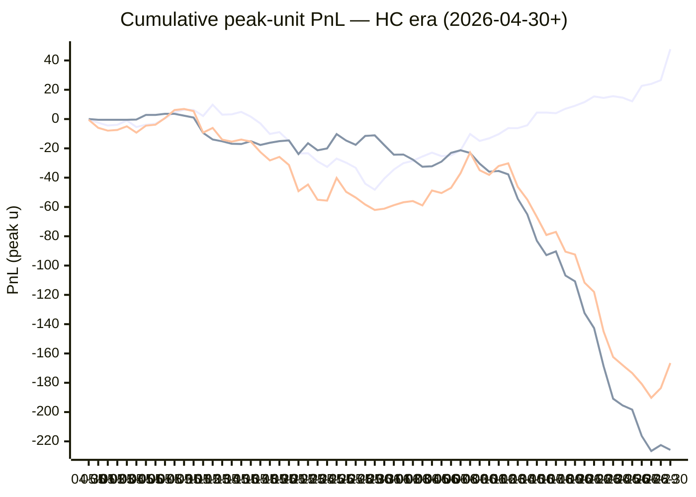

# Sharp Intel v6 — Daily Master Report

_Auto-generated **7/1/2026, 11:29:29 AM ET** by `scripts/dailyV6Report.js`. Do not edit by hand._

**Source of truth: this report mirrors the live Pick Performance dashboard.** Inclusion = `lockStage ≠ SHADOW ∧ ¬superseded ∧ health ∉ {MUTED, CANCELLED} ∧ peak.stars ≥ 2.5`. PnL is in **peak units** (the size shipped to users). HC margin / Δw / Δq are the **frozen** stamps written at last sync before the T-15 freeze. HC margin only existed from the v7.1 launch (**2026-04-30**); pre-launch picks have no HC value (no retro-fitting). Nothing is recomputed against today's whitelist.

v6 cutover: **2026-04-18** · whitelist source: live `sharpWalletProfiles` (320 profiles — drives §5 roster snapshot only) · quality cut: contribution ≥ 30 · HC = CONFIRMED tier ∧ sizeRatio ≥ 1.5.

---
## §1. Yesterday's picks

Slate: **2026-06-30** · 31 shipped sides.

| N | W-L-P | WR% | PnL (peak u) | PnL (flat 1u) |
|---|---|---|---|---|
| 31 | 17-13-1 | 56.7% | +17.10u | +2.65u |

| Sport | Market | Matchup | Pick | Stars · Units | HC | Δw | Δq | Σ | Odds | Result | PnL (peak u) |
|---|---|---|---|---|---|---|---|---|---|---|---|
| MLB | ML | Chicago White Sox @ Baltimore Orioles | Chicago White Sox | 4.5★ · 2.50u | +0 | +1 | +1 | +2 | +120 | **W** | +5.00u |
| MLB | ML | Detroit Tigers @ New York Yankees | New York Yankees | 2.5★ · 0.25u | +0 | +0 | +0 | +0 | -111 | L | -0.25u |
| MLB | ML | Los Angeles Angels @ Seattle Mariners | Los Angeles Angels | 4.5★ · 1.50u | +0 | +3 | +2 | +5 | +163 | L | -1.50u |
| MLB | ML | Los Angeles Dodgers @ Athletics | Los Angeles Dodgers | 3.0★ · 0.50u | +0 | +3 | +3 | +6 | -172 | **W** | +0.00u |
| MLB | ML | Miami Marlins @ Colorado Rockies | Miami Marlins | 3.0★ · 0.50u | +1 | +1 | -1 | +0 | -128 | **W** | +2.96u |
| MLB | ML | Minnesota Twins @ Houston Astros | Minnesota Twins | 4.0★ · 1.00u | +0 | +1 | +1 | +2 | -109 | L | -1.00u |
| MLB | ML | Pittsburgh Pirates @ Philadelphia Phillies | Philadelphia Phillies | 3.0★ · 0.50u | +1 | +1 | +1 | +2 | -201 | **W** | +0.00u |
| MLB | ML | San Diego Padres @ Chicago Cubs | San Diego Padres | 5.0★ · 2.50u | +0 | +0 | +0 | +0 | +133 | L | -2.50u |
| MLB | ML | San Francisco Giants @ Arizona Diamondbacks | San Francisco Giants | 4.5★ · 3.00u | +0 | +1 | +0 | +1 | +100 | L | -3.00u |
| MLB | ML | St. Louis Cardinals @ Atlanta Braves | Atlanta Braves | 4.5★ · 3.00u | +0 | +2 | +0 | +2 | -141 | L | -3.00u |
| MLB | ML | Tampa Bay Rays @ Kansas City Royals | Tampa Bay Rays | 2.5★ · 0.25u | +2 | +3 | -1 | +2 | -114 | **W** | +2.68u |
| MLB | ML | Texas Rangers @ Cleveland Guardians | Cleveland Guardians | 4.5★ · 2.50u | +0 | +1 | +1 | +2 | +110 | L | -2.50u |
| MLB | ML | Washington Nationals @ Boston Red Sox | Washington Nationals | 4.5★ · 2.50u | +1 | +4 | +3 | +7 | +117 | **W** | +2.92u |
| MLB | SPREAD | Cincinnati Reds @ Milwaukee Brewers | Milwaukee Brewers | 3.0★ · 1.00u | +0 | +1 | -1 | +0 | +123 | **W** | +0.00u |
| MLB | SPREAD | Chicago White Sox @ Baltimore Orioles | Baltimore Orioles | 2.5★ · 0.25u | +0 | +0 | -1 | -1 | +135 | L | -0.25u |
| MLB | SPREAD | Los Angeles Dodgers @ Athletics | Los Angeles Dodgers | 3.0★ · 0.50u | +0 | +1 | +0 | +1 | -101 | **W** | +0.00u |
| MLB | SPREAD | Pittsburgh Pirates @ Philadelphia Phillies | Pittsburgh Pirates | 2.5★ · 0.25u | -1 | +2 | +1 | +3 | -113 | L | -0.25u |
| MLB | SPREAD | San Diego Padres @ Chicago Cubs | Chicago Cubs | 4.0★ · 1.00u | +0 | +1 | +0 | +1 | +131 | **W** | +0.00u |
| MLB | SPREAD | St. Louis Cardinals @ Atlanta Braves | St. Louis Cardinals | 4.5★ · 3.00u | +0 | +2 | +1 | +3 | -160 | **W** | +2.45u |
| MLB | SPREAD | Tampa Bay Rays @ Kansas City Royals | Kansas City Royals | 2.5★ · 0.25u | +0 | +0 | +0 | +0 | -145 | L | -0.25u |
| MLB | TOTAL | Chicago White Sox @ Baltimore Orioles | Over 10.5 | 4.0★ · 1.00u | +1 | +1 | +0 | +1 | -110 | **W** | +3.64u |
| MLB | TOTAL | Detroit Tigers @ New York Yankees | Under 7.5 | 4.5★ · 3.00u | +2 | +5 | +4 | +9 | -110 | L | -3.00u |
| MLB | TOTAL | Los Angeles Angels @ Seattle Mariners | Under 7.5 | 3.0★ · 0.50u | -1 | -1 | +0 | -1 | -110 | L | -0.50u |
| MLB | TOTAL | Pittsburgh Pirates @ Philadelphia Phillies | Under 8.5 | 4.5★ · 3.00u | +0 | +2 | +1 | +3 | -110 | **W** | +0.89u |
| MLB | TOTAL | San Diego Padres @ Chicago Cubs | Over 11.5 | 4.0★ · 1.00u | +1 | +0 | -1 | -1 | +103 | **W** | +4.46u |
| MLB | TOTAL | St. Louis Cardinals @ Atlanta Braves | Over 9.5 | 3.0★ · 0.50u | +1 | -1 | +1 | +0 | -110 | L | -0.50u |
| MLB | TOTAL | Texas Rangers @ Cleveland Guardians | Under 7.5 | 4.0★ · 1.00u | +0 | +3 | +1 | +4 | -110 | **W** | +2.58u |
| MLB | TOTAL | Washington Nationals @ Boston Red Sox | Under 9.5 | 4.0★ · 1.00u | +0 | +2 | +1 | +3 | -110 | P | +0.00u |
| SOC | ML | Ecuador @ Mexico | Mexico | 3.0★ · 0.50u | +2 | +3 | -1 | +2 | +129 | **W** | +3.13u |
| SOC | ML | Norway @ Côte d'Ivoire | Norway | 2.5★ · 0.25u | +4 | +7 | +5 | +12 | +105 | **W** | +4.60u |
| SOC | ML | Sweden @ France | France | 5.0★ · 5.00u | +3 | +6 | +4 | +10 | -350 | **W** | +0.29u |

---
## §2. 3-day / 7-day / all-time cohort rollups

Shipped picks only. PnL in **peak units** (size we actually bet) and flat 1u (cohort EV lens). All margins are the engine's frozen stamps (`v8_hcMargin`, `v8_walletConsensusDelta`, `v8_walletConsensusQualityMargin`).

**HC margin sub-tables** are scoped to picks dated ≥ 2026-04-30 (the v7.1 launch — when HC margin became a real engine signal). Pre-launch picks are excluded from HC analysis since the feature didn't exist for them. Δw / Δq sub-tables span the full v6-era sample (≥ 2026-04-18). Empty buckets are dropped.

### §2a. 3-day

Total: **77** shipped · 37-38-2 · WR 49.3% · PnL +14.30u (peak) / -5.53u (flat).

**By HC margin** _(picks dated ≥ 2026-04-30, N = 77)_

| Bucket | N | W-L-P | WR% | PnL (peak u) | PnL (flat 1u) |
|---|---|---|---|---|---|
| HC ≥ +3 | 4 | 3-1-0 | 75.0% | +5.08u | +1.04u |
| HC = +2 | 4 | 3-1-0 | 75.0% | +5.89u | +1.86u |
| HC = +1 | 10 | 8-2-0 | 80.0% | +14.12u | +4.71u |
| HC = 0 | 56 | 23-31-2 | 42.6% | -9.54u | -10.14u |
| HC ≤ −1 | 3 | 0-3-0 | 0.0% | -1.25u | -3.00u |

**By Δw (winner margin)**

| Bucket | N | W-L-P | WR% | PnL (peak u) | PnL (flat 1u) |
|---|---|---|---|---|---|
| ≥ +3 | 14 | 9-5-0 | 64.3% | +10.97u | +2.56u |
| +2 | 10 | 6-3-1 | 66.7% | +2.19u | +1.99u |
| +1 | 33 | 15-18-0 | 45.5% | +3.82u | -4.30u |
| 0 | 16 | 7-9-0 | 43.8% | -1.43u | -2.77u |
| −1 | 4 | 0-3-1 | 0.0% | -1.25u | -3.00u |

**By Δq (quality margin)**

| Bucket | N | W-L-P | WR% | PnL (peak u) | PnL (flat 1u) |
|---|---|---|---|---|---|
| ≥ +3 | 10 | 8-2-0 | 80.0% | +8.08u | +4.26u |
| +2 | 1 | 0-1-0 | 0.0% | -1.50u | -1.00u |
| +1 | 31 | 13-17-1 | 43.3% | -2.04u | -6.02u |
| 0 | 26 | 10-15-1 | 40.0% | -2.47u | -5.88u |
| −1 | 9 | 6-3-0 | 66.7% | +12.23u | +3.10u |

**By AGS tier** _(picks dated ≥ 2026-05-05, N = 77)_

| Bucket | N | W-L-P | WR% | PnL (peak u) | PnL (flat 1u) |
|---|---|---|---|---|---|
| NEUT   (0 .. +3) | 66 | 35-30-1 | 53.8% | +19.80u | +1.06u |
| WEAK   (−1 .. 0) | 11 | 2-8-1 | 20.0% | -5.50u | -6.59u |

### §2b. 7-day

Total: **165** shipped · 84-79-2 · WR 51.5% · PnL -21.51u (peak) / -10.07u (flat).

**By HC margin** _(picks dated ≥ 2026-04-30, N = 165)_

| Bucket | N | W-L-P | WR% | PnL (peak u) | PnL (flat 1u) |
|---|---|---|---|---|---|
| HC ≥ +3 | 7 | 4-3-0 | 57.1% | +6.33u | -0.14u |
| HC = +2 | 9 | 5-4-0 | 55.6% | +10.63u | +0.00u |
| HC = +1 | 24 | 18-6-0 | 75.0% | +16.32u | +6.04u |
| HC = 0 | 121 | 56-63-2 | 47.1% | -57.18u | -13.88u |
| HC ≤ −1 | 4 | 1-3-0 | 25.0% | +2.39u | -2.09u |

**By Δw (winner margin)**

| Bucket | N | W-L-P | WR% | PnL (peak u) | PnL (flat 1u) |
|---|---|---|---|---|---|
| ≥ +3 | 27 | 17-10-0 | 63.0% | +18.07u | +1.80u |
| +2 | 19 | 14-4-1 | 77.8% | +18.84u | +7.00u |
| +1 | 73 | 34-39-0 | 46.6% | -33.24u | -7.95u |
| 0 | 36 | 15-21-0 | 41.7% | -22.18u | -9.21u |
| −1 | 9 | 4-4-1 | 50.0% | -2.75u | -0.70u |
| ≤ −2 | 1 | 0-1-0 | 0.0% | -0.25u | -1.00u |

**By Δq (quality margin)**

| Bucket | N | W-L-P | WR% | PnL (peak u) | PnL (flat 1u) |
|---|---|---|---|---|---|
| ≥ +3 | 17 | 12-5-0 | 70.6% | +15.37u | +3.40u |
| +2 | 11 | 7-4-0 | 63.6% | +3.33u | +1.52u |
| +1 | 65 | 32-32-1 | 50.0% | -19.49u | -5.97u |
| 0 | 53 | 22-30-1 | 42.3% | -22.25u | -11.09u |
| −1 | 17 | 10-7-0 | 58.8% | +1.78u | +2.16u |
| ≤ −2 | 2 | 1-1-0 | 50.0% | -0.25u | -0.09u |

**By AGS tier** _(picks dated ≥ 2026-05-05, N = 165)_

| Bucket | N | W-L-P | WR% | PnL (peak u) | PnL (flat 1u) |
|---|---|---|---|---|---|
| NEUT   (0 .. +3) | 132 | 73-58-1 | 55.7% | +10.24u | +1.49u |
| WEAK   (−1 .. 0) | 33 | 11-21-1 | 34.4% | -31.75u | -11.57u |

### §2c. All-time

Total: **974** shipped · 486-478-10 · WR 50.4% · PnL -178.75u (peak) / -44.27u (flat).

**By HC margin** _(picks dated ≥ 2026-04-30, N = 863)_

| Bucket | N | W-L-P | WR% | PnL (peak u) | PnL (flat 1u) |
|---|---|---|---|---|---|
| HC ≥ +3 | 20 | 8-12-0 | 40.0% | -0.62u | -7.19u |
| HC = +2 | 42 | 22-20-0 | 52.4% | +9.50u | -0.38u |
| HC = +1 | 194 | 116-78-0 | 59.8% | +38.85u | +23.57u |
| HC = 0 | 572 | 271-292-9 | 48.1% | -225.85u | -53.77u |
| HC ≤ −1 | 34 | 18-16-0 | 52.9% | +9.97u | +2.30u |

**By Δw (winner margin)**

| Bucket | N | W-L-P | WR% | PnL (peak u) | PnL (flat 1u) |
|---|---|---|---|---|---|
| ≥ +3 | 142 | 74-68-0 | 52.1% | +2.09u | -0.14u |
| +2 | 169 | 86-81-2 | 51.5% | -21.17u | -3.32u |
| +1 | 393 | 203-187-3 | 52.1% | -91.86u | -5.54u |
| 0 | 210 | 100-107-3 | 48.3% | -49.54u | -20.25u |
| −1 | 44 | 16-26-2 | 38.1% | -15.47u | -11.61u |
| ≤ −2 | 10 | 3-7-0 | 30.0% | -6.79u | -4.25u |
| missing | 6 | 4-2-0 | 66.7% | +3.99u | +0.85u |

**By Δq (quality margin)**

| Bucket | N | W-L-P | WR% | PnL (peak u) | PnL (flat 1u) |
|---|---|---|---|---|---|
| ≥ +3 | 157 | 83-71-3 | 53.9% | -14.89u | +3.06u |
| +2 | 142 | 66-76-0 | 46.5% | -38.40u | -15.82u |
| +1 | 319 | 169-146-4 | 53.7% | -17.57u | -0.18u |
| 0 | 244 | 115-127-2 | 47.5% | -95.06u | -21.50u |
| −1 | 77 | 41-35-1 | 53.9% | +8.18u | +3.24u |
| ≤ −2 | 29 | 8-21-0 | 27.6% | -24.25u | -13.83u |
| missing | 6 | 4-2-0 | 66.7% | +3.24u | +0.77u |

**By AGS tier** _(picks dated ≥ 2026-05-05, N = 838)_

| Bucket | N | W-L-P | WR% | PnL (peak u) | PnL (flat 1u) |
|---|---|---|---|---|---|
| ELITE  (≥ +7) | 3 | 3-0-0 | 100.0% | +8.01u | +2.34u |
| LOCK   (+5 .. +7) | 9 | 5-4-0 | 55.6% | -2.93u | -0.47u |
| STRONG (+3 .. +5) | 23 | 13-10-0 | 56.5% | -6.91u | +1.77u |
| NEUT   (0 .. +3) | 549 | 286-260-3 | 52.4% | -76.20u | -13.24u |
| WEAK   (−1 .. 0) | 239 | 107-127-5 | 45.7% | -89.85u | -30.68u |
| FADE   (< −1) | 14 | 9-5-0 | 64.3% | +4.68u | +5.05u |
| missing | 1 | 1-0-0 | 100.0% | +1.63u | +0.96u |

---
## §3. Edge over time — is HC margin creating winners?

Daily cumulative peak-unit PnL since the HC margin launch (**2026-04-30**). The `HC ≥ +1` line is the golden-standard cohort. The `HC = 0` line is the no-HC-signal control. The `All shipped (HC era)` line is every shipped pick from the same date range — the apples-to-apples baseline. Watch the spread.

Daily cumulative table (peak units, HC era only):

| Date | HC ≥ +1 (cum) | HC = 0 (cum) | All shipped (cum) |
|---|---|---|---|
| 2026-04-30 | -0.48u | +0.00u | -0.48u |
| 2026-05-01 | -2.48u | -0.50u | -5.98u |
| 2026-05-02 | -4.41u | -0.50u | -7.91u |
| 2026-05-03 | -3.94u | -0.50u | -7.44u |
| 2026-05-04 | -0.95u | -0.50u | -4.95u |
| 2026-05-05 | -5.45u | -0.34u | -9.29u |
| 2026-05-06 | -3.86u | +2.84u | -4.52u |
| 2026-05-07 | -3.18u | +2.84u | -3.84u |
| 2026-05-08 | +0.54u | +3.60u | +0.64u |
| 2026-05-09 | +4.41u | +3.60u | +6.14u |
| 2026-05-10 | +6.41u | +2.32u | +6.86u |
| 2026-05-11 | +6.25u | +1.05u | +5.43u |
| 2026-05-12 | +2.11u | -9.45u | -9.21u |
| 2026-05-13 | +9.78u | -13.95u | -6.04u |
| 2026-05-14 | +3.00u | -15.20u | -14.07u |
| 2026-05-15 | +3.27u | -16.83u | -15.43u |
| 2026-05-16 | +4.90u | -17.05u | -14.02u |
| 2026-05-17 | +1.62u | -15.11u | -15.36u |
| 2026-05-18 | -2.98u | -17.67u | -22.52u |
| 2026-05-19 | -10.18u | -16.17u | -28.22u |
| 2026-05-20 | -8.90u | -15.07u | -25.84u |
| 2026-05-21 | -14.92u | -14.58u | -31.37u |
| 2026-05-22 | -23.44u | -23.93u | -49.24u |
| 2026-05-23 | -23.30u | -16.53u | -44.70u |
| 2026-05-24 | -28.89u | -21.34u | -55.10u |
| 2026-05-25 | -32.63u | -20.03u | -55.65u |
| 2026-05-26 | -26.98u | -10.27u | -40.24u |
| 2026-05-27 | -29.77u | -14.68u | -49.69u |
| 2026-05-28 | -33.27u | -17.58u | -53.57u |
| 2026-05-29 | -44.12u | -11.51u | -58.35u |
| 2026-05-30 | -48.21u | -11.10u | -62.03u |
| 2026-05-31 | -40.65u | -17.79u | -61.16u |
| 2026-06-01 | -34.49u | -24.29u | -58.77u |
| 2026-06-02 | -30.14u | -24.19u | -56.82u |
| 2026-06-03 | -28.48u | -27.68u | -56.00u |
| 2026-06-04 | -25.53u | -32.54u | -58.91u |
| 2026-06-05 | -22.94u | -32.20u | -48.76u |
| 2026-06-06 | -25.33u | -29.06u | -50.51u |
| 2026-06-07 | -24.75u | -23.09u | -46.96u |
| 2026-06-08 | -21.34u | -21.30u | -36.94u |
| 2026-06-09 | -10.19u | -23.13u | -22.86u |
| 2026-06-10 | -14.95u | -30.43u | -34.92u |
| 2026-06-11 | -13.13u | -35.94u | -38.09u |
| 2026-06-12 | -10.30u | -35.44u | -32.03u |
| 2026-06-13 | -6.20u | -37.73u | -30.22u |
| 2026-06-14 | -6.21u | -54.41u | -46.29u |
| 2026-06-15 | -4.25u | -65.05u | -54.97u |
| 2026-06-16 | +4.40u | -83.05u | -66.82u |
| 2026-06-17 | +4.40u | -92.84u | -79.11u |
| 2026-06-18 | +3.98u | -90.33u | -77.02u |
| 2026-06-19 | +7.06u | -106.79u | -90.52u |
| 2026-06-20 | +9.08u | -110.78u | -92.49u |
| 2026-06-21 | +11.60u | -132.42u | -111.61u |
| 2026-06-22 | +15.45u | -142.67u | -118.01u |
| 2026-06-23 | +14.45u | -168.67u | -145.01u |
| 2026-06-24 | +15.59u | -190.87u | -162.43u |
| 2026-06-25 | +14.62u | -195.48u | -168.01u |
| 2026-06-26 | +12.11u | -198.35u | -173.39u |
| 2026-06-27 | +22.64u | -216.31u | -180.82u |
| 2026-06-28 | +23.97u | -226.59u | -190.27u |
| 2026-06-29 | +26.55u | -222.52u | -183.62u |
| 2026-06-30 | +47.73u | -225.85u | -166.52u |

---
## §4. Wallet roster growth & profitability

"Tracked in sport X" = a wallet has placed **≥ 2 bets** in X within the v6-era sample. "Profitable" = cumulative flat PnL > 0. Source: `v8Scoring.walletDetails` on every graded v6-era game (every side, not just the shipped set).

### §4a. Per-sport wallet snapshot

| Sport | Total wallets seen | Tracked (≥2) | Profitable | % prof | WR ≥ 50% | WR ≥ 60% | WR ≥ 70% |
|---|---|---|---|---|---|---|---|
| MLB | 91 | 73 | 26 | 36% | 37 | 12 | 4 |
| NBA | 138 | 108 | 44 | 41% | 60 | 29 | 11 |
| NHL | 60 | 43 | 12 | 28% | 24 | 12 | 6 |
| SOC | 119 | 81 | 62 | 77% | 64 | 50 | 39 |
| **ALL (any sport)** | **237** | **184** | **96** | **52%** | **111** | **51** | **31** |

### §4b. Daily roster growth (cumulative through each date)

Format: `tracked (profitable)`. For each date D, recompute the roster using every bet up to and including D.

| Date | ALL | MLB | NBA | NHL | SOC |
|---|---|---|---|---|---|
| 2026-04-18 | 5 (2) | 2 (2) | 3 (0) | 0 (0) | 0 (0) |
| 2026-04-19 | 19 (8) | 5 (3) | 9 (3) | 3 (1) | 0 (0) |
| 2026-04-20 | 29 (12) | 7 (6) | 23 (8) | 5 (2) | 0 (0) |
| 2026-04-21 | 44 (21) | 10 (6) | 31 (10) | 7 (5) | 0 (0) |
| 2026-04-22 | 52 (28) | 12 (6) | 39 (15) | 11 (10) | 0 (0) |
| 2026-04-23 | 56 (29) | 13 (6) | 46 (21) | 13 (10) | 0 (0) |
| 2026-04-24 | 61 (30) | 14 (6) | 51 (23) | 14 (9) | 0 (0) |
| 2026-04-25 | 65 (29) | 16 (8) | 54 (22) | 16 (9) | 0 (0) |
| 2026-04-26 | 67 (31) | 18 (5) | 56 (25) | 17 (9) | 0 (0) |
| 2026-04-27 | 72 (32) | 20 (7) | 60 (24) | 17 (9) | 0 (0) |
| 2026-04-28 | 76 (33) | 21 (7) | 63 (26) | 23 (10) | 0 (0) |
| 2026-04-29 | 77 (33) | 21 (7) | 64 (25) | 23 (10) | 0 (0) |
| 2026-04-30 | 81 (34) | 21 (7) | 70 (27) | 23 (10) | 0 (0) |
| 2026-05-01 | 85 (38) | 22 (5) | 74 (30) | 26 (13) | 0 (0) |
| 2026-05-02 | 86 (37) | 23 (7) | 75 (32) | 26 (12) | 0 (0) |
| 2026-05-03 | 86 (38) | 24 (8) | 75 (33) | 26 (12) | 0 (0) |
| 2026-05-04 | 90 (38) | 24 (9) | 76 (32) | 26 (12) | 0 (0) |
| 2026-05-05 | 91 (40) | 24 (9) | 79 (33) | 26 (12) | 0 (0) |
| 2026-05-06 | 92 (40) | 24 (9) | 80 (33) | 26 (12) | 0 (0) |
| 2026-05-07 | 92 (41) | 24 (9) | 80 (33) | 26 (12) | 0 (0) |
| 2026-05-08 | 92 (40) | 24 (8) | 80 (32) | 26 (11) | 0 (0) |
| 2026-05-09 | 94 (42) | 24 (8) | 82 (35) | 26 (11) | 0 (0) |
| 2026-05-10 | 94 (42) | 24 (8) | 82 (35) | 26 (11) | 0 (0) |
| 2026-05-11 | 96 (42) | 24 (8) | 84 (36) | 26 (11) | 0 (0) |
| 2026-05-12 | 100 (41) | 27 (9) | 86 (37) | 26 (11) | 0 (0) |
| 2026-05-13 | 102 (45) | 29 (11) | 88 (37) | 26 (11) | 0 (0) |
| 2026-05-14 | 102 (41) | 29 (11) | 88 (37) | 28 (12) | 0 (0) |
| 2026-05-15 | 103 (41) | 30 (10) | 88 (39) | 28 (12) | 0 (0) |
| 2026-05-16 | 105 (43) | 31 (12) | 88 (39) | 30 (14) | 0 (0) |
| 2026-05-17 | 105 (46) | 32 (11) | 88 (40) | 30 (14) | 0 (0) |
| 2026-05-18 | 105 (46) | 32 (10) | 88 (38) | 31 (15) | 0 (0) |
| 2026-05-19 | 105 (46) | 32 (12) | 88 (38) | 31 (15) | 0 (0) |
| 2026-05-20 | 106 (48) | 33 (12) | 88 (38) | 31 (16) | 0 (0) |
| 2026-05-21 | 106 (45) | 34 (12) | 88 (37) | 31 (14) | 0 (0) |
| 2026-05-22 | 106 (44) | 34 (10) | 88 (39) | 33 (16) | 0 (0) |
| 2026-05-23 | 111 (49) | 36 (10) | 90 (40) | 36 (19) | 0 (0) |
| 2026-05-24 | 117 (52) | 37 (12) | 94 (39) | 37 (16) | 0 (0) |
| 2026-05-25 | 120 (53) | 38 (13) | 95 (40) | 38 (16) | 0 (0) |
| 2026-05-26 | 122 (55) | 39 (14) | 97 (42) | 38 (16) | 0 (0) |
| 2026-05-27 | 123 (51) | 40 (12) | 97 (42) | 40 (14) | 0 (0) |
| 2026-05-28 | 124 (51) | 40 (12) | 99 (42) | 40 (14) | 0 (0) |
| 2026-05-29 | 125 (50) | 41 (12) | 99 (42) | 41 (12) | 0 (0) |
| 2026-05-30 | 126 (49) | 41 (12) | 101 (43) | 41 (12) | 0 (0) |
| 2026-05-31 | 126 (48) | 41 (11) | 101 (43) | 41 (12) | 0 (0) |
| 2026-06-01 | 129 (52) | 44 (14) | 101 (43) | 41 (12) | 0 (0) |
| 2026-06-02 | 130 (56) | 45 (16) | 101 (43) | 41 (13) | 0 (0) |
| 2026-06-03 | 132 (56) | 45 (14) | 102 (43) | 41 (13) | 0 (0) |
| 2026-06-04 | 132 (57) | 46 (14) | 102 (43) | 41 (14) | 0 (0) |
| 2026-06-05 | 132 (57) | 48 (15) | 102 (43) | 41 (14) | 0 (0) |
| 2026-06-06 | 132 (57) | 49 (15) | 102 (43) | 41 (14) | 0 (0) |
| 2026-06-07 | 133 (56) | 52 (16) | 102 (43) | 41 (14) | 0 (0) |
| 2026-06-08 | 135 (55) | 53 (16) | 103 (44) | 41 (14) | 0 (0) |
| 2026-06-09 | 135 (55) | 53 (15) | 103 (44) | 41 (14) | 0 (0) |
| 2026-06-10 | 135 (56) | 53 (15) | 105 (45) | 41 (14) | 0 (0) |
| 2026-06-11 | 135 (54) | 54 (16) | 105 (45) | 42 (13) | 0 (0) |
| 2026-06-12 | 135 (56) | 55 (17) | 105 (45) | 42 (13) | 0 (0) |
| 2026-06-13 | 136 (56) | 57 (17) | 108 (44) | 42 (13) | 0 (0) |
| 2026-06-14 | 136 (55) | 57 (18) | 108 (44) | 43 (12) | 2 (0) |
| 2026-06-15 | 136 (56) | 57 (19) | 108 (44) | 43 (12) | 2 (0) |
| 2026-06-16 | 141 (60) | 58 (20) | 108 (44) | 43 (12) | 13 (5) |
| 2026-06-17 | 143 (64) | 58 (19) | 108 (44) | 43 (12) | 18 (10) |
| 2026-06-18 | 145 (66) | 58 (20) | 108 (44) | 43 (12) | 24 (14) |
| 2026-06-19 | 145 (66) | 58 (20) | 108 (44) | 43 (12) | 29 (21) |
| 2026-06-20 | 147 (75) | 60 (19) | 108 (44) | 43 (12) | 33 (27) |
| 2026-06-21 | 147 (74) | 60 (19) | 108 (44) | 43 (12) | 35 (29) |
| 2026-06-22 | 153 (77) | 61 (20) | 108 (44) | 43 (12) | 42 (34) |
| 2026-06-23 | 156 (80) | 64 (20) | 108 (44) | 43 (12) | 44 (34) |
| 2026-06-24 | 160 (84) | 65 (22) | 108 (44) | 43 (12) | 52 (40) |
| 2026-06-25 | 160 (82) | 67 (24) | 108 (44) | 43 (12) | 55 (44) |
| 2026-06-26 | 166 (85) | 67 (22) | 108 (44) | 43 (12) | 63 (51) |
| 2026-06-27 | 172 (86) | 68 (20) | 108 (44) | 43 (12) | 72 (54) |
| 2026-06-28 | 175 (91) | 69 (21) | 108 (44) | 43 (12) | 75 (57) |
| 2026-06-29 | 182 (95) | 72 (24) | 108 (44) | 43 (12) | 80 (62) |
| 2026-06-30 | 184 (96) | 73 (26) | 108 (44) | 43 (12) | 81 (62) |

### §4c. Top 10 profitable wallets by sport

#### MLB

| # | Wallet | N | W | L | WR% | Flat PnL (u) | Flat ROI | $ PnL |
|---|---|---|---|---|---|---|---|---|
| 1 | 57be17 | 2 | 1 | 1 | 50.0% | +5.95 | +297.5% | $52.6K |
| 2 | f2f960 | 2 | 2 | 0 | 100.0% | +1.93 | +96.5% | $61.1K |
| 3 | b70f9a | 3 | 3 | 0 | 100.0% | +2.01 | +67.1% | $4.5K |
| 4 | 4b912c | 16 | 12 | 4 | 75.0% | +6.70 | +41.8% | $6.0K |
| 5 | e05213 | 15 | 11 | 4 | 73.3% | +6.08 | +40.5% | $278.1K |
| 6 | 913987 | 44 | 30 | 14 | 68.2% | +14.19 | +32.2% | $666.8K |
| 7 | f9e3d0 | 12 | 8 | 4 | 66.7% | +3.73 | +31.1% | $84.7K |
| 8 | dfa240 | 3 | 2 | 1 | 66.7% | +0.85 | +28.3% | $2.5K |
| 9 | f2d227 | 39 | 26 | 13 | 66.7% | +9.43 | +24.2% | $103.0K |
| 10 | 981187 | 8 | 5 | 3 | 62.5% | +1.65 | +20.7% | $13.5K |

#### NBA

| # | Wallet | N | W | L | WR% | Flat PnL (u) | Flat ROI | $ PnL |
|---|---|---|---|---|---|---|---|---|
| 1 | 799fad | 2 | 2 | 0 | 100.0% | +5.66 | +283.0% | $241.7K |
| 2 | a0d6d2 | 4 | 4 | 0 | 100.0% | +4.51 | +112.7% | $6.4K |
| 3 | 12ad50 | 3 | 3 | 0 | 100.0% | +2.74 | +91.3% | $45.5K |
| 4 | b51a56 | 6 | 5 | 1 | 83.3% | +5.44 | +90.7% | $74.4K |
| 5 | 11b032 | 7 | 6 | 1 | 85.7% | +5.40 | +77.1% | $249.9K |
| 6 | 12c933 | 2 | 2 | 0 | 100.0% | +1.28 | +63.9% | $11.5K |
| 7 | a1684d | 10 | 9 | 1 | 90.0% | +5.24 | +52.4% | $11.2K |
| 8 | 7f00bc | 21 | 14 | 7 | 66.7% | +9.80 | +46.7% | $14.7K |
| 9 | 92df91 | 23 | 16 | 7 | 69.6% | +10.26 | +44.6% | -$214 |
| 10 | 8ec926 | 8 | 6 | 2 | 75.0% | +3.53 | +44.1% | -$681 |

#### NHL

| # | Wallet | N | W | L | WR% | Flat PnL (u) | Flat ROI | $ PnL |
|---|---|---|---|---|---|---|---|---|
| 1 | 8366f5 | 2 | 2 | 0 | 100.0% | +2.30 | +114.9% | $107.6K |
| 2 | 799fad | 2 | 2 | 0 | 100.0% | +1.88 | +94.1% | $46.9K |
| 3 | fec67e | 4 | 3 | 1 | 75.0% | +2.82 | +70.5% | $12.5K |
| 4 | 30935c | 4 | 3 | 1 | 75.0% | +2.11 | +52.7% | $953 |
| 5 | 981187 | 8 | 6 | 2 | 75.0% | +3.52 | +44.0% | -$25.2K |
| 6 | fcc12b | 11 | 8 | 3 | 72.7% | +4.45 | +40.5% | -$27.5K |
| 7 | bc3532 | 22 | 14 | 8 | 63.6% | +7.85 | +35.7% | $70.3K |
| 8 | e70853 | 9 | 6 | 3 | 66.7% | +2.66 | +29.5% | -$11.1K |
| 9 | 4d2125 | 17 | 11 | 6 | 64.7% | +4.26 | +25.1% | $80.3K |
| 10 | dfa240 | 28 | 18 | 10 | 64.3% | +6.46 | +23.1% | $19.0K |

#### SOC

| # | Wallet | N | W | L | WR% | Flat PnL (u) | Flat ROI | $ PnL |
|---|---|---|---|---|---|---|---|---|
| 1 | daf4de | 2 | 2 | 0 | 100.0% | +25.11 | +1255.3% | $1.78M |
| 2 | 59266e | 2 | 2 | 0 | 100.0% | +18.11 | +905.3% | $2.98M |
| 3 | 7b4652 | 8 | 8 | 0 | 100.0% | +34.07 | +425.9% | $21.0K |
| 4 | cf627b | 3 | 3 | 0 | 100.0% | +11.94 | +398.0% | $595.4K |
| 5 | 12c933 | 8 | 6 | 2 | 75.0% | +31.63 | +395.4% | $133.9K |
| 6 | c9bba3 | 12 | 9 | 3 | 75.0% | +37.62 | +313.5% | $2.49M |
| 7 | 8da2ca | 6 | 4 | 2 | 66.7% | +18.36 | +306.0% | $374.8K |
| 8 | e2e279 | 2 | 2 | 0 | 100.0% | +5.45 | +272.7% | $782.3K |
| 9 | 946418 | 11 | 9 | 2 | 81.8% | +29.71 | +270.1% | $74.5K |
| 10 | a7a9cc | 2 | 2 | 0 | 100.0% | +5.14 | +257.0% | $353.6K |

---
## §5. Proven-wallet roster growth & HC tracking

"Proven wallet" = whitelist tier `CONFIRMED` or `FLAT` in the same sense the live engine uses (`exportWalletProfiles.js` → `sharpWalletProfiles.bySport`). Sports inherit independent rosters: a wallet can be CONFIRMED in NBA and absent from NHL. `walletBets` come from `v8Scoring.walletDetails` on every graded v6-era pick (Source A); `positionRows` come from `sharp_action_positions` (Source B).

### §5a. Current proven-winner roster (snapshot)

Roster as of **2026-06-30** — wallets with ≥2 bets in the sport.

| Sport | Wallets seen | Eligible (≥2) | CONFIRMED | FLAT | Proven (C+F) | WR50 only | Conv % |
|---|---|---|---|---|---|---|---|
| MLB | 143 | 73 | 15 | 11 | **26** | 11 | 18.2% |
| NBA | 210 | 108 | 29 | 15 | **44** | 21 | 21.0% |
| NHL | 105 | 43 | 9 | 3 | **12** | 12 | 11.4% |
| SOC | 164 | 81 | 37 | 25 | **62** | 6 | 37.8% |
| **ALL** | **—** | **—** | **—** | **—** | **144** | **—** | **—** |

### §5b. Live whitelist drift check

Live `sharpWalletProfiles` is what the engine reads at lock time. Drift between script reconstruction (above) and live should be ≤ 1 day of position data — otherwise `exportWalletProfiles.js` is stale.

| Sport | CONFIRMED (live · script) | FLAT (live · script) | WR50 (live · script) | Drift |
|---|---|---|---|---|
| MLB | 35 · 15 | 20 · 11 | 8 · 11 | +29 live |
| NBA | 58 · 29 | 25 · 15 | 23 · 21 | +39 live |
| NHL | 23 · 9 | 6 · 3 | 16 · 12 | +17 live |
| SOC | 43 · 37 | 26 · 25 | 7 · 6 | +7 live |

### §5c. Roster growth — 3d / 7d / 30d / all-time deltas

Each cell is **net growth** in proven (CONFIRMED + FLAT) wallets in that window, with the absolute count at the start (`+Δ from N`). Negative = wallets demoted. Window endpoint = 2026-06-30.

| Sport | 3-day | 7-day | 30-day | All-time (since cutover) |
|---|---|---|---|---|
| MLB | +6 from 20 | +6 from 20 | +15 from 11 | +26 from 0 |
| NBA | +0 from 44 | +0 from 44 | +1 from 43 | +44 from 0 |
| NHL | +0 from 12 | +0 from 12 | +0 from 12 | +12 from 0 |
| SOC | +8 from 54 | +28 from 34 | +62 from 0 | +62 from 0 |

A flat 7-day delta on a sport with healthy slate density = either the bubble pipeline has stalled (no wallets approaching the bar) or our cohort has saturated. Check §13d for the funnel diagnostic.

### §5d. Pipeline funnel — where each sport leaks

Wallets surviving each gate, in order. The biggest %-drop tells you the bottleneck. Gates:

1. **Seen** — placed ≥ 1 bet in the sport (any source)
2. **Eligible** — ≥ 2 graded picks in Source A (required for FLAT/CONFIRMED)
3. **Flat-OK** — eligible AND flat ROI > 0 (becomes FLAT or better)
4. **$-OK** — Flat-OK AND ≥2 positions with dollar ROI > 0 (CONFIRMED)
5. **Promoted** — final whitelisted = CONFIRMED + FLAT

| Sport | 1·Seen | 2·Eligible (% of Seen) | 3·Flat-OK (% of Elig) | 4·$-OK (% of Flat) | 5·Promoted | Bottleneck |
|---|---|---|---|---|---|---|
| MLB | 143 | 73 (51%) | 26 (36%) | 15 (58%) | **26** | edge (Eligible→Flat-OK) 64% |
| NBA | 210 | 108 (51%) | 44 (41%) | 29 (66%) | **44** | edge (Eligible→Flat-OK) 59% |
| NHL | 105 | 43 (41%) | 12 (28%) | 9 (75%) | **12** | edge (Eligible→Flat-OK) 72% |
| SOC | 164 | 81 (49%) | 62 (77%) | 37 (60%) | **62** | sample (Seen→Eligible) 51% |

### §5e. HC backing density (the fuel for v7.3 HC margin)

Every v7.x promotion is gated on `HC_m ≥ +1`, which requires at least one CONFIRMED wallet sized at `≥ 1.5×` average on the for-side. This table shows the share of shipped picks that *had any HC backing*, by sport, in each window. If HC density falls toward zero in a sport, the v7.3 floor cohorts (Σ=1, Σ=2 locks; HC rescues) will simply stop firing there.

| Sport | Window | Picks (with HC stamp) | Any HC for-side | HC_m ≥ +1 | HC_m ≥ +2 |
|---|---|---|---|---|---|
| MLB | 3-day | 71 | 12 (16.9%) | 12 (16.9%) | 2 (2.8%) |
| MLB | 7-day | 139 | 20 (14.4%) | 20 (14.4%) | 3 (2.2%) |
| MLB | All-time | 749 | 191 (25.5%) | 176 (23.5%) | 22 (2.9%) |
| NBA | 3-day | 0 | 0 (—) | 0 (—) | 0 (—) |
| NBA | 7-day | 0 | 0 (—) | 0 (—) | 0 (—) |
| NBA | All-time | 126 | 83 (65.9%) | 69 (54.8%) | 34 (27.0%) |
| NHL | 3-day | 0 | 0 (—) | 0 (—) | 0 (—) |
| NHL | 7-day | 0 | 0 (—) | 0 (—) | 0 (—) |
| NHL | All-time | 49 | 21 (42.9%) | 20 (40.8%) | 5 (10.2%) |
| SOC | 3-day | 6 | 6 (100.0%) | 6 (100.0%) | 6 (100.0%) |
| SOC | 7-day | 26 | 20 (76.9%) | 20 (76.9%) | 13 (50.0%) |
| SOC | All-time | 44 | 22 (50.0%) | 21 (47.7%) | 14 (31.8%) |

Pooled across sports:

| Window | Picks (with HC stamp) | Any HC for-side | HC_m ≥ +1 | HC_m ≥ +2 |
|---|---|---|---|---|
| 3-day | 77 | 18 (23.4%) | 18 (23.4%) | 8 (10.4%) |
| 7-day | 165 | 40 (24.2%) | 40 (24.2%) | 16 (9.7%) |
| All-time | 968 | 317 (32.7%) | 286 (29.5%) | 75 (7.7%) |

### §5f. Bubble wallets — next-up graduations

Wallets currently NOT promoted but close. Two flavors:

- **One-bet-away** — won the only bet, needs one more positive bet to clear ≥2.
- **Just-under** — has ≥2 bets but flat ROI is between −10% and 0% (one win flips them).

#### MLB

**One-bet-away** (4)

| wallet | picksN | flat PnL | pos N | pos $ROI |
|---|---|---|---|---|
| `...020b` | 1 | +1.25 | 13 | -42% |
| `...9373` | 1 | +0.87 | 0 | — |
| `...9b3c` | 1 | +0.77 | 9 | 60% |
| `...8d26` | 1 | +0.72 | 5 | -22% |

**Just-under** (6)

| wallet | picksN | WR | flat ROI | pos N | pos $ROI |
|---|---|---|---|---|---|
| `...0ff5` | 59 | 49% | -0.0% | 85 | -14% |
| `...afd2` | 41 | 51% | -0.5% | 177 | -20% |
| `...135d` | 383 | 52% | -0.7% | 375 | 7% |
| `...64aa` | 286 | 54% | -1.1% | 460 | 1% |
| `...c684` | 28 | 50% | -2.0% | 85 | -2% |
| `...2768` | 60 | 48% | -3.0% | 91 | 18% |

#### NBA

**One-bet-away** (6)

| wallet | picksN | flat PnL | pos N | pos $ROI |
|---|---|---|---|---|
| `...bf5d` | 1 | +3.15 | 3 | 42% |
| `...ed41` | 1 | +3.15 | 3 | 3% |
| `...6b87` | 1 | +2.05 | 8 | -27% |
| `...c556` | 1 | +0.93 | 3 | 42% |
| `...5c69` | 1 | +0.91 | 2 | 28% |
| `...b989` | 1 | +0.88 | 21 | -90% |

**Just-under** (6)

| wallet | picksN | WR | flat ROI | pos N | pos $ROI |
|---|---|---|---|---|---|
| `...d814` | 8 | 50% | -0.5% | 53 | 1% |
| `...1e50` | 4 | 50% | -1.2% | 29 | 46% |
| `...65dd` | 6 | 50% | -2.4% | 17 | 27% |
| `...853d` | 40 | 53% | -2.7% | 90 | -2% |
| `...1697` | 17 | 53% | -3.5% | 34 | 9% |
| `...11a4` | 20 | 45% | -3.6% | 72 | 54% |

#### NHL

**One-bet-away** (6)

| wallet | picksN | flat PnL | pos N | pos $ROI |
|---|---|---|---|---|
| `...2e78` | 1 | +1.46 | 0 | — |
| `...017f` | 1 | +1.45 | 6 | 108% |
| `...32f2` | 1 | +1.40 | 0 | — |
| `...e0fd` | 1 | +1.20 | 3 | 124% |
| `...266e` | 1 | +1.05 | 0 | — |
| `...2194` | 1 | +1.05 | 0 | — |

**Just-under** (6)

| wallet | picksN | WR | flat ROI | pos N | pos $ROI |
|---|---|---|---|---|---|
| `...33ee` | 4 | 50% | -0.3% | 8 | -23% |
| `...df91` | 14 | 50% | -1.6% | 49 | -36% |
| `...afd2` | 6 | 50% | -1.9% | 26 | -17% |
| `...192c` | 7 | 43% | -2.9% | 21 | -15% |
| `...35e3` | 7 | 57% | -5.5% | 26 | 31% |
| `...618e` | 2 | 50% | -6.1% | 28 | 24% |

#### SOC

**One-bet-away** (6)

| wallet | picksN | flat PnL | pos N | pos $ROI |
|---|---|---|---|---|
| `...821d` | 1 | +4.30 | 7 | -31% |
| `...aeeb` | 1 | +1.39 | 2 | 144% |
| `...2036` | 1 | +1.39 | 2 | 138% |
| `...658e` | 1 | +1.25 | 2 | 133% |
| `...1057` | 1 | +1.13 | 7 | 73% |
| `...06da` | 1 | +1.13 | 4 | 106% |

**Just-under** (5)

| wallet | picksN | WR | flat ROI | pos N | pos $ROI |
|---|---|---|---|---|---|
| `...5355` | 6 | 50% | -0.3% | 11 | 20% |
| `...0319` | 3 | 67% | -1.5% | 14 | -2% |
| `...6aa1` | 6 | 50% | -1.5% | 12 | 29% |
| `...c991` | 2 | 50% | -8.3% | 7 | -100% |
| `...453b` | 2 | 50% | -8.3% | 9 | -30% |

### §5g. v2 wallet-promotion pipeline (Source-A / Source-B mix)

Live snapshot of the v2 promotion gate (shipped 2026-05-10, re-eval **2026-05-24**). Each FLAT-or-better wallet × sport pair is attributed to one of three paths via `sharpWalletProfiles[wallet].bySport[sport].whitelistSource`:

- **A** — flat-positive on featured picks (Source A) only — the v1 gate
- **A+B** — flat-positive in both sources (most reliable signal)
- **B** — flat-positive on-chain only (NEW in v2 — the trial lift)

Re-classified every 2h via `grade-sharp-actions` cron. Roll-back: set `B_ONLY_MIN_BETS = Infinity` in `scripts/exportWalletProfiles.js`.

#### Source mix per sport (live Firestore)

| Sport | A | A+B | B (new) | FLAT-or-better total | % from B-only |
|---|---|---|---|---|---|
| MLB | 12 | 18 | **25** | 55 | 45.5% |
| NBA | 10 | 34 | **39** | 83 | 47.0% |
| NHL | 4 | 8 | **17** | 29 | 58.6% |
| SOC | 35 | 27 | **7** | 69 | 10.1% |
| **ALL** | **61** | **87** | **88** | **236** | **37.3%** |

#### Pipeline freshness

- `sharp_action_positions` GRADED rows: **18756**
- `sharp_action_positions` PENDING rows: **136** (queued for next Grade Sharp Actions run)
- Latest `sharpWalletProfiles` rebuild: 7/1/2026, 7:59:21 AM ET — 210 min · within 2 cron cycles

**Alarms**: pending > 200 OR rebuild lag > 4h → cron is lagging or failing — check `gh run list --workflow="Grade Sharp Actions"`.

#### B-only roster — wallets currently promoted via Source B path only

Wallets here would have been EXCLUDED under v1 (Source-A-only). Top by Source-B bet count per sport. The 2-week re-eval (2026-05-24) will compare these wallets' realized lift against A-only and A+B cohorts.

**MLB** — 25 wallets promoted via B

| wallet | tier | B_n | B_flat ROI | B_$ ROI |
|---|---|---|---|---|
| `...9a27` | CONFIRMED | 467 | +12.3% | +4.4% |
| `...135d` | CONFIRMED | 375 | +2.1% | +6.8% |
| `...3532` | CONFIRMED | 324 | +1.6% | +6% |
| `...1eae` | FLAT | 147 | +3.1% | -1.4% |
| `...c684` | FLAT | 85 | +6.6% | -2.2% |
| `...69c2` | CONFIRMED | 66 | +17.4% | +1% |
| `...ad50` | CONFIRMED | 64 | +16.4% | +7.5% |
| `...39b3` | FLAT | 56 | +1.3% | -0.1% |
| `...bba3` | CONFIRMED | 42 | +19.3% | +3.6% |
| `...d6d2` | FLAT | 38 | +6.8% | -25.5% |
| … | 15 more | | | |

**NBA** — 39 wallets promoted via B

| wallet | tier | B_n | B_flat ROI | B_$ ROI |
|---|---|---|---|---|
| `...cff6` | CONFIRMED | 112 | +3.2% | +31.8% |
| `...135d` | FLAT | 104 | +5% | -10.6% |
| `...11a4` | CONFIRMED | 72 | +23.3% | +54.4% |
| `...3782` | CONFIRMED | 70 | +2.3% | +0.4% |
| `...9d74` | FLAT | 50 | +2.3% | -14.4% |
| `...935c` | FLAT | 50 | +17.3% | -21.4% |
| `...68b3` | CONFIRMED | 44 | +33.9% | +13.9% |
| `...b6ef` | CONFIRMED | 42 | +6.3% | +3.3% |
| `...e2ce` | CONFIRMED | 40 | +15.2% | +22.9% |
| `...0563` | CONFIRMED | 37 | +4.9% | +41.7% |
| … | 29 more | | | |

**NHL** — 17 wallets promoted via B

| wallet | tier | B_n | B_flat ROI | B_$ ROI |
|---|---|---|---|---|
| `...1697` | CONFIRMED | 52 | +8.5% | +7.1% |
| `...618e` | CONFIRMED | 28 | +6.2% | +23.8% |
| `...35e3` | CONFIRMED | 26 | +10.6% | +31.5% |
| `...5eee` | CONFIRMED | 23 | +30.5% | +19.3% |
| `...192c` | FLAT | 21 | +14% | -15.2% |
| `...0c2e` | FLAT | 17 | +24.3% | -7% |
| `...2ca8` | CONFIRMED | 10 | +26.9% | +14% |
| `...600d` | CONFIRMED | 9 | +69% | +75.8% |
| `...a9cc` | CONFIRMED | 7 | +49.5% | +46.9% |
| `...aeea` | CONFIRMED | 7 | +90.8% | +87.7% |
| … | 7 more | | | |

**SOC** — 7 wallets promoted via B

| wallet | tier | B_n | B_flat ROI | B_$ ROI |
|---|---|---|---|---|
| `...c80c` | CONFIRMED | 35 | +13.5% | +33.9% |
| `...e8f1` | CONFIRMED | 31 | +5.1% | +1.5% |
| `...d2f7` | FLAT | 16 | +74.9% | -4.5% |
| `...6aa1` | CONFIRMED | 12 | +17% | +28.9% |
| `...f6e1` | CONFIRMED | 10 | +22.7% | +26.6% |
| `...69c2` | CONFIRMED | 10 | +12.2% | +54% |
| `...1057` | CONFIRMED | 7 | +59.4% | +73.3% |

### §5 — How to read

- **Roster growth flat in 7-day** + **funnel bottleneck = `data`** → re-run `exportWalletProfiles.js`. The flat-positive wallets are stuck at FLAT because Source-B coverage hasn't caught up. CONFIRMED gate is data-bound, not skill-bound.
- **Roster growth flat in 7-day** + **funnel bottleneck = `sample`** → wallets aren't reaching `≥2` reps fast enough. This is a slate-density problem; consider a soft `MIN_BETS = 1` shadow lane to surface bubble wallets earlier.
- **Roster shrank** (negative delta) → a previously CONFIRMED wallet just dropped flat-positive (lost a recent bet). Variance, not failure — but worth noting if a sport loses ≥3 in a week.
- **HC density on a sport drops below ~30%** → v7.3 promotions there will starve. Either the proven roster needs more CONFIRMED-tier wallets sizing aggressively, or the HC_RATIO (1.5) needs a sport-specific tune.
- **§5g B-only count drops sharply** → wallets are demoting off the B path (losing on-chain). Cross-check `WALLET_PROFILES_SUMMARY.md` churn section for the specific demotions.
- **§5g pipeline freshness lag > 4h** → grade-sharp-actions cron is failing. Check `gh run list --workflow="Grade Sharp Actions"` and re-trigger if needed.

---
## §6. Daily proven-wallet performance

Who on the proven roster is actually printing — yesterday's bets, the rolling leaderboard (`$ PnL`-ranked), current streaks, and per-sport volume. **Proven** = `CONFIRMED` ∪ `FLAT` per sport (the same gate that drives Δ_winner). A wallet only counts in a sport where it's on that sport's proven list.

### §6a. Yesterday's proven-wallet bets

Slate: **2026-06-30** · 99 bets · 34 distinct proven wallets · WR 72% · $ vol $2.12M · $ PnL $1.40M.

| Wallet | Sport | Market | Game | $ size | Result | $ PnL |
|---|---|---|---|---|---|---|
| `...2f63` (CONFIRMED) | SOC | ML | Ecuador @ Mexico | $196.9K | **W** | $246.1K |
| `...bab3` (FLAT) | SOC | ML | Ecuador @ Mexico | $172.0K | **W** | $215.0K |
| `...627b` (CONFIRMED) | SOC | ML | Ecuador @ Mexico | $134.2K | **W** | $167.8K |
| `...1697` (CONFIRMED) | SOC | ML | Norway @ Côte d'Ivoire | $136.8K | **W** | $157.3K |
| `...00f2` (CONFIRMED) | SOC | ML | Ecuador @ Mexico | $88.0K | **W** | $110.0K |
| `...39ae` (CONFIRMED) | MLB | ML | Los Angeles Dodgers @ Athletics | $157.5K | **W** | $91.6K |
| `...2a9e` (CONFIRMED) | SOC | ML | Norway @ Côte d'Ivoire | $77.5K | **W** | $89.1K |
| `...2f63` (CONFIRMED) | SOC | ML | Norway @ Côte d'Ivoire | $72.9K | **W** | $83.8K |
| `...abaf` (CONFIRMED) | MLB | ML | Detroit Tigers @ New York Yankees | $54.7K | **W** | $59.6K |
| `...abaf` (CONFIRMED) | SOC | ML | Norway @ Côte d'Ivoire | $37.6K | **W** | $43.2K |
| `...024e` (FLAT) | SOC | ML | Sweden @ France | $123.2K | **W** | $35.2K |
| `...2f63` (FLAT) | MLB | ML | Los Angeles Dodgers @ Athletics | $50.0K | **W** | $29.1K |
| `...bc8a` (CONFIRMED) | SOC | ML | Sweden @ France | $100.0K | **W** | $28.6K |
| `...2a9e` (CONFIRMED) | SOC | ML | Ecuador @ Mexico | $22.2K | **W** | $27.8K |
| `...23c4` (FLAT) | MLB | TOTAL | St. Louis Cardinals @ Atlanta Braves | $27.7K | **W** | $25.2K |
| `...abaf` (CONFIRMED) | MLB | ML | New York Mets @ Toronto Blue Jays | $27.6K | **W** | $25.1K |
| `...abaf` (CONFIRMED) | MLB | ML | Washington Nationals @ Boston Red Sox | $17.1K | **W** | $20.0K |
| `...8f33` (CONFIRMED) | MLB | SPREAD | Pittsburgh Pirates @ Philadelphia Phillies | $20.0K | **W** | $19.2K |
| `...9d59` (CONFIRMED) | SOC | ML | Sweden @ France | $60.8K | **W** | $17.4K |
| `...11a4` (CONFIRMED) | SOC | ML | Norway @ Côte d'Ivoire | $14.9K | **W** | $17.2K |
| `...2a9e` (CONFIRMED) | SOC | ML | Sweden @ France | $59.4K | **W** | $17.0K |
| `...aeea` (FLAT) | SOC | ML | Ecuador @ Mexico | $12.4K | **W** | $15.5K |
| `...0ff5` (CONFIRMED) | SOC | ML | Norway @ Côte d'Ivoire | $10.1K | **W** | $11.6K |
| `...eb4c` (FLAT) | SOC | ML | Ecuador @ Mexico | $8.8K | **W** | $11.0K |
| `...bba3` (CONFIRMED) | SOC | ML | Sweden @ France | $38.5K | **W** | $11.0K |
| `...8f33` (CONFIRMED) | MLB | ML | Tampa Bay Rays @ Kansas City Royals | $10.5K | **W** | $9.4K |
| `...d227` (CONFIRMED) | MLB | SPREAD | St. Louis Cardinals @ Atlanta Braves | $11.2K | **W** | $6.9K |
| `...8f33` (CONFIRMED) | MLB | ML | Chicago White Sox @ Baltimore Orioles | $4.4K | **W** | $5.5K |
| `...8f33` (CONFIRMED) | MLB | TOTAL | Texas Rangers @ Cleveland Guardians | $5.3K | **W** | $5.4K |
| `...1e50` (CONFIRMED) | MLB | TOTAL | San Diego Padres @ Chicago Cubs | $5.9K | **W** | $5.3K |
| `...8973` (FLAT) | SOC | ML | Ecuador @ Mexico | $4.1K | **W** | $5.2K |
| `...11a4` (CONFIRMED) | SOC | ML | Ecuador @ Mexico | $3.6K | **W** | $4.5K |
| `...8f33` (CONFIRMED) | MLB | SPREAD | Chicago White Sox @ Baltimore Orioles | $6.0K | **W** | $3.9K |
| `...8f33` (CONFIRMED) | MLB | ML | Cincinnati Reds @ Milwaukee Brewers | $6.1K | **W** | $3.7K |
| `...8f33` (CONFIRMED) | MLB | SPREAD | Cincinnati Reds @ Milwaukee Brewers | $2.9K | **W** | $3.6K |
| `...912c` (CONFIRMED) | MLB | ML | Detroit Tigers @ New York Yankees | $2.8K | **W** | $3.0K |
| `...9705` (CONFIRMED) | MLB | ML | Washington Nationals @ Boston Red Sox | $2.4K | **W** | $2.8K |
| `...1e50` (CONFIRMED) | MLB | TOTAL | Chicago White Sox @ Baltimore Orioles | $2.9K | **W** | $2.7K |
| `...8f33` (CONFIRMED) | MLB | SPREAD | Los Angeles Dodgers @ Athletics | $2.5K | **W** | $2.5K |
| `...1e50` (CONFIRMED) | MLB | ML | Tampa Bay Rays @ Kansas City Royals | $2.7K | **W** | $2.4K |
| `...9d74` (FLAT) | SOC | ML | Norway @ Côte d'Ivoire | $2.0K | **W** | $2.3K |
| `...88a3` (CONFIRMED) | MLB | ML | Pittsburgh Pirates @ Philadelphia Phillies | $5.0K | **W** | $2.3K |
| `...a6f5` (CONFIRMED) | SOC | ML | Sweden @ France | $7.7K | **W** | $2.2K |
| `...2a75` (FLAT) | MLB | TOTAL | Chicago White Sox @ Baltimore Orioles | $2.4K | **W** | $2.2K |
| `...35e3` (FLAT) | MLB | TOTAL | Los Angeles Angels @ Seattle Mariners | $2.0K | **W** | $2.0K |
| `...35e3` (FLAT) | MLB | ML | Tampa Bay Rays @ Kansas City Royals | $2.2K | **W** | $1.9K |
| `...1e50` (CONFIRMED) | MLB | ML | Miami Marlins @ Colorado Rockies | $2.4K | **W** | $1.7K |
| `...1e50` (CONFIRMED) | MLB | TOTAL | Texas Rangers @ Cleveland Guardians | $1.6K | **W** | $1.7K |
| `...1e50` (CONFIRMED) | SOC | ML | Norway @ Côte d'Ivoire | $1.4K | **W** | $1.6K |
| `...1e50` (CONFIRMED) | MLB | TOTAL | Tampa Bay Rays @ Kansas City Royals | $1.8K | **W** | $1.6K |
| `...0f9a` (FLAT) | MLB | ML | Pittsburgh Pirates @ Philadelphia Phillies | $3.4K | **W** | $1.5K |
| `...1e50` (CONFIRMED) | MLB | TOTAL | Pittsburgh Pirates @ Philadelphia Phillies | $1.6K | **W** | $1.4K |
| `...2a75` (FLAT) | MLB | ML | Miami Marlins @ Colorado Rockies | $1.9K | **W** | $1.4K |
| `...1e50` (CONFIRMED) | MLB | ML | Washington Nationals @ Boston Red Sox | $989 | **W** | $1.2K |
| `...912c` (CONFIRMED) | MLB | TOTAL | Pittsburgh Pirates @ Philadelphia Phillies | $993 | **W** | $887 |
| `...912c` (CONFIRMED) | MLB | TOTAL | San Diego Padres @ Chicago Cubs | $989 | **W** | $883 |
| `...c933` (CONFIRMED) | SOC | ML | Sweden @ France | $2.8K | **W** | $797 |
| `...1e50` (CONFIRMED) | MLB | SPREAD | St. Louis Cardinals @ Atlanta Braves | $1.2K | **W** | $748 |
| `...1e50` (CONFIRMED) | MLB | SPREAD | San Diego Padres @ Chicago Cubs | $538 | **W** | $705 |
| `...912c` (CONFIRMED) | MLB | ML | Tampa Bay Rays @ Kansas City Royals | $757 | **W** | $676 |
| `...2a75` (FLAT) | MLB | ML | Tampa Bay Rays @ Kansas City Royals | $752 | **W** | $671 |
| `...912c` (CONFIRMED) | MLB | ML | Washington Nationals @ Boston Red Sox | $451 | **W** | $528 |
| `...68b3` (FLAT) | MLB | TOTAL | Texas Rangers @ Cleveland Guardians | $505 | **W** | $520 |
| `...912c` (CONFIRMED) | MLB | TOTAL | Chicago White Sox @ Baltimore Orioles | $566 | **W** | $515 |
| `...912c` (CONFIRMED) | MLB | TOTAL | Texas Rangers @ Cleveland Guardians | $496 | **W** | $511 |
| `...912c` (CONFIRMED) | MLB | ML | Minnesota Twins @ Houston Astros | $502 | **W** | $456 |
| `...912c` (CONFIRMED) | MLB | TOTAL | Tampa Bay Rays @ Kansas City Royals | $461 | **W** | $419 |
| `...912c` (CONFIRMED) | MLB | SPREAD | Chicago White Sox @ Baltimore Orioles | $614 | **W** | $396 |
| `...68b3` (CONFIRMED) | SOC | ML | Sweden @ France | $293 | **W** | $84 |
| `...912c` (CONFIRMED) | MLB | ML | Miami Marlins @ Colorado Rockies | $99 | **W** | $73 |
| `...912c` (CONFIRMED) | MLB | SPREAD | St. Louis Cardinals @ Atlanta Braves | $52 | **W** | $32 |
| `...4d8b` (CONFIRMED) | SOC | ML | Norway @ Côte d'Ivoire | $10 | L | -$10 |
| `...1e50` (CONFIRMED) | SOC | ML | Sweden @ France | $244 | L | -$244 |
| `...68b3` (FLAT) | MLB | SPREAD | Pittsburgh Pirates @ Philadelphia Phillies | $284 | L | -$284 |
| `...1e50` (CONFIRMED) | SOC | ML | Ecuador @ Mexico | $321 | L | -$321 |
| `...1e50` (CONFIRMED) | MLB | SPREAD | Chicago White Sox @ Baltimore Orioles | $372 | L | -$372 |
| `...912c` (CONFIRMED) | MLB | TOTAL | St. Louis Cardinals @ Atlanta Braves | $492 | L | -$492 |
| `...912c` (CONFIRMED) | MLB | ML | San Francisco Giants @ Arizona Diamondbacks | $502 | L | -$502 |
| `...912c` (CONFIRMED) | MLB | ML | New York Mets @ Toronto Blue Jays | $529 | L | -$529 |
| `...2a75` (FLAT) | MLB | ML | St. Louis Cardinals @ Atlanta Braves | $560 | L | -$560 |
| `...1e50` (CONFIRMED) | MLB | ML | Cincinnati Reds @ Milwaukee Brewers | $828 | L | -$828 |
| `...912c` (CONFIRMED) | MLB | SPREAD | Pittsburgh Pirates @ Philadelphia Phillies | $861 | L | -$861 |
| `...1e50` (CONFIRMED) | MLB | ML | Pittsburgh Pirates @ Philadelphia Phillies | $894 | L | -$894 |
| `...88a3` (CONFIRMED) | MLB | TOTAL | Detroit Tigers @ New York Yankees | $1.3K | L | -$1.3K |
| `...2f63` (FLAT) | MLB | ML | Tampa Bay Rays @ Kansas City Royals | $1.6K | L | -$1.6K |
| `...9705` (CONFIRMED) | MLB | ML | Los Angeles Angels @ Seattle Mariners | $1.7K | L | -$1.7K |
| `...a6f5` (CONFIRMED) | SOC | ML | Norway @ Côte d'Ivoire | $2.0K | L | -$2.0K |
| `...35e3` (FLAT) | MLB | ML | Cincinnati Reds @ Milwaukee Brewers | $2.2K | L | -$2.2K |
| `...9705` (CONFIRMED) | MLB | TOTAL | St. Louis Cardinals @ Atlanta Braves | $2.8K | L | -$2.8K |
| `...1e50` (CONFIRMED) | MLB | TOTAL | Detroit Tigers @ New York Yankees | $3.0K | L | -$3.0K |
| `...4d8b` (CONFIRMED) | SOC | ML | Ecuador @ Mexico | $9.6K | L | -$9.6K |
| `...8f33` (CONFIRMED) | MLB | ML | Minnesota Twins @ Houston Astros | $10.1K | L | -$10.1K |
| `...2a75` (FLAT) | MLB | ML | New York Mets @ Toronto Blue Jays | $16.1K | L | -$16.1K |
| `...23c4` (FLAT) | MLB | TOTAL | Los Angeles Angels @ Seattle Mariners | $17.7K | L | -$17.7K |
| `...abaf` (CONFIRMED) | MLB | ML | Pittsburgh Pirates @ Philadelphia Phillies | $23.0K | L | -$23.0K |
| `...abaf` (CONFIRMED) | SOC | ML | Ecuador @ Mexico | $23.0K | L | -$23.0K |
| `...e3d0` (CONFIRMED) | MLB | ML | Los Angeles Angels @ Seattle Mariners | $23.7K | L | -$23.7K |
| `...2f63` (FLAT) | MLB | TOTAL | Detroit Tigers @ New York Yankees | $24.2K | L | -$24.2K |
| `...2d54` (CONFIRMED) | SOC | ML | Ecuador @ Mexico | $104.9K | L | -$104.9K |

### §6b. Proven-wallet leaderboard

Top 15 proven `(wallet × sport)` pairs per sport per horizon, ranked by **$ PnL** (the dollar-ROI lens). The 3-day board is the "who's on form right now" lens; the 7-day filters single-day variance; all-time is the proven-roster reference.

#### §6b-1. 3-day

**MLB** — 17 active proven wallets

| # | Wallet | Tier | Bets | WR% | Bets/day | Flat PnL (u) | Flat ROI | $ vol | $ PnL | $ ROI | Streak |
|---|---|---|---|---|---|---|---|---|---|---|---|
| 1 | `...39ae` | CONFIRMED | 1 | 100% | 1.0 | +0.58 | +58% | $157.5K | $91.6K | +58% | 1W |
| 2 | `...e3d0` | CONFIRMED | 5 | 80% | 1.7 | +2.72 | +54% | $132.6K | $76.5K | +58% | 1L |
| 3 | `...2f63` | FLAT | 9 | 78% | 3.0 | +4.26 | +47% | $137.1K | $58.5K | +43% | 1L |
| 4 | `...8f33` | CONFIRMED | 17 | 71% | 5.7 | +6.05 | +36% | $114.1K | $44.7K | +39% | 3W |
| 5 | `...1e50` | CONFIRMED | 48 | 63% | 16.0 | +12.22 | +25% | $91.2K | $25.3K | +28% | 8W |
| 6 | `...35e3` | FLAT | 7 | 86% | 2.3 | +4.37 | +62% | $26.1K | $18.8K | +72% | 2W |
| 7 | `...d227` | CONFIRMED | 2 | 100% | 0.7 | +1.14 | +57% | $22.5K | $12.8K | +57% | 2W |
| 8 | `...9705` | CONFIRMED | 7 | 57% | 3.5 | +1.26 | +18% | $20.0K | $6.6K | +33% | 1W |
| 9 | `...912c` | CONFIRMED | 16 | 75% | 16.0 | +6.70 | +42% | $11.2K | $6.0K | +54% | 4W |
| 10 | `...fc82` | FLAT | 1 | 100% | 1.0 | +1.43 | +143% | $2.3K | $3.3K | +143% | 1W |
| 11 | `...0f9a` | FLAT | 1 | 100% | 1.0 | +0.45 | +45% | $3.4K | $1.5K | +45% | 1W |
| 12 | `...68b3` | FLAT | 4 | 50% | 1.3 | -0.16 | -4% | $1.4K | $82 | +6% | 1W |
| 13 | `...aeea` | FLAT | 1 | 0% | 1.0 | -1.00 | -100% | $201 | -$201 | -100% | 1L |
| 14 | `...88a3` | CONFIRMED | 7 | 43% | 2.3 | -1.21 | -17% | $13.2K | -$1.8K | -14% | 1W |
| 15 | `...2a75` | FLAT | 7 | 57% | 3.5 | +0.45 | +6% | $23.5K | -$11.8K | -50% | 1W |

**SOC** — 42 active proven wallets

| # | Wallet | Tier | Bets | WR% | Bets/day | Flat PnL (u) | Flat ROI | $ vol | $ PnL | $ ROI | Streak |
|---|---|---|---|---|---|---|---|---|---|---|---|
| 1 | `...2ca8` | FLAT | 1 | 100% | 1.0 | +0.69 | +69% | $697.6K | $481.1K | +69% | 1W |
| 2 | `...2f63` | CONFIRMED | 2 | 100% | 2.0 | +2.40 | +120% | $269.8K | $330.0K | +122% | 2W |
| 3 | `...bab3` | FLAT | 1 | 100% | 1.0 | +1.25 | +125% | $172.0K | $215.0K | +125% | 1W |
| 4 | `...66f5` | CONFIRMED | 1 | 100% | 1.0 | +0.69 | +69% | $289.2K | $199.5K | +69% | 1W |
| 5 | `...77f1` | FLAT | 2 | 100% | 2.0 | +2.22 | +111% | $152.3K | $194.2K | +128% | 2W |
| 6 | `...627b` | CONFIRMED | 1 | 100% | 1.0 | +1.25 | +125% | $134.2K | $167.8K | +125% | 1W |
| 7 | `...abaf` | CONFIRMED | 4 | 75% | 1.3 | +1.61 | +40% | $234.1K | $149.0K | +64% | 1W |
| 8 | `...059d` | FLAT | 4 | 75% | 2.0 | +1.91 | +48% | $444.2K | $130.8K | +29% | 1L |
| 9 | `...fec8` | CONFIRMED | 2 | 100% | 1.0 | +1.46 | +73% | $175.2K | $128.8K | +74% | 2W |
| 10 | `...00f2` | CONFIRMED | 1 | 100% | 1.0 | +1.25 | +125% | $88.0K | $110.0K | +125% | 1W |
| 11 | `...2a9e` | CONFIRMED | 6 | 67% | 2.0 | +1.45 | +24% | $207.3K | $94.1K | +45% | 3W |
| 12 | `...21cc` | CONFIRMED | 1 | 100% | 1.0 | +0.69 | +69% | $108.9K | $75.1K | +69% | 1W |
| 13 | `...c83b` | FLAT | 1 | 100% | 1.0 | +0.69 | +69% | $107.2K | $74.0K | +69% | 1W |
| 14 | `...2d54` | CONFIRMED | 4 | 50% | 1.3 | +3.14 | +78% | $341.9K | $38.8K | +11% | 1L |
| 15 | `...024e` | FLAT | 1 | 100% | 1.0 | +0.29 | +29% | $123.2K | $35.2K | +29% | 1W |

#### §6b-2. 7-day

**MLB** — 19 active proven wallets

| # | Wallet | Tier | Bets | WR% | Bets/day | Flat PnL (u) | Flat ROI | $ vol | $ PnL | $ ROI | Streak |
|---|---|---|---|---|---|---|---|---|---|---|---|
| 1 | `...e3d0` | CONFIRMED | 6 | 83% | 1.5 | +4.12 | +69% | $155.5K | $108.5K | +70% | 1L |
| 2 | `...f960` | CONFIRMED | 2 | 100% | 2.0 | +1.93 | +96% | $61.1K | $61.1K | +100% | 2W |
| 3 | `...2f63` | FLAT | 9 | 78% | 3.0 | +4.26 | +47% | $137.1K | $58.5K | +43% | 1L |
| 4 | `...1e50` | CONFIRMED | 81 | 60% | 11.6 | +17.87 | +22% | $142.6K | $39.0K | +27% | 8W |
| 5 | `...35e3` | FLAT | 18 | 67% | 2.6 | +8.70 | +48% | $86.5K | $27.1K | +31% | 2W |
| 6 | `...d227` | CONFIRMED | 6 | 83% | 0.9 | +1.67 | +28% | $61.8K | $24.3K | +39% | 4W |
| 7 | `...23c4` | FLAT | 28 | 50% | 4.0 | -0.64 | -2% | $728.4K | $14.8K | +2% | 1W |
| 8 | `...8f33` | CONFIRMED | 36 | 58% | 5.1 | +3.58 | +10% | $268.0K | $9.5K | +4% | 3W |
| 9 | `...9705` | CONFIRMED | 7 | 57% | 3.5 | +1.26 | +18% | $20.0K | $6.6K | +33% | 1W |
| 10 | `...912c` | CONFIRMED | 16 | 75% | 16.0 | +6.70 | +42% | $11.2K | $6.0K | +54% | 4W |
| 11 | `...fc82` | FLAT | 1 | 100% | 1.0 | +1.43 | +143% | $2.3K | $3.3K | +143% | 1W |
| 12 | `...0f9a` | FLAT | 2 | 100% | 0.5 | +1.47 | +74% | $4.9K | $3.1K | +63% | 2W |
| 13 | `...aeea` | FLAT | 2 | 50% | 1.0 | -0.09 | -5% | $1.2K | $745 | +60% | 1L |
| 14 | `...68b3` | FLAT | 6 | 50% | 0.9 | -0.14 | -2% | $2.3K | $476 | +20% | 1W |
| 15 | `...88a3` | CONFIRMED | 13 | 46% | 1.9 | -0.23 | -2% | $21.4K | -$3.5K | -16% | 1W |

**SOC** — 54 active proven wallets

| # | Wallet | Tier | Bets | WR% | Bets/day | Flat PnL (u) | Flat ROI | $ vol | $ PnL | $ ROI | Streak |
|---|---|---|---|---|---|---|---|---|---|---|---|
| 1 | `...14fb` | FLAT | 2 | 100% | 2.0 | +2.15 | +108% | $2.63M | $1.64M | +62% | 2W |
| 2 | `...1697` | CONFIRMED | 4 | 75% | 0.8 | +1.53 | +38% | $1.53M | $628.0K | +41% | 1W |
| 3 | `...66f5` | CONFIRMED | 3 | 67% | 1.0 | +0.09 | +3% | $1.46M | $536.1K | +37% | 1W |
| 4 | `...bab3` | FLAT | 3 | 100% | 0.6 | +6.08 | +203% | $310.0K | $531.0K | +171% | 3W |
| 5 | `...2d54` | CONFIRMED | 8 | 75% | 1.3 | +6.12 | +77% | $891.9K | $484.6K | +54% | 1L |
| 6 | `...2f63` | CONFIRMED | 4 | 75% | 0.7 | +2.65 | +66% | $427.0K | $266.3K | +62% | 3W |
| 7 | `...abaf` | CONFIRMED | 7 | 86% | 1.2 | +5.82 | +83% | $308.3K | $243.3K | +79% | 1W |
| 8 | `...659a` | CONFIRMED | 2 | 100% | 1.0 | +1.10 | +55% | $599.5K | $223.8K | +37% | 2W |
| 9 | `...77f1` | FLAT | 2 | 100% | 2.0 | +2.22 | +111% | $152.3K | $194.2K | +128% | 2W |
| 10 | `...627b` | CONFIRMED | 1 | 100% | 1.0 | +1.25 | +125% | $134.2K | $167.8K | +125% | 1W |
| 11 | `...00f2` | CONFIRMED | 2 | 100% | 0.4 | +1.94 | +97% | $152.2K | $154.3K | +101% | 2W |
| 12 | `...fec8` | CONFIRMED | 2 | 100% | 1.0 | +1.46 | +73% | $175.2K | $128.8K | +74% | 2W |
| 13 | `...2ca8` | FLAT | 8 | 50% | 1.6 | +0.91 | +11% | $2.65M | $84.6K | +3% | 2W |
| 14 | `...024e` | FLAT | 4 | 50% | 0.6 | +2.59 | +65% | $164.1K | $84.4K | +51% | 1W |
| 15 | `...21cc` | CONFIRMED | 2 | 100% | 0.7 | +2.44 | +122% | $113.9K | $83.9K | +74% | 2W |

#### §6b-3. All-time

**MLB** — 26 active proven wallets

| # | Wallet | Tier | Bets | WR% | Bets/day | Flat PnL (u) | Flat ROI | $ vol | $ PnL | $ ROI | Streak |
|---|---|---|---|---|---|---|---|---|---|---|---|
| 1 | `...abaf` | CONFIRMED | 94 | 54% | 2.0 | +12.01 | +13% | $2.74M | $1.02M | +37% | 1W |
| 2 | `...3987` | CONFIRMED | 44 | 68% | 4.0 | +14.19 | +32% | $2.29M | $666.8K | +29% | 1L |
| 3 | `...5213` | CONFIRMED | 15 | 73% | 0.7 | +6.08 | +41% | $599.4K | $278.1K | +46% | 1W |
| 4 | `...fc82` | FLAT | 28 | 54% | 0.4 | +1.84 | +7% | $558.5K | $143.2K | +26% | 1W |
| 5 | `...d227` | CONFIRMED | 39 | 67% | 0.7 | +9.43 | +24% | $350.6K | $103.0K | +29% | 4W |
| 6 | `...2f63` | FLAT | 154 | 51% | 2.3 | +1.32 | +1% | $914.1K | $99.4K | +11% | 1L |
| 7 | `...e3d0` | CONFIRMED | 12 | 67% | 0.4 | +3.73 | +31% | $267.5K | $84.7K | +32% | 1L |
| 8 | `...8f33` | CONFIRMED | 169 | 56% | 4.4 | +8.75 | +5% | $975.4K | $75.6K | +8% | 3W |
| 9 | `...f960` | CONFIRMED | 2 | 100% | 2.0 | +1.93 | +96% | $61.1K | $61.1K | +100% | 2W |
| 10 | `...be17` | FLAT | 2 | 50% | 0.1 | +5.95 | +298% | $30.4K | $52.6K | +173% | 1L |
| 11 | `...5143` | CONFIRMED | 10 | 50% | 0.4 | +0.27 | +3% | $317.6K | $26.2K | +8% | 1W |
| 12 | `...1e50` | CONFIRMED | 178 | 54% | 7.7 | +9.93 | +6% | $234.3K | $25.0K | +11% | 8W |
| 13 | `...1187` | FLAT | 8 | 63% | 2.7 | +1.65 | +21% | $30.5K | $13.5K | +44% | 1W |
| 14 | `...aeea` | FLAT | 20 | 55% | 0.3 | +0.82 | +4% | $48.1K | $12.5K | +26% | 1L |
| 15 | `...9705` | CONFIRMED | 7 | 57% | 3.5 | +1.26 | +18% | $20.0K | $6.6K | +33% | 1W |

**NBA** — 44 active proven wallets

| # | Wallet | Tier | Bets | WR% | Bets/day | Flat PnL (u) | Flat ROI | $ vol | $ PnL | $ ROI | Streak |
|---|---|---|---|---|---|---|---|---|---|---|---|
| 1 | `...2ca8` | CONFIRMED | 26 | 62% | 0.5 | +6.33 | +24% | $2.75M | $945.0K | +34% | 1W |
| 2 | `...9a27` | CONFIRMED | 89 | 57% | 2.2 | +4.08 | +5% | $2.68M | $425.9K | +16% | 4L |
| 3 | `...aeeb` | CONFIRMED | 60 | 60% | 1.1 | +8.98 | +15% | $1.23M | $257.3K | +21% | 2W |
| 4 | `...b032` | CONFIRMED | 7 | 86% | 0.7 | +5.40 | +77% | $244.0K | $249.9K | +102% | 3W |
| 5 | `...9fad` | CONFIRMED | 2 | 100% | 1.0 | +5.66 | +283% | $141.8K | $241.7K | +170% | 2W |
| 6 | `...e8f1` | CONFIRMED | 21 | 48% | 0.4 | +2.25 | +11% | $877.2K | $197.2K | +22% | 2W |
| 7 | `...be3d` | CONFIRMED | 5 | 60% | 0.4 | +0.03 | +1% | $821.5K | $180.0K | +22% | 1L |
| 8 | `...32f2` | CONFIRMED | 10 | 50% | 0.2 | +1.86 | +19% | $146.1K | $127.3K | +87% | 1W |
| 9 | `...02c3` | CONFIRMED | 6 | 33% | 0.9 | +0.75 | +13% | $681.1K | $104.0K | +15% | 3L |
| 10 | `...b814` | CONFIRMED | 3 | 100% | 0.4 | +0.56 | +19% | $431.9K | $81.3K | +19% | 3W |
| 11 | `...1a56` | CONFIRMED | 6 | 83% | 0.2 | +5.44 | +91% | $53.7K | $74.4K | +139% | 1L |
| 12 | `...23c4` | CONFIRMED | 23 | 61% | 0.6 | +4.81 | +21% | $784.6K | $70.7K | +9% | 3W |
| 13 | `...66f5` | CONFIRMED | 17 | 59% | 0.4 | +5.02 | +30% | $332.9K | $64.5K | +19% | 3W |
| 14 | `...5143` | FLAT | 13 | 62% | 0.4 | +3.27 | +25% | $798.4K | $57.5K | +7% | 1L |
| 15 | `...ad50` | FLAT | 3 | 100% | 1.5 | +2.74 | +91% | $50.6K | $45.5K | +90% | 3W |

**NHL** — 12 active proven wallets

| # | Wallet | Tier | Bets | WR% | Bets/day | Flat PnL (u) | Flat ROI | $ vol | $ PnL | $ ROI | Streak |
|---|---|---|---|---|---|---|---|---|---|---|---|
| 1 | `...66f5` | FLAT | 2 | 100% | 0.7 | +2.30 | +115% | $78.8K | $107.6K | +137% | 2W |
| 2 | `...2125` | CONFIRMED | 17 | 65% | 0.7 | +4.26 | +25% | $183.4K | $80.3K | +44% | 3W |
| 3 | `...3532` | FLAT | 22 | 64% | 0.4 | +7.85 | +36% | $384.6K | $70.3K | +18% | 1L |
| 4 | `...9fad` | CONFIRMED | 2 | 100% | 1.0 | +1.88 | +94% | $88.2K | $46.9K | +53% | 2W |
| 5 | `...cea1` | CONFIRMED | 3 | 67% | 0.4 | +0.62 | +21% | $27.7K | $22.1K | +80% | 1W |
| 6 | `...a240` | CONFIRMED | 28 | 64% | 0.5 | +6.46 | +23% | $92.1K | $19.0K | +21% | 1W |
| 7 | `...c67e` | CONFIRMED | 4 | 75% | 0.2 | +2.82 | +71% | $20.7K | $12.5K | +60% | 1W |
| 8 | `...9d74` | CONFIRMED | 5 | 60% | 0.1 | +0.84 | +17% | $15.0K | $5.2K | +35% | 1L |
| 9 | `...935c` | CONFIRMED | 4 | 75% | 1.0 | +2.11 | +53% | $1.3K | $953 | +74% | 3W |
| 10 | `...0853` | CONFIRMED | 9 | 67% | 0.3 | +2.66 | +30% | $250.0K | -$11.1K | -4% | 1W |
| 11 | `...1187` | FLAT | 8 | 75% | 0.2 | +3.52 | +44% | $153.0K | -$25.2K | -16% | 2L |
| 12 | `...c12b` | CONFIRMED | 11 | 73% | 0.3 | +4.45 | +40% | $504.9K | -$27.5K | -5% | 2W |

**SOC** — 62 active proven wallets

| # | Wallet | Tier | Bets | WR% | Bets/day | Flat PnL (u) | Flat ROI | $ vol | $ PnL | $ ROI | Streak |
|---|---|---|---|---|---|---|---|---|---|---|---|
| 1 | `...2ca8` | FLAT | 13 | 69% | 1.2 | +30.47 | +234% | $4.30M | $8.68M | +202% | 2W |
| 2 | `...266e` | CONFIRMED | 2 | 100% | 1.0 | +18.11 | +905% | $315.4K | $2.98M | +946% | 2W |
| 3 | `...bba3` | CONFIRMED | 12 | 75% | 0.8 | +37.62 | +314% | $428.7K | $2.49M | +580% | 1W |
| 4 | `...11a4` | CONFIRMED | 32 | 69% | 2.1 | +34.65 | +108% | $755.3K | $1.97M | +260% | 2W |
| 5 | `...2f63` | CONFIRMED | 22 | 59% | 1.5 | +30.13 | +137% | $1.73M | $1.94M | +112% | 3W |
| 6 | `...f4de` | CONFIRMED | 2 | 100% | 0.5 | +25.11 | +1255% | $106.1K | $1.78M | +1681% | 2W |
| 7 | `...14fb` | FLAT | 2 | 100% | 2.0 | +2.15 | +108% | $2.63M | $1.64M | +62% | 2W |
| 8 | `...aeea` | FLAT | 19 | 63% | 1.3 | +23.70 | +125% | $785.1K | $1.61M | +206% | 1W |
| 9 | `...abaf` | CONFIRMED | 13 | 77% | 1.0 | +16.50 | +127% | $892.2K | $1.45M | +162% | 1W |
| 10 | `...020b` | FLAT | 13 | 38% | 1.1 | +8.29 | +64% | $1.00M | $1.33M | +133% | 1W |
| 11 | `...2a9e` | CONFIRMED | 40 | 55% | 2.5 | +11.58 | +29% | $1.75M | $1.24M | +71% | 3W |
| 12 | `...e279` | CONFIRMED | 2 | 100% | 1.0 | +5.45 | +273% | $250.0K | $782.3K | +313% | 2W |
| 13 | `...059d` | FLAT | 7 | 71% | 0.8 | +7.87 | +112% | $664.2K | $750.6K | +113% | 1L |
| 14 | `...2d54` | CONFIRMED | 10 | 70% | 0.8 | +5.96 | +60% | $1.26M | $673.2K | +53% | 1L |
| 15 | `...66f5` | CONFIRMED | 4 | 75% | 0.4 | +0.92 | +23% | $1.61M | $653.6K | +41% | 1W |

### §6c. Active streaks (≥3 in a row, last bet within 3 days)

Proven `(wallet × sport)` pairs currently riding a 3-or-more-bet run with their most recent bet inside the last 3 calendar days. Hot-hand monitor — and the same surface for cold streaks worth fading.

| Wallet | Sport | Tier | Streak | Last bet | All-time bets | WR% | $ PnL | $ ROI |
|---|---|---|---|---|---|---|---|---|
| `...1e50` | MLB | CONFIRMED | **8W** | 2026-06-30 | 178 | 54% | $25.0K | +11% |
| `...4652` | SOC | FLAT | **8W** | 2026-06-27 | 8 | 100% | $21.0K | +376% |
| `...68b3` | SOC | CONFIRMED | **6W** | 2026-06-30 | 11 | 82% | $45.0K | +214% |
| `...d227` | MLB | CONFIRMED | **4W** | 2026-06-30 | 39 | 67% | $103.0K | +29% |
| `...9d74` | SOC | FLAT | **4W** | 2026-06-30 | 22 | 91% | $87.8K | +185% |
| `...35e3` | SOC | CONFIRMED | **4W** | 2026-06-28 | 7 | 86% | $62.9K | +67% |
| `...c67e` | SOC | CONFIRMED | **4W** | 2026-06-29 | 4 | 100% | $11.3K | +62% |
| `...912c` | MLB | CONFIRMED | **4W** | 2026-06-30 | 16 | 75% | $6.0K | +54% |
| `...2f63` | SOC | CONFIRMED | **3W** | 2026-06-30 | 22 | 59% | $1.94M | +112% |
| `...2a9e` | SOC | CONFIRMED | **3W** | 2026-06-30 | 40 | 55% | $1.24M | +71% |
| `...627b` | SOC | CONFIRMED | **3W** | 2026-06-30 | 3 | 100% | $595.4K | +278% |
| `...bab3` | SOC | FLAT | **3W** | 2026-06-30 | 3 | 100% | $531.0K | +171% |
| `...d739` | SOC | FLAT | **3W** | 2026-06-28 | 3 | 100% | $338.0K | +232% |
| `...4cdf` | SOC | FLAT | **3W** | 2026-06-29 | 14 | 93% | $190.8K | +125% |
| `...bc8a` | SOC | CONFIRMED | **3W** | 2026-06-30 | 3 | 100% | $82.7K | +37% |
| `...8f33` | MLB | CONFIRMED | **3W** | 2026-06-30 | 169 | 56% | $75.6K | +8% |
| `...6418` | SOC | CONFIRMED | **3W** | 2026-06-27 | 11 | 82% | $74.5K | +411% |
| `...0ff5` | SOC | CONFIRMED | **3W** | 2026-06-30 | 7 | 71% | $30.4K | +34% |
| `...0f9a` | MLB | FLAT | **3W** | 2026-06-30 | 3 | 100% | $4.5K | +60% |

### §6d. Daily proven-wallet volume (trailing 14 graded days)

Per-day bet count, $ volume, and $ PnL from proven wallets only. Helps spot slate-density swings — a spike in one sport's volume = the proven cohort sees something on that night's board.

| Date | TOTAL N · $vol · $PnL | MLB N · $vol · $PnL | NBA N · $vol · $PnL | NHL N · $vol · $PnL | SOC N · $vol · $PnL |
|---|---|---|---|---|---|
| 2026-06-17 | 56 · $955.1K · $213.3K | 32 · $192.1K · -$40.2K | — | — | 24 · $763.0K · $253.5K |
| 2026-06-18 | 53 · $1.29M · $693.4K | 18 · $163.9K · $99.2K | — | — | 35 · $1.12M · $594.2K |
| 2026-06-19 | 67 · $1.34M · $5.17M | 34 · $123.4K · $32.4K | — | — | 33 · $1.21M · $5.13M |
| 2026-06-20 | 42 · $2.52M · $7.40M | 21 · $792.7K · -$669.2K | — | — | 21 · $1.73M · $8.07M |
| 2026-06-21 | 46 · $710.1K · $791.1K | 27 · $504.6K · $341.8K | — | — | 19 · $205.6K · $449.3K |
| 2026-06-22 | 75 · $2.92M · $10.36M | 36 · $266.4K · $148.7K | — | — | 39 · $2.66M · $10.21M |
| 2026-06-23 | 36 · $580.8K · $5.61M | 30 · $264.4K · -$40.8K | — | — | 6 · $316.4K · $5.65M |
| 2026-06-24 | 76 · $1.92M · $1.26M | 36 · $463.6K · $241.9K | — | — | 40 · $1.45M · $1.02M |
| 2026-06-25 | 77 · $4.08M · -$2.30M | 21 · $215.7K · $63.5K | — | — | 56 · $3.86M · -$2.37M |
| 2026-06-26 | 71 · $6.85M · $2.91M | 22 · $542.2K · -$398.9K | — | — | 49 · $6.31M · $3.31M |
| 2026-06-27 | 64 · $1.51M · $284.9K | 27 · $214.5K · -$10.3K | — | — | 37 · $1.30M · $295.2K |
| 2026-06-28 | 70 · $2.55M · $1.27M | 49 · $517.4K · -$107.0K | — | — | 21 · $2.03M · $1.38M |
| 2026-06-29 | 82 · $2.42M · -$442.5K | 45 · $346.8K · $71.6K | — | — | 37 · $2.08M · -$514.1K |
| 2026-06-30 | 99 · $2.12M · $1.40M | 67 · $587.1K · $221.0K | — | — | 32 · $1.53M · $1.18M |

---

_Driven by `scripts/dailyV6Report.js` · regenerates daily via `.github/workflows/daily-v6-report.yml` · QUALITY_CONTRIB_CUT = 30 · HC = CONFIRMED ∧ sizeRatio ≥ 1.5 · inclusion mirrors live Pick Performance dashboard · §1–§3 use shipped picks · §4–§5 wallet/tracking growth mirror `exportWalletProfiles.js` · §6 daily proven-wallet board uses today's roster (CONFIRMED ∪ FLAT) as-of 2026-06-30_
