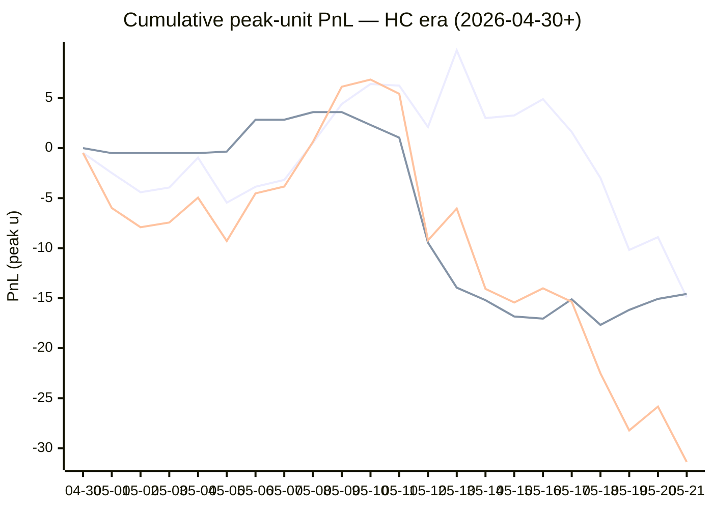

# Sharp Intel v6 — Daily Master Report

_Auto-generated **5/22/2026, 11:41:15 AM ET** by `scripts/dailyV6Report.js`. Do not edit by hand._

**Source of truth: this report mirrors the live Pick Performance dashboard.** Inclusion = `lockStage ≠ SHADOW ∧ ¬superseded ∧ health ∉ {MUTED, CANCELLED} ∧ peak.stars ≥ 2.5`. PnL is in **peak units** (the size shipped to users). HC margin / Δw / Δq are the **frozen** stamps written at last sync before the T-15 freeze. HC margin only existed from the v7.1 launch (**2026-04-30**); pre-launch picks have no HC value (no retro-fitting). Nothing is recomputed against today's whitelist.

v6 cutover: **2026-04-18** · whitelist source: live `sharpWalletProfiles` (181 profiles — drives §5 roster snapshot only) · quality cut: contribution ≥ 30 · HC = CONFIRMED tier ∧ sizeRatio ≥ 1.5.

---
## §1. Yesterday's picks

Slate: **2026-05-21** · 11 shipped sides.

| N | W-L-P | WR% | PnL (peak u) | PnL (flat 1u) |
|---|---|---|---|---|
| 11 | 5-6-0 | 45.5% | -5.53u | -1.27u |

| Sport | Market | Matchup | Pick | Stars · Units | HC | Δw | Δq | Σ | Odds | Result | PnL (peak u) |
|---|---|---|---|---|---|---|---|---|---|---|---|
| MLB | ML | Atlanta Braves @ Miami Marlins | Miami Marlins | 5.0★ · 2.50u | +1 | +1 | -1 | +0 | +125 | L | -2.50u |
| MLB | ML | Colorado Rockies @ Arizona Diamondbacks | Colorado Rockies | 3.0★ · 1.25u | +0 | +2 | +2 | +4 | +172 | L | -1.25u |
| MLB | ML | New York Mets @ Washington Nationals | New York Mets | 4.5★ · 2.75u | +1 | +2 | +2 | +4 | -110 | **W** | +2.50u |
| MLB | ML | Athletics @ Los Angeles Angels | Los Angeles Angels | 3.0★ · 1.25u | +1 | +3 | +1 | +4 | -116 | L | -1.25u |
| MLB | ML | Toronto Blue Jays @ New York Yankees | Toronto Blue Jays | 3.0★ · 1.25u | +0 | +1 | +1 | +2 | +129 | **W** | +1.57u |
| MLB | SPREAD | Atlanta Braves @ Miami Marlins | Miami Marlins | 3.0★ · 0.75u | +0 | +0 | +0 | +0 | -148 | L | -0.75u |
| MLB | SPREAD | Toronto Blue Jays @ New York Yankees | Toronto Blue Jays | 4.0★ · 1.65u | +1 | +1 | +1 | +2 | -170 | **W** | +0.98u |
| MLB | TOTAL | New York Mets @ Washington Nationals | Under 7.5 | 2.5★ · 0.30u | +0 | +0 | -1 | -1 | -110 | **W** | +0.27u |
| NBA | SPREAD | Cavaliers @ Knicks | Cavaliers | 5.0★ · 3.00u | +2 | +4 | +4 | +8 | -110 | L | -3.00u |
| NHL | ML | Canadiens @ Hurricanes | Hurricanes | 4.0★ · 2.75u | +1 | +4 | +1 | +5 | -197 | L | -2.75u |
| NHL | TOTAL | Canadiens @ Hurricanes | Over 6 | 3.0★ · 0.75u | +0 | +1 | +1 | +2 | +103 | **W** | +0.65u |

---
## §2. 3-day / 7-day / all-time cohort rollups

Shipped picks only. PnL in **peak units** (size we actually bet) and flat 1u (cohort EV lens). All margins are the engine's frozen stamps (`v8_hcMargin`, `v8_walletConsensusDelta`, `v8_walletConsensusQualityMargin`).

**HC margin sub-tables** are scoped to picks dated ≥ 2026-04-30 (the v7.1 launch — when HC margin became a real engine signal). Pre-launch picks are excluded from HC analysis since the feature didn't exist for them. Δw / Δq sub-tables span the full v6-era sample (≥ 2026-04-18). Empty buckets are dropped.

### §2a. 3-day

Total: **28** shipped · 14-14-0 · WR 50.0% · PnL -8.85u (peak) / -2.26u (flat).

**By HC margin** _(picks dated ≥ 2026-04-30, N = 28)_

| Bucket | N | W-L-P | WR% | PnL (peak u) | PnL (flat 1u) |
|---|---|---|---|---|---|
| HC ≥ +3 | 3 | 2-1-0 | 66.7% | +0.99u | -0.17u |
| HC = +2 | 2 | 0-2-0 | 0.0% | -5.25u | -2.00u |
| HC = +1 | 15 | 7-8-0 | 46.7% | -7.68u | -1.88u |
| HC = 0 | 8 | 5-3-0 | 62.5% | +3.09u | +1.79u |

**By Δw (winner margin)**

| Bucket | N | W-L-P | WR% | PnL (peak u) | PnL (flat 1u) |
|---|---|---|---|---|---|
| ≥ +3 | 7 | 3-4-0 | 42.9% | -2.92u | -1.72u |
| +2 | 7 | 3-4-0 | 42.9% | -1.65u | -1.53u |
| +1 | 9 | 5-4-0 | 55.6% | -5.00u | +0.58u |
| 0 | 5 | 3-2-0 | 60.0% | +0.72u | +0.40u |

**By Δq (quality margin)**

| Bucket | N | W-L-P | WR% | PnL (peak u) | PnL (flat 1u) |
|---|---|---|---|---|---|
| ≥ +3 | 6 | 4-2-0 | 66.7% | +3.97u | +0.67u |
| +2 | 5 | 2-3-0 | 40.0% | -0.84u | -1.13u |
| +1 | 9 | 5-4-0 | 55.6% | -2.70u | +0.47u |
| 0 | 4 | 2-2-0 | 50.0% | -1.80u | -0.18u |
| −1 | 4 | 1-3-0 | 25.0% | -7.48u | -2.09u |

**By AGS tier** _(picks dated ≥ 2026-05-05, N = 28)_

| Bucket | N | W-L-P | WR% | PnL (peak u) | PnL (flat 1u) |
|---|---|---|---|---|---|
| ELITE  (≥ +7) | 2 | 2-0-0 | 100.0% | +4.83u | +1.39u |
| LOCK   (+5 .. +7) | 2 | 1-1-0 | 50.0% | -1.11u | -0.62u |
| STRONG (+3 .. +5) | 4 | 0-4-0 | 0.0% | -10.50u | -4.00u |
| NEUT   (0 .. +3) | 17 | 9-8-0 | 52.9% | -0.40u | -0.06u |
| WEAK   (−1 .. 0) | 1 | 0-1-0 | 0.0% | -2.50u | -1.00u |
| FADE   (< −1) | 2 | 2-0-0 | 100.0% | +0.83u | +2.02u |

### §2b. 7-day

Total: **60** shipped · 31-29-0 · WR 51.7% · PnL -17.30u (peak) / -0.58u (flat).

**By HC margin** _(picks dated ≥ 2026-04-30, N = 60)_

| Bucket | N | W-L-P | WR% | PnL (peak u) | PnL (flat 1u) |
|---|---|---|---|---|---|
| HC ≥ +3 | 4 | 2-2-0 | 50.0% | +0.24u | -1.17u |
| HC = +2 | 6 | 1-5-0 | 16.7% | -15.00u | -3.85u |
| HC = +1 | 31 | 17-14-0 | 54.8% | -3.16u | +2.35u |
| HC = 0 | 19 | 11-8-0 | 57.9% | +0.62u | +2.09u |

**By Δw (winner margin)**

| Bucket | N | W-L-P | WR% | PnL (peak u) | PnL (flat 1u) |
|---|---|---|---|---|---|
| ≥ +3 | 15 | 9-6-0 | 60.0% | -2.82u | +3.56u |
| +2 | 20 | 9-11-0 | 45.0% | -8.04u | -3.51u |
| +1 | 15 | 9-6-0 | 60.0% | -2.43u | +2.06u |
| 0 | 10 | 4-6-0 | 40.0% | -4.01u | -2.69u |

**By Δq (quality margin)**

| Bucket | N | W-L-P | WR% | PnL (peak u) | PnL (flat 1u) |
|---|---|---|---|---|---|
| ≥ +3 | 13 | 9-4-0 | 69.2% | +4.78u | +4.73u |
| +2 | 13 | 6-7-0 | 46.2% | -7.30u | -1.04u |
| +1 | 20 | 11-9-0 | 55.0% | -4.01u | +0.18u |
| 0 | 8 | 4-4-0 | 50.0% | -0.04u | -0.37u |
| −1 | 4 | 1-3-0 | 25.0% | -7.48u | -2.09u |
| ≤ −2 | 2 | 0-2-0 | 0.0% | -3.25u | -2.00u |

**By AGS tier** _(picks dated ≥ 2026-05-05, N = 60)_

| Bucket | N | W-L-P | WR% | PnL (peak u) | PnL (flat 1u) |
|---|---|---|---|---|---|
| ELITE  (≥ +7) | 2 | 2-0-0 | 100.0% | +4.83u | +1.39u |
| LOCK   (+5 .. +7) | 3 | 1-2-0 | 33.3% | -3.61u | -1.62u |
| STRONG (+3 .. +5) | 8 | 3-5-0 | 37.5% | -10.25u | -2.71u |
| NEUT   (0 .. +3) | 34 | 17-17-0 | 50.0% | -7.80u | -1.47u |
| WEAK   (−1 .. 0) | 5 | 3-2-0 | 60.0% | -1.18u | +2.01u |
| FADE   (< −1) | 8 | 5-3-0 | 62.5% | +0.71u | +1.82u |

### §2c. All-time

Total: **241** shipped · 116-123-2 · WR 48.5% · PnL -43.60u (peak) / -10.53u (flat).

**By HC margin** _(picks dated ≥ 2026-04-30, N = 130)_

| Bucket | N | W-L-P | WR% | PnL (peak u) | PnL (flat 1u) |
|---|---|---|---|---|---|
| HC ≥ +3 | 5 | 2-3-0 | 40.0% | -3.26u | -2.17u |
| HC = +2 | 13 | 5-8-0 | 38.5% | -11.57u | -3.03u |
| HC = +1 | 73 | 41-32-0 | 56.2% | -0.09u | +7.82u |
| HC = 0 | 36 | 17-18-1 | 48.6% | -14.58u | -2.37u |
| HC ≤ −1 | 2 | 0-2-0 | 0.0% | -3.50u | -2.00u |

**By Δw (winner margin)**

| Bucket | N | W-L-P | WR% | PnL (peak u) | PnL (flat 1u) |
|---|---|---|---|---|---|
| ≥ +3 | 52 | 30-22-0 | 57.7% | -4.28u | +11.43u |
| +2 | 60 | 24-36-0 | 40.0% | -26.80u | -12.47u |
| +1 | 76 | 43-32-1 | 57.3% | +5.33u | +7.16u |
| 0 | 39 | 14-24-1 | 36.8% | -15.74u | -11.56u |
| −1 | 7 | 1-6-0 | 14.3% | -5.60u | -4.94u |
| ≤ −2 | 1 | 0-1-0 | 0.0% | -0.50u | -1.00u |
| missing | 6 | 4-2-0 | 66.7% | +3.99u | +0.85u |

**By Δq (quality margin)**

| Bucket | N | W-L-P | WR% | PnL (peak u) | PnL (flat 1u) |
|---|---|---|---|---|---|
| ≥ +3 | 81 | 40-39-2 | 50.6% | -16.02u | +1.47u |
| +2 | 57 | 26-31-0 | 45.6% | -21.05u | -4.32u |
| +1 | 62 | 31-31-0 | 50.0% | -5.05u | -3.45u |
| 0 | 23 | 9-14-0 | 39.1% | -2.63u | -4.41u |
| −1 | 8 | 5-3-0 | 62.5% | +1.48u | +1.45u |
| ≤ −2 | 4 | 1-3-0 | 25.0% | -3.57u | -2.04u |
| missing | 6 | 4-2-0 | 66.7% | +3.24u | +0.77u |

**By AGS tier** _(picks dated ≥ 2026-05-05, N = 105)_

| Bucket | N | W-L-P | WR% | PnL (peak u) | PnL (flat 1u) |
|---|---|---|---|---|---|
| ELITE  (≥ +7) | 3 | 3-0-0 | 100.0% | +8.01u | +2.34u |
| LOCK   (+5 .. +7) | 9 | 5-4-0 | 55.6% | -2.93u | -0.47u |
| STRONG (+3 .. +5) | 22 | 13-9-0 | 59.1% | -6.66u | +2.77u |
| NEUT   (0 .. +3) | 54 | 23-31-0 | 42.6% | -25.01u | -9.30u |
| WEAK   (−1 .. 0) | 6 | 3-3-0 | 50.0% | -3.18u | +1.01u |
| FADE   (< −1) | 10 | 6-4-0 | 60.0% | +1.72u | +2.16u |
| missing | 1 | 1-0-0 | 100.0% | +1.63u | +0.96u |

---
## §3. Edge over time — is HC margin creating winners?

Daily cumulative peak-unit PnL since the HC margin launch (**2026-04-30**). The `HC ≥ +1` line is the golden-standard cohort. The `HC = 0` line is the no-HC-signal control. The `All shipped (HC era)` line is every shipped pick from the same date range — the apples-to-apples baseline. Watch the spread.

Daily cumulative table (peak units, HC era only):

| Date | HC ≥ +1 (cum) | HC = 0 (cum) | All shipped (cum) |
|---|---|---|---|
| 2026-04-30 | -0.48u | +0.00u | -0.48u |
| 2026-05-01 | -2.48u | -0.50u | -5.98u |
| 2026-05-02 | -4.41u | -0.50u | -7.91u |
| 2026-05-03 | -3.94u | -0.50u | -7.44u |
| 2026-05-04 | -0.95u | -0.50u | -4.95u |
| 2026-05-05 | -5.45u | -0.34u | -9.29u |
| 2026-05-06 | -3.86u | +2.84u | -4.52u |
| 2026-05-07 | -3.18u | +2.84u | -3.84u |
| 2026-05-08 | +0.54u | +3.60u | +0.64u |
| 2026-05-09 | +4.41u | +3.60u | +6.14u |
| 2026-05-10 | +6.41u | +2.32u | +6.86u |
| 2026-05-11 | +6.25u | +1.05u | +5.43u |
| 2026-05-12 | +2.11u | -9.45u | -9.21u |
| 2026-05-13 | +9.78u | -13.95u | -6.04u |
| 2026-05-14 | +3.00u | -15.20u | -14.07u |
| 2026-05-15 | +3.27u | -16.83u | -15.43u |
| 2026-05-16 | +4.90u | -17.05u | -14.02u |
| 2026-05-17 | +1.62u | -15.11u | -15.36u |
| 2026-05-18 | -2.98u | -17.67u | -22.52u |
| 2026-05-19 | -10.18u | -16.17u | -28.22u |
| 2026-05-20 | -8.90u | -15.07u | -25.84u |
| 2026-05-21 | -14.92u | -14.58u | -31.37u |

---
## §4. Wallet roster growth & profitability

"Tracked in sport X" = a wallet has placed **≥ 2 bets** in X within the v6-era sample. "Profitable" = cumulative flat PnL > 0. Source: `v8Scoring.walletDetails` on every graded v6-era game (every side, not just the shipped set).

### §4a. Per-sport wallet snapshot

| Sport | Total wallets seen | Tracked (≥2) | Profitable | % prof | WR ≥ 50% | WR ≥ 60% | WR ≥ 70% |
|---|---|---|---|---|---|---|---|
| MLB | 52 | 34 | 12 | 35% | 14 | 6 | 3 |
| NBA | 120 | 88 | 37 | 42% | 51 | 24 | 14 |
| NHL | 48 | 31 | 14 | 45% | 22 | 10 | 6 |
| **ALL (any sport)** | **141** | **106** | **45** | **42%** | **59** | **28** | **14** |

### §4b. Daily roster growth (cumulative through each date)

Format: `tracked (profitable)`. For each date D, recompute the roster using every bet up to and including D.

| Date | ALL | MLB | NBA | NHL |
|---|---|---|---|---|
| 2026-04-18 | 5 (2) | 2 (2) | 3 (0) | 0 (0) |
| 2026-04-19 | 19 (8) | 5 (3) | 9 (3) | 3 (1) |
| 2026-04-20 | 29 (12) | 7 (6) | 23 (8) | 5 (2) |
| 2026-04-21 | 44 (21) | 10 (6) | 31 (10) | 7 (5) |
| 2026-04-22 | 52 (28) | 12 (6) | 39 (15) | 11 (10) |
| 2026-04-23 | 56 (29) | 13 (6) | 46 (21) | 13 (10) |
| 2026-04-24 | 61 (30) | 14 (6) | 51 (23) | 14 (9) |
| 2026-04-25 | 65 (29) | 16 (8) | 54 (22) | 16 (9) |
| 2026-04-26 | 67 (31) | 18 (5) | 56 (25) | 17 (9) |
| 2026-04-27 | 72 (32) | 20 (7) | 60 (24) | 17 (9) |
| 2026-04-28 | 76 (33) | 21 (7) | 63 (26) | 23 (10) |
| 2026-04-29 | 77 (33) | 21 (7) | 64 (25) | 23 (10) |
| 2026-04-30 | 81 (34) | 21 (7) | 70 (27) | 23 (10) |
| 2026-05-01 | 85 (38) | 22 (5) | 74 (30) | 26 (13) |
| 2026-05-02 | 86 (37) | 23 (7) | 75 (32) | 26 (12) |
| 2026-05-03 | 86 (38) | 24 (8) | 75 (33) | 26 (12) |
| 2026-05-04 | 90 (38) | 24 (9) | 76 (32) | 26 (12) |
| 2026-05-05 | 91 (40) | 24 (9) | 79 (33) | 26 (12) |
| 2026-05-06 | 92 (40) | 24 (9) | 80 (33) | 26 (12) |
| 2026-05-07 | 92 (41) | 24 (9) | 80 (33) | 26 (12) |
| 2026-05-08 | 92 (40) | 24 (8) | 80 (32) | 26 (11) |
| 2026-05-09 | 94 (42) | 24 (8) | 82 (35) | 26 (11) |
| 2026-05-10 | 94 (42) | 24 (8) | 82 (35) | 26 (11) |
| 2026-05-11 | 96 (42) | 24 (8) | 84 (36) | 26 (11) |
| 2026-05-12 | 100 (41) | 27 (9) | 86 (37) | 26 (11) |
| 2026-05-13 | 102 (45) | 29 (11) | 88 (37) | 26 (11) |
| 2026-05-14 | 102 (41) | 29 (11) | 88 (37) | 28 (12) |
| 2026-05-15 | 103 (41) | 30 (10) | 88 (39) | 28 (12) |
| 2026-05-16 | 105 (43) | 31 (12) | 88 (39) | 30 (14) |
| 2026-05-17 | 105 (46) | 32 (11) | 88 (40) | 30 (14) |
| 2026-05-18 | 105 (46) | 32 (10) | 88 (38) | 31 (15) |
| 2026-05-19 | 105 (46) | 32 (12) | 88 (38) | 31 (15) |
| 2026-05-20 | 106 (48) | 33 (12) | 88 (38) | 31 (16) |
| 2026-05-21 | 106 (45) | 34 (12) | 88 (37) | 31 (14) |

### §4c. Top 10 profitable wallets by sport

#### MLB

| # | Wallet | N | W | L | WR% | Flat PnL (u) | Flat ROI | $ PnL |
|---|---|---|---|---|---|---|---|---|
| 1 | b31fc6 | 2 | 2 | 0 | 100.0% | +2.56 | +128.0% | $4.2K |
| 2 | c289a0 | 3 | 3 | 0 | 100.0% | +2.87 | +95.6% | $1.5K |
| 3 | eeabaf | 4 | 3 | 1 | 75.0% | +1.80 | +45.1% | $34.1K |
| 4 | c668b3 | 3 | 2 | 1 | 66.7% | +1.16 | +38.7% | $4.0K |
| 5 | 981187 | 8 | 5 | 3 | 62.5% | +1.65 | +20.7% | $13.5K |
| 6 | a10ff5 | 15 | 9 | 6 | 60.0% | +2.69 | +17.9% | $12.4K |
| 7 | 7923c4 | 7 | 4 | 3 | 57.1% | +0.76 | +10.8% | $55.8K |
| 8 | 8ec926 | 4 | 2 | 2 | 50.0% | +0.29 | +7.2% | $6.0K |
| 9 | 0f9d74 | 22 | 12 | 10 | 54.5% | +1.44 | +6.6% | $15.7K |
| 10 | 63fc82 | 15 | 8 | 7 | 53.3% | +0.91 | +6.1% | $104.4K |

#### NBA

| # | Wallet | N | W | L | WR% | Flat PnL (u) | Flat ROI | $ PnL |
|---|---|---|---|---|---|---|---|---|
| 1 | 799fad | 2 | 2 | 0 | 100.0% | +5.66 | +283.0% | $241.7K |
| 2 | 4a9953 | 2 | 2 | 0 | 100.0% | +2.16 | +108.2% | $3.7K |
| 3 | 12ad50 | 3 | 3 | 0 | 100.0% | +2.74 | +91.3% | $45.5K |
| 4 | b51a56 | 6 | 5 | 1 | 83.3% | +5.44 | +90.7% | $74.4K |
| 5 | 2e8da5 | 10 | 8 | 2 | 80.0% | +8.06 | +80.6% | $120.4K |
| 6 | 11b032 | 7 | 6 | 1 | 85.7% | +5.40 | +77.1% | $249.9K |
| 7 | 8ec926 | 7 | 6 | 1 | 85.7% | +4.53 | +64.7% | $7.9K |
| 8 | 769c38 | 11 | 10 | 1 | 90.9% | +7.08 | +64.3% | $76.6K |
| 9 | 7f00bc | 16 | 11 | 5 | 68.8% | +9.63 | +60.2% | $14.2K |
| 10 | 92df91 | 19 | 13 | 6 | 68.4% | +8.99 | +47.3% | -$334 |

#### NHL

| # | Wallet | N | W | L | WR% | Flat PnL (u) | Flat ROI | $ PnL |
|---|---|---|---|---|---|---|---|---|
| 1 | fec67e | 2 | 2 | 0 | 100.0% | +2.84 | +142.0% | $13.1K |
| 2 | 8366f5 | 2 | 2 | 0 | 100.0% | +2.30 | +114.9% | $107.6K |
| 3 | 981187 | 5 | 5 | 0 | 100.0% | +5.03 | +100.6% | $30.3K |
| 4 | 799fad | 2 | 2 | 0 | 100.0% | +1.88 | +94.1% | $46.9K |
| 5 | 30935c | 4 | 3 | 1 | 75.0% | +2.11 | +52.7% | $953 |
| 6 | 6b853d | 7 | 5 | 2 | 71.4% | +2.02 | +28.9% | $8.4K |
| 7 | e70853 | 8 | 5 | 3 | 62.5% | +2.17 | +27.1% | -$45.2K |
| 8 | fcc12b | 9 | 6 | 3 | 66.7% | +1.91 | +21.3% | -$95.8K |
| 9 | c5cea1 | 3 | 2 | 1 | 66.7% | +0.62 | +20.7% | $22.1K |
| 10 | dcafd2 | 2 | 1 | 1 | 50.0% | +0.40 | +20.0% | $4.9K |

---
## §5. Proven-wallet roster growth & HC tracking

"Proven wallet" = whitelist tier `CONFIRMED` or `FLAT` in the same sense the live engine uses (`exportWalletProfiles.js` → `sharpWalletProfiles.bySport`). Sports inherit independent rosters: a wallet can be CONFIRMED in NBA and absent from NHL. `walletBets` come from `v8Scoring.walletDetails` on every graded v6-era pick (Source A); `positionRows` come from `sharp_action_positions` (Source B).

### §5a. Current proven-winner roster (snapshot)

Roster as of **2026-05-21** — wallets with ≥2 bets in the sport.

| Sport | Wallets seen | Eligible (≥2) | CONFIRMED | FLAT | Proven (C+F) | WR50 only | Conv % |
|---|---|---|---|---|---|---|---|
| MLB | 93 | 34 | 6 | 6 | **12** | 2 | 12.9% |
| NBA | 179 | 88 | 23 | 14 | **37** | 18 | 20.7% |
| NHL | 87 | 31 | 10 | 4 | **14** | 8 | 16.1% |
| **ALL** | **—** | **—** | **—** | **—** | **63** | **—** | **—** |

### §5b. Live whitelist drift check

Live `sharpWalletProfiles` is what the engine reads at lock time. Drift between script reconstruction (above) and live should be ≤ 1 day of position data — otherwise `exportWalletProfiles.js` is stale.

| Sport | CONFIRMED (live · script) | FLAT (live · script) | WR50 (live · script) | Drift |
|---|---|---|---|---|
| MLB | 15 · 6 | 7 · 6 | 2 · 2 | +10 live |
| NBA | 41 · 23 | 16 · 14 | 19 · 18 | +20 live |
| NHL | 14 · 10 | 4 · 4 | 6 · 8 | +4 live |

### §5c. Roster growth — 3d / 7d / 30d / all-time deltas

Each cell is **net growth** in proven (CONFIRMED + FLAT) wallets in that window, with the absolute count at the start (`+Δ from N`). Negative = wallets demoted. Window endpoint = 2026-05-21.

| Sport | 3-day | 7-day | 30-day | All-time (since cutover) |
|---|---|---|---|---|
| MLB | +2 from 10 | +1 from 11 | +6 from 6 | +12 from 0 |
| NBA | -1 from 38 | +0 from 37 | +27 from 10 | +37 from 0 |
| NHL | -1 from 15 | +2 from 12 | +9 from 5 | +14 from 0 |

A flat 7-day delta on a sport with healthy slate density = either the bubble pipeline has stalled (no wallets approaching the bar) or our cohort has saturated. Check §13d for the funnel diagnostic.

### §5d. Pipeline funnel — where each sport leaks

Wallets surviving each gate, in order. The biggest %-drop tells you the bottleneck. Gates:

1. **Seen** — placed ≥ 1 bet in the sport (any source)
2. **Eligible** — ≥ 2 graded picks in Source A (required for FLAT/CONFIRMED)
3. **Flat-OK** — eligible AND flat ROI > 0 (becomes FLAT or better)
4. **$-OK** — Flat-OK AND ≥2 positions with dollar ROI > 0 (CONFIRMED)
5. **Promoted** — final whitelisted = CONFIRMED + FLAT

| Sport | 1·Seen | 2·Eligible (% of Seen) | 3·Flat-OK (% of Elig) | 4·$-OK (% of Flat) | 5·Promoted | Bottleneck |
|---|---|---|---|---|---|---|
| MLB | 93 | 34 (37%) | 12 (35%) | 6 (50%) | **12** | edge (Eligible→Flat-OK) 65% |
| NBA | 179 | 88 (49%) | 37 (42%) | 23 (62%) | **37** | edge (Eligible→Flat-OK) 58% |
| NHL | 87 | 31 (36%) | 14 (45%) | 10 (71%) | **14** | sample (Seen→Eligible) 64% |

### §5e. HC backing density (the fuel for v7.3 HC margin)

Every v7.x promotion is gated on `HC_m ≥ +1`, which requires at least one CONFIRMED wallet sized at `≥ 1.5×` average on the for-side. This table shows the share of shipped picks that *had any HC backing*, by sport, in each window. If HC density falls toward zero in a sport, the v7.3 floor cohorts (Σ=1, Σ=2 locks; HC rescues) will simply stop firing there.

| Sport | Window | Picks (with HC stamp) | Any HC for-side | HC_m ≥ +1 | HC_m ≥ +2 |
|---|---|---|---|---|---|
| MLB | 3-day | 18 | 11 (61.1%) | 11 (61.1%) | 0 (0.0%) |
| MLB | 7-day | 40 | 24 (60.0%) | 24 (60.0%) | 2 (5.0%) |
| MLB | All-time | 105 | 55 (52.4%) | 54 (51.4%) | 5 (4.8%) |
| NBA | 3-day | 7 | 7 (100.0%) | 7 (100.0%) | 5 (71.4%) |
| NBA | 7-day | 15 | 13 (86.7%) | 13 (86.7%) | 7 (46.7%) |
| NBA | All-time | 101 | 62 (61.4%) | 55 (54.5%) | 24 (23.8%) |
| NHL | 3-day | 3 | 2 (66.7%) | 2 (66.7%) | 0 (0.0%) |
| NHL | 7-day | 5 | 4 (80.0%) | 4 (80.0%) | 1 (20.0%) |
| NHL | All-time | 29 | 13 (44.8%) | 12 (41.4%) | 2 (6.9%) |

Pooled across sports:

| Window | Picks (with HC stamp) | Any HC for-side | HC_m ≥ +1 | HC_m ≥ +2 |
|---|---|---|---|---|
| 3-day | 28 | 20 (71.4%) | 20 (71.4%) | 5 (17.9%) |
| 7-day | 60 | 41 (68.3%) | 41 (68.3%) | 10 (16.7%) |
| All-time | 235 | 130 (55.3%) | 121 (51.5%) | 31 (13.2%) |

### §5f. Bubble wallets — next-up graduations

Wallets currently NOT promoted but close. Two flavors:

- **One-bet-away** — won the only bet, needs one more positive bet to clear ≥2.
- **Just-under** — has ≥2 bets but flat ROI is between −10% and 0% (one win flips them).

#### MLB

**One-bet-away** (5)

| wallet | picksN | flat PnL | pos N | pos $ROI |
|---|---|---|---|---|
| `...0232` | 1 | +0.91 | 7 | 93% |
| `...be00` | 1 | +0.87 | 11 | -8% |
| `...a240` | 1 | +0.87 | 7 | 83% |
| `...9373` | 1 | +0.87 | 0 | — |
| `...8d26` | 1 | +0.72 | 5 | -22% |

**Just-under** (5)

| wallet | picksN | WR | flat ROI | pos N | pos $ROI |
|---|---|---|---|---|---|
| `...2f63` | 74 | 50% | -1.9% | 453 | -7% |
| `...135d` | 9 | 44% | -5.0% | 309 | 7% |
| `...35e3` | 18 | 50% | -6.8% | 49 | -23% |
| `...c12b` | 38 | 47% | -7.8% | 67 | -19% |
| `...9a27` | 89 | 47% | -8.6% | 276 | -1% |

#### NBA

**One-bet-away** (6)

| wallet | picksN | flat PnL | pos N | pos $ROI |
|---|---|---|---|---|
| `...bf5d` | 1 | +3.15 | 3 | 42% |
| `...ed41` | 1 | +3.15 | 3 | 3% |
| `...6b87` | 1 | +2.05 | 8 | -27% |
| `...9d74` | 1 | +0.93 | 22 | -49% |
| `...c556` | 1 | +0.93 | 3 | 42% |
| `...5c69` | 1 | +0.91 | 2 | 28% |

**Just-under** (6)

| wallet | picksN | WR | flat ROI | pos N | pos $ROI |
|---|---|---|---|---|---|
| `...853d` | 39 | 54% | -0.3% | 78 | 3% |
| `...d814` | 8 | 50% | -0.5% | 47 | -9% |
| `...b33b` | 10 | 30% | -0.9% | 33 | 16% |
| `...65dd` | 6 | 50% | -2.4% | 17 | 27% |
| `...f5b0` | 20 | 50% | -3.7% | 57 | -28% |
| `...1fc6` | 4 | 50% | -3.7% | 9 | 17% |

#### NHL

**One-bet-away** (6)

| wallet | picksN | flat PnL | pos N | pos $ROI |
|---|---|---|---|---|
| `...2e78` | 1 | +1.46 | 0 | — |
| `...017f` | 1 | +1.45 | 5 | 125% |
| `...5ad0` | 1 | +1.42 | 7 | 28% |
| `...32f2` | 1 | +1.40 | 0 | — |
| `...e0fd` | 1 | +1.20 | 3 | 124% |
| `...266e` | 1 | +1.05 | 0 | — |

**Just-under** (5)

| wallet | picksN | WR | flat ROI | pos N | pos $ROI |
|---|---|---|---|---|---|
| `...33ee` | 4 | 50% | -0.3% | 8 | -23% |
| `...23c4` | 4 | 50% | -5.9% | 15 | 10% |
| `...618e` | 2 | 50% | -6.1% | 28 | 24% |
| `...3782` | 2 | 50% | -9.0% | 24 | 8% |
| `...d227` | 2 | 50% | -9.0% | 18 | 20% |

### §5g. v2 wallet-promotion pipeline (Source-A / Source-B mix)

Live snapshot of the v2 promotion gate (shipped 2026-05-10, re-eval **2026-05-24**). Each FLAT-or-better wallet × sport pair is attributed to one of three paths via `sharpWalletProfiles[wallet].bySport[sport].whitelistSource`:

- **A** — flat-positive on featured picks (Source A) only — the v1 gate
- **A+B** — flat-positive in both sources (most reliable signal)
- **B** — flat-positive on-chain only (NEW in v2 — the trial lift)

Re-classified every 2h via `grade-sharp-actions` cron. Roll-back: set `B_ONLY_MIN_BETS = Infinity` in `scripts/exportWalletProfiles.js`.

#### Source mix per sport (live Firestore)

| Sport | A | A+B | B (new) | FLAT-or-better total | % from B-only |
|---|---|---|---|---|---|
| MLB | 4 | 4 | **14** | 22 | 63.6% |
| NBA | 17 | 19 | **21** | 57 | 36.8% |
| NHL | 5 | 6 | **7** | 18 | 38.9% |
| **ALL** | **26** | **29** | **42** | **97** | **43.3%** |

#### Pipeline freshness

- `sharp_action_positions` GRADED rows: **7598**
- `sharp_action_positions` PENDING rows: **152** (queued for next Grade Sharp Actions run)
- Latest `sharpWalletProfiles` rebuild: 5/12/2026, 5:34:36 AM ET — **14767 min · STALE** — check grade-sharp-actions workflow

**Alarms**: pending > 200 OR rebuild lag > 4h → cron is lagging or failing — check `gh run list --workflow="Grade Sharp Actions"`.

#### B-only roster — wallets currently promoted via Source B path only

Wallets here would have been EXCLUDED under v1 (Source-A-only). Top by Source-B bet count per sport. The 2-week re-eval (2026-05-24) will compare these wallets' realized lift against A-only and A+B cohorts.

**MLB** — 14 wallets promoted via B

| wallet | tier | B_n | B_flat ROI | B_$ ROI |
|---|---|---|---|---|
| `...9a27` | CONFIRMED | 171 | +17.8% | +7.9% |
| `...1eae` | CONFIRMED | 32 | +4.3% | +0.1% |
| `...5143` | CONFIRMED | 31 | +17.9% | +19.7% |
| `...d6d2` | FLAT | 16 | +9.2% | -1.6% |
| `...0ff5` | FLAT | 13 | +1.8% | -23.5% |
| `...a9cc` | CONFIRMED | 8 | +6.3% | +0.3% |
| `...9d74` | CONFIRMED | 7 | +24.2% | +43.8% |
| `...aeeb` | CONFIRMED | 7 | +35.4% | +37.5% |
| `...2768` | CONFIRMED | 7 | +97.4% | +105.9% |
| `...35e3` | CONFIRMED | 6 | +29.9% | +35.5% |
| … | 4 more | | | |

**NBA** — 21 wallets promoted via B

| wallet | tier | B_n | B_flat ROI | B_$ ROI |
|---|---|---|---|---|
| `...2f63` | CONFIRMED | 162 | +1.4% | +2.3% |
| `...1eae` | CONFIRMED | 59 | +5.3% | +14.3% |
| `...3782` | CONFIRMED | 47 | +18.5% | +13.3% |
| `...11a4` | CONFIRMED | 31 | +44.9% | +36.7% |
| `...935c` | FLAT | 29 | +62.5% | -22.6% |
| `...68b3` | CONFIRMED | 16 | +28.5% | +18.4% |
| `...1697` | CONFIRMED | 15 | +14.1% | +29.5% |
| `...abaf` | CONFIRMED | 15 | +38.8% | +14.6% |
| `...2db4` | CONFIRMED | 13 | +4.9% | +3.3% |
| `...89a0` | FLAT | 13 | +38.5% | -14.4% |
| … | 11 more | | | |

**NHL** — 7 wallets promoted via B

| wallet | tier | B_n | B_flat ROI | B_$ ROI |
|---|---|---|---|---|
| `...3782` | CONFIRMED | 18 | +17.5% | +26.7% |
| `...df91` | FLAT | 17 | +9.2% | -15% |
| `...b33b` | CONFIRMED | 12 | +12% | +1.6% |
| `...23c4` | CONFIRMED | 10 | +19.9% | +27.4% |
| `...9ef0` | FLAT | 9 | +0.7% | -4.2% |
| `...68b3` | CONFIRMED | 9 | +20.6% | +63.3% |
| `...a9cc` | CONFIRMED | 7 | +49.5% | +46.9% |

### §5 — How to read

- **Roster growth flat in 7-day** + **funnel bottleneck = `data`** → re-run `exportWalletProfiles.js`. The flat-positive wallets are stuck at FLAT because Source-B coverage hasn't caught up. CONFIRMED gate is data-bound, not skill-bound.
- **Roster growth flat in 7-day** + **funnel bottleneck = `sample`** → wallets aren't reaching `≥2` reps fast enough. This is a slate-density problem; consider a soft `MIN_BETS = 1` shadow lane to surface bubble wallets earlier.
- **Roster shrank** (negative delta) → a previously CONFIRMED wallet just dropped flat-positive (lost a recent bet). Variance, not failure — but worth noting if a sport loses ≥3 in a week.
- **HC density on a sport drops below ~30%** → v7.3 promotions there will starve. Either the proven roster needs more CONFIRMED-tier wallets sizing aggressively, or the HC_RATIO (1.5) needs a sport-specific tune.
- **§5g B-only count drops sharply** → wallets are demoting off the B path (losing on-chain). Cross-check `WALLET_PROFILES_SUMMARY.md` churn section for the specific demotions.
- **§5g pipeline freshness lag > 4h** → grade-sharp-actions cron is failing. Check `gh run list --workflow="Grade Sharp Actions"` and re-trigger if needed.

---
## §6. Daily proven-wallet performance

Who on the proven roster is actually printing — yesterday's bets, the rolling leaderboard (`$ PnL`-ranked), current streaks, and per-sport volume. **Proven** = `CONFIRMED` ∪ `FLAT` per sport (the same gate that drives Δ_winner). A wallet only counts in a sport where it's on that sport's proven list.

### §6a. Yesterday's proven-wallet bets

Slate: **2026-05-21** · 27 bets · 17 distinct proven wallets · WR 52% · $ vol $827.7K · $ PnL -$334.6K.

| Wallet | Sport | Market | Game | $ size | Result | $ PnL |
|---|---|---|---|---|---|---|
| `...be3d` (CONFIRMED) | NBA | ML | Cavaliers @ Knicks | $178.6K | **W** | $89.3K |
| `...aeeb` (CONFIRMED) | NBA | ML | Cavaliers @ Knicks | $35.8K | **W** | $17.9K |
| `...3532` (FLAT) | NBA | ML | Cavaliers @ Knicks | $35.2K | **W** | $17.6K |
| `...0ff5` (FLAT) | MLB | ML | Toronto Blue Jays @ New York Yankees | $9.0K | **W** | $11.4K |
| `...9c38` (CONFIRMED) | NBA | ML | Cavaliers @ Knicks | $19.2K | **W** | $9.6K |
| `...9d74` (CONFIRMED) | MLB | ML | Athletics @ Los Angeles Angels | $8.0K | **W** | $8.0K |
| `...23c4` (FLAT) | MLB | TOTAL | New York Mets @ Washington Nationals | $6.3K | **W** | $5.7K |
| `...3532` (FLAT) | NHL | SPREAD | Canadiens @ Hurricanes | $8.5K | **W** | $5.3K |
| `...00bc` (CONFIRMED) | NBA | SPREAD | Cavaliers @ Knicks | $3.2K | **W** | $3.1K |
| `...a240` (CONFIRMED) | NHL | TOTAL | Canadiens @ Hurricanes | $3.0K | **W** | $2.6K |
| `...9a27` (CONFIRMED) | NBA | ML | Cavaliers @ Knicks | $4.1K | **W** | $2.0K |
| `...9d74` (CONFIRMED) | MLB | ML | New York Mets @ Washington Nationals | $2.2K | **W** | $2.0K |
| `...1fc6` (CONFIRMED) | MLB | ML | Toronto Blue Jays @ New York Yankees | $1.6K | **W** | $2.0K |
| `...2f63` (FLAT) | NBA | SPREAD | Cavaliers @ Knicks | $1.0K | **W** | $987 |
| `...1a56` (CONFIRMED) | NBA | ML | Cavaliers @ Knicks | $342 | L | -$342 |
| `...a240` (CONFIRMED) | NHL | ML | Canadiens @ Hurricanes | $2.5K | L | -$2.5K |
| `...9d74` (CONFIRMED) | MLB | ML | Atlanta Braves @ Miami Marlins | $2.9K | L | -$2.9K |
| `...9ef0` (CONFIRMED) | NBA | ML | Cavaliers @ Knicks | $3.7K | L | -$3.7K |
| `...c926` (FLAT) | NBA | SPREAD | Cavaliers @ Knicks | $4.9K | L | -$4.9K |
| `...3532` (FLAT) | NBA | TOTAL | Cavaliers @ Knicks | $5.2K | L | -$5.2K |
| `...aeeb` (CONFIRMED) | NBA | SPREAD | Cavaliers @ Knicks | $7.8K | L | -$7.8K |
| `...64aa` (CONFIRMED) | MLB | ML | Cleveland Guardians @ Detroit Tigers | $15.6K | L | -$15.6K |
| `...64aa` (CONFIRMED) | MLB | ML | Toronto Blue Jays @ New York Yankees | $18.0K | L | -$18.0K |
| `...9a27` (CONFIRMED) | NBA | SPREAD | Cavaliers @ Knicks | $36.6K | L | -$36.6K |
| `...23c4` (CONFIRMED) | NBA | SPREAD | Cavaliers @ Knicks | $69.0K | L | -$69.0K |
| `...2ca8` (CONFIRMED) | NBA | ML | Cavaliers @ Knicks | $126.5K | L | -$126.5K |
| `...2f63` (FLAT) | NBA | ML | Cavaliers @ Knicks | $219.0K | L | -$219.0K |

### §6b. Proven-wallet leaderboard

Top 15 proven `(wallet × sport)` pairs per sport per horizon, ranked by **$ PnL** (the dollar-ROI lens). The 3-day board is the "who's on form right now" lens; the 7-day filters single-day variance; all-time is the proven-roster reference.

#### §6b-1. 3-day

**MLB** — 7 active proven wallets

| # | Wallet | Tier | Bets | WR% | Bets/day | Flat PnL (u) | Flat ROI | $ vol | $ PnL | $ ROI | Streak |
|---|---|---|---|---|---|---|---|---|---|---|---|
| 1 | `...fc82` | FLAT | 1 | 100% | 1.0 | +1.15 | +115% | $76.6K | $88.1K | +115% | 1W |
| 2 | `...abaf` | CONFIRMED | 1 | 100% | 1.0 | +0.88 | +88% | $22.7K | $20.1K | +88% | 1W |
| 3 | `...0ff5` | FLAT | 4 | 75% | 1.3 | +2.02 | +51% | $26.2K | $19.9K | +76% | 1W |
| 4 | `...9d74` | CONFIRMED | 6 | 67% | 2.0 | +1.79 | +30% | $23.0K | $13.7K | +60% | 2W |
| 5 | `...23c4` | FLAT | 1 | 100% | 1.0 | +0.91 | +91% | $6.3K | $5.7K | +91% | 1W |
| 6 | `...1fc6` | CONFIRMED | 1 | 100% | 1.0 | +1.26 | +126% | $1.6K | $2.0K | +126% | 1W |
| 7 | `...64aa` | CONFIRMED | 15 | 47% | 5.0 | -1.83 | -12% | $245.9K | -$9.7K | -4% | 2L |

**NBA** — 19 active proven wallets

| # | Wallet | Tier | Bets | WR% | Bets/day | Flat PnL (u) | Flat ROI | $ vol | $ PnL | $ ROI | Streak |
|---|---|---|---|---|---|---|---|---|---|---|---|
| 1 | `...be3d` | CONFIRMED | 2 | 100% | 0.7 | +1.43 | +71% | $247.3K | $152.9K | +62% | 2W |
| 2 | `...9a27` | CONFIRMED | 6 | 50% | 2.0 | -0.68 | -11% | $326.1K | $45.5K | +14% | 1L |
| 3 | `...aeeb` | CONFIRMED | 4 | 75% | 2.0 | +0.83 | +21% | $111.8K | $40.7K | +36% | 1L |
| 4 | `...9c38` | CONFIRMED | 2 | 100% | 0.7 | +0.88 | +44% | $39.9K | $17.4K | +44% | 2W |
| 5 | `...d49f` | FLAT | 2 | 100% | 1.0 | +1.80 | +90% | $16.1K | $14.6K | +91% | 2W |
| 6 | `...3532` | FLAT | 3 | 33% | 1.0 | -1.50 | -50% | $44.8K | $8.0K | +18% | 1L |
| 7 | `...32f2` | CONFIRMED | 1 | 100% | 1.0 | +0.93 | +93% | $3.9K | $3.6K | +93% | 1W |
| 8 | `...00bc` | CONFIRMED | 1 | 100% | 1.0 | +0.95 | +95% | $3.2K | $3.1K | +95% | 1W |
| 9 | `...03d4` | FLAT | 4 | 50% | 2.0 | -0.18 | -5% | $24.2K | $2.9K | +12% | 2W |
| 10 | `...df91` | FLAT | 1 | 100% | 1.0 | +0.42 | +42% | $5.0K | $2.1K | +42% | 1W |
| 11 | `...0f9a` | CONFIRMED | 1 | 100% | 1.0 | +0.42 | +42% | $4.0K | $1.7K | +42% | 1W |
| 12 | `...1a56` | CONFIRMED | 1 | 0% | 1.0 | -1.00 | -100% | $342 | -$342 | -100% | 1L |
| 13 | `...9ef0` | CONFIRMED | 2 | 50% | 0.7 | -0.07 | -4% | $7.2K | -$525 | -7% | 1L |
| 14 | `...c926` | FLAT | 2 | 50% | 0.7 | -0.07 | -4% | $9.5K | -$641 | -7% | 1L |
| 15 | `...017f` | CONFIRMED | 2 | 50% | 2.0 | -0.11 | -5% | $34.6K | -$6.3K | -18% | 1W |

**NHL** — 3 active proven wallets

| # | Wallet | Tier | Bets | WR% | Bets/day | Flat PnL (u) | Flat ROI | $ vol | $ PnL | $ ROI | Streak |
|---|---|---|---|---|---|---|---|---|---|---|---|
| 1 | `...a240` | CONFIRMED | 3 | 67% | 1.5 | +0.44 | +15% | $8.5K | $1.8K | +21% | 1W |
| 2 | `...3532` | FLAT | 2 | 50% | 1.0 | -0.38 | -19% | $27.1K | -$13.3K | -49% | 1W |
| 3 | `...0853` | FLAT | 1 | 0% | 1.0 | -1.00 | -100% | $47.4K | -$47.4K | -100% | 1L |

#### §6b-2. 7-day

**MLB** — 8 active proven wallets

| # | Wallet | Tier | Bets | WR% | Bets/day | Flat PnL (u) | Flat ROI | $ vol | $ PnL | $ ROI | Streak |
|---|---|---|---|---|---|---|---|---|---|---|---|
| 1 | `...fc82` | FLAT | 1 | 100% | 1.0 | +1.15 | +115% | $76.6K | $88.1K | +115% | 1W |
| 2 | `...64aa` | CONFIRMED | 34 | 56% | 4.9 | +1.76 | +5% | $611.3K | $67.8K | +11% | 2L |
| 3 | `...0ff5` | FLAT | 9 | 78% | 1.5 | +4.70 | +52% | $51.7K | $34.8K | +67% | 1W |
| 4 | `...abaf` | CONFIRMED | 4 | 75% | 0.8 | +1.80 | +45% | $85.4K | $34.1K | +40% | 3W |
| 5 | `...9d74` | CONFIRMED | 15 | 53% | 2.5 | +0.96 | +6% | $39.2K | $13.8K | +35% | 2W |
| 6 | `...23c4` | FLAT | 1 | 100% | 1.0 | +0.91 | +91% | $6.3K | $5.7K | +91% | 1W |
| 7 | `...1fc6` | CONFIRMED | 2 | 100% | 0.5 | +2.56 | +128% | $3.3K | $4.2K | +128% | 2W |
| 8 | `...c926` | FLAT | 1 | 0% | 1.0 | -1.00 | -100% | $2.9K | -$2.9K | -100% | 1L |

**NBA** — 23 active proven wallets

| # | Wallet | Tier | Bets | WR% | Bets/day | Flat PnL (u) | Flat ROI | $ vol | $ PnL | $ ROI | Streak |
|---|---|---|---|---|---|---|---|---|---|---|---|
| 1 | `...be3d` | CONFIRMED | 2 | 100% | 0.7 | +1.43 | +71% | $247.3K | $152.9K | +62% | 2W |
| 2 | `...2ca8` | CONFIRMED | 3 | 67% | 0.4 | +0.94 | +31% | $322.5K | $132.2K | +41% | 1L |
| 3 | `...e8f1` | FLAT | 2 | 100% | 0.7 | +2.04 | +102% | $97.8K | $45.1K | +46% | 2W |
| 4 | `...aeeb` | CONFIRMED | 6 | 50% | 0.9 | -1.17 | -20% | $121.5K | $31.0K | +25% | 1L |
| 5 | `...66f5` | FLAT | 3 | 67% | 1.0 | +0.94 | +31% | $85.0K | $23.6K | +28% | 1L |
| 6 | `...9c38` | CONFIRMED | 3 | 67% | 0.6 | -0.12 | -4% | $43.6K | $13.7K | +31% | 2W |
| 7 | `...03d4` | FLAT | 9 | 56% | 1.5 | +0.74 | +8% | $43.3K | $9.7K | +22% | 2W |
| 8 | `...d49f` | FLAT | 3 | 67% | 0.5 | +0.80 | +27% | $22.1K | $8.7K | +39% | 2W |
| 9 | `...32f2` | CONFIRMED | 1 | 100% | 1.0 | +0.93 | +93% | $3.9K | $3.6K | +93% | 1W |
| 10 | `...00bc` | CONFIRMED | 3 | 67% | 0.4 | +1.45 | +48% | $10.8K | $3.1K | +29% | 1W |
| 11 | `...df91` | FLAT | 4 | 100% | 0.7 | +3.96 | +99% | $5.9K | $3.0K | +52% | 4W |
| 12 | `...0f9a` | CONFIRMED | 1 | 100% | 1.0 | +0.42 | +42% | $4.0K | $1.7K | +42% | 1W |
| 13 | `...9ef0` | CONFIRMED | 9 | 67% | 1.3 | +2.81 | +31% | $56.5K | -$111 | -0% | 1L |
| 14 | `...1a56` | CONFIRMED | 1 | 0% | 1.0 | -1.00 | -100% | $342 | -$342 | -100% | 1L |
| 15 | `...c926` | FLAT | 2 | 50% | 0.7 | -0.07 | -4% | $9.5K | -$641 | -7% | 1L |

**NHL** — 8 active proven wallets

| # | Wallet | Tier | Bets | WR% | Bets/day | Flat PnL (u) | Flat ROI | $ vol | $ PnL | $ ROI | Streak |
|---|---|---|---|---|---|---|---|---|---|---|---|
| 1 | `...66f5` | FLAT | 1 | 100% | 1.0 | +1.42 | +142% | $70.9K | $100.6K | +142% | 1W |
| 2 | `...a240` | CONFIRMED | 5 | 80% | 0.8 | +2.75 | +55% | $14.3K | $8.2K | +57% | 1W |
| 3 | `...c67e` | CONFIRMED | 1 | 100% | 1.0 | +1.42 | +142% | $3.2K | $4.6K | +142% | 1W |
| 4 | `...df91` | FLAT | 2 | 50% | 0.7 | +0.42 | +21% | $6.5K | $1.4K | +21% | 1L |
| 5 | `...853d` | CONFIRMED | 1 | 100% | 1.0 | +0.89 | +89% | $886 | $791 | +89% | 1W |
| 6 | `...3532` | FLAT | 3 | 33% | 0.5 | -1.38 | -46% | $29.2K | -$15.3K | -52% | 1W |
| 7 | `...0853` | FLAT | 1 | 0% | 1.0 | -1.00 | -100% | $47.4K | -$47.4K | -100% | 1L |
| 8 | `...c12b` | CONFIRMED | 2 | 0% | 0.7 | -2.00 | -100% | $165.9K | -$165.9K | -100% | 2L |

#### §6b-3. All-time

**MLB** — 12 active proven wallets

| # | Wallet | Tier | Bets | WR% | Bets/day | Flat PnL (u) | Flat ROI | $ vol | $ PnL | $ ROI | Streak |
|---|---|---|---|---|---|---|---|---|---|---|---|
| 1 | `...fc82` | FLAT | 15 | 53% | 0.5 | +0.91 | +6% | $312.9K | $104.4K | +33% | 1W |
| 2 | `...23c4` | FLAT | 7 | 57% | 0.3 | +0.76 | +11% | $151.1K | $55.8K | +37% | 2W |
| 3 | `...abaf` | CONFIRMED | 4 | 75% | 0.8 | +1.80 | +45% | $85.4K | $34.1K | +40% | 3W |
| 4 | `...5143` | CONFIRMED | 10 | 50% | 0.4 | +0.27 | +3% | $317.6K | $26.2K | +8% | 1W |
| 5 | `...64aa` | CONFIRMED | 80 | 55% | 2.4 | +2.03 | +3% | $1.40M | $19.2K | +1% | 2L |
| 6 | `...9d74` | CONFIRMED | 22 | 55% | 2.2 | +1.44 | +7% | $48.3K | $15.7K | +33% | 2W |
| 7 | `...1187` | FLAT | 8 | 63% | 2.7 | +1.65 | +21% | $30.5K | $13.5K | +44% | 1W |
| 8 | `...0ff5` | FLAT | 15 | 60% | 1.5 | +2.69 | +18% | $108.6K | $12.4K | +11% | 1W |
| 9 | `...c926` | FLAT | 4 | 50% | 0.3 | +0.29 | +7% | $14.1K | $6.0K | +42% | 1L |
| 10 | `...1fc6` | CONFIRMED | 2 | 100% | 0.5 | +2.56 | +128% | $3.3K | $4.2K | +128% | 2W |
| 11 | `...68b3` | CONFIRMED | 3 | 67% | 0.2 | +1.16 | +39% | $3.9K | $4.0K | +104% | 1W |
| 12 | `...89a0` | FLAT | 3 | 100% | 0.4 | +2.87 | +96% | $1.6K | $1.5K | +95% | 3W |

**NBA** — 37 active proven wallets

| # | Wallet | Tier | Bets | WR% | Bets/day | Flat PnL (u) | Flat ROI | $ vol | $ PnL | $ ROI | Streak |
|---|---|---|---|---|---|---|---|---|---|---|---|
| 1 | `...9a27` | CONFIRMED | 75 | 63% | 2.7 | +10.11 | +13% | $2.26M | $564.5K | +25% | 1L |
| 2 | `...be3d` | CONFIRMED | 4 | 75% | 0.4 | +1.03 | +26% | $719.5K | $281.9K | +39% | 2W |
| 3 | `...2ca8` | CONFIRMED | 18 | 61% | 0.5 | +5.52 | +31% | $854.5K | $274.9K | +32% | 1L |
| 4 | `...b032` | CONFIRMED | 7 | 86% | 0.7 | +5.40 | +77% | $244.0K | $249.9K | +102% | 3W |
| 5 | `...9fad` | CONFIRMED | 2 | 100% | 1.0 | +5.66 | +283% | $141.8K | $241.7K | +170% | 2W |
| 6 | `...aeeb` | CONFIRMED | 52 | 60% | 1.6 | +8.12 | +16% | $980.8K | $212.1K | +22% | 1L |
| 7 | `...32f2` | CONFIRMED | 8 | 50% | 0.3 | +1.91 | +24% | $130.7K | $137.8K | +105% | 1W |
| 8 | `...e8f1` | FLAT | 16 | 44% | 0.6 | +2.53 | +16% | $564.8K | $128.7K | +23% | 2W |
| 9 | `...8da5` | CONFIRMED | 10 | 80% | 0.4 | +8.06 | +81% | $205.7K | $120.4K | +59% | 1L |
| 10 | `...02c3` | CONFIRMED | 6 | 33% | 0.9 | +0.75 | +13% | $681.1K | $104.0K | +15% | 3L |
| 11 | `...5143` | FLAT | 12 | 67% | 0.6 | +4.27 | +36% | $754.5K | $101.3K | +13% | 1W |
| 12 | `...b814` | CONFIRMED | 3 | 100% | 0.4 | +0.56 | +19% | $431.9K | $81.3K | +19% | 3W |
| 13 | `...9c38` | CONFIRMED | 11 | 91% | 0.3 | +7.08 | +64% | $147.1K | $76.6K | +52% | 2W |
| 14 | `...1a56` | CONFIRMED | 6 | 83% | 0.2 | +5.44 | +91% | $53.7K | $74.4K | +139% | 1L |
| 15 | `...dc5b` | CONFIRMED | 4 | 50% | 2.0 | +1.79 | +45% | $187.7K | $55.6K | +30% | 1W |

**NHL** — 14 active proven wallets

| # | Wallet | Tier | Bets | WR% | Bets/day | Flat PnL (u) | Flat ROI | $ vol | $ PnL | $ ROI | Streak |
|---|---|---|---|---|---|---|---|---|---|---|---|
| 1 | `...192c` | FLAT | 6 | 50% | 0.5 | +0.80 | +13% | $166.9K | $136.2K | +82% | 2L |
| 2 | `...66f5` | FLAT | 2 | 100% | 0.7 | +2.30 | +115% | $78.8K | $107.6K | +137% | 2W |
| 3 | `...9fad` | CONFIRMED | 2 | 100% | 1.0 | +1.88 | +94% | $88.2K | $46.9K | +53% | 2W |
| 4 | `...1187` | CONFIRMED | 5 | 100% | 2.5 | +5.03 | +101% | $38.0K | $30.3K | +80% | 5W |
| 5 | `...cea1` | CONFIRMED | 3 | 67% | 0.4 | +0.62 | +21% | $27.7K | $22.1K | +80% | 1W |
| 6 | `...a240` | CONFIRMED | 24 | 63% | 0.7 | +4.32 | +18% | $80.3K | $14.2K | +18% | 1W |
| 7 | `...c67e` | CONFIRMED | 2 | 100% | 0.1 | +2.84 | +142% | $9.2K | $13.1K | +142% | 2W |
| 8 | `...853d` | CONFIRMED | 7 | 71% | 0.2 | +2.02 | +29% | $30.0K | $8.4K | +28% | 1W |
| 9 | `...afd2` | CONFIRMED | 2 | 50% | 1.0 | +0.40 | +20% | $18.2K | $4.9K | +27% | 1W |
| 10 | `...935c` | CONFIRMED | 4 | 75% | 1.0 | +2.11 | +53% | $1.3K | $953 | +74% | 3W |
| 11 | `...df91` | FLAT | 9 | 56% | 0.4 | +0.55 | +6% | $16.0K | -$4.8K | -30% | 1L |
| 12 | `...0853` | FLAT | 8 | 63% | 0.3 | +2.17 | +27% | $180.0K | -$45.2K | -25% | 1L |
| 13 | `...3532` | FLAT | 14 | 50% | 0.5 | +1.31 | +9% | $200.0K | -$49.3K | -25% | 1W |
| 14 | `...c12b` | CONFIRMED | 9 | 67% | 0.3 | +1.91 | +21% | $451.4K | -$95.8K | -21% | 2L |

### §6c. Active streaks (≥3 in a row, last bet within 3 days)

Proven `(wallet × sport)` pairs currently riding a 3-or-more-bet run with their most recent bet inside the last 3 calendar days. Hot-hand monitor — and the same surface for cold streaks worth fading.

| Wallet | Sport | Tier | Streak | Last bet | All-time bets | WR% | $ PnL | $ ROI |
|---|---|---|---|---|---|---|---|---|
| `...df91` | NBA | FLAT | **8W** | 2026-05-20 | 19 | 68% | -$334 | -2% |
| `...23c4` | NBA | CONFIRMED | **4L** | 2026-05-21 | 17 | 59% | $53.9K | +8% |
| `...abaf` | MLB | CONFIRMED | **3W** | 2026-05-20 | 4 | 75% | $34.1K | +40% |

### §6d. Daily proven-wallet volume (trailing 14 graded days)

Per-day bet count, $ volume, and $ PnL from proven wallets only. Helps spot slate-density swings — a spike in one sport's volume = the proven cohort sees something on that night's board.

| Date | TOTAL N · $vol · $PnL | MLB N · $vol · $PnL | NBA N · $vol · $PnL | NHL N · $vol · $PnL |
|---|---|---|---|---|
| 2026-05-08 | 18 · $301.5K · -$2.6K | — | 15 · $278.8K · $18.2K | 3 · $22.7K · -$20.8K |
| 2026-05-09 | 17 · $544.9K · -$7.8K | — | 17 · $544.9K · -$7.8K | — |
| 2026-05-10 | 21 · $725.2K · $592.4K | — | 18 · $660.9K · $619.5K | 3 · $64.3K · -$27.1K |
| 2026-05-11 | 21 · $747.7K · $157.7K | — | 19 · $732.8K · $172.5K | 2 · $14.8K · -$14.8K |
| 2026-05-12 | 29 · $379.7K · -$5.6K | 9 · $120.4K · $22.3K | 17 · $150.6K · -$65.9K | 3 · $108.7K · $38.0K |
| 2026-05-13 | 25 · $638.4K · -$236.5K | 9 · $90.0K · -$9.2K | 16 · $548.3K · -$227.3K | — |
| 2026-05-14 | 12 · $74.2K · $7.2K | 8 · $56.6K · -$1.9K | — | 4 · $17.6K · $9.0K |
| 2026-05-15 | 40 · $798.1K · $215.3K | 4 · $85.2K · $46.7K | 36 · $712.9K · $168.6K | — |
| 2026-05-16 | 15 · $234.0K · -$1.4K | 9 · $77.6K · -$37.7K | — | 6 · $156.4K · $36.3K |
| 2026-05-17 | 36 · $677.1K · -$128.5K | 19 · $195.9K · $67.8K | 17 · $481.2K · -$196.3K | — |
| 2026-05-18 | 25 · $633.5K · $153.7K | 6 · $115.9K · $29.0K | 15 · $418.7K · $215.2K | 4 · $98.9K · -$90.4K |
| 2026-05-19 | 27 · $521.5K · -$25.6K | 10 · $158.3K · $95.7K | 17 · $363.2K · -$121.2K | — |
| 2026-05-20 | 27 · $695.6K · $76.6K | 11 · $180.3K · $51.6K | 13 · $446.3K · $89.3K | 3 · $69.0K · -$64.3K |
| 2026-05-21 | 27 · $827.7K · -$334.6K | 8 · $63.5K · -$7.4K | 16 · $750.2K · -$332.6K | 3 · $14.0K · $5.4K |

---

_Driven by `scripts/dailyV6Report.js` · regenerates daily via `.github/workflows/daily-v6-report.yml` · QUALITY_CONTRIB_CUT = 30 · HC = CONFIRMED ∧ sizeRatio ≥ 1.5 · inclusion mirrors live Pick Performance dashboard · §1–§3 use shipped picks · §4–§5 wallet/tracking growth mirror `exportWalletProfiles.js` · §6 daily proven-wallet board uses today's roster (CONFIRMED ∪ FLAT) as-of 2026-05-21_
