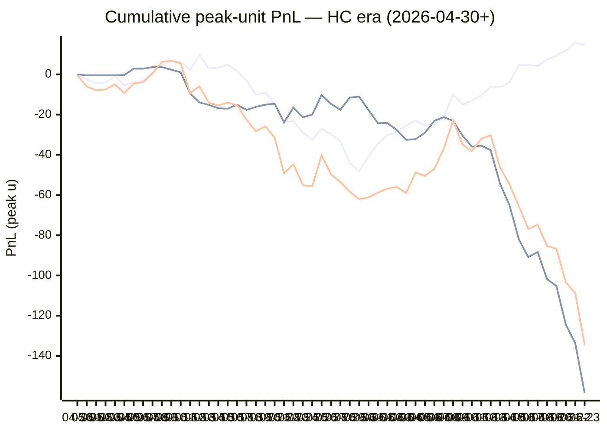

# Sharp Intel v6 — Daily Master Report

_Auto-generated **6/24/2026, 11:25:11 AM ET** by `scripts/dailyV6Report.js`. Do not edit by hand._

**Source of truth: this report mirrors the live Pick Performance dashboard.** Inclusion = `lockStage ≠ SHADOW ∧ ¬superseded ∧ health ∉ {MUTED, CANCELLED} ∧ peak.stars ≥ 2.5`. PnL is in **peak units** (the size shipped to users). HC margin / Δw / Δq are the **frozen** stamps written at last sync before the T-15 freeze. HC margin only existed from the v7.1 launch (**2026-04-30**); pre-launch picks have no HC value (no retro-fitting). Nothing is recomputed against today's whitelist.

v6 cutover: **2026-04-18** · whitelist source: live `sharpWalletProfiles` (290 profiles — drives §5 roster snapshot only) · quality cut: contribution ≥ 30 · HC = CONFIRMED tier ∧ sizeRatio ≥ 1.5.

---
## §1. Yesterday's picks

Slate: **2026-06-23** · 23 shipped sides.

| N | W-L-P | WR% | PnL (peak u) | PnL (flat 1u) |
|---|---|---|---|---|
| 23 | 9-14-0 | 39.1% | -25.75u | -5.96u |

| Sport | Market | Matchup | Pick | Stars · Units | HC | Δw | Δq | Σ | Odds | Result | PnL (peak u) |
|---|---|---|---|---|---|---|---|---|---|---|---|
| MLB | ML | Arizona Diamondbacks @ St. Louis Cardinals | St. Louis Cardinals | 3.0★ · 0.50u | +0 | +0 | +0 | +0 | -109 | L | -0.50u |
| MLB | ML | Atlanta Braves @ San Diego Padres | Atlanta Braves | 4.5★ · 3.00u | +0 | +2 | +4 | +6 | -108 | L | -3.00u |
| MLB | ML | Baltimore Orioles @ Los Angeles Angels | Baltimore Orioles | 4.5★ · 3.00u | +0 | +1 | +1 | +2 | -133 | L | -3.00u |
| MLB | ML | Boston Red Sox @ Colorado Rockies | Boston Red Sox | 3.0★ · 0.50u | +0 | +1 | +1 | +2 | -162 | **W** | +0.00u |
| MLB | ML | Houston Astros @ Toronto Blue Jays | Toronto Blue Jays | 2.5★ · 0.25u | +0 | +1 | +0 | +1 | -125 | L | -0.25u |
| MLB | ML | Los Angeles Dodgers @ Minnesota Twins | Los Angeles Dodgers | 4.5★ · 3.00u | +0 | +1 | +1 | +2 | -172 | **W** | +0.00u |
| MLB | ML | New York Yankees @ Detroit Tigers | Detroit Tigers | 5.0★ · 2.50u | +0 | +1 | -1 | +0 | +104 | L | -2.50u |
| MLB | ML | Athletics @ San Francisco Giants | Athletics | 4.0★ · 1.00u | +0 | +1 | -1 | +0 | +117 | L | -1.00u |
| MLB | ML | Texas Rangers @ Miami Marlins | Miami Marlins | 4.5★ · 1.00u | +0 | +2 | +1 | +3 | -153 | **W** | +0.00u |
| MLB | SPREAD | Arizona Diamondbacks @ St. Louis Cardinals | Arizona Diamondbacks | 5.0★ · 5.00u | +0 | +1 | +1 | +2 | -168 | **W** | +0.00u |
| MLB | SPREAD | Baltimore Orioles @ Los Angeles Angels | Baltimore Orioles | 3.0★ · 0.50u | +0 | +1 | +1 | +2 | +110 | L | -0.50u |
| MLB | SPREAD | Boston Red Sox @ Colorado Rockies | Colorado Rockies | 4.0★ · 1.00u | +0 | +0 | -1 | -1 | -107 | L | -1.00u |
| MLB | SPREAD | Milwaukee Brewers @ Cincinnati Reds | Milwaukee Brewers | 5.0★ · 2.50u | +0 | +1 | +0 | +1 | +132 | **W** | +0.00u |
| MLB | SPREAD | New York Yankees @ Detroit Tigers | New York Yankees | 5.0★ · 5.00u | +0 | +0 | +0 | +0 | -110 | L | -5.00u |
| MLB | SPREAD | Philadelphia Phillies @ Washington Nationals | Philadelphia Phillies | 2.5★ · 0.25u | +0 | +1 | +1 | +2 | +106 | **W** | +0.00u |
| MLB | SPREAD | Texas Rangers @ Miami Marlins | Miami Marlins | 3.0★ · 0.50u | +0 | +1 | +1 | +2 | +139 | **W** | +0.00u |
| MLB | TOTAL | Arizona Diamondbacks @ St. Louis Cardinals | Under 8.5 | 5.0★ · 5.00u | +0 | +0 | +0 | +0 | -110 | **W** | +0.00u |
| MLB | TOTAL | Chicago Cubs @ New York Mets | Under 8.5 | 5.0★ · 5.00u | +0 | +0 | +0 | +0 | -114 | L | -5.00u |
| MLB | TOTAL | Kansas City Royals @ Tampa Bay Rays | Under 7.5 | 5.0★ · 1.00u | +2 | +1 | +0 | +1 | -102 | L | -1.00u |
| MLB | TOTAL | Los Angeles Dodgers @ Minnesota Twins | Under 9 | 5.0★ · 1.00u | +0 | +2 | +2 | +4 | -109 | L | -1.00u |
| MLB | TOTAL | Milwaukee Brewers @ Cincinnati Reds | Over 9.5 | 4.0★ · 1.00u | +0 | +1 | +1 | +2 | -110 | L | -1.00u |
| MLB | TOTAL | Seattle Mariners @ Pittsburgh Pirates | Under 8.5 | 2.5★ · 0.25u | +0 | +0 | +0 | +0 | -110 | **W** | +0.00u |
| MLB | TOTAL | Texas Rangers @ Miami Marlins | Under 8.5 | 4.5★ · 1.00u | +0 | +1 | +1 | +2 | -110 | L | -1.00u |

---
## §2. 3-day / 7-day / all-time cohort rollups

Shipped picks only. PnL in **peak units** (size we actually bet) and flat 1u (cohort EV lens). All margins are the engine's frozen stamps (`v8_hcMargin`, `v8_walletConsensusDelta`, `v8_walletConsensusQualityMargin`).

**HC margin sub-tables** are scoped to picks dated ≥ 2026-04-30 (the v7.1 launch — when HC margin became a real engine signal). Pre-launch picks are excluded from HC analysis since the feature didn't exist for them. Δw / Δq sub-tables span the full v6-era sample (≥ 2026-04-18). Empty buckets are dropped.

### §2a. 3-day

Total: **58** shipped · 25-33-0 · WR 43.1% · PnL -47.77u (peak) / -10.07u (flat).

**By HC margin** _(picks dated ≥ 2026-04-30, N = 58)_

| Bucket | N | W-L-P | WR% | PnL (peak u) | PnL (flat 1u) |
|---|---|---|---|---|---|
| HC = +2 | 1 | 0-1-0 | 0.0% | -1.00u | -1.00u |
| HC = +1 | 3 | 3-0-0 | 100.0% | +6.37u | +2.84u |
| HC = 0 | 54 | 22-32-0 | 40.7% | -53.14u | -11.91u |

**By Δw (winner margin)**

| Bucket | N | W-L-P | WR% | PnL (peak u) | PnL (flat 1u) |
|---|---|---|---|---|---|
| ≥ +3 | 2 | 2-0-0 | 100.0% | +4.34u | +1.47u |
| +2 | 6 | 2-4-0 | 33.3% | -2.90u | -2.38u |
| +1 | 29 | 15-14-0 | 51.7% | -14.21u | -0.02u |
| 0 | 20 | 6-14-0 | 30.0% | -34.00u | -8.14u |
| −1 | 1 | 0-1-0 | 0.0% | -1.00u | -1.00u |

**By Δq (quality margin)**

| Bucket | N | W-L-P | WR% | PnL (peak u) | PnL (flat 1u) |
|---|---|---|---|---|---|
| ≥ +3 | 1 | 0-1-0 | 0.0% | -3.00u | -1.00u |
| +2 | 6 | 2-4-0 | 33.3% | -2.73u | -2.08u |
| +1 | 23 | 13-10-0 | 56.5% | -11.50u | +0.81u |
| 0 | 24 | 9-15-0 | 37.5% | -26.04u | -5.90u |
| −1 | 3 | 0-3-0 | 0.0% | -4.50u | -3.00u |
| ≤ −2 | 1 | 1-0-0 | 100.0% | +0.00u | +1.10u |

**By AGS tier** _(picks dated ≥ 2026-05-05, N = 58)_

| Bucket | N | W-L-P | WR% | PnL (peak u) | PnL (flat 1u) |
|---|---|---|---|---|---|
| NEUT   (0 .. +3) | 35 | 17-18-0 | 48.6% | -17.27u | -2.33u |
| WEAK   (−1 .. 0) | 23 | 8-15-0 | 34.8% | -30.50u | -7.75u |

### §2b. 7-day

Total: **112** shipped · 56-56-0 · WR 50.0% · PnL -68.94u (peak) / -6.80u (flat).

**By HC margin** _(picks dated ≥ 2026-04-30, N = 112)_

| Bucket | N | W-L-P | WR% | PnL (peak u) | PnL (flat 1u) |
|---|---|---|---|---|---|
| HC = +2 | 1 | 0-1-0 | 0.0% | -1.00u | -1.00u |
| HC = +1 | 8 | 7-1-0 | 87.5% | +11.05u | +5.26u |
| HC = 0 | 99 | 47-52-0 | 47.5% | -76.37u | -11.25u |
| HC ≤ −1 | 4 | 2-2-0 | 50.0% | -2.62u | +0.19u |

**By Δw (winner margin)**

| Bucket | N | W-L-P | WR% | PnL (peak u) | PnL (flat 1u) |
|---|---|---|---|---|---|
| ≥ +3 | 5 | 5-0-0 | 100.0% | +9.70u | +4.12u |
| +2 | 10 | 4-6-0 | 40.0% | -3.84u | -2.99u |
| +1 | 58 | 30-28-0 | 51.7% | -30.75u | -1.66u |
| 0 | 30 | 13-17-0 | 43.3% | -38.68u | -5.63u |
| −1 | 7 | 3-4-0 | 42.9% | -2.37u | -0.90u |
| ≤ −2 | 2 | 1-1-0 | 50.0% | -3.00u | +0.26u |

**By Δq (quality margin)**

| Bucket | N | W-L-P | WR% | PnL (peak u) | PnL (flat 1u) |
|---|---|---|---|---|---|
| ≥ +3 | 4 | 2-2-0 | 50.0% | -2.92u | -0.26u |
| +2 | 7 | 3-4-0 | 42.9% | -2.73u | -1.59u |
| +1 | 44 | 25-19-0 | 56.8% | -9.90u | +1.39u |
| 0 | 45 | 21-24-0 | 46.7% | -46.46u | -4.10u |
| −1 | 8 | 3-5-0 | 37.5% | -4.18u | -1.92u |
| ≤ −2 | 4 | 2-2-0 | 50.0% | -2.75u | -0.32u |

**By AGS tier** _(picks dated ≥ 2026-05-05, N = 112)_

| Bucket | N | W-L-P | WR% | PnL (peak u) | PnL (flat 1u) |
|---|---|---|---|---|---|
| NEUT   (0 .. +3) | 72 | 39-33-0 | 54.2% | -31.89u | +0.37u |
| WEAK   (−1 .. 0) | 40 | 17-23-0 | 42.5% | -37.05u | -7.17u |

### §2c. All-time

Total: **791** shipped · 397-386-8 · WR 50.7% · PnL -146.74u (peak) / -25.95u (flat).

**By HC margin** _(picks dated ≥ 2026-04-30, N = 680)_

| Bucket | N | W-L-P | WR% | PnL (peak u) | PnL (flat 1u) |
|---|---|---|---|---|---|
| HC ≥ +3 | 12 | 4-8-0 | 33.3% | -6.70u | -6.05u |
| HC = +2 | 33 | 17-16-0 | 51.5% | -1.13u | -0.38u |
| HC = +1 | 170 | 98-72-0 | 57.6% | +22.53u | +17.54u |
| HC = 0 | 434 | 210-217-7 | 49.2% | -158.42u | -32.65u |
| HC ≤ −1 | 30 | 17-13-0 | 56.7% | +7.58u | +4.39u |

**By Δw (winner margin)**

| Bucket | N | W-L-P | WR% | PnL (peak u) | PnL (flat 1u) |
|---|---|---|---|---|---|
| ≥ +3 | 114 | 57-57-0 | 50.0% | -15.73u | -0.94u |
| +2 | 147 | 71-75-1 | 48.6% | -38.01u | -9.45u |
| +1 | 312 | 166-143-3 | 53.7% | -52.87u | +4.50u |
| 0 | 170 | 84-83-3 | 50.3% | -26.11u | -8.75u |
| −1 | 34 | 12-21-1 | 36.4% | -11.72u | -9.90u |
| ≤ −2 | 8 | 3-5-0 | 37.5% | -6.29u | -2.25u |
| missing | 6 | 4-2-0 | 66.7% | +3.99u | +0.85u |

**By Δq (quality margin)**

| Bucket | N | W-L-P | WR% | PnL (peak u) | PnL (flat 1u) |
|---|---|---|---|---|---|
| ≥ +3 | 135 | 67-65-3 | 50.8% | -27.76u | -3.39u |
| +2 | 130 | 59-71-0 | 45.4% | -41.48u | -16.34u |
| +1 | 251 | 137-111-3 | 55.2% | +3.42u | +8.79u |
| 0 | 187 | 92-94-1 | 49.5% | -70.81u | -8.12u |
| −1 | 60 | 31-28-1 | 52.5% | +6.40u | +1.08u |
| ≤ −2 | 22 | 7-15-0 | 31.8% | -19.75u | -8.74u |
| missing | 6 | 4-2-0 | 66.7% | +3.24u | +0.77u |

**By AGS tier** _(picks dated ≥ 2026-05-05, N = 655)_

| Bucket | N | W-L-P | WR% | PnL (peak u) | PnL (flat 1u) |
|---|---|---|---|---|---|
| ELITE  (≥ +7) | 3 | 3-0-0 | 100.0% | +8.01u | +2.34u |
| LOCK   (+5 .. +7) | 9 | 5-4-0 | 55.6% | -2.93u | -0.47u |
| STRONG (+3 .. +5) | 23 | 13-10-0 | 56.5% | -6.91u | +1.77u |
| NEUT   (0 .. +3) | 405 | 209-194-2 | 51.9% | -80.94u | -10.78u |
| WEAK   (−1 .. 0) | 200 | 95-101-4 | 48.5% | -53.10u | -14.83u |
| FADE   (< −1) | 14 | 9-5-0 | 64.3% | +4.68u | +5.05u |
| missing | 1 | 1-0-0 | 100.0% | +1.63u | +0.96u |

---
## §3. Edge over time — is HC margin creating winners?

Daily cumulative peak-unit PnL since the HC margin launch (**2026-04-30**). The `HC ≥ +1` line is the golden-standard cohort. The `HC = 0` line is the no-HC-signal control. The `All shipped (HC era)` line is every shipped pick from the same date range — the apples-to-apples baseline. Watch the spread.

Daily cumulative table (peak units, HC era only):

| Date | HC ≥ +1 (cum) | HC = 0 (cum) | All shipped (cum) |
|---|---|---|---|
| 2026-04-30 | -0.48u | +0.00u | -0.48u |
| 2026-05-01 | -2.48u | -0.50u | -5.98u |
| 2026-05-02 | -4.41u | -0.50u | -7.91u |
| 2026-05-03 | -3.94u | -0.50u | -7.44u |
| 2026-05-04 | -0.95u | -0.50u | -4.95u |
| 2026-05-05 | -5.45u | -0.34u | -9.29u |
| 2026-05-06 | -3.86u | +2.84u | -4.52u |
| 2026-05-07 | -3.18u | +2.84u | -3.84u |
| 2026-05-08 | +0.54u | +3.60u | +0.64u |
| 2026-05-09 | +4.41u | +3.60u | +6.14u |
| 2026-05-10 | +6.41u | +2.32u | +6.86u |
| 2026-05-11 | +6.25u | +1.05u | +5.43u |
| 2026-05-12 | +2.11u | -9.45u | -9.21u |
| 2026-05-13 | +9.78u | -13.95u | -6.04u |
| 2026-05-14 | +3.00u | -15.20u | -14.07u |
| 2026-05-15 | +3.27u | -16.83u | -15.43u |
| 2026-05-16 | +4.90u | -17.05u | -14.02u |
| 2026-05-17 | +1.62u | -15.11u | -15.36u |
| 2026-05-18 | -2.98u | -17.67u | -22.52u |
| 2026-05-19 | -10.18u | -16.17u | -28.22u |
| 2026-05-20 | -8.90u | -15.07u | -25.84u |
| 2026-05-21 | -14.92u | -14.58u | -31.37u |
| 2026-05-22 | -23.44u | -23.93u | -49.24u |
| 2026-05-23 | -23.30u | -16.53u | -44.70u |
| 2026-05-24 | -28.89u | -21.34u | -55.10u |
| 2026-05-25 | -32.63u | -20.03u | -55.65u |
| 2026-05-26 | -26.98u | -10.27u | -40.24u |
| 2026-05-27 | -29.77u | -14.68u | -49.69u |
| 2026-05-28 | -33.27u | -17.58u | -53.57u |
| 2026-05-29 | -44.12u | -11.51u | -58.35u |
| 2026-05-30 | -48.21u | -11.10u | -62.03u |
| 2026-05-31 | -40.65u | -17.79u | -61.16u |
| 2026-06-01 | -34.49u | -24.29u | -58.77u |
| 2026-06-02 | -30.14u | -24.19u | -56.82u |
| 2026-06-03 | -28.48u | -27.68u | -56.00u |
| 2026-06-04 | -25.53u | -32.54u | -58.91u |
| 2026-06-05 | -22.94u | -32.20u | -48.76u |
| 2026-06-06 | -25.33u | -29.06u | -50.51u |
| 2026-06-07 | -24.75u | -23.09u | -46.96u |
| 2026-06-08 | -21.34u | -21.30u | -36.94u |
| 2026-06-09 | -10.19u | -23.13u | -22.86u |
| 2026-06-10 | -14.95u | -30.43u | -34.92u |
| 2026-06-11 | -13.13u | -35.94u | -38.09u |
| 2026-06-12 | -10.30u | -35.44u | -32.03u |
| 2026-06-13 | -6.20u | -37.73u | -30.22u |
| 2026-06-14 | -6.21u | -54.41u | -46.29u |
| 2026-06-15 | -4.00u | -65.05u | -54.72u |
| 2026-06-16 | +4.65u | -82.05u | -65.57u |
| 2026-06-17 | +4.65u | -90.84u | -76.86u |
| 2026-06-18 | +4.23u | -88.33u | -74.77u |
| 2026-06-19 | +7.31u | -101.79u | -85.27u |
| 2026-06-20 | +9.33u | -105.28u | -86.74u |
| 2026-06-21 | +11.85u | -124.42u | -103.36u |
| 2026-06-22 | +15.70u | -133.67u | -108.76u |
| 2026-06-23 | +14.70u | -158.42u | -134.51u |

---
## §4. Wallet roster growth & profitability

"Tracked in sport X" = a wallet has placed **≥ 2 bets** in X within the v6-era sample. "Profitable" = cumulative flat PnL > 0. Source: `v8Scoring.walletDetails` on every graded v6-era game (every side, not just the shipped set).

### §4a. Per-sport wallet snapshot

| Sport | Total wallets seen | Tracked (≥2) | Profitable | % prof | WR ≥ 50% | WR ≥ 60% | WR ≥ 70% |
|---|---|---|---|---|---|---|---|
| MLB | 85 | 64 | 20 | 31% | 31 | 10 | 2 |
| NBA | 138 | 108 | 44 | 41% | 60 | 29 | 11 |
| NHL | 60 | 43 | 12 | 28% | 24 | 12 | 6 |
| **ALL (any sport)** | **176** | **140** | **60** | **43%** | **75** | **29** | **8** |

### §4b. Daily roster growth (cumulative through each date)

Format: `tracked (profitable)`. For each date D, recompute the roster using every bet up to and including D.

| Date | ALL | MLB | NBA | NHL |
|---|---|---|---|---|
| 2026-04-18 | 5 (2) | 2 (2) | 3 (0) | 0 (0) |
| 2026-04-19 | 19 (8) | 5 (3) | 9 (3) | 3 (1) |
| 2026-04-20 | 29 (12) | 7 (6) | 23 (8) | 5 (2) |
| 2026-04-21 | 44 (21) | 10 (6) | 31 (10) | 7 (5) |
| 2026-04-22 | 52 (28) | 12 (6) | 39 (15) | 11 (10) |
| 2026-04-23 | 56 (29) | 13 (6) | 46 (21) | 13 (10) |
| 2026-04-24 | 61 (30) | 14 (6) | 51 (23) | 14 (9) |
| 2026-04-25 | 65 (29) | 16 (8) | 54 (22) | 16 (9) |
| 2026-04-26 | 67 (31) | 18 (5) | 56 (25) | 17 (9) |
| 2026-04-27 | 72 (32) | 20 (7) | 60 (24) | 17 (9) |
| 2026-04-28 | 76 (33) | 21 (7) | 63 (26) | 23 (10) |
| 2026-04-29 | 77 (33) | 21 (7) | 64 (25) | 23 (10) |
| 2026-04-30 | 81 (34) | 21 (7) | 70 (27) | 23 (10) |
| 2026-05-01 | 85 (38) | 22 (5) | 74 (30) | 26 (13) |
| 2026-05-02 | 86 (37) | 23 (7) | 75 (32) | 26 (12) |
| 2026-05-03 | 86 (38) | 24 (8) | 75 (33) | 26 (12) |
| 2026-05-04 | 90 (38) | 24 (9) | 76 (32) | 26 (12) |
| 2026-05-05 | 91 (40) | 24 (9) | 79 (33) | 26 (12) |
| 2026-05-06 | 92 (40) | 24 (9) | 80 (33) | 26 (12) |
| 2026-05-07 | 92 (41) | 24 (9) | 80 (33) | 26 (12) |
| 2026-05-08 | 92 (40) | 24 (8) | 80 (32) | 26 (11) |
| 2026-05-09 | 94 (42) | 24 (8) | 82 (35) | 26 (11) |
| 2026-05-10 | 94 (42) | 24 (8) | 82 (35) | 26 (11) |
| 2026-05-11 | 96 (42) | 24 (8) | 84 (36) | 26 (11) |
| 2026-05-12 | 100 (41) | 27 (9) | 86 (37) | 26 (11) |
| 2026-05-13 | 102 (45) | 29 (11) | 88 (37) | 26 (11) |
| 2026-05-14 | 102 (41) | 29 (11) | 88 (37) | 28 (12) |
| 2026-05-15 | 103 (41) | 30 (10) | 88 (39) | 28 (12) |
| 2026-05-16 | 105 (43) | 31 (12) | 88 (39) | 30 (14) |
| 2026-05-17 | 105 (46) | 32 (11) | 88 (40) | 30 (14) |
| 2026-05-18 | 105 (46) | 32 (10) | 88 (38) | 31 (15) |
| 2026-05-19 | 105 (46) | 32 (12) | 88 (38) | 31 (15) |
| 2026-05-20 | 106 (48) | 33 (12) | 88 (38) | 31 (16) |
| 2026-05-21 | 106 (45) | 34 (12) | 88 (37) | 31 (14) |
| 2026-05-22 | 106 (44) | 34 (10) | 88 (39) | 33 (16) |
| 2026-05-23 | 111 (49) | 36 (10) | 90 (40) | 36 (19) |
| 2026-05-24 | 117 (52) | 37 (12) | 94 (39) | 37 (16) |
| 2026-05-25 | 120 (53) | 38 (13) | 95 (40) | 38 (16) |
| 2026-05-26 | 122 (55) | 39 (14) | 97 (42) | 38 (16) |
| 2026-05-27 | 123 (51) | 40 (12) | 97 (42) | 40 (14) |
| 2026-05-28 | 124 (51) | 40 (12) | 99 (42) | 40 (14) |
| 2026-05-29 | 125 (50) | 41 (12) | 99 (42) | 41 (12) |
| 2026-05-30 | 126 (49) | 41 (12) | 101 (43) | 41 (12) |
| 2026-05-31 | 126 (48) | 41 (11) | 101 (43) | 41 (12) |
| 2026-06-01 | 129 (52) | 44 (14) | 101 (43) | 41 (12) |
| 2026-06-02 | 130 (56) | 45 (16) | 101 (43) | 41 (13) |
| 2026-06-03 | 132 (56) | 45 (14) | 102 (43) | 41 (13) |
| 2026-06-04 | 132 (57) | 46 (14) | 102 (43) | 41 (14) |
| 2026-06-05 | 132 (57) | 48 (15) | 102 (43) | 41 (14) |
| 2026-06-06 | 132 (57) | 49 (15) | 102 (43) | 41 (14) |
| 2026-06-07 | 133 (56) | 52 (16) | 102 (43) | 41 (14) |
| 2026-06-08 | 135 (55) | 53 (16) | 103 (44) | 41 (14) |
| 2026-06-09 | 135 (55) | 53 (15) | 103 (44) | 41 (14) |
| 2026-06-10 | 135 (56) | 53 (15) | 105 (45) | 41 (14) |
| 2026-06-11 | 135 (54) | 54 (16) | 105 (45) | 42 (13) |
| 2026-06-12 | 135 (56) | 55 (17) | 105 (45) | 42 (13) |
| 2026-06-13 | 136 (56) | 57 (17) | 108 (44) | 42 (13) |
| 2026-06-14 | 136 (55) | 57 (18) | 108 (44) | 43 (12) |
| 2026-06-15 | 136 (56) | 57 (19) | 108 (44) | 43 (12) |
| 2026-06-16 | 137 (56) | 58 (20) | 108 (44) | 43 (12) |
| 2026-06-17 | 137 (57) | 58 (19) | 108 (44) | 43 (12) |
| 2026-06-18 | 137 (58) | 58 (20) | 108 (44) | 43 (12) |
| 2026-06-19 | 137 (58) | 58 (20) | 108 (44) | 43 (12) |
| 2026-06-20 | 137 (58) | 60 (19) | 108 (44) | 43 (12) |
| 2026-06-21 | 137 (58) | 60 (19) | 108 (44) | 43 (12) |
| 2026-06-22 | 138 (59) | 61 (20) | 108 (44) | 43 (12) |
| 2026-06-23 | 140 (60) | 64 (20) | 108 (44) | 43 (12) |

### §4c. Top 10 profitable wallets by sport

#### MLB

| # | Wallet | N | W | L | WR% | Flat PnL (u) | Flat ROI | $ PnL |
|---|---|---|---|---|---|---|---|---|
| 1 | e05213 | 15 | 11 | 4 | 73.3% | +6.08 | +40.5% | $278.1K |
| 2 | ad88a3 | 15 | 11 | 4 | 73.3% | +4.94 | +32.9% | $9.6K |
| 3 | 913987 | 44 | 30 | 14 | 68.2% | +14.19 | +32.2% | $666.8K |
| 4 | 468c33 | 3 | 2 | 1 | 66.7% | +0.85 | +28.5% | $45.8K |
| 5 | dfa240 | 3 | 2 | 1 | 66.7% | +0.85 | +28.3% | $2.5K |
| 6 | c668b3 | 17 | 11 | 6 | 64.7% | +4.12 | +24.2% | $622 |
| 7 | f2d227 | 33 | 21 | 12 | 63.6% | +7.77 | +23.5% | $78.8K |
| 8 | c9bba3 | 6 | 4 | 2 | 66.7% | +1.37 | +22.8% | -$17.7K |
| 9 | 981187 | 8 | 5 | 3 | 62.5% | +1.65 | +20.7% | $13.5K |
| 10 | 95618e | 3 | 2 | 1 | 66.7% | +0.61 | +20.3% | $5.8K |

#### NBA

| # | Wallet | N | W | L | WR% | Flat PnL (u) | Flat ROI | $ PnL |
|---|---|---|---|---|---|---|---|---|
| 1 | 799fad | 2 | 2 | 0 | 100.0% | +5.66 | +283.0% | $241.7K |
| 2 | a0d6d2 | 4 | 4 | 0 | 100.0% | +4.51 | +112.7% | $6.4K |
| 3 | 12ad50 | 3 | 3 | 0 | 100.0% | +2.74 | +91.3% | $45.5K |
| 4 | b51a56 | 6 | 5 | 1 | 83.3% | +5.44 | +90.7% | $74.4K |
| 5 | 11b032 | 7 | 6 | 1 | 85.7% | +5.40 | +77.1% | $249.9K |
| 6 | 12c933 | 2 | 2 | 0 | 100.0% | +1.28 | +63.9% | $11.5K |
| 7 | a1684d | 10 | 9 | 1 | 90.0% | +5.24 | +52.4% | $11.2K |
| 8 | 7f00bc | 21 | 14 | 7 | 66.7% | +9.80 | +46.7% | $14.7K |
| 9 | 92df91 | 23 | 16 | 7 | 69.6% | +10.26 | +44.6% | -$214 |
| 10 | 8ec926 | 8 | 6 | 2 | 75.0% | +3.53 | +44.1% | -$681 |

#### NHL

| # | Wallet | N | W | L | WR% | Flat PnL (u) | Flat ROI | $ PnL |
|---|---|---|---|---|---|---|---|---|
| 1 | 8366f5 | 2 | 2 | 0 | 100.0% | +2.30 | +114.9% | $107.6K |
| 2 | 799fad | 2 | 2 | 0 | 100.0% | +1.88 | +94.1% | $46.9K |
| 3 | fec67e | 4 | 3 | 1 | 75.0% | +2.82 | +70.5% | $12.5K |
| 4 | 30935c | 4 | 3 | 1 | 75.0% | +2.11 | +52.7% | $953 |
| 5 | 981187 | 8 | 6 | 2 | 75.0% | +3.52 | +44.0% | -$25.2K |
| 6 | fcc12b | 11 | 8 | 3 | 72.7% | +4.45 | +40.5% | -$27.5K |
| 7 | bc3532 | 22 | 14 | 8 | 63.6% | +7.85 | +35.7% | $70.3K |
| 8 | e70853 | 9 | 6 | 3 | 66.7% | +2.66 | +29.5% | -$11.1K |
| 9 | 4d2125 | 17 | 11 | 6 | 64.7% | +4.26 | +25.1% | $80.3K |
| 10 | dfa240 | 28 | 18 | 10 | 64.3% | +6.46 | +23.1% | $19.0K |

---
## §5. Proven-wallet roster growth & HC tracking

"Proven wallet" = whitelist tier `CONFIRMED` or `FLAT` in the same sense the live engine uses (`exportWalletProfiles.js` → `sharpWalletProfiles.bySport`). Sports inherit independent rosters: a wallet can be CONFIRMED in NBA and absent from NHL. `walletBets` come from `v8Scoring.walletDetails` on every graded v6-era pick (Source A); `positionRows` come from `sharp_action_positions` (Source B).

### §5a. Current proven-winner roster (snapshot)

Roster as of **2026-06-23** — wallets with ≥2 bets in the sport.

| Sport | Wallets seen | Eligible (≥2) | CONFIRMED | FLAT | Proven (C+F) | WR50 only | Conv % |
|---|---|---|---|---|---|---|---|
| MLB | 134 | 64 | 13 | 7 | **20** | 11 | 14.9% |
| NBA | 210 | 108 | 29 | 15 | **44** | 21 | 21.0% |
| NHL | 105 | 43 | 9 | 3 | **12** | 12 | 11.4% |
| **ALL** | **—** | **—** | **—** | **—** | **76** | **—** | **—** |

### §5b. Live whitelist drift check

Live `sharpWalletProfiles` is what the engine reads at lock time. Drift between script reconstruction (above) and live should be ≤ 1 day of position data — otherwise `exportWalletProfiles.js` is stale.

| Sport | CONFIRMED (live · script) | FLAT (live · script) | WR50 (live · script) | Drift |
|---|---|---|---|---|
| MLB | 36 · 13 | 17 · 7 | 6 · 11 | +33 live |
| NBA | 58 · 29 | 25 · 15 | 23 · 21 | +39 live |
| NHL | 23 · 9 | 6 · 3 | 16 · 12 | +17 live |

### §5c. Roster growth — 3d / 7d / 30d / all-time deltas

Each cell is **net growth** in proven (CONFIRMED + FLAT) wallets in that window, with the absolute count at the start (`+Δ from N`). Negative = wallets demoted. Window endpoint = 2026-06-23.

| Sport | 3-day | 7-day | 30-day | All-time (since cutover) |
|---|---|---|---|---|
| MLB | +1 from 19 | +0 from 20 | +8 from 12 | +20 from 0 |
| NBA | +0 from 44 | +0 from 44 | +5 from 39 | +44 from 0 |
| NHL | +0 from 12 | +0 from 12 | -4 from 16 | +12 from 0 |

A flat 7-day delta on a sport with healthy slate density = either the bubble pipeline has stalled (no wallets approaching the bar) or our cohort has saturated. Check §13d for the funnel diagnostic.

### §5d. Pipeline funnel — where each sport leaks

Wallets surviving each gate, in order. The biggest %-drop tells you the bottleneck. Gates:

1. **Seen** — placed ≥ 1 bet in the sport (any source)
2. **Eligible** — ≥ 2 graded picks in Source A (required for FLAT/CONFIRMED)
3. **Flat-OK** — eligible AND flat ROI > 0 (becomes FLAT or better)
4. **$-OK** — Flat-OK AND ≥2 positions with dollar ROI > 0 (CONFIRMED)
5. **Promoted** — final whitelisted = CONFIRMED + FLAT

| Sport | 1·Seen | 2·Eligible (% of Seen) | 3·Flat-OK (% of Elig) | 4·$-OK (% of Flat) | 5·Promoted | Bottleneck |
|---|---|---|---|---|---|---|
| MLB | 134 | 64 (48%) | 20 (31%) | 13 (65%) | **20** | edge (Eligible→Flat-OK) 69% |
| NBA | 210 | 108 (51%) | 44 (41%) | 29 (66%) | **44** | edge (Eligible→Flat-OK) 59% |
| NHL | 105 | 43 (41%) | 12 (28%) | 9 (75%) | **12** | edge (Eligible→Flat-OK) 72% |

### §5e. HC backing density (the fuel for v7.3 HC margin)

Every v7.x promotion is gated on `HC_m ≥ +1`, which requires at least one CONFIRMED wallet sized at `≥ 1.5×` average on the for-side. This table shows the share of shipped picks that *had any HC backing*, by sport, in each window. If HC density falls toward zero in a sport, the v7.3 floor cohorts (Σ=1, Σ=2 locks; HC rescues) will simply stop firing there.

| Sport | Window | Picks (with HC stamp) | Any HC for-side | HC_m ≥ +1 | HC_m ≥ +2 |
|---|---|---|---|---|---|
| MLB | 3-day | 58 | 4 (6.9%) | 4 (6.9%) | 1 (1.7%) |
| MLB | 7-day | 112 | 11 (9.8%) | 9 (8.0%) | 1 (0.9%) |
| MLB | All-time | 610 | 171 (28.0%) | 156 (25.6%) | 19 (3.1%) |
| NBA | 3-day | 0 | 0 (—) | 0 (—) | 0 (—) |
| NBA | 7-day | 0 | 0 (—) | 0 (—) | 0 (—) |
| NBA | All-time | 126 | 83 (65.9%) | 69 (54.8%) | 34 (27.0%) |
| NHL | 3-day | 0 | 0 (—) | 0 (—) | 0 (—) |
| NHL | 7-day | 0 | 0 (—) | 0 (—) | 0 (—) |
| NHL | All-time | 49 | 21 (42.9%) | 20 (40.8%) | 5 (10.2%) |

Pooled across sports:

| Window | Picks (with HC stamp) | Any HC for-side | HC_m ≥ +1 | HC_m ≥ +2 |
|---|---|---|---|---|
| 3-day | 58 | 4 (6.9%) | 4 (6.9%) | 1 (1.7%) |
| 7-day | 112 | 11 (9.8%) | 9 (8.0%) | 1 (0.9%) |
| All-time | 785 | 275 (35.0%) | 245 (31.2%) | 58 (7.4%) |

### §5f. Bubble wallets — next-up graduations

Wallets currently NOT promoted but close. Two flavors:

- **One-bet-away** — won the only bet, needs one more positive bet to clear ≥2.
- **Just-under** — has ≥2 bets but flat ROI is between −10% and 0% (one win flips them).

#### MLB

**One-bet-away** (6)

| wallet | picksN | flat PnL | pos N | pos $ROI |
|---|---|---|---|---|
| `...be17` | 1 | +6.95 | 23 | -60% |
| `...020b` | 1 | +1.25 | 12 | -41% |
| `...be00` | 1 | +0.87 | 15 | 10% |
| `...9373` | 1 | +0.87 | 0 | — |
| `...9b3c` | 1 | +0.77 | 8 | 52% |
| `...8d26` | 1 | +0.72 | 5 | -22% |

**Just-under** (6)

| wallet | picksN | WR | flat ROI | pos N | pos $ROI |
|---|---|---|---|---|---|
| `...1f30` | 49 | 49% | -0.3% | 76 | 15% |
| `...afd2` | 41 | 51% | -0.5% | 177 | -20% |
| `...fc26` | 4 | 50% | -0.5% | 39 | 25% |
| `...135d` | 352 | 52% | -1.0% | 375 | 7% |
| `...b33b` | 4 | 50% | -2.0% | 33 | -3% |
| `...2f63` | 145 | 50% | -2.0% | 1130 | -5% |

#### NBA

**One-bet-away** (6)

| wallet | picksN | flat PnL | pos N | pos $ROI |
|---|---|---|---|---|
| `...bf5d` | 1 | +3.15 | 3 | 42% |
| `...ed41` | 1 | +3.15 | 3 | 3% |
| `...6b87` | 1 | +2.05 | 8 | -27% |
| `...c556` | 1 | +0.93 | 3 | 42% |
| `...5c69` | 1 | +0.91 | 2 | 28% |
| `...b989` | 1 | +0.88 | 21 | -90% |

**Just-under** (6)

| wallet | picksN | WR | flat ROI | pos N | pos $ROI |
|---|---|---|---|---|---|
| `...d814` | 8 | 50% | -0.5% | 53 | 1% |
| `...1e50` | 4 | 50% | -1.2% | 29 | 46% |
| `...65dd` | 6 | 50% | -2.4% | 17 | 27% |
| `...853d` | 40 | 53% | -2.7% | 90 | -2% |
| `...1697` | 17 | 53% | -3.5% | 34 | 9% |
| `...11a4` | 20 | 45% | -3.6% | 72 | 54% |

#### NHL

**One-bet-away** (6)

| wallet | picksN | flat PnL | pos N | pos $ROI |
|---|---|---|---|---|
| `...2e78` | 1 | +1.46 | 0 | — |
| `...017f` | 1 | +1.45 | 6 | 108% |
| `...32f2` | 1 | +1.40 | 0 | — |
| `...e0fd` | 1 | +1.20 | 3 | 124% |
| `...266e` | 1 | +1.05 | 0 | — |
| `...2194` | 1 | +1.05 | 0 | — |

**Just-under** (6)

| wallet | picksN | WR | flat ROI | pos N | pos $ROI |
|---|---|---|---|---|---|
| `...33ee` | 4 | 50% | -0.3% | 8 | -23% |
| `...df91` | 14 | 50% | -1.6% | 49 | -36% |
| `...afd2` | 6 | 50% | -1.9% | 26 | -17% |
| `...192c` | 7 | 43% | -2.9% | 21 | -15% |
| `...35e3` | 7 | 57% | -5.5% | 26 | 31% |
| `...618e` | 2 | 50% | -6.1% | 28 | 24% |

### §5g. v2 wallet-promotion pipeline (Source-A / Source-B mix)

Live snapshot of the v2 promotion gate (shipped 2026-05-10, re-eval **2026-05-24**). Each FLAT-or-better wallet × sport pair is attributed to one of three paths via `sharpWalletProfiles[wallet].bySport[sport].whitelistSource`:

- **A** — flat-positive on featured picks (Source A) only — the v1 gate
- **A+B** — flat-positive in both sources (most reliable signal)
- **B** — flat-positive on-chain only (NEW in v2 — the trial lift)

Re-classified every 2h via `grade-sharp-actions` cron. Roll-back: set `B_ONLY_MIN_BETS = Infinity` in `scripts/exportWalletProfiles.js`.

#### Source mix per sport (live Firestore)

| Sport | A | A+B | B (new) | FLAT-or-better total | % from B-only |
|---|---|---|---|---|---|
| MLB | 9 | 15 | **29** | 53 | 54.7% |
| NBA | 10 | 34 | **39** | 83 | 47.0% |
| NHL | 4 | 8 | **17** | 29 | 58.6% |
| **ALL** | **23** | **57** | **85** | **165** | **51.5%** |

#### Pipeline freshness

- `sharp_action_positions` GRADED rows: **16658**
- `sharp_action_positions` PENDING rows: **408** (queued for next Grade Sharp Actions run)
- Latest `sharpWalletProfiles` rebuild: 6/24/2026, 6:19:55 AM ET — **305 min · STALE** — check grade-sharp-actions workflow

**Alarms**: pending > 200 OR rebuild lag > 4h → cron is lagging or failing — check `gh run list --workflow="Grade Sharp Actions"`.

#### B-only roster — wallets currently promoted via Source B path only

Wallets here would have been EXCLUDED under v1 (Source-A-only). Top by Source-B bet count per sport. The 2-week re-eval (2026-05-24) will compare these wallets' realized lift against A-only and A+B cohorts.

**MLB** — 29 wallets promoted via B

| wallet | tier | B_n | B_flat ROI | B_$ ROI |
|---|---|---|---|---|
| `...9a27` | CONFIRMED | 467 | +12.3% | +4.4% |
| `...135d` | CONFIRMED | 375 | +2.1% | +6.8% |
| `...1e50` | FLAT | 324 | +0.8% | -0.4% |
| `...3532` | CONFIRMED | 324 | +1.6% | +6% |
| `...1eae` | FLAT | 147 | +3.1% | -1.4% |
| `...c684` | FLAT | 85 | +6.6% | -2.2% |
| `...1f30` | CONFIRMED | 76 | +5% | +15% |
| `...69c2` | CONFIRMED | 66 | +17.4% | +1% |
| `...ad50` | CONFIRMED | 53 | +14.4% | +7.7% |
| `...fc26` | CONFIRMED | 39 | +13.3% | +25.3% |
| … | 19 more | | | |

**NBA** — 39 wallets promoted via B

| wallet | tier | B_n | B_flat ROI | B_$ ROI |
|---|---|---|---|---|
| `...cff6` | CONFIRMED | 112 | +3.2% | +31.8% |
| `...135d` | FLAT | 104 | +5% | -10.6% |
| `...11a4` | CONFIRMED | 72 | +23.3% | +54.4% |
| `...3782` | CONFIRMED | 70 | +2.3% | +0.4% |
| `...9d74` | FLAT | 50 | +2.3% | -14.4% |
| `...935c` | FLAT | 50 | +17.3% | -21.4% |
| `...68b3` | CONFIRMED | 44 | +33.9% | +13.9% |
| `...b6ef` | CONFIRMED | 42 | +6.3% | +3.3% |
| `...e2ce` | CONFIRMED | 40 | +15.2% | +22.9% |
| `...0563` | CONFIRMED | 37 | +4.9% | +41.7% |
| … | 29 more | | | |

**NHL** — 17 wallets promoted via B

| wallet | tier | B_n | B_flat ROI | B_$ ROI |
|---|---|---|---|---|
| `...1697` | CONFIRMED | 52 | +8.5% | +7.1% |
| `...618e` | CONFIRMED | 28 | +6.2% | +23.8% |
| `...35e3` | CONFIRMED | 26 | +10.6% | +31.5% |
| `...5eee` | CONFIRMED | 23 | +30.5% | +19.3% |
| `...192c` | FLAT | 21 | +14% | -15.2% |
| `...0c2e` | FLAT | 17 | +24.3% | -7% |
| `...2ca8` | CONFIRMED | 10 | +26.9% | +14% |
| `...600d` | CONFIRMED | 9 | +69% | +75.8% |
| `...a9cc` | CONFIRMED | 7 | +49.5% | +46.9% |
| `...aeea` | CONFIRMED | 7 | +90.8% | +87.7% |
| … | 7 more | | | |

### §5 — How to read

- **Roster growth flat in 7-day** + **funnel bottleneck = `data`** → re-run `exportWalletProfiles.js`. The flat-positive wallets are stuck at FLAT because Source-B coverage hasn't caught up. CONFIRMED gate is data-bound, not skill-bound.
- **Roster growth flat in 7-day** + **funnel bottleneck = `sample`** → wallets aren't reaching `≥2` reps fast enough. This is a slate-density problem; consider a soft `MIN_BETS = 1` shadow lane to surface bubble wallets earlier.
- **Roster shrank** (negative delta) → a previously CONFIRMED wallet just dropped flat-positive (lost a recent bet). Variance, not failure — but worth noting if a sport loses ≥3 in a week.
- **HC density on a sport drops below ~30%** → v7.3 promotions there will starve. Either the proven roster needs more CONFIRMED-tier wallets sizing aggressively, or the HC_RATIO (1.5) needs a sport-specific tune.
- **§5g B-only count drops sharply** → wallets are demoting off the B path (losing on-chain). Cross-check `WALLET_PROFILES_SUMMARY.md` churn section for the specific demotions.
- **§5g pipeline freshness lag > 4h** → grade-sharp-actions cron is failing. Check `gh run list --workflow="Grade Sharp Actions"` and re-trigger if needed.

---
## §6. Daily proven-wallet performance

Who on the proven roster is actually printing — yesterday's bets, the rolling leaderboard (`$ PnL`-ranked), current streaks, and per-sport volume. **Proven** = `CONFIRMED` ∪ `FLAT` per sport (the same gate that drives Δ_winner). A wallet only counts in a sport where it's on that sport's proven list.

### §6a. Yesterday's proven-wallet bets

Slate: **2026-06-23** · 23 bets · 7 distinct proven wallets · WR 57% · $ vol $280.6K · $ PnL -$96.6K.

| Wallet | Sport | Market | Game | $ size | Result | $ PnL |
|---|---|---|---|---|---|---|
| `...abaf` (CONFIRMED) | MLB | SPREAD | Philadelphia Phillies @ Washington Nationals | $32.5K | **W** | $31.0K |
| `...64aa` (CONFIRMED) | MLB | ML | Cleveland Guardians @ Chicago White Sox | $19.2K | **W** | $19.0K |
| `...23c4` (FLAT) | MLB | ML | Cleveland Guardians @ Chicago White Sox | $9.6K | **W** | $9.5K |
| `...d227` (CONFIRMED) | MLB | SPREAD | Arizona Diamondbacks @ St. Louis Cardinals | $11.2K | **W** | $6.7K |
| `...0ff5` (FLAT) | MLB | ML | Baltimore Orioles @ Los Angeles Angels | $4.1K | **W** | $4.9K |
| `...8f33` (CONFIRMED) | MLB | ML | Houston Astros @ Toronto Blue Jays | $5.6K | **W** | $4.5K |
| `...8f33` (CONFIRMED) | MLB | SPREAD | Texas Rangers @ Miami Marlins | $2.1K | **W** | $2.9K |
| `...8f33` (CONFIRMED) | MLB | SPREAD | Boston Red Sox @ Colorado Rockies | $3.2K | **W** | $2.9K |
| `...8f33` (CONFIRMED) | MLB | ML | Boston Red Sox @ Colorado Rockies | $4.2K | **W** | $2.6K |
| `...8f33` (CONFIRMED) | MLB | ML | Texas Rangers @ Miami Marlins | $2.8K | **W** | $1.8K |
| `...8f33` (CONFIRMED) | MLB | SPREAD | Philadelphia Phillies @ Washington Nationals | $867 | **W** | $826 |
| `...618e` (CONFIRMED) | MLB | SPREAD | Philadelphia Phillies @ Washington Nationals | $711 | **W** | $677 |
| `...8f33` (CONFIRMED) | MLB | TOTAL | Kansas City Royals @ Tampa Bay Rays | $341 | **W** | $334 |
| `...d227` (CONFIRMED) | MLB | SPREAD | New York Yankees @ Detroit Tigers | $3.1K | L | -$3.1K |
| `...8f33` (CONFIRMED) | MLB | SPREAD | Baltimore Orioles @ Los Angeles Angels | $3.1K | L | -$3.1K |
| `...8f33` (CONFIRMED) | MLB | ML | Baltimore Orioles @ Los Angeles Angels | $4.1K | L | -$4.1K |
| `...8f33` (CONFIRMED) | MLB | TOTAL | Milwaukee Brewers @ Cincinnati Reds | $6.4K | L | -$6.4K |
| `...8f33` (CONFIRMED) | MLB | TOTAL | Seattle Mariners @ Pittsburgh Pirates | $7.1K | L | -$7.1K |
| `...64aa` (CONFIRMED) | MLB | ML | Arizona Diamondbacks @ St. Louis Cardinals | $12.0K | L | -$12.0K |
| `...64aa` (CONFIRMED) | MLB | ML | Houston Astros @ Toronto Blue Jays | $21.4K | L | -$21.4K |
| `...abaf` (CONFIRMED) | MLB | SPREAD | Seattle Mariners @ Pittsburgh Pirates | $26.6K | L | -$26.6K |
| `...64aa` (CONFIRMED) | MLB | ML | Athletics @ San Francisco Giants | $35.3K | L | -$35.3K |
| `...abaf` (CONFIRMED) | MLB | ML | Cleveland Guardians @ Chicago White Sox | $65.1K | L | -$65.1K |

### §6b. Proven-wallet leaderboard

Top 15 proven `(wallet × sport)` pairs per sport per horizon, ranked by **$ PnL** (the dollar-ROI lens). The 3-day board is the "who's on form right now" lens; the 7-day filters single-day variance; all-time is the proven-roster reference.

#### §6b-1. 3-day

**MLB** — 12 active proven wallets

| # | Wallet | Tier | Bets | WR% | Bets/day | Flat PnL (u) | Flat ROI | $ vol | $ PnL | $ ROI | Streak |
|---|---|---|---|---|---|---|---|---|---|---|---|
| 1 | `...abaf` | CONFIRMED | 10 | 70% | 3.3 | +3.06 | +31% | $570.0K | $300.9K | +53% | 1L |
| 2 | `...23c4` | FLAT | 7 | 100% | 2.3 | +6.77 | +97% | $109.5K | $108.6K | +99% | 7W |
| 3 | `...5213` | CONFIRMED | 1 | 100% | 1.0 | +0.91 | +91% | $58.2K | $52.9K | +91% | 1W |
| 4 | `...8c33` | CONFIRMED | 3 | 67% | 1.5 | +0.85 | +28% | $57.9K | $45.8K | +79% | 2W |
| 5 | `...d227` | CONFIRMED | 7 | 57% | 2.3 | +0.67 | +10% | $51.3K | $22.7K | +44% | 1L |
| 6 | `...88a3` | CONFIRMED | 1 | 100% | 1.0 | +0.91 | +91% | $867 | $788 | +91% | 1W |
| 7 | `...618e` | CONFIRMED | 1 | 100% | 1.0 | +0.95 | +95% | $711 | $677 | +95% | 1W |
| 8 | `...68b3` | FLAT | 1 | 100% | 1.0 | +0.96 | +96% | $366 | $352 | +96% | 1W |
| 9 | `...aeea` | FLAT | 1 | 0% | 1.0 | -1.00 | -100% | $1.6K | -$1.6K | -100% | 1L |
| 10 | `...0ff5` | FLAT | 4 | 25% | 1.3 | -1.80 | -45% | $24.9K | -$16.0K | -64% | 1W |
| 11 | `...8f33` | CONFIRMED | 24 | 50% | 8.0 | -1.73 | -7% | $113.7K | -$35.2K | -31% | 2W |
| 12 | `...64aa` | CONFIRMED | 12 | 42% | 4.0 | -2.06 | -17% | $195.9K | -$63.5K | -32% | 2L |

#### §6b-2. 7-day

**MLB** — 13 active proven wallets

| # | Wallet | Tier | Bets | WR% | Bets/day | Flat PnL (u) | Flat ROI | $ vol | $ PnL | $ ROI | Streak |
|---|---|---|---|---|---|---|---|---|---|---|---|
| 1 | `...abaf` | CONFIRMED | 16 | 75% | 2.3 | +5.74 | +36% | $724.8K | $377.0K | +52% | 1L |
| 2 | `...23c4` | FLAT | 9 | 100% | 1.3 | +8.72 | +97% | $121.9K | $121.5K | +100% | 9W |
| 3 | `...8c33` | CONFIRMED | 3 | 67% | 1.5 | +0.85 | +28% | $57.9K | $45.8K | +79% | 2W |
| 4 | `...d227` | CONFIRMED | 13 | 69% | 1.9 | +2.93 | +23% | $102.6K | $37.9K | +37% | 1L |
| 5 | `...618e` | CONFIRMED | 3 | 67% | 0.8 | +0.61 | +20% | $9.6K | $5.8K | +61% | 1W |
| 6 | `...5213` | CONFIRMED | 2 | 50% | 0.3 | -0.09 | -5% | $107.6K | $3.5K | +3% | 1W |
| 7 | `...68b3` | FLAT | 1 | 100% | 1.0 | +0.96 | +96% | $366 | $352 | +96% | 1W |
| 8 | `...381f` | FLAT | 2 | 50% | 0.7 | +0.30 | +15% | $2.0K | $232 | +11% | 1L |
| 9 | `...88a3` | CONFIRMED | 6 | 67% | 1.2 | +0.58 | +10% | $11.8K | -$181 | -2% | 1W |
| 10 | `...aeea` | FLAT | 2 | 50% | 0.4 | -0.28 | -14% | $3.1K | -$491 | -16% | 1L |
| 11 | `...0ff5` | FLAT | 7 | 43% | 1.0 | -0.18 | -3% | $54.9K | -$1.2K | -2% | 1W |
| 12 | `...8f33` | CONFIRMED | 49 | 51% | 7.0 | -2.41 | -5% | $242.3K | -$19.7K | -8% | 2W |
| 13 | `...64aa` | CONFIRMED | 24 | 54% | 3.4 | -0.67 | -3% | $472.5K | -$31.7K | -7% | 2L |

#### §6b-3. All-time

**MLB** — 20 active proven wallets

| # | Wallet | Tier | Bets | WR% | Bets/day | Flat PnL (u) | Flat ROI | $ vol | $ PnL | $ ROI | Streak |
|---|---|---|---|---|---|---|---|---|---|---|---|
| 1 | `...abaf` | CONFIRMED | 71 | 56% | 1.8 | +12.22 | +17% | $2.00M | $1.21M | +60% | 1L |
| 2 | `...3987` | CONFIRMED | 44 | 68% | 4.0 | +14.19 | +32% | $2.29M | $666.8K | +29% | 1L |
| 3 | `...5213` | CONFIRMED | 15 | 73% | 0.7 | +6.08 | +41% | $599.4K | $278.1K | +46% | 1W |
| 4 | `...64aa` | CONFIRMED | 263 | 56% | 4.0 | +3.65 | +1% | $4.70M | $241.7K | +5% | 2L |
| 5 | `...fc82` | FLAT | 27 | 52% | 0.5 | +0.41 | +2% | $556.2K | $139.9K | +25% | 1L |
| 6 | `...d227` | CONFIRMED | 33 | 64% | 0.6 | +7.77 | +24% | $288.8K | $78.8K | +27% | 1L |
| 7 | `...8f33` | CONFIRMED | 133 | 56% | 4.3 | +5.17 | +4% | $707.4K | $66.1K | +9% | 2W |
| 8 | `...8c33` | CONFIRMED | 3 | 67% | 1.5 | +0.85 | +28% | $57.9K | $45.8K | +79% | 2W |
| 9 | `...5143` | CONFIRMED | 10 | 50% | 0.4 | +0.27 | +3% | $317.6K | $26.2K | +8% | 1W |
| 10 | `...1187` | FLAT | 8 | 63% | 2.7 | +1.65 | +21% | $30.5K | $13.5K | +44% | 1W |
| 11 | `...aeea` | FLAT | 18 | 56% | 0.3 | +0.91 | +5% | $46.9K | $11.7K | +25% | 1L |
| 12 | `...88a3` | CONFIRMED | 15 | 73% | 0.8 | +4.94 | +33% | $32.6K | $9.6K | +29% | 1W |
| 13 | `...618e` | CONFIRMED | 3 | 67% | 0.8 | +0.61 | +20% | $9.6K | $5.8K | +61% | 1W |
| 14 | `...a240` | CONFIRMED | 3 | 67% | 0.1 | +0.85 | +28% | $6.7K | $2.5K | +38% | 1W |
| 15 | `...68b3` | FLAT | 17 | 65% | 0.3 | +4.12 | +24% | $16.7K | $622 | +4% | 1W |

**NBA** — 44 active proven wallets

| # | Wallet | Tier | Bets | WR% | Bets/day | Flat PnL (u) | Flat ROI | $ vol | $ PnL | $ ROI | Streak |
|---|---|---|---|---|---|---|---|---|---|---|---|
| 1 | `...2ca8` | CONFIRMED | 26 | 62% | 0.5 | +6.33 | +24% | $2.75M | $945.0K | +34% | 1W |
| 2 | `...9a27` | CONFIRMED | 89 | 57% | 2.2 | +4.08 | +5% | $2.68M | $425.9K | +16% | 4L |
| 3 | `...aeeb` | CONFIRMED | 60 | 60% | 1.1 | +8.98 | +15% | $1.23M | $257.3K | +21% | 2W |
| 4 | `...b032` | CONFIRMED | 7 | 86% | 0.7 | +5.40 | +77% | $244.0K | $249.9K | +102% | 3W |
| 5 | `...9fad` | CONFIRMED | 2 | 100% | 1.0 | +5.66 | +283% | $141.8K | $241.7K | +170% | 2W |
| 6 | `...e8f1` | CONFIRMED | 21 | 48% | 0.4 | +2.25 | +11% | $877.2K | $197.2K | +22% | 2W |
| 7 | `...be3d` | CONFIRMED | 5 | 60% | 0.4 | +0.03 | +1% | $821.5K | $180.0K | +22% | 1L |
| 8 | `...32f2` | CONFIRMED | 10 | 50% | 0.2 | +1.86 | +19% | $146.1K | $127.3K | +87% | 1W |
| 9 | `...02c3` | CONFIRMED | 6 | 33% | 0.9 | +0.75 | +13% | $681.1K | $104.0K | +15% | 3L |
| 10 | `...b814` | CONFIRMED | 3 | 100% | 0.4 | +0.56 | +19% | $431.9K | $81.3K | +19% | 3W |
| 11 | `...1a56` | CONFIRMED | 6 | 83% | 0.2 | +5.44 | +91% | $53.7K | $74.4K | +139% | 1L |
| 12 | `...23c4` | CONFIRMED | 23 | 61% | 0.6 | +4.81 | +21% | $784.6K | $70.7K | +9% | 3W |
| 13 | `...66f5` | CONFIRMED | 17 | 59% | 0.4 | +5.02 | +30% | $332.9K | $64.5K | +19% | 3W |
| 14 | `...5143` | FLAT | 13 | 62% | 0.4 | +3.27 | +25% | $798.4K | $57.5K | +7% | 1L |
| 15 | `...ad50` | FLAT | 3 | 100% | 1.5 | +2.74 | +91% | $50.6K | $45.5K | +90% | 3W |

**NHL** — 12 active proven wallets

| # | Wallet | Tier | Bets | WR% | Bets/day | Flat PnL (u) | Flat ROI | $ vol | $ PnL | $ ROI | Streak |
|---|---|---|---|---|---|---|---|---|---|---|---|
| 1 | `...66f5` | FLAT | 2 | 100% | 0.7 | +2.30 | +115% | $78.8K | $107.6K | +137% | 2W |
| 2 | `...2125` | CONFIRMED | 17 | 65% | 0.7 | +4.26 | +25% | $183.4K | $80.3K | +44% | 3W |
| 3 | `...3532` | FLAT | 22 | 64% | 0.4 | +7.85 | +36% | $384.6K | $70.3K | +18% | 1L |
| 4 | `...9fad` | CONFIRMED | 2 | 100% | 1.0 | +1.88 | +94% | $88.2K | $46.9K | +53% | 2W |
| 5 | `...cea1` | CONFIRMED | 3 | 67% | 0.4 | +0.62 | +21% | $27.7K | $22.1K | +80% | 1W |
| 6 | `...a240` | CONFIRMED | 28 | 64% | 0.5 | +6.46 | +23% | $92.1K | $19.0K | +21% | 1W |
| 7 | `...c67e` | CONFIRMED | 4 | 75% | 0.2 | +2.82 | +71% | $20.7K | $12.5K | +60% | 1W |
| 8 | `...9d74` | CONFIRMED | 5 | 60% | 0.1 | +0.84 | +17% | $15.0K | $5.2K | +35% | 1L |
| 9 | `...935c` | CONFIRMED | 4 | 75% | 1.0 | +2.11 | +53% | $1.3K | $953 | +74% | 3W |
| 10 | `...0853` | CONFIRMED | 9 | 67% | 0.3 | +2.66 | +30% | $250.0K | -$11.1K | -4% | 1W |
| 11 | `...1187` | FLAT | 8 | 75% | 0.2 | +3.52 | +44% | $153.0K | -$25.2K | -16% | 2L |
| 12 | `...c12b` | CONFIRMED | 11 | 73% | 0.3 | +4.45 | +40% | $504.9K | -$27.5K | -5% | 2W |

### §6c. Active streaks (≥3 in a row, last bet within 3 days)

Proven `(wallet × sport)` pairs currently riding a 3-or-more-bet run with their most recent bet inside the last 3 calendar days. Hot-hand monitor — and the same surface for cold streaks worth fading.

| Wallet | Sport | Tier | Streak | Last bet | All-time bets | WR% | $ PnL | $ ROI |
|---|---|---|---|---|---|---|---|---|
| `...23c4` | MLB | FLAT | **10W** | 2026-06-23 | 91 | 57% | -$220.4K | -11% |

### §6d. Daily proven-wallet volume (trailing 14 graded days)

Per-day bet count, $ volume, and $ PnL from proven wallets only. Helps spot slate-density swings — a spike in one sport's volume = the proven cohort sees something on that night's board.

| Date | TOTAL N · $vol · $PnL | MLB N · $vol · $PnL | NBA N · $vol · $PnL | NHL N · $vol · $PnL |
|---|---|---|---|---|
| 2026-06-10 | 47 · $1.46M · $179.5K | 27 · $391.0K · -$16.1K | 20 · $1.07M · $195.6K | — |
| 2026-06-11 | 17 · $304.9K · -$112.6K | 13 · $246.2K · -$105.9K | — | 4 · $58.8K · -$6.7K |
| 2026-06-12 | 22 · $260.6K · -$10.5K | 22 · $260.6K · -$10.5K | — | — |
| 2026-06-13 | 43 · $1.22M · -$757.9K | 25 · $267.9K · $58.9K | 18 · $954.4K · -$816.8K | — |
| 2026-06-14 | 22 · $196.5K · -$16.9K | 19 · $130.7K · -$39.1K | — | 3 · $65.7K · $22.2K |
| 2026-06-15 | 26 · $333.3K · -$43.4K | 26 · $333.3K · -$43.4K | — | — |
| 2026-06-16 | 27 · $484.8K · -$142.0K | 27 · $484.8K · -$142.0K | — | — |
| 2026-06-17 | 16 · $169.1K · -$60.8K | 16 · $169.1K · -$60.8K | — | — |
| 2026-06-18 | 10 · $179.6K · $31.1K | 10 · $179.6K · $31.1K | — | — |
| 2026-06-19 | 27 · $268.9K · $101.7K | 27 · $268.9K · $101.7K | — | — |
| 2026-06-20 | 12 · $108.8K · $50.4K | 12 · $108.8K · $50.4K | — | — |
| 2026-06-21 | 26 · $599.4K · $325.4K | 26 · $599.4K · $325.4K | — | — |
| 2026-06-22 | 23 · $304.9K · $187.7K | 23 · $304.9K · $187.7K | — | — |
| 2026-06-23 | 23 · $280.6K · -$96.6K | 23 · $280.6K · -$96.6K | — | — |

---

_Driven by `scripts/dailyV6Report.js` · regenerates daily via `.github/workflows/daily-v6-report.yml` · QUALITY_CONTRIB_CUT = 30 · HC = CONFIRMED ∧ sizeRatio ≥ 1.5 · inclusion mirrors live Pick Performance dashboard · §1–§3 use shipped picks · §4–§5 wallet/tracking growth mirror `exportWalletProfiles.js` · §6 daily proven-wallet board uses today's roster (CONFIRMED ∪ FLAT) as-of 2026-06-23_
