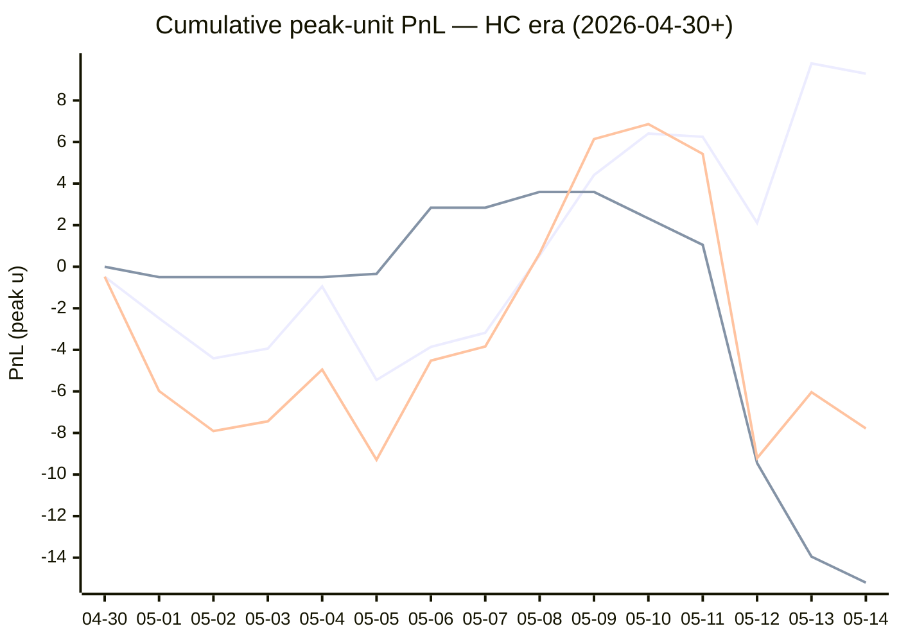

# Sharp Intel v6 — Daily Master Report

_Auto-generated **5/14/2026, 9:43:04 PM ET** by `scripts/dailyV6Report.js`. Do not edit by hand._

**Source of truth: this report mirrors the live Pick Performance dashboard.** Inclusion = `lockStage ≠ SHADOW ∧ ¬superseded ∧ health ∉ {MUTED, CANCELLED} ∧ peak.stars ≥ 2.5`. PnL is in **peak units** (the size shipped to users). HC margin / Δw / Δq are the **frozen** stamps written at last sync before the T-15 freeze. HC margin only existed from the v7.1 launch (**2026-04-30**); pre-launch picks have no HC value (no retro-fitting). Nothing is recomputed against today's whitelist.

v6 cutover: **2026-04-18** · whitelist source: live `sharpWalletProfiles` (181 profiles — drives §5 roster snapshot only) · quality cut: contribution ≥ 30 · HC = CONFIRMED tier ∧ sizeRatio ≥ 1.5.

---
## §1. Yesterday's picks

Slate: **2026-05-13** · 6 shipped sides.

| N | W-L-P | WR% | PnL (peak u) | PnL (flat 1u) |
|---|---|---|---|---|
| 6 | 4-2-0 | 66.7% | +3.17u | +1.71u |

| Sport | Market | Matchup | Pick | Stars · Units | HC | Δw | Δq | Σ | Odds | Result | PnL (peak u) |
|---|---|---|---|---|---|---|---|---|---|---|---|
| MLB | ML | Arizona Diamondbacks @ Texas Rangers | Texas Rangers | 4.5★ · 4.50u | +1 | +1 | +3 | +4 | -116 | **W** | +3.69u |
| MLB | SPREAD | New York Yankees @ Baltimore Orioles | Baltimore Orioles | 5.0★ · 3.50u | +1 | +1 | -1 | +0 | -105 | **W** | +3.18u |
| MLB | TOTAL | New York Yankees @ Baltimore Orioles | Under 8.5 | 4.0★ · 0.96u | +1 | +1 | +4 | +5 | -110 | **W** | +0.87u |
| MLB | TOTAL | Washington Nationals @ Cincinnati Reds | Under 9.5 | 5.0★ · 3.50u | +2 | +4 | +3 | +7 | -110 | L | -3.50u |
| NBA | ML | Cavaliers @ Pistons | Pistons | 5.0★ · 4.50u | +0 | +6 | +6 | +12 | -162 | L | -4.50u |
| NBA | TOTAL | Cavaliers @ Pistons | Over 213 | 5.0★ · 3.50u | +2 | +3 | -1 | +2 | -101 | **W** | +3.43u |

---
## §2. 3-day / 7-day / all-time cohort rollups

Shipped picks only. PnL in **peak units** (size we actually bet) and flat 1u (cohort EV lens). All margins are the engine's frozen stamps (`v8_hcMargin`, `v8_walletConsensusDelta`, `v8_walletConsensusQualityMargin`).

**HC margin sub-tables** are scoped to picks dated ≥ 2026-04-30 (the v7.1 launch — when HC margin became a real engine signal). Pre-launch picks are excluded from HC analysis since the feature didn't exist for them. Δw / Δq sub-tables span the full v6-era sample (≥ 2026-04-18). Empty buckets are dropped.

### §2a. 3-day

Total: **13** shipped · 4-9-0 · WR 30.8% · PnL -13.21u (peak) / -5.29u (flat).

**By HC margin** _(picks dated ≥ 2026-04-30, N = 13)_

| Bucket | N | W-L-P | WR% | PnL (peak u) | PnL (flat 1u) |
|---|---|---|---|---|---|
| HC ≥ +3 | 1 | 0-1-0 | 0.0% | -3.50u | -1.00u |
| HC = +2 | 2 | 1-1-0 | 50.0% | -0.07u | -0.01u |
| HC = +1 | 5 | 3-2-0 | 60.0% | +6.61u | +0.72u |
| HC = 0 | 5 | 0-5-0 | 0.0% | -16.25u | -5.00u |

**By Δw (winner margin)**

| Bucket | N | W-L-P | WR% | PnL (peak u) | PnL (flat 1u) |
|---|---|---|---|---|---|
| ≥ +3 | 7 | 1-6-0 | 14.3% | -18.57u | -5.01u |
| +2 | 2 | 0-2-0 | 0.0% | -1.89u | -2.00u |
| +1 | 4 | 3-1-0 | 75.0% | +7.25u | +1.72u |

**By Δq (quality margin)**

| Bucket | N | W-L-P | WR% | PnL (peak u) | PnL (flat 1u) |
|---|---|---|---|---|---|
| ≥ +3 | 8 | 2-6-0 | 25.0% | -15.69u | -4.23u |
| +1 | 3 | 0-3-0 | 0.0% | -4.13u | -3.00u |
| −1 | 2 | 2-0-0 | 100.0% | +6.61u | +1.94u |

**By AGS tier** _(picks dated ≥ 2026-05-05, N = 13)_

| Bucket | N | W-L-P | WR% | PnL (peak u) | PnL (flat 1u) |
|---|---|---|---|---|---|
| LOCK   (+5 .. +7) | 1 | 0-1-0 | 0.0% | -3.50u | -1.00u |
| STRONG (+3 .. +5) | 4 | 2-2-0 | 50.0% | -2.13u | -0.19u |
| NEUT   (0 .. +3) | 8 | 2-6-0 | 25.0% | -7.58u | -4.10u |

### §2b. 7-day

Total: **36** shipped · 18-18-0 · WR 50.0% · PnL -3.94u (peak) / -0.99u (flat).

**By HC margin** _(picks dated ≥ 2026-04-30, N = 36)_

| Bucket | N | W-L-P | WR% | PnL (peak u) | PnL (flat 1u) |
|---|---|---|---|---|---|
| HC ≥ +3 | 1 | 0-1-0 | 0.0% | -3.50u | -1.00u |
| HC = +2 | 7 | 4-3-0 | 57.1% | +3.43u | +0.82u |
| HC = +1 | 18 | 12-6-0 | 66.7% | +12.54u | +5.22u |
| HC = 0 | 9 | 1-8-0 | 11.1% | -18.04u | -6.99u |

**By Δw (winner margin)**

| Bucket | N | W-L-P | WR% | PnL (peak u) | PnL (flat 1u) |
|---|---|---|---|---|---|
| ≥ +3 | 11 | 5-6-0 | 45.5% | -7.33u | -1.90u |
| +2 | 10 | 2-8-0 | 20.0% | -9.84u | -6.03u |
| +1 | 13 | 9-4-0 | 69.2% | +10.09u | +4.64u |
| 0 | 1 | 1-0-0 | 100.0% | +1.51u | +1.34u |
| missing | 1 | 1-0-0 | 100.0% | +1.63u | +0.96u |

**By Δq (quality margin)**

| Bucket | N | W-L-P | WR% | PnL (peak u) | PnL (flat 1u) |
|---|---|---|---|---|---|
| ≥ +3 | 14 | 5-9-0 | 35.7% | -16.67u | -5.04u |
| +2 | 3 | 2-1-0 | 66.7% | +2.15u | +0.92u |
| +1 | 8 | 4-4-0 | 50.0% | +1.00u | -0.19u |
| 0 | 7 | 3-4-0 | 42.9% | +0.62u | -0.23u |
| −1 | 4 | 4-0-0 | 100.0% | +8.96u | +3.55u |

**By AGS tier** _(picks dated ≥ 2026-05-05, N = 36)_

| Bucket | N | W-L-P | WR% | PnL (peak u) | PnL (flat 1u) |
|---|---|---|---|---|---|
| LOCK   (+5 .. +7) | 6 | 4-2-0 | 66.7% | +0.68u | +1.14u |
| STRONG (+3 .. +5) | 12 | 9-3-0 | 75.0% | +6.50u | +5.07u |
| NEUT   (0 .. +3) | 15 | 3-12-0 | 20.0% | -12.26u | -8.50u |
| WEAK   (−1 .. 0) | 1 | 0-1-0 | 0.0% | -2.00u | -1.00u |
| FADE   (< −1) | 1 | 1-0-0 | 100.0% | +1.51u | +1.34u |
| missing | 1 | 1-0-0 | 100.0% | +1.63u | +0.96u |

### §2c. All-time

Total: **178** shipped · 84-92-2 · WR 47.7% · PnL -20.01u (peak) / -8.83u (flat).

**By HC margin** _(picks dated ≥ 2026-04-30, N = 67)_

| Bucket | N | W-L-P | WR% | PnL (peak u) | PnL (flat 1u) |
|---|---|---|---|---|---|
| HC ≥ +3 | 1 | 0-1-0 | 0.0% | -3.50u | -1.00u |
| HC = +2 | 7 | 4-3-0 | 57.1% | +3.43u | +0.82u |
| HC = +1 | 39 | 23-16-0 | 59.0% | +9.36u | +6.60u |
| HC = 0 | 17 | 6-10-1 | 37.5% | -15.20u | -4.46u |
| HC ≤ −1 | 2 | 0-2-0 | 0.0% | -3.50u | -2.00u |

**By Δw (winner margin)**

| Bucket | N | W-L-P | WR% | PnL (peak u) | PnL (flat 1u) |
|---|---|---|---|---|---|
| ≥ +3 | 35 | 21-14-0 | 60.0% | +6.54u | +9.87u |
| +2 | 40 | 15-25-0 | 37.5% | -18.76u | -8.96u |
| +1 | 61 | 34-26-1 | 56.7% | +7.76u | +5.10u |
| 0 | 28 | 9-18-1 | 33.3% | -13.44u | -9.75u |
| −1 | 7 | 1-6-0 | 14.3% | -5.60u | -4.94u |
| ≤ −2 | 1 | 0-1-0 | 0.0% | -0.50u | -1.00u |
| missing | 6 | 4-2-0 | 66.7% | +3.99u | +0.85u |

**By Δq (quality margin)**

| Bucket | N | W-L-P | WR% | PnL (peak u) | PnL (flat 1u) |
|---|---|---|---|---|---|
| ≥ +3 | 67 | 30-35-2 | 46.2% | -22.51u | -4.14u |
| +2 | 42 | 20-22-0 | 47.6% | -5.75u | -1.28u |
| +1 | 42 | 20-22-0 | 47.6% | -1.04u | -3.63u |
| 0 | 15 | 5-10-0 | 33.3% | -2.59u | -4.05u |
| −1 | 4 | 4-0-0 | 100.0% | +8.96u | +3.55u |
| ≤ −2 | 2 | 1-1-0 | 50.0% | -0.32u | -0.04u |
| missing | 6 | 4-2-0 | 66.7% | +3.24u | +0.77u |

**By AGS tier** _(picks dated ≥ 2026-05-05, N = 42)_

| Bucket | N | W-L-P | WR% | PnL (peak u) | PnL (flat 1u) |
|---|---|---|---|---|---|
| ELITE  (≥ +7) | 1 | 1-0-0 | 100.0% | +3.18u | +0.95u |
| LOCK   (+5 .. +7) | 6 | 4-2-0 | 66.7% | +0.68u | +1.14u |
| STRONG (+3 .. +5) | 13 | 10-3-0 | 76.9% | +8.09u | +6.48u |
| NEUT   (0 .. +3) | 18 | 5-13-0 | 27.8% | -15.42u | -7.71u |
| WEAK   (−1 .. 0) | 1 | 0-1-0 | 0.0% | -2.00u | -1.00u |
| FADE   (< −1) | 2 | 1-1-0 | 50.0% | +1.01u | +0.34u |
| missing | 1 | 1-0-0 | 100.0% | +1.63u | +0.96u |

---
## §3. Edge over time — is HC margin creating winners?

Daily cumulative peak-unit PnL since the HC margin launch (**2026-04-30**). The `HC ≥ +1` line is the golden-standard cohort. The `HC = 0` line is the no-HC-signal control. The `All shipped (HC era)` line is every shipped pick from the same date range — the apples-to-apples baseline. Watch the spread.

Daily cumulative table (peak units, HC era only):

| Date | HC ≥ +1 (cum) | HC = 0 (cum) | All shipped (cum) |
|---|---|---|---|
| 2026-04-30 | -0.48u | +0.00u | -0.48u |
| 2026-05-01 | -2.48u | -0.50u | -5.98u |
| 2026-05-02 | -4.41u | -0.50u | -7.91u |
| 2026-05-03 | -3.94u | -0.50u | -7.44u |
| 2026-05-04 | -0.95u | -0.50u | -4.95u |
| 2026-05-05 | -5.45u | -0.34u | -9.29u |
| 2026-05-06 | -3.86u | +2.84u | -4.52u |
| 2026-05-07 | -3.18u | +2.84u | -3.84u |
| 2026-05-08 | +0.54u | +3.60u | +0.64u |
| 2026-05-09 | +4.41u | +3.60u | +6.14u |
| 2026-05-10 | +6.41u | +2.32u | +6.86u |
| 2026-05-11 | +6.25u | +1.05u | +5.43u |
| 2026-05-12 | +2.11u | -9.45u | -9.21u |
| 2026-05-13 | +9.78u | -13.95u | -6.04u |
| 2026-05-14 | +9.29u | -15.20u | -7.78u |

---
## §4. Wallet roster growth & profitability

"Tracked in sport X" = a wallet has placed **≥ 2 bets** in X within the v6-era sample. "Profitable" = cumulative flat PnL > 0. Source: `v8Scoring.walletDetails` on every graded v6-era game (every side, not just the shipped set).

### §4a. Per-sport wallet snapshot

| Sport | Total wallets seen | Tracked (≥2) | Profitable | % prof | WR ≥ 50% | WR ≥ 60% | WR ≥ 70% |
|---|---|---|---|---|---|---|---|
| MLB | 47 | 29 | 10 | 34% | 15 | 6 | 1 |
| NBA | 120 | 88 | 37 | 42% | 50 | 27 | 14 |
| NHL | 44 | 26 | 11 | 42% | 18 | 7 | 5 |
| **ALL (any sport)** | **138** | **102** | **44** | **43%** | **58** | **26** | **14** |

### §4b. Daily roster growth (cumulative through each date)

Format: `tracked (profitable)`. For each date D, recompute the roster using every bet up to and including D.

| Date | ALL | MLB | NBA | NHL |
|---|---|---|---|---|
| 2026-04-18 | 5 (2) | 2 (2) | 3 (0) | 0 (0) |
| 2026-04-19 | 19 (8) | 5 (3) | 9 (3) | 3 (1) |
| 2026-04-20 | 29 (12) | 7 (6) | 23 (8) | 5 (2) |
| 2026-04-21 | 44 (21) | 10 (6) | 31 (10) | 7 (5) |
| 2026-04-22 | 52 (28) | 12 (6) | 39 (15) | 11 (10) |
| 2026-04-23 | 56 (29) | 13 (6) | 46 (21) | 13 (10) |
| 2026-04-24 | 61 (30) | 14 (6) | 51 (23) | 14 (9) |
| 2026-04-25 | 65 (29) | 16 (8) | 54 (22) | 16 (9) |
| 2026-04-26 | 67 (31) | 18 (5) | 56 (25) | 17 (9) |
| 2026-04-27 | 72 (32) | 20 (7) | 60 (24) | 17 (9) |
| 2026-04-28 | 76 (33) | 21 (7) | 63 (26) | 23 (10) |
| 2026-04-29 | 77 (33) | 21 (7) | 64 (25) | 23 (10) |
| 2026-04-30 | 81 (34) | 21 (7) | 70 (27) | 23 (10) |
| 2026-05-01 | 85 (38) | 22 (5) | 74 (30) | 26 (13) |
| 2026-05-02 | 86 (37) | 23 (7) | 75 (32) | 26 (12) |
| 2026-05-03 | 86 (38) | 24 (8) | 75 (33) | 26 (12) |
| 2026-05-04 | 90 (38) | 24 (9) | 76 (32) | 26 (12) |
| 2026-05-05 | 91 (40) | 24 (9) | 79 (33) | 26 (12) |
| 2026-05-06 | 92 (40) | 24 (9) | 80 (33) | 26 (12) |
| 2026-05-07 | 92 (41) | 24 (9) | 80 (33) | 26 (12) |
| 2026-05-08 | 92 (40) | 24 (8) | 80 (32) | 26 (11) |
| 2026-05-09 | 94 (42) | 24 (8) | 82 (35) | 26 (11) |
| 2026-05-10 | 94 (42) | 24 (8) | 82 (35) | 26 (11) |
| 2026-05-11 | 96 (42) | 24 (8) | 84 (36) | 26 (11) |
| 2026-05-12 | 100 (41) | 27 (9) | 86 (37) | 26 (11) |
| 2026-05-13 | 102 (45) | 29 (11) | 88 (37) | 26 (11) |
| 2026-05-14 | 102 (44) | 29 (10) | 88 (37) | 26 (11) |

### §4c. Top 10 profitable wallets by sport

#### MLB

| # | Wallet | N | W | L | WR% | Flat PnL (u) | Flat ROI | $ PnL |
|---|---|---|---|---|---|---|---|---|
| 1 | c289a0 | 3 | 3 | 0 | 100.0% | +2.87 | +95.6% | $1.5K |
| 2 | c668b3 | 3 | 2 | 1 | 66.7% | +1.16 | +38.7% | $4.0K |
| 3 | 981187 | 8 | 5 | 3 | 62.5% | +1.65 | +20.7% | $13.5K |
| 4 | d5017f | 8 | 5 | 3 | 62.5% | +1.63 | +20.3% | $42.8K |
| 5 | 0f9d74 | 5 | 3 | 2 | 60.0% | +0.92 | +18.4% | $2.1K |
| 6 | dcafd2 | 15 | 9 | 6 | 60.0% | +2.64 | +17.6% | $19.9K |
| 7 | fcc12b | 27 | 16 | 11 | 59.3% | +4.19 | +15.5% | $165.3K |
| 8 | 63fc82 | 12 | 7 | 5 | 58.3% | +1.76 | +14.7% | $21.5K |
| 9 | b05143 | 10 | 5 | 5 | 50.0% | +0.27 | +2.7% | $26.2K |
| 10 | 4c64aa | 46 | 25 | 21 | 54.3% | +0.27 | +0.6% | -$48.6K |

#### NBA

| # | Wallet | N | W | L | WR% | Flat PnL (u) | Flat ROI | $ PnL |
|---|---|---|---|---|---|---|---|---|
| 1 | 799fad | 2 | 2 | 0 | 100.0% | +5.66 | +283.0% | $241.7K |
| 2 | b51a56 | 5 | 5 | 0 | 100.0% | +6.44 | +128.9% | $74.8K |
| 3 | 4a9953 | 2 | 2 | 0 | 100.0% | +2.16 | +108.2% | $3.7K |
| 4 | 2e8da5 | 9 | 8 | 1 | 88.9% | +9.06 | +100.7% | $144.0K |
| 5 | 8ec926 | 5 | 5 | 0 | 100.0% | +4.60 | +92.0% | $8.5K |
| 6 | 12ad50 | 3 | 3 | 0 | 100.0% | +2.74 | +91.3% | $45.5K |
| 7 | 769c38 | 8 | 8 | 0 | 100.0% | +7.20 | +90.0% | $62.9K |
| 8 | 11b032 | 7 | 6 | 1 | 85.7% | +5.40 | +77.1% | $249.9K |
| 9 | 7f00bc | 13 | 9 | 4 | 69.2% | +8.17 | +62.9% | $11.1K |
| 10 | 7703d4 | 9 | 8 | 1 | 88.9% | +5.26 | +58.5% | $23.1K |

#### NHL

| # | Wallet | N | W | L | WR% | Flat PnL (u) | Flat ROI | $ PnL |
|---|---|---|---|---|---|---|---|---|
| 1 | 981187 | 5 | 5 | 0 | 100.0% | +5.03 | +100.6% | $30.3K |
| 2 | 799fad | 2 | 2 | 0 | 100.0% | +1.88 | +94.1% | $46.9K |
| 3 | fcc12b | 7 | 6 | 1 | 85.7% | +3.91 | +55.9% | $70.1K |
| 4 | 30935c | 4 | 3 | 1 | 75.0% | +2.11 | +52.7% | $953 |
| 5 | e70853 | 7 | 5 | 2 | 71.4% | +3.17 | +45.2% | $2.2K |
| 6 | bc3532 | 11 | 6 | 5 | 54.5% | +2.68 | +24.4% | -$34.0K |
| 7 | c5cea1 | 3 | 2 | 1 | 66.7% | +0.62 | +20.7% | $22.1K |
| 8 | dcafd2 | 2 | 1 | 1 | 50.0% | +0.40 | +20.0% | $4.9K |
| 9 | 6b853d | 6 | 4 | 2 | 66.7% | +1.13 | +18.8% | $7.7K |
| 10 | 12192c | 6 | 3 | 3 | 50.0% | +0.80 | +13.3% | $136.2K |

---
## §5. Proven-wallet roster growth & HC tracking

"Proven wallet" = whitelist tier `CONFIRMED` or `FLAT` in the same sense the live engine uses (`exportWalletProfiles.js` → `sharpWalletProfiles.bySport`). Sports inherit independent rosters: a wallet can be CONFIRMED in NBA and absent from NHL. `walletBets` come from `v8Scoring.walletDetails` on every graded v6-era pick (Source A); `positionRows` come from `sharp_action_positions` (Source B).

### §5a. Current proven-winner roster (snapshot)

Roster as of **2026-05-14** — wallets with ≥2 bets in the sport.

| Sport | Wallets seen | Eligible (≥2) | CONFIRMED | FLAT | Proven (C+F) | WR50 only | Conv % |
|---|---|---|---|---|---|---|---|
| MLB | 80 | 29 | 4 | 6 | **10** | 5 | 12.5% |
| NBA | 159 | 88 | 23 | 14 | **37** | 18 | 23.3% |
| NHL | 71 | 26 | 9 | 2 | **11** | 7 | 15.5% |
| **ALL** | **—** | **—** | **—** | **—** | **58** | **—** | **—** |

### §5b. Live whitelist drift check

Live `sharpWalletProfiles` is what the engine reads at lock time. Drift between script reconstruction (above) and live should be ≤ 1 day of position data — otherwise `exportWalletProfiles.js` is stale.

| Sport | CONFIRMED (live · script) | FLAT (live · script) | WR50 (live · script) | Drift |
|---|---|---|---|---|
| MLB | 15 · 4 | 7 · 6 | 2 · 5 | +12 live |
| NBA | 41 · 23 | 16 · 14 | 19 · 18 | +20 live |
| NHL | 14 · 9 | 4 · 2 | 6 · 7 | +7 live |

### §5c. Roster growth — 3d / 7d / 30d / all-time deltas

Each cell is **net growth** in proven (CONFIRMED + FLAT) wallets in that window, with the absolute count at the start (`+Δ from N`). Negative = wallets demoted. Window endpoint = 2026-05-14.

| Sport | 3-day | 7-day | 30-day | All-time (since cutover) |
|---|---|---|---|---|
| MLB | +2 from 8 | +1 from 9 | +10 from 0 | +10 from 0 |
| NBA | +1 from 36 | +4 from 33 | +37 from 0 | +37 from 0 |
| NHL | +0 from 11 | -1 from 12 | +11 from 0 | +11 from 0 |

A flat 7-day delta on a sport with healthy slate density = either the bubble pipeline has stalled (no wallets approaching the bar) or our cohort has saturated. Check §13d for the funnel diagnostic.

### §5d. Pipeline funnel — where each sport leaks

Wallets surviving each gate, in order. The biggest %-drop tells you the bottleneck. Gates:

1. **Seen** — placed ≥ 1 bet in the sport (any source)
2. **Eligible** — ≥ 2 graded picks in Source A (required for FLAT/CONFIRMED)
3. **Flat-OK** — eligible AND flat ROI > 0 (becomes FLAT or better)
4. **$-OK** — Flat-OK AND ≥2 positions with dollar ROI > 0 (CONFIRMED)
5. **Promoted** — final whitelisted = CONFIRMED + FLAT

| Sport | 1·Seen | 2·Eligible (% of Seen) | 3·Flat-OK (% of Elig) | 4·$-OK (% of Flat) | 5·Promoted | Bottleneck |
|---|---|---|---|---|---|---|
| MLB | 80 | 29 (36%) | 10 (34%) | 4 (40%) | **10** | edge (Eligible→Flat-OK) 66% |
| NBA | 159 | 88 (55%) | 37 (42%) | 23 (62%) | **37** | edge (Eligible→Flat-OK) 58% |
| NHL | 71 | 26 (37%) | 11 (42%) | 9 (82%) | **11** | sample (Seen→Eligible) 63% |

### §5e. HC backing density (the fuel for v7.3 HC margin)

Every v7.x promotion is gated on `HC_m ≥ +1`, which requires at least one CONFIRMED wallet sized at `≥ 1.5×` average on the for-side. This table shows the share of shipped picks that *had any HC backing*, by sport, in each window. If HC density falls toward zero in a sport, the v7.3 floor cohorts (Σ=1, Σ=2 locks; HC rescues) will simply stop firing there.

| Sport | Window | Picks (with HC stamp) | Any HC for-side | HC_m ≥ +1 | HC_m ≥ +2 |
|---|---|---|---|---|---|
| MLB | 3-day | 10 | 6 (60.0%) | 6 (60.0%) | 1 (10.0%) |
| MLB | 7-day | 19 | 13 (68.4%) | 13 (68.4%) | 1 (5.3%) |
| MLB | All-time | 64 | 30 (46.9%) | 29 (45.3%) | 3 (4.7%) |
| NBA | 3-day | 3 | 3 (100.0%) | 2 (66.7%) | 2 (66.7%) |
| NBA | 7-day | 13 | 12 (92.3%) | 11 (84.6%) | 7 (53.8%) |
| NBA | All-time | 86 | 49 (57.0%) | 42 (48.8%) | 17 (19.8%) |
| NHL | 3-day | 0 | 0 (—) | 0 (—) | 0 (—) |
| NHL | 7-day | 4 | 3 (75.0%) | 3 (75.0%) | 1 (25.0%) |
| NHL | All-time | 22 | 7 (31.8%) | 6 (27.3%) | 1 (4.5%) |

Pooled across sports:

| Window | Picks (with HC stamp) | Any HC for-side | HC_m ≥ +1 | HC_m ≥ +2 |
|---|---|---|---|---|
| 3-day | 13 | 9 (69.2%) | 8 (61.5%) | 3 (23.1%) |
| 7-day | 36 | 28 (77.8%) | 27 (75.0%) | 9 (25.0%) |
| All-time | 172 | 86 (50.0%) | 77 (44.8%) | 21 (12.2%) |

### §5f. Bubble wallets — next-up graduations

Wallets currently NOT promoted but close. Two flavors:

- **One-bet-away** — won the only bet, needs one more positive bet to clear ≥2.
- **Just-under** — has ≥2 bets but flat ROI is between −10% and 0% (one win flips them).

#### MLB

**One-bet-away** (5)

| wallet | picksN | flat PnL | pos N | pos $ROI |
|---|---|---|---|---|
| `...2768` | 1 | +0.99 | 13 | 85% |
| `...be00` | 1 | +0.87 | 7 | 15% |
| `...a240` | 1 | +0.87 | 6 | 100% |
| `...9373` | 1 | +0.87 | 0 | — |
| `...8d26` | 1 | +0.72 | 5 | -22% |

**Just-under** (6)

| wallet | picksN | WR | flat ROI | pos N | pos $ROI |
|---|---|---|---|---|---|
| `...9a27` | 46 | 50% | -2.5% | 193 | 19% |
| `...23c4` | 6 | 50% | -2.5% | 62 | -26% |
| `...c926` | 2 | 50% | -4.5% | 54 | 12% |
| `...135d` | 2 | 50% | -4.5% | 97 | 9% |
| `...192c` | 14 | 50% | -5.9% | 60 | 2% |
| `...2f63` | 69 | 48% | -6.7% | 237 | -2% |

#### NBA

**One-bet-away** (6)

| wallet | picksN | flat PnL | pos N | pos $ROI |
|---|---|---|---|---|
| `...bf5d` | 1 | +3.15 | 3 | 42% |
| `...ed41` | 1 | +3.15 | 3 | 3% |
| `...6b87` | 1 | +2.05 | 8 | -27% |
| `...9d74` | 1 | +0.93 | 11 | -39% |
| `...c556` | 1 | +0.93 | 3 | 42% |
| `...5c69` | 1 | +0.91 | 2 | 28% |

**Just-under** (6)

| wallet | picksN | WR | flat ROI | pos N | pos $ROI |
|---|---|---|---|---|---|
| `...d814` | 8 | 50% | -0.5% | 37 | -22% |
| `...65dd` | 2 | 50% | -1.0% | 11 | 30% |
| `...f5b0` | 20 | 50% | -3.7% | 49 | -22% |
| `...1fc6` | 4 | 50% | -3.7% | 9 | 17% |
| `...1f17` | 2 | 50% | -4.5% | 3 | -5% |
| `...2f63` | 62 | 47% | -5.3% | 183 | 3% |

#### NHL

**One-bet-away** (6)

| wallet | picksN | flat PnL | pos N | pos $ROI |
|---|---|---|---|---|
| `...2e78` | 1 | +1.46 | 0 | — |
| `...017f` | 1 | +1.45 | 1 | 150% |
| `...c67e` | 1 | +1.42 | 12 | -20% |
| `...32f2` | 1 | +1.40 | 0 | — |
| `...e0fd` | 1 | +1.20 | 3 | 124% |
| `...266e` | 1 | +1.05 | 0 | — |

**Just-under** (4)

| wallet | picksN | WR | flat ROI | pos N | pos $ROI |
|---|---|---|---|---|---|
| `...33ee` | 4 | 50% | -0.3% | 8 | -23% |
| `...68b3` | 4 | 50% | -8.5% | 9 | 63% |
| `...3782` | 2 | 50% | -9.0% | 18 | 27% |
| `...d227` | 2 | 50% | -9.0% | 16 | 19% |

### §5g. v2 wallet-promotion pipeline (Source-A / Source-B mix)

Live snapshot of the v2 promotion gate (shipped 2026-05-10, re-eval **2026-05-24**). Each FLAT-or-better wallet × sport pair is attributed to one of three paths via `sharpWalletProfiles[wallet].bySport[sport].whitelistSource`:

- **A** — flat-positive on featured picks (Source A) only — the v1 gate
- **A+B** — flat-positive in both sources (most reliable signal)
- **B** — flat-positive on-chain only (NEW in v2 — the trial lift)

Re-classified every 2h via `grade-sharp-actions` cron. Roll-back: set `B_ONLY_MIN_BETS = Infinity` in `scripts/exportWalletProfiles.js`.

#### Source mix per sport (live Firestore)

| Sport | A | A+B | B (new) | FLAT-or-better total | % from B-only |
|---|---|---|---|---|---|
| MLB | 4 | 4 | **14** | 22 | 63.6% |
| NBA | 17 | 19 | **21** | 57 | 36.8% |
| NHL | 5 | 6 | **7** | 18 | 38.9% |
| **ALL** | **26** | **29** | **42** | **97** | **43.3%** |

#### Pipeline freshness

- `sharp_action_positions` GRADED rows: **5193**
- `sharp_action_positions` PENDING rows: **381** (queued for next Grade Sharp Actions run)
- Latest `sharpWalletProfiles` rebuild: 5/12/2026, 5:34:36 AM ET — **3848 min · STALE** — check grade-sharp-actions workflow

**Alarms**: pending > 200 OR rebuild lag > 4h → cron is lagging or failing — check `gh run list --workflow="Grade Sharp Actions"`.

#### B-only roster — wallets currently promoted via Source B path only

Wallets here would have been EXCLUDED under v1 (Source-A-only). Top by Source-B bet count per sport. The 2-week re-eval (2026-05-24) will compare these wallets' realized lift against A-only and A+B cohorts.

**MLB** — 14 wallets promoted via B

| wallet | tier | B_n | B_flat ROI | B_$ ROI |
|---|---|---|---|---|
| `...9a27` | CONFIRMED | 171 | +17.8% | +7.9% |
| `...1eae` | CONFIRMED | 32 | +4.3% | +0.1% |
| `...5143` | CONFIRMED | 31 | +17.9% | +19.7% |
| `...d6d2` | FLAT | 16 | +9.2% | -1.6% |
| `...0ff5` | FLAT | 13 | +1.8% | -23.5% |
| `...a9cc` | CONFIRMED | 8 | +6.3% | +0.3% |
| `...9d74` | CONFIRMED | 7 | +24.2% | +43.8% |
| `...aeeb` | CONFIRMED | 7 | +35.4% | +37.5% |
| `...2768` | CONFIRMED | 7 | +97.4% | +105.9% |
| `...35e3` | CONFIRMED | 6 | +29.9% | +35.5% |
| … | 4 more | | | |

**NBA** — 21 wallets promoted via B

| wallet | tier | B_n | B_flat ROI | B_$ ROI |
|---|---|---|---|---|
| `...2f63` | CONFIRMED | 162 | +1.4% | +2.3% |
| `...1eae` | CONFIRMED | 59 | +5.3% | +14.3% |
| `...3782` | CONFIRMED | 47 | +18.5% | +13.3% |
| `...11a4` | CONFIRMED | 31 | +44.9% | +36.7% |
| `...935c` | FLAT | 29 | +62.5% | -22.6% |
| `...68b3` | CONFIRMED | 16 | +28.5% | +18.4% |
| `...1697` | CONFIRMED | 15 | +14.1% | +29.5% |
| `...abaf` | CONFIRMED | 15 | +38.8% | +14.6% |
| `...2db4` | CONFIRMED | 13 | +4.9% | +3.3% |
| `...89a0` | FLAT | 13 | +38.5% | -14.4% |
| … | 11 more | | | |

**NHL** — 7 wallets promoted via B

| wallet | tier | B_n | B_flat ROI | B_$ ROI |
|---|---|---|---|---|
| `...3782` | CONFIRMED | 18 | +17.5% | +26.7% |
| `...df91` | FLAT | 17 | +9.2% | -15% |
| `...b33b` | CONFIRMED | 12 | +12% | +1.6% |
| `...23c4` | CONFIRMED | 10 | +19.9% | +27.4% |
| `...9ef0` | FLAT | 9 | +0.7% | -4.2% |
| `...68b3` | CONFIRMED | 9 | +20.6% | +63.3% |
| `...a9cc` | CONFIRMED | 7 | +49.5% | +46.9% |

### §5 — How to read

- **Roster growth flat in 7-day** + **funnel bottleneck = `data`** → re-run `exportWalletProfiles.js`. The flat-positive wallets are stuck at FLAT because Source-B coverage hasn't caught up. CONFIRMED gate is data-bound, not skill-bound.
- **Roster growth flat in 7-day** + **funnel bottleneck = `sample`** → wallets aren't reaching `≥2` reps fast enough. This is a slate-density problem; consider a soft `MIN_BETS = 1` shadow lane to surface bubble wallets earlier.
- **Roster shrank** (negative delta) → a previously CONFIRMED wallet just dropped flat-positive (lost a recent bet). Variance, not failure — but worth noting if a sport loses ≥3 in a week.
- **HC density on a sport drops below ~30%** → v7.3 promotions there will starve. Either the proven roster needs more CONFIRMED-tier wallets sizing aggressively, or the HC_RATIO (1.5) needs a sport-specific tune.
- **§5g B-only count drops sharply** → wallets are demoting off the B path (losing on-chain). Cross-check `WALLET_PROFILES_SUMMARY.md` churn section for the specific demotions.
- **§5g pipeline freshness lag > 4h** → grade-sharp-actions cron is failing. Check `gh run list --workflow="Grade Sharp Actions"` and re-trigger if needed.

---
## §6. Daily proven-wallet performance

Who on the proven roster is actually printing — yesterday's bets, the rolling leaderboard (`$ PnL`-ranked), current streaks, and per-sport volume. **Proven** = `CONFIRMED` ∪ `FLAT` per sport (the same gate that drives Δ_winner). A wallet only counts in a sport where it's on that sport's proven list.

### §6a. Yesterday's proven-wallet bets

Slate: **2026-05-13** · 23 bets · 15 distinct proven wallets · WR 78% · $ vol $284.8K · $ PnL $75.1K.

| Wallet | Sport | Market | Game | $ size | Result | $ PnL |
|---|---|---|---|---|---|---|
| `...9a27` (CONFIRMED) | NBA | SPREAD | Cavaliers @ Pistons | $83.8K | **W** | $72.8K |
| `...2ca8` (CONFIRMED) | NBA | ML | Cavaliers @ Pistons | $67.3K | **W** | $39.6K |
| `...64aa` (FLAT) | MLB | ML | Tampa Bay Rays @ Toronto Blue Jays | $17.4K | **W** | $12.0K |
| `...0853` (CONFIRMED) | NBA | SPREAD | Cavaliers @ Pistons | $13.0K | **W** | $11.3K |
| `...c12b` (FLAT) | MLB | ML | Tampa Bay Rays @ Toronto Blue Jays | $8.8K | **W** | $6.1K |
| `...9d74` (FLAT) | MLB | ML | Arizona Diamondbacks @ Texas Rangers | $4.0K | **W** | $3.3K |
| `...afd2` (CONFIRMED) | MLB | ML | New York Yankees @ Baltimore Orioles | $1.9K | **W** | $2.6K |
| `...03d4` (FLAT) | NBA | SPREAD | Cavaliers @ Pistons | $2.4K | **W** | $2.1K |
| `...135d` (FLAT) | NBA | TOTAL | Cavaliers @ Pistons | $2.1K | **W** | $2.0K |
| `...135d` (FLAT) | NBA | SPREAD | Cavaliers @ Pistons | $1.4K | **W** | $1.2K |
| `...9d74` (FLAT) | MLB | ML | New York Yankees @ Baltimore Orioles | $417 | **W** | $588 |
| `...23c4` (CONFIRMED) | NBA | TOTAL | Cavaliers @ Pistons | $580 | **W** | $569 |
| `...9d74` (FLAT) | MLB | ML | Tampa Bay Rays @ Toronto Blue Jays | $665 | **W** | $459 |
| `...c12b` (FLAT) | MLB | SPREAD | New York Yankees @ Baltimore Orioles | $258 | **W** | $235 |
| `...aeeb` (CONFIRMED) | NBA | SPREAD | Cavaliers @ Pistons | $245 | **W** | $213 |
| `...df91` (FLAT) | NBA | ML | Cavaliers @ Pistons | $249 | **W** | $146 |
| `...afd2` (CONFIRMED) | MLB | SPREAD | New York Yankees @ Baltimore Orioles | $110 | **W** | $100 |
| `...c12b` (FLAT) | MLB | ML | New York Yankees @ Baltimore Orioles | $29 | **W** | $41 |
| `...3532` (FLAT) | NBA | ML | Cavaliers @ Pistons | $6.1K | L | -$6.1K |
| `...3532` (FLAT) | NBA | SPREAD | Cavaliers @ Pistons | $7.7K | L | -$7.7K |
| `...fc82` (FLAT) | MLB | ML | Tampa Bay Rays @ Toronto Blue Jays | $12.3K | L | -$12.3K |
| `...64aa` (FLAT) | MLB | ML | New York Yankees @ Baltimore Orioles | $18.2K | L | -$18.2K |
| `...66f5` (FLAT) | NBA | ML | Cavaliers @ Pistons | $36.0K | L | -$36.0K |

### §6b. Proven-wallet leaderboard

Top 15 proven `(wallet × sport)` pairs per sport per horizon, ranked by **$ PnL** (the dollar-ROI lens). The 3-day board is the "who's on form right now" lens; the 7-day filters single-day variance; all-time is the proven-roster reference.

#### §6b-1. 3-day

**MLB** — 7 active proven wallets

| # | Wallet | Tier | Bets | WR% | Bets/day | Flat PnL (u) | Flat ROI | $ vol | $ PnL | $ ROI | Streak |
|---|---|---|---|---|---|---|---|---|---|---|---|
| 1 | `...5143` | CONFIRMED | 1 | 100% | 1.0 | +1.04 | +104% | $63.3K | $65.9K | +104% | 1W |
| 2 | `...c12b` | FLAT | 5 | 80% | 2.5 | +2.65 | +53% | $44.9K | $14.8K | +33% | 3W |
| 3 | `...68b3` | CONFIRMED | 1 | 100% | 1.0 | +1.04 | +104% | $3.8K | $4.0K | +104% | 1W |
| 4 | `...9d74` | FLAT | 5 | 60% | 2.5 | +0.92 | +18% | $7.3K | $2.1K | +29% | 3W |
| 5 | `...afd2` | CONFIRMED | 3 | 67% | 1.5 | +1.32 | +44% | $12.0K | -$7.3K | -61% | 1L |
| 6 | `...fc82` | FLAT | 1 | 0% | 1.0 | -1.00 | -100% | $12.3K | -$12.3K | -100% | 1L |
| 7 | `...64aa` | FLAT | 6 | 33% | 2.0 | -2.33 | -39% | $106.6K | -$30.9K | -29% | 1L |

**NBA** — 16 active proven wallets

| # | Wallet | Tier | Bets | WR% | Bets/day | Flat PnL (u) | Flat ROI | $ vol | $ PnL | $ ROI | Streak |
|---|---|---|---|---|---|---|---|---|---|---|---|
| 1 | `...9a27` | CONFIRMED | 3 | 67% | 1.5 | +0.13 | +4% | $105.0K | $69.0K | +66% | 1W |
| 2 | `...2ca8` | CONFIRMED | 1 | 100% | 1.0 | +0.59 | +59% | $67.3K | $39.6K | +59% | 1W |
| 3 | `...0853` | CONFIRMED | 1 | 100% | 1.0 | +0.87 | +87% | $13.0K | $11.3K | +87% | 1W |
| 4 | `...3532` | FLAT | 4 | 50% | 2.0 | -0.78 | -20% | $36.3K | $4.7K | +13% | 2L |
| 5 | `...853d` | CONFIRMED | 2 | 50% | 2.0 | -0.74 | -37% | $18.8K | $2.0K | +11% | 1L |
| 6 | `...9953` | CONFIRMED | 1 | 100% | 1.0 | +0.26 | +26% | $3.8K | $1.0K | +26% | 1W |
| 7 | `...df91` | FLAT | 2 | 100% | 1.0 | +0.85 | +43% | $663 | $255 | +39% | 2W |
| 8 | `...0329` | CONFIRMED | 1 | 0% | 1.0 | -1.00 | -100% | $826 | -$826 | -100% | 1L |
| 9 | `...23c4` | CONFIRMED | 2 | 50% | 1.0 | -0.02 | -1% | $2.7K | -$1.5K | -57% | 1W |
| 10 | `...03d4` | FLAT | 3 | 67% | 1.5 | +0.13 | +4% | $8.7K | -$2.6K | -30% | 1W |
| 11 | `...135d` | FLAT | 5 | 60% | 2.5 | +0.11 | +2% | $17.0K | -$4.6K | -27% | 2W |
| 12 | `...b33b` | CONFIRMED | 1 | 0% | 1.0 | -1.00 | -100% | $5.1K | -$5.1K | -100% | 1L |
| 13 | `...9ef0` | FLAT | 1 | 0% | 1.0 | -1.00 | -100% | $10.4K | -$10.4K | -100% | 1L |
| 14 | `...3f67` | CONFIRMED | 1 | 0% | 1.0 | -1.00 | -100% | $26.6K | -$26.6K | -100% | 1L |
| 15 | `...66f5` | FLAT | 2 | 0% | 1.0 | -2.00 | -100% | $36.0K | -$36.0K | -100% | 2L |

**NHL** — 2 active proven wallets

| # | Wallet | Tier | Bets | WR% | Bets/day | Flat PnL (u) | Flat ROI | $ vol | $ PnL | $ ROI | Streak |
|---|---|---|---|---|---|---|---|---|---|---|---|
| 1 | `...c12b` | CONFIRMED | 1 | 100% | 1.0 | +0.63 | +63% | $90.0K | $56.3K | +63% | 1W |
| 2 | `...3532` | FLAT | 1 | 0% | 1.0 | -1.00 | -100% | $18.4K | -$18.4K | -100% | 1L |

#### §6b-2. 7-day

**MLB** — 7 active proven wallets

| # | Wallet | Tier | Bets | WR% | Bets/day | Flat PnL (u) | Flat ROI | $ vol | $ PnL | $ ROI | Streak |
|---|---|---|---|---|---|---|---|---|---|---|---|
| 1 | `...5143` | CONFIRMED | 1 | 100% | 1.0 | +1.04 | +104% | $63.3K | $65.9K | +104% | 1W |
| 2 | `...c12b` | FLAT | 6 | 67% | 1.0 | +1.65 | +28% | $53.0K | $6.7K | +13% | 3W |
| 3 | `...68b3` | CONFIRMED | 1 | 100% | 1.0 | +1.04 | +104% | $3.8K | $4.0K | +104% | 1W |
| 4 | `...9d74` | FLAT | 5 | 60% | 2.5 | +0.92 | +18% | $7.3K | $2.1K | +29% | 3W |
| 5 | `...afd2` | CONFIRMED | 5 | 40% | 1.0 | -0.68 | -14% | $13.4K | -$8.7K | -65% | 1L |
| 6 | `...fc82` | FLAT | 1 | 0% | 1.0 | -1.00 | -100% | $12.3K | -$12.3K | -100% | 1L |
| 7 | `...64aa` | FLAT | 6 | 33% | 2.0 | -2.33 | -39% | $106.6K | -$30.9K | -29% | 1L |

**NBA** — 24 active proven wallets

| # | Wallet | Tier | Bets | WR% | Bets/day | Flat PnL (u) | Flat ROI | $ vol | $ PnL | $ ROI | Streak |
|---|---|---|---|---|---|---|---|---|---|---|---|
| 1 | `...23c4` | CONFIRMED | 5 | 80% | 0.8 | +2.88 | +58% | $219.2K | $209.2K | +95% | 1W |
| 2 | `...b032` | CONFIRMED | 3 | 100% | 1.5 | +3.62 | +121% | $139.7K | $181.1K | +130% | 3W |
| 3 | `...9a27` | CONFIRMED | 17 | 88% | 2.8 | +9.27 | +55% | $382.2K | $146.2K | +38% | 1W |
| 4 | `...b814` | CONFIRMED | 2 | 100% | 0.7 | +0.45 | +23% | $287.9K | $65.3K | +23% | 2W |
| 5 | `...5143` | FLAT | 1 | 100% | 1.0 | +0.46 | +46% | $101.5K | $46.5K | +46% | 1W |
| 6 | `...2ca8` | CONFIRMED | 1 | 100% | 1.0 | +0.59 | +59% | $67.3K | $39.6K | +59% | 1W |
| 7 | `...3532` | FLAT | 15 | 73% | 2.5 | +3.79 | +25% | $119.3K | $37.0K | +31% | 2L |
| 8 | `...d49f` | FLAT | 5 | 80% | 1.7 | +2.84 | +57% | $19.1K | $17.3K | +90% | 2W |
| 9 | `...0853` | CONFIRMED | 1 | 100% | 1.0 | +0.87 | +87% | $13.0K | $11.3K | +87% | 1W |
| 10 | `...c926` | FLAT | 3 | 100% | 3.0 | +3.56 | +119% | $6.9K | $7.8K | +113% | 3W |
| 11 | `...9ef0` | FLAT | 3 | 67% | 0.8 | +0.18 | +6% | $67.3K | $7.2K | +11% | 1L |
| 12 | `...03d4` | FLAT | 6 | 83% | 1.0 | +2.51 | +42% | $18.9K | $7.1K | +38% | 1W |
| 13 | `...1a56` | CONFIRMED | 1 | 100% | 1.0 | +1.65 | +165% | $2.2K | $3.6K | +165% | 1W |
| 14 | `...0f9a` | CONFIRMED | 3 | 67% | 1.0 | +0.18 | +6% | $5.4K | $2.2K | +41% | 1W |
| 15 | `...9953` | CONFIRMED | 1 | 100% | 1.0 | +0.26 | +26% | $3.8K | $1.0K | +26% | 1W |

**NHL** — 3 active proven wallets

| # | Wallet | Tier | Bets | WR% | Bets/day | Flat PnL (u) | Flat ROI | $ vol | $ PnL | $ ROI | Streak |
|---|---|---|---|---|---|---|---|---|---|---|---|
| 1 | `...c12b` | CONFIRMED | 1 | 100% | 1.0 | +0.63 | +63% | $90.0K | $56.3K | +63% | 1W |
| 2 | `...a240` | CONFIRMED | 2 | 50% | 0.5 | -0.07 | -4% | $5.4K | -$3.5K | -64% | 1L |
| 3 | `...3532` | FLAT | 5 | 20% | 1.0 | -2.98 | -60% | $108.4K | -$71.1K | -66% | 2L |

#### §6b-3. All-time

**MLB** — 10 active proven wallets

| # | Wallet | Tier | Bets | WR% | Bets/day | Flat PnL (u) | Flat ROI | $ vol | $ PnL | $ ROI | Streak |
|---|---|---|---|---|---|---|---|---|---|---|---|
| 1 | `...c12b` | FLAT | 27 | 59% | 1.0 | +4.19 | +16% | $671.9K | $165.3K | +25% | 3W |
| 2 | `...017f` | CONFIRMED | 8 | 63% | 0.5 | +1.63 | +20% | $81.0K | $42.8K | +53% | 1W |
| 3 | `...5143` | CONFIRMED | 10 | 50% | 0.4 | +0.27 | +3% | $317.6K | $26.2K | +8% | 1W |
| 4 | `...fc82` | FLAT | 12 | 58% | 0.5 | +1.76 | +15% | $231.0K | $21.5K | +9% | 3L |
| 5 | `...afd2` | CONFIRMED | 15 | 60% | 0.6 | +2.64 | +18% | $60.5K | $19.9K | +33% | 1L |
| 6 | `...1187` | FLAT | 8 | 63% | 2.7 | +1.65 | +21% | $30.5K | $13.5K | +44% | 1W |
| 7 | `...68b3` | CONFIRMED | 3 | 67% | 0.2 | +1.16 | +39% | $3.9K | $4.0K | +104% | 1W |
| 8 | `...9d74` | FLAT | 5 | 60% | 2.5 | +0.92 | +18% | $7.3K | $2.1K | +29% | 3W |
| 9 | `...89a0` | FLAT | 3 | 100% | 0.4 | +2.87 | +96% | $1.6K | $1.5K | +95% | 3W |
| 10 | `...64aa` | FLAT | 46 | 54% | 1.8 | +0.27 | +1% | $792.2K | -$48.6K | -6% | 1L |

**NBA** — 37 active proven wallets

| # | Wallet | Tier | Bets | WR% | Bets/day | Flat PnL (u) | Flat ROI | $ vol | $ PnL | $ ROI | Streak |
|---|---|---|---|---|---|---|---|---|---|---|---|
| 1 | `...9a27` | CONFIRMED | 59 | 71% | 3.0 | +16.86 | +29% | $1.71M | $610.0K | +36% | 1W |
| 2 | `...23c4` | CONFIRMED | 13 | 77% | 0.7 | +6.37 | +49% | $490.8K | $263.0K | +54% | 1W |
| 3 | `...b032` | CONFIRMED | 7 | 86% | 0.7 | +5.40 | +77% | $244.0K | $249.9K | +102% | 3W |
| 4 | `...9fad` | CONFIRMED | 2 | 100% | 1.0 | +5.66 | +283% | $141.8K | $241.7K | +170% | 2W |
| 5 | `...aeeb` | CONFIRMED | 46 | 61% | 1.8 | +9.29 | +20% | $859.3K | $181.1K | +21% | 1W |
| 6 | `...8da5` | CONFIRMED | 9 | 89% | 0.8 | +9.06 | +101% | $182.2K | $144.0K | +79% | 7W |
| 7 | `...2ca8` | CONFIRMED | 15 | 60% | 0.6 | +4.58 | +31% | $532.0K | $142.7K | +27% | 1W |
| 8 | `...32f2` | CONFIRMED | 7 | 43% | 0.4 | +0.99 | +14% | $126.8K | $134.2K | +106% | 1L |
| 9 | `...3532` | FLAT | 48 | 56% | 2.1 | +7.86 | +16% | $692.7K | $116.7K | +17% | 2L |
| 10 | `...02c3` | CONFIRMED | 6 | 33% | 0.9 | +0.75 | +13% | $681.1K | $104.0K | +15% | 3L |
| 11 | `...5143` | FLAT | 12 | 67% | 0.6 | +4.27 | +36% | $754.5K | $101.3K | +13% | 1W |
| 12 | `...e8f1` | FLAT | 14 | 36% | 0.7 | +0.49 | +4% | $467.1K | $83.6K | +18% | 5L |
| 13 | `...b814` | CONFIRMED | 3 | 100% | 0.4 | +0.56 | +19% | $431.9K | $81.3K | +19% | 3W |
| 14 | `...1a56` | CONFIRMED | 5 | 100% | 0.4 | +6.44 | +129% | $53.3K | $74.8K | +140% | 5W |
| 15 | `...9c38` | CONFIRMED | 8 | 100% | 0.6 | +7.20 | +90% | $103.5K | $62.9K | +61% | 8W |

**NHL** — 11 active proven wallets

| # | Wallet | Tier | Bets | WR% | Bets/day | Flat PnL (u) | Flat ROI | $ vol | $ PnL | $ ROI | Streak |
|---|---|---|---|---|---|---|---|---|---|---|---|
| 1 | `...192c` | FLAT | 6 | 50% | 0.5 | +0.80 | +13% | $166.9K | $136.2K | +82% | 2L |
| 2 | `...c12b` | CONFIRMED | 7 | 86% | 0.3 | +3.91 | +56% | $285.5K | $70.1K | +25% | 4W |
| 3 | `...9fad` | CONFIRMED | 2 | 100% | 1.0 | +1.88 | +94% | $88.2K | $46.9K | +53% | 2W |
| 4 | `...1187` | CONFIRMED | 5 | 100% | 2.5 | +5.03 | +101% | $38.0K | $30.3K | +80% | 5W |
| 5 | `...cea1` | CONFIRMED | 3 | 67% | 0.4 | +0.62 | +21% | $27.7K | $22.1K | +80% | 1W |
| 6 | `...853d` | CONFIRMED | 6 | 67% | 0.4 | +1.13 | +19% | $29.1K | $7.7K | +26% | 1L |
| 7 | `...afd2` | CONFIRMED | 2 | 50% | 1.0 | +0.40 | +20% | $18.2K | $4.9K | +27% | 1W |
| 8 | `...a240` | CONFIRMED | 17 | 59% | 0.7 | +1.69 | +10% | $56.5K | $4.2K | +7% | 1L |
| 9 | `...0853` | CONFIRMED | 7 | 71% | 0.8 | +3.17 | +45% | $132.6K | $2.2K | +2% | 2W |
| 10 | `...935c` | CONFIRMED | 4 | 75% | 1.0 | +2.11 | +53% | $1.3K | $953 | +74% | 3W |
| 11 | `...3532` | FLAT | 11 | 55% | 0.5 | +2.68 | +24% | $170.8K | -$34.0K | -20% | 2L |

### §6c. Active streaks (≥3 in a row, last bet within 3 days)

Proven `(wallet × sport)` pairs currently riding a 3-or-more-bet run with their most recent bet inside the last 3 calendar days. Hot-hand monitor — and the same surface for cold streaks worth fading.

| Wallet | Sport | Tier | Streak | Last bet | All-time bets | WR% | $ PnL | $ ROI |
|---|---|---|---|---|---|---|---|---|
| `...3f67` | NBA | CONFIRMED | **5L** | 2026-05-12 | 10 | 50% | -$32.1K | -8% |
| `...c12b` | NHL | CONFIRMED | **4W** | 2026-05-12 | 7 | 86% | $70.1K | +25% |
| `...0329` | NBA | CONFIRMED | **4L** | 2026-05-12 | 8 | 50% | $16.1K | +84% |
| `...df91` | NBA | FLAT | **4W** | 2026-05-13 | 15 | 60% | -$3.4K | -23% |
| `...c12b` | MLB | FLAT | **3W** | 2026-05-13 | 27 | 59% | $165.3K | +25% |
| `...b814` | NBA | CONFIRMED | **3W** | 2026-05-11 | 3 | 100% | $81.3K | +19% |
| `...0853` | NBA | CONFIRMED | **3W** | 2026-05-13 | 3 | 100% | $27.8K | +16% |
| `...fc82` | MLB | FLAT | **3L** | 2026-05-13 | 12 | 58% | $21.5K | +9% |
| `...9d74` | MLB | FLAT | **3W** | 2026-05-13 | 5 | 60% | $2.1K | +29% |
| `...66f5` | NBA | FLAT | **3L** | 2026-05-13 | 11 | 45% | -$24.5K | -16% |

### §6d. Daily proven-wallet volume (trailing 14 graded days)

Per-day bet count, $ volume, and $ PnL from proven wallets only. Helps spot slate-density swings — a spike in one sport's volume = the proven cohort sees something on that night's board.

| Date | TOTAL N · $vol · $PnL | MLB N · $vol · $PnL | NBA N · $vol · $PnL | NHL N · $vol · $PnL |
|---|---|---|---|---|
| 2026-05-01 | 29 · $568.7K · -$124.4K | 6 · $76.8K · -$36.7K | 18 · $434.1K · -$137.9K | 5 · $57.8K · $50.2K |
| 2026-05-02 | 24 · $538.7K · $306.4K | 12 · $171.1K · $8.7K | 9 · $356.3K · $289.9K | 3 · $11.3K · $7.8K |
| 2026-05-03 | 24 · $406.0K · -$14.0K | 8 · $97.1K · $67.7K | 13 · $293.0K · -$86.0K | 3 · $15.9K · $4.4K |
| 2026-05-04 | 32 · $597.4K · -$139.5K | 5 · $59.8K · -$21.7K | 26 · $531.9K · -$121.2K | 1 · $5.7K · $3.5K |
| 2026-05-05 | 23 · $958.4K · -$454.4K | 3 · $54.3K · -$23.6K | 20 · $904.1K · -$430.7K | — |
| 2026-05-06 | 17 · $275.9K · $70.7K | 1 · $33.0K · $31.7K | 15 · $224.5K · $12.9K | 1 · $18.4K · $26.0K |
| 2026-05-07 | 4 · $43.7K · -$1.7K | — | 4 · $43.7K · -$1.7K | — |
| 2026-05-08 | 20 · $318.2K · $2.8K | 1 · $8.1K · -$8.1K | 17 · $290.6K · $28.5K | 2 · $19.4K · -$17.5K |
| 2026-05-09 | 16 · $356.4K · $180.8K | — | 16 · $356.4K · $180.8K | — |
| 2026-05-10 | 24 · $586.7K · $441.5K | 2 · $1.4K · -$1.4K | 20 · $524.2K · $466.8K | 2 · $61.1K · -$23.8K |
| 2026-05-11 | 20 · $366.2K · -$54.6K | — | 18 · $351.4K · -$39.7K | 2 · $14.8K · -$14.8K |
| 2026-05-12 | 31 · $420.7K · -$1.2K | 8 · $139.7K · $41.6K | 21 · $172.5K · -$80.6K | 2 · $108.4K · $37.8K |
| 2026-05-13 | 23 · $284.8K · $75.1K | 11 · $64.0K · -$5.1K | 12 · $220.8K · $80.2K | — |
| 2026-05-14 | 3 · $46.5K · -$163 | 3 · $46.5K · -$163 | — | — |

---

_Driven by `scripts/dailyV6Report.js` · regenerates daily via `.github/workflows/daily-v6-report.yml` · QUALITY_CONTRIB_CUT = 30 · HC = CONFIRMED ∧ sizeRatio ≥ 1.5 · inclusion mirrors live Pick Performance dashboard · §1–§3 use shipped picks · §4–§5 wallet/tracking growth mirror `exportWalletProfiles.js` · §6 daily proven-wallet board uses today's roster (CONFIRMED ∪ FLAT) as-of 2026-05-14_
