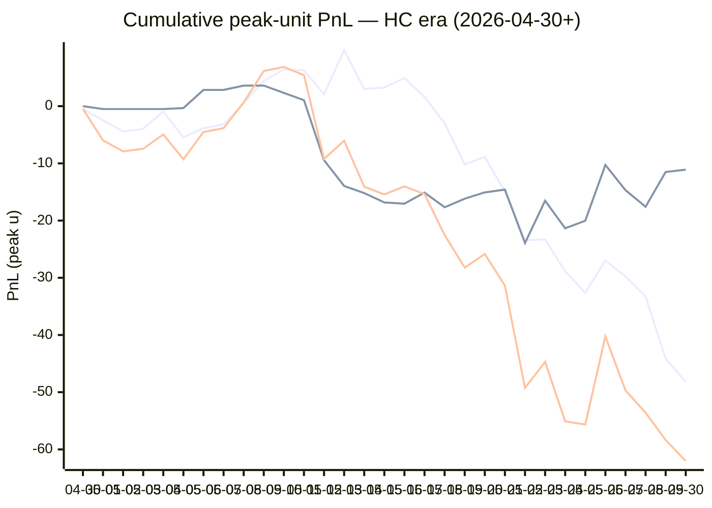

# Sharp Intel v6 — Daily Master Report

_Auto-generated **5/31/2026, 10:22:23 AM ET** by `scripts/dailyV6Report.js`. Do not edit by hand._

**Source of truth: this report mirrors the live Pick Performance dashboard.** Inclusion = `lockStage ≠ SHADOW ∧ ¬superseded ∧ health ∉ {MUTED, CANCELLED} ∧ peak.stars ≥ 2.5`. PnL is in **peak units** (the size shipped to users). HC margin / Δw / Δq are the **frozen** stamps written at last sync before the T-15 freeze. HC margin only existed from the v7.1 launch (**2026-04-30**); pre-launch picks have no HC value (no retro-fitting). Nothing is recomputed against today's whitelist.

v6 cutover: **2026-04-18** · whitelist source: live `sharpWalletProfiles` (224 profiles — drives §5 roster snapshot only) · quality cut: contribution ≥ 30 · HC = CONFIRMED tier ∧ sizeRatio ≥ 1.5.

---
## §1. Yesterday's picks

Slate: **2026-05-30** · 21 shipped sides.

| N | W-L-P | WR% | PnL (peak u) | PnL (flat 1u) |
|---|---|---|---|---|
| 21 | 11-10-0 | 52.4% | -3.68u | +0.31u |

| Sport | Market | Matchup | Pick | Stars · Units | HC | Δw | Δq | Σ | Odds | Result | PnL (peak u) |
|---|---|---|---|---|---|---|---|---|---|---|---|
| MLB | ML | Arizona Diamondbacks @ Seattle Mariners | Arizona Diamondbacks | 5.0★ · 2.50u | +1 | +2 | +2 | +4 | +132 | L | -2.50u |
| MLB | ML | Atlanta Braves @ Cincinnati Reds | Atlanta Braves | 4.5★ · 2.75u | +2 | +1 | +1 | +2 | -125 | **W** | +2.29u |
| MLB | ML | Boston Red Sox @ Cleveland Guardians | Cleveland Guardians | 5.0★ · 5.00u | +0 | +1 | +2 | +3 | -130 | L | -5.00u |
| MLB | ML | Chicago Cubs @ St. Louis Cardinals | Chicago Cubs | 4.0★ · 3.75u | +1 | +1 | +0 | +1 | -132 | **W** | +2.86u |
| MLB | ML | Detroit Tigers @ Chicago White Sox | Detroit Tigers | 5.0★ · 3.75u | +1 | +1 | +0 | +1 | -118 | L | -3.75u |
| MLB | ML | Kansas City Royals @ Texas Rangers | Texas Rangers | 5.0★ · 5.00u | +0 | +0 | +2 | +2 | -120 | **W** | +4.24u |
| MLB | ML | Miami Marlins @ New York Mets | New York Mets | 4.0★ · 2.75u | +1 | +0 | +1 | +1 | -130 | **W** | +0.38u |
| MLB | ML | New York Yankees @ Athletics | Athletics | 4.0★ · 2.50u | +0 | +1 | -1 | +0 | +129 | **W** | +0.65u |
| MLB | ML | Philadelphia Phillies @ Los Angeles Dodgers | Philadelphia Phillies | 5.0★ · 2.50u | +0 | +1 | +1 | +2 | +108 | **W** | +2.70u |
| MLB | ML | San Diego Padres @ Washington Nationals | Washington Nationals | 4.0★ · 0.50u | +0 | +1 | +1 | +2 | +110 | **W** | +0.55u |
| MLB | ML | San Francisco Giants @ Colorado Rockies | Colorado Rockies | 5.0★ · 1.25u | +0 | +2 | +1 | +3 | -102 | **W** | +1.23u |
| MLB | ML | Toronto Blue Jays @ Baltimore Orioles | Toronto Blue Jays | 5.0★ · 3.75u | +1 | +1 | +0 | +1 | -122 | L | -3.75u |
| MLB | SPREAD | Chicago Cubs @ St. Louis Cardinals | St. Louis Cardinals | 3.0★ · 0.75u | +1 | +0 | +1 | +1 | -143 | L | -0.75u |
| MLB | SPREAD | Detroit Tigers @ Chicago White Sox | Detroit Tigers | 4.0★ · 1.00u | +0 | +1 | +0 | +1 | +152 | L | -1.00u |
| MLB | SPREAD | New York Yankees @ Athletics | Athletics | 5.0★ · 1.65u | +1 | +2 | +2 | +4 | -120 | **W** | +1.38u |
| MLB | TOTAL | Kansas City Royals @ Texas Rangers | Over 8 | 4.5★ · 0.75u | +1 | +1 | +0 | +1 | +100 | **W** | +0.75u |
| MLB | TOTAL | Milwaukee Brewers @ Houston Astros | Over 8.5 | 4.0★ · 2.25u | +0 | +2 | +1 | +3 | -116 | **W** | +1.94u |
| MLB | TOTAL | Minnesota Twins @ Pittsburgh Pirates | Under 8.5 | 4.0★ · 1.65u | +0 | +1 | +0 | +1 | -107 | L | -1.65u |
| MLB | TOTAL | Toronto Blue Jays @ Baltimore Orioles | Under 7.5 | 3.0★ · 0.75u | +0 | +0 | +2 | +2 | -108 | L | -0.75u |
| NBA | ML | Spurs @ Thunder | Thunder | 5.0★ · 1.00u | +3 | +3 | +4 | +7 | -154 | L | -1.00u |
| NBA | TOTAL | Spurs @ Thunder | Under 213 | 5.0★ · 2.50u | +0 | +5 | +2 | +7 | -109 | L | -2.50u |

---
## §2. 3-day / 7-day / all-time cohort rollups

Shipped picks only. PnL in **peak units** (size we actually bet) and flat 1u (cohort EV lens). All margins are the engine's frozen stamps (`v8_hcMargin`, `v8_walletConsensusDelta`, `v8_walletConsensusQualityMargin`).

**HC margin sub-tables** are scoped to picks dated ≥ 2026-04-30 (the v7.1 launch — when HC margin became a real engine signal). Pre-launch picks are excluded from HC analysis since the feature didn't exist for them. Δw / Δq sub-tables span the full v6-era sample (≥ 2026-04-18). Empty buckets are dropped.

### §2a. 3-day

Total: **49** shipped · 24-25-0 · WR 49.0% · PnL -12.34u (peak) / -3.25u (flat).

**By HC margin** _(picks dated ≥ 2026-04-30, N = 49)_

| Bucket | N | W-L-P | WR% | PnL (peak u) | PnL (flat 1u) |
|---|---|---|---|---|---|
| HC ≥ +3 | 1 | 0-1-0 | 0.0% | -1.00u | -1.00u |
| HC = +2 | 2 | 1-1-0 | 50.0% | +1.29u | -0.20u |
| HC = +1 | 17 | 7-10-0 | 41.2% | -18.73u | -4.08u |
| HC = 0 | 28 | 15-13-0 | 53.6% | +3.58u | +1.02u |
| HC ≤ −1 | 1 | 1-0-0 | 100.0% | +2.52u | +1.01u |

**By Δw (winner margin)**

| Bucket | N | W-L-P | WR% | PnL (peak u) | PnL (flat 1u) |
|---|---|---|---|---|---|
| ≥ +3 | 7 | 1-6-0 | 14.3% | -9.98u | -4.99u |
| +2 | 14 | 6-8-0 | 42.9% | -5.44u | -2.57u |
| +1 | 17 | 11-6-0 | 64.7% | +1.41u | +4.57u |
| 0 | 11 | 6-5-0 | 54.5% | +1.67u | -0.25u |

**By Δq (quality margin)**

| Bucket | N | W-L-P | WR% | PnL (peak u) | PnL (flat 1u) |
|---|---|---|---|---|---|
| ≥ +3 | 6 | 1-5-0 | 16.7% | -4.67u | -4.19u |
| +2 | 11 | 5-6-0 | 45.5% | -5.56u | -1.81u |
| +1 | 15 | 10-5-0 | 66.7% | +5.75u | +4.15u |
| 0 | 11 | 4-7-0 | 36.4% | -10.07u | -3.26u |
| −1 | 4 | 3-1-0 | 75.0% | +1.91u | +2.12u |
| ≤ −2 | 2 | 1-1-0 | 50.0% | +0.30u | -0.25u |

**By AGS tier** _(picks dated ≥ 2026-05-05, N = 49)_

| Bucket | N | W-L-P | WR% | PnL (peak u) | PnL (flat 1u) |
|---|---|---|---|---|---|
| NEUT   (0 .. +3) | 42 | 18-24-0 | 42.9% | -14.54u | -8.24u |
| WEAK   (−1 .. 0) | 7 | 6-1-0 | 85.7% | +2.20u | +4.99u |

### §2b. 7-day

Total: **122** shipped · 63-59-0 · WR 51.6% · PnL -17.33u (peak) / -6.16u (flat).

**By HC margin** _(picks dated ≥ 2026-04-30, N = 122)_

| Bucket | N | W-L-P | WR% | PnL (peak u) | PnL (flat 1u) |
|---|---|---|---|---|---|
| HC ≥ +3 | 3 | 1-2-0 | 33.3% | -1.57u | -1.49u |
| HC = +2 | 6 | 3-3-0 | 50.0% | -2.35u | +0.19u |
| HC = +1 | 36 | 17-19-0 | 47.2% | -20.99u | -5.03u |
| HC = 0 | 72 | 40-32-0 | 55.6% | +5.43u | +1.32u |
| HC ≤ −1 | 5 | 2-3-0 | 40.0% | +2.15u | -1.15u |

**By Δw (winner margin)**

| Bucket | N | W-L-P | WR% | PnL (peak u) | PnL (flat 1u) |
|---|---|---|---|---|---|
| ≥ +3 | 21 | 5-16-0 | 23.8% | -22.59u | -11.23u |
| +2 | 36 | 19-17-0 | 52.8% | -7.06u | -0.47u |
| +1 | 43 | 25-18-0 | 58.1% | +2.52u | +2.25u |
| 0 | 19 | 13-6-0 | 68.4% | +10.03u | +4.80u |
| −1 | 3 | 1-2-0 | 33.3% | -0.23u | -1.52u |

**By Δq (quality margin)**

| Bucket | N | W-L-P | WR% | PnL (peak u) | PnL (flat 1u) |
|---|---|---|---|---|---|
| ≥ +3 | 14 | 5-9-0 | 35.7% | -7.76u | -5.32u |
| +2 | 20 | 8-12-0 | 40.0% | -10.79u | -5.47u |
| +1 | 48 | 26-22-0 | 54.2% | +0.45u | -0.29u |
| 0 | 26 | 14-12-0 | 53.8% | -1.73u | +0.87u |
| −1 | 11 | 9-2-0 | 81.8% | +7.20u | +5.31u |
| ≤ −2 | 3 | 1-2-0 | 33.3% | -4.70u | -1.25u |

**By AGS tier** _(picks dated ≥ 2026-05-05, N = 122)_

| Bucket | N | W-L-P | WR% | PnL (peak u) | PnL (flat 1u) |
|---|---|---|---|---|---|
| NEUT   (0 .. +3) | 109 | 55-54-0 | 50.5% | -17.01u | -9.10u |
| WEAK   (−1 .. 0) | 13 | 8-5-0 | 61.5% | -0.32u | +2.94u |

### §2c. All-time

Total: **404** shipped · 200-201-3 · WR 49.9% · PnL -74.26u (peak) / -17.28u (flat).

**By HC margin** _(picks dated ≥ 2026-04-30, N = 293)_

| Bucket | N | W-L-P | WR% | PnL (peak u) | PnL (flat 1u) |
|---|---|---|---|---|---|
| HC ≥ +3 | 9 | 3-6-0 | 33.3% | -8.58u | -4.67u |
| HC = +2 | 21 | 8-13-0 | 38.1% | -23.92u | -4.84u |
| HC = +1 | 120 | 66-54-0 | 55.0% | -15.71u | +8.33u |
| HC = 0 | 134 | 70-62-2 | 53.0% | -11.10u | -3.17u |
| HC ≤ −1 | 8 | 2-6-0 | 25.0% | -4.35u | -4.15u |

**By Δw (winner margin)**

| Bucket | N | W-L-P | WR% | PnL (peak u) | PnL (flat 1u) |
|---|---|---|---|---|---|
| ≥ +3 | 81 | 38-43-0 | 46.9% | -33.70u | -2.49u |
| +2 | 103 | 47-56-0 | 45.6% | -38.74u | -11.24u |
| +1 | 136 | 78-57-1 | 57.8% | +10.06u | +10.67u |
| 0 | 66 | 31-33-2 | 48.4% | -8.29u | -6.60u |
| −1 | 11 | 2-9-0 | 18.2% | -7.08u | -7.46u |
| ≤ −2 | 1 | 0-1-0 | 0.0% | -0.50u | -1.00u |
| missing | 6 | 4-2-0 | 66.7% | +3.99u | +0.85u |

**By Δq (quality margin)**

| Bucket | N | W-L-P | WR% | PnL (peak u) | PnL (flat 1u) |
|---|---|---|---|---|---|
| ≥ +3 | 101 | 48-51-2 | 48.5% | -27.61u | -4.45u |
| +2 | 85 | 36-49-0 | 42.4% | -43.43u | -13.49u |
| +1 | 125 | 65-59-1 | 52.4% | -1.22u | -2.43u |
| 0 | 56 | 29-27-0 | 51.8% | +0.19u | -0.08u |
| −1 | 23 | 16-7-0 | 69.6% | +7.84u | +6.68u |
| ≤ −2 | 8 | 2-6-0 | 25.0% | -13.27u | -4.29u |
| missing | 6 | 4-2-0 | 66.7% | +3.24u | +0.77u |

**By AGS tier** _(picks dated ≥ 2026-05-05, N = 268)_

| Bucket | N | W-L-P | WR% | PnL (peak u) | PnL (flat 1u) |
|---|---|---|---|---|---|
| ELITE  (≥ +7) | 3 | 3-0-0 | 100.0% | +8.01u | +2.34u |
| LOCK   (+5 .. +7) | 9 | 5-4-0 | 55.6% | -2.93u | -0.47u |
| STRONG (+3 .. +5) | 22 | 13-9-0 | 59.1% | -6.66u | +2.77u |
| NEUT   (0 .. +3) | 194 | 95-99-0 | 49.0% | -53.26u | -17.75u |
| WEAK   (−1 .. 0) | 29 | 15-13-1 | 53.6% | -5.59u | +2.71u |
| FADE   (< −1) | 10 | 6-4-0 | 60.0% | +1.72u | +2.16u |
| missing | 1 | 1-0-0 | 100.0% | +1.63u | +0.96u |

---
## §3. Edge over time — is HC margin creating winners?

Daily cumulative peak-unit PnL since the HC margin launch (**2026-04-30**). The `HC ≥ +1` line is the golden-standard cohort. The `HC = 0` line is the no-HC-signal control. The `All shipped (HC era)` line is every shipped pick from the same date range — the apples-to-apples baseline. Watch the spread.

Daily cumulative table (peak units, HC era only):

| Date | HC ≥ +1 (cum) | HC = 0 (cum) | All shipped (cum) |
|---|---|---|---|
| 2026-04-30 | -0.48u | +0.00u | -0.48u |
| 2026-05-01 | -2.48u | -0.50u | -5.98u |
| 2026-05-02 | -4.41u | -0.50u | -7.91u |
| 2026-05-03 | -3.94u | -0.50u | -7.44u |
| 2026-05-04 | -0.95u | -0.50u | -4.95u |
| 2026-05-05 | -5.45u | -0.34u | -9.29u |
| 2026-05-06 | -3.86u | +2.84u | -4.52u |
| 2026-05-07 | -3.18u | +2.84u | -3.84u |
| 2026-05-08 | +0.54u | +3.60u | +0.64u |
| 2026-05-09 | +4.41u | +3.60u | +6.14u |
| 2026-05-10 | +6.41u | +2.32u | +6.86u |
| 2026-05-11 | +6.25u | +1.05u | +5.43u |
| 2026-05-12 | +2.11u | -9.45u | -9.21u |
| 2026-05-13 | +9.78u | -13.95u | -6.04u |
| 2026-05-14 | +3.00u | -15.20u | -14.07u |
| 2026-05-15 | +3.27u | -16.83u | -15.43u |
| 2026-05-16 | +4.90u | -17.05u | -14.02u |
| 2026-05-17 | +1.62u | -15.11u | -15.36u |
| 2026-05-18 | -2.98u | -17.67u | -22.52u |
| 2026-05-19 | -10.18u | -16.17u | -28.22u |
| 2026-05-20 | -8.90u | -15.07u | -25.84u |
| 2026-05-21 | -14.92u | -14.58u | -31.37u |
| 2026-05-22 | -23.44u | -23.93u | -49.24u |
| 2026-05-23 | -23.30u | -16.53u | -44.70u |
| 2026-05-24 | -28.89u | -21.34u | -55.10u |
| 2026-05-25 | -32.63u | -20.03u | -55.65u |
| 2026-05-26 | -26.98u | -10.27u | -40.24u |
| 2026-05-27 | -29.77u | -14.68u | -49.69u |
| 2026-05-28 | -33.27u | -17.58u | -53.57u |
| 2026-05-29 | -44.12u | -11.51u | -58.35u |
| 2026-05-30 | -48.21u | -11.10u | -62.03u |

---
## §4. Wallet roster growth & profitability

"Tracked in sport X" = a wallet has placed **≥ 2 bets** in X within the v6-era sample. "Profitable" = cumulative flat PnL > 0. Source: `v8Scoring.walletDetails` on every graded v6-era game (every side, not just the shipped set).

### §4a. Per-sport wallet snapshot

| Sport | Total wallets seen | Tracked (≥2) | Profitable | % prof | WR ≥ 50% | WR ≥ 60% | WR ≥ 70% |
|---|---|---|---|---|---|---|---|
| MLB | 59 | 41 | 12 | 29% | 17 | 8 | 3 |
| NBA | 133 | 101 | 43 | 43% | 59 | 28 | 13 |
| NHL | 57 | 41 | 12 | 29% | 23 | 10 | 6 |
| **ALL (any sport)** | **160** | **126** | **49** | **39%** | **71** | **28** | **13** |

### §4b. Daily roster growth (cumulative through each date)

Format: `tracked (profitable)`. For each date D, recompute the roster using every bet up to and including D.

| Date | ALL | MLB | NBA | NHL |
|---|---|---|---|---|
| 2026-04-18 | 5 (2) | 2 (2) | 3 (0) | 0 (0) |
| 2026-04-19 | 19 (8) | 5 (3) | 9 (3) | 3 (1) |
| 2026-04-20 | 29 (12) | 7 (6) | 23 (8) | 5 (2) |
| 2026-04-21 | 44 (21) | 10 (6) | 31 (10) | 7 (5) |
| 2026-04-22 | 52 (28) | 12 (6) | 39 (15) | 11 (10) |
| 2026-04-23 | 56 (29) | 13 (6) | 46 (21) | 13 (10) |
| 2026-04-24 | 61 (30) | 14 (6) | 51 (23) | 14 (9) |
| 2026-04-25 | 65 (29) | 16 (8) | 54 (22) | 16 (9) |
| 2026-04-26 | 67 (31) | 18 (5) | 56 (25) | 17 (9) |
| 2026-04-27 | 72 (32) | 20 (7) | 60 (24) | 17 (9) |
| 2026-04-28 | 76 (33) | 21 (7) | 63 (26) | 23 (10) |
| 2026-04-29 | 77 (33) | 21 (7) | 64 (25) | 23 (10) |
| 2026-04-30 | 81 (34) | 21 (7) | 70 (27) | 23 (10) |
| 2026-05-01 | 85 (38) | 22 (5) | 74 (30) | 26 (13) |
| 2026-05-02 | 86 (37) | 23 (7) | 75 (32) | 26 (12) |
| 2026-05-03 | 86 (38) | 24 (8) | 75 (33) | 26 (12) |
| 2026-05-04 | 90 (38) | 24 (9) | 76 (32) | 26 (12) |
| 2026-05-05 | 91 (40) | 24 (9) | 79 (33) | 26 (12) |
| 2026-05-06 | 92 (40) | 24 (9) | 80 (33) | 26 (12) |
| 2026-05-07 | 92 (41) | 24 (9) | 80 (33) | 26 (12) |
| 2026-05-08 | 92 (40) | 24 (8) | 80 (32) | 26 (11) |
| 2026-05-09 | 94 (42) | 24 (8) | 82 (35) | 26 (11) |
| 2026-05-10 | 94 (42) | 24 (8) | 82 (35) | 26 (11) |
| 2026-05-11 | 96 (42) | 24 (8) | 84 (36) | 26 (11) |
| 2026-05-12 | 100 (41) | 27 (9) | 86 (37) | 26 (11) |
| 2026-05-13 | 102 (45) | 29 (11) | 88 (37) | 26 (11) |
| 2026-05-14 | 102 (41) | 29 (11) | 88 (37) | 28 (12) |
| 2026-05-15 | 103 (41) | 30 (10) | 88 (39) | 28 (12) |
| 2026-05-16 | 105 (43) | 31 (12) | 88 (39) | 30 (14) |
| 2026-05-17 | 105 (46) | 32 (11) | 88 (40) | 30 (14) |
| 2026-05-18 | 105 (46) | 32 (10) | 88 (38) | 31 (15) |
| 2026-05-19 | 105 (46) | 32 (12) | 88 (38) | 31 (15) |
| 2026-05-20 | 106 (48) | 33 (12) | 88 (38) | 31 (16) |
| 2026-05-21 | 106 (45) | 34 (12) | 88 (37) | 31 (14) |
| 2026-05-22 | 106 (44) | 34 (10) | 88 (39) | 33 (16) |
| 2026-05-23 | 111 (49) | 36 (10) | 90 (40) | 36 (19) |
| 2026-05-24 | 117 (52) | 37 (12) | 94 (39) | 37 (16) |
| 2026-05-25 | 120 (53) | 38 (13) | 95 (40) | 38 (16) |
| 2026-05-26 | 122 (55) | 39 (14) | 97 (42) | 38 (16) |
| 2026-05-27 | 123 (51) | 40 (12) | 97 (42) | 40 (14) |
| 2026-05-28 | 124 (51) | 40 (12) | 99 (42) | 40 (14) |
| 2026-05-29 | 125 (50) | 41 (12) | 99 (42) | 41 (12) |
| 2026-05-30 | 126 (49) | 41 (12) | 101 (43) | 41 (12) |

### §4c. Top 10 profitable wallets by sport

#### MLB

| # | Wallet | N | W | L | WR% | Flat PnL (u) | Flat ROI | $ PnL |
|---|---|---|---|---|---|---|---|---|
| 1 | c289a0 | 3 | 3 | 0 | 100.0% | +2.87 | +95.6% | $1.5K |
| 2 | 880232 | 2 | 2 | 0 | 100.0% | +1.82 | +90.9% | $130.1K |
| 3 | c9bba3 | 3 | 3 | 0 | 100.0% | +2.42 | +80.7% | $66.5K |
| 4 | eeabaf | 28 | 17 | 11 | 60.7% | +11.20 | +40.0% | $830.5K |
| 5 | c668b3 | 15 | 10 | 5 | 66.7% | +4.16 | +27.7% | $649 |
| 6 | 981187 | 8 | 5 | 3 | 62.5% | +1.65 | +20.7% | $13.5K |
| 7 | 7923c4 | 35 | 21 | 14 | 60.0% | +5.52 | +15.8% | $104.4K |
| 8 | a10ff5 | 32 | 18 | 14 | 56.3% | +3.72 | +11.6% | $6.4K |
| 9 | 4c64aa | 120 | 72 | 48 | 60.0% | +13.09 | +10.9% | $221.1K |
| 10 | 972768 | 22 | 11 | 11 | 50.0% | +1.58 | +7.2% | $13.3K |

#### NBA

| # | Wallet | N | W | L | WR% | Flat PnL (u) | Flat ROI | $ PnL |
|---|---|---|---|---|---|---|---|---|
| 1 | 799fad | 2 | 2 | 0 | 100.0% | +5.66 | +283.0% | $241.7K |
| 2 | 4a9953 | 2 | 2 | 0 | 100.0% | +2.16 | +108.2% | $3.7K |
| 3 | a0d6d2 | 2 | 2 | 0 | 100.0% | +1.91 | +95.3% | $4.1K |
| 4 | 12ad50 | 3 | 3 | 0 | 100.0% | +2.74 | +91.3% | $45.5K |
| 5 | b51a56 | 6 | 5 | 1 | 83.3% | +5.44 | +90.7% | $74.4K |
| 6 | 11b032 | 7 | 6 | 1 | 85.7% | +5.40 | +77.1% | $249.9K |
| 7 | 769c38 | 13 | 12 | 1 | 92.3% | +9.01 | +69.3% | $100.0K |
| 8 | 2e8da5 | 11 | 8 | 3 | 72.7% | +7.06 | +64.2% | $84.1K |
| 9 | 7f00bc | 17 | 11 | 6 | 64.7% | +8.63 | +50.7% | $11.7K |
| 10 | f9e3d0 | 4 | 3 | 1 | 75.0% | +1.90 | +47.4% | $4.3K |

#### NHL

| # | Wallet | N | W | L | WR% | Flat PnL (u) | Flat ROI | $ PnL |
|---|---|---|---|---|---|---|---|---|
| 1 | 8366f5 | 2 | 2 | 0 | 100.0% | +2.30 | +114.9% | $107.6K |
| 2 | 799fad | 2 | 2 | 0 | 100.0% | +1.88 | +94.1% | $46.9K |
| 3 | fec67e | 4 | 3 | 1 | 75.0% | +2.82 | +70.5% | $12.5K |
| 4 | 30935c | 4 | 3 | 1 | 75.0% | +2.11 | +52.7% | $953 |
| 5 | 981187 | 8 | 6 | 2 | 75.0% | +3.52 | +44.0% | -$25.2K |
| 6 | fcc12b | 10 | 7 | 3 | 70.0% | +3.15 | +31.5% | -$67.5K |
| 7 | e70853 | 9 | 6 | 3 | 66.7% | +2.66 | +29.5% | -$11.1K |
| 8 | c5cea1 | 3 | 2 | 1 | 66.7% | +0.62 | +20.7% | $22.1K |
| 9 | bc3532 | 16 | 9 | 7 | 56.3% | +3.20 | +20.0% | $10.7K |
| 10 | dfa240 | 24 | 15 | 9 | 62.5% | +4.32 | +18.0% | $14.2K |

---
## §5. Proven-wallet roster growth & HC tracking

"Proven wallet" = whitelist tier `CONFIRMED` or `FLAT` in the same sense the live engine uses (`exportWalletProfiles.js` → `sharpWalletProfiles.bySport`). Sports inherit independent rosters: a wallet can be CONFIRMED in NBA and absent from NHL. `walletBets` come from `v8Scoring.walletDetails` on every graded v6-era pick (Source A); `positionRows` come from `sharp_action_positions` (Source B).

### §5a. Current proven-winner roster (snapshot)

Roster as of **2026-05-30** — wallets with ≥2 bets in the sport.

| Sport | Wallets seen | Eligible (≥2) | CONFIRMED | FLAT | Proven (C+F) | WR50 only | Conv % |
|---|---|---|---|---|---|---|---|
| MLB | 108 | 41 | 6 | 6 | **12** | 5 | 11.1% |
| NBA | 192 | 101 | 28 | 15 | **43** | 21 | 22.4% |
| NHL | 95 | 41 | 8 | 4 | **12** | 11 | 12.6% |
| **ALL** | **—** | **—** | **—** | **—** | **67** | **—** | **—** |

### §5b. Live whitelist drift check

Live `sharpWalletProfiles` is what the engine reads at lock time. Drift between script reconstruction (above) and live should be ≤ 1 day of position data — otherwise `exportWalletProfiles.js` is stale.

| Sport | CONFIRMED (live · script) | FLAT (live · script) | WR50 (live · script) | Drift |
|---|---|---|---|---|
| MLB | 24 · 6 | 8 · 6 | 5 · 5 | +20 live |
| NBA | 54 · 28 | 22 · 15 | 20 · 21 | +33 live |
| NHL | 19 · 8 | 6 · 4 | 14 · 11 | +13 live |

### §5c. Roster growth — 3d / 7d / 30d / all-time deltas

Each cell is **net growth** in proven (CONFIRMED + FLAT) wallets in that window, with the absolute count at the start (`+Δ from N`). Negative = wallets demoted. Window endpoint = 2026-05-30.

| Sport | 3-day | 7-day | 30-day | All-time (since cutover) |
|---|---|---|---|---|
| MLB | +0 from 12 | +2 from 10 | +5 from 7 | +12 from 0 |
| NBA | +1 from 42 | +3 from 40 | +16 from 27 | +43 from 0 |
| NHL | -2 from 14 | -7 from 19 | +2 from 10 | +12 from 0 |

A flat 7-day delta on a sport with healthy slate density = either the bubble pipeline has stalled (no wallets approaching the bar) or our cohort has saturated. Check §13d for the funnel diagnostic.

### §5d. Pipeline funnel — where each sport leaks

Wallets surviving each gate, in order. The biggest %-drop tells you the bottleneck. Gates:

1. **Seen** — placed ≥ 1 bet in the sport (any source)
2. **Eligible** — ≥ 2 graded picks in Source A (required for FLAT/CONFIRMED)
3. **Flat-OK** — eligible AND flat ROI > 0 (becomes FLAT or better)
4. **$-OK** — Flat-OK AND ≥2 positions with dollar ROI > 0 (CONFIRMED)
5. **Promoted** — final whitelisted = CONFIRMED + FLAT

| Sport | 1·Seen | 2·Eligible (% of Seen) | 3·Flat-OK (% of Elig) | 4·$-OK (% of Flat) | 5·Promoted | Bottleneck |
|---|---|---|---|---|---|---|
| MLB | 108 | 41 (38%) | 12 (29%) | 6 (50%) | **12** | edge (Eligible→Flat-OK) 71% |
| NBA | 192 | 101 (53%) | 43 (43%) | 28 (65%) | **43** | edge (Eligible→Flat-OK) 57% |
| NHL | 95 | 41 (43%) | 12 (29%) | 8 (67%) | **12** | edge (Eligible→Flat-OK) 71% |

### §5e. HC backing density (the fuel for v7.3 HC margin)

Every v7.x promotion is gated on `HC_m ≥ +1`, which requires at least one CONFIRMED wallet sized at `≥ 1.5×` average on the for-side. This table shows the share of shipped picks that *had any HC backing*, by sport, in each window. If HC density falls toward zero in a sport, the v7.3 floor cohorts (Σ=1, Σ=2 locks; HC rescues) will simply stop firing there.

| Sport | Window | Picks (with HC stamp) | Any HC for-side | HC_m ≥ +1 | HC_m ≥ +2 |
|---|---|---|---|---|---|
| MLB | 3-day | 43 | 17 (39.5%) | 17 (39.5%) | 1 (2.3%) |
| MLB | 7-day | 103 | 40 (38.8%) | 36 (35.0%) | 3 (2.9%) |
| MLB | All-time | 240 | 105 (43.8%) | 99 (41.3%) | 10 (4.2%) |
| NBA | 3-day | 3 | 3 (100.0%) | 2 (66.7%) | 2 (66.7%) |
| NBA | 7-day | 10 | 9 (90.0%) | 6 (60.0%) | 5 (50.0%) |
| NBA | All-time | 116 | 75 (64.7%) | 63 (54.3%) | 29 (25.0%) |
| NHL | 3-day | 3 | 1 (33.3%) | 1 (33.3%) | 0 (0.0%) |
| NHL | 7-day | 9 | 3 (33.3%) | 3 (33.3%) | 1 (11.1%) |
| NHL | All-time | 42 | 19 (45.2%) | 18 (42.9%) | 4 (9.5%) |

Pooled across sports:

| Window | Picks (with HC stamp) | Any HC for-side | HC_m ≥ +1 | HC_m ≥ +2 |
|---|---|---|---|---|
| 3-day | 49 | 21 (42.9%) | 20 (40.8%) | 3 (6.1%) |
| 7-day | 122 | 52 (42.6%) | 45 (36.9%) | 9 (7.4%) |
| All-time | 398 | 199 (50.0%) | 180 (45.2%) | 43 (10.8%) |

### §5f. Bubble wallets — next-up graduations

Wallets currently NOT promoted but close. Two flavors:

- **One-bet-away** — won the only bet, needs one more positive bet to clear ≥2.
- **Just-under** — has ≥2 bets but flat ROI is between −10% and 0% (one win flips them).

#### MLB

**One-bet-away** (5)

| wallet | picksN | flat PnL | pos N | pos $ROI |
|---|---|---|---|---|
| `...be17` | 1 | +6.95 | 23 | -60% |
| `...be00` | 1 | +0.87 | 14 | 3% |
| `...a240` | 1 | +0.87 | 7 | 83% |
| `...9373` | 1 | +0.87 | 0 | — |
| `...8d26` | 1 | +0.72 | 5 | -22% |

**Just-under** (6)

| wallet | picksN | WR | flat ROI | pos N | pos $ROI |
|---|---|---|---|---|---|
| `...1eae` | 51 | 49% | -2.7% | 104 | 8% |
| `...d6d2` | 8 | 50% | -5.3% | 20 | -27% |
| `...9d74` | 29 | 48% | -5.9% | 124 | -16% |
| `...c12b` | 40 | 48% | -6.5% | 67 | -19% |
| `...35e3` | 22 | 50% | -6.7% | 88 | -25% |
| `...ad50` | 4 | 50% | -6.8% | 11 | 32% |

#### NBA

**One-bet-away** (6)

| wallet | picksN | flat PnL | pos N | pos $ROI |
|---|---|---|---|---|
| `...bf5d` | 1 | +3.15 | 3 | 42% |
| `...ed41` | 1 | +3.15 | 3 | 3% |
| `...6b87` | 1 | +2.05 | 8 | -27% |
| `...c991` | 1 | +1.14 | 8 | 77% |
| `...9d74` | 1 | +0.93 | 27 | -35% |
| `...c556` | 1 | +0.93 | 3 | 42% |

**Just-under** (6)

| wallet | picksN | WR | flat ROI | pos N | pos $ROI |
|---|---|---|---|---|---|
| `...b33b` | 14 | 36% | -0.5% | 45 | 19% |
| `...d814` | 8 | 50% | -0.5% | 48 | 8% |
| `...d96a` | 19 | 37% | -1.5% | 72 | -27% |
| `...65dd` | 6 | 50% | -2.4% | 17 | 27% |
| `...853d` | 40 | 53% | -2.7% | 90 | -2% |
| `...f5b0` | 20 | 50% | -3.7% | 57 | -28% |

#### NHL

**One-bet-away** (6)

| wallet | picksN | flat PnL | pos N | pos $ROI |
|---|---|---|---|---|
| `...2e78` | 1 | +1.46 | 0 | — |
| `...017f` | 1 | +1.45 | 5 | 125% |
| `...32f2` | 1 | +1.40 | 0 | — |
| `...e0fd` | 1 | +1.20 | 3 | 124% |
| `...266e` | 1 | +1.05 | 0 | — |
| `...2194` | 1 | +1.05 | 0 | — |

**Just-under** (6)

| wallet | picksN | WR | flat ROI | pos N | pos $ROI |
|---|---|---|---|---|---|
| `...33ee` | 4 | 50% | -0.3% | 8 | -23% |
| `...afd2` | 6 | 50% | -1.9% | 18 | 1% |
| `...192c` | 7 | 43% | -2.9% | 21 | -15% |
| `...35e3` | 7 | 57% | -5.5% | 26 | 31% |
| `...618e` | 2 | 50% | -6.1% | 28 | 24% |
| `...9ef0` | 7 | 43% | -8.6% | 23 | 0% |

### §5g. v2 wallet-promotion pipeline (Source-A / Source-B mix)

Live snapshot of the v2 promotion gate (shipped 2026-05-10, re-eval **2026-05-24**). Each FLAT-or-better wallet × sport pair is attributed to one of three paths via `sharpWalletProfiles[wallet].bySport[sport].whitelistSource`:

- **A** — flat-positive on featured picks (Source A) only — the v1 gate
- **A+B** — flat-positive in both sources (most reliable signal)
- **B** — flat-positive on-chain only (NEW in v2 — the trial lift)

Re-classified every 2h via `grade-sharp-actions` cron. Roll-back: set `B_ONLY_MIN_BETS = Infinity` in `scripts/exportWalletProfiles.js`.

#### Source mix per sport (live Firestore)

| Sport | A | A+B | B (new) | FLAT-or-better total | % from B-only |
|---|---|---|---|---|---|
| MLB | 3 | 9 | **20** | 32 | 62.5% |
| NBA | 15 | 28 | **33** | 76 | 43.4% |
| NHL | 4 | 8 | **13** | 25 | 52.0% |
| **ALL** | **22** | **45** | **66** | **133** | **49.6%** |

#### Pipeline freshness

- `sharp_action_positions` GRADED rows: **10174**
- `sharp_action_positions` PENDING rows: **66** (queued for next Grade Sharp Actions run)
- Latest `sharpWalletProfiles` rebuild: 5/31/2026, 5:46:53 AM ET — **276 min · STALE** — check grade-sharp-actions workflow

**Alarms**: pending > 200 OR rebuild lag > 4h → cron is lagging or failing — check `gh run list --workflow="Grade Sharp Actions"`.

#### B-only roster — wallets currently promoted via Source B path only

Wallets here would have been EXCLUDED under v1 (Source-A-only). Top by Source-B bet count per sport. The 2-week re-eval (2026-05-24) will compare these wallets' realized lift against A-only and A+B cohorts.

**MLB** — 20 wallets promoted via B

| wallet | tier | B_n | B_flat ROI | B_$ ROI |
|---|---|---|---|---|
| `...9a27` | CONFIRMED | 419 | +10.5% | +0.5% |
| `...135d` | CONFIRMED | 326 | +1.9% | +6.9% |
| `...1eae` | CONFIRMED | 107 | +10.1% | +8.5% |
| `...8f33` | CONFIRMED | 66 | +3.3% | +10% |
| `...69c2` | CONFIRMED | 58 | +19.7% | +2.3% |
| `...d6d2` | FLAT | 36 | +7.8% | -25.2% |
| `...1fc6` | CONFIRMED | 17 | +15.5% | +19.7% |
| `...cff6` | CONFIRMED | 14 | +17.2% | +23% |
| `...f804` | CONFIRMED | 14 | +47% | +46.4% |
| `...ad50` | CONFIRMED | 11 | +36.8% | +31.8% |
| … | 10 more | | | |

**NBA** — 33 wallets promoted via B

| wallet | tier | B_n | B_flat ROI | B_$ ROI |
|---|---|---|---|---|
| `...aeea` | FLAT | 150 | +0.5% | -2.8% |
| `...135d` | FLAT | 102 | +5.1% | -11.9% |
| `...3782` | CONFIRMED | 64 | +2% | +1.1% |
| `...935c` | FLAT | 50 | +17.3% | -21.4% |
| `...b33b` | CONFIRMED | 45 | +12.6% | +18.8% |
| `...b6ef` | CONFIRMED | 41 | +8.9% | +7.2% |
| `...d227` | CONFIRMED | 38 | +1.6% | +18.6% |
| `...0563` | CONFIRMED | 37 | +4.9% | +41.7% |
| `...68b3` | CONFIRMED | 36 | +11% | +9.3% |
| `...be00` | FLAT | 33 | +0.9% | -1.8% |
| … | 23 more | | | |

**NHL** — 13 wallets promoted via B

| wallet | tier | B_n | B_flat ROI | B_$ ROI |
|---|---|---|---|---|
| `...1697` | CONFIRMED | 46 | +4.1% | +8.4% |
| `...2125` | CONFIRMED | 39 | +45.2% | +47.7% |
| `...3782` | CONFIRMED | 38 | +6.5% | +12.8% |
| `...618e` | CONFIRMED | 28 | +6.2% | +23.8% |
| `...35e3` | CONFIRMED | 26 | +10.6% | +31.5% |
| `...b33b` | CONFIRMED | 22 | +6.4% | +18.1% |
| `...192c` | FLAT | 21 | +14% | -15.2% |
| `...0c2e` | CONFIRMED | 12 | +43.4% | +21.1% |
| `...be17` | CONFIRMED | 7 | +15.6% | +28% |
| `...a9cc` | CONFIRMED | 7 | +49.5% | +46.9% |
| … | 3 more | | | |

### §5 — How to read

- **Roster growth flat in 7-day** + **funnel bottleneck = `data`** → re-run `exportWalletProfiles.js`. The flat-positive wallets are stuck at FLAT because Source-B coverage hasn't caught up. CONFIRMED gate is data-bound, not skill-bound.
- **Roster growth flat in 7-day** + **funnel bottleneck = `sample`** → wallets aren't reaching `≥2` reps fast enough. This is a slate-density problem; consider a soft `MIN_BETS = 1` shadow lane to surface bubble wallets earlier.
- **Roster shrank** (negative delta) → a previously CONFIRMED wallet just dropped flat-positive (lost a recent bet). Variance, not failure — but worth noting if a sport loses ≥3 in a week.
- **HC density on a sport drops below ~30%** → v7.3 promotions there will starve. Either the proven roster needs more CONFIRMED-tier wallets sizing aggressively, or the HC_RATIO (1.5) needs a sport-specific tune.
- **§5g B-only count drops sharply** → wallets are demoting off the B path (losing on-chain). Cross-check `WALLET_PROFILES_SUMMARY.md` churn section for the specific demotions.
- **§5g pipeline freshness lag > 4h** → grade-sharp-actions cron is failing. Check `gh run list --workflow="Grade Sharp Actions"` and re-trigger if needed.

---
## §6. Daily proven-wallet performance

Who on the proven roster is actually printing — yesterday's bets, the rolling leaderboard (`$ PnL`-ranked), current streaks, and per-sport volume. **Proven** = `CONFIRMED` ∪ `FLAT` per sport (the same gate that drives Δ_winner). A wallet only counts in a sport where it's on that sport's proven list.

### §6a. Yesterday's proven-wallet bets

Slate: **2026-05-30** · 24 bets · 14 distinct proven wallets · WR 50% · $ vol $855.6K · $ PnL -$10.7K.

| Wallet | Sport | Market | Game | $ size | Result | $ PnL |
|---|---|---|---|---|---|---|
| `...0c2e` (CONFIRMED) | NBA | SPREAD | Spurs @ Thunder | $152.7K | **W** | $138.8K |
| `...2f63` (FLAT) | NBA | ML | Spurs @ Thunder | $139.4K | **W** | $94.2K |
| `...64aa` (CONFIRMED) | MLB | ML | Miami Marlins @ New York Mets | $48.6K | **W** | $37.4K |
| `...64aa` (CONFIRMED) | MLB | ML | Chicago Cubs @ St. Louis Cardinals | $37.0K | **W** | $28.2K |
| `...1697` (CONFIRMED) | NBA | ML | Spurs @ Thunder | $41.7K | **W** | $28.2K |
| `...1697` (CONFIRMED) | NBA | SPREAD | Spurs @ Thunder | $22.3K | **W** | $20.3K |
| `...64aa` (CONFIRMED) | MLB | ML | San Francisco Giants @ Colorado Rockies | $7.3K | **W** | $7.2K |
| `...2768` (CONFIRMED) | MLB | ML | Detroit Tigers @ Chicago White Sox | $6.8K | **W** | $7.0K |
| `...abaf` (CONFIRMED) | MLB | TOTAL | Kansas City Royals @ Texas Rangers | $6.5K | **W** | $6.5K |
| `...11a4` (CONFIRMED) | NBA | ML | Spurs @ Thunder | $5.0K | **W** | $3.4K |
| `...64aa` (CONFIRMED) | MLB | ML | Los Angeles Angels @ Tampa Bay Rays | $2.0K | **W** | $2.9K |
| `...9791` (CONFIRMED) | NBA | ML | Spurs @ Thunder | $993 | **W** | $671 |
| `...2f63` (FLAT) | NBA | TOTAL | Spurs @ Thunder | $2 | L | -$2 |
| `...abaf` (FLAT) | NBA | SPREAD | Spurs @ Thunder | $12 | L | -$12 |
| `...2f63` (FLAT) | NBA | SPREAD | Spurs @ Thunder | $92 | L | -$92 |
| `...9a27` (CONFIRMED) | NBA | TOTAL | Spurs @ Thunder | $1.6K | L | -$1.6K |
| `...03d4` (FLAT) | NBA | SPREAD | Spurs @ Thunder | $2.5K | L | -$2.5K |
| `...aeeb` (CONFIRMED) | NBA | ML | Spurs @ Thunder | $10.0K | L | -$10.0K |
| `...fc82` (FLAT) | MLB | ML | Los Angeles Angels @ Tampa Bay Rays | $11.9K | L | -$11.9K |
| `...3532` (FLAT) | NBA | SPREAD | Spurs @ Thunder | $24.6K | L | -$24.6K |
| `...e3d0` (FLAT) | NBA | TOTAL | Spurs @ Thunder | $46.6K | L | -$46.6K |
| `...3532` (FLAT) | NBA | ML | Spurs @ Thunder | $77.5K | L | -$77.5K |
| `...9a27` (CONFIRMED) | NBA | SPREAD | Spurs @ Thunder | $85.9K | L | -$85.9K |
| `...abaf` (FLAT) | NBA | ML | Spurs @ Thunder | $124.4K | L | -$124.4K |

### §6b. Proven-wallet leaderboard

Top 15 proven `(wallet × sport)` pairs per sport per horizon, ranked by **$ PnL** (the dollar-ROI lens). The 3-day board is the "who's on form right now" lens; the 7-day filters single-day variance; all-time is the proven-roster reference.

#### §6b-1. 3-day

**MLB** — 8 active proven wallets

| # | Wallet | Tier | Bets | WR% | Bets/day | Flat PnL (u) | Flat ROI | $ vol | $ PnL | $ ROI | Streak |
|---|---|---|---|---|---|---|---|---|---|---|---|
| 1 | `...64aa` | CONFIRMED | 8 | 75% | 2.7 | +3.99 | +50% | $147.2K | $77.5K | +53% | 4W |
| 2 | `...23c4` | FLAT | 7 | 71% | 3.5 | +2.64 | +38% | $134.8K | $67.6K | +50% | 3W |
| 3 | `...abaf` | CONFIRMED | 5 | 60% | 2.5 | +0.75 | +15% | $75.3K | $19.6K | +26% | 2W |
| 4 | `...bba3` | CONFIRMED | 1 | 100% | 1.0 | +0.75 | +75% | $22.0K | $16.4K | +75% | 1W |
| 5 | `...2768` | CONFIRMED | 2 | 100% | 1.0 | +2.22 | +111% | $13.9K | $15.5K | +111% | 2W |
| 6 | `...68b3` | FLAT | 4 | 75% | 2.0 | +1.67 | +42% | $2.5K | $745 | +30% | 1W |
| 7 | `...0ff5` | FLAT | 4 | 50% | 4.0 | -0.41 | -10% | $27.9K | -$12.5K | -45% | 1W |
| 8 | `...fc82` | FLAT | 3 | 33% | 1.5 | -1.30 | -43% | $36.7K | -$15.0K | -41% | 1L |

**NBA** — 16 active proven wallets

| # | Wallet | Tier | Bets | WR% | Bets/day | Flat PnL (u) | Flat ROI | $ vol | $ PnL | $ ROI | Streak |
|---|---|---|---|---|---|---|---|---|---|---|---|
| 1 | `...1697` | CONFIRMED | 3 | 100% | 1.0 | +2.23 | +74% | $272.0K | $183.5K | +67% | 3W |
| 2 | `...0c2e` | CONFIRMED | 2 | 100% | 0.7 | +1.89 | +94% | $168.5K | $154.3K | +92% | 2W |
| 3 | `...2f63` | FLAT | 6 | 17% | 2.0 | -4.32 | -72% | $156.3K | $77.4K | +50% | 2L |
| 4 | `...9ef0` | CONFIRMED | 2 | 50% | 2.0 | -0.07 | -4% | $9.3K | $5.4K | +58% | 1W |
| 5 | `...d6d2` | FLAT | 1 | 100% | 1.0 | +0.93 | +93% | $1.3K | $1.2K | +93% | 1W |
| 6 | `...9791` | CONFIRMED | 1 | 100% | 1.0 | +0.68 | +68% | $993 | $671 | +68% | 1W |
| 7 | `...df91` | FLAT | 1 | 100% | 1.0 | +0.65 | +65% | $83 | $54 | +65% | 1W |
| 8 | `...11a4` | CONFIRMED | 2 | 50% | 0.7 | -0.32 | -16% | $10.0K | -$1.5K | -15% | 1W |
| 9 | `...03d4` | FLAT | 2 | 0% | 0.7 | -2.00 | -100% | $3.8K | -$3.8K | -100% | 2L |
| 10 | `...23c4` | CONFIRMED | 1 | 0% | 1.0 | -1.00 | -100% | $4.9K | -$4.9K | -100% | 1L |
| 11 | `...c926` | FLAT | 1 | 0% | 1.0 | -1.00 | -100% | $8.5K | -$8.5K | -100% | 1L |
| 12 | `...aeeb` | CONFIRMED | 1 | 0% | 1.0 | -1.00 | -100% | $10.0K | -$10.0K | -100% | 1L |
| 13 | `...e3d0` | FLAT | 2 | 50% | 0.7 | -0.02 | -1% | $47.0K | -$46.3K | -98% | 1L |
| 14 | `...3532` | FLAT | 3 | 33% | 1.0 | -1.07 | -36% | $136.0K | -$70.8K | -52% | 2L |
| 15 | `...9a27` | CONFIRMED | 2 | 0% | 2.0 | -2.00 | -100% | $87.6K | -$87.6K | -100% | 2L |

#### §6b-2. 7-day

**MLB** — 8 active proven wallets

| # | Wallet | Tier | Bets | WR% | Bets/day | Flat PnL (u) | Flat ROI | $ vol | $ PnL | $ ROI | Streak |
|---|---|---|---|---|---|---|---|---|---|---|---|
| 1 | `...abaf` | CONFIRMED | 22 | 59% | 3.1 | +9.52 | +43% | $475.9K | $871.2K | +183% | 2W |
| 2 | `...64aa` | CONFIRMED | 32 | 78% | 4.6 | +13.90 | +43% | $736.0K | $314.8K | +43% | 4W |
| 3 | `...bba3` | CONFIRMED | 3 | 100% | 0.5 | +2.42 | +81% | $83.0K | $66.5K | +80% | 3W |
| 4 | `...23c4` | FLAT | 24 | 63% | 4.0 | +4.76 | +20% | $391.2K | $28.0K | +7% | 3W |
| 5 | `...2768` | CONFIRMED | 5 | 60% | 0.7 | +1.72 | +34% | $38.7K | $11.4K | +30% | 2W |
| 6 | `...fc82` | FLAT | 5 | 40% | 1.3 | -0.82 | -16% | $81.6K | $8.5K | +10% | 1L |
| 7 | `...68b3` | FLAT | 11 | 73% | 1.8 | +4.00 | +36% | $10.9K | -$2.2K | -20% | 1W |
| 8 | `...0ff5` | FLAT | 15 | 47% | 2.5 | -1.02 | -7% | $102.7K | -$13.8K | -13% | 1W |

**NBA** — 23 active proven wallets

| # | Wallet | Tier | Bets | WR% | Bets/day | Flat PnL (u) | Flat ROI | $ vol | $ PnL | $ ROI | Streak |
|---|---|---|---|---|---|---|---|---|---|---|---|
| 1 | `...2ca8` | CONFIRMED | 2 | 100% | 1.0 | +1.48 | +74% | $724.7K | $529.6K | +73% | 2W |
| 2 | `...1697` | CONFIRMED | 3 | 100% | 1.0 | +2.23 | +74% | $272.0K | $183.5K | +67% | 3W |
| 3 | `...2f63` | FLAT | 14 | 43% | 2.0 | -2.85 | -20% | $263.8K | $140.8K | +53% | 2L |
| 4 | `...0c2e` | CONFIRMED | 4 | 75% | 0.7 | +1.82 | +45% | $188.1K | $135.8K | +72% | 2W |
| 5 | `...aeeb` | CONFIRMED | 4 | 75% | 0.7 | +1.29 | +32% | $118.0K | $55.4K | +47% | 1L |
| 6 | `...9ef0` | CONFIRMED | 5 | 40% | 1.3 | -1.09 | -22% | $27.2K | $13.1K | +48% | 1W |
| 7 | `...9c38` | CONFIRMED | 1 | 100% | 1.0 | +0.79 | +79% | $8.7K | $6.9K | +79% | 1W |
| 8 | `...e3d0` | FLAT | 4 | 75% | 0.6 | +1.90 | +47% | $100.9K | $4.3K | +4% | 1L |
| 9 | `...d6d2` | FLAT | 2 | 100% | 0.7 | +1.91 | +95% | $4.2K | $4.1K | +96% | 2W |
| 10 | `...11a4` | CONFIRMED | 3 | 67% | 0.5 | +0.47 | +16% | $14.0K | $1.7K | +12% | 1W |
| 11 | `...df91` | FLAT | 3 | 67% | 0.6 | +0.16 | +5% | $431 | -$30 | -7% | 2W |
| 12 | `...9791` | CONFIRMED | 2 | 50% | 0.3 | -0.32 | -16% | $3.0K | -$1.3K | -44% | 1W |
| 13 | `...00bc` | CONFIRMED | 1 | 0% | 1.0 | -1.00 | -100% | $2.6K | -$2.6K | -100% | 1L |
| 14 | `...03d4` | FLAT | 5 | 40% | 0.7 | -1.39 | -28% | $10.0K | -$3.8K | -38% | 3L |
| 15 | `...e8f1` | FLAT | 1 | 0% | 1.0 | -1.00 | -100% | $4.1K | -$4.1K | -100% | 1L |

**NHL** — 2 active proven wallets

| # | Wallet | Tier | Bets | WR% | Bets/day | Flat PnL (u) | Flat ROI | $ vol | $ PnL | $ ROI | Streak |
|---|---|---|---|---|---|---|---|---|---|---|---|
| 1 | `...3532` | FLAT | 1 | 100% | 1.0 | +0.66 | +66% | $75.4K | $49.6K | +66% | 1W |
| 2 | `...1187` | FLAT | 2 | 0% | 0.7 | -2.00 | -100% | $75.0K | -$75.0K | -100% | 2L |

#### §6b-3. All-time

**MLB** — 12 active proven wallets

| # | Wallet | Tier | Bets | WR% | Bets/day | Flat PnL (u) | Flat ROI | $ vol | $ PnL | $ ROI | Streak |
|---|---|---|---|---|---|---|---|---|---|---|---|
| 1 | `...abaf` | CONFIRMED | 28 | 61% | 1.9 | +11.20 | +40% | $637.9K | $830.5K | +130% | 2W |
| 2 | `...64aa` | CONFIRMED | 120 | 60% | 2.9 | +13.09 | +11% | $2.31M | $221.1K | +10% | 4W |
| 3 | `...0232` | CONFIRMED | 2 | 100% | 0.2 | +1.82 | +91% | $143.1K | $130.1K | +91% | 2W |
| 4 | `...fc82` | FLAT | 20 | 50% | 0.5 | +0.09 | +0% | $394.5K | $112.9K | +29% | 1L |
| 5 | `...23c4` | FLAT | 35 | 60% | 1.0 | +5.52 | +16% | $685.4K | $104.4K | +15% | 3W |
| 6 | `...bba3` | CONFIRMED | 3 | 100% | 0.5 | +2.42 | +81% | $83.0K | $66.5K | +80% | 3W |
| 7 | `...5143` | CONFIRMED | 10 | 50% | 0.4 | +0.27 | +3% | $317.6K | $26.2K | +8% | 1W |
| 8 | `...1187` | FLAT | 8 | 63% | 2.7 | +1.65 | +21% | $30.5K | $13.5K | +44% | 1W |
| 9 | `...2768` | CONFIRMED | 22 | 50% | 1.1 | +1.58 | +7% | $191.0K | $13.3K | +7% | 2W |
| 10 | `...0ff5` | FLAT | 32 | 56% | 1.8 | +3.72 | +12% | $218.8K | $6.4K | +3% | 1W |
| 11 | `...89a0` | FLAT | 3 | 100% | 0.4 | +2.87 | +96% | $1.6K | $1.5K | +95% | 3W |
| 12 | `...68b3` | FLAT | 15 | 67% | 0.5 | +4.16 | +28% | $15.9K | $649 | +4% | 1W |

**NBA** — 43 active proven wallets

| # | Wallet | Tier | Bets | WR% | Bets/day | Flat PnL (u) | Flat ROI | $ vol | $ PnL | $ ROI | Streak |
|---|---|---|---|---|---|---|---|---|---|---|---|
| 1 | `...2ca8` | CONFIRMED | 22 | 64% | 0.6 | +7.14 | +32% | $2.24M | $921.0K | +41% | 3W |
| 2 | `...9a27` | CONFIRMED | 87 | 59% | 2.4 | +6.08 | +7% | $2.66M | $440.2K | +17% | 2L |
| 3 | `...1697` | CONFIRMED | 12 | 67% | 0.3 | +2.45 | +20% | $1.32M | $284.0K | +21% | 4W |
| 4 | `...aeeb` | CONFIRMED | 56 | 61% | 1.3 | +9.41 | +17% | $1.10M | $267.5K | +24% | 1L |
| 5 | `...b032` | CONFIRMED | 7 | 86% | 0.7 | +5.40 | +77% | $244.0K | $249.9K | +102% | 3W |
| 6 | `...9fad` | CONFIRMED | 2 | 100% | 1.0 | +5.66 | +283% | $141.8K | $241.7K | +170% | 2W |
| 7 | `...be3d` | CONFIRMED | 5 | 60% | 0.4 | +0.03 | +1% | $821.5K | $180.0K | +22% | 1L |
| 8 | `...0c2e` | CONFIRMED | 4 | 75% | 0.7 | +1.82 | +45% | $188.1K | $135.8K | +72% | 2W |
| 9 | `...32f2` | CONFIRMED | 9 | 44% | 0.3 | +0.91 | +10% | $143.6K | $124.9K | +87% | 1L |
| 10 | `...e8f1` | FLAT | 17 | 41% | 0.5 | +1.53 | +9% | $569.0K | $124.5K | +22% | 1L |
| 11 | `...02c3` | CONFIRMED | 6 | 33% | 0.9 | +0.75 | +13% | $681.1K | $104.0K | +15% | 3L |
| 12 | `...9c38` | CONFIRMED | 13 | 92% | 0.4 | +9.01 | +69% | $170.3K | $100.0K | +59% | 4W |
| 13 | `...8da5` | CONFIRMED | 11 | 73% | 0.3 | +7.06 | +64% | $242.0K | $84.1K | +35% | 2L |
| 14 | `...b814` | CONFIRMED | 3 | 100% | 0.4 | +0.56 | +19% | $431.9K | $81.3K | +19% | 3W |
| 15 | `...1a56` | CONFIRMED | 6 | 83% | 0.2 | +5.44 | +91% | $53.7K | $74.4K | +139% | 1L |

**NHL** — 12 active proven wallets

| # | Wallet | Tier | Bets | WR% | Bets/day | Flat PnL (u) | Flat ROI | $ vol | $ PnL | $ ROI | Streak |
|---|---|---|---|---|---|---|---|---|---|---|---|
| 1 | `...66f5` | FLAT | 2 | 100% | 0.7 | +2.30 | +115% | $78.8K | $107.6K | +137% | 2W |
| 2 | `...9fad` | CONFIRMED | 2 | 100% | 1.0 | +1.88 | +94% | $88.2K | $46.9K | +53% | 2W |
| 3 | `...cea1` | CONFIRMED | 3 | 67% | 0.4 | +0.62 | +21% | $27.7K | $22.1K | +80% | 1W |
| 4 | `...a240` | CONFIRMED | 24 | 63% | 0.7 | +4.32 | +18% | $80.3K | $14.2K | +18% | 1W |
| 5 | `...c67e` | CONFIRMED | 4 | 75% | 0.2 | +2.82 | +71% | $20.7K | $12.5K | +60% | 1W |
| 6 | `...3532` | FLAT | 16 | 56% | 0.4 | +3.20 | +20% | $283.8K | $10.7K | +4% | 3W |
| 7 | `...9d74` | CONFIRMED | 3 | 67% | 0.1 | +0.54 | +18% | $8.7K | $1.9K | +22% | 1W |
| 8 | `...935c` | CONFIRMED | 4 | 75% | 1.0 | +2.11 | +53% | $1.3K | $953 | +74% | 3W |
| 9 | `...df91` | FLAT | 9 | 56% | 0.4 | +0.55 | +6% | $16.0K | -$4.8K | -30% | 1L |
| 10 | `...0853` | CONFIRMED | 9 | 67% | 0.3 | +2.66 | +30% | $250.0K | -$11.1K | -4% | 1W |
| 11 | `...1187` | FLAT | 8 | 75% | 0.2 | +3.52 | +44% | $153.0K | -$25.2K | -16% | 2L |
| 12 | `...c12b` | CONFIRMED | 10 | 70% | 0.3 | +3.15 | +32% | $474.2K | -$67.5K | -14% | 1W |

### §6c. Active streaks (≥3 in a row, last bet within 3 days)

Proven `(wallet × sport)` pairs currently riding a 3-or-more-bet run with their most recent bet inside the last 3 calendar days. Hot-hand monitor — and the same surface for cold streaks worth fading.

| Wallet | Sport | Tier | Streak | Last bet | All-time bets | WR% | $ PnL | $ ROI |
|---|---|---|---|---|---|---|---|---|
| `...1697` | NBA | CONFIRMED | **4W** | 2026-05-30 | 12 | 67% | $284.0K | +21% |
| `...64aa` | MLB | CONFIRMED | **4W** | 2026-05-30 | 120 | 60% | $221.1K | +10% |
| `...23c4` | MLB | FLAT | **3W** | 2026-05-29 | 35 | 60% | $104.4K | +15% |
| `...bba3` | MLB | CONFIRMED | **3W** | 2026-05-29 | 3 | 100% | $66.5K | +80% |
| `...03d4` | NBA | FLAT | **3L** | 2026-05-30 | 27 | 63% | $27.9K | +29% |
| `...3532` | NHL | FLAT | **3W** | 2026-05-27 | 16 | 56% | $10.7K | +4% |

### §6d. Daily proven-wallet volume (trailing 14 graded days)

Per-day bet count, $ volume, and $ PnL from proven wallets only. Helps spot slate-density swings — a spike in one sport's volume = the proven cohort sees something on that night's board.

| Date | TOTAL N · $vol · $PnL | MLB N · $vol · $PnL | NBA N · $vol · $PnL | NHL N · $vol · $PnL |
|---|---|---|---|---|
| 2026-05-17 | 36 · $544.7K · $228.2K | 17 · $212.7K · $55.9K | 19 · $331.9K · $172.2K | — |
| 2026-05-18 | 25 · $580.8K · -$62.8K | 5 · $119.1K · $37.7K | 17 · $363.7K · -$9.3K | 3 · $98.0K · -$91.2K |
| 2026-05-19 | 28 · $537.1K · -$57.8K | 9 · $163.3K · $74.1K | 19 · $373.8K · -$131.9K | — |
| 2026-05-20 | 27 · $573.0K · $193.6K | 12 · $187.1K · $44.8K | 12 · $316.9K · $213.0K | 3 · $69.0K · -$64.3K |
| 2026-05-21 | 24 · $822.5K · -$353.0K | 5 · $58.3K · -$25.8K | 16 · $750.2K · -$332.6K | 3 · $14.0K · $5.4K |
| 2026-05-22 | 30 · $1.01M · -$107.8K | 8 · $150.8K · -$88.5K | 20 · $848.8K · -$10.5K | 2 · $8.7K · -$8.7K |
| 2026-05-23 | 30 · $934.4K · $493.7K | 13 · $343.5K · $3.5K | 11 · $441.3K · $391.0K | 6 · $149.7K · $99.2K |
| 2026-05-24 | 36 · $1.12M · $1.10M | 21 · $450.6K · $869.0K | 14 · $626.3K · $270.8K | 1 · $40.0K · -$40.0K |
| 2026-05-25 | 36 · $858.5K · $92.7K | 19 · $337.8K · -$58.8K | 17 · $520.7K · $151.5K | — |
| 2026-05-26 | 29 · $432.8K · $241.8K | 15 · $167.0K · $143.3K | 13 · $230.7K · $133.5K | 1 · $35.0K · -$35.0K |
| 2026-05-27 | 29 · $579.8K · $210.7K | 28 · $504.4K · $161.1K | — | 1 · $75.4K · $49.6K |
| 2026-05-28 | 20 · $402.2K · $235.9K | 5 · $97.0K · $83.3K | 15 · $305.3K · $152.6K | — |
| 2026-05-29 | 22 · $243.1K · $9.3K | 22 · $243.1K · $9.3K | — | — |
| 2026-05-30 | 24 · $855.6K · -$10.7K | 7 · $120.2K · $77.2K | 17 · $735.4K · -$87.9K | — |

---

_Driven by `scripts/dailyV6Report.js` · regenerates daily via `.github/workflows/daily-v6-report.yml` · QUALITY_CONTRIB_CUT = 30 · HC = CONFIRMED ∧ sizeRatio ≥ 1.5 · inclusion mirrors live Pick Performance dashboard · §1–§3 use shipped picks · §4–§5 wallet/tracking growth mirror `exportWalletProfiles.js` · §6 daily proven-wallet board uses today's roster (CONFIRMED ∪ FLAT) as-of 2026-05-30_
