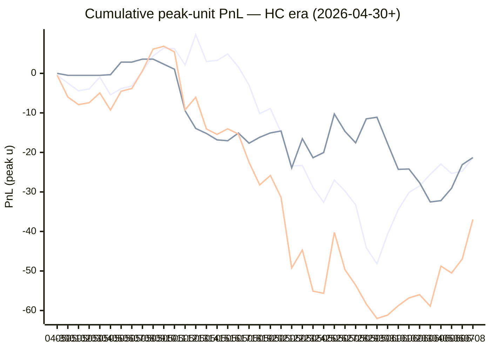

# Sharp Intel v6 — Daily Master Report

_Auto-generated **6/9/2026, 11:45:11 AM ET** by `scripts/dailyV6Report.js`. Do not edit by hand._

**Source of truth: this report mirrors the live Pick Performance dashboard.** Inclusion = `lockStage ≠ SHADOW ∧ ¬superseded ∧ health ∉ {MUTED, CANCELLED} ∧ peak.stars ≥ 2.5`. PnL is in **peak units** (the size shipped to users). HC margin / Δw / Δq are the **frozen** stamps written at last sync before the T-15 freeze. HC margin only existed from the v7.1 launch (**2026-04-30**); pre-launch picks have no HC value (no retro-fitting). Nothing is recomputed against today's whitelist.

v6 cutover: **2026-04-18** · whitelist source: live `sharpWalletProfiles` (236 profiles — drives §5 roster snapshot only) · quality cut: contribution ≥ 30 · HC = CONFIRMED tier ∧ sizeRatio ≥ 1.5.

---
## §1. Yesterday's picks

Slate: **2026-06-08** · 13 shipped sides.

| N | W-L-P | WR% | PnL (peak u) | PnL (flat 1u) |
|---|---|---|---|---|
| 13 | 7-5-1 | 58.3% | +10.02u | +1.58u |

| Sport | Market | Matchup | Pick | Stars · Units | HC | Δw | Δq | Σ | Odds | Result | PnL (peak u) |
|---|---|---|---|---|---|---|---|---|---|---|---|
| MLB | ML | Boston Red Sox @ Tampa Bay Rays | Boston Red Sox | 4.5★ · 3.00u | +1 | +6 | +5 | +11 | -113 | L | -3.00u |
| MLB | ML | Cincinnati Reds @ San Diego Padres | San Diego Padres | 4.5★ · 3.00u | +0 | +3 | +2 | +5 | -129 | **W** | +2.27u |
| MLB | ML | Houston Astros @ Los Angeles Angels | Houston Astros | 4.5★ · 3.00u | +1 | +1 | +2 | +3 | -121 | **W** | +2.31u |
| MLB | ML | Milwaukee Brewers @ Athletics | Milwaukee Brewers | 4.5★ · 3.00u | +0 | +1 | +1 | +2 | -146 | **W** | +2.00u |
| MLB | ML | New York Yankees @ Cleveland Guardians | Cleveland Guardians | 4.0★ · 1.00u | +0 | +2 | +2 | +4 | -118 | L | -1.00u |
| MLB | ML | Washington Nationals @ San Francisco Giants | Washington Nationals | 4.5★ · 1.50u | -1 | +0 | -1 | -1 | +151 | **W** | +2.27u |
| MLB | TOTAL | Cincinnati Reds @ San Diego Padres | Under 7.5 | 4.5★ · 3.00u | +0 | +0 | +2 | +2 | -110 | L | -3.00u |
| MLB | TOTAL | Houston Astros @ Los Angeles Angels | Over 9.5 | 4.5★ · 3.00u | +0 | +1 | -1 | +0 | -110 | P | +0.00u |
| MLB | TOTAL | New York Yankees @ Cleveland Guardians | Over 7.5 | 4.5★ · 2.50u | -2 | -2 | +0 | -2 | -116 | **W** | +2.55u |
| MLB | TOTAL | Washington Nationals @ San Francisco Giants | Under 8 | 5.0★ · 2.50u | +0 | +0 | -1 | -1 | +101 | **W** | +2.52u |
| NBA | ML | Spurs @ Knicks | Knicks | 2.5★ · 0.25u | +2 | +5 | +6 | +11 | -132 | L | -0.25u |
| NBA | SPREAD | Spurs @ Knicks | Spurs | 5.0★ · 5.00u | +2 | +3 | +3 | +6 | -110 | **W** | +4.35u |
| NBA | TOTAL | Spurs @ Knicks | Under 216 | 4.0★ · 1.00u | +0 | +1 | -1 | +0 | -107 | L | -1.00u |

---
## §2. 3-day / 7-day / all-time cohort rollups

Shipped picks only. PnL in **peak units** (size we actually bet) and flat 1u (cohort EV lens). All margins are the engine's frozen stamps (`v8_hcMargin`, `v8_walletConsensusDelta`, `v8_walletConsensusQualityMargin`).

**HC margin sub-tables** are scoped to picks dated ≥ 2026-04-30 (the v7.1 launch — when HC margin became a real engine signal). Pre-launch picks are excluded from HC analysis since the feature didn't exist for them. Δw / Δq sub-tables span the full v6-era sample (≥ 2026-04-18). Empty buckets are dropped.

### §2a. 3-day

Total: **52** shipped · 29-22-1 · WR 56.9% · PnL +11.82u (peak) / +3.56u (flat).

**By HC margin** _(picks dated ≥ 2026-04-30, N = 52)_

| Bucket | N | W-L-P | WR% | PnL (peak u) | PnL (flat 1u) |
|---|---|---|---|---|---|
| HC = +2 | 3 | 2-1-0 | 66.7% | +5.86u | +0.52u |
| HC = +1 | 10 | 5-5-0 | 50.0% | -4.26u | -0.55u |
| HC = 0 | 35 | 20-14-1 | 58.8% | +10.90u | +3.23u |
| HC ≤ −1 | 4 | 2-2-0 | 50.0% | -0.68u | +0.37u |

**By Δw (winner margin)**

| Bucket | N | W-L-P | WR% | PnL (peak u) | PnL (flat 1u) |
|---|---|---|---|---|---|
| ≥ +3 | 5 | 3-2-0 | 60.0% | +6.12u | +0.59u |
| +2 | 5 | 3-2-0 | 60.0% | -1.32u | +0.24u |
| +1 | 21 | 11-9-1 | 55.0% | -0.67u | +1.04u |
| 0 | 17 | 10-7-0 | 58.8% | +7.61u | +1.80u |
| −1 | 2 | 1-1-0 | 50.0% | +0.03u | +0.03u |
| ≤ −2 | 2 | 1-1-0 | 50.0% | +0.05u | -0.14u |

**By Δq (quality margin)**

| Bucket | N | W-L-P | WR% | PnL (peak u) | PnL (flat 1u) |
|---|---|---|---|---|---|
| ≥ +3 | 3 | 1-2-0 | 33.3% | +1.10u | -1.09u |
| +2 | 7 | 4-3-0 | 57.1% | +1.30u | +0.38u |
| +1 | 15 | 10-5-0 | 66.7% | +5.50u | +3.19u |
| 0 | 16 | 9-7-0 | 56.3% | -1.01u | +0.70u |
| −1 | 9 | 4-4-1 | 50.0% | +5.72u | +0.45u |
| ≤ −2 | 2 | 1-1-0 | 50.0% | -0.79u | -0.07u |

**By AGS tier** _(picks dated ≥ 2026-05-05, N = 52)_

| Bucket | N | W-L-P | WR% | PnL (peak u) | PnL (flat 1u) |
|---|---|---|---|---|---|
| NEUT   (0 .. +3) | 22 | 10-12-0 | 45.5% | -1.18u | -2.14u |
| WEAK   (−1 .. 0) | 28 | 18-9-1 | 66.7% | +12.95u | +5.84u |
| FADE   (< −1) | 2 | 1-1-0 | 50.0% | +0.05u | -0.14u |

### §2b. 7-day

Total: **112** shipped · 62-48-2 · WR 56.4% · PnL +21.83u (peak) / +7.44u (flat).

**By HC margin** _(picks dated ≥ 2026-04-30, N = 112)_

| Bucket | N | W-L-P | WR% | PnL (peak u) | PnL (flat 1u) |
|---|---|---|---|---|---|
| HC ≥ +3 | 1 | 0-1-0 | 0.0% | -0.25u | -1.00u |
| HC = +2 | 7 | 5-2-0 | 71.4% | +13.38u | +1.72u |
| HC = +1 | 19 | 10-9-0 | 52.6% | +0.02u | -0.56u |
| HC = 0 | 74 | 40-32-2 | 55.6% | +2.99u | +3.54u |
| HC ≤ −1 | 11 | 7-4-0 | 63.6% | +5.69u | +3.74u |

**By Δw (winner margin)**

| Bucket | N | W-L-P | WR% | PnL (peak u) | PnL (flat 1u) |
|---|---|---|---|---|---|
| ≥ +3 | 13 | 7-6-0 | 53.8% | +6.33u | -0.16u |
| +2 | 11 | 7-4-0 | 63.6% | +5.97u | +1.89u |
| +1 | 46 | 24-21-1 | 53.3% | -1.68u | +1.59u |
| 0 | 34 | 19-14-1 | 57.6% | +7.89u | +2.49u |
| −1 | 5 | 3-2-0 | 60.0% | +3.11u | +1.15u |
| ≤ −2 | 3 | 2-1-0 | 66.7% | +0.21u | +0.49u |

**By Δq (quality margin)**

| Bucket | N | W-L-P | WR% | PnL (peak u) | PnL (flat 1u) |
|---|---|---|---|---|---|
| ≥ +3 | 11 | 7-4-0 | 63.6% | +5.21u | +1.73u |
| +2 | 16 | 9-7-0 | 56.3% | +1.60u | +0.41u |
| +1 | 34 | 21-13-0 | 61.8% | +15.30u | +6.01u |
| 0 | 34 | 18-15-1 | 54.5% | -4.73u | +0.84u |
| −1 | 15 | 6-8-1 | 42.9% | +5.24u | -1.47u |
| ≤ −2 | 2 | 1-1-0 | 50.0% | -0.79u | -0.07u |

**By AGS tier** _(picks dated ≥ 2026-05-05, N = 112)_

| Bucket | N | W-L-P | WR% | PnL (peak u) | PnL (flat 1u) |
|---|---|---|---|---|---|
| NEUT   (0 .. +3) | 43 | 23-20-0 | 53.5% | +2.82u | +1.25u |
| WEAK   (−1 .. 0) | 66 | 37-27-2 | 57.8% | +17.71u | +5.08u |
| FADE   (< −1) | 3 | 2-1-0 | 66.7% | +1.30u | +1.11u |

### §2c. All-time

Total: **534** shipped · 271-258-5 · WR 51.2% · PnL -49.17u (peak) / -10.90u (flat).

**By HC margin** _(picks dated ≥ 2026-04-30, N = 423)_

| Bucket | N | W-L-P | WR% | PnL (peak u) | PnL (flat 1u) |
|---|---|---|---|---|---|
| HC ≥ +3 | 10 | 3-7-0 | 30.0% | -8.83u | -5.67u |
| HC = +2 | 30 | 15-15-0 | 50.0% | -7.11u | -1.13u |
| HC = +1 | 145 | 80-65-0 | 55.2% | -5.40u | +9.14u |
| HC = 0 | 217 | 112-101-4 | 52.6% | -21.30u | -5.66u |
| HC ≤ −1 | 20 | 10-10-0 | 50.0% | +4.07u | +1.19u |

**By Δw (winner margin)**

| Bucket | N | W-L-P | WR% | PnL (peak u) | PnL (flat 1u) |
|---|---|---|---|---|---|
| ≥ +3 | 96 | 46-50-0 | 47.9% | -26.29u | -3.01u |
| +2 | 118 | 56-62-0 | 47.5% | -31.34u | -8.39u |
| +1 | 185 | 104-79-2 | 56.8% | +8.48u | +13.04u |
| 0 | 106 | 54-49-3 | 52.4% | +4.50u | -3.55u |
| −1 | 18 | 5-13-0 | 27.8% | -5.47u | -8.32u |
| ≤ −2 | 5 | 2-3-0 | 40.0% | -3.04u | -1.51u |
| missing | 6 | 4-2-0 | 66.7% | +3.99u | +0.85u |

**By Δq (quality margin)**

| Bucket | N | W-L-P | WR% | PnL (peak u) | PnL (flat 1u) |
|---|---|---|---|---|---|
| ≥ +3 | 116 | 57-57-2 | 50.0% | -21.64u | -3.27u |
| +2 | 105 | 47-58-0 | 44.8% | -39.46u | -13.83u |
| +1 | 163 | 89-73-1 | 54.9% | +20.56u | +6.51u |
| 0 | 94 | 49-44-1 | 52.7% | -7.14u | +0.06u |
| −1 | 38 | 22-15-1 | 59.5% | +13.08u | +5.21u |
| ≤ −2 | 12 | 3-9-0 | 25.0% | -17.81u | -6.36u |
| missing | 6 | 4-2-0 | 66.7% | +3.24u | +0.77u |

**By AGS tier** _(picks dated ≥ 2026-05-05, N = 398)_

| Bucket | N | W-L-P | WR% | PnL (peak u) | PnL (flat 1u) |
|---|---|---|---|---|---|
| ELITE  (≥ +7) | 3 | 3-0-0 | 100.0% | +8.01u | +2.34u |
| LOCK   (+5 .. +7) | 9 | 5-4-0 | 55.6% | -2.93u | -0.47u |
| STRONG (+3 .. +5) | 22 | 13-9-0 | 59.1% | -6.66u | +2.77u |
| NEUT   (0 .. +3) | 252 | 126-126-0 | 50.0% | -48.41u | -16.47u |
| WEAK   (−1 .. 0) | 98 | 53-42-3 | 55.8% | +13.35u | +6.69u |
| FADE   (< −1) | 13 | 8-5-0 | 61.5% | +3.02u | +3.27u |
| missing | 1 | 1-0-0 | 100.0% | +1.63u | +0.96u |

---
## §3. Edge over time — is HC margin creating winners?

Daily cumulative peak-unit PnL since the HC margin launch (**2026-04-30**). The `HC ≥ +1` line is the golden-standard cohort. The `HC = 0` line is the no-HC-signal control. The `All shipped (HC era)` line is every shipped pick from the same date range — the apples-to-apples baseline. Watch the spread.

Daily cumulative table (peak units, HC era only):

| Date | HC ≥ +1 (cum) | HC = 0 (cum) | All shipped (cum) |
|---|---|---|---|
| 2026-04-30 | -0.48u | +0.00u | -0.48u |
| 2026-05-01 | -2.48u | -0.50u | -5.98u |
| 2026-05-02 | -4.41u | -0.50u | -7.91u |
| 2026-05-03 | -3.94u | -0.50u | -7.44u |
| 2026-05-04 | -0.95u | -0.50u | -4.95u |
| 2026-05-05 | -5.45u | -0.34u | -9.29u |
| 2026-05-06 | -3.86u | +2.84u | -4.52u |
| 2026-05-07 | -3.18u | +2.84u | -3.84u |
| 2026-05-08 | +0.54u | +3.60u | +0.64u |
| 2026-05-09 | +4.41u | +3.60u | +6.14u |
| 2026-05-10 | +6.41u | +2.32u | +6.86u |
| 2026-05-11 | +6.25u | +1.05u | +5.43u |
| 2026-05-12 | +2.11u | -9.45u | -9.21u |
| 2026-05-13 | +9.78u | -13.95u | -6.04u |
| 2026-05-14 | +3.00u | -15.20u | -14.07u |
| 2026-05-15 | +3.27u | -16.83u | -15.43u |
| 2026-05-16 | +4.90u | -17.05u | -14.02u |
| 2026-05-17 | +1.62u | -15.11u | -15.36u |
| 2026-05-18 | -2.98u | -17.67u | -22.52u |
| 2026-05-19 | -10.18u | -16.17u | -28.22u |
| 2026-05-20 | -8.90u | -15.07u | -25.84u |
| 2026-05-21 | -14.92u | -14.58u | -31.37u |
| 2026-05-22 | -23.44u | -23.93u | -49.24u |
| 2026-05-23 | -23.30u | -16.53u | -44.70u |
| 2026-05-24 | -28.89u | -21.34u | -55.10u |
| 2026-05-25 | -32.63u | -20.03u | -55.65u |
| 2026-05-26 | -26.98u | -10.27u | -40.24u |
| 2026-05-27 | -29.77u | -14.68u | -49.69u |
| 2026-05-28 | -33.27u | -17.58u | -53.57u |
| 2026-05-29 | -44.12u | -11.51u | -58.35u |
| 2026-05-30 | -48.21u | -11.10u | -62.03u |
| 2026-05-31 | -40.65u | -17.79u | -61.16u |
| 2026-06-01 | -34.49u | -24.29u | -58.77u |
| 2026-06-02 | -30.14u | -24.19u | -56.82u |
| 2026-06-03 | -28.48u | -27.68u | -56.00u |
| 2026-06-04 | -25.53u | -32.54u | -58.91u |
| 2026-06-05 | -22.94u | -32.20u | -48.76u |
| 2026-06-06 | -25.33u | -29.06u | -50.51u |
| 2026-06-07 | -24.75u | -23.09u | -46.96u |
| 2026-06-08 | -21.34u | -21.30u | -36.94u |

---
## §4. Wallet roster growth & profitability

"Tracked in sport X" = a wallet has placed **≥ 2 bets** in X within the v6-era sample. "Profitable" = cumulative flat PnL > 0. Source: `v8Scoring.walletDetails` on every graded v6-era game (every side, not just the shipped set).

### §4a. Per-sport wallet snapshot

| Sport | Total wallets seen | Tracked (≥2) | Profitable | % prof | WR ≥ 50% | WR ≥ 60% | WR ≥ 70% |
|---|---|---|---|---|---|---|---|
| MLB | 71 | 53 | 16 | 30% | 26 | 7 | 3 |
| NBA | 135 | 103 | 44 | 43% | 58 | 28 | 12 |
| NHL | 58 | 41 | 14 | 34% | 23 | 13 | 6 |
| **ALL (any sport)** | **169** | **135** | **55** | **41%** | **73** | **28** | **12** |

### §4b. Daily roster growth (cumulative through each date)

Format: `tracked (profitable)`. For each date D, recompute the roster using every bet up to and including D.

| Date | ALL | MLB | NBA | NHL |
|---|---|---|---|---|
| 2026-04-18 | 5 (2) | 2 (2) | 3 (0) | 0 (0) |
| 2026-04-19 | 19 (8) | 5 (3) | 9 (3) | 3 (1) |
| 2026-04-20 | 29 (12) | 7 (6) | 23 (8) | 5 (2) |
| 2026-04-21 | 44 (21) | 10 (6) | 31 (10) | 7 (5) |
| 2026-04-22 | 52 (28) | 12 (6) | 39 (15) | 11 (10) |
| 2026-04-23 | 56 (29) | 13 (6) | 46 (21) | 13 (10) |
| 2026-04-24 | 61 (30) | 14 (6) | 51 (23) | 14 (9) |
| 2026-04-25 | 65 (29) | 16 (8) | 54 (22) | 16 (9) |
| 2026-04-26 | 67 (31) | 18 (5) | 56 (25) | 17 (9) |
| 2026-04-27 | 72 (32) | 20 (7) | 60 (24) | 17 (9) |
| 2026-04-28 | 76 (33) | 21 (7) | 63 (26) | 23 (10) |
| 2026-04-29 | 77 (33) | 21 (7) | 64 (25) | 23 (10) |
| 2026-04-30 | 81 (34) | 21 (7) | 70 (27) | 23 (10) |
| 2026-05-01 | 85 (38) | 22 (5) | 74 (30) | 26 (13) |
| 2026-05-02 | 86 (37) | 23 (7) | 75 (32) | 26 (12) |
| 2026-05-03 | 86 (38) | 24 (8) | 75 (33) | 26 (12) |
| 2026-05-04 | 90 (38) | 24 (9) | 76 (32) | 26 (12) |
| 2026-05-05 | 91 (40) | 24 (9) | 79 (33) | 26 (12) |
| 2026-05-06 | 92 (40) | 24 (9) | 80 (33) | 26 (12) |
| 2026-05-07 | 92 (41) | 24 (9) | 80 (33) | 26 (12) |
| 2026-05-08 | 92 (40) | 24 (8) | 80 (32) | 26 (11) |
| 2026-05-09 | 94 (42) | 24 (8) | 82 (35) | 26 (11) |
| 2026-05-10 | 94 (42) | 24 (8) | 82 (35) | 26 (11) |
| 2026-05-11 | 96 (42) | 24 (8) | 84 (36) | 26 (11) |
| 2026-05-12 | 100 (41) | 27 (9) | 86 (37) | 26 (11) |
| 2026-05-13 | 102 (45) | 29 (11) | 88 (37) | 26 (11) |
| 2026-05-14 | 102 (41) | 29 (11) | 88 (37) | 28 (12) |
| 2026-05-15 | 103 (41) | 30 (10) | 88 (39) | 28 (12) |
| 2026-05-16 | 105 (43) | 31 (12) | 88 (39) | 30 (14) |
| 2026-05-17 | 105 (46) | 32 (11) | 88 (40) | 30 (14) |
| 2026-05-18 | 105 (46) | 32 (10) | 88 (38) | 31 (15) |
| 2026-05-19 | 105 (46) | 32 (12) | 88 (38) | 31 (15) |
| 2026-05-20 | 106 (48) | 33 (12) | 88 (38) | 31 (16) |
| 2026-05-21 | 106 (45) | 34 (12) | 88 (37) | 31 (14) |
| 2026-05-22 | 106 (44) | 34 (10) | 88 (39) | 33 (16) |
| 2026-05-23 | 111 (49) | 36 (10) | 90 (40) | 36 (19) |
| 2026-05-24 | 117 (52) | 37 (12) | 94 (39) | 37 (16) |
| 2026-05-25 | 120 (53) | 38 (13) | 95 (40) | 38 (16) |
| 2026-05-26 | 122 (55) | 39 (14) | 97 (42) | 38 (16) |
| 2026-05-27 | 123 (51) | 40 (12) | 97 (42) | 40 (14) |
| 2026-05-28 | 124 (51) | 40 (12) | 99 (42) | 40 (14) |
| 2026-05-29 | 125 (50) | 41 (12) | 99 (42) | 41 (12) |
| 2026-05-30 | 126 (49) | 41 (12) | 101 (43) | 41 (12) |
| 2026-05-31 | 126 (48) | 41 (11) | 101 (43) | 41 (12) |
| 2026-06-01 | 129 (52) | 44 (14) | 101 (43) | 41 (12) |
| 2026-06-02 | 130 (56) | 45 (16) | 101 (43) | 41 (13) |
| 2026-06-03 | 132 (56) | 45 (14) | 102 (43) | 41 (13) |
| 2026-06-04 | 132 (57) | 46 (14) | 102 (43) | 41 (14) |
| 2026-06-05 | 132 (57) | 48 (15) | 102 (43) | 41 (14) |
| 2026-06-06 | 132 (57) | 49 (15) | 102 (43) | 41 (14) |
| 2026-06-07 | 133 (56) | 52 (16) | 102 (43) | 41 (14) |
| 2026-06-08 | 135 (55) | 53 (16) | 103 (44) | 41 (14) |

### §4c. Top 10 profitable wallets by sport

#### MLB

| # | Wallet | N | W | L | WR% | Flat PnL (u) | Flat ROI | $ PnL |
|---|---|---|---|---|---|---|---|---|
| 1 | a8c991 | 2 | 2 | 0 | 100.0% | +2.60 | +129.9% | $62.6K |
| 2 | e05213 | 8 | 7 | 1 | 87.5% | +5.36 | +67.0% | $180.5K |
| 3 | c9bba3 | 5 | 4 | 1 | 80.0% | +2.37 | +47.3% | $14.8K |
| 4 | ad88a3 | 2 | 1 | 1 | 50.0% | +0.80 | +40.0% | $1.6K |
| 5 | 913987 | 37 | 25 | 12 | 67.6% | +11.66 | +31.5% | $754.1K |
| 6 | 981187 | 8 | 5 | 3 | 62.5% | +1.65 | +20.7% | $13.5K |
| 7 | eeabaf | 45 | 24 | 21 | 53.3% | +8.93 | +19.8% | $843.3K |
| 8 | c668b3 | 16 | 10 | 6 | 62.5% | +3.16 | +19.7% | $270 |
| 9 | 491f30 | 13 | 7 | 6 | 53.8% | +2.47 | +19.0% | $14.3K |
| 10 | c289a0 | 5 | 3 | 2 | 60.0% | +0.87 | +17.3% | -$2.5K |

#### NBA

| # | Wallet | N | W | L | WR% | Flat PnL (u) | Flat ROI | $ PnL |
|---|---|---|---|---|---|---|---|---|
| 1 | 799fad | 2 | 2 | 0 | 100.0% | +5.66 | +283.0% | $241.7K |
| 2 | a0d6d2 | 4 | 4 | 0 | 100.0% | +4.51 | +112.7% | $6.4K |
| 3 | 4a9953 | 2 | 2 | 0 | 100.0% | +2.16 | +108.2% | $3.7K |
| 4 | a8c991 | 2 | 2 | 0 | 100.0% | +1.95 | +97.3% | $103.1K |
| 5 | 12ad50 | 3 | 3 | 0 | 100.0% | +2.74 | +91.3% | $45.5K |
| 6 | b51a56 | 6 | 5 | 1 | 83.3% | +5.44 | +90.7% | $74.4K |
| 7 | 11b032 | 7 | 6 | 1 | 85.7% | +5.40 | +77.1% | $249.9K |
| 8 | 710c2e | 5 | 4 | 1 | 80.0% | +2.62 | +52.4% | $179.8K |
| 9 | 769c38 | 15 | 12 | 3 | 80.0% | +7.01 | +46.7% | $64.0K |
| 10 | 92df91 | 23 | 16 | 7 | 69.6% | +10.26 | +44.6% | -$214 |

#### NHL

| # | Wallet | N | W | L | WR% | Flat PnL (u) | Flat ROI | $ PnL |
|---|---|---|---|---|---|---|---|---|
| 1 | 8366f5 | 2 | 2 | 0 | 100.0% | +2.30 | +114.9% | $107.6K |
| 2 | 799fad | 2 | 2 | 0 | 100.0% | +1.88 | +94.1% | $46.9K |
| 3 | fec67e | 4 | 3 | 1 | 75.0% | +2.82 | +70.5% | $12.5K |
| 4 | 30935c | 4 | 3 | 1 | 75.0% | +2.11 | +52.7% | $953 |
| 5 | 981187 | 8 | 6 | 2 | 75.0% | +3.52 | +44.0% | -$25.2K |
| 6 | fcc12b | 11 | 8 | 3 | 72.7% | +4.45 | +40.5% | -$27.5K |
| 7 | bc3532 | 19 | 12 | 7 | 63.2% | +6.05 | +31.9% | $64.1K |
| 8 | e70853 | 9 | 6 | 3 | 66.7% | +2.66 | +29.5% | -$11.1K |
| 9 | dfa240 | 26 | 17 | 9 | 65.4% | +6.49 | +24.9% | $19.9K |
| 10 | c5cea1 | 3 | 2 | 1 | 66.7% | +0.62 | +20.7% | $22.1K |

---
## §5. Proven-wallet roster growth & HC tracking

"Proven wallet" = whitelist tier `CONFIRMED` or `FLAT` in the same sense the live engine uses (`exportWalletProfiles.js` → `sharpWalletProfiles.bySport`). Sports inherit independent rosters: a wallet can be CONFIRMED in NBA and absent from NHL. `walletBets` come from `v8Scoring.walletDetails` on every graded v6-era pick (Source A); `positionRows` come from `sharp_action_positions` (Source B).

### §5a. Current proven-winner roster (snapshot)

Roster as of **2026-06-08** — wallets with ≥2 bets in the sport.

| Sport | Wallets seen | Eligible (≥2) | CONFIRMED | FLAT | Proven (C+F) | WR50 only | Conv % |
|---|---|---|---|---|---|---|---|
| MLB | 119 | 53 | 11 | 5 | **16** | 11 | 13.4% |
| NBA | 202 | 103 | 29 | 15 | **44** | 20 | 21.8% |
| NHL | 101 | 41 | 9 | 5 | **14** | 9 | 13.9% |
| **ALL** | **—** | **—** | **—** | **—** | **74** | **—** | **—** |

### §5b. Live whitelist drift check

Live `sharpWalletProfiles` is what the engine reads at lock time. Drift between script reconstruction (above) and live should be ≤ 1 day of position data — otherwise `exportWalletProfiles.js` is stale.

| Sport | CONFIRMED (live · script) | FLAT (live · script) | WR50 (live · script) | Drift |
|---|---|---|---|---|
| MLB | 31 · 11 | 9 · 5 | 9 · 11 | +24 live |
| NBA | 52 · 29 | 27 · 15 | 24 · 20 | +35 live |
| NHL | 20 · 9 | 7 · 5 | 13 · 9 | +13 live |

### §5c. Roster growth — 3d / 7d / 30d / all-time deltas

Each cell is **net growth** in proven (CONFIRMED + FLAT) wallets in that window, with the absolute count at the start (`+Δ from N`). Negative = wallets demoted. Window endpoint = 2026-06-08.

| Sport | 3-day | 7-day | 30-day | All-time (since cutover) |
|---|---|---|---|---|
| MLB | +1 from 15 | +2 from 14 | +8 from 8 | +16 from 0 |
| NBA | +1 from 43 | +1 from 43 | +9 from 35 | +44 from 0 |
| NHL | +0 from 14 | +2 from 12 | +3 from 11 | +14 from 0 |

A flat 7-day delta on a sport with healthy slate density = either the bubble pipeline has stalled (no wallets approaching the bar) or our cohort has saturated. Check §13d for the funnel diagnostic.

### §5d. Pipeline funnel — where each sport leaks

Wallets surviving each gate, in order. The biggest %-drop tells you the bottleneck. Gates:

1. **Seen** — placed ≥ 1 bet in the sport (any source)
2. **Eligible** — ≥ 2 graded picks in Source A (required for FLAT/CONFIRMED)
3. **Flat-OK** — eligible AND flat ROI > 0 (becomes FLAT or better)
4. **$-OK** — Flat-OK AND ≥2 positions with dollar ROI > 0 (CONFIRMED)
5. **Promoted** — final whitelisted = CONFIRMED + FLAT

| Sport | 1·Seen | 2·Eligible (% of Seen) | 3·Flat-OK (% of Elig) | 4·$-OK (% of Flat) | 5·Promoted | Bottleneck |
|---|---|---|---|---|---|---|
| MLB | 119 | 53 (45%) | 16 (30%) | 11 (69%) | **16** | edge (Eligible→Flat-OK) 70% |
| NBA | 202 | 103 (51%) | 44 (43%) | 29 (66%) | **44** | edge (Eligible→Flat-OK) 57% |
| NHL | 101 | 41 (41%) | 14 (34%) | 9 (64%) | **14** | edge (Eligible→Flat-OK) 66% |

### §5e. HC backing density (the fuel for v7.3 HC margin)

Every v7.x promotion is gated on `HC_m ≥ +1`, which requires at least one CONFIRMED wallet sized at `≥ 1.5×` average on the for-side. This table shows the share of shipped picks that *had any HC backing*, by sport, in each window. If HC density falls toward zero in a sport, the v7.3 floor cohorts (Σ=1, Σ=2 locks; HC rescues) will simply stop firing there.

| Sport | Window | Picks (with HC stamp) | Any HC for-side | HC_m ≥ +1 | HC_m ≥ +2 |
|---|---|---|---|---|---|
| MLB | 3-day | 49 | 15 (30.6%) | 11 (22.4%) | 1 (2.0%) |
| MLB | 7-day | 103 | 27 (26.2%) | 22 (21.4%) | 3 (2.9%) |
| MLB | All-time | 361 | 140 (38.8%) | 129 (35.7%) | 15 (4.2%) |
| NBA | 3-day | 3 | 2 (66.7%) | 2 (66.7%) | 2 (66.7%) |
| NBA | 7-day | 7 | 5 (71.4%) | 4 (57.1%) | 4 (57.1%) |
| NBA | All-time | 123 | 80 (65.0%) | 67 (54.5%) | 33 (26.8%) |
| NHL | 3-day | 0 | 0 (—) | 0 (—) | 0 (—) |
| NHL | 7-day | 2 | 1 (50.0%) | 1 (50.0%) | 1 (50.0%) |
| NHL | All-time | 44 | 20 (45.5%) | 19 (43.2%) | 5 (11.4%) |

Pooled across sports:

| Window | Picks (with HC stamp) | Any HC for-side | HC_m ≥ +1 | HC_m ≥ +2 |
|---|---|---|---|---|
| 3-day | 52 | 17 (32.7%) | 13 (25.0%) | 3 (5.8%) |
| 7-day | 112 | 33 (29.5%) | 27 (24.1%) | 8 (7.1%) |
| All-time | 528 | 240 (45.5%) | 215 (40.7%) | 53 (10.0%) |

### §5f. Bubble wallets — next-up graduations

Wallets currently NOT promoted but close. Two flavors:

- **One-bet-away** — won the only bet, needs one more positive bet to clear ≥2.
- **Just-under** — has ≥2 bets but flat ROI is between −10% and 0% (one win flips them).

#### MLB

**One-bet-away** (6)

| wallet | picksN | flat PnL | pos N | pos $ROI |
|---|---|---|---|---|
| `...be17` | 1 | +6.95 | 23 | -60% |
| `...e3d0` | 1 | +0.91 | 24 | 27% |
| `...be00` | 1 | +0.87 | 15 | 10% |
| `...9373` | 1 | +0.87 | 0 | — |
| `...9b3c` | 1 | +0.77 | 8 | 52% |
| `...8d26` | 1 | +0.72 | 5 | -22% |

**Just-under** (6)

| wallet | picksN | WR | flat ROI | pos N | pos $ROI |
|---|---|---|---|---|---|
| `...afd2` | 39 | 51% | -0.8% | 151 | -17% |
| `...fc82` | 24 | 50% | -1.2% | 66 | -21% |
| `...600d` | 16 | 50% | -4.3% | 41 | -9% |
| `...0232` | 4 | 50% | -4.5% | 11 | 30% |
| `...2f63` | 96 | 48% | -6.0% | 968 | -8% |
| `...c12b` | 40 | 48% | -6.5% | 67 | -19% |

#### NBA

**One-bet-away** (6)

| wallet | picksN | flat PnL | pos N | pos $ROI |
|---|---|---|---|---|
| `...bf5d` | 1 | +3.15 | 3 | 42% |
| `...ed41` | 1 | +3.15 | 3 | 3% |
| `...6b87` | 1 | +2.05 | 8 | -27% |
| `...9d74` | 1 | +0.93 | 37 | -6% |
| `...c556` | 1 | +0.93 | 3 | 42% |
| `...5c69` | 1 | +0.91 | 2 | 28% |

**Just-under** (6)

| wallet | picksN | WR | flat ROI | pos N | pos $ROI |
|---|---|---|---|---|---|
| `...d814` | 8 | 50% | -0.5% | 53 | 1% |
| `...65dd` | 6 | 50% | -2.4% | 17 | 27% |
| `...853d` | 40 | 53% | -2.7% | 90 | -2% |
| `...1eae` | 19 | 53% | -3.3% | 76 | 15% |
| `...0563` | 4 | 50% | -3.5% | 37 | 42% |
| `...f5b0` | 20 | 50% | -3.7% | 57 | -28% |

#### NHL

**One-bet-away** (6)

| wallet | picksN | flat PnL | pos N | pos $ROI |
|---|---|---|---|---|
| `...2e78` | 1 | +1.46 | 0 | — |
| `...017f` | 1 | +1.45 | 6 | 108% |
| `...32f2` | 1 | +1.40 | 0 | — |
| `...e0fd` | 1 | +1.20 | 3 | 124% |
| `...266e` | 1 | +1.05 | 0 | — |
| `...2194` | 1 | +1.05 | 0 | — |

**Just-under** (6)

| wallet | picksN | WR | flat ROI | pos N | pos $ROI |
|---|---|---|---|---|---|
| `...33ee` | 4 | 50% | -0.3% | 8 | -23% |
| `...afd2` | 6 | 50% | -1.9% | 24 | -19% |
| `...192c` | 7 | 43% | -2.9% | 21 | -15% |
| `...35e3` | 7 | 57% | -5.5% | 26 | 31% |
| `...618e` | 2 | 50% | -6.1% | 28 | 24% |
| `...9ef0` | 7 | 43% | -8.6% | 23 | 0% |

### §5g. v2 wallet-promotion pipeline (Source-A / Source-B mix)

Live snapshot of the v2 promotion gate (shipped 2026-05-10, re-eval **2026-05-24**). Each FLAT-or-better wallet × sport pair is attributed to one of three paths via `sharpWalletProfiles[wallet].bySport[sport].whitelistSource`:

- **A** — flat-positive on featured picks (Source A) only — the v1 gate
- **A+B** — flat-positive in both sources (most reliable signal)
- **B** — flat-positive on-chain only (NEW in v2 — the trial lift)

Re-classified every 2h via `grade-sharp-actions` cron. Roll-back: set `B_ONLY_MIN_BETS = Infinity` in `scripts/exportWalletProfiles.js`.

#### Source mix per sport (live Firestore)

| Sport | A | A+B | B (new) | FLAT-or-better total | % from B-only |
|---|---|---|---|---|---|
| MLB | 3 | 13 | **24** | 40 | 60.0% |
| NBA | 12 | 32 | **35** | 79 | 44.3% |
| NHL | 4 | 10 | **13** | 27 | 48.1% |
| **ALL** | **19** | **55** | **72** | **146** | **49.3%** |

#### Pipeline freshness

- `sharp_action_positions` GRADED rows: **12421**
- `sharp_action_positions` PENDING rows: **105** (queued for next Grade Sharp Actions run)
- Latest `sharpWalletProfiles` rebuild: 6/9/2026, 6:32:57 AM ET — **312 min · STALE** — check grade-sharp-actions workflow

**Alarms**: pending > 200 OR rebuild lag > 4h → cron is lagging or failing — check `gh run list --workflow="Grade Sharp Actions"`.

#### B-only roster — wallets currently promoted via Source B path only

Wallets here would have been EXCLUDED under v1 (Source-A-only). Top by Source-B bet count per sport. The 2-week re-eval (2026-05-24) will compare these wallets' realized lift against A-only and A+B cohorts.

**MLB** — 24 wallets promoted via B

| wallet | tier | B_n | B_flat ROI | B_$ ROI |
|---|---|---|---|---|
| `...9a27` | CONFIRMED | 467 | +12.3% | +4.4% |
| `...135d` | CONFIRMED | 332 | +1.1% | +3.4% |
| `...1eae` | CONFIRMED | 143 | +6% | +1% |
| `...69c2` | CONFIRMED | 66 | +17.4% | +1% |
| `...c684` | FLAT | 63 | +3.7% | -8.4% |
| `...d6d2` | FLAT | 38 | +6.8% | -25.5% |
| `...ad50` | CONFIRMED | 34 | +15.1% | +1.3% |
| `...cff6` | CONFIRMED | 24 | +7% | +18.8% |
| `...e3d0` | CONFIRMED | 24 | +5.6% | +27.2% |
| `...39b3` | FLAT | 22 | +0.2% | -1.6% |
| … | 14 more | | | |

**NBA** — 35 wallets promoted via B

| wallet | tier | B_n | B_flat ROI | B_$ ROI |
|---|---|---|---|---|
| `...135d` | FLAT | 103 | +4.1% | -12.6% |
| `...1eae` | CONFIRMED | 76 | +0.7% | +15% |
| `...3782` | FLAT | 67 | +0.6% | -1.1% |
| `...935c` | FLAT | 50 | +17.3% | -21.4% |
| `...68b3` | CONFIRMED | 44 | +33.9% | +13.9% |
| `...b6ef` | CONFIRMED | 42 | +6.3% | +3.3% |
| `...9d74` | FLAT | 37 | +6.5% | -5.8% |
| `...0563` | CONFIRMED | 37 | +4.9% | +41.7% |
| `...e2ce` | CONFIRMED | 33 | +21.2% | +32.3% |
| `...9e7a` | FLAT | 31 | +8% | -13.6% |
| … | 25 more | | | |

**NHL** — 13 wallets promoted via B

| wallet | tier | B_n | B_flat ROI | B_$ ROI |
|---|---|---|---|---|
| `...1697` | CONFIRMED | 48 | +4.1% | +14.1% |
| `...618e` | CONFIRMED | 28 | +6.2% | +23.8% |
| `...35e3` | CONFIRMED | 26 | +10.6% | +31.5% |
| `...5eee` | CONFIRMED | 23 | +30.5% | +19.3% |
| `...192c` | FLAT | 21 | +14% | -15.2% |
| `...0c2e` | FLAT | 15 | +14.7% | -16.1% |
| `...2ca8` | CONFIRMED | 8 | +16.2% | +4% |
| `...a9cc` | CONFIRMED | 7 | +49.5% | +46.9% |
| `...cff6` | CONFIRMED | 6 | +46.5% | +55.8% |
| `...be00` | CONFIRMED | 6 | +87% | +81.4% |
| … | 3 more | | | |

### §5 — How to read

- **Roster growth flat in 7-day** + **funnel bottleneck = `data`** → re-run `exportWalletProfiles.js`. The flat-positive wallets are stuck at FLAT because Source-B coverage hasn't caught up. CONFIRMED gate is data-bound, not skill-bound.
- **Roster growth flat in 7-day** + **funnel bottleneck = `sample`** → wallets aren't reaching `≥2` reps fast enough. This is a slate-density problem; consider a soft `MIN_BETS = 1` shadow lane to surface bubble wallets earlier.
- **Roster shrank** (negative delta) → a previously CONFIRMED wallet just dropped flat-positive (lost a recent bet). Variance, not failure — but worth noting if a sport loses ≥3 in a week.
- **HC density on a sport drops below ~30%** → v7.3 promotions there will starve. Either the proven roster needs more CONFIRMED-tier wallets sizing aggressively, or the HC_RATIO (1.5) needs a sport-specific tune.
- **§5g B-only count drops sharply** → wallets are demoting off the B path (losing on-chain). Cross-check `WALLET_PROFILES_SUMMARY.md` churn section for the specific demotions.
- **§5g pipeline freshness lag > 4h** → grade-sharp-actions cron is failing. Check `gh run list --workflow="Grade Sharp Actions"` and re-trigger if needed.

---
## §6. Daily proven-wallet performance

Who on the proven roster is actually printing — yesterday's bets, the rolling leaderboard (`$ PnL`-ranked), current streaks, and per-sport volume. **Proven** = `CONFIRMED` ∪ `FLAT` per sport (the same gate that drives Δ_winner). A wallet only counts in a sport where it's on that sport's proven list.

### §6a. Yesterday's proven-wallet bets

Slate: **2026-06-08** · 36 bets · 23 distinct proven wallets · WR 56% · $ vol $1.13M · $ PnL $405.7K.

| Wallet | Sport | Market | Game | $ size | Result | $ PnL |
|---|---|---|---|---|---|---|
| `...e3d0` (FLAT) | NBA | ML | Spurs @ Knicks | $272.6K | **W** | $219.8K |
| `...3f67` (CONFIRMED) | NBA | SPREAD | Spurs @ Knicks | $73.7K | **W** | $64.1K |
| `...3532` (FLAT) | NBA | ML | Spurs @ Knicks | $78.5K | **W** | $63.3K |
| `...5213` (CONFIRMED) | MLB | TOTAL | Washington Nationals @ San Francisco Giants | $55.2K | **W** | $55.7K |
| `...3987` (CONFIRMED) | MLB | TOTAL | Boston Red Sox @ Tampa Bay Rays | $57.4K | **W** | $55.2K |
| `...0c2e` (CONFIRMED) | NBA | ML | Spurs @ Knicks | $54.6K | **W** | $44.0K |
| `...3987` (CONFIRMED) | MLB | ML | Cincinnati Reds @ San Diego Padres | $50.4K | **W** | $38.2K |
| `...aeeb` (CONFIRMED) | NBA | ML | Spurs @ Knicks | $38.1K | **W** | $30.7K |
| `...c991` (CONFIRMED) | NBA | ML | Spurs @ Knicks | $34.5K | **W** | $27.8K |
| `...64aa` (CONFIRMED) | MLB | ML | Philadelphia Phillies @ Toronto Blue Jays | $37.6K | **W** | $22.1K |
| `...abaf` (CONFIRMED) | MLB | ML | Washington Nationals @ San Francisco Giants | $9.3K | **W** | $14.1K |
| `...64aa` (CONFIRMED) | MLB | ML | Cincinnati Reds @ San Diego Padres | $15.5K | **W** | $11.8K |
| `...3987` (CONFIRMED) | MLB | TOTAL | New York Yankees @ Cleveland Guardians | $11.0K | **W** | $11.3K |
| `...8f33` (CONFIRMED) | MLB | ML | Houston Astros @ Los Angeles Angels | $10.8K | **W** | $8.3K |
| `...8f33` (CONFIRMED) | MLB | ML | Milwaukee Brewers @ Athletics | $11.8K | **W** | $7.9K |
| `...8f33` (CONFIRMED) | MLB | ML | Philadelphia Phillies @ Toronto Blue Jays | $12.4K | **W** | $7.3K |
| `...64aa` (CONFIRMED) | MLB | ML | Milwaukee Brewers @ Athletics | $6.6K | **W** | $4.4K |
| `...64aa` (CONFIRMED) | MLB | ML | Houston Astros @ Los Angeles Angels | $4.9K | **W** | $3.7K |
| `...11a4` (CONFIRMED) | NBA | ML | Spurs @ Knicks | $3.5K | **W** | $2.8K |
| `...2f63` (FLAT) | NBA | SPREAD | Spurs @ Knicks | $295 | **W** | $257 |
| `...89a0` (FLAT) | MLB | ML | Boston Red Sox @ Tampa Bay Rays | $4.0K | L | -$4.0K |
| `...00bc` (CONFIRMED) | NBA | ML | Spurs @ Knicks | $4.3K | L | -$4.3K |
| `...0ff5` (FLAT) | MLB | TOTAL | Boston Red Sox @ Tampa Bay Rays | $4.7K | L | -$4.7K |
| `...3532` (FLAT) | NBA | TOTAL | Spurs @ Knicks | $4.9K | L | -$4.9K |
| `...2f63` (FLAT) | NBA | ML | Spurs @ Knicks | $5.0K | L | -$5.0K |
| `...1f30` (CONFIRMED) | MLB | ML | New York Yankees @ Cleveland Guardians | $5.4K | L | -$5.4K |
| `...abaf` (CONFIRMED) | MLB | TOTAL | Cincinnati Reds @ San Diego Padres | $5.8K | L | -$5.8K |
| `...2768` (CONFIRMED) | MLB | ML | Philadelphia Phillies @ Toronto Blue Jays | $9.7K | L | -$9.7K |
| `...8f33` (CONFIRMED) | MLB | ML | Boston Red Sox @ Tampa Bay Rays | $10.4K | L | -$10.4K |
| `...dc5b` (CONFIRMED) | NBA | ML | Spurs @ Knicks | $10.4K | L | -$10.4K |
| `...9c38` (CONFIRMED) | NBA | ML | Spurs @ Knicks | $15.9K | L | -$15.9K |
| `...64aa` (CONFIRMED) | MLB | ML | Boston Red Sox @ Tampa Bay Rays | $17.6K | L | -$17.6K |
| `...2f63` (FLAT) | NBA | TOTAL | Spurs @ Knicks | $25.7K | L | -$25.7K |
| `...2ca8` (CONFIRMED) | NBA | ML | Spurs @ Knicks | $30.4K | L | -$30.4K |
| `...23c4` (FLAT) | MLB | TOTAL | Boston Red Sox @ Tampa Bay Rays | $53.9K | L | -$53.9K |
| `...e8f1` (FLAT) | NBA | ML | Spurs @ Knicks | $78.9K | L | -$78.9K |

### §6b. Proven-wallet leaderboard

Top 15 proven `(wallet × sport)` pairs per sport per horizon, ranked by **$ PnL** (the dollar-ROI lens). The 3-day board is the "who's on form right now" lens; the 7-day filters single-day variance; all-time is the proven-roster reference.

#### §6b-1. 3-day

**MLB** — 11 active proven wallets

| # | Wallet | Tier | Bets | WR% | Bets/day | Flat PnL (u) | Flat ROI | $ vol | $ PnL | $ ROI | Streak |
|---|---|---|---|---|---|---|---|---|---|---|---|
| 1 | `...3987` | CONFIRMED | 15 | 67% | 5.0 | +4.52 | +30% | $854.9K | $240.2K | +28% | 4W |
| 2 | `...5213` | CONFIRMED | 2 | 100% | 1.0 | +1.88 | +94% | $157.4K | $144.6K | +92% | 2W |
| 3 | `...64aa` | CONFIRMED | 26 | 69% | 8.7 | +5.33 | +21% | $513.8K | $125.1K | +24% | 4W |
| 4 | `...2768` | CONFIRMED | 11 | 55% | 3.7 | +0.44 | +4% | $104.2K | $9.1K | +9% | 1L |
| 5 | `...1f30` | CONFIRMED | 4 | 50% | 2.0 | -0.14 | -3% | $26.8K | $6.7K | +25% | 1L |
| 6 | `...8f33` | CONFIRMED | 12 | 50% | 4.0 | -1.72 | -14% | $67.1K | $1.2K | +2% | 3W |
| 7 | `...88a3` | CONFIRMED | 1 | 0% | 1.0 | -1.00 | -100% | $2.0K | -$2.0K | -100% | 1L |
| 8 | `...89a0` | FLAT | 2 | 0% | 1.0 | -2.00 | -100% | $4.0K | -$4.0K | -100% | 2L |
| 9 | `...0ff5` | FLAT | 1 | 0% | 1.0 | -1.00 | -100% | $4.7K | -$4.7K | -100% | 1L |
| 10 | `...23c4` | FLAT | 8 | 50% | 2.7 | -0.29 | -4% | $125.0K | -$6.5K | -5% | 1L |
| 11 | `...abaf` | CONFIRMED | 9 | 33% | 3.0 | -2.81 | -31% | $156.1K | -$53.9K | -35% | 1W |

**NBA** — 13 active proven wallets

| # | Wallet | Tier | Bets | WR% | Bets/day | Flat PnL (u) | Flat ROI | $ vol | $ PnL | $ ROI | Streak |
|---|---|---|---|---|---|---|---|---|---|---|---|
| 1 | `...e3d0` | FLAT | 1 | 100% | 1.0 | +0.81 | +81% | $272.6K | $219.8K | +81% | 1W |
| 2 | `...3f67` | CONFIRMED | 1 | 100% | 1.0 | +0.87 | +87% | $73.7K | $64.1K | +87% | 1W |
| 3 | `...3532` | FLAT | 2 | 50% | 2.0 | -0.19 | -10% | $83.4K | $58.4K | +70% | 1L |
| 4 | `...0c2e` | CONFIRMED | 1 | 100% | 1.0 | +0.81 | +81% | $54.6K | $44.0K | +81% | 1W |
| 5 | `...aeeb` | CONFIRMED | 1 | 100% | 1.0 | +0.81 | +81% | $38.1K | $30.7K | +81% | 1W |
| 6 | `...c991` | CONFIRMED | 1 | 100% | 1.0 | +0.81 | +81% | $34.5K | $27.8K | +81% | 1W |
| 7 | `...11a4` | CONFIRMED | 1 | 100% | 1.0 | +0.81 | +81% | $3.5K | $2.8K | +81% | 1W |
| 8 | `...00bc` | CONFIRMED | 1 | 0% | 1.0 | -1.00 | -100% | $4.3K | -$4.3K | -100% | 1L |
| 9 | `...dc5b` | CONFIRMED | 1 | 0% | 1.0 | -1.00 | -100% | $10.4K | -$10.4K | -100% | 1L |
| 10 | `...9c38` | CONFIRMED | 1 | 0% | 1.0 | -1.00 | -100% | $15.9K | -$15.9K | -100% | 1L |
| 11 | `...2ca8` | CONFIRMED | 1 | 0% | 1.0 | -1.00 | -100% | $30.4K | -$30.4K | -100% | 1L |
| 12 | `...2f63` | FLAT | 3 | 33% | 3.0 | -1.13 | -38% | $31.0K | -$30.5K | -98% | 1L |
| 13 | `...e8f1` | FLAT | 1 | 0% | 1.0 | -1.00 | -100% | $78.9K | -$78.9K | -100% | 1L |

**NHL** — 4 active proven wallets

| # | Wallet | Tier | Bets | WR% | Bets/day | Flat PnL (u) | Flat ROI | $ vol | $ PnL | $ ROI | Streak |
|---|---|---|---|---|---|---|---|---|---|---|---|
| 1 | `...3532` | FLAT | 1 | 100% | 1.0 | +0.93 | +93% | $4.0K | $3.7K | +93% | 1W |
| 2 | `...df91` | FLAT | 1 | 100% | 1.0 | +0.93 | +93% | $1.1K | $1.0K | +93% | 1W |
| 3 | `...2125` | CONFIRMED | 1 | 0% | 1.0 | -1.00 | -100% | $1.0K | -$1.0K | -100% | 1L |
| 4 | `...9d74` | CONFIRMED | 1 | 0% | 1.0 | -1.00 | -100% | $2.1K | -$2.1K | -100% | 1L |

#### §6b-2. 7-day

**MLB** — 14 active proven wallets

| # | Wallet | Tier | Bets | WR% | Bets/day | Flat PnL (u) | Flat ROI | $ vol | $ PnL | $ ROI | Streak |
|---|---|---|---|---|---|---|---|---|---|---|---|
| 1 | `...3987` | CONFIRMED | 32 | 66% | 4.6 | +8.38 | +26% | $1.73M | $672.0K | +39% | 4W |
| 2 | `...5213` | CONFIRMED | 8 | 88% | 1.1 | +5.36 | +67% | $260.9K | $180.5K | +69% | 6W |
| 3 | `...64aa` | CONFIRMED | 60 | 58% | 8.6 | +2.74 | +5% | $1.04M | $80.7K | +8% | 4W |
| 4 | `...c991` | CONFIRMED | 2 | 100% | 1.0 | +2.60 | +130% | $61.0K | $62.6K | +103% | 2W |
| 5 | `...8f33` | CONFIRMED | 22 | 64% | 3.1 | +3.89 | +18% | $200.3K | $48.1K | +24% | 3W |
| 6 | `...2768` | CONFIRMED | 13 | 54% | 1.9 | +0.79 | +6% | $123.6K | $14.9K | +12% | 1L |
| 7 | `...23c4` | FLAT | 20 | 60% | 2.9 | +2.83 | +14% | $474.6K | $10.6K | +2% | 1L |
| 8 | `...1f30` | CONFIRMED | 6 | 50% | 1.0 | -0.23 | -4% | $35.8K | $5.1K | +14% | 1L |
| 9 | `...88a3` | CONFIRMED | 2 | 50% | 0.4 | +0.80 | +40% | $3.9K | $1.6K | +41% | 1L |
| 10 | `...68b3` | FLAT | 1 | 0% | 1.0 | -1.00 | -100% | $379 | -$379 | -100% | 1L |
| 11 | `...89a0` | FLAT | 2 | 0% | 1.0 | -2.00 | -100% | $4.0K | -$4.0K | -100% | 2L |
| 12 | `...0ff5` | FLAT | 1 | 0% | 1.0 | -1.00 | -100% | $4.7K | -$4.7K | -100% | 1L |
| 13 | `...bba3` | CONFIRMED | 2 | 50% | 2.0 | -0.06 | -3% | $70.7K | -$51.7K | -73% | 1L |
| 14 | `...abaf` | CONFIRMED | 10 | 30% | 1.4 | -3.81 | -38% | $183.6K | -$81.4K | -44% | 1W |

**NBA** — 25 active proven wallets

| # | Wallet | Tier | Bets | WR% | Bets/day | Flat PnL (u) | Flat ROI | $ vol | $ PnL | $ ROI | Streak |
|---|---|---|---|---|---|---|---|---|---|---|---|
| 1 | `...3f67` | CONFIRMED | 1 | 100% | 1.0 | +0.87 | +87% | $73.7K | $64.1K | +87% | 1W |
| 2 | `...23c4` | CONFIRMED | 3 | 100% | 3.0 | +3.54 | +118% | $45.6K | $51.2K | +112% | 3W |
| 3 | `...0c2e` | CONFIRMED | 1 | 100% | 1.0 | +0.81 | +81% | $54.6K | $44.0K | +81% | 1W |
| 4 | `...c991` | CONFIRMED | 1 | 100% | 1.0 | +0.81 | +81% | $34.5K | $27.8K | +81% | 1W |
| 5 | `...11a4` | CONFIRMED | 3 | 67% | 0.5 | +0.24 | +8% | $43.0K | $14.7K | +34% | 2W |
| 6 | `...9ef0` | CONFIRMED | 3 | 100% | 1.0 | +3.04 | +101% | $11.2K | $12.8K | +114% | 3W |
| 7 | `...03d4` | FLAT | 3 | 100% | 3.0 | +3.54 | +118% | $6.1K | $7.6K | +123% | 3W |
| 8 | `...abaf` | FLAT | 2 | 50% | 0.7 | -0.05 | -2% | $32.7K | $5.5K | +17% | 1L |
| 9 | `...b33b` | CONFIRMED | 2 | 100% | 0.7 | +1.39 | +69% | $4.9K | $3.9K | +79% | 2W |
| 10 | `...32f2` | CONFIRMED | 1 | 100% | 1.0 | +0.95 | +95% | $2.5K | $2.4K | +95% | 1W |
| 11 | `...d6d2` | CONFIRMED | 2 | 100% | 2.0 | +2.60 | +130% | $1.7K | $2.4K | +136% | 2W |
| 12 | `...684d` | CONFIRMED | 1 | 100% | 1.0 | +0.95 | +95% | $1.4K | $1.4K | +95% | 1W |
| 13 | `...00bc` | CONFIRMED | 2 | 50% | 0.5 | -0.57 | -28% | $7.3K | -$3.0K | -42% | 1L |
| 14 | `...dc5b` | CONFIRMED | 1 | 0% | 1.0 | -1.00 | -100% | $10.4K | -$10.4K | -100% | 1L |
| 15 | `...9a27` | CONFIRMED | 2 | 0% | 2.0 | -2.00 | -100% | $14.3K | -$14.3K | -100% | 2L |

**NHL** — 7 active proven wallets

| # | Wallet | Tier | Bets | WR% | Bets/day | Flat PnL (u) | Flat ROI | $ vol | $ PnL | $ ROI | Streak |
|---|---|---|---|---|---|---|---|---|---|---|---|
| 1 | `...3532` | FLAT | 3 | 100% | 0.6 | +2.85 | +95% | $61.9K | $53.4K | +86% | 3W |
| 2 | `...c12b` | CONFIRMED | 1 | 100% | 1.0 | +1.30 | +130% | $30.8K | $40.0K | +130% | 1W |
| 3 | `...2125` | CONFIRMED | 4 | 75% | 0.8 | +1.79 | +45% | $32.4K | $34.7K | +107% | 1L |
| 4 | `...a240` | CONFIRMED | 2 | 100% | 2.0 | +2.17 | +108% | $5.6K | $5.6K | +101% | 2W |
| 5 | `...44b0` | FLAT | 1 | 100% | 1.0 | +0.63 | +63% | $6.8K | $4.3K | +63% | 1W |
| 6 | `...9d74` | CONFIRMED | 2 | 50% | 0.4 | +0.30 | +15% | $6.3K | $3.4K | +53% | 1L |
| 7 | `...df91` | FLAT | 3 | 67% | 0.6 | +1.23 | +41% | $1.5K | $1.0K | +70% | 1W |

#### §6b-3. All-time

**MLB** — 16 active proven wallets

| # | Wallet | Tier | Bets | WR% | Bets/day | Flat PnL (u) | Flat ROI | $ vol | $ PnL | $ ROI | Streak |
|---|---|---|---|---|---|---|---|---|---|---|---|
| 1 | `...abaf` | CONFIRMED | 45 | 53% | 1.9 | +8.93 | +20% | $1.02M | $843.3K | +83% | 1W |
| 2 | `...3987` | CONFIRMED | 37 | 68% | 4.6 | +11.66 | +32% | $1.99M | $754.1K | +38% | 4W |
| 3 | `...64aa` | CONFIRMED | 191 | 59% | 3.7 | +16.14 | +8% | $3.55M | $318.7K | +9% | 4W |
| 4 | `...5213` | CONFIRMED | 8 | 88% | 1.1 | +5.36 | +67% | $260.9K | $180.5K | +69% | 6W |
| 5 | `...c991` | CONFIRMED | 2 | 100% | 1.0 | +2.60 | +130% | $61.0K | $62.6K | +103% | 2W |
| 6 | `...8f33` | CONFIRMED | 33 | 58% | 2.1 | +2.69 | +8% | $255.9K | $46.8K | +18% | 3W |
| 7 | `...5143` | CONFIRMED | 10 | 50% | 0.4 | +0.27 | +3% | $317.6K | $26.2K | +8% | 1W |
| 8 | `...bba3` | CONFIRMED | 5 | 80% | 0.4 | +2.37 | +47% | $153.7K | $14.8K | +10% | 1L |
| 9 | `...1f30` | CONFIRMED | 13 | 54% | 1.6 | +2.47 | +19% | $85.0K | $14.3K | +17% | 1L |
| 10 | `...1187` | FLAT | 8 | 63% | 2.7 | +1.65 | +21% | $30.5K | $13.5K | +44% | 1W |
| 11 | `...2768` | CONFIRMED | 37 | 49% | 1.3 | +0.37 | +1% | $333.3K | $9.6K | +3% | 1L |
| 12 | `...0ff5` | FLAT | 33 | 55% | 1.2 | +2.72 | +8% | $223.6K | $1.6K | +1% | 1L |
| 13 | `...88a3` | CONFIRMED | 2 | 50% | 0.4 | +0.80 | +40% | $3.9K | $1.6K | +41% | 1L |
| 14 | `...68b3` | FLAT | 16 | 63% | 0.4 | +3.16 | +20% | $16.3K | $270 | +2% | 1L |
| 15 | `...89a0` | FLAT | 5 | 60% | 0.1 | +0.87 | +17% | $5.6K | -$2.5K | -45% | 2L |

**NBA** — 44 active proven wallets

| # | Wallet | Tier | Bets | WR% | Bets/day | Flat PnL (u) | Flat ROI | $ vol | $ PnL | $ ROI | Streak |
|---|---|---|---|---|---|---|---|---|---|---|---|
| 1 | `...2ca8` | CONFIRMED | 25 | 60% | 0.5 | +5.57 | +22% | $2.53M | $776.1K | +31% | 1L |
| 2 | `...9a27` | CONFIRMED | 89 | 57% | 2.2 | +4.08 | +5% | $2.68M | $425.9K | +16% | 4L |
| 3 | `...b032` | CONFIRMED | 7 | 86% | 0.7 | +5.40 | +77% | $244.0K | $249.9K | +102% | 3W |
| 4 | `...9fad` | CONFIRMED | 2 | 100% | 1.0 | +5.66 | +283% | $141.8K | $241.7K | +170% | 2W |
| 5 | `...aeeb` | CONFIRMED | 59 | 59% | 1.2 | +8.22 | +14% | $1.20M | $233.2K | +19% | 1W |
| 6 | `...be3d` | CONFIRMED | 5 | 60% | 0.4 | +0.03 | +1% | $821.5K | $180.0K | +22% | 1L |
| 7 | `...0c2e` | CONFIRMED | 5 | 80% | 0.3 | +2.62 | +52% | $242.6K | $179.8K | +74% | 3W |
| 8 | `...32f2` | CONFIRMED | 10 | 50% | 0.2 | +1.86 | +19% | $146.1K | $127.3K | +87% | 1W |
| 9 | `...02c3` | CONFIRMED | 6 | 33% | 0.9 | +0.75 | +13% | $681.1K | $104.0K | +15% | 3L |
| 10 | `...c991` | CONFIRMED | 2 | 100% | 0.1 | +1.95 | +97% | $100.5K | $103.1K | +103% | 2W |
| 11 | `...b814` | CONFIRMED | 3 | 100% | 0.4 | +0.56 | +19% | $431.9K | $81.3K | +19% | 3W |
| 12 | `...1a56` | CONFIRMED | 6 | 83% | 0.2 | +5.44 | +91% | $53.7K | $74.4K | +139% | 1L |
| 13 | `...23c4` | CONFIRMED | 23 | 61% | 0.6 | +4.81 | +21% | $784.6K | $70.7K | +9% | 3W |
| 14 | `...9c38` | CONFIRMED | 15 | 80% | 0.3 | +7.01 | +47% | $206.3K | $64.0K | +31% | 2L |
| 15 | `...e8f1` | FLAT | 19 | 42% | 0.4 | +0.97 | +5% | $680.7K | $59.9K | +9% | 1L |

**NHL** — 14 active proven wallets

| # | Wallet | Tier | Bets | WR% | Bets/day | Flat PnL (u) | Flat ROI | $ vol | $ PnL | $ ROI | Streak |
|---|---|---|---|---|---|---|---|---|---|---|---|
| 1 | `...66f5` | FLAT | 2 | 100% | 0.7 | +2.30 | +115% | $78.8K | $107.6K | +137% | 2W |
| 2 | `...3532` | FLAT | 19 | 63% | 0.4 | +6.05 | +32% | $345.7K | $64.1K | +19% | 6W |
| 3 | `...9fad` | CONFIRMED | 2 | 100% | 1.0 | +1.88 | +94% | $88.2K | $46.9K | +53% | 2W |
| 4 | `...2125` | CONFIRMED | 10 | 60% | 0.7 | +0.48 | +5% | $53.3K | $33.9K | +64% | 1L |
| 5 | `...cea1` | CONFIRMED | 3 | 67% | 0.4 | +0.62 | +21% | $27.7K | $22.1K | +80% | 1W |
| 6 | `...a240` | CONFIRMED | 26 | 65% | 0.6 | +6.49 | +25% | $85.9K | $19.9K | +23% | 3W |
| 7 | `...c67e` | CONFIRMED | 4 | 75% | 0.2 | +2.82 | +71% | $20.7K | $12.5K | +60% | 1W |
| 8 | `...9d74` | CONFIRMED | 5 | 60% | 0.1 | +0.84 | +17% | $15.0K | $5.2K | +35% | 1L |
| 9 | `...44b0` | FLAT | 3 | 67% | 0.2 | +0.11 | +4% | $18.8K | $4.6K | +25% | 1W |
| 10 | `...935c` | CONFIRMED | 4 | 75% | 1.0 | +2.11 | +53% | $1.3K | $953 | +74% | 3W |
| 11 | `...df91` | FLAT | 12 | 58% | 0.3 | +1.78 | +15% | $17.5K | -$3.7K | -21% | 1W |
| 12 | `...0853` | CONFIRMED | 9 | 67% | 0.3 | +2.66 | +30% | $250.0K | -$11.1K | -4% | 1W |
| 13 | `...1187` | FLAT | 8 | 75% | 0.2 | +3.52 | +44% | $153.0K | -$25.2K | -16% | 2L |
| 14 | `...c12b` | CONFIRMED | 11 | 73% | 0.3 | +4.45 | +40% | $504.9K | -$27.5K | -5% | 2W |

### §6c. Active streaks (≥3 in a row, last bet within 3 days)

Proven `(wallet × sport)` pairs currently riding a 3-or-more-bet run with their most recent bet inside the last 3 calendar days. Hot-hand monitor — and the same surface for cold streaks worth fading.

| Wallet | Sport | Tier | Streak | Last bet | All-time bets | WR% | $ PnL | $ ROI |
|---|---|---|---|---|---|---|---|---|
| `...5213` | MLB | CONFIRMED | **6W** | 2026-06-08 | 8 | 88% | $180.5K | +69% |
| `...3532` | NHL | FLAT | **6W** | 2026-06-06 | 19 | 63% | $64.1K | +19% |
| `...3987` | MLB | CONFIRMED | **4W** | 2026-06-08 | 37 | 68% | $754.1K | +38% |
| `...64aa` | MLB | CONFIRMED | **4W** | 2026-06-08 | 191 | 59% | $318.7K | +9% |
| `...9ef0` | NBA | CONFIRMED | **4W** | 2026-06-05 | 32 | 59% | $38.0K | +14% |
| `...8da5` | NBA | CONFIRMED | **4L** | 2026-06-05 | 13 | 62% | -$30.7K | -9% |
| `...0c2e` | NBA | CONFIRMED | **3W** | 2026-06-08 | 5 | 80% | $179.8K | +74% |
| `...8f33` | MLB | CONFIRMED | **3W** | 2026-06-08 | 33 | 58% | $46.8K | +18% |

### §6d. Daily proven-wallet volume (trailing 14 graded days)

Per-day bet count, $ volume, and $ PnL from proven wallets only. Helps spot slate-density swings — a spike in one sport's volume = the proven cohort sees something on that night's board.

| Date | TOTAL N · $vol · $PnL | MLB N · $vol · $PnL | NBA N · $vol · $PnL | NHL N · $vol · $PnL |
|---|---|---|---|---|
| 2026-05-26 | 31 · $438.7K · $245.0K | 15 · $167.0K · $143.3K | 13 · $230.7K · $133.5K | 3 · $41.0K · -$31.8K |
| 2026-05-27 | 28 · $538.6K · $183.5K | 26 · $459.5K · $137.6K | — | 2 · $79.1K · $45.9K |
| 2026-05-28 | 21 · $412.3K · $225.8K | 5 · $97.0K · $83.3K | 16 · $315.4K · $142.5K | — |
| 2026-05-29 | 22 · $226.4K · $15.2K | 20 · $218.4K · $12.3K | — | 2 · $8.0K · $2.8K |
| 2026-05-30 | 29 · $885.9K · -$2.7K | 12 · $150.5K · $85.2K | 17 · $735.4K · -$87.9K | — |
| 2026-05-31 | 12 · $284.2K · -$24.3K | 12 · $284.2K · -$24.3K | — | — |
| 2026-06-01 | 22 · $566.6K · $79.9K | 22 · $566.6K · $79.9K | — | — |
| 2026-06-02 | 30 · $606.1K · $268.0K | 22 · $515.0K · $155.6K | — | 8 · $91.1K · $112.3K |
| 2026-06-03 | 55 · $1.18M · -$182.8K | 27 · $539.0K · $169.0K | 28 · $636.1K · -$351.8K | — |
| 2026-06-04 | 23 · $558.8K · $13.4K | 19 · $512.8K · -$15.0K | — | 4 · $46.0K · $28.4K |
| 2026-06-05 | 43 · $1.72M · -$668.5K | 22 · $613.2K · $168.5K | 21 · $1.11M · -$837.0K | — |
| 2026-06-06 | 32 · $776.7K · $45.1K | 28 · $768.5K · $43.5K | — | 4 · $8.2K · $1.6K |
| 2026-06-07 | 43 · $852.8K · $283.8K | 43 · $852.8K · $283.8K | — | — |
| 2026-06-08 | 36 · $1.13M · $405.7K | 20 · $394.5K · $128.5K | 16 · $731.3K · $277.2K | — |

---

_Driven by `scripts/dailyV6Report.js` · regenerates daily via `.github/workflows/daily-v6-report.yml` · QUALITY_CONTRIB_CUT = 30 · HC = CONFIRMED ∧ sizeRatio ≥ 1.5 · inclusion mirrors live Pick Performance dashboard · §1–§3 use shipped picks · §4–§5 wallet/tracking growth mirror `exportWalletProfiles.js` · §6 daily proven-wallet board uses today's roster (CONFIRMED ∪ FLAT) as-of 2026-06-08_
