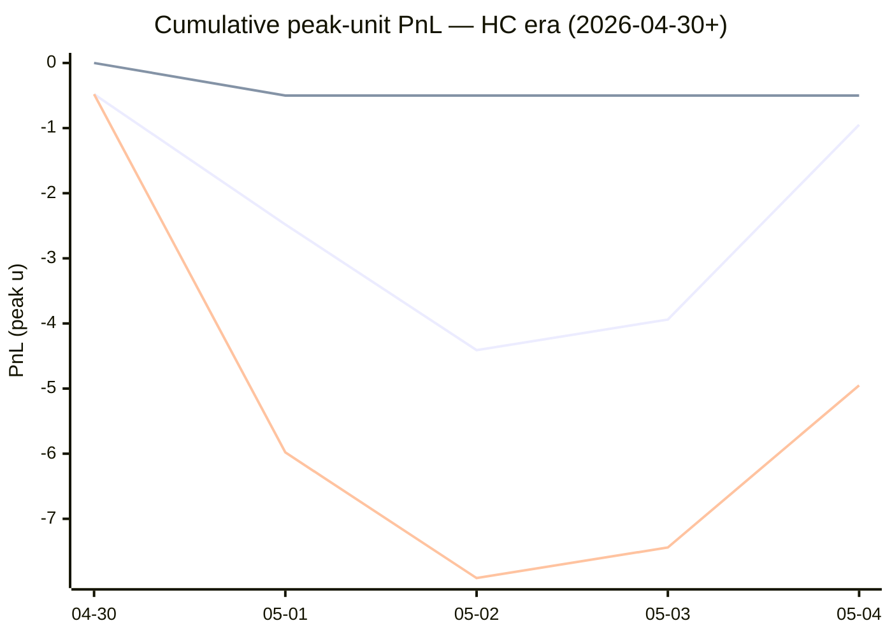

# Sharp Intel v6 — Daily Master Report

_Auto-generated **5/5/2026, 8:55:32 AM ET** by `scripts/dailyV6Report.js`. Do not edit by hand._

**Source of truth: this report mirrors the live Pick Performance dashboard.** Inclusion = `lockStage ≠ SHADOW ∧ ¬superseded ∧ health ∉ {MUTED, CANCELLED} ∧ peak.stars ≥ 2.5`. PnL is in **peak units** (the size shipped to users). HC margin / Δw / Δq are the **frozen** stamps written at last sync before the T-15 freeze. HC margin only existed from the v7.1 launch (**2026-04-30**); pre-launch picks have no HC value (no retro-fitting). Nothing is recomputed against today's whitelist.

v6 cutover: **2026-04-18** · whitelist source: live `sharpWalletProfiles` (152 profiles — drives §5 roster snapshot only) · quality cut: contribution ≥ 30 · HC = CONFIRMED tier ∧ sizeRatio ≥ 1.5.

---
## §1. Yesterday's picks

Slate: **2026-05-04** · 7 shipped sides.

| N | W-L-P | WR% | PnL (peak u) | PnL (flat 1u) |
|---|---|---|---|---|
| 7 | 3-4-0 | 42.9% | +2.49u | -1.46u |

| Sport | Market | Matchup | Pick | Stars · Units | HC | Δw | Δq | Σ | Odds | Result | PnL (peak u) |
|---|---|---|---|---|---|---|---|---|---|---|---|
| MLB | ML | Boston Red Sox @ Detroit Tigers | Detroit Tigers | 3.5★ · 1.13u | +1 | -1 | +0 | -1 | -199 | L | -1.13u |
| NBA | ML | 76ers @ Knicks | 76ers | 5.0★ · 0.50u | -1 | +3 | +3 | +6 | +245 | L | -0.50u |
| NBA | SPREAD | Timberwolves @ Spurs | Timberwolves | 5.0★ · 3.50u | +1 | +5 | +5 | +10 | -105 | **W** | +3.33u |
| NBA | SPREAD | 76ers @ Knicks | 76ers | 4.0★ · 1.13u | +1 | +2 | +2 | +4 | -110 | L | -1.13u |
| NBA | TOTAL | Timberwolves @ Spurs | Under 219.5 | 5.0★ · 3.50u | +1 | +3 | +3 | +6 | -102 | **W** | +3.24u |
| NBA | TOTAL | 76ers @ Knicks | Under 213 | 5.0★ · 2.00u | +1 | +2 | +3 | +5 | -102 | L | -2.00u |
| NHL | ML | Ducks @ Golden Knights | Golden Knights | 3.5★ · 1.13u | +1 | +1 | +1 | +2 | -165 | **W** | +0.68u |

---
## §2. 3-day / 7-day / all-time cohort rollups

Shipped picks only. PnL in **peak units** (size we actually bet) and flat 1u (cohort EV lens). All margins are the engine's frozen stamps (`v8_hcMargin`, `v8_walletConsensusDelta`, `v8_walletConsensusQualityMargin`).

**HC margin sub-tables** are scoped to picks dated ≥ 2026-04-30 (the v7.1 launch — when HC margin became a real engine signal). Pre-launch picks are excluded from HC analysis since the feature didn't exist for them. Δw / Δq sub-tables span the full v6-era sample (≥ 2026-04-18). Empty buckets are dropped.

### §2a. 3-day

Total: **14** shipped · 7-7-0 · WR 50.0% · PnL +1.03u (peak) / -0.86u (flat).

**By HC margin** _(picks dated ≥ 2026-04-30, N = 14)_

| Bucket | N | W-L-P | WR% | PnL (peak u) | PnL (flat 1u) |
|---|---|---|---|---|---|
| HC = +1 | 13 | 7-6-0 | 53.8% | +1.53u | +0.14u |
| HC ≤ −1 | 1 | 0-1-0 | 0.0% | -0.50u | -1.00u |

**By Δw (winner margin)**

| Bucket | N | W-L-P | WR% | PnL (peak u) | PnL (flat 1u) |
|---|---|---|---|---|---|
| ≥ +3 | 3 | 2-1-0 | 66.7% | +6.07u | +0.93u |
| +2 | 2 | 0-2-0 | 0.0% | -3.13u | -2.00u |
| +1 | 6 | 4-2-0 | 66.7% | -0.71u | +1.25u |
| 0 | 2 | 1-1-0 | 50.0% | -0.07u | -0.04u |
| −1 | 1 | 0-1-0 | 0.0% | -1.13u | -1.00u |

**By Δq (quality margin)**

| Bucket | N | W-L-P | WR% | PnL (peak u) | PnL (flat 1u) |
|---|---|---|---|---|---|
| ≥ +3 | 5 | 2-3-0 | 40.0% | +1.07u | -1.07u |
| +2 | 1 | 0-1-0 | 0.0% | -1.13u | -1.00u |
| +1 | 4 | 3-1-0 | 75.0% | +1.71u | +1.48u |
| 0 | 3 | 1-2-0 | 33.3% | -1.30u | -1.23u |
| ≤ −2 | 1 | 1-0-0 | 100.0% | +0.68u | +0.96u |

### §2b. 7-day

Total: **42** shipped · 19-22-1 · WR 46.3% · PnL -4.60u (peak) / -3.89u (flat).

**By HC margin** _(picks dated ≥ 2026-04-30, N = 25)_

| Bucket | N | W-L-P | WR% | PnL (peak u) | PnL (flat 1u) |
|---|---|---|---|---|---|
| HC = +1 | 18 | 9-9-0 | 50.0% | -0.95u | +0.06u |
| HC = 0 | 5 | 3-1-1 | 75.0% | -0.50u | +1.70u |
| HC ≤ −1 | 2 | 0-2-0 | 0.0% | -3.50u | -2.00u |

**By Δw (winner margin)**

| Bucket | N | W-L-P | WR% | PnL (peak u) | PnL (flat 1u) |
|---|---|---|---|---|---|
| ≥ +3 | 7 | 3-4-0 | 42.9% | -0.08u | -1.79u |
| +2 | 13 | 7-6-0 | 53.8% | +0.54u | +2.08u |
| +1 | 17 | 8-8-1 | 50.0% | -2.36u | -1.15u |
| 0 | 4 | 1-3-0 | 25.0% | -1.57u | -2.04u |
| −1 | 1 | 0-1-0 | 0.0% | -1.13u | -1.00u |

**By Δq (quality margin)**

| Bucket | N | W-L-P | WR% | PnL (peak u) | PnL (flat 1u) |
|---|---|---|---|---|---|
| ≥ +3 | 17 | 6-10-1 | 37.5% | -4.39u | -5.00u |
| +2 | 13 | 5-8-0 | 38.5% | -2.96u | -1.90u |
| +1 | 8 | 6-2-0 | 75.0% | +3.37u | +3.28u |
| 0 | 3 | 1-2-0 | 33.3% | -1.30u | -1.23u |
| ≤ −2 | 1 | 1-0-0 | 100.0% | +0.68u | +0.96u |

### §2c. All-time

Total: **136** shipped · 62-72-2 · WR 46.3% · PnL -17.18u (peak) / -9.99u (flat).

**By HC margin** _(picks dated ≥ 2026-04-30, N = 25)_

| Bucket | N | W-L-P | WR% | PnL (peak u) | PnL (flat 1u) |
|---|---|---|---|---|---|
| HC = +1 | 18 | 9-9-0 | 50.0% | -0.95u | +0.06u |
| HC = 0 | 5 | 3-1-1 | 75.0% | -0.50u | +1.70u |
| HC ≤ −1 | 2 | 0-2-0 | 0.0% | -3.50u | -2.00u |

**By Δw (winner margin)**

| Bucket | N | W-L-P | WR% | PnL (peak u) | PnL (flat 1u) |
|---|---|---|---|---|---|
| ≥ +3 | 22 | 15-7-0 | 68.2% | +15.19u | +11.82u |
| +2 | 30 | 13-17-0 | 43.3% | -8.92u | -2.94u |
| +1 | 44 | 22-21-1 | 51.2% | -4.76u | -1.74u |
| 0 | 27 | 8-18-1 | 30.8% | -14.95u | -11.09u |
| −1 | 7 | 1-6-0 | 14.3% | -5.60u | -4.94u |
| ≤ −2 | 1 | 0-1-0 | 0.0% | -0.50u | -1.00u |
| missing | 5 | 3-2-0 | 60.0% | +2.36u | -0.12u |

**By Δq (quality margin)**

| Bucket | N | W-L-P | WR% | PnL (peak u) | PnL (flat 1u) |
|---|---|---|---|---|---|
| ≥ +3 | 51 | 24-25-2 | 49.0% | -4.52u | +0.95u |
| +2 | 39 | 18-21-0 | 46.2% | -7.90u | -2.20u |
| +1 | 31 | 14-17-0 | 45.2% | -2.88u | -4.24u |
| 0 | 7 | 1-6-0 | 14.3% | -4.80u | -5.23u |
| ≤ −2 | 2 | 1-1-0 | 50.0% | -0.32u | -0.04u |
| missing | 6 | 4-2-0 | 66.7% | +3.24u | +0.77u |

---
## §3. Edge over time — is HC margin creating winners?

Daily cumulative peak-unit PnL since the HC margin launch (**2026-04-30**). The `HC ≥ +1` line is the golden-standard cohort. The `HC = 0` line is the no-HC-signal control. The `All shipped (HC era)` line is every shipped pick from the same date range — the apples-to-apples baseline. Watch the spread.

Daily cumulative table (peak units, HC era only):

| Date | HC ≥ +1 (cum) | HC = 0 (cum) | All shipped (cum) |
|---|---|---|---|
| 2026-04-30 | -0.48u | +0.00u | -0.48u |
| 2026-05-01 | -2.48u | -0.50u | -5.98u |
| 2026-05-02 | -4.41u | -0.50u | -7.91u |
| 2026-05-03 | -3.94u | -0.50u | -7.44u |
| 2026-05-04 | -0.95u | -0.50u | -4.95u |

---
## §4. Wallet roster growth & profitability

"Tracked in sport X" = a wallet has placed **≥ 2 bets** in X within the v6-era sample. "Profitable" = cumulative flat PnL > 0. Source: `v8Scoring.walletDetails` on every graded v6-era game (every side, not just the shipped set).

### §4a. Per-sport wallet snapshot

| Sport | Total wallets seen | Tracked (≥2) | Profitable | % prof | WR ≥ 50% | WR ≥ 60% | WR ≥ 70% |
|---|---|---|---|---|---|---|---|
| MLB | 41 | 24 | 9 | 38% | 11 | 5 | 2 |
| NBA | 108 | 76 | 32 | 42% | 39 | 20 | 10 |
| NHL | 41 | 26 | 12 | 46% | 19 | 10 | 6 |
| **ALL (any sport)** | **123** | **90** | **38** | **42%** | **50** | **24** | **12** |

### §4b. Daily roster growth (cumulative through each date)

Format: `tracked (profitable)`. For each date D, recompute the roster using every bet up to and including D.

| Date | ALL | MLB | NBA | NHL |
|---|---|---|---|---|
| 2026-04-18 | 5 (2) | 2 (2) | 3 (0) | 0 (0) |
| 2026-04-19 | 19 (8) | 5 (3) | 9 (3) | 3 (1) |
| 2026-04-20 | 29 (12) | 7 (6) | 23 (8) | 5 (2) |
| 2026-04-21 | 44 (21) | 10 (6) | 31 (10) | 7 (5) |
| 2026-04-22 | 52 (28) | 12 (6) | 39 (15) | 11 (10) |
| 2026-04-23 | 56 (29) | 13 (6) | 46 (21) | 13 (10) |
| 2026-04-24 | 61 (30) | 14 (6) | 51 (23) | 14 (9) |
| 2026-04-25 | 65 (29) | 16 (8) | 54 (22) | 16 (9) |
| 2026-04-26 | 67 (31) | 18 (5) | 56 (25) | 17 (9) |
| 2026-04-27 | 72 (32) | 20 (7) | 60 (24) | 17 (9) |
| 2026-04-28 | 76 (33) | 21 (7) | 63 (26) | 23 (10) |
| 2026-04-29 | 77 (33) | 21 (7) | 64 (25) | 23 (10) |
| 2026-04-30 | 81 (34) | 21 (7) | 70 (27) | 23 (10) |
| 2026-05-01 | 85 (38) | 22 (5) | 74 (30) | 26 (13) |
| 2026-05-02 | 86 (37) | 23 (7) | 75 (32) | 26 (12) |
| 2026-05-03 | 86 (38) | 24 (8) | 75 (33) | 26 (12) |
| 2026-05-04 | 90 (38) | 24 (9) | 76 (32) | 26 (12) |

### §4c. Top 10 profitable wallets by sport

#### MLB

| # | Wallet | N | W | L | WR% | Flat PnL (u) | Flat ROI | $ PnL |
|---|---|---|---|---|---|---|---|---|
| 1 | c289a0 | 3 | 3 | 0 | 100.0% | +2.87 | +95.6% | $1.5K |
| 2 | dcafd2 | 10 | 7 | 3 | 70.0% | +3.32 | +33.2% | $28.6K |
| 3 | 63fc82 | 11 | 7 | 4 | 63.6% | +2.76 | +25.1% | $33.8K |
| 4 | 981187 | 8 | 5 | 3 | 62.5% | +1.65 | +20.7% | $13.5K |
| 5 | d5017f | 8 | 5 | 3 | 62.5% | +1.63 | +20.3% | $42.8K |
| 6 | fcc12b | 21 | 12 | 9 | 57.1% | +2.54 | +12.1% | $158.6K |
| 7 | c668b3 | 2 | 1 | 1 | 50.0% | +0.12 | +6.0% | $18 |
| 8 | 4c64aa | 36 | 20 | 16 | 55.6% | +1.31 | +3.6% | -$25.7K |
| 9 | 8c1eae | 6 | 3 | 3 | 50.0% | +0.08 | +1.3% | $1.1K |
| 10 | 7923c4 | 6 | 3 | 3 | 50.0% | -0.15 | -2.5% | $50.0K |

#### NBA

| # | Wallet | N | W | L | WR% | Flat PnL (u) | Flat ROI | $ PnL |
|---|---|---|---|---|---|---|---|---|
| 1 | 799fad | 2 | 2 | 0 | 100.0% | +5.66 | +283.0% | $241.7K |
| 2 | 0b0329 | 4 | 4 | 0 | 100.0% | +7.13 | +178.3% | $21.4K |
| 3 | b51a56 | 4 | 4 | 0 | 100.0% | +4.79 | +119.9% | $71.1K |
| 4 | 2e8da5 | 9 | 8 | 1 | 88.9% | +9.06 | +100.7% | $144.0K |
| 5 | de3f67 | 6 | 5 | 1 | 83.3% | +5.66 | +94.3% | $145.1K |
| 6 | 11b032 | 3 | 3 | 0 | 100.0% | +2.77 | +92.4% | $83.9K |
| 7 | 12ad50 | 3 | 3 | 0 | 100.0% | +2.74 | +91.3% | $45.5K |
| 8 | 7703d4 | 2 | 2 | 0 | 100.0% | +1.82 | +91.1% | $11.3K |
| 9 | 769c38 | 8 | 8 | 0 | 100.0% | +7.20 | +90.0% | $62.9K |
| 10 | 3102c3 | 4 | 2 | 2 | 50.0% | +2.75 | +68.8% | $342.9K |

#### NHL

| # | Wallet | N | W | L | WR% | Flat PnL (u) | Flat ROI | $ PnL |
|---|---|---|---|---|---|---|---|---|
| 1 | 981187 | 5 | 5 | 0 | 100.0% | +5.03 | +100.6% | $30.3K |
| 2 | 799fad | 2 | 2 | 0 | 100.0% | +1.88 | +94.1% | $46.9K |
| 3 | bc3532 | 5 | 4 | 1 | 80.0% | +4.25 | +85.0% | $11.1K |
| 4 | fcc12b | 6 | 5 | 1 | 83.3% | +3.29 | +54.8% | $13.9K |
| 5 | 30935c | 4 | 3 | 1 | 75.0% | +2.11 | +52.7% | $953 |
| 6 | e70853 | 7 | 5 | 2 | 71.4% | +3.17 | +45.2% | $2.2K |
| 7 | 92df91 | 3 | 2 | 1 | 66.7% | +0.63 | +20.9% | -$58 |
| 8 | c5cea1 | 3 | 2 | 1 | 66.7% | +0.62 | +20.7% | $22.1K |
| 9 | dcafd2 | 2 | 1 | 1 | 50.0% | +0.40 | +20.0% | $4.9K |
| 10 | 6b853d | 6 | 4 | 2 | 66.7% | +1.13 | +18.8% | $7.7K |

---
## §5. Proven-wallet roster growth & HC tracking

"Proven wallet" = whitelist tier `CONFIRMED` or `FLAT` in the same sense the live engine uses (`exportWalletProfiles.js` → `sharpWalletProfiles.bySport`). Sports inherit independent rosters: a wallet can be CONFIRMED in NBA and absent from NHL. `walletBets` come from `v8Scoring.walletDetails` on every graded v6-era pick (Source A); `positionRows` come from `sharp_action_positions` (Source B).

### §5a. Current proven-winner roster (snapshot)

Roster as of **2026-05-04** — wallets with ≥2 bets in the sport.

| Sport | Wallets seen | Eligible (≥2) | CONFIRMED | FLAT | Proven (C+F) | WR50 only | Conv % |
|---|---|---|---|---|---|---|---|
| MLB | 57 | 24 | 3 | 6 | **9** | 2 | 15.8% |
| NBA | 128 | 76 | 22 | 10 | **32** | 13 | 25.0% |
| NHL | 59 | 26 | 10 | 2 | **12** | 7 | 20.3% |
| **ALL** | **—** | **—** | **—** | **—** | **53** | **—** | **—** |

### §5b. Live whitelist drift check

Live `sharpWalletProfiles` is what the engine reads at lock time. Drift between script reconstruction (above) and live should be ≤ 1 day of position data — otherwise `exportWalletProfiles.js` is stale.

| Sport | CONFIRMED (live · script) | FLAT (live · script) | WR50 (live · script) | Drift |
|---|---|---|---|---|
| MLB | 3 · 3 | 6 · 6 | 2 · 2 | in sync |
| NBA | 22 · 22 | 10 · 10 | 13 · 13 | in sync |
| NHL | 10 · 10 | 2 · 2 | 7 · 7 | in sync |

### §5c. Roster growth — 3d / 7d / 30d / all-time deltas

Each cell is **net growth** in proven (CONFIRMED + FLAT) wallets in that window, with the absolute count at the start (`+Δ from N`). Negative = wallets demoted. Window endpoint = 2026-05-04.

| Sport | 3-day | 7-day | 30-day | All-time (since cutover) |
|---|---|---|---|---|
| MLB | +4 from 5 | +2 from 7 | +9 from 0 | +9 from 0 |
| NBA | +2 from 30 | +8 from 24 | +32 from 0 | +32 from 0 |
| NHL | -1 from 13 | +3 from 9 | +12 from 0 | +12 from 0 |

A flat 7-day delta on a sport with healthy slate density = either the bubble pipeline has stalled (no wallets approaching the bar) or our cohort has saturated. Check §13d for the funnel diagnostic.

### §5d. Pipeline funnel — where each sport leaks

Wallets surviving each gate, in order. The biggest %-drop tells you the bottleneck. Gates:

1. **Seen** — placed ≥ 1 bet in the sport (any source)
2. **Eligible** — ≥ 2 graded picks in Source A (required for FLAT/CONFIRMED)
3. **Flat-OK** — eligible AND flat ROI > 0 (becomes FLAT or better)
4. **$-OK** — Flat-OK AND ≥2 positions with dollar ROI > 0 (CONFIRMED)
5. **Promoted** — final whitelisted = CONFIRMED + FLAT

| Sport | 1·Seen | 2·Eligible (% of Seen) | 3·Flat-OK (% of Elig) | 4·$-OK (% of Flat) | 5·Promoted | Bottleneck |
|---|---|---|---|---|---|---|
| MLB | 57 | 24 (42%) | 9 (38%) | 3 (33%) | **9** | edge (Eligible→Flat-OK) 63% |
| NBA | 128 | 76 (59%) | 32 (42%) | 22 (69%) | **32** | edge (Eligible→Flat-OK) 58% |
| NHL | 59 | 26 (44%) | 12 (46%) | 10 (83%) | **12** | sample (Seen→Eligible) 56% |

### §5e. HC backing density (the fuel for v7.3 HC margin)

Every v7.x promotion is gated on `HC_m ≥ +1`, which requires at least one CONFIRMED wallet sized at `≥ 1.5×` average on the for-side. This table shows the share of shipped picks that *had any HC backing*, by sport, in each window. If HC density falls toward zero in a sport, the v7.3 floor cohorts (Σ=1, Σ=2 locks; HC rescues) will simply stop firing there.

| Sport | Window | Picks (with HC stamp) | Any HC for-side | HC_m ≥ +1 | HC_m ≥ +2 |
|---|---|---|---|---|---|
| MLB | 3-day | 3 | 3 (100.0%) | 3 (100.0%) | 0 (0.0%) |
| MLB | 7-day | 13 | 5 (38.5%) | 5 (38.5%) | 0 (0.0%) |
| MLB | All-time | 44 | 16 (36.4%) | 15 (34.1%) | 2 (4.5%) |
| NBA | 3-day | 10 | 9 (90.0%) | 9 (90.0%) | 0 (0.0%) |
| NBA | 7-day | 24 | 19 (79.2%) | 17 (70.8%) | 2 (8.3%) |
| NBA | All-time | 69 | 35 (50.7%) | 30 (43.5%) | 10 (14.5%) |
| NHL | 3-day | 1 | 1 (100.0%) | 1 (100.0%) | 0 (0.0%) |
| NHL | 7-day | 5 | 2 (40.0%) | 2 (40.0%) | 0 (0.0%) |
| NHL | All-time | 17 | 3 (17.6%) | 2 (11.8%) | 0 (0.0%) |

Pooled across sports:

| Window | Picks (with HC stamp) | Any HC for-side | HC_m ≥ +1 | HC_m ≥ +2 |
|---|---|---|---|---|
| 3-day | 14 | 13 (92.9%) | 13 (92.9%) | 0 (0.0%) |
| 7-day | 42 | 26 (61.9%) | 24 (57.1%) | 2 (4.8%) |
| All-time | 130 | 54 (41.5%) | 47 (36.2%) | 12 (9.2%) |

### §5f. Bubble wallets — next-up graduations

Wallets currently NOT promoted but close. Two flavors:

- **One-bet-away** — won the only bet, needs one more positive bet to clear ≥2.
- **Just-under** — has ≥2 bets but flat ROI is between −10% and 0% (one win flips them).

#### MLB

**One-bet-away** (4)

| wallet | picksN | flat PnL | pos N | pos $ROI |
|---|---|---|---|---|
| `a1be00…` | 1 | +0.87 | 2 | 104% |
| `dfa240…` | 1 | +0.87 | 3 | 117% |
| `009373…` | 1 | +0.87 | 0 | — |
| `b28d26…` | 1 | +0.72 | 5 | -22% |

**Just-under** (4)

| wallet | picksN | WR | flat ROI | pos N | pos $ROI |
|---|---|---|---|---|---|
| `7923c4…` | 6 | 50% | -2.5% | 24 | -3% |
| `12192c…` | 14 | 50% | -5.9% | 40 | -8% |
| `cd2f63…` | 69 | 48% | -6.7% | 177 | 15% |
| `b05143…` | 9 | 44% | -8.6% | 21 | 26% |

#### NBA

**One-bet-away** (6)

| wallet | picksN | flat PnL | pos N | pos $ROI |
|---|---|---|---|---|
| `11bf5d…` | 1 | +3.15 | 2 | 217% |
| `dded41…` | 1 | +3.15 | 1 | 376% |
| `e96b87…` | 1 | +2.05 | 6 | -39% |
| `4a9953…` | 1 | +1.90 | 7 | 46% |
| `0f9d74…` | 1 | +0.93 | 3 | -28% |
| `88c556…` | 1 | +0.93 | 3 | 42% |

**Just-under** (6)

| wallet | picksN | WR | flat ROI | pos N | pos $ROI |
|---|---|---|---|---|---|
| `73f5b0…` | 20 | 50% | -3.7% | 44 | -26% |
| `161f17…` | 2 | 50% | -4.5% | 2 | -10% |
| `bbd49f…` | 4 | 50% | -4.9% | 9 | -76% |
| `fc4582…` | 2 | 50% | -6.5% | 2 | -2% |
| `40d814…` | 6 | 33% | -7.1% | 20 | -3% |
| `cd2f63…` | 57 | 44% | -8.8% | 158 | 3% |

#### NHL

**One-bet-away** (6)

| wallet | picksN | flat PnL | pos N | pos $ROI |
|---|---|---|---|---|
| `4b2e78…` | 1 | +1.46 | 0 | — |
| `d5017f…` | 1 | +1.45 | 1 | 150% |
| `fec67e…` | 1 | +1.42 | 3 | 18% |
| `5c32f2…` | 1 | +1.40 | 0 | — |
| `cce0fd…` | 1 | +1.20 | 3 | 124% |
| `59266e…` | 1 | +1.05 | 0 | — |

**Just-under** (5)

| wallet | picksN | WR | flat ROI | pos N | pos $ROI |
|---|---|---|---|---|---|
| `3033ee…` | 4 | 50% | -0.3% | 8 | -23% |
| `779ef0…` | 2 | 50% | -1.0% | 5 | 127% |
| `c668b3…` | 4 | 50% | -8.5% | 9 | 63% |
| `8a3782…` | 2 | 50% | -9.0% | 18 | 27% |
| `f2d227…` | 2 | 50% | -9.0% | 7 | 33% |

### §5 — How to read

- **Roster growth flat in 7-day** + **funnel bottleneck = `data`** → re-run `exportWalletProfiles.js`. The flat-positive wallets are stuck at FLAT because Source-B coverage hasn't caught up. CONFIRMED gate is data-bound, not skill-bound.
- **Roster growth flat in 7-day** + **funnel bottleneck = `sample`** → wallets aren't reaching `≥2` reps fast enough. This is a slate-density problem; consider a soft `MIN_BETS = 1` shadow lane to surface bubble wallets earlier.
- **Roster shrank** (negative delta) → a previously CONFIRMED wallet just dropped flat-positive (lost a recent bet). Variance, not failure — but worth noting if a sport loses ≥3 in a week.
- **HC density on a sport drops below ~30%** → v7.3 promotions there will starve. Either the proven roster needs more CONFIRMED-tier wallets sizing aggressively, or the HC_RATIO (1.5) needs a sport-specific tune.

---

_Driven by `scripts/dailyV6Report.js` · regenerates daily via `.github/workflows/daily-v6-report.yml` · QUALITY_CONTRIB_CUT = 30 · HC = CONFIRMED ∧ sizeRatio ≥ 1.5 · inclusion mirrors live Pick Performance dashboard · §1–§3 use shipped picks · §4–§5 wallet/tracking growth mirror `exportWalletProfiles.js`_
