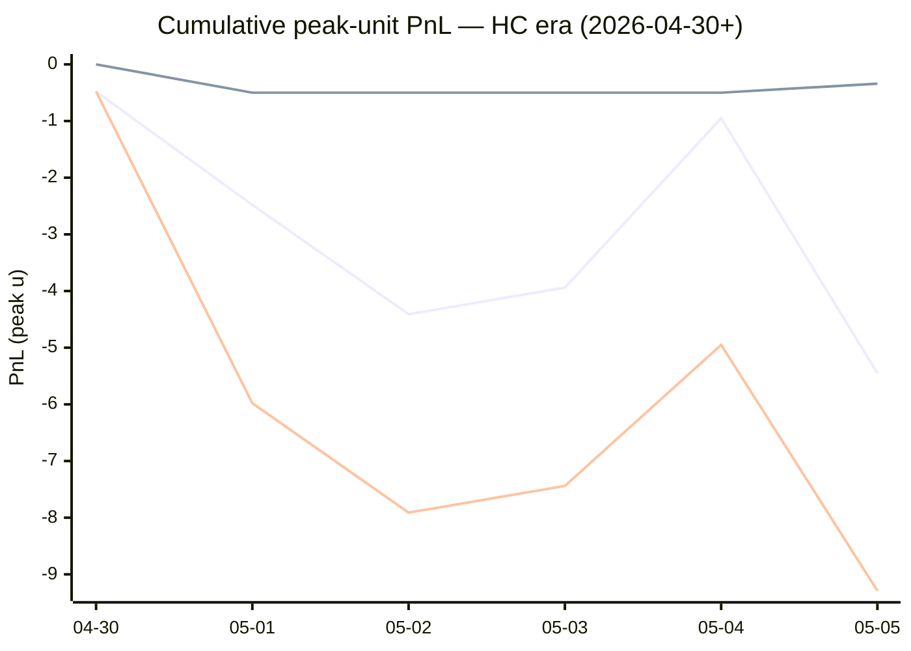

# Sharp Intel v6 — Daily Master Report

_Auto-generated **5/6/2026, 9:22:50 AM ET** by `scripts/dailyV6Report.js`. Do not edit by hand._

**Source of truth: this report mirrors the live Pick Performance dashboard.** Inclusion = `lockStage ≠ SHADOW ∧ ¬superseded ∧ health ∉ {MUTED, CANCELLED} ∧ peak.stars ≥ 2.5`. PnL is in **peak units** (the size shipped to users). HC margin / Δw / Δq are the **frozen** stamps written at last sync before the T-15 freeze. HC margin only existed from the v7.1 launch (**2026-04-30**); pre-launch picks have no HC value (no retro-fitting). Nothing is recomputed against today's whitelist.

v6 cutover: **2026-04-18** · whitelist source: live `sharpWalletProfiles` (159 profiles — drives §5 roster snapshot only) · quality cut: contribution ≥ 30 · HC = CONFIRMED tier ∧ sizeRatio ≥ 1.5.

---
## §1. Yesterday's picks

Slate: **2026-05-05** · 3 shipped sides.

| N | W-L-P | WR% | PnL (peak u) | PnL (flat 1u) |
|---|---|---|---|---|
| 3 | 1-2-0 | 33.3% | -4.34u | -1.12u |

| Sport | Market | Matchup | Pick | Stars · Units | HC | Δw | Δq | Σ | Odds | Result | PnL (peak u) |
|---|---|---|---|---|---|---|---|---|---|---|---|
| NBA | ML | Cavaliers @ Pistons | Cavaliers | 5.0★ · 4.50u | +1 | +4 | +3 | +7 | +132 | L | -4.50u |
| NBA | SPREAD | Lakers @ Thunder | Lakers | 2.5★ · 0.50u | +0 | +1 | +1 | +2 | -105 | L | -0.50u |
| NBA | TOTAL | Lakers @ Thunder | Under 214 | 4.0★ · 0.75u | +0 | +1 | +1 | +2 | -113 | **W** | +0.66u |

---
## §2. 3-day / 7-day / all-time cohort rollups

Shipped picks only. PnL in **peak units** (size we actually bet) and flat 1u (cohort EV lens). All margins are the engine's frozen stamps (`v8_hcMargin`, `v8_walletConsensusDelta`, `v8_walletConsensusQualityMargin`).

**HC margin sub-tables** are scoped to picks dated ≥ 2026-04-30 (the v7.1 launch — when HC margin became a real engine signal). Pre-launch picks are excluded from HC analysis since the feature didn't exist for them. Δw / Δq sub-tables span the full v6-era sample (≥ 2026-04-18). Empty buckets are dropped.

### §2a. 3-day

Total: **15** shipped · 7-8-0 · WR 46.7% · PnL -1.38u (peak) / -1.89u (flat).

**By HC margin** _(picks dated ≥ 2026-04-30, N = 15)_

| Bucket | N | W-L-P | WR% | PnL (peak u) | PnL (flat 1u) |
|---|---|---|---|---|---|
| HC = +1 | 12 | 6-6-0 | 50.0% | -1.04u | -0.78u |
| HC = 0 | 2 | 1-1-0 | 50.0% | +0.16u | -0.12u |
| HC ≤ −1 | 1 | 0-1-0 | 0.0% | -0.50u | -1.00u |

**By Δw (winner margin)**

| Bucket | N | W-L-P | WR% | PnL (peak u) | PnL (flat 1u) |
|---|---|---|---|---|---|
| ≥ +3 | 4 | 2-2-0 | 50.0% | +1.57u | -0.07u |
| +2 | 2 | 0-2-0 | 0.0% | -3.13u | -2.00u |
| +1 | 6 | 4-2-0 | 66.7% | +1.38u | +1.21u |
| 0 | 2 | 1-1-0 | 50.0% | -0.07u | -0.04u |
| −1 | 1 | 0-1-0 | 0.0% | -1.13u | -1.00u |

**By Δq (quality margin)**

| Bucket | N | W-L-P | WR% | PnL (peak u) | PnL (flat 1u) |
|---|---|---|---|---|---|
| ≥ +3 | 5 | 2-3-0 | 40.0% | -0.43u | -1.07u |
| +2 | 1 | 0-1-0 | 0.0% | -1.13u | -1.00u |
| +1 | 5 | 3-2-0 | 60.0% | +0.80u | +0.44u |
| 0 | 3 | 1-2-0 | 33.3% | -1.30u | -1.23u |
| ≤ −2 | 1 | 1-0-0 | 100.0% | +0.68u | +0.96u |

**By AGS tier** _(picks dated ≥ 2026-05-05, N = 3)_

| Bucket | N | W-L-P | WR% | PnL (peak u) | PnL (flat 1u) |
|---|---|---|---|---|---|
| NEUT   (0 .. +3) | 2 | 1-1-0 | 50.0% | -3.84u | -0.12u |
| FADE   (< −1) | 1 | 0-1-0 | 0.0% | -0.50u | -1.00u |

### §2b. 7-day

Total: **35** shipped · 16-18-1 · WR 47.1% · PnL -5.75u (peak) / -2.73u (flat).

**By HC margin** _(picks dated ≥ 2026-04-30, N = 28)_

| Bucket | N | W-L-P | WR% | PnL (peak u) | PnL (flat 1u) |
|---|---|---|---|---|---|
| HC = +1 | 19 | 9-10-0 | 47.4% | -5.45u | -0.94u |
| HC = 0 | 7 | 4-2-1 | 66.7% | -0.34u | +1.58u |
| HC ≤ −1 | 2 | 0-2-0 | 0.0% | -3.50u | -2.00u |

**By Δw (winner margin)**

| Bucket | N | W-L-P | WR% | PnL (peak u) | PnL (flat 1u) |
|---|---|---|---|---|---|
| ≥ +3 | 6 | 3-3-0 | 50.0% | -0.58u | -0.79u |
| +2 | 7 | 4-3-0 | 57.1% | -0.44u | +2.20u |
| +1 | 17 | 8-8-1 | 50.0% | -2.03u | -1.11u |
| 0 | 4 | 1-3-0 | 25.0% | -1.57u | -2.04u |
| −1 | 1 | 0-1-0 | 0.0% | -1.13u | -1.00u |

**By Δq (quality margin)**

| Bucket | N | W-L-P | WR% | PnL (peak u) | PnL (flat 1u) |
|---|---|---|---|---|---|
| ≥ +3 | 15 | 5-9-1 | 35.7% | -6.71u | -4.95u |
| +2 | 9 | 4-5-0 | 44.4% | -0.29u | +0.25u |
| +1 | 7 | 5-2-0 | 71.4% | +1.87u | +2.24u |
| 0 | 3 | 1-2-0 | 33.3% | -1.30u | -1.23u |
| ≤ −2 | 1 | 1-0-0 | 100.0% | +0.68u | +0.96u |

**By AGS tier** _(picks dated ≥ 2026-05-05, N = 3)_

| Bucket | N | W-L-P | WR% | PnL (peak u) | PnL (flat 1u) |
|---|---|---|---|---|---|
| NEUT   (0 .. +3) | 2 | 1-1-0 | 50.0% | -3.84u | -0.12u |
| FADE   (< −1) | 1 | 0-1-0 | 0.0% | -0.50u | -1.00u |

### §2c. All-time

Total: **139** shipped · 63-74-2 · WR 46.0% · PnL -21.52u (peak) / -11.11u (flat).

**By HC margin** _(picks dated ≥ 2026-04-30, N = 28)_

| Bucket | N | W-L-P | WR% | PnL (peak u) | PnL (flat 1u) |
|---|---|---|---|---|---|
| HC = +1 | 19 | 9-10-0 | 47.4% | -5.45u | -0.94u |
| HC = 0 | 7 | 4-2-1 | 66.7% | -0.34u | +1.58u |
| HC ≤ −1 | 2 | 0-2-0 | 0.0% | -3.50u | -2.00u |

**By Δw (winner margin)**

| Bucket | N | W-L-P | WR% | PnL (peak u) | PnL (flat 1u) |
|---|---|---|---|---|---|
| ≥ +3 | 23 | 15-8-0 | 65.2% | +10.69u | +10.82u |
| +2 | 30 | 13-17-0 | 43.3% | -8.92u | -2.94u |
| +1 | 46 | 23-22-1 | 51.1% | -4.60u | -1.85u |
| 0 | 27 | 8-18-1 | 30.8% | -14.95u | -11.09u |
| −1 | 7 | 1-6-0 | 14.3% | -5.60u | -4.94u |
| ≤ −2 | 1 | 0-1-0 | 0.0% | -0.50u | -1.00u |
| missing | 5 | 3-2-0 | 60.0% | +2.36u | -0.12u |

**By Δq (quality margin)**

| Bucket | N | W-L-P | WR% | PnL (peak u) | PnL (flat 1u) |
|---|---|---|---|---|---|
| ≥ +3 | 52 | 24-26-2 | 48.0% | -9.02u | -0.05u |
| +2 | 39 | 18-21-0 | 46.2% | -7.90u | -2.20u |
| +1 | 33 | 15-18-0 | 45.5% | -2.72u | -4.36u |
| 0 | 7 | 1-6-0 | 14.3% | -4.80u | -5.23u |
| ≤ −2 | 2 | 1-1-0 | 50.0% | -0.32u | -0.04u |
| missing | 6 | 4-2-0 | 66.7% | +3.24u | +0.77u |

**By AGS tier** _(picks dated ≥ 2026-05-05, N = 3)_

| Bucket | N | W-L-P | WR% | PnL (peak u) | PnL (flat 1u) |
|---|---|---|---|---|---|
| NEUT   (0 .. +3) | 2 | 1-1-0 | 50.0% | -3.84u | -0.12u |
| FADE   (< −1) | 1 | 0-1-0 | 0.0% | -0.50u | -1.00u |

---
## §3. Edge over time — is HC margin creating winners?

Daily cumulative peak-unit PnL since the HC margin launch (**2026-04-30**). The `HC ≥ +1` line is the golden-standard cohort. The `HC = 0` line is the no-HC-signal control. The `All shipped (HC era)` line is every shipped pick from the same date range — the apples-to-apples baseline. Watch the spread.

Daily cumulative table (peak units, HC era only):

| Date | HC ≥ +1 (cum) | HC = 0 (cum) | All shipped (cum) |
|---|---|---|---|
| 2026-04-30 | -0.48u | +0.00u | -0.48u |
| 2026-05-01 | -2.48u | -0.50u | -5.98u |
| 2026-05-02 | -4.41u | -0.50u | -7.91u |
| 2026-05-03 | -3.94u | -0.50u | -7.44u |
| 2026-05-04 | -0.95u | -0.50u | -4.95u |
| 2026-05-05 | -5.45u | -0.34u | -9.29u |

---
## §4. Wallet roster growth & profitability

"Tracked in sport X" = a wallet has placed **≥ 2 bets** in X within the v6-era sample. "Profitable" = cumulative flat PnL > 0. Source: `v8Scoring.walletDetails` on every graded v6-era game (every side, not just the shipped set).

### §4a. Per-sport wallet snapshot

| Sport | Total wallets seen | Tracked (≥2) | Profitable | % prof | WR ≥ 50% | WR ≥ 60% | WR ≥ 70% |
|---|---|---|---|---|---|---|---|
| MLB | 41 | 24 | 9 | 38% | 11 | 5 | 2 |
| NBA | 114 | 79 | 33 | 42% | 41 | 22 | 12 |
| NHL | 41 | 26 | 12 | 46% | 19 | 10 | 6 |
| **ALL (any sport)** | **129** | **91** | **40** | **44%** | **49** | **25** | **11** |

### §4b. Daily roster growth (cumulative through each date)

Format: `tracked (profitable)`. For each date D, recompute the roster using every bet up to and including D.

| Date | ALL | MLB | NBA | NHL |
|---|---|---|---|---|
| 2026-04-18 | 5 (2) | 2 (2) | 3 (0) | 0 (0) |
| 2026-04-19 | 19 (8) | 5 (3) | 9 (3) | 3 (1) |
| 2026-04-20 | 29 (12) | 7 (6) | 23 (8) | 5 (2) |
| 2026-04-21 | 44 (21) | 10 (6) | 31 (10) | 7 (5) |
| 2026-04-22 | 52 (28) | 12 (6) | 39 (15) | 11 (10) |
| 2026-04-23 | 56 (29) | 13 (6) | 46 (21) | 13 (10) |
| 2026-04-24 | 61 (30) | 14 (6) | 51 (23) | 14 (9) |
| 2026-04-25 | 65 (29) | 16 (8) | 54 (22) | 16 (9) |
| 2026-04-26 | 67 (31) | 18 (5) | 56 (25) | 17 (9) |
| 2026-04-27 | 72 (32) | 20 (7) | 60 (24) | 17 (9) |
| 2026-04-28 | 76 (33) | 21 (7) | 63 (26) | 23 (10) |
| 2026-04-29 | 77 (33) | 21 (7) | 64 (25) | 23 (10) |
| 2026-04-30 | 81 (34) | 21 (7) | 70 (27) | 23 (10) |
| 2026-05-01 | 85 (38) | 22 (5) | 74 (30) | 26 (13) |
| 2026-05-02 | 86 (37) | 23 (7) | 75 (32) | 26 (12) |
| 2026-05-03 | 86 (38) | 24 (8) | 75 (33) | 26 (12) |
| 2026-05-04 | 90 (38) | 24 (9) | 76 (32) | 26 (12) |
| 2026-05-05 | 91 (40) | 24 (9) | 79 (33) | 26 (12) |

### §4c. Top 10 profitable wallets by sport

#### MLB

| # | Wallet | N | W | L | WR% | Flat PnL (u) | Flat ROI | $ PnL |
|---|---|---|---|---|---|---|---|---|
| 1 | c289a0 | 3 | 3 | 0 | 100.0% | +2.87 | +95.6% | $1.5K |
| 2 | dcafd2 | 10 | 7 | 3 | 70.0% | +3.32 | +33.2% | $28.6K |
| 3 | 63fc82 | 11 | 7 | 4 | 63.6% | +2.76 | +25.1% | $33.8K |
| 4 | 981187 | 8 | 5 | 3 | 62.5% | +1.65 | +20.7% | $13.5K |
| 5 | d5017f | 8 | 5 | 3 | 62.5% | +1.63 | +20.3% | $42.8K |
| 6 | fcc12b | 21 | 12 | 9 | 57.1% | +2.54 | +12.1% | $158.6K |
| 7 | c668b3 | 2 | 1 | 1 | 50.0% | +0.12 | +6.0% | $18 |
| 8 | 4c64aa | 39 | 22 | 17 | 56.4% | +1.64 | +4.2% | -$49.4K |
| 9 | 8c1eae | 6 | 3 | 3 | 50.0% | +0.08 | +1.3% | $1.1K |
| 10 | 7923c4 | 6 | 3 | 3 | 50.0% | -0.15 | -2.5% | $50.0K |

#### NBA

| # | Wallet | N | W | L | WR% | Flat PnL (u) | Flat ROI | $ PnL |
|---|---|---|---|---|---|---|---|---|
| 1 | 799fad | 2 | 2 | 0 | 100.0% | +5.66 | +283.0% | $241.7K |
| 2 | 0b0329 | 5 | 4 | 1 | 80.0% | +6.13 | +122.6% | $20.4K |
| 3 | b51a56 | 4 | 4 | 0 | 100.0% | +4.79 | +119.9% | $71.1K |
| 4 | 2e8da5 | 9 | 8 | 1 | 88.9% | +9.06 | +100.7% | $144.0K |
| 5 | 12ad50 | 3 | 3 | 0 | 100.0% | +2.74 | +91.3% | $45.5K |
| 6 | 7703d4 | 2 | 2 | 0 | 100.0% | +1.82 | +91.1% | $11.3K |
| 7 | 769c38 | 8 | 8 | 0 | 100.0% | +7.20 | +90.0% | $62.9K |
| 8 | 7f00bc | 12 | 8 | 4 | 66.7% | +7.27 | +60.5% | $11.1K |
| 9 | cdb33b | 5 | 2 | 3 | 40.0% | +3.00 | +60.0% | $15.8K |
| 10 | 8ec926 | 2 | 2 | 0 | 100.0% | +1.04 | +51.9% | $712 |

#### NHL

| # | Wallet | N | W | L | WR% | Flat PnL (u) | Flat ROI | $ PnL |
|---|---|---|---|---|---|---|---|---|
| 1 | 981187 | 5 | 5 | 0 | 100.0% | +5.03 | +100.6% | $30.3K |
| 2 | 799fad | 2 | 2 | 0 | 100.0% | +1.88 | +94.1% | $46.9K |
| 3 | bc3532 | 5 | 4 | 1 | 80.0% | +4.25 | +85.0% | $11.1K |
| 4 | fcc12b | 6 | 5 | 1 | 83.3% | +3.29 | +54.8% | $13.9K |
| 5 | 30935c | 4 | 3 | 1 | 75.0% | +2.11 | +52.7% | $953 |
| 6 | e70853 | 7 | 5 | 2 | 71.4% | +3.17 | +45.2% | $2.2K |
| 7 | 92df91 | 3 | 2 | 1 | 66.7% | +0.63 | +20.9% | -$58 |
| 8 | c5cea1 | 3 | 2 | 1 | 66.7% | +0.62 | +20.7% | $22.1K |
| 9 | dcafd2 | 2 | 1 | 1 | 50.0% | +0.40 | +20.0% | $4.9K |
| 10 | 6b853d | 6 | 4 | 2 | 66.7% | +1.13 | +18.8% | $7.7K |

---
## §5. Proven-wallet roster growth & HC tracking

"Proven wallet" = whitelist tier `CONFIRMED` or `FLAT` in the same sense the live engine uses (`exportWalletProfiles.js` → `sharpWalletProfiles.bySport`). Sports inherit independent rosters: a wallet can be CONFIRMED in NBA and absent from NHL. `walletBets` come from `v8Scoring.walletDetails` on every graded v6-era pick (Source A); `positionRows` come from `sharp_action_positions` (Source B).

### §5a. Current proven-winner roster (snapshot)

Roster as of **2026-05-05** — wallets with ≥2 bets in the sport.

| Sport | Wallets seen | Eligible (≥2) | CONFIRMED | FLAT | Proven (C+F) | WR50 only | Conv % |
|---|---|---|---|---|---|---|---|
| MLB | 59 | 24 | 4 | 5 | **9** | 2 | 15.3% |
| NBA | 135 | 79 | 23 | 10 | **33** | 14 | 24.4% |
| NHL | 61 | 26 | 10 | 2 | **12** | 7 | 19.7% |
| **ALL** | **—** | **—** | **—** | **—** | **54** | **—** | **—** |

### §5b. Live whitelist drift check

Live `sharpWalletProfiles` is what the engine reads at lock time. Drift between script reconstruction (above) and live should be ≤ 1 day of position data — otherwise `exportWalletProfiles.js` is stale.

| Sport | CONFIRMED (live · script) | FLAT (live · script) | WR50 (live · script) | Drift |
|---|---|---|---|---|
| MLB | 4 · 4 | 5 · 5 | 2 · 2 | in sync |
| NBA | 23 · 23 | 10 · 10 | 14 · 14 | in sync |
| NHL | 10 · 10 | 2 · 2 | 7 · 7 | in sync |

### §5c. Roster growth — 3d / 7d / 30d / all-time deltas

Each cell is **net growth** in proven (CONFIRMED + FLAT) wallets in that window, with the absolute count at the start (`+Δ from N`). Negative = wallets demoted. Window endpoint = 2026-05-05.

| Sport | 3-day | 7-day | 30-day | All-time (since cutover) |
|---|---|---|---|---|
| MLB | +2 from 7 | +2 from 7 | +9 from 0 | +9 from 0 |
| NBA | +1 from 32 | +7 from 26 | +33 from 0 | +33 from 0 |
| NHL | +0 from 12 | +2 from 10 | +12 from 0 | +12 from 0 |

A flat 7-day delta on a sport with healthy slate density = either the bubble pipeline has stalled (no wallets approaching the bar) or our cohort has saturated. Check §13d for the funnel diagnostic.

### §5d. Pipeline funnel — where each sport leaks

Wallets surviving each gate, in order. The biggest %-drop tells you the bottleneck. Gates:

1. **Seen** — placed ≥ 1 bet in the sport (any source)
2. **Eligible** — ≥ 2 graded picks in Source A (required for FLAT/CONFIRMED)
3. **Flat-OK** — eligible AND flat ROI > 0 (becomes FLAT or better)
4. **$-OK** — Flat-OK AND ≥2 positions with dollar ROI > 0 (CONFIRMED)
5. **Promoted** — final whitelisted = CONFIRMED + FLAT

| Sport | 1·Seen | 2·Eligible (% of Seen) | 3·Flat-OK (% of Elig) | 4·$-OK (% of Flat) | 5·Promoted | Bottleneck |
|---|---|---|---|---|---|---|
| MLB | 59 | 24 (41%) | 9 (38%) | 4 (44%) | **9** | edge (Eligible→Flat-OK) 63% |
| NBA | 135 | 79 (59%) | 33 (42%) | 23 (70%) | **33** | edge (Eligible→Flat-OK) 58% |
| NHL | 61 | 26 (43%) | 12 (46%) | 10 (83%) | **12** | sample (Seen→Eligible) 57% |

### §5e. HC backing density (the fuel for v7.3 HC margin)

Every v7.x promotion is gated on `HC_m ≥ +1`, which requires at least one CONFIRMED wallet sized at `≥ 1.5×` average on the for-side. This table shows the share of shipped picks that *had any HC backing*, by sport, in each window. If HC density falls toward zero in a sport, the v7.3 floor cohorts (Σ=1, Σ=2 locks; HC rescues) will simply stop firing there.

| Sport | Window | Picks (with HC stamp) | Any HC for-side | HC_m ≥ +1 | HC_m ≥ +2 |
|---|---|---|---|---|---|
| MLB | 3-day | 2 | 2 (100.0%) | 2 (100.0%) | 0 (0.0%) |
| MLB | 7-day | 6 | 4 (66.7%) | 4 (66.7%) | 0 (0.0%) |
| MLB | All-time | 44 | 16 (36.4%) | 15 (34.1%) | 2 (4.5%) |
| NBA | 3-day | 12 | 10 (83.3%) | 9 (75.0%) | 0 (0.0%) |
| NBA | 7-day | 24 | 19 (79.2%) | 17 (70.8%) | 1 (4.2%) |
| NBA | All-time | 72 | 37 (51.4%) | 31 (43.1%) | 10 (13.9%) |
| NHL | 3-day | 1 | 1 (100.0%) | 1 (100.0%) | 0 (0.0%) |
| NHL | 7-day | 5 | 2 (40.0%) | 2 (40.0%) | 0 (0.0%) |
| NHL | All-time | 17 | 3 (17.6%) | 2 (11.8%) | 0 (0.0%) |

Pooled across sports:

| Window | Picks (with HC stamp) | Any HC for-side | HC_m ≥ +1 | HC_m ≥ +2 |
|---|---|---|---|---|
| 3-day | 15 | 13 (86.7%) | 12 (80.0%) | 0 (0.0%) |
| 7-day | 35 | 25 (71.4%) | 23 (65.7%) | 1 (2.9%) |
| All-time | 133 | 56 (42.1%) | 48 (36.1%) | 12 (9.0%) |

### §5f. Bubble wallets — next-up graduations

Wallets currently NOT promoted but close. Two flavors:

- **One-bet-away** — won the only bet, needs one more positive bet to clear ≥2.
- **Just-under** — has ≥2 bets but flat ROI is between −10% and 0% (one win flips them).

#### MLB

**One-bet-away** (4)

| wallet | picksN | flat PnL | pos N | pos $ROI |
|---|---|---|---|---|
| `a1be00…` | 1 | +0.87 | 2 | 104% |
| `dfa240…` | 1 | +0.87 | 3 | 117% |
| `009373…` | 1 | +0.87 | 0 | — |
| `b28d26…` | 1 | +0.72 | 5 | -22% |

**Just-under** (4)

| wallet | picksN | WR | flat ROI | pos N | pos $ROI |
|---|---|---|---|---|---|
| `7923c4…` | 6 | 50% | -2.5% | 24 | -3% |
| `12192c…` | 14 | 50% | -5.9% | 43 | -9% |
| `cd2f63…` | 69 | 48% | -6.7% | 177 | 15% |
| `b05143…` | 9 | 44% | -8.6% | 21 | 26% |

#### NBA

**One-bet-away** (6)

| wallet | picksN | flat PnL | pos N | pos $ROI |
|---|---|---|---|---|
| `11bf5d…` | 1 | +3.15 | 2 | 217% |
| `dded41…` | 1 | +3.15 | 1 | 376% |
| `e96b87…` | 1 | +2.05 | 6 | -39% |
| `4a9953…` | 1 | +1.90 | 7 | 46% |
| `0f9d74…` | 1 | +0.93 | 3 | -28% |
| `88c556…` | 1 | +0.93 | 3 | 42% |

**Just-under** (6)

| wallet | picksN | WR | flat ROI | pos N | pos $ROI |
|---|---|---|---|---|---|
| `779ef0…` | 11 | 45% | -1.1% | 28 | -19% |
| `73f5b0…` | 20 | 50% | -3.7% | 44 | -26% |
| `40d814…` | 7 | 43% | -4.5% | 22 | -2% |
| `161f17…` | 2 | 50% | -4.5% | 2 | -10% |
| `bbd49f…` | 4 | 50% | -4.9% | 9 | -76% |
| `fc4582…` | 2 | 50% | -6.5% | 2 | -2% |

#### NHL

**One-bet-away** (6)

| wallet | picksN | flat PnL | pos N | pos $ROI |
|---|---|---|---|---|
| `4b2e78…` | 1 | +1.46 | 0 | — |
| `d5017f…` | 1 | +1.45 | 1 | 150% |
| `fec67e…` | 1 | +1.42 | 3 | 18% |
| `5c32f2…` | 1 | +1.40 | 0 | — |
| `cce0fd…` | 1 | +1.20 | 3 | 124% |
| `59266e…` | 1 | +1.05 | 0 | — |

**Just-under** (5)

| wallet | picksN | WR | flat ROI | pos N | pos $ROI |
|---|---|---|---|---|---|
| `3033ee…` | 4 | 50% | -0.3% | 8 | -23% |
| `779ef0…` | 2 | 50% | -1.0% | 5 | 127% |
| `c668b3…` | 4 | 50% | -8.5% | 9 | 63% |
| `8a3782…` | 2 | 50% | -9.0% | 18 | 27% |
| `f2d227…` | 2 | 50% | -9.0% | 7 | 33% |

### §5 — How to read

- **Roster growth flat in 7-day** + **funnel bottleneck = `data`** → re-run `exportWalletProfiles.js`. The flat-positive wallets are stuck at FLAT because Source-B coverage hasn't caught up. CONFIRMED gate is data-bound, not skill-bound.
- **Roster growth flat in 7-day** + **funnel bottleneck = `sample`** → wallets aren't reaching `≥2` reps fast enough. This is a slate-density problem; consider a soft `MIN_BETS = 1` shadow lane to surface bubble wallets earlier.
- **Roster shrank** (negative delta) → a previously CONFIRMED wallet just dropped flat-positive (lost a recent bet). Variance, not failure — but worth noting if a sport loses ≥3 in a week.
- **HC density on a sport drops below ~30%** → v7.3 promotions there will starve. Either the proven roster needs more CONFIRMED-tier wallets sizing aggressively, or the HC_RATIO (1.5) needs a sport-specific tune.

---
## §6. Daily proven-wallet performance

Who on the proven roster is actually printing — yesterday's bets, the rolling leaderboard (`$ PnL`-ranked), current streaks, and per-sport volume. **Proven** = `CONFIRMED` ∪ `FLAT` per sport (the same gate that drives Δ_winner). A wallet only counts in a sport where it's on that sport's proven list.

### §6a. Yesterday's proven-wallet bets

Slate: **2026-05-05** · 21 bets · 13 distinct proven wallets · WR 43% · $ vol $860.9K · $ PnL -$416.7K.

| Wallet | Sport | Market | Game | $ size | Result | $ PnL |
|---|---|---|---|---|---|---|
| `6bd96a…` (FLAT) | NBA | ML | Cavaliers @ Pistons | $87.9K | **W** | $57.1K |
| `e70853…` (CONFIRMED) | NBA | ML | Lakers @ Thunder | $139.2K | **W** | $15.5K |
| `7923c4…` (CONFIRMED) | NBA | SPREAD | Cavaliers @ Pistons | $16.5K | **W** | $14.3K |
| `4c64aa…` (FLAT) | MLB | ML | Pittsburgh Pirates @ Arizona Diamondbacks | $11.4K | **W** | $9.1K |
| `8366f5…` (CONFIRMED) | NBA | ML | Lakers @ Thunder | $59.0K | **W** | $6.6K |
| `b19a27…` (CONFIRMED) | NBA | TOTAL | Lakers @ Thunder | $4.7K | **W** | $4.2K |
| `4c64aa…` (FLAT) | MLB | ML | Athletics @ Philadelphia Phillies | $6.7K | **W** | $3.6K |
| `7923c4…` (CONFIRMED) | NBA | TOTAL | Lakers @ Thunder | $3.0K | **W** | $2.7K |
| `8ec926…` (FLAT) | NBA | ML | Lakers @ Thunder | $2.6K | **W** | $287 |
| `0b0329…` (CONFIRMED) | NBA | ML | Lakers @ Thunder | $980 | L | -$980 |
| `b19a27…` (CONFIRMED) | NBA | ML | Cavaliers @ Pistons | $5.8K | L | -$5.8K |
| `b19a27…` (CONFIRMED) | NBA | SPREAD | Cavaliers @ Pistons | $10.2K | L | -$10.2K |
| `11b032…` (CONFIRMED) | NBA | SPREAD | Cavaliers @ Pistons | $15.0K | L | -$15.0K |
| `78e8f1…` (FLAT) | NBA | ML | Lakers @ Thunder | $32.8K | L | -$32.8K |
| `3102c3…` (FLAT) | NBA | ML | Cavaliers @ Pistons | $34.8K | L | -$34.8K |
| `4c64aa…` (FLAT) | MLB | ML | Boston Red Sox @ Detroit Tigers | $36.3K | L | -$36.3K |
| `de3f67…` (CONFIRMED) | NBA | SPREAD | Lakers @ Thunder | $40.0K | L | -$40.0K |
| `de3f67…` (CONFIRMED) | NBA | ML | Cavaliers @ Pistons | $42.0K | L | -$42.0K |
| `78e8f1…` (FLAT) | NBA | ML | Cavaliers @ Pistons | $48.5K | L | -$48.5K |
| `2d2ca8…` (CONFIRMED) | NBA | ML | Lakers @ Thunder | $59.5K | L | -$59.5K |
| `3102c3…` (FLAT) | NBA | ML | Lakers @ Thunder | $204.1K | L | -$204.1K |

### §6b. Proven-wallet leaderboard

Top 15 proven `(wallet × sport)` pairs per sport per horizon, ranked by **$ PnL** (the dollar-ROI lens). The 3-day board is the "who's on form right now" lens; the 7-day filters single-day variance; all-time is the proven-roster reference.

#### §6b-1. 3-day

**MLB** — 5 active proven wallets

| # | Wallet | Tier | Bets | WR% | Bets/day | Flat PnL (u) | Flat ROI | $ vol | $ PnL | $ ROI | Streak |
|---|---|---|---|---|---|---|---|---|---|---|---|
| 1 | `4c64aa…` | FLAT | 8 | 75% | 2.7 | +2.59 | +32% | $129.1K | $34.2K | +27% | 2W |
| 2 | `d5017f…` | CONFIRMED | 5 | 60% | 2.5 | +0.55 | +11% | $45.4K | $22.9K | +50% | 1W |
| 3 | `8c1eae…` | CONFIRMED | 1 | 100% | 1.0 | +0.87 | +87% | $1.9K | $1.6K | +87% | 1W |
| 4 | `c289a0…` | FLAT | 2 | 100% | 1.0 | +1.49 | +74% | $1.1K | $763 | +73% | 2W |
| 5 | `63fc82…` | FLAT | 1 | 0% | 1.0 | -1.00 | -100% | $35.6K | -$35.6K | -100% | 1L |

**NBA** — 19 active proven wallets

| # | Wallet | Tier | Bets | WR% | Bets/day | Flat PnL (u) | Flat ROI | $ vol | $ PnL | $ ROI | Streak |
|---|---|---|---|---|---|---|---|---|---|---|---|
| 1 | `b19a27…` | CONFIRMED | 9 | 67% | 3.0 | +2.56 | +28% | $164.3K | $38.0K | +23% | 1W |
| 2 | `2e8da5…` | CONFIRMED | 2 | 100% | 2.0 | +4.20 | +210% | $18.5K | $25.8K | +139% | 2W |
| 3 | `bc3532…` | FLAT | 1 | 100% | 1.0 | +2.75 | +275% | $7.6K | $20.9K | +275% | 1W |
| 4 | `e70853…` | CONFIRMED | 1 | 100% | 1.0 | +0.11 | +11% | $139.2K | $15.5K | +11% | 1W |
| 5 | `8366f5…` | CONFIRMED | 3 | 67% | 1.0 | +1.56 | +52% | $59.7K | $7.6K | +13% | 1W |
| 6 | `11b032…` | CONFIRMED | 2 | 50% | 1.0 | -0.07 | -4% | $39.0K | $7.2K | +19% | 1L |
| 7 | `0b0329…` | CONFIRMED | 2 | 50% | 1.0 | +2.25 | +113% | $1.8K | $1.7K | +94% | 1L |
| 8 | `92df91…` | FLAT | 1 | 100% | 1.0 | +2.75 | +275% | $463 | $1.3K | +275% | 1W |
| 9 | `8ec926…` | FLAT | 2 | 100% | 1.0 | +1.04 | +52% | $3.0K | $712 | +23% | 2W |
| 10 | `7f00bc…` | CONFIRMED | 5 | 40% | 2.5 | +1.20 | +24% | $11.5K | -$32 | -0% | 2L |
| 11 | `5c32f2…` | CONFIRMED | 2 | 50% | 2.0 | -0.07 | -4% | $2.9K | -$79 | -3% | 1L |
| 12 | `6bd96a…` | FLAT | 3 | 33% | 1.5 | -1.35 | -45% | $158.2K | -$13.2K | -8% | 1W |
| 13 | `de3f67…` | CONFIRMED | 5 | 40% | 2.5 | +1.20 | +24% | $178.7K | -$28.9K | -16% | 3L |
| 14 | `52aeeb…` | CONFIRMED | 5 | 40% | 2.5 | -1.68 | -34% | $111.5K | -$34.9K | -31% | 2W |
| 15 | `2d2ca8…` | CONFIRMED | 2 | 50% | 1.0 | +2.25 | +113% | $63.9K | -$45.2K | -71% | 1L |

**NHL** — 5 active proven wallets

| # | Wallet | Tier | Bets | WR% | Bets/day | Flat PnL (u) | Flat ROI | $ vol | $ PnL | $ ROI | Streak |
|---|---|---|---|---|---|---|---|---|---|---|---|
| 1 | `e70853…` | CONFIRMED | 1 | 100% | 1.0 | +1.42 | +142% | $7.8K | $11.1K | +142% | 1W |
| 2 | `dfa240…` | CONFIRMED | 1 | 100% | 1.0 | +0.60 | +60% | $5.7K | $3.5K | +60% | 1W |
| 3 | `30935c…` | CONFIRMED | 1 | 100% | 1.0 | +1.42 | +142% | $518 | $736 | +142% | 1W |
| 4 | `92df91…` | CONFIRMED | 1 | 0% | 1.0 | -1.00 | -100% | $1.1K | -$1.1K | -100% | 1L |
| 5 | `6b853d…` | CONFIRMED | 1 | 0% | 1.0 | -1.00 | -100% | $7.5K | -$7.5K | -100% | 1L |

#### §6b-2. 7-day

**MLB** — 7 active proven wallets

| # | Wallet | Tier | Bets | WR% | Bets/day | Flat PnL (u) | Flat ROI | $ vol | $ PnL | $ ROI | Streak |
|---|---|---|---|---|---|---|---|---|---|---|---|
| 1 | `fcc12b…` | FLAT | 6 | 67% | 1.5 | +1.43 | +24% | $98.0K | $82.6K | +84% | 1W |
| 2 | `4c64aa…` | FLAT | 25 | 60% | 3.6 | +2.03 | +8% | $388.4K | $64.2K | +17% | 2W |
| 3 | `d5017f…` | CONFIRMED | 6 | 50% | 2.0 | -0.45 | -8% | $54.0K | $14.3K | +26% | 1W |
| 4 | `8c1eae…` | CONFIRMED | 4 | 50% | 0.7 | +0.17 | +4% | $10.4K | $1.8K | +17% | 1W |
| 5 | `c289a0…` | FLAT | 2 | 100% | 1.0 | +1.49 | +74% | $1.1K | $763 | +73% | 2W |
| 6 | `c668b3…` | FLAT | 1 | 0% | 1.0 | -1.00 | -100% | $2 | -$2 | -100% | 1L |
| 7 | `63fc82…` | FLAT | 2 | 0% | 0.7 | -2.00 | -100% | $66.7K | -$66.7K | -100% | 2L |

**NBA** — 26 active proven wallets

| # | Wallet | Tier | Bets | WR% | Bets/day | Flat PnL (u) | Flat ROI | $ vol | $ PnL | $ ROI | Streak |
|---|---|---|---|---|---|---|---|---|---|---|---|
| 1 | `2d2ca8…` | CONFIRMED | 4 | 75% | 0.8 | +4.76 | +119% | $193.4K | $187.3K | +97% | 1L |
| 2 | `3102c3…` | FLAT | 6 | 33% | 0.9 | +0.75 | +13% | $681.1K | $104.0K | +15% | 3L |
| 3 | `5c32f2…` | CONFIRMED | 5 | 40% | 1.0 | -1.16 | -23% | $107.3K | $79.6K | +74% | 1L |
| 4 | `2e8da5…` | CONFIRMED | 4 | 100% | 0.7 | +6.58 | +164% | $54.8K | $76.5K | +140% | 4W |
| 5 | `11b032…` | CONFIRMED | 4 | 75% | 0.8 | +1.77 | +44% | $104.4K | $68.9K | +66% | 1L |
| 6 | `de3f67…` | CONFIRMED | 8 | 63% | 1.3 | +3.66 | +46% | $290.9K | $63.1K | +22% | 3L |
| 7 | `769c38…` | CONFIRMED | 2 | 100% | 1.0 | +2.51 | +125% | $35.7K | $42.4K | +119% | 2W |
| 8 | `b51a56…` | CONFIRMED | 2 | 100% | 1.0 | +1.83 | +91% | $25.7K | $23.4K | +91% | 2W |
| 9 | `0b0329…` | CONFIRMED | 5 | 80% | 0.7 | +6.13 | +123% | $14.9K | $20.4K | +137% | 1L |
| 10 | `e70853…` | CONFIRMED | 1 | 100% | 1.0 | +0.11 | +11% | $139.2K | $15.5K | +11% | 1W |
| 11 | `8366f5…` | CONFIRMED | 5 | 60% | 1.0 | +2.46 | +49% | $60.2K | $8.4K | +14% | 1W |
| 12 | `7f00bc…` | CONFIRMED | 10 | 60% | 1.7 | +5.06 | +51% | $23.1K | $7.0K | +30% | 2L |
| 13 | `d5017f…` | CONFIRMED | 1 | 100% | 1.0 | +0.93 | +93% | $7.1K | $6.6K | +93% | 1W |
| 14 | `8ec926…` | FLAT | 2 | 100% | 1.0 | +1.04 | +52% | $3.0K | $712 | +23% | 2W |
| 15 | `a1684d…` | CONFIRMED | 2 | 50% | 0.7 | -0.72 | -36% | $1.6K | $310 | +19% | 1L |

**NHL** — 9 active proven wallets

| # | Wallet | Tier | Bets | WR% | Bets/day | Flat PnL (u) | Flat ROI | $ vol | $ PnL | $ ROI | Streak |
|---|---|---|---|---|---|---|---|---|---|---|---|
| 1 | `fcc12b…` | FLAT | 2 | 100% | 1.0 | +1.99 | +99% | $58.4K | $53.0K | +91% | 2W |
| 2 | `dfa240…` | CONFIRMED | 3 | 67% | 0.6 | +0.37 | +12% | $11.7K | $4.0K | +34% | 1W |
| 3 | `bc3532…` | CONFIRMED | 1 | 100% | 1.0 | +1.42 | +142% | $829 | $1.2K | +142% | 1W |
| 4 | `30935c…` | CONFIRMED | 4 | 75% | 1.0 | +2.11 | +53% | $1.3K | $953 | +74% | 3W |
| 5 | `c5cea1…` | CONFIRMED | 1 | 100% | 1.0 | +0.82 | +82% | $6 | $5 | +82% | 1W |
| 6 | `12192c…` | FLAT | 1 | 0% | 1.0 | -1.00 | -100% | $1 | -$1 | -100% | 1L |
| 7 | `92df91…` | CONFIRMED | 2 | 50% | 0.7 | -0.13 | -7% | $1.8K | -$555 | -32% | 1L |
| 8 | `6b853d…` | CONFIRMED | 1 | 0% | 1.0 | -1.00 | -100% | $7.5K | -$7.5K | -100% | 1L |
| 9 | `e70853…` | CONFIRMED | 4 | 75% | 0.8 | +2.71 | +68% | $66.0K | -$13.4K | -20% | 2W |

#### §6b-3. All-time

**MLB** — 9 active proven wallets

| # | Wallet | Tier | Bets | WR% | Bets/day | Flat PnL (u) | Flat ROI | $ vol | $ PnL | $ ROI | Streak |
|---|---|---|---|---|---|---|---|---|---|---|---|
| 1 | `fcc12b…` | FLAT | 21 | 57% | 1.4 | +2.54 | +12% | $618.9K | $158.6K | +26% | 1W |
| 2 | `d5017f…` | CONFIRMED | 8 | 63% | 0.5 | +1.63 | +20% | $81.0K | $42.8K | +53% | 1W |
| 3 | `63fc82…` | FLAT | 11 | 64% | 0.8 | +2.76 | +25% | $218.8K | $33.8K | +15% | 2L |
| 4 | `dcafd2…` | CONFIRMED | 10 | 70% | 2.0 | +3.32 | +33% | $47.0K | $28.6K | +61% | 1W |
| 5 | `981187…` | FLAT | 8 | 63% | 2.7 | +1.65 | +21% | $30.5K | $13.5K | +44% | 1W |
| 6 | `c289a0…` | FLAT | 3 | 100% | 0.4 | +2.87 | +96% | $1.6K | $1.5K | +95% | 3W |
| 7 | `8c1eae…` | CONFIRMED | 6 | 50% | 0.4 | +0.08 | +1% | $16.2K | $1.1K | +7% | 1W |
| 8 | `c668b3…` | FLAT | 2 | 50% | 0.4 | +0.12 | +6% | $20 | $18 | +91% | 1L |
| 9 | `4c64aa…` | FLAT | 39 | 56% | 2.3 | +1.64 | +4% | $652.5K | -$49.4K | -8% | 2W |

**NBA** — 33 active proven wallets

| # | Wallet | Tier | Bets | WR% | Bets/day | Flat PnL (u) | Flat ROI | $ vol | $ PnL | $ ROI | Streak |
|---|---|---|---|---|---|---|---|---|---|---|---|
| 1 | `b19a27…` | CONFIRMED | 39 | 62% | 3.3 | +5.45 | +14% | $1.30M | $434.6K | +33% | 1W |
| 2 | `799fad…` | CONFIRMED | 2 | 100% | 1.0 | +5.66 | +283% | $141.8K | $241.7K | +170% | 2W |
| 3 | `52aeeb…` | CONFIRMED | 32 | 59% | 2.0 | +8.19 | +26% | $552.6K | $163.6K | +30% | 2W |
| 4 | `2e8da5…` | CONFIRMED | 9 | 89% | 0.8 | +9.06 | +101% | $182.2K | $144.0K | +79% | 7W |
| 5 | `5c32f2…` | CONFIRMED | 7 | 43% | 0.4 | +0.99 | +14% | $126.8K | $134.2K | +106% | 1L |
| 6 | `78e8f1…` | FLAT | 13 | 38% | 0.8 | +1.49 | +11% | $417.0K | $133.7K | +32% | 4L |
| 7 | `3102c3…` | FLAT | 6 | 33% | 0.9 | +0.75 | +13% | $681.1K | $104.0K | +15% | 3L |
| 8 | `2d2ca8…` | CONFIRMED | 14 | 57% | 0.8 | +3.99 | +28% | $464.7K | $103.1K | +22% | 1L |
| 9 | `bc3532…` | FLAT | 29 | 48% | 2.2 | +4.92 | +17% | $513.5K | $82.5K | +16% | 1W |
| 10 | `b51a56…` | CONFIRMED | 4 | 100% | 0.8 | +4.79 | +120% | $51.1K | $71.1K | +139% | 4W |
| 11 | `11b032…` | CONFIRMED | 4 | 75% | 0.8 | +1.77 | +44% | $104.4K | $68.9K | +66% | 1L |
| 12 | `de3f67…` | CONFIRMED | 8 | 63% | 1.3 | +3.66 | +46% | $290.9K | $63.1K | +22% | 3L |
| 13 | `769c38…` | CONFIRMED | 8 | 100% | 0.6 | +7.20 | +90% | $103.5K | $62.9K | +61% | 8W |
| 14 | `4edc5b…` | CONFIRMED | 4 | 50% | 2.0 | +1.79 | +45% | $187.7K | $55.6K | +30% | 1W |
| 15 | `b05143…` | CONFIRMED | 11 | 64% | 0.7 | +3.81 | +35% | $653.1K | $54.8K | +8% | 2L |

**NHL** — 12 active proven wallets

| # | Wallet | Tier | Bets | WR% | Bets/day | Flat PnL (u) | Flat ROI | $ vol | $ PnL | $ ROI | Streak |
|---|---|---|---|---|---|---|---|---|---|---|---|
| 1 | `12192c…` | FLAT | 6 | 50% | 0.5 | +0.80 | +13% | $166.9K | $136.2K | +82% | 2L |
| 2 | `799fad…` | CONFIRMED | 2 | 100% | 1.0 | +1.88 | +94% | $88.2K | $46.9K | +53% | 2W |
| 3 | `981187…` | CONFIRMED | 5 | 100% | 2.5 | +5.03 | +101% | $38.0K | $30.3K | +80% | 5W |
| 4 | `c5cea1…` | CONFIRMED | 3 | 67% | 0.4 | +0.62 | +21% | $27.7K | $22.1K | +80% | 1W |
| 5 | `fcc12b…` | FLAT | 6 | 83% | 0.5 | +3.29 | +55% | $195.5K | $13.9K | +7% | 3W |
| 6 | `bc3532…` | CONFIRMED | 5 | 80% | 0.6 | +4.25 | +85% | $44.0K | $11.1K | +25% | 4W |
| 7 | `dfa240…` | CONFIRMED | 15 | 60% | 0.9 | +1.76 | +12% | $51.1K | $7.7K | +15% | 1W |
| 8 | `6b853d…` | CONFIRMED | 6 | 67% | 0.4 | +1.13 | +19% | $29.1K | $7.7K | +26% | 1L |
| 9 | `dcafd2…` | CONFIRMED | 2 | 50% | 1.0 | +0.40 | +20% | $18.2K | $4.9K | +27% | 1W |
| 10 | `e70853…` | CONFIRMED | 7 | 71% | 0.8 | +3.17 | +45% | $132.6K | $2.2K | +2% | 2W |
| 11 | `30935c…` | CONFIRMED | 4 | 75% | 1.0 | +2.11 | +53% | $1.3K | $953 | +74% | 3W |
| 12 | `92df91…` | CONFIRMED | 3 | 67% | 0.4 | +0.63 | +21% | $2.4K | -$58 | -2% | 1L |

### §6c. Active streaks (≥3 in a row, last bet within 3 days)

Proven `(wallet × sport)` pairs currently riding a 3-or-more-bet run with their most recent bet inside the last 3 calendar days. Hot-hand monitor — and the same surface for cold streaks worth fading.

| Wallet | Sport | Tier | Streak | Last bet | All-time bets | WR% | $ PnL | $ ROI |
|---|---|---|---|---|---|---|---|---|
| `769c38…` | NBA | CONFIRMED | **8W** | 2026-05-02 | 8 | 100% | $62.9K | +61% |
| `2e8da5…` | NBA | CONFIRMED | **7W** | 2026-05-04 | 9 | 89% | $144.0K | +79% |
| `78e8f1…` | NBA | FLAT | **4L** | 2026-05-05 | 13 | 38% | $133.7K | +32% |
| `3102c3…` | NBA | FLAT | **3L** | 2026-05-05 | 6 | 33% | $104.0K | +15% |
| `de3f67…` | NBA | CONFIRMED | **3L** | 2026-05-05 | 8 | 63% | $63.1K | +22% |
| `fcc12b…` | NHL | FLAT | **3W** | 2026-05-02 | 6 | 83% | $13.9K | +7% |
| `c289a0…` | MLB | FLAT | **3W** | 2026-05-04 | 3 | 100% | $1.5K | +95% |
| `30935c…` | NHL | CONFIRMED | **3W** | 2026-05-03 | 4 | 75% | $953 | +74% |

### §6d. Daily proven-wallet volume (trailing 14 graded days)

Per-day bet count, $ volume, and $ PnL from proven wallets only. Helps spot slate-density swings — a spike in one sport's volume = the proven cohort sees something on that night's board.

| Date | TOTAL N · $vol · $PnL | MLB N · $vol · $PnL | NBA N · $vol · $PnL | NHL N · $vol · $PnL |
|---|---|---|---|---|
| 2026-04-22 | 23 · $726.2K · $121.9K | 7 · $179.1K · -$98.4K | 11 · $268.4K · $127.7K | 5 · $278.7K · $92.6K |
| 2026-04-23 | 25 · $552.5K · $281.1K | 2 · $38.9K · -$33.3K | 20 · $487.7K · $280.6K | 3 · $26.0K · $33.8K |
| 2026-04-24 | 30 · $473.3K · $9.0K | 4 · $122.3K · -$36.0K | 23 · $320.5K · $9.2K | 3 · $30.5K · $35.8K |
| 2026-04-25 | 21 · $872.5K · $202.4K | 1 · $8.8K · -$8.8K | 16 · $812.4K · $199.1K | 4 · $51.3K · $12.0K |
| 2026-04-26 | 29 · $611.8K · $87.7K | 6 · $144.2K · $69.9K | 22 · $459.8K · $10.9K | 1 · $7.8K · $6.8K |
| 2026-04-27 | 36 · $758.0K · $269.8K | 6 · $71.3K · $11.1K | 25 · $641.8K · $224.9K | 5 · $45.0K · $33.9K |
| 2026-04-28 | 34 · $280.1K · $141.5K | 7 · $73.8K · $26.0K | 21 · $131.4K · $98.4K | 6 · $74.9K · $17.0K |
| 2026-04-29 | 31 · $768.2K · $529.9K | 10 · $154.6K · $104.1K | 19 · $605.0K · $413.5K | 2 · $8.7K · $12.3K |
| 2026-04-30 | 20 · $312.2K · $181.6K | — | 17 · $265.8K · $221.6K | 3 · $46.4K · -$39.9K |
| 2026-05-01 | 31 · $572.4K · -$126.9K | 7 · $79.8K · -$39.8K | 18 · $434.1K · -$137.9K | 6 · $58.4K · $50.8K |
| 2026-05-02 | 23 · $537.3K · $303.7K | 12 · $171.1K · $8.7K | 8 · $354.9K · $287.2K | 3 · $11.3K · $7.8K |
| 2026-05-03 | 24 · $403.7K · -$11.7K | 8 · $97.1K · $67.7K | 12 · $289.6K · -$82.6K | 4 · $17.0K · $3.3K |
| 2026-05-04 | 35 · $669.5K · -$208.1K | 6 · $61.6K · -$20.1K | 28 · $602.1K · -$191.5K | 1 · $5.7K · $3.5K |
| 2026-05-05 | 21 · $860.9K · -$416.7K | 3 · $54.3K · -$23.6K | 18 · $806.6K · -$393.1K | — |

---

_Driven by `scripts/dailyV6Report.js` · regenerates daily via `.github/workflows/daily-v6-report.yml` · QUALITY_CONTRIB_CUT = 30 · HC = CONFIRMED ∧ sizeRatio ≥ 1.5 · inclusion mirrors live Pick Performance dashboard · §1–§3 use shipped picks · §4–§5 wallet/tracking growth mirror `exportWalletProfiles.js` · §6 daily proven-wallet board uses today's roster (CONFIRMED ∪ FLAT) as-of 2026-05-05_
