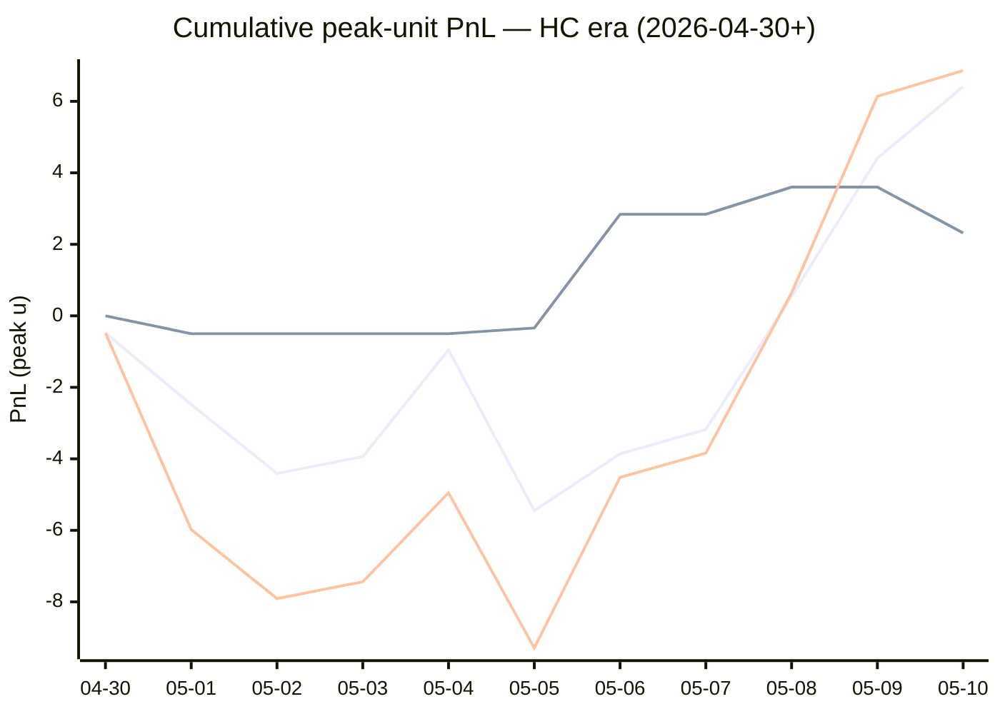

# Sharp Intel v6 — Daily Master Report

_Auto-generated **5/11/2026, 11:48:50 AM ET** by `scripts/dailyV6Report.js`. Do not edit by hand._

**Source of truth: this report mirrors the live Pick Performance dashboard.** Inclusion = `lockStage ≠ SHADOW ∧ ¬superseded ∧ health ∉ {MUTED, CANCELLED} ∧ peak.stars ≥ 2.5`. PnL is in **peak units** (the size shipped to users). HC margin / Δw / Δq are the **frozen** stamps written at last sync before the T-15 freeze. HC margin only existed from the v7.1 launch (**2026-04-30**); pre-launch picks have no HC value (no retro-fitting). Nothing is recomputed against today's whitelist.

v6 cutover: **2026-04-18** · whitelist source: live `sharpWalletProfiles` (178 profiles — drives §5 roster snapshot only) · quality cut: contribution ≥ 30 · HC = CONFIRMED tier ∧ sizeRatio ≥ 1.5.

---
## §1. Yesterday's picks

Slate: **2026-05-10** · 10 shipped sides.

| N | W-L-P | WR% | PnL (peak u) | PnL (flat 1u) |
|---|---|---|---|---|
| 10 | 5-5-0 | 50.0% | +0.72u | +0.59u |

| Sport | Market | Matchup | Pick | Stars · Units | HC | Δw | Δq | Σ | Odds | Result | PnL (peak u) |
|---|---|---|---|---|---|---|---|---|---|---|---|
| MLB | ML | Chicago Cubs @ Texas Rangers | Texas Rangers | 3.5★ · 1.13u | +1 | +1 | +0 | +1 | -120 | **W** | +0.94u |
| MLB | ML | Los Angeles Angels @ Toronto Blue Jays | Toronto Blue Jays | 3.5★ · 1.13u | +1 | +1 | +0 | +1 | -103 | L | -1.13u |
| MLB | ML | New York Mets @ Arizona Diamondbacks | Arizona Diamondbacks | 3.5★ · 1.13u | +1 | +1 | +1 | +2 | -110 | **W** | +1.03u |
| MLB | ML | Tampa Bay Rays @ Boston Red Sox | Tampa Bay Rays | 3.5★ · 1.13u | +1 | +0 | +0 | +0 | +134 | **W** | +1.51u |
| MLB | TOTAL | Colorado Rockies @ Philadelphia Phillies | OVER | 4.0★ · 0.64u | +0 | +2 | +0 | +2 | -110 | L | -0.64u |
| MLB | TOTAL | Houston Astros @ Cincinnati Reds | OVER | 4.0★ · 0.64u | +0 | +2 | +0 | +2 | -110 | L | -0.64u |
| NBA | ML | Spurs @ Timberwolves | Timberwolves | 4.0★ · 1.50u | +1 | +1 | +0 | +1 | +160 | **W** | +2.58u |
| NBA | TOTAL | Spurs @ Timberwolves | Over 218 | 5.0★ · 3.50u | +2 | +3 | +2 | +5 | -110 | **W** | +3.27u |
| NHL | ML | Sabres @ Canadiens | Sabres | 4.5★ · 4.50u | +2 | +2 | +4 | +6 | +108 | L | -4.50u |
| NHL | TOTAL | Sabres @ Canadiens | Under 4.5 | 5.0★ · 1.70u | +1 | +2 | +4 | +6 | -110 | L | -1.70u |

---
## §2. 3-day / 7-day / all-time cohort rollups

Shipped picks only. PnL in **peak units** (size we actually bet) and flat 1u (cohort EV lens). All margins are the engine's frozen stamps (`v8_hcMargin`, `v8_walletConsensusDelta`, `v8_walletConsensusQualityMargin`).

**HC margin sub-tables** are scoped to picks dated ≥ 2026-04-30 (the v7.1 launch — when HC margin became a real engine signal). Pre-launch picks are excluded from HC analysis since the feature didn't exist for them. Δw / Δq sub-tables span the full v6-era sample (≥ 2026-04-18). Empty buckets are dropped.

### §2a. 3-day

Total: **19** shipped · 12-7-0 · WR 63.2% · PnL +10.70u (peak) / +4.67u (flat).

**By HC margin** _(picks dated ≥ 2026-04-30, N = 19)_

| Bucket | N | W-L-P | WR% | PnL (peak u) | PnL (flat 1u) |
|---|---|---|---|---|---|
| HC = +2 | 4 | 3-1-0 | 75.0% | +5.50u | +1.83u |
| HC = +1 | 11 | 7-4-0 | 63.6% | +4.09u | +2.86u |
| HC = 0 | 3 | 1-2-0 | 33.3% | -0.52u | -0.99u |

**By Δw (winner margin)**

| Bucket | N | W-L-P | WR% | PnL (peak u) | PnL (flat 1u) |
|---|---|---|---|---|---|
| ≥ +3 | 4 | 4-0-0 | 100.0% | +11.24u | +3.11u |
| +2 | 7 | 2-5-0 | 28.6% | -6.68u | -3.03u |
| +1 | 6 | 4-2-0 | 66.7% | +3.00u | +2.29u |
| 0 | 1 | 1-0-0 | 100.0% | +1.51u | +1.34u |
| missing | 1 | 1-0-0 | 100.0% | +1.63u | +0.96u |

**By Δq (quality margin)**

| Bucket | N | W-L-P | WR% | PnL (peak u) | PnL (flat 1u) |
|---|---|---|---|---|---|
| ≥ +3 | 5 | 3-2-0 | 60.0% | +0.29u | +0.19u |
| +2 | 3 | 2-1-0 | 66.7% | +2.15u | +0.92u |
| +1 | 4 | 3-1-0 | 75.0% | +4.01u | +1.82u |
| 0 | 6 | 3-3-0 | 50.0% | +2.62u | +0.77u |
| −1 | 1 | 1-0-0 | 100.0% | +1.63u | +0.96u |

**By AGS tier** _(picks dated ≥ 2026-05-05, N = 19)_

| Bucket | N | W-L-P | WR% | PnL (peak u) | PnL (flat 1u) |
|---|---|---|---|---|---|
| LOCK   (+5 .. +7) | 5 | 4-1-0 | 80.0% | +4.18u | +2.14u |
| STRONG (+3 .. +5) | 6 | 5-1-0 | 83.3% | +6.79u | +3.62u |
| NEUT   (0 .. +3) | 6 | 1-5-0 | 16.7% | -3.41u | -3.40u |
| FADE   (< −1) | 1 | 1-0-0 | 100.0% | +1.51u | +1.34u |
| missing | 1 | 1-0-0 | 100.0% | +1.63u | +0.96u |

### §2b. 7-day

Total: **32** shipped · 19-13-0 · WR 59.4% · PnL +14.30u (peak) / +5.36u (flat).

**By HC margin** _(picks dated ≥ 2026-04-30, N = 32)_

| Bucket | N | W-L-P | WR% | PnL (peak u) | PnL (flat 1u) |
|---|---|---|---|---|---|
| HC = +2 | 4 | 3-1-0 | 75.0% | +5.50u | +1.83u |
| HC = +1 | 20 | 12-8-0 | 60.0% | +4.85u | +3.72u |
| HC = 0 | 6 | 3-3-0 | 50.0% | +2.82u | -0.15u |
| HC ≤ −1 | 1 | 0-1-0 | 0.0% | -0.50u | -1.00u |

**By Δw (winner margin)**

| Bucket | N | W-L-P | WR% | PnL (peak u) | PnL (flat 1u) |
|---|---|---|---|---|---|
| ≥ +3 | 9 | 7-2-0 | 77.8% | +15.99u | +3.99u |
| +2 | 9 | 2-7-0 | 22.2% | -9.81u | -5.03u |
| +1 | 11 | 8-3-0 | 72.7% | +6.11u | +5.10u |
| 0 | 1 | 1-0-0 | 100.0% | +1.51u | +1.34u |
| −1 | 1 | 0-1-0 | 0.0% | -1.13u | -1.00u |
| missing | 1 | 1-0-0 | 100.0% | +1.63u | +0.96u |

**By Δq (quality margin)**

| Bucket | N | W-L-P | WR% | PnL (peak u) | PnL (flat 1u) |
|---|---|---|---|---|---|
| ≥ +3 | 11 | 6-5-0 | 54.5% | +3.04u | +0.07u |
| +2 | 4 | 2-2-0 | 50.0% | +1.02u | -0.08u |
| +1 | 8 | 6-2-0 | 75.0% | +5.53u | +3.22u |
| 0 | 8 | 4-4-0 | 50.0% | +3.08u | +1.18u |
| −1 | 1 | 1-0-0 | 100.0% | +1.63u | +0.96u |

**By AGS tier** _(picks dated ≥ 2026-05-05, N = 25)_

| Bucket | N | W-L-P | WR% | PnL (peak u) | PnL (flat 1u) |
|---|---|---|---|---|---|
| ELITE  (≥ +7) | 1 | 1-0-0 | 100.0% | +3.18u | +0.95u |
| LOCK   (+5 .. +7) | 5 | 4-1-0 | 80.0% | +4.18u | +2.14u |
| STRONG (+3 .. +5) | 7 | 6-1-0 | 85.7% | +8.38u | +5.03u |
| NEUT   (0 .. +3) | 9 | 3-6-0 | 33.3% | -6.57u | -2.61u |
| FADE   (< −1) | 2 | 1-1-0 | 50.0% | +1.01u | +0.34u |
| missing | 1 | 1-0-0 | 100.0% | +1.63u | +0.96u |

### §2c. All-time

Total: **161** shipped · 78-81-2 · WR 49.1% · PnL -5.37u (peak) / -3.17u (flat).

**By HC margin** _(picks dated ≥ 2026-04-30, N = 50)_

| Bucket | N | W-L-P | WR% | PnL (peak u) | PnL (flat 1u) |
|---|---|---|---|---|---|
| HC = +2 | 4 | 3-1-0 | 75.0% | +5.50u | +1.83u |
| HC = +1 | 32 | 18-14-0 | 56.3% | +0.91u | +4.24u |
| HC = 0 | 11 | 6-4-1 | 60.0% | +2.32u | +1.54u |
| HC ≤ −1 | 2 | 0-2-0 | 0.0% | -3.50u | -2.00u |

**By Δw (winner margin)**

| Bucket | N | W-L-P | WR% | PnL (peak u) | PnL (flat 1u) |
|---|---|---|---|---|---|
| ≥ +3 | 28 | 20-8-0 | 71.4% | +25.11u | +14.88u |
| +2 | 37 | 15-22-0 | 40.5% | -15.60u | -5.96u |
| +1 | 54 | 29-24-1 | 54.7% | +0.67u | +2.75u |
| 0 | 28 | 9-18-1 | 33.3% | -13.44u | -9.75u |
| −1 | 7 | 1-6-0 | 14.3% | -5.60u | -4.94u |
| ≤ −2 | 1 | 0-1-0 | 0.0% | -0.50u | -1.00u |
| missing | 6 | 4-2-0 | 66.7% | +3.99u | +0.85u |

**By Δq (quality margin)**

| Bucket | N | W-L-P | WR% | PnL (peak u) | PnL (flat 1u) |
|---|---|---|---|---|---|
| ≥ +3 | 58 | 28-28-2 | 50.0% | -5.55u | +1.09u |
| +2 | 42 | 20-22-0 | 47.6% | -5.75u | -1.28u |
| +1 | 38 | 19-19-0 | 50.0% | +1.97u | -1.62u |
| 0 | 14 | 5-9-0 | 35.7% | -0.59u | -3.05u |
| −1 | 1 | 1-0-0 | 100.0% | +1.63u | +0.96u |
| ≤ −2 | 2 | 1-1-0 | 50.0% | -0.32u | -0.04u |
| missing | 6 | 4-2-0 | 66.7% | +3.24u | +0.77u |

**By AGS tier** _(picks dated ≥ 2026-05-05, N = 25)_

| Bucket | N | W-L-P | WR% | PnL (peak u) | PnL (flat 1u) |
|---|---|---|---|---|---|
| ELITE  (≥ +7) | 1 | 1-0-0 | 100.0% | +3.18u | +0.95u |
| LOCK   (+5 .. +7) | 5 | 4-1-0 | 80.0% | +4.18u | +2.14u |
| STRONG (+3 .. +5) | 7 | 6-1-0 | 85.7% | +8.38u | +5.03u |
| NEUT   (0 .. +3) | 9 | 3-6-0 | 33.3% | -6.57u | -2.61u |
| FADE   (< −1) | 2 | 1-1-0 | 50.0% | +1.01u | +0.34u |
| missing | 1 | 1-0-0 | 100.0% | +1.63u | +0.96u |

---
## §3. Edge over time — is HC margin creating winners?

Daily cumulative peak-unit PnL since the HC margin launch (**2026-04-30**). The `HC ≥ +1` line is the golden-standard cohort. The `HC = 0` line is the no-HC-signal control. The `All shipped (HC era)` line is every shipped pick from the same date range — the apples-to-apples baseline. Watch the spread.

Daily cumulative table (peak units, HC era only):

| Date | HC ≥ +1 (cum) | HC = 0 (cum) | All shipped (cum) |
|---|---|---|---|
| 2026-04-30 | -0.48u | +0.00u | -0.48u |
| 2026-05-01 | -2.48u | -0.50u | -5.98u |
| 2026-05-02 | -4.41u | -0.50u | -7.91u |
| 2026-05-03 | -3.94u | -0.50u | -7.44u |
| 2026-05-04 | -0.95u | -0.50u | -4.95u |
| 2026-05-05 | -5.45u | -0.34u | -9.29u |
| 2026-05-06 | -3.86u | +2.84u | -4.52u |
| 2026-05-07 | -3.18u | +2.84u | -3.84u |
| 2026-05-08 | +0.54u | +3.60u | +0.64u |
| 2026-05-09 | +4.41u | +3.60u | +6.14u |
| 2026-05-10 | +6.41u | +2.32u | +6.86u |

---
## §4. Wallet roster growth & profitability

"Tracked in sport X" = a wallet has placed **≥ 2 bets** in X within the v6-era sample. "Profitable" = cumulative flat PnL > 0. Source: `v8Scoring.walletDetails` on every graded v6-era game (every side, not just the shipped set).

### §4a. Per-sport wallet snapshot

| Sport | Total wallets seen | Tracked (≥2) | Profitable | % prof | WR ≥ 50% | WR ≥ 60% | WR ≥ 70% |
|---|---|---|---|---|---|---|---|
| MLB | 41 | 24 | 8 | 33% | 11 | 4 | 1 |
| NBA | 116 | 82 | 35 | 43% | 47 | 22 | 13 |
| NHL | 44 | 26 | 11 | 42% | 17 | 9 | 5 |
| **ALL (any sport)** | **132** | **94** | **42** | **45%** | **52** | **24** | **13** |

### §4b. Daily roster growth (cumulative through each date)

Format: `tracked (profitable)`. For each date D, recompute the roster using every bet up to and including D.

| Date | ALL | MLB | NBA | NHL |
|---|---|---|---|---|
| 2026-04-18 | 5 (2) | 2 (2) | 3 (0) | 0 (0) |
| 2026-04-19 | 19 (8) | 5 (3) | 9 (3) | 3 (1) |
| 2026-04-20 | 29 (12) | 7 (6) | 23 (8) | 5 (2) |
| 2026-04-21 | 44 (21) | 10 (6) | 31 (10) | 7 (5) |
| 2026-04-22 | 52 (28) | 12 (6) | 39 (15) | 11 (10) |
| 2026-04-23 | 56 (29) | 13 (6) | 46 (21) | 13 (10) |
| 2026-04-24 | 61 (30) | 14 (6) | 51 (23) | 14 (9) |
| 2026-04-25 | 65 (29) | 16 (8) | 54 (22) | 16 (9) |
| 2026-04-26 | 67 (31) | 18 (5) | 56 (25) | 17 (9) |
| 2026-04-27 | 72 (32) | 20 (7) | 60 (24) | 17 (9) |
| 2026-04-28 | 76 (33) | 21 (7) | 63 (26) | 23 (10) |
| 2026-04-29 | 77 (33) | 21 (7) | 64 (25) | 23 (10) |
| 2026-04-30 | 81 (34) | 21 (7) | 70 (27) | 23 (10) |
| 2026-05-01 | 85 (38) | 22 (5) | 74 (30) | 26 (13) |
| 2026-05-02 | 86 (37) | 23 (7) | 75 (32) | 26 (12) |
| 2026-05-03 | 86 (38) | 24 (8) | 75 (33) | 26 (12) |
| 2026-05-04 | 90 (38) | 24 (9) | 76 (32) | 26 (12) |
| 2026-05-05 | 91 (40) | 24 (9) | 79 (33) | 26 (12) |
| 2026-05-06 | 92 (40) | 24 (9) | 80 (33) | 26 (12) |
| 2026-05-07 | 92 (41) | 24 (9) | 80 (33) | 26 (12) |
| 2026-05-08 | 92 (40) | 24 (8) | 80 (32) | 26 (11) |
| 2026-05-09 | 94 (42) | 24 (8) | 82 (35) | 26 (11) |
| 2026-05-10 | 94 (42) | 24 (8) | 82 (35) | 26 (11) |

### §4c. Top 10 profitable wallets by sport

#### MLB

| # | Wallet | N | W | L | WR% | Flat PnL (u) | Flat ROI | $ PnL |
|---|---|---|---|---|---|---|---|---|
| 1 | c289a0 | 3 | 3 | 0 | 100.0% | +2.87 | +95.6% | $1.5K |
| 2 | 63fc82 | 11 | 7 | 4 | 63.6% | +2.76 | +25.1% | $33.8K |
| 3 | 981187 | 8 | 5 | 3 | 62.5% | +1.65 | +20.7% | $13.5K |
| 4 | d5017f | 8 | 5 | 3 | 62.5% | +1.63 | +20.3% | $42.8K |
| 5 | dcafd2 | 12 | 7 | 5 | 58.3% | +1.32 | +11.0% | $27.2K |
| 6 | fcc12b | 22 | 12 | 10 | 54.5% | +1.54 | +7.0% | $150.5K |
| 7 | 4c64aa | 40 | 23 | 17 | 57.5% | +2.60 | +6.5% | -$17.7K |
| 8 | c668b3 | 2 | 1 | 1 | 50.0% | +0.12 | +6.0% | $18 |
| 9 | 8c1eae | 8 | 4 | 4 | 50.0% | -0.02 | -0.3% | $708 |
| 10 | 7923c4 | 6 | 3 | 3 | 50.0% | -0.15 | -2.5% | $50.0K |

#### NBA

| # | Wallet | N | W | L | WR% | Flat PnL (u) | Flat ROI | $ PnL |
|---|---|---|---|---|---|---|---|---|
| 1 | 799fad | 2 | 2 | 0 | 100.0% | +5.66 | +283.0% | $241.7K |
| 2 | b51a56 | 5 | 5 | 0 | 100.0% | +6.44 | +128.9% | $74.8K |
| 3 | 2e8da5 | 9 | 8 | 1 | 88.9% | +9.06 | +100.7% | $144.0K |
| 4 | 8ec926 | 5 | 5 | 0 | 100.0% | +4.60 | +92.0% | $8.5K |
| 5 | 12ad50 | 3 | 3 | 0 | 100.0% | +2.74 | +91.3% | $45.5K |
| 6 | 769c38 | 8 | 8 | 0 | 100.0% | +7.20 | +90.0% | $62.9K |
| 7 | 7703d4 | 6 | 6 | 0 | 100.0% | +5.13 | +85.5% | $25.6K |
| 8 | 11b032 | 7 | 6 | 1 | 85.7% | +5.40 | +77.1% | $249.9K |
| 9 | 7f00bc | 13 | 9 | 4 | 69.2% | +8.17 | +62.9% | $11.1K |
| 10 | 8366f5 | 8 | 5 | 3 | 62.5% | +4.83 | +60.4% | $47.5K |

#### NHL

| # | Wallet | N | W | L | WR% | Flat PnL (u) | Flat ROI | $ PnL |
|---|---|---|---|---|---|---|---|---|
| 1 | 981187 | 5 | 5 | 0 | 100.0% | +5.03 | +100.6% | $30.3K |
| 2 | 799fad | 2 | 2 | 0 | 100.0% | +1.88 | +94.1% | $46.9K |
| 3 | fcc12b | 6 | 5 | 1 | 83.3% | +3.29 | +54.8% | $13.9K |
| 4 | 30935c | 4 | 3 | 1 | 75.0% | +2.11 | +52.7% | $953 |
| 5 | bc3532 | 9 | 6 | 3 | 66.7% | +4.68 | +52.0% | -$5.1K |
| 6 | e70853 | 7 | 5 | 2 | 71.4% | +3.17 | +45.2% | $2.2K |
| 7 | c5cea1 | 3 | 2 | 1 | 66.7% | +0.62 | +20.7% | $22.1K |
| 8 | dcafd2 | 2 | 1 | 1 | 50.0% | +0.40 | +20.0% | $4.9K |
| 9 | 6b853d | 6 | 4 | 2 | 66.7% | +1.13 | +18.8% | $7.7K |
| 10 | dfa240 | 16 | 10 | 6 | 62.5% | +2.69 | +16.8% | $8.6K |

---
## §5. Proven-wallet roster growth & HC tracking

"Proven wallet" = whitelist tier `CONFIRMED` or `FLAT` in the same sense the live engine uses (`exportWalletProfiles.js` → `sharpWalletProfiles.bySport`). Sports inherit independent rosters: a wallet can be CONFIRMED in NBA and absent from NHL. `walletBets` come from `v8Scoring.walletDetails` on every graded v6-era pick (Source A); `positionRows` come from `sharp_action_positions` (Source B).

### §5a. Current proven-winner roster (snapshot)

Roster as of **2026-05-10** — wallets with ≥2 bets in the sport.

| Sport | Wallets seen | Eligible (≥2) | CONFIRMED | FLAT | Proven (C+F) | WR50 only | Conv % |
|---|---|---|---|---|---|---|---|
| MLB | 69 | 24 | 3 | 5 | **8** | 3 | 11.6% |
| NBA | 150 | 82 | 23 | 12 | **35** | 17 | 23.3% |
| NHL | 65 | 26 | 8 | 3 | **11** | 6 | 16.9% |
| **ALL** | **—** | **—** | **—** | **—** | **54** | **—** | **—** |

### §5b. Live whitelist drift check

Live `sharpWalletProfiles` is what the engine reads at lock time. Drift between script reconstruction (above) and live should be ≤ 1 day of position data — otherwise `exportWalletProfiles.js` is stale.

| Sport | CONFIRMED (live · script) | FLAT (live · script) | WR50 (live · script) | Drift |
|---|---|---|---|---|
| MLB | 13 · 3 | 7 · 5 | 3 · 3 | +12 live |
| NBA | 42 · 23 | 15 · 12 | 19 · 17 | +22 live |
| NHL | 13 · 8 | 5 · 3 | 5 · 6 | +7 live |

### §5c. Roster growth — 3d / 7d / 30d / all-time deltas

Each cell is **net growth** in proven (CONFIRMED + FLAT) wallets in that window, with the absolute count at the start (`+Δ from N`). Negative = wallets demoted. Window endpoint = 2026-05-10.

| Sport | 3-day | 7-day | 30-day | All-time (since cutover) |
|---|---|---|---|---|
| MLB | -1 from 9 | +0 from 8 | +8 from 0 | +8 from 0 |
| NBA | +2 from 33 | +2 from 33 | +35 from 0 | +35 from 0 |
| NHL | -1 from 12 | -1 from 12 | +11 from 0 | +11 from 0 |

A flat 7-day delta on a sport with healthy slate density = either the bubble pipeline has stalled (no wallets approaching the bar) or our cohort has saturated. Check §13d for the funnel diagnostic.

### §5d. Pipeline funnel — where each sport leaks

Wallets surviving each gate, in order. The biggest %-drop tells you the bottleneck. Gates:

1. **Seen** — placed ≥ 1 bet in the sport (any source)
2. **Eligible** — ≥ 2 graded picks in Source A (required for FLAT/CONFIRMED)
3. **Flat-OK** — eligible AND flat ROI > 0 (becomes FLAT or better)
4. **$-OK** — Flat-OK AND ≥2 positions with dollar ROI > 0 (CONFIRMED)
5. **Promoted** — final whitelisted = CONFIRMED + FLAT

| Sport | 1·Seen | 2·Eligible (% of Seen) | 3·Flat-OK (% of Elig) | 4·$-OK (% of Flat) | 5·Promoted | Bottleneck |
|---|---|---|---|---|---|---|
| MLB | 69 | 24 (35%) | 8 (33%) | 3 (38%) | **8** | edge (Eligible→Flat-OK) 67% |
| NBA | 150 | 82 (55%) | 35 (43%) | 23 (66%) | **35** | edge (Eligible→Flat-OK) 57% |
| NHL | 65 | 26 (40%) | 11 (42%) | 8 (73%) | **11** | sample (Seen→Eligible) 60% |

### §5e. HC backing density (the fuel for v7.3 HC margin)

Every v7.x promotion is gated on `HC_m ≥ +1`, which requires at least one CONFIRMED wallet sized at `≥ 1.5×` average on the for-side. This table shows the share of shipped picks that *had any HC backing*, by sport, in each window. If HC density falls toward zero in a sport, the v7.3 floor cohorts (Σ=1, Σ=2 locks; HC rescues) will simply stop firing there.

| Sport | Window | Picks (with HC stamp) | Any HC for-side | HC_m ≥ +1 | HC_m ≥ +2 |
|---|---|---|---|---|---|
| MLB | 3-day | 7 | 5 (71.4%) | 5 (71.4%) | 0 (0.0%) |
| MLB | 7-day | 9 | 7 (77.8%) | 7 (77.8%) | 0 (0.0%) |
| MLB | All-time | 52 | 22 (42.3%) | 21 (40.4%) | 2 (3.8%) |
| NBA | 3-day | 9 | 8 (88.9%) | 8 (88.9%) | 4 (44.4%) |
| NBA | 7-day | 18 | 14 (77.8%) | 13 (72.2%) | 4 (22.2%) |
| NBA | All-time | 82 | 45 (54.9%) | 39 (47.6%) | 14 (17.1%) |
| NHL | 3-day | 3 | 3 (100.0%) | 3 (100.0%) | 1 (33.3%) |
| NHL | 7-day | 5 | 5 (100.0%) | 5 (100.0%) | 1 (20.0%) |
| NHL | All-time | 21 | 7 (33.3%) | 6 (28.6%) | 1 (4.8%) |

Pooled across sports:

| Window | Picks (with HC stamp) | Any HC for-side | HC_m ≥ +1 | HC_m ≥ +2 |
|---|---|---|---|---|
| 3-day | 19 | 16 (84.2%) | 16 (84.2%) | 5 (26.3%) |
| 7-day | 32 | 26 (81.3%) | 25 (78.1%) | 5 (15.6%) |
| All-time | 155 | 74 (47.7%) | 66 (42.6%) | 17 (11.0%) |

### §5f. Bubble wallets — next-up graduations

Wallets currently NOT promoted but close. Two flavors:

- **One-bet-away** — won the only bet, needs one more positive bet to clear ≥2.
- **Just-under** — has ≥2 bets but flat ROI is between −10% and 0% (one win flips them).

#### MLB

**One-bet-away** (4)

| wallet | picksN | flat PnL | pos N | pos $ROI |
|---|---|---|---|---|
| `...be00` | 1 | +0.87 | 5 | 47% |
| `...a240` | 1 | +0.87 | 6 | 100% |
| `...9373` | 1 | +0.87 | 0 | — |
| `...8d26` | 1 | +0.72 | 5 | -22% |

**Just-under** (5)

| wallet | picksN | WR | flat ROI | pos N | pos $ROI |
|---|---|---|---|---|---|
| `...1eae` | 8 | 50% | -0.3% | 27 | -13% |
| `...23c4` | 6 | 50% | -2.5% | 51 | -5% |
| `...192c` | 14 | 50% | -5.9% | 57 | 5% |
| `...2f63` | 69 | 48% | -6.7% | 177 | 15% |
| `...5143` | 9 | 44% | -8.6% | 30 | 23% |

#### NBA

**One-bet-away** (6)

| wallet | picksN | flat PnL | pos N | pos $ROI |
|---|---|---|---|---|
| `...bf5d` | 1 | +3.15 | 3 | 42% |
| `...ed41` | 1 | +3.15 | 3 | 3% |
| `...6b87` | 1 | +2.05 | 6 | -39% |
| `...9953` | 1 | +1.90 | 7 | 46% |
| `...9d74` | 1 | +0.93 | 3 | -28% |
| `...c556` | 1 | +0.93 | 3 | 42% |

**Just-under** (6)

| wallet | picksN | WR | flat ROI | pos N | pos $ROI |
|---|---|---|---|---|---|
| `...d814` | 8 | 50% | -0.5% | 35 | -28% |
| `...f5b0` | 20 | 50% | -3.7% | 44 | -26% |
| `...1fc6` | 4 | 50% | -3.7% | 9 | 17% |
| `...1f17` | 2 | 50% | -4.5% | 2 | -10% |
| `...4582` | 2 | 50% | -6.5% | 2 | -2% |
| `...2f63` | 57 | 44% | -8.8% | 162 | 2% |

#### NHL

**One-bet-away** (6)

| wallet | picksN | flat PnL | pos N | pos $ROI |
|---|---|---|---|---|
| `...2e78` | 1 | +1.46 | 0 | — |
| `...017f` | 1 | +1.45 | 1 | 150% |
| `...c67e` | 1 | +1.42 | 10 | -3% |
| `...32f2` | 1 | +1.40 | 0 | — |
| `...e0fd` | 1 | +1.20 | 3 | 124% |
| `...266e` | 1 | +1.05 | 0 | — |

**Just-under** (4)

| wallet | picksN | WR | flat ROI | pos N | pos $ROI |
|---|---|---|---|---|---|
| `...33ee` | 4 | 50% | -0.3% | 8 | -23% |
| `...68b3` | 4 | 50% | -8.5% | 9 | 63% |
| `...3782` | 2 | 50% | -9.0% | 18 | 27% |
| `...d227` | 2 | 50% | -9.0% | 10 | 32% |

### §5g. v2 wallet-promotion pipeline (Source-A / Source-B mix)

Live snapshot of the v2 promotion gate (shipped 2026-05-10, re-eval **2026-05-24**). Each FLAT-or-better wallet × sport pair is attributed to one of three paths via `sharpWalletProfiles[wallet].bySport[sport].whitelistSource`:

- **A** — flat-positive on featured picks (Source A) only — the v1 gate
- **A+B** — flat-positive in both sources (most reliable signal)
- **B** — flat-positive on-chain only (NEW in v2 — the trial lift)

Re-classified every 2h via `grade-sharp-actions` cron. Roll-back: set `B_ONLY_MIN_BETS = Infinity` in `scripts/exportWalletProfiles.js`.

#### Source mix per sport (live Firestore)

| Sport | A | A+B | B (new) | FLAT-or-better total | % from B-only |
|---|---|---|---|---|---|
| MLB | 4 | 4 | **12** | 20 | 60.0% |
| NBA | 16 | 19 | **22** | 57 | 38.6% |
| NHL | 5 | 6 | **7** | 18 | 38.9% |
| **ALL** | **25** | **29** | **41** | **95** | **43.2%** |

#### Pipeline freshness

- `sharp_action_positions` GRADED rows: **4198**
- `sharp_action_positions` PENDING rows: **78** (queued for next Grade Sharp Actions run)
- Latest `sharpWalletProfiles` rebuild: 5/11/2026, 6:35:24 AM ET — **313 min · STALE** — check grade-sharp-actions workflow

**Alarms**: pending > 200 OR rebuild lag > 4h → cron is lagging or failing — check `gh run list --workflow="Grade Sharp Actions"`.

#### B-only roster — wallets currently promoted via Source B path only

Wallets here would have been EXCLUDED under v1 (Source-A-only). Top by Source-B bet count per sport. The 2-week re-eval (2026-05-24) will compare these wallets' realized lift against A-only and A+B cohorts.

**MLB** — 12 wallets promoted via B

| wallet | tier | B_n | B_flat ROI | B_$ ROI |
|---|---|---|---|---|
| `...9a27` | CONFIRMED | 159 | +17% | +5.3% |
| `...5143` | CONFIRMED | 31 | +17.9% | +19.7% |
| `...d6d2` | FLAT | 16 | +9.2% | -1.6% |
| `...0ff5` | FLAT | 13 | +1.8% | -23.5% |
| `...a9cc` | CONFIRMED | 8 | +6.3% | +0.3% |
| `...9d74` | CONFIRMED | 7 | +24.2% | +43.8% |
| `...aeeb` | CONFIRMED | 7 | +35.4% | +37.5% |
| `...35e3` | CONFIRMED | 6 | +29.9% | +35.5% |
| `...a240` | CONFIRMED | 6 | +53.6% | +99.7% |
| `...abaf` | CONFIRMED | 6 | +30.5% | +46.3% |
| … | 2 more | | | |

**NBA** — 22 wallets promoted via B

| wallet | tier | B_n | B_flat ROI | B_$ ROI |
|---|---|---|---|---|
| `...2f63` | CONFIRMED | 162 | +1.4% | +2.3% |
| `...1eae` | CONFIRMED | 59 | +5.3% | +14.3% |
| `...afd2` | CONFIRMED | 52 | +0.1% | +1.7% |
| `...3782` | CONFIRMED | 44 | +26.5% | +17.2% |
| `...11a4` | CONFIRMED | 31 | +44.9% | +36.7% |
| `...935c` | FLAT | 29 | +62.5% | -22.6% |
| `...68b3` | CONFIRMED | 16 | +28.5% | +18.4% |
| `...1697` | CONFIRMED | 15 | +14.1% | +29.5% |
| `...2db4` | CONFIRMED | 13 | +4.9% | +3.3% |
| `...89a0` | FLAT | 13 | +38.5% | -14.4% |
| … | 12 more | | | |

**NHL** — 7 wallets promoted via B

| wallet | tier | B_n | B_flat ROI | B_$ ROI |
|---|---|---|---|---|
| `...3782` | CONFIRMED | 18 | +17.5% | +26.7% |
| `...df91` | FLAT | 17 | +9.2% | -15% |
| `...b33b` | CONFIRMED | 12 | +12% | +1.6% |
| `...23c4` | CONFIRMED | 10 | +19.9% | +27.4% |
| `...9ef0` | FLAT | 9 | +0.7% | -4.2% |
| `...68b3` | CONFIRMED | 9 | +20.6% | +63.3% |
| `...a9cc` | CONFIRMED | 7 | +49.5% | +46.9% |

### §5 — How to read

- **Roster growth flat in 7-day** + **funnel bottleneck = `data`** → re-run `exportWalletProfiles.js`. The flat-positive wallets are stuck at FLAT because Source-B coverage hasn't caught up. CONFIRMED gate is data-bound, not skill-bound.
- **Roster growth flat in 7-day** + **funnel bottleneck = `sample`** → wallets aren't reaching `≥2` reps fast enough. This is a slate-density problem; consider a soft `MIN_BETS = 1` shadow lane to surface bubble wallets earlier.
- **Roster shrank** (negative delta) → a previously CONFIRMED wallet just dropped flat-positive (lost a recent bet). Variance, not failure — but worth noting if a sport loses ≥3 in a week.
- **HC density on a sport drops below ~30%** → v7.3 promotions there will starve. Either the proven roster needs more CONFIRMED-tier wallets sizing aggressively, or the HC_RATIO (1.5) needs a sport-specific tune.
- **§5g B-only count drops sharply** → wallets are demoting off the B path (losing on-chain). Cross-check `WALLET_PROFILES_SUMMARY.md` churn section for the specific demotions.
- **§5g pipeline freshness lag > 4h** → grade-sharp-actions cron is failing. Check `gh run list --workflow="Grade Sharp Actions"` and re-trigger if needed.

---
## §6. Daily proven-wallet performance

Who on the proven roster is actually printing — yesterday's bets, the rolling leaderboard (`$ PnL`-ranked), current streaks, and per-sport volume. **Proven** = `CONFIRMED` ∪ `FLAT` per sport (the same gate that drives Δ_winner). A wallet only counts in a sport where it's on that sport's proven list.

### §6a. Yesterday's proven-wallet bets

Slate: **2026-05-10** · 25 bets · 11 distinct proven wallets · WR 72% · $ vol $739.7K · $ PnL $580.6K.

| Wallet | Sport | Market | Game | $ size | Result | $ PnL |
|---|---|---|---|---|---|---|
| `...d96a` (FLAT) | NBA | SPREAD | Spurs @ Timberwolves | $153.0K | **W** | $139.1K |
| `...23c4` (CONFIRMED) | NBA | TOTAL | Knicks @ 76ers | $108.1K | **W** | $109.2K |
| `...b032` (CONFIRMED) | NBA | ML | Spurs @ Timberwolves | $62.9K | **W** | $108.1K |
| `...23c4` (CONFIRMED) | NBA | TOTAL | Spurs @ Timberwolves | $100.0K | **W** | $93.5K |
| `...9a27` (CONFIRMED) | NBA | SPREAD | Spurs @ Timberwolves | $91.0K | **W** | $82.7K |
| `...aeeb` (CONFIRMED) | NBA | ML | Knicks @ 76ers | $66.7K | **W** | $25.6K |
| `...aeeb` (CONFIRMED) | NBA | ML | Spurs @ Timberwolves | $13.2K | **W** | $22.8K |
| `...3532` (FLAT) | NBA | SPREAD | Spurs @ Timberwolves | $23.5K | **W** | $21.3K |
| `...3532` (FLAT) | NHL | ML | Golden Knights @ Ducks | $18.4K | **W** | $18.8K |
| `...9a27` (CONFIRMED) | NBA | TOTAL | Spurs @ Timberwolves | $19.5K | **W** | $18.2K |
| `...c926` (FLAT) | NBA | ML | Spurs @ Timberwolves | $1.8K | **W** | $3.1K |
| `...d49f` (FLAT) | NBA | TOTAL | Knicks @ 76ers | $2.8K | **W** | $2.9K |
| `...c926` (FLAT) | NBA | TOTAL | Spurs @ Timberwolves | $2.5K | **W** | $2.4K |
| `...c926` (FLAT) | NBA | SPREAD | Spurs @ Timberwolves | $2.5K | **W** | $2.3K |
| `...853d` (CONFIRMED) | NBA | TOTAL | Knicks @ 76ers | $1.1K | **W** | $1.2K |
| `...9a27` (CONFIRMED) | NBA | TOTAL | Knicks @ 76ers | $755 | **W** | $763 |
| `...853d` (CONFIRMED) | NBA | TOTAL | Spurs @ Timberwolves | $206 | **W** | $193 |
| `...66f5` (CONFIRMED) | NBA | ML | Spurs @ Timberwolves | $7 | **W** | $12 |
| `...afd2` (CONFIRMED) | MLB | TOTAL | Houston Astros @ Cincinnati Reds | $453 | L | -$453 |
| `...d49f` (FLAT) | NBA | TOTAL | Spurs @ Timberwolves | $512 | L | -$512 |
| `...afd2` (CONFIRMED) | MLB | TOTAL | Colorado Rockies @ Philadelphia Phillies | $991 | L | -$991 |
| `...3532` (FLAT) | NBA | ML | Spurs @ Timberwolves | $4.3K | L | -$4.3K |
| `...3532` (FLAT) | NBA | ML | Knicks @ 76ers | $7.7K | L | -$7.7K |
| `...853d` (CONFIRMED) | NBA | SPREAD | Spurs @ Timberwolves | $15.0K | L | -$15.0K |
| `...3532` (FLAT) | NHL | ML | Sabres @ Canadiens | $42.6K | L | -$42.6K |

### §6b. Proven-wallet leaderboard

Top 15 proven `(wallet × sport)` pairs per sport per horizon, ranked by **$ PnL** (the dollar-ROI lens). The 3-day board is the "who's on form right now" lens; the 7-day filters single-day variance; all-time is the proven-roster reference.

#### §6b-1. 3-day

**MLB** — 2 active proven wallets

| # | Wallet | Tier | Bets | WR% | Bets/day | Flat PnL (u) | Flat ROI | $ vol | $ PnL | $ ROI | Streak |
|---|---|---|---|---|---|---|---|---|---|---|---|
| 1 | `...afd2` | CONFIRMED | 2 | 0% | 2.0 | -2.00 | -100% | $1.4K | -$1.4K | -100% | 2L |
| 2 | `...c12b` | CONFIRMED | 1 | 0% | 1.0 | -1.00 | -100% | $8.1K | -$8.1K | -100% | 1L |

**NBA** — 17 active proven wallets

| # | Wallet | Tier | Bets | WR% | Bets/day | Flat PnL (u) | Flat ROI | $ vol | $ PnL | $ ROI | Streak |
|---|---|---|---|---|---|---|---|---|---|---|---|
| 1 | `...23c4` | CONFIRMED | 3 | 100% | 1.0 | +2.90 | +97% | $216.6K | $210.7K | +97% | 3W |
| 2 | `...b032` | CONFIRMED | 3 | 100% | 1.5 | +3.62 | +121% | $139.7K | $181.1K | +130% | 3W |
| 3 | `...9a27` | CONFIRMED | 10 | 100% | 3.3 | +8.44 | +84% | $180.6K | $148.0K | +82% | 10W |
| 4 | `...5143` | FLAT | 1 | 100% | 1.0 | +0.46 | +46% | $101.5K | $46.5K | +46% | 1W |
| 5 | `...b814` | CONFIRMED | 1 | 100% | 1.0 | +0.27 | +27% | $144.0K | $39.6K | +27% | 1W |
| 6 | `...66f5` | CONFIRMED | 3 | 67% | 1.0 | +2.37 | +79% | $23.7K | $39.1K | +165% | 2W |
| 7 | `...3532` | FLAT | 7 | 71% | 2.3 | +1.61 | +23% | $57.9K | $19.4K | +33% | 1W |
| 8 | `...9ef0` | FLAT | 1 | 100% | 1.0 | +0.27 | +27% | $53.8K | $14.8K | +27% | 1W |
| 9 | `...03d4` | FLAT | 3 | 100% | 3.0 | +2.38 | +79% | $10.2K | $9.7K | +95% | 3W |
| 10 | `...c926` | FLAT | 3 | 100% | 3.0 | +3.56 | +119% | $6.9K | $7.8K | +113% | 3W |
| 11 | `...aeeb` | CONFIRMED | 5 | 60% | 1.7 | +0.38 | +8% | $147.4K | $5.8K | +4% | 3W |
| 12 | `...d49f` | FLAT | 3 | 67% | 1.5 | +0.97 | +32% | $5.0K | $3.9K | +79% | 1L |
| 13 | `...1a56` | CONFIRMED | 1 | 100% | 1.0 | +1.65 | +165% | $2.2K | $3.6K | +165% | 1W |
| 14 | `...df91` | FLAT | 1 | 100% | 1.0 | +1.65 | +165% | $14 | $23 | +165% | 1W |
| 15 | `...853d` | CONFIRMED | 6 | 83% | 2.0 | +3.33 | +55% | $29.2K | -$4.5K | -15% | 1W |

**NHL** — 2 active proven wallets

| # | Wallet | Tier | Bets | WR% | Bets/day | Flat PnL (u) | Flat ROI | $ vol | $ PnL | $ ROI | Streak |
|---|---|---|---|---|---|---|---|---|---|---|---|
| 1 | `...a240` | CONFIRMED | 1 | 100% | 1.0 | +0.93 | +93% | $1.0K | $926 | +93% | 1W |
| 2 | `...3532` | FLAT | 3 | 33% | 1.0 | -0.98 | -33% | $79.5K | -$42.3K | -53% | 1W |

#### §6b-2. 7-day

**MLB** — 6 active proven wallets

| # | Wallet | Tier | Bets | WR% | Bets/day | Flat PnL (u) | Flat ROI | $ vol | $ PnL | $ ROI | Streak |
|---|---|---|---|---|---|---|---|---|---|---|---|
| 1 | `...017f` | CONFIRMED | 3 | 67% | 3.0 | +0.78 | +26% | $23.8K | $13.4K | +57% | 1W |
| 2 | `...64aa` | FLAT | 4 | 75% | 2.0 | +1.29 | +32% | $87.3K | $8.1K | +9% | 3W |
| 3 | `...89a0` | FLAT | 1 | 100% | 1.0 | +0.87 | +87% | $452 | $393 | +87% | 1W |
| 4 | `...afd2` | CONFIRMED | 2 | 0% | 2.0 | -2.00 | -100% | $1.4K | -$1.4K | -100% | 2L |
| 5 | `...c12b` | CONFIRMED | 1 | 0% | 1.0 | -1.00 | -100% | $8.1K | -$8.1K | -100% | 1L |
| 6 | `...fc82` | FLAT | 1 | 0% | 1.0 | -1.00 | -100% | $35.6K | -$35.6K | -100% | 1L |

**NBA** — 25 active proven wallets

| # | Wallet | Tier | Bets | WR% | Bets/day | Flat PnL (u) | Flat ROI | $ vol | $ PnL | $ ROI | Streak |
|---|---|---|---|---|---|---|---|---|---|---|---|
| 1 | `...b032` | CONFIRMED | 5 | 80% | 0.7 | +3.55 | +71% | $178.7K | $188.3K | +105% | 3W |
| 2 | `...9a27` | CONFIRMED | 19 | 84% | 2.7 | +10.35 | +54% | $284.7K | $131.6K | +46% | 14W |
| 3 | `...23c4` | CONFIRMED | 7 | 86% | 1.0 | +4.58 | +65% | $338.3K | $125.9K | +37% | 5W |
| 4 | `...b814` | CONFIRMED | 2 | 100% | 0.4 | +0.39 | +19% | $287.9K | $55.6K | +19% | 2W |
| 5 | `...5143` | FLAT | 1 | 100% | 1.0 | +0.46 | +46% | $101.5K | $46.5K | +46% | 1W |
| 6 | `...66f5` | CONFIRMED | 5 | 60% | 0.7 | +1.48 | +30% | $82.9K | $45.4K | +55% | 2W |
| 7 | `...aeeb` | CONFIRMED | 12 | 67% | 1.7 | +1.77 | +15% | $335.4K | $32.2K | +10% | 3W |
| 8 | `...8da5` | CONFIRMED | 2 | 100% | 2.0 | +4.20 | +210% | $18.5K | $25.8K | +139% | 2W |
| 9 | `...9ef0` | FLAT | 3 | 67% | 0.6 | -0.61 | -20% | $95.2K | $18.2K | +19% | 2W |
| 10 | `...3532` | FLAT | 11 | 64% | 2.2 | +0.76 | +7% | $117.9K | $16.6K | +14% | 1W |
| 11 | `...0853` | CONFIRMED | 1 | 100% | 1.0 | +0.11 | +11% | $139.2K | $15.5K | +11% | 1W |
| 12 | `...03d4` | FLAT | 4 | 100% | 2.0 | +3.31 | +83% | $15.2K | $14.3K | +94% | 4W |
| 13 | `...c926` | FLAT | 5 | 100% | 0.7 | +4.60 | +92% | $9.9K | $8.5K | +86% | 5W |
| 14 | `...d49f` | FLAT | 3 | 67% | 1.5 | +0.97 | +32% | $5.0K | $3.9K | +79% | 1L |
| 15 | `...1a56` | CONFIRMED | 1 | 100% | 1.0 | +1.65 | +165% | $2.2K | $3.6K | +165% | 1W |

**NHL** — 2 active proven wallets

| # | Wallet | Tier | Bets | WR% | Bets/day | Flat PnL (u) | Flat ROI | $ vol | $ PnL | $ ROI | Streak |
|---|---|---|---|---|---|---|---|---|---|---|---|
| 1 | `...a240` | CONFIRMED | 2 | 100% | 0.4 | +1.53 | +76% | $6.7K | $4.4K | +65% | 2W |
| 2 | `...3532` | FLAT | 4 | 50% | 0.8 | +0.43 | +11% | $98.0K | -$16.3K | -17% | 1W |

#### §6b-3. All-time

**MLB** — 8 active proven wallets

| # | Wallet | Tier | Bets | WR% | Bets/day | Flat PnL (u) | Flat ROI | $ vol | $ PnL | $ ROI | Streak |
|---|---|---|---|---|---|---|---|---|---|---|---|
| 1 | `...c12b` | CONFIRMED | 22 | 55% | 1.0 | +1.54 | +7% | $627.0K | $150.5K | +24% | 1L |
| 2 | `...017f` | CONFIRMED | 8 | 63% | 0.5 | +1.63 | +20% | $81.0K | $42.8K | +53% | 1W |
| 3 | `...fc82` | FLAT | 11 | 64% | 0.8 | +2.76 | +25% | $218.8K | $33.8K | +15% | 2L |
| 4 | `...afd2` | CONFIRMED | 12 | 58% | 0.5 | +1.32 | +11% | $48.5K | $27.2K | +56% | 2L |
| 5 | `...1187` | FLAT | 8 | 63% | 2.7 | +1.65 | +21% | $30.5K | $13.5K | +44% | 1W |
| 6 | `...89a0` | FLAT | 3 | 100% | 0.4 | +2.87 | +96% | $1.6K | $1.5K | +95% | 3W |
| 7 | `...68b3` | FLAT | 2 | 50% | 0.4 | +0.12 | +6% | $20 | $18 | +91% | 1L |
| 8 | `...64aa` | FLAT | 40 | 57% | 2.2 | +2.60 | +7% | $685.5K | -$17.7K | -3% | 3W |

**NBA** — 35 active proven wallets

| # | Wallet | Tier | Bets | WR% | Bets/day | Flat PnL (u) | Flat ROI | $ vol | $ PnL | $ ROI | Streak |
|---|---|---|---|---|---|---|---|---|---|---|---|
| 1 | `...9a27` | CONFIRMED | 52 | 71% | 3.1 | +16.04 | +31% | $1.51M | $611.8K | +41% | 14W |
| 2 | `...23c4` | CONFIRMED | 11 | 82% | 0.7 | +6.39 | +58% | $488.2K | $264.5K | +54% | 5W |
| 3 | `...b032` | CONFIRMED | 7 | 86% | 0.7 | +5.40 | +77% | $244.0K | $249.9K | +102% | 3W |
| 4 | `...9fad` | CONFIRMED | 2 | 100% | 1.0 | +5.66 | +283% | $141.8K | $241.7K | +170% | 2W |
| 5 | `...aeeb` | CONFIRMED | 41 | 61% | 1.9 | +9.64 | +24% | $792.5K | $214.8K | +27% | 3W |
| 6 | `...8da5` | CONFIRMED | 9 | 89% | 0.8 | +9.06 | +101% | $182.2K | $144.0K | +79% | 7W |
| 7 | `...32f2` | CONFIRMED | 7 | 43% | 0.4 | +0.99 | +14% | $126.8K | $134.2K | +106% | 1L |
| 8 | `...02c3` | CONFIRMED | 6 | 33% | 0.9 | +0.75 | +13% | $681.1K | $104.0K | +15% | 3L |
| 9 | `...2ca8` | CONFIRMED | 14 | 57% | 0.8 | +3.99 | +28% | $464.7K | $103.1K | +22% | 1L |
| 10 | `...5143` | FLAT | 12 | 67% | 0.6 | +4.27 | +36% | $754.5K | $101.3K | +13% | 1W |
| 11 | `...3532` | FLAT | 40 | 53% | 2.0 | +5.68 | +14% | $631.4K | $99.1K | +16% | 1W |
| 12 | `...e8f1` | FLAT | 14 | 36% | 0.7 | +0.49 | +4% | $467.1K | $83.6K | +18% | 5L |
| 13 | `...1a56` | CONFIRMED | 5 | 100% | 0.4 | +6.44 | +129% | $53.3K | $74.8K | +140% | 5W |
| 14 | `...9c38` | CONFIRMED | 8 | 100% | 0.6 | +7.20 | +90% | $103.5K | $62.9K | +61% | 8W |
| 15 | `...dc5b` | CONFIRMED | 4 | 50% | 2.0 | +1.79 | +45% | $187.7K | $55.6K | +30% | 1W |

**NHL** — 11 active proven wallets

| # | Wallet | Tier | Bets | WR% | Bets/day | Flat PnL (u) | Flat ROI | $ vol | $ PnL | $ ROI | Streak |
|---|---|---|---|---|---|---|---|---|---|---|---|
| 1 | `...192c` | FLAT | 6 | 50% | 0.5 | +0.80 | +13% | $166.9K | $136.2K | +82% | 2L |
| 2 | `...9fad` | CONFIRMED | 2 | 100% | 1.0 | +1.88 | +94% | $88.2K | $46.9K | +53% | 2W |
| 3 | `...1187` | CONFIRMED | 5 | 100% | 2.5 | +5.03 | +101% | $38.0K | $30.3K | +80% | 5W |
| 4 | `...cea1` | CONFIRMED | 3 | 67% | 0.4 | +0.62 | +21% | $27.7K | $22.1K | +80% | 1W |
| 5 | `...c12b` | FLAT | 6 | 83% | 0.5 | +3.29 | +55% | $195.5K | $13.9K | +7% | 3W |
| 6 | `...a240` | CONFIRMED | 16 | 63% | 0.8 | +2.69 | +17% | $52.1K | $8.6K | +17% | 2W |
| 7 | `...853d` | CONFIRMED | 6 | 67% | 0.4 | +1.13 | +19% | $29.1K | $7.7K | +26% | 1L |
| 8 | `...afd2` | CONFIRMED | 2 | 50% | 1.0 | +0.40 | +20% | $18.2K | $4.9K | +27% | 1W |
| 9 | `...0853` | CONFIRMED | 7 | 71% | 0.8 | +3.17 | +45% | $132.6K | $2.2K | +2% | 2W |
| 10 | `...935c` | CONFIRMED | 4 | 75% | 1.0 | +2.11 | +53% | $1.3K | $953 | +74% | 3W |
| 11 | `...3532` | FLAT | 9 | 67% | 0.5 | +4.68 | +52% | $142.0K | -$5.1K | -4% | 1W |

### §6c. Active streaks (≥3 in a row, last bet within 3 days)

Proven `(wallet × sport)` pairs currently riding a 3-or-more-bet run with their most recent bet inside the last 3 calendar days. Hot-hand monitor — and the same surface for cold streaks worth fading.

| Wallet | Sport | Tier | Streak | Last bet | All-time bets | WR% | $ PnL | $ ROI |
|---|---|---|---|---|---|---|---|---|
| `...9a27` | NBA | CONFIRMED | **14W** | 2026-05-10 | 52 | 71% | $611.8K | +41% |
| `...03d4` | NBA | FLAT | **6W** | 2026-05-08 | 6 | 100% | $25.6K | +94% |
| `...23c4` | NBA | CONFIRMED | **5W** | 2026-05-10 | 11 | 82% | $264.5K | +54% |
| `...e8f1` | NBA | FLAT | **5L** | 2026-05-08 | 14 | 36% | $83.6K | +18% |
| `...1a56` | NBA | CONFIRMED | **5W** | 2026-05-09 | 5 | 100% | $74.8K | +140% |
| `...c926` | NBA | FLAT | **5W** | 2026-05-10 | 5 | 100% | $8.5K | +86% |
| `...b032` | NBA | CONFIRMED | **3W** | 2026-05-10 | 7 | 86% | $249.9K | +102% |
| `...aeeb` | NBA | CONFIRMED | **3W** | 2026-05-10 | 41 | 61% | $214.8K | +27% |

### §6d. Daily proven-wallet volume (trailing 14 graded days)

Per-day bet count, $ volume, and $ PnL from proven wallets only. Helps spot slate-density swings — a spike in one sport's volume = the proven cohort sees something on that night's board.

| Date | TOTAL N · $vol · $PnL | MLB N · $vol · $PnL | NBA N · $vol · $PnL | NHL N · $vol · $PnL |
|---|---|---|---|---|
| 2026-04-27 | 35 · $735.9K · $238.1K | 6 · $71.3K · $11.1K | 25 · $620.3K · $193.7K | 4 · $44.3K · $33.4K |
| 2026-04-28 | 32 · $254.5K · $123.8K | 7 · $73.8K · $26.0K | 19 · $105.8K · $80.7K | 6 · $74.9K · $17.0K |
| 2026-04-29 | 29 · $762.7K · $526.7K | 8 · $149.1K · $100.9K | 19 · $605.0K · $413.5K | 2 · $8.7K · $12.3K |
| 2026-04-30 | 20 · $312.2K · $181.6K | — | 17 · $265.8K · $221.6K | 3 · $46.4K · -$39.9K |
| 2026-05-01 | 29 · $568.7K · -$124.4K | 6 · $76.8K · -$36.7K | 18 · $434.1K · -$137.9K | 5 · $57.8K · $50.2K |
| 2026-05-02 | 23 · $537.3K · $303.7K | 12 · $171.1K · $8.7K | 8 · $354.9K · $287.2K | 3 · $11.3K · $7.8K |
| 2026-05-03 | 24 · $406.0K · -$14.0K | 8 · $97.1K · $67.7K | 13 · $293.0K · -$86.0K | 3 · $15.9K · $4.4K |
| 2026-05-04 | 34 · $667.6K · -$209.7K | 5 · $59.8K · -$21.7K | 28 · $602.1K · -$191.5K | 1 · $5.7K · $3.5K |
| 2026-05-05 | 24 · $1.05M · -$397.3K | 3 · $54.3K · -$23.6K | 21 · $992.0K · -$373.7K | — |
| 2026-05-06 | 17 · $275.9K · $70.7K | 1 · $33.0K · $31.7K | 15 · $224.5K · $12.9K | 1 · $18.4K · $26.0K |
| 2026-05-07 | 5 · $77.3K · $29.5K | — | 5 · $77.3K · $29.5K | — |
| 2026-05-08 | 21 · $319.3K · $1.8K | 1 · $8.1K · -$8.1K | 18 · $291.7K · $27.4K | 2 · $19.4K · -$17.5K |
| 2026-05-09 | 16 · $542.6K · -$8.5K | — | 16 · $542.6K · -$8.5K | — |
| 2026-05-10 | 25 · $739.7K · $580.6K | 2 · $1.4K · -$1.4K | 21 · $677.2K · $605.8K | 2 · $61.1K · -$23.8K |

---

_Driven by `scripts/dailyV6Report.js` · regenerates daily via `.github/workflows/daily-v6-report.yml` · QUALITY_CONTRIB_CUT = 30 · HC = CONFIRMED ∧ sizeRatio ≥ 1.5 · inclusion mirrors live Pick Performance dashboard · §1–§3 use shipped picks · §4–§5 wallet/tracking growth mirror `exportWalletProfiles.js` · §6 daily proven-wallet board uses today's roster (CONFIRMED ∪ FLAT) as-of 2026-05-10_
