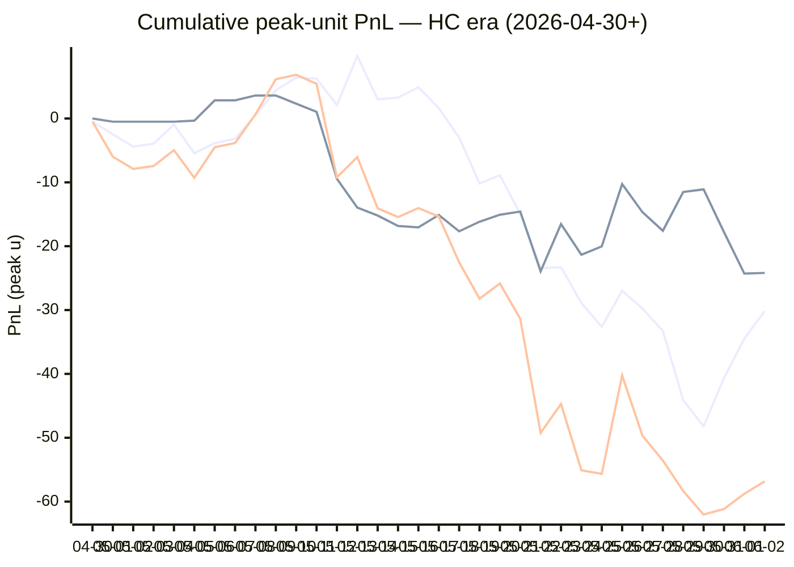

# Sharp Intel v6 — Daily Master Report

_Auto-generated **6/3/2026, 1:34:03 PM ET** by `scripts/dailyV6Report.js`. Do not edit by hand._

**Source of truth: this report mirrors the live Pick Performance dashboard.** Inclusion = `lockStage ≠ SHADOW ∧ ¬superseded ∧ health ∉ {MUTED, CANCELLED} ∧ peak.stars ≥ 2.5`. PnL is in **peak units** (the size shipped to users). HC margin / Δw / Δq are the **frozen** stamps written at last sync before the T-15 freeze. HC margin only existed from the v7.1 launch (**2026-04-30**); pre-launch picks have no HC value (no retro-fitting). Nothing is recomputed against today's whitelist.

v6 cutover: **2026-04-18** · whitelist source: live `sharpWalletProfiles` (227 profiles — drives §5 roster snapshot only) · quality cut: contribution ≥ 30 · HC = CONFIRMED tier ∧ sizeRatio ≥ 1.5.

---
## §1. Yesterday's picks

Slate: **2026-06-02** · 10 shipped sides.

| N | W-L-P | WR% | PnL (peak u) | PnL (flat 1u) |
|---|---|---|---|---|
| 10 | 4-6-0 | 40.0% | +1.95u | -1.88u |

| Sport | Market | Matchup | Pick | Stars · Units | HC | Δw | Δq | Σ | Odds | Result | PnL (peak u) |
|---|---|---|---|---|---|---|---|---|---|---|---|
| MLB | ML | Cleveland Guardians @ New York Yankees | New York Yankees | 2.5★ · 0.25u | +0 | -1 | -1 | -2 | -215 | L | -0.25u |
| MLB | ML | Detroit Tigers @ Tampa Bay Rays | Detroit Tigers | 5.0★ · 2.50u | +0 | +2 | +1 | +3 | +130 | **W** | +3.13u |
| MLB | ML | Miami Marlins @ Washington Nationals | Miami Marlins | 3.0★ · 0.50u | +0 | +1 | +0 | +1 | +100 | **W** | +0.49u |
| MLB | ML | Pittsburgh Pirates @ Houston Astros | Houston Astros | 4.0★ · 1.00u | +0 | +1 | +1 | +2 | -112 | L | -1.00u |
| MLB | ML | Texas Rangers @ St. Louis Cardinals | St. Louis Cardinals | 4.0★ · 1.00u | +0 | +1 | +0 | +1 | -106 | L | -1.00u |
| MLB | ML | Toronto Blue Jays @ Atlanta Braves | Toronto Blue Jays | 5.0★ · 2.50u | -1 | +0 | +2 | +2 | +102 | L | -2.50u |
| MLB | TOTAL | Cleveland Guardians @ New York Yankees | Under 7.5 | 4.0★ · 1.00u | +0 | +1 | -1 | +0 | -117 | L | -1.00u |
| MLB | TOTAL | New York Mets @ Seattle Mariners | Over 7.5 | 4.5★ · 3.00u | +0 | +1 | +1 | +2 | -110 | **W** | +2.73u |
| MLB | TOTAL | Athletics @ Chicago Cubs | Over 7.5 | 4.5★ · 3.00u | +0 | +1 | +1 | +2 | -110 | L | -3.00u |
| NHL | TOTAL | Golden Knights @ Hurricanes | Over 5.5 | 5.0★ · 5.00u | +2 | +2 | +2 | +4 | -110 | **W** | +4.35u |

---
## §2. 3-day / 7-day / all-time cohort rollups

Shipped picks only. PnL in **peak units** (size we actually bet) and flat 1u (cohort EV lens). All margins are the engine's frozen stamps (`v8_hcMargin`, `v8_walletConsensusDelta`, `v8_walletConsensusQualityMargin`).

**HC margin sub-tables** are scoped to picks dated ≥ 2026-04-30 (the v7.1 launch — when HC margin became a real engine signal). Pre-launch picks are excluded from HC analysis since the feature didn't exist for them. Δw / Δq sub-tables span the full v6-era sample (≥ 2026-04-18). Empty buckets are dropped.

### §2a. 3-day

Total: **28** shipped · 13-15-0 · WR 46.4% · PnL +5.21u (peak) / -2.94u (flat).

**By HC margin** _(picks dated ≥ 2026-04-30, N = 28)_

| Bucket | N | W-L-P | WR% | PnL (peak u) | PnL (flat 1u) |
|---|---|---|---|---|---|
| HC = +2 | 3 | 3-0-0 | 100.0% | +7.78u | +2.90u |
| HC = +1 | 6 | 4-2-0 | 66.7% | +10.29u | +1.37u |
| HC = 0 | 17 | 5-12-0 | 29.4% | -13.09u | -7.82u |
| HC ≤ −1 | 2 | 1-1-0 | 50.0% | +0.23u | +0.60u |

**By Δw (winner margin)**

| Bucket | N | W-L-P | WR% | PnL (peak u) | PnL (flat 1u) |
|---|---|---|---|---|---|
| ≥ +3 | 2 | 1-1-0 | 50.0% | +1.08u | -0.35u |
| +2 | 6 | 4-2-0 | 66.7% | +8.91u | +3.16u |
| +1 | 9 | 4-5-0 | 44.4% | -2.68u | -1.31u |
| 0 | 7 | 4-3-0 | 57.1% | +2.40u | -0.44u |
| −1 | 3 | 0-3-0 | 0.0% | -1.75u | -3.00u |
| ≤ −2 | 1 | 0-1-0 | 0.0% | -2.75u | -1.00u |

**By Δq (quality margin)**

| Bucket | N | W-L-P | WR% | PnL (peak u) | PnL (flat 1u) |
|---|---|---|---|---|---|
| ≥ +3 | 4 | 2-2-0 | 50.0% | +0.76u | -0.55u |
| +2 | 6 | 3-3-0 | 50.0% | +4.22u | -0.84u |
| +1 | 8 | 5-3-0 | 62.5% | +8.34u | +3.14u |
| 0 | 6 | 3-3-0 | 50.0% | -3.11u | -0.70u |
| −1 | 2 | 0-2-0 | 0.0% | -1.25u | -2.00u |
| ≤ −2 | 2 | 0-2-0 | 0.0% | -3.75u | -2.00u |

**By AGS tier** _(picks dated ≥ 2026-05-05, N = 28)_

| Bucket | N | W-L-P | WR% | PnL (peak u) | PnL (flat 1u) |
|---|---|---|---|---|---|
| NEUT   (0 .. +3) | 18 | 10-8-0 | 55.6% | +6.62u | +0.94u |
| WEAK   (−1 .. 0) | 10 | 3-7-0 | 30.0% | -1.41u | -3.88u |

### §2b. 7-day

Total: **96** shipped · 46-50-0 · WR 47.9% · PnL -16.58u (peak) / -9.43u (flat).

**By HC margin** _(picks dated ≥ 2026-04-30, N = 96)_

| Bucket | N | W-L-P | WR% | PnL (peak u) | PnL (flat 1u) |
|---|---|---|---|---|---|
| HC ≥ +3 | 1 | 0-1-0 | 0.0% | -1.00u | -1.00u |
| HC = +2 | 6 | 4-2-0 | 66.7% | +6.57u | +1.70u |
| HC = +1 | 28 | 15-13-0 | 53.6% | -8.73u | -0.91u |
| HC = 0 | 56 | 25-31-0 | 44.6% | -13.92u | -8.84u |
| HC ≤ −1 | 5 | 2-3-0 | 40.0% | +0.50u | -0.39u |

**By Δw (winner margin)**

| Bucket | N | W-L-P | WR% | PnL (peak u) | PnL (flat 1u) |
|---|---|---|---|---|---|
| ≥ +3 | 15 | 4-11-0 | 26.7% | -14.72u | -7.47u |
| +2 | 25 | 12-13-0 | 48.0% | -0.54u | -0.34u |
| +1 | 31 | 18-13-0 | 58.1% | -2.33u | +2.71u |
| 0 | 20 | 12-8-0 | 60.0% | +6.76u | +0.67u |
| −1 | 4 | 0-4-0 | 0.0% | -3.00u | -4.00u |
| ≤ −2 | 1 | 0-1-0 | 0.0% | -2.75u | -1.00u |

**By Δq (quality margin)**

| Bucket | N | W-L-P | WR% | PnL (peak u) | PnL (flat 1u) |
|---|---|---|---|---|---|
| ≥ +3 | 12 | 3-9-0 | 25.0% | -9.41u | -6.74u |
| +2 | 19 | 9-10-0 | 47.4% | -3.59u | -2.76u |
| +1 | 37 | 22-15-0 | 59.5% | +11.73u | +5.64u |
| 0 | 17 | 7-10-0 | 41.2% | -13.18u | -3.96u |
| −1 | 7 | 4-3-0 | 57.1% | +1.32u | +0.64u |
| ≤ −2 | 4 | 1-3-0 | 25.0% | -3.45u | -2.25u |

**By AGS tier** _(picks dated ≥ 2026-05-05, N = 96)_

| Bucket | N | W-L-P | WR% | PnL (peak u) | PnL (flat 1u) |
|---|---|---|---|---|---|
| NEUT   (0 .. +3) | 76 | 36-40-0 | 47.4% | -16.30u | -9.53u |
| WEAK   (−1 .. 0) | 20 | 10-10-0 | 50.0% | -0.28u | +0.09u |

### §2c. All-time

Total: **432** shipped · 213-216-3 · WR 49.7% · PnL -69.05u (peak) / -20.23u (flat).

**By HC margin** _(picks dated ≥ 2026-04-30, N = 321)_

| Bucket | N | W-L-P | WR% | PnL (peak u) | PnL (flat 1u) |
|---|---|---|---|---|---|
| HC ≥ +3 | 9 | 3-6-0 | 33.3% | -8.58u | -4.67u |
| HC = +2 | 24 | 11-13-0 | 45.8% | -16.14u | -1.93u |
| HC = +1 | 126 | 70-56-0 | 55.6% | -5.42u | +9.70u |
| HC = 0 | 151 | 75-74-2 | 50.3% | -24.19u | -10.98u |
| HC ≤ −1 | 10 | 3-7-0 | 30.0% | -4.12u | -3.55u |

**By Δw (winner margin)**

| Bucket | N | W-L-P | WR% | PnL (peak u) | PnL (flat 1u) |
|---|---|---|---|---|---|
| ≥ +3 | 83 | 39-44-0 | 47.0% | -32.62u | -2.85u |
| +2 | 109 | 51-58-0 | 46.8% | -29.83u | -8.08u |
| +1 | 145 | 82-62-1 | 56.9% | +7.38u | +9.36u |
| 0 | 73 | 35-36-2 | 49.3% | -5.89u | -7.04u |
| −1 | 14 | 2-12-0 | 14.3% | -8.83u | -10.46u |
| ≤ −2 | 2 | 0-2-0 | 0.0% | -3.25u | -2.00u |
| missing | 6 | 4-2-0 | 66.7% | +3.99u | +0.85u |

**By Δq (quality margin)**

| Bucket | N | W-L-P | WR% | PnL (peak u) | PnL (flat 1u) |
|---|---|---|---|---|---|
| ≥ +3 | 105 | 50-53-2 | 48.5% | -26.85u | -4.99u |
| +2 | 91 | 39-52-0 | 42.9% | -39.21u | -14.33u |
| +1 | 133 | 70-62-1 | 53.0% | +7.12u | +0.71u |
| 0 | 62 | 32-30-0 | 51.6% | -2.92u | -0.78u |
| −1 | 25 | 16-9-0 | 64.0% | +6.59u | +4.68u |
| ≤ −2 | 10 | 2-8-0 | 20.0% | -17.02u | -6.29u |
| missing | 6 | 4-2-0 | 66.7% | +3.24u | +0.77u |

**By AGS tier** _(picks dated ≥ 2026-05-05, N = 296)_

| Bucket | N | W-L-P | WR% | PnL (peak u) | PnL (flat 1u) |
|---|---|---|---|---|---|
| ELITE  (≥ +7) | 3 | 3-0-0 | 100.0% | +8.01u | +2.34u |
| LOCK   (+5 .. +7) | 9 | 5-4-0 | 55.6% | -2.93u | -0.47u |
| STRONG (+3 .. +5) | 22 | 13-9-0 | 59.1% | -6.66u | +2.77u |
| NEUT   (0 .. +3) | 212 | 105-107-0 | 49.5% | -46.64u | -16.81u |
| WEAK   (−1 .. 0) | 39 | 18-20-1 | 47.4% | -7.00u | -1.18u |
| FADE   (< −1) | 10 | 6-4-0 | 60.0% | +1.72u | +2.16u |
| missing | 1 | 1-0-0 | 100.0% | +1.63u | +0.96u |

---
## §3. Edge over time — is HC margin creating winners?

Daily cumulative peak-unit PnL since the HC margin launch (**2026-04-30**). The `HC ≥ +1` line is the golden-standard cohort. The `HC = 0` line is the no-HC-signal control. The `All shipped (HC era)` line is every shipped pick from the same date range — the apples-to-apples baseline. Watch the spread.

Daily cumulative table (peak units, HC era only):

| Date | HC ≥ +1 (cum) | HC = 0 (cum) | All shipped (cum) |
|---|---|---|---|
| 2026-04-30 | -0.48u | +0.00u | -0.48u |
| 2026-05-01 | -2.48u | -0.50u | -5.98u |
| 2026-05-02 | -4.41u | -0.50u | -7.91u |
| 2026-05-03 | -3.94u | -0.50u | -7.44u |
| 2026-05-04 | -0.95u | -0.50u | -4.95u |
| 2026-05-05 | -5.45u | -0.34u | -9.29u |
| 2026-05-06 | -3.86u | +2.84u | -4.52u |
| 2026-05-07 | -3.18u | +2.84u | -3.84u |
| 2026-05-08 | +0.54u | +3.60u | +0.64u |
| 2026-05-09 | +4.41u | +3.60u | +6.14u |
| 2026-05-10 | +6.41u | +2.32u | +6.86u |
| 2026-05-11 | +6.25u | +1.05u | +5.43u |
| 2026-05-12 | +2.11u | -9.45u | -9.21u |
| 2026-05-13 | +9.78u | -13.95u | -6.04u |
| 2026-05-14 | +3.00u | -15.20u | -14.07u |
| 2026-05-15 | +3.27u | -16.83u | -15.43u |
| 2026-05-16 | +4.90u | -17.05u | -14.02u |
| 2026-05-17 | +1.62u | -15.11u | -15.36u |
| 2026-05-18 | -2.98u | -17.67u | -22.52u |
| 2026-05-19 | -10.18u | -16.17u | -28.22u |
| 2026-05-20 | -8.90u | -15.07u | -25.84u |
| 2026-05-21 | -14.92u | -14.58u | -31.37u |
| 2026-05-22 | -23.44u | -23.93u | -49.24u |
| 2026-05-23 | -23.30u | -16.53u | -44.70u |
| 2026-05-24 | -28.89u | -21.34u | -55.10u |
| 2026-05-25 | -32.63u | -20.03u | -55.65u |
| 2026-05-26 | -26.98u | -10.27u | -40.24u |
| 2026-05-27 | -29.77u | -14.68u | -49.69u |
| 2026-05-28 | -33.27u | -17.58u | -53.57u |
| 2026-05-29 | -44.12u | -11.51u | -58.35u |
| 2026-05-30 | -48.21u | -11.10u | -62.03u |
| 2026-05-31 | -40.65u | -17.79u | -61.16u |
| 2026-06-01 | -34.49u | -24.29u | -58.77u |
| 2026-06-02 | -30.14u | -24.19u | -56.82u |

---
## §4. Wallet roster growth & profitability

"Tracked in sport X" = a wallet has placed **≥ 2 bets** in X within the v6-era sample. "Profitable" = cumulative flat PnL > 0. Source: `v8Scoring.walletDetails` on every graded v6-era game (every side, not just the shipped set).

### §4a. Per-sport wallet snapshot

| Sport | Total wallets seen | Tracked (≥2) | Profitable | % prof | WR ≥ 50% | WR ≥ 60% | WR ≥ 70% |
|---|---|---|---|---|---|---|---|
| MLB | 65 | 45 | 16 | 36% | 20 | 7 | 3 |
| NBA | 133 | 101 | 43 | 43% | 59 | 28 | 13 |
| NHL | 58 | 41 | 13 | 32% | 23 | 12 | 7 |
| **ALL (any sport)** | **165** | **130** | **56** | **43%** | **73** | **31** | **12** |

### §4b. Daily roster growth (cumulative through each date)

Format: `tracked (profitable)`. For each date D, recompute the roster using every bet up to and including D.

| Date | ALL | MLB | NBA | NHL |
|---|---|---|---|---|
| 2026-04-18 | 5 (2) | 2 (2) | 3 (0) | 0 (0) |
| 2026-04-19 | 19 (8) | 5 (3) | 9 (3) | 3 (1) |
| 2026-04-20 | 29 (12) | 7 (6) | 23 (8) | 5 (2) |
| 2026-04-21 | 44 (21) | 10 (6) | 31 (10) | 7 (5) |
| 2026-04-22 | 52 (28) | 12 (6) | 39 (15) | 11 (10) |
| 2026-04-23 | 56 (29) | 13 (6) | 46 (21) | 13 (10) |
| 2026-04-24 | 61 (30) | 14 (6) | 51 (23) | 14 (9) |
| 2026-04-25 | 65 (29) | 16 (8) | 54 (22) | 16 (9) |
| 2026-04-26 | 67 (31) | 18 (5) | 56 (25) | 17 (9) |
| 2026-04-27 | 72 (32) | 20 (7) | 60 (24) | 17 (9) |
| 2026-04-28 | 76 (33) | 21 (7) | 63 (26) | 23 (10) |
| 2026-04-29 | 77 (33) | 21 (7) | 64 (25) | 23 (10) |
| 2026-04-30 | 81 (34) | 21 (7) | 70 (27) | 23 (10) |
| 2026-05-01 | 85 (38) | 22 (5) | 74 (30) | 26 (13) |
| 2026-05-02 | 86 (37) | 23 (7) | 75 (32) | 26 (12) |
| 2026-05-03 | 86 (38) | 24 (8) | 75 (33) | 26 (12) |
| 2026-05-04 | 90 (38) | 24 (9) | 76 (32) | 26 (12) |
| 2026-05-05 | 91 (40) | 24 (9) | 79 (33) | 26 (12) |
| 2026-05-06 | 92 (40) | 24 (9) | 80 (33) | 26 (12) |
| 2026-05-07 | 92 (41) | 24 (9) | 80 (33) | 26 (12) |
| 2026-05-08 | 92 (40) | 24 (8) | 80 (32) | 26 (11) |
| 2026-05-09 | 94 (42) | 24 (8) | 82 (35) | 26 (11) |
| 2026-05-10 | 94 (42) | 24 (8) | 82 (35) | 26 (11) |
| 2026-05-11 | 96 (42) | 24 (8) | 84 (36) | 26 (11) |
| 2026-05-12 | 100 (41) | 27 (9) | 86 (37) | 26 (11) |
| 2026-05-13 | 102 (45) | 29 (11) | 88 (37) | 26 (11) |
| 2026-05-14 | 102 (41) | 29 (11) | 88 (37) | 28 (12) |
| 2026-05-15 | 103 (41) | 30 (10) | 88 (39) | 28 (12) |
| 2026-05-16 | 105 (43) | 31 (12) | 88 (39) | 30 (14) |
| 2026-05-17 | 105 (46) | 32 (11) | 88 (40) | 30 (14) |
| 2026-05-18 | 105 (46) | 32 (10) | 88 (38) | 31 (15) |
| 2026-05-19 | 105 (46) | 32 (12) | 88 (38) | 31 (15) |
| 2026-05-20 | 106 (48) | 33 (12) | 88 (38) | 31 (16) |
| 2026-05-21 | 106 (45) | 34 (12) | 88 (37) | 31 (14) |
| 2026-05-22 | 106 (44) | 34 (10) | 88 (39) | 33 (16) |
| 2026-05-23 | 111 (49) | 36 (10) | 90 (40) | 36 (19) |
| 2026-05-24 | 117 (52) | 37 (12) | 94 (39) | 37 (16) |
| 2026-05-25 | 120 (53) | 38 (13) | 95 (40) | 38 (16) |
| 2026-05-26 | 122 (55) | 39 (14) | 97 (42) | 38 (16) |
| 2026-05-27 | 123 (51) | 40 (12) | 97 (42) | 40 (14) |
| 2026-05-28 | 124 (51) | 40 (12) | 99 (42) | 40 (14) |
| 2026-05-29 | 125 (50) | 41 (12) | 99 (42) | 41 (12) |
| 2026-05-30 | 126 (49) | 41 (12) | 101 (43) | 41 (12) |
| 2026-05-31 | 126 (48) | 41 (11) | 101 (43) | 41 (12) |
| 2026-06-01 | 129 (52) | 44 (14) | 101 (43) | 41 (12) |
| 2026-06-02 | 130 (56) | 45 (16) | 101 (43) | 41 (13) |

### §4c. Top 10 profitable wallets by sport

#### MLB

| # | Wallet | N | W | L | WR% | Flat PnL (u) | Flat ROI | $ PnL |
|---|---|---|---|---|---|---|---|---|
| 1 | c289a0 | 3 | 3 | 0 | 100.0% | +2.87 | +95.6% | $1.5K |
| 2 | c9bba3 | 3 | 3 | 0 | 100.0% | +2.42 | +80.7% | $66.5K |
| 3 | 913987 | 9 | 7 | 2 | 77.8% | +4.89 | +54.4% | $238.6K |
| 4 | 491f30 | 7 | 4 | 3 | 57.1% | +2.70 | +38.6% | $9.1K |
| 5 | eeabaf | 36 | 21 | 15 | 58.3% | +11.74 | +32.6% | $897.1K |
| 6 | c668b3 | 15 | 10 | 5 | 66.7% | +4.16 | +27.7% | $649 |
| 7 | 880232 | 3 | 2 | 1 | 66.7% | +0.82 | +27.3% | $73.3K |
| 8 | 981187 | 8 | 5 | 3 | 62.5% | +1.65 | +20.7% | $13.5K |
| 9 | e05213 | 3 | 2 | 1 | 66.7% | +0.56 | +18.6% | -$7.5K |
| 10 | a10ff5 | 32 | 18 | 14 | 56.3% | +3.72 | +11.6% | $6.4K |

#### NBA

| # | Wallet | N | W | L | WR% | Flat PnL (u) | Flat ROI | $ PnL |
|---|---|---|---|---|---|---|---|---|
| 1 | 799fad | 2 | 2 | 0 | 100.0% | +5.66 | +283.0% | $241.7K |
| 2 | 4a9953 | 2 | 2 | 0 | 100.0% | +2.16 | +108.2% | $3.7K |
| 3 | a0d6d2 | 2 | 2 | 0 | 100.0% | +1.91 | +95.3% | $4.1K |
| 4 | 12ad50 | 3 | 3 | 0 | 100.0% | +2.74 | +91.3% | $45.5K |
| 5 | b51a56 | 6 | 5 | 1 | 83.3% | +5.44 | +90.7% | $74.4K |
| 6 | 11b032 | 7 | 6 | 1 | 85.7% | +5.40 | +77.1% | $249.9K |
| 7 | 769c38 | 13 | 12 | 1 | 92.3% | +9.01 | +69.3% | $100.0K |
| 8 | 2e8da5 | 11 | 8 | 3 | 72.7% | +7.06 | +64.2% | $84.1K |
| 9 | 7f00bc | 17 | 11 | 6 | 64.7% | +8.63 | +50.7% | $11.7K |
| 10 | f9e3d0 | 4 | 3 | 1 | 75.0% | +1.90 | +47.4% | $4.3K |

#### NHL

| # | Wallet | N | W | L | WR% | Flat PnL (u) | Flat ROI | $ PnL |
|---|---|---|---|---|---|---|---|---|
| 1 | 8366f5 | 2 | 2 | 0 | 100.0% | +2.30 | +114.9% | $107.6K |
| 2 | 799fad | 2 | 2 | 0 | 100.0% | +1.88 | +94.1% | $46.9K |
| 3 | fec67e | 4 | 3 | 1 | 75.0% | +2.82 | +70.5% | $12.5K |
| 4 | 30935c | 4 | 3 | 1 | 75.0% | +2.11 | +52.7% | $953 |
| 5 | 0f9d74 | 4 | 3 | 1 | 75.0% | +1.84 | +45.9% | $7.3K |
| 6 | 981187 | 8 | 6 | 2 | 75.0% | +3.52 | +44.0% | -$25.2K |
| 7 | fcc12b | 11 | 8 | 3 | 72.7% | +4.45 | +40.5% | -$27.5K |
| 8 | e70853 | 9 | 6 | 3 | 66.7% | +2.66 | +29.5% | -$11.1K |
| 9 | bc3532 | 17 | 10 | 7 | 58.8% | +4.50 | +26.5% | $36.7K |
| 10 | dfa240 | 26 | 17 | 9 | 65.4% | +6.49 | +24.9% | $19.9K |

---
## §5. Proven-wallet roster growth & HC tracking

"Proven wallet" = whitelist tier `CONFIRMED` or `FLAT` in the same sense the live engine uses (`exportWalletProfiles.js` → `sharpWalletProfiles.bySport`). Sports inherit independent rosters: a wallet can be CONFIRMED in NBA and absent from NHL. `walletBets` come from `v8Scoring.walletDetails` on every graded v6-era pick (Source A); `positionRows` come from `sharp_action_positions` (Source B).

### §5a. Current proven-winner roster (snapshot)

Roster as of **2026-06-02** — wallets with ≥2 bets in the sport.

| Sport | Wallets seen | Eligible (≥2) | CONFIRMED | FLAT | Proven (C+F) | WR50 only | Conv % |
|---|---|---|---|---|---|---|---|
| MLB | 116 | 45 | 9 | 7 | **16** | 4 | 13.8% |
| NBA | 192 | 101 | 28 | 15 | **43** | 21 | 22.4% |
| NHL | 96 | 41 | 9 | 4 | **13** | 10 | 13.5% |
| **ALL** | **—** | **—** | **—** | **—** | **72** | **—** | **—** |

### §5b. Live whitelist drift check

Live `sharpWalletProfiles` is what the engine reads at lock time. Drift between script reconstruction (above) and live should be ≤ 1 day of position data — otherwise `exportWalletProfiles.js` is stale.

| Sport | CONFIRMED (live · script) | FLAT (live · script) | WR50 (live · script) | Drift |
|---|---|---|---|---|
| MLB | 29 · 9 | 8 · 7 | 7 · 4 | +21 live |
| NBA | 54 · 28 | 22 · 15 | 20 · 21 | +33 live |
| NHL | 20 · 9 | 6 · 4 | 13 · 10 | +13 live |

### §5c. Roster growth — 3d / 7d / 30d / all-time deltas

Each cell is **net growth** in proven (CONFIRMED + FLAT) wallets in that window, with the absolute count at the start (`+Δ from N`). Negative = wallets demoted. Window endpoint = 2026-06-02.

| Sport | 3-day | 7-day | 30-day | All-time (since cutover) |
|---|---|---|---|---|
| MLB | +4 from 12 | +2 from 14 | +8 from 8 | +16 from 0 |
| NBA | +0 from 43 | +1 from 42 | +10 from 33 | +43 from 0 |
| NHL | +1 from 12 | -3 from 16 | +1 from 12 | +13 from 0 |

A flat 7-day delta on a sport with healthy slate density = either the bubble pipeline has stalled (no wallets approaching the bar) or our cohort has saturated. Check §13d for the funnel diagnostic.

### §5d. Pipeline funnel — where each sport leaks

Wallets surviving each gate, in order. The biggest %-drop tells you the bottleneck. Gates:

1. **Seen** — placed ≥ 1 bet in the sport (any source)
2. **Eligible** — ≥ 2 graded picks in Source A (required for FLAT/CONFIRMED)
3. **Flat-OK** — eligible AND flat ROI > 0 (becomes FLAT or better)
4. **$-OK** — Flat-OK AND ≥2 positions with dollar ROI > 0 (CONFIRMED)
5. **Promoted** — final whitelisted = CONFIRMED + FLAT

| Sport | 1·Seen | 2·Eligible (% of Seen) | 3·Flat-OK (% of Elig) | 4·$-OK (% of Flat) | 5·Promoted | Bottleneck |
|---|---|---|---|---|---|---|
| MLB | 116 | 45 (39%) | 16 (36%) | 9 (56%) | **16** | edge (Eligible→Flat-OK) 64% |
| NBA | 192 | 101 (53%) | 43 (43%) | 28 (65%) | **43** | edge (Eligible→Flat-OK) 57% |
| NHL | 96 | 41 (43%) | 13 (32%) | 9 (69%) | **13** | edge (Eligible→Flat-OK) 68% |

### §5e. HC backing density (the fuel for v7.3 HC margin)

Every v7.x promotion is gated on `HC_m ≥ +1`, which requires at least one CONFIRMED wallet sized at `≥ 1.5×` average on the for-side. This table shows the share of shipped picks that *had any HC backing*, by sport, in each window. If HC density falls toward zero in a sport, the v7.3 floor cohorts (Σ=1, Σ=2 locks; HC rescues) will simply stop firing there.

| Sport | Window | Picks (with HC stamp) | Any HC for-side | HC_m ≥ +1 | HC_m ≥ +2 |
|---|---|---|---|---|---|
| MLB | 3-day | 27 | 9 (33.3%) | 8 (29.6%) | 2 (7.4%) |
| MLB | 7-day | 87 | 36 (41.4%) | 31 (35.6%) | 4 (4.6%) |
| MLB | All-time | 267 | 114 (42.7%) | 107 (40.1%) | 12 (4.5%) |
| NBA | 3-day | 0 | 0 (—) | 0 (—) | 0 (—) |
| NBA | 7-day | 3 | 3 (100.0%) | 2 (66.7%) | 2 (66.7%) |
| NBA | All-time | 116 | 75 (64.7%) | 63 (54.3%) | 29 (25.0%) |
| NHL | 3-day | 1 | 1 (100.0%) | 1 (100.0%) | 1 (100.0%) |
| NHL | 7-day | 6 | 2 (33.3%) | 2 (33.3%) | 1 (16.7%) |
| NHL | All-time | 43 | 20 (46.5%) | 19 (44.2%) | 5 (11.6%) |

Pooled across sports:

| Window | Picks (with HC stamp) | Any HC for-side | HC_m ≥ +1 | HC_m ≥ +2 |
|---|---|---|---|---|
| 3-day | 28 | 10 (35.7%) | 9 (32.1%) | 3 (10.7%) |
| 7-day | 96 | 41 (42.7%) | 35 (36.5%) | 7 (7.3%) |
| All-time | 426 | 209 (49.1%) | 189 (44.4%) | 46 (10.8%) |

### §5f. Bubble wallets — next-up graduations

Wallets currently NOT promoted but close. Two flavors:

- **One-bet-away** — won the only bet, needs one more positive bet to clear ≥2.
- **Just-under** — has ≥2 bets but flat ROI is between −10% and 0% (one win flips them).

#### MLB

**One-bet-away** (6)

| wallet | picksN | flat PnL | pos N | pos $ROI |
|---|---|---|---|---|
| `...be17` | 1 | +6.95 | 23 | -60% |
| `...e3d0` | 1 | +0.91 | 20 | 24% |
| `...be00` | 1 | +0.87 | 14 | 3% |
| `...a240` | 1 | +0.87 | 7 | 83% |
| `...9373` | 1 | +0.87 | 0 | — |
| `...9b3c` | 1 | +0.77 | 8 | 52% |

**Just-under** (6)

| wallet | picksN | WR | flat ROI | pos N | pos $ROI |
|---|---|---|---|---|---|
| `...2768` | 26 | 46% | -0.3% | 45 | 17% |
| `...1eae` | 61 | 49% | -0.9% | 120 | 8% |
| `...35e3` | 23 | 52% | -2.4% | 104 | -19% |
| `...9d74` | 29 | 48% | -5.9% | 142 | -13% |
| `...c12b` | 40 | 48% | -6.5% | 67 | -19% |
| `...2f63` | 84 | 48% | -6.8% | 798 | -9% |

#### NBA

**One-bet-away** (6)

| wallet | picksN | flat PnL | pos N | pos $ROI |
|---|---|---|---|---|
| `...bf5d` | 1 | +3.15 | 3 | 42% |
| `...ed41` | 1 | +3.15 | 3 | 3% |
| `...6b87` | 1 | +2.05 | 8 | -27% |
| `...c991` | 1 | +1.14 | 8 | 77% |
| `...9d74` | 1 | +0.93 | 27 | -35% |
| `...c556` | 1 | +0.93 | 3 | 42% |

**Just-under** (6)

| wallet | picksN | WR | flat ROI | pos N | pos $ROI |
|---|---|---|---|---|---|
| `...b33b` | 14 | 36% | -0.5% | 45 | 19% |
| `...d814` | 8 | 50% | -0.5% | 48 | 8% |
| `...d96a` | 19 | 37% | -1.5% | 72 | -27% |
| `...65dd` | 6 | 50% | -2.4% | 17 | 27% |
| `...853d` | 40 | 53% | -2.7% | 90 | -2% |
| `...f5b0` | 20 | 50% | -3.7% | 57 | -28% |

#### NHL

**One-bet-away** (6)

| wallet | picksN | flat PnL | pos N | pos $ROI |
|---|---|---|---|---|
| `...2e78` | 1 | +1.46 | 0 | — |
| `...017f` | 1 | +1.45 | 5 | 125% |
| `...32f2` | 1 | +1.40 | 0 | — |
| `...e0fd` | 1 | +1.20 | 3 | 124% |
| `...266e` | 1 | +1.05 | 0 | — |
| `...2194` | 1 | +1.05 | 0 | — |

**Just-under** (6)

| wallet | picksN | WR | flat ROI | pos N | pos $ROI |
|---|---|---|---|---|---|
| `...33ee` | 4 | 50% | -0.3% | 8 | -23% |
| `...afd2` | 6 | 50% | -1.9% | 18 | 1% |
| `...192c` | 7 | 43% | -2.9% | 21 | -15% |
| `...35e3` | 7 | 57% | -5.5% | 26 | 31% |
| `...618e` | 2 | 50% | -6.1% | 28 | 24% |
| `...9ef0` | 7 | 43% | -8.6% | 23 | 0% |

### §5g. v2 wallet-promotion pipeline (Source-A / Source-B mix)

Live snapshot of the v2 promotion gate (shipped 2026-05-10, re-eval **2026-05-24**). Each FLAT-or-better wallet × sport pair is attributed to one of three paths via `sharpWalletProfiles[wallet].bySport[sport].whitelistSource`:

- **A** — flat-positive on featured picks (Source A) only — the v1 gate
- **A+B** — flat-positive in both sources (most reliable signal)
- **B** — flat-positive on-chain only (NEW in v2 — the trial lift)

Re-classified every 2h via `grade-sharp-actions` cron. Roll-back: set `B_ONLY_MIN_BETS = Infinity` in `scripts/exportWalletProfiles.js`.

#### Source mix per sport (live Firestore)

| Sport | A | A+B | B (new) | FLAT-or-better total | % from B-only |
|---|---|---|---|---|---|
| MLB | 3 | 13 | **21** | 37 | 56.8% |
| NBA | 15 | 28 | **33** | 76 | 43.4% |
| NHL | 4 | 9 | **13** | 26 | 50.0% |
| **ALL** | **22** | **50** | **67** | **139** | **48.2%** |

#### Pipeline freshness

- `sharp_action_positions` GRADED rows: **10761**
- `sharp_action_positions` PENDING rows: **198** (queued for next Grade Sharp Actions run)
- Latest `sharpWalletProfiles` rebuild: 6/3/2026, 9:14:01 AM ET — **260 min · STALE** — check grade-sharp-actions workflow

**Alarms**: pending > 200 OR rebuild lag > 4h → cron is lagging or failing — check `gh run list --workflow="Grade Sharp Actions"`.

#### B-only roster — wallets currently promoted via Source B path only

Wallets here would have been EXCLUDED under v1 (Source-A-only). Top by Source-B bet count per sport. The 2-week re-eval (2026-05-24) will compare these wallets' realized lift against A-only and A+B cohorts.

**MLB** — 21 wallets promoted via B

| wallet | tier | B_n | B_flat ROI | B_$ ROI |
|---|---|---|---|---|
| `...9a27` | CONFIRMED | 454 | +9.9% | +3.5% |
| `...135d` | CONFIRMED | 326 | +1.9% | +6.9% |
| `...1eae` | CONFIRMED | 123 | +11.4% | +8.4% |
| `...69c2` | CONFIRMED | 58 | +19.7% | +2.3% |
| `...2768` | CONFIRMED | 45 | +12.9% | +17.4% |
| `...c684` | CONFIRMED | 22 | +20.9% | +0.4% |
| `...ad50` | CONFIRMED | 19 | +31.6% | +20.6% |
| `...f804` | CONFIRMED | 18 | +56.4% | +52.6% |
| `...1fc6` | CONFIRMED | 17 | +15.5% | +19.7% |
| `...600d` | CONFIRMED | 9 | +10.8% | +20.3% |
| … | 11 more | | | |

**NBA** — 33 wallets promoted via B

| wallet | tier | B_n | B_flat ROI | B_$ ROI |
|---|---|---|---|---|
| `...aeea` | FLAT | 150 | +0.5% | -2.8% |
| `...135d` | FLAT | 102 | +5.1% | -11.9% |
| `...3782` | CONFIRMED | 64 | +2% | +1.1% |
| `...935c` | FLAT | 50 | +17.3% | -21.4% |
| `...b33b` | CONFIRMED | 45 | +12.6% | +18.8% |
| `...b6ef` | CONFIRMED | 41 | +8.9% | +7.2% |
| `...d227` | CONFIRMED | 38 | +1.6% | +18.6% |
| `...0563` | CONFIRMED | 37 | +4.9% | +41.7% |
| `...68b3` | CONFIRMED | 36 | +11% | +9.3% |
| `...be00` | FLAT | 33 | +0.9% | -1.8% |
| … | 23 more | | | |

**NHL** — 13 wallets promoted via B

| wallet | tier | B_n | B_flat ROI | B_$ ROI |
|---|---|---|---|---|
| `...1697` | CONFIRMED | 46 | +4.1% | +8.4% |
| `...3782` | CONFIRMED | 40 | +1.2% | +3.4% |
| `...618e` | CONFIRMED | 28 | +6.2% | +23.8% |
| `...35e3` | CONFIRMED | 26 | +10.6% | +31.5% |
| `...b33b` | CONFIRMED | 24 | +18.4% | +31.1% |
| `...5eee` | CONFIRMED | 23 | +30.5% | +19.3% |
| `...192c` | FLAT | 21 | +14% | -15.2% |
| `...0c2e` | CONFIRMED | 12 | +43.4% | +21.1% |
| `...2ca8` | CONFIRMED | 8 | +16.2% | +4% |
| `...a9cc` | CONFIRMED | 7 | +49.5% | +46.9% |
| … | 3 more | | | |

### §5 — How to read

- **Roster growth flat in 7-day** + **funnel bottleneck = `data`** → re-run `exportWalletProfiles.js`. The flat-positive wallets are stuck at FLAT because Source-B coverage hasn't caught up. CONFIRMED gate is data-bound, not skill-bound.
- **Roster growth flat in 7-day** + **funnel bottleneck = `sample`** → wallets aren't reaching `≥2` reps fast enough. This is a slate-density problem; consider a soft `MIN_BETS = 1` shadow lane to surface bubble wallets earlier.
- **Roster shrank** (negative delta) → a previously CONFIRMED wallet just dropped flat-positive (lost a recent bet). Variance, not failure — but worth noting if a sport loses ≥3 in a week.
- **HC density on a sport drops below ~30%** → v7.3 promotions there will starve. Either the proven roster needs more CONFIRMED-tier wallets sizing aggressively, or the HC_RATIO (1.5) needs a sport-specific tune.
- **§5g B-only count drops sharply** → wallets are demoting off the B path (losing on-chain). Cross-check `WALLET_PROFILES_SUMMARY.md` churn section for the specific demotions.
- **§5g pipeline freshness lag > 4h** → grade-sharp-actions cron is failing. Check `gh run list --workflow="Grade Sharp Actions"` and re-trigger if needed.

---
## §6. Daily proven-wallet performance

Who on the proven roster is actually printing — yesterday's bets, the rolling leaderboard (`$ PnL`-ranked), current streaks, and per-sport volume. **Proven** = `CONFIRMED` ∪ `FLAT` per sport (the same gate that drives Δ_winner). A wallet only counts in a sport where it's on that sport's proven list.

### §6a. Yesterday's proven-wallet bets

Slate: **2026-06-02** · 29 bets · 13 distinct proven wallets · WR 66% · $ vol $643.4K · $ PnL $205.4K.

| Wallet | Sport | Market | Game | $ size | Result | $ PnL |
|---|---|---|---|---|---|---|
| `...3987` (CONFIRMED) | MLB | ML | Detroit Tigers @ Tampa Bay Rays | $100.0K | **W** | $125.0K |
| `...c12b` (CONFIRMED) | NHL | ML | Golden Knights @ Hurricanes | $30.8K | **W** | $40.0K |
| `...23c4` (FLAT) | MLB | TOTAL | Miami Marlins @ Washington Nationals | $43.0K | **W** | $39.1K |
| `...8f33` (CONFIRMED) | MLB | ML | Toronto Blue Jays @ Atlanta Braves | $31.7K | **W** | $32.4K |
| `...3987` (CONFIRMED) | MLB | ML | Cleveland Guardians @ New York Yankees | $70.0K | **W** | $32.0K |
| `...2125` (CONFIRMED) | NHL | ML | Golden Knights @ Hurricanes | $20.0K | **W** | $26.0K |
| `...3532` (FLAT) | NHL | ML | Golden Knights @ Hurricanes | $20.0K | **W** | $26.0K |
| `...8f33` (CONFIRMED) | MLB | SPREAD | San Francisco Giants @ Milwaukee Brewers | $26.8K | **W** | $24.2K |
| `...5213` (CONFIRMED) | MLB | ML | Chicago White Sox @ Minnesota Twins | $20.9K | **W** | $23.0K |
| `...3987` (CONFIRMED) | MLB | TOTAL | New York Mets @ Seattle Mariners | $13.6K | **W** | $12.4K |
| `...64aa` (CONFIRMED) | MLB | ML | Detroit Tigers @ Tampa Bay Rays | $7.3K | **W** | $9.1K |
| `...2125` (CONFIRMED) | NHL | TOTAL | Golden Knights @ Hurricanes | $10.4K | **W** | $9.0K |
| `...23c4` (FLAT) | MLB | ML | Kansas City Royals @ Cincinnati Reds | $10.6K | **W** | $8.7K |
| `...64aa` (CONFIRMED) | MLB | ML | Miami Marlins @ Washington Nationals | $7.2K | **W** | $7.1K |
| `...9d74` (CONFIRMED) | NHL | ML | Golden Knights @ Hurricanes | $4.2K | **W** | $5.5K |
| `...a240` (CONFIRMED) | NHL | TOTAL | Golden Knights @ Hurricanes | $3.7K | **W** | $3.2K |
| `...a240` (CONFIRMED) | NHL | ML | Golden Knights @ Hurricanes | $1.8K | **W** | $2.4K |
| `...5213` (CONFIRMED) | MLB | ML | Cleveland Guardians @ New York Yankees | $1.1K | **W** | $489 |
| `...df91` (FLAT) | NHL | ML | Golden Knights @ Hurricanes | $156 | **W** | $203 |
| `...64aa` (CONFIRMED) | MLB | ML | Colorado Rockies @ Los Angeles Angels | $1.4K | L | -$1.4K |
| `...23c4` (FLAT) | MLB | TOTAL | Cleveland Guardians @ New York Yankees | $1.9K | L | -$1.9K |
| `...64aa` (CONFIRMED) | MLB | ML | Kansas City Royals @ Cincinnati Reds | $8.8K | L | -$8.8K |
| `...64aa` (CONFIRMED) | MLB | ML | Pittsburgh Pirates @ Houston Astros | $8.8K | L | -$8.8K |
| `...64aa` (CONFIRMED) | MLB | ML | Texas Rangers @ St. Louis Cardinals | $9.6K | L | -$9.6K |
| `...3987` (CONFIRMED) | MLB | TOTAL | Athletics @ Chicago Cubs | $12.8K | L | -$12.8K |
| `...abaf` (CONFIRMED) | MLB | ML | Toronto Blue Jays @ Atlanta Braves | $27.5K | L | -$27.5K |
| `...5213` (CONFIRMED) | MLB | TOTAL | Colorado Rockies @ Los Angeles Angels | $31.0K | L | -$31.0K |
| `...0232` (CONFIRMED) | MLB | TOTAL | Miami Marlins @ Washington Nationals | $56.8K | L | -$56.8K |
| `...64aa` (CONFIRMED) | MLB | ML | Cleveland Guardians @ New York Yankees | $61.6K | L | -$61.6K |

### §6b. Proven-wallet leaderboard

Top 15 proven `(wallet × sport)` pairs per sport per horizon, ranked by **$ PnL** (the dollar-ROI lens). The 3-day board is the "who's on form right now" lens; the 7-day filters single-day variance; all-time is the proven-roster reference.

#### §6b-1. 3-day

**MLB** — 10 active proven wallets

| # | Wallet | Tier | Bets | WR% | Bets/day | Flat PnL (u) | Flat ROI | $ vol | $ PnL | $ ROI | Streak |
|---|---|---|---|---|---|---|---|---|---|---|---|
| 1 | `...3987` | CONFIRMED | 9 | 78% | 4.5 | +4.89 | +54% | $447.1K | $238.6K | +53% | 1L |
| 2 | `...abaf` | CONFIRMED | 8 | 50% | 2.7 | +0.54 | +7% | $227.4K | $66.6K | +29% | 1L |
| 3 | `...8f33` | CONFIRMED | 2 | 100% | 2.0 | +1.92 | +96% | $58.5K | $56.5K | +97% | 2W |
| 4 | `...fc82` | FLAT | 2 | 100% | 1.0 | +1.62 | +81% | $21.8K | $17.9K | +82% | 2W |
| 5 | `...1f30` | CONFIRMED | 7 | 57% | 7.0 | +2.70 | +39% | $49.2K | $9.1K | +19% | 3L |
| 6 | `...d6d2` | FLAT | 1 | 100% | 1.0 | +0.69 | +69% | $809 | $562 | +69% | 1W |
| 7 | `...5213` | CONFIRMED | 3 | 67% | 3.0 | +0.56 | +19% | $52.9K | -$7.5K | -14% | 1W |
| 8 | `...0232` | CONFIRMED | 1 | 0% | 1.0 | -1.00 | -100% | $56.8K | -$56.8K | -100% | 1L |
| 9 | `...64aa` | CONFIRMED | 18 | 44% | 6.0 | -2.45 | -14% | $309.3K | -$57.2K | -18% | 2L |
| 10 | `...23c4` | FLAT | 5 | 40% | 1.7 | -1.27 | -25% | $183.4K | -$82.0K | -45% | 2W |

**NHL** — 6 active proven wallets

| # | Wallet | Tier | Bets | WR% | Bets/day | Flat PnL (u) | Flat ROI | $ vol | $ PnL | $ ROI | Streak |
|---|---|---|---|---|---|---|---|---|---|---|---|
| 1 | `...c12b` | CONFIRMED | 1 | 100% | 1.0 | +1.30 | +130% | $30.8K | $40.0K | +130% | 1W |
| 2 | `...2125` | CONFIRMED | 2 | 100% | 2.0 | +2.17 | +108% | $30.4K | $35.0K | +115% | 2W |
| 3 | `...3532` | FLAT | 1 | 100% | 1.0 | +1.30 | +130% | $20.0K | $26.0K | +130% | 1W |
| 4 | `...a240` | CONFIRMED | 2 | 100% | 2.0 | +2.17 | +108% | $5.6K | $5.6K | +101% | 2W |
| 5 | `...9d74` | CONFIRMED | 1 | 100% | 1.0 | +1.30 | +130% | $4.2K | $5.5K | +130% | 1W |
| 6 | `...df91` | FLAT | 1 | 100% | 1.0 | +1.30 | +130% | $156 | $203 | +130% | 1W |

#### §6b-2. 7-day

**MLB** — 13 active proven wallets

| # | Wallet | Tier | Bets | WR% | Bets/day | Flat PnL (u) | Flat ROI | $ vol | $ PnL | $ ROI | Streak |
|---|---|---|---|---|---|---|---|---|---|---|---|
| 1 | `...3987` | CONFIRMED | 9 | 78% | 4.5 | +4.89 | +54% | $447.1K | $238.6K | +53% | 1L |
| 2 | `...64aa` | CONFIRMED | 35 | 63% | 5.0 | +6.40 | +18% | $685.0K | $137.4K | +20% | 2L |
| 3 | `...abaf` | CONFIRMED | 21 | 52% | 3.0 | +0.85 | +4% | $418.6K | $82.1K | +20% | 1L |
| 4 | `...8f33` | CONFIRMED | 8 | 63% | 2.0 | +1.38 | +17% | $100.7K | $52.5K | +52% | 2W |
| 5 | `...fc82` | FLAT | 7 | 57% | 1.2 | +0.80 | +11% | $103.4K | $26.5K | +26% | 2W |
| 6 | `...23c4` | FLAT | 15 | 60% | 2.1 | +2.29 | +15% | $386.6K | $20.2K | +5% | 2W |
| 7 | `...bba3` | CONFIRMED | 1 | 100% | 1.0 | +0.75 | +75% | $22.0K | $16.4K | +75% | 1W |
| 8 | `...1f30` | CONFIRMED | 7 | 57% | 7.0 | +2.70 | +39% | $49.2K | $9.1K | +19% | 3L |
| 9 | `...d6d2` | FLAT | 6 | 67% | 1.2 | +1.36 | +23% | $10.3K | $1.9K | +18% | 2W |
| 10 | `...68b3` | FLAT | 5 | 60% | 1.7 | +0.67 | +13% | $3.0K | $251 | +8% | 1W |
| 11 | `...5213` | CONFIRMED | 3 | 67% | 3.0 | +0.56 | +19% | $52.9K | -$7.5K | -14% | 1W |
| 12 | `...0ff5` | FLAT | 9 | 44% | 3.0 | -1.80 | -20% | $74.0K | -$22.1K | -30% | 1W |
| 13 | `...0232` | CONFIRMED | 1 | 0% | 1.0 | -1.00 | -100% | $56.8K | -$56.8K | -100% | 1L |

**NBA** — 16 active proven wallets

| # | Wallet | Tier | Bets | WR% | Bets/day | Flat PnL (u) | Flat ROI | $ vol | $ PnL | $ ROI | Streak |
|---|---|---|---|---|---|---|---|---|---|---|---|
| 1 | `...1697` | CONFIRMED | 3 | 100% | 1.0 | +2.23 | +74% | $272.0K | $183.5K | +67% | 3W |
| 2 | `...0c2e` | CONFIRMED | 2 | 100% | 0.7 | +1.89 | +94% | $168.5K | $154.3K | +92% | 2W |
| 3 | `...2f63` | FLAT | 6 | 17% | 2.0 | -4.32 | -72% | $156.3K | $77.4K | +50% | 2L |
| 4 | `...9ef0` | CONFIRMED | 2 | 50% | 2.0 | -0.07 | -4% | $9.3K | $5.4K | +58% | 1W |
| 5 | `...d6d2` | FLAT | 1 | 100% | 1.0 | +0.93 | +93% | $1.3K | $1.2K | +93% | 1W |
| 6 | `...9791` | CONFIRMED | 1 | 100% | 1.0 | +0.68 | +68% | $993 | $671 | +68% | 1W |
| 7 | `...df91` | FLAT | 1 | 100% | 1.0 | +0.65 | +65% | $83 | $54 | +65% | 1W |
| 8 | `...11a4` | CONFIRMED | 2 | 50% | 0.7 | -0.32 | -16% | $10.0K | -$1.5K | -15% | 1W |
| 9 | `...03d4` | FLAT | 2 | 0% | 0.7 | -2.00 | -100% | $3.8K | -$3.8K | -100% | 2L |
| 10 | `...23c4` | CONFIRMED | 1 | 0% | 1.0 | -1.00 | -100% | $4.9K | -$4.9K | -100% | 1L |
| 11 | `...c926` | FLAT | 1 | 0% | 1.0 | -1.00 | -100% | $8.5K | -$8.5K | -100% | 1L |
| 12 | `...aeeb` | CONFIRMED | 1 | 0% | 1.0 | -1.00 | -100% | $10.0K | -$10.0K | -100% | 1L |
| 13 | `...e3d0` | FLAT | 2 | 50% | 0.7 | -0.02 | -1% | $47.0K | -$46.3K | -98% | 1L |
| 14 | `...3532` | FLAT | 3 | 33% | 1.0 | -1.07 | -36% | $136.0K | -$70.8K | -52% | 2L |
| 15 | `...9a27` | CONFIRMED | 2 | 0% | 2.0 | -2.00 | -100% | $87.6K | -$87.6K | -100% | 2L |

**NHL** — 6 active proven wallets

| # | Wallet | Tier | Bets | WR% | Bets/day | Flat PnL (u) | Flat ROI | $ vol | $ PnL | $ ROI | Streak |
|---|---|---|---|---|---|---|---|---|---|---|---|
| 1 | `...3532` | FLAT | 2 | 100% | 0.3 | +1.96 | +98% | $95.4K | $75.6K | +79% | 2W |
| 2 | `...c12b` | CONFIRMED | 1 | 100% | 1.0 | +1.30 | +130% | $30.8K | $40.0K | +130% | 1W |
| 3 | `...2125` | CONFIRMED | 4 | 75% | 0.8 | +1.58 | +39% | $38.4K | $37.9K | +99% | 2W |
| 4 | `...a240` | CONFIRMED | 2 | 100% | 2.0 | +2.17 | +108% | $5.6K | $5.6K | +101% | 2W |
| 5 | `...9d74` | CONFIRMED | 1 | 100% | 1.0 | +1.30 | +130% | $4.2K | $5.5K | +130% | 1W |
| 6 | `...df91` | FLAT | 1 | 100% | 1.0 | +1.30 | +130% | $156 | $203 | +130% | 1W |

#### §6b-3. All-time

**MLB** — 16 active proven wallets

| # | Wallet | Tier | Bets | WR% | Bets/day | Flat PnL (u) | Flat ROI | $ vol | $ PnL | $ ROI | Streak |
|---|---|---|---|---|---|---|---|---|---|---|---|
| 1 | `...abaf` | CONFIRMED | 36 | 58% | 2.0 | +11.74 | +33% | $865.3K | $897.1K | +104% | 1L |
| 2 | `...3987` | CONFIRMED | 9 | 78% | 4.5 | +4.89 | +54% | $447.1K | $238.6K | +53% | 1L |
| 3 | `...64aa` | CONFIRMED | 138 | 58% | 3.1 | +10.64 | +8% | $2.62M | $163.9K | +6% | 2L |
| 4 | `...fc82` | FLAT | 22 | 55% | 0.5 | +1.71 | +8% | $416.3K | $130.8K | +31% | 2W |
| 5 | `...0232` | CONFIRMED | 3 | 67% | 0.2 | +0.82 | +27% | $199.9K | $73.3K | +37% | 1L |
| 6 | `...bba3` | CONFIRMED | 3 | 100% | 0.5 | +2.42 | +81% | $83.0K | $66.5K | +80% | 3W |
| 7 | `...8f33` | CONFIRMED | 13 | 54% | 1.3 | +0.73 | +6% | $114.2K | $55.2K | +48% | 2W |
| 8 | `...5143` | CONFIRMED | 10 | 50% | 0.4 | +0.27 | +3% | $317.6K | $26.2K | +8% | 1W |
| 9 | `...23c4` | FLAT | 40 | 57% | 1.1 | +4.25 | +11% | $868.8K | $22.4K | +3% | 2W |
| 10 | `...1187` | FLAT | 8 | 63% | 2.7 | +1.65 | +21% | $30.5K | $13.5K | +44% | 1W |
| 11 | `...1f30` | CONFIRMED | 7 | 57% | 7.0 | +2.70 | +39% | $49.2K | $9.1K | +19% | 3L |
| 12 | `...0ff5` | FLAT | 32 | 56% | 1.8 | +3.72 | +12% | $218.8K | $6.4K | +3% | 1W |
| 13 | `...89a0` | FLAT | 3 | 100% | 0.4 | +2.87 | +96% | $1.6K | $1.5K | +95% | 3W |
| 14 | `...68b3` | FLAT | 15 | 67% | 0.5 | +4.16 | +28% | $15.9K | $649 | +4% | 1W |
| 15 | `...d6d2` | FLAT | 9 | 56% | 0.5 | +0.27 | +3% | $19.5K | -$5.5K | -28% | 2W |

**NBA** — 43 active proven wallets

| # | Wallet | Tier | Bets | WR% | Bets/day | Flat PnL (u) | Flat ROI | $ vol | $ PnL | $ ROI | Streak |
|---|---|---|---|---|---|---|---|---|---|---|---|
| 1 | `...2ca8` | CONFIRMED | 22 | 64% | 0.6 | +7.14 | +32% | $2.24M | $921.0K | +41% | 3W |
| 2 | `...9a27` | CONFIRMED | 87 | 59% | 2.4 | +6.08 | +7% | $2.66M | $440.2K | +17% | 2L |
| 3 | `...1697` | CONFIRMED | 12 | 67% | 0.3 | +2.45 | +20% | $1.32M | $284.0K | +21% | 4W |
| 4 | `...aeeb` | CONFIRMED | 56 | 61% | 1.3 | +9.41 | +17% | $1.10M | $267.5K | +24% | 1L |
| 5 | `...b032` | CONFIRMED | 7 | 86% | 0.7 | +5.40 | +77% | $244.0K | $249.9K | +102% | 3W |
| 6 | `...9fad` | CONFIRMED | 2 | 100% | 1.0 | +5.66 | +283% | $141.8K | $241.7K | +170% | 2W |
| 7 | `...be3d` | CONFIRMED | 5 | 60% | 0.4 | +0.03 | +1% | $821.5K | $180.0K | +22% | 1L |
| 8 | `...0c2e` | CONFIRMED | 4 | 75% | 0.7 | +1.82 | +45% | $188.1K | $135.8K | +72% | 2W |
| 9 | `...32f2` | CONFIRMED | 9 | 44% | 0.3 | +0.91 | +10% | $143.6K | $124.9K | +87% | 1L |
| 10 | `...e8f1` | FLAT | 17 | 41% | 0.5 | +1.53 | +9% | $569.0K | $124.5K | +22% | 1L |
| 11 | `...02c3` | CONFIRMED | 6 | 33% | 0.9 | +0.75 | +13% | $681.1K | $104.0K | +15% | 3L |
| 12 | `...9c38` | CONFIRMED | 13 | 92% | 0.4 | +9.01 | +69% | $170.3K | $100.0K | +59% | 4W |
| 13 | `...8da5` | CONFIRMED | 11 | 73% | 0.3 | +7.06 | +64% | $242.0K | $84.1K | +35% | 2L |
| 14 | `...b814` | CONFIRMED | 3 | 100% | 0.4 | +0.56 | +19% | $431.9K | $81.3K | +19% | 3W |
| 15 | `...1a56` | CONFIRMED | 6 | 83% | 0.2 | +5.44 | +91% | $53.7K | $74.4K | +139% | 1L |

**NHL** — 13 active proven wallets

| # | Wallet | Tier | Bets | WR% | Bets/day | Flat PnL (u) | Flat ROI | $ vol | $ PnL | $ ROI | Streak |
|---|---|---|---|---|---|---|---|---|---|---|---|
| 1 | `...66f5` | FLAT | 2 | 100% | 0.7 | +2.30 | +115% | $78.8K | $107.6K | +137% | 2W |
| 2 | `...9fad` | CONFIRMED | 2 | 100% | 1.0 | +1.88 | +94% | $88.2K | $46.9K | +53% | 2W |
| 3 | `...3532` | FLAT | 17 | 59% | 0.4 | +4.50 | +26% | $303.8K | $36.7K | +12% | 4W |
| 4 | `...2125` | CONFIRMED | 8 | 63% | 0.7 | +0.85 | +11% | $51.2K | $34.2K | +67% | 2W |
| 5 | `...cea1` | CONFIRMED | 3 | 67% | 0.4 | +0.62 | +21% | $27.7K | $22.1K | +80% | 1W |
| 6 | `...a240` | CONFIRMED | 26 | 65% | 0.6 | +6.49 | +25% | $85.9K | $19.9K | +23% | 3W |
| 7 | `...c67e` | CONFIRMED | 4 | 75% | 0.2 | +2.82 | +71% | $20.7K | $12.5K | +60% | 1W |
| 8 | `...9d74` | CONFIRMED | 4 | 75% | 0.1 | +1.84 | +46% | $12.9K | $7.3K | +57% | 2W |
| 9 | `...935c` | CONFIRMED | 4 | 75% | 1.0 | +2.11 | +53% | $1.3K | $953 | +74% | 3W |
| 10 | `...df91` | FLAT | 10 | 60% | 0.3 | +1.85 | +18% | $16.1K | -$4.6K | -28% | 1W |
| 11 | `...0853` | CONFIRMED | 9 | 67% | 0.3 | +2.66 | +30% | $250.0K | -$11.1K | -4% | 1W |
| 12 | `...1187` | FLAT | 8 | 75% | 0.2 | +3.52 | +44% | $153.0K | -$25.2K | -16% | 2L |
| 13 | `...c12b` | CONFIRMED | 11 | 73% | 0.3 | +4.45 | +40% | $504.9K | -$27.5K | -5% | 2W |

### §6c. Active streaks (≥3 in a row, last bet within 3 days)

Proven `(wallet × sport)` pairs currently riding a 3-or-more-bet run with their most recent bet inside the last 3 calendar days. Hot-hand monitor — and the same surface for cold streaks worth fading.

| Wallet | Sport | Tier | Streak | Last bet | All-time bets | WR% | $ PnL | $ ROI |
|---|---|---|---|---|---|---|---|---|
| `...1697` | NBA | CONFIRMED | **4W** | 2026-05-30 | 12 | 67% | $284.0K | +21% |
| `...3532` | NHL | FLAT | **4W** | 2026-06-02 | 17 | 59% | $36.7K | +12% |
| `...03d4` | NBA | FLAT | **3L** | 2026-05-30 | 27 | 63% | $27.9K | +29% |
| `...a240` | NHL | CONFIRMED | **3W** | 2026-06-02 | 26 | 65% | $19.9K | +23% |
| `...1f30` | MLB | CONFIRMED | **3L** | 2026-06-01 | 7 | 57% | $9.1K | +19% |

### §6d. Daily proven-wallet volume (trailing 14 graded days)

Per-day bet count, $ volume, and $ PnL from proven wallets only. Helps spot slate-density swings — a spike in one sport's volume = the proven cohort sees something on that night's board.

| Date | TOTAL N · $vol · $PnL | MLB N · $vol · $PnL | NBA N · $vol · $PnL | NHL N · $vol · $PnL |
|---|---|---|---|---|
| 2026-05-20 | 27 · $571.5K · $195.0K | 12 · $185.6K · $46.3K | 12 · $316.9K · $213.0K | 3 · $69.0K · -$64.3K |
| 2026-05-21 | 24 · $814.1K · -$342.8K | 5 · $49.9K · -$15.6K | 16 · $750.2K · -$332.6K | 3 · $14.0K · $5.4K |
| 2026-05-22 | 28 · $990.0K · -$106.4K | 6 · $132.5K · -$87.1K | 20 · $848.8K · -$10.5K | 2 · $8.7K · -$8.7K |
| 2026-05-23 | 31 · $932.3K · $474.0K | 12 · $334.6K · -$9.4K | 11 · $441.3K · $391.0K | 8 · $156.5K · $92.3K |
| 2026-05-24 | 40 · $1.12M · $1.09M | 25 · $455.8K · $859.2K | 14 · $626.3K · $270.8K | 1 · $40.0K · -$40.0K |
| 2026-05-25 | 35 · $848.8K · $102.3K | 18 · $328.1K · -$49.2K | 17 · $520.7K · $151.5K | — |
| 2026-05-26 | 30 · $431.9K · $251.9K | 14 · $160.1K · $150.2K | 13 · $230.7K · $133.5K | 3 · $41.0K · -$31.8K |
| 2026-05-27 | 29 · $579.8K · $210.7K | 28 · $504.4K · $161.1K | — | 1 · $75.4K · $49.6K |
| 2026-05-28 | 22 · $406.9K · $239.9K | 7 · $101.6K · $87.3K | 15 · $305.3K · $152.6K | — |
| 2026-05-29 | 26 · $248.9K · $967 | 24 · $240.9K · -$1.9K | — | 2 · $8.0K · $2.8K |
| 2026-05-30 | 29 · $891.0K · -$21.6K | 12 · $155.6K · $66.3K | 17 · $735.4K · -$87.9K | — |
| 2026-05-31 | 11 · $278.3K · $5.7K | 11 · $278.3K · $5.7K | — | — |
| 2026-06-01 | 24 · $576.5K · $87.1K | 24 · $576.5K · $87.1K | — | — |
| 2026-06-02 | 29 · $643.4K · $205.4K | 21 · $552.3K · $93.1K | — | 8 · $91.1K · $112.3K |

---

_Driven by `scripts/dailyV6Report.js` · regenerates daily via `.github/workflows/daily-v6-report.yml` · QUALITY_CONTRIB_CUT = 30 · HC = CONFIRMED ∧ sizeRatio ≥ 1.5 · inclusion mirrors live Pick Performance dashboard · §1–§3 use shipped picks · §4–§5 wallet/tracking growth mirror `exportWalletProfiles.js` · §6 daily proven-wallet board uses today's roster (CONFIRMED ∪ FLAT) as-of 2026-06-02_
