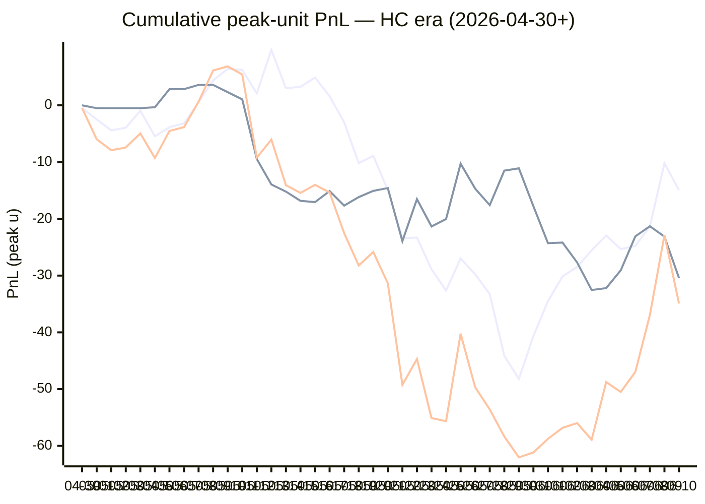

# Sharp Intel v6 — Daily Master Report

_Auto-generated **6/11/2026, 12:41:37 PM ET** by `scripts/dailyV6Report.js`. Do not edit by hand._

**Source of truth: this report mirrors the live Pick Performance dashboard.** Inclusion = `lockStage ≠ SHADOW ∧ ¬superseded ∧ health ∉ {MUTED, CANCELLED} ∧ peak.stars ≥ 2.5`. PnL is in **peak units** (the size shipped to users). HC margin / Δw / Δq are the **frozen** stamps written at last sync before the T-15 freeze. HC margin only existed from the v7.1 launch (**2026-04-30**); pre-launch picks have no HC value (no retro-fitting). Nothing is recomputed against today's whitelist.

v6 cutover: **2026-04-18** · whitelist source: live `sharpWalletProfiles` (239 profiles — drives §5 roster snapshot only) · quality cut: contribution ≥ 30 · HC = CONFIRMED tier ∧ sizeRatio ≥ 1.5.

---
## §1. Yesterday's picks

Slate: **2026-06-10** · 25 shipped sides.

| N | W-L-P | WR% | PnL (peak u) | PnL (flat 1u) |
|---|---|---|---|---|
| 25 | 11-14-0 | 44.0% | -12.06u | -2.55u |

| Sport | Market | Matchup | Pick | Stars · Units | HC | Δw | Δq | Σ | Odds | Result | PnL (peak u) |
|---|---|---|---|---|---|---|---|---|---|---|---|
| MLB | ML | Atlanta Braves @ Chicago White Sox | Atlanta Braves | 4.5★ · 3.00u | +0 | +0 | +0 | +0 | -148 | L | -3.00u |
| MLB | ML | Boston Red Sox @ Tampa Bay Rays | Boston Red Sox | 4.0★ · 1.00u | +0 | +3 | +4 | +7 | +136 | L | -1.00u |
| MLB | ML | Chicago Cubs @ Colorado Rockies | Chicago Cubs | 4.0★ · 1.00u | +0 | +1 | +1 | +2 | -172 | L | -1.00u |
| MLB | ML | Cincinnati Reds @ San Diego Padres | Cincinnati Reds | 3.0★ · 0.50u | +0 | +0 | -2 | -2 | +136 | L | -0.50u |
| MLB | ML | Houston Astros @ Los Angeles Angels | Los Angeles Angels | 2.5★ · 0.25u | +0 | +0 | +1 | +1 | -117 | **W** | +0.21u |
| MLB | ML | Los Angeles Dodgers @ Pittsburgh Pirates | Pittsburgh Pirates | 4.0★ · 1.00u | +0 | +1 | +0 | +1 | +178 | **W** | +1.66u |
| MLB | ML | Milwaukee Brewers @ Athletics | Milwaukee Brewers | 5.0★ · 5.00u | +0 | +0 | +0 | +0 | -104 | L | -5.00u |
| MLB | ML | Minnesota Twins @ Detroit Tigers | Minnesota Twins | 4.0★ · 1.00u | +0 | +0 | +0 | +0 | +148 | **W** | +1.46u |
| MLB | ML | Seattle Mariners @ Baltimore Orioles | Baltimore Orioles | 4.5★ · 2.50u | +0 | +0 | -2 | -2 | +103 | **W** | +2.58u |
| MLB | ML | St. Louis Cardinals @ New York Mets | New York Mets | 4.0★ · 1.00u | +0 | +1 | -1 | +0 | -127 | L | -1.00u |
| MLB | ML | Texas Rangers @ Kansas City Royals | Texas Rangers | 4.0★ · 1.00u | +0 | +1 | +1 | +2 | -120 | **W** | +0.83u |
| MLB | ML | Washington Nationals @ San Francisco Giants | Washington Nationals | 5.0★ · 5.00u | +0 | +1 | +3 | +4 | -106 | L | -5.00u |
| MLB | SPREAD | Washington Nationals @ San Francisco Giants | San Francisco Giants | 2.5★ · 1.00u | +0 | +0 | -1 | -1 | -190 | L | -1.00u |
| MLB | TOTAL | Arizona Diamondbacks @ Miami Marlins | Over 8.5 | 4.5★ · 3.00u | +0 | +1 | +2 | +3 | -110 | L | -3.00u |
| MLB | TOTAL | Boston Red Sox @ Tampa Bay Rays | Over 7.5 | 4.0★ · 1.00u | +0 | +0 | -1 | -1 | -110 | **W** | +0.91u |
| MLB | TOTAL | Chicago Cubs @ Colorado Rockies | Under 12.5 | 5.0★ · 5.00u | +0 | +0 | +1 | +1 | -110 | **W** | +4.55u |
| MLB | TOTAL | Cincinnati Reds @ San Diego Padres | Under 8.5 | 4.0★ · 1.00u | +0 | +1 | +1 | +2 | -113 | L | -1.00u |
| MLB | TOTAL | Houston Astros @ Los Angeles Angels | Over 8.5 | 5.0★ · 5.00u | +0 | +2 | +1 | +3 | -110 | L | -5.00u |
| MLB | TOTAL | Los Angeles Dodgers @ Pittsburgh Pirates | Over 7.5 | 5.0★ · 5.00u | +0 | +3 | +2 | +5 | -110 | **W** | +4.55u |
| MLB | TOTAL | New York Yankees @ Cleveland Guardians | Over 7.5 | 4.5★ · 3.00u | +0 | +1 | +2 | +3 | -110 | **W** | +2.73u |
| MLB | TOTAL | St. Louis Cardinals @ New York Mets | Over 8.5 | 4.5★ · 3.00u | +0 | +1 | +1 | +2 | -110 | **W** | +2.97u |
| MLB | TOTAL | Texas Rangers @ Kansas City Royals | Under 9.5 | 4.5★ · 3.00u | +0 | -1 | +0 | -1 | -110 | L | -3.00u |
| MLB | TOTAL | Washington Nationals @ San Francisco Giants | Under 8.5 | 5.0★ · 5.00u | +1 | +4 | +4 | +8 | -110 | L | -5.00u |
| NBA | ML | Spurs @ Knicks | Spurs | 2.5★ · 0.25u | +0 | -2 | -3 | -5 | +112 | L | -0.25u |
| NBA | TOTAL | Spurs @ Knicks | Under 216.5 | 2.5★ · 0.25u | +1 | +4 | +4 | +8 | -108 | **W** | +0.24u |

---
## §2. 3-day / 7-day / all-time cohort rollups

Shipped picks only. PnL in **peak units** (size we actually bet) and flat 1u (cohort EV lens). All margins are the engine's frozen stamps (`v8_hcMargin`, `v8_walletConsensusDelta`, `v8_walletConsensusQualityMargin`).

**HC margin sub-tables** are scoped to picks dated ≥ 2026-04-30 (the v7.1 launch — when HC margin became a real engine signal). Pre-launch picks are excluded from HC analysis since the feature didn't exist for them. Δw / Δq sub-tables span the full v6-era sample (≥ 2026-04-18). Empty buckets are dropped.

### §2a. 3-day

Total: **59** shipped · 28-30-1 · WR 48.3% · PnL +12.04u (peak) / -1.70u (flat).

**By HC margin** _(picks dated ≥ 2026-04-30, N = 59)_

| Bucket | N | W-L-P | WR% | PnL (peak u) | PnL (flat 1u) |
|---|---|---|---|---|---|
| HC = +2 | 3 | 2-1-0 | 66.7% | +6.60u | +0.91u |
| HC = +1 | 6 | 4-2-0 | 66.7% | +3.20u | +1.48u |
| HC = 0 | 47 | 19-27-1 | 41.3% | -7.34u | -7.41u |
| HC ≤ −1 | 3 | 3-0-0 | 100.0% | +9.58u | +3.32u |

**By Δw (winner margin)**

| Bucket | N | W-L-P | WR% | PnL (peak u) | PnL (flat 1u) |
|---|---|---|---|---|---|
| ≥ +3 | 9 | 5-4-0 | 55.6% | +4.66u | +0.52u |
| +2 | 5 | 1-4-0 | 20.0% | -7.90u | -3.18u |
| +1 | 25 | 12-12-1 | 50.0% | +13.63u | -0.66u |
| 0 | 17 | 9-8-0 | 52.9% | +2.35u | +2.76u |
| −1 | 1 | 0-1-0 | 0.0% | -3.00u | -1.00u |
| ≤ −2 | 2 | 1-1-0 | 50.0% | +2.30u | -0.14u |

**By Δq (quality margin)**

| Bucket | N | W-L-P | WR% | PnL (peak u) | PnL (flat 1u) |
|---|---|---|---|---|---|
| ≥ +3 | 10 | 4-6-0 | 40.0% | -10.13u | -2.48u |
| +2 | 9 | 5-4-0 | 55.6% | +6.36u | +0.42u |
| +1 | 14 | 7-7-0 | 50.0% | +6.05u | -0.95u |
| 0 | 11 | 6-5-0 | 54.5% | +4.47u | +3.09u |
| −1 | 11 | 5-5-1 | 50.0% | +4.46u | +0.19u |
| ≤ −2 | 4 | 1-3-0 | 25.0% | +0.83u | -1.97u |

**By AGS tier** _(picks dated ≥ 2026-05-05, N = 59)_

| Bucket | N | W-L-P | WR% | PnL (peak u) | PnL (flat 1u) |
|---|---|---|---|---|---|
| NEUT   (0 .. +3) | 30 | 15-15-0 | 50.0% | +16.26u | +0.41u |
| WEAK   (−1 .. 0) | 27 | 11-15-1 | 42.3% | -8.43u | -4.75u |
| FADE   (< −1) | 2 | 2-0-0 | 100.0% | +4.21u | +2.64u |

### §2b. 7-day

Total: **129** shipped · 68-59-2 · WR 53.5% · PnL +21.08u (peak) / +3.84u (flat).

**By HC margin** _(picks dated ≥ 2026-04-30, N = 129)_

| Bucket | N | W-L-P | WR% | PnL (peak u) | PnL (flat 1u) |
|---|---|---|---|---|---|
| HC = +2 | 7 | 5-2-0 | 71.4% | +11.53u | +1.81u |
| HC = +1 | 19 | 11-8-0 | 57.9% | +2.00u | +1.97u |
| HC = 0 | 95 | 47-46-2 | 50.5% | -2.75u | -2.07u |
| HC ≤ −1 | 8 | 5-3-0 | 62.5% | +10.30u | +2.14u |

**By Δw (winner margin)**

| Bucket | N | W-L-P | WR% | PnL (peak u) | PnL (flat 1u) |
|---|---|---|---|---|---|
| ≥ +3 | 14 | 8-6-0 | 57.1% | +7.80u | +1.05u |
| +2 | 12 | 5-7-0 | 41.7% | -12.96u | -3.40u |
| +1 | 54 | 29-24-1 | 54.7% | +18.23u | +3.51u |
| 0 | 41 | 22-18-1 | 55.0% | +8.85u | +3.40u |
| −1 | 4 | 2-2-0 | 50.0% | -0.80u | -0.19u |
| ≤ −2 | 4 | 2-2-0 | 50.0% | -0.04u | -0.51u |

**By Δq (quality margin)**

| Bucket | N | W-L-P | WR% | PnL (peak u) | PnL (flat 1u) |
|---|---|---|---|---|---|
| ≥ +3 | 14 | 7-7-0 | 50.0% | -8.67u | -0.76u |
| +2 | 16 | 10-6-0 | 62.5% | +9.95u | +2.41u |
| +1 | 41 | 24-17-0 | 58.5% | +13.44u | +4.26u |
| 0 | 35 | 18-16-1 | 52.9% | +0.93u | +1.85u |
| −1 | 17 | 7-9-1 | 43.8% | +5.39u | -1.88u |
| ≤ −2 | 6 | 2-4-0 | 33.3% | +0.04u | -2.04u |

**By AGS tier** _(picks dated ≥ 2026-05-05, N = 129)_

| Bucket | N | W-L-P | WR% | PnL (peak u) | PnL (flat 1u) |
|---|---|---|---|---|---|
| NEUT   (0 .. +3) | 58 | 30-28-0 | 51.7% | +5.73u | +1.02u |
| WEAK   (−1 .. 0) | 68 | 36-30-2 | 54.5% | +13.64u | +1.18u |
| FADE   (< −1) | 3 | 2-1-0 | 66.7% | +1.71u | +1.64u |

### §2c. All-time

Total: **580** shipped · 292-283-5 · WR 50.8% · PnL -47.15u (peak) / -14.18u (flat).

**By HC margin** _(picks dated ≥ 2026-04-30, N = 469)_

| Bucket | N | W-L-P | WR% | PnL (peak u) | PnL (flat 1u) |
|---|---|---|---|---|---|
| HC ≥ +3 | 10 | 3-7-0 | 30.0% | -8.83u | -5.67u |
| HC = +2 | 31 | 16-15-0 | 51.6% | -4.61u | -0.13u |
| HC = +1 | 149 | 83-66-0 | 55.7% | -1.51u | +10.80u |
| HC = 0 | 257 | 128-125-4 | 50.6% | -30.43u | -12.54u |
| HC ≤ −1 | 21 | 11-10-0 | 52.4% | +8.83u | +2.14u |

**By Δw (winner margin)**

| Bucket | N | W-L-P | WR% | PnL (peak u) | PnL (flat 1u) |
|---|---|---|---|---|---|
| ≥ +3 | 101 | 49-52-0 | 48.5% | -25.00u | -2.17u |
| +2 | 122 | 57-65-0 | 46.7% | -38.24u | -10.57u |
| +1 | 206 | 114-90-2 | 55.9% | +18.80u | +11.86u |
| 0 | 120 | 61-56-3 | 52.1% | +5.06u | -2.31u |
| −1 | 19 | 5-14-0 | 26.3% | -8.47u | -9.32u |
| ≤ −2 | 6 | 2-4-0 | 33.3% | -3.29u | -2.51u |
| missing | 6 | 4-2-0 | 66.7% | +3.99u | +0.85u |

**By Δq (quality margin)**

| Bucket | N | W-L-P | WR% | PnL (peak u) | PnL (flat 1u) |
|---|---|---|---|---|---|
| ≥ +3 | 123 | 60-61-2 | 49.6% | -32.87u | -4.66u |
| +2 | 110 | 50-60-0 | 45.5% | -33.68u | -13.01u |
| +1 | 176 | 95-80-1 | 54.3% | +24.61u | +4.88u |
| 0 | 104 | 54-49-1 | 52.4% | -5.22u | +2.28u |
| −1 | 45 | 25-19-1 | 56.8% | +13.75u | +3.89u |
| ≤ −2 | 16 | 4-12-0 | 25.0% | -16.98u | -8.33u |
| missing | 6 | 4-2-0 | 66.7% | +3.24u | +0.77u |

**By AGS tier** _(picks dated ≥ 2026-05-05, N = 444)_

| Bucket | N | W-L-P | WR% | PnL (peak u) | PnL (flat 1u) |
|---|---|---|---|---|---|
| ELITE  (≥ +7) | 3 | 3-0-0 | 100.0% | +8.01u | +2.34u |
| LOCK   (+5 .. +7) | 9 | 5-4-0 | 55.6% | -2.93u | -0.47u |
| STRONG (+3 .. +5) | 22 | 13-9-0 | 59.1% | -6.66u | +2.77u |
| NEUT   (0 .. +3) | 276 | 138-138-0 | 50.0% | -36.79u | -16.25u |
| WEAK   (−1 .. 0) | 119 | 61-55-3 | 52.6% | +2.09u | +1.42u |
| FADE   (< −1) | 14 | 9-5-0 | 64.3% | +4.68u | +5.05u |
| missing | 1 | 1-0-0 | 100.0% | +1.63u | +0.96u |

---
## §3. Edge over time — is HC margin creating winners?

Daily cumulative peak-unit PnL since the HC margin launch (**2026-04-30**). The `HC ≥ +1` line is the golden-standard cohort. The `HC = 0` line is the no-HC-signal control. The `All shipped (HC era)` line is every shipped pick from the same date range — the apples-to-apples baseline. Watch the spread.

Daily cumulative table (peak units, HC era only):

| Date | HC ≥ +1 (cum) | HC = 0 (cum) | All shipped (cum) |
|---|---|---|---|
| 2026-04-30 | -0.48u | +0.00u | -0.48u |
| 2026-05-01 | -2.48u | -0.50u | -5.98u |
| 2026-05-02 | -4.41u | -0.50u | -7.91u |
| 2026-05-03 | -3.94u | -0.50u | -7.44u |
| 2026-05-04 | -0.95u | -0.50u | -4.95u |
| 2026-05-05 | -5.45u | -0.34u | -9.29u |
| 2026-05-06 | -3.86u | +2.84u | -4.52u |
| 2026-05-07 | -3.18u | +2.84u | -3.84u |
| 2026-05-08 | +0.54u | +3.60u | +0.64u |
| 2026-05-09 | +4.41u | +3.60u | +6.14u |
| 2026-05-10 | +6.41u | +2.32u | +6.86u |
| 2026-05-11 | +6.25u | +1.05u | +5.43u |
| 2026-05-12 | +2.11u | -9.45u | -9.21u |
| 2026-05-13 | +9.78u | -13.95u | -6.04u |
| 2026-05-14 | +3.00u | -15.20u | -14.07u |
| 2026-05-15 | +3.27u | -16.83u | -15.43u |
| 2026-05-16 | +4.90u | -17.05u | -14.02u |
| 2026-05-17 | +1.62u | -15.11u | -15.36u |
| 2026-05-18 | -2.98u | -17.67u | -22.52u |
| 2026-05-19 | -10.18u | -16.17u | -28.22u |
| 2026-05-20 | -8.90u | -15.07u | -25.84u |
| 2026-05-21 | -14.92u | -14.58u | -31.37u |
| 2026-05-22 | -23.44u | -23.93u | -49.24u |
| 2026-05-23 | -23.30u | -16.53u | -44.70u |
| 2026-05-24 | -28.89u | -21.34u | -55.10u |
| 2026-05-25 | -32.63u | -20.03u | -55.65u |
| 2026-05-26 | -26.98u | -10.27u | -40.24u |
| 2026-05-27 | -29.77u | -14.68u | -49.69u |
| 2026-05-28 | -33.27u | -17.58u | -53.57u |
| 2026-05-29 | -44.12u | -11.51u | -58.35u |
| 2026-05-30 | -48.21u | -11.10u | -62.03u |
| 2026-05-31 | -40.65u | -17.79u | -61.16u |
| 2026-06-01 | -34.49u | -24.29u | -58.77u |
| 2026-06-02 | -30.14u | -24.19u | -56.82u |
| 2026-06-03 | -28.48u | -27.68u | -56.00u |
| 2026-06-04 | -25.53u | -32.54u | -58.91u |
| 2026-06-05 | -22.94u | -32.20u | -48.76u |
| 2026-06-06 | -25.33u | -29.06u | -50.51u |
| 2026-06-07 | -24.75u | -23.09u | -46.96u |
| 2026-06-08 | -21.34u | -21.30u | -36.94u |
| 2026-06-09 | -10.19u | -23.13u | -22.86u |
| 2026-06-10 | -14.95u | -30.43u | -34.92u |

---
## §4. Wallet roster growth & profitability

"Tracked in sport X" = a wallet has placed **≥ 2 bets** in X within the v6-era sample. "Profitable" = cumulative flat PnL > 0. Source: `v8Scoring.walletDetails` on every graded v6-era game (every side, not just the shipped set).

### §4a. Per-sport wallet snapshot

| Sport | Total wallets seen | Tracked (≥2) | Profitable | % prof | WR ≥ 50% | WR ≥ 60% | WR ≥ 70% |
|---|---|---|---|---|---|---|---|
| MLB | 72 | 53 | 15 | 28% | 23 | 8 | 2 |
| NBA | 137 | 105 | 45 | 43% | 59 | 29 | 11 |
| NHL | 58 | 41 | 14 | 34% | 23 | 13 | 6 |
| **ALL (any sport)** | **170** | **135** | **56** | **41%** | **73** | **31** | **11** |

### §4b. Daily roster growth (cumulative through each date)

Format: `tracked (profitable)`. For each date D, recompute the roster using every bet up to and including D.

| Date | ALL | MLB | NBA | NHL |
|---|---|---|---|---|
| 2026-04-18 | 5 (2) | 2 (2) | 3 (0) | 0 (0) |
| 2026-04-19 | 19 (8) | 5 (3) | 9 (3) | 3 (1) |
| 2026-04-20 | 29 (12) | 7 (6) | 23 (8) | 5 (2) |
| 2026-04-21 | 44 (21) | 10 (6) | 31 (10) | 7 (5) |
| 2026-04-22 | 52 (28) | 12 (6) | 39 (15) | 11 (10) |
| 2026-04-23 | 56 (29) | 13 (6) | 46 (21) | 13 (10) |
| 2026-04-24 | 61 (30) | 14 (6) | 51 (23) | 14 (9) |
| 2026-04-25 | 65 (29) | 16 (8) | 54 (22) | 16 (9) |
| 2026-04-26 | 67 (31) | 18 (5) | 56 (25) | 17 (9) |
| 2026-04-27 | 72 (32) | 20 (7) | 60 (24) | 17 (9) |
| 2026-04-28 | 76 (33) | 21 (7) | 63 (26) | 23 (10) |
| 2026-04-29 | 77 (33) | 21 (7) | 64 (25) | 23 (10) |
| 2026-04-30 | 81 (34) | 21 (7) | 70 (27) | 23 (10) |
| 2026-05-01 | 85 (38) | 22 (5) | 74 (30) | 26 (13) |
| 2026-05-02 | 86 (37) | 23 (7) | 75 (32) | 26 (12) |
| 2026-05-03 | 86 (38) | 24 (8) | 75 (33) | 26 (12) |
| 2026-05-04 | 90 (38) | 24 (9) | 76 (32) | 26 (12) |
| 2026-05-05 | 91 (40) | 24 (9) | 79 (33) | 26 (12) |
| 2026-05-06 | 92 (40) | 24 (9) | 80 (33) | 26 (12) |
| 2026-05-07 | 92 (41) | 24 (9) | 80 (33) | 26 (12) |
| 2026-05-08 | 92 (40) | 24 (8) | 80 (32) | 26 (11) |
| 2026-05-09 | 94 (42) | 24 (8) | 82 (35) | 26 (11) |
| 2026-05-10 | 94 (42) | 24 (8) | 82 (35) | 26 (11) |
| 2026-05-11 | 96 (42) | 24 (8) | 84 (36) | 26 (11) |
| 2026-05-12 | 100 (41) | 27 (9) | 86 (37) | 26 (11) |
| 2026-05-13 | 102 (45) | 29 (11) | 88 (37) | 26 (11) |
| 2026-05-14 | 102 (41) | 29 (11) | 88 (37) | 28 (12) |
| 2026-05-15 | 103 (41) | 30 (10) | 88 (39) | 28 (12) |
| 2026-05-16 | 105 (43) | 31 (12) | 88 (39) | 30 (14) |
| 2026-05-17 | 105 (46) | 32 (11) | 88 (40) | 30 (14) |
| 2026-05-18 | 105 (46) | 32 (10) | 88 (38) | 31 (15) |
| 2026-05-19 | 105 (46) | 32 (12) | 88 (38) | 31 (15) |
| 2026-05-20 | 106 (48) | 33 (12) | 88 (38) | 31 (16) |
| 2026-05-21 | 106 (45) | 34 (12) | 88 (37) | 31 (14) |
| 2026-05-22 | 106 (44) | 34 (10) | 88 (39) | 33 (16) |
| 2026-05-23 | 111 (49) | 36 (10) | 90 (40) | 36 (19) |
| 2026-05-24 | 117 (52) | 37 (12) | 94 (39) | 37 (16) |
| 2026-05-25 | 120 (53) | 38 (13) | 95 (40) | 38 (16) |
| 2026-05-26 | 122 (55) | 39 (14) | 97 (42) | 38 (16) |
| 2026-05-27 | 123 (51) | 40 (12) | 97 (42) | 40 (14) |
| 2026-05-28 | 124 (51) | 40 (12) | 99 (42) | 40 (14) |
| 2026-05-29 | 125 (50) | 41 (12) | 99 (42) | 41 (12) |
| 2026-05-30 | 126 (49) | 41 (12) | 101 (43) | 41 (12) |
| 2026-05-31 | 126 (48) | 41 (11) | 101 (43) | 41 (12) |
| 2026-06-01 | 129 (52) | 44 (14) | 101 (43) | 41 (12) |
| 2026-06-02 | 130 (56) | 45 (16) | 101 (43) | 41 (13) |
| 2026-06-03 | 132 (56) | 45 (14) | 102 (43) | 41 (13) |
| 2026-06-04 | 132 (57) | 46 (14) | 102 (43) | 41 (14) |
| 2026-06-05 | 132 (57) | 48 (15) | 102 (43) | 41 (14) |
| 2026-06-06 | 132 (57) | 49 (15) | 102 (43) | 41 (14) |
| 2026-06-07 | 133 (56) | 52 (16) | 102 (43) | 41 (14) |
| 2026-06-08 | 135 (55) | 53 (16) | 103 (44) | 41 (14) |
| 2026-06-09 | 135 (55) | 53 (15) | 103 (44) | 41 (14) |
| 2026-06-10 | 135 (56) | 53 (15) | 105 (45) | 41 (14) |

### §4c. Top 10 profitable wallets by sport

#### MLB

| # | Wallet | N | W | L | WR% | Flat PnL (u) | Flat ROI | $ PnL |
|---|---|---|---|---|---|---|---|---|
| 1 | e05213 | 9 | 8 | 1 | 88.9% | +6.27 | +69.6% | $294.4K |
| 2 | a8c991 | 3 | 2 | 1 | 66.7% | +1.60 | +53.3% | $22.6K |
| 3 | ad88a3 | 3 | 2 | 1 | 66.7% | +1.56 | +52.1% | $2.6K |
| 4 | c9bba3 | 5 | 4 | 1 | 80.0% | +2.37 | +47.3% | $14.8K |
| 5 | 913987 | 43 | 30 | 13 | 69.8% | +15.19 | +35.3% | $775.1K |
| 6 | 491f30 | 20 | 12 | 8 | 60.0% | +5.27 | +26.4% | $34.8K |
| 7 | eeabaf | 47 | 26 | 21 | 55.3% | +10.66 | +22.7% | $911.1K |
| 8 | 981187 | 8 | 5 | 3 | 62.5% | +1.65 | +20.7% | $13.5K |
| 9 | c668b3 | 16 | 10 | 6 | 62.5% | +3.16 | +19.7% | $270 |
| 10 | a10ff5 | 35 | 19 | 16 | 54.3% | +2.63 | +7.5% | $1.2K |

#### NBA

| # | Wallet | N | W | L | WR% | Flat PnL (u) | Flat ROI | $ PnL |
|---|---|---|---|---|---|---|---|---|
| 1 | 799fad | 2 | 2 | 0 | 100.0% | +5.66 | +283.0% | $241.7K |
| 2 | a0d6d2 | 4 | 4 | 0 | 100.0% | +4.51 | +112.7% | $6.4K |
| 3 | a8c991 | 2 | 2 | 0 | 100.0% | +1.95 | +97.3% | $103.1K |
| 4 | 12ad50 | 3 | 3 | 0 | 100.0% | +2.74 | +91.3% | $45.5K |
| 5 | b51a56 | 6 | 5 | 1 | 83.3% | +5.44 | +90.7% | $74.4K |
| 6 | 11b032 | 7 | 6 | 1 | 85.7% | +5.40 | +77.1% | $249.9K |
| 7 | a1684d | 9 | 8 | 1 | 88.9% | +4.26 | +47.3% | $9.6K |
| 8 | 92df91 | 23 | 16 | 7 | 69.6% | +10.26 | +44.6% | -$214 |
| 9 | 7f00bc | 20 | 13 | 7 | 65.0% | +8.82 | +44.1% | $11.1K |
| 10 | 8ec926 | 8 | 6 | 2 | 75.0% | +3.53 | +44.1% | -$681 |

#### NHL

| # | Wallet | N | W | L | WR% | Flat PnL (u) | Flat ROI | $ PnL |
|---|---|---|---|---|---|---|---|---|
| 1 | 8366f5 | 2 | 2 | 0 | 100.0% | +2.30 | +114.9% | $107.6K |
| 2 | 799fad | 2 | 2 | 0 | 100.0% | +1.88 | +94.1% | $46.9K |
| 3 | fec67e | 4 | 3 | 1 | 75.0% | +2.82 | +70.5% | $12.5K |
| 4 | 30935c | 4 | 3 | 1 | 75.0% | +2.11 | +52.7% | $953 |
| 5 | 981187 | 8 | 6 | 2 | 75.0% | +3.52 | +44.0% | -$25.2K |
| 6 | bc3532 | 20 | 13 | 7 | 65.0% | +8.20 | +41.0% | $81.2K |
| 7 | fcc12b | 11 | 8 | 3 | 72.7% | +4.45 | +40.5% | -$27.5K |
| 8 | e70853 | 9 | 6 | 3 | 66.7% | +2.66 | +29.5% | -$11.1K |
| 9 | c5cea1 | 3 | 2 | 1 | 66.7% | +0.62 | +20.7% | $22.1K |
| 10 | dfa240 | 27 | 17 | 10 | 63.0% | +5.49 | +20.3% | $16.3K |

---
## §5. Proven-wallet roster growth & HC tracking

"Proven wallet" = whitelist tier `CONFIRMED` or `FLAT` in the same sense the live engine uses (`exportWalletProfiles.js` → `sharpWalletProfiles.bySport`). Sports inherit independent rosters: a wallet can be CONFIRMED in NBA and absent from NHL. `walletBets` come from `v8Scoring.walletDetails` on every graded v6-era pick (Source A); `positionRows` come from `sharp_action_positions` (Source B).

### §5a. Current proven-winner roster (snapshot)

Roster as of **2026-06-10** — wallets with ≥2 bets in the sport.

| Sport | Wallets seen | Eligible (≥2) | CONFIRMED | FLAT | Proven (C+F) | WR50 only | Conv % |
|---|---|---|---|---|---|---|---|
| MLB | 121 | 53 | 10 | 5 | **15** | 8 | 12.4% |
| NBA | 205 | 105 | 29 | 16 | **45** | 20 | 22.0% |
| NHL | 104 | 41 | 10 | 4 | **14** | 9 | 13.5% |
| **ALL** | **—** | **—** | **—** | **—** | **74** | **—** | **—** |

### §5b. Live whitelist drift check

Live `sharpWalletProfiles` is what the engine reads at lock time. Drift between script reconstruction (above) and live should be ≤ 1 day of position data — otherwise `exportWalletProfiles.js` is stale.

| Sport | CONFIRMED (live · script) | FLAT (live · script) | WR50 (live · script) | Drift |
|---|---|---|---|---|
| MLB | 31 · 10 | 12 · 5 | 7 · 8 | +28 live |
| NBA | 55 · 29 | 25 · 16 | 22 · 20 | +35 live |
| NHL | 21 · 10 | 6 · 4 | 12 · 9 | +13 live |

### §5c. Roster growth — 3d / 7d / 30d / all-time deltas

Each cell is **net growth** in proven (CONFIRMED + FLAT) wallets in that window, with the absolute count at the start (`+Δ from N`). Negative = wallets demoted. Window endpoint = 2026-06-10.

| Sport | 3-day | 7-day | 30-day | All-time (since cutover) |
|---|---|---|---|---|
| MLB | -1 from 16 | +1 from 14 | +7 from 8 | +15 from 0 |
| NBA | +2 from 43 | +2 from 43 | +9 from 36 | +45 from 0 |
| NHL | +0 from 14 | +1 from 13 | +3 from 11 | +14 from 0 |

A flat 7-day delta on a sport with healthy slate density = either the bubble pipeline has stalled (no wallets approaching the bar) or our cohort has saturated. Check §13d for the funnel diagnostic.

### §5d. Pipeline funnel — where each sport leaks

Wallets surviving each gate, in order. The biggest %-drop tells you the bottleneck. Gates:

1. **Seen** — placed ≥ 1 bet in the sport (any source)
2. **Eligible** — ≥ 2 graded picks in Source A (required for FLAT/CONFIRMED)
3. **Flat-OK** — eligible AND flat ROI > 0 (becomes FLAT or better)
4. **$-OK** — Flat-OK AND ≥2 positions with dollar ROI > 0 (CONFIRMED)
5. **Promoted** — final whitelisted = CONFIRMED + FLAT

| Sport | 1·Seen | 2·Eligible (% of Seen) | 3·Flat-OK (% of Elig) | 4·$-OK (% of Flat) | 5·Promoted | Bottleneck |
|---|---|---|---|---|---|---|
| MLB | 121 | 53 (44%) | 15 (28%) | 10 (67%) | **15** | edge (Eligible→Flat-OK) 72% |
| NBA | 205 | 105 (51%) | 45 (43%) | 29 (64%) | **45** | edge (Eligible→Flat-OK) 57% |
| NHL | 104 | 41 (39%) | 14 (34%) | 10 (71%) | **14** | edge (Eligible→Flat-OK) 66% |

### §5e. HC backing density (the fuel for v7.3 HC margin)

Every v7.x promotion is gated on `HC_m ≥ +1`, which requires at least one CONFIRMED wallet sized at `≥ 1.5×` average on the for-side. This table shows the share of shipped picks that *had any HC backing*, by sport, in each window. If HC density falls toward zero in a sport, the v7.3 floor cohorts (Σ=1, Σ=2 locks; HC rescues) will simply stop firing there.

| Sport | Window | Picks (with HC stamp) | Any HC for-side | HC_m ≥ +1 | HC_m ≥ +2 |
|---|---|---|---|---|---|
| MLB | 3-day | 52 | 9 (17.3%) | 6 (11.5%) | 1 (1.9%) |
| MLB | 7-day | 119 | 27 (22.7%) | 22 (18.5%) | 4 (3.4%) |
| MLB | All-time | 403 | 145 (36.0%) | 133 (33.0%) | 16 (4.0%) |
| NBA | 3-day | 5 | 4 (80.0%) | 3 (60.0%) | 2 (40.0%) |
| NBA | 7-day | 7 | 5 (71.4%) | 4 (57.1%) | 3 (42.9%) |
| NBA | All-time | 125 | 82 (65.6%) | 68 (54.4%) | 33 (26.4%) |
| NHL | 3-day | 2 | 0 (0.0%) | 0 (0.0%) | 0 (0.0%) |
| NHL | 7-day | 3 | 0 (0.0%) | 0 (0.0%) | 0 (0.0%) |
| NHL | All-time | 46 | 20 (43.5%) | 19 (41.3%) | 5 (10.9%) |

Pooled across sports:

| Window | Picks (with HC stamp) | Any HC for-side | HC_m ≥ +1 | HC_m ≥ +2 |
|---|---|---|---|---|
| 3-day | 59 | 13 (22.0%) | 9 (15.3%) | 3 (5.1%) |
| 7-day | 129 | 32 (24.8%) | 26 (20.2%) | 7 (5.4%) |
| All-time | 574 | 247 (43.0%) | 220 (38.3%) | 54 (9.4%) |

### §5f. Bubble wallets — next-up graduations

Wallets currently NOT promoted but close. Two flavors:

- **One-bet-away** — won the only bet, needs one more positive bet to clear ≥2.
- **Just-under** — has ≥2 bets but flat ROI is between −10% and 0% (one win flips them).

#### MLB

**One-bet-away** (6)

| wallet | picksN | flat PnL | pos N | pos $ROI |
|---|---|---|---|---|
| `...be17` | 1 | +6.95 | 23 | -60% |
| `...e3d0` | 1 | +0.91 | 24 | 27% |
| `...be00` | 1 | +0.87 | 15 | 10% |
| `...9373` | 1 | +0.87 | 0 | — |
| `...9b3c` | 1 | +0.77 | 8 | 52% |
| `...8d26` | 1 | +0.72 | 5 | -22% |

**Just-under** (6)

| wallet | picksN | WR | flat ROI | pos N | pos $ROI |
|---|---|---|---|---|---|
| `...afd2` | 40 | 50% | -3.3% | 175 | -20% |
| `...2f63` | 104 | 49% | -4.1% | 1023 | -5% |
| `...2768` | 39 | 46% | -4.2% | 62 | 15% |
| `...600d` | 16 | 50% | -4.3% | 50 | -4% |
| `...0232` | 4 | 50% | -4.5% | 11 | 30% |
| `...c12b` | 40 | 48% | -6.5% | 67 | -19% |

#### NBA

**One-bet-away** (6)

| wallet | picksN | flat PnL | pos N | pos $ROI |
|---|---|---|---|---|
| `...bf5d` | 1 | +3.15 | 3 | 42% |
| `...ed41` | 1 | +3.15 | 3 | 3% |
| `...6b87` | 1 | +2.05 | 8 | -27% |
| `...9d74` | 1 | +0.93 | 44 | -11% |
| `...c556` | 1 | +0.93 | 3 | 42% |
| `...5c69` | 1 | +0.91 | 2 | 28% |

**Just-under** (6)

| wallet | picksN | WR | flat ROI | pos N | pos $ROI |
|---|---|---|---|---|---|
| `...d814` | 8 | 50% | -0.5% | 53 | 1% |
| `...1e50` | 2 | 50% | -1.9% | 18 | 47% |
| `...65dd` | 6 | 50% | -2.4% | 17 | 27% |
| `...853d` | 40 | 53% | -2.7% | 90 | -2% |
| `...1eae` | 19 | 53% | -3.3% | 76 | 15% |
| `...f5b0` | 20 | 50% | -3.7% | 57 | -28% |

#### NHL

**One-bet-away** (6)

| wallet | picksN | flat PnL | pos N | pos $ROI |
|---|---|---|---|---|
| `...2e78` | 1 | +1.46 | 0 | — |
| `...017f` | 1 | +1.45 | 6 | 108% |
| `...32f2` | 1 | +1.40 | 0 | — |
| `...e0fd` | 1 | +1.20 | 3 | 124% |
| `...266e` | 1 | +1.05 | 0 | — |
| `...2194` | 1 | +1.05 | 0 | — |

**Just-under** (6)

| wallet | picksN | WR | flat ROI | pos N | pos $ROI |
|---|---|---|---|---|---|
| `...33ee` | 4 | 50% | -0.3% | 8 | -23% |
| `...afd2` | 6 | 50% | -1.9% | 24 | -19% |
| `...192c` | 7 | 43% | -2.9% | 21 | -15% |
| `...35e3` | 7 | 57% | -5.5% | 26 | 31% |
| `...618e` | 2 | 50% | -6.1% | 28 | 24% |
| `...9ef0` | 7 | 43% | -8.6% | 23 | 0% |

### §5g. v2 wallet-promotion pipeline (Source-A / Source-B mix)

Live snapshot of the v2 promotion gate (shipped 2026-05-10, re-eval **2026-05-24**). Each FLAT-or-better wallet × sport pair is attributed to one of three paths via `sharpWalletProfiles[wallet].bySport[sport].whitelistSource`:

- **A** — flat-positive on featured picks (Source A) only — the v1 gate
- **A+B** — flat-positive in both sources (most reliable signal)
- **B** — flat-positive on-chain only (NEW in v2 — the trial lift)

Re-classified every 2h via `grade-sharp-actions` cron. Roll-back: set `B_ONLY_MIN_BETS = Infinity` in `scripts/exportWalletProfiles.js`.

#### Source mix per sport (live Firestore)

| Sport | A | A+B | B (new) | FLAT-or-better total | % from B-only |
|---|---|---|---|---|---|
| MLB | 4 | 12 | **27** | 43 | 62.8% |
| NBA | 12 | 33 | **35** | 80 | 43.8% |
| NHL | 4 | 10 | **13** | 27 | 48.1% |
| **ALL** | **20** | **55** | **75** | **150** | **50.0%** |

#### Pipeline freshness

- `sharp_action_positions` GRADED rows: **13028**
- `sharp_action_positions` PENDING rows: **106** (queued for next Grade Sharp Actions run)
- Latest `sharpWalletProfiles` rebuild: 6/11/2026, 8:42:15 AM ET — 239 min · within 2 cron cycles

**Alarms**: pending > 200 OR rebuild lag > 4h → cron is lagging or failing — check `gh run list --workflow="Grade Sharp Actions"`.

#### B-only roster — wallets currently promoted via Source B path only

Wallets here would have been EXCLUDED under v1 (Source-A-only). Top by Source-B bet count per sport. The 2-week re-eval (2026-05-24) will compare these wallets' realized lift against A-only and A+B cohorts.

**MLB** — 27 wallets promoted via B

| wallet | tier | B_n | B_flat ROI | B_$ ROI |
|---|---|---|---|---|
| `...9a27` | CONFIRMED | 467 | +12.3% | +4.4% |
| `...135d` | CONFIRMED | 332 | +1.1% | +3.4% |
| `...1eae` | FLAT | 147 | +3.1% | -1.4% |
| `...c684` | FLAT | 78 | +3.5% | -8.8% |
| `...69c2` | CONFIRMED | 66 | +17.4% | +1% |
| `...ad50` | FLAT | 38 | +9.2% | -1.5% |
| `...d6d2` | FLAT | 38 | +6.8% | -25.5% |
| `...cff6` | CONFIRMED | 26 | +6.6% | +22% |
| `...e3d0` | CONFIRMED | 24 | +5.6% | +27.2% |
| `...2a9e` | CONFIRMED | 21 | +27.2% | +9.4% |
| … | 17 more | | | |

**NBA** — 35 wallets promoted via B

| wallet | tier | B_n | B_flat ROI | B_$ ROI |
|---|---|---|---|---|
| `...cff6` | CONFIRMED | 106 | +1.2% | +33.9% |
| `...135d` | FLAT | 103 | +4.1% | -12.6% |
| `...1eae` | CONFIRMED | 76 | +0.7% | +15% |
| `...3782` | CONFIRMED | 69 | +3.8% | +2.6% |
| `...935c` | FLAT | 50 | +17.3% | -21.4% |
| `...9d74` | FLAT | 44 | +2.4% | -11.2% |
| `...68b3` | CONFIRMED | 44 | +33.9% | +13.9% |
| `...b6ef` | CONFIRMED | 42 | +6.3% | +3.3% |
| `...0563` | CONFIRMED | 37 | +4.9% | +41.7% |
| `...e2ce` | CONFIRMED | 35 | +14.2% | +28.7% |
| … | 25 more | | | |

**NHL** — 13 wallets promoted via B

| wallet | tier | B_n | B_flat ROI | B_$ ROI |
|---|---|---|---|---|
| `...618e` | CONFIRMED | 28 | +6.2% | +23.8% |
| `...35e3` | CONFIRMED | 26 | +10.6% | +31.5% |
| `...5eee` | CONFIRMED | 23 | +30.5% | +19.3% |
| `...192c` | FLAT | 21 | +14% | -15.2% |
| `...0c2e` | FLAT | 16 | +20% | -12.9% |
| `...600d` | CONFIRMED | 9 | +69% | +75.8% |
| `...2ca8` | CONFIRMED | 8 | +16.2% | +4% |
| `...a9cc` | CONFIRMED | 7 | +49.5% | +46.9% |
| `...cff6` | CONFIRMED | 6 | +46.5% | +55.8% |
| `...be00` | CONFIRMED | 6 | +87% | +81.4% |
| … | 3 more | | | |

### §5 — How to read

- **Roster growth flat in 7-day** + **funnel bottleneck = `data`** → re-run `exportWalletProfiles.js`. The flat-positive wallets are stuck at FLAT because Source-B coverage hasn't caught up. CONFIRMED gate is data-bound, not skill-bound.
- **Roster growth flat in 7-day** + **funnel bottleneck = `sample`** → wallets aren't reaching `≥2` reps fast enough. This is a slate-density problem; consider a soft `MIN_BETS = 1` shadow lane to surface bubble wallets earlier.
- **Roster shrank** (negative delta) → a previously CONFIRMED wallet just dropped flat-positive (lost a recent bet). Variance, not failure — but worth noting if a sport loses ≥3 in a week.
- **HC density on a sport drops below ~30%** → v7.3 promotions there will starve. Either the proven roster needs more CONFIRMED-tier wallets sizing aggressively, or the HC_RATIO (1.5) needs a sport-specific tune.
- **§5g B-only count drops sharply** → wallets are demoting off the B path (losing on-chain). Cross-check `WALLET_PROFILES_SUMMARY.md` churn section for the specific demotions.
- **§5g pipeline freshness lag > 4h** → grade-sharp-actions cron is failing. Check `gh run list --workflow="Grade Sharp Actions"` and re-trigger if needed.

---
## §6. Daily proven-wallet performance

Who on the proven roster is actually printing — yesterday's bets, the rolling leaderboard (`$ PnL`-ranked), current streaks, and per-sport volume. **Proven** = `CONFIRMED` ∪ `FLAT` per sport (the same gate that drives Δ_winner). A wallet only counts in a sport where it's on that sport's proven list.

### §6a. Yesterday's proven-wallet bets

Slate: **2026-06-10** · 49 bets · 22 distinct proven wallets · WR 57% · $ vol $1.46M · $ PnL $182.8K.

| Wallet | Sport | Market | Game | $ size | Result | $ PnL |
|---|---|---|---|---|---|---|
| `...2ca8` (CONFIRMED) | NBA | ML | Spurs @ Knicks | $222.9K | **W** | $168.9K |
| `...0c2e` (FLAT) | NBA | TOTAL | Spurs @ Knicks | $125.0K | **W** | $120.2K |
| `...e8f1` (FLAT) | NBA | ML | Spurs @ Knicks | $147.6K | **W** | $111.9K |
| `...66f5` (FLAT) | NBA | ML | Spurs @ Knicks | $73.8K | **W** | $55.9K |
| `...fc82` (FLAT) | MLB | ML | Houston Astros @ Los Angeles Angels | $52.0K | **W** | $44.4K |
| `...8da5` (CONFIRMED) | NBA | TOTAL | Spurs @ Knicks | $32.8K | **W** | $31.6K |
| `...2f63` (FLAT) | NBA | ML | Spurs @ Knicks | $41.6K | **W** | $31.5K |
| `...23c4` (FLAT) | MLB | ML | Los Angeles Dodgers @ Pittsburgh Pirates | $18.2K | **W** | $30.2K |
| `...aeeb` (CONFIRMED) | NBA | ML | Spurs @ Knicks | $31.8K | **W** | $24.1K |
| `...3987` (CONFIRMED) | MLB | TOTAL | New York Yankees @ Cleveland Guardians | $25.0K | **W** | $22.7K |
| `...64aa` (CONFIRMED) | MLB | ML | Philadelphia Phillies @ Toronto Blue Jays | $29.1K | **W** | $22.2K |
| `...3987` (CONFIRMED) | MLB | ML | Houston Astros @ Los Angeles Angels | $16.8K | **W** | $14.3K |
| `...64aa` (CONFIRMED) | MLB | ML | Texas Rangers @ Kansas City Royals | $14.3K | **W** | $11.9K |
| `...44b0` (CONFIRMED) | NBA | ML | Spurs @ Knicks | $12.0K | **W** | $9.1K |
| `...1f30` (CONFIRMED) | MLB | TOTAL | Chicago Cubs @ Colorado Rockies | $8.4K | **W** | $7.6K |
| `...64aa` (CONFIRMED) | MLB | ML | Minnesota Twins @ Detroit Tigers | $5.2K | **W** | $7.5K |
| `...3987` (CONFIRMED) | MLB | TOTAL | St. Louis Cardinals @ New York Mets | $6.9K | **W** | $6.8K |
| `...3532` (FLAT) | NBA | TOTAL | Spurs @ Knicks | $6.6K | **W** | $6.3K |
| `...1f30` (CONFIRMED) | MLB | ML | Seattle Mariners @ Baltimore Orioles | $5.9K | **W** | $6.0K |
| `...0ff5` (FLAT) | MLB | TOTAL | Boston Red Sox @ Tampa Bay Rays | $4.7K | **W** | $4.3K |
| `...44b0` (CONFIRMED) | NBA | TOTAL | Spurs @ Knicks | $4.3K | **W** | $4.2K |
| `...1f30` (CONFIRMED) | MLB | TOTAL | Los Angeles Dodgers @ Pittsburgh Pirates | $4.2K | **W** | $3.8K |
| `...00bc` (CONFIRMED) | NBA | ML | Spurs @ Knicks | $3.2K | **W** | $2.5K |
| `...88a3` (CONFIRMED) | MLB | ML | Philadelphia Phillies @ Toronto Blue Jays | $1.3K | **W** | $983 |
| `...684d` (CONFIRMED) | NBA | TOTAL | Spurs @ Knicks | $110 | **W** | $106 |
| `...2f63` (FLAT) | NBA | SPREAD | Spurs @ Knicks | $69 | **W** | $66 |
| `...66f5` (FLAT) | NBA | TOTAL | Spurs @ Knicks | $51 | **W** | $49 |
| `...23c4` (FLAT) | MLB | TOTAL | St. Louis Cardinals @ New York Mets | $16 | **W** | $16 |
| `...8f33` (CONFIRMED) | MLB | SPREAD | Los Angeles Dodgers @ Pittsburgh Pirates | $161 | L | -$161 |
| `...8f33` (CONFIRMED) | MLB | TOTAL | Texas Rangers @ Kansas City Royals | $609 | L | -$609 |
| `...8f33` (CONFIRMED) | MLB | ML | Atlanta Braves @ Chicago White Sox | $2.4K | L | -$2.4K |
| `...8f33` (CONFIRMED) | MLB | TOTAL | Arizona Diamondbacks @ Miami Marlins | $3.1K | L | -$3.1K |
| `...1f30` (CONFIRMED) | MLB | TOTAL | Houston Astros @ Los Angeles Angels | $3.6K | L | -$3.6K |
| `...64aa` (CONFIRMED) | MLB | ML | Houston Astros @ Los Angeles Angels | $4.2K | L | -$4.2K |
| `...2f63` (FLAT) | NBA | TOTAL | Spurs @ Knicks | $4.4K | L | -$4.4K |
| `...23c4` (FLAT) | MLB | ML | Cincinnati Reds @ San Diego Padres | $4.5K | L | -$4.5K |
| `...9953` (CONFIRMED) | NBA | TOTAL | Spurs @ Knicks | $6.2K | L | -$6.2K |
| `...8f33` (CONFIRMED) | MLB | ML | Milwaukee Brewers @ Athletics | $6.3K | L | -$6.3K |
| `...64aa` (CONFIRMED) | MLB | ML | St. Louis Cardinals @ New York Mets | $8.5K | L | -$8.5K |
| `...1f30` (CONFIRMED) | MLB | ML | Philadelphia Phillies @ Toronto Blue Jays | $11.2K | L | -$11.2K |
| `...64aa` (CONFIRMED) | MLB | ML | Boston Red Sox @ Tampa Bay Rays | $17.6K | L | -$17.6K |
| `...3532` (FLAT) | NBA | ML | Spurs @ Knicks | $18.0K | L | -$18.0K |
| `...64aa` (CONFIRMED) | MLB | ML | Washington Nationals @ San Francisco Giants | $20.3K | L | -$20.3K |
| `...64aa` (CONFIRMED) | MLB | ML | Chicago Cubs @ Colorado Rockies | $33.6K | L | -$33.6K |
| `...c991` (CONFIRMED) | MLB | ML | Boston Red Sox @ Tampa Bay Rays | $40.0K | L | -$40.0K |
| `...23c4` (FLAT) | MLB | ML | Boston Red Sox @ Tampa Bay Rays | $43.5K | L | -$43.5K |
| `...9c38` (CONFIRMED) | NBA | ML | Spurs @ Knicks | $54.6K | L | -$54.6K |
| `...8da5` (CONFIRMED) | NBA | ML | Spurs @ Knicks | $99.8K | L | -$99.8K |
| `...0c2e` (FLAT) | NBA | ML | Spurs @ Knicks | $184.0K | L | -$184.0K |

### §6b. Proven-wallet leaderboard

Top 15 proven `(wallet × sport)` pairs per sport per horizon, ranked by **$ PnL** (the dollar-ROI lens). The 3-day board is the "who's on form right now" lens; the 7-day filters single-day variance; all-time is the proven-roster reference.

#### §6b-1. 3-day

**MLB** — 11 active proven wallets

| # | Wallet | Tier | Bets | WR% | Bets/day | Flat PnL (u) | Flat ROI | $ vol | $ PnL | $ ROI | Streak |
|---|---|---|---|---|---|---|---|---|---|---|---|
| 1 | `...5213` | CONFIRMED | 2 | 100% | 1.0 | +1.92 | +96% | $180.4K | $169.6K | +94% | 2W |
| 2 | `...3987` | CONFIRMED | 9 | 89% | 3.0 | +6.27 | +70% | $310.9K | $125.7K | +40% | 5W |
| 3 | `...abaf` | CONFIRMED | 4 | 75% | 2.0 | +2.24 | +56% | $95.5K | $76.1K | +80% | 3W |
| 4 | `...fc82` | FLAT | 1 | 100% | 1.0 | +0.85 | +85% | $52.0K | $44.4K | +85% | 1W |
| 5 | `...8f33` | CONFIRMED | 14 | 57% | 4.7 | +1.10 | +8% | $73.4K | $16.5K | +23% | 5L |
| 6 | `...1f30` | CONFIRMED | 8 | 63% | 2.7 | +1.80 | +23% | $56.7K | $15.2K | +27% | 1W |
| 7 | `...88a3` | CONFIRMED | 1 | 100% | 1.0 | +0.76 | +76% | $1.3K | $983 | +76% | 1W |
| 8 | `...0ff5` | FLAT | 3 | 33% | 1.0 | -1.09 | -36% | $14.2K | -$5.2K | -36% | 1W |
| 9 | `...c991` | CONFIRMED | 1 | 0% | 1.0 | -1.00 | -100% | $40.0K | -$40.0K | -100% | 1L |
| 10 | `...64aa` | CONFIRMED | 20 | 35% | 6.7 | -7.16 | -36% | $273.9K | -$77.0K | -28% | 1L |
| 11 | `...23c4` | FLAT | 8 | 25% | 2.7 | -3.35 | -42% | $274.2K | -$225.8K | -82% | 2W |

**NBA** — 18 active proven wallets

| # | Wallet | Tier | Bets | WR% | Bets/day | Flat PnL (u) | Flat ROI | $ vol | $ PnL | $ ROI | Streak |
|---|---|---|---|---|---|---|---|---|---|---|---|
| 1 | `...e3d0` | CONFIRMED | 1 | 100% | 1.0 | +0.81 | +81% | $272.6K | $219.8K | +81% | 1W |
| 2 | `...2ca8` | CONFIRMED | 2 | 50% | 0.7 | -0.24 | -12% | $253.4K | $138.5K | +55% | 1W |
| 3 | `...3f67` | CONFIRMED | 1 | 100% | 1.0 | +0.87 | +87% | $73.7K | $64.1K | +87% | 1W |
| 4 | `...66f5` | FLAT | 2 | 100% | 2.0 | +1.72 | +86% | $73.8K | $55.9K | +76% | 2W |
| 5 | `...aeeb` | CONFIRMED | 2 | 100% | 0.7 | +1.56 | +78% | $69.9K | $54.8K | +78% | 2W |
| 6 | `...3532` | FLAT | 4 | 50% | 1.3 | -0.23 | -6% | $107.9K | $46.7K | +43% | 1W |
| 7 | `...e8f1` | FLAT | 2 | 50% | 0.7 | -0.24 | -12% | $226.6K | $32.9K | +15% | 1W |
| 8 | `...c991` | CONFIRMED | 1 | 100% | 1.0 | +0.81 | +81% | $34.5K | $27.8K | +81% | 1W |
| 9 | `...44b0` | CONFIRMED | 2 | 100% | 2.0 | +1.72 | +86% | $16.3K | $13.2K | +81% | 2W |
| 10 | `...11a4` | CONFIRMED | 1 | 100% | 1.0 | +0.81 | +81% | $3.5K | $2.8K | +81% | 1W |
| 11 | `...684d` | CONFIRMED | 1 | 100% | 1.0 | +0.96 | +96% | $110 | $106 | +96% | 1W |
| 12 | `...00bc` | CONFIRMED | 2 | 50% | 0.7 | -0.24 | -12% | $7.6K | -$1.9K | -25% | 1W |
| 13 | `...2f63` | FLAT | 6 | 50% | 2.0 | -0.42 | -7% | $77.1K | -$3.2K | -4% | 1L |
| 14 | `...9953` | CONFIRMED | 1 | 0% | 1.0 | -1.00 | -100% | $6.2K | -$6.2K | -100% | 1L |
| 15 | `...dc5b` | FLAT | 1 | 0% | 1.0 | -1.00 | -100% | $10.4K | -$10.4K | -100% | 1L |

**NHL** — 4 active proven wallets

| # | Wallet | Tier | Bets | WR% | Bets/day | Flat PnL (u) | Flat ROI | $ vol | $ PnL | $ ROI | Streak |
|---|---|---|---|---|---|---|---|---|---|---|---|
| 1 | `...2125` | CONFIRMED | 3 | 67% | 3.0 | +2.06 | +69% | $39.4K | $22.7K | +58% | 1L |
| 2 | `...3532` | CONFIRMED | 1 | 100% | 1.0 | +2.15 | +215% | $8.0K | $17.1K | +215% | 1W |
| 3 | `...df91` | FLAT | 1 | 0% | 1.0 | -1.00 | -100% | $1.2K | -$1.2K | -100% | 1L |
| 4 | `...a240` | CONFIRMED | 1 | 0% | 1.0 | -1.00 | -100% | $3.5K | -$3.5K | -100% | 1L |

#### §6b-2. 7-day

**MLB** — 13 active proven wallets

| # | Wallet | Tier | Bets | WR% | Bets/day | Flat PnL (u) | Flat ROI | $ vol | $ PnL | $ ROI | Streak |
|---|---|---|---|---|---|---|---|---|---|---|---|
| 1 | `...3987` | CONFIRMED | 29 | 69% | 4.1 | +9.38 | +32% | $1.60M | $466.7K | +29% | 5W |
| 2 | `...5213` | CONFIRMED | 5 | 100% | 1.0 | +4.42 | +88% | $328.2K | $295.4K | +90% | 5W |
| 3 | `...fc82` | FLAT | 1 | 100% | 1.0 | +0.85 | +85% | $52.0K | $44.4K | +85% | 1W |
| 4 | `...64aa` | CONFIRMED | 56 | 52% | 8.0 | -4.73 | -8% | $878.9K | $39.1K | +4% | 1L |
| 5 | `...1f30` | CONFIRMED | 11 | 64% | 2.8 | +2.66 | +24% | $78.1K | $27.3K | +35% | 1W |
| 6 | `...abaf` | CONFIRMED | 11 | 45% | 2.8 | -1.08 | -10% | $236.5K | $13.9K | +6% | 3W |
| 7 | `...68b3` | FLAT | 1 | 0% | 1.0 | -1.00 | -100% | $379 | -$379 | -100% | 1L |
| 8 | `...88a3` | CONFIRMED | 2 | 50% | 0.5 | -0.24 | -12% | $3.2K | -$977 | -30% | 1W |
| 9 | `...0ff5` | FLAT | 3 | 33% | 1.0 | -1.09 | -36% | $14.2K | -$5.2K | -36% | 1W |
| 10 | `...c991` | CONFIRMED | 2 | 50% | 0.3 | +0.94 | +47% | $57.5K | -$6.0K | -11% | 1L |
| 11 | `...8f33` | CONFIRMED | 29 | 55% | 4.1 | +1.21 | +4% | $164.5K | -$9.3K | -6% | 5L |
| 12 | `...bba3` | CONFIRMED | 2 | 50% | 2.0 | -0.06 | -3% | $70.7K | -$51.7K | -73% | 1L |
| 13 | `...23c4` | FLAT | 20 | 45% | 2.9 | -2.42 | -12% | $545.0K | -$250.8K | -46% | 2W |

**NBA** — 24 active proven wallets

| # | Wallet | Tier | Bets | WR% | Bets/day | Flat PnL (u) | Flat ROI | $ vol | $ PnL | $ ROI | Streak |
|---|---|---|---|---|---|---|---|---|---|---|---|
| 1 | `...2ca8` | CONFIRMED | 3 | 67% | 0.5 | +0.19 | +6% | $352.4K | $181.5K | +52% | 1W |
| 2 | `...3f67` | CONFIRMED | 1 | 100% | 1.0 | +0.87 | +87% | $73.7K | $64.1K | +87% | 1W |
| 3 | `...66f5` | FLAT | 2 | 100% | 2.0 | +1.72 | +86% | $73.8K | $55.9K | +76% | 2W |
| 4 | `...e8f1` | FLAT | 3 | 67% | 0.5 | +0.19 | +6% | $259.3K | $47.2K | +18% | 1W |
| 5 | `...c991` | CONFIRMED | 1 | 100% | 1.0 | +0.81 | +81% | $34.5K | $27.8K | +81% | 1W |
| 6 | `...11a4` | CONFIRMED | 2 | 100% | 0.5 | +1.24 | +62% | $39.3K | $18.4K | +47% | 2W |
| 7 | `...32f2` | CONFIRMED | 1 | 100% | 1.0 | +0.95 | +95% | $2.5K | $2.4K | +95% | 1W |
| 8 | `...9ef0` | CONFIRMED | 1 | 100% | 1.0 | +0.43 | +43% | $1.7K | $745 | +43% | 1W |
| 9 | `...b33b` | CONFIRMED | 1 | 100% | 1.0 | +0.43 | +43% | $1.5K | $670 | +43% | 1W |
| 10 | `...684d` | CONFIRMED | 1 | 100% | 1.0 | +0.96 | +96% | $110 | $106 | +96% | 1W |
| 11 | `...00bc` | CONFIRMED | 3 | 67% | 0.5 | +0.19 | +6% | $10.5K | -$574 | -5% | 1W |
| 12 | `...aeeb` | CONFIRMED | 3 | 67% | 0.5 | +0.56 | +19% | $130.0K | -$5.3K | -4% | 2W |
| 13 | `...9953` | CONFIRMED | 1 | 0% | 1.0 | -1.00 | -100% | $6.2K | -$6.2K | -100% | 1L |
| 14 | `...2f63` | FLAT | 9 | 44% | 1.5 | -1.48 | -16% | $88.3K | -$8.5K | -10% | 1L |
| 15 | `...dc5b` | FLAT | 1 | 0% | 1.0 | -1.00 | -100% | $10.4K | -$10.4K | -100% | 1L |

**NHL** — 6 active proven wallets

| # | Wallet | Tier | Bets | WR% | Bets/day | Flat PnL (u) | Flat ROI | $ vol | $ PnL | $ ROI | Streak |
|---|---|---|---|---|---|---|---|---|---|---|---|
| 1 | `...3532` | CONFIRMED | 3 | 100% | 0.5 | +3.70 | +123% | $49.9K | $44.5K | +89% | 3W |
| 2 | `...2125` | CONFIRMED | 5 | 60% | 0.8 | +1.68 | +34% | $41.4K | $22.3K | +54% | 1L |
| 3 | `...44b0` | FLAT | 1 | 100% | 1.0 | +0.63 | +63% | $6.8K | $4.3K | +63% | 1W |
| 4 | `...df91` | FLAT | 3 | 33% | 0.5 | -1.07 | -36% | $2.6K | -$397 | -15% | 1L |
| 5 | `...9d74` | CONFIRMED | 1 | 0% | 1.0 | -1.00 | -100% | $2.1K | -$2.1K | -100% | 1L |
| 6 | `...a240` | CONFIRMED | 1 | 0% | 1.0 | -1.00 | -100% | $3.5K | -$3.5K | -100% | 1L |

#### §6b-3. All-time

**MLB** — 15 active proven wallets

| # | Wallet | Tier | Bets | WR% | Bets/day | Flat PnL (u) | Flat ROI | $ vol | $ PnL | $ ROI | Streak |
|---|---|---|---|---|---|---|---|---|---|---|---|
| 1 | `...abaf` | CONFIRMED | 47 | 55% | 1.9 | +10.66 | +23% | $1.10M | $911.1K | +83% | 3W |
| 2 | `...3987` | CONFIRMED | 43 | 70% | 4.3 | +15.19 | +35% | $2.18M | $775.1K | +36% | 5W |
| 3 | `...5213` | CONFIRMED | 9 | 89% | 1.1 | +6.27 | +70% | $386.1K | $294.4K | +76% | 7W |
| 4 | `...64aa` | CONFIRMED | 206 | 56% | 3.9 | +7.20 | +3% | $3.74M | $217.1K | +6% | 1L |
| 5 | `...fc82` | FLAT | 25 | 52% | 0.5 | +0.57 | +2% | $513.6K | $130.1K | +25% | 1W |
| 6 | `...8f33` | CONFIRMED | 43 | 56% | 2.4 | +2.77 | +6% | $283.9K | $50.2K | +18% | 5L |
| 7 | `...1f30` | CONFIRMED | 20 | 60% | 2.0 | +5.27 | +26% | $136.3K | $34.8K | +26% | 1W |
| 8 | `...5143` | CONFIRMED | 10 | 50% | 0.4 | +0.27 | +3% | $317.6K | $26.2K | +8% | 1W |
| 9 | `...c991` | CONFIRMED | 3 | 67% | 0.4 | +1.60 | +53% | $101.0K | $22.6K | +22% | 1L |
| 10 | `...bba3` | CONFIRMED | 5 | 80% | 0.4 | +2.37 | +47% | $153.7K | $14.8K | +10% | 1L |
| 11 | `...1187` | FLAT | 8 | 63% | 2.7 | +1.65 | +21% | $30.5K | $13.5K | +44% | 1W |
| 12 | `...88a3` | CONFIRMED | 3 | 67% | 0.4 | +1.56 | +52% | $5.2K | $2.6K | +49% | 1W |
| 13 | `...0ff5` | FLAT | 35 | 54% | 1.2 | +2.63 | +8% | $233.1K | $1.2K | +1% | 1W |
| 14 | `...68b3` | FLAT | 16 | 63% | 0.4 | +3.16 | +20% | $16.3K | $270 | +2% | 1L |
| 15 | `...23c4` | FLAT | 64 | 55% | 1.4 | +4.01 | +6% | $1.51M | -$184.8K | -12% | 2W |

**NBA** — 45 active proven wallets

| # | Wallet | Tier | Bets | WR% | Bets/day | Flat PnL (u) | Flat ROI | $ vol | $ PnL | $ ROI | Streak |
|---|---|---|---|---|---|---|---|---|---|---|---|
| 1 | `...2ca8` | CONFIRMED | 26 | 62% | 0.5 | +6.33 | +24% | $2.75M | $945.0K | +34% | 1W |
| 2 | `...9a27` | CONFIRMED | 89 | 57% | 2.2 | +4.08 | +5% | $2.68M | $425.9K | +16% | 4L |
| 3 | `...aeeb` | CONFIRMED | 60 | 60% | 1.1 | +8.98 | +15% | $1.23M | $257.3K | +21% | 2W |
| 4 | `...b032` | CONFIRMED | 7 | 86% | 0.7 | +5.40 | +77% | $244.0K | $249.9K | +102% | 3W |
| 5 | `...9fad` | CONFIRMED | 2 | 100% | 1.0 | +5.66 | +283% | $141.8K | $241.7K | +170% | 2W |
| 6 | `...be3d` | CONFIRMED | 5 | 60% | 0.4 | +0.03 | +1% | $821.5K | $180.0K | +22% | 1L |
| 7 | `...e8f1` | FLAT | 20 | 45% | 0.4 | +1.73 | +9% | $828.3K | $171.7K | +21% | 1W |
| 8 | `...32f2` | CONFIRMED | 10 | 50% | 0.2 | +1.86 | +19% | $146.1K | $127.3K | +87% | 1W |
| 9 | `...0c2e` | FLAT | 7 | 71% | 0.4 | +2.58 | +37% | $551.6K | $116.0K | +21% | 1W |
| 10 | `...02c3` | CONFIRMED | 6 | 33% | 0.9 | +0.75 | +13% | $681.1K | $104.0K | +15% | 3L |
| 11 | `...c991` | CONFIRMED | 2 | 100% | 0.1 | +1.95 | +97% | $100.5K | $103.1K | +103% | 2W |
| 12 | `...b814` | CONFIRMED | 3 | 100% | 0.4 | +0.56 | +19% | $431.9K | $81.3K | +19% | 3W |
| 13 | `...1a56` | CONFIRMED | 6 | 83% | 0.2 | +5.44 | +91% | $53.7K | $74.4K | +139% | 1L |
| 14 | `...23c4` | CONFIRMED | 23 | 61% | 0.6 | +4.81 | +21% | $784.6K | $70.7K | +9% | 3W |
| 15 | `...5143` | FLAT | 13 | 62% | 0.4 | +3.27 | +25% | $798.4K | $57.5K | +7% | 1L |

**NHL** — 14 active proven wallets

| # | Wallet | Tier | Bets | WR% | Bets/day | Flat PnL (u) | Flat ROI | $ vol | $ PnL | $ ROI | Streak |
|---|---|---|---|---|---|---|---|---|---|---|---|
| 1 | `...66f5` | FLAT | 2 | 100% | 0.7 | +2.30 | +115% | $78.8K | $107.6K | +137% | 2W |
| 2 | `...3532` | CONFIRMED | 20 | 65% | 0.4 | +8.20 | +41% | $353.7K | $81.2K | +23% | 7W |
| 3 | `...2125` | CONFIRMED | 13 | 62% | 0.7 | +2.54 | +20% | $92.6K | $56.5K | +61% | 1L |
| 4 | `...9fad` | CONFIRMED | 2 | 100% | 1.0 | +1.88 | +94% | $88.2K | $46.9K | +53% | 2W |
| 5 | `...cea1` | CONFIRMED | 3 | 67% | 0.4 | +0.62 | +21% | $27.7K | $22.1K | +80% | 1W |
| 6 | `...a240` | CONFIRMED | 27 | 63% | 0.5 | +5.49 | +20% | $89.4K | $16.3K | +18% | 1L |
| 7 | `...c67e` | CONFIRMED | 4 | 75% | 0.2 | +2.82 | +71% | $20.7K | $12.5K | +60% | 1W |
| 8 | `...9d74` | CONFIRMED | 5 | 60% | 0.1 | +0.84 | +17% | $15.0K | $5.2K | +35% | 1L |
| 9 | `...44b0` | FLAT | 3 | 67% | 0.2 | +0.11 | +4% | $18.8K | $4.6K | +25% | 1W |
| 10 | `...935c` | CONFIRMED | 4 | 75% | 1.0 | +2.11 | +53% | $1.3K | $953 | +74% | 3W |
| 11 | `...df91` | FLAT | 13 | 54% | 0.3 | +0.78 | +6% | $18.7K | -$5.0K | -27% | 1L |
| 12 | `...0853` | CONFIRMED | 9 | 67% | 0.3 | +2.66 | +30% | $250.0K | -$11.1K | -4% | 1W |
| 13 | `...1187` | FLAT | 8 | 75% | 0.2 | +3.52 | +44% | $153.0K | -$25.2K | -16% | 2L |
| 14 | `...c12b` | CONFIRMED | 11 | 73% | 0.3 | +4.45 | +40% | $504.9K | -$27.5K | -5% | 2W |

### §6c. Active streaks (≥3 in a row, last bet within 3 days)

Proven `(wallet × sport)` pairs currently riding a 3-or-more-bet run with their most recent bet inside the last 3 calendar days. Hot-hand monitor — and the same surface for cold streaks worth fading.

| Wallet | Sport | Tier | Streak | Last bet | All-time bets | WR% | $ PnL | $ ROI |
|---|---|---|---|---|---|---|---|---|
| `...5213` | MLB | CONFIRMED | **7W** | 2026-06-09 | 9 | 89% | $294.4K | +76% |
| `...3532` | NHL | CONFIRMED | **7W** | 2026-06-09 | 20 | 65% | $81.2K | +23% |
| `...3987` | MLB | CONFIRMED | **5W** | 2026-06-10 | 43 | 70% | $775.1K | +36% |
| `...8f33` | MLB | CONFIRMED | **5L** | 2026-06-10 | 43 | 56% | $50.2K | +18% |
| `...abaf` | MLB | CONFIRMED | **3W** | 2026-06-09 | 47 | 55% | $911.1K | +83% |
| `...9c38` | NBA | CONFIRMED | **3L** | 2026-06-10 | 16 | 75% | $9.4K | +4% |

### §6d. Daily proven-wallet volume (trailing 14 graded days)

Per-day bet count, $ volume, and $ PnL from proven wallets only. Helps spot slate-density swings — a spike in one sport's volume = the proven cohort sees something on that night's board.

| Date | TOTAL N · $vol · $PnL | MLB N · $vol · $PnL | NBA N · $vol · $PnL | NHL N · $vol · $PnL |
|---|---|---|---|---|
| 2026-05-28 | 21 · $412.3K · $225.8K | 5 · $97.0K · $83.3K | 16 · $315.4K · $142.5K | — |
| 2026-05-29 | 23 · $244.1K · $3.6K | 21 · $236.0K · $805 | — | 2 · $8.0K · $2.8K |
| 2026-05-30 | 30 · $904.1K · -$34.7K | 12 · $155.6K · $66.3K | 18 · $748.5K · -$101.0K | — |
| 2026-05-31 | 11 · $278.3K · $5.7K | 11 · $278.3K · $5.7K | — | — |
| 2026-06-01 | 23 · $575.7K · $86.5K | 23 · $575.7K · $86.5K | — | — |
| 2026-06-02 | 28 · $586.6K · $262.2K | 20 · $495.6K · $149.9K | — | 8 · $91.1K · $112.3K |
| 2026-06-03 | 57 · $1.22M · -$228.0K | 29 · $584.3K · $123.7K | 28 · $636.1K · -$351.8K | — |
| 2026-06-04 | 23 · $558.8K · $13.4K | 19 · $512.8K · -$15.0K | — | 4 · $46.0K · $28.4K |
| 2026-06-05 | 44 · $1.78M · -$725.9K | 22 · $613.2K · $168.5K | 22 · $1.16M · -$894.4K | — |
| 2026-06-06 | 27 · $726.6K · $35.7K | 23 · $718.4K · $34.1K | — | 4 · $8.2K · $1.6K |
| 2026-06-07 | 37 · $808.5K · $274.4K | 37 · $808.5K · $274.4K | — | — |
| 2026-06-08 | 34 · $1.11M · $419.4K | 18 · $380.8K · $142.2K | 16 · $731.3K · $277.2K | — |
| 2026-06-09 | 30 · $652.6K · $9.8K | 24 · $600.5K · -$25.2K | — | 6 · $52.1K · $35.0K |
| 2026-06-10 | 49 · $1.46M · $182.8K | 29 · $391.2K · -$16.4K | 20 · $1.07M · $199.3K | — |

---

_Driven by `scripts/dailyV6Report.js` · regenerates daily via `.github/workflows/daily-v6-report.yml` · QUALITY_CONTRIB_CUT = 30 · HC = CONFIRMED ∧ sizeRatio ≥ 1.5 · inclusion mirrors live Pick Performance dashboard · §1–§3 use shipped picks · §4–§5 wallet/tracking growth mirror `exportWalletProfiles.js` · §6 daily proven-wallet board uses today's roster (CONFIRMED ∪ FLAT) as-of 2026-06-10_
