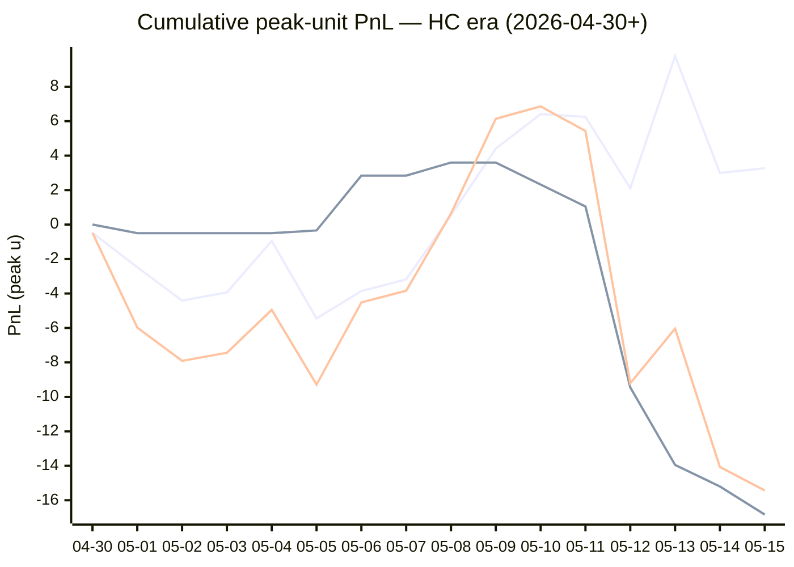

# Sharp Intel v6 — Daily Master Report

_Auto-generated **5/16/2026, 10:09:24 AM ET** by `scripts/dailyV6Report.js`. Do not edit by hand._

**Source of truth: this report mirrors the live Pick Performance dashboard.** Inclusion = `lockStage ≠ SHADOW ∧ ¬superseded ∧ health ∉ {MUTED, CANCELLED} ∧ peak.stars ≥ 2.5`. PnL is in **peak units** (the size shipped to users). HC margin / Δw / Δq are the **frozen** stamps written at last sync before the T-15 freeze. HC margin only existed from the v7.1 launch (**2026-04-30**); pre-launch picks have no HC value (no retro-fitting). Nothing is recomputed against today's whitelist.

v6 cutover: **2026-04-18** · whitelist source: live `sharpWalletProfiles` (181 profiles — drives §5 roster snapshot only) · quality cut: contribution ≥ 30 · HC = CONFIRMED tier ∧ sizeRatio ≥ 1.5.

---
## §1. Yesterday's picks

Slate: **2026-05-15** · 8 shipped sides.

| N | W-L-P | WR% | PnL (peak u) | PnL (flat 1u) |
|---|---|---|---|---|
| 8 | 4-4-0 | 50.0% | -1.36u | -0.26u |

| Sport | Market | Matchup | Pick | Stars · Units | HC | Δw | Δq | Σ | Odds | Result | PnL (peak u) |
|---|---|---|---|---|---|---|---|---|---|---|---|
| MLB | ML | Chicago Cubs @ Chicago White Sox | Chicago White Sox | 4.0★ · 2.50u | +0 | +0 | -2 | -2 | +128 | L | -2.50u |
| MLB | ML | Los Angeles Dodgers @ Los Angeles Angels | Los Angeles Dodgers | 4.0★ · 2.75u | +1 | +2 | +1 | +3 | -211 | **W** | +1.25u |
| MLB | ML | San Francisco Giants @ Athletics | San Francisco Giants | 3.0★ · 1.25u | +1 | +0 | +0 | +0 | +115 | L | -1.25u |
| MLB | TOTAL | Boston Red Sox @ Atlanta Braves | Under 10.5 | 2.5★ · 0.30u | +1 | +1 | +3 | +4 | -110 | **W** | +0.27u |
| NBA | ML | Pistons @ Cavaliers | Pistons | 2.5★ · 0.50u | +1 | +6 | +9 | +15 | +145 | **W** | +0.75u |
| NBA | SPREAD | Spurs @ Timberwolves | Timberwolves | 2.5★ · 1.00u | +0 | +1 | +1 | +2 | -105 | L | -1.00u |
| NBA | TOTAL | Pistons @ Cavaliers | Over 210.5 | 4.0★ · 0.75u | +1 | +0 | +3 | +3 | -109 | L | -0.75u |
| NBA | TOTAL | Spurs @ Timberwolves | Over 218.5 | 5.0★ · 2.00u | +0 | +1 | +1 | +2 | -110 | **W** | +1.87u |

---
## §2. 3-day / 7-day / all-time cohort rollups

Shipped picks only. PnL in **peak units** (size we actually bet) and flat 1u (cohort EV lens). All margins are the engine's frozen stamps (`v8_hcMargin`, `v8_walletConsensusDelta`, `v8_walletConsensusQualityMargin`).

**HC margin sub-tables** are scoped to picks dated ≥ 2026-04-30 (the v7.1 launch — when HC margin became a real engine signal). Pre-launch picks are excluded from HC analysis since the feature didn't exist for them. Δw / Δq sub-tables span the full v6-era sample (≥ 2026-04-18). Empty buckets are dropped.

### §2a. 3-day

Total: **19** shipped · 9-10-0 · WR 47.4% · PnL -6.22u (peak) / -1.67u (flat).

**By HC margin** _(picks dated ≥ 2026-04-30, N = 19)_

| Bucket | N | W-L-P | WR% | PnL (peak u) | PnL (flat 1u) |
|---|---|---|---|---|---|
| HC = +2 | 2 | 1-1-0 | 50.0% | -0.07u | -0.01u |
| HC = +1 | 12 | 7-5-0 | 58.3% | +1.23u | +1.43u |
| HC = 0 | 5 | 1-4-0 | 20.0% | -7.38u | -3.09u |

**By Δw (winner margin)**

| Bucket | N | W-L-P | WR% | PnL (peak u) | PnL (flat 1u) |
|---|---|---|---|---|---|
| ≥ +3 | 6 | 2-4-0 | 33.3% | -11.82u | -1.56u |
| +2 | 2 | 1-1-0 | 50.0% | +0.00u | -0.53u |
| +1 | 7 | 5-2-0 | 71.4% | +8.39u | +2.54u |
| 0 | 4 | 1-3-0 | 25.0% | -2.79u | -2.12u |

**By Δq (quality margin)**

| Bucket | N | W-L-P | WR% | PnL (peak u) | PnL (flat 1u) |
|---|---|---|---|---|---|
| ≥ +3 | 9 | 5-4-0 | 55.6% | -2.71u | +1.01u |
| +2 | 2 | 0-2-0 | 0.0% | -8.00u | -2.00u |
| +1 | 4 | 2-2-0 | 50.0% | +1.63u | -0.62u |
| 0 | 1 | 0-1-0 | 0.0% | -1.25u | -1.00u |
| −1 | 2 | 2-0-0 | 100.0% | +6.61u | +1.94u |
| ≤ −2 | 1 | 0-1-0 | 0.0% | -2.50u | -1.00u |

**By AGS tier** _(picks dated ≥ 2026-05-05, N = 19)_

| Bucket | N | W-L-P | WR% | PnL (peak u) | PnL (flat 1u) |
|---|---|---|---|---|---|
| LOCK   (+5 .. +7) | 1 | 0-1-0 | 0.0% | -3.50u | -1.00u |
| STRONG (+3 .. +5) | 5 | 3-2-0 | 60.0% | -0.88u | +0.29u |
| NEUT   (0 .. +3) | 8 | 3-5-0 | 37.5% | -2.98u | -2.22u |
| WEAK   (−1 .. 0) | 1 | 1-0-0 | 100.0% | +0.75u | +1.45u |
| FADE   (< −1) | 4 | 2-2-0 | 50.0% | +0.39u | -0.18u |

### §2b. 7-day

Total: **42** shipped · 20-22-0 · WR 47.6% · PnL -16.07u (peak) / -3.30u (flat).

**By HC margin** _(picks dated ≥ 2026-04-30, N = 42)_

| Bucket | N | W-L-P | WR% | PnL (peak u) | PnL (flat 1u) |
|---|---|---|---|---|---|
| HC ≥ +3 | 1 | 0-1-0 | 0.0% | -3.50u | -1.00u |
| HC = +2 | 5 | 2-3-0 | 40.0% | -3.30u | -1.10u |
| HC = +1 | 24 | 16-8-0 | 66.7% | +9.53u | +6.93u |
| HC = 0 | 11 | 1-10-0 | 9.1% | -20.43u | -9.09u |

**By Δw (winner margin)**

| Bucket | N | W-L-P | WR% | PnL (peak u) | PnL (flat 1u) |
|---|---|---|---|---|---|
| ≥ +3 | 12 | 4-8-0 | 33.3% | -21.31u | -4.38u |
| +2 | 9 | 2-7-0 | 22.2% | -7.47u | -5.56u |
| +1 | 15 | 11-4-0 | 73.3% | +12.36u | +6.46u |
| 0 | 5 | 2-3-0 | 40.0% | -1.28u | -0.78u |
| missing | 1 | 1-0-0 | 100.0% | +1.63u | +0.96u |

**By Δq (quality margin)**

| Bucket | N | W-L-P | WR% | PnL (peak u) | PnL (flat 1u) |
|---|---|---|---|---|---|
| ≥ +3 | 17 | 7-10-0 | 41.2% | -18.02u | -3.76u |
| +2 | 3 | 1-2-0 | 33.3% | -4.73u | -1.09u |
| +1 | 9 | 5-4-0 | 55.6% | +0.85u | +0.23u |
| 0 | 8 | 3-5-0 | 37.5% | -0.63u | -1.23u |
| −1 | 4 | 4-0-0 | 100.0% | +8.96u | +3.55u |
| ≤ −2 | 1 | 0-1-0 | 0.0% | -2.50u | -1.00u |

**By AGS tier** _(picks dated ≥ 2026-05-05, N = 42)_

| Bucket | N | W-L-P | WR% | PnL (peak u) | PnL (flat 1u) |
|---|---|---|---|---|---|
| LOCK   (+5 .. +7) | 4 | 2-2-0 | 50.0% | -6.05u | -0.78u |
| STRONG (+3 .. +5) | 13 | 9-4-0 | 69.2% | +2.49u | +3.53u |
| NEUT   (0 .. +3) | 17 | 4-13-0 | 23.5% | -14.79u | -8.62u |
| WEAK   (−1 .. 0) | 2 | 1-1-0 | 50.0% | -1.25u | +0.45u |
| FADE   (< −1) | 5 | 3-2-0 | 60.0% | +1.90u | +1.16u |
| missing | 1 | 1-0-0 | 100.0% | +1.63u | +0.96u |

### §2c. All-time

Total: **189** shipped · 89-98-2 · WR 47.6% · PnL -27.66u (peak) / -10.21u (flat).

**By HC margin** _(picks dated ≥ 2026-04-30, N = 78)_

| Bucket | N | W-L-P | WR% | PnL (peak u) | PnL (flat 1u) |
|---|---|---|---|---|---|
| HC ≥ +3 | 1 | 0-1-0 | 0.0% | -3.50u | -1.00u |
| HC = +2 | 7 | 4-3-0 | 57.1% | +3.43u | +0.82u |
| HC = +1 | 47 | 27-20-0 | 57.4% | +3.34u | +6.31u |
| HC = 0 | 20 | 7-12-1 | 36.8% | -16.83u | -5.55u |
| HC ≤ −1 | 2 | 0-2-0 | 0.0% | -3.50u | -2.00u |

**By Δw (winner margin)**

| Bucket | N | W-L-P | WR% | PnL (peak u) | PnL (flat 1u) |
|---|---|---|---|---|---|
| ≥ +3 | 38 | 22-16-0 | 57.9% | -0.71u | +9.32u |
| +2 | 41 | 16-25-0 | 39.0% | -17.51u | -8.49u |
| +1 | 64 | 36-27-1 | 57.1% | +8.90u | +5.92u |
| 0 | 32 | 10-21-1 | 32.3% | -16.23u | -11.87u |
| −1 | 7 | 1-6-0 | 14.3% | -5.60u | -4.94u |
| ≤ −2 | 1 | 0-1-0 | 0.0% | -0.50u | -1.00u |
| missing | 6 | 4-2-0 | 66.7% | +3.99u | +0.85u |

**By Δq (quality margin)**

| Bucket | N | W-L-P | WR% | PnL (peak u) | PnL (flat 1u) |
|---|---|---|---|---|---|
| ≥ +3 | 71 | 33-36-2 | 47.8% | -20.53u | -1.91u |
| +2 | 44 | 20-24-0 | 45.5% | -13.75u | -3.28u |
| +1 | 45 | 22-23-0 | 48.9% | +1.08u | -3.25u |
| 0 | 16 | 5-11-0 | 31.3% | -3.84u | -5.05u |
| −1 | 4 | 4-0-0 | 100.0% | +8.96u | +3.55u |
| ≤ −2 | 3 | 1-2-0 | 33.3% | -2.82u | -1.04u |
| missing | 6 | 4-2-0 | 66.7% | +3.24u | +0.77u |

**By AGS tier** _(picks dated ≥ 2026-05-05, N = 53)_

| Bucket | N | W-L-P | WR% | PnL (peak u) | PnL (flat 1u) |
|---|---|---|---|---|---|
| ELITE  (≥ +7) | 1 | 1-0-0 | 100.0% | +3.18u | +0.95u |
| LOCK   (+5 .. +7) | 6 | 4-2-0 | 66.7% | +0.68u | +1.14u |
| STRONG (+3 .. +5) | 15 | 11-4-0 | 73.3% | +4.84u | +5.95u |
| NEUT   (0 .. +3) | 22 | 6-16-0 | 27.3% | -20.96u | -9.83u |
| WEAK   (−1 .. 0) | 2 | 1-1-0 | 50.0% | -1.25u | +0.45u |
| FADE   (< −1) | 6 | 3-3-0 | 50.0% | +1.40u | +0.16u |
| missing | 1 | 1-0-0 | 100.0% | +1.63u | +0.96u |

---
## §3. Edge over time — is HC margin creating winners?

Daily cumulative peak-unit PnL since the HC margin launch (**2026-04-30**). The `HC ≥ +1` line is the golden-standard cohort. The `HC = 0` line is the no-HC-signal control. The `All shipped (HC era)` line is every shipped pick from the same date range — the apples-to-apples baseline. Watch the spread.

Daily cumulative table (peak units, HC era only):

| Date | HC ≥ +1 (cum) | HC = 0 (cum) | All shipped (cum) |
|---|---|---|---|
| 2026-04-30 | -0.48u | +0.00u | -0.48u |
| 2026-05-01 | -2.48u | -0.50u | -5.98u |
| 2026-05-02 | -4.41u | -0.50u | -7.91u |
| 2026-05-03 | -3.94u | -0.50u | -7.44u |
| 2026-05-04 | -0.95u | -0.50u | -4.95u |
| 2026-05-05 | -5.45u | -0.34u | -9.29u |
| 2026-05-06 | -3.86u | +2.84u | -4.52u |
| 2026-05-07 | -3.18u | +2.84u | -3.84u |
| 2026-05-08 | +0.54u | +3.60u | +0.64u |
| 2026-05-09 | +4.41u | +3.60u | +6.14u |
| 2026-05-10 | +6.41u | +2.32u | +6.86u |
| 2026-05-11 | +6.25u | +1.05u | +5.43u |
| 2026-05-12 | +2.11u | -9.45u | -9.21u |
| 2026-05-13 | +9.78u | -13.95u | -6.04u |
| 2026-05-14 | +3.00u | -15.20u | -14.07u |
| 2026-05-15 | +3.27u | -16.83u | -15.43u |

---
## §4. Wallet roster growth & profitability

"Tracked in sport X" = a wallet has placed **≥ 2 bets** in X within the v6-era sample. "Profitable" = cumulative flat PnL > 0. Source: `v8Scoring.walletDetails` on every graded v6-era game (every side, not just the shipped set).

### §4a. Per-sport wallet snapshot

| Sport | Total wallets seen | Tracked (≥2) | Profitable | % prof | WR ≥ 50% | WR ≥ 60% | WR ≥ 70% |
|---|---|---|---|---|---|---|---|
| MLB | 49 | 30 | 10 | 33% | 14 | 5 | 1 |
| NBA | 120 | 88 | 39 | 44% | 52 | 26 | 14 |
| NHL | 45 | 28 | 12 | 43% | 19 | 7 | 5 |
| **ALL (any sport)** | **140** | **103** | **41** | **40%** | **57** | **27** | **13** |

### §4b. Daily roster growth (cumulative through each date)

Format: `tracked (profitable)`. For each date D, recompute the roster using every bet up to and including D.

| Date | ALL | MLB | NBA | NHL |
|---|---|---|---|---|
| 2026-04-18 | 5 (2) | 2 (2) | 3 (0) | 0 (0) |
| 2026-04-19 | 19 (8) | 5 (3) | 9 (3) | 3 (1) |
| 2026-04-20 | 29 (12) | 7 (6) | 23 (8) | 5 (2) |
| 2026-04-21 | 44 (21) | 10 (6) | 31 (10) | 7 (5) |
| 2026-04-22 | 52 (28) | 12 (6) | 39 (15) | 11 (10) |
| 2026-04-23 | 56 (29) | 13 (6) | 46 (21) | 13 (10) |
| 2026-04-24 | 61 (30) | 14 (6) | 51 (23) | 14 (9) |
| 2026-04-25 | 65 (29) | 16 (8) | 54 (22) | 16 (9) |
| 2026-04-26 | 67 (31) | 18 (5) | 56 (25) | 17 (9) |
| 2026-04-27 | 72 (32) | 20 (7) | 60 (24) | 17 (9) |
| 2026-04-28 | 76 (33) | 21 (7) | 63 (26) | 23 (10) |
| 2026-04-29 | 77 (33) | 21 (7) | 64 (25) | 23 (10) |
| 2026-04-30 | 81 (34) | 21 (7) | 70 (27) | 23 (10) |
| 2026-05-01 | 85 (38) | 22 (5) | 74 (30) | 26 (13) |
| 2026-05-02 | 86 (37) | 23 (7) | 75 (32) | 26 (12) |
| 2026-05-03 | 86 (38) | 24 (8) | 75 (33) | 26 (12) |
| 2026-05-04 | 90 (38) | 24 (9) | 76 (32) | 26 (12) |
| 2026-05-05 | 91 (40) | 24 (9) | 79 (33) | 26 (12) |
| 2026-05-06 | 92 (40) | 24 (9) | 80 (33) | 26 (12) |
| 2026-05-07 | 92 (41) | 24 (9) | 80 (33) | 26 (12) |
| 2026-05-08 | 92 (40) | 24 (8) | 80 (32) | 26 (11) |
| 2026-05-09 | 94 (42) | 24 (8) | 82 (35) | 26 (11) |
| 2026-05-10 | 94 (42) | 24 (8) | 82 (35) | 26 (11) |
| 2026-05-11 | 96 (42) | 24 (8) | 84 (36) | 26 (11) |
| 2026-05-12 | 100 (41) | 27 (9) | 86 (37) | 26 (11) |
| 2026-05-13 | 102 (45) | 29 (11) | 88 (37) | 26 (11) |
| 2026-05-14 | 102 (41) | 29 (11) | 88 (37) | 28 (12) |
| 2026-05-15 | 103 (41) | 30 (10) | 88 (39) | 28 (12) |

### §4c. Top 10 profitable wallets by sport

#### MLB

| # | Wallet | N | W | L | WR% | Flat PnL (u) | Flat ROI | $ PnL |
|---|---|---|---|---|---|---|---|---|
| 1 | c289a0 | 3 | 3 | 0 | 100.0% | +2.87 | +95.6% | $1.5K |
| 2 | c668b3 | 3 | 2 | 1 | 66.7% | +1.16 | +38.7% | $4.0K |
| 3 | 70135d | 5 | 3 | 2 | 60.0% | +1.57 | +31.4% | $22.1K |
| 4 | 981187 | 8 | 5 | 3 | 62.5% | +1.65 | +20.7% | $13.5K |
| 5 | dcafd2 | 15 | 9 | 6 | 60.0% | +2.64 | +17.6% | $19.9K |
| 6 | 8ec926 | 4 | 2 | 2 | 50.0% | +0.29 | +7.2% | $6.0K |
| 7 | 0f9d74 | 7 | 4 | 3 | 57.1% | +0.48 | +6.9% | $1.9K |
| 8 | 4c64aa | 49 | 28 | 21 | 57.1% | +2.54 | +5.2% | $1.1K |
| 9 | fcc12b | 30 | 16 | 14 | 53.3% | +1.19 | +4.0% | $29.6K |
| 10 | b05143 | 10 | 5 | 5 | 50.0% | +0.27 | +2.7% | $26.2K |

#### NBA

| # | Wallet | N | W | L | WR% | Flat PnL (u) | Flat ROI | $ PnL |
|---|---|---|---|---|---|---|---|---|
| 1 | 799fad | 2 | 2 | 0 | 100.0% | +5.66 | +283.0% | $241.7K |
| 2 | b51a56 | 5 | 5 | 0 | 100.0% | +6.44 | +128.9% | $74.8K |
| 3 | 4a9953 | 2 | 2 | 0 | 100.0% | +2.16 | +108.2% | $3.7K |
| 4 | 2e8da5 | 9 | 8 | 1 | 88.9% | +9.06 | +100.7% | $144.0K |
| 5 | 8ec926 | 5 | 5 | 0 | 100.0% | +4.60 | +92.0% | $8.5K |
| 6 | 12ad50 | 3 | 3 | 0 | 100.0% | +2.74 | +91.3% | $45.5K |
| 7 | 769c38 | 8 | 8 | 0 | 100.0% | +7.20 | +90.0% | $62.9K |
| 8 | 11b032 | 7 | 6 | 1 | 85.7% | +5.40 | +77.1% | $249.9K |
| 9 | 7f00bc | 14 | 10 | 4 | 71.4% | +9.67 | +69.1% | $15.7K |
| 10 | 7703d4 | 11 | 10 | 1 | 90.9% | +7.21 | +65.5% | $32.7K |

#### NHL

| # | Wallet | N | W | L | WR% | Flat PnL (u) | Flat ROI | $ PnL |
|---|---|---|---|---|---|---|---|---|
| 1 | 981187 | 5 | 5 | 0 | 100.0% | +5.03 | +100.6% | $30.3K |
| 2 | 799fad | 2 | 2 | 0 | 100.0% | +1.88 | +94.1% | $46.9K |
| 3 | fcc12b | 7 | 6 | 1 | 85.7% | +3.91 | +55.9% | $70.1K |
| 4 | 30935c | 4 | 3 | 1 | 75.0% | +2.11 | +52.7% | $953 |
| 5 | e70853 | 7 | 5 | 2 | 71.4% | +3.17 | +45.2% | $2.2K |
| 6 | bc3532 | 11 | 6 | 5 | 54.5% | +2.68 | +24.4% | -$34.0K |
| 7 | c5cea1 | 3 | 2 | 1 | 66.7% | +0.62 | +20.7% | $22.1K |
| 8 | dcafd2 | 2 | 1 | 1 | 50.0% | +0.40 | +20.0% | $4.9K |
| 9 | 6b853d | 6 | 4 | 2 | 66.7% | +1.13 | +18.8% | $7.7K |
| 10 | 12192c | 6 | 3 | 3 | 50.0% | +0.80 | +13.3% | $136.2K |

---
## §5. Proven-wallet roster growth & HC tracking

"Proven wallet" = whitelist tier `CONFIRMED` or `FLAT` in the same sense the live engine uses (`exportWalletProfiles.js` → `sharpWalletProfiles.bySport`). Sports inherit independent rosters: a wallet can be CONFIRMED in NBA and absent from NHL. `walletBets` come from `v8Scoring.walletDetails` on every graded v6-era pick (Source A); `positionRows` come from `sharp_action_positions` (Source B).

### §5a. Current proven-winner roster (snapshot)

Roster as of **2026-05-15** — wallets with ≥2 bets in the sport.

| Sport | Wallets seen | Eligible (≥2) | CONFIRMED | FLAT | Proven (C+F) | WR50 only | Conv % |
|---|---|---|---|---|---|---|---|
| MLB | 83 | 30 | 6 | 4 | **10** | 4 | 12.0% |
| NBA | 166 | 88 | 25 | 14 | **39** | 19 | 23.5% |
| NHL | 75 | 28 | 9 | 3 | **12** | 7 | 16.0% |
| **ALL** | **—** | **—** | **—** | **—** | **61** | **—** | **—** |

### §5b. Live whitelist drift check

Live `sharpWalletProfiles` is what the engine reads at lock time. Drift between script reconstruction (above) and live should be ≤ 1 day of position data — otherwise `exportWalletProfiles.js` is stale.

| Sport | CONFIRMED (live · script) | FLAT (live · script) | WR50 (live · script) | Drift |
|---|---|---|---|---|
| MLB | 15 · 6 | 7 · 4 | 2 · 4 | +12 live |
| NBA | 41 · 25 | 16 · 14 | 19 · 19 | +18 live |
| NHL | 14 · 9 | 4 · 3 | 6 · 7 | +6 live |

### §5c. Roster growth — 3d / 7d / 30d / all-time deltas

Each cell is **net growth** in proven (CONFIRMED + FLAT) wallets in that window, with the absolute count at the start (`+Δ from N`). Negative = wallets demoted. Window endpoint = 2026-05-15.

| Sport | 3-day | 7-day | 30-day | All-time (since cutover) |
|---|---|---|---|---|
| MLB | +1 from 9 | +2 from 8 | +10 from 0 | +10 from 0 |
| NBA | +2 from 37 | +7 from 32 | +39 from 0 | +39 from 0 |
| NHL | +1 from 11 | +1 from 11 | +12 from 0 | +12 from 0 |

A flat 7-day delta on a sport with healthy slate density = either the bubble pipeline has stalled (no wallets approaching the bar) or our cohort has saturated. Check §13d for the funnel diagnostic.

### §5d. Pipeline funnel — where each sport leaks

Wallets surviving each gate, in order. The biggest %-drop tells you the bottleneck. Gates:

1. **Seen** — placed ≥ 1 bet in the sport (any source)
2. **Eligible** — ≥ 2 graded picks in Source A (required for FLAT/CONFIRMED)
3. **Flat-OK** — eligible AND flat ROI > 0 (becomes FLAT or better)
4. **$-OK** — Flat-OK AND ≥2 positions with dollar ROI > 0 (CONFIRMED)
5. **Promoted** — final whitelisted = CONFIRMED + FLAT

| Sport | 1·Seen | 2·Eligible (% of Seen) | 3·Flat-OK (% of Elig) | 4·$-OK (% of Flat) | 5·Promoted | Bottleneck |
|---|---|---|---|---|---|---|
| MLB | 83 | 30 (36%) | 10 (33%) | 6 (60%) | **10** | edge (Eligible→Flat-OK) 67% |
| NBA | 166 | 88 (53%) | 39 (44%) | 25 (64%) | **39** | edge (Eligible→Flat-OK) 56% |
| NHL | 75 | 28 (37%) | 12 (43%) | 9 (75%) | **12** | sample (Seen→Eligible) 63% |

### §5e. HC backing density (the fuel for v7.3 HC margin)

Every v7.x promotion is gated on `HC_m ≥ +1`, which requires at least one CONFIRMED wallet sized at `≥ 1.5×` average on the for-side. This table shows the share of shipped picks that *had any HC backing*, by sport, in each window. If HC density falls toward zero in a sport, the v7.3 floor cohorts (Σ=1, Σ=2 locks; HC rescues) will simply stop firing there.

| Sport | Window | Picks (with HC stamp) | Any HC for-side | HC_m ≥ +1 | HC_m ≥ +2 |
|---|---|---|---|---|---|
| MLB | 3-day | 11 | 9 (81.8%) | 9 (81.8%) | 1 (9.1%) |
| MLB | 7-day | 23 | 16 (69.6%) | 16 (69.6%) | 1 (4.3%) |
| MLB | All-time | 69 | 34 (49.3%) | 33 (47.8%) | 3 (4.3%) |
| NBA | 3-day | 6 | 4 (66.7%) | 3 (50.0%) | 1 (16.7%) |
| NBA | 7-day | 14 | 12 (85.7%) | 11 (78.6%) | 5 (35.7%) |
| NBA | All-time | 90 | 51 (56.7%) | 44 (48.9%) | 17 (18.9%) |
| NHL | 3-day | 2 | 2 (100.0%) | 2 (100.0%) | 0 (0.0%) |
| NHL | 7-day | 5 | 4 (80.0%) | 4 (80.0%) | 1 (20.0%) |
| NHL | All-time | 24 | 9 (37.5%) | 8 (33.3%) | 1 (4.2%) |

Pooled across sports:

| Window | Picks (with HC stamp) | Any HC for-side | HC_m ≥ +1 | HC_m ≥ +2 |
|---|---|---|---|---|
| 3-day | 19 | 15 (78.9%) | 14 (73.7%) | 2 (10.5%) |
| 7-day | 42 | 32 (76.2%) | 31 (73.8%) | 7 (16.7%) |
| All-time | 183 | 94 (51.4%) | 85 (46.4%) | 21 (11.5%) |

### §5f. Bubble wallets — next-up graduations

Wallets currently NOT promoted but close. Two flavors:

- **One-bet-away** — won the only bet, needs one more positive bet to clear ≥2.
- **Just-under** — has ≥2 bets but flat ROI is between −10% and 0% (one win flips them).

#### MLB

**One-bet-away** (5)

| wallet | picksN | flat PnL | pos N | pos $ROI |
|---|---|---|---|---|
| `...0232` | 1 | +0.91 | 7 | 93% |
| `...be00` | 1 | +0.87 | 9 | 21% |
| `...a240` | 1 | +0.87 | 7 | 83% |
| `...9373` | 1 | +0.87 | 0 | — |
| `...8d26` | 1 | +0.72 | 5 | -22% |

**Just-under** (5)

| wallet | picksN | WR | flat ROI | pos N | pos $ROI |
|---|---|---|---|---|---|
| `...9a27` | 47 | 51% | -0.5% | 207 | 20% |
| `...fc82` | 14 | 50% | -1.7% | 47 | -28% |
| `...23c4` | 6 | 50% | -2.5% | 72 | -35% |
| `...2f63` | 71 | 49% | -3.3% | 291 | -11% |
| `...017f` | 10 | 50% | -3.7% | 36 | -8% |

#### NBA

**One-bet-away** (6)

| wallet | picksN | flat PnL | pos N | pos $ROI |
|---|---|---|---|---|
| `...bf5d` | 1 | +3.15 | 3 | 42% |
| `...ed41` | 1 | +3.15 | 3 | 3% |
| `...6b87` | 1 | +2.05 | 8 | -27% |
| `...9d74` | 1 | +0.93 | 16 | -51% |
| `...c556` | 1 | +0.93 | 3 | 42% |
| `...5c69` | 1 | +0.91 | 2 | 28% |

**Just-under** (6)

| wallet | picksN | WR | flat ROI | pos N | pos $ROI |
|---|---|---|---|---|---|
| `...d814` | 8 | 50% | -0.5% | 45 | -19% |
| `...2f63` | 68 | 49% | -1.5% | 208 | -9% |
| `...f5b0` | 20 | 50% | -3.7% | 57 | -28% |
| `...1fc6` | 4 | 50% | -3.7% | 9 | 17% |
| `...1f17` | 2 | 50% | -4.5% | 3 | -5% |
| `...4582` | 2 | 50% | -6.5% | 2 | -2% |

#### NHL

**One-bet-away** (6)

| wallet | picksN | flat PnL | pos N | pos $ROI |
|---|---|---|---|---|
| `...2e78` | 1 | +1.46 | 0 | — |
| `...017f` | 1 | +1.45 | 3 | 106% |
| `...c67e` | 1 | +1.42 | 19 | 8% |
| `...32f2` | 1 | +1.40 | 0 | — |
| `...e0fd` | 1 | +1.20 | 3 | 124% |
| `...266e` | 1 | +1.05 | 0 | — |

**Just-under** (5)

| wallet | picksN | WR | flat ROI | pos N | pos $ROI |
|---|---|---|---|---|---|
| `...33ee` | 4 | 50% | -0.3% | 8 | -23% |
| `...618e` | 2 | 50% | -6.1% | 28 | 24% |
| `...68b3` | 4 | 50% | -8.5% | 11 | 57% |
| `...3782` | 2 | 50% | -9.0% | 20 | 27% |
| `...d227` | 2 | 50% | -9.0% | 16 | 19% |

### §5g. v2 wallet-promotion pipeline (Source-A / Source-B mix)

Live snapshot of the v2 promotion gate (shipped 2026-05-10, re-eval **2026-05-24**). Each FLAT-or-better wallet × sport pair is attributed to one of three paths via `sharpWalletProfiles[wallet].bySport[sport].whitelistSource`:

- **A** — flat-positive on featured picks (Source A) only — the v1 gate
- **A+B** — flat-positive in both sources (most reliable signal)
- **B** — flat-positive on-chain only (NEW in v2 — the trial lift)

Re-classified every 2h via `grade-sharp-actions` cron. Roll-back: set `B_ONLY_MIN_BETS = Infinity` in `scripts/exportWalletProfiles.js`.

#### Source mix per sport (live Firestore)

| Sport | A | A+B | B (new) | FLAT-or-better total | % from B-only |
|---|---|---|---|---|---|
| MLB | 4 | 4 | **14** | 22 | 63.6% |
| NBA | 17 | 19 | **21** | 57 | 36.8% |
| NHL | 5 | 6 | **7** | 18 | 38.9% |
| **ALL** | **26** | **29** | **42** | **97** | **43.3%** |

#### Pipeline freshness

- `sharp_action_positions` GRADED rows: **5863**
- `sharp_action_positions` PENDING rows: **81** (queued for next Grade Sharp Actions run)
- Latest `sharpWalletProfiles` rebuild: 5/12/2026, 5:34:36 AM ET — **6035 min · STALE** — check grade-sharp-actions workflow

**Alarms**: pending > 200 OR rebuild lag > 4h → cron is lagging or failing — check `gh run list --workflow="Grade Sharp Actions"`.

#### B-only roster — wallets currently promoted via Source B path only

Wallets here would have been EXCLUDED under v1 (Source-A-only). Top by Source-B bet count per sport. The 2-week re-eval (2026-05-24) will compare these wallets' realized lift against A-only and A+B cohorts.

**MLB** — 14 wallets promoted via B

| wallet | tier | B_n | B_flat ROI | B_$ ROI |
|---|---|---|---|---|
| `...9a27` | CONFIRMED | 171 | +17.8% | +7.9% |
| `...1eae` | CONFIRMED | 32 | +4.3% | +0.1% |
| `...5143` | CONFIRMED | 31 | +17.9% | +19.7% |
| `...d6d2` | FLAT | 16 | +9.2% | -1.6% |
| `...0ff5` | FLAT | 13 | +1.8% | -23.5% |
| `...a9cc` | CONFIRMED | 8 | +6.3% | +0.3% |
| `...9d74` | CONFIRMED | 7 | +24.2% | +43.8% |
| `...aeeb` | CONFIRMED | 7 | +35.4% | +37.5% |
| `...2768` | CONFIRMED | 7 | +97.4% | +105.9% |
| `...35e3` | CONFIRMED | 6 | +29.9% | +35.5% |
| … | 4 more | | | |

**NBA** — 21 wallets promoted via B

| wallet | tier | B_n | B_flat ROI | B_$ ROI |
|---|---|---|---|---|
| `...2f63` | CONFIRMED | 162 | +1.4% | +2.3% |
| `...1eae` | CONFIRMED | 59 | +5.3% | +14.3% |
| `...3782` | CONFIRMED | 47 | +18.5% | +13.3% |
| `...11a4` | CONFIRMED | 31 | +44.9% | +36.7% |
| `...935c` | FLAT | 29 | +62.5% | -22.6% |
| `...68b3` | CONFIRMED | 16 | +28.5% | +18.4% |
| `...1697` | CONFIRMED | 15 | +14.1% | +29.5% |
| `...abaf` | CONFIRMED | 15 | +38.8% | +14.6% |
| `...2db4` | CONFIRMED | 13 | +4.9% | +3.3% |
| `...89a0` | FLAT | 13 | +38.5% | -14.4% |
| … | 11 more | | | |

**NHL** — 7 wallets promoted via B

| wallet | tier | B_n | B_flat ROI | B_$ ROI |
|---|---|---|---|---|
| `...3782` | CONFIRMED | 18 | +17.5% | +26.7% |
| `...df91` | FLAT | 17 | +9.2% | -15% |
| `...b33b` | CONFIRMED | 12 | +12% | +1.6% |
| `...23c4` | CONFIRMED | 10 | +19.9% | +27.4% |
| `...9ef0` | FLAT | 9 | +0.7% | -4.2% |
| `...68b3` | CONFIRMED | 9 | +20.6% | +63.3% |
| `...a9cc` | CONFIRMED | 7 | +49.5% | +46.9% |

### §5 — How to read

- **Roster growth flat in 7-day** + **funnel bottleneck = `data`** → re-run `exportWalletProfiles.js`. The flat-positive wallets are stuck at FLAT because Source-B coverage hasn't caught up. CONFIRMED gate is data-bound, not skill-bound.
- **Roster growth flat in 7-day** + **funnel bottleneck = `sample`** → wallets aren't reaching `≥2` reps fast enough. This is a slate-density problem; consider a soft `MIN_BETS = 1` shadow lane to surface bubble wallets earlier.
- **Roster shrank** (negative delta) → a previously CONFIRMED wallet just dropped flat-positive (lost a recent bet). Variance, not failure — but worth noting if a sport loses ≥3 in a week.
- **HC density on a sport drops below ~30%** → v7.3 promotions there will starve. Either the proven roster needs more CONFIRMED-tier wallets sizing aggressively, or the HC_RATIO (1.5) needs a sport-specific tune.
- **§5g B-only count drops sharply** → wallets are demoting off the B path (losing on-chain). Cross-check `WALLET_PROFILES_SUMMARY.md` churn section for the specific demotions.
- **§5g pipeline freshness lag > 4h** → grade-sharp-actions cron is failing. Check `gh run list --workflow="Grade Sharp Actions"` and re-trigger if needed.

---
## §6. Daily proven-wallet performance

Who on the proven roster is actually printing — yesterday's bets, the rolling leaderboard (`$ PnL`-ranked), current streaks, and per-sport volume. **Proven** = `CONFIRMED` ∪ `FLAT` per sport (the same gate that drives Δ_winner). A wallet only counts in a sport where it's on that sport's proven list.

### §6a. Yesterday's proven-wallet bets

Slate: **2026-05-15** · 43 bets · 20 distinct proven wallets · WR 58% · $ vol $721.5K · $ PnL $277.8K.

| Wallet | Sport | Market | Game | $ size | Result | $ PnL |
|---|---|---|---|---|---|---|
| `...2ca8` (CONFIRMED) | NBA | ML | Pistons @ Cavaliers | $162.5K | **W** | $243.8K |
| `...66f5` (FLAT) | NBA | ML | Pistons @ Cavaliers | $36.5K | **W** | $54.7K |
| `...e8f1` (FLAT) | NBA | ML | Spurs @ Timberwolves | $96.3K | **W** | $42.8K |
| `...d96a` (FLAT) | NBA | ML | Pistons @ Cavaliers | $20.6K | **W** | $30.9K |
| `...64aa` (CONFIRMED) | MLB | ML | New York Yankees @ New York Mets | $36.1K | **W** | $25.8K |
| `...64aa` (CONFIRMED) | MLB | ML | Los Angeles Dodgers @ Los Angeles Angels | $41.6K | **W** | $18.9K |
| `...d96a` (FLAT) | NBA | SPREAD | Pistons @ Cavaliers | $16.7K | **W** | $16.3K |
| `...2ca8` (CONFIRMED) | NBA | ML | Spurs @ Timberwolves | $33.5K | **W** | $14.9K |
| `...03d4` (FLAT) | NBA | ML | Pistons @ Cavaliers | $5.0K | **W** | $7.5K |
| `...9ef0` (FLAT) | NBA | SPREAD | Pistons @ Cavaliers | $5.7K | **W** | $5.5K |
| `...66f5` (FLAT) | NBA | ML | Spurs @ Timberwolves | $12.0K | **W** | $5.4K |
| `...64aa` (CONFIRMED) | MLB | ML | San Francisco Giants @ Athletics | $4.6K | **W** | $5.0K |
| `...00bc` (CONFIRMED) | NBA | ML | Pistons @ Cavaliers | $3.0K | **W** | $4.6K |
| `...9ef0` (FLAT) | NBA | ML | Pistons @ Cavaliers | $3.0K | **W** | $4.5K |
| `...935c` (FLAT) | NBA | ML | Pistons @ Cavaliers | $2.0K | **W** | $3.0K |
| `...9ef0` (FLAT) | NBA | ML | Spurs @ Timberwolves | $6.7K | **W** | $3.0K |
| `...3532` (FLAT) | NBA | TOTAL | Spurs @ Timberwolves | $2.4K | **W** | $2.2K |
| `...03d4` (FLAT) | NBA | ML | Spurs @ Timberwolves | $4.9K | **W** | $2.2K |
| `...65dd` (CONFIRMED) | NBA | SPREAD | Pistons @ Cavaliers | $1.8K | **W** | $1.8K |
| `...65dd` (CONFIRMED) | NBA | SPREAD | Spurs @ Timberwolves | $2.0K | **W** | $1.7K |
| `...935c` (FLAT) | NBA | ML | Spurs @ Timberwolves | $2.8K | **W** | $1.2K |
| `...9a27` (CONFIRMED) | NBA | TOTAL | Pistons @ Cavaliers | $766 | **W** | $730 |
| `...135d` (CONFIRMED) | MLB | ML | Chicago Cubs @ Chicago White Sox | $505 | **W** | $646 |
| `...df91` (FLAT) | NBA | ML | Pistons @ Cavaliers | $249 | **W** | $374 |
| `...df91` (FLAT) | NBA | ML | Spurs @ Timberwolves | $414 | **W** | $184 |
| `...9ef0` (FLAT) | NBA | SPREAD | Spurs @ Timberwolves | $0 | L | $0 |
| `...135d` (CONFIRMED) | MLB | TOTAL | Boston Red Sox @ Atlanta Braves | $391 | L | -$391 |
| `...0329` (CONFIRMED) | NBA | ML | Spurs @ Timberwolves | $826 | L | -$826 |
| `...65dd` (CONFIRMED) | NBA | TOTAL | Pistons @ Cavaliers | $1.3K | L | -$1.3K |
| `...b33b` (CONFIRMED) | NBA | SPREAD | Spurs @ Timberwolves | $2.4K | L | -$2.4K |
| `...3532` (FLAT) | NBA | TOTAL | Pistons @ Cavaliers | $2.5K | L | -$2.5K |
| `...c926` (CONFIRMED) | MLB | TOTAL | Boston Red Sox @ Atlanta Braves | $2.9K | L | -$2.9K |
| `...aeeb` (CONFIRMED) | NBA | ML | Spurs @ Timberwolves | $3.2K | L | -$3.2K |
| `...9a27` (CONFIRMED) | NBA | SPREAD | Spurs @ Timberwolves | $3.4K | L | -$3.4K |
| `...9a27` (CONFIRMED) | NBA | SPREAD | Pistons @ Cavaliers | $3.8K | L | -$3.8K |
| `...3532` (FLAT) | NBA | SPREAD | Spurs @ Timberwolves | $5.2K | L | -$5.2K |
| `...c12b` (FLAT) | MLB | ML | New York Yankees @ New York Mets | $5.5K | L | -$5.5K |
| `...d49f` (FLAT) | NBA | SPREAD | Pistons @ Cavaliers | $6.0K | L | -$6.0K |
| `...3532` (FLAT) | NBA | SPREAD | Pistons @ Cavaliers | $8.1K | L | -$8.1K |
| `...9a27` (CONFIRMED) | NBA | ML | Spurs @ Timberwolves | $8.9K | L | -$8.9K |
| `...3532` (FLAT) | NBA | ML | Pistons @ Cavaliers | $39.6K | L | -$39.6K |
| `...3532` (FLAT) | NBA | ML | Spurs @ Timberwolves | $41.8K | L | -$41.8K |
| `...9a27` (CONFIRMED) | NBA | ML | Pistons @ Cavaliers | $84.2K | L | -$84.2K |

### §6b. Proven-wallet leaderboard

Top 15 proven `(wallet × sport)` pairs per sport per horizon, ranked by **$ PnL** (the dollar-ROI lens). The 3-day board is the "who's on form right now" lens; the 7-day filters single-day variance; all-time is the proven-roster reference.

#### §6b-1. 3-day

**MLB** — 6 active proven wallets

| # | Wallet | Tier | Bets | WR% | Bets/day | Flat PnL (u) | Flat ROI | $ vol | $ PnL | $ ROI | Streak |
|---|---|---|---|---|---|---|---|---|---|---|---|
| 1 | `...64aa` | CONFIRMED | 7 | 71% | 2.3 | +1.94 | +28% | $154.3K | $53.3K | +35% | 3W |
| 2 | `...135d` | CONFIRMED | 5 | 60% | 1.7 | +1.57 | +31% | $21.3K | $22.1K | +104% | 1W |
| 3 | `...c926` | CONFIRMED | 3 | 67% | 1.0 | +1.29 | +43% | $12.7K | $7.3K | +58% | 1L |
| 4 | `...9d74` | FLAT | 5 | 80% | 2.5 | +2.48 | +50% | $6.8K | $4.1K | +60% | 1L |
| 5 | `...afd2` | CONFIRMED | 3 | 67% | 1.5 | +1.32 | +44% | $12.0K | -$7.3K | -61% | 1L |
| 6 | `...c12b` | FLAT | 6 | 50% | 2.0 | +0.01 | +0% | $144.8K | -$129.3K | -89% | 3L |

**NBA** — 18 active proven wallets

| # | Wallet | Tier | Bets | WR% | Bets/day | Flat PnL (u) | Flat ROI | $ vol | $ PnL | $ ROI | Streak |
|---|---|---|---|---|---|---|---|---|---|---|---|
| 1 | `...2ca8` | CONFIRMED | 3 | 100% | 1.0 | +2.53 | +84% | $263.3K | $298.3K | +113% | 3W |
| 2 | `...e8f1` | FLAT | 1 | 100% | 1.0 | +0.44 | +44% | $96.3K | $42.8K | +44% | 1W |
| 3 | `...66f5` | FLAT | 3 | 67% | 1.0 | +0.94 | +31% | $84.5K | $24.1K | +29% | 2W |
| 4 | `...9ef0` | FLAT | 4 | 75% | 4.0 | +1.92 | +48% | $15.4K | $13.0K | +85% | 1L |
| 5 | `...03d4` | FLAT | 3 | 100% | 1.0 | +2.81 | +94% | $12.3K | $11.8K | +96% | 3W |
| 6 | `...0853` | CONFIRMED | 1 | 100% | 1.0 | +0.87 | +87% | $13.0K | $11.3K | +87% | 1W |
| 7 | `...00bc` | CONFIRMED | 1 | 100% | 1.0 | +1.50 | +150% | $3.0K | $4.6K | +150% | 1W |
| 8 | `...935c` | FLAT | 3 | 67% | 1.0 | +0.94 | +31% | $6.7K | $2.3K | +35% | 2W |
| 9 | `...65dd` | CONFIRMED | 5 | 60% | 1.7 | +0.85 | +17% | $12.1K | $2.2K | +18% | 1W |
| 10 | `...df91` | FLAT | 3 | 100% | 1.0 | +2.53 | +84% | $912 | $704 | +77% | 3W |
| 11 | `...23c4` | CONFIRMED | 1 | 100% | 1.0 | +0.98 | +98% | $580 | $569 | +98% | 1W |
| 12 | `...0329` | CONFIRMED | 1 | 0% | 1.0 | -1.00 | -100% | $826 | -$826 | -100% | 1L |
| 13 | `...b33b` | CONFIRMED | 1 | 0% | 1.0 | -1.00 | -100% | $2.4K | -$2.4K | -100% | 1L |
| 14 | `...aeeb` | CONFIRMED | 2 | 50% | 0.7 | -0.13 | -7% | $3.4K | -$3.0K | -87% | 1L |
| 15 | `...d49f` | FLAT | 1 | 0% | 1.0 | -1.00 | -100% | $6.0K | -$6.0K | -100% | 1L |

**NHL** — 2 active proven wallets

| # | Wallet | Tier | Bets | WR% | Bets/day | Flat PnL (u) | Flat ROI | $ vol | $ PnL | $ ROI | Streak |
|---|---|---|---|---|---|---|---|---|---|---|---|
| 1 | `...a240` | CONFIRMED | 2 | 50% | 2.0 | -0.12 | -6% | $9.4K | $1.8K | +20% | 1W |
| 2 | `...df91` | FLAT | 1 | 100% | 1.0 | +0.88 | +88% | $280 | $246 | +88% | 1W |

#### §6b-2. 7-day

**MLB** — 8 active proven wallets

| # | Wallet | Tier | Bets | WR% | Bets/day | Flat PnL (u) | Flat ROI | $ vol | $ PnL | $ ROI | Streak |
|---|---|---|---|---|---|---|---|---|---|---|---|
| 1 | `...5143` | CONFIRMED | 1 | 100% | 1.0 | +1.04 | +104% | $63.3K | $65.9K | +104% | 1W |
| 2 | `...135d` | CONFIRMED | 5 | 60% | 1.7 | +1.57 | +31% | $21.3K | $22.1K | +104% | 1W |
| 3 | `...64aa` | CONFIRMED | 9 | 56% | 2.3 | -0.06 | -1% | $188.9K | $18.8K | +10% | 3W |
| 4 | `...c926` | CONFIRMED | 3 | 67% | 1.0 | +1.29 | +43% | $12.7K | $7.3K | +58% | 1L |
| 5 | `...68b3` | CONFIRMED | 1 | 100% | 1.0 | +1.04 | +104% | $3.8K | $4.0K | +104% | 1W |
| 6 | `...9d74` | FLAT | 7 | 57% | 2.3 | +0.48 | +7% | $9.0K | $1.9K | +21% | 1L |
| 7 | `...afd2` | CONFIRMED | 5 | 40% | 1.0 | -0.68 | -14% | $13.4K | -$8.7K | -65% | 1L |
| 8 | `...c12b` | FLAT | 8 | 50% | 2.0 | -0.35 | -4% | $180.6K | -$120.9K | -67% | 3L |

**NBA** — 26 active proven wallets

| # | Wallet | Tier | Bets | WR% | Bets/day | Flat PnL (u) | Flat ROI | $ vol | $ PnL | $ ROI | Streak |
|---|---|---|---|---|---|---|---|---|---|---|---|
| 1 | `...2ca8` | CONFIRMED | 3 | 100% | 1.0 | +2.53 | +84% | $263.3K | $298.3K | +113% | 3W |
| 2 | `...23c4` | CONFIRMED | 4 | 75% | 1.0 | +1.92 | +48% | $210.8K | $201.2K | +95% | 1W |
| 3 | `...b032` | CONFIRMED | 3 | 100% | 1.5 | +3.62 | +121% | $139.7K | $181.1K | +130% | 3W |
| 4 | `...b814` | CONFIRMED | 2 | 100% | 0.7 | +0.45 | +23% | $287.9K | $65.3K | +23% | 2W |
| 5 | `...e8f1` | FLAT | 1 | 100% | 1.0 | +0.44 | +44% | $96.3K | $42.8K | +44% | 1W |
| 6 | `...66f5` | FLAT | 7 | 57% | 1.0 | +2.31 | +33% | $144.2K | $27.2K | +19% | 2W |
| 7 | `...9ef0` | FLAT | 7 | 71% | 1.0 | +2.11 | +30% | $82.7K | $20.3K | +25% | 1L |
| 8 | `...d49f` | FLAT | 6 | 67% | 0.9 | +1.84 | +31% | $25.1K | $11.3K | +45% | 1L |
| 9 | `...0853` | CONFIRMED | 1 | 100% | 1.0 | +0.87 | +87% | $13.0K | $11.3K | +87% | 1W |
| 10 | `...aeeb` | CONFIRMED | 10 | 60% | 1.4 | +0.03 | +0% | $177.6K | $8.9K | +5% | 1L |
| 11 | `...c926` | FLAT | 3 | 100% | 3.0 | +3.56 | +119% | $6.9K | $7.8K | +113% | 3W |
| 12 | `...03d4` | FLAT | 5 | 80% | 1.3 | +2.08 | +42% | $18.5K | $7.1K | +38% | 3W |
| 13 | `...9a27` | CONFIRMED | 18 | 67% | 2.6 | +2.83 | +16% | $421.7K | $5.3K | +1% | 2L |
| 14 | `...00bc` | CONFIRMED | 1 | 100% | 1.0 | +1.50 | +150% | $3.0K | $4.6K | +150% | 1W |
| 15 | `...1a56` | CONFIRMED | 1 | 100% | 1.0 | +1.65 | +165% | $2.2K | $3.6K | +165% | 1W |

**NHL** — 4 active proven wallets

| # | Wallet | Tier | Bets | WR% | Bets/day | Flat PnL (u) | Flat ROI | $ vol | $ PnL | $ ROI | Streak |
|---|---|---|---|---|---|---|---|---|---|---|---|
| 1 | `...c12b` | CONFIRMED | 1 | 100% | 1.0 | +0.63 | +63% | $90.0K | $56.3K | +63% | 1W |
| 2 | `...a240` | CONFIRMED | 3 | 33% | 0.8 | -1.12 | -37% | $13.8K | -$2.6K | -19% | 1W |
| 3 | `...df91` | FLAT | 3 | 67% | 0.6 | +0.50 | +17% | $3.8K | -$2.8K | -74% | 2W |
| 4 | `...3532` | FLAT | 4 | 25% | 1.3 | -1.98 | -50% | $89.9K | -$52.7K | -59% | 2L |

#### §6b-3. All-time

**MLB** — 10 active proven wallets

| # | Wallet | Tier | Bets | WR% | Bets/day | Flat PnL (u) | Flat ROI | $ vol | $ PnL | $ ROI | Streak |
|---|---|---|---|---|---|---|---|---|---|---|---|
| 1 | `...c12b` | FLAT | 30 | 53% | 1.1 | +1.19 | +4% | $807.6K | $29.6K | +4% | 3L |
| 2 | `...5143` | CONFIRMED | 10 | 50% | 0.4 | +0.27 | +3% | $317.6K | $26.2K | +8% | 1W |
| 3 | `...135d` | CONFIRMED | 5 | 60% | 1.7 | +1.57 | +31% | $21.3K | $22.1K | +104% | 1W |
| 4 | `...afd2` | CONFIRMED | 15 | 60% | 0.6 | +2.64 | +18% | $60.5K | $19.9K | +33% | 1L |
| 5 | `...1187` | FLAT | 8 | 63% | 2.7 | +1.65 | +21% | $30.5K | $13.5K | +44% | 1W |
| 6 | `...c926` | CONFIRMED | 4 | 50% | 0.3 | +0.29 | +7% | $14.1K | $6.0K | +42% | 1L |
| 7 | `...68b3` | CONFIRMED | 3 | 67% | 0.2 | +1.16 | +39% | $3.9K | $4.0K | +104% | 1W |
| 8 | `...9d74` | FLAT | 7 | 57% | 2.3 | +0.48 | +7% | $9.0K | $1.9K | +21% | 1L |
| 9 | `...89a0` | FLAT | 3 | 100% | 0.4 | +2.87 | +96% | $1.6K | $1.5K | +95% | 3W |
| 10 | `...64aa` | CONFIRMED | 49 | 57% | 1.8 | +2.54 | +5% | $874.4K | $1.1K | +0% | 3W |

**NBA** — 39 active proven wallets

| # | Wallet | Tier | Bets | WR% | Bets/day | Flat PnL (u) | Flat ROI | $ vol | $ PnL | $ ROI | Streak |
|---|---|---|---|---|---|---|---|---|---|---|---|
| 1 | `...9a27` | CONFIRMED | 64 | 67% | 2.9 | +13.81 | +22% | $1.81M | $510.4K | +28% | 2L |
| 2 | `...2ca8` | CONFIRMED | 17 | 65% | 0.6 | +6.52 | +38% | $728.0K | $401.4K | +55% | 3W |
| 3 | `...23c4` | CONFIRMED | 13 | 77% | 0.7 | +6.37 | +49% | $490.8K | $263.0K | +54% | 1W |
| 4 | `...b032` | CONFIRMED | 7 | 86% | 0.7 | +5.40 | +77% | $244.0K | $249.9K | +102% | 3W |
| 5 | `...9fad` | CONFIRMED | 2 | 100% | 1.0 | +5.66 | +283% | $141.8K | $241.7K | +170% | 2W |
| 6 | `...aeeb` | CONFIRMED | 47 | 60% | 1.7 | +8.29 | +18% | $862.5K | $177.9K | +21% | 1L |
| 7 | `...8da5` | CONFIRMED | 9 | 89% | 0.8 | +9.06 | +101% | $182.2K | $144.0K | +79% | 7W |
| 8 | `...32f2` | CONFIRMED | 7 | 43% | 0.4 | +0.99 | +14% | $126.8K | $134.2K | +106% | 1L |
| 9 | `...e8f1` | FLAT | 15 | 40% | 0.6 | +0.93 | +6% | $563.4K | $126.4K | +22% | 1W |
| 10 | `...02c3` | CONFIRMED | 6 | 33% | 0.9 | +0.75 | +13% | $681.1K | $104.0K | +15% | 3L |
| 11 | `...5143` | FLAT | 12 | 67% | 0.6 | +4.27 | +36% | $754.5K | $101.3K | +13% | 1W |
| 12 | `...b814` | CONFIRMED | 3 | 100% | 0.4 | +0.56 | +19% | $431.9K | $81.3K | +19% | 3W |
| 13 | `...1a56` | CONFIRMED | 5 | 100% | 0.4 | +6.44 | +129% | $53.3K | $74.8K | +140% | 5W |
| 14 | `...9c38` | CONFIRMED | 8 | 100% | 0.6 | +7.20 | +90% | $103.5K | $62.9K | +61% | 8W |
| 15 | `...dc5b` | CONFIRMED | 4 | 50% | 2.0 | +1.79 | +45% | $187.7K | $55.6K | +30% | 1W |

**NHL** — 12 active proven wallets

| # | Wallet | Tier | Bets | WR% | Bets/day | Flat PnL (u) | Flat ROI | $ vol | $ PnL | $ ROI | Streak |
|---|---|---|---|---|---|---|---|---|---|---|---|
| 1 | `...192c` | FLAT | 6 | 50% | 0.5 | +0.80 | +13% | $166.9K | $136.2K | +82% | 2L |
| 2 | `...c12b` | CONFIRMED | 7 | 86% | 0.3 | +3.91 | +56% | $285.5K | $70.1K | +25% | 4W |
| 3 | `...9fad` | CONFIRMED | 2 | 100% | 1.0 | +1.88 | +94% | $88.2K | $46.9K | +53% | 2W |
| 4 | `...1187` | CONFIRMED | 5 | 100% | 2.5 | +5.03 | +101% | $38.0K | $30.3K | +80% | 5W |
| 5 | `...cea1` | CONFIRMED | 3 | 67% | 0.4 | +0.62 | +21% | $27.7K | $22.1K | +80% | 1W |
| 6 | `...853d` | CONFIRMED | 6 | 67% | 0.4 | +1.13 | +19% | $29.1K | $7.7K | +26% | 1L |
| 7 | `...a240` | CONFIRMED | 19 | 58% | 0.7 | +1.57 | +8% | $65.9K | $6.0K | +9% | 1W |
| 8 | `...afd2` | CONFIRMED | 2 | 50% | 1.0 | +0.40 | +20% | $18.2K | $4.9K | +27% | 1W |
| 9 | `...0853` | CONFIRMED | 7 | 71% | 0.8 | +3.17 | +45% | $132.6K | $2.2K | +2% | 2W |
| 10 | `...935c` | CONFIRMED | 4 | 75% | 1.0 | +2.11 | +53% | $1.3K | $953 | +74% | 3W |
| 11 | `...df91` | FLAT | 7 | 57% | 0.4 | +0.13 | +2% | $9.5K | -$6.1K | -65% | 2W |
| 12 | `...3532` | FLAT | 11 | 55% | 0.5 | +2.68 | +24% | $170.8K | -$34.0K | -20% | 2L |

### §6c. Active streaks (≥3 in a row, last bet within 3 days)

Proven `(wallet × sport)` pairs currently riding a 3-or-more-bet run with their most recent bet inside the last 3 calendar days. Hot-hand monitor — and the same surface for cold streaks worth fading.

| Wallet | Sport | Tier | Streak | Last bet | All-time bets | WR% | $ PnL | $ ROI |
|---|---|---|---|---|---|---|---|---|
| `...df91` | NBA | FLAT | **6W** | 2026-05-15 | 17 | 65% | -$2.8K | -18% |
| `...0329` | NBA | CONFIRMED | **5L** | 2026-05-15 | 9 | 44% | $15.3K | +76% |
| `...3f67` | NBA | CONFIRMED | **5L** | 2026-05-12 | 10 | 50% | -$32.1K | -8% |
| `...c12b` | NHL | CONFIRMED | **4W** | 2026-05-12 | 7 | 86% | $70.1K | +25% |
| `...2ca8` | NBA | CONFIRMED | **3W** | 2026-05-15 | 17 | 65% | $401.4K | +55% |
| `...03d4` | NBA | FLAT | **3W** | 2026-05-15 | 11 | 91% | $32.7K | +71% |
| `...c12b` | MLB | FLAT | **3L** | 2026-05-15 | 30 | 53% | $29.6K | +4% |
| `...0853` | NBA | CONFIRMED | **3W** | 2026-05-13 | 3 | 100% | $27.8K | +16% |
| `...64aa` | MLB | CONFIRMED | **3W** | 2026-05-15 | 49 | 57% | $1.1K | +0% |

### §6d. Daily proven-wallet volume (trailing 14 graded days)

Per-day bet count, $ volume, and $ PnL from proven wallets only. Helps spot slate-density swings — a spike in one sport's volume = the proven cohort sees something on that night's board.

| Date | TOTAL N · $vol · $PnL | MLB N · $vol · $PnL | NBA N · $vol · $PnL | NHL N · $vol · $PnL |
|---|---|---|---|---|
| 2026-05-02 | 22 · $499.0K · $346.1K | 10 · $131.4K · $48.4K | 9 · $356.3K · $289.9K | 3 · $11.3K · $7.8K |
| 2026-05-03 | 25 · $390.9K · -$30.0K | 7 · $76.8K · $56.9K | 14 · $297.1K · -$90.1K | 4 · $17.0K · $3.3K |
| 2026-05-04 | 30 · $608.3K · -$187.6K | 1 · $452 · $393 | 28 · $602.1K · -$191.5K | 1 · $5.7K · $3.5K |
| 2026-05-05 | 24 · $1.05M · -$397.3K | 3 · $54.3K · -$23.6K | 21 · $992.0K · -$373.7K | — |
| 2026-05-06 | 17 · $275.9K · $70.7K | 1 · $33.0K · $31.7K | 15 · $224.5K · $12.9K | 1 · $18.4K · $26.0K |
| 2026-05-07 | 5 · $77.3K · $29.5K | — | 5 · $77.3K · $29.5K | — |
| 2026-05-08 | 22 · $322.5K · -$1.5K | 1 · $8.1K · -$8.1K | 18 · $291.7K · $27.4K | 3 · $22.7K · -$20.8K |
| 2026-05-09 | 17 · $544.9K · -$7.8K | — | 17 · $544.9K · -$7.8K | — |
| 2026-05-10 | 26 · $743.0K · $577.3K | 2 · $1.4K · -$1.4K | 21 · $677.2K · $605.8K | 3 · $64.3K · -$27.1K |
| 2026-05-11 | 21 · $376.4K · -$64.8K | — | 19 · $361.6K · -$50.0K | 2 · $14.8K · -$14.8K |
| 2026-05-12 | 30 · $408.6K · $7.1K | 8 · $139.7K · $41.6K | 19 · $160.2K · -$72.5K | 3 · $108.7K · $38.0K |
| 2026-05-13 | 28 · $514.4K · -$120.1K | 13 · $70.1K · $22.9K | 15 · $444.3K · -$143.0K | — |
| 2026-05-14 | 12 · $200.0K · -$112.1K | 9 · $190.3K · -$114.2K | — | 3 · $9.7K · $2.1K |
| 2026-05-15 | 43 · $721.5K · $277.8K | 7 · $91.6K · $41.5K | 36 · $629.9K · $236.4K | — |

---

_Driven by `scripts/dailyV6Report.js` · regenerates daily via `.github/workflows/daily-v6-report.yml` · QUALITY_CONTRIB_CUT = 30 · HC = CONFIRMED ∧ sizeRatio ≥ 1.5 · inclusion mirrors live Pick Performance dashboard · §1–§3 use shipped picks · §4–§5 wallet/tracking growth mirror `exportWalletProfiles.js` · §6 daily proven-wallet board uses today's roster (CONFIRMED ∪ FLAT) as-of 2026-05-15_
