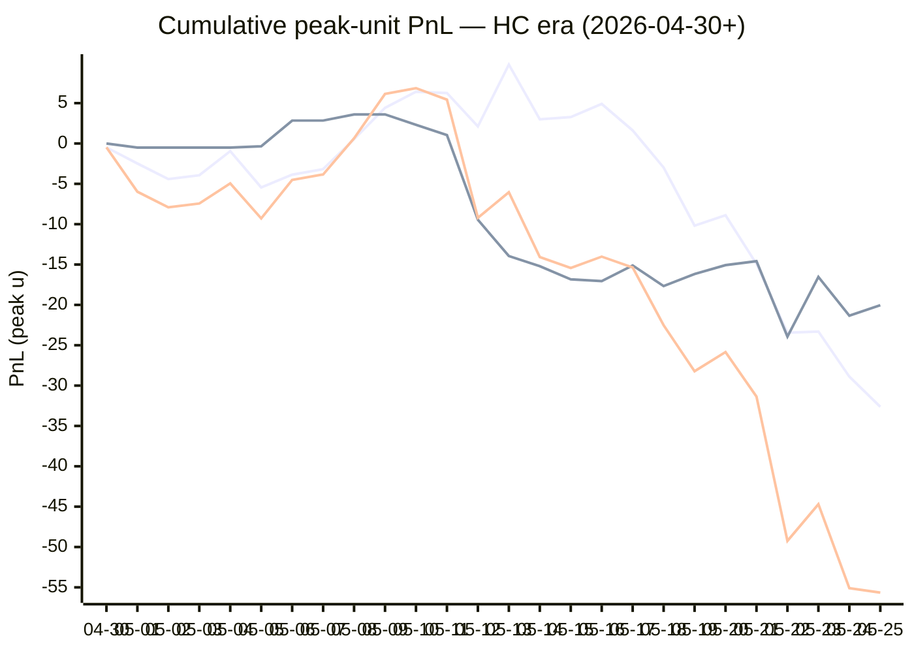

# Sharp Intel v6 — Daily Master Report

_Auto-generated **5/26/2026, 12:34:53 PM ET** by `scripts/dailyV6Report.js`. Do not edit by hand._

**Source of truth: this report mirrors the live Pick Performance dashboard.** Inclusion = `lockStage ≠ SHADOW ∧ ¬superseded ∧ health ∉ {MUTED, CANCELLED} ∧ peak.stars ≥ 2.5`. PnL is in **peak units** (the size shipped to users). HC margin / Δw / Δq are the **frozen** stamps written at last sync before the T-15 freeze. HC margin only existed from the v7.1 launch (**2026-04-30**); pre-launch picks have no HC value (no retro-fitting). Nothing is recomputed against today's whitelist.

v6 cutover: **2026-04-18** · whitelist source: live `sharpWalletProfiles` (219 profiles — drives §5 roster snapshot only) · quality cut: contribution ≥ 30 · HC = CONFIRMED tier ∧ sizeRatio ≥ 1.5.

---
## §1. Yesterday's picks

Slate: **2026-05-25** · 19 shipped sides.

| N | W-L-P | WR% | PnL (peak u) | PnL (flat 1u) |
|---|---|---|---|---|
| 19 | 11-8-0 | 57.9% | -0.55u | -0.40u |

| Sport | Market | Matchup | Pick | Stars · Units | HC | Δw | Δq | Σ | Odds | Result | PnL (peak u) |
|---|---|---|---|---|---|---|---|---|---|---|---|
| MLB | ML | Cincinnati Reds @ New York Mets | New York Mets | 5.0★ · 5.00u | +0 | +1 | -2 | -1 | -149 | L | -5.00u |
| MLB | ML | Colorado Rockies @ Los Angeles Dodgers | Los Angeles Dodgers | 5.0★ · 5.00u | +0 | +2 | +3 | +5 | -310 | **W** | +1.56u |
| MLB | ML | Houston Astros @ Texas Rangers | Texas Rangers | 4.0★ · 1.25u | -1 | +1 | -1 | +0 | -125 | L | -1.25u |
| MLB | ML | Miami Marlins @ Toronto Blue Jays | Toronto Blue Jays | 5.0★ · 1.25u | +0 | +3 | +1 | +4 | -160 | L | -1.25u |
| MLB | ML | Minnesota Twins @ Chicago White Sox | Minnesota Twins | 5.0★ · 3.75u | +0 | +0 | +3 | +3 | -108 | L | -3.75u |
| MLB | ML | Philadelphia Phillies @ San Diego Padres | Philadelphia Phillies | 5.0★ · 5.00u | -1 | +2 | +3 | +5 | -119 | **W** | +3.13u |
| MLB | ML | Seattle Mariners @ Athletics | Seattle Mariners | 2.5★ · 2.75u | +0 | +0 | +0 | +0 | -113 | **W** | +1.09u |
| MLB | ML | St. Louis Cardinals @ Milwaukee Brewers | Milwaukee Brewers | 4.0★ · 5.00u | +0 | -1 | +1 | +0 | -209 | **W** | +2.27u |
| MLB | SPREAD | Houston Astros @ Texas Rangers | Houston Astros | 4.0★ · 1.65u | +0 | +1 | +0 | +1 | -184 | **W** | +2.44u |
| MLB | SPREAD | New York Yankees @ Kansas City Royals | Kansas City Royals | 5.0★ · 1.65u | +0 | +2 | +1 | +3 | -124 | **W** | +0.50u |
| MLB | SPREAD | Tampa Bay Rays @ Baltimore Orioles | Baltimore Orioles | 5.0★ · 1.65u | +0 | +1 | +1 | +2 | -178 | **W** | +0.92u |
| MLB | TOTAL | Colorado Rockies @ Los Angeles Dodgers | Over 9 | 4.0★ · 1.65u | +0 | +1 | +1 | +2 | +103 | L | -1.65u |
| MLB | TOTAL | Houston Astros @ Texas Rangers | Under 8 | 5.0★ · 2.25u | +0 | +4 | +1 | +5 | -112 | L | -2.25u |
| MLB | TOTAL | Miami Marlins @ Toronto Blue Jays | Over 4.5 | 5.0★ · 3.00u | +0 | +3 | +0 | +3 | -110 | **W** | +2.46u |
| MLB | TOTAL | St. Louis Cardinals @ Milwaukee Brewers | Under 7.5 | 5.0★ · 0.75u | +1 | +2 | -1 | +1 | -101 | **W** | +0.66u |
| NBA | ML | Knicks @ Cavaliers | Knicks | 5.0★ · 5.00u | +0 | +0 | +6 | +6 | -125 | **W** | +3.97u |
| NBA | TOTAL | Knicks @ Cavaliers | Under 216.5 | 5.0★ · 3.00u | +2 | +2 | +0 | +2 | -110 | L | -3.00u |
| NHL | ML | Hurricanes @ Canadiens | Canadiens | 5.0★ · 2.50u | +4 | +8 | +4 | +12 | +120 | L | -2.50u |
| NHL | SPREAD | Hurricanes @ Canadiens | Canadiens | 4.5★ · 2.25u | +1 | +1 | -1 | +0 | -215 | **W** | +1.10u |

---
## §2. 3-day / 7-day / all-time cohort rollups

Shipped picks only. PnL in **peak units** (size we actually bet) and flat 1u (cohort EV lens). All margins are the engine's frozen stamps (`v8_hcMargin`, `v8_walletConsensusDelta`, `v8_walletConsensusQualityMargin`).

**HC margin sub-tables** are scoped to picks dated ≥ 2026-04-30 (the v7.1 launch — when HC margin became a real engine signal). Pre-launch picks are excluded from HC analysis since the feature didn't exist for them. Δw / Δq sub-tables span the full v6-era sample (≥ 2026-04-18). Empty buckets are dropped.

### §2a. 3-day

Total: **61** shipped · 32-28-1 · WR 53.3% · PnL -6.41u (peak) / -1.63u (flat).

**By HC margin** _(picks dated ≥ 2026-04-30, N = 61)_

| Bucket | N | W-L-P | WR% | PnL (peak u) | PnL (flat 1u) |
|---|---|---|---|---|---|
| HC ≥ +3 | 1 | 0-1-0 | 0.0% | -2.50u | -1.00u |
| HC = +2 | 2 | 1-1-0 | 50.0% | -1.14u | +0.48u |
| HC = +1 | 17 | 8-9-0 | 47.1% | -5.55u | -1.30u |
| HC = 0 | 38 | 22-15-1 | 59.5% | +3.90u | +1.35u |
| HC ≤ −1 | 3 | 1-2-0 | 33.3% | -1.12u | -1.16u |

**By Δw (winner margin)**

| Bucket | N | W-L-P | WR% | PnL (peak u) | PnL (flat 1u) |
|---|---|---|---|---|---|
| ≥ +3 | 9 | 3-6-0 | 33.3% | -5.77u | -3.69u |
| +2 | 13 | 7-6-0 | 53.8% | -4.71u | +1.01u |
| +1 | 25 | 14-11-0 | 56.0% | +0.27u | -0.22u |
| 0 | 11 | 7-3-1 | 70.0% | +4.03u | +2.79u |
| −1 | 3 | 1-2-0 | 33.3% | -0.23u | -1.52u |

**By Δq (quality margin)**

| Bucket | N | W-L-P | WR% | PnL (peak u) | PnL (flat 1u) |
|---|---|---|---|---|---|
| ≥ +3 | 7 | 4-3-0 | 57.1% | +1.85u | -0.55u |
| +2 | 8 | 2-6-0 | 25.0% | -5.11u | -4.56u |
| +1 | 20 | 9-10-1 | 47.4% | -6.83u | -1.96u |
| 0 | 17 | 12-5-0 | 70.6% | +7.84u | +5.13u |
| −1 | 8 | 5-3-0 | 62.5% | +0.84u | +1.31u |
| ≤ −2 | 1 | 0-1-0 | 0.0% | -5.00u | -1.00u |

**By AGS tier** _(picks dated ≥ 2026-05-05, N = 61)_

| Bucket | N | W-L-P | WR% | PnL (peak u) | PnL (flat 1u) |
|---|---|---|---|---|---|
| NEUT   (0 .. +3) | 53 | 29-24-0 | 54.7% | -4.01u | -0.06u |
| WEAK   (−1 .. 0) | 8 | 3-4-1 | 42.9% | -2.40u | -1.58u |

### §2b. 7-day

Total: **108** shipped · 54-53-1 · WR 50.5% · PnL -33.13u (peak) / -7.67u (flat).

**By HC margin** _(picks dated ≥ 2026-04-30, N = 108)_

| Bucket | N | W-L-P | WR% | PnL (peak u) | PnL (flat 1u) |
|---|---|---|---|---|---|
| HC ≥ +3 | 5 | 2-3-0 | 40.0% | -5.26u | -2.17u |
| HC = +2 | 6 | 1-5-0 | 16.7% | -16.39u | -3.52u |
| HC = +1 | 36 | 19-17-0 | 52.8% | -8.00u | +0.97u |
| HC = 0 | 58 | 31-26-1 | 54.4% | -2.36u | -1.79u |
| HC ≤ −1 | 3 | 1-2-0 | 33.3% | -1.12u | -1.16u |

**By Δw (winner margin)**

| Bucket | N | W-L-P | WR% | PnL (peak u) | PnL (flat 1u) |
|---|---|---|---|---|---|
| ≥ +3 | 21 | 7-14-0 | 33.3% | -17.69u | -8.50u |
| +2 | 24 | 13-11-0 | 54.2% | -9.54u | +1.52u |
| +1 | 43 | 23-20-0 | 53.5% | -5.42u | -1.36u |
| 0 | 17 | 10-6-1 | 62.5% | -0.25u | +2.20u |
| −1 | 3 | 1-2-0 | 33.3% | -0.23u | -1.52u |

**By Δq (quality margin)**

| Bucket | N | W-L-P | WR% | PnL (peak u) | PnL (flat 1u) |
|---|---|---|---|---|---|
| ≥ +3 | 17 | 10-7-0 | 58.8% | +2.55u | +0.04u |
| +2 | 18 | 5-13-0 | 27.8% | -16.52u | -8.30u |
| +1 | 36 | 17-18-1 | 48.6% | -9.83u | -3.38u |
| 0 | 23 | 16-7-0 | 69.6% | +7.31u | +6.76u |
| −1 | 12 | 6-6-0 | 50.0% | -6.64u | -0.78u |
| ≤ −2 | 2 | 0-2-0 | 0.0% | -10.00u | -2.00u |

**By AGS tier** _(picks dated ≥ 2026-05-05, N = 108)_

| Bucket | N | W-L-P | WR% | PnL (peak u) | PnL (flat 1u) |
|---|---|---|---|---|---|
| ELITE  (≥ +7) | 2 | 2-0-0 | 100.0% | +4.83u | +1.39u |
| LOCK   (+5 .. +7) | 2 | 1-1-0 | 50.0% | -1.11u | -0.62u |
| STRONG (+3 .. +5) | 4 | 0-4-0 | 0.0% | -10.50u | -4.00u |
| NEUT   (0 .. +3) | 84 | 44-40-0 | 52.4% | -21.14u | -3.18u |
| WEAK   (−1 .. 0) | 14 | 5-8-1 | 38.5% | -6.04u | -3.28u |
| FADE   (< −1) | 2 | 2-0-0 | 100.0% | +0.83u | +2.02u |

### §2c. All-time

Total: **321** shipped · 156-162-3 · WR 49.1% · PnL -67.88u (peak) / -15.93u (flat).

**By HC margin** _(picks dated ≥ 2026-04-30, N = 210)_

| Bucket | N | W-L-P | WR% | PnL (peak u) | PnL (flat 1u) |
|---|---|---|---|---|---|
| HC ≥ +3 | 7 | 2-5-0 | 28.6% | -9.51u | -4.17u |
| HC = +2 | 17 | 6-11-0 | 35.3% | -22.71u | -4.55u |
| HC = +1 | 94 | 53-41-0 | 56.4% | -0.41u | +10.68u |
| HC = 0 | 86 | 43-41-2 | 51.2% | -20.03u | -5.94u |
| HC ≤ −1 | 5 | 1-4-0 | 20.0% | -4.62u | -3.16u |

**By Δw (winner margin)**

| Bucket | N | W-L-P | WR% | PnL (peak u) | PnL (flat 1u) |
|---|---|---|---|---|---|
| ≥ +3 | 66 | 34-32-0 | 51.5% | -19.05u | +4.64u |
| +2 | 77 | 34-43-0 | 44.2% | -34.69u | -9.42u |
| +1 | 110 | 61-48-1 | 56.0% | +4.91u | +5.22u |
| 0 | 51 | 21-28-2 | 42.9% | -16.71u | -9.76u |
| −1 | 10 | 2-8-0 | 20.0% | -5.83u | -6.46u |
| ≤ −2 | 1 | 0-1-0 | 0.0% | -0.50u | -1.00u |
| missing | 6 | 4-2-0 | 66.7% | +3.99u | +0.85u |

**By Δq (quality margin)**

| Bucket | N | W-L-P | WR% | PnL (peak u) | PnL (flat 1u) |
|---|---|---|---|---|---|
| ≥ +3 | 92 | 46-44-2 | 51.1% | -17.44u | +0.84u |
| +2 | 70 | 29-41-0 | 41.4% | -36.73u | -11.49u |
| +1 | 89 | 43-45-1 | 48.9% | -12.18u | -7.29u |
| 0 | 42 | 23-19-0 | 54.8% | +6.48u | +2.52u |
| −1 | 16 | 10-6-0 | 62.5% | +2.32u | +2.76u |
| ≤ −2 | 6 | 1-5-0 | 16.7% | -13.57u | -4.04u |
| missing | 6 | 4-2-0 | 66.7% | +3.24u | +0.77u |

**By AGS tier** _(picks dated ≥ 2026-05-05, N = 185)_

| Bucket | N | W-L-P | WR% | PnL (peak u) | PnL (flat 1u) |
|---|---|---|---|---|---|
| ELITE  (≥ +7) | 3 | 3-0-0 | 100.0% | +8.01u | +2.34u |
| LOCK   (+5 .. +7) | 9 | 5-4-0 | 55.6% | -2.93u | -0.47u |
| STRONG (+3 .. +5) | 22 | 13-9-0 | 59.1% | -6.66u | +2.77u |
| NEUT   (0 .. +3) | 121 | 58-63-0 | 47.9% | -45.75u | -12.43u |
| WEAK   (−1 .. 0) | 19 | 8-10-1 | 44.4% | -6.72u | -1.27u |
| FADE   (< −1) | 10 | 6-4-0 | 60.0% | +1.72u | +2.16u |
| missing | 1 | 1-0-0 | 100.0% | +1.63u | +0.96u |

---
## §3. Edge over time — is HC margin creating winners?

Daily cumulative peak-unit PnL since the HC margin launch (**2026-04-30**). The `HC ≥ +1` line is the golden-standard cohort. The `HC = 0` line is the no-HC-signal control. The `All shipped (HC era)` line is every shipped pick from the same date range — the apples-to-apples baseline. Watch the spread.

Daily cumulative table (peak units, HC era only):

| Date | HC ≥ +1 (cum) | HC = 0 (cum) | All shipped (cum) |
|---|---|---|---|
| 2026-04-30 | -0.48u | +0.00u | -0.48u |
| 2026-05-01 | -2.48u | -0.50u | -5.98u |
| 2026-05-02 | -4.41u | -0.50u | -7.91u |
| 2026-05-03 | -3.94u | -0.50u | -7.44u |
| 2026-05-04 | -0.95u | -0.50u | -4.95u |
| 2026-05-05 | -5.45u | -0.34u | -9.29u |
| 2026-05-06 | -3.86u | +2.84u | -4.52u |
| 2026-05-07 | -3.18u | +2.84u | -3.84u |
| 2026-05-08 | +0.54u | +3.60u | +0.64u |
| 2026-05-09 | +4.41u | +3.60u | +6.14u |
| 2026-05-10 | +6.41u | +2.32u | +6.86u |
| 2026-05-11 | +6.25u | +1.05u | +5.43u |
| 2026-05-12 | +2.11u | -9.45u | -9.21u |
| 2026-05-13 | +9.78u | -13.95u | -6.04u |
| 2026-05-14 | +3.00u | -15.20u | -14.07u |
| 2026-05-15 | +3.27u | -16.83u | -15.43u |
| 2026-05-16 | +4.90u | -17.05u | -14.02u |
| 2026-05-17 | +1.62u | -15.11u | -15.36u |
| 2026-05-18 | -2.98u | -17.67u | -22.52u |
| 2026-05-19 | -10.18u | -16.17u | -28.22u |
| 2026-05-20 | -8.90u | -15.07u | -25.84u |
| 2026-05-21 | -14.92u | -14.58u | -31.37u |
| 2026-05-22 | -23.44u | -23.93u | -49.24u |
| 2026-05-23 | -23.30u | -16.53u | -44.70u |
| 2026-05-24 | -28.89u | -21.34u | -55.10u |
| 2026-05-25 | -32.63u | -20.03u | -55.65u |

---
## §4. Wallet roster growth & profitability

"Tracked in sport X" = a wallet has placed **≥ 2 bets** in X within the v6-era sample. "Profitable" = cumulative flat PnL > 0. Source: `v8Scoring.walletDetails` on every graded v6-era game (every side, not just the shipped set).

### §4a. Per-sport wallet snapshot

| Sport | Total wallets seen | Tracked (≥2) | Profitable | % prof | WR ≥ 50% | WR ≥ 60% | WR ≥ 70% |
|---|---|---|---|---|---|---|---|
| MLB | 58 | 38 | 13 | 34% | 15 | 8 | 5 |
| NBA | 130 | 95 | 40 | 42% | 53 | 24 | 11 |
| NHL | 57 | 38 | 16 | 42% | 25 | 11 | 7 |
| **ALL (any sport)** | **157** | **120** | **53** | **44%** | **65** | **32** | **12** |

### §4b. Daily roster growth (cumulative through each date)

Format: `tracked (profitable)`. For each date D, recompute the roster using every bet up to and including D.

| Date | ALL | MLB | NBA | NHL |
|---|---|---|---|---|
| 2026-04-18 | 5 (2) | 2 (2) | 3 (0) | 0 (0) |
| 2026-04-19 | 19 (8) | 5 (3) | 9 (3) | 3 (1) |
| 2026-04-20 | 29 (12) | 7 (6) | 23 (8) | 5 (2) |
| 2026-04-21 | 44 (21) | 10 (6) | 31 (10) | 7 (5) |
| 2026-04-22 | 52 (28) | 12 (6) | 39 (15) | 11 (10) |
| 2026-04-23 | 56 (29) | 13 (6) | 46 (21) | 13 (10) |
| 2026-04-24 | 61 (30) | 14 (6) | 51 (23) | 14 (9) |
| 2026-04-25 | 65 (29) | 16 (8) | 54 (22) | 16 (9) |
| 2026-04-26 | 67 (31) | 18 (5) | 56 (25) | 17 (9) |
| 2026-04-27 | 72 (32) | 20 (7) | 60 (24) | 17 (9) |
| 2026-04-28 | 76 (33) | 21 (7) | 63 (26) | 23 (10) |
| 2026-04-29 | 77 (33) | 21 (7) | 64 (25) | 23 (10) |
| 2026-04-30 | 81 (34) | 21 (7) | 70 (27) | 23 (10) |
| 2026-05-01 | 85 (38) | 22 (5) | 74 (30) | 26 (13) |
| 2026-05-02 | 86 (37) | 23 (7) | 75 (32) | 26 (12) |
| 2026-05-03 | 86 (38) | 24 (8) | 75 (33) | 26 (12) |
| 2026-05-04 | 90 (38) | 24 (9) | 76 (32) | 26 (12) |
| 2026-05-05 | 91 (40) | 24 (9) | 79 (33) | 26 (12) |
| 2026-05-06 | 92 (40) | 24 (9) | 80 (33) | 26 (12) |
| 2026-05-07 | 92 (41) | 24 (9) | 80 (33) | 26 (12) |
| 2026-05-08 | 92 (40) | 24 (8) | 80 (32) | 26 (11) |
| 2026-05-09 | 94 (42) | 24 (8) | 82 (35) | 26 (11) |
| 2026-05-10 | 94 (42) | 24 (8) | 82 (35) | 26 (11) |
| 2026-05-11 | 96 (42) | 24 (8) | 84 (36) | 26 (11) |
| 2026-05-12 | 100 (41) | 27 (9) | 86 (37) | 26 (11) |
| 2026-05-13 | 102 (45) | 29 (11) | 88 (37) | 26 (11) |
| 2026-05-14 | 102 (41) | 29 (11) | 88 (37) | 28 (12) |
| 2026-05-15 | 103 (41) | 30 (10) | 88 (39) | 28 (12) |
| 2026-05-16 | 105 (43) | 31 (12) | 88 (39) | 30 (14) |
| 2026-05-17 | 105 (46) | 32 (11) | 88 (40) | 30 (14) |
| 2026-05-18 | 105 (46) | 32 (10) | 88 (38) | 31 (15) |
| 2026-05-19 | 105 (46) | 32 (12) | 88 (38) | 31 (15) |
| 2026-05-20 | 106 (48) | 33 (12) | 88 (38) | 31 (16) |
| 2026-05-21 | 106 (45) | 34 (12) | 88 (37) | 31 (14) |
| 2026-05-22 | 106 (44) | 34 (10) | 88 (39) | 33 (16) |
| 2026-05-23 | 111 (49) | 36 (10) | 90 (40) | 36 (19) |
| 2026-05-24 | 117 (52) | 37 (12) | 94 (39) | 37 (16) |
| 2026-05-25 | 120 (53) | 38 (13) | 95 (40) | 38 (16) |

### §4c. Top 10 profitable wallets by sport

#### MLB

| # | Wallet | N | W | L | WR% | Flat PnL (u) | Flat ROI | $ PnL |
|---|---|---|---|---|---|---|---|---|
| 1 | b31fc6 | 2 | 2 | 0 | 100.0% | +2.56 | +128.0% | $4.2K |
| 2 | c289a0 | 3 | 3 | 0 | 100.0% | +2.87 | +95.6% | $1.5K |
| 3 | 880232 | 2 | 2 | 0 | 100.0% | +1.82 | +90.9% | $130.1K |
| 4 | c9bba3 | 2 | 2 | 0 | 100.0% | +1.68 | +83.8% | $50.1K |
| 5 | eeabaf | 11 | 7 | 4 | 63.6% | +8.38 | +76.2% | $767.9K |
| 6 | c668b3 | 10 | 7 | 3 | 70.0% | +3.49 | +34.9% | $398 |
| 7 | 981187 | 8 | 5 | 3 | 62.5% | +1.65 | +20.7% | $13.5K |
| 8 | a10ff5 | 20 | 12 | 8 | 60.0% | +3.74 | +18.7% | $14.8K |
| 9 | 63fc82 | 15 | 8 | 7 | 53.3% | +0.91 | +6.1% | $104.4K |
| 10 | 8c1eae | 40 | 21 | 19 | 52.5% | +2.09 | +5.2% | $22.4K |

#### NBA

| # | Wallet | N | W | L | WR% | Flat PnL (u) | Flat ROI | $ PnL |
|---|---|---|---|---|---|---|---|---|
| 1 | 799fad | 2 | 2 | 0 | 100.0% | +5.66 | +283.0% | $241.7K |
| 2 | 4a9953 | 2 | 2 | 0 | 100.0% | +2.16 | +108.2% | $3.7K |
| 3 | 12ad50 | 3 | 3 | 0 | 100.0% | +2.74 | +91.3% | $45.5K |
| 4 | b51a56 | 6 | 5 | 1 | 83.3% | +5.44 | +90.7% | $74.4K |
| 5 | 11b032 | 7 | 6 | 1 | 85.7% | +5.40 | +77.1% | $249.9K |
| 6 | 769c38 | 13 | 12 | 1 | 92.3% | +9.01 | +69.3% | $100.0K |
| 7 | 8ec926 | 7 | 6 | 1 | 85.7% | +4.53 | +64.7% | $7.9K |
| 8 | 2e8da5 | 11 | 8 | 3 | 72.7% | +7.06 | +64.2% | $84.1K |
| 9 | 7f00bc | 16 | 11 | 5 | 68.8% | +9.63 | +60.2% | $14.2K |
| 10 | 4edc5b | 4 | 2 | 2 | 50.0% | +1.79 | +44.7% | $55.6K |

#### NHL

| # | Wallet | N | W | L | WR% | Flat PnL (u) | Flat ROI | $ PnL |
|---|---|---|---|---|---|---|---|---|
| 1 | 8366f5 | 2 | 2 | 0 | 100.0% | +2.30 | +114.9% | $107.6K |
| 2 | 799fad | 2 | 2 | 0 | 100.0% | +1.88 | +94.1% | $46.9K |
| 3 | fec67e | 4 | 3 | 1 | 75.0% | +2.82 | +70.5% | $12.5K |
| 4 | 981187 | 7 | 6 | 1 | 85.7% | +4.52 | +64.6% | $9.8K |
| 5 | 30935c | 4 | 3 | 1 | 75.0% | +2.11 | +52.7% | $953 |
| 6 | fcc12b | 10 | 7 | 3 | 70.0% | +3.15 | +31.5% | -$67.5K |
| 7 | bc35e3 | 4 | 3 | 1 | 75.0% | +1.22 | +30.4% | $7.8K |
| 8 | e70853 | 9 | 6 | 3 | 66.7% | +2.66 | +29.5% | -$11.1K |
| 9 | c5cea1 | 3 | 2 | 1 | 66.7% | +0.62 | +20.7% | $22.1K |
| 10 | dfa240 | 24 | 15 | 9 | 62.5% | +4.32 | +18.0% | $14.2K |

---
## §5. Proven-wallet roster growth & HC tracking

"Proven wallet" = whitelist tier `CONFIRMED` or `FLAT` in the same sense the live engine uses (`exportWalletProfiles.js` → `sharpWalletProfiles.bySport`). Sports inherit independent rosters: a wallet can be CONFIRMED in NBA and absent from NHL. `walletBets` come from `v8Scoring.walletDetails` on every graded v6-era pick (Source A); `positionRows` come from `sharp_action_positions` (Source B).

### §5a. Current proven-winner roster (snapshot)

Roster as of **2026-05-25** — wallets with ≥2 bets in the sport.

| Sport | Wallets seen | Eligible (≥2) | CONFIRMED | FLAT | Proven (C+F) | WR50 only | Conv % |
|---|---|---|---|---|---|---|---|
| MLB | 101 | 38 | 7 | 6 | **13** | 3 | 12.9% |
| NBA | 188 | 95 | 27 | 13 | **40** | 19 | 21.3% |
| NHL | 92 | 38 | 10 | 6 | **16** | 9 | 17.4% |
| **ALL** | **—** | **—** | **—** | **—** | **69** | **—** | **—** |

### §5b. Live whitelist drift check

Live `sharpWalletProfiles` is what the engine reads at lock time. Drift between script reconstruction (above) and live should be ≤ 1 day of position data — otherwise `exportWalletProfiles.js` is stale.

| Sport | CONFIRMED (live · script) | FLAT (live · script) | WR50 (live · script) | Drift |
|---|---|---|---|---|
| MLB | 22 · 7 | 7 · 6 | 3 · 3 | +16 live |
| NBA | 51 · 27 | 23 · 13 | 23 · 19 | +34 live |
| NHL | 18 · 10 | 7 · 6 | 13 · 9 | +9 live |

### §5c. Roster growth — 3d / 7d / 30d / all-time deltas

Each cell is **net growth** in proven (CONFIRMED + FLAT) wallets in that window, with the absolute count at the start (`+Δ from N`). Negative = wallets demoted. Window endpoint = 2026-05-25.

| Sport | 3-day | 7-day | 30-day | All-time (since cutover) |
|---|---|---|---|---|
| MLB | +3 from 10 | +3 from 10 | +5 from 8 | +13 from 0 |
| NBA | +1 from 39 | +2 from 38 | +18 from 22 | +40 from 0 |
| NHL | +0 from 16 | +1 from 15 | +7 from 9 | +16 from 0 |

A flat 7-day delta on a sport with healthy slate density = either the bubble pipeline has stalled (no wallets approaching the bar) or our cohort has saturated. Check §13d for the funnel diagnostic.

### §5d. Pipeline funnel — where each sport leaks

Wallets surviving each gate, in order. The biggest %-drop tells you the bottleneck. Gates:

1. **Seen** — placed ≥ 1 bet in the sport (any source)
2. **Eligible** — ≥ 2 graded picks in Source A (required for FLAT/CONFIRMED)
3. **Flat-OK** — eligible AND flat ROI > 0 (becomes FLAT or better)
4. **$-OK** — Flat-OK AND ≥2 positions with dollar ROI > 0 (CONFIRMED)
5. **Promoted** — final whitelisted = CONFIRMED + FLAT

| Sport | 1·Seen | 2·Eligible (% of Seen) | 3·Flat-OK (% of Elig) | 4·$-OK (% of Flat) | 5·Promoted | Bottleneck |
|---|---|---|---|---|---|---|
| MLB | 101 | 38 (38%) | 13 (34%) | 7 (54%) | **13** | edge (Eligible→Flat-OK) 66% |
| NBA | 188 | 95 (51%) | 40 (42%) | 27 (68%) | **40** | edge (Eligible→Flat-OK) 58% |
| NHL | 92 | 38 (41%) | 16 (42%) | 10 (63%) | **16** | sample (Seen→Eligible) 59% |

### §5e. HC backing density (the fuel for v7.3 HC margin)

Every v7.x promotion is gated on `HC_m ≥ +1`, which requires at least one CONFIRMED wallet sized at `≥ 1.5×` average on the for-side. This table shows the share of shipped picks that *had any HC backing*, by sport, in each window. If HC density falls toward zero in a sport, the v7.3 floor cohorts (Σ=1, Σ=2 locks; HC rescues) will simply stop firing there.

| Sport | Window | Picks (with HC stamp) | Any HC for-side | HC_m ≥ +1 | HC_m ≥ +2 |
|---|---|---|---|---|---|
| MLB | 3-day | 50 | 15 (30.0%) | 14 (28.0%) | 1 (2.0%) |
| MLB | 7-day | 82 | 30 (36.6%) | 29 (35.4%) | 3 (3.7%) |
| MLB | All-time | 169 | 74 (43.8%) | 72 (42.6%) | 8 (4.7%) |
| NBA | 3-day | 6 | 5 (83.3%) | 3 (50.0%) | 1 (16.7%) |
| NBA | 7-day | 16 | 15 (93.8%) | 11 (68.8%) | 6 (37.5%) |
| NBA | All-time | 110 | 70 (63.6%) | 59 (53.6%) | 25 (22.7%) |
| NHL | 3-day | 5 | 3 (60.0%) | 3 (60.0%) | 1 (20.0%) |
| NHL | 7-day | 10 | 7 (70.0%) | 7 (70.0%) | 2 (20.0%) |
| NHL | All-time | 36 | 18 (50.0%) | 17 (47.2%) | 4 (11.1%) |

Pooled across sports:

| Window | Picks (with HC stamp) | Any HC for-side | HC_m ≥ +1 | HC_m ≥ +2 |
|---|---|---|---|---|
| 3-day | 61 | 23 (37.7%) | 20 (32.8%) | 3 (4.9%) |
| 7-day | 108 | 52 (48.1%) | 47 (43.5%) | 11 (10.2%) |
| All-time | 315 | 162 (51.4%) | 148 (47.0%) | 37 (11.7%) |

### §5f. Bubble wallets — next-up graduations

Wallets currently NOT promoted but close. Two flavors:

- **One-bet-away** — won the only bet, needs one more positive bet to clear ≥2.
- **Just-under** — has ≥2 bets but flat ROI is between −10% and 0% (one win flips them).

#### MLB

**One-bet-away** (6)

| wallet | picksN | flat PnL | pos N | pos $ROI |
|---|---|---|---|---|
| `...be17` | 1 | +6.95 | 6 | -46% |
| `...cff6` | 1 | +1.34 | 6 | 85% |
| `...be00` | 1 | +0.87 | 13 | 1% |
| `...a240` | 1 | +0.87 | 7 | 83% |
| `...9373` | 1 | +0.87 | 0 | — |
| `...8d26` | 1 | +0.72 | 5 | -22% |

**Just-under** (6)

| wallet | picksN | WR | flat ROI | pos N | pos $ROI |
|---|---|---|---|---|---|
| `...64aa` | 97 | 54% | -1.4% | 186 | 1% |
| `...aeea` | 11 | 55% | -3.1% | 163 | -15% |
| `...9a27` | 127 | 47% | -4.0% | 337 | 5% |
| `...9d74` | 29 | 48% | -5.9% | 77 | -10% |
| `...c12b` | 40 | 48% | -6.5% | 67 | -19% |
| `...35e3` | 22 | 50% | -6.7% | 65 | -22% |

#### NBA

**One-bet-away** (6)

| wallet | picksN | flat PnL | pos N | pos $ROI |
|---|---|---|---|---|
| `...bf5d` | 1 | +3.15 | 3 | 42% |
| `...ed41` | 1 | +3.15 | 3 | 3% |
| `...6b87` | 1 | +2.05 | 8 | -27% |
| `...c991` | 1 | +1.14 | 6 | 82% |
| `...e3d0` | 1 | +0.93 | 18 | -34% |
| `...9d74` | 1 | +0.93 | 27 | -35% |

**Just-under** (6)

| wallet | picksN | WR | flat ROI | pos N | pos $ROI |
|---|---|---|---|---|---|
| `...d814` | 8 | 50% | -0.5% | 47 | -9% |
| `...d96a` | 19 | 37% | -1.5% | 72 | -27% |
| `...65dd` | 6 | 50% | -2.4% | 17 | 27% |
| `...853d` | 40 | 53% | -2.7% | 88 | -1% |
| `...be00` | 2 | 50% | -3.3% | 30 | -2% |
| `...f5b0` | 20 | 50% | -3.7% | 57 | -28% |

#### NHL

**One-bet-away** (6)

| wallet | picksN | flat PnL | pos N | pos $ROI |
|---|---|---|---|---|
| `...2e78` | 1 | +1.46 | 0 | — |
| `...017f` | 1 | +1.45 | 5 | 125% |
| `...32f2` | 1 | +1.40 | 0 | — |
| `...e0fd` | 1 | +1.20 | 3 | 124% |
| `...266e` | 1 | +1.05 | 0 | — |
| `...2194` | 1 | +1.05 | 0 | — |

**Just-under** (5)

| wallet | picksN | WR | flat ROI | pos N | pos $ROI |
|---|---|---|---|---|---|
| `...33ee` | 4 | 50% | -0.3% | 8 | -23% |
| `...afd2` | 6 | 50% | -1.9% | 13 | 0% |
| `...618e` | 2 | 50% | -6.1% | 28 | 24% |
| `...d227` | 2 | 50% | -9.0% | 19 | 21% |
| `...853d` | 10 | 50% | -9.8% | 23 | -1% |

### §5g. v2 wallet-promotion pipeline (Source-A / Source-B mix)

Live snapshot of the v2 promotion gate (shipped 2026-05-10, re-eval **2026-05-24**). Each FLAT-or-better wallet × sport pair is attributed to one of three paths via `sharpWalletProfiles[wallet].bySport[sport].whitelistSource`:

- **A** — flat-positive on featured picks (Source A) only — the v1 gate
- **A+B** — flat-positive in both sources (most reliable signal)
- **B** — flat-positive on-chain only (NEW in v2 — the trial lift)

Re-classified every 2h via `grade-sharp-actions` cron. Roll-back: set `B_ONLY_MIN_BETS = Infinity` in `scripts/exportWalletProfiles.js`.

#### Source mix per sport (live Firestore)

| Sport | A | A+B | B (new) | FLAT-or-better total | % from B-only |
|---|---|---|---|---|---|
| MLB | 3 | 10 | **16** | 29 | 55.2% |
| NBA | 13 | 27 | **34** | 74 | 45.9% |
| NHL | 6 | 10 | **9** | 25 | 36.0% |
| **ALL** | **22** | **47** | **59** | **128** | **46.1%** |

#### Pipeline freshness

- `sharp_action_positions` GRADED rows: **8854**
- `sharp_action_positions` PENDING rows: **126** (queued for next Grade Sharp Actions run)
- Latest `sharpWalletProfiles` rebuild: 5/26/2026, 2:43:39 AM ET — **591 min · STALE** — check grade-sharp-actions workflow

**Alarms**: pending > 200 OR rebuild lag > 4h → cron is lagging or failing — check `gh run list --workflow="Grade Sharp Actions"`.

#### B-only roster — wallets currently promoted via Source B path only

Wallets here would have been EXCLUDED under v1 (Source-A-only). Top by Source-B bet count per sport. The 2-week re-eval (2026-05-24) will compare these wallets' realized lift against A-only and A+B cohorts.

**MLB** — 16 wallets promoted via B

| wallet | tier | B_n | B_flat ROI | B_$ ROI |
|---|---|---|---|---|
| `...9a27` | CONFIRMED | 337 | +15% | +4.5% |
| `...135d` | CONFIRMED | 326 | +1.9% | +6.9% |
| `...64aa` | CONFIRMED | 186 | +2% | +1.1% |
| `...d96a` | CONFIRMED | 113 | +3% | +20.1% |
| `...69c2` | CONFIRMED | 34 | +32.5% | +1.6% |
| `...d6d2` | FLAT | 30 | +4.3% | -36.6% |
| `...aeeb` | CONFIRMED | 9 | +21.6% | +32% |
| `...f804` | CONFIRMED | 9 | +29% | +36.8% |
| `...a9cc` | CONFIRMED | 8 | +6.3% | +0.3% |
| `...ec43` | CONFIRMED | 8 | +9.1% | +17.7% |
| … | 6 more | | | |

**NBA** — 34 wallets promoted via B

| wallet | tier | B_n | B_flat ROI | B_$ ROI |
|---|---|---|---|---|
| `...135d` | FLAT | 102 | +5.1% | -11.9% |
| `...3782` | CONFIRMED | 63 | +3.7% | +4.1% |
| `...935c` | FLAT | 50 | +17.3% | -21.4% |
| `...b6ef` | CONFIRMED | 41 | +8.9% | +7.2% |
| `...d6d2` | CONFIRMED | 33 | +3.3% | +32.5% |
| `...68b3` | CONFIRMED | 31 | +2.7% | +11.1% |
| `...be00` | FLAT | 30 | +5.2% | -2.4% |
| `...d227` | CONFIRMED | 28 | +5.4% | +19.5% |
| `...9791` | CONFIRMED | 19 | +3.7% | +14.6% |
| `...e3d0` | FLAT | 18 | +35.8% | -33.5% |
| … | 24 more | | | |

**NHL** — 9 wallets promoted via B

| wallet | tier | B_n | B_flat ROI | B_$ ROI |
|---|---|---|---|---|
| `...2125` | CONFIRMED | 30 | +51.8% | +50.4% |
| `...618e` | CONFIRMED | 28 | +6.2% | +23.8% |
| `...b33b` | CONFIRMED | 20 | +17% | +20.5% |
| `...d227` | CONFIRMED | 19 | +5.8% | +20.9% |
| `...b989` | CONFIRMED | 12 | +13.1% | +30.4% |
| `...0c2e` | CONFIRMED | 9 | +75.1% | +49.4% |
| `...a9cc` | CONFIRMED | 7 | +49.5% | +46.9% |
| `...44b0` | FLAT | 6 | +36.1% | -37.9% |
| `...017f` | CONFIRMED | 5 | +130% | +124.5% |

### §5 — How to read

- **Roster growth flat in 7-day** + **funnel bottleneck = `data`** → re-run `exportWalletProfiles.js`. The flat-positive wallets are stuck at FLAT because Source-B coverage hasn't caught up. CONFIRMED gate is data-bound, not skill-bound.
- **Roster growth flat in 7-day** + **funnel bottleneck = `sample`** → wallets aren't reaching `≥2` reps fast enough. This is a slate-density problem; consider a soft `MIN_BETS = 1` shadow lane to surface bubble wallets earlier.
- **Roster shrank** (negative delta) → a previously CONFIRMED wallet just dropped flat-positive (lost a recent bet). Variance, not failure — but worth noting if a sport loses ≥3 in a week.
- **HC density on a sport drops below ~30%** → v7.3 promotions there will starve. Either the proven roster needs more CONFIRMED-tier wallets sizing aggressively, or the HC_RATIO (1.5) needs a sport-specific tune.
- **§5g B-only count drops sharply** → wallets are demoting off the B path (losing on-chain). Cross-check `WALLET_PROFILES_SUMMARY.md` churn section for the specific demotions.
- **§5g pipeline freshness lag > 4h** → grade-sharp-actions cron is failing. Check `gh run list --workflow="Grade Sharp Actions"` and re-trigger if needed.

---
## §6. Daily proven-wallet performance

Who on the proven roster is actually printing — yesterday's bets, the rolling leaderboard (`$ PnL`-ranked), current streaks, and per-sport volume. **Proven** = `CONFIRMED` ∪ `FLAT` per sport (the same gate that drives Δ_winner). A wallet only counts in a sport where it's on that sport's proven list.

### §6a. Yesterday's proven-wallet bets

Slate: **2026-05-25** · 37 bets · 20 distinct proven wallets · WR 59% · $ vol $755.5K · $ PnL $74.2K.

| Wallet | Sport | Market | Game | $ size | Result | $ PnL |
|---|---|---|---|---|---|---|
| `...2ca8` (CONFIRMED) | NBA | ML | Knicks @ Cavaliers | $306.0K | **W** | $242.8K |
| `...2f63` (FLAT) | NBA | ML | Knicks @ Cavaliers | $49.0K | **W** | $38.9K |
| `...abaf` (CONFIRMED) | MLB | ML | Tampa Bay Rays @ Baltimore Orioles | $27.2K | **W** | $25.9K |
| `...bba3` (CONFIRMED) | MLB | ML | Seattle Mariners @ Athletics | $14.0K | **W** | $12.2K |
| `...1eae` (CONFIRMED) | MLB | ML | Houston Astros @ Texas Rangers | $6.9K | **W** | $7.8K |
| `...9c38` (CONFIRMED) | NBA | ML | Knicks @ Cavaliers | $8.7K | **W** | $6.9K |
| `...23c4` (FLAT) | MLB | TOTAL | Miami Marlins @ Toronto Blue Jays | $7.3K | **W** | $6.0K |
| `...b33b` (CONFIRMED) | NBA | SPREAD | Knicks @ Cavaliers | $4.4K | **W** | $4.1K |
| `...1eae` (CONFIRMED) | MLB | TOTAL | St. Louis Cardinals @ Milwaukee Brewers | $4.5K | **W** | $4.0K |
| `...35e3` (CONFIRMED) | NHL | SPREAD | Hurricanes @ Canadiens | $7.6K | **W** | $3.7K |
| `...11a4` (CONFIRMED) | NBA | ML | Knicks @ Cavaliers | $4.1K | **W** | $3.2K |
| `...23c4` (FLAT) | MLB | ML | Philadelphia Phillies @ San Diego Padres | $3.5K | **W** | $2.9K |
| `...1eae` (CONFIRMED) | MLB | ML | Tampa Bay Rays @ Baltimore Orioles | $3.0K | **W** | $2.8K |
| `...1eae` (CONFIRMED) | MLB | SPREAD | Houston Astros @ Texas Rangers | $1.6K | **W** | $2.6K |
| `...23c4` (FLAT) | MLB | TOTAL | St. Louis Cardinals @ Milwaukee Brewers | $2.7K | **W** | $2.3K |
| `...23c4` (CONFIRMED) | NBA | TOTAL | Knicks @ Cavaliers | $2.4K | **W** | $2.2K |
| `...2f63` (FLAT) | NBA | TOTAL | Knicks @ Cavaliers | $1.3K | **W** | $1.1K |
| `...2f63` (FLAT) | NBA | SPREAD | Knicks @ Cavaliers | $1.2K | **W** | $1.1K |
| `...03d4` (FLAT) | NBA | SPREAD | Knicks @ Cavaliers | $1.0K | **W** | $926 |
| `...68b3` (FLAT) | MLB | ML | Philadelphia Phillies @ San Diego Padres | $407 | **W** | $339 |
| `...68b3` (FLAT) | MLB | TOTAL | Miami Marlins @ Toronto Blue Jays | $352 | **W** | $289 |
| `...aeeb` (CONFIRMED) | NBA | ML | Knicks @ Cavaliers | $243 | **W** | $193 |
| `...23c4` (FLAT) | MLB | TOTAL | Houston Astros @ Texas Rangers | $233 | L | -$233 |
| `...0ff5` (FLAT) | MLB | TOTAL | Houston Astros @ Texas Rangers | $1.6K | L | -$1.6K |
| `...9ef0` (CONFIRMED) | NBA | ML | Knicks @ Cavaliers | $2.1K | L | -$2.1K |
| `...9ef0` (CONFIRMED) | NBA | SPREAD | Knicks @ Cavaliers | $2.8K | L | -$2.8K |
| `...e8f1` (FLAT) | NBA | ML | Knicks @ Cavaliers | $4.1K | L | -$4.1K |
| `...68b3` (FLAT) | MLB | ML | New York Yankees @ Kansas City Royals | $5.0K | L | -$5.0K |
| `...5ad0` (CONFIRMED) | NHL | ML | Hurricanes @ Canadiens | $5.6K | L | -$5.6K |
| `...2768` (CONFIRMED) | MLB | ML | New York Yankees @ Kansas City Royals | $9.6K | L | -$9.6K |
| `...9a27` (CONFIRMED) | NBA | SPREAD | Knicks @ Cavaliers | $26.5K | L | -$26.5K |
| `...23c4` (FLAT) | MLB | TOTAL | New York Yankees @ Kansas City Royals | $27.0K | L | -$27.0K |
| `...23c4` (CONFIRMED) | NBA | SPREAD | Knicks @ Cavaliers | $31.8K | L | -$31.8K |
| `...8da5` (CONFIRMED) | NBA | SPREAD | Knicks @ Cavaliers | $36.3K | L | -$36.3K |
| `...abaf` (CONFIRMED) | MLB | TOTAL | Colorado Rockies @ Los Angeles Dodgers | $40.4K | L | -$40.4K |
| `...9a27` (CONFIRMED) | NBA | TOTAL | Knicks @ Cavaliers | $42.8K | L | -$42.8K |
| `...23c4` (FLAT) | MLB | ML | New York Yankees @ Kansas City Royals | $62.3K | L | -$62.3K |

### §6b. Proven-wallet leaderboard

Top 15 proven `(wallet × sport)` pairs per sport per horizon, ranked by **$ PnL** (the dollar-ROI lens). The 3-day board is the "who's on form right now" lens; the 7-day filters single-day variance; all-time is the proven-roster reference.

#### §6b-1. 3-day

**MLB** — 8 active proven wallets

| # | Wallet | Tier | Bets | WR% | Bets/day | Flat PnL (u) | Flat ROI | $ vol | $ PnL | $ ROI | Streak |
|---|---|---|---|---|---|---|---|---|---|---|---|
| 1 | `...abaf` | CONFIRMED | 7 | 57% | 2.3 | +6.58 | +94% | $321.0K | $733.8K | +229% | 1W |
| 2 | `...0232` | CONFIRMED | 1 | 100% | 1.0 | +0.91 | +91% | $70.3K | $63.9K | +91% | 1W |
| 3 | `...bba3` | CONFIRMED | 2 | 100% | 1.0 | +1.68 | +84% | $61.0K | $50.1K | +82% | 2W |
| 4 | `...1eae` | CONFIRMED | 11 | 73% | 3.7 | +5.69 | +52% | $38.8K | $29.4K | +76% | 4W |
| 5 | `...2768` | CONFIRMED | 3 | 67% | 1.0 | +1.94 | +65% | $26.8K | $15.7K | +58% | 1L |
| 6 | `...0ff5` | FLAT | 5 | 60% | 1.7 | +1.05 | +21% | $18.5K | $2.4K | +13% | 1L |
| 7 | `...68b3` | FLAT | 6 | 83% | 3.0 | +3.33 | +56% | $7.9K | -$2.5K | -31% | 1W |
| 8 | `...23c4` | FLAT | 17 | 53% | 5.7 | +0.24 | +1% | $329.4K | -$55.2K | -17% | 2W |

**NBA** — 16 active proven wallets

| # | Wallet | Tier | Bets | WR% | Bets/day | Flat PnL (u) | Flat ROI | $ vol | $ PnL | $ ROI | Streak |
|---|---|---|---|---|---|---|---|---|---|---|---|
| 1 | `...2ca8` | CONFIRMED | 3 | 100% | 1.0 | +2.62 | +87% | $1.09M | $943.5K | +87% | 3W |
| 2 | `...2f63` | FLAT | 8 | 63% | 2.7 | +1.74 | +22% | $107.5K | $65.7K | +61% | 3W |
| 3 | `...9c38` | CONFIRMED | 2 | 100% | 0.7 | +1.93 | +97% | $23.1K | $23.4K | +101% | 2W |
| 4 | `...b33b` | CONFIRMED | 2 | 50% | 1.0 | -0.07 | -4% | $4.4K | $4.0K | +91% | 1W |
| 5 | `...11a4` | CONFIRMED | 1 | 100% | 1.0 | +0.79 | +79% | $4.1K | $3.2K | +79% | 1W |
| 6 | `...03d4` | FLAT | 4 | 75% | 1.3 | +1.75 | +44% | $7.1K | $1.4K | +19% | 2W |
| 7 | `...5348` | CONFIRMED | 2 | 50% | 1.0 | +0.14 | +7% | $8.9K | $730 | +8% | 1L |
| 8 | `...aeeb` | CONFIRMED | 1 | 100% | 1.0 | +0.79 | +79% | $243 | $193 | +79% | 1W |
| 9 | `...df91` | FLAT | 1 | 0% | 1.0 | -1.00 | -100% | $174 | -$174 | -100% | 1L |
| 10 | `...e8f1` | FLAT | 1 | 0% | 1.0 | -1.00 | -100% | $4.1K | -$4.1K | -100% | 1L |
| 11 | `...9ef0` | CONFIRMED | 2 | 0% | 2.0 | -2.00 | -100% | $4.9K | -$4.9K | -100% | 2L |
| 12 | `...32f2` | CONFIRMED | 1 | 0% | 1.0 | -1.00 | -100% | $12.9K | -$12.9K | -100% | 1L |
| 13 | `...3532` | FLAT | 2 | 0% | 1.0 | -2.00 | -100% | $15.0K | -$15.0K | -100% | 2L |
| 14 | `...23c4` | CONFIRMED | 2 | 50% | 2.0 | -0.10 | -5% | $34.2K | -$29.6K | -86% | 1W |
| 15 | `...8da5` | CONFIRMED | 1 | 0% | 1.0 | -1.00 | -100% | $36.3K | -$36.3K | -100% | 1L |

**NHL** — 8 active proven wallets

| # | Wallet | Tier | Bets | WR% | Bets/day | Flat PnL (u) | Flat ROI | $ vol | $ PnL | $ ROI | Streak |
|---|---|---|---|---|---|---|---|---|---|---|---|
| 1 | `...0853` | CONFIRMED | 1 | 100% | 1.0 | +0.49 | +49% | $70.0K | $34.1K | +49% | 1W |
| 2 | `...c12b` | CONFIRMED | 1 | 100% | 1.0 | +1.24 | +124% | $22.8K | $28.3K | +124% | 1W |
| 3 | `...35e3` | CONFIRMED | 3 | 100% | 1.0 | +2.22 | +74% | $18.0K | $14.3K | +80% | 3W |
| 4 | `...3532` | FLAT | 1 | 100% | 1.0 | +1.24 | +124% | $8.4K | $10.4K | +124% | 1W |
| 5 | `...c67e` | CONFIRMED | 1 | 100% | 1.0 | +0.98 | +98% | $5.5K | $5.4K | +98% | 1W |
| 6 | `...9d74` | CONFIRMED | 1 | 100% | 1.0 | +0.49 | +49% | $3.0K | $1.5K | +49% | 1W |
| 7 | `...5ad0` | CONFIRMED | 3 | 33% | 1.0 | -1.02 | -34% | $13.9K | -$101 | -1% | 1L |
| 8 | `...1187` | FLAT | 2 | 50% | 1.0 | -0.51 | -26% | $80.0K | -$20.5K | -26% | 1L |

#### §6b-2. 7-day

**MLB** — 10 active proven wallets

| # | Wallet | Tier | Bets | WR% | Bets/day | Flat PnL (u) | Flat ROI | $ vol | $ PnL | $ ROI | Streak |
|---|---|---|---|---|---|---|---|---|---|---|---|
| 1 | `...abaf` | CONFIRMED | 8 | 63% | 1.3 | +7.46 | +93% | $343.7K | $753.9K | +219% | 1W |
| 2 | `...fc82` | FLAT | 1 | 100% | 1.0 | +1.15 | +115% | $76.6K | $88.1K | +115% | 1W |
| 3 | `...0232` | CONFIRMED | 1 | 100% | 1.0 | +0.91 | +91% | $70.3K | $63.9K | +91% | 1W |
| 4 | `...bba3` | CONFIRMED | 2 | 100% | 1.0 | +1.68 | +84% | $61.0K | $50.1K | +82% | 2W |
| 5 | `...1eae` | CONFIRMED | 16 | 69% | 2.3 | +6.90 | +43% | $50.6K | $30.0K | +59% | 4W |
| 6 | `...0ff5` | FLAT | 9 | 67% | 1.3 | +3.07 | +34% | $44.6K | $22.2K | +50% | 1L |
| 7 | `...1fc6` | CONFIRMED | 1 | 100% | 1.0 | +1.26 | +126% | $1.6K | $2.0K | +126% | 1W |
| 8 | `...68b3` | FLAT | 7 | 71% | 1.8 | +2.33 | +33% | $9.1K | -$3.6K | -40% | 1W |
| 9 | `...2768` | CONFIRMED | 9 | 33% | 1.3 | -2.15 | -24% | $76.2K | -$16.7K | -22% | 1L |
| 10 | `...23c4` | FLAT | 18 | 56% | 3.6 | +1.15 | +6% | $335.7K | -$49.5K | -15% | 2W |

**NBA** — 26 active proven wallets

| # | Wallet | Tier | Bets | WR% | Bets/day | Flat PnL (u) | Flat ROI | $ vol | $ PnL | $ ROI | Streak |
|---|---|---|---|---|---|---|---|---|---|---|---|
| 1 | `...2ca8` | CONFIRMED | 5 | 60% | 1.0 | +0.62 | +12% | $1.51M | $519.6K | +34% | 3W |
| 2 | `...1697` | CONFIRMED | 1 | 100% | 1.0 | +1.10 | +110% | $180.0K | $198.0K | +110% | 1W |
| 3 | `...3532` | FLAT | 7 | 43% | 1.2 | -1.45 | -21% | $148.5K | $90.2K | +61% | 2L |
| 4 | `...be3d` | CONFIRMED | 3 | 67% | 0.8 | +0.43 | +14% | $349.2K | $51.0K | +15% | 1L |
| 5 | `...aeeb` | CONFIRMED | 5 | 80% | 0.8 | +1.62 | +32% | $112.1K | $40.9K | +36% | 1W |
| 6 | `...9c38` | CONFIRMED | 4 | 100% | 0.6 | +2.81 | +70% | $63.0K | $40.8K | +65% | 4W |
| 7 | `...b33b` | CONFIRMED | 3 | 67% | 0.8 | +1.03 | +34% | $20.7K | $22.0K | +106% | 1W |
| 8 | `...abaf` | FLAT | 4 | 50% | 1.0 | +0.05 | +1% | $37.9K | $16.0K | +42% | 2W |
| 9 | `...11a4` | CONFIRMED | 4 | 75% | 0.7 | +1.86 | +47% | $21.1K | $14.7K | +69% | 3W |
| 10 | `...d49f` | CONFIRMED | 2 | 100% | 1.0 | +1.80 | +90% | $16.1K | $14.6K | +91% | 2W |
| 11 | `...1eae` | CONFIRMED | 1 | 100% | 1.0 | +1.10 | +110% | $4.3K | $4.7K | +110% | 1W |
| 12 | `...03d4` | FLAT | 10 | 60% | 1.4 | +1.67 | +17% | $36.3K | $4.5K | +12% | 2W |
| 13 | `...00bc` | CONFIRMED | 1 | 100% | 1.0 | +0.95 | +95% | $3.2K | $3.1K | +95% | 1W |
| 14 | `...df91` | FLAT | 3 | 67% | 0.6 | +0.52 | +17% | $5.3K | $2.1K | +39% | 1L |
| 15 | `...5348` | CONFIRMED | 2 | 50% | 1.0 | +0.14 | +7% | $8.9K | $730 | +8% | 1L |

**NHL** — 10 active proven wallets

| # | Wallet | Tier | Bets | WR% | Bets/day | Flat PnL (u) | Flat ROI | $ vol | $ PnL | $ ROI | Streak |
|---|---|---|---|---|---|---|---|---|---|---|---|
| 1 | `...c12b` | CONFIRMED | 1 | 100% | 1.0 | +1.24 | +124% | $22.8K | $28.3K | +124% | 1W |
| 2 | `...9ef0` | CONFIRMED | 1 | 100% | 1.0 | +1.00 | +100% | $12.9K | $12.9K | +100% | 1W |
| 3 | `...35e3` | CONFIRMED | 4 | 75% | 1.0 | +1.22 | +30% | $24.5K | $7.8K | +32% | 3W |
| 4 | `...a240` | CONFIRMED | 3 | 67% | 1.5 | +0.44 | +15% | $8.5K | $1.8K | +21% | 1W |
| 5 | `...5ad0` | CONFIRMED | 3 | 33% | 1.0 | -1.02 | -34% | $13.9K | -$101 | -1% | 1L |
| 6 | `...c67e` | CONFIRMED | 2 | 50% | 1.0 | -0.02 | -1% | $11.5K | -$608 | -5% | 1W |
| 7 | `...9d74` | CONFIRMED | 2 | 50% | 1.0 | -0.51 | -26% | $5.7K | -$1.3K | -22% | 1W |
| 8 | `...3532` | FLAT | 3 | 67% | 0.8 | +0.87 | +29% | $35.5K | -$2.8K | -8% | 2W |
| 9 | `...0853` | CONFIRMED | 2 | 50% | 0.5 | -0.51 | -26% | $117.4K | -$13.2K | -11% | 1W |
| 10 | `...1187` | FLAT | 2 | 50% | 1.0 | -0.51 | -26% | $80.0K | -$20.5K | -26% | 1L |

#### §6b-3. All-time

**MLB** — 13 active proven wallets

| # | Wallet | Tier | Bets | WR% | Bets/day | Flat PnL (u) | Flat ROI | $ vol | $ PnL | $ ROI | Streak |
|---|---|---|---|---|---|---|---|---|---|---|---|
| 1 | `...abaf` | CONFIRMED | 11 | 64% | 1.1 | +8.38 | +76% | $406.4K | $767.9K | +189% | 1W |
| 2 | `...0232` | CONFIRMED | 2 | 100% | 0.2 | +1.82 | +91% | $143.1K | $130.1K | +91% | 2W |
| 3 | `...fc82` | FLAT | 15 | 53% | 0.5 | +0.91 | +6% | $312.9K | $104.4K | +33% | 1W |
| 4 | `...bba3` | CONFIRMED | 2 | 100% | 1.0 | +1.68 | +84% | $61.0K | $50.1K | +82% | 2W |
| 5 | `...5143` | CONFIRMED | 10 | 50% | 0.4 | +0.27 | +3% | $317.6K | $26.2K | +8% | 1W |
| 6 | `...1eae` | CONFIRMED | 40 | 53% | 1.1 | +2.09 | +5% | $109.8K | $22.4K | +20% | 4W |
| 7 | `...0ff5` | FLAT | 20 | 60% | 1.4 | +3.74 | +19% | $127.1K | $14.8K | +12% | 1L |
| 8 | `...1187` | FLAT | 8 | 63% | 2.7 | +1.65 | +21% | $30.5K | $13.5K | +44% | 1W |
| 9 | `...2768` | CONFIRMED | 19 | 47% | 1.3 | +0.36 | +2% | $170.2K | $4.7K | +3% | 1L |
| 10 | `...1fc6` | CONFIRMED | 2 | 100% | 0.5 | +2.56 | +128% | $3.3K | $4.2K | +128% | 2W |
| 11 | `...89a0` | FLAT | 3 | 100% | 0.4 | +2.87 | +96% | $1.6K | $1.5K | +95% | 3W |
| 12 | `...23c4` | FLAT | 24 | 54% | 0.8 | +1.00 | +4% | $480.5K | $564 | +0% | 2W |
| 13 | `...68b3` | FLAT | 10 | 70% | 0.4 | +3.49 | +35% | $13.0K | $398 | +3% | 1W |

**NBA** — 40 active proven wallets

| # | Wallet | Tier | Bets | WR% | Bets/day | Flat PnL (u) | Flat ROI | $ vol | $ PnL | $ ROI | Streak |
|---|---|---|---|---|---|---|---|---|---|---|---|
| 1 | `...2ca8` | CONFIRMED | 22 | 64% | 0.6 | +7.14 | +32% | $2.24M | $921.0K | +41% | 3W |
| 2 | `...9a27` | CONFIRMED | 84 | 60% | 2.6 | +7.10 | +8% | $2.52M | $472.9K | +19% | 2L |
| 3 | `...b032` | CONFIRMED | 7 | 86% | 0.7 | +5.40 | +77% | $244.0K | $249.9K | +102% | 3W |
| 4 | `...9fad` | CONFIRMED | 2 | 100% | 1.0 | +5.66 | +283% | $141.8K | $241.7K | +170% | 2W |
| 5 | `...aeeb` | CONFIRMED | 53 | 60% | 1.4 | +8.92 | +17% | $981.1K | $212.3K | +22% | 1W |
| 6 | `...be3d` | CONFIRMED | 5 | 60% | 0.4 | +0.03 | +1% | $821.5K | $180.0K | +22% | 1L |
| 7 | `...32f2` | CONFIRMED | 9 | 44% | 0.3 | +0.91 | +10% | $143.6K | $124.9K | +87% | 1L |
| 8 | `...e8f1` | FLAT | 17 | 41% | 0.5 | +1.53 | +9% | $569.0K | $124.5K | +22% | 1L |
| 9 | `...02c3` | CONFIRMED | 6 | 33% | 0.9 | +0.75 | +13% | $681.1K | $104.0K | +15% | 3L |
| 10 | `...1697` | CONFIRMED | 9 | 56% | 0.3 | +0.22 | +2% | $1.05M | $100.5K | +10% | 1W |
| 11 | `...9c38` | CONFIRMED | 13 | 92% | 0.4 | +9.01 | +69% | $170.3K | $100.0K | +59% | 4W |
| 12 | `...abaf` | FLAT | 11 | 55% | 0.9 | +1.10 | +10% | $231.3K | $98.2K | +42% | 2W |
| 13 | `...8da5` | CONFIRMED | 11 | 73% | 0.3 | +7.06 | +64% | $242.0K | $84.1K | +35% | 2L |
| 14 | `...b814` | CONFIRMED | 3 | 100% | 0.4 | +0.56 | +19% | $431.9K | $81.3K | +19% | 3W |
| 15 | `...1a56` | CONFIRMED | 6 | 83% | 0.2 | +5.44 | +91% | $53.7K | $74.4K | +139% | 1L |

**NHL** — 16 active proven wallets

| # | Wallet | Tier | Bets | WR% | Bets/day | Flat PnL (u) | Flat ROI | $ vol | $ PnL | $ ROI | Streak |
|---|---|---|---|---|---|---|---|---|---|---|---|
| 1 | `...192c` | FLAT | 6 | 50% | 0.5 | +0.80 | +13% | $166.9K | $136.2K | +82% | 2L |
| 2 | `...66f5` | FLAT | 2 | 100% | 0.7 | +2.30 | +115% | $78.8K | $107.6K | +137% | 2W |
| 3 | `...9fad` | CONFIRMED | 2 | 100% | 1.0 | +1.88 | +94% | $88.2K | $46.9K | +53% | 2W |
| 4 | `...cea1` | CONFIRMED | 3 | 67% | 0.4 | +0.62 | +21% | $27.7K | $22.1K | +80% | 1W |
| 5 | `...a240` | CONFIRMED | 24 | 63% | 0.7 | +4.32 | +18% | $80.3K | $14.2K | +18% | 1W |
| 6 | `...c67e` | CONFIRMED | 4 | 75% | 0.2 | +2.82 | +71% | $20.7K | $12.5K | +60% | 1W |
| 7 | `...5ad0` | CONFIRMED | 4 | 50% | 0.4 | +0.40 | +10% | $21.0K | $10.0K | +47% | 1L |
| 8 | `...1187` | FLAT | 7 | 86% | 0.2 | +4.52 | +65% | $118.0K | $9.8K | +8% | 1L |
| 9 | `...35e3` | CONFIRMED | 4 | 75% | 1.0 | +1.22 | +30% | $24.5K | $7.8K | +32% | 3W |
| 10 | `...9ef0` | CONFIRMED | 6 | 50% | 0.2 | +0.40 | +7% | $49.7K | $4.0K | +8% | 2W |
| 11 | `...9d74` | CONFIRMED | 3 | 67% | 0.1 | +0.54 | +18% | $8.7K | $1.9K | +22% | 1W |
| 12 | `...935c` | CONFIRMED | 4 | 75% | 1.0 | +2.11 | +53% | $1.3K | $953 | +74% | 3W |
| 13 | `...df91` | FLAT | 9 | 56% | 0.4 | +0.55 | +6% | $16.0K | -$4.8K | -30% | 1L |
| 14 | `...0853` | CONFIRMED | 9 | 67% | 0.3 | +2.66 | +30% | $250.0K | -$11.1K | -4% | 1W |
| 15 | `...3532` | FLAT | 15 | 53% | 0.5 | +2.55 | +17% | $208.4K | -$38.9K | -19% | 2W |

### §6c. Active streaks (≥3 in a row, last bet within 3 days)

Proven `(wallet × sport)` pairs currently riding a 3-or-more-bet run with their most recent bet inside the last 3 calendar days. Hot-hand monitor — and the same surface for cold streaks worth fading.

| Wallet | Sport | Tier | Streak | Last bet | All-time bets | WR% | $ PnL | $ ROI |
|---|---|---|---|---|---|---|---|---|
| `...9c38` | NBA | CONFIRMED | **4W** | 2026-05-25 | 13 | 92% | $100.0K | +59% |
| `...1eae` | MLB | CONFIRMED | **4W** | 2026-05-25 | 40 | 53% | $22.4K | +20% |
| `...2ca8` | NBA | CONFIRMED | **3W** | 2026-05-25 | 22 | 64% | $921.0K | +41% |
| `...35e3` | NHL | CONFIRMED | **3W** | 2026-05-25 | 4 | 75% | $7.8K | +32% |
| `...11a4` | NBA | CONFIRMED | **3W** | 2026-05-25 | 14 | 43% | $5.1K | +12% |
| `...1eae` | NBA | CONFIRMED | **3W** | 2026-05-22 | 18 | 56% | $552 | +1% |
| `...2f63` | NBA | FLAT | **3W** | 2026-05-25 | 93 | 56% | -$72.4K | -6% |

### §6d. Daily proven-wallet volume (trailing 14 graded days)

Per-day bet count, $ volume, and $ PnL from proven wallets only. Helps spot slate-density swings — a spike in one sport's volume = the proven cohort sees something on that night's board.

| Date | TOTAL N · $vol · $PnL | MLB N · $vol · $PnL | NBA N · $vol · $PnL | NHL N · $vol · $PnL |
|---|---|---|---|---|
| 2026-05-12 | 31 · $356.3K · $23.2K | 8 · $89.1K · $59.1K | 20 · $158.5K · -$73.8K | 3 · $108.7K · $38.0K |
| 2026-05-13 | 20 · $382.9K · -$30.5K | 5 · $49.4K · -$15.2K | 15 · $333.4K · -$15.3K | — |
| 2026-05-14 | 11 · $59.8K · -$33.2K | 6 · $24.3K · -$24.3K | — | 5 · $35.5K · -$8.9K |
| 2026-05-15 | 39 · $772.4K · $166.6K | 3 · $92.8K · $46.2K | 36 · $679.6K · $120.5K | — |
| 2026-05-16 | 18 · $244.5K · $84.9K | 10 · $77.4K · $33.5K | — | 8 · $167.1K · $51.4K |
| 2026-05-17 | 29 · $410.5K · $197.5K | 10 · $78.6K · $25.2K | 19 · $331.9K · $172.2K | — |
| 2026-05-18 | 26 · $508.0K · -$127.1K | 4 · $13.8K · $6.1K | 19 · $396.3K · -$41.9K | 3 · $98.0K · -$91.2K |
| 2026-05-19 | 24 · $478.4K · -$52.2K | 5 · $104.6K · $79.7K | 19 · $373.8K · -$131.9K | — |
| 2026-05-20 | 19 · $422.2K · $161.3K | 4 · $36.3K · $12.5K | 12 · $316.9K · $213.0K | 3 · $69.0K · -$64.3K |
| 2026-05-21 | 26 · $796.5K · -$318.2K | 7 · $32.3K · $9.0K | 16 · $750.2K · -$332.6K | 3 · $14.0K · $5.4K |
| 2026-05-22 | 29 · $915.6K · $6.6K | 4 · $22.4K · $1.6K | 21 · $865.1K · $7.4K | 4 · $28.2K · -$2.3K |
| 2026-05-23 | 33 · $924.0K · $546.9K | 13 · $316.0K · $42.3K | 10 · $439.8K · $389.3K | 10 · $168.3K · $115.3K |
| 2026-05-24 | 35 · $955.4K · $1.06M | 21 · $340.1K · $874.3K | 13 · $575.3K · $227.0K | 1 · $40.0K · -$40.0K |
| 2026-05-25 | 37 · $755.5K · $74.2K | 18 · $217.6K · -$79.0K | 17 · $524.6K · $155.1K | 2 · $13.2K · -$1.9K |

---

_Driven by `scripts/dailyV6Report.js` · regenerates daily via `.github/workflows/daily-v6-report.yml` · QUALITY_CONTRIB_CUT = 30 · HC = CONFIRMED ∧ sizeRatio ≥ 1.5 · inclusion mirrors live Pick Performance dashboard · §1–§3 use shipped picks · §4–§5 wallet/tracking growth mirror `exportWalletProfiles.js` · §6 daily proven-wallet board uses today's roster (CONFIRMED ∪ FLAT) as-of 2026-05-25_
