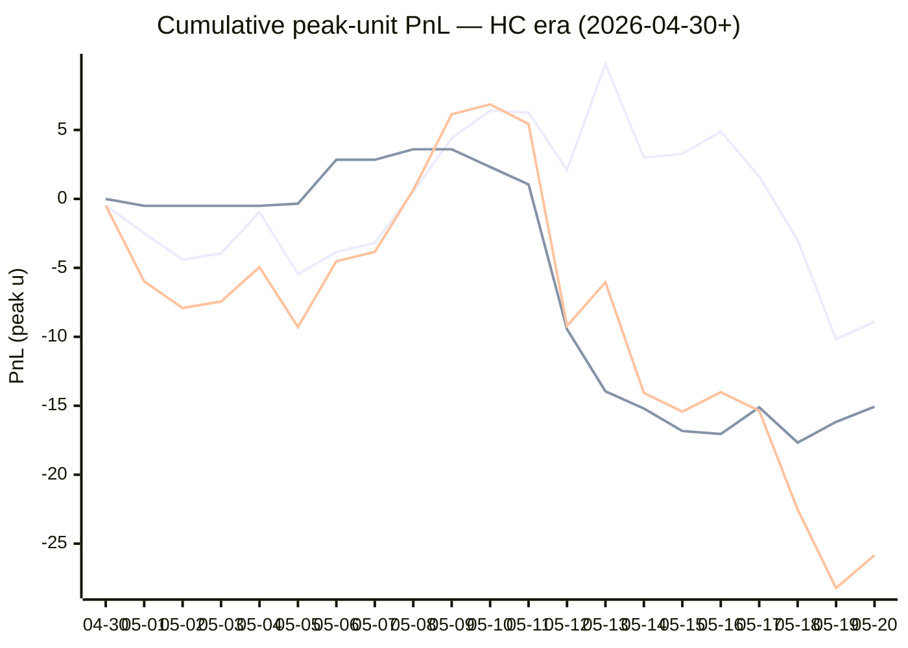

# Sharp Intel v6 — Daily Master Report

_Auto-generated **5/21/2026, 9:41:44 AM ET** by `scripts/dailyV6Report.js`. Do not edit by hand._

**Source of truth: this report mirrors the live Pick Performance dashboard.** Inclusion = `lockStage ≠ SHADOW ∧ ¬superseded ∧ health ∉ {MUTED, CANCELLED} ∧ peak.stars ≥ 2.5`. PnL is in **peak units** (the size shipped to users). HC margin / Δw / Δq are the **frozen** stamps written at last sync before the T-15 freeze. HC margin only existed from the v7.1 launch (**2026-04-30**); pre-launch picks have no HC value (no retro-fitting). Nothing is recomputed against today's whitelist.

v6 cutover: **2026-04-18** · whitelist source: live `sharpWalletProfiles` (181 profiles — drives §5 roster snapshot only) · quality cut: contribution ≥ 30 · HC = CONFIRMED tier ∧ sizeRatio ≥ 1.5.

---
## §1. Yesterday's picks

Slate: **2026-05-20** · 10 shipped sides.

| N | W-L-P | WR% | PnL (peak u) | PnL (flat 1u) |
|---|---|---|---|---|
| 10 | 6-4-0 | 60.0% | +2.38u | +0.75u |

| Sport | Market | Matchup | Pick | Stars · Units | HC | Δw | Δq | Σ | Odds | Result | PnL (peak u) |
|---|---|---|---|---|---|---|---|---|---|---|---|
| MLB | ML | Baltimore Orioles @ Tampa Bay Rays | Baltimore Orioles | 5.0★ · 2.50u | +1 | +2 | +0 | +2 | +113 | L | -2.50u |
| MLB | ML | Chicago White Sox @ Seattle Mariners | Seattle Mariners | 4.0★ · 2.75u | +0 | +2 | +1 | +3 | -154 | **W** | +1.85u |
| MLB | ML | Houston Astros @ Minnesota Twins | Minnesota Twins | 2.5★ · 0.50u | +1 | +1 | +0 | +1 | -140 | **W** | +0.89u |
| MLB | ML | New York Mets @ Washington Nationals | Washington Nationals | 2.5★ · 0.50u | +1 | +0 | +0 | +0 | +111 | **W** | +0.56u |
| MLB | ML | San Francisco Giants @ Arizona Diamondbacks | San Francisco Giants | 4.0★ · 2.75u | +1 | +1 | -1 | +0 | +113 | L | -2.75u |
| MLB | TOTAL | Chicago White Sox @ Seattle Mariners | Under 4.5 | 4.0★ · 0.75u | +0 | +2 | +2 | +4 | -110 | L | -0.75u |
| NBA | ML | Spurs @ Thunder | Thunder | 5.0★ · 5.00u | +5 | +10 | +9 | +19 | -225 | **W** | +2.10u |
| NBA | SPREAD | Spurs @ Thunder | Thunder | 5.0★ · 3.00u | +1 | +6 | +4 | +10 | -106 | **W** | +2.73u |
| NBA | TOTAL | Spurs @ Thunder | Over 215.5 | 5.0★ · 1.65u | +1 | +3 | +3 | +6 | -112 | **W** | +1.50u |
| NHL | ML | Golden Knights @ Avalanche | Avalanche | 2.5★ · 1.25u | +1 | +0 | +7 | +7 | -192 | L | -1.25u |

---
## §2. 3-day / 7-day / all-time cohort rollups

Shipped picks only. PnL in **peak units** (size we actually bet) and flat 1u (cohort EV lens). All margins are the engine's frozen stamps (`v8_hcMargin`, `v8_walletConsensusDelta`, `v8_walletConsensusQualityMargin`).

**HC margin sub-tables** are scoped to picks dated ≥ 2026-04-30 (the v7.1 launch — when HC margin became a real engine signal). Pre-launch picks are excluded from HC analysis since the feature didn't exist for them. Δw / Δq sub-tables span the full v6-era sample (≥ 2026-04-18). Empty buckets are dropped.

### §2a. 3-day

Total: **26** shipped · 13-13-0 · WR 50.0% · PnL -10.48u (peak) / -2.01u (flat).

**By HC margin** _(picks dated ≥ 2026-04-30, N = 26)_

| Bucket | N | W-L-P | WR% | PnL (peak u) | PnL (flat 1u) |
|---|---|---|---|---|---|
| HC ≥ +3 | 3 | 2-1-0 | 66.7% | +0.99u | -0.17u |
| HC = +2 | 3 | 0-3-0 | 0.0% | -12.25u | -3.00u |
| HC = +1 | 13 | 7-6-0 | 53.8% | +0.74u | +0.43u |
| HC = 0 | 7 | 4-3-0 | 57.1% | +0.04u | +0.73u |

**By Δw (winner margin)**

| Bucket | N | W-L-P | WR% | PnL (peak u) | PnL (flat 1u) |
|---|---|---|---|---|---|
| ≥ +3 | 6 | 4-2-0 | 66.7% | +1.09u | +1.19u |
| +2 | 11 | 5-6-0 | 45.5% | -6.07u | -1.37u |
| +1 | 6 | 2-4-0 | 33.3% | -6.70u | -2.32u |
| 0 | 3 | 2-1-0 | 66.7% | +1.20u | +0.49u |

**By Δq (quality margin)**

| Bucket | N | W-L-P | WR% | PnL (peak u) | PnL (flat 1u) |
|---|---|---|---|---|---|
| ≥ +3 | 6 | 4-2-0 | 66.7% | +1.97u | +0.67u |
| +2 | 6 | 3-3-0 | 50.0% | -3.45u | +0.19u |
| +1 | 8 | 3-5-0 | 37.5% | -7.09u | -2.59u |
| 0 | 4 | 3-1-0 | 75.0% | +3.34u | +1.73u |
| −1 | 2 | 0-2-0 | 0.0% | -5.25u | -2.00u |

**By AGS tier** _(picks dated ≥ 2026-05-05, N = 26)_

| Bucket | N | W-L-P | WR% | PnL (peak u) | PnL (flat 1u) |
|---|---|---|---|---|---|
| ELITE  (≥ +7) | 2 | 2-0-0 | 100.0% | +4.83u | +1.39u |
| LOCK   (+5 .. +7) | 2 | 1-1-0 | 50.0% | -1.11u | -0.62u |
| STRONG (+3 .. +5) | 4 | 1-3-0 | 25.0% | -7.99u | -2.09u |
| NEUT   (0 .. +3) | 15 | 8-7-0 | 53.3% | -3.27u | +0.20u |
| WEAK   (−1 .. 0) | 1 | 0-1-0 | 0.0% | -2.50u | -1.00u |
| FADE   (< −1) | 2 | 1-1-0 | 50.0% | -0.44u | +0.11u |

### §2b. 7-day

Total: **54** shipped · 27-27-0 · WR 50.0% · PnL -19.80u (peak) / -2.43u (flat).

**By HC margin** _(picks dated ≥ 2026-04-30, N = 54)_

| Bucket | N | W-L-P | WR% | PnL (peak u) | PnL (flat 1u) |
|---|---|---|---|---|---|
| HC ≥ +3 | 4 | 2-2-0 | 50.0% | +0.24u | -1.17u |
| HC = +2 | 5 | 1-4-0 | 20.0% | -12.00u | -2.85u |
| HC = +1 | 30 | 16-14-0 | 53.3% | -6.92u | +1.73u |
| HC = 0 | 15 | 8-7-0 | 53.3% | -1.12u | -0.14u |

**By Δw (winner margin)**

| Bucket | N | W-L-P | WR% | PnL (peak u) | PnL (flat 1u) |
|---|---|---|---|---|---|
| ≥ +3 | 14 | 9-5-0 | 64.3% | -3.82u | +4.56u |
| +2 | 19 | 8-11-0 | 42.1% | -10.54u | -4.42u |
| +1 | 12 | 6-6-0 | 50.0% | -3.62u | -0.85u |
| 0 | 9 | 4-5-0 | 44.4% | -1.82u | -1.72u |

**By Δq (quality margin)**

| Bucket | N | W-L-P | WR% | PnL (peak u) | PnL (flat 1u) |
|---|---|---|---|---|---|
| ≥ +3 | 14 | 10-4-0 | 71.4% | +8.24u | +5.61u |
| +2 | 13 | 5-8-0 | 38.5% | -16.55u | -2.95u |
| +1 | 16 | 8-8-0 | 50.0% | -3.70u | -1.72u |
| 0 | 7 | 4-3-0 | 57.1% | +0.71u | +0.63u |
| −1 | 2 | 0-2-0 | 0.0% | -5.25u | -2.00u |
| ≤ −2 | 2 | 0-2-0 | 0.0% | -3.25u | -2.00u |

**By AGS tier** _(picks dated ≥ 2026-05-05, N = 54)_

| Bucket | N | W-L-P | WR% | PnL (peak u) | PnL (flat 1u) |
|---|---|---|---|---|---|
| ELITE  (≥ +7) | 2 | 2-0-0 | 100.0% | +4.83u | +1.39u |
| LOCK   (+5 .. +7) | 3 | 1-2-0 | 33.3% | -3.61u | -1.62u |
| STRONG (+3 .. +5) | 7 | 3-4-0 | 42.9% | -9.25u | -1.71u |
| NEUT   (0 .. +3) | 30 | 14-16-0 | 46.7% | -11.03u | -3.41u |
| WEAK   (−1 .. 0) | 5 | 3-2-0 | 60.0% | -1.18u | +2.01u |
| FADE   (< −1) | 7 | 4-3-0 | 57.1% | +0.44u | +0.91u |

### §2c. All-time

Total: **230** shipped · 111-117-2 · WR 48.7% · PnL -38.07u (peak) / -9.26u (flat).

**By HC margin** _(picks dated ≥ 2026-04-30, N = 119)_

| Bucket | N | W-L-P | WR% | PnL (peak u) | PnL (flat 1u) |
|---|---|---|---|---|---|
| HC ≥ +3 | 5 | 2-3-0 | 40.0% | -3.26u | -2.17u |
| HC = +2 | 12 | 5-7-0 | 41.7% | -8.57u | -2.03u |
| HC = +1 | 68 | 39-29-0 | 57.4% | +2.93u | +9.33u |
| HC = 0 | 31 | 14-16-1 | 46.7% | -15.07u | -3.59u |
| HC ≤ −1 | 2 | 0-2-0 | 0.0% | -3.50u | -2.00u |

**By Δw (winner margin)**

| Bucket | N | W-L-P | WR% | PnL (peak u) | PnL (flat 1u) |
|---|---|---|---|---|---|
| ≥ +3 | 49 | 30-19-0 | 61.2% | +2.72u | +14.43u |
| +2 | 58 | 23-35-0 | 39.7% | -28.05u | -12.38u |
| +1 | 72 | 40-31-1 | 56.3% | +4.63u | +5.25u |
| 0 | 37 | 13-23-1 | 36.1% | -15.26u | -11.47u |
| −1 | 7 | 1-6-0 | 14.3% | -5.60u | -4.94u |
| ≤ −2 | 1 | 0-1-0 | 0.0% | -0.50u | -1.00u |
| missing | 6 | 4-2-0 | 66.7% | +3.99u | +0.85u |

**By Δq (quality margin)**

| Bucket | N | W-L-P | WR% | PnL (peak u) | PnL (flat 1u) |
|---|---|---|---|---|---|
| ≥ +3 | 80 | 40-38-2 | 51.3% | -13.02u | +2.47u |
| +2 | 55 | 25-30-0 | 45.5% | -22.30u | -4.23u |
| +1 | 57 | 28-29-0 | 49.1% | -4.25u | -4.36u |
| 0 | 22 | 9-13-0 | 40.9% | -1.88u | -3.41u |
| −1 | 6 | 4-2-0 | 66.7% | +3.71u | +1.55u |
| ≤ −2 | 4 | 1-3-0 | 25.0% | -3.57u | -2.04u |
| missing | 6 | 4-2-0 | 66.7% | +3.24u | +0.77u |

**By AGS tier** _(picks dated ≥ 2026-05-05, N = 94)_

| Bucket | N | W-L-P | WR% | PnL (peak u) | PnL (flat 1u) |
|---|---|---|---|---|---|
| ELITE  (≥ +7) | 3 | 3-0-0 | 100.0% | +8.01u | +2.34u |
| LOCK   (+5 .. +7) | 9 | 5-4-0 | 55.6% | -2.93u | -0.47u |
| STRONG (+3 .. +5) | 20 | 13-7-0 | 65.0% | -1.16u | +4.77u |
| NEUT   (0 .. +3) | 46 | 19-27-0 | 41.3% | -24.71u | -9.12u |
| WEAK   (−1 .. 0) | 6 | 3-3-0 | 50.0% | -3.18u | +1.01u |
| FADE   (< −1) | 9 | 5-4-0 | 55.6% | +1.45u | +1.25u |
| missing | 1 | 1-0-0 | 100.0% | +1.63u | +0.96u |

---
## §3. Edge over time — is HC margin creating winners?

Daily cumulative peak-unit PnL since the HC margin launch (**2026-04-30**). The `HC ≥ +1` line is the golden-standard cohort. The `HC = 0` line is the no-HC-signal control. The `All shipped (HC era)` line is every shipped pick from the same date range — the apples-to-apples baseline. Watch the spread.

Daily cumulative table (peak units, HC era only):

| Date | HC ≥ +1 (cum) | HC = 0 (cum) | All shipped (cum) |
|---|---|---|---|
| 2026-04-30 | -0.48u | +0.00u | -0.48u |
| 2026-05-01 | -2.48u | -0.50u | -5.98u |
| 2026-05-02 | -4.41u | -0.50u | -7.91u |
| 2026-05-03 | -3.94u | -0.50u | -7.44u |
| 2026-05-04 | -0.95u | -0.50u | -4.95u |
| 2026-05-05 | -5.45u | -0.34u | -9.29u |
| 2026-05-06 | -3.86u | +2.84u | -4.52u |
| 2026-05-07 | -3.18u | +2.84u | -3.84u |
| 2026-05-08 | +0.54u | +3.60u | +0.64u |
| 2026-05-09 | +4.41u | +3.60u | +6.14u |
| 2026-05-10 | +6.41u | +2.32u | +6.86u |
| 2026-05-11 | +6.25u | +1.05u | +5.43u |
| 2026-05-12 | +2.11u | -9.45u | -9.21u |
| 2026-05-13 | +9.78u | -13.95u | -6.04u |
| 2026-05-14 | +3.00u | -15.20u | -14.07u |
| 2026-05-15 | +3.27u | -16.83u | -15.43u |
| 2026-05-16 | +4.90u | -17.05u | -14.02u |
| 2026-05-17 | +1.62u | -15.11u | -15.36u |
| 2026-05-18 | -2.98u | -17.67u | -22.52u |
| 2026-05-19 | -10.18u | -16.17u | -28.22u |
| 2026-05-20 | -8.90u | -15.07u | -25.84u |

---
## §4. Wallet roster growth & profitability

"Tracked in sport X" = a wallet has placed **≥ 2 bets** in X within the v6-era sample. "Profitable" = cumulative flat PnL > 0. Source: `v8Scoring.walletDetails` on every graded v6-era game (every side, not just the shipped set).

### §4a. Per-sport wallet snapshot

| Sport | Total wallets seen | Tracked (≥2) | Profitable | % prof | WR ≥ 50% | WR ≥ 60% | WR ≥ 70% |
|---|---|---|---|---|---|---|---|
| MLB | 52 | 33 | 12 | 36% | 14 | 4 | 2 |
| NBA | 120 | 88 | 38 | 43% | 51 | 26 | 13 |
| NHL | 46 | 31 | 16 | 52% | 21 | 12 | 6 |
| **ALL (any sport)** | **141** | **106** | **48** | **45%** | **59** | **30** | **13** |

### §4b. Daily roster growth (cumulative through each date)

Format: `tracked (profitable)`. For each date D, recompute the roster using every bet up to and including D.

| Date | ALL | MLB | NBA | NHL |
|---|---|---|---|---|
| 2026-04-18 | 5 (2) | 2 (2) | 3 (0) | 0 (0) |
| 2026-04-19 | 19 (8) | 5 (3) | 9 (3) | 3 (1) |
| 2026-04-20 | 29 (12) | 7 (6) | 23 (8) | 5 (2) |
| 2026-04-21 | 44 (21) | 10 (6) | 31 (10) | 7 (5) |
| 2026-04-22 | 52 (28) | 12 (6) | 39 (15) | 11 (10) |
| 2026-04-23 | 56 (29) | 13 (6) | 46 (21) | 13 (10) |
| 2026-04-24 | 61 (30) | 14 (6) | 51 (23) | 14 (9) |
| 2026-04-25 | 65 (29) | 16 (8) | 54 (22) | 16 (9) |
| 2026-04-26 | 67 (31) | 18 (5) | 56 (25) | 17 (9) |
| 2026-04-27 | 72 (32) | 20 (7) | 60 (24) | 17 (9) |
| 2026-04-28 | 76 (33) | 21 (7) | 63 (26) | 23 (10) |
| 2026-04-29 | 77 (33) | 21 (7) | 64 (25) | 23 (10) |
| 2026-04-30 | 81 (34) | 21 (7) | 70 (27) | 23 (10) |
| 2026-05-01 | 85 (38) | 22 (5) | 74 (30) | 26 (13) |
| 2026-05-02 | 86 (37) | 23 (7) | 75 (32) | 26 (12) |
| 2026-05-03 | 86 (38) | 24 (8) | 75 (33) | 26 (12) |
| 2026-05-04 | 90 (38) | 24 (9) | 76 (32) | 26 (12) |
| 2026-05-05 | 91 (40) | 24 (9) | 79 (33) | 26 (12) |
| 2026-05-06 | 92 (40) | 24 (9) | 80 (33) | 26 (12) |
| 2026-05-07 | 92 (41) | 24 (9) | 80 (33) | 26 (12) |
| 2026-05-08 | 92 (40) | 24 (8) | 80 (32) | 26 (11) |
| 2026-05-09 | 94 (42) | 24 (8) | 82 (35) | 26 (11) |
| 2026-05-10 | 94 (42) | 24 (8) | 82 (35) | 26 (11) |
| 2026-05-11 | 96 (42) | 24 (8) | 84 (36) | 26 (11) |
| 2026-05-12 | 100 (41) | 27 (9) | 86 (37) | 26 (11) |
| 2026-05-13 | 102 (45) | 29 (11) | 88 (37) | 26 (11) |
| 2026-05-14 | 102 (41) | 29 (11) | 88 (37) | 28 (12) |
| 2026-05-15 | 103 (41) | 30 (10) | 88 (39) | 28 (12) |
| 2026-05-16 | 105 (43) | 31 (12) | 88 (39) | 30 (14) |
| 2026-05-17 | 105 (46) | 32 (11) | 88 (40) | 30 (14) |
| 2026-05-18 | 105 (46) | 32 (10) | 88 (38) | 31 (15) |
| 2026-05-19 | 105 (46) | 32 (12) | 88 (38) | 31 (15) |
| 2026-05-20 | 106 (48) | 33 (12) | 88 (38) | 31 (16) |

### §4c. Top 10 profitable wallets by sport

#### MLB

| # | Wallet | N | W | L | WR% | Flat PnL (u) | Flat ROI | $ PnL |
|---|---|---|---|---|---|---|---|---|
| 1 | c289a0 | 3 | 3 | 0 | 100.0% | +2.87 | +95.6% | $1.5K |
| 2 | eeabaf | 4 | 3 | 1 | 75.0% | +1.80 | +45.1% | $34.1K |
| 3 | c668b3 | 3 | 2 | 1 | 66.7% | +1.16 | +38.7% | $4.0K |
| 4 | 981187 | 8 | 5 | 3 | 62.5% | +1.65 | +20.7% | $13.5K |
| 5 | a10ff5 | 14 | 8 | 6 | 57.1% | +1.43 | +10.2% | $1.0K |
| 6 | 8ec926 | 4 | 2 | 2 | 50.0% | +0.29 | +7.2% | $6.0K |
| 7 | 70135d | 8 | 4 | 4 | 50.0% | +0.55 | +6.9% | $21.9K |
| 8 | 63fc82 | 15 | 8 | 7 | 53.3% | +0.91 | +6.1% | $104.4K |
| 9 | 4c64aa | 78 | 44 | 34 | 56.4% | +4.03 | +5.2% | $52.8K |
| 10 | bc35e3 | 16 | 9 | 7 | 56.3% | +0.77 | +4.8% | -$2.1K |

#### NBA

| # | Wallet | N | W | L | WR% | Flat PnL (u) | Flat ROI | $ PnL |
|---|---|---|---|---|---|---|---|---|
| 1 | 799fad | 2 | 2 | 0 | 100.0% | +5.66 | +283.0% | $241.7K |
| 2 | b51a56 | 5 | 5 | 0 | 100.0% | +6.44 | +128.9% | $74.8K |
| 3 | 4a9953 | 2 | 2 | 0 | 100.0% | +2.16 | +108.2% | $3.7K |
| 4 | 8ec926 | 6 | 6 | 0 | 100.0% | +5.53 | +92.1% | $12.8K |
| 5 | 12ad50 | 3 | 3 | 0 | 100.0% | +2.74 | +91.3% | $45.5K |
| 6 | 2e8da5 | 10 | 8 | 2 | 80.0% | +8.06 | +80.6% | $120.4K |
| 7 | 11b032 | 7 | 6 | 1 | 85.7% | +5.40 | +77.1% | $249.9K |
| 8 | 769c38 | 10 | 9 | 1 | 90.0% | +6.58 | +65.8% | $67.0K |
| 9 | 7f00bc | 15 | 10 | 5 | 66.7% | +8.67 | +57.8% | $11.2K |
| 10 | 92df91 | 19 | 13 | 6 | 68.4% | +8.99 | +47.3% | -$334 |

#### NHL

| # | Wallet | N | W | L | WR% | Flat PnL (u) | Flat ROI | $ PnL |
|---|---|---|---|---|---|---|---|---|
| 1 | fec67e | 2 | 2 | 0 | 100.0% | +2.84 | +142.0% | $13.1K |
| 2 | 8366f5 | 2 | 2 | 0 | 100.0% | +2.30 | +114.9% | $107.6K |
| 3 | 981187 | 5 | 5 | 0 | 100.0% | +5.03 | +100.6% | $30.3K |
| 4 | 799fad | 2 | 2 | 0 | 100.0% | +1.88 | +94.1% | $46.9K |
| 5 | 30935c | 4 | 3 | 1 | 75.0% | +2.11 | +52.7% | $953 |
| 6 | 6b853d | 7 | 5 | 2 | 71.4% | +2.02 | +28.9% | $8.4K |
| 7 | e70853 | 8 | 5 | 3 | 62.5% | +2.17 | +27.1% | -$45.2K |
| 8 | 7923c4 | 3 | 2 | 1 | 66.7% | +0.76 | +25.4% | $12.3K |
| 9 | fcc12b | 9 | 6 | 3 | 66.7% | +1.91 | +21.3% | -$95.8K |
| 10 | c5cea1 | 3 | 2 | 1 | 66.7% | +0.62 | +20.7% | $22.1K |

---
## §5. Proven-wallet roster growth & HC tracking

"Proven wallet" = whitelist tier `CONFIRMED` or `FLAT` in the same sense the live engine uses (`exportWalletProfiles.js` → `sharpWalletProfiles.bySport`). Sports inherit independent rosters: a wallet can be CONFIRMED in NBA and absent from NHL. `walletBets` come from `v8Scoring.walletDetails` on every graded v6-era pick (Source A); `positionRows` come from `sharp_action_positions` (Source B).

### §5a. Current proven-winner roster (snapshot)

Roster as of **2026-05-20** — wallets with ≥2 bets in the sport.

| Sport | Wallets seen | Eligible (≥2) | CONFIRMED | FLAT | Proven (C+F) | WR50 only | Conv % |
|---|---|---|---|---|---|---|---|
| MLB | 92 | 33 | 6 | 6 | **12** | 2 | 13.0% |
| NBA | 179 | 88 | 25 | 13 | **38** | 17 | 21.2% |
| NHL | 84 | 31 | 11 | 5 | **16** | 6 | 19.0% |
| **ALL** | **—** | **—** | **—** | **—** | **66** | **—** | **—** |

### §5b. Live whitelist drift check

Live `sharpWalletProfiles` is what the engine reads at lock time. Drift between script reconstruction (above) and live should be ≤ 1 day of position data — otherwise `exportWalletProfiles.js` is stale.

| Sport | CONFIRMED (live · script) | FLAT (live · script) | WR50 (live · script) | Drift |
|---|---|---|---|---|
| MLB | 15 · 6 | 7 · 6 | 2 · 2 | +10 live |
| NBA | 41 · 25 | 16 · 13 | 19 · 17 | +19 live |
| NHL | 14 · 11 | 4 · 5 | 6 · 6 | +2 live |

### §5c. Roster growth — 3d / 7d / 30d / all-time deltas

Each cell is **net growth** in proven (CONFIRMED + FLAT) wallets in that window, with the absolute count at the start (`+Δ from N`). Negative = wallets demoted. Window endpoint = 2026-05-20.

| Sport | 3-day | 7-day | 30-day | All-time (since cutover) |
|---|---|---|---|---|
| MLB | +1 from 11 | +1 from 11 | +6 from 6 | +12 from 0 |
| NBA | -2 from 40 | +1 from 37 | +30 from 8 | +38 from 0 |
| NHL | +2 from 14 | +5 from 11 | +14 from 2 | +16 from 0 |

A flat 7-day delta on a sport with healthy slate density = either the bubble pipeline has stalled (no wallets approaching the bar) or our cohort has saturated. Check §13d for the funnel diagnostic.

### §5d. Pipeline funnel — where each sport leaks

Wallets surviving each gate, in order. The biggest %-drop tells you the bottleneck. Gates:

1. **Seen** — placed ≥ 1 bet in the sport (any source)
2. **Eligible** — ≥ 2 graded picks in Source A (required for FLAT/CONFIRMED)
3. **Flat-OK** — eligible AND flat ROI > 0 (becomes FLAT or better)
4. **$-OK** — Flat-OK AND ≥2 positions with dollar ROI > 0 (CONFIRMED)
5. **Promoted** — final whitelisted = CONFIRMED + FLAT

| Sport | 1·Seen | 2·Eligible (% of Seen) | 3·Flat-OK (% of Elig) | 4·$-OK (% of Flat) | 5·Promoted | Bottleneck |
|---|---|---|---|---|---|---|
| MLB | 92 | 33 (36%) | 12 (36%) | 6 (50%) | **12** | sample (Seen→Eligible) 64% |
| NBA | 179 | 88 (49%) | 38 (43%) | 25 (66%) | **38** | edge (Eligible→Flat-OK) 57% |
| NHL | 84 | 31 (37%) | 16 (52%) | 11 (69%) | **16** | sample (Seen→Eligible) 63% |

### §5e. HC backing density (the fuel for v7.3 HC margin)

Every v7.x promotion is gated on `HC_m ≥ +1`, which requires at least one CONFIRMED wallet sized at `≥ 1.5×` average on the for-side. This table shows the share of shipped picks that *had any HC backing*, by sport, in each window. If HC density falls toward zero in a sport, the v7.3 floor cohorts (Σ=1, Σ=2 locks; HC rescues) will simply stop firing there.

| Sport | Window | Picks (with HC stamp) | Any HC for-side | HC_m ≥ +1 | HC_m ≥ +2 |
|---|---|---|---|---|---|
| MLB | 3-day | 15 | 8 (53.3%) | 8 (53.3%) | 0 (0.0%) |
| MLB | 7-day | 35 | 22 (62.9%) | 22 (62.9%) | 2 (5.7%) |
| MLB | All-time | 97 | 51 (52.6%) | 50 (51.5%) | 5 (5.2%) |
| NBA | 3-day | 8 | 8 (100.0%) | 8 (100.0%) | 5 (62.5%) |
| NBA | 7-day | 14 | 12 (85.7%) | 12 (85.7%) | 6 (42.9%) |
| NBA | All-time | 100 | 61 (61.0%) | 54 (54.0%) | 23 (23.0%) |
| NHL | 3-day | 3 | 3 (100.0%) | 3 (100.0%) | 1 (33.3%) |
| NHL | 7-day | 5 | 5 (100.0%) | 5 (100.0%) | 1 (20.0%) |
| NHL | All-time | 27 | 12 (44.4%) | 11 (40.7%) | 2 (7.4%) |

Pooled across sports:

| Window | Picks (with HC stamp) | Any HC for-side | HC_m ≥ +1 | HC_m ≥ +2 |
|---|---|---|---|---|
| 3-day | 26 | 19 (73.1%) | 19 (73.1%) | 6 (23.1%) |
| 7-day | 54 | 39 (72.2%) | 39 (72.2%) | 9 (16.7%) |
| All-time | 224 | 124 (55.4%) | 115 (51.3%) | 30 (13.4%) |

### §5f. Bubble wallets — next-up graduations

Wallets currently NOT promoted but close. Two flavors:

- **One-bet-away** — won the only bet, needs one more positive bet to clear ≥2.
- **Just-under** — has ≥2 bets but flat ROI is between −10% and 0% (one win flips them).

#### MLB

**One-bet-away** (6)

| wallet | picksN | flat PnL | pos N | pos $ROI |
|---|---|---|---|---|
| `...1fc6` | 1 | +1.30 | 8 | 52% |
| `...0232` | 1 | +0.91 | 7 | 93% |
| `...be00` | 1 | +0.87 | 11 | -8% |
| `...a240` | 1 | +0.87 | 7 | 83% |
| `...9373` | 1 | +0.87 | 0 | — |
| `...8d26` | 1 | +0.72 | 5 | -22% |

**Just-under** (4)

| wallet | picksN | WR | flat ROI | pos N | pos $ROI |
|---|---|---|---|---|---|
| `...2f63` | 73 | 51% | -0.6% | 433 | -13% |
| `...23c4` | 6 | 50% | -2.5% | 89 | -31% |
| `...2768` | 13 | 46% | -3.8% | 30 | 19% |
| `...9a27` | 82 | 48% | -8.2% | 269 | -1% |

#### NBA

**One-bet-away** (6)

| wallet | picksN | flat PnL | pos N | pos $ROI |
|---|---|---|---|---|
| `...bf5d` | 1 | +3.15 | 3 | 42% |
| `...ed41` | 1 | +3.15 | 3 | 3% |
| `...6b87` | 1 | +2.05 | 8 | -27% |
| `...9d74` | 1 | +0.93 | 20 | -48% |
| `...c556` | 1 | +0.93 | 3 | 42% |
| `...5c69` | 1 | +0.91 | 2 | 28% |

**Just-under** (6)

| wallet | picksN | WR | flat ROI | pos N | pos $ROI |
|---|---|---|---|---|---|
| `...d814` | 8 | 50% | -0.5% | 47 | -9% |
| `...b33b` | 10 | 30% | -0.9% | 32 | 10% |
| `...65dd` | 6 | 50% | -2.4% | 17 | 27% |
| `...f5b0` | 20 | 50% | -3.7% | 57 | -28% |
| `...1fc6` | 4 | 50% | -3.7% | 9 | 17% |
| `...1eae` | 17 | 53% | -4.2% | 65 | 13% |

#### NHL

**One-bet-away** (6)

| wallet | picksN | flat PnL | pos N | pos $ROI |
|---|---|---|---|---|
| `...2e78` | 1 | +1.46 | 0 | — |
| `...017f` | 1 | +1.45 | 5 | 125% |
| `...5ad0` | 1 | +1.42 | 7 | 28% |
| `...32f2` | 1 | +1.40 | 0 | — |
| `...e0fd` | 1 | +1.20 | 3 | 124% |
| `...266e` | 1 | +1.05 | 0 | — |

**Just-under** (4)

| wallet | picksN | WR | flat ROI | pos N | pos $ROI |
|---|---|---|---|---|---|
| `...33ee` | 4 | 50% | -0.3% | 8 | -23% |
| `...618e` | 2 | 50% | -6.1% | 28 | 24% |
| `...3782` | 2 | 50% | -9.0% | 20 | 27% |
| `...d227` | 2 | 50% | -9.0% | 18 | 20% |

### §5g. v2 wallet-promotion pipeline (Source-A / Source-B mix)

Live snapshot of the v2 promotion gate (shipped 2026-05-10, re-eval **2026-05-24**). Each FLAT-or-better wallet × sport pair is attributed to one of three paths via `sharpWalletProfiles[wallet].bySport[sport].whitelistSource`:

- **A** — flat-positive on featured picks (Source A) only — the v1 gate
- **A+B** — flat-positive in both sources (most reliable signal)
- **B** — flat-positive on-chain only (NEW in v2 — the trial lift)

Re-classified every 2h via `grade-sharp-actions` cron. Roll-back: set `B_ONLY_MIN_BETS = Infinity` in `scripts/exportWalletProfiles.js`.

#### Source mix per sport (live Firestore)

| Sport | A | A+B | B (new) | FLAT-or-better total | % from B-only |
|---|---|---|---|---|---|
| MLB | 4 | 4 | **14** | 22 | 63.6% |
| NBA | 17 | 19 | **21** | 57 | 36.8% |
| NHL | 5 | 6 | **7** | 18 | 38.9% |
| **ALL** | **26** | **29** | **42** | **97** | **43.3%** |

#### Pipeline freshness

- `sharp_action_positions` GRADED rows: **7348**
- `sharp_action_positions` PENDING rows: **108** (queued for next Grade Sharp Actions run)
- Latest `sharpWalletProfiles` rebuild: 5/12/2026, 5:34:36 AM ET — **13207 min · STALE** — check grade-sharp-actions workflow

**Alarms**: pending > 200 OR rebuild lag > 4h → cron is lagging or failing — check `gh run list --workflow="Grade Sharp Actions"`.

#### B-only roster — wallets currently promoted via Source B path only

Wallets here would have been EXCLUDED under v1 (Source-A-only). Top by Source-B bet count per sport. The 2-week re-eval (2026-05-24) will compare these wallets' realized lift against A-only and A+B cohorts.

**MLB** — 14 wallets promoted via B

| wallet | tier | B_n | B_flat ROI | B_$ ROI |
|---|---|---|---|---|
| `...9a27` | CONFIRMED | 171 | +17.8% | +7.9% |
| `...1eae` | CONFIRMED | 32 | +4.3% | +0.1% |
| `...5143` | CONFIRMED | 31 | +17.9% | +19.7% |
| `...d6d2` | FLAT | 16 | +9.2% | -1.6% |
| `...0ff5` | FLAT | 13 | +1.8% | -23.5% |
| `...a9cc` | CONFIRMED | 8 | +6.3% | +0.3% |
| `...9d74` | CONFIRMED | 7 | +24.2% | +43.8% |
| `...aeeb` | CONFIRMED | 7 | +35.4% | +37.5% |
| `...2768` | CONFIRMED | 7 | +97.4% | +105.9% |
| `...35e3` | CONFIRMED | 6 | +29.9% | +35.5% |
| … | 4 more | | | |

**NBA** — 21 wallets promoted via B

| wallet | tier | B_n | B_flat ROI | B_$ ROI |
|---|---|---|---|---|
| `...2f63` | CONFIRMED | 162 | +1.4% | +2.3% |
| `...1eae` | CONFIRMED | 59 | +5.3% | +14.3% |
| `...3782` | CONFIRMED | 47 | +18.5% | +13.3% |
| `...11a4` | CONFIRMED | 31 | +44.9% | +36.7% |
| `...935c` | FLAT | 29 | +62.5% | -22.6% |
| `...68b3` | CONFIRMED | 16 | +28.5% | +18.4% |
| `...1697` | CONFIRMED | 15 | +14.1% | +29.5% |
| `...abaf` | CONFIRMED | 15 | +38.8% | +14.6% |
| `...2db4` | CONFIRMED | 13 | +4.9% | +3.3% |
| `...89a0` | FLAT | 13 | +38.5% | -14.4% |
| … | 11 more | | | |

**NHL** — 7 wallets promoted via B

| wallet | tier | B_n | B_flat ROI | B_$ ROI |
|---|---|---|---|---|
| `...3782` | CONFIRMED | 18 | +17.5% | +26.7% |
| `...df91` | FLAT | 17 | +9.2% | -15% |
| `...b33b` | CONFIRMED | 12 | +12% | +1.6% |
| `...23c4` | CONFIRMED | 10 | +19.9% | +27.4% |
| `...9ef0` | FLAT | 9 | +0.7% | -4.2% |
| `...68b3` | CONFIRMED | 9 | +20.6% | +63.3% |
| `...a9cc` | CONFIRMED | 7 | +49.5% | +46.9% |

### §5 — How to read

- **Roster growth flat in 7-day** + **funnel bottleneck = `data`** → re-run `exportWalletProfiles.js`. The flat-positive wallets are stuck at FLAT because Source-B coverage hasn't caught up. CONFIRMED gate is data-bound, not skill-bound.
- **Roster growth flat in 7-day** + **funnel bottleneck = `sample`** → wallets aren't reaching `≥2` reps fast enough. This is a slate-density problem; consider a soft `MIN_BETS = 1` shadow lane to surface bubble wallets earlier.
- **Roster shrank** (negative delta) → a previously CONFIRMED wallet just dropped flat-positive (lost a recent bet). Variance, not failure — but worth noting if a sport loses ≥3 in a week.
- **HC density on a sport drops below ~30%** → v7.3 promotions there will starve. Either the proven roster needs more CONFIRMED-tier wallets sizing aggressively, or the HC_RATIO (1.5) needs a sport-specific tune.
- **§5g B-only count drops sharply** → wallets are demoting off the B path (losing on-chain). Cross-check `WALLET_PROFILES_SUMMARY.md` churn section for the specific demotions.
- **§5g pipeline freshness lag > 4h** → grade-sharp-actions cron is failing. Check `gh run list --workflow="Grade Sharp Actions"` and re-trigger if needed.

---
## §6. Daily proven-wallet performance

Who on the proven roster is actually printing — yesterday's bets, the rolling leaderboard (`$ PnL`-ranked), current streaks, and per-sport volume. **Proven** = `CONFIRMED` ∪ `FLAT` per sport (the same gate that drives Δ_winner). A wallet only counts in a sport where it's on that sport's proven list.

### §6a. Yesterday's proven-wallet bets

Slate: **2026-05-20** · 30 bets · 16 distinct proven wallets · WR 73% · $ vol $700.8K · $ PnL $80.3K.

| Wallet | Sport | Market | Game | $ size | Result | $ PnL |
|---|---|---|---|---|---|---|
| `...9a27` (CONFIRMED) | NBA | SPREAD | Spurs @ Thunder | $171.0K | **W** | $155.5K |
| `...64aa` (CONFIRMED) | MLB | ML | San Francisco Giants @ Arizona Diamondbacks | $34.8K | **W** | $34.8K |
| `...aeeb` (CONFIRMED) | NBA | ML | Spurs @ Thunder | $64.5K | **W** | $27.1K |
| `...64aa` (CONFIRMED) | MLB | ML | Chicago White Sox @ Seattle Mariners | $31.3K | **W** | $21.0K |
| `...abaf` (CONFIRMED) | MLB | TOTAL | Toronto Blue Jays @ New York Yankees | $22.7K | **W** | $20.1K |
| `...9a27` (CONFIRMED) | NBA | TOTAL | Spurs @ Thunder | $20.4K | **W** | $18.5K |
| `...64aa` (CONFIRMED) | MLB | ML | Pittsburgh Pirates @ St. Louis Cardinals | $15.7K | **W** | $15.7K |
| `...d49f` (FLAT) | NBA | TOTAL | Spurs @ Thunder | $14.7K | **W** | $13.4K |
| `...03d4` (FLAT) | NBA | SPREAD | Spurs @ Thunder | $11.0K | **W** | $10.0K |
| `...64aa` (CONFIRMED) | MLB | ML | Los Angeles Dodgers @ San Diego Padres | $14.3K | **W** | $7.3K |
| `...64aa` (CONFIRMED) | MLB | ML | Athletics @ Los Angeles Angels | $4.5K | **W** | $3.6K |
| `...aeeb` (CONFIRMED) | NBA | SPREAD | Spurs @ Thunder | $3.8K | **W** | $3.4K |
| `...03d4` (FLAT) | NBA | TOTAL | Spurs @ Thunder | $3.3K | **W** | $3.0K |
| `...0ff5` (FLAT) | MLB | TOTAL | Cleveland Guardians @ Detroit Tigers | $3.3K | **W** | $2.8K |
| `...df91` (FLAT) | NBA | ML | Spurs @ Thunder | $5.0K | **W** | $2.1K |
| `...a240` (CONFIRMED) | NHL | ML | Golden Knights @ Avalanche | $3.0K | **W** | $1.7K |
| `...0f9a` (CONFIRMED) | NBA | ML | Spurs @ Thunder | $4.0K | **W** | $1.7K |
| `...35e3` (FLAT) | MLB | TOTAL | Cincinnati Reds @ Philadelphia Phillies | $1.5K | **W** | $1.4K |
| `...68b3` (CONFIRMED) | NHL | ML | Golden Knights @ Avalanche | $2.0K | **W** | $1.2K |
| `...35e3` (FLAT) | MLB | ML | Chicago White Sox @ Seattle Mariners | $1.7K | **W** | $1.1K |
| `...2f63` (CONFIRMED) | NBA | TOTAL | Spurs @ Thunder | $913 | **W** | $830 |
| `...2f63` (CONFIRMED) | NBA | SPREAD | Spurs @ Thunder | $872 | **W** | $793 |
| `...0ff5` (FLAT) | MLB | TOTAL | New York Mets @ Washington Nationals | $3.6K | L | -$3.6K |
| `...64aa` (CONFIRMED) | MLB | ML | Cincinnati Reds @ Philadelphia Phillies | $12.1K | L | -$12.1K |
| `...64aa` (CONFIRMED) | MLB | ML | New York Mets @ Washington Nationals | $15.9K | L | -$15.9K |
| `...3532` (FLAT) | NHL | ML | Golden Knights @ Avalanche | $18.6K | L | -$18.6K |
| `...2f63` (CONFIRMED) | NBA | ML | Spurs @ Thunder | $18.9K | L | -$18.9K |
| `...64aa` (CONFIRMED) | MLB | ML | Boston Red Sox @ Kansas City Royals | $22.2K | L | -$22.2K |
| `...0853` (CONFIRMED) | NHL | ML | Golden Knights @ Avalanche | $47.4K | L | -$47.4K |
| `...d96a` (FLAT) | NBA | ML | Spurs @ Thunder | $128.0K | L | -$128.0K |

### §6b. Proven-wallet leaderboard

Top 15 proven `(wallet × sport)` pairs per sport per horizon, ranked by **$ PnL** (the dollar-ROI lens). The 3-day board is the "who's on form right now" lens; the 7-day filters single-day variance; all-time is the proven-roster reference.

#### §6b-1. 3-day

**MLB** — 6 active proven wallets

| # | Wallet | Tier | Bets | WR% | Bets/day | Flat PnL (u) | Flat ROI | $ vol | $ PnL | $ ROI | Streak |
|---|---|---|---|---|---|---|---|---|---|---|---|
| 1 | `...fc82` | FLAT | 1 | 100% | 1.0 | +1.15 | +115% | $76.6K | $88.1K | +115% | 1W |
| 2 | `...64aa` | CONFIRMED | 17 | 53% | 5.7 | -0.38 | -2% | $324.5K | $52.7K | +16% | 3W |
| 3 | `...abaf` | CONFIRMED | 1 | 100% | 1.0 | +0.88 | +88% | $22.7K | $20.1K | +88% | 1W |
| 4 | `...0ff5` | FLAT | 3 | 67% | 1.5 | +0.76 | +25% | $17.1K | $8.5K | +50% | 1L |
| 5 | `...9d74` | FLAT | 4 | 50% | 2.0 | -0.12 | -3% | $12.0K | $4.6K | +39% | 1W |
| 6 | `...35e3` | FLAT | 6 | 67% | 3.0 | +1.41 | +23% | $14.7K | $317 | +2% | 4W |

**NBA** — 18 active proven wallets

| # | Wallet | Tier | Bets | WR% | Bets/day | Flat PnL (u) | Flat ROI | $ vol | $ PnL | $ ROI | Streak |
|---|---|---|---|---|---|---|---|---|---|---|---|
| 1 | `...2f63` | CONFIRMED | 9 | 89% | 3.0 | +6.90 | +77% | $155.2K | $210.2K | +135% | 2W |
| 2 | `...d96a` | FLAT | 2 | 50% | 0.7 | +1.00 | +50% | $224.0K | $64.0K | +29% | 1L |
| 3 | `...be3d` | CONFIRMED | 1 | 100% | 1.0 | +0.93 | +93% | $68.8K | $63.7K | +93% | 1W |
| 4 | `...9a27` | CONFIRMED | 7 | 29% | 2.3 | -3.18 | -45% | $302.5K | $62.9K | +21% | 2W |
| 5 | `...aeeb` | CONFIRMED | 3 | 67% | 1.0 | +0.33 | +11% | $74.8K | $24.0K | +32% | 2W |
| 6 | `...d49f` | FLAT | 2 | 100% | 1.0 | +1.80 | +90% | $16.1K | $14.6K | +91% | 2W |
| 7 | `...9c38` | CONFIRMED | 1 | 100% | 1.0 | +0.38 | +38% | $20.7K | $7.8K | +38% | 1W |
| 8 | `...c926` | CONFIRMED | 1 | 100% | 1.0 | +0.93 | +93% | $4.6K | $4.3K | +93% | 1W |
| 9 | `...32f2` | CONFIRMED | 1 | 100% | 1.0 | +0.93 | +93% | $3.9K | $3.6K | +93% | 1W |
| 10 | `...df91` | FLAT | 1 | 100% | 1.0 | +0.42 | +42% | $5.0K | $2.1K | +42% | 1W |
| 11 | `...03d4` | FLAT | 5 | 40% | 1.7 | -1.18 | -24% | $25.2K | $1.9K | +8% | 2W |
| 12 | `...0f9a` | CONFIRMED | 1 | 100% | 1.0 | +0.42 | +42% | $4.0K | $1.7K | +42% | 1W |
| 13 | `...853d` | CONFIRMED | 2 | 0% | 2.0 | -2.00 | -100% | $3.0K | -$3.0K | -100% | 2L |
| 14 | `...017f` | CONFIRMED | 2 | 50% | 2.0 | -0.11 | -5% | $34.6K | -$6.3K | -18% | 1W |
| 15 | `...9ef0` | CONFIRMED | 3 | 67% | 1.5 | +0.91 | +30% | $29.7K | -$16.8K | -57% | 2W |

**NHL** — 8 active proven wallets

| # | Wallet | Tier | Bets | WR% | Bets/day | Flat PnL (u) | Flat ROI | $ vol | $ PnL | $ ROI | Streak |
|---|---|---|---|---|---|---|---|---|---|---|---|
| 1 | `...a240` | CONFIRMED | 2 | 100% | 0.7 | +1.46 | +73% | $6.6K | $4.9K | +74% | 2W |
| 2 | `...68b3` | CONFIRMED | 1 | 100% | 1.0 | +0.57 | +57% | $2.0K | $1.2K | +57% | 1W |
| 3 | `...853d` | CONFIRMED | 1 | 100% | 1.0 | +0.89 | +89% | $886 | $791 | +89% | 1W |
| 4 | `...df91` | FLAT | 1 | 0% | 1.0 | -1.00 | -100% | $3.3K | -$3.3K | -100% | 1L |
| 5 | `...23c4` | CONFIRMED | 2 | 50% | 2.0 | -0.11 | -5% | $102.0K | -$5.5K | -5% | 1W |
| 6 | `...3532` | FLAT | 1 | 0% | 1.0 | -1.00 | -100% | $18.6K | -$18.6K | -100% | 1L |
| 7 | `...0853` | CONFIRMED | 1 | 0% | 1.0 | -1.00 | -100% | $47.4K | -$47.4K | -100% | 1L |
| 8 | `...c12b` | CONFIRMED | 1 | 0% | 1.0 | -1.00 | -100% | $91.1K | -$91.1K | -100% | 1L |

#### §6b-2. 7-day

**MLB** — 8 active proven wallets

| # | Wallet | Tier | Bets | WR% | Bets/day | Flat PnL (u) | Flat ROI | $ vol | $ PnL | $ ROI | Streak |
|---|---|---|---|---|---|---|---|---|---|---|---|
| 1 | `...64aa` | CONFIRMED | 34 | 59% | 4.9 | +3.74 | +11% | $614.2K | $111.2K | +18% | 3W |
| 2 | `...fc82` | FLAT | 3 | 33% | 0.5 | -0.85 | -28% | $81.9K | $82.9K | +101% | 1W |
| 3 | `...abaf` | CONFIRMED | 4 | 75% | 0.8 | +1.80 | +45% | $85.4K | $34.1K | +40% | 3W |
| 4 | `...0ff5` | FLAT | 9 | 67% | 1.3 | +2.44 | +27% | $52.9K | $13.2K | +25% | 1L |
| 5 | `...135d` | CONFIRMED | 6 | 50% | 1.5 | +0.64 | +11% | $15.7K | $12.4K | +79% | 1L |
| 6 | `...9d74` | FLAT | 14 | 50% | 2.3 | -0.38 | -3% | $27.9K | $6.5K | +23% | 1W |
| 7 | `...35e3` | FLAT | 11 | 64% | 1.6 | +2.26 | +21% | $45.0K | $1.8K | +4% | 4W |
| 8 | `...c926` | CONFIRMED | 2 | 50% | 1.0 | +0.38 | +19% | $5.8K | $1.1K | +18% | 1L |

**NBA** — 23 active proven wallets

| # | Wallet | Tier | Bets | WR% | Bets/day | Flat PnL (u) | Flat ROI | $ vol | $ PnL | $ ROI | Streak |
|---|---|---|---|---|---|---|---|---|---|---|---|
| 1 | `...2ca8` | CONFIRMED | 2 | 100% | 2.0 | +1.94 | +97% | $196.0K | $258.7K | +132% | 2W |
| 2 | `...2f63` | CONFIRMED | 18 | 78% | 3.0 | +10.74 | +60% | $276.5K | $179.5K | +65% | 2W |
| 3 | `...be3d` | CONFIRMED | 1 | 100% | 1.0 | +0.93 | +93% | $68.8K | $63.7K | +93% | 1W |
| 4 | `...e8f1` | FLAT | 2 | 100% | 0.7 | +2.04 | +102% | $97.8K | $45.1K | +46% | 2W |
| 5 | `...66f5` | FLAT | 3 | 67% | 1.0 | +0.94 | +31% | $85.0K | $23.6K | +28% | 1L |
| 6 | `...aeeb` | CONFIRMED | 4 | 50% | 0.7 | -0.67 | -17% | $78.0K | $20.8K | +27% | 2W |
| 7 | `...03d4` | FLAT | 9 | 56% | 1.5 | +0.74 | +8% | $43.3K | $9.7K | +22% | 2W |
| 8 | `...d49f` | FLAT | 3 | 67% | 0.5 | +0.80 | +27% | $22.1K | $8.7K | +39% | 2W |
| 9 | `...c926` | CONFIRMED | 1 | 100% | 1.0 | +0.93 | +93% | $4.6K | $4.3K | +93% | 1W |
| 10 | `...9c38` | CONFIRMED | 2 | 50% | 0.7 | -0.62 | -31% | $24.4K | $4.1K | +17% | 1W |
| 11 | `...9ef0` | CONFIRMED | 8 | 75% | 1.6 | +3.81 | +48% | $52.7K | $3.6K | +7% | 2W |
| 12 | `...32f2` | CONFIRMED | 1 | 100% | 1.0 | +0.93 | +93% | $3.9K | $3.6K | +93% | 1W |
| 13 | `...df91` | FLAT | 4 | 100% | 0.7 | +3.96 | +99% | $5.9K | $3.0K | +52% | 4W |
| 14 | `...0f9a` | CONFIRMED | 1 | 100% | 1.0 | +0.42 | +42% | $4.0K | $1.7K | +42% | 1W |
| 15 | `...00bc` | CONFIRMED | 2 | 50% | 0.7 | +0.50 | +25% | $7.5K | $60 | +1% | 1L |

**NHL** — 10 active proven wallets

| # | Wallet | Tier | Bets | WR% | Bets/day | Flat PnL (u) | Flat ROI | $ vol | $ PnL | $ ROI | Streak |
|---|---|---|---|---|---|---|---|---|---|---|---|
| 1 | `...66f5` | FLAT | 2 | 100% | 0.7 | +2.30 | +115% | $78.8K | $107.6K | +137% | 2W |
| 2 | `...a240` | CONFIRMED | 5 | 80% | 0.7 | +2.76 | +55% | $18.3K | $10.0K | +55% | 4W |
| 3 | `...c67e` | CONFIRMED | 1 | 100% | 1.0 | +1.42 | +142% | $3.2K | $4.6K | +142% | 1W |
| 4 | `...df91` | FLAT | 3 | 67% | 0.6 | +1.30 | +43% | $6.8K | $1.6K | +24% | 1L |
| 5 | `...68b3` | CONFIRMED | 1 | 100% | 1.0 | +0.57 | +57% | $2.0K | $1.2K | +57% | 1W |
| 6 | `...853d` | CONFIRMED | 1 | 100% | 1.0 | +0.89 | +89% | $886 | $791 | +89% | 1W |
| 7 | `...23c4` | CONFIRMED | 2 | 50% | 2.0 | -0.11 | -5% | $102.0K | -$5.5K | -5% | 1W |
| 8 | `...3532` | FLAT | 2 | 0% | 0.4 | -2.00 | -100% | $20.6K | -$20.6K | -100% | 2L |
| 9 | `...0853` | CONFIRMED | 1 | 0% | 1.0 | -1.00 | -100% | $47.4K | -$47.4K | -100% | 1L |
| 10 | `...c12b` | CONFIRMED | 2 | 0% | 0.7 | -2.00 | -100% | $165.9K | -$165.9K | -100% | 2L |

#### §6b-3. All-time

**MLB** — 12 active proven wallets

| # | Wallet | Tier | Bets | WR% | Bets/day | Flat PnL (u) | Flat ROI | $ vol | $ PnL | $ ROI | Streak |
|---|---|---|---|---|---|---|---|---|---|---|---|
| 1 | `...fc82` | FLAT | 15 | 53% | 0.5 | +0.91 | +6% | $312.9K | $104.4K | +33% | 1W |
| 2 | `...64aa` | CONFIRMED | 78 | 56% | 2.4 | +4.03 | +5% | $1.37M | $52.8K | +4% | 3W |
| 3 | `...abaf` | CONFIRMED | 4 | 75% | 0.8 | +1.80 | +45% | $85.4K | $34.1K | +40% | 3W |
| 4 | `...5143` | CONFIRMED | 10 | 50% | 0.4 | +0.27 | +3% | $317.6K | $26.2K | +8% | 1W |
| 5 | `...135d` | CONFIRMED | 8 | 50% | 1.6 | +0.55 | +7% | $27.1K | $21.9K | +81% | 1L |
| 6 | `...1187` | FLAT | 8 | 63% | 2.7 | +1.65 | +21% | $30.5K | $13.5K | +44% | 1W |
| 7 | `...9d74` | FLAT | 19 | 53% | 2.4 | +0.53 | +3% | $35.2K | $8.6K | +24% | 1W |
| 8 | `...c926` | CONFIRMED | 4 | 50% | 0.3 | +0.29 | +7% | $14.1K | $6.0K | +42% | 1L |
| 9 | `...68b3` | CONFIRMED | 3 | 67% | 0.2 | +1.16 | +39% | $3.9K | $4.0K | +104% | 1W |
| 10 | `...89a0` | FLAT | 3 | 100% | 0.4 | +2.87 | +96% | $1.6K | $1.5K | +95% | 3W |
| 11 | `...0ff5` | FLAT | 14 | 57% | 1.6 | +1.43 | +10% | $99.6K | $1.0K | +1% | 1L |
| 12 | `...35e3` | FLAT | 16 | 56% | 1.8 | +0.77 | +5% | $54.7K | -$2.1K | -4% | 4W |

**NBA** — 38 active proven wallets

| # | Wallet | Tier | Bets | WR% | Bets/day | Flat PnL (u) | Flat ROI | $ vol | $ PnL | $ ROI | Streak |
|---|---|---|---|---|---|---|---|---|---|---|---|
| 1 | `...9a27` | CONFIRMED | 73 | 63% | 2.7 | +10.61 | +15% | $2.22M | $599.1K | +27% | 2W |
| 2 | `...2ca8` | CONFIRMED | 17 | 65% | 0.6 | +6.52 | +38% | $728.0K | $401.4K | +55% | 3W |
| 3 | `...b032` | CONFIRMED | 7 | 86% | 0.7 | +5.40 | +77% | $244.0K | $249.9K | +102% | 3W |
| 4 | `...9fad` | CONFIRMED | 2 | 100% | 1.0 | +5.66 | +283% | $141.8K | $241.7K | +170% | 2W |
| 5 | `...aeeb` | CONFIRMED | 50 | 60% | 1.6 | +8.62 | +17% | $937.3K | $202.0K | +22% | 2W |
| 6 | `...be3d` | CONFIRMED | 3 | 67% | 0.3 | +0.53 | +18% | $541.0K | $192.7K | +36% | 1W |
| 7 | `...32f2` | CONFIRMED | 8 | 50% | 0.3 | +1.91 | +24% | $130.7K | $137.8K | +105% | 1W |
| 8 | `...e8f1` | FLAT | 16 | 44% | 0.6 | +2.53 | +16% | $564.8K | $128.7K | +23% | 2W |
| 9 | `...23c4` | CONFIRMED | 16 | 63% | 0.6 | +3.37 | +21% | $630.9K | $122.9K | +19% | 3L |
| 10 | `...8da5` | CONFIRMED | 10 | 80% | 0.4 | +8.06 | +81% | $205.7K | $120.4K | +59% | 1L |
| 11 | `...02c3` | CONFIRMED | 6 | 33% | 0.9 | +0.75 | +13% | $681.1K | $104.0K | +15% | 3L |
| 12 | `...5143` | FLAT | 12 | 67% | 0.6 | +4.27 | +36% | $754.5K | $101.3K | +13% | 1W |
| 13 | `...b814` | CONFIRMED | 3 | 100% | 0.4 | +0.56 | +19% | $431.9K | $81.3K | +19% | 3W |
| 14 | `...1a56` | CONFIRMED | 5 | 100% | 0.4 | +6.44 | +129% | $53.3K | $74.8K | +140% | 5W |
| 15 | `...2f63` | CONFIRMED | 80 | 54% | 3.1 | +7.43 | +9% | $962.0K | $67.5K | +7% | 2W |

**NHL** — 16 active proven wallets

| # | Wallet | Tier | Bets | WR% | Bets/day | Flat PnL (u) | Flat ROI | $ vol | $ PnL | $ ROI | Streak |
|---|---|---|---|---|---|---|---|---|---|---|---|
| 1 | `...192c` | FLAT | 6 | 50% | 0.5 | +0.80 | +13% | $166.9K | $136.2K | +82% | 2L |
| 2 | `...66f5` | FLAT | 2 | 100% | 0.7 | +2.30 | +115% | $78.8K | $107.6K | +137% | 2W |
| 3 | `...9fad` | CONFIRMED | 2 | 100% | 1.0 | +1.88 | +94% | $88.2K | $46.9K | +53% | 2W |
| 4 | `...1187` | CONFIRMED | 5 | 100% | 2.5 | +5.03 | +101% | $38.0K | $30.3K | +80% | 5W |
| 5 | `...cea1` | CONFIRMED | 3 | 67% | 0.4 | +0.62 | +21% | $27.7K | $22.1K | +80% | 1W |
| 6 | `...a240` | CONFIRMED | 22 | 64% | 0.7 | +4.45 | +20% | $74.8K | $14.1K | +19% | 4W |
| 7 | `...c67e` | CONFIRMED | 2 | 100% | 0.1 | +2.84 | +142% | $9.2K | $13.1K | +142% | 2W |
| 8 | `...23c4` | CONFIRMED | 3 | 67% | 0.1 | +0.76 | +25% | $122.5K | $12.3K | +10% | 1W |
| 9 | `...853d` | CONFIRMED | 7 | 71% | 0.2 | +2.02 | +29% | $30.0K | $8.4K | +28% | 1W |
| 10 | `...68b3` | CONFIRMED | 5 | 60% | 0.2 | +0.23 | +5% | $7.8K | $5.7K | +73% | 2W |
| 11 | `...afd2` | CONFIRMED | 2 | 50% | 1.0 | +0.40 | +20% | $18.2K | $4.9K | +27% | 1W |
| 12 | `...935c` | CONFIRMED | 4 | 75% | 1.0 | +2.11 | +53% | $1.3K | $953 | +74% | 3W |
| 13 | `...df91` | FLAT | 9 | 56% | 0.4 | +0.55 | +6% | $16.0K | -$4.8K | -30% | 1L |
| 14 | `...0853` | CONFIRMED | 8 | 63% | 0.3 | +2.17 | +27% | $180.0K | -$45.2K | -25% | 1L |
| 15 | `...3532` | FLAT | 13 | 46% | 0.4 | +0.68 | +5% | $191.4K | -$54.6K | -29% | 4L |

### §6c. Active streaks (≥3 in a row, last bet within 3 days)

Proven `(wallet × sport)` pairs currently riding a 3-or-more-bet run with their most recent bet inside the last 3 calendar days. Hot-hand monitor — and the same surface for cold streaks worth fading.

| Wallet | Sport | Tier | Streak | Last bet | All-time bets | WR% | $ PnL | $ ROI |
|---|---|---|---|---|---|---|---|---|
| `...df91` | NBA | FLAT | **8W** | 2026-05-20 | 19 | 68% | -$334 | -2% |
| `...c926` | NBA | CONFIRMED | **6W** | 2026-05-19 | 6 | 100% | $12.8K | +88% |
| `...a240` | NHL | CONFIRMED | **4W** | 2026-05-20 | 22 | 64% | $14.1K | +19% |
| `...35e3` | MLB | FLAT | **4W** | 2026-05-20 | 16 | 56% | -$2.1K | -4% |
| `...3532` | NHL | FLAT | **4L** | 2026-05-20 | 13 | 46% | -$54.6K | -29% |
| `...23c4` | NBA | CONFIRMED | **3L** | 2026-05-19 | 16 | 63% | $122.9K | +19% |
| `...64aa` | MLB | CONFIRMED | **3W** | 2026-05-20 | 78 | 56% | $52.8K | +4% |
| `...abaf` | MLB | CONFIRMED | **3W** | 2026-05-20 | 4 | 75% | $34.1K | +40% |
| `...853d` | NBA | CONFIRMED | **3L** | 2026-05-19 | 37 | 57% | $18.2K | +11% |

### §6d. Daily proven-wallet volume (trailing 14 graded days)

Per-day bet count, $ volume, and $ PnL from proven wallets only. Helps spot slate-density swings — a spike in one sport's volume = the proven cohort sees something on that night's board.

| Date | TOTAL N · $vol · $PnL | MLB N · $vol · $PnL | NBA N · $vol · $PnL | NHL N · $vol · $PnL |
|---|---|---|---|---|
| 2026-05-07 | 5 · $77.3K · $29.5K | — | 5 · $77.3K · $29.5K | — |
| 2026-05-08 | 21 · $314.4K · $6.6K | — | 18 · $291.7K · $27.4K | 3 · $22.7K · -$20.8K |
| 2026-05-09 | 17 · $544.9K · -$7.8K | — | 17 · $544.9K · -$7.8K | — |
| 2026-05-10 | 24 · $741.5K · $578.8K | — | 21 · $677.2K · $605.8K | 3 · $64.3K · -$27.1K |
| 2026-05-11 | 21 · $747.7K · $157.7K | — | 19 · $732.8K · $172.5K | 2 · $14.8K · -$14.8K |
| 2026-05-12 | 34 · $404.8K · -$10.0K | 12 · $126.7K · $16.0K | 19 · $169.4K · -$63.9K | 3 · $108.7K · $38.0K |
| 2026-05-13 | 29 · $653.2K · -$224.6K | 13 · $104.8K · $2.7K | 16 · $548.3K · -$227.3K | — |
| 2026-05-14 | 14 · $86.3K · $16.5K | 10 · $68.7K · $7.5K | — | 4 · $17.6K · $9.0K |
| 2026-05-15 | 44 · $823.5K · $216.8K | 8 · $110.6K · $48.3K | 36 · $712.9K · $168.6K | — |
| 2026-05-16 | 18 · $238.7K · $2.4K | 12 · $82.3K · -$33.9K | — | 6 · $156.4K · $36.3K |
| 2026-05-17 | 40 · $682.5K · -$129.0K | 21 · $199.8K · $67.0K | 19 · $482.6K · -$196.0K | — |
| 2026-05-18 | 26 · $733.8K · $146.1K | 5 · $114.2K · $26.8K | 15 · $418.7K · $215.2K | 6 · $200.9K · -$95.9K |
| 2026-05-19 | 33 · $536.0K · -$30.8K | 14 · $169.8K · $93.5K | 19 · $366.2K · -$124.3K | — |
| 2026-05-20 | 30 · $700.8K · $80.3K | 13 · $183.6K · $54.1K | 13 · $446.3K · $89.3K | 4 · $71.0K · -$63.1K |

---

_Driven by `scripts/dailyV6Report.js` · regenerates daily via `.github/workflows/daily-v6-report.yml` · QUALITY_CONTRIB_CUT = 30 · HC = CONFIRMED ∧ sizeRatio ≥ 1.5 · inclusion mirrors live Pick Performance dashboard · §1–§3 use shipped picks · §4–§5 wallet/tracking growth mirror `exportWalletProfiles.js` · §6 daily proven-wallet board uses today's roster (CONFIRMED ∪ FLAT) as-of 2026-05-20_
