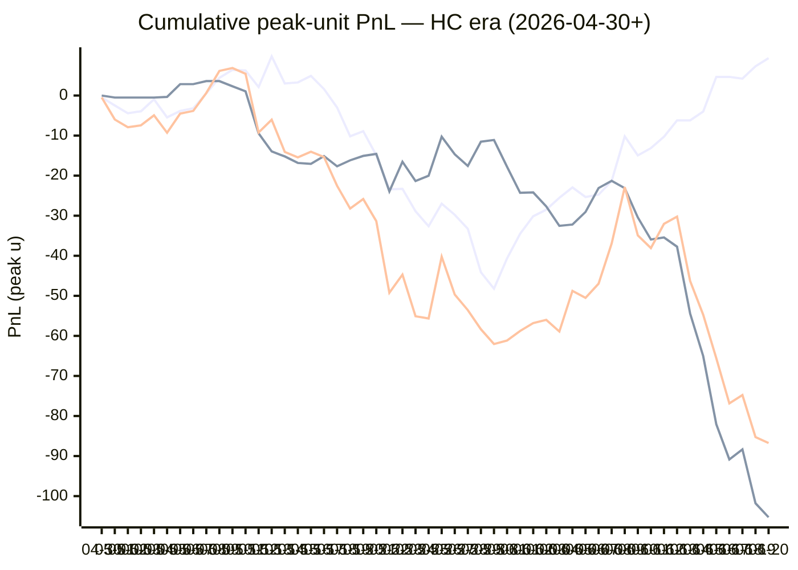

# Sharp Intel v6 — Daily Master Report

_Auto-generated **6/21/2026, 11:02:57 AM ET** by `scripts/dailyV6Report.js`. Do not edit by hand._

**Source of truth: this report mirrors the live Pick Performance dashboard.** Inclusion = `lockStage ≠ SHADOW ∧ ¬superseded ∧ health ∉ {MUTED, CANCELLED} ∧ peak.stars ≥ 2.5`. PnL is in **peak units** (the size shipped to users). HC margin / Δw / Δq are the **frozen** stamps written at last sync before the T-15 freeze. HC margin only existed from the v7.1 launch (**2026-04-30**); pre-launch picks have no HC value (no retro-fitting). Nothing is recomputed against today's whitelist.

v6 cutover: **2026-04-18** · whitelist source: live `sharpWalletProfiles` (283 profiles — drives §5 roster snapshot only) · quality cut: contribution ≥ 30 · HC = CONFIRMED tier ∧ sizeRatio ≥ 1.5.

---
## §1. Yesterday's picks

Slate: **2026-06-20** · 12 shipped sides.

| N | W-L-P | WR% | PnL (peak u) | PnL (flat 1u) |
|---|---|---|---|---|
| 12 | 7-5-0 | 58.3% | -1.47u | +0.66u |

| Sport | Market | Matchup | Pick | Stars · Units | HC | Δw | Δq | Σ | Odds | Result | PnL (peak u) |
|---|---|---|---|---|---|---|---|---|---|---|---|
| MLB | ML | Cincinnati Reds @ New York Yankees | New York Yankees | 4.5★ · 3.00u | +0 | -2 | +1 | -1 | -200 | L | -3.00u |
| MLB | ML | Chicago White Sox @ Detroit Tigers | Chicago White Sox | 4.5★ · 2.50u | +0 | +2 | +3 | +5 | +123 | L | -2.50u |
| MLB | ML | Minnesota Twins @ Arizona Diamondbacks | Minnesota Twins | 3.0★ · 0.50u | +0 | +0 | +0 | +0 | +116 | **W** | +0.00u |
| MLB | ML | New York Mets @ Philadelphia Phillies | Philadelphia Phillies | 4.0★ · 1.00u | +1 | +2 | +1 | +3 | -190 | **W** | +2.02u |
| MLB | ML | San Francisco Giants @ Miami Marlins | Miami Marlins | 5.0★ · 5.00u | +0 | +1 | +1 | +2 | -137 | **W** | +2.19u |
| MLB | SPREAD | Boston Red Sox @ Seattle Mariners | Boston Red Sox | 5.0★ · 5.00u | +0 | +0 | +0 | +0 | -194 | **W** | +0.00u |
| MLB | SPREAD | Cincinnati Reds @ New York Yankees | New York Yankees | 3.0★ · 0.50u | +0 | +1 | -1 | +0 | -110 | L | -0.50u |
| MLB | TOTAL | Chicago White Sox @ Detroit Tigers | Under 8.5 | 2.5★ · 0.25u | +1 | -1 | -1 | -2 | -110 | **W** | +0.00u |
| MLB | TOTAL | Milwaukee Brewers @ Atlanta Braves | Under 7.5 | 4.5★ · 3.00u | +0 | +0 | -1 | -1 | -110 | **W** | +1.82u |
| MLB | TOTAL | Minnesota Twins @ Arizona Diamondbacks | Under 9.5 | 4.0★ · 1.00u | +0 | -1 | +0 | -1 | -110 | L | -1.00u |
| MLB | TOTAL | San Francisco Giants @ Miami Marlins | Over 7.5 | 3.0★ · 0.50u | +0 | +1 | +1 | +2 | -110 | **W** | +0.00u |
| MLB | TOTAL | Toronto Blue Jays @ Chicago Cubs | Under 9.5 | 3.0★ · 0.50u | +0 | +1 | +1 | +2 | -110 | L | -0.50u |

---
## §2. 3-day / 7-day / all-time cohort rollups

Shipped picks only. PnL in **peak units** (size we actually bet) and flat 1u (cohort EV lens). All margins are the engine's frozen stamps (`v8_hcMargin`, `v8_walletConsensusDelta`, `v8_walletConsensusQualityMargin`).

**HC margin sub-tables** are scoped to picks dated ≥ 2026-04-30 (the v7.1 launch — when HC margin became a real engine signal). Pre-launch picks are excluded from HC analysis since the feature didn't exist for them. Δw / Δq sub-tables span the full v6-era sample (≥ 2026-04-18). Empty buckets are dropped.

### §2a. 3-day

Total: **40** shipped · 24-16-0 · WR 60.0% · PnL -9.88u (peak) / +4.43u (flat).

**By HC margin** _(picks dated ≥ 2026-04-30, N = 40)_

| Bucket | N | W-L-P | WR% | PnL (peak u) | PnL (flat 1u) |
|---|---|---|---|---|---|
| HC = +1 | 5 | 4-1-0 | 80.0% | +4.68u | +2.42u |
| HC = 0 | 32 | 18-14-0 | 56.3% | -14.44u | +0.82u |
| HC ≤ −1 | 3 | 2-1-0 | 66.7% | -0.12u | +1.19u |

**By Δw (winner margin)**

| Bucket | N | W-L-P | WR% | PnL (peak u) | PnL (flat 1u) |
|---|---|---|---|---|---|
| ≥ +3 | 3 | 3-0-0 | 100.0% | +5.36u | +2.65u |
| +2 | 4 | 2-2-0 | 50.0% | -0.94u | -0.60u |
| +1 | 21 | 11-10-0 | 52.4% | -11.00u | -1.04u |
| 0 | 7 | 5-2-0 | 71.4% | -1.68u | +2.32u |
| −1 | 4 | 3-1-0 | 75.0% | +1.38u | +2.10u |
| ≤ −2 | 1 | 0-1-0 | 0.0% | -3.00u | -1.00u |

**By Δq (quality margin)**

| Bucket | N | W-L-P | WR% | PnL (peak u) | PnL (flat 1u) |
|---|---|---|---|---|---|
| ≥ +3 | 3 | 2-1-0 | 66.7% | +0.08u | +0.74u |
| +2 | 1 | 1-0-0 | 100.0% | +0.00u | +0.49u |
| +1 | 15 | 8-7-0 | 53.3% | -0.36u | -0.88u |
| 0 | 16 | 11-5-0 | 68.8% | -7.42u | +5.25u |
| −1 | 4 | 2-2-0 | 50.0% | +0.32u | -0.18u |
| ≤ −2 | 1 | 0-1-0 | 0.0% | -2.50u | -1.00u |

**By AGS tier** _(picks dated ≥ 2026-05-05, N = 40)_

| Bucket | N | W-L-P | WR% | PnL (peak u) | PnL (flat 1u) |
|---|---|---|---|---|---|
| NEUT   (0 .. +3) | 28 | 17-11-0 | 60.7% | -7.08u | +2.74u |
| WEAK   (−1 .. 0) | 12 | 7-5-0 | 58.3% | -2.80u | +1.68u |

### §2b. 7-day

Total: **106** shipped · 56-50-0 · WR 52.8% · PnL -56.52u (peak) / -2.94u (flat).

**By HC margin** _(picks dated ≥ 2026-04-30, N = 106)_

| Bucket | N | W-L-P | WR% | PnL (peak u) | PnL (flat 1u) |
|---|---|---|---|---|---|
| HC ≥ +3 | 1 | 1-0-0 | 100.0% | +2.38u | +0.61u |
| HC = +2 | 1 | 1-0-0 | 100.0% | +4.48u | +0.74u |
| HC = +1 | 12 | 9-3-0 | 75.0% | +8.67u | +4.04u |
| HC = 0 | 86 | 42-44-0 | 48.8% | -67.55u | -8.16u |
| HC ≤ −1 | 6 | 3-3-0 | 50.0% | -4.50u | -0.17u |

**By Δw (winner margin)**

| Bucket | N | W-L-P | WR% | PnL (peak u) | PnL (flat 1u) |
|---|---|---|---|---|---|
| ≥ +3 | 7 | 6-1-0 | 85.7% | +11.43u | +3.76u |
| +2 | 11 | 5-6-0 | 45.5% | -6.67u | -2.36u |
| +1 | 58 | 29-29-0 | 50.0% | -46.12u | -4.14u |
| 0 | 17 | 9-8-0 | 52.9% | -9.93u | -0.96u |
| −1 | 11 | 6-5-0 | 54.5% | -2.23u | +0.50u |
| ≤ −2 | 2 | 1-1-0 | 50.0% | -3.00u | +0.26u |

**By Δq (quality margin)**

| Bucket | N | W-L-P | WR% | PnL (peak u) | PnL (flat 1u) |
|---|---|---|---|---|---|
| ≥ +3 | 7 | 5-2-0 | 71.4% | +4.17u | +1.76u |
| +2 | 7 | 3-4-0 | 42.9% | -4.19u | -2.14u |
| +1 | 34 | 18-16-0 | 52.9% | -17.64u | -0.90u |
| 0 | 46 | 24-22-0 | 52.2% | -35.68u | -1.20u |
| −1 | 8 | 5-3-0 | 62.5% | -0.18u | +1.96u |
| ≤ −2 | 4 | 1-3-0 | 25.0% | -3.00u | -2.42u |

**By AGS tier** _(picks dated ≥ 2026-05-05, N = 106)_

| Bucket | N | W-L-P | WR% | PnL (peak u) | PnL (flat 1u) |
|---|---|---|---|---|---|
| NEUT   (0 .. +3) | 68 | 38-30-0 | 55.9% | -38.73u | +1.52u |
| WEAK   (−1 .. 0) | 38 | 18-20-0 | 47.4% | -17.79u | -4.46u |

### §2c. All-time

Total: **733** shipped · 372-353-8 · WR 51.3% · PnL -98.97u (peak) / -15.88u (flat).

**By HC margin** _(picks dated ≥ 2026-04-30, N = 622)_

| Bucket | N | W-L-P | WR% | PnL (peak u) | PnL (flat 1u) |
|---|---|---|---|---|---|
| HC ≥ +3 | 12 | 4-8-0 | 33.3% | -6.70u | -6.05u |
| HC = +2 | 32 | 17-15-0 | 53.1% | -0.13u | +0.62u |
| HC = +1 | 167 | 95-72-0 | 56.9% | +16.16u | +14.70u |
| HC = 0 | 380 | 188-185-7 | 50.4% | -105.28u | -20.74u |
| HC ≤ −1 | 30 | 17-13-0 | 56.7% | +7.58u | +4.39u |

**By Δw (winner margin)**

| Bucket | N | W-L-P | WR% | PnL (peak u) | PnL (flat 1u) |
|---|---|---|---|---|---|
| ≥ +3 | 112 | 55-57-0 | 49.1% | -20.07u | -2.41u |
| +2 | 141 | 69-71-1 | 49.3% | -35.11u | -7.06u |
| +1 | 283 | 151-129-3 | 53.9% | -38.66u | +4.52u |
| 0 | 150 | 78-69-3 | 53.1% | +7.89u | -0.62u |
| −1 | 33 | 12-20-1 | 37.5% | -10.72u | -8.90u |
| ≤ −2 | 8 | 3-5-0 | 37.5% | -6.29u | -2.25u |
| missing | 6 | 4-2-0 | 66.7% | +3.99u | +0.85u |

**By Δq (quality margin)**

| Bucket | N | W-L-P | WR% | PnL (peak u) | PnL (flat 1u) |
|---|---|---|---|---|---|
| ≥ +3 | 134 | 67-64-3 | 51.1% | -24.76u | -2.39u |
| +2 | 124 | 57-67-0 | 46.0% | -38.75u | -14.26u |
| +1 | 228 | 124-101-3 | 55.1% | +14.92u | +7.98u |
| 0 | 163 | 83-79-1 | 51.2% | -44.77u | -2.22u |
| −1 | 57 | 31-25-1 | 55.4% | +10.90u | +4.08u |
| ≤ −2 | 21 | 6-15-0 | 28.6% | -19.75u | -9.84u |
| missing | 6 | 4-2-0 | 66.7% | +3.24u | +0.77u |

**By AGS tier** _(picks dated ≥ 2026-05-05, N = 597)_

| Bucket | N | W-L-P | WR% | PnL (peak u) | PnL (flat 1u) |
|---|---|---|---|---|---|
| ELITE  (≥ +7) | 3 | 3-0-0 | 100.0% | +8.01u | +2.34u |
| LOCK   (+5 .. +7) | 9 | 5-4-0 | 55.6% | -2.93u | -0.47u |
| STRONG (+3 .. +5) | 23 | 13-10-0 | 56.5% | -6.91u | +1.77u |
| NEUT   (0 .. +3) | 370 | 192-176-2 | 52.2% | -63.67u | -8.46u |
| WEAK   (−1 .. 0) | 177 | 87-86-4 | 50.3% | -22.60u | -7.08u |
| FADE   (< −1) | 14 | 9-5-0 | 64.3% | +4.68u | +5.05u |
| missing | 1 | 1-0-0 | 100.0% | +1.63u | +0.96u |

---
## §3. Edge over time — is HC margin creating winners?

Daily cumulative peak-unit PnL since the HC margin launch (**2026-04-30**). The `HC ≥ +1` line is the golden-standard cohort. The `HC = 0` line is the no-HC-signal control. The `All shipped (HC era)` line is every shipped pick from the same date range — the apples-to-apples baseline. Watch the spread.

Daily cumulative table (peak units, HC era only):

| Date | HC ≥ +1 (cum) | HC = 0 (cum) | All shipped (cum) |
|---|---|---|---|
| 2026-04-30 | -0.48u | +0.00u | -0.48u |
| 2026-05-01 | -2.48u | -0.50u | -5.98u |
| 2026-05-02 | -4.41u | -0.50u | -7.91u |
| 2026-05-03 | -3.94u | -0.50u | -7.44u |
| 2026-05-04 | -0.95u | -0.50u | -4.95u |
| 2026-05-05 | -5.45u | -0.34u | -9.29u |
| 2026-05-06 | -3.86u | +2.84u | -4.52u |
| 2026-05-07 | -3.18u | +2.84u | -3.84u |
| 2026-05-08 | +0.54u | +3.60u | +0.64u |
| 2026-05-09 | +4.41u | +3.60u | +6.14u |
| 2026-05-10 | +6.41u | +2.32u | +6.86u |
| 2026-05-11 | +6.25u | +1.05u | +5.43u |
| 2026-05-12 | +2.11u | -9.45u | -9.21u |
| 2026-05-13 | +9.78u | -13.95u | -6.04u |
| 2026-05-14 | +3.00u | -15.20u | -14.07u |
| 2026-05-15 | +3.27u | -16.83u | -15.43u |
| 2026-05-16 | +4.90u | -17.05u | -14.02u |
| 2026-05-17 | +1.62u | -15.11u | -15.36u |
| 2026-05-18 | -2.98u | -17.67u | -22.52u |
| 2026-05-19 | -10.18u | -16.17u | -28.22u |
| 2026-05-20 | -8.90u | -15.07u | -25.84u |
| 2026-05-21 | -14.92u | -14.58u | -31.37u |
| 2026-05-22 | -23.44u | -23.93u | -49.24u |
| 2026-05-23 | -23.30u | -16.53u | -44.70u |
| 2026-05-24 | -28.89u | -21.34u | -55.10u |
| 2026-05-25 | -32.63u | -20.03u | -55.65u |
| 2026-05-26 | -26.98u | -10.27u | -40.24u |
| 2026-05-27 | -29.77u | -14.68u | -49.69u |
| 2026-05-28 | -33.27u | -17.58u | -53.57u |
| 2026-05-29 | -44.12u | -11.51u | -58.35u |
| 2026-05-30 | -48.21u | -11.10u | -62.03u |
| 2026-05-31 | -40.65u | -17.79u | -61.16u |
| 2026-06-01 | -34.49u | -24.29u | -58.77u |
| 2026-06-02 | -30.14u | -24.19u | -56.82u |
| 2026-06-03 | -28.48u | -27.68u | -56.00u |
| 2026-06-04 | -25.53u | -32.54u | -58.91u |
| 2026-06-05 | -22.94u | -32.20u | -48.76u |
| 2026-06-06 | -25.33u | -29.06u | -50.51u |
| 2026-06-07 | -24.75u | -23.09u | -46.96u |
| 2026-06-08 | -21.34u | -21.30u | -36.94u |
| 2026-06-09 | -10.19u | -23.13u | -22.86u |
| 2026-06-10 | -14.95u | -30.43u | -34.92u |
| 2026-06-11 | -13.13u | -35.94u | -38.09u |
| 2026-06-12 | -10.30u | -35.44u | -32.03u |
| 2026-06-13 | -6.20u | -37.73u | -30.22u |
| 2026-06-14 | -6.21u | -54.41u | -46.29u |
| 2026-06-15 | -4.00u | -65.05u | -54.72u |
| 2026-06-16 | +4.65u | -82.05u | -65.57u |
| 2026-06-17 | +4.65u | -90.84u | -76.86u |
| 2026-06-18 | +4.23u | -88.33u | -74.77u |
| 2026-06-19 | +7.31u | -101.79u | -85.27u |
| 2026-06-20 | +9.33u | -105.28u | -86.74u |

---
## §4. Wallet roster growth & profitability

"Tracked in sport X" = a wallet has placed **≥ 2 bets** in X within the v6-era sample. "Profitable" = cumulative flat PnL > 0. Source: `v8Scoring.walletDetails` on every graded v6-era game (every side, not just the shipped set).

### §4a. Per-sport wallet snapshot

| Sport | Total wallets seen | Tracked (≥2) | Profitable | % prof | WR ≥ 50% | WR ≥ 60% | WR ≥ 70% |
|---|---|---|---|---|---|---|---|
| MLB | 81 | 60 | 19 | 32% | 30 | 8 | 2 |
| NBA | 138 | 108 | 44 | 41% | 60 | 29 | 11 |
| NHL | 60 | 43 | 12 | 28% | 24 | 12 | 6 |
| **ALL (any sport)** | **174** | **137** | **58** | **42%** | **75** | **27** | **8** |

### §4b. Daily roster growth (cumulative through each date)

Format: `tracked (profitable)`. For each date D, recompute the roster using every bet up to and including D.

| Date | ALL | MLB | NBA | NHL |
|---|---|---|---|---|
| 2026-04-18 | 5 (2) | 2 (2) | 3 (0) | 0 (0) |
| 2026-04-19 | 19 (8) | 5 (3) | 9 (3) | 3 (1) |
| 2026-04-20 | 29 (12) | 7 (6) | 23 (8) | 5 (2) |
| 2026-04-21 | 44 (21) | 10 (6) | 31 (10) | 7 (5) |
| 2026-04-22 | 52 (28) | 12 (6) | 39 (15) | 11 (10) |
| 2026-04-23 | 56 (29) | 13 (6) | 46 (21) | 13 (10) |
| 2026-04-24 | 61 (30) | 14 (6) | 51 (23) | 14 (9) |
| 2026-04-25 | 65 (29) | 16 (8) | 54 (22) | 16 (9) |
| 2026-04-26 | 67 (31) | 18 (5) | 56 (25) | 17 (9) |
| 2026-04-27 | 72 (32) | 20 (7) | 60 (24) | 17 (9) |
| 2026-04-28 | 76 (33) | 21 (7) | 63 (26) | 23 (10) |
| 2026-04-29 | 77 (33) | 21 (7) | 64 (25) | 23 (10) |
| 2026-04-30 | 81 (34) | 21 (7) | 70 (27) | 23 (10) |
| 2026-05-01 | 85 (38) | 22 (5) | 74 (30) | 26 (13) |
| 2026-05-02 | 86 (37) | 23 (7) | 75 (32) | 26 (12) |
| 2026-05-03 | 86 (38) | 24 (8) | 75 (33) | 26 (12) |
| 2026-05-04 | 90 (38) | 24 (9) | 76 (32) | 26 (12) |
| 2026-05-05 | 91 (40) | 24 (9) | 79 (33) | 26 (12) |
| 2026-05-06 | 92 (40) | 24 (9) | 80 (33) | 26 (12) |
| 2026-05-07 | 92 (41) | 24 (9) | 80 (33) | 26 (12) |
| 2026-05-08 | 92 (40) | 24 (8) | 80 (32) | 26 (11) |
| 2026-05-09 | 94 (42) | 24 (8) | 82 (35) | 26 (11) |
| 2026-05-10 | 94 (42) | 24 (8) | 82 (35) | 26 (11) |
| 2026-05-11 | 96 (42) | 24 (8) | 84 (36) | 26 (11) |
| 2026-05-12 | 100 (41) | 27 (9) | 86 (37) | 26 (11) |
| 2026-05-13 | 102 (45) | 29 (11) | 88 (37) | 26 (11) |
| 2026-05-14 | 102 (41) | 29 (11) | 88 (37) | 28 (12) |
| 2026-05-15 | 103 (41) | 30 (10) | 88 (39) | 28 (12) |
| 2026-05-16 | 105 (43) | 31 (12) | 88 (39) | 30 (14) |
| 2026-05-17 | 105 (46) | 32 (11) | 88 (40) | 30 (14) |
| 2026-05-18 | 105 (46) | 32 (10) | 88 (38) | 31 (15) |
| 2026-05-19 | 105 (46) | 32 (12) | 88 (38) | 31 (15) |
| 2026-05-20 | 106 (48) | 33 (12) | 88 (38) | 31 (16) |
| 2026-05-21 | 106 (45) | 34 (12) | 88 (37) | 31 (14) |
| 2026-05-22 | 106 (44) | 34 (10) | 88 (39) | 33 (16) |
| 2026-05-23 | 111 (49) | 36 (10) | 90 (40) | 36 (19) |
| 2026-05-24 | 117 (52) | 37 (12) | 94 (39) | 37 (16) |
| 2026-05-25 | 120 (53) | 38 (13) | 95 (40) | 38 (16) |
| 2026-05-26 | 122 (55) | 39 (14) | 97 (42) | 38 (16) |
| 2026-05-27 | 123 (51) | 40 (12) | 97 (42) | 40 (14) |
| 2026-05-28 | 124 (51) | 40 (12) | 99 (42) | 40 (14) |
| 2026-05-29 | 125 (50) | 41 (12) | 99 (42) | 41 (12) |
| 2026-05-30 | 126 (49) | 41 (12) | 101 (43) | 41 (12) |
| 2026-05-31 | 126 (48) | 41 (11) | 101 (43) | 41 (12) |
| 2026-06-01 | 129 (52) | 44 (14) | 101 (43) | 41 (12) |
| 2026-06-02 | 130 (56) | 45 (16) | 101 (43) | 41 (13) |
| 2026-06-03 | 132 (56) | 45 (14) | 102 (43) | 41 (13) |
| 2026-06-04 | 132 (57) | 46 (14) | 102 (43) | 41 (14) |
| 2026-06-05 | 132 (57) | 48 (15) | 102 (43) | 41 (14) |
| 2026-06-06 | 132 (57) | 49 (15) | 102 (43) | 41 (14) |
| 2026-06-07 | 133 (56) | 52 (16) | 102 (43) | 41 (14) |
| 2026-06-08 | 135 (55) | 53 (16) | 103 (44) | 41 (14) |
| 2026-06-09 | 135 (55) | 53 (15) | 103 (44) | 41 (14) |
| 2026-06-10 | 135 (56) | 53 (15) | 105 (45) | 41 (14) |
| 2026-06-11 | 135 (54) | 54 (16) | 105 (45) | 42 (13) |
| 2026-06-12 | 135 (56) | 55 (17) | 105 (45) | 42 (13) |
| 2026-06-13 | 136 (56) | 57 (17) | 108 (44) | 42 (13) |
| 2026-06-14 | 136 (55) | 57 (18) | 108 (44) | 43 (12) |
| 2026-06-15 | 136 (56) | 57 (19) | 108 (44) | 43 (12) |
| 2026-06-16 | 137 (56) | 58 (20) | 108 (44) | 43 (12) |
| 2026-06-17 | 137 (57) | 58 (19) | 108 (44) | 43 (12) |
| 2026-06-18 | 137 (58) | 58 (20) | 108 (44) | 43 (12) |
| 2026-06-19 | 137 (58) | 58 (20) | 108 (44) | 43 (12) |
| 2026-06-20 | 137 (58) | 60 (19) | 108 (44) | 43 (12) |

### §4c. Top 10 profitable wallets by sport

#### MLB

| # | Wallet | N | W | L | WR% | Flat PnL (u) | Flat ROI | $ PnL |
|---|---|---|---|---|---|---|---|---|
| 1 | e05213 | 14 | 10 | 4 | 71.4% | +5.17 | +36.9% | $225.2K |
| 2 | 913987 | 44 | 30 | 14 | 68.2% | +14.19 | +32.2% | $666.8K |
| 3 | ad88a3 | 14 | 10 | 4 | 71.4% | +4.03 | +28.8% | $8.8K |
| 4 | dfa240 | 3 | 2 | 1 | 66.7% | +0.85 | +28.3% | $2.5K |
| 5 | f2d227 | 26 | 17 | 9 | 65.4% | +7.10 | +27.3% | $56.0K |
| 6 | c9bba3 | 6 | 4 | 2 | 66.7% | +1.37 | +22.8% | -$17.7K |
| 7 | 981187 | 8 | 5 | 3 | 62.5% | +1.65 | +20.7% | $13.5K |
| 8 | c668b3 | 16 | 10 | 6 | 62.5% | +3.16 | +19.7% | $270 |
| 9 | eeabaf | 61 | 33 | 28 | 54.1% | +9.16 | +15.0% | $907.8K |
| 10 | a8c991 | 4 | 2 | 2 | 50.0% | +0.60 | +14.9% | -$31.4K |

#### NBA

| # | Wallet | N | W | L | WR% | Flat PnL (u) | Flat ROI | $ PnL |
|---|---|---|---|---|---|---|---|---|
| 1 | 799fad | 2 | 2 | 0 | 100.0% | +5.66 | +283.0% | $241.7K |
| 2 | a0d6d2 | 4 | 4 | 0 | 100.0% | +4.51 | +112.7% | $6.4K |
| 3 | 12ad50 | 3 | 3 | 0 | 100.0% | +2.74 | +91.3% | $45.5K |
| 4 | b51a56 | 6 | 5 | 1 | 83.3% | +5.44 | +90.7% | $74.4K |
| 5 | 11b032 | 7 | 6 | 1 | 85.7% | +5.40 | +77.1% | $249.9K |
| 6 | 12c933 | 2 | 2 | 0 | 100.0% | +1.28 | +63.9% | $11.5K |
| 7 | a1684d | 10 | 9 | 1 | 90.0% | +5.24 | +52.4% | $11.2K |
| 8 | 7f00bc | 21 | 14 | 7 | 66.7% | +9.80 | +46.7% | $14.7K |
| 9 | 92df91 | 23 | 16 | 7 | 69.6% | +10.26 | +44.6% | -$214 |
| 10 | 8ec926 | 8 | 6 | 2 | 75.0% | +3.53 | +44.1% | -$681 |

#### NHL

| # | Wallet | N | W | L | WR% | Flat PnL (u) | Flat ROI | $ PnL |
|---|---|---|---|---|---|---|---|---|
| 1 | 8366f5 | 2 | 2 | 0 | 100.0% | +2.30 | +114.9% | $107.6K |
| 2 | 799fad | 2 | 2 | 0 | 100.0% | +1.88 | +94.1% | $46.9K |
| 3 | fec67e | 4 | 3 | 1 | 75.0% | +2.82 | +70.5% | $12.5K |
| 4 | 30935c | 4 | 3 | 1 | 75.0% | +2.11 | +52.7% | $953 |
| 5 | 981187 | 8 | 6 | 2 | 75.0% | +3.52 | +44.0% | -$25.2K |
| 6 | fcc12b | 11 | 8 | 3 | 72.7% | +4.45 | +40.5% | -$27.5K |
| 7 | bc3532 | 22 | 14 | 8 | 63.6% | +7.85 | +35.7% | $70.3K |
| 8 | e70853 | 9 | 6 | 3 | 66.7% | +2.66 | +29.5% | -$11.1K |
| 9 | 4d2125 | 17 | 11 | 6 | 64.7% | +4.26 | +25.1% | $80.3K |
| 10 | dfa240 | 28 | 18 | 10 | 64.3% | +6.46 | +23.1% | $19.0K |

---
## §5. Proven-wallet roster growth & HC tracking

"Proven wallet" = whitelist tier `CONFIRMED` or `FLAT` in the same sense the live engine uses (`exportWalletProfiles.js` → `sharpWalletProfiles.bySport`). Sports inherit independent rosters: a wallet can be CONFIRMED in NBA and absent from NHL. `walletBets` come from `v8Scoring.walletDetails` on every graded v6-era pick (Source A); `positionRows` come from `sharp_action_positions` (Source B).

### §5a. Current proven-winner roster (snapshot)

Roster as of **2026-06-20** — wallets with ≥2 bets in the sport.

| Sport | Wallets seen | Eligible (≥2) | CONFIRMED | FLAT | Proven (C+F) | WR50 only | Conv % |
|---|---|---|---|---|---|---|---|
| MLB | 129 | 60 | 11 | 8 | **19** | 11 | 14.7% |
| NBA | 210 | 108 | 29 | 15 | **44** | 21 | 21.0% |
| NHL | 105 | 43 | 9 | 3 | **12** | 12 | 11.4% |
| **ALL** | **—** | **—** | **—** | **—** | **75** | **—** | **—** |

### §5b. Live whitelist drift check

Live `sharpWalletProfiles` is what the engine reads at lock time. Drift between script reconstruction (above) and live should be ≤ 1 day of position data — otherwise `exportWalletProfiles.js` is stale.

| Sport | CONFIRMED (live · script) | FLAT (live · script) | WR50 (live · script) | Drift |
|---|---|---|---|---|
| MLB | 36 · 11 | 16 · 8 | 7 · 11 | +33 live |
| NBA | 58 · 29 | 25 · 15 | 23 · 21 | +39 live |
| NHL | 23 · 9 | 6 · 3 | 16 · 12 | +17 live |

### §5c. Roster growth — 3d / 7d / 30d / all-time deltas

Each cell is **net growth** in proven (CONFIRMED + FLAT) wallets in that window, with the absolute count at the start (`+Δ from N`). Negative = wallets demoted. Window endpoint = 2026-06-20.

| Sport | 3-day | 7-day | 30-day | All-time (since cutover) |
|---|---|---|---|---|
| MLB | +0 from 19 | +2 from 17 | +7 from 12 | +19 from 0 |
| NBA | +0 from 44 | +0 from 44 | +7 from 37 | +44 from 0 |
| NHL | +0 from 12 | -1 from 13 | -2 from 14 | +12 from 0 |

A flat 7-day delta on a sport with healthy slate density = either the bubble pipeline has stalled (no wallets approaching the bar) or our cohort has saturated. Check §13d for the funnel diagnostic.

### §5d. Pipeline funnel — where each sport leaks

Wallets surviving each gate, in order. The biggest %-drop tells you the bottleneck. Gates:

1. **Seen** — placed ≥ 1 bet in the sport (any source)
2. **Eligible** — ≥ 2 graded picks in Source A (required for FLAT/CONFIRMED)
3. **Flat-OK** — eligible AND flat ROI > 0 (becomes FLAT or better)
4. **$-OK** — Flat-OK AND ≥2 positions with dollar ROI > 0 (CONFIRMED)
5. **Promoted** — final whitelisted = CONFIRMED + FLAT

| Sport | 1·Seen | 2·Eligible (% of Seen) | 3·Flat-OK (% of Elig) | 4·$-OK (% of Flat) | 5·Promoted | Bottleneck |
|---|---|---|---|---|---|---|
| MLB | 129 | 60 (47%) | 19 (32%) | 11 (58%) | **19** | edge (Eligible→Flat-OK) 68% |
| NBA | 210 | 108 (51%) | 44 (41%) | 29 (66%) | **44** | edge (Eligible→Flat-OK) 59% |
| NHL | 105 | 43 (41%) | 12 (28%) | 9 (75%) | **12** | edge (Eligible→Flat-OK) 72% |

### §5e. HC backing density (the fuel for v7.3 HC margin)

Every v7.x promotion is gated on `HC_m ≥ +1`, which requires at least one CONFIRMED wallet sized at `≥ 1.5×` average on the for-side. This table shows the share of shipped picks that *had any HC backing*, by sport, in each window. If HC density falls toward zero in a sport, the v7.3 floor cohorts (Σ=1, Σ=2 locks; HC rescues) will simply stop firing there.

| Sport | Window | Picks (with HC stamp) | Any HC for-side | HC_m ≥ +1 | HC_m ≥ +2 |
|---|---|---|---|---|---|
| MLB | 3-day | 40 | 7 (17.5%) | 5 (12.5%) | 0 (0.0%) |
| MLB | 7-day | 104 | 15 (14.4%) | 13 (12.5%) | 2 (1.9%) |
| MLB | All-time | 552 | 167 (30.3%) | 152 (27.5%) | 18 (3.3%) |
| NBA | 3-day | 0 | 0 (—) | 0 (—) | 0 (—) |
| NBA | 7-day | 0 | 0 (—) | 0 (—) | 0 (—) |
| NBA | All-time | 126 | 83 (65.9%) | 69 (54.8%) | 34 (27.0%) |
| NHL | 3-day | 0 | 0 (—) | 0 (—) | 0 (—) |
| NHL | 7-day | 2 | 1 (50.0%) | 1 (50.0%) | 0 (0.0%) |
| NHL | All-time | 49 | 21 (42.9%) | 20 (40.8%) | 5 (10.2%) |

Pooled across sports:

| Window | Picks (with HC stamp) | Any HC for-side | HC_m ≥ +1 | HC_m ≥ +2 |
|---|---|---|---|---|
| 3-day | 40 | 7 (17.5%) | 5 (12.5%) | 0 (0.0%) |
| 7-day | 106 | 16 (15.1%) | 14 (13.2%) | 2 (1.9%) |
| All-time | 727 | 271 (37.3%) | 241 (33.1%) | 57 (7.8%) |

### §5f. Bubble wallets — next-up graduations

Wallets currently NOT promoted but close. Two flavors:

- **One-bet-away** — won the only bet, needs one more positive bet to clear ≥2.
- **Just-under** — has ≥2 bets but flat ROI is between −10% and 0% (one win flips them).

#### MLB

**One-bet-away** (6)

| wallet | picksN | flat PnL | pos N | pos $ROI |
|---|---|---|---|---|
| `...be17` | 1 | +6.95 | 23 | -60% |
| `...fc26` | 1 | +0.91 | 23 | 1% |
| `...be00` | 1 | +0.87 | 15 | 10% |
| `...9373` | 1 | +0.87 | 0 | — |
| `...9b3c` | 1 | +0.77 | 8 | 52% |
| `...8d26` | 1 | +0.72 | 5 | -22% |

**Just-under** (6)

| wallet | picksN | WR | flat ROI | pos N | pos $ROI |
|---|---|---|---|---|---|
| `...afd2` | 41 | 51% | -0.5% | 177 | -20% |
| `...2768` | 48 | 48% | -0.8% | 79 | 17% |
| `...135d` | 338 | 51% | -2.0% | 375 | 7% |
| `...1f30` | 44 | 48% | -3.5% | 68 | 14% |
| `...9d74` | 49 | 51% | -3.8% | 287 | -13% |
| `...2a9e` | 88 | 50% | -4.3% | 179 | 25% |

#### NBA

**One-bet-away** (6)

| wallet | picksN | flat PnL | pos N | pos $ROI |
|---|---|---|---|---|
| `...bf5d` | 1 | +3.15 | 3 | 42% |
| `...ed41` | 1 | +3.15 | 3 | 3% |
| `...6b87` | 1 | +2.05 | 8 | -27% |
| `...c556` | 1 | +0.93 | 3 | 42% |
| `...5c69` | 1 | +0.91 | 2 | 28% |
| `...b989` | 1 | +0.88 | 21 | -90% |

**Just-under** (6)

| wallet | picksN | WR | flat ROI | pos N | pos $ROI |
|---|---|---|---|---|---|
| `...d814` | 8 | 50% | -0.5% | 53 | 1% |
| `...1e50` | 4 | 50% | -1.2% | 29 | 46% |
| `...65dd` | 6 | 50% | -2.4% | 17 | 27% |
| `...853d` | 40 | 53% | -2.7% | 90 | -2% |
| `...1697` | 17 | 53% | -3.5% | 34 | 9% |
| `...11a4` | 20 | 45% | -3.6% | 72 | 54% |

#### NHL

**One-bet-away** (6)

| wallet | picksN | flat PnL | pos N | pos $ROI |
|---|---|---|---|---|
| `...2e78` | 1 | +1.46 | 0 | — |
| `...017f` | 1 | +1.45 | 6 | 108% |
| `...32f2` | 1 | +1.40 | 0 | — |
| `...e0fd` | 1 | +1.20 | 3 | 124% |
| `...266e` | 1 | +1.05 | 0 | — |
| `...2194` | 1 | +1.05 | 0 | — |

**Just-under** (6)

| wallet | picksN | WR | flat ROI | pos N | pos $ROI |
|---|---|---|---|---|---|
| `...33ee` | 4 | 50% | -0.3% | 8 | -23% |
| `...df91` | 14 | 50% | -1.6% | 49 | -36% |
| `...afd2` | 6 | 50% | -1.9% | 26 | -17% |
| `...192c` | 7 | 43% | -2.9% | 21 | -15% |
| `...35e3` | 7 | 57% | -5.5% | 26 | 31% |
| `...618e` | 2 | 50% | -6.1% | 28 | 24% |

### §5g. v2 wallet-promotion pipeline (Source-A / Source-B mix)

Live snapshot of the v2 promotion gate (shipped 2026-05-10, re-eval **2026-05-24**). Each FLAT-or-better wallet × sport pair is attributed to one of three paths via `sharpWalletProfiles[wallet].bySport[sport].whitelistSource`:

- **A** — flat-positive on featured picks (Source A) only — the v1 gate
- **A+B** — flat-positive in both sources (most reliable signal)
- **B** — flat-positive on-chain only (NEW in v2 — the trial lift)

Re-classified every 2h via `grade-sharp-actions` cron. Roll-back: set `B_ONLY_MIN_BETS = Infinity` in `scripts/exportWalletProfiles.js`.

#### Source mix per sport (live Firestore)

| Sport | A | A+B | B (new) | FLAT-or-better total | % from B-only |
|---|---|---|---|---|---|
| MLB | 9 | 13 | **30** | 52 | 57.7% |
| NBA | 10 | 34 | **39** | 83 | 47.0% |
| NHL | 4 | 8 | **17** | 29 | 58.6% |
| **ALL** | **23** | **55** | **86** | **164** | **52.4%** |

#### Pipeline freshness

- `sharp_action_positions` GRADED rows: **15916**
- `sharp_action_positions` PENDING rows: **427** (queued for next Grade Sharp Actions run)
- Latest `sharpWalletProfiles` rebuild: 6/21/2026, 7:43:42 AM ET — 199 min · within 2 cron cycles

**Alarms**: pending > 200 OR rebuild lag > 4h → cron is lagging or failing — check `gh run list --workflow="Grade Sharp Actions"`.

#### B-only roster — wallets currently promoted via Source B path only

Wallets here would have been EXCLUDED under v1 (Source-A-only). Top by Source-B bet count per sport. The 2-week re-eval (2026-05-24) will compare these wallets' realized lift against A-only and A+B cohorts.

**MLB** — 30 wallets promoted via B

| wallet | tier | B_n | B_flat ROI | B_$ ROI |
|---|---|---|---|---|
| `...9a27` | CONFIRMED | 467 | +12.3% | +4.4% |
| `...135d` | CONFIRMED | 375 | +2.1% | +6.8% |
| `...3532` | CONFIRMED | 324 | +1.6% | +6% |
| `...1e50` | CONFIRMED | 267 | +0.5% | +1.6% |
| `...1eae` | FLAT | 147 | +3.1% | -1.4% |
| `...c684` | FLAT | 85 | +6.6% | -2.2% |
| `...1f30` | CONFIRMED | 68 | +1.8% | +13.6% |
| `...69c2` | CONFIRMED | 66 | +17.4% | +1% |
| `...ad50` | CONFIRMED | 53 | +14.4% | +7.7% |
| `...39b3` | CONFIRMED | 42 | +3.5% | +4.2% |
| … | 20 more | | | |

**NBA** — 39 wallets promoted via B

| wallet | tier | B_n | B_flat ROI | B_$ ROI |
|---|---|---|---|---|
| `...cff6` | CONFIRMED | 112 | +3.2% | +31.8% |
| `...135d` | FLAT | 104 | +5% | -10.6% |
| `...11a4` | CONFIRMED | 72 | +23.3% | +54.4% |
| `...3782` | CONFIRMED | 70 | +2.3% | +0.4% |
| `...9d74` | FLAT | 50 | +2.3% | -14.4% |
| `...935c` | FLAT | 50 | +17.3% | -21.4% |
| `...68b3` | CONFIRMED | 44 | +33.9% | +13.9% |
| `...b6ef` | CONFIRMED | 42 | +6.3% | +3.3% |
| `...e2ce` | CONFIRMED | 40 | +15.2% | +22.9% |
| `...0563` | CONFIRMED | 37 | +4.9% | +41.7% |
| … | 29 more | | | |

**NHL** — 17 wallets promoted via B

| wallet | tier | B_n | B_flat ROI | B_$ ROI |
|---|---|---|---|---|
| `...1697` | CONFIRMED | 52 | +8.5% | +7.1% |
| `...618e` | CONFIRMED | 28 | +6.2% | +23.8% |
| `...35e3` | CONFIRMED | 26 | +10.6% | +31.5% |
| `...5eee` | CONFIRMED | 23 | +30.5% | +19.3% |
| `...192c` | FLAT | 21 | +14% | -15.2% |
| `...0c2e` | FLAT | 17 | +24.3% | -7% |
| `...2ca8` | CONFIRMED | 10 | +26.9% | +14% |
| `...600d` | CONFIRMED | 9 | +69% | +75.8% |
| `...a9cc` | CONFIRMED | 7 | +49.5% | +46.9% |
| `...aeea` | CONFIRMED | 7 | +90.8% | +87.7% |
| … | 7 more | | | |

### §5 — How to read

- **Roster growth flat in 7-day** + **funnel bottleneck = `data`** → re-run `exportWalletProfiles.js`. The flat-positive wallets are stuck at FLAT because Source-B coverage hasn't caught up. CONFIRMED gate is data-bound, not skill-bound.
- **Roster growth flat in 7-day** + **funnel bottleneck = `sample`** → wallets aren't reaching `≥2` reps fast enough. This is a slate-density problem; consider a soft `MIN_BETS = 1` shadow lane to surface bubble wallets earlier.
- **Roster shrank** (negative delta) → a previously CONFIRMED wallet just dropped flat-positive (lost a recent bet). Variance, not failure — but worth noting if a sport loses ≥3 in a week.
- **HC density on a sport drops below ~30%** → v7.3 promotions there will starve. Either the proven roster needs more CONFIRMED-tier wallets sizing aggressively, or the HC_RATIO (1.5) needs a sport-specific tune.
- **§5g B-only count drops sharply** → wallets are demoting off the B path (losing on-chain). Cross-check `WALLET_PROFILES_SUMMARY.md` churn section for the specific demotions.
- **§5g pipeline freshness lag > 4h** → grade-sharp-actions cron is failing. Check `gh run list --workflow="Grade Sharp Actions"` and re-trigger if needed.

---
## §6. Daily proven-wallet performance

Who on the proven roster is actually printing — yesterday's bets, the rolling leaderboard (`$ PnL`-ranked), current streaks, and per-sport volume. **Proven** = `CONFIRMED` ∪ `FLAT` per sport (the same gate that drives Δ_winner). A wallet only counts in a sport where it's on that sport's proven list.

### §6a. Yesterday's proven-wallet bets

Slate: **2026-06-20** · 15 bets · 7 distinct proven wallets · WR 60% · $ vol $138.4K · $ PnL $31.7K.

| Wallet | Sport | Market | Game | $ size | Result | $ PnL |
|---|---|---|---|---|---|---|
| `...abaf` (CONFIRMED) | MLB | TOTAL | Milwaukee Brewers @ Atlanta Braves | $17.6K | **W** | $16.0K |
| `...64aa` (CONFIRMED) | MLB | ML | New York Mets @ Philadelphia Phillies | $22.7K | **W** | $11.5K |
| `...2f63` (FLAT) | MLB | ML | Minnesota Twins @ Arizona Diamondbacks | $9.3K | **W** | $10.7K |
| `...8f33` (CONFIRMED) | MLB | TOTAL | Chicago White Sox @ Detroit Tigers | $9.8K | **W** | $8.9K |
| `...abaf` (CONFIRMED) | MLB | ML | New York Mets @ Philadelphia Phillies | $14.8K | **W** | $7.5K |
| `...8f33` (CONFIRMED) | MLB | ML | San Francisco Giants @ Miami Marlins | $7.3K | **W** | $5.3K |
| `...64aa` (CONFIRMED) | MLB | ML | Cincinnati Reds @ New York Yankees | $10.2K | **W** | $5.1K |
| `...d227` (CONFIRMED) | MLB | SPREAD | Boston Red Sox @ Seattle Mariners | $5.7K | **W** | $2.9K |
| `...2f63` (FLAT) | MLB | TOTAL | San Francisco Giants @ Miami Marlins | $2.5K | **W** | $2.3K |
| `...8f33` (CONFIRMED) | MLB | SPREAD | Baltimore Orioles @ Los Angeles Dodgers | $353 | L | -$353 |
| `...88a3` (CONFIRMED) | MLB | ML | Chicago White Sox @ Detroit Tigers | $940 | L | -$940 |
| `...2f63` (FLAT) | MLB | TOTAL | Toronto Blue Jays @ Chicago Cubs | $4.1K | L | -$4.1K |
| `...2f63` (FLAT) | MLB | TOTAL | Chicago White Sox @ Detroit Tigers | $8.8K | L | -$8.8K |
| `...0ff5` (FLAT) | MLB | TOTAL | Chicago White Sox @ Detroit Tigers | $10.6K | L | -$10.6K |
| `...2f63` (FLAT) | MLB | SPREAD | Cincinnati Reds @ New York Yankees | $13.8K | L | -$13.8K |

### §6b. Proven-wallet leaderboard

Top 15 proven `(wallet × sport)` pairs per sport per horizon, ranked by **$ PnL** (the dollar-ROI lens). The 3-day board is the "who's on form right now" lens; the 7-day filters single-day variance; all-time is the proven-roster reference.

#### §6b-1. 3-day

**MLB** — 10 active proven wallets

| # | Wallet | Tier | Bets | WR% | Bets/day | Flat PnL (u) | Flat ROI | $ vol | $ PnL | $ ROI | Streak |
|---|---|---|---|---|---|---|---|---|---|---|---|
| 1 | `...abaf` | CONFIRMED | 5 | 100% | 1.7 | +3.68 | +74% | $133.6K | $97.2K | +73% | 5W |
| 2 | `...64aa` | CONFIRMED | 11 | 73% | 3.7 | +2.40 | +22% | $259.3K | $49.1K | +19% | 2W |
| 3 | `...2f63` | FLAT | 16 | 69% | 5.3 | +6.80 | +43% | $83.9K | $20.8K | +25% | 1L |
| 4 | `...8f33` | CONFIRMED | 16 | 56% | 5.3 | +0.86 | +5% | $81.2K | $18.5K | +23% | 2W |
| 5 | `...d227` | CONFIRMED | 5 | 80% | 1.7 | +1.71 | +34% | $37.0K | $7.2K | +20% | 4W |
| 6 | `...0ff5` | FLAT | 2 | 50% | 1.0 | +0.48 | +24% | $20.6K | $4.1K | +20% | 1L |
| 7 | `...23c4` | FLAT | 1 | 100% | 1.0 | +0.85 | +85% | $3.3K | $2.8K | +85% | 1W |
| 8 | `...aeea` | FLAT | 1 | 100% | 1.0 | +0.72 | +72% | $1.5K | $1.1K | +72% | 1W |
| 9 | `...88a3` | CONFIRMED | 5 | 60% | 1.7 | -0.33 | -7% | $10.9K | -$969 | -9% | 1L |
| 10 | `...381f` | FLAT | 1 | 0% | 1.0 | -1.00 | -100% | $1.1K | -$1.1K | -100% | 1L |

#### §6b-2. 7-day

**MLB** — 12 active proven wallets

| # | Wallet | Tier | Bets | WR% | Bets/day | Flat PnL (u) | Flat ROI | $ vol | $ PnL | $ ROI | Streak |
|---|---|---|---|---|---|---|---|---|---|---|---|
| 1 | `...d227` | CONFIRMED | 12 | 83% | 1.7 | +8.24 | +69% | $97.4K | $47.7K | +49% | 4W |
| 2 | `...abaf` | CONFIRMED | 9 | 56% | 1.3 | -0.32 | -4% | $195.2K | $35.6K | +18% | 5W |
| 3 | `...8f33` | CONFIRMED | 48 | 56% | 6.9 | +1.43 | +3% | $224.6K | $31.1K | +14% | 2W |
| 4 | `...64aa` | CONFIRMED | 29 | 59% | 4.1 | -0.14 | -0% | $542.9K | $22.1K | +4% | 2W |
| 5 | `...2f63` | FLAT | 32 | 59% | 5.3 | +6.57 | +21% | $129.3K | $19.9K | +15% | 1L |
| 6 | `...aeea` | FLAT | 3 | 100% | 0.8 | +3.13 | +104% | $9.5K | $9.9K | +104% | 3W |
| 7 | `...0ff5` | FLAT | 4 | 50% | 0.7 | +0.62 | +15% | $39.2K | $5.5K | +14% | 1L |
| 8 | `...88a3` | CONFIRMED | 7 | 71% | 1.0 | +1.15 | +16% | $16.6K | $3.0K | +18% | 1L |
| 9 | `...381f` | FLAT | 2 | 50% | 0.7 | +0.30 | +15% | $2.0K | $232 | +11% | 1L |
| 10 | `...bba3` | CONFIRMED | 1 | 0% | 1.0 | -1.00 | -100% | $32.5K | -$32.5K | -100% | 1L |
| 11 | `...5213` | CONFIRMED | 5 | 40% | 1.7 | -1.10 | -22% | $155.1K | -$69.1K | -45% | 2L |
| 12 | `...23c4` | FLAT | 15 | 47% | 3.0 | -1.96 | -13% | $351.3K | -$160.8K | -46% | 3W |

**NHL** — 2 active proven wallets

| # | Wallet | Tier | Bets | WR% | Bets/day | Flat PnL (u) | Flat ROI | $ vol | $ PnL | $ ROI | Streak |
|---|---|---|---|---|---|---|---|---|---|---|---|
| 1 | `...2125` | CONFIRMED | 2 | 100% | 2.0 | +1.75 | +88% | $46.9K | $41.0K | +87% | 2W |
| 2 | `...3532` | FLAT | 1 | 0% | 1.0 | -1.00 | -100% | $18.8K | -$18.8K | -100% | 1L |

#### §6b-3. All-time

**MLB** — 19 active proven wallets

| # | Wallet | Tier | Bets | WR% | Bets/day | Flat PnL (u) | Flat ROI | $ vol | $ PnL | $ ROI | Streak |
|---|---|---|---|---|---|---|---|---|---|---|---|
| 1 | `...abaf` | CONFIRMED | 61 | 54% | 1.7 | +9.16 | +15% | $1.43M | $907.8K | +63% | 5W |
| 2 | `...3987` | CONFIRMED | 44 | 68% | 4.0 | +14.19 | +32% | $2.29M | $666.8K | +29% | 1L |
| 3 | `...64aa` | CONFIRMED | 251 | 56% | 4.0 | +5.71 | +2% | $4.51M | $305.2K | +7% | 2W |
| 4 | `...5213` | CONFIRMED | 14 | 71% | 0.9 | +5.17 | +37% | $541.2K | $225.2K | +42% | 2L |
| 5 | `...fc82` | FLAT | 27 | 52% | 0.5 | +0.41 | +2% | $556.2K | $139.9K | +25% | 1L |
| 6 | `...8f33` | CONFIRMED | 109 | 57% | 3.9 | +6.90 | +6% | $593.6K | $101.3K | +17% | 2W |
| 7 | `...2f63` | FLAT | 139 | 51% | 2.4 | +1.21 | +1% | $749.8K | $64.7K | +9% | 1L |
| 8 | `...d227` | CONFIRMED | 26 | 65% | 0.5 | +7.10 | +27% | $237.4K | $56.0K | +24% | 4W |
| 9 | `...5143` | CONFIRMED | 10 | 50% | 0.4 | +0.27 | +3% | $317.6K | $26.2K | +8% | 1W |
| 10 | `...1187` | FLAT | 8 | 63% | 2.7 | +1.65 | +21% | $30.5K | $13.5K | +44% | 1W |
| 11 | `...aeea` | FLAT | 17 | 59% | 0.3 | +1.91 | +11% | $45.3K | $13.3K | +29% | 3W |
| 12 | `...88a3` | CONFIRMED | 14 | 71% | 0.8 | +4.03 | +29% | $31.7K | $8.8K | +28% | 1L |
| 13 | `...0ff5` | FLAT | 39 | 54% | 1.0 | +3.25 | +8% | $272.3K | $6.7K | +2% | 1L |
| 14 | `...a240` | CONFIRMED | 3 | 67% | 0.1 | +0.85 | +28% | $6.7K | $2.5K | +38% | 1W |
| 15 | `...68b3` | FLAT | 16 | 63% | 0.4 | +3.16 | +20% | $16.3K | $270 | +2% | 1L |

**NBA** — 44 active proven wallets

| # | Wallet | Tier | Bets | WR% | Bets/day | Flat PnL (u) | Flat ROI | $ vol | $ PnL | $ ROI | Streak |
|---|---|---|---|---|---|---|---|---|---|---|---|
| 1 | `...2ca8` | CONFIRMED | 26 | 62% | 0.5 | +6.33 | +24% | $2.75M | $945.0K | +34% | 1W |
| 2 | `...9a27` | CONFIRMED | 89 | 57% | 2.2 | +4.08 | +5% | $2.68M | $425.9K | +16% | 4L |
| 3 | `...aeeb` | CONFIRMED | 60 | 60% | 1.1 | +8.98 | +15% | $1.23M | $257.3K | +21% | 2W |
| 4 | `...b032` | CONFIRMED | 7 | 86% | 0.7 | +5.40 | +77% | $244.0K | $249.9K | +102% | 3W |
| 5 | `...9fad` | CONFIRMED | 2 | 100% | 1.0 | +5.66 | +283% | $141.8K | $241.7K | +170% | 2W |
| 6 | `...e8f1` | CONFIRMED | 21 | 48% | 0.4 | +2.25 | +11% | $877.2K | $197.2K | +22% | 2W |
| 7 | `...be3d` | CONFIRMED | 5 | 60% | 0.4 | +0.03 | +1% | $821.5K | $180.0K | +22% | 1L |
| 8 | `...32f2` | CONFIRMED | 10 | 50% | 0.2 | +1.86 | +19% | $146.1K | $127.3K | +87% | 1W |
| 9 | `...02c3` | CONFIRMED | 6 | 33% | 0.9 | +0.75 | +13% | $681.1K | $104.0K | +15% | 3L |
| 10 | `...b814` | CONFIRMED | 3 | 100% | 0.4 | +0.56 | +19% | $431.9K | $81.3K | +19% | 3W |
| 11 | `...1a56` | CONFIRMED | 6 | 83% | 0.2 | +5.44 | +91% | $53.7K | $74.4K | +139% | 1L |
| 12 | `...23c4` | CONFIRMED | 23 | 61% | 0.6 | +4.81 | +21% | $784.6K | $70.7K | +9% | 3W |
| 13 | `...66f5` | CONFIRMED | 17 | 59% | 0.4 | +5.02 | +30% | $332.9K | $64.5K | +19% | 3W |
| 14 | `...5143` | FLAT | 13 | 62% | 0.4 | +3.27 | +25% | $798.4K | $57.5K | +7% | 1L |
| 15 | `...ad50` | FLAT | 3 | 100% | 1.5 | +2.74 | +91% | $50.6K | $45.5K | +90% | 3W |

**NHL** — 12 active proven wallets

| # | Wallet | Tier | Bets | WR% | Bets/day | Flat PnL (u) | Flat ROI | $ vol | $ PnL | $ ROI | Streak |
|---|---|---|---|---|---|---|---|---|---|---|---|
| 1 | `...66f5` | FLAT | 2 | 100% | 0.7 | +2.30 | +115% | $78.8K | $107.6K | +137% | 2W |
| 2 | `...2125` | CONFIRMED | 17 | 65% | 0.7 | +4.26 | +25% | $183.4K | $80.3K | +44% | 3W |
| 3 | `...3532` | FLAT | 22 | 64% | 0.4 | +7.85 | +36% | $384.6K | $70.3K | +18% | 1L |
| 4 | `...9fad` | CONFIRMED | 2 | 100% | 1.0 | +1.88 | +94% | $88.2K | $46.9K | +53% | 2W |
| 5 | `...cea1` | CONFIRMED | 3 | 67% | 0.4 | +0.62 | +21% | $27.7K | $22.1K | +80% | 1W |
| 6 | `...a240` | CONFIRMED | 28 | 64% | 0.5 | +6.46 | +23% | $92.1K | $19.0K | +21% | 1W |
| 7 | `...c67e` | CONFIRMED | 4 | 75% | 0.2 | +2.82 | +71% | $20.7K | $12.5K | +60% | 1W |
| 8 | `...9d74` | CONFIRMED | 5 | 60% | 0.1 | +0.84 | +17% | $15.0K | $5.2K | +35% | 1L |
| 9 | `...935c` | CONFIRMED | 4 | 75% | 1.0 | +2.11 | +53% | $1.3K | $953 | +74% | 3W |
| 10 | `...0853` | CONFIRMED | 9 | 67% | 0.3 | +2.66 | +30% | $250.0K | -$11.1K | -4% | 1W |
| 11 | `...1187` | FLAT | 8 | 75% | 0.2 | +3.52 | +44% | $153.0K | -$25.2K | -16% | 2L |
| 12 | `...c12b` | CONFIRMED | 11 | 73% | 0.3 | +4.45 | +40% | $504.9K | -$27.5K | -5% | 2W |

### §6c. Active streaks (≥3 in a row, last bet within 3 days)

Proven `(wallet × sport)` pairs currently riding a 3-or-more-bet run with their most recent bet inside the last 3 calendar days. Hot-hand monitor — and the same surface for cold streaks worth fading.

| Wallet | Sport | Tier | Streak | Last bet | All-time bets | WR% | $ PnL | $ ROI |
|---|---|---|---|---|---|---|---|---|
| `...abaf` | MLB | CONFIRMED | **5W** | 2026-06-20 | 61 | 54% | $907.8K | +63% |
| `...d227` | MLB | CONFIRMED | **4W** | 2026-06-20 | 26 | 65% | $56.0K | +24% |
| `...aeea` | MLB | FLAT | **3W** | 2026-06-18 | 17 | 59% | $13.3K | +29% |
| `...23c4` | MLB | FLAT | **3W** | 2026-06-19 | 84 | 54% | -$329.0K | -17% |

### §6d. Daily proven-wallet volume (trailing 14 graded days)

Per-day bet count, $ volume, and $ PnL from proven wallets only. Helps spot slate-density swings — a spike in one sport's volume = the proven cohort sees something on that night's board.

| Date | TOTAL N · $vol · $PnL | MLB N · $vol · $PnL | NBA N · $vol · $PnL | NHL N · $vol · $PnL |
|---|---|---|---|---|
| 2026-06-07 | 39 · $806.2K · $273.9K | 39 · $806.2K · $273.9K | — | — |
| 2026-06-08 | 35 · $1.12M · $410.1K | 19 · $394.3K · $136.7K | 16 · $728.8K · $273.4K | — |
| 2026-06-09 | 34 · $696.5K · -$1.2K | 29 · $645.6K · -$37.4K | — | 5 · $50.9K · $36.2K |
| 2026-06-10 | 50 · $1.47M · $177.2K | 30 · $403.2K · -$18.4K | 20 · $1.07M · $195.6K | — |
| 2026-06-11 | 18 · $338.1K · -$145.8K | 14 · $279.3K · -$139.1K | — | 4 · $58.8K · -$6.7K |
| 2026-06-12 | 24 · $272.6K · -$20.0K | 24 · $272.6K · -$20.0K | — | — |
| 2026-06-13 | 43 · $1.22M · -$757.9K | 25 · $267.9K · $58.9K | 18 · $954.4K · -$816.8K | — |
| 2026-06-14 | 22 · $196.5K · -$16.9K | 19 · $130.7K · -$39.1K | — | 3 · $65.7K · $22.2K |
| 2026-06-15 | 27 · $335.4K · -$40.8K | 27 · $335.4K · -$40.8K | — | — |
| 2026-06-16 | 34 · $505.5K · -$150.7K | 34 · $505.5K · -$150.7K | — | — |
| 2026-06-17 | 24 · $191.8K · -$55.5K | 24 · $191.8K · -$55.5K | — | — |
| 2026-06-18 | 14 · $196.3K · $45.8K | 14 · $196.3K · $45.8K | — | — |
| 2026-06-19 | 34 · $297.6K · $121.4K | 34 · $297.6K · $121.4K | — | — |
| 2026-06-20 | 15 · $138.4K · $31.7K | 15 · $138.4K · $31.7K | — | — |

---

_Driven by `scripts/dailyV6Report.js` · regenerates daily via `.github/workflows/daily-v6-report.yml` · QUALITY_CONTRIB_CUT = 30 · HC = CONFIRMED ∧ sizeRatio ≥ 1.5 · inclusion mirrors live Pick Performance dashboard · §1–§3 use shipped picks · §4–§5 wallet/tracking growth mirror `exportWalletProfiles.js` · §6 daily proven-wallet board uses today's roster (CONFIRMED ∪ FLAT) as-of 2026-06-20_
