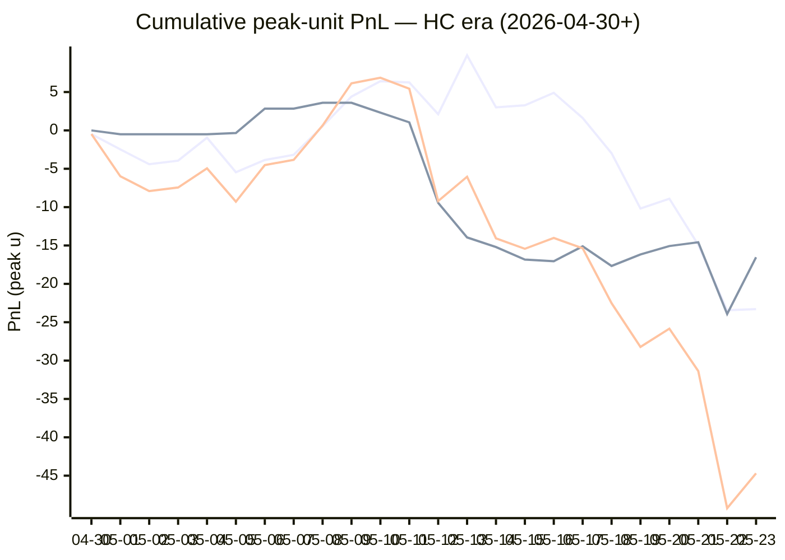

# Sharp Intel v6 — Daily Master Report

_Auto-generated **5/24/2026, 10:11:24 AM ET** by `scripts/dailyV6Report.js`. Do not edit by hand._

**Source of truth: this report mirrors the live Pick Performance dashboard.** Inclusion = `lockStage ≠ SHADOW ∧ ¬superseded ∧ health ∉ {MUTED, CANCELLED} ∧ peak.stars ≥ 2.5`. PnL is in **peak units** (the size shipped to users). HC margin / Δw / Δq are the **frozen** stamps written at last sync before the T-15 freeze. HC margin only existed from the v7.1 launch (**2026-04-30**); pre-launch picks have no HC value (no retro-fitting). Nothing is recomputed against today's whitelist.

v6 cutover: **2026-04-18** · whitelist source: live `sharpWalletProfiles` (212 profiles — drives §5 roster snapshot only) · quality cut: contribution ≥ 30 · HC = CONFIRMED tier ∧ sizeRatio ≥ 1.5.

---
## §1. Yesterday's picks

Slate: **2026-05-23** · 22 shipped sides.

| N | W-L-P | WR% | PnL (peak u) | PnL (flat 1u) |
|---|---|---|---|---|
| 22 | 13-8-1 | 61.9% | +4.54u | +3.18u |

| Sport | Market | Matchup | Pick | Stars · Units | HC | Δw | Δq | Σ | Odds | Result | PnL (peak u) |
|---|---|---|---|---|---|---|---|---|---|---|---|
| MLB | ML | Cleveland Guardians @ Philadelphia Phillies | Philadelphia Phillies | 2.5★ · 0.50u | +0 | +1 | +0 | +1 | -181 | **W** | +0.28u |
| MLB | ML | Chicago White Sox @ San Francisco Giants | Chicago White Sox | 2.5★ · 2.75u | +0 | +2 | +2 | +4 | +109 | L | -2.75u |
| MLB | ML | Houston Astros @ Chicago Cubs | Chicago Cubs | 5.0★ · 1.00u | +0 | +0 | +2 | +2 | -148 | L | -1.00u |
| MLB | ML | Athletics @ San Diego Padres | Athletics | 2.5★ · 1.25u | +1 | -1 | -1 | -2 | -111 | L | -1.25u |
| MLB | ML | Seattle Mariners @ Kansas City Royals | Kansas City Royals | 4.0★ · 2.50u | +0 | +1 | -1 | +0 | +118 | **W** | +2.85u |
| MLB | ML | Washington Nationals @ Atlanta Braves | Washington Nationals | 3.0★ · 1.25u | +1 | +2 | +1 | +3 | +166 | **W** | +1.80u |
| MLB | SPREAD | Houston Astros @ Chicago Cubs | Houston Astros | 3.0★ · 0.75u | +0 | +1 | +0 | +1 | -163 | **W** | +0.46u |
| MLB | SPREAD | Los Angeles Dodgers @ Milwaukee Brewers | Milwaukee Brewers | 3.0★ · 0.75u | +0 | +0 | +0 | +0 | -163 | L | -0.75u |
| MLB | SPREAD | Minnesota Twins @ Boston Red Sox | Minnesota Twins | 4.5★ · 1.50u | +0 | +0 | +0 | +0 | -209 | **W** | +2.52u |
| MLB | SPREAD | Pittsburgh Pirates @ Toronto Blue Jays | Toronto Blue Jays | 3.0★ · 0.75u | +0 | +0 | -1 | -1 | -135 | **W** | +0.56u |
| MLB | SPREAD | Washington Nationals @ Atlanta Braves | Washington Nationals | 4.5★ · 2.25u | +0 | +1 | +1 | +2 | -123 | **W** | +1.64u |
| MLB | TOTAL | Chicago White Sox @ San Francisco Giants | Over 8.5 | 2.5★ · 0.30u | +1 | +0 | +1 | +1 | -110 | **W** | +0.32u |
| MLB | TOTAL | Houston Astros @ Chicago Cubs | Under 7.5 | 5.0★ · 3.00u | +1 | +3 | +2 | +5 | -110 | **W** | +2.73u |
| MLB | TOTAL | Los Angeles Dodgers @ Milwaukee Brewers | Under 9.5 | 3.0★ · 0.75u | +1 | +2 | +1 | +3 | -110 | L | -0.75u |
| MLB | TOTAL | Minnesota Twins @ Boston Red Sox | Under 7.5 | 3.0★ · 0.75u | +0 | +0 | +0 | +0 | +102 | **W** | +0.77u |
| MLB | TOTAL | New York Mets @ Miami Marlins | Under 7.5 | 3.0★ · 0.75u | +0 | +1 | +1 | +2 | -110 | **W** | +0.68u |
| MLB | TOTAL | Pittsburgh Pirates @ Toronto Blue Jays | Under 7 | 2.5★ · 0.30u | +0 | +0 | +1 | +1 | +108 | P | +0.00u |
| MLB | TOTAL | Washington Nationals @ Atlanta Braves | Over 8.5 | 2.5★ · 0.30u | +0 | +1 | +1 | +2 | -111 | L | -0.30u |
| NBA | SPREAD | Knicks @ Cavaliers | Cavaliers | 5.0★ · 3.00u | +1 | +5 | +4 | +9 | -107 | L | -3.00u |
| NBA | TOTAL | Knicks @ Cavaliers | Under 215 | 5.0★ · 3.00u | -1 | +1 | -1 | +0 | +102 | L | -3.00u |
| NHL | ML | Canadiens @ Hurricanes | Hurricanes | 5.0★ · 5.00u | +0 | +8 | +9 | +17 | -205 | **W** | +2.44u |
| NHL | TOTAL | Canadiens @ Hurricanes | Under 4.5 | 3.0★ · 0.30u | +1 | +1 | +1 | +2 | -110 | **W** | +0.29u |

---
## §2. 3-day / 7-day / all-time cohort rollups

Shipped picks only. PnL in **peak units** (size we actually bet) and flat 1u (cohort EV lens). All margins are the engine's frozen stamps (`v8_hcMargin`, `v8_walletConsensusDelta`, `v8_walletConsensusQualityMargin`).

**HC margin sub-tables** are scoped to picks dated ≥ 2026-04-30 (the v7.1 launch — when HC margin became a real engine signal). Pre-launch picks are excluded from HC analysis since the feature didn't exist for them. Δw / Δq sub-tables span the full v6-era sample (≥ 2026-04-18). Empty buckets are dropped.

### §2a. 3-day

Total: **52** shipped · 26-25-1 · WR 51.0% · PnL -18.86u (peak) / -1.86u (flat).

**By HC margin** _(picks dated ≥ 2026-04-30, N = 52)_

| Bucket | N | W-L-P | WR% | PnL (peak u) | PnL (flat 1u) |
|---|---|---|---|---|---|
| HC ≥ +3 | 1 | 0-1-0 | 0.0% | -3.75u | -1.00u |
| HC = +2 | 3 | 0-3-0 | 0.0% | -13.00u | -3.00u |
| HC = +1 | 16 | 10-6-0 | 62.5% | +2.35u | +4.03u |
| HC = 0 | 31 | 16-14-1 | 53.3% | -1.46u | -0.90u |
| HC ≤ −1 | 1 | 0-1-0 | 0.0% | -3.00u | -1.00u |

**By Δw (winner margin)**

| Bucket | N | W-L-P | WR% | PnL (peak u) | PnL (flat 1u) |
|---|---|---|---|---|---|
| ≥ +3 | 11 | 3-8-0 | 27.3% | -13.83u | -5.69u |
| +2 | 9 | 5-4-0 | 55.6% | -3.63u | +1.61u |
| +1 | 21 | 13-8-0 | 61.9% | +2.91u | +3.16u |
| 0 | 10 | 5-4-1 | 55.6% | -3.06u | +0.06u |
| −1 | 1 | 0-1-0 | 0.0% | -1.25u | -1.00u |

**By Δq (quality margin)**

| Bucket | N | W-L-P | WR% | PnL (peak u) | PnL (flat 1u) |
|---|---|---|---|---|---|
| ≥ +3 | 7 | 3-4-0 | 42.9% | -6.83u | -1.59u |
| +2 | 10 | 3-7-0 | 30.0% | -10.34u | -3.79u |
| +1 | 20 | 11-8-1 | 57.9% | +2.58u | +2.23u |
| 0 | 8 | 6-2-0 | 75.0% | +3.80u | +2.47u |
| −1 | 6 | 3-3-0 | 50.0% | -3.07u | -0.17u |
| ≤ −2 | 1 | 0-1-0 | 0.0% | -5.00u | -1.00u |

**By AGS tier** _(picks dated ≥ 2026-05-05, N = 52)_

| Bucket | N | W-L-P | WR% | PnL (peak u) | PnL (flat 1u) |
|---|---|---|---|---|---|
| STRONG (+3 .. +5) | 2 | 0-2-0 | 0.0% | -5.50u | -2.00u |
| NEUT   (0 .. +3) | 39 | 21-18-0 | 53.8% | -11.54u | +0.47u |
| WEAK   (−1 .. 0) | 10 | 4-5-1 | 44.4% | -2.09u | -1.24u |
| FADE   (< −1) | 1 | 1-0-0 | 100.0% | +0.27u | +0.91u |

### §2b. 7-day

Total: **87** shipped · 44-42-1 · WR 51.2% · PnL -30.68u (peak) / -2.85u (flat).

**By HC margin** _(picks dated ≥ 2026-04-30, N = 87)_

| Bucket | N | W-L-P | WR% | PnL (peak u) | PnL (flat 1u) |
|---|---|---|---|---|---|
| HC ≥ +3 | 5 | 2-3-0 | 40.0% | -3.51u | -2.17u |
| HC = +2 | 7 | 0-7-0 | 0.0% | -27.75u | -7.00u |
| HC = +1 | 35 | 21-14-0 | 60.0% | +3.06u | +6.81u |
| HC = 0 | 39 | 21-17-1 | 55.3% | +0.52u | +0.51u |
| HC ≤ −1 | 1 | 0-1-0 | 0.0% | -3.00u | -1.00u |

**By Δw (winner margin)**

| Bucket | N | W-L-P | WR% | PnL (peak u) | PnL (flat 1u) |
|---|---|---|---|---|---|
| ≥ +3 | 20 | 9-11-0 | 45.0% | -14.53u | -2.98u |
| +2 | 23 | 11-12-0 | 47.8% | -10.96u | -0.85u |
| +1 | 28 | 16-12-0 | 57.1% | -1.85u | +1.51u |
| 0 | 15 | 8-6-1 | 57.1% | -2.09u | +0.46u |
| −1 | 1 | 0-1-0 | 0.0% | -1.25u | -1.00u |

**By Δq (quality margin)**

| Bucket | N | W-L-P | WR% | PnL (peak u) | PnL (flat 1u) |
|---|---|---|---|---|---|
| ≥ +3 | 15 | 9-6-0 | 60.0% | -2.07u | +1.63u |
| +2 | 19 | 7-12-0 | 36.8% | -16.88u | -4.72u |
| +1 | 30 | 15-14-1 | 51.7% | -5.07u | -0.69u |
| 0 | 13 | 10-3-0 | 76.9% | +7.41u | +5.10u |
| −1 | 8 | 3-5-0 | 37.5% | -8.32u | -2.17u |
| ≤ −2 | 2 | 0-2-0 | 0.0% | -5.75u | -2.00u |

**By AGS tier** _(picks dated ≥ 2026-05-05, N = 87)_

| Bucket | N | W-L-P | WR% | PnL (peak u) | PnL (flat 1u) |
|---|---|---|---|---|---|
| ELITE  (≥ +7) | 2 | 2-0-0 | 100.0% | +4.83u | +1.39u |
| LOCK   (+5 .. +7) | 3 | 1-2-0 | 33.3% | -3.61u | -1.62u |
| STRONG (+3 .. +5) | 7 | 2-5-0 | 28.6% | -11.50u | -3.18u |
| NEUT   (0 .. +3) | 58 | 31-27-0 | 53.4% | -16.21u | +0.22u |
| WEAK   (−1 .. 0) | 14 | 6-7-1 | 46.2% | -4.02u | -0.68u |
| FADE   (< −1) | 3 | 2-1-0 | 66.7% | -0.17u | +1.02u |

### §2c. All-time

Total: **282** shipped · 137-142-3 · WR 49.1% · PnL -56.93u (peak) / -11.12u (flat).

**By HC margin** _(picks dated ≥ 2026-04-30, N = 171)_

| Bucket | N | W-L-P | WR% | PnL (peak u) | PnL (flat 1u) |
|---|---|---|---|---|---|
| HC ≥ +3 | 6 | 2-4-0 | 33.3% | -7.01u | -3.17u |
| HC = +2 | 15 | 5-10-0 | 33.3% | -21.57u | -5.03u |
| HC = +1 | 84 | 49-35-0 | 58.3% | +5.28u | +13.36u |
| HC = 0 | 62 | 30-30-2 | 50.0% | -16.53u | -4.49u |
| HC ≤ −1 | 3 | 0-3-0 | 0.0% | -6.50u | -3.00u |

**By Δw (winner margin)**

| Bucket | N | W-L-P | WR% | PnL (peak u) | PnL (flat 1u) |
|---|---|---|---|---|---|
| ≥ +3 | 60 | 33-27-0 | 55.0% | -11.11u | +8.73u |
| +2 | 67 | 28-39-0 | 41.8% | -31.68u | -10.77u |
| +1 | 93 | 53-39-1 | 57.6% | +7.54u | +8.42u |
| 0 | 47 | 18-27-2 | 40.0% | -18.32u | -11.41u |
| −1 | 8 | 1-7-0 | 12.5% | -6.85u | -5.94u |
| ≤ −2 | 1 | 0-1-0 | 0.0% | -0.50u | -1.00u |
| missing | 6 | 4-2-0 | 66.7% | +3.99u | +0.85u |

**By Δq (quality margin)**

| Bucket | N | W-L-P | WR% | PnL (peak u) | PnL (flat 1u) |
|---|---|---|---|---|---|
| ≥ +3 | 87 | 43-42-2 | 50.6% | -19.85u | +0.88u |
| +2 | 65 | 28-37-0 | 43.1% | -32.64u | -8.02u |
| +1 | 77 | 39-37-1 | 51.3% | -1.67u | -2.13u |
| 0 | 30 | 15-15-0 | 50.0% | +1.92u | -0.95u |
| −1 | 12 | 7-5-0 | 58.3% | +0.64u | +1.37u |
| ≤ −2 | 5 | 1-4-0 | 20.0% | -8.57u | -3.04u |
| missing | 6 | 4-2-0 | 66.7% | +3.24u | +0.77u |

**By AGS tier** _(picks dated ≥ 2026-05-05, N = 146)_

| Bucket | N | W-L-P | WR% | PnL (peak u) | PnL (flat 1u) |
|---|---|---|---|---|---|
| ELITE  (≥ +7) | 3 | 3-0-0 | 100.0% | +8.01u | +2.34u |
| LOCK   (+5 .. +7) | 9 | 5-4-0 | 55.6% | -2.93u | -0.47u |
| STRONG (+3 .. +5) | 22 | 13-9-0 | 59.1% | -6.66u | +2.77u |
| NEUT   (0 .. +3) | 85 | 40-45-0 | 47.1% | -36.25u | -8.65u |
| WEAK   (−1 .. 0) | 16 | 7-8-1 | 46.7% | -5.27u | -0.23u |
| FADE   (< −1) | 10 | 6-4-0 | 60.0% | +1.72u | +2.16u |
| missing | 1 | 1-0-0 | 100.0% | +1.63u | +0.96u |

---
## §3. Edge over time — is HC margin creating winners?

Daily cumulative peak-unit PnL since the HC margin launch (**2026-04-30**). The `HC ≥ +1` line is the golden-standard cohort. The `HC = 0` line is the no-HC-signal control. The `All shipped (HC era)` line is every shipped pick from the same date range — the apples-to-apples baseline. Watch the spread.

Daily cumulative table (peak units, HC era only):

| Date | HC ≥ +1 (cum) | HC = 0 (cum) | All shipped (cum) |
|---|---|---|---|
| 2026-04-30 | -0.48u | +0.00u | -0.48u |
| 2026-05-01 | -2.48u | -0.50u | -5.98u |
| 2026-05-02 | -4.41u | -0.50u | -7.91u |
| 2026-05-03 | -3.94u | -0.50u | -7.44u |
| 2026-05-04 | -0.95u | -0.50u | -4.95u |
| 2026-05-05 | -5.45u | -0.34u | -9.29u |
| 2026-05-06 | -3.86u | +2.84u | -4.52u |
| 2026-05-07 | -3.18u | +2.84u | -3.84u |
| 2026-05-08 | +0.54u | +3.60u | +0.64u |
| 2026-05-09 | +4.41u | +3.60u | +6.14u |
| 2026-05-10 | +6.41u | +2.32u | +6.86u |
| 2026-05-11 | +6.25u | +1.05u | +5.43u |
| 2026-05-12 | +2.11u | -9.45u | -9.21u |
| 2026-05-13 | +9.78u | -13.95u | -6.04u |
| 2026-05-14 | +3.00u | -15.20u | -14.07u |
| 2026-05-15 | +3.27u | -16.83u | -15.43u |
| 2026-05-16 | +4.90u | -17.05u | -14.02u |
| 2026-05-17 | +1.62u | -15.11u | -15.36u |
| 2026-05-18 | -2.98u | -17.67u | -22.52u |
| 2026-05-19 | -10.18u | -16.17u | -28.22u |
| 2026-05-20 | -8.90u | -15.07u | -25.84u |
| 2026-05-21 | -14.92u | -14.58u | -31.37u |
| 2026-05-22 | -23.44u | -23.93u | -49.24u |
| 2026-05-23 | -23.30u | -16.53u | -44.70u |

---
## §4. Wallet roster growth & profitability

"Tracked in sport X" = a wallet has placed **≥ 2 bets** in X within the v6-era sample. "Profitable" = cumulative flat PnL > 0. Source: `v8Scoring.walletDetails` on every graded v6-era game (every side, not just the shipped set).

### §4a. Per-sport wallet snapshot

| Sport | Total wallets seen | Tracked (≥2) | Profitable | % prof | WR ≥ 50% | WR ≥ 60% | WR ≥ 70% |
|---|---|---|---|---|---|---|---|
| MLB | 53 | 36 | 10 | 28% | 14 | 6 | 3 |
| NBA | 124 | 90 | 40 | 44% | 53 | 25 | 11 |
| NHL | 55 | 36 | 19 | 53% | 24 | 14 | 6 |
| **ALL (any sport)** | **148** | **111** | **49** | **44%** | **61** | **30** | **11** |

### §4b. Daily roster growth (cumulative through each date)

Format: `tracked (profitable)`. For each date D, recompute the roster using every bet up to and including D.

| Date | ALL | MLB | NBA | NHL |
|---|---|---|---|---|
| 2026-04-18 | 5 (2) | 2 (2) | 3 (0) | 0 (0) |
| 2026-04-19 | 19 (8) | 5 (3) | 9 (3) | 3 (1) |
| 2026-04-20 | 29 (12) | 7 (6) | 23 (8) | 5 (2) |
| 2026-04-21 | 44 (21) | 10 (6) | 31 (10) | 7 (5) |
| 2026-04-22 | 52 (28) | 12 (6) | 39 (15) | 11 (10) |
| 2026-04-23 | 56 (29) | 13 (6) | 46 (21) | 13 (10) |
| 2026-04-24 | 61 (30) | 14 (6) | 51 (23) | 14 (9) |
| 2026-04-25 | 65 (29) | 16 (8) | 54 (22) | 16 (9) |
| 2026-04-26 | 67 (31) | 18 (5) | 56 (25) | 17 (9) |
| 2026-04-27 | 72 (32) | 20 (7) | 60 (24) | 17 (9) |
| 2026-04-28 | 76 (33) | 21 (7) | 63 (26) | 23 (10) |
| 2026-04-29 | 77 (33) | 21 (7) | 64 (25) | 23 (10) |
| 2026-04-30 | 81 (34) | 21 (7) | 70 (27) | 23 (10) |
| 2026-05-01 | 85 (38) | 22 (5) | 74 (30) | 26 (13) |
| 2026-05-02 | 86 (37) | 23 (7) | 75 (32) | 26 (12) |
| 2026-05-03 | 86 (38) | 24 (8) | 75 (33) | 26 (12) |
| 2026-05-04 | 90 (38) | 24 (9) | 76 (32) | 26 (12) |
| 2026-05-05 | 91 (40) | 24 (9) | 79 (33) | 26 (12) |
| 2026-05-06 | 92 (40) | 24 (9) | 80 (33) | 26 (12) |
| 2026-05-07 | 92 (41) | 24 (9) | 80 (33) | 26 (12) |
| 2026-05-08 | 92 (40) | 24 (8) | 80 (32) | 26 (11) |
| 2026-05-09 | 94 (42) | 24 (8) | 82 (35) | 26 (11) |
| 2026-05-10 | 94 (42) | 24 (8) | 82 (35) | 26 (11) |
| 2026-05-11 | 96 (42) | 24 (8) | 84 (36) | 26 (11) |
| 2026-05-12 | 100 (41) | 27 (9) | 86 (37) | 26 (11) |
| 2026-05-13 | 102 (45) | 29 (11) | 88 (37) | 26 (11) |
| 2026-05-14 | 102 (41) | 29 (11) | 88 (37) | 28 (12) |
| 2026-05-15 | 103 (41) | 30 (10) | 88 (39) | 28 (12) |
| 2026-05-16 | 105 (43) | 31 (12) | 88 (39) | 30 (14) |
| 2026-05-17 | 105 (46) | 32 (11) | 88 (40) | 30 (14) |
| 2026-05-18 | 105 (46) | 32 (10) | 88 (38) | 31 (15) |
| 2026-05-19 | 105 (46) | 32 (12) | 88 (38) | 31 (15) |
| 2026-05-20 | 106 (48) | 33 (12) | 88 (38) | 31 (16) |
| 2026-05-21 | 106 (45) | 34 (12) | 88 (37) | 31 (14) |
| 2026-05-22 | 106 (44) | 34 (10) | 88 (39) | 33 (16) |
| 2026-05-23 | 111 (49) | 36 (10) | 90 (40) | 36 (19) |

### §4c. Top 10 profitable wallets by sport

#### MLB

| # | Wallet | N | W | L | WR% | Flat PnL (u) | Flat ROI | $ PnL |
|---|---|---|---|---|---|---|---|---|
| 1 | b31fc6 | 2 | 2 | 0 | 100.0% | +2.56 | +128.0% | $4.2K |
| 2 | c289a0 | 3 | 3 | 0 | 100.0% | +2.87 | +95.6% | $1.5K |
| 3 | 880232 | 2 | 2 | 0 | 100.0% | +1.82 | +90.9% | $130.1K |
| 4 | eeabaf | 6 | 4 | 2 | 66.7% | +1.67 | +27.9% | -$40.7K |
| 5 | a10ff5 | 17 | 11 | 6 | 64.7% | +4.74 | +27.9% | $20.2K |
| 6 | 981187 | 8 | 5 | 3 | 62.5% | +1.65 | +20.7% | $13.5K |
| 7 | 7923c4 | 11 | 6 | 5 | 54.5% | +0.77 | +7.0% | $76.4K |
| 8 | 63fc82 | 15 | 8 | 7 | 53.3% | +0.91 | +6.1% | $104.4K |
| 9 | c668b3 | 4 | 2 | 2 | 50.0% | +0.16 | +4.0% | $2.9K |
| 10 | b05143 | 10 | 5 | 5 | 50.0% | +0.27 | +2.7% | $26.2K |

#### NBA

| # | Wallet | N | W | L | WR% | Flat PnL (u) | Flat ROI | $ PnL |
|---|---|---|---|---|---|---|---|---|
| 1 | 799fad | 2 | 2 | 0 | 100.0% | +5.66 | +283.0% | $241.7K |
| 2 | 4a9953 | 2 | 2 | 0 | 100.0% | +2.16 | +108.2% | $3.7K |
| 3 | 12ad50 | 3 | 3 | 0 | 100.0% | +2.74 | +91.3% | $45.5K |
| 4 | b51a56 | 6 | 5 | 1 | 83.3% | +5.44 | +90.7% | $74.4K |
| 5 | 2e8da5 | 10 | 8 | 2 | 80.0% | +8.06 | +80.6% | $120.4K |
| 6 | 11b032 | 7 | 6 | 1 | 85.7% | +5.40 | +77.1% | $249.9K |
| 7 | 769c38 | 12 | 11 | 1 | 91.7% | +8.22 | +68.5% | $93.1K |
| 8 | 8ec926 | 7 | 6 | 1 | 85.7% | +4.53 | +64.7% | $7.9K |
| 9 | 7f00bc | 16 | 11 | 5 | 68.8% | +9.63 | +60.2% | $14.2K |
| 10 | 92df91 | 20 | 14 | 6 | 70.0% | +10.09 | +50.5% | -$183 |

#### NHL

| # | Wallet | N | W | L | WR% | Flat PnL (u) | Flat ROI | $ PnL |
|---|---|---|---|---|---|---|---|---|
| 1 | 8366f5 | 2 | 2 | 0 | 100.0% | +2.30 | +114.9% | $107.6K |
| 2 | 799fad | 2 | 2 | 0 | 100.0% | +1.88 | +94.1% | $46.9K |
| 3 | 981187 | 6 | 6 | 0 | 100.0% | +5.52 | +92.0% | $49.8K |
| 4 | fec67e | 4 | 3 | 1 | 75.0% | +2.82 | +70.5% | $12.5K |
| 5 | 30935c | 4 | 3 | 1 | 75.0% | +2.11 | +52.7% | $953 |
| 6 | 065ad0 | 3 | 2 | 1 | 66.7% | +1.40 | +46.7% | $15.6K |
| 7 | fcc12b | 10 | 7 | 3 | 70.0% | +3.15 | +31.5% | -$67.5K |
| 8 | e70853 | 9 | 6 | 3 | 66.7% | +2.66 | +29.5% | -$11.1K |
| 9 | bc35e3 | 3 | 2 | 1 | 66.7% | +0.73 | +24.3% | $4.1K |
| 10 | c5cea1 | 3 | 2 | 1 | 66.7% | +0.62 | +20.7% | $22.1K |

---
## §5. Proven-wallet roster growth & HC tracking

"Proven wallet" = whitelist tier `CONFIRMED` or `FLAT` in the same sense the live engine uses (`exportWalletProfiles.js` → `sharpWalletProfiles.bySport`). Sports inherit independent rosters: a wallet can be CONFIRMED in NBA and absent from NHL. `walletBets` come from `v8Scoring.walletDetails` on every graded v6-era pick (Source A); `positionRows` come from `sharp_action_positions` (Source B).

### §5a. Current proven-winner roster (snapshot)

Roster as of **2026-05-23** — wallets with ≥2 bets in the sport.

| Sport | Wallets seen | Eligible (≥2) | CONFIRMED | FLAT | Proven (C+F) | WR50 only | Conv % |
|---|---|---|---|---|---|---|---|
| MLB | 96 | 36 | 4 | 6 | **10** | 4 | 10.4% |
| NBA | 182 | 90 | 26 | 14 | **40** | 17 | 22.0% |
| NHL | 90 | 36 | 15 | 4 | **19** | 5 | 21.1% |
| **ALL** | **—** | **—** | **—** | **—** | **69** | **—** | **—** |

### §5b. Live whitelist drift check

Live `sharpWalletProfiles` is what the engine reads at lock time. Drift between script reconstruction (above) and live should be ≤ 1 day of position data — otherwise `exportWalletProfiles.js` is stale.

| Sport | CONFIRMED (live · script) | FLAT (live · script) | WR50 (live · script) | Drift |
|---|---|---|---|---|
| MLB | 20 · 4 | 7 · 6 | 4 · 4 | +17 live |
| NBA | 51 · 26 | 21 · 14 | 25 · 17 | +32 live |
| NHL | 22 · 15 | 6 · 4 | 7 · 5 | +9 live |

### §5c. Roster growth — 3d / 7d / 30d / all-time deltas

Each cell is **net growth** in proven (CONFIRMED + FLAT) wallets in that window, with the absolute count at the start (`+Δ from N`). Negative = wallets demoted. Window endpoint = 2026-05-23.

| Sport | 3-day | 7-day | 30-day | All-time (since cutover) |
|---|---|---|---|---|
| MLB | -2 from 12 | -2 from 12 | +4 from 6 | +10 from 0 |
| NBA | +2 from 38 | +1 from 39 | +19 from 21 | +40 from 0 |
| NHL | +3 from 16 | +5 from 14 | +9 from 10 | +19 from 0 |

A flat 7-day delta on a sport with healthy slate density = either the bubble pipeline has stalled (no wallets approaching the bar) or our cohort has saturated. Check §13d for the funnel diagnostic.

### §5d. Pipeline funnel — where each sport leaks

Wallets surviving each gate, in order. The biggest %-drop tells you the bottleneck. Gates:

1. **Seen** — placed ≥ 1 bet in the sport (any source)
2. **Eligible** — ≥ 2 graded picks in Source A (required for FLAT/CONFIRMED)
3. **Flat-OK** — eligible AND flat ROI > 0 (becomes FLAT or better)
4. **$-OK** — Flat-OK AND ≥2 positions with dollar ROI > 0 (CONFIRMED)
5. **Promoted** — final whitelisted = CONFIRMED + FLAT

| Sport | 1·Seen | 2·Eligible (% of Seen) | 3·Flat-OK (% of Elig) | 4·$-OK (% of Flat) | 5·Promoted | Bottleneck |
|---|---|---|---|---|---|---|
| MLB | 96 | 36 (38%) | 10 (28%) | 4 (40%) | **10** | edge (Eligible→Flat-OK) 72% |
| NBA | 182 | 90 (49%) | 40 (44%) | 26 (65%) | **40** | edge (Eligible→Flat-OK) 56% |
| NHL | 90 | 36 (40%) | 19 (53%) | 15 (79%) | **19** | sample (Seen→Eligible) 60% |

### §5e. HC backing density (the fuel for v7.3 HC margin)

Every v7.x promotion is gated on `HC_m ≥ +1`, which requires at least one CONFIRMED wallet sized at `≥ 1.5×` average on the for-side. This table shows the share of shipped picks that *had any HC backing*, by sport, in each window. If HC density falls toward zero in a sport, the v7.3 floor cohorts (Σ=1, Σ=2 locks; HC rescues) will simply stop firing there.

| Sport | Window | Picks (with HC stamp) | Any HC for-side | HC_m ≥ +1 | HC_m ≥ +2 |
|---|---|---|---|---|---|
| MLB | 3-day | 40 | 14 (35.0%) | 13 (32.5%) | 2 (5.0%) |
| MLB | 7-day | 62 | 28 (45.2%) | 27 (43.5%) | 3 (4.8%) |
| MLB | All-time | 137 | 65 (47.4%) | 63 (46.0%) | 7 (5.1%) |
| NBA | 3-day | 6 | 5 (83.3%) | 3 (50.0%) | 1 (16.7%) |
| NBA | 7-day | 16 | 15 (93.8%) | 13 (81.3%) | 7 (43.8%) |
| NBA | All-time | 106 | 66 (62.3%) | 57 (53.8%) | 24 (22.6%) |
| NHL | 3-day | 6 | 4 (66.7%) | 4 (66.7%) | 1 (16.7%) |
| NHL | 7-day | 9 | 7 (77.8%) | 7 (77.8%) | 2 (22.2%) |
| NHL | All-time | 33 | 16 (48.5%) | 15 (45.5%) | 3 (9.1%) |

Pooled across sports:

| Window | Picks (with HC stamp) | Any HC for-side | HC_m ≥ +1 | HC_m ≥ +2 |
|---|---|---|---|---|
| 3-day | 52 | 23 (44.2%) | 20 (38.5%) | 4 (7.7%) |
| 7-day | 87 | 50 (57.5%) | 47 (54.0%) | 12 (13.8%) |
| All-time | 276 | 147 (53.3%) | 135 (48.9%) | 34 (12.3%) |

### §5f. Bubble wallets — next-up graduations

Wallets currently NOT promoted but close. Two flavors:

- **One-bet-away** — won the only bet, needs one more positive bet to clear ≥2.
- **Just-under** — has ≥2 bets but flat ROI is between −10% and 0% (one win flips them).

#### MLB

**One-bet-away** (4)

| wallet | picksN | flat PnL | pos N | pos $ROI |
|---|---|---|---|---|
| `...be00` | 1 | +0.87 | 11 | -8% |
| `...a240` | 1 | +0.87 | 7 | 83% |
| `...9373` | 1 | +0.87 | 0 | — |
| `...8d26` | 1 | +0.72 | 5 | -22% |

**Just-under** (6)

| wallet | picksN | WR | flat ROI | pos N | pos $ROI |
|---|---|---|---|---|---|
| `...2768` | 17 | 47% | -0.8% | 34 | 18% |
| `...64aa` | 88 | 53% | -0.9% | 175 | -0% |
| `...1eae` | 32 | 50% | -1.2% | 75 | 8% |
| `...2f63` | 77 | 49% | -3.3% | 505 | -5% |
| `...9a27` | 108 | 49% | -4.4% | 306 | 5% |
| `...c12b` | 40 | 48% | -6.5% | 67 | -19% |

#### NBA

**One-bet-away** (6)

| wallet | picksN | flat PnL | pos N | pos $ROI |
|---|---|---|---|---|
| `...bf5d` | 1 | +3.15 | 3 | 42% |
| `...ed41` | 1 | +3.15 | 3 | 3% |
| `...6b87` | 1 | +2.05 | 8 | -27% |
| `...c991` | 1 | +1.14 | 6 | 82% |
| `...5348` | 1 | +1.14 | 7 | 79% |
| `...b9f9` | 1 | +1.14 | 10 | -52% |

**Just-under** (6)

| wallet | picksN | WR | flat ROI | pos N | pos $ROI |
|---|---|---|---|---|---|
| `...d814` | 8 | 50% | -0.5% | 47 | -9% |
| `...d96a` | 19 | 37% | -1.5% | 66 | -14% |
| `...65dd` | 6 | 50% | -2.4% | 17 | 27% |
| `...853d` | 40 | 53% | -2.7% | 82 | -1% |
| `...11a4` | 13 | 38% | -3.3% | 49 | 27% |
| `...f5b0` | 20 | 50% | -3.7% | 57 | -28% |

#### NHL

**One-bet-away** (6)

| wallet | picksN | flat PnL | pos N | pos $ROI |
|---|---|---|---|---|
| `...2e78` | 1 | +1.46 | 0 | — |
| `...017f` | 1 | +1.45 | 5 | 125% |
| `...32f2` | 1 | +1.40 | 0 | — |
| `...e0fd` | 1 | +1.20 | 3 | 124% |
| `...266e` | 1 | +1.05 | 0 | — |
| `...2194` | 1 | +1.05 | 0 | — |

**Just-under** (3)

| wallet | picksN | WR | flat ROI | pos N | pos $ROI |
|---|---|---|---|---|---|
| `...33ee` | 4 | 50% | -0.3% | 8 | -23% |
| `...618e` | 2 | 50% | -6.1% | 28 | 24% |
| `...d227` | 2 | 50% | -9.0% | 18 | 20% |

### §5g. v2 wallet-promotion pipeline (Source-A / Source-B mix)

Live snapshot of the v2 promotion gate (shipped 2026-05-10, re-eval **2026-05-24**). Each FLAT-or-better wallet × sport pair is attributed to one of three paths via `sharpWalletProfiles[wallet].bySport[sport].whitelistSource`:

- **A** — flat-positive on featured picks (Source A) only — the v1 gate
- **A+B** — flat-positive in both sources (most reliable signal)
- **B** — flat-positive on-chain only (NEW in v2 — the trial lift)

Re-classified every 2h via `grade-sharp-actions` cron. Roll-back: set `B_ONLY_MIN_BETS = Infinity` in `scripts/exportWalletProfiles.js`.

#### Source mix per sport (live Firestore)

| Sport | A | A+B | B (new) | FLAT-or-better total | % from B-only |
|---|---|---|---|---|---|
| MLB | 4 | 6 | **17** | 27 | 63.0% |
| NBA | 10 | 30 | **32** | 72 | 44.4% |
| NHL | 7 | 12 | **9** | 28 | 32.1% |
| **ALL** | **21** | **48** | **58** | **127** | **45.7%** |

#### Pipeline freshness

- `sharp_action_positions` GRADED rows: **8120**
- `sharp_action_positions` PENDING rows: **114** (queued for next Grade Sharp Actions run)
- Latest `sharpWalletProfiles` rebuild: 5/24/2026, 5:19:58 AM ET — **291 min · STALE** — check grade-sharp-actions workflow

**Alarms**: pending > 200 OR rebuild lag > 4h → cron is lagging or failing — check `gh run list --workflow="Grade Sharp Actions"`.

#### B-only roster — wallets currently promoted via Source B path only

Wallets here would have been EXCLUDED under v1 (Source-A-only). Top by Source-B bet count per sport. The 2-week re-eval (2026-05-24) will compare these wallets' realized lift against A-only and A+B cohorts.

**MLB** — 17 wallets promoted via B

| wallet | tier | B_n | B_flat ROI | B_$ ROI |
|---|---|---|---|---|
| `...135d` | CONFIRMED | 326 | +1.9% | +6.9% |
| `...9a27` | CONFIRMED | 306 | +18.5% | +5.3% |
| `...64aa` | FLAT | 175 | +2% | -0.2% |
| `...d96a` | CONFIRMED | 102 | +2% | +24.1% |
| `...1eae` | CONFIRMED | 78 | +13% | +8.4% |
| `...2768` | CONFIRMED | 34 | +13.5% | +17.5% |
| `...69c2` | CONFIRMED | 23 | +37.3% | +15.4% |
| `...bba3` | CONFIRMED | 10 | +34.6% | +18.4% |
| `...aeeb` | CONFIRMED | 9 | +21.6% | +32% |
| `...a9cc` | CONFIRMED | 8 | +6.3% | +0.3% |
| … | 7 more | | | |

**NBA** — 32 wallets promoted via B

| wallet | tier | B_n | B_flat ROI | B_$ ROI |
|---|---|---|---|---|
| `...135d` | FLAT | 102 | +5.1% | -11.9% |
| `...3782` | CONFIRMED | 60 | +5.6% | +6.4% |
| `...935c` | FLAT | 50 | +17.3% | -21.4% |
| `...11a4` | CONFIRMED | 49 | +34.1% | +26.8% |
| `...b6ef` | CONFIRMED | 41 | +8.9% | +7.2% |
| `...be00` | CONFIRMED | 28 | +12.7% | +2.7% |
| `...68b3` | CONFIRMED | 25 | +5.7% | +12.6% |
| `...0ff5` | CONFIRMED | 17 | +33.9% | +59.4% |
| `...0f9a` | CONFIRMED | 17 | +71.6% | +57.9% |
| `...65dd` | CONFIRMED | 17 | +35.6% | +27.3% |
| … | 22 more | | | |

**NHL** — 9 wallets promoted via B

| wallet | tier | B_n | B_flat ROI | B_$ ROI |
|---|---|---|---|---|
| `...618e` | CONFIRMED | 28 | +6.2% | +23.8% |
| `...2125` | CONFIRMED | 27 | +45.7% | +43.5% |
| `...d227` | CONFIRMED | 18 | +2.8% | +20.4% |
| `...b33b` | CONFIRMED | 17 | +23.3% | +12.9% |
| `...b989` | CONFIRMED | 12 | +13.1% | +30.4% |
| `...d6d2` | FLAT | 8 | +0.9% | -27.3% |
| `...a9cc` | CONFIRMED | 7 | +49.5% | +46.9% |
| `...44b0` | FLAT | 6 | +36.1% | -37.9% |
| `...017f` | CONFIRMED | 5 | +130% | +124.5% |

### §5 — How to read

- **Roster growth flat in 7-day** + **funnel bottleneck = `data`** → re-run `exportWalletProfiles.js`. The flat-positive wallets are stuck at FLAT because Source-B coverage hasn't caught up. CONFIRMED gate is data-bound, not skill-bound.
- **Roster growth flat in 7-day** + **funnel bottleneck = `sample`** → wallets aren't reaching `≥2` reps fast enough. This is a slate-density problem; consider a soft `MIN_BETS = 1` shadow lane to surface bubble wallets earlier.
- **Roster shrank** (negative delta) → a previously CONFIRMED wallet just dropped flat-positive (lost a recent bet). Variance, not failure — but worth noting if a sport loses ≥3 in a week.
- **HC density on a sport drops below ~30%** → v7.3 promotions there will starve. Either the proven roster needs more CONFIRMED-tier wallets sizing aggressively, or the HC_RATIO (1.5) needs a sport-specific tune.
- **§5g B-only count drops sharply** → wallets are demoting off the B path (losing on-chain). Cross-check `WALLET_PROFILES_SUMMARY.md` churn section for the specific demotions.
- **§5g pipeline freshness lag > 4h** → grade-sharp-actions cron is failing. Check `gh run list --workflow="Grade Sharp Actions"` and re-trigger if needed.

---
## §6. Daily proven-wallet performance

Who on the proven roster is actually printing — yesterday's bets, the rolling leaderboard (`$ PnL`-ranked), current streaks, and per-sport volume. **Proven** = `CONFIRMED` ∪ `FLAT` per sport (the same gate that drives Δ_winner). A wallet only counts in a sport where it's on that sport's proven list.

### §6a. Yesterday's proven-wallet bets

Slate: **2026-05-23** · 33 bets · 21 distinct proven wallets · WR 70% · $ vol $941.7K · $ PnL $550.5K.

| Wallet | Sport | Market | Game | $ size | Result | $ PnL |
|---|---|---|---|---|---|---|
| `...2ca8` (CONFIRMED) | NBA | ML | Knicks @ Cavaliers | $363.0K | **W** | $413.8K |
| `...23c4` (FLAT) | MLB | ML | Seattle Mariners @ Kansas City Royals | $66.1K | **W** | $75.3K |
| `...0232` (CONFIRMED) | MLB | TOTAL | Houston Astros @ Chicago Cubs | $70.3K | **W** | $63.9K |
| `...0853` (CONFIRMED) | NHL | ML | Canadiens @ Hurricanes | $70.0K | **W** | $34.1K |
| `...c12b` (CONFIRMED) | NHL | SPREAD | Canadiens @ Hurricanes | $22.8K | **W** | $28.3K |
| `...9e7a` (CONFIRMED) | NBA | ML | Knicks @ Cavaliers | $22.5K | **W** | $25.6K |
| `...1187` (CONFIRMED) | NHL | ML | Canadiens @ Hurricanes | $40.0K | **W** | $19.5K |
| `...9c38` (CONFIRMED) | NBA | ML | Knicks @ Cavaliers | $14.4K | **W** | $16.5K |
| `...3532` (FLAT) | NHL | SPREAD | Canadiens @ Hurricanes | $8.4K | **W** | $10.4K |
| `...23c4` (FLAT) | MLB | TOTAL | Cleveland Guardians @ Philadelphia Phillies | $11.9K | **W** | $10.3K |
| `...35e3` (CONFIRMED) | NHL | SPREAD | Canadiens @ Hurricanes | $7.4K | **W** | $9.1K |
| `...5ad0` (CONFIRMED) | NHL | TOTAL | Canadiens @ Hurricanes | $7.0K | **W** | $6.8K |
| `...c67e` (CONFIRMED) | NHL | TOTAL | Canadiens @ Hurricanes | $5.5K | **W** | $5.4K |
| `...23c4` (CONFIRMED) | NHL | ML | Canadiens @ Hurricanes | $10.4K | **W** | $5.1K |
| `...2f63` (FLAT) | NBA | ML | Knicks @ Cavaliers | $4.4K | **W** | $5.0K |
| `...0ff5` (FLAT) | MLB | TOTAL | Chicago White Sox @ San Francisco Giants | $4.3K | **W** | $4.5K |
| `...0ff5` (FLAT) | MLB | TOTAL | Washington Nationals @ Atlanta Braves | $3.3K | **W** | $3.3K |
| `...afd2` (CONFIRMED) | NHL | ML | Canadiens @ Hurricanes | $5.0K | **W** | $2.4K |
| `...9791` (CONFIRMED) | NBA | ML | Knicks @ Cavaliers | $1.5K | **W** | $1.7K |
| `...9d74` (CONFIRMED) | NHL | ML | Canadiens @ Hurricanes | $3.0K | **W** | $1.5K |
| `...35e3` (CONFIRMED) | NHL | ML | Canadiens @ Hurricanes | $3.0K | **W** | $1.4K |
| `...03d4` (FLAT) | NBA | ML | Knicks @ Cavaliers | $1.1K | **W** | $1.2K |
| `...abaf` (FLAT) | MLB | TOTAL | Cleveland Guardians @ Philadelphia Phillies | $948 | **W** | $824 |
| `...9a27` (CONFIRMED) | NBA | TOTAL | Knicks @ Cavaliers | $1.3K | L | -$1.3K |
| `...853d` (CONFIRMED) | NHL | SPREAD | Canadiens @ Hurricanes | $1.3K | L | -$1.3K |
| `...5ad0` (CONFIRMED) | NHL | ML | Canadiens @ Hurricanes | $1.3K | L | -$1.3K |
| `...2f63` (FLAT) | NBA | TOTAL | Knicks @ Cavaliers | $1.4K | L | -$1.4K |
| `...03d4` (FLAT) | NBA | SPREAD | Knicks @ Cavaliers | $2.5K | L | -$2.5K |
| `...23c4` (FLAT) | MLB | TOTAL | Chicago White Sox @ San Francisco Giants | $4.2K | L | -$4.2K |
| `...3532` (FLAT) | NBA | ML | Knicks @ Cavaliers | $8.1K | L | -$8.1K |
| `...9a27` (CONFIRMED) | NBA | SPREAD | Knicks @ Cavaliers | $39.1K | L | -$39.1K |
| `...23c4` (FLAT) | MLB | ML | Minnesota Twins @ Boston Red Sox | $60.9K | L | -$60.9K |
| `...abaf` (FLAT) | MLB | ML | Athletics @ San Diego Padres | $75.6K | L | -$75.6K |

### §6b. Proven-wallet leaderboard

Top 15 proven `(wallet × sport)` pairs per sport per horizon, ranked by **$ PnL** (the dollar-ROI lens). The 3-day board is the "who's on form right now" lens; the 7-day filters single-day variance; all-time is the proven-roster reference.

#### §6b-1. 3-day

**MLB** — 6 active proven wallets

| # | Wallet | Tier | Bets | WR% | Bets/day | Flat PnL (u) | Flat ROI | $ vol | $ PnL | $ ROI | Streak |
|---|---|---|---|---|---|---|---|---|---|---|---|
| 1 | `...0232` | CONFIRMED | 1 | 100% | 1.0 | +0.91 | +91% | $70.3K | $63.9K | +91% | 1W |
| 2 | `...23c4` | FLAT | 5 | 60% | 1.7 | +0.92 | +18% | $149.3K | $26.3K | +18% | 1W |
| 3 | `...0ff5` | FLAT | 3 | 100% | 1.0 | +3.31 | +110% | $16.6K | $19.2K | +116% | 3W |
| 4 | `...1fc6` | CONFIRMED | 1 | 100% | 1.0 | +1.26 | +126% | $1.6K | $2.0K | +126% | 1W |
| 5 | `...68b3` | CONFIRMED | 1 | 0% | 1.0 | -1.00 | -100% | $1.2K | -$1.2K | -100% | 1L |
| 6 | `...abaf` | FLAT | 2 | 50% | 2.0 | -0.13 | -7% | $76.5K | -$74.8K | -98% | 1L |

**NBA** — 21 active proven wallets

| # | Wallet | Tier | Bets | WR% | Bets/day | Flat PnL (u) | Flat ROI | $ vol | $ PnL | $ ROI | Streak |
|---|---|---|---|---|---|---|---|---|---|---|---|
| 1 | `...1697` | CONFIRMED | 1 | 100% | 1.0 | +1.10 | +110% | $180.0K | $198.0K | +110% | 1W |
| 2 | `...3532` | FLAT | 5 | 60% | 1.7 | +0.55 | +11% | $137.2K | $101.5K | +74% | 1L |
| 3 | `...abaf` | FLAT | 2 | 100% | 2.0 | +2.05 | +103% | $27.3K | $26.6K | +97% | 2W |
| 4 | `...9c38` | CONFIRMED | 2 | 100% | 0.7 | +1.64 | +82% | $33.6K | $26.1K | +77% | 2W |
| 5 | `...9e7a` | CONFIRMED | 1 | 100% | 1.0 | +1.14 | +114% | $22.5K | $25.6K | +114% | 1W |
| 6 | `...b33b` | CONFIRMED | 1 | 100% | 1.0 | +1.10 | +110% | $16.3K | $17.9K | +110% | 1W |
| 7 | `...aeeb` | CONFIRMED | 2 | 50% | 2.0 | -0.50 | -25% | $43.6K | $10.2K | +23% | 1L |
| 8 | `...1eae` | CONFIRMED | 1 | 100% | 1.0 | +1.10 | +110% | $4.3K | $4.7K | +110% | 1W |
| 9 | `...00bc` | CONFIRMED | 1 | 100% | 1.0 | +0.95 | +95% | $3.2K | $3.1K | +95% | 1W |
| 10 | `...9791` | CONFIRMED | 1 | 100% | 1.0 | +1.14 | +114% | $1.5K | $1.7K | +114% | 1W |
| 11 | `...9a27` | CONFIRMED | 6 | 50% | 2.0 | -0.45 | -7% | $152.2K | $1.1K | +1% | 2L |
| 12 | `...df91` | FLAT | 1 | 100% | 1.0 | +1.10 | +110% | $137 | $151 | +110% | 1W |
| 13 | `...1a56` | CONFIRMED | 1 | 0% | 1.0 | -1.00 | -100% | $342 | -$342 | -100% | 1L |
| 14 | `...9ef0` | CONFIRMED | 2 | 50% | 1.0 | +0.10 | +5% | $6.5K | -$670 | -10% | 1W |
| 15 | `...03d4` | FLAT | 4 | 50% | 2.0 | +0.24 | +6% | $8.6K | -$1.0K | -12% | 1L |

**NHL** — 13 active proven wallets

| # | Wallet | Tier | Bets | WR% | Bets/day | Flat PnL (u) | Flat ROI | $ vol | $ PnL | $ ROI | Streak |
|---|---|---|---|---|---|---|---|---|---|---|---|
| 1 | `...0853` | CONFIRMED | 1 | 100% | 1.0 | +0.49 | +49% | $70.0K | $34.1K | +49% | 1W |
| 2 | `...c12b` | CONFIRMED | 1 | 100% | 1.0 | +1.24 | +124% | $22.8K | $28.3K | +124% | 1W |
| 3 | `...1187` | CONFIRMED | 1 | 100% | 1.0 | +0.49 | +49% | $40.0K | $19.5K | +49% | 1W |
| 4 | `...3532` | FLAT | 2 | 100% | 0.7 | +1.87 | +93% | $16.9K | $15.8K | +93% | 2W |
| 5 | `...9ef0` | FLAT | 1 | 100% | 1.0 | +1.00 | +100% | $12.9K | $12.9K | +100% | 1W |
| 6 | `...5ad0` | CONFIRMED | 2 | 50% | 2.0 | -0.02 | -1% | $8.3K | $5.5K | +66% | 1W |
| 7 | `...35e3` | CONFIRMED | 3 | 67% | 1.5 | +0.73 | +24% | $16.8K | $4.1K | +24% | 2W |
| 8 | `...afd2` | CONFIRMED | 3 | 67% | 1.5 | +0.49 | +16% | $15.0K | $2.4K | +16% | 2W |
| 9 | `...23c4` | CONFIRMED | 2 | 50% | 0.7 | -0.51 | -26% | $14.8K | $708 | +5% | 1W |
| 10 | `...a240` | CONFIRMED | 2 | 50% | 2.0 | -0.13 | -7% | $5.5K | $63 | +1% | 1W |
| 11 | `...c67e` | CONFIRMED | 2 | 50% | 1.0 | -0.02 | -1% | $11.5K | -$608 | -5% | 1W |
| 12 | `...9d74` | CONFIRMED | 2 | 50% | 1.0 | -0.51 | -26% | $5.7K | -$1.3K | -22% | 1W |
| 13 | `...853d` | CONFIRMED | 2 | 0% | 1.0 | -2.00 | -100% | $8.8K | -$8.8K | -100% | 2L |

#### §6b-2. 7-day

**MLB** — 7 active proven wallets

| # | Wallet | Tier | Bets | WR% | Bets/day | Flat PnL (u) | Flat ROI | $ vol | $ PnL | $ ROI | Streak |
|---|---|---|---|---|---|---|---|---|---|---|---|
| 1 | `...fc82` | FLAT | 1 | 100% | 1.0 | +1.15 | +115% | $76.6K | $88.1K | +115% | 1W |
| 2 | `...0232` | CONFIRMED | 1 | 100% | 1.0 | +0.91 | +91% | $70.3K | $63.9K | +91% | 1W |
| 3 | `...0ff5` | FLAT | 8 | 75% | 1.1 | +3.98 | +50% | $43.5K | $26.8K | +62% | 3W |
| 4 | `...23c4` | FLAT | 5 | 60% | 1.7 | +0.92 | +18% | $149.3K | $26.3K | +18% | 1W |
| 5 | `...1fc6` | CONFIRMED | 2 | 100% | 0.5 | +2.56 | +128% | $3.3K | $4.2K | +128% | 2W |
| 6 | `...68b3` | CONFIRMED | 1 | 0% | 1.0 | -1.00 | -100% | $1.2K | -$1.2K | -100% | 1L |
| 7 | `...abaf` | FLAT | 5 | 80% | 0.7 | +2.67 | +53% | $138.8K | -$17.5K | -13% | 1L |

**NBA** — 27 active proven wallets

| # | Wallet | Tier | Bets | WR% | Bets/day | Flat PnL (u) | Flat ROI | $ vol | $ PnL | $ ROI | Streak |
|---|---|---|---|---|---|---|---|---|---|---|---|
| 1 | `...1697` | CONFIRMED | 1 | 100% | 1.0 | +1.10 | +110% | $180.0K | $198.0K | +110% | 1W |
| 2 | `...abaf` | FLAT | 7 | 57% | 1.2 | +1.63 | +23% | $172.8K | $96.9K | +56% | 2W |
| 3 | `...9a27` | CONFIRMED | 15 | 40% | 2.1 | -3.65 | -24% | $558.8K | $89.9K | +16% | 2L |
| 4 | `...be3d` | CONFIRMED | 3 | 67% | 0.8 | +0.43 | +14% | $349.2K | $51.0K | +15% | 1L |
| 5 | `...2f63` | FLAT | 19 | 79% | 2.7 | +11.55 | +61% | $419.0K | $41.1K | +10% | 1L |
| 6 | `...3532` | FLAT | 10 | 60% | 1.4 | +1.99 | +20% | $273.6K | $40.2K | +15% | 1L |
| 7 | `...aeeb` | CONFIRMED | 5 | 60% | 1.3 | -0.17 | -3% | $118.3K | $34.2K | +29% | 1L |
| 8 | `...9c38` | CONFIRMED | 4 | 75% | 0.6 | +1.02 | +25% | $58.0K | $30.2K | +52% | 3W |
| 9 | `...9e7a` | CONFIRMED | 1 | 100% | 1.0 | +1.14 | +114% | $22.5K | $25.6K | +114% | 1W |
| 10 | `...d49f` | FLAT | 2 | 100% | 1.0 | +1.80 | +90% | $16.1K | $14.6K | +91% | 2W |
| 11 | `...1eae` | CONFIRMED | 2 | 100% | 0.4 | +2.08 | +104% | $6.3K | $6.7K | +106% | 2W |
| 12 | `...32f2` | CONFIRMED | 1 | 100% | 1.0 | +0.93 | +93% | $3.9K | $3.6K | +93% | 1W |
| 13 | `...df91` | FLAT | 3 | 100% | 0.5 | +3.12 | +104% | $5.3K | $2.6K | +49% | 3W |
| 14 | `...e8f1` | FLAT | 1 | 100% | 1.0 | +1.60 | +160% | $1.4K | $2.3K | +160% | 1W |
| 15 | `...9791` | CONFIRMED | 1 | 100% | 1.0 | +1.14 | +114% | $1.5K | $1.7K | +114% | 1W |

**NHL** — 14 active proven wallets

| # | Wallet | Tier | Bets | WR% | Bets/day | Flat PnL (u) | Flat ROI | $ vol | $ PnL | $ ROI | Streak |
|---|---|---|---|---|---|---|---|---|---|---|---|
| 1 | `...1187` | CONFIRMED | 1 | 100% | 1.0 | +0.49 | +49% | $40.0K | $19.5K | +49% | 1W |
| 2 | `...9ef0` | FLAT | 1 | 100% | 1.0 | +1.00 | +100% | $12.9K | $12.9K | +100% | 1W |
| 3 | `...5ad0` | CONFIRMED | 2 | 50% | 2.0 | -0.02 | -1% | $8.3K | $5.5K | +66% | 1W |
| 4 | `...a240` | CONFIRMED | 4 | 75% | 1.0 | +1.33 | +33% | $12.1K | $5.0K | +41% | 1W |
| 5 | `...35e3` | CONFIRMED | 3 | 67% | 1.5 | +0.73 | +24% | $16.8K | $4.1K | +24% | 2W |
| 6 | `...afd2` | CONFIRMED | 3 | 67% | 1.5 | +0.49 | +16% | $15.0K | $2.4K | +16% | 2W |
| 7 | `...c67e` | CONFIRMED | 2 | 50% | 1.0 | -0.02 | -1% | $11.5K | -$608 | -5% | 1W |
| 8 | `...9d74` | CONFIRMED | 2 | 50% | 1.0 | -0.51 | -26% | $5.7K | -$1.3K | -22% | 1W |
| 9 | `...3532` | FLAT | 3 | 67% | 0.8 | +0.87 | +29% | $35.5K | -$2.8K | -8% | 2W |
| 10 | `...df91` | FLAT | 1 | 0% | 1.0 | -1.00 | -100% | $3.3K | -$3.3K | -100% | 1L |
| 11 | `...23c4` | CONFIRMED | 4 | 50% | 0.7 | -0.62 | -15% | $116.8K | -$4.8K | -4% | 1W |
| 12 | `...853d` | CONFIRMED | 3 | 33% | 0.5 | -1.11 | -37% | $9.7K | -$8.0K | -83% | 2L |
| 13 | `...0853` | CONFIRMED | 2 | 50% | 0.5 | -0.51 | -26% | $117.4K | -$13.2K | -11% | 1W |
| 14 | `...c12b` | CONFIRMED | 2 | 50% | 0.3 | +0.24 | +12% | $113.9K | -$62.9K | -55% | 1W |

#### §6b-3. All-time

**MLB** — 10 active proven wallets

| # | Wallet | Tier | Bets | WR% | Bets/day | Flat PnL (u) | Flat ROI | $ vol | $ PnL | $ ROI | Streak |
|---|---|---|---|---|---|---|---|---|---|---|---|
| 1 | `...0232` | CONFIRMED | 2 | 100% | 0.2 | +1.82 | +91% | $143.1K | $130.1K | +91% | 2W |
| 2 | `...fc82` | FLAT | 15 | 53% | 0.5 | +0.91 | +6% | $312.9K | $104.4K | +33% | 1W |
| 3 | `...23c4` | FLAT | 11 | 55% | 0.4 | +0.77 | +7% | $294.2K | $76.4K | +26% | 1W |
| 4 | `...5143` | CONFIRMED | 10 | 50% | 0.4 | +0.27 | +3% | $317.6K | $26.2K | +8% | 1W |
| 5 | `...0ff5` | FLAT | 17 | 65% | 1.4 | +4.74 | +28% | $116.2K | $20.2K | +17% | 3W |
| 6 | `...1187` | FLAT | 8 | 63% | 2.7 | +1.65 | +21% | $30.5K | $13.5K | +44% | 1W |
| 7 | `...1fc6` | CONFIRMED | 2 | 100% | 0.5 | +2.56 | +128% | $3.3K | $4.2K | +128% | 2W |
| 8 | `...68b3` | CONFIRMED | 4 | 50% | 0.2 | +0.16 | +4% | $5.0K | $2.9K | +57% | 1L |
| 9 | `...89a0` | FLAT | 3 | 100% | 0.4 | +2.87 | +96% | $1.6K | $1.5K | +95% | 3W |
| 10 | `...abaf` | FLAT | 6 | 67% | 0.8 | +1.67 | +28% | $162.0K | -$40.7K | -25% | 1L |

**NBA** — 40 active proven wallets

| # | Wallet | Tier | Bets | WR% | Bets/day | Flat PnL (u) | Flat ROI | $ vol | $ PnL | $ ROI | Streak |
|---|---|---|---|---|---|---|---|---|---|---|---|
| 1 | `...9a27` | CONFIRMED | 79 | 62% | 2.6 | +10.16 | +13% | $2.37M | $600.3K | +25% | 2L |
| 2 | `...2ca8` | CONFIRMED | 20 | 60% | 0.6 | +5.66 | +28% | $1.51M | $391.4K | +26% | 1W |
| 3 | `...b032` | CONFIRMED | 7 | 86% | 0.7 | +5.40 | +77% | $244.0K | $249.9K | +102% | 3W |
| 4 | `...9fad` | CONFIRMED | 2 | 100% | 1.0 | +5.66 | +283% | $141.8K | $241.7K | +170% | 2W |
| 5 | `...aeeb` | CONFIRMED | 52 | 60% | 1.6 | +8.12 | +16% | $980.8K | $212.1K | +22% | 1L |
| 6 | `...be3d` | CONFIRMED | 5 | 60% | 0.4 | +0.03 | +1% | $821.5K | $180.0K | +22% | 1L |
| 7 | `...32f2` | CONFIRMED | 8 | 50% | 0.3 | +1.91 | +24% | $130.7K | $137.8K | +105% | 1W |
| 8 | `...e8f1` | FLAT | 16 | 44% | 0.6 | +2.53 | +16% | $564.8K | $128.7K | +23% | 2W |
| 9 | `...8da5` | CONFIRMED | 10 | 80% | 0.4 | +8.06 | +81% | $205.7K | $120.4K | +59% | 1L |
| 10 | `...02c3` | CONFIRMED | 6 | 33% | 0.9 | +0.75 | +13% | $681.1K | $104.0K | +15% | 3L |
| 11 | `...1697` | CONFIRMED | 9 | 56% | 0.3 | +0.22 | +2% | $1.05M | $100.5K | +10% | 1W |
| 12 | `...abaf` | FLAT | 11 | 55% | 0.9 | +1.10 | +10% | $231.3K | $98.2K | +42% | 2W |
| 13 | `...9c38` | CONFIRMED | 12 | 92% | 0.3 | +8.22 | +68% | $161.5K | $93.1K | +58% | 3W |
| 14 | `...b814` | CONFIRMED | 3 | 100% | 0.4 | +0.56 | +19% | $431.9K | $81.3K | +19% | 3W |
| 15 | `...1a56` | CONFIRMED | 6 | 83% | 0.2 | +5.44 | +91% | $53.7K | $74.4K | +139% | 1L |

**NHL** — 19 active proven wallets

| # | Wallet | Tier | Bets | WR% | Bets/day | Flat PnL (u) | Flat ROI | $ vol | $ PnL | $ ROI | Streak |
|---|---|---|---|---|---|---|---|---|---|---|---|
| 1 | `...192c` | CONFIRMED | 6 | 50% | 0.5 | +0.80 | +13% | $166.9K | $136.2K | +82% | 2L |
| 2 | `...66f5` | FLAT | 2 | 100% | 0.7 | +2.30 | +115% | $78.8K | $107.6K | +137% | 2W |
| 3 | `...1187` | CONFIRMED | 6 | 100% | 0.2 | +5.52 | +92% | $78.0K | $49.8K | +64% | 6W |
| 4 | `...9fad` | CONFIRMED | 2 | 100% | 1.0 | +1.88 | +94% | $88.2K | $46.9K | +53% | 2W |
| 5 | `...cea1` | CONFIRMED | 3 | 67% | 0.4 | +0.62 | +21% | $27.7K | $22.1K | +80% | 1W |
| 6 | `...5ad0` | CONFIRMED | 3 | 67% | 0.4 | +1.40 | +47% | $15.4K | $15.6K | +101% | 1W |
| 7 | `...a240` | CONFIRMED | 24 | 63% | 0.7 | +4.32 | +18% | $80.3K | $14.2K | +18% | 1W |
| 8 | `...23c4` | CONFIRMED | 5 | 60% | 0.2 | +0.25 | +5% | $137.2K | $13.0K | +9% | 1W |
| 9 | `...c67e` | CONFIRMED | 4 | 75% | 0.2 | +2.82 | +71% | $20.7K | $12.5K | +60% | 1W |
| 10 | `...afd2` | CONFIRMED | 5 | 60% | 0.1 | +0.89 | +18% | $33.2K | $7.4K | +22% | 2W |
| 11 | `...35e3` | CONFIRMED | 3 | 67% | 1.5 | +0.73 | +24% | $16.8K | $4.1K | +24% | 2W |
| 12 | `...9ef0` | FLAT | 6 | 50% | 0.2 | +0.40 | +7% | $49.7K | $4.0K | +8% | 2W |
| 13 | `...9d74` | CONFIRMED | 3 | 67% | 0.1 | +0.54 | +18% | $8.7K | $1.9K | +22% | 1W |
| 14 | `...935c` | CONFIRMED | 4 | 75% | 1.0 | +2.11 | +53% | $1.3K | $953 | +74% | 3W |
| 15 | `...853d` | CONFIRMED | 9 | 56% | 0.3 | +0.02 | +0% | $38.8K | -$372 | -1% | 2L |

### §6c. Active streaks (≥3 in a row, last bet within 3 days)

Proven `(wallet × sport)` pairs currently riding a 3-or-more-bet run with their most recent bet inside the last 3 calendar days. Hot-hand monitor — and the same surface for cold streaks worth fading.

| Wallet | Sport | Tier | Streak | Last bet | All-time bets | WR% | $ PnL | $ ROI |
|---|---|---|---|---|---|---|---|---|
| `...df91` | NBA | FLAT | **9W** | 2026-05-22 | 20 | 70% | -$183 | -1% |
| `...1187` | NHL | CONFIRMED | **6W** | 2026-05-23 | 6 | 100% | $49.8K | +64% |
| `...23c4` | NBA | CONFIRMED | **4L** | 2026-05-21 | 17 | 59% | $53.9K | +8% |
| `...9c38` | NBA | CONFIRMED | **3W** | 2026-05-23 | 12 | 92% | $93.1K | +58% |
| `...0ff5` | MLB | FLAT | **3W** | 2026-05-23 | 17 | 65% | $20.2K | +17% |
| `...1eae` | NBA | CONFIRMED | **3W** | 2026-05-22 | 18 | 56% | $552 | +1% |

### §6d. Daily proven-wallet volume (trailing 14 graded days)

Per-day bet count, $ volume, and $ PnL from proven wallets only. Helps spot slate-density swings — a spike in one sport's volume = the proven cohort sees something on that night's board.

| Date | TOTAL N · $vol · $PnL | MLB N · $vol · $PnL | NBA N · $vol · $PnL | NHL N · $vol · $PnL |
|---|---|---|---|---|
| 2026-05-10 | 21 · $575.7K · $449.8K | — | 17 · $507.9K · $480.4K | 4 · $67.8K · -$30.6K |
| 2026-05-11 | 22 · $785.4K · $161.3K | — | 20 · $770.6K · $176.2K | 2 · $14.8K · -$14.8K |
| 2026-05-12 | 27 · $350.1K · $24.0K | 5 · $83.7K · $59.0K | 19 · $157.7K · -$73.0K | 3 · $108.7K · $38.0K |
| 2026-05-13 | 17 · $371.2K · -$24.2K | 3 · $42.5K · -$13.6K | 14 · $328.8K · -$10.6K | — |
| 2026-05-14 | 8 · $50.9K · -$24.3K | 3 · $15.4K · -$15.4K | — | 5 · $35.5K · -$8.9K |
| 2026-05-15 | 37 · $752.4K · $186.6K | 1 · $72.8K · $66.2K | 36 · $679.6K · $120.5K | — |
| 2026-05-16 | 12 · $206.0K · $43.9K | 4 · $39.0K · -$7.5K | — | 8 · $167.1K · $51.4K |
| 2026-05-17 | 22 · $380.0K · $206.5K | 4 · $49.4K · $36.5K | 18 · $330.6K · $170.1K | — |
| 2026-05-18 | 25 · $597.3K · -$138.6K | 1 · $1.7K · $2.2K | 18 · $394.8K · -$44.9K | 6 · $200.9K · -$95.9K |
| 2026-05-19 | 21 · $460.7K · -$34.4K | 2 · $86.8K · $97.4K | 19 · $373.8K · -$131.9K | — |
| 2026-05-20 | 17 · $412.9K · $170.7K | 3 · $29.6K · $19.3K | 11 · $314.3K · $215.7K | 3 · $69.0K · -$64.3K |
| 2026-05-21 | 23 · $785.5K · -$312.4K | 3 · $16.9K · $19.1K | 16 · $750.2K · -$332.6K | 4 · $18.4K · $1.0K |
| 2026-05-22 | 27 · $897.5K · -$17.7K | 1 · $1.2K · -$1.2K | 19 · $850.6K · -$6.7K | 7 · $45.7K · -$9.8K |
| 2026-05-23 | 33 · $941.7K · $550.5K | 9 · $297.5K · $17.5K | 11 · $459.3K · $411.5K | 13 · $185.0K · $121.5K |

---

_Driven by `scripts/dailyV6Report.js` · regenerates daily via `.github/workflows/daily-v6-report.yml` · QUALITY_CONTRIB_CUT = 30 · HC = CONFIRMED ∧ sizeRatio ≥ 1.5 · inclusion mirrors live Pick Performance dashboard · §1–§3 use shipped picks · §4–§5 wallet/tracking growth mirror `exportWalletProfiles.js` · §6 daily proven-wallet board uses today's roster (CONFIRMED ∪ FLAT) as-of 2026-05-23_
