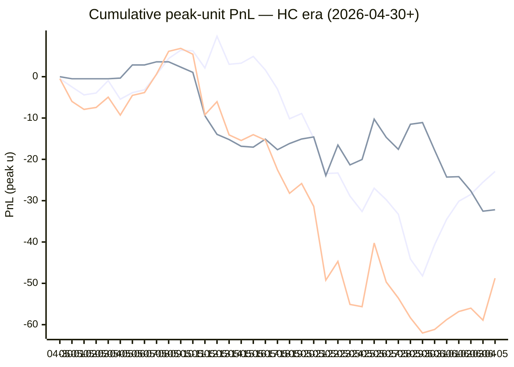

# Sharp Intel v6 — Daily Master Report

_Auto-generated **6/6/2026, 10:20:36 AM ET** by `scripts/dailyV6Report.js`. Do not edit by hand._

**Source of truth: this report mirrors the live Pick Performance dashboard.** Inclusion = `lockStage ≠ SHADOW ∧ ¬superseded ∧ health ∉ {MUTED, CANCELLED} ∧ peak.stars ≥ 2.5`. PnL is in **peak units** (the size shipped to users). HC margin / Δw / Δq are the **frozen** stamps written at last sync before the T-15 freeze. HC margin only existed from the v7.1 launch (**2026-04-30**); pre-launch picks have no HC value (no retro-fitting). Nothing is recomputed against today's whitelist.

v6 cutover: **2026-04-18** · whitelist source: live `sharpWalletProfiles` (230 profiles — drives §5 roster snapshot only) · quality cut: contribution ≥ 30 · HC = CONFIRMED tier ∧ sizeRatio ≥ 1.5.

---
## §1. Yesterday's picks

Slate: **2026-06-05** · 18 shipped sides.

| N | W-L-P | WR% | PnL (peak u) | PnL (flat 1u) |
|---|---|---|---|---|
| 18 | 11-6-1 | 64.7% | +10.15u | +3.51u |

| Sport | Market | Matchup | Pick | Stars · Units | HC | Δw | Δq | Σ | Odds | Result | PnL (peak u) |
|---|---|---|---|---|---|---|---|---|---|---|---|
| MLB | ML | Baltimore Orioles @ Toronto Blue Jays | Toronto Blue Jays | 2.5★ · 0.25u | +1 | +1 | +3 | +4 | -144 | L | -0.25u |
| MLB | ML | Boston Red Sox @ New York Yankees | Boston Red Sox | 3.0★ · 0.50u | +0 | +1 | +5 | +6 | +128 | **W** | +0.64u |
| MLB | ML | Cincinnati Reds @ St. Louis Cardinals | St. Louis Cardinals | 3.0★ · 0.50u | +0 | +1 | +4 | +5 | -136 | **W** | +0.37u |
| MLB | ML | Cleveland Guardians @ Texas Rangers | Cleveland Guardians | 5.0★ · 5.00u | +1 | +0 | +1 | +1 | -122 | L | -5.00u |
| MLB | ML | Chicago White Sox @ Philadelphia Phillies | Philadelphia Phillies | 5.0★ · 5.00u | +2 | +0 | +1 | +1 | -171 | **W** | +2.72u |
| MLB | ML | Los Angeles Angels @ Los Angeles Dodgers | Los Angeles Dodgers | 4.0★ · 1.00u | +0 | +2 | +2 | +4 | -188 | **W** | +0.51u |
| MLB | ML | Athletics @ Houston Astros | Athletics | 4.0★ · 1.00u | +0 | +1 | +0 | +1 | -105 | L | -1.00u |
| MLB | ML | Pittsburgh Pirates @ Atlanta Braves | Atlanta Braves | 4.0★ · 1.00u | +2 | +3 | +5 | +8 | -141 | **W** | +0.70u |
| MLB | ML | San Francisco Giants @ Chicago Cubs | Chicago Cubs | 4.0★ · 1.00u | +0 | +1 | -1 | +0 | -172 | L | -1.00u |
| MLB | ML | Tampa Bay Rays @ Miami Marlins | Tampa Bay Rays | 4.5★ · 3.00u | +1 | -1 | +2 | +1 | -129 | **W** | +2.17u |
| MLB | SPREAD | Tampa Bay Rays @ Miami Marlins | Tampa Bay Rays | 3.0★ · 0.50u | +0 | +1 | +1 | +2 | +126 | **W** | +0.63u |
| MLB | TOTAL | Baltimore Orioles @ Toronto Blue Jays | Over 8.5 | 4.5★ · 3.00u | -1 | +0 | +1 | +1 | -110 | **W** | +2.83u |
| MLB | TOTAL | Boston Red Sox @ New York Yankees | Over 8 | 4.0★ · 1.00u | +0 | +0 | +0 | +0 | -109 | P | +0.00u |
| MLB | TOTAL | Cincinnati Reds @ St. Louis Cardinals | Over 9.5 | 3.0★ · 0.50u | +0 | +3 | +2 | +5 | -110 | **W** | +0.44u |
| MLB | TOTAL | Pittsburgh Pirates @ Atlanta Braves | Over 8.5 | 5.0★ · 2.50u | +1 | +0 | +0 | +0 | -110 | **W** | +2.50u |
| MLB | TOTAL | San Francisco Giants @ Chicago Cubs | Over 10.5 | 5.0★ · 5.00u | -1 | +0 | +0 | +0 | -110 | **W** | +4.39u |
| NBA | ML | Knicks @ Spurs | Spurs | 2.5★ · 0.25u | +2 | +2 | +2 | +4 | -230 | L | -0.25u |
| NBA | SPREAD | Knicks @ Spurs | Spurs | 2.5★ · 0.25u | +0 | +3 | +1 | +4 | -106 | L | -0.25u |

---
## §2. 3-day / 7-day / all-time cohort rollups

Shipped picks only. PnL in **peak units** (size we actually bet) and flat 1u (cohort EV lens). All margins are the engine's frozen stamps (`v8_hcMargin`, `v8_walletConsensusDelta`, `v8_walletConsensusQualityMargin`).

**HC margin sub-tables** are scoped to picks dated ≥ 2026-04-30 (the v7.1 launch — when HC margin became a real engine signal). Pre-launch picks are excluded from HC analysis since the feature didn't exist for them. Δw / Δq sub-tables span the full v6-era sample (≥ 2026-04-18). Empty buckets are dropped.

### §2a. 3-day

Total: **50** shipped · 29-20-1 · WR 59.2% · PnL +8.06u (peak) / +5.76u (flat).

**By HC margin** _(picks dated ≥ 2026-04-30, N = 50)_

| Bucket | N | W-L-P | WR% | PnL (peak u) | PnL (flat 1u) |
|---|---|---|---|---|---|
| HC ≥ +3 | 1 | 0-1-0 | 0.0% | -0.25u | -1.00u |
| HC = +2 | 3 | 2-1-0 | 66.7% | +3.17u | +0.29u |
| HC = +1 | 9 | 5-4-0 | 55.6% | +4.28u | -0.00u |
| HC = 0 | 31 | 17-13-1 | 56.7% | -8.01u | +2.10u |
| HC ≤ −1 | 6 | 5-1-0 | 83.3% | +8.87u | +4.37u |

**By Δw (winner margin)**

| Bucket | N | W-L-P | WR% | PnL (peak u) | PnL (flat 1u) |
|---|---|---|---|---|---|
| ≥ +3 | 8 | 4-4-0 | 50.0% | +0.21u | -0.75u |
| +2 | 4 | 2-2-0 | 50.0% | -0.19u | -0.56u |
| +1 | 19 | 11-8-0 | 57.9% | +1.77u | +2.64u |
| 0 | 16 | 9-6-1 | 60.0% | +2.78u | +1.69u |
| −1 | 2 | 2-0-0 | 100.0% | +3.33u | +2.12u |
| ≤ −2 | 1 | 1-0-0 | 100.0% | +0.16u | +0.63u |

**By Δq (quality margin)**

| Bucket | N | W-L-P | WR% | PnL (peak u) | PnL (flat 1u) |
|---|---|---|---|---|---|
| ≥ +3 | 8 | 6-2-0 | 75.0% | +4.11u | +2.82u |
| +2 | 7 | 4-3-0 | 57.1% | -1.55u | +0.12u |
| +1 | 15 | 9-6-0 | 60.0% | +7.94u | +2.61u |
| 0 | 16 | 8-7-1 | 53.3% | -3.21u | +0.14u |
| −1 | 4 | 2-2-0 | 50.0% | +0.77u | +0.08u |

**By AGS tier** _(picks dated ≥ 2026-05-05, N = 50)_

| Bucket | N | W-L-P | WR% | PnL (peak u) | PnL (flat 1u) |
|---|---|---|---|---|---|
| NEUT   (0 .. +3) | 18 | 11-7-0 | 61.1% | -0.59u | +2.49u |
| WEAK   (−1 .. 0) | 31 | 17-13-1 | 56.7% | +7.40u | +2.02u |
| FADE   (< −1) | 1 | 1-0-0 | 100.0% | +1.25u | +1.25u |

### §2b. 7-day

Total: **99** shipped · 53-45-1 · WR 54.1% · PnL +9.59u (peak) / +3.12u (flat).

**By HC margin** _(picks dated ≥ 2026-04-30, N = 99)_

| Bucket | N | W-L-P | WR% | PnL (peak u) | PnL (flat 1u) |
|---|---|---|---|---|---|
| HC ≥ +3 | 2 | 0-2-0 | 0.0% | -1.25u | -2.00u |
| HC = +2 | 7 | 6-1-0 | 85.7% | +13.24u | +4.00u |
| HC = +1 | 23 | 13-10-0 | 56.5% | +9.19u | +0.73u |
| HC = 0 | 59 | 28-30-1 | 48.3% | -20.69u | -4.57u |
| HC ≤ −1 | 8 | 6-2-0 | 75.0% | +9.10u | +4.97u |

**By Δw (winner margin)**

| Bucket | N | W-L-P | WR% | PnL (peak u) | PnL (flat 1u) |
|---|---|---|---|---|---|
| ≥ +3 | 12 | 5-7-0 | 41.7% | -2.21u | -3.11u |
| +2 | 14 | 9-5-0 | 64.3% | +10.77u | +4.28u |
| +1 | 39 | 21-18-0 | 53.8% | -6.26u | +2.36u |
| 0 | 27 | 15-11-1 | 57.7% | +8.30u | +0.86u |
| −1 | 5 | 2-3-0 | 40.0% | +1.58u | -0.88u |
| ≤ −2 | 2 | 1-1-0 | 50.0% | -2.59u | -0.38u |

**By Δq (quality margin)**

| Bucket | N | W-L-P | WR% | PnL (peak u) | PnL (flat 1u) |
|---|---|---|---|---|---|
| ≥ +3 | 13 | 8-5-0 | 61.5% | +3.87u | +1.27u |
| +2 | 19 | 9-10-0 | 47.4% | -2.46u | -3.05u |
| +1 | 30 | 20-10-0 | 66.7% | +24.62u | +10.34u |
| 0 | 28 | 13-14-1 | 48.1% | -12.86u | -2.80u |
| −1 | 7 | 3-4-0 | 42.9% | +0.17u | -0.63u |
| ≤ −2 | 2 | 0-2-0 | 0.0% | -3.75u | -2.00u |

**By AGS tier** _(picks dated ≥ 2026-05-05, N = 99)_

| Bucket | N | W-L-P | WR% | PnL (peak u) | PnL (flat 1u) |
|---|---|---|---|---|---|
| NEUT   (0 .. +3) | 53 | 28-25-0 | 52.8% | -1.93u | -0.51u |
| WEAK   (−1 .. 0) | 45 | 24-20-1 | 54.5% | +10.27u | +2.38u |
| FADE   (< −1) | 1 | 1-0-0 | 100.0% | +1.25u | +1.25u |

### §2c. All-time

Total: **482** shipped · 242-236-4 · WR 50.6% · PnL -60.99u (peak) / -14.47u (flat).

**By HC margin** _(picks dated ≥ 2026-04-30, N = 371)_

| Bucket | N | W-L-P | WR% | PnL (peak u) | PnL (flat 1u) |
|---|---|---|---|---|---|
| HC ≥ +3 | 10 | 3-7-0 | 30.0% | -8.83u | -5.67u |
| HC = +2 | 27 | 13-14-0 | 48.1% | -12.97u | -1.64u |
| HC = +1 | 135 | 75-60-0 | 55.6% | -1.14u | +9.69u |
| HC = 0 | 182 | 92-87-3 | 51.4% | -32.20u | -8.88u |
| HC ≤ −1 | 16 | 8-8-0 | 50.0% | +4.75u | +0.82u |

**By Δw (winner margin)**

| Bucket | N | W-L-P | WR% | PnL (peak u) | PnL (flat 1u) |
|---|---|---|---|---|---|
| ≥ +3 | 91 | 43-48-0 | 47.3% | -32.41u | -3.60u |
| +2 | 113 | 53-60-0 | 46.9% | -30.02u | -8.64u |
| +1 | 164 | 93-70-1 | 57.1% | +9.15u | +12.00u |
| 0 | 89 | 44-42-3 | 51.2% | -3.11u | -5.35u |
| −1 | 16 | 4-12-0 | 25.0% | -5.50u | -8.35u |
| ≤ −2 | 3 | 1-2-0 | 33.3% | -3.09u | -1.38u |
| missing | 6 | 4-2-0 | 66.7% | +3.99u | +0.85u |

**By Δq (quality margin)**

| Bucket | N | W-L-P | WR% | PnL (peak u) | PnL (flat 1u) |
|---|---|---|---|---|---|
| ≥ +3 | 113 | 56-55-2 | 50.5% | -22.74u | -2.18u |
| +2 | 98 | 43-55-0 | 43.9% | -40.76u | -14.21u |
| +1 | 148 | 79-68-1 | 53.7% | +15.06u | +3.32u |
| 0 | 78 | 40-37-1 | 51.9% | -6.13u | -0.64u |
| −1 | 29 | 18-11-0 | 62.1% | +7.36u | +4.77u |
| ≤ −2 | 10 | 2-8-0 | 20.0% | -17.02u | -6.29u |
| missing | 6 | 4-2-0 | 66.7% | +3.24u | +0.77u |

**By AGS tier** _(picks dated ≥ 2026-05-05, N = 346)_

| Bucket | N | W-L-P | WR% | PnL (peak u) | PnL (flat 1u) |
|---|---|---|---|---|---|
| ELITE  (≥ +7) | 3 | 3-0-0 | 100.0% | +8.01u | +2.34u |
| LOCK   (+5 .. +7) | 9 | 5-4-0 | 55.6% | -2.93u | -0.47u |
| STRONG (+3 .. +5) | 22 | 13-9-0 | 59.1% | -6.66u | +2.77u |
| NEUT   (0 .. +3) | 230 | 116-114-0 | 50.4% | -47.23u | -14.32u |
| WEAK   (−1 .. 0) | 70 | 35-33-2 | 51.5% | +0.40u | +0.85u |
| FADE   (< −1) | 11 | 7-4-0 | 63.6% | +2.97u | +3.41u |
| missing | 1 | 1-0-0 | 100.0% | +1.63u | +0.96u |

---
## §3. Edge over time — is HC margin creating winners?

Daily cumulative peak-unit PnL since the HC margin launch (**2026-04-30**). The `HC ≥ +1` line is the golden-standard cohort. The `HC = 0` line is the no-HC-signal control. The `All shipped (HC era)` line is every shipped pick from the same date range — the apples-to-apples baseline. Watch the spread.

Daily cumulative table (peak units, HC era only):

| Date | HC ≥ +1 (cum) | HC = 0 (cum) | All shipped (cum) |
|---|---|---|---|
| 2026-04-30 | -0.48u | +0.00u | -0.48u |
| 2026-05-01 | -2.48u | -0.50u | -5.98u |
| 2026-05-02 | -4.41u | -0.50u | -7.91u |
| 2026-05-03 | -3.94u | -0.50u | -7.44u |
| 2026-05-04 | -0.95u | -0.50u | -4.95u |
| 2026-05-05 | -5.45u | -0.34u | -9.29u |
| 2026-05-06 | -3.86u | +2.84u | -4.52u |
| 2026-05-07 | -3.18u | +2.84u | -3.84u |
| 2026-05-08 | +0.54u | +3.60u | +0.64u |
| 2026-05-09 | +4.41u | +3.60u | +6.14u |
| 2026-05-10 | +6.41u | +2.32u | +6.86u |
| 2026-05-11 | +6.25u | +1.05u | +5.43u |
| 2026-05-12 | +2.11u | -9.45u | -9.21u |
| 2026-05-13 | +9.78u | -13.95u | -6.04u |
| 2026-05-14 | +3.00u | -15.20u | -14.07u |
| 2026-05-15 | +3.27u | -16.83u | -15.43u |
| 2026-05-16 | +4.90u | -17.05u | -14.02u |
| 2026-05-17 | +1.62u | -15.11u | -15.36u |
| 2026-05-18 | -2.98u | -17.67u | -22.52u |
| 2026-05-19 | -10.18u | -16.17u | -28.22u |
| 2026-05-20 | -8.90u | -15.07u | -25.84u |
| 2026-05-21 | -14.92u | -14.58u | -31.37u |
| 2026-05-22 | -23.44u | -23.93u | -49.24u |
| 2026-05-23 | -23.30u | -16.53u | -44.70u |
| 2026-05-24 | -28.89u | -21.34u | -55.10u |
| 2026-05-25 | -32.63u | -20.03u | -55.65u |
| 2026-05-26 | -26.98u | -10.27u | -40.24u |
| 2026-05-27 | -29.77u | -14.68u | -49.69u |
| 2026-05-28 | -33.27u | -17.58u | -53.57u |
| 2026-05-29 | -44.12u | -11.51u | -58.35u |
| 2026-05-30 | -48.21u | -11.10u | -62.03u |
| 2026-05-31 | -40.65u | -17.79u | -61.16u |
| 2026-06-01 | -34.49u | -24.29u | -58.77u |
| 2026-06-02 | -30.14u | -24.19u | -56.82u |
| 2026-06-03 | -28.48u | -27.68u | -56.00u |
| 2026-06-04 | -25.53u | -32.54u | -58.91u |
| 2026-06-05 | -22.94u | -32.20u | -48.76u |

---
## §4. Wallet roster growth & profitability

"Tracked in sport X" = a wallet has placed **≥ 2 bets** in X within the v6-era sample. "Profitable" = cumulative flat PnL > 0. Source: `v8Scoring.walletDetails` on every graded v6-era game (every side, not just the shipped set).

### §4a. Per-sport wallet snapshot

| Sport | Total wallets seen | Tracked (≥2) | Profitable | % prof | WR ≥ 50% | WR ≥ 60% | WR ≥ 70% |
|---|---|---|---|---|---|---|---|
| MLB | 69 | 48 | 15 | 31% | 23 | 9 | 5 |
| NBA | 133 | 102 | 43 | 42% | 58 | 28 | 11 |
| NHL | 58 | 41 | 14 | 34% | 23 | 13 | 7 |
| **ALL (any sport)** | **166** | **132** | **57** | **43%** | **74** | **31** | **11** |

### §4b. Daily roster growth (cumulative through each date)

Format: `tracked (profitable)`. For each date D, recompute the roster using every bet up to and including D.

| Date | ALL | MLB | NBA | NHL |
|---|---|---|---|---|
| 2026-04-18 | 5 (2) | 2 (2) | 3 (0) | 0 (0) |
| 2026-04-19 | 19 (8) | 5 (3) | 9 (3) | 3 (1) |
| 2026-04-20 | 29 (12) | 7 (6) | 23 (8) | 5 (2) |
| 2026-04-21 | 44 (21) | 10 (6) | 31 (10) | 7 (5) |
| 2026-04-22 | 52 (28) | 12 (6) | 39 (15) | 11 (10) |
| 2026-04-23 | 56 (29) | 13 (6) | 46 (21) | 13 (10) |
| 2026-04-24 | 61 (30) | 14 (6) | 51 (23) | 14 (9) |
| 2026-04-25 | 65 (29) | 16 (8) | 54 (22) | 16 (9) |
| 2026-04-26 | 67 (31) | 18 (5) | 56 (25) | 17 (9) |
| 2026-04-27 | 72 (32) | 20 (7) | 60 (24) | 17 (9) |
| 2026-04-28 | 76 (33) | 21 (7) | 63 (26) | 23 (10) |
| 2026-04-29 | 77 (33) | 21 (7) | 64 (25) | 23 (10) |
| 2026-04-30 | 81 (34) | 21 (7) | 70 (27) | 23 (10) |
| 2026-05-01 | 85 (38) | 22 (5) | 74 (30) | 26 (13) |
| 2026-05-02 | 86 (37) | 23 (7) | 75 (32) | 26 (12) |
| 2026-05-03 | 86 (38) | 24 (8) | 75 (33) | 26 (12) |
| 2026-05-04 | 90 (38) | 24 (9) | 76 (32) | 26 (12) |
| 2026-05-05 | 91 (40) | 24 (9) | 79 (33) | 26 (12) |
| 2026-05-06 | 92 (40) | 24 (9) | 80 (33) | 26 (12) |
| 2026-05-07 | 92 (41) | 24 (9) | 80 (33) | 26 (12) |
| 2026-05-08 | 92 (40) | 24 (8) | 80 (32) | 26 (11) |
| 2026-05-09 | 94 (42) | 24 (8) | 82 (35) | 26 (11) |
| 2026-05-10 | 94 (42) | 24 (8) | 82 (35) | 26 (11) |
| 2026-05-11 | 96 (42) | 24 (8) | 84 (36) | 26 (11) |
| 2026-05-12 | 100 (41) | 27 (9) | 86 (37) | 26 (11) |
| 2026-05-13 | 102 (45) | 29 (11) | 88 (37) | 26 (11) |
| 2026-05-14 | 102 (41) | 29 (11) | 88 (37) | 28 (12) |
| 2026-05-15 | 103 (41) | 30 (10) | 88 (39) | 28 (12) |
| 2026-05-16 | 105 (43) | 31 (12) | 88 (39) | 30 (14) |
| 2026-05-17 | 105 (46) | 32 (11) | 88 (40) | 30 (14) |
| 2026-05-18 | 105 (46) | 32 (10) | 88 (38) | 31 (15) |
| 2026-05-19 | 105 (46) | 32 (12) | 88 (38) | 31 (15) |
| 2026-05-20 | 106 (48) | 33 (12) | 88 (38) | 31 (16) |
| 2026-05-21 | 106 (45) | 34 (12) | 88 (37) | 31 (14) |
| 2026-05-22 | 106 (44) | 34 (10) | 88 (39) | 33 (16) |
| 2026-05-23 | 111 (49) | 36 (10) | 90 (40) | 36 (19) |
| 2026-05-24 | 117 (52) | 37 (12) | 94 (39) | 37 (16) |
| 2026-05-25 | 120 (53) | 38 (13) | 95 (40) | 38 (16) |
| 2026-05-26 | 122 (55) | 39 (14) | 97 (42) | 38 (16) |
| 2026-05-27 | 123 (51) | 40 (12) | 97 (42) | 40 (14) |
| 2026-05-28 | 124 (51) | 40 (12) | 99 (42) | 40 (14) |
| 2026-05-29 | 125 (50) | 41 (12) | 99 (42) | 41 (12) |
| 2026-05-30 | 126 (49) | 41 (12) | 101 (43) | 41 (12) |
| 2026-05-31 | 126 (48) | 41 (11) | 101 (43) | 41 (12) |
| 2026-06-01 | 129 (52) | 44 (14) | 101 (43) | 41 (12) |
| 2026-06-02 | 130 (56) | 45 (16) | 101 (43) | 41 (13) |
| 2026-06-03 | 132 (56) | 45 (14) | 102 (43) | 41 (13) |
| 2026-06-04 | 132 (57) | 46 (14) | 102 (43) | 41 (14) |
| 2026-06-05 | 132 (57) | 48 (15) | 102 (43) | 41 (14) |

### §4c. Top 10 profitable wallets by sport

#### MLB

| # | Wallet | N | W | L | WR% | Flat PnL (u) | Flat ROI | $ PnL |
|---|---|---|---|---|---|---|---|---|
| 1 | a8c991 | 2 | 2 | 0 | 100.0% | +2.60 | +129.9% | $62.6K |
| 2 | 10c684 | 2 | 2 | 0 | 100.0% | +2.04 | +102.0% | $140.2K |
| 3 | c289a0 | 3 | 3 | 0 | 100.0% | +2.87 | +95.6% | $1.5K |
| 4 | e05213 | 6 | 5 | 1 | 83.3% | +3.48 | +58.0% | $35.9K |
| 5 | c9bba3 | 5 | 4 | 1 | 80.0% | +2.37 | +47.3% | $14.8K |
| 6 | eeabaf | 36 | 21 | 15 | 58.3% | +11.74 | +32.6% | $897.1K |
| 7 | 913987 | 22 | 15 | 7 | 68.2% | +7.14 | +32.5% | $513.9K |
| 8 | 491f30 | 9 | 5 | 4 | 55.6% | +2.61 | +29.0% | $7.6K |
| 9 | 1e8f33 | 21 | 13 | 8 | 61.9% | +4.42 | +21.0% | $45.5K |
| 10 | 981187 | 8 | 5 | 3 | 62.5% | +1.65 | +20.7% | $13.5K |

#### NBA

| # | Wallet | N | W | L | WR% | Flat PnL (u) | Flat ROI | $ PnL |
|---|---|---|---|---|---|---|---|---|
| 1 | 799fad | 2 | 2 | 0 | 100.0% | +5.66 | +283.0% | $241.7K |
| 2 | a0d6d2 | 4 | 4 | 0 | 100.0% | +4.51 | +112.7% | $6.4K |
| 3 | 4a9953 | 2 | 2 | 0 | 100.0% | +2.16 | +108.2% | $3.7K |
| 4 | 12ad50 | 3 | 3 | 0 | 100.0% | +2.74 | +91.3% | $45.5K |
| 5 | b51a56 | 6 | 5 | 1 | 83.3% | +5.44 | +90.7% | $74.4K |
| 6 | 11b032 | 7 | 6 | 1 | 85.7% | +5.40 | +77.1% | $249.9K |
| 7 | 769c38 | 14 | 12 | 2 | 85.7% | +8.01 | +57.2% | $79.9K |
| 8 | 7f00bc | 18 | 12 | 6 | 66.7% | +9.06 | +50.3% | $13.0K |
| 9 | 710c2e | 4 | 3 | 1 | 75.0% | +1.82 | +45.4% | $135.8K |
| 10 | 4edc5b | 4 | 2 | 2 | 50.0% | +1.79 | +44.7% | $55.6K |

#### NHL

| # | Wallet | N | W | L | WR% | Flat PnL (u) | Flat ROI | $ PnL |
|---|---|---|---|---|---|---|---|---|
| 1 | 8366f5 | 2 | 2 | 0 | 100.0% | +2.30 | +114.9% | $107.6K |
| 2 | 799fad | 2 | 2 | 0 | 100.0% | +1.88 | +94.1% | $46.9K |
| 3 | fec67e | 4 | 3 | 1 | 75.0% | +2.82 | +70.5% | $12.5K |
| 4 | 30935c | 4 | 3 | 1 | 75.0% | +2.11 | +52.7% | $953 |
| 5 | 0f9d74 | 4 | 3 | 1 | 75.0% | +1.84 | +45.9% | $7.3K |
| 6 | 981187 | 8 | 6 | 2 | 75.0% | +3.52 | +44.0% | -$25.2K |
| 7 | fcc12b | 11 | 8 | 3 | 72.7% | +4.45 | +40.5% | -$27.5K |
| 8 | e70853 | 9 | 6 | 3 | 66.7% | +2.66 | +29.5% | -$11.1K |
| 9 | bc3532 | 18 | 11 | 7 | 61.1% | +5.13 | +28.5% | $60.5K |
| 10 | dfa240 | 26 | 17 | 9 | 65.4% | +6.49 | +24.9% | $19.9K |

---
## §5. Proven-wallet roster growth & HC tracking

"Proven wallet" = whitelist tier `CONFIRMED` or `FLAT` in the same sense the live engine uses (`exportWalletProfiles.js` → `sharpWalletProfiles.bySport`). Sports inherit independent rosters: a wallet can be CONFIRMED in NBA and absent from NHL. `walletBets` come from `v8Scoring.walletDetails` on every graded v6-era pick (Source A); `positionRows` come from `sharp_action_positions` (Source B).

### §5a. Current proven-winner roster (snapshot)

Roster as of **2026-06-05** — wallets with ≥2 bets in the sport.

| Sport | Wallets seen | Eligible (≥2) | CONFIRMED | FLAT | Proven (C+F) | WR50 only | Conv % |
|---|---|---|---|---|---|---|---|
| MLB | 116 | 48 | 10 | 5 | **15** | 8 | 12.9% |
| NBA | 195 | 102 | 27 | 16 | **43** | 19 | 22.1% |
| NHL | 97 | 41 | 9 | 5 | **14** | 9 | 14.4% |
| **ALL** | **—** | **—** | **—** | **—** | **72** | **—** | **—** |

### §5b. Live whitelist drift check

Live `sharpWalletProfiles` is what the engine reads at lock time. Drift between script reconstruction (above) and live should be ≤ 1 day of position data — otherwise `exportWalletProfiles.js` is stale.

| Sport | CONFIRMED (live · script) | FLAT (live · script) | WR50 (live · script) | Drift |
|---|---|---|---|---|
| MLB | 29 · 10 | 8 · 5 | 8 · 8 | +22 live |
| NBA | 49 · 27 | 26 · 16 | 25 · 19 | +32 live |
| NHL | 22 · 9 | 6 · 5 | 12 · 9 | +14 live |

### §5c. Roster growth — 3d / 7d / 30d / all-time deltas

Each cell is **net growth** in proven (CONFIRMED + FLAT) wallets in that window, with the absolute count at the start (`+Δ from N`). Negative = wallets demoted. Window endpoint = 2026-06-05.

| Sport | 3-day | 7-day | 30-day | All-time (since cutover) |
|---|---|---|---|---|
| MLB | -1 from 16 | +3 from 12 | +6 from 9 | +15 from 0 |
| NBA | +0 from 43 | +1 from 42 | +10 from 33 | +43 from 0 |
| NHL | +1 from 13 | +2 from 12 | +2 from 12 | +14 from 0 |

A flat 7-day delta on a sport with healthy slate density = either the bubble pipeline has stalled (no wallets approaching the bar) or our cohort has saturated. Check §13d for the funnel diagnostic.

### §5d. Pipeline funnel — where each sport leaks

Wallets surviving each gate, in order. The biggest %-drop tells you the bottleneck. Gates:

1. **Seen** — placed ≥ 1 bet in the sport (any source)
2. **Eligible** — ≥ 2 graded picks in Source A (required for FLAT/CONFIRMED)
3. **Flat-OK** — eligible AND flat ROI > 0 (becomes FLAT or better)
4. **$-OK** — Flat-OK AND ≥2 positions with dollar ROI > 0 (CONFIRMED)
5. **Promoted** — final whitelisted = CONFIRMED + FLAT

| Sport | 1·Seen | 2·Eligible (% of Seen) | 3·Flat-OK (% of Elig) | 4·$-OK (% of Flat) | 5·Promoted | Bottleneck |
|---|---|---|---|---|---|---|
| MLB | 116 | 48 (41%) | 15 (31%) | 10 (67%) | **15** | edge (Eligible→Flat-OK) 69% |
| NBA | 195 | 102 (52%) | 43 (42%) | 27 (63%) | **43** | edge (Eligible→Flat-OK) 58% |
| NHL | 97 | 41 (42%) | 14 (34%) | 9 (64%) | **14** | edge (Eligible→Flat-OK) 66% |

### §5e. HC backing density (the fuel for v7.3 HC margin)

Every v7.x promotion is gated on `HC_m ≥ +1`, which requires at least one CONFIRMED wallet sized at `≥ 1.5×` average on the for-side. This table shows the share of shipped picks that *had any HC backing*, by sport, in each window. If HC density falls toward zero in a sport, the v7.3 floor cohorts (Σ=1, Σ=2 locks; HC rescues) will simply stop firing there.

| Sport | Window | Picks (with HC stamp) | Any HC for-side | HC_m ≥ +1 | HC_m ≥ +2 |
|---|---|---|---|---|---|
| MLB | 3-day | 45 | 11 (24.4%) | 11 (24.4%) | 2 (4.4%) |
| MLB | 7-day | 91 | 29 (31.9%) | 28 (30.8%) | 5 (5.5%) |
| MLB | All-time | 312 | 125 (40.1%) | 118 (37.8%) | 14 (4.5%) |
| NBA | 3-day | 4 | 3 (75.0%) | 2 (50.0%) | 2 (50.0%) |
| NBA | 7-day | 6 | 5 (83.3%) | 3 (50.0%) | 3 (50.0%) |
| NBA | All-time | 120 | 78 (65.0%) | 65 (54.2%) | 31 (25.8%) |
| NHL | 3-day | 1 | 0 (0.0%) | 0 (0.0%) | 0 (0.0%) |
| NHL | 7-day | 2 | 1 (50.0%) | 1 (50.0%) | 1 (50.0%) |
| NHL | All-time | 44 | 20 (45.5%) | 19 (43.2%) | 5 (11.4%) |

Pooled across sports:

| Window | Picks (with HC stamp) | Any HC for-side | HC_m ≥ +1 | HC_m ≥ +2 |
|---|---|---|---|---|
| 3-day | 50 | 14 (28.0%) | 13 (26.0%) | 4 (8.0%) |
| 7-day | 99 | 35 (35.4%) | 32 (32.3%) | 9 (9.1%) |
| All-time | 476 | 223 (46.8%) | 202 (42.4%) | 50 (10.5%) |

### §5f. Bubble wallets — next-up graduations

Wallets currently NOT promoted but close. Two flavors:

- **One-bet-away** — won the only bet, needs one more positive bet to clear ≥2.
- **Just-under** — has ≥2 bets but flat ROI is between −10% and 0% (one win flips them).

#### MLB

**One-bet-away** (6)

| wallet | picksN | flat PnL | pos N | pos $ROI |
|---|---|---|---|---|
| `...be17` | 1 | +6.95 | 23 | -60% |
| `...88a3` | 1 | +1.80 | 9 | 37% |
| `...e3d0` | 1 | +0.91 | 20 | 24% |
| `...be00` | 1 | +0.87 | 15 | 10% |
| `...a240` | 1 | +0.87 | 7 | 83% |
| `...9373` | 1 | +0.87 | 0 | — |

**Just-under** (6)

| wallet | picksN | WR | flat ROI | pos N | pos $ROI |
|---|---|---|---|---|---|
| `...2768` | 26 | 46% | -0.3% | 50 | 13% |
| `...fc82` | 24 | 50% | -1.2% | 64 | -17% |
| `...35e3` | 23 | 52% | -2.4% | 117 | -10% |
| `...1eae` | 64 | 48% | -3.0% | 125 | 7% |
| `...0232` | 4 | 50% | -4.5% | 11 | 30% |
| `...135d` | 195 | 50% | -4.6% | 326 | 7% |

#### NBA

**One-bet-away** (6)

| wallet | picksN | flat PnL | pos N | pos $ROI |
|---|---|---|---|---|
| `...bf5d` | 1 | +3.15 | 3 | 42% |
| `...ed41` | 1 | +3.15 | 3 | 3% |
| `...6b87` | 1 | +2.05 | 8 | -27% |
| `...c991` | 1 | +1.14 | 8 | 77% |
| `...9d74` | 1 | +0.93 | 34 | -6% |
| `...c556` | 1 | +0.93 | 3 | 42% |

**Just-under** (6)

| wallet | picksN | WR | flat ROI | pos N | pos $ROI |
|---|---|---|---|---|---|
| `...d814` | 8 | 50% | -0.5% | 53 | 1% |
| `...d96a` | 19 | 37% | -1.5% | 77 | -9% |
| `...65dd` | 6 | 50% | -2.4% | 17 | 27% |
| `...853d` | 40 | 53% | -2.7% | 90 | -2% |
| `...11a4` | 18 | 44% | -2.9% | 65 | 61% |
| `...1eae` | 19 | 53% | -3.3% | 74 | 11% |

#### NHL

**One-bet-away** (6)

| wallet | picksN | flat PnL | pos N | pos $ROI |
|---|---|---|---|---|
| `...2e78` | 1 | +1.46 | 0 | — |
| `...017f` | 1 | +1.45 | 5 | 125% |
| `...32f2` | 1 | +1.40 | 0 | — |
| `...e0fd` | 1 | +1.20 | 3 | 124% |
| `...266e` | 1 | +1.05 | 0 | — |
| `...2194` | 1 | +1.05 | 0 | — |

**Just-under** (6)

| wallet | picksN | WR | flat ROI | pos N | pos $ROI |
|---|---|---|---|---|---|
| `...33ee` | 4 | 50% | -0.3% | 8 | -23% |
| `...afd2` | 6 | 50% | -1.9% | 23 | -13% |
| `...192c` | 7 | 43% | -2.9% | 21 | -15% |
| `...35e3` | 7 | 57% | -5.5% | 26 | 31% |
| `...618e` | 2 | 50% | -6.1% | 28 | 24% |
| `...9ef0` | 7 | 43% | -8.6% | 23 | 0% |

### §5g. v2 wallet-promotion pipeline (Source-A / Source-B mix)

Live snapshot of the v2 promotion gate (shipped 2026-05-10, re-eval **2026-05-24**). Each FLAT-or-better wallet × sport pair is attributed to one of three paths via `sharpWalletProfiles[wallet].bySport[sport].whitelistSource`:

- **A** — flat-positive on featured picks (Source A) only — the v1 gate
- **A+B** — flat-positive in both sources (most reliable signal)
- **B** — flat-positive on-chain only (NEW in v2 — the trial lift)

Re-classified every 2h via `grade-sharp-actions` cron. Roll-back: set `B_ONLY_MIN_BETS = Infinity` in `scripts/exportWalletProfiles.js`.

#### Source mix per sport (live Firestore)

| Sport | A | A+B | B (new) | FLAT-or-better total | % from B-only |
|---|---|---|---|---|---|
| MLB | 2 | 13 | **22** | 37 | 59.5% |
| NBA | 12 | 31 | **32** | 75 | 42.7% |
| NHL | 4 | 10 | **14** | 28 | 50.0% |
| **ALL** | **18** | **54** | **68** | **140** | **48.6%** |

#### Pipeline freshness

- `sharp_action_positions` GRADED rows: **11617**
- `sharp_action_positions` PENDING rows: **75** (queued for next Grade Sharp Actions run)
- Latest `sharpWalletProfiles` rebuild: 6/6/2026, 5:23:38 AM ET — **297 min · STALE** — check grade-sharp-actions workflow

**Alarms**: pending > 200 OR rebuild lag > 4h → cron is lagging or failing — check `gh run list --workflow="Grade Sharp Actions"`.

#### B-only roster — wallets currently promoted via Source B path only

Wallets here would have been EXCLUDED under v1 (Source-A-only). Top by Source-B bet count per sport. The 2-week re-eval (2026-05-24) will compare these wallets' realized lift against A-only and A+B cohorts.

**MLB** — 22 wallets promoted via B

| wallet | tier | B_n | B_flat ROI | B_$ ROI |
|---|---|---|---|---|
| `...9a27` | CONFIRMED | 466 | +12.1% | +4.3% |
| `...135d` | CONFIRMED | 326 | +1.9% | +6.9% |
| `...1eae` | CONFIRMED | 128 | +10% | +6.8% |
| `...69c2` | CONFIRMED | 66 | +17.4% | +1% |
| `...2768` | CONFIRMED | 50 | +9.8% | +12.7% |
| `...d6d2` | FLAT | 38 | +6.8% | -25.5% |
| `...600d` | FLAT | 27 | +0.5% | -1.4% |
| `...ad50` | CONFIRMED | 25 | +33.2% | +17.7% |
| `...cff6` | CONFIRMED | 20 | +2.6% | +15.5% |
| `...f804` | CONFIRMED | 18 | +56.4% | +52.6% |
| … | 12 more | | | |

**NBA** — 32 wallets promoted via B

| wallet | tier | B_n | B_flat ROI | B_$ ROI |
|---|---|---|---|---|
| `...135d` | FLAT | 102 | +5.1% | -11.9% |
| `...d96a` | FLAT | 77 | +3.1% | -8.5% |
| `...11a4` | CONFIRMED | 65 | +25.7% | +60.8% |
| `...935c` | FLAT | 50 | +17.3% | -21.4% |
| `...c684` | CONFIRMED | 44 | +4.4% | +20% |
| `...68b3` | CONFIRMED | 44 | +33.9% | +13.9% |
| `...b6ef` | CONFIRMED | 42 | +6.3% | +3.3% |
| `...9d74` | FLAT | 34 | +3.9% | -6.3% |
| `...9e7a` | FLAT | 31 | +8% | -13.6% |
| `...0ff5` | CONFIRMED | 20 | +13.8% | +36.9% |
| … | 22 more | | | |

**NHL** — 14 wallets promoted via B

| wallet | tier | B_n | B_flat ROI | B_$ ROI |
|---|---|---|---|---|
| `...1697` | CONFIRMED | 46 | +4.1% | +8.4% |
| `...3782` | CONFIRMED | 40 | +1.2% | +3.4% |
| `...618e` | CONFIRMED | 28 | +6.2% | +23.8% |
| `...b33b` | CONFIRMED | 28 | +1.5% | +22.7% |
| `...35e3` | CONFIRMED | 26 | +10.6% | +31.5% |
| `...5eee` | CONFIRMED | 23 | +30.5% | +19.3% |
| `...192c` | FLAT | 21 | +14% | -15.2% |
| `...0c2e` | CONFIRMED | 14 | +22.9% | +5.9% |
| `...2ca8` | CONFIRMED | 8 | +16.2% | +4% |
| `...a9cc` | CONFIRMED | 7 | +49.5% | +46.9% |
| … | 4 more | | | |

### §5 — How to read

- **Roster growth flat in 7-day** + **funnel bottleneck = `data`** → re-run `exportWalletProfiles.js`. The flat-positive wallets are stuck at FLAT because Source-B coverage hasn't caught up. CONFIRMED gate is data-bound, not skill-bound.
- **Roster growth flat in 7-day** + **funnel bottleneck = `sample`** → wallets aren't reaching `≥2` reps fast enough. This is a slate-density problem; consider a soft `MIN_BETS = 1` shadow lane to surface bubble wallets earlier.
- **Roster shrank** (negative delta) → a previously CONFIRMED wallet just dropped flat-positive (lost a recent bet). Variance, not failure — but worth noting if a sport loses ≥3 in a week.
- **HC density on a sport drops below ~30%** → v7.3 promotions there will starve. Either the proven roster needs more CONFIRMED-tier wallets sizing aggressively, or the HC_RATIO (1.5) needs a sport-specific tune.
- **§5g B-only count drops sharply** → wallets are demoting off the B path (losing on-chain). Cross-check `WALLET_PROFILES_SUMMARY.md` churn section for the specific demotions.
- **§5g pipeline freshness lag > 4h** → grade-sharp-actions cron is failing. Check `gh run list --workflow="Grade Sharp Actions"` and re-trigger if needed.

---
## §6. Daily proven-wallet performance

Who on the proven roster is actually printing — yesterday's bets, the rolling leaderboard (`$ PnL`-ranked), current streaks, and per-sport volume. **Proven** = `CONFIRMED` ∪ `FLAT` per sport (the same gate that drives Δ_winner). A wallet only counts in a sport where it's on that sport's proven list.

### §6a. Yesterday's proven-wallet bets

Slate: **2026-06-05** · 43 bets · 21 distinct proven wallets · WR 56% · $ vol $1.70M · $ PnL -$661.9K.

| Wallet | Sport | Market | Game | $ size | Result | $ PnL |
|---|---|---|---|---|---|---|
| `...3987` (CONFIRMED) | MLB | TOTAL | Pittsburgh Pirates @ Atlanta Braves | $100.0K | **W** | $100.0K |
| `...3987` (CONFIRMED) | MLB | ML | Chicago White Sox @ Philadelphia Phillies | $130.5K | **W** | $70.9K |
| `...23c4` (FLAT) | MLB | TOTAL | San Francisco Giants @ Chicago Cubs | $54.0K | **W** | $47.4K |
| `...2ca8` (CONFIRMED) | NBA | ML | Knicks @ Spurs | $99.0K | **W** | $43.0K |
| `...64aa` (CONFIRMED) | MLB | ML | Chicago White Sox @ Philadelphia Phillies | $52.1K | **W** | $28.3K |
| `...c684` (CONFIRMED) | MLB | ML | Seattle Mariners @ Detroit Tigers | $20.9K | **W** | $22.2K |
| `...5213` (CONFIRMED) | MLB | TOTAL | Baltimore Orioles @ Toronto Blue Jays | $21.9K | **W** | $20.6K |
| `...5213` (CONFIRMED) | MLB | ML | Baltimore Orioles @ Toronto Blue Jays | $23.7K | **W** | $16.3K |
| `...e8f1` (FLAT) | NBA | ML | Knicks @ Spurs | $32.8K | **W** | $14.3K |
| `...64aa` (CONFIRMED) | MLB | ML | Los Angeles Angels @ Los Angeles Dodgers | $19.2K | **W** | $9.8K |
| `...23c4` (FLAT) | MLB | TOTAL | Cincinnati Reds @ St. Louis Cardinals | $10.2K | **W** | $9.0K |
| `...8f33` (CONFIRMED) | MLB | ML | Tampa Bay Rays @ Miami Marlins | $11.2K | **W** | $8.1K |
| `...8f33` (CONFIRMED) | MLB | ML | Pittsburgh Pirates @ Atlanta Braves | $9.4K | **W** | $6.6K |
| `...8f33` (CONFIRMED) | MLB | ML | Boston Red Sox @ New York Yankees | $4.3K | **W** | $5.6K |
| `...3532` (FLAT) | NBA | TOTAL | Knicks @ Spurs | $4.0K | **W** | $3.8K |
| `...64aa` (CONFIRMED) | MLB | ML | Cincinnati Reds @ St. Louis Cardinals | $4.6K | **W** | $3.4K |
| `...8f33` (CONFIRMED) | MLB | SPREAD | Tampa Bay Rays @ Miami Marlins | $2.6K | **W** | $3.3K |
| `...2f63` (FLAT) | NBA | TOTAL | Knicks @ Spurs | $3.0K | **W** | $2.9K |
| `...32f2` (CONFIRMED) | NBA | SPREAD | Knicks @ Spurs | $2.5K | **W** | $2.4K |
| `...8f33` (CONFIRMED) | MLB | TOTAL | Cincinnati Reds @ St. Louis Cardinals | $2.3K | **W** | $2.0K |
| `...64aa` (CONFIRMED) | MLB | ML | Pittsburgh Pirates @ Atlanta Braves | $2.7K | **W** | $1.9K |
| `...00bc` (CONFIRMED) | NBA | ML | Knicks @ Spurs | $3.0K | **W** | $1.3K |
| `...9ef0` (CONFIRMED) | NBA | ML | Knicks @ Spurs | $1.7K | **W** | $745 |
| `...b33b` (CONFIRMED) | NBA | ML | Knicks @ Spurs | $1.5K | **W** | $670 |
| `...2f63` (FLAT) | NBA | SPREAD | Knicks @ Spurs | $95 | L | -$95 |
| `...64aa` (CONFIRMED) | MLB | ML | San Francisco Giants @ Chicago Cubs | $2.4K | L | -$2.4K |
| `...64aa` (CONFIRMED) | MLB | ML | Athletics @ Houston Astros | $3.3K | L | -$3.3K |
| `...64aa` (CONFIRMED) | MLB | ML | Seattle Mariners @ Detroit Tigers | $4.4K | L | -$4.4K |
| `...1697` (CONFIRMED) | NBA | SPREAD | Knicks @ Spurs | $6.2K | L | -$6.2K |
| `...d49f` (CONFIRMED) | NBA | SPREAD | Knicks @ Spurs | $7.2K | L | -$7.2K |
| `...2f63` (FLAT) | NBA | ML | Knicks @ Spurs | $8.1K | L | -$8.1K |
| `...23c4` (FLAT) | MLB | TOTAL | Cleveland Guardians @ Texas Rangers | $8.4K | L | -$8.4K |
| `...8f33` (CONFIRMED) | MLB | ML | Baltimore Orioles @ Toronto Blue Jays | $11.4K | L | -$11.4K |
| `...8da5` (CONFIRMED) | NBA | ML | Knicks @ Spurs | $12.4K | L | -$12.4K |
| `...abaf` (FLAT) | NBA | SPREAD | Knicks @ Spurs | $13.1K | L | -$13.1K |
| `...d49f` (CONFIRMED) | NBA | ML | Knicks @ Spurs | $17.0K | L | -$17.0K |
| `...64aa` (CONFIRMED) | MLB | ML | Baltimore Orioles @ Toronto Blue Jays | $17.4K | L | -$17.4K |
| `...9c38` (CONFIRMED) | NBA | ML | Knicks @ Spurs | $20.1K | L | -$20.1K |
| `...aeeb` (CONFIRMED) | NBA | ML | Knicks @ Spurs | $60.1K | L | -$60.1K |
| `...3532` (FLAT) | NBA | ML | Knicks @ Spurs | $103.8K | L | -$103.8K |
| `...3987` (CONFIRMED) | MLB | ML | Cleveland Guardians @ Texas Rangers | $117.4K | L | -$117.4K |
| `...e3d0` (FLAT) | NBA | ML | Knicks @ Spurs | $241.8K | L | -$241.8K |
| `...1697` (CONFIRMED) | NBA | ML | Knicks @ Spurs | $431.6K | L | -$431.6K |

### §6b. Proven-wallet leaderboard

Top 15 proven `(wallet × sport)` pairs per sport per horizon, ranked by **$ PnL** (the dollar-ROI lens). The 3-day board is the "who's on form right now" lens; the 7-day filters single-day variance; all-time is the proven-roster reference.

#### §6b-1. 3-day

**MLB** — 10 active proven wallets

| # | Wallet | Tier | Bets | WR% | Bets/day | Flat PnL (u) | Flat ROI | $ vol | $ PnL | $ ROI | Streak |
|---|---|---|---|---|---|---|---|---|---|---|---|
| 1 | `...3987` | CONFIRMED | 13 | 62% | 4.3 | +2.25 | +17% | $683.4K | $275.3K | +40% | 2W |
| 2 | `...c684` | CONFIRMED | 2 | 100% | 1.0 | +2.04 | +102% | $141.3K | $140.2K | +99% | 2W |
| 3 | `...c991` | CONFIRMED | 2 | 100% | 1.0 | +2.60 | +130% | $61.0K | $62.6K | +103% | 2W |
| 4 | `...5213` | CONFIRMED | 3 | 100% | 1.0 | +2.92 | +97% | $50.6K | $43.5K | +86% | 3W |
| 5 | `...64aa` | CONFIRMED | 27 | 56% | 9.0 | +0.17 | +1% | $419.2K | $29.7K | +7% | 2L |
| 6 | `...68b3` | FLAT | 1 | 0% | 1.0 | -1.00 | -100% | $379 | -$379 | -100% | 1L |
| 7 | `...1f30` | CONFIRMED | 2 | 50% | 2.0 | -0.09 | -5% | $9.0K | -$1.5K | -17% | 1W |
| 8 | `...8f33` | CONFIRMED | 8 | 75% | 2.7 | +3.69 | +46% | $74.6K | -$9.7K | -13% | 5W |
| 9 | `...23c4` | FLAT | 9 | 67% | 3.0 | +2.40 | +27% | $294.1K | -$28.8K | -10% | 1W |
| 10 | `...bba3` | CONFIRMED | 2 | 50% | 2.0 | -0.06 | -3% | $70.7K | -$51.7K | -73% | 1L |

**NBA** — 21 active proven wallets

| # | Wallet | Tier | Bets | WR% | Bets/day | Flat PnL (u) | Flat ROI | $ vol | $ PnL | $ ROI | Streak |
|---|---|---|---|---|---|---|---|---|---|---|---|
| 1 | `...23c4` | CONFIRMED | 3 | 100% | 3.0 | +3.54 | +118% | $45.6K | $51.2K | +112% | 3W |
| 2 | `...e8f1` | FLAT | 1 | 100% | 1.0 | +0.43 | +43% | $32.8K | $14.3K | +43% | 1W |
| 3 | `...9ef0` | CONFIRMED | 3 | 100% | 1.0 | +3.04 | +101% | $11.2K | $12.8K | +114% | 3W |
| 4 | `...2f63` | FLAT | 6 | 33% | 2.0 | -1.41 | -23% | $20.4K | $8.6K | +42% | 1W |
| 5 | `...03d4` | FLAT | 3 | 100% | 3.0 | +3.54 | +118% | $6.1K | $7.6K | +123% | 3W |
| 6 | `...abaf` | FLAT | 2 | 50% | 0.7 | -0.05 | -2% | $32.7K | $5.5K | +17% | 1L |
| 7 | `...b33b` | CONFIRMED | 2 | 100% | 0.7 | +1.39 | +69% | $4.9K | $3.9K | +79% | 2W |
| 8 | `...32f2` | CONFIRMED | 1 | 100% | 1.0 | +0.95 | +95% | $2.5K | $2.4K | +95% | 1W |
| 9 | `...d6d2` | CONFIRMED | 2 | 100% | 2.0 | +2.60 | +130% | $1.7K | $2.4K | +136% | 2W |
| 10 | `...684d` | CONFIRMED | 1 | 100% | 1.0 | +0.95 | +95% | $1.4K | $1.4K | +95% | 1W |
| 11 | `...00bc` | CONFIRMED | 1 | 100% | 1.0 | +0.43 | +43% | $3.0K | $1.3K | +43% | 1W |
| 12 | `...9a27` | CONFIRMED | 2 | 0% | 2.0 | -2.00 | -100% | $14.3K | -$14.3K | -100% | 2L |
| 13 | `...9c38` | CONFIRMED | 1 | 0% | 1.0 | -1.00 | -100% | $20.1K | -$20.1K | -100% | 1L |
| 14 | `...d49f` | CONFIRMED | 3 | 33% | 1.0 | -1.07 | -36% | $25.3K | -$23.2K | -92% | 2L |
| 15 | `...aeeb` | CONFIRMED | 2 | 0% | 0.7 | -2.00 | -100% | $65.0K | -$65.0K | -100% | 2L |

**NHL** — 4 active proven wallets

| # | Wallet | Tier | Bets | WR% | Bets/day | Flat PnL (u) | Flat ROI | $ vol | $ PnL | $ ROI | Streak |
|---|---|---|---|---|---|---|---|---|---|---|---|
| 1 | `...3532` | FLAT | 1 | 100% | 1.0 | +0.63 | +63% | $37.9K | $23.7K | +63% | 1W |
| 2 | `...44b0` | FLAT | 1 | 100% | 1.0 | +0.63 | +63% | $6.8K | $4.3K | +63% | 1W |
| 3 | `...2125` | CONFIRMED | 1 | 100% | 1.0 | +0.63 | +63% | $1.0K | $635 | +63% | 1W |
| 4 | `...df91` | FLAT | 1 | 0% | 1.0 | -1.00 | -100% | $205 | -$205 | -100% | 1L |

#### §6b-2. 7-day

**MLB** — 11 active proven wallets

| # | Wallet | Tier | Bets | WR% | Bets/day | Flat PnL (u) | Flat ROI | $ vol | $ PnL | $ ROI | Streak |
|---|---|---|---|---|---|---|---|---|---|---|---|
| 1 | `...3987` | CONFIRMED | 22 | 68% | 4.4 | +7.14 | +32% | $1.13M | $513.9K | +45% | 2W |
| 2 | `...c684` | CONFIRMED | 2 | 100% | 1.0 | +2.04 | +102% | $141.3K | $140.2K | +99% | 2W |
| 3 | `...abaf` | CONFIRMED | 9 | 56% | 2.3 | +1.54 | +17% | $233.8K | $73.1K | +31% | 1L |
| 4 | `...c991` | CONFIRMED | 2 | 100% | 1.0 | +2.60 | +130% | $61.0K | $62.6K | +103% | 2W |
| 5 | `...64aa` | CONFIRMED | 49 | 55% | 7.0 | +1.64 | +3% | $823.5K | $48.2K | +6% | 2L |
| 6 | `...8f33` | CONFIRMED | 16 | 69% | 2.3 | +5.07 | +32% | $175.4K | $42.9K | +24% | 5W |
| 7 | `...5213` | CONFIRMED | 6 | 83% | 1.5 | +3.48 | +58% | $103.5K | $35.9K | +35% | 4W |
| 8 | `...1f30` | CONFIRMED | 9 | 56% | 3.0 | +2.61 | +29% | $58.2K | $7.6K | +13% | 1W |
| 9 | `...68b3` | FLAT | 1 | 0% | 1.0 | -1.00 | -100% | $379 | -$379 | -100% | 1L |
| 10 | `...bba3` | CONFIRMED | 2 | 50% | 2.0 | -0.06 | -3% | $70.7K | -$51.7K | -73% | 1L |
| 11 | `...23c4` | FLAT | 14 | 57% | 2.3 | +1.13 | +8% | $477.5K | -$110.8K | -23% | 1W |

**NBA** — 23 active proven wallets

| # | Wallet | Tier | Bets | WR% | Bets/day | Flat PnL (u) | Flat ROI | $ vol | $ PnL | $ ROI | Streak |
|---|---|---|---|---|---|---|---|---|---|---|---|
| 1 | `...0c2e` | CONFIRMED | 1 | 100% | 1.0 | +0.91 | +91% | $152.7K | $138.8K | +91% | 1W |
| 2 | `...2f63` | FLAT | 9 | 33% | 1.3 | -2.73 | -30% | $159.9K | $102.7K | +64% | 1W |
| 3 | `...23c4` | CONFIRMED | 3 | 100% | 3.0 | +3.54 | +118% | $45.6K | $51.2K | +112% | 3W |
| 4 | `...e8f1` | FLAT | 1 | 100% | 1.0 | +0.43 | +43% | $32.8K | $14.3K | +43% | 1W |
| 5 | `...9ef0` | CONFIRMED | 3 | 100% | 1.0 | +3.04 | +101% | $11.2K | $12.8K | +114% | 3W |
| 6 | `...03d4` | FLAT | 4 | 75% | 0.8 | +2.54 | +63% | $8.6K | $5.1K | +59% | 3W |
| 7 | `...b33b` | CONFIRMED | 2 | 100% | 0.7 | +1.39 | +69% | $4.9K | $3.9K | +79% | 2W |
| 8 | `...32f2` | CONFIRMED | 1 | 100% | 1.0 | +0.95 | +95% | $2.5K | $2.4K | +95% | 1W |
| 9 | `...d6d2` | CONFIRMED | 2 | 100% | 2.0 | +2.60 | +130% | $1.7K | $2.4K | +136% | 2W |
| 10 | `...684d` | CONFIRMED | 1 | 100% | 1.0 | +0.95 | +95% | $1.4K | $1.4K | +95% | 1W |
| 11 | `...00bc` | CONFIRMED | 1 | 100% | 1.0 | +0.43 | +43% | $3.0K | $1.3K | +43% | 1W |
| 12 | `...9791` | CONFIRMED | 1 | 100% | 1.0 | +0.68 | +68% | $993 | $671 | +68% | 1W |
| 13 | `...9c38` | CONFIRMED | 1 | 0% | 1.0 | -1.00 | -100% | $20.1K | -$20.1K | -100% | 1L |
| 14 | `...d49f` | CONFIRMED | 3 | 33% | 1.0 | -1.07 | -36% | $25.3K | -$23.2K | -92% | 2L |
| 15 | `...aeeb` | CONFIRMED | 3 | 0% | 0.4 | -3.00 | -100% | $75.0K | -$75.0K | -100% | 3L |

**NHL** — 7 active proven wallets

| # | Wallet | Tier | Bets | WR% | Bets/day | Flat PnL (u) | Flat ROI | $ vol | $ PnL | $ ROI | Streak |
|---|---|---|---|---|---|---|---|---|---|---|---|
| 1 | `...3532` | FLAT | 2 | 100% | 0.7 | +1.92 | +96% | $57.9K | $49.7K | +86% | 2W |
| 2 | `...c12b` | CONFIRMED | 1 | 100% | 1.0 | +1.30 | +130% | $30.8K | $40.0K | +130% | 1W |
| 3 | `...2125` | CONFIRMED | 3 | 100% | 1.0 | +2.79 | +93% | $31.4K | $35.7K | +114% | 3W |
| 4 | `...a240` | CONFIRMED | 2 | 100% | 2.0 | +2.17 | +108% | $5.6K | $5.6K | +101% | 2W |
| 5 | `...9d74` | CONFIRMED | 1 | 100% | 1.0 | +1.30 | +130% | $4.2K | $5.5K | +130% | 1W |
| 6 | `...44b0` | FLAT | 1 | 100% | 1.0 | +0.63 | +63% | $6.8K | $4.3K | +63% | 1W |
| 7 | `...df91` | FLAT | 2 | 50% | 0.7 | +0.30 | +15% | $361 | -$2 | -1% | 1L |

#### §6b-3. All-time

**MLB** — 15 active proven wallets

| # | Wallet | Tier | Bets | WR% | Bets/day | Flat PnL (u) | Flat ROI | $ vol | $ PnL | $ ROI | Streak |
|---|---|---|---|---|---|---|---|---|---|---|---|
| 1 | `...abaf` | CONFIRMED | 36 | 58% | 2.0 | +11.74 | +33% | $865.3K | $897.1K | +104% | 1L |
| 2 | `...3987` | CONFIRMED | 22 | 68% | 4.4 | +7.14 | +32% | $1.13M | $513.9K | +45% | 2W |
| 3 | `...64aa` | CONFIRMED | 165 | 58% | 3.4 | +10.81 | +7% | $3.04M | $193.6K | +6% | 2L |
| 4 | `...c684` | CONFIRMED | 2 | 100% | 1.0 | +2.04 | +102% | $141.3K | $140.2K | +99% | 2W |
| 5 | `...c991` | CONFIRMED | 2 | 100% | 1.0 | +2.60 | +130% | $61.0K | $62.6K | +103% | 2W |
| 6 | `...8f33` | CONFIRMED | 21 | 62% | 1.6 | +4.42 | +21% | $188.8K | $45.5K | +24% | 5W |
| 7 | `...5213` | CONFIRMED | 6 | 83% | 1.5 | +3.48 | +58% | $103.5K | $35.9K | +35% | 4W |
| 8 | `...5143` | CONFIRMED | 10 | 50% | 0.4 | +0.27 | +3% | $317.6K | $26.2K | +8% | 1W |
| 9 | `...bba3` | CONFIRMED | 5 | 80% | 0.4 | +2.37 | +47% | $153.7K | $14.8K | +10% | 1L |
| 10 | `...1187` | FLAT | 8 | 63% | 2.7 | +1.65 | +21% | $30.5K | $13.5K | +44% | 1W |
| 11 | `...1f30` | CONFIRMED | 9 | 56% | 3.0 | +2.61 | +29% | $58.2K | $7.6K | +13% | 1W |
| 12 | `...0ff5` | FLAT | 32 | 56% | 1.8 | +3.72 | +12% | $218.8K | $6.4K | +3% | 1W |
| 13 | `...89a0` | FLAT | 3 | 100% | 0.4 | +2.87 | +96% | $1.6K | $1.5K | +95% | 3W |
| 14 | `...68b3` | FLAT | 16 | 63% | 0.4 | +3.16 | +20% | $16.3K | $270 | +2% | 1L |
| 15 | `...23c4` | FLAT | 49 | 59% | 1.2 | +6.65 | +14% | $1.16M | -$6.4K | -1% | 1W |

**NBA** — 43 active proven wallets

| # | Wallet | Tier | Bets | WR% | Bets/day | Flat PnL (u) | Flat ROI | $ vol | $ PnL | $ ROI | Streak |
|---|---|---|---|---|---|---|---|---|---|---|---|
| 1 | `...2ca8` | CONFIRMED | 24 | 63% | 0.5 | +6.57 | +27% | $2.50M | $806.5K | +32% | 1W |
| 2 | `...9a27` | CONFIRMED | 89 | 57% | 2.2 | +4.08 | +5% | $2.68M | $425.9K | +16% | 4L |
| 3 | `...b032` | CONFIRMED | 7 | 86% | 0.7 | +5.40 | +77% | $244.0K | $249.9K | +102% | 3W |
| 4 | `...9fad` | CONFIRMED | 2 | 100% | 1.0 | +5.66 | +283% | $141.8K | $241.7K | +170% | 2W |
| 5 | `...aeeb` | CONFIRMED | 58 | 59% | 1.2 | +7.41 | +13% | $1.16M | $202.5K | +17% | 3L |
| 6 | `...be3d` | CONFIRMED | 5 | 60% | 0.4 | +0.03 | +1% | $821.5K | $180.0K | +22% | 1L |
| 7 | `...e8f1` | FLAT | 18 | 44% | 0.4 | +1.97 | +11% | $601.8K | $138.8K | +23% | 1W |
| 8 | `...0c2e` | CONFIRMED | 4 | 75% | 0.7 | +1.82 | +45% | $188.1K | $135.8K | +72% | 2W |
| 9 | `...32f2` | CONFIRMED | 10 | 50% | 0.2 | +1.86 | +19% | $146.1K | $127.3K | +87% | 1W |
| 10 | `...02c3` | CONFIRMED | 6 | 33% | 0.9 | +0.75 | +13% | $681.1K | $104.0K | +15% | 3L |
| 11 | `...b814` | CONFIRMED | 3 | 100% | 0.4 | +0.56 | +19% | $431.9K | $81.3K | +19% | 3W |
| 12 | `...9c38` | CONFIRMED | 14 | 86% | 0.3 | +8.01 | +57% | $190.4K | $79.9K | +42% | 1L |
| 13 | `...1a56` | CONFIRMED | 6 | 83% | 0.2 | +5.44 | +91% | $53.7K | $74.4K | +139% | 1L |
| 14 | `...23c4` | CONFIRMED | 23 | 61% | 0.6 | +4.81 | +21% | $784.6K | $70.7K | +9% | 3W |
| 15 | `...5143` | FLAT | 13 | 62% | 0.4 | +3.27 | +25% | $798.4K | $57.5K | +7% | 1L |

**NHL** — 14 active proven wallets

| # | Wallet | Tier | Bets | WR% | Bets/day | Flat PnL (u) | Flat ROI | $ vol | $ PnL | $ ROI | Streak |
|---|---|---|---|---|---|---|---|---|---|---|---|
| 1 | `...66f5` | FLAT | 2 | 100% | 0.7 | +2.30 | +115% | $78.8K | $107.6K | +137% | 2W |
| 2 | `...3532` | FLAT | 18 | 61% | 0.4 | +5.13 | +28% | $341.7K | $60.5K | +18% | 5W |
| 3 | `...9fad` | CONFIRMED | 2 | 100% | 1.0 | +1.88 | +94% | $88.2K | $46.9K | +53% | 2W |
| 4 | `...2125` | CONFIRMED | 9 | 67% | 0.7 | +1.48 | +16% | $52.3K | $34.9K | +67% | 3W |
| 5 | `...cea1` | CONFIRMED | 3 | 67% | 0.4 | +0.62 | +21% | $27.7K | $22.1K | +80% | 1W |
| 6 | `...a240` | CONFIRMED | 26 | 65% | 0.6 | +6.49 | +25% | $85.9K | $19.9K | +23% | 3W |
| 7 | `...c67e` | CONFIRMED | 4 | 75% | 0.2 | +2.82 | +71% | $20.7K | $12.5K | +60% | 1W |
| 8 | `...9d74` | CONFIRMED | 4 | 75% | 0.1 | +1.84 | +46% | $12.9K | $7.3K | +57% | 2W |
| 9 | `...44b0` | FLAT | 3 | 67% | 0.2 | +0.11 | +4% | $18.8K | $4.6K | +25% | 1W |
| 10 | `...935c` | CONFIRMED | 4 | 75% | 1.0 | +2.11 | +53% | $1.3K | $953 | +74% | 3W |
| 11 | `...df91` | FLAT | 11 | 55% | 0.3 | +0.85 | +8% | $16.3K | -$4.8K | -29% | 1L |
| 12 | `...0853` | CONFIRMED | 9 | 67% | 0.3 | +2.66 | +30% | $250.0K | -$11.1K | -4% | 1W |
| 13 | `...1187` | FLAT | 8 | 75% | 0.2 | +3.52 | +44% | $153.0K | -$25.2K | -16% | 2L |
| 14 | `...c12b` | CONFIRMED | 11 | 73% | 0.3 | +4.45 | +40% | $504.9K | -$27.5K | -5% | 2W |

### §6c. Active streaks (≥3 in a row, last bet within 3 days)

Proven `(wallet × sport)` pairs currently riding a 3-or-more-bet run with their most recent bet inside the last 3 calendar days. Hot-hand monitor — and the same surface for cold streaks worth fading.

| Wallet | Sport | Tier | Streak | Last bet | All-time bets | WR% | $ PnL | $ ROI |
|---|---|---|---|---|---|---|---|---|
| `...3532` | NHL | FLAT | **5W** | 2026-06-04 | 18 | 61% | $60.5K | +18% |
| `...8f33` | MLB | CONFIRMED | **5W** | 2026-06-05 | 21 | 62% | $45.5K | +24% |
| `...9a27` | NBA | CONFIRMED | **4L** | 2026-06-03 | 89 | 57% | $425.9K | +16% |
| `...9ef0` | NBA | CONFIRMED | **4W** | 2026-06-05 | 32 | 59% | $38.0K | +14% |
| `...5213` | MLB | CONFIRMED | **4W** | 2026-06-05 | 6 | 83% | $35.9K | +35% |
| `...d6d2` | NBA | CONFIRMED | **4W** | 2026-06-03 | 4 | 100% | $6.4K | +108% |
| `...8da5` | NBA | CONFIRMED | **4L** | 2026-06-05 | 13 | 62% | -$30.7K | -9% |
| `...aeeb` | NBA | CONFIRMED | **3L** | 2026-06-05 | 58 | 59% | $202.5K | +17% |
| `...23c4` | NBA | CONFIRMED | **3W** | 2026-06-03 | 23 | 61% | $70.7K | +9% |
| `...03d4` | NBA | FLAT | **3W** | 2026-06-03 | 30 | 67% | $35.5K | +34% |
| `...2125` | NHL | CONFIRMED | **3W** | 2026-06-04 | 9 | 67% | $34.9K | +67% |
| `...a240` | NHL | CONFIRMED | **3W** | 2026-06-02 | 26 | 65% | $19.9K | +23% |

### §6d. Daily proven-wallet volume (trailing 14 graded days)

Per-day bet count, $ volume, and $ PnL from proven wallets only. Helps spot slate-density swings — a spike in one sport's volume = the proven cohort sees something on that night's board.

| Date | TOTAL N · $vol · $PnL | MLB N · $vol · $PnL | NBA N · $vol · $PnL | NHL N · $vol · $PnL |
|---|---|---|---|---|
| 2026-05-23 | 31 · $870.3K · $414.1K | 11 · $264.2K · -$73.3K | 11 · $441.3K · $391.0K | 9 · $164.8K · $96.4K |
| 2026-05-24 | 41 · $1.12M · $1.09M | 25 · $455.8K · $859.2K | 15 · $626.3K · $270.8K | 1 · $40.0K · -$40.0K |
| 2026-05-25 | 35 · $849.2K · $103.1K | 18 · $328.1K · -$49.2K | 17 · $521.0K · $152.3K | — |
| 2026-05-26 | 30 · $431.9K · $251.9K | 14 · $160.1K · $150.2K | 13 · $230.7K · $133.5K | 3 · $41.0K · -$31.8K |
| 2026-05-27 | 28 · $538.6K · $183.5K | 26 · $459.5K · $137.6K | — | 2 · $79.1K · $45.9K |
| 2026-05-28 | 20 · $407.4K · $230.8K | 5 · $97.0K · $83.3K | 15 · $310.4K · $147.4K | — |
| 2026-05-29 | 21 · $219.3K · $6.7K | 19 · $211.3K · $3.8K | — | 2 · $8.0K · $2.8K |
| 2026-05-30 | 28 · $882.3K · -$5.6K | 11 · $143.6K · $78.2K | 17 · $738.6K · -$83.8K | — |
| 2026-05-31 | 10 · $265.6K · -$5.7K | 10 · $265.6K · -$5.7K | — | — |
| 2026-06-01 | 22 · $566.6K · $79.9K | 22 · $566.6K · $79.9K | — | — |
| 2026-06-02 | 28 · $586.6K · $262.2K | 20 · $495.6K · $149.9K | — | 8 · $91.1K · $112.3K |
| 2026-06-03 | 55 · $1.27M · -$273.0K | 26 · $537.1K · $165.4K | 29 · $731.3K · -$438.4K | — |
| 2026-06-04 | 24 · $679.1K · $131.4K | 20 · $633.2K · $103.0K | — | 4 · $46.0K · $28.4K |
| 2026-06-05 | 43 · $1.70M · -$661.9K | 23 · $634.2K · $190.7K | 20 · $1.07M · -$852.6K | — |

---

_Driven by `scripts/dailyV6Report.js` · regenerates daily via `.github/workflows/daily-v6-report.yml` · QUALITY_CONTRIB_CUT = 30 · HC = CONFIRMED ∧ sizeRatio ≥ 1.5 · inclusion mirrors live Pick Performance dashboard · §1–§3 use shipped picks · §4–§5 wallet/tracking growth mirror `exportWalletProfiles.js` · §6 daily proven-wallet board uses today's roster (CONFIRMED ∪ FLAT) as-of 2026-06-05_
