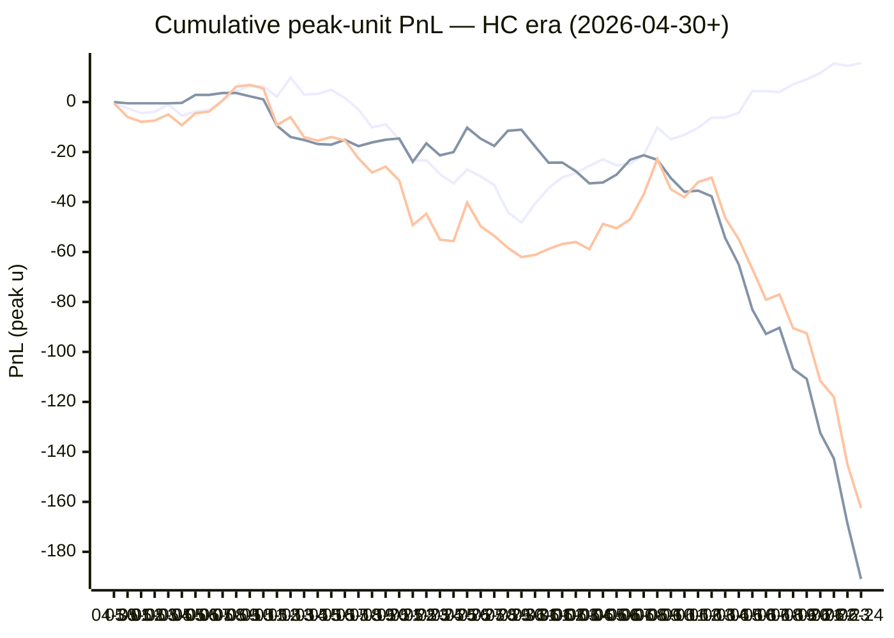

# Sharp Intel v6 — Daily Master Report

_Auto-generated **6/25/2026, 11:33:50 AM ET** by `scripts/dailyV6Report.js`. Do not edit by hand._

**Source of truth: this report mirrors the live Pick Performance dashboard.** Inclusion = `lockStage ≠ SHADOW ∧ ¬superseded ∧ health ∉ {MUTED, CANCELLED} ∧ peak.stars ≥ 2.5`. PnL is in **peak units** (the size shipped to users). HC margin / Δw / Δq are the **frozen** stamps written at last sync before the T-15 freeze. HC margin only existed from the v7.1 launch (**2026-04-30**); pre-launch picks have no HC value (no retro-fitting). Nothing is recomputed against today's whitelist.

v6 cutover: **2026-04-18** · whitelist source: live `sharpWalletProfiles` (294 profiles — drives §5 roster snapshot only) · quality cut: contribution ≥ 30 · HC = CONFIRMED tier ∧ sizeRatio ≥ 1.5.

---
## §1. Yesterday's picks

Slate: **2026-06-24** · 30 shipped sides.

| N | W-L-P | WR% | PnL (peak u) | PnL (flat 1u) |
|---|---|---|---|---|
| 30 | 18-12-0 | 60.0% | -17.42u | +4.06u |

| Sport | Market | Matchup | Pick | Stars · Units | HC | Δw | Δq | Σ | Odds | Result | PnL (peak u) |
|---|---|---|---|---|---|---|---|---|---|---|---|
| MLB | ML | Atlanta Braves @ San Diego Padres | Atlanta Braves | 4.5★ · 3.00u | +0 | +1 | +1 | +2 | -132 | L | -3.00u |
| MLB | ML | Baltimore Orioles @ Los Angeles Angels | Baltimore Orioles | 3.0★ · 0.50u | +0 | +1 | +0 | +1 | +110 | L | -0.50u |
| MLB | ML | Boston Red Sox @ Colorado Rockies | Colorado Rockies | 4.5★ · 2.50u | +0 | +2 | +2 | +4 | +152 | **W** | +5.80u |
| MLB | ML | Chicago Cubs @ New York Mets | Chicago Cubs | 4.5★ · 2.50u | +0 | +1 | +0 | +1 | -134 | **W** | +0.00u |
| MLB | ML | Houston Astros @ Toronto Blue Jays | Toronto Blue Jays | 4.5★ · 3.00u | +0 | +1 | +0 | +1 | -134 | L | -3.00u |
| MLB | ML | Kansas City Royals @ Tampa Bay Rays | Kansas City Royals | 3.0★ · 0.50u | +0 | +0 | +0 | +0 | +132 | L | -0.50u |
| MLB | ML | New York Yankees @ Detroit Tigers | New York Yankees | 4.5★ · 2.50u | +0 | +1 | +2 | +3 | +117 | **W** | +0.00u |
| MLB | ML | Athletics @ San Francisco Giants | San Francisco Giants | 2.5★ · 0.25u | +0 | -1 | -1 | -2 | -102 | **W** | +0.00u |
| MLB | ML | Philadelphia Phillies @ Washington Nationals | Washington Nationals | 4.5★ · 2.50u | +0 | +0 | +0 | +0 | +108 | L | -2.50u |
| MLB | SPREAD | Arizona Diamondbacks @ St. Louis Cardinals | Arizona Diamondbacks | 5.0★ · 5.00u | +0 | +0 | +0 | +0 | -214 | **W** | +0.00u |
| MLB | SPREAD | Atlanta Braves @ San Diego Padres | Atlanta Braves | 4.0★ · 1.00u | +0 | +1 | +1 | +2 | +155 | L | -1.00u |
| MLB | SPREAD | Boston Red Sox @ Colorado Rockies | Boston Red Sox | 5.0★ · 5.00u | +0 | +0 | +0 | +0 | -105 | L | -5.00u |
| MLB | SPREAD | Los Angeles Dodgers @ Minnesota Twins | Minnesota Twins | 4.0★ · 1.00u | +0 | +1 | +1 | +2 | -115 | **W** | +0.00u |
| MLB | SPREAD | Athletics @ San Francisco Giants | Athletics | 4.0★ · 1.00u | +0 | +1 | +1 | +2 | +136 | L | -1.00u |
| MLB | TOTAL | Arizona Diamondbacks @ St. Louis Cardinals | Over 9.5 | 4.0★ · 1.00u | +0 | +1 | +1 | +2 | -110 | **W** | +0.00u |
| MLB | TOTAL | Atlanta Braves @ San Diego Padres | Under 7.5 | 4.0★ · 1.00u | +0 | +1 | +1 | +2 | -110 | **W** | +0.00u |
| MLB | TOTAL | Baltimore Orioles @ Los Angeles Angels | Over 9.5 | 2.5★ · 0.25u | +0 | +0 | +0 | +0 | -110 | **W** | +0.00u |
| MLB | TOTAL | Boston Red Sox @ Colorado Rockies | Over 10.5 | 4.5★ · 3.00u | -1 | +1 | +1 | +2 | -110 | **W** | +3.64u |
| MLB | TOTAL | Chicago Cubs @ New York Mets | Under 8.5 | 5.0★ · 5.00u | +0 | +0 | -1 | -1 | -110 | L | -5.00u |
| MLB | TOTAL | Houston Astros @ Toronto Blue Jays | Under 8.5 | 2.5★ · 0.25u | +0 | +0 | +0 | +0 | -110 | **W** | +0.00u |
| MLB | TOTAL | Milwaukee Brewers @ Cincinnati Reds | Under 9.5 | 4.5★ · 3.00u | +0 | +1 | +2 | +3 | -110 | L | -3.00u |
| MLB | TOTAL | New York Yankees @ Detroit Tigers | Under 7.5 | 5.0★ · 5.00u | +0 | +1 | +0 | +1 | -110 | **W** | +0.00u |
| MLB | TOTAL | Athletics @ San Francisco Giants | Under 8.5 | 4.0★ · 1.00u | +0 | +1 | +1 | +2 | -110 | **W** | +0.00u |
| MLB | TOTAL | Philadelphia Phillies @ Washington Nationals | Over 9.5 | 4.5★ · 3.00u | +0 | +1 | +1 | +2 | -110 | L | -3.00u |
| MLB | TOTAL | Seattle Mariners @ Pittsburgh Pirates | Under 7.5 | 3.0★ · 0.50u | +0 | +1 | +4 | +5 | -110 | L | -0.50u |
| MLB | TOTAL | Texas Rangers @ Miami Marlins | Under 7.5 | 5.0★ · 1.00u | +0 | +2 | +1 | +3 | -115 | **W** | +0.00u |
| SOC | ML | Canada @ Switzerland | Switzerland | 4.0★ · 1.00u | +0 | +3 | +0 | +3 | +153 | **W** | +0.00u |
| SOC | ML | Haiti @ Morocco | Morocco | 4.5★ · 3.00u | +1 | +4 | +2 | +6 | -525 | **W** | +1.14u |
| SOC | ML | Mexico @ Czechia | Mexico | 4.5★ · 3.00u | +0 | -1 | -1 | -2 | -104 | **W** | +0.00u |
| SOC | ML | Qatar @ Bosnia-Herzegovina | Bosnia-Herzegovina | 2.5★ · 0.25u | +0 | +2 | +1 | +3 | -257 | **W** | +0.00u |

---
## §2. 3-day / 7-day / all-time cohort rollups

Shipped picks only. PnL in **peak units** (size we actually bet) and flat 1u (cohort EV lens). All margins are the engine's frozen stamps (`v8_hcMargin`, `v8_walletConsensusDelta`, `v8_walletConsensusQualityMargin`).

**HC margin sub-tables** are scoped to picks dated ≥ 2026-04-30 (the v7.1 launch — when HC margin became a real engine signal). Pre-launch picks are excluded from HC analysis since the feature didn't exist for them. Δw / Δq sub-tables span the full v6-era sample (≥ 2026-04-18). Empty buckets are dropped.

### §2a. 3-day

Total: **74** shipped · 38-36-0 · WR 51.4% · PnL -50.82u (peak) / -2.50u (flat).

**By HC margin** _(picks dated ≥ 2026-04-30, N = 74)_

| Bucket | N | W-L-P | WR% | PnL (peak u) | PnL (flat 1u) |
|---|---|---|---|---|---|
| HC = +2 | 1 | 0-1-0 | 0.0% | -1.00u | -1.00u |
| HC = +1 | 2 | 2-0-0 | 100.0% | +4.99u | +1.15u |
| HC = 0 | 70 | 35-35-0 | 50.0% | -58.45u | -3.56u |
| HC ≤ −1 | 1 | 1-0-0 | 100.0% | +3.64u | +0.91u |

**By Δw (winner margin)**

| Bucket | N | W-L-P | WR% | PnL (peak u) | PnL (flat 1u) |
|---|---|---|---|---|---|
| ≥ +3 | 3 | 3-0-0 | 100.0% | +3.87u | +2.63u |
| +2 | 8 | 5-3-0 | 62.5% | +3.15u | +1.39u |
| +1 | 42 | 21-21-0 | 50.0% | -24.34u | -2.21u |
| 0 | 18 | 7-11-0 | 38.9% | -32.50u | -5.25u |
| −1 | 3 | 2-1-0 | 66.7% | -1.00u | +0.94u |

**By Δq (quality margin)**

| Bucket | N | W-L-P | WR% | PnL (peak u) | PnL (flat 1u) |
|---|---|---|---|---|---|
| ≥ +3 | 4 | 2-2-0 | 50.0% | -3.50u | -0.50u |
| +2 | 6 | 4-2-0 | 66.7% | +2.94u | +1.80u |
| +1 | 31 | 18-13-0 | 58.1% | -12.86u | +1.79u |
| 0 | 25 | 12-13-0 | 48.0% | -25.90u | -1.52u |
| −1 | 6 | 2-4-0 | 33.3% | -9.50u | -2.06u |
| ≤ −2 | 2 | 0-2-0 | 0.0% | -2.00u | -2.00u |

**By AGS tier** _(picks dated ≥ 2026-05-05, N = 74)_

| Bucket | N | W-L-P | WR% | PnL (peak u) | PnL (flat 1u) |
|---|---|---|---|---|---|
| NEUT   (0 .. +3) | 44 | 26-18-0 | 59.1% | -10.32u | +5.50u |
| WEAK   (−1 .. 0) | 30 | 12-18-0 | 40.0% | -40.50u | -7.99u |

### §2b. 7-day

Total: **141** shipped · 70-71-0 · WR 49.6% · PnL -83.32u (peak) / -8.96u (flat).

**By HC margin** _(picks dated ≥ 2026-04-30, N = 141)_

| Bucket | N | W-L-P | WR% | PnL (peak u) | PnL (flat 1u) |
|---|---|---|---|---|---|
| HC = +2 | 1 | 0-1-0 | 0.0% | -1.00u | -1.00u |
| HC = +1 | 9 | 8-1-0 | 88.9% | +12.19u | +5.45u |
| HC = 0 | 127 | 59-68-0 | 46.5% | -98.03u | -15.51u |
| HC ≤ −1 | 4 | 3-1-0 | 75.0% | +3.52u | +2.10u |

**By Δw (winner margin)**

| Bucket | N | W-L-P | WR% | PnL (peak u) | PnL (flat 1u) |
|---|---|---|---|---|---|
| ≥ +3 | 7 | 7-0-0 | 100.0% | +10.84u | +5.84u |
| +2 | 16 | 8-8-0 | 50.0% | -0.04u | -1.08u |
| +1 | 71 | 36-35-0 | 50.7% | -40.32u | -3.23u |
| 0 | 37 | 14-23-0 | 37.8% | -49.93u | -10.54u |
| −1 | 8 | 5-3-0 | 62.5% | -0.62u | +2.04u |
| ≤ −2 | 2 | 0-2-0 | 0.0% | -3.25u | -2.00u |

**By Δq (quality margin)**

| Bucket | N | W-L-P | WR% | PnL (peak u) | PnL (flat 1u) |
|---|---|---|---|---|---|
| ≥ +3 | 9 | 5-4-0 | 55.6% | -5.92u | +0.37u |
| +2 | 11 | 6-5-0 | 54.5% | +1.21u | +0.29u |
| +1 | 52 | 28-24-0 | 53.8% | -17.72u | -1.30u |
| 0 | 53 | 26-27-0 | 49.1% | -45.96u | -2.18u |
| −1 | 10 | 4-6-0 | 40.0% | -9.18u | -2.24u |
| ≤ −2 | 6 | 1-5-0 | 16.7% | -5.75u | -3.90u |

**By AGS tier** _(picks dated ≥ 2026-05-05, N = 141)_

| Bucket | N | W-L-P | WR% | PnL (peak u) | PnL (flat 1u) |
|---|---|---|---|---|---|
| NEUT   (0 .. +3) | 89 | 49-40-0 | 55.1% | -28.52u | +3.02u |
| WEAK   (−1 .. 0) | 52 | 21-31-0 | 40.4% | -54.80u | -11.98u |

### §2c. All-time

Total: **839** shipped · 420-411-8 · WR 50.5% · PnL -174.66u (peak) / -30.14u (flat).

**By HC margin** _(picks dated ≥ 2026-04-30, N = 728)_

| Bucket | N | W-L-P | WR% | PnL (peak u) | PnL (flat 1u) |
|---|---|---|---|---|---|
| HC ≥ +3 | 13 | 4-9-0 | 30.8% | -6.95u | -7.05u |
| HC = +2 | 33 | 17-16-0 | 51.5% | -1.13u | -0.38u |
| HC = +1 | 171 | 99-72-0 | 57.9% | +23.67u | +17.73u |
| HC = 0 | 479 | 231-241-7 | 48.9% | -190.87u | -36.93u |
| HC ≤ −1 | 31 | 18-13-0 | 58.1% | +11.22u | +5.30u |

**By Δw (winner margin)**

| Bucket | N | W-L-P | WR% | PnL (peak u) | PnL (flat 1u) |
|---|---|---|---|---|---|
| ≥ +3 | 117 | 59-58-0 | 50.4% | -14.84u | -0.22u |
| +2 | 153 | 75-77-1 | 49.3% | -34.21u | -7.54u |
| +1 | 336 | 177-156-3 | 53.2% | -69.98u | +1.74u |
| 0 | 181 | 88-90-3 | 49.4% | -40.36u | -12.76u |
| −1 | 37 | 14-22-1 | 38.9% | -12.72u | -8.96u |
| ≤ −2 | 9 | 3-6-0 | 33.3% | -6.54u | -3.25u |
| missing | 6 | 4-2-0 | 66.7% | +3.99u | +0.85u |

**By Δq (quality margin)**

| Bucket | N | W-L-P | WR% | PnL (peak u) | PnL (flat 1u) |
|---|---|---|---|---|---|
| ≥ +3 | 141 | 71-67-3 | 51.4% | -30.76u | -1.34u |
| +2 | 135 | 62-73-0 | 45.9% | -37.79u | -15.46u |
| +1 | 265 | 144-118-3 | 55.0% | -2.44u | +7.56u |
| 0 | 202 | 99-102-1 | 49.3% | -84.31u | -9.94u |
| −1 | 63 | 33-29-1 | 53.2% | +1.40u | +2.02u |
| ≤ −2 | 27 | 7-20-0 | 25.9% | -24.00u | -13.74u |
| missing | 6 | 4-2-0 | 66.7% | +3.24u | +0.77u |

**By AGS tier** _(picks dated ≥ 2026-05-05, N = 703)_

| Bucket | N | W-L-P | WR% | PnL (peak u) | PnL (flat 1u) |
|---|---|---|---|---|---|
| ELITE  (≥ +7) | 3 | 3-0-0 | 100.0% | +8.01u | +2.34u |
| LOCK   (+5 .. +7) | 9 | 5-4-0 | 55.6% | -2.93u | -0.47u |
| STRONG (+3 .. +5) | 23 | 13-10-0 | 56.5% | -6.91u | +1.77u |
| NEUT   (0 .. +3) | 435 | 225-208-2 | 52.0% | -87.36u | -9.76u |
| WEAK   (−1 .. 0) | 218 | 102-112-4 | 47.7% | -74.60u | -20.03u |
| FADE   (< −1) | 14 | 9-5-0 | 64.3% | +4.68u | +5.05u |
| missing | 1 | 1-0-0 | 100.0% | +1.63u | +0.96u |

---
## §3. Edge over time — is HC margin creating winners?

Daily cumulative peak-unit PnL since the HC margin launch (**2026-04-30**). The `HC ≥ +1` line is the golden-standard cohort. The `HC = 0` line is the no-HC-signal control. The `All shipped (HC era)` line is every shipped pick from the same date range — the apples-to-apples baseline. Watch the spread.

Daily cumulative table (peak units, HC era only):

| Date | HC ≥ +1 (cum) | HC = 0 (cum) | All shipped (cum) |
|---|---|---|---|
| 2026-04-30 | -0.48u | +0.00u | -0.48u |
| 2026-05-01 | -2.48u | -0.50u | -5.98u |
| 2026-05-02 | -4.41u | -0.50u | -7.91u |
| 2026-05-03 | -3.94u | -0.50u | -7.44u |
| 2026-05-04 | -0.95u | -0.50u | -4.95u |
| 2026-05-05 | -5.45u | -0.34u | -9.29u |
| 2026-05-06 | -3.86u | +2.84u | -4.52u |
| 2026-05-07 | -3.18u | +2.84u | -3.84u |
| 2026-05-08 | +0.54u | +3.60u | +0.64u |
| 2026-05-09 | +4.41u | +3.60u | +6.14u |
| 2026-05-10 | +6.41u | +2.32u | +6.86u |
| 2026-05-11 | +6.25u | +1.05u | +5.43u |
| 2026-05-12 | +2.11u | -9.45u | -9.21u |
| 2026-05-13 | +9.78u | -13.95u | -6.04u |
| 2026-05-14 | +3.00u | -15.20u | -14.07u |
| 2026-05-15 | +3.27u | -16.83u | -15.43u |
| 2026-05-16 | +4.90u | -17.05u | -14.02u |
| 2026-05-17 | +1.62u | -15.11u | -15.36u |
| 2026-05-18 | -2.98u | -17.67u | -22.52u |
| 2026-05-19 | -10.18u | -16.17u | -28.22u |
| 2026-05-20 | -8.90u | -15.07u | -25.84u |
| 2026-05-21 | -14.92u | -14.58u | -31.37u |
| 2026-05-22 | -23.44u | -23.93u | -49.24u |
| 2026-05-23 | -23.30u | -16.53u | -44.70u |
| 2026-05-24 | -28.89u | -21.34u | -55.10u |
| 2026-05-25 | -32.63u | -20.03u | -55.65u |
| 2026-05-26 | -26.98u | -10.27u | -40.24u |
| 2026-05-27 | -29.77u | -14.68u | -49.69u |
| 2026-05-28 | -33.27u | -17.58u | -53.57u |
| 2026-05-29 | -44.12u | -11.51u | -58.35u |
| 2026-05-30 | -48.21u | -11.10u | -62.03u |
| 2026-05-31 | -40.65u | -17.79u | -61.16u |
| 2026-06-01 | -34.49u | -24.29u | -58.77u |
| 2026-06-02 | -30.14u | -24.19u | -56.82u |
| 2026-06-03 | -28.48u | -27.68u | -56.00u |
| 2026-06-04 | -25.53u | -32.54u | -58.91u |
| 2026-06-05 | -22.94u | -32.20u | -48.76u |
| 2026-06-06 | -25.33u | -29.06u | -50.51u |
| 2026-06-07 | -24.75u | -23.09u | -46.96u |
| 2026-06-08 | -21.34u | -21.30u | -36.94u |
| 2026-06-09 | -10.19u | -23.13u | -22.86u |
| 2026-06-10 | -14.95u | -30.43u | -34.92u |
| 2026-06-11 | -13.13u | -35.94u | -38.09u |
| 2026-06-12 | -10.30u | -35.44u | -32.03u |
| 2026-06-13 | -6.20u | -37.73u | -30.22u |
| 2026-06-14 | -6.21u | -54.41u | -46.29u |
| 2026-06-15 | -4.25u | -65.05u | -54.97u |
| 2026-06-16 | +4.40u | -83.05u | -66.82u |
| 2026-06-17 | +4.40u | -92.84u | -79.11u |
| 2026-06-18 | +3.98u | -90.33u | -77.02u |
| 2026-06-19 | +7.06u | -106.79u | -90.52u |
| 2026-06-20 | +9.08u | -110.78u | -92.49u |
| 2026-06-21 | +11.60u | -132.42u | -111.61u |
| 2026-06-22 | +15.45u | -142.67u | -118.01u |
| 2026-06-23 | +14.45u | -168.67u | -145.01u |
| 2026-06-24 | +15.59u | -190.87u | -162.43u |

---
## §4. Wallet roster growth & profitability

"Tracked in sport X" = a wallet has placed **≥ 2 bets** in X within the v6-era sample. "Profitable" = cumulative flat PnL > 0. Source: `v8Scoring.walletDetails` on every graded v6-era game (every side, not just the shipped set).

### §4a. Per-sport wallet snapshot

| Sport | Total wallets seen | Tracked (≥2) | Profitable | % prof | WR ≥ 50% | WR ≥ 60% | WR ≥ 70% |
|---|---|---|---|---|---|---|---|
| MLB | 87 | 65 | 22 | 34% | 30 | 12 | 3 |
| NBA | 138 | 108 | 44 | 41% | 60 | 29 | 11 |
| NHL | 60 | 43 | 12 | 28% | 24 | 12 | 6 |
| SOC | 83 | 52 | 40 | 77% | 42 | 33 | 27 |
| **ALL (any sport)** | **212** | **160** | **84** | **53%** | **95** | **44** | **22** |

### §4b. Daily roster growth (cumulative through each date)

Format: `tracked (profitable)`. For each date D, recompute the roster using every bet up to and including D.

| Date | ALL | MLB | NBA | NHL | SOC |
|---|---|---|---|---|---|
| 2026-04-18 | 5 (2) | 2 (2) | 3 (0) | 0 (0) | 0 (0) |
| 2026-04-19 | 19 (8) | 5 (3) | 9 (3) | 3 (1) | 0 (0) |
| 2026-04-20 | 29 (12) | 7 (6) | 23 (8) | 5 (2) | 0 (0) |
| 2026-04-21 | 44 (21) | 10 (6) | 31 (10) | 7 (5) | 0 (0) |
| 2026-04-22 | 52 (28) | 12 (6) | 39 (15) | 11 (10) | 0 (0) |
| 2026-04-23 | 56 (29) | 13 (6) | 46 (21) | 13 (10) | 0 (0) |
| 2026-04-24 | 61 (30) | 14 (6) | 51 (23) | 14 (9) | 0 (0) |
| 2026-04-25 | 65 (29) | 16 (8) | 54 (22) | 16 (9) | 0 (0) |
| 2026-04-26 | 67 (31) | 18 (5) | 56 (25) | 17 (9) | 0 (0) |
| 2026-04-27 | 72 (32) | 20 (7) | 60 (24) | 17 (9) | 0 (0) |
| 2026-04-28 | 76 (33) | 21 (7) | 63 (26) | 23 (10) | 0 (0) |
| 2026-04-29 | 77 (33) | 21 (7) | 64 (25) | 23 (10) | 0 (0) |
| 2026-04-30 | 81 (34) | 21 (7) | 70 (27) | 23 (10) | 0 (0) |
| 2026-05-01 | 85 (38) | 22 (5) | 74 (30) | 26 (13) | 0 (0) |
| 2026-05-02 | 86 (37) | 23 (7) | 75 (32) | 26 (12) | 0 (0) |
| 2026-05-03 | 86 (38) | 24 (8) | 75 (33) | 26 (12) | 0 (0) |
| 2026-05-04 | 90 (38) | 24 (9) | 76 (32) | 26 (12) | 0 (0) |
| 2026-05-05 | 91 (40) | 24 (9) | 79 (33) | 26 (12) | 0 (0) |
| 2026-05-06 | 92 (40) | 24 (9) | 80 (33) | 26 (12) | 0 (0) |
| 2026-05-07 | 92 (41) | 24 (9) | 80 (33) | 26 (12) | 0 (0) |
| 2026-05-08 | 92 (40) | 24 (8) | 80 (32) | 26 (11) | 0 (0) |
| 2026-05-09 | 94 (42) | 24 (8) | 82 (35) | 26 (11) | 0 (0) |
| 2026-05-10 | 94 (42) | 24 (8) | 82 (35) | 26 (11) | 0 (0) |
| 2026-05-11 | 96 (42) | 24 (8) | 84 (36) | 26 (11) | 0 (0) |
| 2026-05-12 | 100 (41) | 27 (9) | 86 (37) | 26 (11) | 0 (0) |
| 2026-05-13 | 102 (45) | 29 (11) | 88 (37) | 26 (11) | 0 (0) |
| 2026-05-14 | 102 (41) | 29 (11) | 88 (37) | 28 (12) | 0 (0) |
| 2026-05-15 | 103 (41) | 30 (10) | 88 (39) | 28 (12) | 0 (0) |
| 2026-05-16 | 105 (43) | 31 (12) | 88 (39) | 30 (14) | 0 (0) |
| 2026-05-17 | 105 (46) | 32 (11) | 88 (40) | 30 (14) | 0 (0) |
| 2026-05-18 | 105 (46) | 32 (10) | 88 (38) | 31 (15) | 0 (0) |
| 2026-05-19 | 105 (46) | 32 (12) | 88 (38) | 31 (15) | 0 (0) |
| 2026-05-20 | 106 (48) | 33 (12) | 88 (38) | 31 (16) | 0 (0) |
| 2026-05-21 | 106 (45) | 34 (12) | 88 (37) | 31 (14) | 0 (0) |
| 2026-05-22 | 106 (44) | 34 (10) | 88 (39) | 33 (16) | 0 (0) |
| 2026-05-23 | 111 (49) | 36 (10) | 90 (40) | 36 (19) | 0 (0) |
| 2026-05-24 | 117 (52) | 37 (12) | 94 (39) | 37 (16) | 0 (0) |
| 2026-05-25 | 120 (53) | 38 (13) | 95 (40) | 38 (16) | 0 (0) |
| 2026-05-26 | 122 (55) | 39 (14) | 97 (42) | 38 (16) | 0 (0) |
| 2026-05-27 | 123 (51) | 40 (12) | 97 (42) | 40 (14) | 0 (0) |
| 2026-05-28 | 124 (51) | 40 (12) | 99 (42) | 40 (14) | 0 (0) |
| 2026-05-29 | 125 (50) | 41 (12) | 99 (42) | 41 (12) | 0 (0) |
| 2026-05-30 | 126 (49) | 41 (12) | 101 (43) | 41 (12) | 0 (0) |
| 2026-05-31 | 126 (48) | 41 (11) | 101 (43) | 41 (12) | 0 (0) |
| 2026-06-01 | 129 (52) | 44 (14) | 101 (43) | 41 (12) | 0 (0) |
| 2026-06-02 | 130 (56) | 45 (16) | 101 (43) | 41 (13) | 0 (0) |
| 2026-06-03 | 132 (56) | 45 (14) | 102 (43) | 41 (13) | 0 (0) |
| 2026-06-04 | 132 (57) | 46 (14) | 102 (43) | 41 (14) | 0 (0) |
| 2026-06-05 | 132 (57) | 48 (15) | 102 (43) | 41 (14) | 0 (0) |
| 2026-06-06 | 132 (57) | 49 (15) | 102 (43) | 41 (14) | 0 (0) |
| 2026-06-07 | 133 (56) | 52 (16) | 102 (43) | 41 (14) | 0 (0) |
| 2026-06-08 | 135 (55) | 53 (16) | 103 (44) | 41 (14) | 0 (0) |
| 2026-06-09 | 135 (55) | 53 (15) | 103 (44) | 41 (14) | 0 (0) |
| 2026-06-10 | 135 (56) | 53 (15) | 105 (45) | 41 (14) | 0 (0) |
| 2026-06-11 | 135 (54) | 54 (16) | 105 (45) | 42 (13) | 0 (0) |
| 2026-06-12 | 135 (56) | 55 (17) | 105 (45) | 42 (13) | 0 (0) |
| 2026-06-13 | 136 (56) | 57 (17) | 108 (44) | 42 (13) | 0 (0) |
| 2026-06-14 | 136 (55) | 57 (18) | 108 (44) | 43 (12) | 2 (0) |
| 2026-06-15 | 136 (56) | 57 (19) | 108 (44) | 43 (12) | 2 (0) |
| 2026-06-16 | 141 (60) | 58 (20) | 108 (44) | 43 (12) | 13 (5) |
| 2026-06-17 | 143 (64) | 58 (19) | 108 (44) | 43 (12) | 18 (10) |
| 2026-06-18 | 145 (66) | 58 (20) | 108 (44) | 43 (12) | 24 (14) |
| 2026-06-19 | 145 (66) | 58 (20) | 108 (44) | 43 (12) | 29 (21) |
| 2026-06-20 | 147 (75) | 60 (19) | 108 (44) | 43 (12) | 33 (27) |
| 2026-06-21 | 147 (74) | 60 (19) | 108 (44) | 43 (12) | 35 (29) |
| 2026-06-22 | 153 (77) | 61 (20) | 108 (44) | 43 (12) | 42 (34) |
| 2026-06-23 | 156 (80) | 64 (20) | 108 (44) | 43 (12) | 44 (34) |
| 2026-06-24 | 160 (84) | 65 (22) | 108 (44) | 43 (12) | 52 (40) |

### §4c. Top 10 profitable wallets by sport

#### MLB

| # | Wallet | N | W | L | WR% | Flat PnL (u) | Flat ROI | $ PnL |
|---|---|---|---|---|---|---|---|---|
| 1 | f2f960 | 2 | 2 | 0 | 100.0% | +1.93 | +96.5% | $61.1K |
| 2 | e05213 | 15 | 11 | 4 | 73.3% | +6.08 | +40.5% | $278.1K |
| 3 | ad88a3 | 16 | 12 | 4 | 75.0% | +6.39 | +39.9% | $11.0K |
| 4 | 913987 | 44 | 30 | 14 | 68.2% | +14.19 | +32.2% | $666.8K |
| 5 | c668b3 | 18 | 12 | 6 | 66.7% | +5.14 | +28.6% | $1.3K |
| 6 | 468c33 | 3 | 2 | 1 | 66.7% | +0.85 | +28.5% | $45.8K |
| 7 | dfa240 | 3 | 2 | 1 | 66.7% | +0.85 | +28.3% | $2.5K |
| 8 | ab39ae | 3 | 2 | 1 | 66.7% | +0.70 | +23.5% | -$606.8K |
| 9 | c9bba3 | 6 | 4 | 2 | 66.7% | +1.37 | +22.8% | -$17.7K |
| 10 | f2d227 | 35 | 22 | 13 | 62.9% | +7.23 | +20.7% | $78.3K |

#### NBA

| # | Wallet | N | W | L | WR% | Flat PnL (u) | Flat ROI | $ PnL |
|---|---|---|---|---|---|---|---|---|
| 1 | 799fad | 2 | 2 | 0 | 100.0% | +5.66 | +283.0% | $241.7K |
| 2 | a0d6d2 | 4 | 4 | 0 | 100.0% | +4.51 | +112.7% | $6.4K |
| 3 | 12ad50 | 3 | 3 | 0 | 100.0% | +2.74 | +91.3% | $45.5K |
| 4 | b51a56 | 6 | 5 | 1 | 83.3% | +5.44 | +90.7% | $74.4K |
| 5 | 11b032 | 7 | 6 | 1 | 85.7% | +5.40 | +77.1% | $249.9K |
| 6 | 12c933 | 2 | 2 | 0 | 100.0% | +1.28 | +63.9% | $11.5K |
| 7 | a1684d | 10 | 9 | 1 | 90.0% | +5.24 | +52.4% | $11.2K |
| 8 | 7f00bc | 21 | 14 | 7 | 66.7% | +9.80 | +46.7% | $14.7K |
| 9 | 92df91 | 23 | 16 | 7 | 69.6% | +10.26 | +44.6% | -$214 |
| 10 | 8ec926 | 8 | 6 | 2 | 75.0% | +3.53 | +44.1% | -$681 |

#### NHL

| # | Wallet | N | W | L | WR% | Flat PnL (u) | Flat ROI | $ PnL |
|---|---|---|---|---|---|---|---|---|
| 1 | 8366f5 | 2 | 2 | 0 | 100.0% | +2.30 | +114.9% | $107.6K |
| 2 | 799fad | 2 | 2 | 0 | 100.0% | +1.88 | +94.1% | $46.9K |
| 3 | fec67e | 4 | 3 | 1 | 75.0% | +2.82 | +70.5% | $12.5K |
| 4 | 30935c | 4 | 3 | 1 | 75.0% | +2.11 | +52.7% | $953 |
| 5 | 981187 | 8 | 6 | 2 | 75.0% | +3.52 | +44.0% | -$25.2K |
| 6 | fcc12b | 11 | 8 | 3 | 72.7% | +4.45 | +40.5% | -$27.5K |
| 7 | bc3532 | 22 | 14 | 8 | 63.6% | +7.85 | +35.7% | $70.3K |
| 8 | e70853 | 9 | 6 | 3 | 66.7% | +2.66 | +29.5% | -$11.1K |
| 9 | 4d2125 | 17 | 11 | 6 | 64.7% | +4.26 | +25.1% | $80.3K |
| 10 | dfa240 | 28 | 18 | 10 | 64.3% | +6.46 | +23.1% | $19.0K |

#### SOC

| # | Wallet | N | W | L | WR% | Flat PnL (u) | Flat ROI | $ PnL |
|---|---|---|---|---|---|---|---|---|
| 1 | daf4de | 2 | 2 | 0 | 100.0% | +25.11 | +1255.3% | $1.78M |
| 2 | 12c933 | 3 | 3 | 0 | 100.0% | +31.89 | +1063.0% | $134.6K |
| 3 | 8da2ca | 2 | 2 | 0 | 100.0% | +18.34 | +916.9% | $855.7K |
| 4 | 59266e | 2 | 2 | 0 | 100.0% | +18.11 | +905.3% | $2.98M |
| 5 | 7b4652 | 4 | 4 | 0 | 100.0% | +31.78 | +794.5% | $20.1K |
| 6 | c668b3 | 3 | 3 | 0 | 100.0% | +18.38 | +612.7% | $44.3K |
| 7 | cf627b | 2 | 2 | 0 | 100.0% | +10.69 | +534.5% | $427.6K |
| 8 | 946418 | 6 | 5 | 1 | 83.3% | +28.98 | +482.9% | $73.6K |
| 9 | c9bba3 | 9 | 7 | 2 | 77.8% | +38.20 | +424.5% | $2.48M |
| 10 | 2d2ca8 | 7 | 6 | 1 | 85.7% | +29.51 | +421.6% | $9.00M |

---
## §5. Proven-wallet roster growth & HC tracking

"Proven wallet" = whitelist tier `CONFIRMED` or `FLAT` in the same sense the live engine uses (`exportWalletProfiles.js` → `sharpWalletProfiles.bySport`). Sports inherit independent rosters: a wallet can be CONFIRMED in NBA and absent from NHL. `walletBets` come from `v8Scoring.walletDetails` on every graded v6-era pick (Source A); `positionRows` come from `sharp_action_positions` (Source B).

### §5a. Current proven-winner roster (snapshot)

Roster as of **2026-06-24** — wallets with ≥2 bets in the sport.

| Sport | Wallets seen | Eligible (≥2) | CONFIRMED | FLAT | Proven (C+F) | WR50 only | Conv % |
|---|---|---|---|---|---|---|---|
| MLB | 135 | 65 | 15 | 7 | **22** | 8 | 16.3% |
| NBA | 210 | 108 | 29 | 15 | **44** | 21 | 21.0% |
| NHL | 105 | 43 | 9 | 3 | **12** | 12 | 11.4% |
| SOC | 132 | 52 | 26 | 14 | **40** | 3 | 30.3% |
| **ALL** | **—** | **—** | **—** | **—** | **118** | **—** | **—** |

### §5b. Live whitelist drift check

Live `sharpWalletProfiles` is what the engine reads at lock time. Drift between script reconstruction (above) and live should be ≤ 1 day of position data — otherwise `exportWalletProfiles.js` is stale.

| Sport | CONFIRMED (live · script) | FLAT (live · script) | WR50 (live · script) | Drift |
|---|---|---|---|---|
| MLB | 39 · 15 | 16 · 7 | 4 · 8 | +33 live |
| NBA | 58 · 29 | 25 · 15 | 23 · 21 | +39 live |
| NHL | 23 · 9 | 6 · 3 | 16 · 12 | +17 live |
| SOC | 30 · 26 | 16 · 14 | 5 · 3 | +6 live |

### §5c. Roster growth — 3d / 7d / 30d / all-time deltas

Each cell is **net growth** in proven (CONFIRMED + FLAT) wallets in that window, with the absolute count at the start (`+Δ from N`). Negative = wallets demoted. Window endpoint = 2026-06-24.

| Sport | 3-day | 7-day | 30-day | All-time (since cutover) |
|---|---|---|---|---|
| MLB | +3 from 19 | +3 from 19 | +9 from 13 | +22 from 0 |
| NBA | +0 from 44 | +0 from 44 | +4 from 40 | +44 from 0 |
| NHL | +0 from 12 | +0 from 12 | -4 from 16 | +12 from 0 |
| SOC | +11 from 29 | +30 from 10 | +40 from 0 | +40 from 0 |

A flat 7-day delta on a sport with healthy slate density = either the bubble pipeline has stalled (no wallets approaching the bar) or our cohort has saturated. Check §13d for the funnel diagnostic.

### §5d. Pipeline funnel — where each sport leaks

Wallets surviving each gate, in order. The biggest %-drop tells you the bottleneck. Gates:

1. **Seen** — placed ≥ 1 bet in the sport (any source)
2. **Eligible** — ≥ 2 graded picks in Source A (required for FLAT/CONFIRMED)
3. **Flat-OK** — eligible AND flat ROI > 0 (becomes FLAT or better)
4. **$-OK** — Flat-OK AND ≥2 positions with dollar ROI > 0 (CONFIRMED)
5. **Promoted** — final whitelisted = CONFIRMED + FLAT

| Sport | 1·Seen | 2·Eligible (% of Seen) | 3·Flat-OK (% of Elig) | 4·$-OK (% of Flat) | 5·Promoted | Bottleneck |
|---|---|---|---|---|---|---|
| MLB | 135 | 65 (48%) | 22 (34%) | 15 (68%) | **22** | edge (Eligible→Flat-OK) 66% |
| NBA | 210 | 108 (51%) | 44 (41%) | 29 (66%) | **44** | edge (Eligible→Flat-OK) 59% |
| NHL | 105 | 43 (41%) | 12 (28%) | 9 (75%) | **12** | edge (Eligible→Flat-OK) 72% |
| SOC | 132 | 52 (39%) | 40 (77%) | 26 (65%) | **40** | sample (Seen→Eligible) 61% |

### §5e. HC backing density (the fuel for v7.3 HC margin)

Every v7.x promotion is gated on `HC_m ≥ +1`, which requires at least one CONFIRMED wallet sized at `≥ 1.5×` average on the for-side. This table shows the share of shipped picks that *had any HC backing*, by sport, in each window. If HC density falls toward zero in a sport, the v7.3 floor cohorts (Σ=1, Σ=2 locks; HC rescues) will simply stop firing there.

| Sport | Window | Picks (with HC stamp) | Any HC for-side | HC_m ≥ +1 | HC_m ≥ +2 |
|---|---|---|---|---|---|
| MLB | 3-day | 65 | 2 (3.1%) | 2 (3.1%) | 1 (1.5%) |
| MLB | 7-day | 124 | 11 (8.9%) | 9 (7.3%) | 1 (0.8%) |
| MLB | All-time | 636 | 171 (26.9%) | 156 (24.5%) | 19 (3.0%) |
| NBA | 3-day | 0 | 0 (—) | 0 (—) | 0 (—) |
| NBA | 7-day | 0 | 0 (—) | 0 (—) | 0 (—) |
| NBA | All-time | 126 | 83 (65.9%) | 69 (54.8%) | 34 (27.0%) |
| NHL | 3-day | 0 | 0 (—) | 0 (—) | 0 (—) |
| NHL | 7-day | 0 | 0 (—) | 0 (—) | 0 (—) |
| NHL | All-time | 49 | 21 (42.9%) | 20 (40.8%) | 5 (10.2%) |
| SOC | 3-day | 9 | 2 (22.2%) | 1 (11.1%) | 0 (0.0%) |
| SOC | 7-day | 17 | 2 (11.8%) | 1 (5.9%) | 0 (0.0%) |
| SOC | All-time | 22 | 3 (13.6%) | 2 (9.1%) | 1 (4.5%) |

Pooled across sports:

| Window | Picks (with HC stamp) | Any HC for-side | HC_m ≥ +1 | HC_m ≥ +2 |
|---|---|---|---|---|
| 3-day | 74 | 4 (5.4%) | 3 (4.1%) | 1 (1.4%) |
| 7-day | 141 | 13 (9.2%) | 10 (7.1%) | 1 (0.7%) |
| All-time | 833 | 278 (33.4%) | 247 (29.7%) | 59 (7.1%) |

### §5f. Bubble wallets — next-up graduations

Wallets currently NOT promoted but close. Two flavors:

- **One-bet-away** — won the only bet, needs one more positive bet to clear ≥2.
- **Just-under** — has ≥2 bets but flat ROI is between −10% and 0% (one win flips them).

#### MLB

**One-bet-away** (6)

| wallet | picksN | flat PnL | pos N | pos $ROI |
|---|---|---|---|---|
| `...be17` | 1 | +6.95 | 23 | -60% |
| `...020b` | 1 | +1.25 | 13 | -42% |
| `...be00` | 1 | +0.87 | 15 | 10% |
| `...9373` | 1 | +0.87 | 0 | — |
| `...9b3c` | 1 | +0.77 | 8 | 52% |
| `...8d26` | 1 | +0.72 | 5 | -22% |

**Just-under** (6)

| wallet | picksN | WR | flat ROI | pos N | pos $ROI |
|---|---|---|---|---|---|
| `...1f30` | 49 | 49% | -0.3% | 76 | 15% |
| `...afd2` | 41 | 51% | -0.5% | 177 | -20% |
| `...135d` | 356 | 52% | -1.0% | 375 | 7% |
| `...2f63` | 145 | 50% | -2.0% | 1130 | -5% |
| `...1e50` | 105 | 51% | -2.5% | 346 | 1% |
| `...0232` | 4 | 50% | -4.5% | 11 | 30% |

#### NBA

**One-bet-away** (6)

| wallet | picksN | flat PnL | pos N | pos $ROI |
|---|---|---|---|---|
| `...bf5d` | 1 | +3.15 | 3 | 42% |
| `...ed41` | 1 | +3.15 | 3 | 3% |
| `...6b87` | 1 | +2.05 | 8 | -27% |
| `...c556` | 1 | +0.93 | 3 | 42% |
| `...5c69` | 1 | +0.91 | 2 | 28% |
| `...b989` | 1 | +0.88 | 21 | -90% |

**Just-under** (6)

| wallet | picksN | WR | flat ROI | pos N | pos $ROI |
|---|---|---|---|---|---|
| `...d814` | 8 | 50% | -0.5% | 53 | 1% |
| `...1e50` | 4 | 50% | -1.2% | 29 | 46% |
| `...65dd` | 6 | 50% | -2.4% | 17 | 27% |
| `...853d` | 40 | 53% | -2.7% | 90 | -2% |
| `...1697` | 17 | 53% | -3.5% | 34 | 9% |
| `...11a4` | 20 | 45% | -3.6% | 72 | 54% |

#### NHL

**One-bet-away** (6)

| wallet | picksN | flat PnL | pos N | pos $ROI |
|---|---|---|---|---|
| `...2e78` | 1 | +1.46 | 0 | — |
| `...017f` | 1 | +1.45 | 6 | 108% |
| `...32f2` | 1 | +1.40 | 0 | — |
| `...e0fd` | 1 | +1.20 | 3 | 124% |
| `...266e` | 1 | +1.05 | 0 | — |
| `...2194` | 1 | +1.05 | 0 | — |

**Just-under** (6)

| wallet | picksN | WR | flat ROI | pos N | pos $ROI |
|---|---|---|---|---|---|
| `...33ee` | 4 | 50% | -0.3% | 8 | -23% |
| `...df91` | 14 | 50% | -1.6% | 49 | -36% |
| `...afd2` | 6 | 50% | -1.9% | 26 | -17% |
| `...192c` | 7 | 43% | -2.9% | 21 | -15% |
| `...35e3` | 7 | 57% | -5.5% | 26 | 31% |
| `...618e` | 2 | 50% | -6.1% | 28 | 24% |

#### SOC

**One-bet-away** (6)

| wallet | picksN | flat PnL | pos N | pos $ROI |
|---|---|---|---|---|
| `...d739` | 1 | +4.74 | 7 | -83% |
| `...821d` | 1 | +4.30 | 6 | -4% |
| `...1220` | 1 | +1.50 | 1 | 156% |
| `...aeeb` | 1 | +1.39 | 2 | 144% |
| `...3f67` | 1 | +1.39 | 5 | 134% |
| `...2036` | 1 | +1.39 | 2 | 138% |

**Just-under** (2)

| wallet | picksN | WR | flat ROI | pos N | pos $ROI |
|---|---|---|---|---|---|
| `...2d54` | 2 | 50% | -8.3% | 12 | -17% |
| `...c991` | 2 | 50% | -8.3% | 7 | -100% |

### §5g. v2 wallet-promotion pipeline (Source-A / Source-B mix)

Live snapshot of the v2 promotion gate (shipped 2026-05-10, re-eval **2026-05-24**). Each FLAT-or-better wallet × sport pair is attributed to one of three paths via `sharpWalletProfiles[wallet].bySport[sport].whitelistSource`:

- **A** — flat-positive on featured picks (Source A) only — the v1 gate
- **A+B** — flat-positive in both sources (most reliable signal)
- **B** — flat-positive on-chain only (NEW in v2 — the trial lift)

Re-classified every 2h via `grade-sharp-actions` cron. Roll-back: set `B_ONLY_MIN_BETS = Infinity` in `scripts/exportWalletProfiles.js`.

#### Source mix per sport (live Firestore)

| Sport | A | A+B | B (new) | FLAT-or-better total | % from B-only |
|---|---|---|---|---|---|
| MLB | 10 | 16 | **29** | 55 | 52.7% |
| NBA | 10 | 34 | **39** | 83 | 47.0% |
| NHL | 4 | 8 | **17** | 29 | 58.6% |
| SOC | 26 | 14 | **6** | 46 | 13.0% |
| **ALL** | **50** | **72** | **91** | **213** | **42.7%** |

#### Pipeline freshness

- `sharp_action_positions` GRADED rows: **17014**
- `sharp_action_positions` PENDING rows: **366** (queued for next Grade Sharp Actions run)
- Latest `sharpWalletProfiles` rebuild: 6/25/2026, 6:14:13 AM ET — **320 min · STALE** — check grade-sharp-actions workflow

**Alarms**: pending > 200 OR rebuild lag > 4h → cron is lagging or failing — check `gh run list --workflow="Grade Sharp Actions"`.

#### B-only roster — wallets currently promoted via Source B path only

Wallets here would have been EXCLUDED under v1 (Source-A-only). Top by Source-B bet count per sport. The 2-week re-eval (2026-05-24) will compare these wallets' realized lift against A-only and A+B cohorts.

**MLB** — 29 wallets promoted via B

| wallet | tier | B_n | B_flat ROI | B_$ ROI |
|---|---|---|---|---|
| `...9a27` | CONFIRMED | 467 | +12.3% | +4.4% |
| `...135d` | CONFIRMED | 375 | +2.1% | +6.8% |
| `...1e50` | CONFIRMED | 346 | +2.3% | +1% |
| `...3532` | CONFIRMED | 324 | +1.6% | +6% |
| `...1eae` | FLAT | 147 | +3.1% | -1.4% |
| `...c684` | FLAT | 85 | +6.6% | -2.2% |
| `...1f30` | CONFIRMED | 76 | +5% | +15% |
| `...69c2` | CONFIRMED | 66 | +17.4% | +1% |
| `...ad50` | CONFIRMED | 53 | +14.4% | +7.7% |
| `...fc26` | CONFIRMED | 42 | +5.2% | +16.2% |
| … | 19 more | | | |

**NBA** — 39 wallets promoted via B

| wallet | tier | B_n | B_flat ROI | B_$ ROI |
|---|---|---|---|---|
| `...cff6` | CONFIRMED | 112 | +3.2% | +31.8% |
| `...135d` | FLAT | 104 | +5% | -10.6% |
| `...11a4` | CONFIRMED | 72 | +23.3% | +54.4% |
| `...3782` | CONFIRMED | 70 | +2.3% | +0.4% |
| `...9d74` | FLAT | 50 | +2.3% | -14.4% |
| `...935c` | FLAT | 50 | +17.3% | -21.4% |
| `...68b3` | CONFIRMED | 44 | +33.9% | +13.9% |
| `...b6ef` | CONFIRMED | 42 | +6.3% | +3.3% |
| `...e2ce` | CONFIRMED | 40 | +15.2% | +22.9% |
| `...0563` | CONFIRMED | 37 | +4.9% | +41.7% |
| … | 29 more | | | |

**NHL** — 17 wallets promoted via B

| wallet | tier | B_n | B_flat ROI | B_$ ROI |
|---|---|---|---|---|
| `...1697` | CONFIRMED | 52 | +8.5% | +7.1% |
| `...618e` | CONFIRMED | 28 | +6.2% | +23.8% |
| `...35e3` | CONFIRMED | 26 | +10.6% | +31.5% |
| `...5eee` | CONFIRMED | 23 | +30.5% | +19.3% |
| `...192c` | FLAT | 21 | +14% | -15.2% |
| `...0c2e` | FLAT | 17 | +24.3% | -7% |
| `...2ca8` | CONFIRMED | 10 | +26.9% | +14% |
| `...600d` | CONFIRMED | 9 | +69% | +75.8% |
| `...a9cc` | CONFIRMED | 7 | +49.5% | +46.9% |
| `...aeea` | CONFIRMED | 7 | +90.8% | +87.7% |
| … | 7 more | | | |

**SOC** — 6 wallets promoted via B

| wallet | tier | B_n | B_flat ROI | B_$ ROI |
|---|---|---|---|---|
| `...e8f1` | CONFIRMED | 17 | +49.4% | +22.9% |
| `...d2f7` | FLAT | 16 | +74.9% | -4.5% |
| `...2d54` | FLAT | 12 | +19.8% | -17% |
| `...381f` | CONFIRMED | 8 | +81.6% | +81.6% |
| `...1057` | CONFIRMED | 7 | +59.4% | +73.3% |
| `...3f67` | CONFIRMED | 5 | +135.2% | +133.6% |

### §5 — How to read

- **Roster growth flat in 7-day** + **funnel bottleneck = `data`** → re-run `exportWalletProfiles.js`. The flat-positive wallets are stuck at FLAT because Source-B coverage hasn't caught up. CONFIRMED gate is data-bound, not skill-bound.
- **Roster growth flat in 7-day** + **funnel bottleneck = `sample`** → wallets aren't reaching `≥2` reps fast enough. This is a slate-density problem; consider a soft `MIN_BETS = 1` shadow lane to surface bubble wallets earlier.
- **Roster shrank** (negative delta) → a previously CONFIRMED wallet just dropped flat-positive (lost a recent bet). Variance, not failure — but worth noting if a sport loses ≥3 in a week.
- **HC density on a sport drops below ~30%** → v7.3 promotions there will starve. Either the proven roster needs more CONFIRMED-tier wallets sizing aggressively, or the HC_RATIO (1.5) needs a sport-specific tune.
- **§5g B-only count drops sharply** → wallets are demoting off the B path (losing on-chain). Cross-check `WALLET_PROFILES_SUMMARY.md` churn section for the specific demotions.
- **§5g pipeline freshness lag > 4h** → grade-sharp-actions cron is failing. Check `gh run list --workflow="Grade Sharp Actions"` and re-trigger if needed.

---
## §6. Daily proven-wallet performance

Who on the proven roster is actually printing — yesterday's bets, the rolling leaderboard (`$ PnL`-ranked), current streaks, and per-sport volume. **Proven** = `CONFIRMED` ∪ `FLAT` per sport (the same gate that drives Δ_winner). A wallet only counts in a sport where it's on that sport's proven list.

### §6a. Yesterday's proven-wallet bets

Slate: **2026-06-24** · 68 bets · 25 distinct proven wallets · WR 65% · $ vol $1.88M · $ PnL $1.19M.

| Wallet | Sport | Market | Game | $ size | Result | $ PnL |
|---|---|---|---|---|---|---|
| `...2ca8` (FLAT) | SOC | ML | Mexico @ Czechia | $453.5K | **W** | $431.9K |
| `...aeea` (FLAT) | SOC | ML | Mexico @ Czechia | $134.2K | **W** | $127.8K |
| `...2a9e` (CONFIRMED) | SOC | ML | Mexico @ Czechia | $127.6K | **W** | $121.5K |
| `...024e` (FLAT) | SOC | ML | Korea Republic @ South Africa | $17.0K | **W** | $73.1K |
| `...a2ca` (CONFIRMED) | SOC | ML | Brazil @ Scotland | $198.3K | **W** | $67.2K |
| `...23c4` (FLAT) | MLB | TOTAL | New York Yankees @ Detroit Tigers | $65.4K | **W** | $59.5K |
| `...39ae` (CONFIRMED) | MLB | ML | Texas Rangers @ Miami Marlins | $49.2K | **W** | $51.7K |
| `...f960` (CONFIRMED) | MLB | ML | Chicago Cubs @ New York Mets | $50.0K | **W** | $51.0K |
| `...020b` (CONFIRMED) | SOC | ML | Mexico @ Czechia | $50.2K | **W** | $47.9K |
| `...23c4` (FLAT) | MLB | ML | Athletics @ San Francisco Giants | $48.5K | **W** | $47.6K |
| `...23c4` (FLAT) | MLB | TOTAL | Houston Astros @ Toronto Blue Jays | $40.0K | **W** | $39.3K |
| `...64aa` (CONFIRMED) | MLB | ML | Boston Red Sox @ Colorado Rockies | $23.3K | **W** | $33.7K |
| `...2a9e` (CONFIRMED) | SOC | ML | Canada @ Switzerland | $19.8K | **W** | $29.7K |
| `...11a4` (CONFIRMED) | SOC | ML | Brazil @ Scotland | $74.5K | **W** | $25.2K |
| `...abaf` (CONFIRMED) | MLB | ML | New York Yankees @ Detroit Tigers | $21.1K | **W** | $24.7K |
| `...11a4` (CONFIRMED) | SOC | ML | Haiti @ Morocco | $64.1K | **W** | $18.3K |
| `...0288` (CONFIRMED) | SOC | ML | Qatar @ Bosnia-Herzegovina | $37.6K | **W** | $15.4K |
| `...2a9e` (CONFIRMED) | SOC | ML | Brazil @ Scotland | $37.7K | **W** | $12.8K |
| `...23c4` (FLAT) | MLB | TOTAL | Athletics @ San Francisco Giants | $13.9K | **W** | $12.7K |
| `...23c4` (FLAT) | MLB | TOTAL | Atlanta Braves @ San Diego Padres | $13.7K | **W** | $12.0K |
| `...f960` (CONFIRMED) | MLB | TOTAL | Chicago Cubs @ New York Mets | $11.1K | **W** | $10.1K |
| `...bba3` (CONFIRMED) | SOC | ML | Haiti @ Morocco | $30.0K | **W** | $8.6K |
| `...bba3` (CONFIRMED) | SOC | ML | Brazil @ Scotland | $20.0K | **W** | $6.8K |
| `...4d7d` (CONFIRMED) | SOC | ML | Brazil @ Scotland | $19.8K | **W** | $6.7K |
| `...11a4` (CONFIRMED) | SOC | ML | Canada @ Switzerland | $4.5K | **W** | $6.7K |
| `...11a4` (CONFIRMED) | SOC | ML | Mexico @ Czechia | $6.5K | **W** | $6.2K |
| `...8f33` (CONFIRMED) | MLB | TOTAL | Kansas City Royals @ Tampa Bay Rays | $6.3K | **W** | $5.8K |
| `...d227` (CONFIRMED) | MLB | SPREAD | Arizona Diamondbacks @ St. Louis Cardinals | $11.2K | **W** | $5.2K |
| `...9d74` (CONFIRMED) | SOC | ML | Canada @ Switzerland | $1.8K | **W** | $2.6K |
| `...4d7d` (CONFIRMED) | SOC | ML | Qatar @ Bosnia-Herzegovina | $6.2K | **W** | $2.5K |
| `...eb4c` (CONFIRMED) | SOC | ML | Brazil @ Scotland | $7.4K | **W** | $2.5K |
| `...1e50` (FLAT) | SOC | ML | Mexico @ Czechia | $2.6K | **W** | $2.4K |
| `...8f33` (CONFIRMED) | MLB | TOTAL | Arizona Diamondbacks @ St. Louis Cardinals | $2.4K | **W** | $2.2K |
| `...1e50` (FLAT) | SOC | ML | Qatar @ Bosnia-Herzegovina | $3.6K | **W** | $1.5K |
| `...88a3` (CONFIRMED) | MLB | ML | Boston Red Sox @ Colorado Rockies | $1.0K | **W** | $1.5K |
| `...8f33` (CONFIRMED) | MLB | SPREAD | Los Angeles Dodgers @ Minnesota Twins | $1.2K | **W** | $1.0K |
| `...9d74` (CONFIRMED) | SOC | ML | Haiti @ Morocco | $3.5K | **W** | $1000 |
| `...1e50` (FLAT) | SOC | ML | Korea Republic @ South Africa | $180 | **W** | $774 |
| `...9d74` (CONFIRMED) | SOC | ML | Qatar @ Bosnia-Herzegovina | $1.8K | **W** | $714 |
| `...68b3` (FLAT) | MLB | ML | Chicago Cubs @ New York Mets | $660 | **W** | $673 |
| `...4d7d` (CONFIRMED) | SOC | ML | Haiti @ Morocco | $1.9K | **W** | $540 |
| `...1e50` (FLAT) | SOC | ML | Canada @ Switzerland | $353 | **W** | $530 |
| `...6418` (CONFIRMED) | SOC | ML | Haiti @ Morocco | $1.6K | **W** | $469 |
| `...4652` (FLAT) | SOC | ML | Haiti @ Morocco | $830 | **W** | $237 |
| `...1e50` (FLAT) | SOC | ML | Haiti @ Morocco | $243 | L | -$243 |
| `...1e50` (FLAT) | SOC | ML | Brazil @ Scotland | $358 | L | -$358 |
| `...eb4c` (CONFIRMED) | SOC | ML | Haiti @ Morocco | $700 | L | -$700 |
| `...6418` (CONFIRMED) | SOC | ML | Korea Republic @ South Africa | $1.2K | L | -$1.2K |
| `...8f33` (CONFIRMED) | MLB | SPREAD | Atlanta Braves @ San Diego Padres | $1.3K | L | -$1.3K |
| `...8f33` (FLAT) | SOC | ML | Mexico @ Czechia | $2.5K | L | -$2.5K |
| `...8f33` (CONFIRMED) | MLB | SPREAD | Athletics @ San Francisco Giants | $2.9K | L | -$2.9K |
| `...8f33` (CONFIRMED) | MLB | ML | Athletics @ San Francisco Giants | $4.3K | L | -$4.3K |
| `...8f33` (CONFIRMED) | MLB | TOTAL | Seattle Mariners @ Pittsburgh Pirates | $4.5K | L | -$4.5K |
| `...64aa` (CONFIRMED) | MLB | ML | Baltimore Orioles @ Los Angeles Angels | $4.6K | L | -$4.6K |
| `...11a4` (CONFIRMED) | SOC | ML | Korea Republic @ South Africa | $5.2K | L | -$5.2K |
| `...c83b` (FLAT) | SOC | ML | Haiti @ Morocco | $5.3K | L | -$5.3K |
| `...d227` (CONFIRMED) | MLB | SPREAD | Boston Red Sox @ Colorado Rockies | $5.7K | L | -$5.7K |
| `...8f33` (CONFIRMED) | MLB | TOTAL | Houston Astros @ Toronto Blue Jays | $6.4K | L | -$6.4K |
| `...23c4` (FLAT) | MLB | TOTAL | Baltimore Orioles @ Los Angeles Angels | $6.4K | L | -$6.4K |
| `...8f33` (CONFIRMED) | MLB | TOTAL | Philadelphia Phillies @ Washington Nationals | $6.7K | L | -$6.7K |
| `...64aa` (CONFIRMED) | MLB | ML | Kansas City Royals @ Tampa Bay Rays | $7.1K | L | -$7.1K |
| `...64aa` (CONFIRMED) | MLB | ML | Seattle Mariners @ Pittsburgh Pirates | $7.2K | L | -$7.2K |
| `...8f33` (CONFIRMED) | MLB | ML | Atlanta Braves @ San Diego Padres | $7.4K | L | -$7.4K |
| `...024e` (FLAT) | SOC | ML | Canada @ Switzerland | $8.1K | L | -$8.1K |
| `...2a9e` (CONFIRMED) | SOC | ML | Qatar @ Bosnia-Herzegovina | $9.1K | L | -$9.1K |
| `...020b` (CONFIRMED) | SOC | ML | Haiti @ Morocco | $10.0K | L | -$10.0K |
| `...2ca8` (FLAT) | SOC | ML | Canada @ Switzerland | $33.5K | L | -$33.5K |
| `...23c4` (FLAT) | MLB | TOTAL | Milwaukee Brewers @ Cincinnati Reds | $51.0K | L | -$51.0K |

### §6b. Proven-wallet leaderboard

Top 15 proven `(wallet × sport)` pairs per sport per horizon, ranked by **$ PnL** (the dollar-ROI lens). The 3-day board is the "who's on form right now" lens; the 7-day filters single-day variance; all-time is the proven-roster reference.

#### §6b-1. 3-day

**MLB** — 14 active proven wallets

| # | Wallet | Tier | Bets | WR% | Bets/day | Flat PnL (u) | Flat ROI | $ vol | $ PnL | $ ROI | Streak |
|---|---|---|---|---|---|---|---|---|---|---|---|
| 1 | `...23c4` | FLAT | 10 | 80% | 3.3 | +5.65 | +57% | $282.3K | $159.2K | +56% | 3W |
| 2 | `...39ae` | CONFIRMED | 2 | 100% | 1.0 | +1.70 | +85% | $98.8K | $84.1K | +85% | 2W |
| 3 | `...f960` | CONFIRMED | 2 | 100% | 2.0 | +1.93 | +96% | $61.1K | $61.1K | +100% | 2W |
| 4 | `...5213` | CONFIRMED | 1 | 100% | 1.0 | +0.91 | +91% | $58.2K | $52.9K | +91% | 1W |
| 5 | `...8c33` | CONFIRMED | 2 | 100% | 2.0 | +1.85 | +93% | $53.4K | $50.3K | +94% | 2W |
| 6 | `...abaf` | CONFIRMED | 8 | 75% | 2.7 | +3.42 | +43% | $232.3K | $28.9K | +12% | 1W |
| 7 | `...d227` | CONFIRMED | 7 | 57% | 2.3 | -0.16 | -2% | $51.3K | $13.4K | +26% | 1L |
| 8 | `...0ff5` | FLAT | 1 | 100% | 1.0 | +1.20 | +120% | $4.1K | $4.9K | +120% | 1W |
| 9 | `...88a3` | CONFIRMED | 2 | 100% | 0.7 | +2.36 | +118% | $1.9K | $2.2K | +120% | 2W |
| 10 | `...68b3` | FLAT | 2 | 100% | 0.7 | +1.98 | +99% | $1.0K | $1.0K | +100% | 2W |
| 11 | `...618e` | CONFIRMED | 1 | 100% | 1.0 | +0.95 | +95% | $711 | $677 | +95% | 1W |
| 12 | `...aeea` | FLAT | 1 | 0% | 1.0 | -1.00 | -100% | $1.6K | -$1.6K | -100% | 1L |
| 13 | `...8f33` | CONFIRMED | 28 | 46% | 9.3 | -3.47 | -12% | $119.9K | -$42.5K | -35% | 4L |
| 14 | `...64aa` | CONFIRMED | 9 | 22% | 3.0 | -4.56 | -51% | $143.1K | -$48.0K | -34% | 2L |

**SOC** — 28 active proven wallets

| # | Wallet | Tier | Bets | WR% | Bets/day | Flat PnL (u) | Flat ROI | $ vol | $ PnL | $ ROI | Streak |
|---|---|---|---|---|---|---|---|---|---|---|---|
| 1 | `...2ca8` | FLAT | 5 | 80% | 1.7 | +24.45 | +489% | $1.47M | $6.23M | +425% | 1W |
| 2 | `...266e` | CONFIRMED | 2 | 100% | 1.0 | +18.11 | +905% | $315.4K | $2.98M | +946% | 2W |
| 3 | `...020b` | CONFIRMED | 3 | 67% | 1.0 | +6.34 | +211% | $332.2K | $1.78M | +535% | 1W |
| 4 | `...2a9e` | CONFIRMED | 7 | 71% | 2.3 | +8.57 | +122% | $371.3K | $1.07M | +287% | 1L |
| 5 | `...a2ca` | CONFIRMED | 2 | 100% | 1.0 | +18.34 | +917% | $242.1K | $855.7K | +353% | 2W |
| 6 | `...aeea` | FLAT | 3 | 100% | 1.0 | +8.73 | +291% | $280.6K | $853.8K | +304% | 3W |
| 7 | `...059d` | CONFIRMED | 1 | 100% | 1.0 | +6.39 | +639% | $98.0K | $626.4K | +639% | 1W |
| 8 | `...11a4` | CONFIRMED | 10 | 80% | 3.3 | +9.49 | +95% | $280.3K | $607.5K | +217% | 1W |
| 9 | `...2f63` | CONFIRMED | 3 | 100% | 3.0 | +7.89 | +263% | $124.0K | $575.0K | +464% | 3W |
| 10 | `...abaf` | CONFIRMED | 2 | 50% | 2.0 | +5.39 | +270% | $201.1K | $286.6K | +143% | 1L |
| 11 | `...627b` | CONFIRMED | 1 | 100% | 1.0 | +6.39 | +639% | $40.0K | $255.6K | +639% | 1W |
| 12 | `...44b0` | FLAT | 1 | 100% | 1.0 | +18.00 | +1800% | $8.4K | $150.9K | +1800% | 1W |
| 13 | `...e2ce` | FLAT | 1 | 100% | 1.0 | +1.39 | +139% | $78.7K | $109.4K | +139% | 1W |
| 14 | `...8f33` | FLAT | 2 | 50% | 0.7 | +5.39 | +270% | $13.5K | $68.0K | +503% | 1L |
| 15 | `...024e` | FLAT | 2 | 50% | 2.0 | +3.30 | +165% | $25.1K | $65.0K | +260% | 1W |

#### §6b-2. 7-day

**MLB** — 15 active proven wallets

| # | Wallet | Tier | Bets | WR% | Bets/day | Flat PnL (u) | Flat ROI | $ vol | $ PnL | $ ROI | Streak |
|---|---|---|---|---|---|---|---|---|---|---|---|
| 1 | `...abaf` | CONFIRMED | 16 | 81% | 2.3 | +7.91 | +49% | $724.7K | $422.8K | +58% | 1W |
| 2 | `...23c4` | FLAT | 15 | 87% | 2.5 | +10.29 | +69% | $351.8K | $225.1K | +64% | 3W |
| 3 | `...f960` | CONFIRMED | 2 | 100% | 2.0 | +1.93 | +96% | $61.1K | $61.1K | +100% | 2W |
| 4 | `...5213` | CONFIRMED | 1 | 100% | 1.0 | +0.91 | +91% | $58.2K | $52.9K | +91% | 1W |
| 5 | `...8c33` | CONFIRMED | 3 | 67% | 1.5 | +0.85 | +28% | $57.9K | $45.8K | +79% | 2W |
| 6 | `...d227` | CONFIRMED | 14 | 64% | 2.0 | +1.85 | +13% | $105.2K | $29.5K | +28% | 1L |
| 7 | `...618e` | CONFIRMED | 3 | 67% | 0.8 | +0.61 | +20% | $9.6K | $5.8K | +61% | 1W |
| 8 | `...88a3` | CONFIRMED | 7 | 71% | 1.0 | +2.03 | +29% | $12.8K | $1.3K | +10% | 2W |
| 9 | `...68b3` | FLAT | 2 | 100% | 0.7 | +1.98 | +99% | $1.0K | $1.0K | +100% | 2W |
| 10 | `...64aa` | CONFIRMED | 27 | 52% | 3.9 | -1.22 | -5% | $497.4K | $410 | +0% | 2L |
| 11 | `...aeea` | FLAT | 2 | 50% | 0.4 | -0.28 | -14% | $3.1K | -$491 | -16% | 1L |
| 12 | `...381f` | FLAT | 1 | 0% | 1.0 | -1.00 | -100% | $1.1K | -$1.1K | -100% | 1L |
| 13 | `...0ff5` | FLAT | 6 | 33% | 1.2 | -1.32 | -22% | $45.5K | -$11.9K | -26% | 1W |
| 14 | `...8f33` | CONFIRMED | 50 | 48% | 7.1 | -5.16 | -10% | $238.3K | -$41.2K | -17% | 4L |
| 15 | `...39ae` | CONFIRMED | 3 | 67% | 0.6 | +0.70 | +23% | $789.7K | -$606.8K | -77% | 2W |

**SOC** — 38 active proven wallets

| # | Wallet | Tier | Bets | WR% | Bets/day | Flat PnL (u) | Flat ROI | $ vol | $ PnL | $ ROI | Streak |
|---|---|---|---|---|---|---|---|---|---|---|---|
| 1 | `...2ca8` | FLAT | 7 | 86% | 1.0 | +29.51 | +422% | $2.13M | $9.00M | +422% | 1W |
| 2 | `...266e` | CONFIRMED | 2 | 100% | 1.0 | +18.11 | +905% | $315.4K | $2.98M | +946% | 2W |
| 3 | `...020b` | CONFIRMED | 8 | 50% | 1.1 | +9.21 | +115% | $384.7K | $1.92M | +500% | 1W |
| 4 | `...bba3` | CONFIRMED | 6 | 83% | 0.9 | +25.05 | +418% | $275.6K | $1.92M | +697% | 3W |
| 5 | `...f4de` | CONFIRMED | 2 | 100% | 0.5 | +25.11 | +1255% | $106.1K | $1.78M | +1681% | 2W |
| 6 | `...aeea` | FLAT | 11 | 82% | 1.6 | +25.70 | +234% | $527.6K | $1.77M | +335% | 4W |
| 7 | `...2f63` | CONFIRMED | 12 | 50% | 2.4 | +14.59 | +122% | $761.2K | $1.55M | +204% | 5W |
| 8 | `...2a9e` | CONFIRMED | 16 | 63% | 2.3 | +15.73 | +98% | $468.6K | $1.38M | +295% | 1L |
| 9 | `...11a4` | CONFIRMED | 20 | 70% | 2.9 | +19.92 | +100% | $519.9K | $1.32M | +253% | 1W |
| 10 | `...abaf` | CONFIRMED | 6 | 67% | 1.2 | +10.68 | +178% | $583.9K | $1.20M | +206% | 1L |
| 11 | `...a2ca` | CONFIRMED | 2 | 100% | 1.0 | +18.34 | +917% | $242.1K | $855.7K | +353% | 2W |
| 12 | `...e279` | CONFIRMED | 2 | 100% | 1.0 | +5.45 | +273% | $250.0K | $782.3K | +313% | 2W |
| 13 | `...b2f4` | FLAT | 1 | 100% | 1.0 | +4.74 | +474% | $157.0K | $744.1K | +474% | 1W |
| 14 | `...059d` | CONFIRMED | 2 | 100% | 1.0 | +6.96 | +348% | $171.5K | $668.4K | +390% | 2W |
| 15 | `...627b` | CONFIRMED | 2 | 100% | 0.5 | +10.69 | +535% | $80.0K | $427.6K | +534% | 2W |

#### §6b-3. All-time

**MLB** — 22 active proven wallets

| # | Wallet | Tier | Bets | WR% | Bets/day | Flat PnL (u) | Flat ROI | $ vol | $ PnL | $ ROI | Streak |
|---|---|---|---|---|---|---|---|---|---|---|---|
| 1 | `...abaf` | CONFIRMED | 72 | 57% | 1.8 | +13.39 | +19% | $2.02M | $1.23M | +61% | 1W |
| 2 | `...3987` | CONFIRMED | 44 | 68% | 4.0 | +14.19 | +32% | $2.29M | $666.8K | +29% | 1L |
| 3 | `...5213` | CONFIRMED | 15 | 73% | 0.7 | +6.08 | +41% | $599.4K | $278.1K | +46% | 1W |
| 4 | `...64aa` | CONFIRMED | 267 | 55% | 4.0 | +2.10 | +1% | $4.75M | $256.5K | +5% | 2L |
| 5 | `...fc82` | FLAT | 27 | 52% | 0.5 | +0.41 | +2% | $556.2K | $139.9K | +25% | 1L |
| 6 | `...d227` | CONFIRMED | 35 | 63% | 0.7 | +7.23 | +21% | $305.7K | $78.3K | +26% | 1L |
| 7 | `...f960` | CONFIRMED | 2 | 100% | 2.0 | +1.93 | +96% | $61.1K | $61.1K | +100% | 2W |
| 8 | `...8c33` | CONFIRMED | 3 | 67% | 1.5 | +0.85 | +28% | $57.9K | $45.8K | +79% | 2W |
| 9 | `...8f33` | CONFIRMED | 143 | 54% | 4.5 | +0.87 | +1% | $750.8K | $41.6K | +6% | 4L |
| 10 | `...5143` | CONFIRMED | 10 | 50% | 0.4 | +0.27 | +3% | $317.6K | $26.2K | +8% | 1W |
| 11 | `...1187` | FLAT | 8 | 63% | 2.7 | +1.65 | +21% | $30.5K | $13.5K | +44% | 1W |
| 12 | `...aeea` | FLAT | 18 | 56% | 0.3 | +0.91 | +5% | $46.9K | $11.7K | +25% | 1L |
| 13 | `...88a3` | CONFIRMED | 16 | 75% | 0.7 | +6.39 | +40% | $33.6K | $11.0K | +33% | 2W |
| 14 | `...618e` | CONFIRMED | 3 | 67% | 0.8 | +0.61 | +20% | $9.6K | $5.8K | +61% | 1W |
| 15 | `...a240` | CONFIRMED | 3 | 67% | 0.1 | +0.85 | +28% | $6.7K | $2.5K | +38% | 1W |

**NBA** — 44 active proven wallets

| # | Wallet | Tier | Bets | WR% | Bets/day | Flat PnL (u) | Flat ROI | $ vol | $ PnL | $ ROI | Streak |
|---|---|---|---|---|---|---|---|---|---|---|---|
| 1 | `...2ca8` | CONFIRMED | 26 | 62% | 0.5 | +6.33 | +24% | $2.75M | $945.0K | +34% | 1W |
| 2 | `...9a27` | CONFIRMED | 89 | 57% | 2.2 | +4.08 | +5% | $2.68M | $425.9K | +16% | 4L |
| 3 | `...aeeb` | CONFIRMED | 60 | 60% | 1.1 | +8.98 | +15% | $1.23M | $257.3K | +21% | 2W |
| 4 | `...b032` | CONFIRMED | 7 | 86% | 0.7 | +5.40 | +77% | $244.0K | $249.9K | +102% | 3W |
| 5 | `...9fad` | CONFIRMED | 2 | 100% | 1.0 | +5.66 | +283% | $141.8K | $241.7K | +170% | 2W |
| 6 | `...e8f1` | CONFIRMED | 21 | 48% | 0.4 | +2.25 | +11% | $877.2K | $197.2K | +22% | 2W |
| 7 | `...be3d` | CONFIRMED | 5 | 60% | 0.4 | +0.03 | +1% | $821.5K | $180.0K | +22% | 1L |
| 8 | `...32f2` | CONFIRMED | 10 | 50% | 0.2 | +1.86 | +19% | $146.1K | $127.3K | +87% | 1W |
| 9 | `...02c3` | CONFIRMED | 6 | 33% | 0.9 | +0.75 | +13% | $681.1K | $104.0K | +15% | 3L |
| 10 | `...b814` | CONFIRMED | 3 | 100% | 0.4 | +0.56 | +19% | $431.9K | $81.3K | +19% | 3W |
| 11 | `...1a56` | CONFIRMED | 6 | 83% | 0.2 | +5.44 | +91% | $53.7K | $74.4K | +139% | 1L |
| 12 | `...23c4` | CONFIRMED | 23 | 61% | 0.6 | +4.81 | +21% | $784.6K | $70.7K | +9% | 3W |
| 13 | `...66f5` | CONFIRMED | 17 | 59% | 0.4 | +5.02 | +30% | $332.9K | $64.5K | +19% | 3W |
| 14 | `...5143` | FLAT | 13 | 62% | 0.4 | +3.27 | +25% | $798.4K | $57.5K | +7% | 1L |
| 15 | `...ad50` | FLAT | 3 | 100% | 1.5 | +2.74 | +91% | $50.6K | $45.5K | +90% | 3W |

**NHL** — 12 active proven wallets

| # | Wallet | Tier | Bets | WR% | Bets/day | Flat PnL (u) | Flat ROI | $ vol | $ PnL | $ ROI | Streak |
|---|---|---|---|---|---|---|---|---|---|---|---|
| 1 | `...66f5` | FLAT | 2 | 100% | 0.7 | +2.30 | +115% | $78.8K | $107.6K | +137% | 2W |
| 2 | `...2125` | CONFIRMED | 17 | 65% | 0.7 | +4.26 | +25% | $183.4K | $80.3K | +44% | 3W |
| 3 | `...3532` | FLAT | 22 | 64% | 0.4 | +7.85 | +36% | $384.6K | $70.3K | +18% | 1L |
| 4 | `...9fad` | CONFIRMED | 2 | 100% | 1.0 | +1.88 | +94% | $88.2K | $46.9K | +53% | 2W |
| 5 | `...cea1` | CONFIRMED | 3 | 67% | 0.4 | +0.62 | +21% | $27.7K | $22.1K | +80% | 1W |
| 6 | `...a240` | CONFIRMED | 28 | 64% | 0.5 | +6.46 | +23% | $92.1K | $19.0K | +21% | 1W |
| 7 | `...c67e` | CONFIRMED | 4 | 75% | 0.2 | +2.82 | +71% | $20.7K | $12.5K | +60% | 1W |
| 8 | `...9d74` | CONFIRMED | 5 | 60% | 0.1 | +0.84 | +17% | $15.0K | $5.2K | +35% | 1L |
| 9 | `...935c` | CONFIRMED | 4 | 75% | 1.0 | +2.11 | +53% | $1.3K | $953 | +74% | 3W |
| 10 | `...0853` | CONFIRMED | 9 | 67% | 0.3 | +2.66 | +30% | $250.0K | -$11.1K | -4% | 1W |
| 11 | `...1187` | FLAT | 8 | 75% | 0.2 | +3.52 | +44% | $153.0K | -$25.2K | -16% | 2L |
| 12 | `...c12b` | CONFIRMED | 11 | 73% | 0.3 | +4.45 | +40% | $504.9K | -$27.5K | -5% | 2W |

**SOC** — 40 active proven wallets

| # | Wallet | Tier | Bets | WR% | Bets/day | Flat PnL (u) | Flat ROI | $ vol | $ PnL | $ ROI | Streak |
|---|---|---|---|---|---|---|---|---|---|---|---|
| 1 | `...2ca8` | FLAT | 7 | 86% | 1.0 | +29.51 | +422% | $2.13M | $9.00M | +422% | 1W |
| 2 | `...266e` | CONFIRMED | 2 | 100% | 1.0 | +18.11 | +905% | $315.4K | $2.98M | +946% | 2W |
| 3 | `...bba3` | CONFIRMED | 9 | 78% | 1.0 | +38.20 | +424% | $362.6K | $2.48M | +685% | 3W |
| 4 | `...11a4` | CONFIRMED | 26 | 69% | 2.9 | +32.81 | +126% | $654.8K | $2.02M | +308% | 1W |
| 5 | `...020b` | CONFIRMED | 10 | 40% | 1.1 | +7.21 | +72% | $402.8K | $1.91M | +473% | 1W |
| 6 | `...f4de` | CONFIRMED | 2 | 100% | 0.5 | +25.11 | +1255% | $106.1K | $1.78M | +1681% | 2W |
| 7 | `...aeea` | FLAT | 15 | 67% | 1.7 | +23.20 | +155% | $576.2K | $1.78M | +309% | 4W |
| 8 | `...2f63` | CONFIRMED | 18 | 56% | 2.6 | +27.48 | +153% | $1.30M | $1.67M | +128% | 5W |
| 9 | `...2a9e` | CONFIRMED | 19 | 58% | 1.9 | +14.13 | +74% | $476.6K | $1.38M | +289% | 1L |
| 10 | `...abaf` | CONFIRMED | 6 | 67% | 1.2 | +10.68 | +178% | $583.9K | $1.20M | +206% | 1L |
| 11 | `...a2ca` | CONFIRMED | 2 | 100% | 1.0 | +18.34 | +917% | $242.1K | $855.7K | +353% | 2W |
| 12 | `...b2f4` | FLAT | 2 | 100% | 0.5 | +6.16 | +308% | $222.0K | $836.4K | +377% | 2W |
| 13 | `...e279` | CONFIRMED | 2 | 100% | 1.0 | +5.45 | +273% | $250.0K | $782.3K | +313% | 2W |
| 14 | `...059d` | CONFIRMED | 2 | 100% | 1.0 | +6.96 | +348% | $171.5K | $668.4K | +390% | 2W |
| 15 | `...627b` | CONFIRMED | 2 | 100% | 0.5 | +10.69 | +535% | $80.0K | $427.6K | +534% | 2W |

### §6c. Active streaks (≥3 in a row, last bet within 3 days)

Proven `(wallet × sport)` pairs currently riding a 3-or-more-bet run with their most recent bet inside the last 3 calendar days. Hot-hand monitor — and the same surface for cold streaks worth fading.

| Wallet | Sport | Tier | Streak | Last bet | All-time bets | WR% | $ PnL | $ ROI |
|---|---|---|---|---|---|---|---|---|
| `...9d74` | SOC | CONFIRMED | **11W** | 2026-06-24 | 11 | 100% | $73.8K | +331% |
| `...4cdf` | SOC | FLAT | **7W** | 2026-06-21 | 7 | 100% | $155.9K | +183% |
| `...44b0` | SOC | FLAT | **6W** | 2026-06-23 | 6 | 100% | $204.7K | +497% |
| `...2f63` | SOC | CONFIRMED | **5W** | 2026-06-22 | 18 | 56% | $1.67M | +128% |
| `...aeea` | SOC | FLAT | **4W** | 2026-06-24 | 15 | 67% | $1.78M | +309% |
| `...8f33` | MLB | CONFIRMED | **4L** | 2026-06-24 | 143 | 54% | $41.6K | +6% |
| `...4d7d` | SOC | CONFIRMED | **4W** | 2026-06-24 | 4 | 100% | $25.0K | +64% |
| `...4652` | SOC | FLAT | **4W** | 2026-06-24 | 4 | 100% | $20.1K | +518% |
| `...bba3` | SOC | CONFIRMED | **3W** | 2026-06-24 | 9 | 78% | $2.48M | +685% |
| `...c933` | SOC | CONFIRMED | **3W** | 2026-06-22 | 3 | 100% | $134.6K | +1172% |
| `...68b3` | SOC | CONFIRMED | **3W** | 2026-06-22 | 3 | 100% | $44.3K | +541% |
| `...1e50` | SOC | FLAT | **3W** | 2026-06-24 | 27 | 52% | $11.8K | +21% |
| `...23c4` | MLB | FLAT | **3W** | 2026-06-24 | 98 | 58% | -$106.7K | -5% |

### §6d. Daily proven-wallet volume (trailing 14 graded days)

Per-day bet count, $ volume, and $ PnL from proven wallets only. Helps spot slate-density swings — a spike in one sport's volume = the proven cohort sees something on that night's board.

| Date | TOTAL N · $vol · $PnL | MLB N · $vol · $PnL | NBA N · $vol · $PnL | NHL N · $vol · $PnL | SOC N · $vol · $PnL |
|---|---|---|---|---|---|
| 2026-06-11 | 17 · $304.9K · -$112.6K | 13 · $246.2K · -$105.9K | — | 4 · $58.8K · -$6.7K | — |
| 2026-06-12 | 22 · $260.6K · -$10.5K | 22 · $260.6K · -$10.5K | — | — | — |
| 2026-06-13 | 43 · $1.22M · -$757.9K | 25 · $267.9K · $58.9K | 18 · $954.4K · -$816.8K | — | — |
| 2026-06-14 | 26 · $210.2K · -$20.1K | 19 · $130.7K · -$39.1K | — | 3 · $65.7K · $22.2K | 4 · $13.7K · -$3.2K |
| 2026-06-15 | 30 · $349.9K · -$57.9K | 26 · $333.3K · -$43.4K | — | — | 4 · $16.6K · -$14.5K |
| 2026-06-16 | 54 · $1.43M · $1.49M | 27 · $484.8K · -$142.0K | — | — | 27 · $944.8K · $1.63M |
| 2026-06-17 | 40 · $932.1K · $192.7K | 16 · $169.1K · -$60.8K | — | — | 24 · $763.0K · $253.5K |
| 2026-06-18 | 42 · $858.6K · $253.9K | 10 · $179.6K · $31.1K | — | — | 32 · $679.1K · $222.9K |
| 2026-06-19 | 60 · $1.48M · $5.24M | 27 · $268.9K · $101.7K | — | — | 33 · $1.21M · $5.13M |
| 2026-06-20 | 33 · $2.47M · $7.15M | 13 · $799.7K · -$640.5K | — | — | 20 · $1.67M · $7.79M |
| 2026-06-21 | 44 · $769.9K · $754.6K | 26 · $599.4K · $325.4K | — | — | 18 · $170.5K · $429.2K |
| 2026-06-22 | 60 · $2.77M · $10.29M | 23 · $304.9K · $187.7K | — | — | 37 · $2.47M · $10.10M |
| 2026-06-23 | 30 · $646.5K · $5.58M | 24 · $330.1K · -$64.3K | — | — | 6 · $316.4K · $5.65M |
| 2026-06-24 | 68 · $1.88M · $1.19M | 29 · $474.6K · $243.1K | — | — | 39 · $1.40M · $945.4K |

---

_Driven by `scripts/dailyV6Report.js` · regenerates daily via `.github/workflows/daily-v6-report.yml` · QUALITY_CONTRIB_CUT = 30 · HC = CONFIRMED ∧ sizeRatio ≥ 1.5 · inclusion mirrors live Pick Performance dashboard · §1–§3 use shipped picks · §4–§5 wallet/tracking growth mirror `exportWalletProfiles.js` · §6 daily proven-wallet board uses today's roster (CONFIRMED ∪ FLAT) as-of 2026-06-24_
