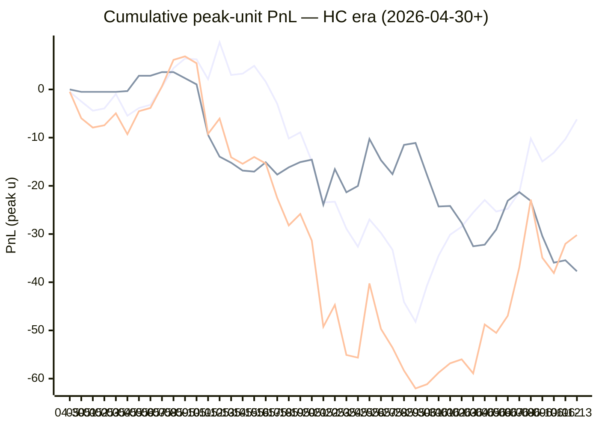

# Sharp Intel v6 — Daily Master Report

_Auto-generated **6/14/2026, 10:59:00 AM ET** by `scripts/dailyV6Report.js`. Do not edit by hand._

**Source of truth: this report mirrors the live Pick Performance dashboard.** Inclusion = `lockStage ≠ SHADOW ∧ ¬superseded ∧ health ∉ {MUTED, CANCELLED} ∧ peak.stars ≥ 2.5`. PnL is in **peak units** (the size shipped to users). HC margin / Δw / Δq are the **frozen** stamps written at last sync before the T-15 freeze. HC margin only existed from the v7.1 launch (**2026-04-30**); pre-launch picks have no HC value (no retro-fitting). Nothing is recomputed against today's whitelist.

v6 cutover: **2026-04-18** · whitelist source: live `sharpWalletProfiles` (248 profiles — drives §5 roster snapshot only) · quality cut: contribution ≥ 30 · HC = CONFIRMED tier ∧ sizeRatio ≥ 1.5.

---
## §1. Yesterday's picks

Slate: **2026-06-13** · 19 shipped sides.

| N | W-L-P | WR% | PnL (peak u) | PnL (flat 1u) |
|---|---|---|---|---|
| 19 | 11-8-0 | 57.9% | +1.81u | +2.27u |

| Sport | Market | Matchup | Pick | Stars · Units | HC | Δw | Δq | Σ | Odds | Result | PnL (peak u) |
|---|---|---|---|---|---|---|---|---|---|---|---|
| MLB | ML | Arizona Diamondbacks @ Cincinnati Reds | Arizona Diamondbacks | 5.0★ · 5.00u | +0 | +3 | +2 | +5 | -128 | L | -5.00u |
| MLB | ML | Atlanta Braves @ New York Mets | Atlanta Braves | 4.5★ · 3.00u | +0 | +0 | +1 | +1 | -102 | **W** | +2.94u |
| MLB | ML | Chicago Cubs @ San Francisco Giants | Chicago Cubs | 2.5★ · 0.25u | +0 | +0 | +1 | +1 | -118 | **W** | +0.21u |
| MLB | ML | Colorado Rockies @ Athletics | Colorado Rockies | 4.5★ · 2.50u | +0 | +1 | +1 | +2 | +136 | L | -2.50u |
| MLB | ML | Detroit Tigers @ Cleveland Guardians | Cleveland Guardians | 5.0★ · 2.50u | +0 | +2 | +2 | +4 | +134 | **W** | +3.35u |
| MLB | ML | Miami Marlins @ Pittsburgh Pirates | Miami Marlins | 4.5★ · 2.50u | +0 | +1 | +0 | +1 | +114 | L | -2.50u |
| MLB | ML | Philadelphia Phillies @ Milwaukee Brewers | Milwaukee Brewers | 4.5★ · 3.00u | +0 | +0 | +0 | +0 | -157 | L | -3.00u |
| MLB | ML | Seattle Mariners @ Washington Nationals | Washington Nationals | 5.0★ · 5.00u | +1 | +1 | +0 | +1 | -115 | **W** | +4.35u |
| MLB | ML | Texas Rangers @ Boston Red Sox | Boston Red Sox | 4.0★ · 1.00u | +0 | +0 | +1 | +1 | -112 | **W** | +0.85u |
| MLB | SPREAD | Arizona Diamondbacks @ Cincinnati Reds | Arizona Diamondbacks | 4.0★ · 1.00u | +0 | +1 | +1 | +2 | +123 | L | -1.00u |
| MLB | SPREAD | Detroit Tigers @ Cleveland Guardians | Cleveland Guardians | 4.0★ · 1.00u | +0 | +1 | +1 | +2 | -130 | **W** | +0.77u |
| MLB | SPREAD | Los Angeles Dodgers @ Chicago White Sox | Los Angeles Dodgers | 4.0★ · 1.00u | +0 | +1 | +1 | +2 | -120 | **W** | +0.82u |
| MLB | SPREAD | Tampa Bay Rays @ Los Angeles Angels | Tampa Bay Rays | 4.0★ · 1.00u | +0 | +0 | +0 | +0 | -106 | L | -1.00u |
| MLB | TOTAL | Atlanta Braves @ New York Mets | Under 8.5 | 5.0★ · 5.00u | +0 | +0 | +0 | +0 | -110 | **W** | +4.55u |
| MLB | TOTAL | Chicago Cubs @ San Francisco Giants | Under 8.5 | 4.5★ · 3.00u | +0 | +1 | +1 | +2 | -110 | **W** | +2.73u |
| MLB | TOTAL | New York Yankees @ Toronto Blue Jays | Under 7.5 | 4.0★ · 1.00u | +0 | +0 | +0 | +0 | +101 | **W** | +1.01u |
| MLB | TOTAL | Philadelphia Phillies @ Milwaukee Brewers | Over 8.5 | 3.0★ · 0.50u | +0 | +1 | +1 | +2 | -110 | **W** | +0.48u |
| MLB | TOTAL | Texas Rangers @ Boston Red Sox | Under 7.5 | 5.0★ · 5.00u | +0 | +1 | +0 | +1 | -110 | L | -5.00u |
| NBA | ML | Knicks @ Spurs | Spurs | 2.5★ · 0.25u | +6 | +6 | +4 | +10 | -205 | L | -0.25u |

---
## §2. 3-day / 7-day / all-time cohort rollups

Shipped picks only. PnL in **peak units** (size we actually bet) and flat 1u (cohort EV lens). All margins are the engine's frozen stamps (`v8_hcMargin`, `v8_walletConsensusDelta`, `v8_walletConsensusQualityMargin`).

**HC margin sub-tables** are scoped to picks dated ≥ 2026-04-30 (the v7.1 launch — when HC margin became a real engine signal). Pre-launch picks are excluded from HC analysis since the feature didn't exist for them. Δw / Δq sub-tables span the full v6-era sample (≥ 2026-04-18). Empty buckets are dropped.

### §2a. 3-day

Total: **47** shipped · 24-20-3 · WR 54.5% · PnL +4.70u (peak) / +1.24u (flat).

**By HC margin** _(picks dated ≥ 2026-04-30, N = 47)_

| Bucket | N | W-L-P | WR% | PnL (peak u) | PnL (flat 1u) |
|---|---|---|---|---|---|
| HC ≥ +3 | 1 | 0-1-0 | 0.0% | -0.25u | -1.00u |
| HC = +1 | 6 | 3-3-0 | 50.0% | +9.00u | -0.14u |
| HC = 0 | 37 | 18-16-3 | 52.9% | -7.30u | -0.04u |
| HC ≤ −1 | 3 | 3-0-0 | 100.0% | +3.25u | +2.42u |

**By Δw (winner margin)**

| Bucket | N | W-L-P | WR% | PnL (peak u) | PnL (flat 1u) |
|---|---|---|---|---|---|
| ≥ +3 | 4 | 0-4-0 | 0.0% | -6.50u | -4.00u |
| +2 | 8 | 7-0-1 | 100.0% | +9.80u | +5.87u |
| +1 | 19 | 8-10-1 | 44.4% | -11.34u | -3.20u |
| 0 | 13 | 8-5-0 | 61.5% | +12.76u | +2.66u |
| −1 | 3 | 1-1-1 | 50.0% | -0.02u | -0.09u |

**By Δq (quality margin)**

| Bucket | N | W-L-P | WR% | PnL (peak u) | PnL (flat 1u) |
|---|---|---|---|---|---|
| ≥ +3 | 4 | 2-1-1 | 66.7% | +3.94u | +0.51u |
| +2 | 7 | 4-3-0 | 57.1% | -0.88u | +0.89u |
| +1 | 18 | 11-5-2 | 68.8% | +7.95u | +4.00u |
| 0 | 13 | 5-8-0 | 38.5% | -3.87u | -3.30u |
| −1 | 4 | 1-3-0 | 25.0% | -2.67u | -1.77u |
| ≤ −2 | 1 | 1-0-0 | 100.0% | +0.23u | +0.91u |

**By AGS tier** _(picks dated ≥ 2026-05-05, N = 47)_

| Bucket | N | W-L-P | WR% | PnL (peak u) | PnL (flat 1u) |
|---|---|---|---|---|---|
| STRONG (+3 .. +5) | 1 | 0-1-0 | 0.0% | -0.25u | -1.00u |
| NEUT   (0 .. +3) | 26 | 16-8-2 | 66.7% | +11.85u | +6.27u |
| WEAK   (−1 .. 0) | 20 | 8-11-1 | 42.1% | -6.90u | -4.04u |

### §2b. 7-day

Total: **131** shipped · 67-60-4 · WR 52.8% · PnL +20.29u (peak) / +3.00u (flat).

**By HC margin** _(picks dated ≥ 2026-04-30, N = 131)_

| Bucket | N | W-L-P | WR% | PnL (peak u) | PnL (flat 1u) |
|---|---|---|---|---|---|
| HC ≥ +3 | 1 | 0-1-0 | 0.0% | -0.25u | -1.00u |
| HC = +2 | 4 | 3-1-0 | 75.0% | +8.36u | +1.52u |
| HC = +1 | 16 | 9-7-0 | 56.3% | +11.02u | +1.77u |
| HC = 0 | 103 | 49-50-4 | 49.5% | -8.67u | -4.03u |
| HC ≤ −1 | 7 | 6-1-0 | 85.7% | +9.83u | +4.74u |

**By Δw (winner margin)**

| Bucket | N | W-L-P | WR% | PnL (peak u) | PnL (flat 1u) |
|---|---|---|---|---|---|
| ≥ +3 | 13 | 5-8-0 | 38.5% | -1.84u | -3.48u |
| +2 | 16 | 11-4-1 | 73.3% | +6.58u | +4.94u |
| +1 | 58 | 28-28-2 | 50.0% | +4.08u | -2.25u |
| 0 | 36 | 20-16-0 | 55.6% | +12.16u | +4.98u |
| −1 | 6 | 2-3-1 | 40.0% | -2.99u | -1.06u |
| ≤ −2 | 2 | 1-1-0 | 50.0% | +2.30u | -0.14u |

**By Δq (quality margin)**

| Bucket | N | W-L-P | WR% | PnL (peak u) | PnL (flat 1u) |
|---|---|---|---|---|---|
| ≥ +3 | 14 | 6-7-1 | 46.2% | -6.19u | -1.97u |
| +2 | 18 | 10-8-0 | 55.6% | +3.45u | +1.18u |
| +1 | 41 | 26-13-2 | 66.7% | +30.14u | +9.28u |
| 0 | 34 | 15-19-0 | 44.1% | -9.87u | -2.80u |
| −1 | 18 | 7-10-1 | 41.2% | +1.49u | -2.56u |
| ≤ −2 | 6 | 3-3-0 | 50.0% | +1.27u | -0.13u |

**By AGS tier** _(picks dated ≥ 2026-05-05, N = 131)_

| Bucket | N | W-L-P | WR% | PnL (peak u) | PnL (flat 1u) |
|---|---|---|---|---|---|
| STRONG (+3 .. +5) | 1 | 0-1-0 | 0.0% | -0.25u | -1.00u |
| NEUT   (0 .. +3) | 68 | 36-30-2 | 54.5% | +22.81u | +4.53u |
| WEAK   (−1 .. 0) | 60 | 29-29-2 | 50.0% | -6.48u | -3.17u |
| FADE   (< −1) | 2 | 2-0-0 | 100.0% | +4.21u | +2.64u |

### §2c. All-time

Total: **627** shipped · 316-303-8 · WR 51.1% · PnL -42.45u (peak) / -12.94u (flat).

**By HC margin** _(picks dated ≥ 2026-04-30, N = 516)_

| Bucket | N | W-L-P | WR% | PnL (peak u) | PnL (flat 1u) |
|---|---|---|---|---|---|
| HC ≥ +3 | 11 | 3-8-0 | 27.3% | -9.08u | -6.67u |
| HC = +2 | 31 | 16-15-0 | 51.6% | -4.61u | -0.13u |
| HC = +1 | 155 | 86-69-0 | 55.5% | +7.49u | +10.66u |
| HC = 0 | 294 | 146-141-7 | 50.9% | -37.73u | -12.58u |
| HC ≤ −1 | 24 | 14-10-0 | 58.3% | +12.08u | +4.56u |

**By Δw (winner margin)**

| Bucket | N | W-L-P | WR% | PnL (peak u) | PnL (flat 1u) |
|---|---|---|---|---|---|
| ≥ +3 | 105 | 49-56-0 | 46.7% | -31.50u | -6.17u |
| +2 | 130 | 64-65-1 | 49.6% | -28.44u | -4.70u |
| +1 | 225 | 122-100-3 | 55.0% | +7.46u | +8.66u |
| 0 | 133 | 69-61-3 | 53.1% | +17.82u | +0.34u |
| −1 | 22 | 6-15-1 | 28.6% | -8.49u | -9.41u |
| ≤ −2 | 6 | 2-4-0 | 33.3% | -3.29u | -2.51u |
| missing | 6 | 4-2-0 | 66.7% | +3.99u | +0.85u |

**By Δq (quality margin)**

| Bucket | N | W-L-P | WR% | PnL (peak u) | PnL (flat 1u) |
|---|---|---|---|---|---|
| ≥ +3 | 127 | 62-62-3 | 50.0% | -28.93u | -4.15u |
| +2 | 117 | 54-63-0 | 46.2% | -34.56u | -12.12u |
| +1 | 194 | 106-85-3 | 55.5% | +32.56u | +8.88u |
| 0 | 117 | 59-57-1 | 50.9% | -9.09u | -1.02u |
| −1 | 49 | 26-22-1 | 54.2% | +11.08u | +2.12u |
| ≤ −2 | 17 | 5-12-0 | 29.4% | -16.75u | -7.42u |
| missing | 6 | 4-2-0 | 66.7% | +3.24u | +0.77u |

**By AGS tier** _(picks dated ≥ 2026-05-05, N = 491)_

| Bucket | N | W-L-P | WR% | PnL (peak u) | PnL (flat 1u) |
|---|---|---|---|---|---|
| ELITE  (≥ +7) | 3 | 3-0-0 | 100.0% | +8.01u | +2.34u |
| LOCK   (+5 .. +7) | 9 | 5-4-0 | 55.6% | -2.93u | -0.47u |
| STRONG (+3 .. +5) | 23 | 13-10-0 | 56.5% | -6.91u | +1.77u |
| NEUT   (0 .. +3) | 302 | 154-146-2 | 51.3% | -24.94u | -9.98u |
| WEAK   (−1 .. 0) | 139 | 69-66-4 | 51.1% | -4.81u | -2.62u |
| FADE   (< −1) | 14 | 9-5-0 | 64.3% | +4.68u | +5.05u |
| missing | 1 | 1-0-0 | 100.0% | +1.63u | +0.96u |

---
## §3. Edge over time — is HC margin creating winners?

Daily cumulative peak-unit PnL since the HC margin launch (**2026-04-30**). The `HC ≥ +1` line is the golden-standard cohort. The `HC = 0` line is the no-HC-signal control. The `All shipped (HC era)` line is every shipped pick from the same date range — the apples-to-apples baseline. Watch the spread.

Daily cumulative table (peak units, HC era only):

| Date | HC ≥ +1 (cum) | HC = 0 (cum) | All shipped (cum) |
|---|---|---|---|
| 2026-04-30 | -0.48u | +0.00u | -0.48u |
| 2026-05-01 | -2.48u | -0.50u | -5.98u |
| 2026-05-02 | -4.41u | -0.50u | -7.91u |
| 2026-05-03 | -3.94u | -0.50u | -7.44u |
| 2026-05-04 | -0.95u | -0.50u | -4.95u |
| 2026-05-05 | -5.45u | -0.34u | -9.29u |
| 2026-05-06 | -3.86u | +2.84u | -4.52u |
| 2026-05-07 | -3.18u | +2.84u | -3.84u |
| 2026-05-08 | +0.54u | +3.60u | +0.64u |
| 2026-05-09 | +4.41u | +3.60u | +6.14u |
| 2026-05-10 | +6.41u | +2.32u | +6.86u |
| 2026-05-11 | +6.25u | +1.05u | +5.43u |
| 2026-05-12 | +2.11u | -9.45u | -9.21u |
| 2026-05-13 | +9.78u | -13.95u | -6.04u |
| 2026-05-14 | +3.00u | -15.20u | -14.07u |
| 2026-05-15 | +3.27u | -16.83u | -15.43u |
| 2026-05-16 | +4.90u | -17.05u | -14.02u |
| 2026-05-17 | +1.62u | -15.11u | -15.36u |
| 2026-05-18 | -2.98u | -17.67u | -22.52u |
| 2026-05-19 | -10.18u | -16.17u | -28.22u |
| 2026-05-20 | -8.90u | -15.07u | -25.84u |
| 2026-05-21 | -14.92u | -14.58u | -31.37u |
| 2026-05-22 | -23.44u | -23.93u | -49.24u |
| 2026-05-23 | -23.30u | -16.53u | -44.70u |
| 2026-05-24 | -28.89u | -21.34u | -55.10u |
| 2026-05-25 | -32.63u | -20.03u | -55.65u |
| 2026-05-26 | -26.98u | -10.27u | -40.24u |
| 2026-05-27 | -29.77u | -14.68u | -49.69u |
| 2026-05-28 | -33.27u | -17.58u | -53.57u |
| 2026-05-29 | -44.12u | -11.51u | -58.35u |
| 2026-05-30 | -48.21u | -11.10u | -62.03u |
| 2026-05-31 | -40.65u | -17.79u | -61.16u |
| 2026-06-01 | -34.49u | -24.29u | -58.77u |
| 2026-06-02 | -30.14u | -24.19u | -56.82u |
| 2026-06-03 | -28.48u | -27.68u | -56.00u |
| 2026-06-04 | -25.53u | -32.54u | -58.91u |
| 2026-06-05 | -22.94u | -32.20u | -48.76u |
| 2026-06-06 | -25.33u | -29.06u | -50.51u |
| 2026-06-07 | -24.75u | -23.09u | -46.96u |
| 2026-06-08 | -21.34u | -21.30u | -36.94u |
| 2026-06-09 | -10.19u | -23.13u | -22.86u |
| 2026-06-10 | -14.95u | -30.43u | -34.92u |
| 2026-06-11 | -13.13u | -35.94u | -38.09u |
| 2026-06-12 | -10.30u | -35.44u | -32.03u |
| 2026-06-13 | -6.20u | -37.73u | -30.22u |

---
## §4. Wallet roster growth & profitability

"Tracked in sport X" = a wallet has placed **≥ 2 bets** in X within the v6-era sample. "Profitable" = cumulative flat PnL > 0. Source: `v8Scoring.walletDetails` on every graded v6-era game (every side, not just the shipped set).

### §4a. Per-sport wallet snapshot

| Sport | Total wallets seen | Tracked (≥2) | Profitable | % prof | WR ≥ 50% | WR ≥ 60% | WR ≥ 70% |
|---|---|---|---|---|---|---|---|
| MLB | 74 | 57 | 17 | 30% | 27 | 8 | 3 |
| NBA | 138 | 108 | 44 | 41% | 60 | 29 | 11 |
| NHL | 59 | 42 | 13 | 31% | 24 | 13 | 6 |
| **ALL (any sport)** | **171** | **136** | **56** | **41%** | **72** | **30** | **10** |

### §4b. Daily roster growth (cumulative through each date)

Format: `tracked (profitable)`. For each date D, recompute the roster using every bet up to and including D.

| Date | ALL | MLB | NBA | NHL |
|---|---|---|---|---|
| 2026-04-18 | 5 (2) | 2 (2) | 3 (0) | 0 (0) |
| 2026-04-19 | 19 (8) | 5 (3) | 9 (3) | 3 (1) |
| 2026-04-20 | 29 (12) | 7 (6) | 23 (8) | 5 (2) |
| 2026-04-21 | 44 (21) | 10 (6) | 31 (10) | 7 (5) |
| 2026-04-22 | 52 (28) | 12 (6) | 39 (15) | 11 (10) |
| 2026-04-23 | 56 (29) | 13 (6) | 46 (21) | 13 (10) |
| 2026-04-24 | 61 (30) | 14 (6) | 51 (23) | 14 (9) |
| 2026-04-25 | 65 (29) | 16 (8) | 54 (22) | 16 (9) |
| 2026-04-26 | 67 (31) | 18 (5) | 56 (25) | 17 (9) |
| 2026-04-27 | 72 (32) | 20 (7) | 60 (24) | 17 (9) |
| 2026-04-28 | 76 (33) | 21 (7) | 63 (26) | 23 (10) |
| 2026-04-29 | 77 (33) | 21 (7) | 64 (25) | 23 (10) |
| 2026-04-30 | 81 (34) | 21 (7) | 70 (27) | 23 (10) |
| 2026-05-01 | 85 (38) | 22 (5) | 74 (30) | 26 (13) |
| 2026-05-02 | 86 (37) | 23 (7) | 75 (32) | 26 (12) |
| 2026-05-03 | 86 (38) | 24 (8) | 75 (33) | 26 (12) |
| 2026-05-04 | 90 (38) | 24 (9) | 76 (32) | 26 (12) |
| 2026-05-05 | 91 (40) | 24 (9) | 79 (33) | 26 (12) |
| 2026-05-06 | 92 (40) | 24 (9) | 80 (33) | 26 (12) |
| 2026-05-07 | 92 (41) | 24 (9) | 80 (33) | 26 (12) |
| 2026-05-08 | 92 (40) | 24 (8) | 80 (32) | 26 (11) |
| 2026-05-09 | 94 (42) | 24 (8) | 82 (35) | 26 (11) |
| 2026-05-10 | 94 (42) | 24 (8) | 82 (35) | 26 (11) |
| 2026-05-11 | 96 (42) | 24 (8) | 84 (36) | 26 (11) |
| 2026-05-12 | 100 (41) | 27 (9) | 86 (37) | 26 (11) |
| 2026-05-13 | 102 (45) | 29 (11) | 88 (37) | 26 (11) |
| 2026-05-14 | 102 (41) | 29 (11) | 88 (37) | 28 (12) |
| 2026-05-15 | 103 (41) | 30 (10) | 88 (39) | 28 (12) |
| 2026-05-16 | 105 (43) | 31 (12) | 88 (39) | 30 (14) |
| 2026-05-17 | 105 (46) | 32 (11) | 88 (40) | 30 (14) |
| 2026-05-18 | 105 (46) | 32 (10) | 88 (38) | 31 (15) |
| 2026-05-19 | 105 (46) | 32 (12) | 88 (38) | 31 (15) |
| 2026-05-20 | 106 (48) | 33 (12) | 88 (38) | 31 (16) |
| 2026-05-21 | 106 (45) | 34 (12) | 88 (37) | 31 (14) |
| 2026-05-22 | 106 (44) | 34 (10) | 88 (39) | 33 (16) |
| 2026-05-23 | 111 (49) | 36 (10) | 90 (40) | 36 (19) |
| 2026-05-24 | 117 (52) | 37 (12) | 94 (39) | 37 (16) |
| 2026-05-25 | 120 (53) | 38 (13) | 95 (40) | 38 (16) |
| 2026-05-26 | 122 (55) | 39 (14) | 97 (42) | 38 (16) |
| 2026-05-27 | 123 (51) | 40 (12) | 97 (42) | 40 (14) |
| 2026-05-28 | 124 (51) | 40 (12) | 99 (42) | 40 (14) |
| 2026-05-29 | 125 (50) | 41 (12) | 99 (42) | 41 (12) |
| 2026-05-30 | 126 (49) | 41 (12) | 101 (43) | 41 (12) |
| 2026-05-31 | 126 (48) | 41 (11) | 101 (43) | 41 (12) |
| 2026-06-01 | 129 (52) | 44 (14) | 101 (43) | 41 (12) |
| 2026-06-02 | 130 (56) | 45 (16) | 101 (43) | 41 (13) |
| 2026-06-03 | 132 (56) | 45 (14) | 102 (43) | 41 (13) |
| 2026-06-04 | 132 (57) | 46 (14) | 102 (43) | 41 (14) |
| 2026-06-05 | 132 (57) | 48 (15) | 102 (43) | 41 (14) |
| 2026-06-06 | 132 (57) | 49 (15) | 102 (43) | 41 (14) |
| 2026-06-07 | 133 (56) | 52 (16) | 102 (43) | 41 (14) |
| 2026-06-08 | 135 (55) | 53 (16) | 103 (44) | 41 (14) |
| 2026-06-09 | 135 (55) | 53 (15) | 103 (44) | 41 (14) |
| 2026-06-10 | 135 (56) | 53 (15) | 105 (45) | 41 (14) |
| 2026-06-11 | 135 (54) | 54 (16) | 105 (45) | 42 (13) |
| 2026-06-12 | 135 (56) | 55 (17) | 105 (45) | 42 (13) |
| 2026-06-13 | 136 (56) | 57 (17) | 108 (44) | 42 (13) |

### §4c. Top 10 profitable wallets by sport

#### MLB

| # | Wallet | N | W | L | WR% | Flat PnL (u) | Flat ROI | $ PnL |
|---|---|---|---|---|---|---|---|---|
| 1 | e05213 | 9 | 8 | 1 | 88.9% | +6.27 | +69.6% | $294.4K |
| 2 | c9bba3 | 5 | 4 | 1 | 80.0% | +2.37 | +47.3% | $14.8K |
| 3 | ad88a3 | 7 | 5 | 2 | 71.4% | +2.88 | +41.1% | $5.8K |
| 4 | b839b3 | 3 | 2 | 1 | 66.7% | +0.99 | +33.0% | -$281 |
| 5 | 913987 | 44 | 30 | 14 | 68.2% | +14.19 | +32.2% | $666.8K |
| 6 | dfa240 | 3 | 2 | 1 | 66.7% | +0.85 | +28.3% | $2.5K |
| 7 | 981187 | 8 | 5 | 3 | 62.5% | +1.65 | +20.7% | $13.5K |
| 8 | c668b3 | 16 | 10 | 6 | 62.5% | +3.16 | +19.7% | $270 |
| 9 | eeabaf | 52 | 28 | 24 | 53.8% | +9.48 | +18.2% | $872.2K |
| 10 | a8c991 | 4 | 2 | 2 | 50.0% | +0.60 | +14.9% | -$31.4K |

#### NBA

| # | Wallet | N | W | L | WR% | Flat PnL (u) | Flat ROI | $ PnL |
|---|---|---|---|---|---|---|---|---|
| 1 | 799fad | 2 | 2 | 0 | 100.0% | +5.66 | +283.0% | $241.7K |
| 2 | a0d6d2 | 4 | 4 | 0 | 100.0% | +4.51 | +112.7% | $6.4K |
| 3 | 12ad50 | 3 | 3 | 0 | 100.0% | +2.74 | +91.3% | $45.5K |
| 4 | b51a56 | 6 | 5 | 1 | 83.3% | +5.44 | +90.7% | $74.4K |
| 5 | 11b032 | 7 | 6 | 1 | 85.7% | +5.40 | +77.1% | $249.9K |
| 6 | 12c933 | 2 | 2 | 0 | 100.0% | +1.28 | +63.9% | $11.5K |
| 7 | a1684d | 10 | 9 | 1 | 90.0% | +5.24 | +52.4% | $11.2K |
| 8 | 7f00bc | 21 | 14 | 7 | 66.7% | +9.80 | +46.7% | $14.7K |
| 9 | 92df91 | 23 | 16 | 7 | 69.6% | +10.26 | +44.6% | -$214 |
| 10 | 8ec926 | 8 | 6 | 2 | 75.0% | +3.53 | +44.1% | -$681 |

#### NHL

| # | Wallet | N | W | L | WR% | Flat PnL (u) | Flat ROI | $ PnL |
|---|---|---|---|---|---|---|---|---|
| 1 | 8366f5 | 2 | 2 | 0 | 100.0% | +2.30 | +114.9% | $107.6K |
| 2 | 799fad | 2 | 2 | 0 | 100.0% | +1.88 | +94.1% | $46.9K |
| 3 | fec67e | 4 | 3 | 1 | 75.0% | +2.82 | +70.5% | $12.5K |
| 4 | 30935c | 4 | 3 | 1 | 75.0% | +2.11 | +52.7% | $953 |
| 5 | 981187 | 8 | 6 | 2 | 75.0% | +3.52 | +44.0% | -$25.2K |
| 6 | bc3532 | 21 | 14 | 7 | 66.7% | +8.85 | +42.1% | $89.1K |
| 7 | fcc12b | 11 | 8 | 3 | 72.7% | +4.45 | +40.5% | -$27.5K |
| 8 | e70853 | 9 | 6 | 3 | 66.7% | +2.66 | +29.5% | -$11.1K |
| 9 | dfa240 | 28 | 18 | 10 | 64.3% | +6.46 | +23.1% | $19.0K |
| 10 | c5cea1 | 3 | 2 | 1 | 66.7% | +0.62 | +20.7% | $22.1K |

---
## §5. Proven-wallet roster growth & HC tracking

"Proven wallet" = whitelist tier `CONFIRMED` or `FLAT` in the same sense the live engine uses (`exportWalletProfiles.js` → `sharpWalletProfiles.bySport`). Sports inherit independent rosters: a wallet can be CONFIRMED in NBA and absent from NHL. `walletBets` come from `v8Scoring.walletDetails` on every graded v6-era pick (Source A); `positionRows` come from `sharp_action_positions` (Source B).

### §5a. Current proven-winner roster (snapshot)

Roster as of **2026-06-13** — wallets with ≥2 bets in the sport.

| Sport | Wallets seen | Eligible (≥2) | CONFIRMED | FLAT | Proven (C+F) | WR50 only | Conv % |
|---|---|---|---|---|---|---|---|
| MLB | 123 | 57 | 11 | 6 | **17** | 10 | 13.8% |
| NBA | 210 | 108 | 29 | 15 | **44** | 21 | 21.0% |
| NHL | 105 | 42 | 9 | 4 | **13** | 11 | 12.4% |
| **ALL** | **—** | **—** | **—** | **—** | **74** | **—** | **—** |

### §5b. Live whitelist drift check

Live `sharpWalletProfiles` is what the engine reads at lock time. Drift between script reconstruction (above) and live should be ≤ 1 day of position data — otherwise `exportWalletProfiles.js` is stale.

| Sport | CONFIRMED (live · script) | FLAT (live · script) | WR50 (live · script) | Drift |
|---|---|---|---|---|
| MLB | 33 · 11 | 14 · 6 | 6 · 10 | +30 live |
| NBA | 58 · 29 | 25 · 15 | 23 · 21 | +39 live |
| NHL | 22 · 9 | 8 · 4 | 12 · 11 | +17 live |

### §5c. Roster growth — 3d / 7d / 30d / all-time deltas

Each cell is **net growth** in proven (CONFIRMED + FLAT) wallets in that window, with the absolute count at the start (`+Δ from N`). Negative = wallets demoted. Window endpoint = 2026-06-13.

| Sport | 3-day | 7-day | 30-day | All-time (since cutover) |
|---|---|---|---|---|
| MLB | +2 from 15 | +2 from 15 | +6 from 11 | +17 from 0 |
| NBA | -1 from 45 | +1 from 43 | +7 from 37 | +44 from 0 |
| NHL | -1 from 14 | -1 from 14 | +1 from 12 | +13 from 0 |

A flat 7-day delta on a sport with healthy slate density = either the bubble pipeline has stalled (no wallets approaching the bar) or our cohort has saturated. Check §13d for the funnel diagnostic.

### §5d. Pipeline funnel — where each sport leaks

Wallets surviving each gate, in order. The biggest %-drop tells you the bottleneck. Gates:

1. **Seen** — placed ≥ 1 bet in the sport (any source)
2. **Eligible** — ≥ 2 graded picks in Source A (required for FLAT/CONFIRMED)
3. **Flat-OK** — eligible AND flat ROI > 0 (becomes FLAT or better)
4. **$-OK** — Flat-OK AND ≥2 positions with dollar ROI > 0 (CONFIRMED)
5. **Promoted** — final whitelisted = CONFIRMED + FLAT

| Sport | 1·Seen | 2·Eligible (% of Seen) | 3·Flat-OK (% of Elig) | 4·$-OK (% of Flat) | 5·Promoted | Bottleneck |
|---|---|---|---|---|---|---|
| MLB | 123 | 57 (46%) | 17 (30%) | 11 (65%) | **17** | edge (Eligible→Flat-OK) 70% |
| NBA | 210 | 108 (51%) | 44 (41%) | 29 (66%) | **44** | edge (Eligible→Flat-OK) 59% |
| NHL | 105 | 42 (40%) | 13 (31%) | 9 (69%) | **13** | edge (Eligible→Flat-OK) 69% |

### §5e. HC backing density (the fuel for v7.3 HC margin)

Every v7.x promotion is gated on `HC_m ≥ +1`, which requires at least one CONFIRMED wallet sized at `≥ 1.5×` average on the for-side. This table shows the share of shipped picks that *had any HC backing*, by sport, in each window. If HC density falls toward zero in a sport, the v7.3 floor cohorts (Σ=1, Σ=2 locks; HC rescues) will simply stop firing there.

| Sport | Window | Picks (with HC stamp) | Any HC for-side | HC_m ≥ +1 | HC_m ≥ +2 |
|---|---|---|---|---|---|
| MLB | 3-day | 45 | 7 (15.6%) | 6 (13.3%) | 0 (0.0%) |
| MLB | 7-day | 122 | 22 (18.0%) | 17 (13.9%) | 2 (1.6%) |
| MLB | All-time | 448 | 152 (33.9%) | 139 (31.0%) | 16 (3.6%) |
| NBA | 3-day | 1 | 1 (100.0%) | 1 (100.0%) | 1 (100.0%) |
| NBA | 7-day | 6 | 5 (83.3%) | 4 (66.7%) | 3 (50.0%) |
| NBA | All-time | 126 | 83 (65.9%) | 69 (54.8%) | 34 (27.0%) |
| NHL | 3-day | 1 | 0 (0.0%) | 0 (0.0%) | 0 (0.0%) |
| NHL | 7-day | 3 | 0 (0.0%) | 0 (0.0%) | 0 (0.0%) |
| NHL | All-time | 47 | 20 (42.6%) | 19 (40.4%) | 5 (10.6%) |

Pooled across sports:

| Window | Picks (with HC stamp) | Any HC for-side | HC_m ≥ +1 | HC_m ≥ +2 |
|---|---|---|---|---|
| 3-day | 47 | 8 (17.0%) | 7 (14.9%) | 1 (2.1%) |
| 7-day | 131 | 27 (20.6%) | 21 (16.0%) | 5 (3.8%) |
| All-time | 621 | 255 (41.1%) | 227 (36.6%) | 55 (8.9%) |

### §5f. Bubble wallets — next-up graduations

Wallets currently NOT promoted but close. Two flavors:

- **One-bet-away** — won the only bet, needs one more positive bet to clear ≥2.
- **Just-under** — has ≥2 bets but flat ROI is between −10% and 0% (one win flips them).

#### MLB

**One-bet-away** (6)

| wallet | picksN | flat PnL | pos N | pos $ROI |
|---|---|---|---|---|
| `...be17` | 1 | +6.95 | 23 | -60% |
| `...fc26` | 1 | +0.91 | 10 | 8% |
| `...be00` | 1 | +0.87 | 15 | 10% |
| `...9373` | 1 | +0.87 | 0 | — |
| `...9b3c` | 1 | +0.77 | 8 | 52% |
| `...8d26` | 1 | +0.72 | 5 | -22% |

**Just-under** (6)

| wallet | picksN | WR | flat ROI | pos N | pos $ROI |
|---|---|---|---|---|---|
| `...afd2` | 41 | 51% | -0.5% | 177 | -20% |
| `...2768` | 41 | 46% | -3.4% | 63 | 18% |
| `...2a9e` | 59 | 51% | -4.0% | 65 | 11% |
| `...600d` | 16 | 50% | -4.3% | 54 | 2% |
| `...e3d0` | 2 | 50% | -4.5% | 24 | 27% |
| `...0232` | 4 | 50% | -4.5% | 11 | 30% |

#### NBA

**One-bet-away** (6)

| wallet | picksN | flat PnL | pos N | pos $ROI |
|---|---|---|---|---|
| `...bf5d` | 1 | +3.15 | 3 | 42% |
| `...ed41` | 1 | +3.15 | 3 | 3% |
| `...6b87` | 1 | +2.05 | 8 | -27% |
| `...c556` | 1 | +0.93 | 3 | 42% |
| `...5c69` | 1 | +0.91 | 2 | 28% |
| `...b989` | 1 | +0.88 | 21 | -90% |

**Just-under** (6)

| wallet | picksN | WR | flat ROI | pos N | pos $ROI |
|---|---|---|---|---|---|
| `...d814` | 8 | 50% | -0.5% | 53 | 1% |
| `...1e50` | 4 | 50% | -1.2% | 29 | 46% |
| `...65dd` | 6 | 50% | -2.4% | 17 | 27% |
| `...853d` | 40 | 53% | -2.7% | 90 | -2% |
| `...1697` | 17 | 53% | -3.5% | 34 | 9% |
| `...11a4` | 20 | 45% | -3.6% | 72 | 54% |

#### NHL

**One-bet-away** (6)

| wallet | picksN | flat PnL | pos N | pos $ROI |
|---|---|---|---|---|
| `...2e78` | 1 | +1.46 | 0 | — |
| `...017f` | 1 | +1.45 | 6 | 108% |
| `...32f2` | 1 | +1.40 | 0 | — |
| `...e0fd` | 1 | +1.20 | 3 | 124% |
| `...266e` | 1 | +1.05 | 0 | — |
| `...2194` | 1 | +1.05 | 0 | — |

**Just-under** (6)

| wallet | picksN | WR | flat ROI | pos N | pos $ROI |
|---|---|---|---|---|---|
| `...33ee` | 4 | 50% | -0.3% | 8 | -23% |
| `...afd2` | 6 | 50% | -1.9% | 26 | -17% |
| `...192c` | 7 | 43% | -2.9% | 21 | -15% |
| `...44b0` | 5 | 60% | -4.8% | 13 | -32% |
| `...35e3` | 7 | 57% | -5.5% | 26 | 31% |
| `...618e` | 2 | 50% | -6.1% | 28 | 24% |

### §5g. v2 wallet-promotion pipeline (Source-A / Source-B mix)

Live snapshot of the v2 promotion gate (shipped 2026-05-10, re-eval **2026-05-24**). Each FLAT-or-better wallet × sport pair is attributed to one of three paths via `sharpWalletProfiles[wallet].bySport[sport].whitelistSource`:

- **A** — flat-positive on featured picks (Source A) only — the v1 gate
- **A+B** — flat-positive in both sources (most reliable signal)
- **B** — flat-positive on-chain only (NEW in v2 — the trial lift)

Re-classified every 2h via `grade-sharp-actions` cron. Roll-back: set `B_ONLY_MIN_BETS = Infinity` in `scripts/exportWalletProfiles.js`.

#### Source mix per sport (live Firestore)

| Sport | A | A+B | B (new) | FLAT-or-better total | % from B-only |
|---|---|---|---|---|---|
| MLB | 4 | 14 | **29** | 47 | 61.7% |
| NBA | 10 | 34 | **39** | 83 | 47.0% |
| NHL | 4 | 9 | **17** | 30 | 56.7% |
| **ALL** | **18** | **57** | **85** | **160** | **53.1%** |

#### Pipeline freshness

- `sharp_action_positions` GRADED rows: **13907**
- `sharp_action_positions` PENDING rows: **322** (queued for next Grade Sharp Actions run)
- Latest `sharpWalletProfiles` rebuild: 6/14/2026, 7:28:44 AM ET — 210 min · within 2 cron cycles

**Alarms**: pending > 200 OR rebuild lag > 4h → cron is lagging or failing — check `gh run list --workflow="Grade Sharp Actions"`.

#### B-only roster — wallets currently promoted via Source B path only

Wallets here would have been EXCLUDED under v1 (Source-A-only). Top by Source-B bet count per sport. The 2-week re-eval (2026-05-24) will compare these wallets' realized lift against A-only and A+B cohorts.

**MLB** — 29 wallets promoted via B

| wallet | tier | B_n | B_flat ROI | B_$ ROI |
|---|---|---|---|---|
| `...9a27` | CONFIRMED | 467 | +12.3% | +4.4% |
| `...135d` | CONFIRMED | 339 | +1.8% | +5.2% |
| `...3532` | CONFIRMED | 302 | +0.3% | +5.1% |
| `...1eae` | FLAT | 147 | +3.1% | -1.4% |
| `...c684` | FLAT | 85 | +6.6% | -2.2% |
| `...69c2` | CONFIRMED | 66 | +17.4% | +1% |
| `...2a9e` | CONFIRMED | 65 | +5.4% | +11.3% |
| `...ad50` | FLAT | 47 | +6.2% | -0.3% |
| `...d6d2` | FLAT | 38 | +6.8% | -25.5% |
| `...d227` | CONFIRMED | 29 | +26.6% | +35.1% |
| … | 19 more | | | |

**NBA** — 39 wallets promoted via B

| wallet | tier | B_n | B_flat ROI | B_$ ROI |
|---|---|---|---|---|
| `...cff6` | CONFIRMED | 112 | +3.2% | +31.8% |
| `...135d` | FLAT | 104 | +5% | -10.6% |
| `...11a4` | CONFIRMED | 72 | +23.3% | +54.4% |
| `...3782` | CONFIRMED | 70 | +2.3% | +0.4% |
| `...9d74` | FLAT | 50 | +2.3% | -14.4% |
| `...935c` | FLAT | 50 | +17.3% | -21.4% |
| `...68b3` | CONFIRMED | 44 | +33.9% | +13.9% |
| `...b6ef` | CONFIRMED | 42 | +6.3% | +3.3% |
| `...e2ce` | CONFIRMED | 40 | +15.2% | +22.9% |
| `...0563` | CONFIRMED | 37 | +4.9% | +41.7% |
| … | 29 more | | | |

**NHL** — 17 wallets promoted via B

| wallet | tier | B_n | B_flat ROI | B_$ ROI |
|---|---|---|---|---|
| `...618e` | CONFIRMED | 28 | +6.2% | +23.8% |
| `...35e3` | CONFIRMED | 26 | +10.6% | +31.5% |
| `...5eee` | CONFIRMED | 23 | +30.5% | +19.3% |
| `...192c` | FLAT | 21 | +14% | -15.2% |
| `...0c2e` | FLAT | 16 | +20% | -12.9% |
| `...44b0` | FLAT | 13 | +12.3% | -31.5% |
| `...1e50` | FLAT | 12 | +11.8% | -31.6% |
| `...2ca8` | CONFIRMED | 10 | +26.9% | +14% |
| `...600d` | CONFIRMED | 9 | +69% | +75.8% |
| `...a9cc` | CONFIRMED | 7 | +49.5% | +46.9% |
| … | 7 more | | | |

### §5 — How to read

- **Roster growth flat in 7-day** + **funnel bottleneck = `data`** → re-run `exportWalletProfiles.js`. The flat-positive wallets are stuck at FLAT because Source-B coverage hasn't caught up. CONFIRMED gate is data-bound, not skill-bound.
- **Roster growth flat in 7-day** + **funnel bottleneck = `sample`** → wallets aren't reaching `≥2` reps fast enough. This is a slate-density problem; consider a soft `MIN_BETS = 1` shadow lane to surface bubble wallets earlier.
- **Roster shrank** (negative delta) → a previously CONFIRMED wallet just dropped flat-positive (lost a recent bet). Variance, not failure — but worth noting if a sport loses ≥3 in a week.
- **HC density on a sport drops below ~30%** → v7.3 promotions there will starve. Either the proven roster needs more CONFIRMED-tier wallets sizing aggressively, or the HC_RATIO (1.5) needs a sport-specific tune.
- **§5g B-only count drops sharply** → wallets are demoting off the B path (losing on-chain). Cross-check `WALLET_PROFILES_SUMMARY.md` churn section for the specific demotions.
- **§5g pipeline freshness lag > 4h** → grade-sharp-actions cron is failing. Check `gh run list --workflow="Grade Sharp Actions"` and re-trigger if needed.

---
## §6. Daily proven-wallet performance

Who on the proven roster is actually printing — yesterday's bets, the rolling leaderboard (`$ PnL`-ranked), current streaks, and per-sport volume. **Proven** = `CONFIRMED` ∪ `FLAT` per sport (the same gate that drives Δ_winner). A wallet only counts in a sport where it's on that sport's proven list.

### §6a. Yesterday's proven-wallet bets

Slate: **2026-06-13** · 45 bets · 21 distinct proven wallets · WR 58% · $ vol $1.24M · $ PnL -$776.8K.

| Wallet | Sport | Market | Game | $ size | Result | $ PnL |
|---|---|---|---|---|---|---|
| `...64aa` (CONFIRMED) | MLB | ML | Colorado Rockies @ Athletics | $26.1K | **W** | $36.5K |
| `...64aa` (CONFIRMED) | MLB | ML | Chicago Cubs @ San Francisco Giants | $42.1K | **W** | $35.7K |
| `...e8f1` (CONFIRMED) | NBA | ML | Knicks @ Spurs | $48.9K | **W** | $25.4K |
| `...64aa` (CONFIRMED) | MLB | ML | Tampa Bay Rays @ Los Angeles Angels | $22.1K | **W** | $21.2K |
| `...abaf` (CONFIRMED) | MLB | TOTAL | Atlanta Braves @ New York Mets | $18.1K | **W** | $16.4K |
| `...1f30` (CONFIRMED) | MLB | ML | Seattle Mariners @ Washington Nationals | $11.8K | **W** | $10.3K |
| `...66f5` (FLAT) | NBA | ML | Knicks @ Spurs | $18.2K | **W** | $9.5K |
| `...1f30` (CONFIRMED) | MLB | ML | Detroit Tigers @ Cleveland Guardians | $5.6K | **W** | $7.5K |
| `...8f33` (CONFIRMED) | MLB | ML | New York Yankees @ Toronto Blue Jays | $6.9K | **W** | $6.1K |
| `...23c4` (FLAT) | MLB | TOTAL | New York Yankees @ Toronto Blue Jays | $5.8K | **W** | $5.9K |
| `...8f33` (CONFIRMED) | MLB | ML | Atlanta Braves @ New York Mets | $5.7K | **W** | $5.6K |
| `...8f33` (CONFIRMED) | MLB | ML | Texas Rangers @ Boston Red Sox | $6.6K | **W** | $5.6K |
| `...8f33` (CONFIRMED) | MLB | TOTAL | Chicago Cubs @ San Francisco Giants | $5.5K | **W** | $5.0K |
| `...3532` (FLAT) | NBA | TOTAL | Knicks @ Spurs | $4.8K | **W** | $4.7K |
| `...8f33` (CONFIRMED) | MLB | SPREAD | Los Angeles Dodgers @ Chicago White Sox | $5.8K | **W** | $4.7K |
| `...00bc` (CONFIRMED) | NBA | SPREAD | Knicks @ Spurs | $3.7K | **W** | $3.6K |
| `...c933` (CONFIRMED) | NBA | ML | Knicks @ Spurs | $5.2K | **W** | $2.7K |
| `...684d` (CONFIRMED) | NBA | SPREAD | Knicks @ Spurs | $1.6K | **W** | $1.6K |
| `...03d4` (CONFIRMED) | NBA | ML | Knicks @ Spurs | $3.0K | **W** | $1.6K |
| `...8f33` (CONFIRMED) | MLB | TOTAL | Philadelphia Phillies @ Milwaukee Brewers | $1.5K | **W** | $1.4K |
| `...8f33` (CONFIRMED) | MLB | SPREAD | Detroit Tigers @ Cleveland Guardians | $776 | **W** | $597 |
| `...39b3` (CONFIRMED) | NBA | SPREAD | Knicks @ Spurs | $500 | **W** | $490 |
| `...9ef0` (CONFIRMED) | NBA | ML | Knicks @ Spurs | $734 | **W** | $382 |
| `...64aa` (CONFIRMED) | MLB | ML | St. Louis Cardinals @ Minnesota Twins | $366 | **W** | $359 |
| `...39b3` (CONFIRMED) | NBA | ML | Knicks @ Spurs | $518 | **W** | $270 |
| `...2f63` (FLAT) | NBA | SPREAD | Knicks @ Spurs | $123 | **W** | $121 |
| `...64aa` (CONFIRMED) | MLB | ML | Arizona Diamondbacks @ Cincinnati Reds | $2.4K | L | -$2.4K |
| `...8f33` (CONFIRMED) | MLB | SPREAD | Arizona Diamondbacks @ Cincinnati Reds | $2.9K | L | -$2.9K |
| `...8f33` (CONFIRMED) | MLB | SPREAD | Tampa Bay Rays @ Los Angeles Angels | $3.4K | L | -$3.4K |
| `...2f63` (FLAT) | NBA | TOTAL | Knicks @ Spurs | $4.0K | L | -$4.0K |
| `...8f33` (CONFIRMED) | MLB | ML | Arizona Diamondbacks @ Cincinnati Reds | $4.1K | L | -$4.1K |
| `...64aa` (CONFIRMED) | MLB | ML | New York Yankees @ Toronto Blue Jays | $5.7K | L | -$5.7K |
| `...8f33` (CONFIRMED) | MLB | ML | Miami Marlins @ Pittsburgh Pirates | $6.1K | L | -$6.1K |
| `...1f30` (CONFIRMED) | MLB | ML | Philadelphia Phillies @ Milwaukee Brewers | $6.1K | L | -$6.1K |
| `...abaf` (CONFIRMED) | MLB | TOTAL | Texas Rangers @ Boston Red Sox | $8.4K | L | -$8.4K |
| `...1f30` (CONFIRMED) | MLB | ML | Arizona Diamondbacks @ Cincinnati Reds | $9.5K | L | -$9.5K |
| `...1f30` (CONFIRMED) | MLB | ML | New York Yankees @ Toronto Blue Jays | $9.6K | L | -$9.6K |
| `...2f63` (FLAT) | NBA | ML | Knicks @ Spurs | $10.4K | L | -$10.4K |
| `...fc82` (FLAT) | MLB | ML | Tampa Bay Rays @ Los Angeles Angels | $14.2K | L | -$14.2K |
| `...3f67` (CONFIRMED) | NBA | SPREAD | Knicks @ Spurs | $27.7K | L | -$27.7K |
| `...abaf` (CONFIRMED) | MLB | ML | Colorado Rockies @ Athletics | $50.4K | L | -$50.4K |
| `...c991` (CONFIRMED) | NBA | ML | Knicks @ Spurs | $63.0K | L | -$63.0K |
| `...0c2e` (FLAT) | NBA | ML | Knicks @ Spurs | $96.0K | L | -$96.0K |
| `...8da5` (FLAT) | NBA | ML | Knicks @ Spurs | $99.8K | L | -$99.8K |
| `...e3d0` (FLAT) | NBA | ML | Knicks @ Spurs | $566.3K | L | -$566.3K |

### §6b. Proven-wallet leaderboard

Top 15 proven `(wallet × sport)` pairs per sport per horizon, ranked by **$ PnL** (the dollar-ROI lens). The 3-day board is the "who's on form right now" lens; the 7-day filters single-day variance; all-time is the proven-roster reference.

#### §6b-1. 3-day

**MLB** — 11 active proven wallets

| # | Wallet | Tier | Bets | WR% | Bets/day | Flat PnL (u) | Flat ROI | $ vol | $ PnL | $ ROI | Streak |
|---|---|---|---|---|---|---|---|---|---|---|---|
| 1 | `...64aa` | CONFIRMED | 16 | 50% | 5.3 | -1.35 | -8% | $223.9K | $65.9K | +29% | 2W |
| 2 | `...8f33` | CONFIRMED | 18 | 61% | 6.0 | +2.69 | +15% | $85.1K | $20.0K | +24% | 1W |
| 3 | `...23c4` | FLAT | 5 | 60% | 1.7 | +0.85 | +17% | $53.3K | $16.6K | +31% | 2W |
| 4 | `...fc82` | FLAT | 2 | 50% | 1.0 | -0.15 | -8% | $42.6K | $9.8K | +23% | 1L |
| 5 | `...88a3` | CONFIRMED | 4 | 75% | 2.0 | +1.32 | +33% | $9.9K | $3.2K | +32% | 3W |
| 6 | `...a240` | CONFIRMED | 1 | 100% | 1.0 | +0.98 | +98% | $2.4K | $2.4K | +98% | 1W |
| 7 | `...39b3` | CONFIRMED | 2 | 100% | 2.0 | +1.99 | +99% | $754 | $719 | +95% | 2W |
| 8 | `...1f30` | CONFIRMED | 11 | 45% | 3.7 | -1.24 | -11% | $77.5K | -$1.1K | -1% | 1W |
| 9 | `...abaf` | CONFIRMED | 5 | 40% | 1.7 | -1.18 | -24% | $134.5K | -$38.8K | -29% | 2L |
| 10 | `...c991` | FLAT | 1 | 0% | 1.0 | -1.00 | -100% | $54.0K | -$54.0K | -100% | 1L |
| 11 | `...3987` | CONFIRMED | 1 | 0% | 1.0 | -1.00 | -100% | $108.3K | -$108.3K | -100% | 1L |

**NBA** — 15 active proven wallets

| # | Wallet | Tier | Bets | WR% | Bets/day | Flat PnL (u) | Flat ROI | $ vol | $ PnL | $ ROI | Streak |
|---|---|---|---|---|---|---|---|---|---|---|---|
| 1 | `...e8f1` | CONFIRMED | 1 | 100% | 1.0 | +0.52 | +52% | $48.9K | $25.4K | +52% | 1W |
| 2 | `...66f5` | FLAT | 1 | 100% | 1.0 | +0.52 | +52% | $18.2K | $9.5K | +52% | 1W |
| 3 | `...3532` | FLAT | 1 | 100% | 1.0 | +0.99 | +99% | $4.8K | $4.7K | +99% | 1W |
| 4 | `...00bc` | CONFIRMED | 1 | 100% | 1.0 | +0.98 | +98% | $3.7K | $3.6K | +98% | 1W |
| 5 | `...c933` | CONFIRMED | 1 | 100% | 1.0 | +0.52 | +52% | $5.2K | $2.7K | +52% | 1W |
| 6 | `...684d` | CONFIRMED | 1 | 100% | 1.0 | +0.98 | +98% | $1.6K | $1.6K | +98% | 1W |
| 7 | `...03d4` | CONFIRMED | 1 | 100% | 1.0 | +0.52 | +52% | $3.0K | $1.6K | +52% | 1W |
| 8 | `...39b3` | CONFIRMED | 2 | 100% | 2.0 | +1.50 | +75% | $1.0K | $760 | +75% | 2W |
| 9 | `...9ef0` | CONFIRMED | 1 | 100% | 1.0 | +0.52 | +52% | $734 | $382 | +52% | 1W |
| 10 | `...2f63` | FLAT | 3 | 33% | 3.0 | -1.02 | -34% | $14.5K | -$14.2K | -98% | 1L |
| 11 | `...3f67` | CONFIRMED | 1 | 0% | 1.0 | -1.00 | -100% | $27.7K | -$27.7K | -100% | 1L |
| 12 | `...c991` | CONFIRMED | 1 | 0% | 1.0 | -1.00 | -100% | $63.0K | -$63.0K | -100% | 1L |
| 13 | `...0c2e` | FLAT | 1 | 0% | 1.0 | -1.00 | -100% | $96.0K | -$96.0K | -100% | 1L |
| 14 | `...8da5` | FLAT | 1 | 0% | 1.0 | -1.00 | -100% | $99.8K | -$99.8K | -100% | 1L |
| 15 | `...e3d0` | FLAT | 1 | 0% | 1.0 | -1.00 | -100% | $566.3K | -$566.3K | -100% | 1L |

**NHL** — 3 active proven wallets

| # | Wallet | Tier | Bets | WR% | Bets/day | Flat PnL (u) | Flat ROI | $ vol | $ PnL | $ ROI | Streak |
|---|---|---|---|---|---|---|---|---|---|---|---|
| 1 | `...3532` | FLAT | 1 | 100% | 1.0 | +0.65 | +65% | $12.2K | $7.9K | +65% | 1W |
| 2 | `...a240` | CONFIRMED | 1 | 100% | 1.0 | +0.97 | +97% | $2.8K | $2.7K | +97% | 1W |
| 3 | `...2125` | CONFIRMED | 2 | 50% | 2.0 | -0.03 | -1% | $43.8K | -$17.2K | -39% | 1W |

#### §6b-2. 7-day

**MLB** — 13 active proven wallets

| # | Wallet | Tier | Bets | WR% | Bets/day | Flat PnL (u) | Flat ROI | $ vol | $ PnL | $ ROI | Streak |
|---|---|---|---|---|---|---|---|---|---|---|---|
| 1 | `...5213` | CONFIRMED | 3 | 100% | 1.0 | +2.79 | +93% | $282.6K | $258.5K | +91% | 3W |
| 2 | `...3987` | CONFIRMED | 15 | 73% | 3.0 | +5.88 | +39% | $756.4K | $100.3K | +13% | 1L |
| 3 | `...64aa` | CONFIRMED | 49 | 49% | 7.0 | -5.36 | -11% | $734.4K | $77.5K | +11% | 2W |
| 4 | `...fc82` | FLAT | 3 | 67% | 0.8 | +0.70 | +23% | $94.6K | $54.3K | +57% | 1L |
| 5 | `...1f30` | CONFIRMED | 22 | 55% | 3.1 | +1.42 | +6% | $155.6K | $26.1K | +17% | 1W |
| 6 | `...8f33` | CONFIRMED | 39 | 54% | 5.6 | +0.14 | +0% | $177.9K | $22.7K | +13% | 1W |
| 7 | `...abaf` | CONFIRMED | 11 | 45% | 1.6 | -0.94 | -9% | $256.6K | $10.6K | +4% | 2L |
| 8 | `...a240` | CONFIRMED | 1 | 100% | 1.0 | +0.98 | +98% | $2.4K | $2.4K | +98% | 1W |
| 9 | `...88a3` | CONFIRMED | 6 | 67% | 1.0 | +1.08 | +18% | $13.2K | $2.2K | +17% | 3W |
| 10 | `...39b3` | CONFIRMED | 2 | 100% | 2.0 | +1.99 | +99% | $754 | $719 | +95% | 2W |
| 11 | `...0ff5` | FLAT | 3 | 33% | 1.0 | -1.09 | -36% | $14.2K | -$5.2K | -36% | 1W |
| 12 | `...c991` | FLAT | 2 | 0% | 1.0 | -2.00 | -100% | $94.0K | -$94.0K | -100% | 2L |
| 13 | `...23c4` | FLAT | 18 | 44% | 2.6 | -1.72 | -10% | $390.7K | -$164.8K | -42% | 2W |

**NBA** — 20 active proven wallets

| # | Wallet | Tier | Bets | WR% | Bets/day | Flat PnL (u) | Flat ROI | $ vol | $ PnL | $ ROI | Streak |
|---|---|---|---|---|---|---|---|---|---|---|---|
| 1 | `...2ca8` | CONFIRMED | 2 | 50% | 0.7 | -0.24 | -12% | $253.4K | $138.5K | +55% | 1W |
| 2 | `...66f5` | FLAT | 3 | 100% | 0.8 | +2.24 | +75% | $92.0K | $65.4K | +71% | 3W |
| 3 | `...e8f1` | CONFIRMED | 3 | 67% | 0.5 | +0.28 | +9% | $275.4K | $58.4K | +21% | 2W |
| 4 | `...aeeb` | CONFIRMED | 2 | 100% | 0.7 | +1.56 | +78% | $69.9K | $54.8K | +78% | 2W |
| 5 | `...3532` | FLAT | 5 | 60% | 0.8 | +0.76 | +15% | $112.7K | $51.4K | +46% | 2W |
| 6 | `...3f67` | CONFIRMED | 2 | 50% | 0.3 | -0.13 | -7% | $101.4K | $36.4K | +36% | 1L |
| 7 | `...c933` | CONFIRMED | 2 | 100% | 0.5 | +1.28 | +64% | $16.8K | $11.5K | +68% | 2W |
| 8 | `...00bc` | CONFIRMED | 3 | 67% | 0.5 | +0.74 | +25% | $11.2K | $1.7K | +16% | 2W |
| 9 | `...684d` | CONFIRMED | 2 | 100% | 0.5 | +1.94 | +97% | $1.8K | $1.7K | +98% | 2W |
| 10 | `...03d4` | CONFIRMED | 1 | 100% | 1.0 | +0.52 | +52% | $3.0K | $1.6K | +52% | 1W |
| 11 | `...39b3` | CONFIRMED | 4 | 75% | 0.7 | +1.26 | +31% | $3.0K | $519 | +17% | 3W |
| 12 | `...9ef0` | CONFIRMED | 1 | 100% | 1.0 | +0.52 | +52% | $734 | $382 | +52% | 1W |
| 13 | `...9953` | CONFIRMED | 1 | 0% | 1.0 | -1.00 | -100% | $6.2K | -$6.2K | -100% | 1L |
| 14 | `...dc5b` | FLAT | 1 | 0% | 1.0 | -1.00 | -100% | $10.4K | -$10.4K | -100% | 1L |
| 15 | `...2f63` | FLAT | 9 | 44% | 1.5 | -1.44 | -16% | $91.6K | -$17.4K | -19% | 1L |

**NHL** — 4 active proven wallets

| # | Wallet | Tier | Bets | WR% | Bets/day | Flat PnL (u) | Flat ROI | $ vol | $ PnL | $ ROI | Streak |
|---|---|---|---|---|---|---|---|---|---|---|---|
| 1 | `...3532` | FLAT | 2 | 100% | 0.7 | +2.80 | +140% | $20.1K | $24.9K | +124% | 2W |
| 2 | `...2125` | CONFIRMED | 5 | 60% | 1.7 | +2.03 | +41% | $83.2K | $5.4K | +7% | 1W |
| 3 | `...a240` | CONFIRMED | 2 | 50% | 0.7 | -0.03 | -1% | $6.3K | -$850 | -14% | 1W |
| 4 | `...df91` | FLAT | 1 | 0% | 1.0 | -1.00 | -100% | $1.2K | -$1.2K | -100% | 1L |

#### §6b-3. All-time

**MLB** — 17 active proven wallets

| # | Wallet | Tier | Bets | WR% | Bets/day | Flat PnL (u) | Flat ROI | $ vol | $ PnL | $ ROI | Streak |
|---|---|---|---|---|---|---|---|---|---|---|---|
| 1 | `...abaf` | CONFIRMED | 52 | 54% | 1.8 | +9.48 | +18% | $1.24M | $872.2K | +71% | 2L |
| 2 | `...3987` | CONFIRMED | 44 | 68% | 4.0 | +14.19 | +32% | $2.29M | $666.8K | +29% | 1L |
| 3 | `...5213` | CONFIRMED | 9 | 89% | 1.1 | +6.27 | +70% | $386.1K | $294.4K | +76% | 7W |
| 4 | `...64aa` | CONFIRMED | 222 | 56% | 4.0 | +5.85 | +3% | $3.97M | $283.1K | +7% | 2W |
| 5 | `...fc82` | FLAT | 27 | 52% | 0.5 | +0.41 | +2% | $556.2K | $139.9K | +25% | 1L |
| 6 | `...8f33` | CONFIRMED | 61 | 57% | 2.9 | +5.46 | +9% | $369.0K | $70.3K | +19% | 1W |
| 7 | `...1f30` | CONFIRMED | 31 | 55% | 2.4 | +4.03 | +13% | $213.8K | $33.7K | +16% | 1W |
| 8 | `...5143` | CONFIRMED | 10 | 50% | 0.4 | +0.27 | +3% | $317.6K | $26.2K | +8% | 1W |
| 9 | `...bba3` | CONFIRMED | 5 | 80% | 0.4 | +2.37 | +47% | $153.7K | $14.8K | +10% | 1L |
| 10 | `...1187` | FLAT | 8 | 63% | 2.7 | +1.65 | +21% | $30.5K | $13.5K | +44% | 1W |
| 11 | `...88a3` | CONFIRMED | 7 | 71% | 0.7 | +2.88 | +41% | $15.1K | $5.8K | +38% | 3W |
| 12 | `...a240` | CONFIRMED | 3 | 67% | 0.1 | +0.85 | +28% | $6.7K | $2.5K | +38% | 1W |
| 13 | `...0ff5` | FLAT | 35 | 54% | 1.2 | +2.63 | +8% | $233.1K | $1.2K | +1% | 1W |
| 14 | `...68b3` | FLAT | 16 | 63% | 0.4 | +3.16 | +20% | $16.3K | $270 | +2% | 1L |
| 15 | `...39b3` | CONFIRMED | 3 | 67% | 0.3 | +0.99 | +33% | $1.8K | -$281 | -16% | 2W |

**NBA** — 44 active proven wallets

| # | Wallet | Tier | Bets | WR% | Bets/day | Flat PnL (u) | Flat ROI | $ vol | $ PnL | $ ROI | Streak |
|---|---|---|---|---|---|---|---|---|---|---|---|
| 1 | `...2ca8` | CONFIRMED | 26 | 62% | 0.5 | +6.33 | +24% | $2.75M | $945.0K | +34% | 1W |
| 2 | `...9a27` | CONFIRMED | 89 | 57% | 2.2 | +4.08 | +5% | $2.68M | $425.9K | +16% | 4L |
| 3 | `...aeeb` | CONFIRMED | 60 | 60% | 1.1 | +8.98 | +15% | $1.23M | $257.3K | +21% | 2W |
| 4 | `...b032` | CONFIRMED | 7 | 86% | 0.7 | +5.40 | +77% | $244.0K | $249.9K | +102% | 3W |
| 5 | `...9fad` | CONFIRMED | 2 | 100% | 1.0 | +5.66 | +283% | $141.8K | $241.7K | +170% | 2W |
| 6 | `...e8f1` | CONFIRMED | 21 | 48% | 0.4 | +2.25 | +11% | $877.2K | $197.2K | +22% | 2W |
| 7 | `...be3d` | CONFIRMED | 5 | 60% | 0.4 | +0.03 | +1% | $821.5K | $180.0K | +22% | 1L |
| 8 | `...32f2` | CONFIRMED | 10 | 50% | 0.2 | +1.86 | +19% | $146.1K | $127.3K | +87% | 1W |
| 9 | `...02c3` | CONFIRMED | 6 | 33% | 0.9 | +0.75 | +13% | $681.1K | $104.0K | +15% | 3L |
| 10 | `...b814` | CONFIRMED | 3 | 100% | 0.4 | +0.56 | +19% | $431.9K | $81.3K | +19% | 3W |
| 11 | `...1a56` | CONFIRMED | 6 | 83% | 0.2 | +5.44 | +91% | $53.7K | $74.4K | +139% | 1L |
| 12 | `...23c4` | CONFIRMED | 23 | 61% | 0.6 | +4.81 | +21% | $784.6K | $70.7K | +9% | 3W |
| 13 | `...66f5` | FLAT | 17 | 59% | 0.4 | +5.02 | +30% | $332.9K | $64.5K | +19% | 3W |
| 14 | `...5143` | FLAT | 13 | 62% | 0.4 | +3.27 | +25% | $798.4K | $57.5K | +7% | 1L |
| 15 | `...ad50` | FLAT | 3 | 100% | 1.5 | +2.74 | +91% | $50.6K | $45.5K | +90% | 3W |

**NHL** — 13 active proven wallets

| # | Wallet | Tier | Bets | WR% | Bets/day | Flat PnL (u) | Flat ROI | $ vol | $ PnL | $ ROI | Streak |
|---|---|---|---|---|---|---|---|---|---|---|---|
| 1 | `...66f5` | FLAT | 2 | 100% | 0.7 | +2.30 | +115% | $78.8K | $107.6K | +137% | 2W |
| 2 | `...3532` | FLAT | 21 | 67% | 0.4 | +8.85 | +42% | $365.8K | $89.1K | +24% | 8W |
| 3 | `...9fad` | CONFIRMED | 2 | 100% | 1.0 | +1.88 | +94% | $88.2K | $46.9K | +53% | 2W |
| 4 | `...2125` | CONFIRMED | 15 | 60% | 0.8 | +2.51 | +17% | $136.5K | $39.3K | +29% | 1W |
| 5 | `...cea1` | CONFIRMED | 3 | 67% | 0.4 | +0.62 | +21% | $27.7K | $22.1K | +80% | 1W |
| 6 | `...a240` | CONFIRMED | 28 | 64% | 0.5 | +6.46 | +23% | $92.1K | $19.0K | +21% | 1W |
| 7 | `...c67e` | CONFIRMED | 4 | 75% | 0.2 | +2.82 | +71% | $20.7K | $12.5K | +60% | 1W |
| 8 | `...9d74` | CONFIRMED | 5 | 60% | 0.1 | +0.84 | +17% | $15.0K | $5.2K | +35% | 1L |
| 9 | `...935c` | CONFIRMED | 4 | 75% | 1.0 | +2.11 | +53% | $1.3K | $953 | +74% | 3W |
| 10 | `...df91` | FLAT | 13 | 54% | 0.3 | +0.78 | +6% | $18.7K | -$5.0K | -27% | 1L |
| 11 | `...0853` | CONFIRMED | 9 | 67% | 0.3 | +2.66 | +30% | $250.0K | -$11.1K | -4% | 1W |
| 12 | `...1187` | FLAT | 8 | 75% | 0.2 | +3.52 | +44% | $153.0K | -$25.2K | -16% | 2L |
| 13 | `...c12b` | CONFIRMED | 11 | 73% | 0.3 | +4.45 | +40% | $504.9K | -$27.5K | -5% | 2W |

### §6c. Active streaks (≥3 in a row, last bet within 3 days)

Proven `(wallet × sport)` pairs currently riding a 3-or-more-bet run with their most recent bet inside the last 3 calendar days. Hot-hand monitor — and the same surface for cold streaks worth fading.

| Wallet | Sport | Tier | Streak | Last bet | All-time bets | WR% | $ PnL | $ ROI |
|---|---|---|---|---|---|---|---|---|
| `...3532` | NHL | FLAT | **8W** | 2026-06-11 | 21 | 67% | $89.1K | +24% |
| `...9ef0` | NBA | CONFIRMED | **5W** | 2026-06-13 | 33 | 61% | $38.4K | +14% |
| `...03d4` | NBA | CONFIRMED | **4W** | 2026-06-13 | 31 | 68% | $37.0K | +35% |
| `...66f5` | NBA | FLAT | **3W** | 2026-06-13 | 17 | 59% | $64.5K | +19% |
| `...684d` | NBA | CONFIRMED | **3W** | 2026-06-13 | 10 | 90% | $11.2K | +68% |
| `...9c38` | NBA | CONFIRMED | **3L** | 2026-06-10 | 16 | 75% | $9.4K | +4% |
| `...88a3` | MLB | CONFIRMED | **3W** | 2026-06-12 | 7 | 71% | $5.8K | +38% |
| `...39b3` | NBA | CONFIRMED | **3W** | 2026-06-13 | 4 | 75% | $519 | +17% |

### §6d. Daily proven-wallet volume (trailing 14 graded days)

Per-day bet count, $ volume, and $ PnL from proven wallets only. Helps spot slate-density swings — a spike in one sport's volume = the proven cohort sees something on that night's board.

| Date | TOTAL N · $vol · $PnL | MLB N · $vol · $PnL | NBA N · $vol · $PnL | NHL N · $vol · $PnL |
|---|---|---|---|---|
| 2026-05-31 | 11 · $278.3K · $5.7K | 11 · $278.3K · $5.7K | — | — |
| 2026-06-01 | 23 · $575.7K · $86.5K | 23 · $575.7K · $86.5K | — | — |
| 2026-06-02 | 28 · $586.6K · $262.2K | 20 · $495.6K · $149.9K | — | 8 · $91.1K · $112.3K |
| 2026-06-03 | 54 · $1.07M · -$145.4K | 29 · $584.3K · $123.7K | 25 · $488.2K · -$269.1K | — |
| 2026-06-04 | 23 · $553.0K · $8.1K | 20 · $513.8K · -$16.0K | — | 3 · $39.2K · $24.1K |
| 2026-06-05 | 40 · $1.24M · -$246.3K | 22 · $613.2K · $168.5K | 18 · $631.4K · -$414.8K | — |
| 2026-06-06 | 28 · $728.5K · $33.8K | 24 · $720.3K · $32.2K | — | 4 · $8.2K · $1.6K |
| 2026-06-07 | 37 · $808.5K · $274.4K | 37 · $808.5K · $274.4K | — | — |
| 2026-06-08 | 34 · $1.11M · $415.6K | 18 · $380.8K · $142.2K | 16 · $728.8K · $273.4K | — |
| 2026-06-09 | 30 · $652.6K · $9.8K | 24 · $600.5K · -$25.2K | — | 6 · $52.1K · $35.0K |
| 2026-06-10 | 49 · $1.46M · $179.1K | 29 · $391.2K · -$16.4K | 20 · $1.07M · $195.6K | — |
| 2026-06-11 | 16 · $299.4K · -$115.2K | 12 · $240.7K · -$108.5K | — | 4 · $58.8K · -$6.7K |
| 2026-06-12 | 27 · $264.3K · -$15.1K | 27 · $264.3K · -$15.1K | — | — |
| 2026-06-13 | 45 · $1.24M · -$776.8K | 27 · $287.4K · $40.0K | 18 · $954.4K · -$816.8K | — |

---

_Driven by `scripts/dailyV6Report.js` · regenerates daily via `.github/workflows/daily-v6-report.yml` · QUALITY_CONTRIB_CUT = 30 · HC = CONFIRMED ∧ sizeRatio ≥ 1.5 · inclusion mirrors live Pick Performance dashboard · §1–§3 use shipped picks · §4–§5 wallet/tracking growth mirror `exportWalletProfiles.js` · §6 daily proven-wallet board uses today's roster (CONFIRMED ∪ FLAT) as-of 2026-06-13_
