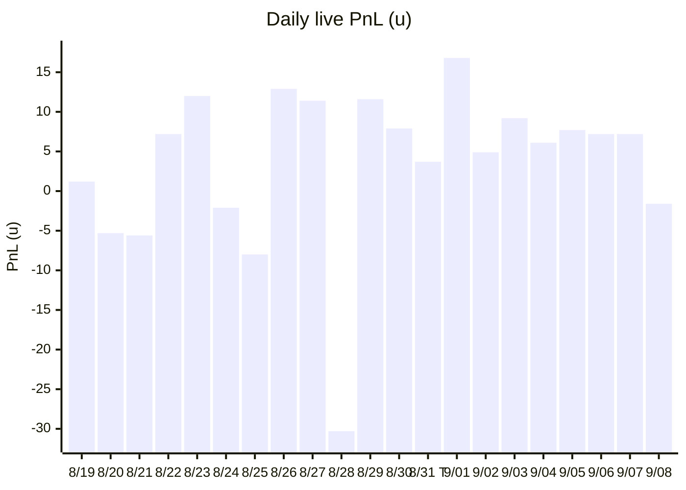

# Filter & size impact — 9 days after Policy T

_Pulled 2026-09-09 08:23 UTC from live Firestore `sharpFlow*` (same live-book definition as `DAILY_AGSU_REPORT.md`: AGS-U promoted, COMPLETED, WIN/LOSS, `finalUnits > 0`, `tracked !== true`). Re-run: `node scripts/analyzeFilterSizeImpact.mjs`._

**Related:** [`CLOSING_DIME_STEAM_EDGE.md`](./CLOSING_DIME_STEAM_EDGE.md) (the August paper that shipped T) · [`STAKE_PATHS_AND_SIZING.md`](./STAKE_PATHS_AND_SIZING.md) · [`SKILL_FEATURES.md`](./SKILL_FEATURES.md)

---

## Executive answer

The changes from **2026-08-19 through 2026-09-05** — leftover mutes, TOP crowded, Ev-drift, climate half-size, **steam-tail Policy T (2026-08-31)**, then **favorites juicier than −375 (2026-09-05)** — turned a ~16-ticket, ~+1u/day book into a **~6–7 ticket, ~+7u/day** book.

| Window | Days | Live | W-L | WR (Wilson 95%) | Stake | PnL | ROI | Tickets/day | PnL/day | u/ticket |
|--------|-----:|-----:|:---:|----------------:|------:|----:|----:|------------:|--------:|---------:|
| V12 before steam stamps (Jun 1 – Aug 18) | 77 | 731 | 401-330 | 54.9% (51–58) | 2025.5u | **+100.59u** | +5.0% | 9.5 | +1.31u | 2.77 |
| Steam on, T **off** (Aug 19–30) | 12 | 190 | 103-87 | 54.2% (47–61) | 480.5u | **+13.02u** | +2.7% | 15.8 | +1.08u | 2.53 |
| **T live (Aug 31 – Sep 8)** | **9** | **59** | **41-18** | **69.5% (57–80)** | **179.6u** | **+61.30u** | **+34.1%** | **6.6** | **+6.81u** | **3.04** |

In 9 days after T we banked **+61.3u**. That is **~47% of all V12 profit since June 1**, on **6% of V12 tickets**.

What actually changed:

- **Volume:** 16 live/day → 6.6 (−59%).
- **Selectivity:** live / (live+muted) in the steam window 38% → 15%.
- **1u junk:** **zero** live tickets after T. The ≤1u band is gone.
- **Win rate:** 54% → 70%. Wilson lower bound after T (57%) sits above the pre-T point estimate (54%).
- **Left tail:** Aug 28 was **−30.30u** on 22 tickets. After T the only red day is Sep 8 (**−1.59u** on 9 tickets). 8 of 9 days green.
- **−375 mute:** 6 CFB heavy favs cut, CF **−3.47u** saved. Juice math, not win-rate math.

Honest caveat on T itself: if the 83 steam-tail *mutes* had shipped at pre-policy size, that pile would have been **+24.2u** in this 9-day sample. **Almost all of that is five unconfirmed 5.4u/6u tickets that went 5-0.** The 4u unconfirmed mute *saved* 2.7u. The 1u cut was roughly scratch (+3.7u on 65u). Do **not** unwind the fat gate on n=5. August’s paper on that cell was 16-12 **−8.9%**.

---

## What we shipped (the stack, not one commit)

V12 (2026-06-01) is still the sizer. This window is **filters on top of V12**.

| When | Change | What it does |
|------|--------|----------------|
| Aug 19 | Flinch / leftover mute | Sub-4 leftovers → 0u |
| Aug 20 | maxSR-sub4 | Sub-4 and max FOR sizeRatio < 1 → 0u |
| Aug 23 | no-CONFIRMED | No CONFIRMED wallet on FOR → 0u |
| Aug 26 | TOP crowded | TOP/TOP+ with leadSR≥3 or EDGE<10 (plus a crowded AND) → 0u. August CF: 9 cuts, +20.8u |
| Aug 26 | Ev-drift × EDGE | EDGE≥15 and dEv≤−1.5 and currentEv<−1 → 0u |
| Aug 29 | NFL/CFB Confirmed unlock | Cap size by sport-wide CONFIRMED depth. Never mutes |
| Aug 29 | RED climate ×0.5 | Sharp A turnout = 0 → half units |
| **Aug 31** | **Steam-tail Policy T** | **The change.** Same sizer. Steam confirms/kills tails only |
| Sep 1 | T-15 line freeze | Seal spread/total at commence−15m (units already froze) |
| Sep 5 | Fav-juice < −375 | After every dial, American odds juicier than −375 → 0u. **−375 holds** |

### Policy T (live `date >= 2026-08-31`)

| Published size (post-climate) | Steam observable | Else |
|-------------------------------|------------------|------|
| ≤1u junk | **0u** | 0u (does not need steam) |
| ≤1u + Source A/B CONFIRMED + steam **arriving** | **floor 2u** | n/a |
| 2–3u | as-sized | as-sized |
| 4u | keep iff A/B **and** steam on at lock | fail-open |
| 5u | always | keep |
| 5.4u+ | keep iff A/B steam on at lock | fail-open |

Source A/B = wallet `whitelistTier === CONFIRMED` with source A and/or B — **not** climate letters. Card copy: “Unconfirmed size — no steam”. `mutedBy: steam-tail`.

August counterfactual that justified T (372-ticket August book): T would have been **177 · 61% · +93.6u** vs actual **372 · 53% · +46.8u** (+47u, ~6 locks/day). Live after T: **6.6/day, 70% WR** — volume matches, WR is running hot.

---

## Day by day

| Date | Live | W-L | Stake | PnL | ROI | Notes |
|------|-----:|:---:|------:|----:|----:|-------|
| 08-19 … 08-27 | 9–21/day | mixed | | **+23.8u** net | | Steam stamps on, T off. 5 red days in 12 |
| **08-28** | **22** | 9-13 | 58.6u | **−30.30u** | −52% | The disaster T was built to stop |
| 08-29–30 | 13 / 19 | 8-5 / 11-8 | | **+19.52u** | +24% | Climate + unlock live, T not yet. Still 16 tickets/day |
| **08-31 T** | **5** | 4-1 | 12.5u | +3.74u | +30% | First T day. Volume cliff |
| 09-01 | 4 | **4-0** | 16.9u | **+16.82u** | +100% | Spike (SUPER Over 7.5 6u + Nats −1.5 5.4u). Not the whole story |
| 09-02 … 09-07 | 5–9/day | | | **+42.33u** | +30–54%/day | Every day green |
| 09-08 | 9 | 4-5 | 26.0u | **−1.59u** | −6% | First red day after T. Small |
| 09-09 | 1 pending | | 5u RANK Cards | — | | Not graded |

Drop the 09-01 spike: remaining 8 post-T days are **55 · 37-18 · +44.48u · +5.6u/day** — still ~5× the pre-T daily rate. Drop Aug 28 from pre-T: pre-T becomes +3.94u/day, still well below post-T.

---

## Size mix — T did the volume job

**Live after T (59 tickets):**

| Band | N | W-L | WR | PnL | ROI |
|------|--:|:---:|---:|----:|----:|
| ≤1u | **0** | — | — | — | **gone** |
| **2–3u** | **53** | **36-17** | 68% | **+42.44u** | +29% |
| 5u | 1 | 1-0 | | +6.00u | RANK Over 11.5 09-04 |
| 5.4u | 4 | 3-1 | 75% | +6.68u | Tape BOOST fat with steam |
| 6u | 1 | 1-0 | | +6.18u | SUPER Over 7.5 09-01 |

The book is now a **2–3u spine** (CONFIRMED-Q1 / SHARP / MINI) plus a handful of steam-confirmed fat tickets. That is exactly the mix T scored on the August tape.

Arriving floor (≤1u A/B steam arriving → 2u): **3 tickets, 2-1, +2.92u**. Rangers ML 09-03 +2.16, Reds ML 09-05 +2.76, Hull +338 09-05 −2.00. Working as designed.

**Live before T in the steam window (190 tickets)** averaged 2.53u with a thick 1u tail. August’s 1u pile alone was **168 · 76-92 · −20.3u**.

---

## Path mix after T

| Path | N | W-L | PnL | ROI | Read |
|------|--:|:---:|----:|----:|------|
| CONFIRMED-Q1 | 34 | 23-11 | **+23.57u** | +24% | Volume spine. 2–3u floors |
| **RANK** | **6** | **6-0** | **+17.71u** | +96% | Printer. Includes 5u Over 11.5 |
| SHARP | 9 | 5-4 | +3.60u | +10% | Includes Real Madrid 5.4u LOSS −5.40 |
| SUPER | 3 | 2-1 | +6.45u | +54% | 6u Over 7.5 09-01 WIN; 3u Over 7.5 09-08 LOSS |
| MINI | 3 | 3-0 | +9.05u | +101% | Thin, perfect |
| DISSENT | 1 | 1-0 | +2.16u | | Rangers, arriving floor |
| CONFIRMED-UNOPP | 2 | 1-1 | +0.76u | | Reds floor WIN, Hull floor LOSS |
| SHARP-LEAN | 1 | 0-1 | −2.00u | | Tigers 09-08 |

Sport: **MLB 50 · 36-14 · +67.82u · +45% ROI** is the entire profit. Soccer 5 · 2-3 · **−8.40u** (Real Madrid 5.4u). CFB 3 · 2-1 · −0.88u (Cal 2u LOSS, JMU/Miami tiny plus). UFC 1 · Felipe Lima 5.4u +2.76.

Market: totals **28 · 20-8 · +41.10u · +46%** carried the window. ML 29 · 19-10 · +12.68u. Spreads n=2, both wins.

---

## Mute counterfactuals after T (would those cuts have printed?)

Graded mutes with `date >= 2026-08-31`, priced at `v8_unitsPreSteamTail` (else pre-qConv / pre-tape / 1u). **Positive CF PnL = we left money on the table. Negative = the mute saved money.**

| Overlay | N | W-L | Pre-u stake | CF PnL | ROI | Verdict |
|---------|--:|:---:|------------:|-------:|----:|---------|
| **steam-tail (all)** | 83 | 47-36 | 134.1u | **+24.23u** | +18% | Cost in *this* sample — see split |
| ↳ lean_no_arriving (1u cut) | 67 | 36-31 | 65.5u | +3.69u | +6% | Scratch. Keep. Board hygiene |
| ↳ unconfirmed_4u | 11 | 6-5 | 41.0u | **−2.68u** | −7% | **Saved money. Keep** |
| ↳ **unconfirmed_fat** | **5** | **5-0** | **27.6u** | **+23.22u** | +84% | **The whole T “cost.” n=5. Do not retune** |
| **fav-juice < −375** | 6 | 4-2 | 12.0u | **−3.47u** | | **Saved money.** 4-2 WR, juice losers |
| **ev-drift** | 3 | 0-3 | 10.4u | **−10.40u** | | **Perfect.** Three losers, including a 5.4u |
| top-crowded | 10 | 7-3 | 20.8u | −5.54u | | Saved money despite 70% WR (juice/size) |

### The five fat cuts (do not chase)

| Date | Ticket | Path | Pre | Odds | Result | CF |
|------|--------|------|----:|-----:|--------|---:|
| 09-04 | MLB Over 8.5 | SUPER | 6.0u | −112 | WIN | +5.36 |
| 09-04 | MLB Over 7.5 | RANK | 5.4u | +110 | WIN | +5.94 |
| 09-05 | UFC Delphine Benouaich | SHARP | 5.4u | −132 | WIN | +4.09 |
| 09-05 | UFC Kurtis Campbell | MINI- | 5.4u | −358 | WIN | +1.51 |
| 09-06 | MLB Dodgers −1.5 | SHARP-LEAN | 5.4u | +117 | WIN | +6.32 |

August cell this gate targets: 5.4u+ **without** A/B steam = **28 · 16-12 · −8.9% · −13.7u**. Five winners in a row is what a 9-day sample looks like, not a new truth.

Campbell −358 would also have been fav-juice after 09-05 if steam-tail had not already zeroed it.

### Fav-juice (Sep 5 CFB)

Charlotte −1011 LOSS, Utah State −529 LOSS, Jacksonville State −1011 WIN +0.20u, Nebraska −1567 WIN +0.13u, Iowa State −3604 WIN +0.06u, Kentucky −1438 WIN +0.14u. Four “wins” pay **+0.53u combined**. Two losses cost **−4.00u**. Mute is correct.

Miami (FL) −1567 **shipped 2u on Sep 4** (day before the mute) and won **+0.13u**. That is the ticket the mute exists to kill.

---

## August paper vs live T

| | August CF (T on the 372-ticket month) | Live Aug 31–Sep 8 |
|--|----------------------------------------|-------------------|
| Tickets/day | 5.9 | **6.6** |
| WR | 61% | **70%** (Wilson 57–80) |
| 1u on board | 0 | **0** |
| 2–3u | keep | **53/59 tickets, +42u** |
| Fat without A/B steam | mute | 5 muted, those 5 won (sample noise) |
| Fat *with* A/B steam | keep | 4 shipped 5.4u: 3-1 +6.68u (Real Madrid −5.40) |

Volume and the 1u deletion matched the paper. WR is running above the paper. The fat-mute cost in this sample is the thing to **watch**, not the thing to **flip**.

---

## What we cannot unbundle

Climate (Aug 29) and T (Aug 31) are two days apart. Aug 29–30 was already **+19.5u on 32 tickets** at the old 16/day volume. T is what dropped volume. Climate is a half-size overlay, not a mute.

NFL/CFB week 1 started inside the T window. CFB live n=3 is not a sport conclusion. The −375 mute *is* a CFB-week-1 overlay and it paid.

Sep 1 +16.82u (4-0) is real money and also a spike. The rest of the window still prints without it.

Tape `MUTE` stamps still appear on 7 **shipped** tickets (CONFIRMED-Q1 / UNOPP exemptions). Those 7 went 5-2 **+8.0u**. Not a leak to chase this week.

---

## Leaks / watch list

1. **Unconfirmed fat 5-0.** Re-score at 30 days. If that cell stays hot, the gate is wrong. If it mean-reverts toward August −9% ROI, T is right.
2. **Real Madrid 5.4u BOOST −5.40 (09-04).** T *allowed* this (steam + A/B). Fat confirmed tickets still lose sometimes. Do not add a soccer haircut on n=1.
3. **Sep 8 −1.59u.** First red day. SUPER Over 7.5 −3u, several 3u Q1 totals lost. Not a regime break.
4. **`DAILY_AGSU_REPORT.md` §2 still describes the pre-T stack.** Monitor will under-explain why the board is 6 tickets. Same lag in `SKILL_FEATURES.md` / `STAKE_PATHS_AND_SIZING.md` overlay tables.
5. **Pending 09-09:** Cardinals ML **5u RANK**, steam HOLD. 5u always ships under T.

---

## Recommendations

1. **Keep T.** 1u is gone, 4u unconfirmed mute is +EV in-sample, daily left tail is dead, PnL/day is ~6×. The fat-mute debit is n=5.
2. **Keep −375.** CF −3.47u on six tickets. 4-2 WR is the trap.
3. **Keep Ev-drift.** 3/3 losers, −10.4u saved, one of them 5.4u.
4. **Do not add a daily lock cap.** T already produces 4–9 tickets. August scored a cap as a −EV idea.
5. **Re-run this script at Sep 30** before any recipe letter (especially unconfirmed_fat). `node scripts/analyzeFilterSizeImpact.mjs`
6. **Update the daily monitor stack copy** so §2 names T and −375. Otherwise the site tells a 2026-08-03 story over a 2026-08-31 book.

---

## Method

- Collections: `sharpFlowPicks` / `Spreads` / `Totals`.
- Live row: `promotedBy` starts with `ags-unified-v`, `status=COMPLETED`, `result.outcome` ∈ {WIN, LOSS}, `finalUnits > 0`, `result.tracked !== true`.
- Cut: `date < 2026-08-31` vs `>= 2026-08-31` (Policy T `STEAM_TAIL_POLICY_FROM`).
- Mute CF uses stamped pre-policy units, not today’s whitelist (same anti-survivorship rule as AGS-U).
- AGS-U report generated 2026-09-08 12:48 ET stopped at Sep 7 graded (**50 · 37-13 · +62.89u**). This pull includes Sep 8 (**+61.30u** net after the −1.59u day).

Machine dump: `/opt/cursor/artifacts/filter_size_impact.json`.
